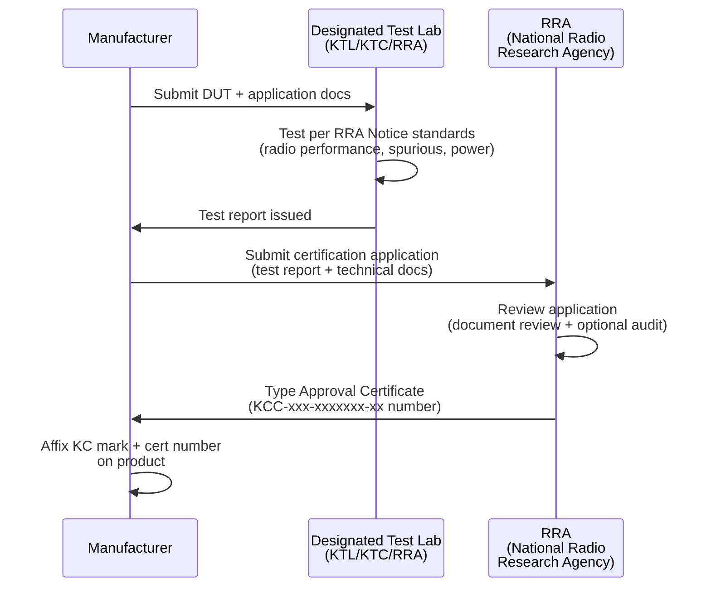

# Korea Market Access — KC Mark & KCC Radio Certification

**Topic:** Korean Regulatory Compliance for Electronics — KC Safety, KCC Radio, EMC  
**Standards:** Radio Waves Act, Electrical Appliances Safety Control Act, KC 62368-1, KN 32/35  
**SDO:** MSIT (Ministry of Science and ICT), KCC (Korea Communications Commission), KATS (Korean Agency for Technology and Standards), RRA (National Radio Research Agency)  
**Audience:** Regulatory compliance engineers, product certification managers, Korea market access specialists  
**Prerequisites:** Basic understanding of CE/FCC certification, RF and EMC fundamentals

---

## Chapter 1 — Historical Context & Origin Story

### 1.1 Timeline

| Year | Event |
|------|-------|
| 1961 | Radio Waves Act established (Korea telecom regulation foundation) |
| 1981 | Korea Communications Commission (KCC) predecessor established |
| 1997 | EMC certification introduced (KETI as test body) |
| 2000 | KCC mark for radio equipment established |
| 2009 | KC (Korea Certification) mark unified — replaces 13+ individual marks |
| 2011 | KC mark becomes single national compliance mark (safety + EMC + radio combined branding) |
| 2013 | MSIT (Ministry of Science and ICT) reorganization |
| 2014 | RRA (National Radio Research Agency) handles radio conformity assessment |
| 2017 | KC 62368-1 adopted (replacing KC 60950-1) |
| 2019 | 5G spectrum allocated (3.5 GHz + 28 GHz) |
| 2020 | Wi-Fi 6 certifications streamlined |
| 2022 | IoT device security requirements introduced |
| 2023 | Wi-Fi 6E (6 GHz) approved for Korea market |
| 2024 | Updated Radio Waves Act — simplified procedures for low-power devices |

### 1.2 Korea Certification Bodies

| Organization | Role | Scope |
|-------------|------|-------|
| MSIT | Ministry — policy and regulation for ICT | Radio spectrum, telecom policy |
| RRA (National Radio Research Agency) | Radio conformity assessment body | Tests + certifies radio equipment |
| KTC (Korea Testing Certification) | Testing + certification body | EMC, safety, radio testing |
| KTL (Korea Testing Laboratory) | Government testing lab | EMC, safety, radio |
| KETI (Korea Electronics Technology Institute) | Testing body | EMC, safety |
| KATS (Korean Agency for Technology and Standards) | National standards body | KS (Korean Standards) |

---

## Chapter 2 — Standard Architecture & Structure

### 2.1 Korea Certification Framework

```mermaid
graph TB
    PRODUCT[Electronic Product<br/>for Korea Market]
    
    PRODUCT --> Q1{Contains radio<br/>transmitter/receiver?}
    Q1 -->|"Yes"| KCC_CERT[KCC Certification<br/>(Radio Equipment)<br/>Type Approval or Registration]
    Q1 -->|"No"| NO_KCC[No radio cert needed]
    
    PRODUCT --> Q2{Electrical/Electronic<br/>product?}
    Q2 -->|"Yes"| KC_EMC[KC (EMC)<br/>Conducted + Radiated<br/>Emissions + Immunity]
    
    PRODUCT --> Q3{Safety-relevant?<br/>(AC-powered, battery)}
    Q3 -->|"Yes"| KC_SAFETY[KC (Safety)<br/>Electrical safety<br/>KC 62368-1 or KC 60335]
    Q3 -->|"Battery product"| KC_BATTERY[KC (Battery Safety)<br/>KC 62133-2]
    
    PRODUCT --> Q4{Telecom terminal?}
    Q4 -->|"Yes"| KC_TELECOM[KC (Telecom)<br/>Terminal Equipment<br/>Conformity Assessment]
```

### 2.2 Radio Equipment Categories (KCC)

| Category | Korean Term | Process | Examples |
|----------|-------------|---------|----------|
| Type Approval (적합인증) | Jeokap Injeung | Full certification by RRA or recognized body | Wi-Fi AP, cellular modem, high-power TX |
| Registration (적합등록) | Jeokap Deungrok | Simplified registration (test report + filing) | Low-power BLE, NFC, SRD |
| Designation (지정) | Designated | Exempt from individual certification | Extremely low-power (ELP) devices |

### 2.3 KC Mark Categories

| KC Category | Scope | Certification Type |
|-------------|-------|-------------------|
| KC (Radio) | Radio transmitting/receiving equipment | Type Approval or Registration |
| KC (EMC) | Electromagnetic compatibility | Registration (mandatory for IT equipment) |
| KC (Safety) | Electrical safety (AC-powered) | Certification (testing by CAB) |
| KC (Battery) | Rechargeable batteries | Certification (KC 62133) |
| KC (Telecom) | Telecom terminal equipment | Registration |

---

## Chapter 3 — Technical Deep Dive

### 3.1 Radio Technical Standards (Korea)

| Technology | Korean Standard | Frequency | Max Power | Notes |
|-----------|----------------|-----------|-----------|-------|
| Wi-Fi 2.4 GHz | RRA Notice 2020-5 | 2400-2483.5 MHz | 100 mW EIRP (20 dBm) | Same as EU |
| Wi-Fi 5 GHz | RRA Notice 2020-5 | 5150-5350, 5470-5725 MHz | 200 mW (indoor), 1 W (outdoor w/DFS) | DFS required in W53/W56 |
| Wi-Fi 6E (6 GHz) | RRA Notice 2023-x | 5925-6425 MHz | 200 mW EIRP (LPI indoor) | Approved 2023 |
| Bluetooth | RRA Notice 2020-5 | 2400-2483.5 MHz | 100 mW EIRP | Adaptive FH required |
| BLE | RRA Notice 2020-5 | 2400-2483.5 MHz | 10 mW EIRP typical | Low power → Registration category |
| NFC | RRA Notice 2020-5 | 13.56 MHz | Field strength limits | Registration category |
| LoRa (Korea) | RRA Notice 2020-5 | 920-925 MHz (KR band) | 10 mW or 50 mW w/LBT | Korea-specific sub-GHz band |
| 5G NR Sub-6 | RRA + operator | n78 (3.5 GHz), n79 (4.5 GHz) | Per 3GPP spec | Carrier-specific |
| 5G NR mmWave | RRA + operator | n257 (28 GHz) | Per 3GPP spec | Limited deployment |

### 3.2 EMC Requirements (KN 32 / KN 35)

**Korea adopts CISPR 32 and CISPR 35 as KN 32 and KN 35:**

| Test | Standard | Limits | Notes |
|------|----------|--------|-------|
| Conducted emissions | KN 32 (= CISPR 32) | Same as CISPR 32 Class B | Class A for industrial only |
| Radiated emissions | KN 32 | Same as CISPR 32 Class B | 3m or 10m measurement |
| ESD immunity | KN 35 (IEC 61000-4-2) | ±4 kV contact, ±8 kV air | Criterion B |
| Radiated immunity | KN 35 (IEC 61000-4-3) | 3 V/m | Criterion A |
| EFT | KN 35 (IEC 61000-4-4) | ±2 kV (power), ±1 kV (signal) | Criterion B |
| Surge | KN 35 (IEC 61000-4-5) | ±1 kV (L-N), ±2 kV (L-PE) | Criterion B |
| Conducted immunity | KN 35 (IEC 61000-4-6) | 3 Vrms | Criterion A |

**Key difference from FCC:** Korea requires BOTH emissions AND immunity testing (like EU, unlike FCC which only requires emissions).

### 3.3 Safety Standards (Korea)

| Product Category | Korean Standard | IEC Basis |
|-----------------|----------------|-----------|
| IT/AV/Telecom equipment | KC 62368-1 | IEC 62368-1 |
| Household appliances | KC 60335-1 + part-2 | IEC 60335-1 |
| AC adapters/chargers | KC 62368-1 | IEC 62368-1 |
| Lithium batteries | KC 62133-2 | IEC 62133-2 |
| Power banks | KC 62133-2 + additional | IEC 62133-2 |
| LED lighting | KC 61347 | IEC 61347 |

### 3.4 SAR Requirements (Korea)

| Parameter | Korea Value | Comparison |
|-----------|-------------|-----------|
| SAR limit | 1.6 W/kg | Same as FCC (1 gram averaging) |
| Averaging mass | 1 gram | Same as FCC |
| Measurement standard | KS C 9900 | Based on IEC 62209 |
| Test body | RRA | Also: KTL, KTC |
| Required for | All portable radio devices (<20 cm from body) | Same as FCC |
| Limit (limbs) | 4.0 W/kg (10g) | Additional limb consideration |

**Note:** Korea follows FCC SAR methodology (1.6 W/kg, 1g) — NOT ICNIRP (2.0 W/kg, 10g). This is significant: same as US/Canada/India.

---

## Chapter 4 — Implementation Guide

### 4.1 KCC Radio Type Approval Process



### 4.2 Required Documentation (Radio)

| Document | Description |
|---------|-------------|
| Application form | Standard RRA application (Korean or bilingual) |
| Technical specifications | Frequency, power, modulation, bandwidth, antenna |
| Block diagram | RF chain from baseband to antenna connector |
| Circuit schematic | RF section (at minimum) |
| Test report | From designated test lab |
| Photos | External + internal + label |
| User manual | Korean language (can be separate sheet) |
| Authorization letter | If filing through agent (Korean representative) |
| Module certification | If using pre-certified module (host device simplified) |

### 4.3 KC EMC Registration Process

| Step | Action | Timeline |
|------|--------|----------|
| 1 | Test product to KN 32 + KN 35 at designated lab | 3-5 days |
| 2 | Lab issues test report (compliant results) | — |
| 3 | Submit registration application to CAB (KTL/KTC/KETI) | 1-2 days |
| 4 | CAB reviews and issues KC EMC Registration | 1-2 weeks |
| 5 | Affix KC mark on product | — |
| 6 | Maintain registration (notify changes) | Ongoing |

### 4.4 KC Safety Certification Process

| Step | Action | Timeline |
|------|--------|----------|
| 1 | Submit product to CAB (KTC/KTL) for safety testing | — |
| 2 | Test per KC 62368-1 (or applicable standard) | 4-6 weeks |
| 3 | Factory inspection (initial — for certain categories) | 1-2 days |
| 4 | CAB issues KC Safety Certificate | 1-2 weeks after test pass |
| 5 | Affix KC safety mark on product | — |
| 6 | Annual follow-up (factory audit for some categories) | Annually |

---

## Chapter 5 — Certification & Compliance

### 5.1 Designated Test Laboratories

| Lab | Capabilities | Notes |
|-----|-------------|-------|
| RRA (National Radio Research Agency) | Radio, EMC, SAR | Government lab — definitive |
| KTL (Korea Testing Laboratory) | Radio, EMC, Safety, Battery | Largest government test lab |
| KTC (Korea Testing Certification) | Radio, EMC, Safety | Both testing and certification |
| KETI (Korea Electronics Technology Institute) | EMC, Safety | Research institute + testing |
| TÜV Rheinland Korea | EMC, Safety | International CB support |
| UL Korea | Safety, EMC | International presence |
| Intertek Korea | EMC, Safety, Radio | Full-service |

### 5.2 Certification Numbers Format

| Certification Type | Number Format | Example |
|-------------------|---------------|---------|
| KCC Radio (Type Approval) | KCC-xxx-yyyyyyyyyy-zz | KCC-CRM-SEC-A12345B-00 |
| KC EMC Registration | R-R-xxx-yyyyyyyy | R-R-KTC-A12345 |
| KC Safety | SU-R-xxx-yyyyyy | SU-R-KTC-B67890 |

### 5.3 Validity and Maintenance

| Aspect | Radio (KCC) | EMC (KC) | Safety (KC) |
|--------|-------------|----------|-------------|
| Validity period | Permanent (unless standard changes) | Permanent | Permanent |
| Change notification | Required for any RF change | Required for significant change | Required |
| Re-certification triggers | New frequency, power increase, antenna change | Hardware change affecting EMC | Safety-critical change |
| Factory audit | Not standard (may be requested) | Not standard | Initial + periodic for some |
| Annual fee | None | None | None |
| Penalty for non-compliance | Product seizure + fine (up to ₩30M) | Product recall + fine | Product ban + fine |

---

## Chapter 6 — Regional Variants & Comparisons

### 6.1 Korea vs. Major Markets

| Aspect | Korea (KC/KCC) | Japan (MIC/VCCI/PSE) | EU (CE) | US (FCC) |
|--------|---------------|---------------------|---------|----------|
| Radio mark | KC (KCC cert#) | 技適 (Giteki) | CE (RED) | FCC ID |
| Radio body | RRA | TELEC (RCB) | Self-assess or NB | FCC (TCB) |
| EMC mandatory? | Yes | No (VCCI voluntary) | Yes | Emissions only |
| Immunity testing? | Yes (KN 35) | No | Yes (EN 55035) | No |
| Safety mark | KC | PSE | CE | UL/ETL (voluntary) |
| SAR limit | 1.6 W/kg (1g) | 2.0 W/kg (10g) | 2.0 W/kg (10g) | 1.6 W/kg (1g) |
| In-country testing required? | Preferred (not strict for radio) | No | No | No |
| Korean language required? | Yes (manual + labels) | N/A | N/A | N/A |
| Local representative? | Yes (Korean entity) | Yes (JIR) | Yes (EU AR) | No (but US agent for correspondence) |
| Typical timeline | 4-8 weeks | 4-8 weeks | 6-10 weeks | 4-6 weeks |

### 6.2 Korea Sub-GHz Comparison

| Parameter | Korea (920 MHz) | Japan (920 MHz) | EU (868 MHz) | US (915 MHz) |
|-----------|----------------|----------------|-------------|-------------|
| Frequency | 917-923.5 MHz | 920.5-928.1 MHz | 863-870 MHz | 902-928 MHz |
| Max power | 10 mW (no LBT), 50 mW (LBT) | 20 mW (no LBT), 250 mW (LBT) | 25 mW ERP | 1 W (FHSS) |
| Duty cycle | Required (if no LBT) | Required (if no LBT) | ≤1% (or LBT) | No duty cycle (FHSS exempt) |
| Standard | RRA Notice 2020-5 | ARIB STD-T108 | EN 300 220 | FCC Part 15.247 |
| Applications | LoRa, IoT sensors | Wi-SUN, LoRa | LoRa, Sigfox, Z-Wave | LoRa, proprietary |

---

## Chapter 7 — Comparison with Competing Certification Schemes

| Dimension | Korea (KC) | China (CCC) | Taiwan (NCC) | India (BIS/WPC) |
|-----------|-----------|-------------|--------------|----------------|
| Unified mark | KC (single mark, multiple categories) | CCC (safety), SRRC (radio) | NCC (radio + telecom) | BIS (safety), WPC (radio) |
| Radio body | RRA | SRRC/MIIT | NCC | WPC |
| Safety body | KTL/KTC | CCC labs (CQC) | BSMI | BIS |
| Foreign test reports accepted? | Some (mutual recognition with select labs) | CB scheme for safety; radio must be in-country | Yes (accredited labs) | Limited (BIS usually requires in-India test) |
| In-country representative | Korean Authorized Representative | Chinese entity (mandatory) | Taiwan entity | Indian entity |
| E-labeling allowed? | Yes (electronic display of marks) | Under development | Yes | Under development |
| Cost (typical product) | $10,000-$25,000 | $10,000-$30,000 | $8,000-$15,000 | $8,000-$20,000 |
| Timeline | 4-8 weeks | 6-12 weeks | 4-6 weeks | 6-12 weeks |

---

## Chapter 8 — Mermaid Architecture Diagrams

### 8.1 Complete Korea Compliance Flow

```mermaid
graph TB
    START[Product for Korean Market]
    
    START --> ANALYZE[Analyze Product:<br/>Radio? EMC? Safety? Battery?]
    
    ANALYZE --> RADIO{Has radio<br/>transmitter?}
    RADIO -->|"Yes"| RADIO_PATH[KCC Radio Certification]
    
    ANALYZE --> EMC_REQ{IT/Electronic<br/>product?}
    EMC_REQ -->|"Yes"| EMC_PATH[KC EMC Registration<br/>(KN 32 + KN 35)]
    
    ANALYZE --> SAFETY_REQ{AC-powered<br/>or battery?}
    SAFETY_REQ -->|"AC-powered"| SAFETY_PATH[KC Safety Certification<br/>(KC 62368-1)]
    SAFETY_REQ -->|"Li-ion battery"| BATT_PATH[KC Battery Cert<br/>(KC 62133-2)]
    
    RADIO_PATH --> RADIO_TYPE{Equipment<br/>category?}
    RADIO_TYPE -->|"High power/<br/>infrastructure"| TYPE_APPROVE[Type Approval<br/>(적합인증)<br/>Full RRA review]
    RADIO_TYPE -->|"Low power/<br/>consumer"| REGISTER[Registration<br/>(적합등록)<br/>Simplified]
    
    TYPE_APPROVE --> KC_MARK[Affix KC Mark<br/>+ Certification Numbers]
    REGISTER --> KC_MARK
    EMC_PATH --> KC_MARK
    SAFETY_PATH --> KC_MARK
    BATT_PATH --> KC_MARK
    
    KC_MARK --> LAUNCH[Launch in Korea<br/>Korean manual + labels<br/>Korean representative]
```

### 8.2 KC Mark Label Layout

```mermaid
graph TB
    subgraph "Product Label (Korea)"
        KC_LOGO["KC" logo mark]
        RADIO_NUM[KCC Radio:<br/>KCC-CRM-SEC-A12345-00]
        EMC_NUM[KC EMC:<br/>R-R-KTC-B67890]
        SAFETY_NUM[KC Safety:<br/>SU-R-KTC-C11111]
        INFO[Product Information:<br/>• Model: ABC-100K<br/>• Manufacturer<br/>• Rated: 100-240V~, 50/60Hz<br/>• Made in [country]]
        KOREAN_REP[Korean Representative:<br/>한국대리인: [Company name]<br/>Address in Korean]
    end
```

---

## Chapter 9 — Case Studies

### 9.1 Bluetooth Speaker — KC Certification

| Aspect | Detail |
|--------|--------|
| Product | Portable Bluetooth speaker (BT 5.3, built-in Li-ion battery, USB-C charging) |
| Certifications needed | KCC Radio (BLE/BT), KC EMC (KN 32/35), KC Battery (KC 62133-2) |
| No PSE/Safety needed | Battery-powered only (no AC adapter in Korea package) |
| KCC Radio | Registration category (BLE low power <100 mW) — simplified process |
| KC EMC | Conducted + radiated emissions (KN 32 Class B) + immunity (KN 35 full suite) |
| KC Battery | Li-ion cell tested to KC 62133-2 (cell + pack level) |
| Testing lab | KTC (Korea Testing Certification) — all three certifications in one lab |
| Timeline | 4 weeks (radio: 1 week, EMC: 1 week, battery: 2 weeks) |
| Cost | Radio: ₩2,000,000 ($1,500); EMC: ₩3,000,000 ($2,200); Battery: ₩4,000,000 ($3,000) |
| Total | ₩9,000,000 (~$6,700) + Korean representative retainer |
| Korean language | Manual translated; product label in Korean; certification marks |

### 9.2 Wi-Fi 6 Router — Full KC Compliance

| Aspect | Detail |
|--------|--------|
| Product | Tri-band Wi-Fi 6 router (2.4 + 5 GHz + 6 GHz, with Ethernet + USB) |
| KCC Radio | Type Approval (higher power Wi-Fi AP category) |
| Standards | RRA Notice for 2.4 GHz (OFDM), 5 GHz (DFS required), 6 GHz (LPI) |
| SAR? | No — router is not portable (installed >20 cm from body typically) |
| KC EMC | KN 32 Class B (emissions) + KN 35 (immunity) — required |
| KC Safety | KC 62368-1 (AC-powered router with internal power supply) |
| Challenge | 6 GHz certification — relatively new in Korea (2023 approved) |
| DFS testing | Required for 5 GHz W53/W56 bands — Korea uses same DFS as EU/Japan |
| Timeline | Radio (3 bands): 6 weeks; EMC: 2 weeks; Safety: 4 weeks. Total: 8 weeks (parallel) |
| Cost | Radio: ₩15,000,000 ($11,000); EMC: ₩4,000,000 ($3,000); Safety: ₩6,000,000 ($4,500) |
| Total | ₩25,000,000 (~$18,500) |
| Lesson | 6 GHz Korea = same as EU (LPI only); firmware must be region-locked to Korean domain |

---

## Chapter 10 — Future Evolution & Industry Trends

| Trend | Timeline | Description |
|-------|----------|-------------|
| Wi-Fi 7 certification | 2025 | RRA updating standards for 320 MHz channels, MLO |
| 6 GHz outdoor expansion | 2025-2026 | Korea studying outdoor 6 GHz (following US AFC model) |
| IoT cybersecurity mandatory | 2025+ | MSIT developing mandatory security requirements (like EU RED Art 3.3) |
| Mutual recognition expansion | Ongoing | Korea-EU, Korea-US MRA for test reports (reduce duplicate testing) |
| E-labeling | 2024+ | Electronic label display (screen-based certification mark) gaining acceptance |
| Battery safety tightening | Now | Increased KC 62133 requirements after e-scooter/EV fire incidents |
| AI/ML device certification | Emerging | How to certify devices with adaptive RF behavior |
| 5G mmWave consumer | 2025+ | More consumer devices at 28 GHz requiring certification |
| Green certification | Growing | Eco-label requirements alongside KC technical certification |
| Simplified foreign access | Ongoing | Reducing barriers for international manufacturers |

---

## Chapter 11 — Interview Questions & Career Guide

### Tier 1: Entry-Level

**Q1:** What certifications are needed to sell a Wi-Fi-enabled smart watch in Korea?  
**A:** (1) **KCC Radio Certification:** Wi-Fi (2.4/5 GHz) + BLE → Type Approval or Registration per RRA Notice. SAR testing required (portable device <20 cm from body) — Korea limit: 1.6 W/kg (1g) — same as FCC. (2) **KC EMC Registration:** KN 32 (emissions — conducted + radiated) + KN 35 (immunity — ESD, radiated, EFT, surge, conducted). (3) **KC Battery Safety:** Built-in lithium battery → KC 62133-2 certification. Both cell-level and pack-level testing required. (4) **No KC Safety (AC):** If no AC charger included in Korean package, device itself doesn't need KC safety. If AC charger is included: charger needs separate KC safety certification (KC 62368-1). (5) **Additional:** Korean-language manual. Korean representative (authorized person in Korea). KC mark + all certification numbers on product or e-label. SAR value disclosure (Korea requires SAR information accessible to consumers).

### Tier 2: Mid-Level

**Q2:** Your product has FCC and CE certifications. What additional testing is needed specifically for Korea, and what can be reused?  
**A:** **What can potentially be reused:** (1) **Radio test data:** Korea's RRA accepts test reports from foreign labs IF: Lab is recognized by RRA (mutual recognition agreement). Test performed to equivalent standard (RRA Notice vs. ETSI/FCC similar). In practice: some parameters align (power, spurious), but Korea-specific measurements may differ. Recommendation: budget for at least partial re-test at Korean-recognized lab. (2) **EMC test data:** KN 32 = CISPR 32 (identical limits and methods). KN 35 = CISPR 35 (identical immunity levels). If EU test report (EN 55032 + EN 55035) exists from ISO 17025 accredited lab: high chance of acceptance by Korean CAB. FCC test report: emissions only (no immunity) — immunity test must be done additionally. (3) **Safety test data:** KC 62368-1 aligns with IEC 62368-1 (minor national deviations). CB test report (IEC 62368-1) is accepted by Korean CABs — avoids full re-test. Only Korean national deviations need additional evaluation. (4) **SAR:** If FCC SAR report exists (1.6 W/kg, 1g): DIRECTLY reusable for Korea (same limit and averaging). If only EU SAR (2.0 W/kg, 10g): NOT sufficient — Korea requires 1g averaging. New SAR test needed using FCC methodology. **What ALWAYS requires Korea-specific action:** (a) Korean Representative appointment (mandatory — must be Korean entity). (b) Korean-language documentation (manual, quick start guide). (c) Certification application filing (through Korean CAB or representative). (d) Product labeling update (KC mark + Korean certification numbers). (e) Registration fees to RRA/CAB. **Cost savings estimate:** Full Korea certification from scratch: $15,000-$25,000. With FCC+CE reuse: $8,000-$15,000 (reduced testing, mainly administrative + partial re-test). **Timeline savings:** From scratch: 6-8 weeks. With reuse: 3-5 weeks.

### Tier 3: Senior

**Q3:** Your company is launching a 5G FWA (Fixed Wireless Access) CPE device in Korea with sub-6 GHz and mmWave bands. Design the complete certification strategy covering all regulatory requirements.  
**A:** **Product:** 5G FWA CPE (Customer Premises Equipment) — indoor/outdoor. Radios: 5G NR n78 (3.5 GHz), 5G NR n257 (28 GHz), Wi-Fi 6E (2.4/5/6 GHz tri-band), BLE 5.3. Power: AC-powered (internal PSU, 100-240V). **1. KCC Radio Certification (Type Approval — 적합인증):** (a) Wi-Fi (2.4/5/6 GHz): Standard RRA process per RRA Notice 2020-5 (updated for 6 GHz). Type Approval category (AP with higher power). DFS testing for 5 GHz W53/W56. 6 GHz: LPI (indoor) — 200 mW EIRP max. Timeline: 4-6 weeks. (b) BLE 5.3: Registration category (low power). Simplified process — 1-2 weeks. (c) 5G NR Sub-6 (n78: 3.5 GHz): **Critical: requires Korean mobile operator involvement.** Korea has specific 5G spectrum allocation (SK Telecom, KT, LG U+). FWA device must be certified for specific operator's network. RRA certification for radio parameters + operator network conformance. RF conformance testing per 3GPP TS 38.521. Timeline: 8-12 weeks (operator testing cycle dependent). (d) 5G NR mmWave (n257: 28 GHz): Same process as Sub-6 but additional: Beam management testing (5G mmWave beam steering). Power density (RF exposure) assessment for mmWave. OTA testing required (28 GHz — no conducted port). Timeline: 8-12 weeks. **2. RF Exposure (SAR/Power Density):** (a) Wi-Fi + BLE (<6 GHz): If device installed >20 cm from people (wall/window mount): MPE calculation (no SAR test). If possible use within 20 cm: SAR test required (1.6 W/kg, 1g). Design: ensure mounting bracket positions device ≥20 cm from persons → MPE assessment only. (b) 5G mmWave (28 GHz): Power density assessment per RRA guidelines. 10 W/m² limit (general public). Beamforming: worst-case beam direction assessment. **3. KC EMC:** KN 32 (emissions) + KN 35 (immunity) — full Class B. Challenge: 5G mmWave at 28 GHz → above 1 GHz emissions assessment. AC-powered with multiple high-speed radios → conducted emissions from SMPS. Testing: full EMC campaign (conducted + radiated emissions + immunity suite). Timeline: 2-3 weeks. **4. KC Safety:** KC 62368-1 — AC-powered IT/telecom equipment. Tests: dielectric strength, leakage current, temperature rise, abnormal operation. If outdoor-rated: additional environmental tests (ingress protection per IP rating). CB test report reusable for most requirements. Timeline: 4-6 weeks. **5. Korean Operator Certification (beyond RRA):** Each Korean operator has own device certification process: SK Telecom: SKT device certification program. KT: KT device approval. LG U+: LGU+ device certification. Process: submit device → operator tests interoperability → approval. This is IN ADDITION to RRA radio certification. Timeline: 6-8 weeks per operator (after RRA cert). **6. Strategy optimization:** (a) Use pre-certified 5G modem module (Qualcomm SDX75, MediaTek, Samsung Exynos): If module already has Korean Type Approval → host device certification simplified. Host device gets "recognition of certification" (인정) based on module cert. Only need to certify antenna system + host integration testing. (b) Parallel certification streams:
```
Week 1-6:  Radio (Wi-Fi/BLE) certification — at KTL/KTC
Week 1-6:  KC Safety testing — at KTC (parallel)  
Week 3-8:  EMC testing — at KTL (parallel)
Week 1-12: 5G radio certification — at RRA (longest path)
Week 8-16: Operator certification — after RRA cert
```
(c) Critical path: 5G certification + operator approval = 12-16 weeks. (d) Pre-engagement: start operator discussions BEFORE formal certification (get early feedback). **7. Documentation and labeling:** KC mark (single mark) with all certification numbers. Korean-language manual (installation guide for FWA device). RF exposure information (SAR/MPE disclosure). Korean representative: appointed company responsible for compliance. **8. Cost estimate:** Wi-Fi/BLE radio cert: ₩8,000,000 ($6,000). 5G Sub-6 radio cert: ₩15,000,000 ($11,000). 5G mmWave radio cert: ₩20,000,000 ($15,000). KC EMC: ₩5,000,000 ($3,700). KC Safety: ₩7,000,000 ($5,200). RF exposure assessment: ₩5,000,000 ($3,700). Operator certification (per operator): ₩10,000,000 ($7,400) × 3 operators. Korean representative (annual): ₩5,000,000 ($3,700/year). **Total (first year): ₩95,000,000 (~$70,000) for full Korean market access.** **9. Risk factors:** 5G mmWave: limited testing infrastructure in Korea for 28 GHz device certification. Operator timeline: depends on operator's testing schedule and priorities. Multi-operator: need approval from each carrier → long overall timeline. mmWave OTA test: specialized chambers required (limited availability).

---

## Chapter 12 — Cheat Sheet & Quick Reference

### Korea Certification Types

```
KCC Radio (적합인증 Type Approval): Full certification by RRA
  → High-power devices, cellular, Wi-Fi APs
  → RRA/KTL/KTC designated labs

KCC Radio (적합등록 Registration): Simplified filing
  → Low-power BLE, NFC, SRD
  → Test report + registration application

KC EMC: Mandatory for IT/electronic equipment
  → KN 32 (emissions) + KN 35 (immunity)
  → Registration through CAB (KTL/KTC/KETI)

KC Safety: Mandatory for AC-powered equipment
  → KC 62368-1 (IT/AV) or KC 60335 (appliances)
  → Certification through CAB

KC Battery: Mandatory for lithium batteries
  → KC 62133-2
  → Cell + pack level testing
```

### Key Korean Standards

```
Standard         Equivalent      Application
KN 32            CISPR 32        EMC emissions (multimedia)
KN 35            CISPR 35        EMC immunity (multimedia)
KC 62368-1       IEC 62368-1     Safety (IT/AV/telecom)
KC 62133-2       IEC 62133-2     Battery safety (lithium)
KC 60335-1       IEC 60335-1     Household appliance safety
KS C 9900        IEC 62209       SAR measurement
RRA Notice 2020-5 Various        Radio equipment requirements
```

### Korea SAR

```
Limit: 1.6 W/kg (same as FCC)
Averaging: 1 gram (same as FCC)  
Required for: portable devices (<20 cm from body)
Standard: KS C 9900
FCC SAR report: REUSABLE directly for Korea
EU SAR report (10g): NOT reusable — different averaging
```

### Korea Market Access Checklist

```
□ KCC Radio certification (if radio transmitter present)
□ KC EMC registration (KN 32 emissions + KN 35 immunity)
□ KC Safety certification (if AC-powered)
□ KC Battery certification (if lithium battery)
□ SAR assessment (if portable radio device)
□ Korean Authorized Representative appointed
□ Korean-language user manual
□ Korean labeling (KC mark + cert numbers)
□ Registration fees paid
□ Product listed in Korean certification database
```

---

*End of Document — 07_Korea_KC_KCC.md*
