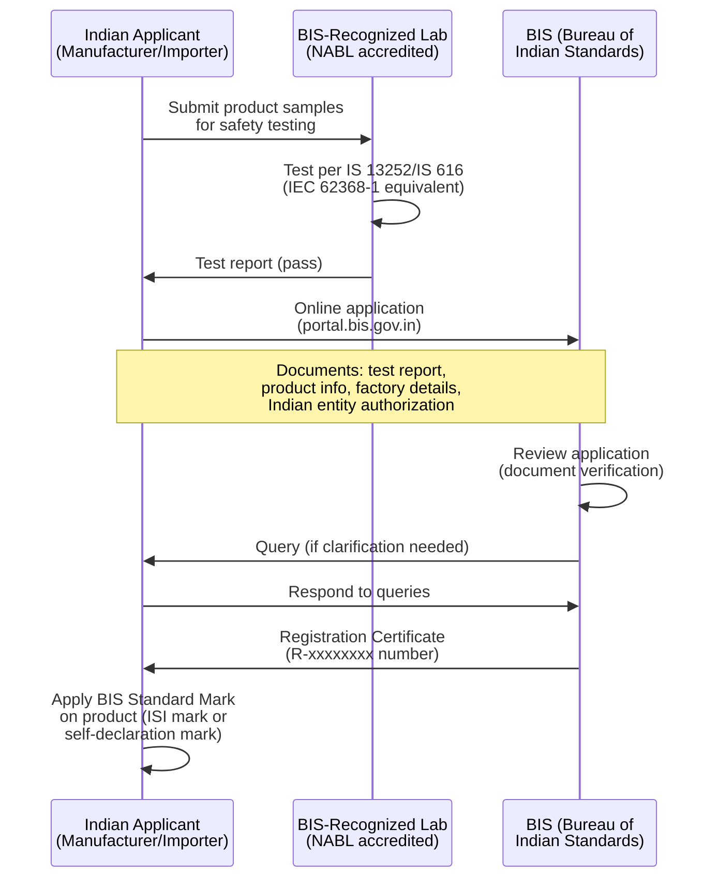

# India Market Access — BIS CRO, WPC Type Approval & TRAI

**Topic:** Indian Regulatory Compliance for Electronics — BIS Compulsory Registration, WPC Radio, TRAI Telecom  
**Standards:** Electronics and IT Goods (CRO) Order 2012+, WPC Radio Frequency Allocation, IS 616 (IEC 62368-1), TEC GR  
**SDO:** BIS (Bureau of Indian Standards), WPC (Wireless Planning & Coordination Wing), TRAI (Telecom Regulatory Authority of India), TEC (Telecommunication Engineering Centre)  
**Audience:** Market access specialists, compliance engineers, product managers targeting Indian market  
**Prerequisites:** Basic product certification concepts, understanding of international standards framework

---

## Chapter 1 — Historical Context & Origin Story

### 1.1 Timeline

| Year | Event |
|------|-------|
| 1986 | BIS Act established (Bureau of Indian Standards) |
| 1952 | WPC (Wireless Planning & Coordination) wing established under DoT |
| 1997 | TRAI established (Telecom Regulatory Authority of India) |
| 2012 | Electronics and IT Goods (CRO) Order issued — BIS registration mandatory |
| 2013 | CRO Phase 1 — 15 product categories initially covered |
| 2014 | WPC online portal (SARAL Sanchar) launched |
| 2015 | CRO expanded — more product categories added |
| 2017 | WPC ETA (Equipment Type Approval) process streamlined |
| 2019 | BIS CRO Phase 3 — expanded to inverters, LED drivers, smart meters |
| 2020 | SAR requirement strictly enforced (1.6 W/kg limit for mobile phones) |
| 2021 | BIS CRO further expansion — IoT devices, power banks, smart watches |
| 2022 | WPC reforms — self-declaration for low-power devices introduced |
| 2023 | Mandatory Testing and Certification of Telecom Equipment (MTCTE) expanded |
| 2024 | BIS digital certification system improvements; reduced timelines |

### 1.2 Indian Regulatory Bodies

| Body | Ministry | Role |
|------|----------|------|
| BIS (Bureau of Indian Standards) | Consumer Affairs | Product safety standards + compulsory registration (CRO) |
| WPC (Wireless Planning & Coordination) | Telecom (DoT) | Radio frequency spectrum management + Equipment Type Approval |
| TRAI (Telecom Regulatory Authority of India) | Telecom | Telecom policy, tariffs, service quality (not device cert) |
| TEC (Telecommunication Engineering Centre) | Telecom (DoT) | Telecom equipment certification (MTCTE) |
| MeitY (Ministry of Electronics and IT) | MeitY | Electronics manufacturing policy, IT security |
| STQC (Standardisation Testing and Quality Certification) | MeitY | Testing and quality (including electronics labs) |

---

## Chapter 2 — Standard Architecture & Structure

### 2.1 India Regulatory Framework

```mermaid
graph TB
    PRODUCT[Electronic Product<br/>for India Market]
    
    PRODUCT --> Q1{Listed in BIS CRO<br/>Order Schedule?}
    Q1 -->|"Yes"| BIS[BIS Registration<br/>Compulsory (CRO)<br/>Safety certification]
    Q1 -->|"No"| NO_BIS[BIS not required<br/>yet for this category]
    
    PRODUCT --> Q2{Contains radio<br/>transmitter?}
    Q2 -->|"Yes"| WPC[WPC ETA Required<br/>(Equipment Type Approval)<br/>Radio spectrum authorization]
    Q2 -->|"No"| NO_WPC[No WPC needed]
    
    PRODUCT --> Q3{Telecom<br/>equipment?}
    Q3 -->|"Yes"| TEC[TEC/MTCTE<br/>Certification<br/>(Telecom terminals)]
    Q3 -->|"No"| NO_TEC[TEC not needed]
    
    PRODUCT --> Q4{Mobile phone or<br/>portable radio device?}
    Q4 -->|"Yes"| SAR[SAR Compliance<br/>1.6 W/kg (1g)<br/>Mandatory declaration]
    
    BIS --> IMPORT[Indian entity applies<br/>(manufacturer or importer)]
    WPC --> IMPORT
    TEC --> IMPORT
```

### 2.2 BIS CRO Product Categories (Key Electronics)

| CRO Category | Product | Indian Standard | IEC Basis |
|-------------|---------|----------------|-----------|
| Laptops/Notebooks | Portable computers | IS 13252 (Part 1) | IEC 62368-1 |
| Tablets | Tablet computers | IS 13252 (Part 1) | IEC 62368-1 |
| Mobile phones | Cellular phones | IS 13252 (Part 1) | IEC 62368-1 |
| Smart watches | Wearable electronics | IS 13252 (Part 1) | IEC 62368-1 |
| Power banks | Portable battery chargers | IS 13252 (Part 1) | IEC 62368-1 |
| AC adapters | External power supplies | IS 13252 (Part 1) | IEC 62368-1 |
| LED lighting | LED luminaires | IS 10322 (Part 5/Sec 5) | IEC 60598 |
| Printers | IT peripherals | IS 13252 (Part 1) | IEC 62368-1 |
| Monitors/TVs | Video displays | IS 13252 (Part 1) | IEC 62368-1 |
| Switches/Sockets | Electrical accessories | IS 1293, IS 3854 | — (Indian-specific) |
| Inverters/UPS | Power conversion | IS 16242 | — |

---

## Chapter 3 — Technical Deep Dive

### 3.1 BIS Safety Standards for Electronics

| IS Standard | IEC Equivalent | Scope |
|------------|----------------|-------|
| IS 13252 (Part 1):2010/IEC 62368-1 | IEC 62368-1 | IT/AV/Communication equipment safety |
| IS 616:2017 | IEC 62368-1 (aligned) | Safety of IT equipment (older reference) |
| IS 13252 (Part 1) Sec 1 | — | Additional Indian safety requirements |
| IS 16046 | IEC 62133-2 | Lithium battery safety (cells and packs) |
| IS 16046 (Part 2) | IEC 62133-2 | Portable lithium secondary cells |

### 3.2 WPC Frequency Allocation (India)

| Technology | Frequency | WPC Category | Indian Regulation |
|-----------|-----------|-------------|-------------------|
| Wi-Fi 2.4 GHz | 2400-2483.5 MHz | License-exempt (delicensed) | No ETA for <1W EIRP; but declaration needed |
| Wi-Fi 5 GHz (indoor) | 5150-5350 MHz | License-exempt (indoor, 200 mW) | ETA required for >200 mW |
| Wi-Fi 5 GHz (DFS) | 5470-5725 MHz | License-exempt (1 W, DFS) | ETA required |
| Wi-Fi 6E (6 GHz) | Not yet approved | Under study | As of 2024: NOT permitted in India |
| Bluetooth | 2400-2483.5 MHz | License-exempt | Self-declaration (low power) |
| BLE | 2400-2483.5 MHz | License-exempt | Self-declaration |
| NFC | 13.56 MHz | License-exempt | No ETA needed |
| LoRa (India) | 865-867 MHz (IN band) | License-exempt (delicensed) | 1 W ERP; India-specific band |
| Cellular (4G/5G) | Licensed bands | Licensed (operator) | Device: ETA required for radio parameters |
| 5G Sub-6 | n77/n78 (3.3-3.67 GHz) | Licensed | Operator-specific; ETA for device |
| 5G mmWave | n258 (26 GHz) | Licensed | Under deployment |
| 868/915 MHz | NOT ALLOCATED | Not available in India | Do NOT use EU/US sub-GHz in India |

**Critical Note:** India uses **865-867 MHz** for IoT (not 868 or 915 MHz). Products designed for EU (868) or US (915) MUST be retuned for India's 865-867 MHz band.

### 3.3 WPC ETA Categories

| Category | Process | Timeline |
|----------|---------|----------|
| Import License (for dealer/distributor) | WPC Import License application | 4-6 weeks |
| Equipment Type Approval (ETA) | Full technical evaluation by WPC | 6-12 weeks |
| Operating License | For operating radio equipment (infrastructure) | 4-8 weeks |
| Self-declaration (low-power delicensed) | Online declaration via SARAL Sanchar | 1-2 weeks |
| Experimental License | R&D / testing purposes | 4-6 weeks |

### 3.4 SAR Requirements (India)

| Parameter | India Requirement |
|-----------|------------------|
| SAR limit | 1.6 W/kg averaged over 1 gram of tissue |
| Methodology | Same as FCC (based on IEEE 1528 / IEC 62209) |
| Applies to | ALL mobile handsets and portable wireless devices |
| Declaration | SAR value must be displayed at point of sale |
| Enforcement | DoT mandates; BIS includes in CRO process |
| Testing lab | Must be accredited (NABL) or recognized international lab |
| Display requirement | SAR value on handset display (accessible in settings) |
| Penalty | Product cannot be sold if SAR exceeds limit |

### 3.5 TEC / MTCTE Requirements

| Requirement | Scope | Standard |
|-------------|-------|----------|
| MTCTE (Mandatory Testing and Certification of Telecom Equipment) | All telecom terminal equipment | TEC Generic Requirements (GR) |
| IP equipment | Routers, switches, gateways | TEC GR for IP equipment |
| VoIP phones | IP telephones | TEC GR for VoIP |
| Wi-Fi equipment | Access points, CPE | TEC GR for WLAN |
| IoT/M2M devices | Connected IoT devices | TEC GR for IoT/M2M |
| Security requirements | Cybersecurity for telecom equipment | TEC Essential Requirements |

---

## Chapter 4 — Implementation Guide

### 4.1 BIS CRO Registration Process



### 4.2 BIS CRO Required Documents

| Document | Detail |
|---------|--------|
| Application Form | Online via BIS portal (portal.bis.gov.in) |
| Test Report | From BIS-recognized lab (NABL accredited + BIS recognized) |
| Authorization Letter | From foreign manufacturer to Indian applicant |
| Factory Details | Address, production capacity, quality system |
| Product Information | Model numbers, specifications, photos |
| Indian Applicant Details | GST registration, PAN, address proof |
| Undertaking | Legal compliance declaration |
| CB Test Report | Accepted if from IECEE CB scheme (reduces Indian testing) |
| Previous certifications | FCC/CE/UL certificates (supporting information) |

### 4.3 WPC ETA Application Process

| Step | Action | Timeline |
|------|--------|----------|
| 1 | Register on SARAL Sanchar portal (saralsanchar.gov.in) | 1 day |
| 2 | Apply for Equipment Type Approval (ETA) online | — |
| 3 | Upload: test report, technical specs, frequency/power details | — |
| 4 | WPC technical review (frequency allocation check) | 4-8 weeks |
| 5 | WPC may request additional information or testing | 2-4 weeks |
| 6 | ETA certificate issued | — |
| 7 | Valid for 10 years (renewable) | — |

### 4.4 Key Differences: India vs. Other Markets

| Parameter | India | EU | US | Notes |
|-----------|-------|-----|-----|------|
| BIS (safety) | Mandatory registration | CE marking (self-assess) | UL voluntary | BIS is registrar-based (not self-declare) |
| Radio | WPC ETA | RED self-assess | FCC ID | WPC is government-reviewed (slower) |
| 6 GHz Wi-Fi | NOT ALLOWED (2024) | Allowed (LPI) | Allowed (LPI/SP) | Major gap — no Wi-Fi 6E in India yet |
| Sub-GHz IoT | 865-867 MHz only | 863-870 MHz | 902-928 MHz | India-specific band allocation |
| SAR | 1.6 W/kg (1g) — same as FCC | 2.0 W/kg (10g) | 1.6 W/kg (1g) | India follows FCC methodology |
| In-country testing | Preferred (BIS-recognized lab) | No requirement | No requirement | CB scheme report accepted as basis |
| Local entity | Mandatory (Indian applicant) | EU AR (if outside EU) | Not mandatory | Must be Indian registered entity |
| Timeline | 8-16 weeks (combined) | 6-10 weeks | 4-6 weeks | India generally slower |
| Language | English acceptable | Local language | English | Hindi/English both OK |

---

## Chapter 5 — Certification & Compliance

### 5.1 BIS-Recognized Test Laboratories

| Laboratory | Location | Capabilities |
|-----------|----------|-------------|
| ERTL (Electronic Regional Test Laboratory) | Multiple cities (Delhi, Mumbai, Kolkata, Bangalore) | EMC, safety, radio |
| STQC Labs | Multiple locations | Electronics testing, cybersecurity |
| TUV India | Mumbai, Bangalore | Safety, EMC (international standard) |
| UL India | Bangalore | Safety, EMC, performance |
| Intertek India | Mumbai | Safety, EMC |
| Bureau Veritas India | Multiple | Safety, EMC, radio |
| SGS India | Multiple | Safety, EMC |
| NABL-accredited private labs | Various | Must be BIS-recognized for CRO testing |

### 5.2 WPC Test Labs

| Lab | Scope |
|-----|-------|
| WPC (government lab in Delhi) | Reference lab for radio testing |
| ERTL | Radio conformance testing |
| Private labs with WPC recognition | Radio parameters testing |
| International labs (accepted) | Test reports from accredited labs accepted by WPC |

### 5.3 Fees and Validity

| Certification | Fee (approximate) | Validity |
|--------------|-------------------|----------|
| BIS CRO registration | ₹1,000 (application) + lab testing fees | Until standard changes or product discontinued |
| BIS CRO (per model) | ₹1,000 registration fee | Perpetual (with compliance maintenance) |
| WPC ETA | ₹5,000-₹10,000 | 10 years (renewable) |
| WPC Import License | ₹500-₹1,000 | Per shipment or annual |
| TEC/MTCTE | ₹10,000-₹50,000 | 5 years |
| Lab testing (safety) | ₹50,000-₹200,000 ($600-$2,400) | Per test report |
| Lab testing (EMC) | ₹40,000-₹150,000 ($500-$1,800) | Per test report |

---

## Chapter 6 — Regional Variants & Special Considerations

### 6.1 India-Specific Technical Requirements

| Requirement | Detail | International Equivalent |
|-------------|--------|------------------------|
| Mains voltage | 230V AC, 50 Hz (±10%) | Same as EU |
| Plug type | IS 1293 (Type D: 5A round 3-pin, Type M: 15A) | Unique to India/South Africa |
| Sub-GHz IoT band | 865-867 MHz (India-specific) | NOT same as EU 868 or US 915 |
| 6 GHz Wi-Fi | NOT PERMITTED (as of 2024) | EU/US permit 5945-6425/7125 MHz |
| SAR display | Must show SAR value in phone settings menu | Unique requirement |
| Anti-theft (IMEI) | CEIR (Central Equipment Identity Register) | Device IMEI registered |
| Charging standard | USB-C mandate under consideration (2025+) | Following EU model |

### 6.2 BIS CRO vs. CCC (China) vs. KC (Korea)

| Aspect | India (BIS CRO) | China (CCC) | Korea (KC) |
|--------|----------------|-------------|-----------|
| Scope | Electronics + electrical goods | Safety-critical products | EMC + safety + radio |
| Self-declaration possible? | No (BIS registration required) | No (third-party) | Safety: CAB; EMC: CAB; Radio: RRA |
| In-country testing? | Strongly preferred (BIS-recognized lab) | Mandatory for CCC scope | Preferred (Korean labs) |
| CB Scheme accepted? | Yes (as basis — may need supplemental) | Yes (for safety testing) | Yes (reduces re-testing) |
| Local entity required? | Yes (Indian manufacturer/importer) | Yes (Chinese entity) | Yes (Korean representative) |
| Timeline | 8-16 weeks | 8-16 weeks | 4-8 weeks |
| Enforcement | Customs check + market surveillance | Customs + CCC mark check | Customs + MSIT enforcement |

---

## Chapter 7 — Comparison of India Certification Paths

| Product Type | BIS CRO | WPC ETA | TEC/MTCTE | SAR |
|-------------|---------|---------|-----------|-----|
| Smartphone | ✅ Required | ✅ Required (cellular + Wi-Fi + BT) | ✅ Required (telecom terminal) | ✅ Required (portable) |
| Laptop (Wi-Fi) | ✅ Required | ✅ Required (Wi-Fi + BT) | Optional | ✅ Required (portable) |
| Wi-Fi Router | ✅ Required | ✅ Required (Wi-Fi) | ✅ Required (network equipment) | ❌ Not portable (>20cm) |
| Bluetooth Speaker | ✅ Required | Self-declaration (BT low power) | ❌ Not telecom | ❌ Not portable radio concern |
| Power Bank | ✅ Required | ❌ No radio | ❌ Not telecom | ❌ No radio |
| AC Adapter | ✅ Required | ❌ No radio | ❌ Not telecom | ❌ No radio |
| IoT Sensor (LoRa) | Depends on category | ✅ Required (865 MHz) | ✅ (if network-connected) | Depends on body proximity |
| Smart TV | ✅ Required | ✅ (if Wi-Fi built-in) | Optional | ❌ Not portable |

---

## Chapter 8 — Mermaid Architecture Diagrams

### 8.1 India Market Access Decision Tree

```mermaid
graph TB
    PRODUCT[Product for India]
    
    PRODUCT --> CHECK_CRO{Listed in<br/>BIS CRO Order?}
    CHECK_CRO -->|"Yes"| BIS_PROCESS[BIS CRO Registration<br/>• Safety testing (IS 13252)<br/>• BIS-recognized lab<br/>• Online application<br/>• R-number issued]
    CHECK_CRO -->|"No"| BIS_SKIP[BIS CRO not<br/>required YET<br/>(check future updates)]
    
    PRODUCT --> CHECK_RADIO{Has radio<br/>transmitter?}
    CHECK_RADIO -->|"Yes, high power<br/>(Wi-Fi AP, cellular)"| WPC_ETA[WPC ETA<br/>Equipment Type Approval<br/>• SARAL Sanchar portal<br/>• Technical review<br/>• 6-12 weeks]
    CHECK_RADIO -->|"Yes, low power<br/>(BLE, NFC)"| WPC_SELF[WPC Self-Declaration<br/>• Online filing<br/>• 1-2 weeks]
    CHECK_RADIO -->|"No"| WPC_SKIP[WPC not required]
    
    PRODUCT --> CHECK_TELECOM{Telecom<br/>terminal equipment?}
    CHECK_TELECOM -->|"Yes"| TEC_MTCTE[TEC MTCTE<br/>• Telecom certification<br/>• TEC-recognized lab<br/>• Essential requirements]
    CHECK_TELECOM -->|"No"| TEC_SKIP[TEC not required]
    
    PRODUCT --> CHECK_SAR{Portable radio<br/>device <20cm<br/>from body?}
    CHECK_SAR -->|"Yes"| SAR_TEST[SAR Testing<br/>• 1.6 W/kg (1g)<br/>• Display in device settings<br/>• SAR lab certification]
    
    BIS_PROCESS --> LAUNCH[India Market Launch<br/>• Indian applicant entity<br/>• Customs clearance<br/>• Compliance marks]
    WPC_ETA --> LAUNCH
    WPC_SELF --> LAUNCH
    TEC_MTCTE --> LAUNCH
    SAR_TEST --> LAUNCH
```

### 8.2 India RF Spectrum Map for Consumer Electronics

```mermaid
graph LR
    subgraph "India Delicensed Bands (No License Needed)"
        BAND1[2.4 GHz<br/>2400-2483.5 MHz<br/>Wi-Fi, BT, Zigbee<br/>≤4W EIRP outdoor<br/>≤1W EIRP indoor]
        BAND2[5 GHz Indoor<br/>5150-5350 MHz<br/>≤200 mW<br/>Indoor only]
        BAND3[5 GHz DFS<br/>5470-5725 MHz<br/>≤1W EIRP<br/>DFS required]
        BAND4[865-867 MHz<br/>India IoT band<br/>≤1W ERP<br/>LoRa, IoT sensors]
        BAND5[NFC<br/>13.56 MHz<br/>Field strength<br/>limited]
    end
    
    subgraph "NOT Available in India"
        NO1[6 GHz (5925-7125)<br/>Wi-Fi 6E: NOT ALLOWED<br/>Under study]
        NO2[868 MHz (EU band)<br/>NOT allocated in India]
        NO3[915 MHz (US band)<br/>NOT allocated in India]
    end
    
    style NO1 fill:#ff9999
    style NO2 fill:#ff9999
    style NO3 fill:#ff9999
```

---

## Chapter 9 — Case Studies

### 9.1 Smartphone Launch in India — Full Compliance

| Aspect | Detail |
|--------|--------|
| Product | 5G smartphone (Sub-6: n77/n78, Wi-Fi 6, BLE 5.3, NFC) |
| BIS CRO | IS 13252 (Part 1) — safety testing at BIS-recognized lab |
| Strategy | Use CB test report (from UL/TÜV) as basis → supplementary Indian testing |
| WPC ETA | Required for: cellular 5G (n77/n78), Wi-Fi 2.4/5 GHz, Bluetooth |
| TEC/MTCTE | Required (telecom terminal equipment — mobile handset category) |
| SAR | 1.6 W/kg (1g) — required; must display in phone settings |
| Challenge | India does NOT allow 6 GHz Wi-Fi → firmware must disable 6 GHz radio in India SKU |
| Sub-GHz | If phone has UWB or any sub-GHz → verify against India allocation |
| Timeline | BIS: 8 weeks; WPC: 10 weeks; TEC: 8 weeks. Total (parallel): 10-12 weeks |
| Cost | BIS: ₹150,000 ($1,800); WPC: ₹50,000 ($600); TEC: ₹100,000 ($1,200); Lab: ₹500,000 ($6,000) |
| Total | ~₹800,000 (~$9,600) + Indian entity overhead |
| Indian entity | Must have Indian registered company (or importer with GST registration) |
| IMEI registration | All IMEIs must be registered in CEIR database before sale |

### 9.2 IoT LoRa Gateway — India-Specific Challenges

| Aspect | Detail |
|--------|--------|
| Product | LoRa IoT gateway (865 MHz + Wi-Fi 2.4 GHz + Ethernet) |
| Critical issue | Product designed for EU (868 MHz) — CANNOT be used in India |
| India band | 865-867 MHz only (2 MHz bandwidth vs. 7 MHz in EU 863-870) |
| Power | India: 1 W ERP (vs. 25 mW ERP in EU without LBT) |
| Hardware change | LoRa radio must support IN865 frequency plan (not EU868) |
| Firmware | LoRaWAN regional parameters: IN865 (channels: 865.0625, 865.4025, 865.985 MHz) |
| WPC ETA | Required for 865 MHz LoRa transmitter |
| BIS CRO | Check if product category listed (gateway may fall under IT equipment) |
| Certification | WPC ETA: 8 weeks; BIS (if applicable): 8 weeks |
| Lesson | India sub-GHz is UNIQUE — cannot reuse EU or US IoT hardware without modification |

---

## Chapter 10 — Future Evolution & Industry Trends

| Trend | Timeline | Description |
|-------|----------|-------------|
| 6 GHz Wi-Fi (Wi-Fi 6E/7) | Under study (2025-2026?) | TRAI/WPC studying 6 GHz allocation — strong industry lobbying |
| BIS CRO scope expansion | Ongoing (annually) | More product categories being added each year |
| WPC simplification | 2024+ | Streamlined ETA for pre-certified modules (faster process) |
| MTCTE expansion | Growing | More telecom equipment categories being mandated |
| USB-C mandate | 2025-2026 | India considering USB-C mandate (following EU) |
| Cybersecurity requirements | 2025+ | MeitY working on mandatory IoT security standards |
| PLI scheme impact | Now | Production-Linked Incentive → more local manufacturing → local compliance importance |
| 5G mmWave | 2024-2026 | 26 GHz deployment → new WPC requirements for mmWave devices |
| Digital compliance certificates | Growing | Online verification of BIS/WPC certificates |
| Mutual recognition agreements | Ongoing | India-APAC MRA discussions (reduce testing duplication) |
| India semiconductor fab | 2025-2028 | Domestic chip manufacturing → local qualification standards |

---

## Chapter 11 — Interview Questions & Career Guide

### Tier 1: Entry-Level

**Q1:** What certifications are needed to sell a Wi-Fi-enabled tablet in India?  
**A:** (1) **BIS CRO Registration:** Tablets are listed in the CRO Order → IS 13252 (Part 1) safety testing mandatory. Test at BIS-recognized lab (or submit CB test report for expedited review). Registration through BIS online portal (portal.bis.gov.in). Must be filed by Indian entity (manufacturer or authorized importer with GST). (2) **WPC ETA (Equipment Type Approval):** Wi-Fi radio transmitter (2.4 + 5 GHz) → WPC ETA required. BLE transmitter → may be covered under self-declaration (low power). Apply through SARAL Sanchar portal (saralsanchar.gov.in). (3) **SAR Assessment:** Tablet is portable device (<20 cm from body) → SAR must not exceed 1.6 W/kg (1g). SAR value must be accessible to consumer (displayed in device settings). (4) **TEC/MTCTE:** If tablet has SIM card (cellular connectivity) → TEC certification required. Wi-Fi-only tablet → TEC may not be required (check current MTCTE scope). (5) **Additional:** Indian entity requirement (GST-registered importer or Indian manufacturer). Product labeling: BIS standard mark, model, ratings, manufacturer info. **Important note on 6 GHz:** If tablet supports Wi-Fi 6E (6 GHz): this feature MUST be disabled in India firmware. 6 GHz is NOT permitted in India as of 2024.

### Tier 2: Mid-Level

**Q2:** Your company wants to launch an IoT product line (smart sensors + gateway) in India. The sensors use 868 MHz LoRa. What are the regulatory challenges and how do you solve them?  
**A:** **Problem:** 868 MHz LoRa is designed for EU market. India does NOT allocate 868 MHz for IoT — this frequency is used for other services in India. **India IoT spectrum:** 865-867 MHz (IN865 band) — only 2 MHz bandwidth (vs. EU's 7 MHz at 863-870). LoRaWAN has defined "IN865" regional parameters. **Solutions:** (1) **Hardware assessment:** Check if LoRa radio IC (e.g., Semtech SX1276/SX1262) can tune to 865-867 MHz. Most LoRa ICs support 860-870 MHz → hardware likely OK. If PCB has band-pass filter tuned for 868 MHz → may need component change (shift filter center to 866 MHz). Antenna: if designed for 868 MHz → verify VSWR at 865-867 MHz (1 MHz shift — likely acceptable). (2) **Firmware changes:** LoRaWAN stack must use IN865 regional parameters: Default channels: 865.0625, 865.4025, 865.985 MHz. Channel plan: 865.0-867.0 MHz (8 channels maximum). Downlink: same band (no separate RX window band). TX power: max 27 dBm (India allows 1 W ERP — generous compared to EU's 25 mW). Data rates: SF7-SF12 (same as EU). Firmware update: change regional parameter from EU868 to IN865. (3) **Gateway changes:** Same frequency adjustment (865-867 MHz). Concentrator (SX1301/SX1302) configuration: IN865 channel plan. Number of channels: reduced (8 uplink channels vs. EU's 8). (4) **WPC ETA:** Both sensors and gateway need WPC Equipment Type Approval. Frequency: 865-867 MHz (within delicensed band — but ETA still needed for type approval). Power: ≤1 W ERP (India generous — 10× higher than EU without LBT). Submit: test report showing operation in 865-867 MHz only (not 868 MHz). (5) **BIS CRO:** Check if IoT gateway/sensor is in current CRO scope. As of 2024: IoT devices increasingly being added to CRO. If listed: IS 13252 safety testing (for gateway if AC-powered). Battery-powered sensors: may not fall under current CRO (check latest order). (6) **TEC/MTCTE:** If devices connect to Internet (via gateway to cloud): TEC requirements may apply. Check TEC GR for IoT/M2M devices (scope expanding). (7) **Cost and timeline:** Hardware modification (if needed): 2-4 weeks + re-qualification. Firmware update: 1-2 weeks (LoRaWAN stack parameter change). WPC ETA (gateway): 8-10 weeks. WPC ETA (sensor): 8-10 weeks (can be parallel). BIS (if applicable): 8 weeks (parallel). Total: ~10-12 weeks (critical path: WPC). **Key lesson:** NEVER assume EU IoT hardware works in India. Always verify India-specific frequency allocation (865-867 MHz, not 868). Budget hardware/firmware change into India localization.

### Tier 3: Senior

**Q3:** Design the complete India market entry strategy for a multinational launching a smart home ecosystem (hub + 10 sensor types + smart plugs + security camera) in India.  
**A:** **Product Portfolio:** Hub: Wi-Fi 6 (2.4/5 GHz) + Thread/Zigbee (2.4 GHz) + BLE + Ethernet. Sensors (10 types): Door/window, motion, temperature, humidity, leak, smoke, CO, light, air quality, vibration. Communication: mix of BLE, Thread (802.15.4), and proprietary 2.4 GHz. Smart plugs: AC mains (230V/10A India Type D plug), Wi-Fi connected. Security camera: Wi-Fi 2.4/5 GHz, local storage + cloud. **1. Regulatory mapping:**
| Product | BIS CRO | WPC ETA | TEC | SAR |
|---------|---------|---------|-----|-----|
| Hub | ✅ (IT equipment) | ✅ (Wi-Fi + BT/Thread) | Maybe (IoT gateway) | ❌ (not portable) |
| Sensors (battery) | Check (may not be listed yet) | Depends on radio (BLE: self-decl; Thread: ETA) | Maybe | ❌ (low power) |
| Smart plug | ✅ (electrical accessory) | ✅ (Wi-Fi) | Maybe | ❌ (not portable) |
| Camera | ✅ (IT equipment) | ✅ (Wi-Fi) | Maybe (IP camera) | ❌ (not portable) |

**2. BIS CRO strategy:** (a) Hub: IS 13252 (Part 1) — safety test for IT equipment (AC adapter powered). Use CB test report as basis → supplement with Indian deviations. (b) Smart plug: IS 1293 (Indian switches/plugs) + IS 13252 for electronics portion. CRITICAL: India plug format is Type D (5A round 3-pin) or Type M (15A). Smart plug MUST use Indian pin configuration — EU/US smart plugs incompatible. Must be re-designed for Indian socket (ISI-marked socket compatibility). (c) Camera: IS 13252 (Part 1) — IT equipment. PoE or AC-adapter powered → safety certification for power method. (d) Sensors: Battery-powered, low-voltage — may not be in current CRO scope. But: check annually (BIS adds categories frequently). Proactive: get tested anyway (demonstrates quality + future-proofs). (e) Strategy: submit all products simultaneously to reduce overall timeline. Use single BIS-recognized lab for entire portfolio (volume discount). **3. WPC strategy:** (a) Hub: Single ETA covering Wi-Fi 2.4/5 GHz + BLE + Thread (all 2.4 GHz). Thread/Zigbee: operates in ISM 2.4 GHz → same WPC category as Wi-Fi. (b) Sensors: BLE sensors: self-declaration (low power <100 mW at 2.4 GHz). Thread sensors: ETA likely required (802.15.4 — verify with WPC). Proprietary 2.4 GHz: ETA required (not standard protocol). (c) Smart plug: Wi-Fi ETA (same as any 2.4 GHz Wi-Fi device). (d) Camera: Wi-Fi ETA (2.4/5 GHz). (e) Strategy: group products by radio type — one ETA application can cover multiple models if same radio module used. Pre-certified Wi-Fi/BLE module: if using module with existing WPC ETA → host device process simplified significantly. **4. India-specific product adaptations:** (a) Smart plug: COMPLETE REDESIGN for Indian socket (IS 1293 Type D). Rating: 230V/10A/50Hz (India mains). Internal relay: rated for Indian mains conditions. (b) Hub power adapter: Indian plug (Type D) or universal adapter with India plug head. (c) ALL devices: 230V compatibility verified (products from US market may be 120V only). (d) 6 GHz: any device with Wi-Fi 6E capability → 6 GHz DISABLED in India firmware. (e) Sub-GHz: if any sensor uses sub-GHz → must be 865-867 MHz (not 868/915). If none use sub-GHz: no issue (all 2.4 GHz). **5. TEC/MTCTE consideration:** IoT devices connecting to internet: TEC scope expanding. Hub (as IoT gateway): likely needs TEC certification. Strategy: engage TEC early to clarify scope for smart home devices. TEC GR for IoT/M2M: check essential requirements (cybersecurity, interoperability). **6. Indian entity setup:** Option A: establish Indian subsidiary (PVT LTD) — full control. Option B: partner with Indian importer (authorized Indian representative). For ongoing portfolio: subsidiary recommended (multiple products, ongoing compliance). GST registration: mandatory for importing and selling in India. CEIR: if any product has IMEI (cellular) — register all IMEIs. **7. Timeline (parallel execution):**
```
Week 1-8:   BIS CRO testing for all products (one lab, batch)
Week 1-10:  WPC ETA for hub + camera + smart plug
Week 2-6:   WPC self-declaration for BLE sensors
Week 4-12:  TEC/MTCTE for hub + camera (if required)
Week 1-4:   Smart plug redesign for India socket (parallel)
Week 8-12:  India-specific firmware builds (6 GHz disabled, India regulatory domain)
```
Critical path: WPC ETA (10 weeks) or TEC (12 weeks if complex). **8. Cost estimate:** BIS testing (all products): ₹2,000,000 ($24,000). WPC ETA (4 applications): ₹400,000 ($4,800). TEC certification: ₹300,000 ($3,600). Lab testing (EMC + safety + radio): ₹3,000,000 ($36,000). Smart plug redesign: ₹500,000 ($6,000) engineering cost. Indian entity setup: ₹200,000 ($2,400) legal/registration. **Total first-year compliance: ₹6,400,000 (~$77,000).** **9. Ongoing obligations:** Annual BIS compliance (renewal not needed but inspections possible). WPC ETA valid 10 years. Product changes: notify BIS/WPC (may need re-test). Import: WPC Import License per shipment (if importing — not if manufacturing in India). India PLI opportunity: manufacturing in India gives incentive benefits + faster compliance.

---

## Chapter 12 — Cheat Sheet & Quick Reference

### India Certification Summary

```
BIS CRO: Safety registration — MANDATORY for listed products
  → IS 13252 (IEC 62368-1) for electronics
  → Indian entity (manufacturer/importer) applies
  → BIS-recognized lab testing

WPC ETA: Radio equipment — MANDATORY for transmitters
  → SARAL Sanchar portal (online application)
  → Frequency must be allocated in India
  → Valid 10 years

TEC/MTCTE: Telecom equipment — increasingly MANDATORY
  → IoT, routers, gateways, VoIP, cellular terminals
  → TEC Essential Requirements compliance

SAR: Portable radio devices — MANDATORY
  → 1.6 W/kg (1g) — same as FCC
  → Must display in device settings
```

### India Frequency Allocation (Key Bands)

```
Band             Allocation              Power            Notes
2.4 GHz          Delicensed             ≤4W EIRP (outdoor) Wi-Fi, BT, Zigbee, Thread
5.15-5.35 GHz    Delicensed (indoor)    ≤200 mW          Indoor only
5.47-5.725 GHz   Delicensed (DFS)       ≤1W EIRP         DFS required
865-867 MHz      Delicensed (IoT)       ≤1W ERP          India-specific (NOT 868/915!)
6 GHz            NOT ALLOCATED           N/A              Wi-Fi 6E NOT permitted
13.56 MHz        Delicensed (NFC)       Field strength   Very low power
```

### Critical India-Specific Notes

```
⚠️ 6 GHz (Wi-Fi 6E): NOT PERMITTED — disable in firmware for India
⚠️ 868 MHz (EU LoRa): NOT ALLOCATED — use 865-867 MHz (IN865)
⚠️ 915 MHz (US LoRa): NOT ALLOCATED — use 865-867 MHz (IN865)
⚠️ Plug type: India uses Type D/M (round 3-pin) — redesign required
⚠️ Voltage: 230V/50Hz (same as EU, NOT same as US/Japan)
⚠️ Indian entity: MANDATORY — must have Indian company to file
⚠️ SAR display: Must show SAR value in device settings menu
```

### India Market Access Checklist

```
□ Indian entity established (or importer authorized)
□ BIS CRO registration (if product in CRO schedule)
□ WPC ETA (if radio transmitter present)
□ TEC/MTCTE (if telecom equipment)
□ SAR testing + display (if portable radio)
□ India frequency compliance (865-867 MHz, no 6 GHz)
□ 230V/50Hz compatibility verified
□ India plug type (Type D/M) for AC products
□ Firmware: India regulatory domain (6 GHz disabled)
□ Labeling: BIS mark, model, ratings, manufacturer
□ IMEI registration (if cellular device)
□ User documentation (English acceptable)
```

---

*End of Document — 08_India_BIS_WPC.md*
