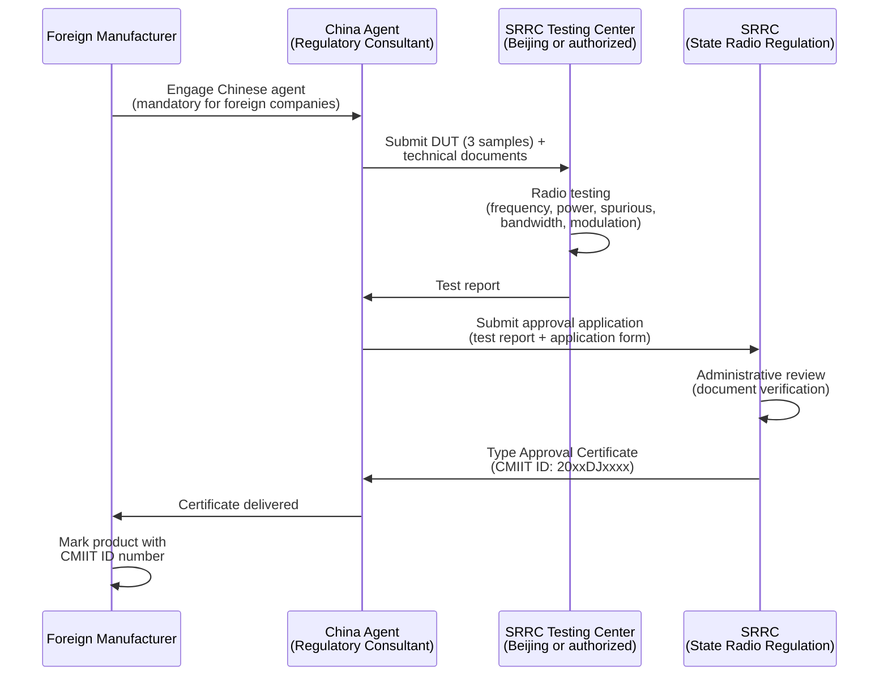
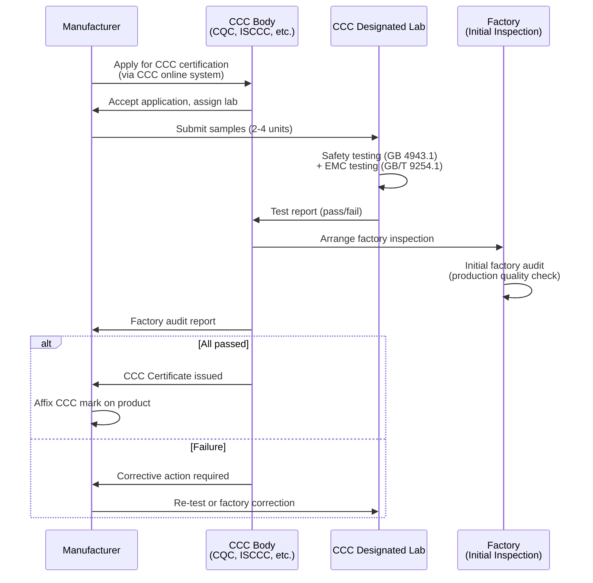

# China Market Access — SRRC, MIIT & CCC Mandatory Certification

**Topic:** Chinese Regulatory Compliance for Electronics — SRRC Radio Type Approval, MIIT Telecom, CCC Safety  
**Standards:** Radio Regulations (SRRC), Telecom Equipment Access (MIIT NAL), GB 4943.1, GB/T 9254, GB 8898  
**SDO:** SRRC (State Radio Regulation of China), MIIT (Ministry of Industry and Information Technology), CNCA (Certification and Accreditation Administration), SAC (Standardization Administration of China)  
**Audience:** China market access specialists, regulatory compliance engineers, product managers  
**Prerequisites:** Basic product certification understanding, awareness of Chinese regulatory landscape

---

## Chapter 1 — Historical Context & Origin Story

### 1.1 Timeline

| Year | Event |
|------|-------|
| 1993 | SRRC (State Radio Regulation Committee) established |
| 1994 | Radio equipment type approval system begins |
| 2001 | CCC (China Compulsory Certification) system established (replaces CCIB + CCEE) |
| 2002 | CCC mark mandatory for listed products (May 1, 2002) |
| 2003 | All listed products must have CCC before import/sale |
| 2007 | MIIT formed (merger of MII + other ministries) |
| 2010 | SRRC online filing system launched |
| 2014 | GB 4943.1-2011 (IT equipment safety — based on IEC 60950-1) fully enforced |
| 2016 | Telecom Equipment Network Access License (NAL) reforms |
| 2017 | SRRC reforms — streamlined type approval process |
| 2019 | 5G spectrum allocated (n78: 3.3-3.6 GHz, n79: 4.8-5 GHz, n41: 2.5 GHz) |
| 2020 | Wi-Fi 6 (802.11ax) certification procedures established |
| 2022 | GB 4943.1-2022 published (aligned with IEC 62368-1 — transition period) |
| 2023 | 6 GHz Wi-Fi studies initiated (not yet approved) |
| 2024 | GB 4943.1-2022 mandatory (IEC 62368-1 equivalent — replaces old GB 4943.1-2011) |
| 2024 | CCC reforms: reduced product categories, simplified processes for some items |

### 1.2 Chinese Regulatory Bodies

| Body | Role | Scope |
|------|------|-------|
| SRRC | Radio frequency spectrum management | Radio equipment type approval (所有无线电设备) |
| MIIT | Ministry-level ICT regulation | Telecom equipment network access (入网许可) |
| CNCA | Certification administration | CCC system oversight (认证认可) |
| SAC | Standards body | GB (国标) mandatory standards; GB/T recommended |
| CQC | China Quality Certification Center | CCC testing + voluntary certification |
| CTTL (CAICT) | China Academy of ICT | Telecom testing (MIIT NAL) |
| SRTC | State Radio Testing Center | SRRC testing lab |
| CCC Labs (各认证机构) | Various (CQC, CCC ISCCC, etc.) | Safety + EMC testing for CCC |

---

## Chapter 2 — Standard Architecture & Structure

### 2.1 China Certification Framework

```mermaid
graph TB
    PRODUCT[Electronic Product<br/>for China Market]
    
    PRODUCT --> Q1{Contains radio<br/>transmitter/receiver?}
    Q1 -->|"Yes"| SRRC[SRRC Type Approval<br/>Radio Type Approval Certificate<br/>型号核准]
    
    PRODUCT --> Q2{Telecom equipment<br/>(connects to public network)?}
    Q2 -->|"Yes"| MIIT[MIIT Network Access License<br/>入网许可证 (NAL)<br/>Telecom Equipment Access]
    
    PRODUCT --> Q3{Listed in CCC<br/>product catalog?}
    Q3 -->|"Yes"| CCC[CCC Certification<br/>中国强制性产品认证<br/>Safety + EMC]
    Q3 -->|"No"| CCC_EXEMPT[CCC not required<br/>But voluntary CQC<br/>mark may be wanted]
    
    PRODUCT --> Q4{Sold to consumer?}
    Q4 -->|"Yes"| GB_EMC[GB/T 9254.1<br/>EMC compliance<br/>(mandatory if in CCC scope)]
    
    SRRC --> CHINA_MARKET[China Market Launch]
    MIIT --> CHINA_MARKET
    CCC --> CHINA_MARKET
```

### 2.2 Certification Dependencies

| Certification | Required Before | Dependencies |
|--------------|----------------|-------------|
| SRRC | Product sale/import | Must be obtained FIRST for radio products |
| MIIT NAL | Connecting to telecom network | Requires SRRC first (for radio equipment) |
| CCC | Product sale/import/manufacture | Independent of SRRC/MIIT (but often parallel) |

**Typical order:** SRRC (radio) → MIIT NAL (telecom) → CCC (safety/EMC) → Market entry. In practice: SRRC and CCC are filed in parallel; MIIT after SRRC.

---

## Chapter 3 — Technical Deep Dive

### 3.1 SRRC Radio Standards

| Technology | Frequency (China) | Standard Reference | Max Power | Notes |
|-----------|-------------------|-------------------|-----------|-------|
| Wi-Fi 2.4 GHz | 2400-2483.5 MHz | SRRC technical specs | 100 mW EIRP (20 dBm) | Same as EU/Japan |
| Wi-Fi 5 GHz | 5150-5350 MHz (indoor) | SRRC technical specs | 200 mW EIRP | Indoor only; no DFS in China (different from EU) |
| Wi-Fi 5 GHz | 5725-5850 MHz | SRRC technical specs | 500 mW EIRP | Outdoor allowed (China-specific) |
| Wi-Fi 6E (6 GHz) | Not yet approved | Under study | N/A | NOT permitted as of 2024 |
| Bluetooth | 2400-2483.5 MHz | SRRC technical specs | 100 mW EIRP | — |
| BLE | 2400-2483.5 MHz | SRRC technical specs | 10 mW typical | — |
| NFC | 13.56 MHz | SRRC technical specs | Field strength | — |
| LoRa (China) | 470-510 MHz (CN470) | SRRC technical specs | 100 mW (17 dBm) | China-specific band (NOT 868/915) |
| 5G NR Sub-6 | n41: 2515-2675 MHz | 3GPP + SRRC | Per 3GPP | China Mobile |
| 5G NR Sub-6 | n78: 3300-3600 MHz | 3GPP + SRRC | Per 3GPP | China Telecom, China Unicom |
| 5G NR Sub-6 | n79: 4800-5000 MHz | 3GPP + SRRC | Per 3GPP | China Mobile (unique to China) |
| 5G mmWave | Not deployed (consumer) | Reserved for study | N/A | China focused on Sub-6 for 5G |

**Critical Notes:**
- China 5 GHz Wi-Fi: 5150-5350 MHz + 5725-5850 MHz (different from EU/US — no W53 DFS, has 5.8 GHz)
- China LoRa: 470-510 MHz (CN470) — NOT compatible with EU 868 or US 915 or India 865
- No 6 GHz Wi-Fi permitted
- No 5G mmWave for consumer devices (as of 2024)

### 3.2 CCC Safety Standards

| Product Category | GB Standard | IEC Equivalent | Notes |
|-----------------|-------------|----------------|-------|
| IT/AV equipment | GB 4943.1-2022 | IEC 62368-1:2018 | New (replaces GB 4943.1-2011 = IEC 60950-1) |
| Audio/video equipment | GB 8898-2011 | IEC 60065:2014 | Being replaced by GB 4943.1-2022 |
| Power supplies/adapters | GB 4943.1-2022 | IEC 62368-1 | Includes external PSU |
| Household appliances | GB 4706.1 | IEC 60335-1 | Separate product scope |
| Lithium batteries | GB 31241 | Based on IEC 62133 | Portable lithium battery safety |
| LED lighting | GB 7000 series | IEC 60598 | Luminaire safety |
| Switches/plugs | GB 2099 | IEC 60884 | China-specific pin type |

### 3.3 CCC EMC Standards

| Test Type | GB Standard | International Equivalent |
|-----------|-------------|------------------------|
| Conducted emissions | GB/T 9254.1-2021 | CISPR 32 (= EN 55032) |
| Radiated emissions | GB/T 9254.1-2021 | CISPR 32 |
| Immunity (ESD) | GB/T 17626.2 | IEC 61000-4-2 |
| Immunity (radiated) | GB/T 17626.3 | IEC 61000-4-3 |
| Immunity (EFT) | GB/T 17626.4 | IEC 61000-4-4 |
| Immunity (surge) | GB/T 17626.5 | IEC 61000-4-5 |
| Immunity (conducted) | GB/T 17626.6 | IEC 61000-4-6 |
| Harmonic current | GB/T 17625.1 | IEC 61000-3-2 |
| Voltage fluctuation/flicker | GB/T 17625.2 | IEC 61000-3-3 |

### 3.4 MIIT Network Access (NAL) Requirements

| Equipment Type | NAL Required? | Testing Body |
|---------------|---------------|-------------|
| Mobile phones (cellular) | Yes | CTTL (CAICT) |
| Cellular modems/modules | Yes | CTTL |
| Wireless routers (telecom CPE) | Yes | CTTL |
| Base stations | Yes | CTTL |
| VoIP equipment | Yes | CTTL |
| Set-top boxes (IPTV) | Yes | CTTL |
| Satellite terminals | Yes | CTTL/SRRC |
| Pure Wi-Fi devices (no cellular) | No (SRRC + CCC sufficient) | — |
| Bluetooth-only devices | No (SRRC + CCC sufficient) | — |

### 3.5 SAR Requirements (China)

| Parameter | China Value |
|-----------|-------------|
| Standard | GB 21288-2022 (updated) / YD/T 1644 |
| SAR limit | 2.0 W/kg averaged over 10 grams | 
| Methodology | ICNIRP-based (same as EU) |
| Applies to | Mobile phones and portable wireless devices |
| Testing | SRRC or CTTL lab |
| Limb limit | 4.0 W/kg (10g) |
| Note | China follows ICNIRP (NOT FCC 1.6/1g) |

---

## Chapter 4 — Implementation Guide

### 4.1 SRRC Type Approval Process



### 4.2 CCC Certification Process



### 4.3 Required Documents (SRRC)

| Document | Language | Notes |
|---------|----------|-------|
| Application form | Chinese | Standard SRRC form (agent prepares) |
| Technical specifications | Chinese + English | Frequency, power, modulation, BW |
| Block diagram | Bilingual acceptable | RF chain: baseband → antenna |
| Circuit schematic (RF section) | Bilingual acceptable | At minimum RF front-end |
| Photos (internal + external) | — | Clear photos of product and RF components |
| Test samples | — | 3 units typically required |
| Authorization letter | Chinese | Foreign manufacturer authorizes agent |
| Company registration | Chinese | Agent's business license |
| Previous certifications | Any language | FCC/CE/MIC certs as reference (speeds review) |

### 4.4 Required Documents (CCC)

| Document | Notes |
|---------|-------|
| CCC application form | Online system (CNCA CCC platform) |
| Product description | Chinese (model, specs, construction) |
| Circuit diagrams | Full schematics |
| Critical component list | Safety-critical parts (fuses, transformers, insulation) |
| Safety design explanation | How product meets GB 4943.1 requirements |
| Factory quality system | ISO 9001 or equivalent documentation |
| Previous test reports | CB test report from IECEE scheme (accelerates) |
| Chinese entity | CCC applicant MUST be Chinese legal entity (or have one) |

### 4.5 China Plug and Voltage

| Parameter | China Specification |
|-----------|-------------------|
| Mains voltage | 220V AC, 50 Hz |
| Plug type | GB 1002 (Type I variant — flat angled 3-pin or 2-pin) |
| Socket standard | GB 2099.1 (similar to Australian Type I but with national differences) |
| Adapter rating | Must support 220V/50Hz |
| USB-C | Growing mandate discussion (following EU) |

---

## Chapter 5 — Certification & Compliance

### 5.1 SRRC Testing Centers

| Lab | Location | Notes |
|-----|----------|-------|
| SRTC (State Radio Testing Center) | Beijing | Primary SRRC lab (definitive) |
| CTTL (CAICT) | Beijing | Telecom + radio testing |
| CESI | Beijing | Electronics testing |
| Regional SRRC labs | Shenzhen, Shanghai, etc. | Authorized for some categories |

### 5.2 CCC Certification Bodies

| Body | Full Name | Scope |
|------|-----------|-------|
| CQC | China Quality Certification Center | Largest — IT, electronics, household |
| ISCCC | Information Security Certification Center | IT security products |
| CCC (各机构) | Multiple designated bodies | Specific product categories |

### 5.3 CCC Designated Test Labs

| Lab | Location | Capabilities |
|-----|----------|-------------|
| CESI (China Electronics Standardization Institute) | Beijing | Safety + EMC (primary CCC lab) |
| CSQC (China Software Quality Center) | Beijing | IT products |
| SRTC | Beijing | Radio + EMC |
| SGS China | Shanghai, Shenzhen | Safety + EMC (foreign-owned) |
| TÜV Rheinland China | Shanghai, Shenzhen | CCC testing (recognized) |
| UL China | Suzhou, Shanghai | CCC + CB scheme |
| Intertek China | Shanghai, Shenzhen | CCC testing |

### 5.4 Factory Inspection Requirements

| Aspect | Initial Inspection | Annual Follow-Up |
|--------|-------------------|-----------------|
| Frequency | Before CCC certificate issued | Annual (minimum) |
| Scope | Production line, QC, testing equipment, components | Spot-check production consistency |
| Duration | 1-2 days (on-site) | 0.5-1 day |
| Who inspects | CCC certification body auditor | Same body |
| Pass requirement | Quality system adequate; production consistent with certified sample | No critical non-conformities |
| Failure consequence | CCC certificate NOT issued | Certificate suspension/withdrawal |
| Cost | ¥20,000-¥50,000 ($2,800-$7,000) | ¥10,000-¥30,000 ($1,400-$4,200) |

---

## Chapter 6 — Regional Variants & Special Considerations

### 6.1 China vs. Major Markets

| Aspect | China | EU (CE) | US (FCC) | Korea (KC) |
|--------|-------|---------|----------|-----------|
| Radio | SRRC (mandatory type approval) | RED (self-assess possible) | FCC (TCB certification) | KCC (type approval) |
| Safety | CCC (third-party, factory audit) | CE (self-declaration possible) | UL (voluntary but expected) | KC (third-party) |
| EMC | CCC (included in safety cert) | CE (EMC Directive) | FCC Part 15 (emissions only) | KC (emissions + immunity) |
| Factory audit | Mandatory (initial + annual) | Not required (for self-assessment) | Not standard (UL does quarterly) | Some categories |
| In-country testing | Required for SRRC; CCC accepts CB + local verification | Not required | Not required | Preferred but not mandatory |
| Chinese entity | Mandatory (applicant must be Chinese legal entity) | EU AR (if outside EU) | Not required | Korean representative |
| 5 GHz Wi-Fi | 5150-5350 + 5725-5850 (no W53 DFS) | 5150-5350 + 5470-5725 (DFS) | 5150-5850 (most bands open) | Similar to EU |
| 6 GHz | NOT allowed | Allowed (LPI 200 mW) | Allowed (LPI/SP 1W) | Allowed (LPI 2023) |
| Sub-GHz IoT | 470-510 MHz (CN470) | 863-870 MHz (EU868) | 902-928 MHz (US915) | 917-923.5 MHz (KR920) |
| SAR | 2.0 W/kg (10g) — ICNIRP | 2.0 W/kg (10g) — ICNIRP | 1.6 W/kg (1g) — FCC | 1.6 W/kg (1g) — FCC |
| Timeline | 8-16 weeks (total) | 6-10 weeks | 4-6 weeks | 4-8 weeks |
| Cost | $15,000-$40,000 | $15,000-$25,000 | $10,000-$20,000 | $10,000-$25,000 |

### 6.2 China-Specific Technical Requirements

| Requirement | Detail |
|-------------|--------|
| 5 GHz DFS | NOT required in China (unlike EU/US/Japan/Korea) |
| 5.8 GHz band | 5725-5850 MHz available (unique — most markets restrict above 5725) |
| Wi-Fi 6E (6 GHz) | NOT PERMITTED |
| LoRa/IoT | 470-510 MHz ONLY (CN470 band plan) — NOT 868 or 915 MHz |
| Cellular 5G | n41 (2.5 GHz) + n78 (3.5 GHz) + n79 (4.8 GHz) — China has unique n79 allocation |
| mmWave | Not deployed for consumer (Sub-6 focus) |
| Chinese language | Product UI, manual, labeling ALL in Chinese (Simplified) |
| GB standards | China maintains own standards (GB = 国标) even when based on IEC |
| Encryption | Products with encryption may need additional OSCCA (State Cryptography Administration) review |
| Data localization | IoT/cloud products may face data storage requirements (Cybersecurity Law) |

---

## Chapter 7 — Comparison: CCC vs. International Schemes

| Dimension | CCC (China) | CE (EU) | UL (US) | KC (Korea) | BIS (India) |
|-----------|-------------|---------|---------|-----------|-------------|
| Type | Mandatory third-party | Mandatory self-assess (mostly) | Voluntary third-party | Mandatory third-party | Mandatory registration |
| Government role | CNCA oversees; CB issues | Market surveillance (post-market) | Private (OSHA NRTL) | Government CABs | BIS government body |
| Factory audit | Yes (initial + annual) | No (for self-assess) | Yes (quarterly for UL) | Some categories | Possible |
| Test location | China designated lab (or CB scheme + local verification) | Any accredited lab globally | UL labs (or NRTL) | Korean labs preferred | BIS-recognized labs |
| Cost | High ($15K-$40K with factory audit + agent fees) | Moderate ($15K-$25K) | Moderate ($10K-$20K) | Moderate ($10K-$25K) | Low-moderate ($5K-$15K) |
| Timeline | Long (8-16 weeks) | Moderate (6-10 weeks) | Moderate (4-8 weeks) | Moderate (4-8 weeks) | Long (8-16 weeks) |
| Mark | CCC (3C mark) | CE mark | UL mark | KC mark | ISI/BIS mark |
| Validity | Continuous (with annual audit) | Indefinite (manufacturer responsible) | Continuous (with inspections) | Permanent | Permanent |
| Revocation | If factory fails audit | Market surveillance action | UL can suspend | CAB can revoke | BIS can cancel |

---

## Chapter 8 — Mermaid Architecture Diagrams

### 8.1 China Complete Certification Flow

```mermaid
graph TB
    START[Product for China Market]
    
    START --> ANALYZE[Analyze Requirements]
    
    ANALYZE --> SRRC_Q{Has radio<br/>transmitter?}
    SRRC_Q -->|"Yes"| SRRC_PROC[SRRC Type Approval<br/>• 3 samples to SRTC lab<br/>• Radio testing (4-8 weeks)<br/>• Certificate: CMIIT ID]
    
    ANALYZE --> CCC_Q{In CCC catalog?}
    CCC_Q -->|"Yes"| CCC_PROC[CCC Certification<br/>• Apply via CCC system<br/>• Safety + EMC testing<br/>• Factory inspection<br/>• CCC mark issued]
    
    ANALYZE --> MIIT_Q{Telecom<br/>equipment?}
    MIIT_Q -->|"Yes"| MIIT_PROC[MIIT NAL<br/>• Requires SRRC first<br/>• CTTL testing<br/>• Network Access License]
    
    SRRC_PROC --> READY{All certs<br/>obtained?}
    CCC_PROC --> READY
    MIIT_PROC --> READY
    
    READY -->|"Yes"| MARKET[China Market Launch<br/>• Product marked: CCC + CMIIT ID<br/>• Chinese manual + labels<br/>• Chinese entity as certificate holder<br/>• Annual factory audit maintained]
    
    READY -->|"Missing cert"| BLOCK[CANNOT SELL<br/>Customs will block<br/>import without CCC/SRRC]
```

### 8.2 CCC Mark and Product Labeling

```mermaid
graph LR
    subgraph "Product Markings for China"
        CCC_MARK[CCC Mark<br/>3C mandatory safety mark<br/>(circular logo)]
        CMIIT[CMIIT ID<br/>SRRC certification number<br/>e.g., CMIIT ID: 2024DJ1234]
        NAL_NUM[NAL Number<br/>MIIT Network Access<br/>(if telecom equipment)]
        GB_INFO[Product Information<br/>• Model: XYZ-100CN<br/>• Manufacturer (Chinese)<br/>• Rating: 220V~50Hz<br/>• GB standard reference<br/>• CMIIT ID number]
    end
```

---

## Chapter 9 — Case Studies

### 9.1 Smartphone Launch in China — Full Compliance

| Aspect | Detail |
|--------|--------|
| Product | 5G smartphone (n41/n78/n79 + Wi-Fi 6 + BLE 5.3 + NFC) |
| SRRC | Type approval for ALL radios: 5G (3 bands), Wi-Fi (2.4/5), BLE, NFC |
| SRRC timeline | 6-8 weeks (5G testing is extensive) |
| SRRC samples | 3 units submitted to SRTC Beijing |
| CCC | GB 4943.1-2022 (safety) + GB/T 9254.1 (EMC) |
| CCC factory audit | Required — factory in Shenzhen audited |
| MIIT NAL | Required (cellular 5G device — connects to carrier network) |
| MIIT prerequisite | SRRC certificate MUST be obtained before NAL application |
| SAR | 2.0 W/kg (10g) — tested at SRRC lab (ICNIRP methodology) |
| n79 (4.8 GHz) | China-unique band — requires specific RF design support |
| 6 GHz Wi-Fi | DISABLED in China firmware (not permitted) |
| Chinese entity | Chinese subsidiary files all certifications (foreign company cannot directly) |
| Timeline | SRRC: 8 weeks; CCC: 10 weeks; MIIT: 6 weeks (after SRRC). Total: 14-16 weeks |
| Cost | SRRC: ¥150,000 ($21,000); CCC: ¥100,000 ($14,000); MIIT: ¥80,000 ($11,000) |
| Total | ~¥330,000 (~$46,000) + Chinese agent fees + annual CCC audit |
| Lesson | n79 band and MIIT NAL make China the most complex market for 5G phones |

### 9.2 IoT LoRa Gateway — CN470 Band Requirement

| Aspect | Detail |
|--------|--------|
| Product | LoRa IoT gateway (designed for EU market at 868 MHz) |
| Problem | EU 868 MHz hardware CANNOT be used in China |
| China band | 470-510 MHz (CN470) — completely different frequency range |
| Hardware impact | Antenna: 470 MHz antenna is MUCH larger than 868 MHz (λ/4 = 16cm vs 8.6cm) |
| RF front-end | Different SAW filter, different matching network, different PA for 470 MHz |
| Verdict | Complete RF hardware redesign required for China (not just firmware change) |
| LoRaWAN | CN470 channel plan: 96 uplink channels (470.3-489.3 MHz, 200 kHz spacing) |
| Power | 19.15 dBm (82 mW) maximum EIRP in China |
| SRRC | Required for 470 MHz radio transmitter |
| CCC | If AC-powered gateway → CCC required (GB 4943.1) |
| Timeline | PCB redesign: 8 weeks; SRRC: 8 weeks; CCC: 10 weeks. Total: ~20 weeks |
| Cost | Redesign: ¥200,000; SRRC: ¥80,000; CCC: ¥100,000. Total: ¥380,000 ($53,000) |
| Lesson | China sub-GHz IoT requires DIFFERENT HARDWARE — cannot adapt EU/US product |

---

## Chapter 10 — Future Evolution & Industry Trends

| Trend | Timeline | Description |
|-------|----------|-------------|
| 6 GHz Wi-Fi allocation | Under study (2025-2027?) | China evaluating 5925-7125 MHz; telecom industry lobbying for IMT use |
| CCC reform (reduction) | Ongoing | Government reducing CCC mandatory categories (simplification) |
| GB 4943.1-2022 full transition | 2024-2025 | All products must comply with new IEC 62368-1 aligned standard |
| Cybersecurity requirements | Growing | Cybersecurity Law + data localization affecting IoT products |
| 5G SA (Standalone) dominance | Now | China leads in 5G SA deployment; devices must support SA mode |
| Encryption review (OSCCA) | Increasing | Products with encryption may face State Cryptography Administration review |
| CCC self-declaration expansion | 2024+ | More low-risk products eligible for manufacturer self-declaration |
| Data cross-border | Tightening | Personal data and important data must remain in China (PIPL) |
| Domestic chip requirements | Growing | Push toward domestic semiconductor usage (may affect components) |
| Digital CCC certificate | 2024+ | Paperless certification with online verification |
| Mutual recognition | Limited | China CCC not widely mutually recognized (testing often repeated) |

---

## Chapter 11 — Interview Questions & Career Guide

### Tier 1: Entry-Level

**Q1:** What are the three main certifications needed to sell a Wi-Fi router in China?  
**A:** (1) **SRRC Type Approval (型号核准):** SRRC = State Radio Regulation of China. Required for ALL radio transmitting equipment. For Wi-Fi router: tests Wi-Fi 2.4/5 GHz radio parameters (power, frequency accuracy, spurious, bandwidth). Certificate contains "CMIIT ID" number — must be marked on product. Must be done at SRRC-designated lab (primarily SRTC in Beijing). Timeline: 4-8 weeks. (2) **CCC Certification (中国强制性产品认证 / 3C):** CCC = China Compulsory Certification. Required for all products in the CCC catalog (routers are listed under IT equipment). Tests: safety (GB 4943.1-2022, equivalent to IEC 62368-1) AND EMC (GB/T 9254.1, equivalent to CISPR 32). Includes mandatory factory inspection (initial + annual). CCC mark (circular 3C logo) must be on product. (3) **MIIT NAL (入网许可证) — Network Access License:** If router connects to public telecom network (e.g., operator-branded CPE, modem-router): MIIT Network Access License required. Testing at CTTL (China Academy of Information and Communications Technology). Prerequisite: SRRC certificate must be obtained FIRST. For pure consumer Wi-Fi router (not operator-provided): MIIT NAL may not be required (depends on classification). **Additional requirements:** Chinese legal entity must hold all certificates. Product labeling in Chinese. Manual in Chinese (Simplified). CMIIT ID + CCC mark on product.

### Tier 2: Mid-Level

**Q2:** Your product has CE and FCC certification. How can you leverage existing test data for Chinese certifications?  
**A:** **For SRRC (Radio):** SRRC generally requires IN-CHINA testing at designated labs. However: SRRC reform (2017+) allows some pre-testing at recognized foreign labs, with verification testing at SRRC lab. Practical approach: Submit FCC/CE radio test data as reference → SRRC lab does verification (reduced scope). Still need 3 physical samples sent to China. Timeline savings: 2-3 weeks faster (verification vs. full test). Cost savings: 20-30% reduction (not full test campaign). Foreign test data accepted as basis: Yes, for documentation/review support. But: SRRC lab ALWAYS does their own measurements (cannot skip). **For CCC (Safety + EMC):** CCC ACCEPTS CB Scheme test reports (IEC 62368-1 CB test report). Process: Submit CB test report to CCC body (CQC). CCC body reviews for Chinese national differences (GB vs. IEC differences). If differences exist: supplementary testing only (not full re-test). National differences (GB 4943.1 vs. IEC 62368-1): China plug requirements, Chinese mains voltage (220V/50Hz) specific tests, some editorial differences. EMC: GB/T 9254.1 = CISPR 32 — test data from EN 55032 directly applicable. Immunity: if EU test per EN 55035 exists → GB immunity tests covered. Time savings: 4-6 weeks faster than full CCC testing from scratch. Cost savings: 30-50% (CB scheme avoids full safety re-test). CRITICAL: Factory inspection STILL required (cannot be waived regardless of existing certs). **For MIIT (if applicable):** MIIT testing is China-specific (network interoperability). No direct reuse of foreign test data for MIIT NAL. Must test at CTTL lab in China. FCC/CE data: no value for MIIT (different scope). **Summary of reuse:**
| Certification | Foreign data reuse | Savings |
|------|------|------|
| SRRC | Reference only; verification testing still done in China | 20-30% cost, 2-3 weeks |
| CCC (safety) | CB scheme report accepted; supplementary test for national differences | 30-50% cost, 4-6 weeks |
| CCC (EMC) | Foreign EMC report (CISPR 32/35 equivalent) accepted | 30-40% cost |
| CCC (factory) | Cannot be waived — always required | No savings |
| MIIT | Not reusable | No savings |

### Tier 3: Senior

**Q3:** Your company is launching a complete smart home ecosystem in China (hub, sensors, camera, smart plugs). Design the certification strategy addressing all Chinese requirements including data and encryption concerns.  
**A:** **Product Portfolio:** Hub: Wi-Fi 5 (2.4/5 GHz) + Zigbee (2.4 GHz) + BLE. Sensors (5 types): BLE + Zigbee. Camera: Wi-Fi (2.4/5 GHz). Smart plug: Wi-Fi (2.4 GHz), 220V/10A. **1. SRRC Strategy:** Hub: SRRC for Wi-Fi + BLE + Zigbee (all 2.4 GHz; Wi-Fi also 5 GHz). Camera: SRRC for Wi-Fi (2.4/5 GHz). Smart plug: SRRC for Wi-Fi (2.4 GHz). Sensors: SRRC for BLE + Zigbee (low power — may qualify for simplified registration). Strategy: Use common pre-certified Wi-Fi/BLE module across products. If module has SRRC CMIIT ID → host device certification simplified. One module SRRC → covers multiple products (cost savings). Timeline: 6-8 weeks (all products in parallel using same module cert). **2. CCC Strategy:** Hub: CCC required (IT equipment, AC adapter powered) — GB 4943.1 + GB/T 9254.1. Camera: CCC required (IT equipment) — GB 4943.1 + GB/T 9254.1. Smart plug: CCC required (electrical accessory, 220V AC) — GB 2099 (plugs) + relevant safety standard. Sensors: battery-powered, low-voltage — CCC may NOT be required (check current catalog). Strategy: Submit CB test reports (from global certification) for safety → reduce Chinese testing scope. CCC factory inspection: if all manufactured in same factory → single inspection covers multiple products. Timeline: 10-12 weeks (factory audit scheduling can be bottleneck). **3. China-Specific Design Adaptations:** (a) Smart plug: MUST be designed for China outlet standard (GB 1002 / GB 2099). China plug: Type I variant (angled flat blades — similar to Australian but national differences). 220V/50Hz rated. Internal relay: rated for 220V/10A. (b) 5 GHz Wi-Fi: China uses 5150-5350 + 5725-5850 MHz (no DFS required). Firmware: China regulatory domain → no DFS, enable 5.8 GHz band. (c) No 6 GHz: if products support Wi-Fi 6E → DISABLE 6 GHz in China firmware. (d) No EU/US sub-GHz: if any sensor uses LoRa → must use CN470 (470-510 MHz). If sensors are BLE/Zigbee (2.4 GHz) only → no sub-GHz issue. **4. Data and Cybersecurity Considerations:** (a) Cybersecurity Law (网络安全法): IoT devices connecting to internet → subject to cybersecurity review. Personal data collected by camera/sensors → must be stored in China. Cloud infrastructure: must use China-based servers (AWS China/Alibaba Cloud/Tencent Cloud). (b) Personal Information Protection Law (PIPL 个保法): Smart camera captures video/images → personal data. Must disclose data collection/usage to users (Chinese privacy notice). User consent required; data minimization principles apply. (c) Data cross-border: If cloud data needs to go outside China → Data Security Assessment by CAC (Cyberspace Administration of China). For most smart home: keep all data in China (avoids cross-border complications). (d) Encryption: Products using encryption (TLS, AES for IoT communication): OSCCA (State Cryptography Administration) review may be required. In practice: standard encryption (TLS 1.2/1.3 for HTTPS, AES-128/256) used commercially is generally not a problem. Custom/proprietary encryption → may trigger OSCCA review. Strategy: use standard commercially available encryption → avoid OSCCA complications. **5. Chinese Entity and Agent:** Foreign company CANNOT directly hold CCC/SRRC certificates. Options: (a) Establish Chinese subsidiary (WFOE — Wholly Foreign-Owned Enterprise). (b) Use Chinese distributor/partner as certificate holder. (c) Use Chinese regulatory agent (holds cert on behalf of foreign company). Recommendation: WFOE for long-term market presence (full control of certificates). **6. Timeline (parallel execution):**
```
Week 1-8:   SRRC (all radios — using pre-certified module strategy)
Week 2-12:  CCC testing (safety + EMC — leveraging CB reports)
Week 8-14:  CCC factory inspection (after test reports available)
Week 1-4:   Smart plug China-specific design finalization
Week 4-8:   Smart plug China-specific prototype + testing
Week 1-16:  Chinese entity setup (if not already established)
```
Critical path: CCC with factory inspection (14 weeks) or entity setup (16 weeks). **7. Cost estimate:**
| Item | Cost (¥) | Cost ($) |
|------|----------|----------|
| SRRC (hub + camera + plug + sensor batch) | ¥200,000 | $28,000 |
| CCC (hub + camera + plug) | ¥300,000 | $42,000 |
| CCC factory inspection | ¥50,000 | $7,000 |
| Agent/consultant fees | ¥100,000 | $14,000 |
| China entity setup (WFOE) | ¥150,000 | $21,000 |
| Smart plug redesign for China socket | ¥100,000 | $14,000 |
| **Total** | **¥900,000** | **~$126,000** |

**8. Risk factors:** Factory inspection timing: CCC body schedule — book early. SRRC lab queue: 4-6 week wait at SRTC is common (plan ahead). Cybersecurity review: if product is "critical information infrastructure" → longer review. China 5 GHz: unique band plan → test firmware China variant specifically. Trade restrictions: monitor for any export control issues affecting component supply.

---

## Chapter 12 — Cheat Sheet & Quick Reference

### China Certification Summary

```
SRRC: Radio Type Approval — MANDATORY for all radio transmitters
  → CMIIT ID number issued
  → Testing at SRTC/SRRC-designated lab
  → 3 samples required

CCC (3C): Safety + EMC — MANDATORY for listed products
  → GB 4943.1-2022 (safety) + GB/T 9254.1 (EMC)
  → Factory inspection (initial + annual)
  → CCC mark on product

MIIT NAL: Network Access License — MANDATORY for telecom equipment
  → Requires SRRC certificate first
  → Testing at CTTL (CAICT)
  → Mobile phones, cellular modems, telecom CPE
```

### China RF Bands (Key Differences)

```
Technology       China Band              Difference from EU/US
Wi-Fi 2.4       2400-2483.5 MHz         Same
Wi-Fi 5 (low)   5150-5350 MHz           Similar (no DFS in China!)
Wi-Fi 5 (high)  5725-5850 MHz           Different! (China has 5.8 GHz; EU: 5470-5725)
Wi-Fi 6E (6GHz) NOT PERMITTED           ⚠️ Major gap
LoRa/IoT        470-510 MHz (CN470)     ⚠️ Completely different (NOT 868/915!)
5G              n41(2.5G)+n78(3.5G)+n79(4.8G)  n79 is China-unique
5G mmWave       Not deployed (consumer)  Different from US/Korea (no mmWave)
Bluetooth       2400-2483.5 MHz         Same
```

### China vs. FCC/EU SAR

```
China SAR: 2.0 W/kg averaged over 10 grams (ICNIRP)
  → Same as EU, Japan, Australia
  → Different from FCC/Korea/India (1.6 W/kg, 1g)
  → EU SAR test report REUSABLE for China
  → FCC SAR report NOT directly reusable (different averaging)
```

### China Market Access Checklist

```
□ Chinese entity established (WFOE or local partner)
□ SRRC Type Approval (for all radio transmitters)
□ CCC certification (if product in CCC catalog)
□ MIIT NAL (if telecom terminal equipment)
□ Factory inspection passed (CCC requirement)
□ China regulatory domain firmware (5 GHz bands, no 6 GHz)
□ Chinese plug standard (GB 1002 — if AC product)
□ 220V/50Hz compatibility verified
□ Chinese-language UI + manual + labeling
□ CMIIT ID + CCC mark on product
□ Data localization (China servers for cloud/IoT)
□ Cybersecurity assessment (if internet-connected)
□ No prohibited encryption (standard TLS/AES OK)
□ SAR compliance (2.0 W/kg, 10g — if portable radio)
□ Annual CCC factory audit maintained
```

---

*End of Document — 09_China_SRRC_MIIT_CCC.md*
