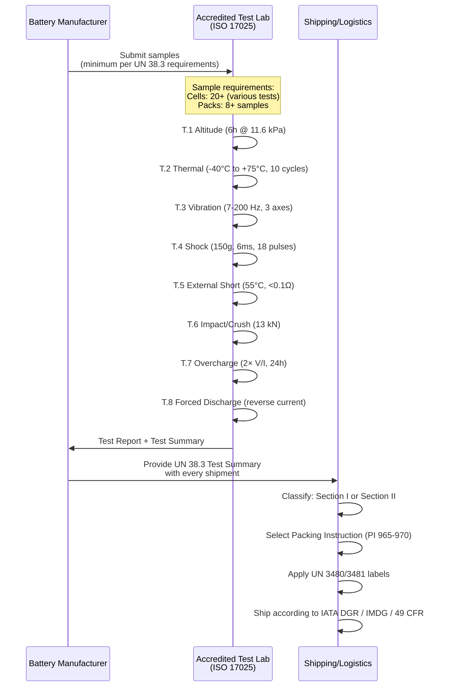
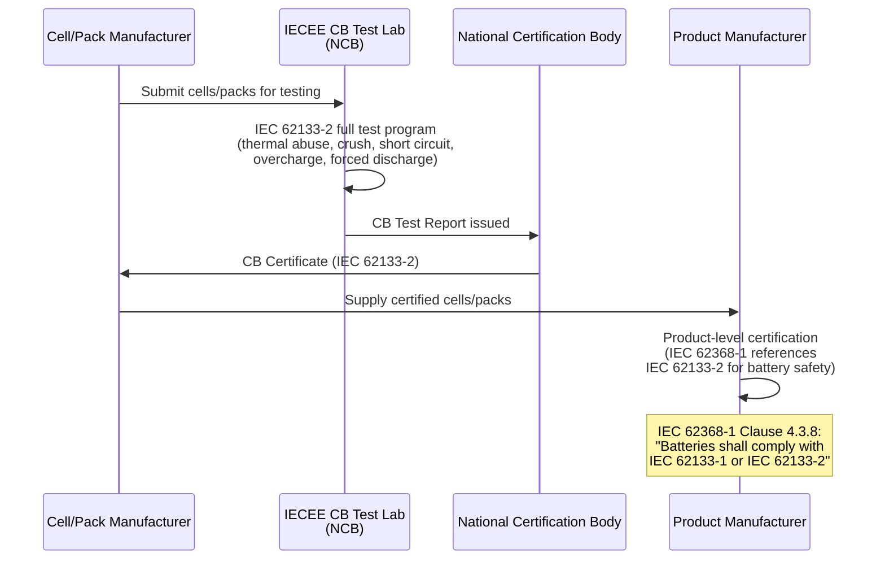

# Battery Safety — UN 38.3 Transport Testing & IEC 62133-2

**Topic:** Lithium Battery Safety Standards for Consumer Electronics — Transport, Safety, Shipping  
**Standards:** UN 38.3 (Manual of Tests and Criteria), IEC 62133-2:2017, UL 1642, IEC 62619:2017, IATA DGR  
**SDO:** UN (UNECE Transport), IEC TC 21/SC 21A, UL (Underwriters Laboratories), IATA (International Air Transport Association)  
**Audience:** Battery safety engineers, logistics managers, compliance specialists, product design engineers  
**Prerequisites:** Basic electrochemistry knowledge, understanding of lithium-ion battery fundamentals

---

## Chapter 1 — Historical Context & Origin Story

### 1.1 Timeline

| Year | Event |
|------|-------|
| 1991 | Sony commercializes first lithium-ion battery |
| 1995 | UL 1642 first edition (lithium battery safety) |
| 1999 | UN 38.3 tests first introduced (Manual of Tests and Criteria, 3rd revised ed.) |
| 2003 | IEC 62133:2002 published (safety requirements for portable sealed secondary cells) |
| 2006 | Sony/Dell laptop battery recall (millions of units — thermal runaway) |
| 2008 | UN 38.3 Rev 5 — tighter test criteria |
| 2013 | Boeing 787 Dreamliner grounded (lithium battery fires) |
| 2016 | Samsung Galaxy Note 7 recall (battery fires — 2.5 million units) |
| 2016 | ICAO ban on lithium-ion battery shipment as cargo on passenger aircraft (>30% SoC) |
| 2017 | IEC 62133-2:2017 published (lithium cells separate from NiMH — Part 2) |
| 2018 | UN 38.3 revision — Test Summary requirement added (mandatory documentation) |
| 2019 | UL 1642 5th edition (enhanced abuse testing) |
| 2020 | E-scooter fires worldwide drive regulatory attention |
| 2021 | EU Battery Regulation proposal (lifecycle, recycling, due diligence) |
| 2022 | EU Battery Regulation adopted (2023/1542) |
| 2023 | EU Battery Regulation enters force (phased implementation) |
| 2024 | Battery passport requirement (digital — EU, for EV batteries first) |

### 1.2 Driving Events

| Incident | Impact on Standards |
|----------|-------------------|
| Dell/Sony recall (2006) | 6 million laptops recalled → drove stricter UN 38.3 testing |
| Boeing 787 (2013) | Grounded fleet → drove stricter aviation battery standards (RTCA DO-311A) |
| Samsung Galaxy Note 7 (2016) | 2.5M phones recalled → manufacturing quality requirements tightened |
| Hoverboard fires (2015-2016) | UL 2272 standard created specifically for e-mobility devices |
| E-scooter warehouse fires (2020+) | Charging safety standards development (UL 2849) |
| Cargo aircraft incidents | ICAO cargo restrictions: ≤30% SoC for bulk lithium battery shipments |

---

## Chapter 2 — Standard Architecture & Structure

### 2.1 Lithium Battery Standards Landscape

```mermaid
graph TB
    BATTERY[Lithium Battery<br/>(Cell or Pack)]
    
    BATTERY --> TRANSPORT[Transport Safety<br/>UN 38.3<br/>Can this battery be shipped safely?]
    BATTERY --> PRODUCT_SAFETY[Product Safety<br/>IEC 62133-2 / UL 1642<br/>Is this battery safe in use?]
    BATTERY --> APPLICATION[Application-Specific<br/>IEC 62619 (Industrial)<br/>IEC 62660 (EV)<br/>UL 2054 (Household)]
    BATTERY --> SHIPPING[Shipping Regulations<br/>IATA DGR (Air)<br/>IMDG Code (Sea)<br/>49 CFR (US Road/Rail)]
    BATTERY --> REGIONAL[Regional Requirements<br/>GB 31241 (China)<br/>KC 62133 (Korea)<br/>PSE/DENAN (Japan)]
    
    TRANSPORT --> UN38_3[UN 38.3 Tests T1-T8<br/>Altitude, Thermal, Vibration,<br/>Shock, Short Circuit,<br/>Impact/Crush, Overcharge,<br/>Forced Discharge]
    
    PRODUCT_SAFETY --> IEC62133[IEC 62133-2:2017<br/>Thermal abuse, Crush,<br/>External short circuit,<br/>Overcharge, Forced discharge,<br/>Free fall, Moulding stress]
    
    PRODUCT_SAFETY --> UL1642[UL 1642<br/>Short circuit, Abnormal charge,<br/>Forced discharge, Crush,<br/>Impact, Shock, Vibration,<br/>Heating, Temperature cycling,<br/>Altitude, Projectile]
```

### 2.2 Standard Scope Comparison

| Standard | Scope | Level | Mandatory? |
|---------|-------|-------|-----------|
| UN 38.3 | Transport safety — can battery survive transport conditions? | Cell AND pack | YES (mandatory for all lithium battery transport) |
| IEC 62133-2 | Product safety — safe in consumer product during use | Cell AND pack | YES (required by most product safety standards: IEC 62368-1, etc.) |
| UL 1642 | Cell-level safety (North America focus) | Cell | Voluntary but widely required (UL/cUL listing) |
| UL 2054 | Pack-level safety (household and commercial) | Pack | Voluntary but widely required |
| IEC 62619 | Industrial lithium batteries (stationary, EV charging, ESS) | Cell + Pack + System | Required for industrial/commercial applications |
| IEC 62660 (Parts 1-3) | EV traction batteries | Cell + Module | Automotive OEM requirement |
| GB 31241 | China mandatory portable lithium battery safety | Cell + Pack | MANDATORY in China (CCC scope) |

---

## Chapter 3 — Technical Deep Dive

### 3.1 UN 38.3 Test Summary (All 8 Tests)

| Test | Name | Condition | Pass Criteria |
|------|------|-----------|---------------|
| T.1 | Altitude Simulation | 11.6 kPa (≈15,000m) for 6 hours @ 20°C | No mass loss, no leakage, no venting, no disassembly, no rupture, no fire; OCV ≥90% |
| T.2 | Thermal Test | 75°C (4h) → -40°C (4h), 10 cycles | No mass loss, no leakage, no venting, no disassembly, no rupture, no fire; OCV ≥90% |
| T.3 | Vibration | 7 Hz-200 Hz, 1 gn peak, 15 min sweep, 3 axes × 12 cycles (3h/axis) | No mass loss, no leakage, no venting, no disassembly, no rupture, no fire; OCV ≥90% |
| T.4 | Shock | 150 gn (cells ≤6 kg), 50 gn (cells >6 kg), 6 ms half-sine, 3 shocks × 3 axes | Same as T.3 |
| T.5 | External Short Circuit | Short circuit at 55°C ± 2°C, <0.1Ω resistance, hold until temp drops 10°C below max (or 1 hour) | No disassembly, no rupture, no fire; external temp ≤170°C |
| T.6 | Impact/Crush | **Impact (cells < Rev 6):** 9.1 kg from 61 cm onto 15.8 mm bar. **Crush (Rev 6+):** 13 kN force, crush to 50% or 1 kN drop, 2 directions | No fire, no rupture (short circuit and temp rise allowed) |
| T.7 | Overcharge | 2× max charge current, 2× max voltage (or 22V, whichever is smaller), 24 hours | No disassembly, no rupture, no fire |
| T.8 | Forced Discharge | Series with 12V DC supply, forced discharge at max discharge current | No disassembly, no rupture, no fire |

**Notes on UN 38.3:**
- T.1 through T.5: applicable to BOTH cells and battery packs
- T.6: applicable to cells only (Impact) OR cells/packs (Crush — Rev 6+)
- T.7: applicable to rechargeable batteries/cells only (not primary lithium)
- T.8: applicable to both cells and packs

### 3.2 UN 38.3 Test Summary Document (Mandatory since 2019)

| Section | Required Information |
|---------|---------------------|
| Cell/battery identification | Manufacturer, model, chemistry, rating (Wh/Ah) |
| Test facility | Lab name, address, accreditation |
| Tests performed | T.1 through T.8 (list which tests done) |
| Test results | Pass/fail per test |
| Signature | Authorized person at testing facility |
| Availability | Must be available on request (shipping documentation) |

### 3.3 IEC 62133-2:2017 Tests

| Test | Condition | Pass Criteria |
|------|-----------|---------------|
| Continuous low-rate charging | Charge at 0.2It for 28 days | No fire, no explosion |
| Moulding stress (cells) | 100°C for 7 hours (simulate reflow soldering) | No fire, no explosion, no leakage |
| External short circuit (cells + packs) | <0.1Ω, 20°C and 55°C | No fire, no explosion; temp <150°C |
| Free fall (packs) | 1m drop onto concrete, 3 times | No fire, no explosion; function OK |
| Thermal abuse (cells) | 130°C oven for 10 min (ramp 5°C/min) | No fire, no explosion |
| Crushing of cells | 13 kN between flat plates | No fire, no explosion (short circuit OK) |
| Overcharge (packs) | Charge at recommended rate, 250% capacity | No fire, no explosion |
| Forced discharge (cells) | 1It current, reversed | No fire, no explosion |

### 3.4 UL 1642 Tests (Cell Level)

| Test | Condition | Notes |
|------|-----------|-------|
| Room temperature short circuit | Short at 20°C ± 5°C | Monitor temperature |
| 55°C short circuit | Short at 55°C ± 5°C | More severe condition |
| Abnormal charging | Various overcharge conditions | Specific to cell chemistry |
| Forced discharge | Reverse current through cell | Tests internal short protection |
| Crush | 13 kN flat-plate crush | Cylindrical: diameter direction; prismatic: width direction |
| Impact | 9.1 kg weight from 61 cm | 15.8 mm diameter bar on cell |
| Shock | 150g, 6 ms pulse, 3 axes | Transportation simulation |
| Vibration | Simple harmonic, frequency sweep | Long-duration vibration |
| Heating | 150°C oven (ramp 5°C/min) | Thermal stability |
| Temperature cycling | -40°C to +75°C, multiple cycles | Thermal fatigue |
| Low pressure (altitude) | 11.6 kPa | High-altitude aircraft cargo |
| Projectile | Observe for flying debris | Critical safety criterion |

### 3.5 Lithium Battery Classification for Transport

| Category | Lithium Content (Primary) | Watt-hour Rating (Rechargeable) | Classification |
|----------|--------------------------|--------------------------------|---------------|
| Small lithium metal cell | ≤1g lithium content | — | Section II (PI 968-970) |
| Small lithium-ion cell | — | ≤20 Wh | Section II (PI 965-967) |
| Small lithium metal battery | ≤2g lithium content | — | Section II |
| Small lithium-ion battery | — | ≤100 Wh | Section II |
| Large lithium metal cell | >1g (≤5g for cell) | — | Section I (fully regulated) |
| Large lithium-ion cell | — | >20 Wh (≤60 Wh for cell) | Section I |
| Large lithium-ion battery | — | >100 Wh (≤150 Wh for battery) | Section I |

---

## Chapter 4 — Implementation Guide

### 4.1 UN 38.3 Testing Process



### 4.2 IEC 62133-2 Certification Path



### 4.3 Packing Instructions (IATA DGR)

| PI Number | Scope | Section | Conditions |
|-----------|-------|---------|-----------|
| PI 965 | Lithium-ion cells/batteries ALONE (not in/with equipment) | Section IA (fully regulated) | DG packaging, Class 9 labels, DG declaration |
| PI 965 | Lithium-ion cells/batteries ALONE | Section IB (≤100Wh battery) | Reduced requirements; strong packaging |
| PI 965 | Lithium-ion cells/batteries ALONE | Section II (≤100Wh, ≤2.7Wh cell) | Minimal DG requirements; lithium battery mark only |
| PI 966 | Lithium-ion batteries PACKED WITH equipment | Section I / II | In same package as device (not installed) |
| PI 967 | Lithium-ion batteries CONTAINED IN equipment | Section I / II | Installed in the device |
| PI 968 | Lithium METAL cells/batteries ALONE | Section IA / IB / II | Primary lithium (non-rechargeable) |
| PI 969 | Lithium metal batteries PACKED WITH equipment | Section I / II | — |
| PI 970 | Lithium metal batteries CONTAINED IN equipment | Section I / II | — |

### 4.4 Shipping Classification Decision Tree

```mermaid
graph TB
    START[Lithium Battery<br/>for Shipping]
    
    START --> Q1{Rechargeable<br/>or Primary?}
    Q1 -->|"Rechargeable<br/>(Li-ion, LiPo)"| LION[Lithium-Ion<br/>UN 3480 / UN 3481]
    Q1 -->|"Primary<br/>(Li metal)"| LMETAL[Lithium Metal<br/>UN 3090 / UN 3091]
    
    LION --> Q2{Shipped alone,<br/>packed with, or<br/>contained in device?}
    Q2 -->|"Alone"| PI965[PI 965<br/>UN 3480]
    Q2 -->|"Packed with"| PI966[PI 966<br/>UN 3481]
    Q2 -->|"Contained in"| PI967[PI 967<br/>UN 3481]
    
    PI965 --> Q3{Cell ≤20Wh AND<br/>Battery ≤100Wh?}
    Q3 -->|"Yes"| SEC2_965[Section II<br/>• Lithium battery mark<br/>• No DG declaration<br/>• Basic packaging]
    Q3 -->|"No"| SEC1_965[Section I<br/>• Full DG packaging<br/>• Class 9 label<br/>• DG declaration<br/>• Cargo aircraft only]
    
    PI967 --> Q4{Cell ≤20Wh AND<br/>Battery ≤100Wh AND<br/>≤2 batteries per package?}
    Q4 -->|"Yes"| SEC2_967[Section II<br/>• Minimal requirements<br/>• No DG marking needed<br/>• Passenger aircraft OK]
    Q4 -->|"No"| SEC1_967[Section I<br/>• DG packaging required<br/>• Cargo aircraft only (if large)]
```

### 4.5 State of Charge Requirements

| Scenario | SoC Limit | Regulation |
|---------|-----------|-----------|
| Bulk battery shipment (cargo aircraft) | ≤30% SoC | ICAO mandate (2016+) |
| Batteries in equipment (passenger aircraft) | No SoC limit (Section II) | Normal operation expected |
| Batteries alone (Section II, ≤100Wh) | No explicit SoC limit | But airline may restrict |
| Large batteries (Section I, >100Wh alone) | ≤30% SoC (recommended) | Carrier-specific policies |
| EV batteries for transport | ≤30% SoC | Industry practice |

---

## Chapter 5 — Certification & Compliance

### 5.1 Accredited Test Laboratories

| Lab | Location | Capabilities |
|-----|----------|-------------|
| UL (Underwriters Laboratories) | US, Asia, Europe | UN 38.3, UL 1642, IEC 62133-2, UL 2054 |
| TÜV Rheinland | Germany, Asia | UN 38.3, IEC 62133-2, IEC 62619 |
| TÜV SÜD | Germany, Asia, US | UN 38.3, IEC 62133-2, automotive battery |
| Intertek (ETL) | Global | UN 38.3, IEC 62133-2, UL 1642 |
| SGS | Global | UN 38.3, IEC 62133-2 |
| Bureau Veritas | Global | UN 38.3, IEC 62133-2 |
| MiCOM Labs | US (Maryland) | UN 38.3 specialist |
| National Testing Laboratory (NTL) | US | UN 38.3, DOT |
| CNAS-accredited labs (China) | China | UN 38.3, GB 31241, CCC testing |
| KTL/KTR (Korea) | Korea | UN 38.3, KC 62133 |
| JET/JQA (Japan) | Japan | UN 38.3, IEC 62133, PSE |

### 5.2 Testing Costs and Timeline

| Standard | Typical Cost | Timeline | Samples Needed |
|---------|-------------|----------|---------------|
| UN 38.3 (cells) | $8,000-$15,000 | 4-6 weeks | 20-30 cells |
| UN 38.3 (packs) | $12,000-$25,000 | 4-8 weeks | 8-12 packs |
| IEC 62133-2 (cells) | $10,000-$20,000 | 6-8 weeks | 30-50 cells |
| IEC 62133-2 (packs) | $15,000-$30,000 | 8-12 weeks | 10-20 packs |
| UL 1642 (cells) | $12,000-$20,000 | 6-10 weeks | 30-50 cells |
| UL 2054 (packs) | $15,000-$25,000 | 8-12 weeks | 10-15 packs |
| GB 31241 (China CCC) | $10,000-$20,000 | 8-12 weeks | 20-40 units |
| Full certification (cell + pack, all standards) | $40,000-$80,000 | 12-16 weeks | 100+ units |

### 5.3 Certification Validity and Maintenance

| Standard | Certificate Validity | Re-test Required |
|---------|---------------------|-----------------|
| UN 38.3 | No expiration (valid for specific design) | If cell/pack design changes (chemistry, capacity, dimensions) |
| IEC 62133-2 (CB) | Typically 5 years (varies by NCB) | Design change OR standard revision |
| UL 1642 (UL listing) | Continuous (with quarterly factory inspection) | Design change, component change |
| GB 31241 (CCC) | Continuous (with annual factory audit) | Design change; standard revision |

---

## Chapter 6 — Regional Variants

### 6.1 Regional Battery Safety Requirements

| Region | Standard | Authority | Mandatory? | Notes |
|--------|---------|-----------|-----------|-------|
| International | UN 38.3 | UNECE | Yes (transport) | Minimum for shipping ANY lithium battery globally |
| International | IEC 62133-2 | IEC | Yes (referenced by most product standards) | Safety of cells/packs in products |
| USA | UL 1642 + UL 2054 | UL (OSHA NRTL) | Legally voluntary; practically mandatory | Retailers (Amazon, Walmart) require UL |
| EU | EN 62133-2 + Battery Regulation 2023/1542 | EC + CENELEC | Yes (EN 62133-2 for CE; new Battery Reg for lifecycle) | Battery passport requirement (EU) |
| China | GB 31241 | SAC / CNCA | Yes (CCC scope) | Mandatory for portable lithium batteries |
| Korea | KC 62133 (K 62133-2) | KATS/KTL | Yes (KC certification) | Korean national adoption of IEC 62133-2 |
| Japan | DENAN (PSE) + JIS C 8714 | METI | Yes (PSE for portable batteries) | Diamond PSE mark for lithium batteries |
| India | IS 16046 (Part 2) | BIS | Growing (BIS CRO scope expanding) | Based on IEC 62133-2 |
| Australia | AS/NZS 62133.2 | Standards Australia | CE pathway recognized | National adoption of IEC 62133-2 |

### 6.2 UN Number Classification

| UN Number | Description | Packing Group |
|-----------|-------------|---------------|
| UN 3480 | Lithium ion batteries (shipped alone) | — (Class 9 Miscellaneous) |
| UN 3481 | Lithium ion batteries packed with / contained in equipment | — (Class 9) |
| UN 3090 | Lithium metal batteries (shipped alone) | — (Class 9) |
| UN 3091 | Lithium metal batteries packed with / contained in equipment | — (Class 9) |
| UN 3171 | Battery-powered vehicle (lithium battery inside) | — (Class 9) |
| UN 3536 | Lithium batteries installed in cargo transport unit (large batteries, ESS) | — (Class 9) |

### 6.3 EU Battery Regulation (2023/1542)

| Requirement | Phase-In Date | Scope |
|-------------|---------------|-------|
| Carbon footprint declaration | 2025 (EV batteries), 2028 (industrial) | Cradle-to-gate CO2 per kWh |
| Recycled content targets | 2031 (initial), 2036 (increased) | Co: 16%→26%; Ni: 6%→15%; Li: 6%→12% |
| Battery passport (digital) | 2027 (EV batteries) | QR code → lifecycle, chemistry, SoH data |
| Due diligence (supply chain) | 2025 | Responsible sourcing (cobalt, lithium, nickel) |
| Collection targets | 2027: 63%; 2030: 73% | End-of-life battery collection rate |
| Durability requirements | 2027 (portable batteries) | Minimum cycle life requirements |
| Removability | 2027 | Consumer must be able to remove portable battery |
| Performance & durability labeling | 2027 | State of Health, expected lifetime, chemistry |

---

## Chapter 7 — Standard Comparison

| Criterion | UN 38.3 | IEC 62133-2 | UL 1642 | GB 31241 |
|-----------|---------|-------------|---------|----------|
| Scope | Transport safety | Product safety (portable) | Cell safety | China portable battery |
| Focus | Can it survive shipping conditions? | Safe during normal use + abuse | Cell-level abuse resistance | Full safety (Chinese market) |
| Test severity | Moderate (transport simulation) | High (abuse conditions) | Very high (cell destruction) | High (comprehensive) |
| Thermal test | 75°C/-40°C (10 cycles) | 130°C oven (10 min) | 150°C oven | 130°C oven + additional |
| Short circuit | 55°C, <0.1Ω | 55°C, <0.1Ω | Room + 55°C | 55°C, <0.1Ω |
| Crush | 13 kN (50% deformation) | 13 kN (flat plate) | 13 kN + impact | 13 kN |
| Overcharge | 2× V, 2× I, 24h | Recommended rate, 250% cap | Various (chemistry-specific) | Multiple conditions |
| Pass criteria | No fire, no rupture (most tests) | No fire, no explosion | No fire, no explosion, no projectile | No fire, no explosion |
| Certificate | Test Summary (self-declaration) | CB Certificate (third-party) | UL Mark (third-party + factory audits) | CCC mark (third-party + factory audit) |
| Applicability | ALL lithium batteries (globally) | Consumer products (IEC 62368-1 reference) | North America (UL listed) | China market only |

---

## Chapter 8 — Mermaid Architecture Diagrams

### 8.1 Battery Certification Roadmap

```mermaid
graph TB
    CELL[Lithium Cell<br/>(18650, pouch, prismatic)]
    
    CELL --> UN383[UN 38.3<br/>T.1-T.8 Transport Tests<br/>MANDATORY for shipping]
    CELL --> UL1642[UL 1642<br/>Cell Safety<br/>(for US market)]
    CELL --> IEC62133_CELL[IEC 62133-2<br/>Cell-level tests<br/>(thermal, crush, short)]
    
    CELL --> PACK[Battery Pack<br/>(cells + BMS + enclosure)]
    
    PACK --> UN383_PACK[UN 38.3<br/>Pack-level T.1-T.5<br/>MANDATORY for shipping]
    PACK --> IEC62133_PACK[IEC 62133-2<br/>Pack-level tests<br/>(overcharge, free fall,<br/>external short)]
    PACK --> UL2054[UL 2054<br/>Pack Safety<br/>(for US market)]
    
    PACK --> PRODUCT[Consumer Product<br/>(smartphone, laptop, etc.)]
    
    PRODUCT --> IEC62368[IEC 62368-1<br/>Product Safety<br/>References IEC 62133-2<br/>for internal battery]
    PRODUCT --> REGIONAL[Regional Certifications<br/>• CE (EU) → EN 62133-2<br/>• FCC (US) → UL1642/2054<br/>• CCC (China) → GB 31241<br/>• KC (Korea) → KC 62133<br/>• PSE (Japan) → JIS C 8714]
```

### 8.2 Dangerous Goods Shipping Label Requirements

```mermaid
graph LR
    subgraph "Section II (Small Batteries ≤100Wh)"
        MARK_II[Lithium Battery Mark<br/>• Indicates lithium battery<br/>• UN number<br/>• Telephone number<br/>• Minimum 120×110 mm<br/>(or 105×74 mm if <pkg)]
        HANDLING[Handling Label<br/>• Cargo Aircraft Only<br/>(if Section IB alone)]
    end
    
    subgraph "Section I (Large Batteries >100Wh)"
        CLASS9[Class 9 Label<br/>• Diamond with 9<br/>• Hazard class label]
        UN_MARK[UN Specification Packaging<br/>• UN-certified packaging<br/>• 4G/4GV boxes]
        DGD[Dangerous Goods Declaration<br/>• Shipper's declaration<br/>• Full documentation]
        CAO[Cargo Aircraft Only<br/>• Cannot ship on<br/>passenger aircraft<br/>(if alone, Section IA)]
    end
```

---

## Chapter 9 — Case Studies & Failure Analysis

### 9.1 Samsung Galaxy Note 7 (2016)

| Aspect | Detail |
|--------|--------|
| Product | Samsung Galaxy Note 7 smartphone |
| Issue | Lithium-ion battery thermal runaway → fires during charging/use |
| Root cause (Battery A — SDI) | Negative electrode deflection in upper-right corner → internal short circuit |
| Root cause (Battery B — ATL) | Welding burrs on positive tab → internal short circuit |
| Contributing factor | Aggressive energy density target + insufficient tolerance in battery pocket |
| Scale | 2.5 million units recalled (two separate recalls) |
| Financial impact | ~$5.3 billion loss (recall + opportunity cost) |
| Regulatory impact | CPSC (US), airlines banned device, global recall |
| Standards lesson | Demonstrated that UN 38.3 tests (transport safety) do NOT guarantee product-level safety |
| Industry change | Samsung 8-Point Battery Safety Check; industry-wide manufacturing quality improvement |
| Key takeaway | Aggressive design margins (thin casing, high energy density) → reduced safety margin |

### 9.2 Boeing 787 Dreamliner Battery Fire (2013)

| Aspect | Detail |
|--------|--------|
| Product | Boeing 787 Dreamliner lithium-ion battery (GS Yuasa) |
| Issue | Thermal runaway in main battery; fire on ground (Boston) and in-flight (Japan) |
| Battery type | 8-cell lithium cobalt oxide (LiCoO₂) 75Ah, 29V |
| Root cause | Internal short circuit in one cell → propagation to adjacent cells |
| Contributing factors | Lack of cell-level thermal runaway containment; inadequate monitoring |
| Impact | Entire 787 fleet grounded for 3+ months (first fleet grounding since DC-10, 1979) |
| Fix | Redesigned battery enclosure with containment + ventilation; additional monitoring; charger redesign |
| Regulatory change | FAA Special Conditions for large lithium batteries; RTCA DO-311A updated |
| Standards lesson | Certification of cells alone (under DO-311) was insufficient — system-level thermal runaway propagation not adequately addressed |
| Key takeaway | Cell-to-cell propagation is the critical failure mode in large battery packs |

### 9.3 Hoverboard/E-Scooter Fires (2015-2020)

| Aspect | Detail |
|--------|--------|
| Products | Self-balancing scooters ("hoverboards"), e-scooters, e-bikes |
| Issue | Battery fires during charging and use; many house fires |
| Root cause | Low-quality lithium cells (no UL/IEC certification); poor BMS design; counterfeit cells |
| Contributing factors | Race-to-bottom pricing; no mandatory safety standard initially; direct import |
| Incidents | 250+ fire incidents (US, 2015-2017); multiple deaths |
| CPSC response | Recall of 500,000+ units; customs detention of non-compliant imports |
| Standards created | UL 2272 (electrical systems for self-balancing scooters) — 2016 |
| Market impact | Amazon, major retailers require UL 2272 certification before listing |
| Key takeaway | Without mandatory battery safety standards, cost pressure drives unsafe products |

---

## Chapter 10 — Future Evolution & Industry Trends

| Trend | Timeline | Description |
|-------|----------|-------------|
| Solid-state batteries | 2027-2030+ (commercial) | New safety profile — may not need same thermal runaway tests |
| EU Battery Passport | 2027 (EV batteries) | Digital passport with QR code — lifecycle data on blockchain/database |
| Second-life battery standards | Developing | Standards for reusing EV batteries in stationary storage (IEC 63330) |
| Cell-to-pack (CTP) / Cell-to-chassis (CTC) | Now (EV) | Impacts pack-level safety testing approach (no discrete module) |
| Sodium-ion batteries | 2024-2026 (commercial) | Different safety profile from lithium-ion — may need adapted standards |
| Enhanced thermal propagation testing | Now | IEC 62619 and UL 9540A adding cell-to-cell propagation tests |
| UN 38.3 updates | Ongoing | Rev 8+ considering additional tests for large format cells |
| AI/ML for battery safety | 2025+ | Predictive fault detection; real-time SoH monitoring |
| UN Transport regulations (cargo aircraft) | Tightening | May further restrict lithium battery cargo aircraft shipment |
| Fast-charging safety | Developing | New test methods for 4C+ fast-charge safety verification |
| Recycling infrastructure | 2025-2030 | Standards for battery disassembly, material recovery, safety during recycling |
| Battery fire suppression | Now | New extinguishing agents and containment for lithium battery fires |

---

## Chapter 11 — Interview Questions & Career Guide

### Tier 1: Entry-Level

**Q1:** What is UN 38.3 and why is it required?  
**A:** **UN 38.3** is a set of 8 transport safety tests defined in the UN "Manual of Tests and Criteria" (Section 38.3). It is mandatory for ALL lithium batteries (lithium-ion and lithium-metal) being transported by any mode (air, sea, road, rail). Purpose: verify that the battery can withstand transport conditions without catching fire, rupturing, or venting dangerously. **The 8 tests simulate:** T.1 Altitude (low pressure in aircraft cargo hold → 11.6 kPa for 6 hours). T.2 Thermal extremes (temperature cycling -40°C to +75°C, 10 cycles). T.3 Vibration (simulates transport vibration). T.4 Shock (simulates drops and impacts during handling). T.5 External short circuit (accidental contact with metal objects). T.6 Impact/Crush (physical damage during handling). T.7 Overcharge (rechargeable batteries — charger malfunction). T.8 Forced discharge (battery in series, one cell fails). **Without UN 38.3 test summary:** battery CANNOT be legally shipped. Airlines, shipping companies, and customs will reject shipments. No exceptions — applies to everything from a single cell phone to pallets of laptop batteries.

### Tier 2: Mid-Level

**Q2:** Explain the difference between Section I and Section II lithium battery shipments under IATA DGR.  
**A:** **Section II (small batteries):** applies when lithium-ion cells are ≤20 Wh (lithium content ≤1g for lithium metal) AND lithium-ion batteries are ≤100 Wh (lithium content ≤2g for lithium metal). Section II allows SIMPLIFIED shipping: no UN-specification packaging required (just strong outer packaging); no dangerous goods shipper's declaration needed; lithium battery handling mark on package (120×110 mm or smaller label); can ship on PASSENGER aircraft (if contained in equipment, PI 967 Section II). Quantity limits apply (e.g., PI 965 Section II: maximum 2.5 kg net lithium ion cells per package). **Section I (fully regulated / large batteries):** applies when cells >20 Wh or batteries >100 Wh (up to limits: cells ≤60 Wh, batteries ≤150 Wh for Section IB; above this is Section IA cargo-aircraft-only). Section I requires: UN-specification packaging (4G, 4GV rated boxes); full dangerous goods shipper's declaration; Class 9 hazard label + lithium battery handling mark; "Cargo Aircraft Only" label (for batteries shipped alone); trained DG shipper preparing documentation; airline/carrier approval may be needed. **Section IA vs. Section IB (within Section I):** Section IB: batteries within 100Wh-150Wh range — some relaxations. Section IA: >150Wh batteries (or >60Wh cells) — most restricted, cargo aircraft only, full DG. **Practical example:** iPhone battery (~12 Wh): Section II — simple lithium battery label, passenger aircraft OK. Laptop battery (80-99 Wh): Section II — same treatment. Tesla Model 3 battery (75 kWh = 75,000 Wh): Section IA — fully regulated dangerous goods, specialized transport. Power bank (100 Wh exactly): EDGE CASE — still Section II (≤100 Wh). Power bank (101 Wh): Section IB — need DG packaging and declaration.

### Tier 3: Senior

**Q3:** Design a complete battery safety certification strategy for a new product platform that includes a smartphone, tablet, laptop, and wireless earbuds — all using custom lithium-polymer cells from a new cell supplier.  
**A:** **Context:** 4 products, all using custom LiPo cells from new (unproven) supplier. This is HIGH RISK — new cell design, new supplier, multiple products. **1. Cell-level certification (FIRST PRIORITY):**
| Cell | Capacity | Form Factor | Wh |
|------|----------|-------------|-----|
| Phone | 4500 mAh / 3.87V | Pouch (custom shape) | 17.4 Wh |
| Tablet | 8000 mAh / 3.87V | Pouch | 31.0 Wh |
| Laptop | 5000 mAh × 4S = 20Ah system / 15.4V | Pouch (4-cell pack) | 77.0 Wh |
| Earbuds | 55 mAh / 3.7V | Tiny pouch (coin size) | 0.2 Wh |

**2. UN 38.3 (ALL cells + packs):** Every lithium cell and battery pack MUST have UN 38.3 before ANY transport (even sending samples between offices). Strategy: have cell supplier complete UN 38.3 at cell level → provides Test Summary. Then complete UN 38.3 at pack level (pack assembled by ODM) for each product pack. Priority: cell UN 38.3 FIRST (blocks everything else). Timeline: 4-6 weeks per test campaign. Cost: ~$50,000 (4 cell types + 4 pack types). **3. IEC 62133-2 (cells + packs — product safety):** Required because all products target IEC 62368-1 (CE + global). Cells: IEC 62133-2 cell testing (thermal abuse 130°C, crush, short circuit, forced discharge). Packs: IEC 62133-2 pack testing (overcharge, external short, free fall). Strategy: obtain CB test report (IECEE CB Scheme) for IEC 62133-2 → use for CE (EU), BIS (India), KC (Korea), etc. CB report accepted globally → test ONCE, certify many markets. Timeline: 6-8 weeks. Cost: ~$60,000 (4 cells + 4 packs, combined campaign). **4. UL 1642 + UL 2054 (US market):** UL 1642 for cells (more severe than IEC 62133-2 — includes projectile test, heating to 150°C). UL 2054 for packs. Required for: US retailers (Amazon, Best Buy, Walmart mandate UL listing). Strategy: parallel with IEC 62133-2 at UL lab → get BOTH simultaneously. UL Follow-Up Services: quarterly factory inspection at cell manufacturer. Timeline: 8-10 weeks. Cost: ~$70,000 (including initial factory inspection setup). **5. Regional specific:** GB 31241 (China): mandatory for China market. Submit to Chinese CCC lab (or leverage UL/IEC 62133-2 data + supplementary Chinese testing). Factory audit required. KC 62133 (Korea): Korean national adoption — CB report basis + Korean supplementary. PSE (Japan): DENAN registration for lithium batteries; JIS C 8714 tests. **6. New supplier qualification (CRITICAL):** Before relying on new cell supplier: (a) Audit: visit factory, verify production quality system. (b) Incoming inspection: X-ray cells for internal defects; measure capacity distribution. (c) Cycle testing: 500+ cycles at various rates → verify capacity retention. (d) Abuse testing (internal): conduct internal abuse tests (nail penetration, etc.) BEFORE sending to certification lab. (e) AQL: define incoming quality level (reject lot if defect rate exceeds threshold). (f) Traceability: unique cell ID → track which cells go into which pack/product. **7. Ongoing production:** IEC 62133-2 Clause 6: "Requirements for quality assurance throughout production." Cell manufacturer must maintain: incoming material inspection; in-process testing (OCV, impedance); 100% charge/discharge formation screening; random sample abuse testing from production; traceability from raw material to finished cell. **8. Total timeline and cost:**
| Phase | Timeline | Cost |
|-------|----------|------|
| Cell supplier audit + qualification | 4 weeks | $10,000 |
| UN 38.3 (cells + packs) | 6 weeks | $50,000 |
| IEC 62133-2 CB scheme (cells + packs) | 8 weeks | $60,000 |
| UL 1642/2054 (cells + packs) | 10 weeks | $70,000 |
| GB 31241 (China) | 10 weeks | $30,000 |
| KC/PSE (Korea/Japan) | 8 weeks | $25,000 |
| **Total (sequential critical path)** | **~14 weeks** | **~$245,000** |

Critical path: UL 1642 (10 weeks) — if done in parallel with others. If sequential: add up. **9. Risk mitigation:** Risk: new supplier's cells FAIL certification testing. Mitigation: have backup cell supplier identified; run internal abuse tests before certification. Risk: design change after certification (capacity increase, chemistry change). Impact: ALL certifications must be re-done (UN 38.3, IEC 62133-2, UL, etc.). Mitigation: FREEZE cell design before starting certification; any changes → restart. Risk: factory inspection failure (UL/CCC). Mitigation: pre-audit; fix issues before formal inspection.

---

## Chapter 12 — Cheat Sheet & Quick Reference

### Battery Classification Quick Reference

```
Lithium-Ion (rechargeable): UN 3480 (alone) / UN 3481 (with/in equipment)
Lithium Metal (primary):    UN 3090 (alone) / UN 3091 (with/in equipment)

Section II thresholds (simplified shipping):
  Li-ion CELL:    ≤20 Wh
  Li-ion BATTERY: ≤100 Wh
  Li-metal CELL:  ≤1g lithium content
  Li-metal BATTERY: ≤2g lithium content
  
Section I (fully regulated): above thresholds
  Needs: DG packaging + declaration + Class 9 label + trained shipper
```

### UN 38.3 Tests at a Glance

```
T.1  Altitude      11.6 kPa, 6 hours, 20°C
T.2  Thermal       75°C/-40°C, 4h each, 10 cycles
T.3  Vibration     7-200 Hz, 1g, 3 axes, 3 hours/axis
T.4  Shock         150g (≤6kg) or 50g (>6kg), 6ms, 3×3 axes
T.5  Short Circuit 55°C, <0.1Ω, until temp drops
T.6  Crush         13 kN, 50% deformation (or 1kN drop)
T.7  Overcharge    2×V, 2×I, 24 hours (rechargeable only)
T.8  Forced Disch  12V supply, max discharge current

Pass criteria (all tests): No fire, no rupture, no explosion
Additional T.1-T.4: no mass loss >0.1%, OCV ≥90%
```

### Standard Selection Guide

```
Shipping batteries?     → UN 38.3 (MANDATORY, no exceptions)
Consumer electronics?   → IEC 62133-2 (referenced by IEC 62368-1)
Selling in US?          → UL 1642 (cells) + UL 2054 (packs)
Selling in China?       → GB 31241 (CCC mandatory)
Selling in Korea?       → KC 62133 (KC mark)
Selling in Japan?       → PSE (DENAN) + JIS C 8714
Industrial/EV battery?  → IEC 62619 or IEC 62660
Energy storage system?  → UL 9540 + UL 9540A (fire propagation)
```

### Common Wh Ratings

```
Product              Typical Wh    Section
Wireless earbuds     0.1-0.5 Wh   Section II (very small)
Smartwatch           1-2 Wh       Section II
Smartphone           12-20 Wh     Section II (at boundary for cells)
Tablet               25-45 Wh     Section II (battery); Cell may be Section I
Laptop               50-99 Wh     Section II (barely!)
Large laptop         99.9 Wh      Section II (airline limit!)
Power tool battery   72-108 Wh    Section I if >100 Wh
E-bike battery       400-750 Wh   Section I (fully regulated DG)
EV battery           40-100 kWh   Section I (specialized transport)
```

### Critical Rules

```
⚠️ ALL lithium batteries need UN 38.3 — no exceptions, no minimum size
⚠️ Test Summary document: MANDATORY since 2019 (must be available on request)
⚠️ Airlines: passengers limited to 100 Wh per battery (160 Wh with approval)
⚠️ Cargo aircraft SoC: ≤30% for batteries shipped alone (ICAO since 2016)
⚠️ Damaged/defective batteries: CANNOT be shipped by air (special procedures)
⚠️ Prototype batteries (not yet UN 38.3 tested): require competent authority approval
⚠️ Design changes (capacity, chemistry): require RE-TESTING all certifications
⚠️ Cell-level cert does NOT cover pack-level — BOTH must be tested
```

---

*End of Document — 10_Battery_Safety_UN38_3.md*
