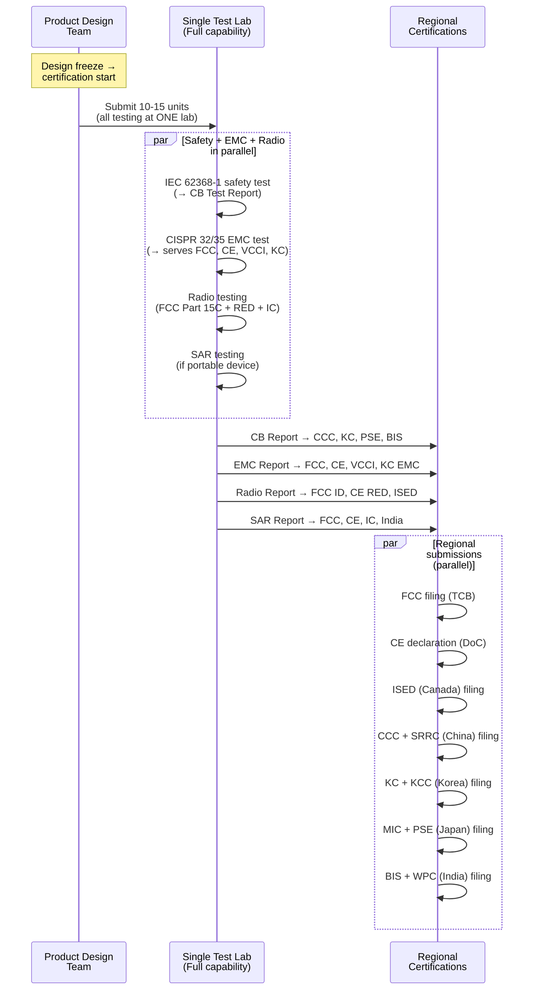
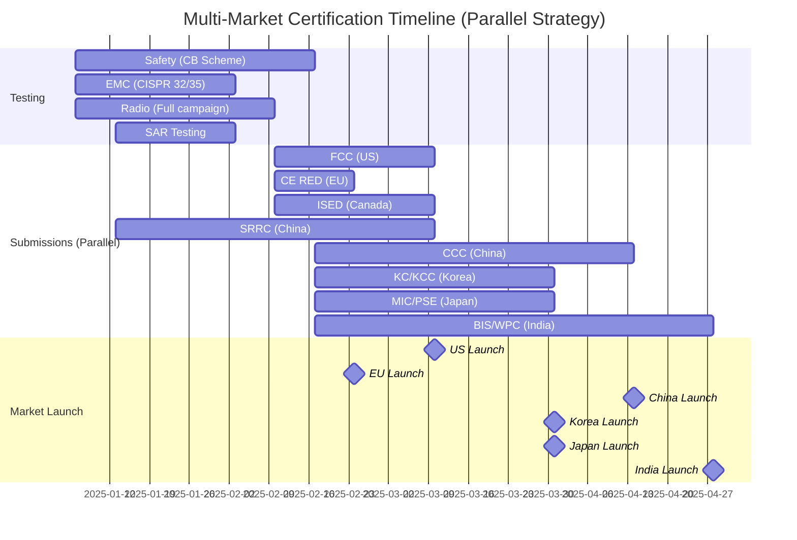

# Global Market Access Roadmap — Multi-Market Certification Strategy

**Topic:** Strategic Multi-Market Product Certification — CB Scheme, Market Prioritization, Cost Optimization  
**Standards:** IECEE CB Scheme, FCC, CE (RED/LVD/EMC), CCC, KC, PSE, BIS, SRRC, multiple regional schemes  
**SDO:** IECEE, IEC, ISO, FCC, EU Commission, CNCA, KATS, METI, BIS, various regional bodies  
**Audience:** Global market access managers, program managers, compliance directors, VP of Engineering  
**Prerequisites:** Understanding of individual market certifications (FCC, CE, CCC, KC, BIS, etc.)

---

## Chapter 1 — Historical Context & Origin Story

### 1.1 Timeline of Global Harmonization

| Year | Event |
|------|-------|
| 1906 | IEC founded (International Electrotechnical Commission) |
| 1947 | ISO founded (International Organization for Standardization) |
| 1952 | IECEE founded (IEC System of Conformity Assessment Schemes for Electrotechnical Equipment) |
| 1985 | EU "New Approach" directives — CE marking concept |
| 1993 | CE marking becomes mandatory (EU Single Market) |
| 1996 | WTO TBT Agreement (Technical Barriers to Trade) — MRA framework |
| 2001 | China CCC replaces CCIB/CCEE (unified mark) |
| 2002 | CB Scheme expansion — major Asian countries join |
| 2004 | EU WEEE/RoHS directives |
| 2014 | EU RED 2014/53/EU (replaces R&TTE Directive) |
| 2016 | IEC 62368-1 transition begins (replaces 60950-1 + 60065) |
| 2019 | IEC 62368-1 mandatory (EU: Dec 2020; US: Dec 2020) |
| 2022 | EU RED Article 3.3 cybersecurity requirements |
| 2023 | EU Battery Regulation enters force |
| 2024 | EU Cyber Resilience Act (CRA) adopted — IoT security mandatory 2027 |
| 2025 | EU RED IoT security enforcement (delegated acts) |

### 1.2 IECEE CB Scheme Concept

| Aspect | Detail |
|--------|--------|
| Full name | IECEE CB Scheme (Certification Body Scheme) |
| Purpose | "Test once, certify in multiple countries" |
| Mechanism | CB Test Report issued by one NCB (National Certification Body) accepted as basis by other NCBs |
| Members | 54 member countries, 88 NCBs, 500+ CB Testing Laboratories |
| Scope | Safety standards (IEC 62368-1, IEC 62133-2, IEC 60335, etc.) |
| Limitation | NOT for radio (no global radio mutual recognition) |
| Benefit | Reduces testing time and cost by 40-60% for multi-market products |

---

## Chapter 2 — Standard Architecture & Structure

### 2.1 Global Certification Landscape

```mermaid
graph TB
    PRODUCT[Global Product Launch]
    
    PRODUCT --> SAFETY[Safety Certification]
    PRODUCT --> EMC[EMC Certification]
    PRODUCT --> RADIO[Radio/Wireless Certification]
    PRODUCT --> SPECIAL[Special Requirements]
    
    SAFETY --> CB[CB Scheme<br/>Test once (IEC 62368-1)<br/>→ Accepted in 54 countries]
    CB --> CE_S[CE: LVD 2014/35/EU]
    CB --> UL_S[US/Canada: UL/cUL listing]
    CB --> CCC_S[China: CCC (GB 4943.1)]
    CB --> KC_S[Korea: KC Safety]
    CB --> PSE_S[Japan: PSE (DENAN)]
    CB --> BIS_S[India: BIS CRO]
    
    EMC --> EMC_TEST[Single EMC Campaign<br/>CISPR 32 + CISPR 35<br/>→ Reusable globally]
    EMC_TEST --> CE_E[CE: EMC 2014/30/EU]
    EMC_TEST --> FCC_E[FCC: Part 15B]
    EMC_TEST --> KC_E[Korea: KC EMC]
    EMC_TEST --> VCCI_E[Japan: VCCI (voluntary)]
    
    RADIO --> NO_MRA[No Global Radio MRA!<br/>Each country = separate cert]
    NO_MRA --> FCC_R[FCC ID (US)]
    NO_MRA --> RED_R[CE RED (EU)]
    NO_MRA --> MIC_R[MIC/TELEC (Japan)]
    NO_MRA --> KCC_R[KCC (Korea)]
    NO_MRA --> SRRC_R[SRRC (China)]
    NO_MRA --> WPC_R[WPC ETA (India)]
    
    SPECIAL --> BATTERY[Battery: UN 38.3 + IEC 62133-2]
    SPECIAL --> SAR_S[SAR: country-specific limits]
    SPECIAL --> ENV[Environmental: RoHS, REACH, WEEE]
    SPECIAL --> ENERGY[Energy: EU ErP, DOE, CEC]
```

### 2.2 Certification Dependency Map

| Phase | Certification | Dependencies | Blocks |
|-------|--------------|-------------|--------|
| 1 (earliest) | UN 38.3 (battery) | None | All shipping, all other testing |
| 1 (earliest) | CB Test Report (safety) | Product finalized | Regional safety certs |
| 2 | FCC (radio + EMC) | Final hardware/firmware | US market entry |
| 2 | CE RED (radio) | Final hardware/firmware | EU market entry |
| 2 | CCC (China safety) | CB report (optional but speeds up) | China market entry |
| 2 | SRRC (China radio) | Final hardware/firmware | MIIT NAL, China market |
| 3 | MIIT NAL (China telecom) | SRRC certificate | China telecom product sale |
| 3 | KC (Korea) | CB report (for safety); radio testing | Korea market entry |
| 3 | PSE/MIC (Japan) | CB report (for PSE); radio test for MIC | Japan market entry |
| 3 | BIS/WPC (India) | CB report (for BIS); radio for WPC ETA | India market entry |
| 4 | Secondary markets | Leverage earlier test data | Market expansion |

---

## Chapter 3 — Technical Deep Dive

### 3.1 CB Scheme — How It Works

| Step | Action | Output |
|------|--------|--------|
| 1 | Select NCB with CB Testing Laboratory (CBTL) capability | Lab selection |
| 2 | Test product to IEC standard (e.g., IEC 62368-1) at CBTL | Test data |
| 3 | CBTL issues CB Test Report (includes national differences) | CB Test Report |
| 4 | NCB issues CB Test Certificate | CB Certificate |
| 5 | Submit CB Report to target country's NCB | Application to target |
| 6 | Target NCB reviews: evaluates national differences (deviations) | Gap analysis |
| 7 | Supplementary testing (if national differences require it) | Additional tests |
| 8 | Target country national mark issued (CE, UL, KC, PSE, etc.) | National certificate |

### 3.2 National Differences (Key Markets)

| Country | Standard | Key National Differences from IEC 62368-1 |
|---------|---------|------------------------------------------|
| USA/Canada | UL 62368-1 / CSA C22.2 No. 62368-1 | 120V/60Hz mains; NRTL mark; different plug; UL-specific clauses |
| EU | EN 62368-1 + EN harmonized | 230V/50Hz; Schuko/UK plug; LVD + EMC + RED compliance |
| China | GB 4943.1-2022 | 220V/50Hz; China plug (GB 1002); Chinese language; CCC factory audit |
| Korea | K 62368-1 (KS C IEC 62368-1) | 220V/60Hz; Korean plug; KC mark; Korean language |
| Japan | J 62368-1 (JIS C 62368-1) | 100V/50/60Hz (dual); Japan plug (Type A); PSE mark; DENAN |
| India | IS 13252 (based on IEC 62368-1) | 230V/50Hz; India plug (Type D/M); BIS registration |
| Australia/NZ | AS/NZS 62368.1 | 230V/50Hz; Type I plug; RCM (ex-C-tick) mark |
| Brazil | NBR IEC 62368-1 | 127V or 220V (regional); Type N plug; INMETRO cert |

### 3.3 EMC Test Reusability

| EMC Test Standard | Equivalent Standards | Reusable For |
|-------------------|---------------------|-------------|
| CISPR 32 (Emissions) | EN 55032 (EU), FCC Part 15B (US), VCCI (Japan), GB/T 9254.1 (China) | All major markets |
| CISPR 35 (Immunity) | EN 55035 (EU), KC EMC (Korea), GB/T 17626.x (China) | EU, Korea, China, Australia |
| IEC 61000-4-x (Immunity suite) | EN 61000-4-x, GB/T 17626.x | Universal |

**Key insight:** A single EMC test campaign to CISPR 32 + CISPR 35 (with appropriate setup) can serve FCC, CE, VCCI, KC EMC, and CCC EMC — saving 40-60% compared to separate test campaigns.

### 3.4 Radio Certification — No Global MRA

| Market | Authority | Process | Timeline | MRA? |
|--------|-----------|---------|----------|------|
| US | FCC | TCB certification (or FCC lab) | 4-6 weeks | — |
| EU | Notified Body or self-assessment (RED) | Self-declare (most) or NB | 4-8 weeks | — |
| Canada | ISED | CAB certification (often concurrent with FCC) | 4-6 weeks | US-Canada MRA exists |
| Japan | MIC / TELEC | Registered certification body | 4-8 weeks | — |
| Korea | KCC/MSIT | Designated testing lab | 4-6 weeks | — |
| China | SRRC | State Radio Testing Center (in-China) | 6-12 weeks | — |
| India | WPC | SARAL Sanchar portal; government review | 6-12 weeks | — |
| Australia | ACMA (RCM) | Self-declaration (for many products) | 2-4 weeks | — |
| Brazil | ANATEL | Designated lab certification | 8-12 weeks | — |
| Taiwan | NCC | Type approval certification | 4-8 weeks | — |

**Note:** There is NO global mutual recognition for radio certifications. Each country/region requires separate radio testing/certification due to unique spectrum allocations and power limits.

---

## Chapter 4 — Implementation Guide

### 4.1 Market Prioritization Framework

```mermaid
graph TB
    START[New Product<br/>Global Launch Decision]
    
    START --> TIER1[Tier 1: Primary Markets<br/>Revenue >80% of target<br/>Launch within 8 weeks of readiness]
    START --> TIER2[Tier 2: Secondary Markets<br/>Revenue 10-15%<br/>Launch within 16 weeks]
    START --> TIER3[Tier 3: Expansion Markets<br/>Revenue <5%<br/>Launch within 6-12 months]
    
    TIER1 --> US[US (FCC + UL)<br/>Largest electronics market]
    TIER1 --> EU[EU (CE: RED + LVD + EMC)<br/>450M consumers, single market]
    TIER1 --> CN[China (SRRC + CCC + MIIT)<br/>Largest smartphone market<br/>LONGEST lead time!]
    
    TIER2 --> JP[Japan (MIC + PSE)<br/>High-value market]
    TIER2 --> KR[Korea (KC + KCC)<br/>Tech-forward]
    TIER2 --> UK[UK (UKCA)<br/>Post-Brexit separate mark]
    
    TIER3 --> IN[India (BIS + WPC)<br/>Growing market]
    TIER3 --> BR[Brazil (ANATEL + INMETRO)<br/>Complex, long timeline]
    TIER3 --> AU[Australia (RCM)<br/>Simple process]
    TIER3 --> TW[Taiwan (NCC + BSMI)<br/>Tech market]
    TIER3 --> SEA[SEA (Singapore, Thailand, etc.)<br/>Various requirements]
```

### 4.2 Optimal Test Campaign Strategy



### 4.3 Pre-Certified Module Strategy

| Approach | Description | Benefit | Limitation |
|----------|-------------|---------|-----------|
| Pre-certified Wi-Fi/BT module | Buy module with FCC/CE/IC/MIC/KC certifications already obtained | Host device: no radio re-test (modular approval) | Must meet modular approval conditions (antenna, separation) |
| Pre-certified cellular modem | Buy cellular modem with PTCRB/GCF + regional radio certs | Avoid full cellular cert (use module grant) | Limited to module's approved configurations |
| Pre-certified LoRa module | Buy LoRa module pre-certified per region | Regional frequency compliance handled | Must use approved antenna; cannot modify RF |
| Custom radio design | Design radio from scratch (IC-level) | Full control, lowest BOM cost | Full radio certification required in EVERY market |

**Module vs. Custom Decision:**
- < 500K units/year: use pre-certified modules (certification cost dominates)
- > 1M units/year: custom design (BOM savings exceed one-time certification cost)
- Time-to-market critical: ALWAYS use pre-certified modules (saves 8-16 weeks)

### 4.4 Single Test Campaign — Cost Optimization

| Strategy | Approach | Savings vs. Separate |
|---------|----------|---------------------|
| Single lab for all testing | One lab does safety, EMC, radio, SAR at once | 20-30% (reduced sample shipping, setup) |
| CB Scheme leveraging | One safety test → reuse report in 10+ countries | 40-60% on safety testing |
| EMC test reuse | CISPR 32/35 → FCC + CE + VCCI + KC + CCC simultaneously | 40-50% (one campaign, multiple reports) |
| Parallel submissions | Submit to all regional authorities simultaneously | Timeline reduction: 30-40% |
| Pre-certified module | Module has radio certs → host skips radio testing | 60-80% savings on radio certification costs |
| Country grouping | Test for strictest market → others automatically pass | 10-20% (avoid conservative over-design) |

### 4.5 Regional Representative Requirements

| Market | Local Entity Required? | Type | Purpose |
|--------|----------------------|------|---------|
| EU | Yes (if manufacturer outside EU) | Authorized Representative (AR) | Holds DoC; contact for market surveillance |
| UK | Yes (if manufacturer outside UK) | UK Responsible Person | UKCA compliance responsibility |
| China | Yes (MANDATORY) | Chinese legal entity (WFOE or local partner) | Certificate holder for CCC/SRRC |
| India | Yes (MANDATORY) | Indian manufacturer or authorized importer | BIS/WPC applicant |
| Korea | Yes (for foreign manufacturers) | Korean Authorized Representative (KAR) | KC certification applicant |
| Japan | Optional (can file directly or via importer) | Japanese Importer of Record (JIR) | PSE/MIC compliance responsibility |
| US | Not required (foreign entity can hold FCC) | — | FCC certification directly by manufacturer |
| Canada | Not required (but local agent recommended) | — | ISED certification by manufacturer OK |
| Australia | Yes | Australian Responsible Supplier | RCM registration holder |
| Brazil | Yes | Local legal entity or representative | ANATEL/INMETRO certificate holder |

---

## Chapter 5 — Certification Cost & Timeline Model

### 5.1 Total Cost Estimation Framework

| Cost Category | First Product | Subsequent Products | Notes |
|--------------|--------------|-------------------|-------|
| Safety testing (CB scheme) | $15,000-$25,000 | $5,000-$10,000 (delta only) | CB report covers most markets |
| EMC testing | $10,000-$18,000 | $5,000-$8,000 (delta) | Single campaign, multiple reports |
| Radio testing (per market) | $5,000-$15,000 each | Similar (hardware-specific) | No MRA — each market separate |
| SAR testing | $8,000-$15,000 | $5,000-$10,000 (if design similar) | One SAR campaign, two methodologies |
| CCC (China) | $15,000-$25,000 | $8,000-$15,000 | Factory audit adds cost |
| Regional filings (10 markets) | $30,000-$60,000 | $15,000-$30,000 | Agent fees, filing fees |
| Local representatives | $10,000-$20,000/year | Same (ongoing) | EU AR, China entity, India, etc. |
| **Total first product (10 markets)** | **$100,000-$200,000** | — | Typical for wireless consumer product |
| **Total with pre-cert module** | **$60,000-$120,000** | — | Module eliminates radio testing |

### 5.2 Timeline Model (Critical Path)

| Market | Safety | EMC | Radio | Total (Parallel) | Notes |
|--------|--------|-----|-------|-------------------|-------|
| US (FCC + UL) | 6-8 wk (UL) | Included in FCC | 4-6 wk (FCC) | 6-8 weeks | Fastest major market |
| EU (CE) | 0 wk (self-declare) | 0 wk (self-declare) | 4-8 wk (if NB needed) | 4-8 weeks | Self-declaration speeds things |
| Canada (ISED) | N/A (cUL) | Included | 4-6 wk | Concurrent with FCC | US-Canada MRA |
| China (CCC + SRRC) | 10-12 wk | Included in CCC | 6-10 wk (SRRC) | 12-16 weeks | LONGEST major market |
| Korea (KC + KCC) | 4-6 wk | 4-6 wk | 4-6 wk | 6-8 weeks | Moderate |
| Japan (PSE + MIC) | 4-6 wk | Voluntary (VCCI) | 4-8 wk (MIC) | 6-8 weeks | Moderate |
| India (BIS + WPC) | 8-12 wk | Included in BIS | 6-12 wk (WPC) | 10-14 weeks | Government-reviewed (slow) |
| Brazil (INMETRO + ANATEL) | 8-12 wk | Included | 8-12 wk | 10-14 weeks | Complex process |
| Australia (RCM) | 2-4 wk (self-declare) | 2-4 wk | 2-4 wk | 4 weeks | Fastest |

### 5.3 Parallel vs. Sequential Strategy



---

## Chapter 6 — Regional & Domain Variants

### 6.1 Market Complexity Ranking

| Rank | Market | Complexity | Key Challenge | Typical Timeline |
|------|--------|-----------|---------------|-----------------|
| 1 | China | Very High | Chinese entity mandatory; factory audit; SRRC in-country; MIIT for telecom | 12-16 weeks |
| 2 | Brazil | Very High | Complex bureaucracy; ANATEL delays; local rep required; Portuguese docs | 10-16 weeks |
| 3 | India | High | WPC government review (slow); BIS expanding scope; Indian entity required | 10-14 weeks |
| 4 | Russia/EAC | High | Political complexity; EAC certification; Russian entity | 8-12 weeks |
| 5 | South Korea | Medium-High | KC+KCC separate; Korean lab preferred; Korean entity | 6-8 weeks |
| 6 | Japan | Medium | MIC + PSE; JIS differences; Japanese local but process clear | 6-8 weeks |
| 7 | US/Canada | Medium | FCC/ISED straightforward; UL for safety | 6-8 weeks |
| 8 | EU | Medium-Low | Self-declaration possible; BUT RED 3.3 security coming | 4-8 weeks |
| 9 | Australia/NZ | Low | Self-declaration; RCM; mutual recognition with many countries | 2-4 weeks |
| 10 | Singapore | Low | IMDA; aligned with international standards; fast process | 2-4 weeks |

### 6.2 Technology-Specific Considerations

| Technology | Global Challenge | Strategy |
|-----------|-----------------|----------|
| Wi-Fi 6E (6 GHz) | Not permitted in China, India, many Asian markets | Firmware-lockable — disable 6 GHz by regulatory domain |
| 5G NR | Different band allocations per country (n77/n78/n79 vary) | SKU strategy — regional RF variants |
| LoRa/Sub-GHz | EU: 868; US: 915; China: 470; India: 865 — ALL different | Multi-band hardware OR regional SKUs (hardware variants) |
| UWB | Different max power and channel allocations | Per-country firmware configuration |
| mmWave 5G | US/Korea active; EU growing; China/India not deployed | Market-specific — currently only for US/Korea SKUs |
| Thread/Matter | 2.4 GHz — same band globally | Good! Standard 2.4 GHz cert covers globally |
| Bluetooth | 2.4 GHz — consistent globally | Simplest — one radio design works everywhere |

---

## Chapter 7 — Comparison of Certification Approaches

| Approach | Time | Cost | Control | Risk | Best For |
|----------|------|------|---------|------|---------|
| Sequential (market by market) | Slowest (18+ months) | Highest (redundant testing) | Highest (learn from each market) | Lowest (fix issues before next market) | First product, conservative company |
| Parallel (all markets simultaneously) | Fastest (12-16 weeks) | Moderate (shared test campaigns) | Moderate | Higher (failure delays everything) | Experienced company, product refresh |
| Phased (Tier 1 → Tier 2 → Tier 3) | Balanced (6-12 months) | Balanced | High | Moderate | Most companies, balanced approach |
| Module-based (pre-certified RF) | Very fast (6-8 weeks) | Lowest | Lower (limited to module capabilities) | Low | IoT, consumer electronics, time-critical |
| Platform-based (common platform, regional SKUs) | Fast (after platform cert) | Lowest long-term | Moderate | Low | High-volume, multiple products |

---

## Chapter 8 — Mermaid Architecture Diagrams

### 8.1 Global Certification Decision Framework

```mermaid
graph TB
    PRODUCT[New Product<br/>Global Launch]
    
    PRODUCT --> EVA{Product has<br/>radio transmitter?}
    
    EVA -->|"No (wired-only)"| WIRED[Wired Product<br/>• CB Scheme for safety<br/>• EMC testing (CISPR 32/35)<br/>• No radio certification needed<br/>• Fast global deployment]
    
    EVA -->|"Yes (wireless)"| WIRELESS{Pre-certified<br/>module available?}
    
    WIRELESS -->|"Yes"| MODULE[Module Approach<br/>• Use pre-certified module<br/>• Host device: safety + EMC only<br/>• Radio: leverage module grant<br/>• Fastest market entry]
    
    WIRELESS -->|"No (custom radio)"| CUSTOM[Custom Radio Design<br/>• Full radio testing per market<br/>• Safety + EMC + Radio + SAR<br/>• Budget: $100K-$200K<br/>• Timeline: 12-16 weeks]
    
    MODULE --> PRIORITY[Market Priority<br/>Decision]
    CUSTOM --> PRIORITY
    WIRED --> PRIORITY
    
    PRIORITY --> P1[Tier 1: US + EU + China<br/>Start IMMEDIATELY<br/>(China has longest lead time)]
    PRIORITY --> P2[Tier 2: Japan + Korea + UK<br/>Start week 2-4<br/>(overlap with Tier 1 testing)]
    PRIORITY --> P3[Tier 3: India + Brazil + Australia<br/>Start after Tier 1 complete<br/>(leverage same test data)]
```

### 8.2 CB Scheme Flow

```mermaid
graph LR
    subgraph "Test Once"
        CBTL[CB Testing Laboratory<br/>Tests product to<br/>IEC 62368-1<br/>+ national differences]
        NCB_ORIG[Originating NCB<br/>Issues CB Certificate<br/>+ CB Test Report]
        CBTL --> NCB_ORIG
    end
    
    subgraph "Certify Many (Parallel)"
        NCB_ORIG --> EU_NCB[EU NCB<br/>→ CE Declaration]
        NCB_ORIG --> US_NCB[US NRTL (UL/Intertek)<br/>→ UL/ETL Mark]
        NCB_ORIG --> CN_NCB[China CQC<br/>→ CCC Mark<br/>(+ factory audit)]
        NCB_ORIG --> KR_NCB[Korea KTL/KTC<br/>→ KC Mark]
        NCB_ORIG --> JP_NCB[Japan JET/JQA<br/>→ PSE Mark]
        NCB_ORIG --> IN_NCB[India BIS<br/>→ ISI/BIS Mark]
        NCB_ORIG --> AU_NCB[Australia SAI<br/>→ RCM Mark]
        NCB_ORIG --> BR_NCB[Brazil INMETRO<br/>→ INMETRO Mark]
    end
```

### 8.3 Product Lifecycle Compliance

```mermaid
graph TB
    subgraph "Phase 1: Development"
        DESIGN[Product Design] --> PRE_SCAN[Pre-compliance Scan<br/>• EMC pre-scan<br/>• Radiated emissions check<br/>• Power integrity]
        PRE_SCAN --> DESIGN_FIX[Design Fixes<br/>Before formal testing]
    end
    
    subgraph "Phase 2: Certification"
        DESIGN_FIX --> FORMAL[Formal Testing<br/>• Safety (CB Scheme)<br/>• EMC (CISPR 32/35)<br/>• Radio (per market)<br/>• SAR (if applicable)]
        FORMAL --> SUBMIT[Regional Submissions<br/>(Parallel)]
        SUBMIT --> CERTS[Certificates Obtained<br/>All target markets]
    end
    
    subgraph "Phase 3: Production & Maintenance"
        CERTS --> LAUNCH[Market Launch]
        LAUNCH --> MAINT[Ongoing Compliance<br/>• CCC annual audit<br/>• UL quarterly check<br/>• Design change management<br/>• Standard revision monitoring]
        MAINT --> CHANGE{Design<br/>Change?}
        CHANGE -->|"Minor"| NOTIFY[Notify authorities<br/>(may not need re-test)]
        CHANGE -->|"Major"| RETEST[Re-certification required<br/>(partial or full)]
    end
```

---

## Chapter 9 — Case Studies

### 9.1 Smartphone — 12-Market Simultaneous Launch

| Aspect | Detail |
|--------|--------|
| Product | 5G smartphone with Wi-Fi 6E, BLE 5.3, NFC, UWB |
| Markets | US, Canada, EU, UK, China, Korea, Japan, India, Australia, Brazil, Taiwan, Singapore |
| Strategy | Parallel certification — all markets simultaneously |
| Lab selection | UL (US) as primary lab — CB Test Report + FCC + ISED + SAR at one location |
| CB Scheme | CB Test Report (IEC 62368-1) at UL → distributed to CCC, KC, PSE, BIS, INMETRO |
| EMC | Single CISPR 32/35 campaign → FCC Part 15, EN 55032/55035, VCCI, KC EMC, GB/T 9254 |
| Radio | FCC ID (US) + ISED (Canada) simultaneous; CE RED (EU); MIC/TELEC (Japan); KCC (Korea); SRRC (China); WPC (India); ANATEL (Brazil); NCC (Taiwan); IMDA (Singapore) |
| 6 GHz challenge | Wi-Fi 6E NOT allowed in China, India → firmware disables 6 GHz in those regulatory domains |
| 5G bands | Regional SKUs: US (n77/n78), EU (n78), China (n41/n78/n79), Korea (n78), Japan (n77/n78/n79) |
| China critical path | SRRC (8 weeks) → MIIT NAL (6 weeks) + CCC (10 weeks parallel) = 14-16 weeks total |
| Timeline achieved | US/EU/Canada: 8 weeks; Japan/Korea: 10 weeks; China: 16 weeks; India: 14 weeks; Brazil: 16 weeks |
| Total cost | ~$350,000 (12 markets, custom radio, multiple 5G bands, factory audits) |
| Lesson | China and Brazil are always the timeline bottlenecks; start them FIRST (week 1) |

### 9.2 IoT Smart Home Hub — Pre-Certified Module Approach

| Aspect | Detail |
|--------|--------|
| Product | Smart home hub (Wi-Fi 6 + Thread/Zigbee + BLE + Ethernet) |
| Markets | US, EU, UK, Canada, Japan, Korea, Australia (7 markets initial) |
| Module strategy | Used pre-certified Wi-Fi/BLE combo module (Qualcomm QCA6696) with FCC/IC/CE/MIC/KC grants |
| Module benefit | No radio testing needed for Wi-Fi/BLE in 5 markets (FCC, ISED, CE, MIC, KCC) |
| Thread/Zigbee | 802.15.4 at 2.4 GHz — module also covers Zigbee radio in same SoC |
| Safety | CB Test Report (IEC 62368-1) at one lab → distributed to all markets |
| EMC | Single campaign (CISPR 32/35) → all markets |
| Cost comparison | With module: $65,000 total (7 markets). Without module: $140,000 (full radio cert per market) |
| Timeline | 6 weeks to all 7 markets (module eliminates radio bottleneck) |
| Cost savings | 54% cost reduction by using pre-certified module |
| Time savings | 6 weeks vs. 12 weeks (50% faster) |
| Trade-off | Slightly higher BOM cost for module vs. discrete design ($2-3 per unit more) |
| Break-even | At 500K units: custom design pays off. Below that: module approach wins |

### 9.3 Failure Case — Sequential Approach Gone Wrong

| Aspect | Detail |
|--------|--------|
| Product | Wireless power bank (Qi charging + USB-C + BLE) |
| Mistake | Company certified US first, then EU, then each market sequentially |
| Problem 1 | Design change needed for EU (different mains voltage for AC variant) → US cert partially invalid |
| Problem 2 | China CCC started 6 months after launch → competitor captured China market |
| Problem 3 | India certification started 12 months in → regulatory requirements changed during wait |
| Total timeline | 18 months to reach 8 markets (vs. 14 weeks if parallel) |
| Total cost | $180,000 (vs. $120,000 parallel — repeat testing, multiple lab setups, re-engineering) |
| Revenue loss | Estimated $2M in delayed market entry revenue (competitor first-mover advantage) |
| Lesson | ALWAYS start longest-lead-time markets first (China, India, Brazil). Run in parallel. |

---

## Chapter 10 — Future Evolution & Industry Trends

| Trend | Timeline | Impact on Market Access |
|-------|----------|----------------------|
| EU Cyber Resilience Act (CRA) | 2027 enforcement | IoT products need cybersecurity certification for EU; new testing burden |
| EU RED Article 3.3 | 2025 enforcement | Security + privacy + network protection for radio equipment |
| Digital Product Passport (EU) | 2027+ | QR code with sustainability/lifecycle data on every product |
| EU AI Act | 2025-2027 phased | Products with AI may need conformity assessment |
| India rapid CRO expansion | Ongoing (annually) | More product categories being added to BIS mandatory scope |
| China CCC simplification | 2024+ | Some categories moving to self-declaration (reduced factory audits) |
| 6 GHz Wi-Fi global adoption | 2024-2027 | More countries approving → easier global Wi-Fi 6E products |
| IEC 62368-1 Ed. 4 | ~2027 | Next edition — all national standards will need to update |
| Mutual recognition expansion | Slow (2025+) | APEC EEMRA discussions; limited progress on radio MRA |
| AI-assisted compliance | 2025+ | Tools for automatic standard mapping, document generation |
| Digital test reports | Growing | Labs issuing digitally signed reports; blockchain verification |
| Combined safety+cybersecurity standard | 2028+ | IEC discussing integrated safety+security testing framework |

---

## Chapter 11 — Interview Questions & Career Guide

### Tier 1: Entry-Level

**Q1:** What is the CB Scheme and how does it save time and cost?  
**A:** The **IECEE CB Scheme** (Certification Body Scheme) is a multilateral agreement among 54 countries and 88 National Certification Bodies (NCBs) to mutually accept test results for product safety standards. **How it works:** (1) A product is tested ONCE at a CB Testing Laboratory (CBTL) to an IEC standard (e.g., IEC 62368-1). (2) A CB Test Report is issued by the originating NCB (e.g., UL in the US). (3) That CB Test Report is then submitted to NCBs in target countries (e.g., CQC in China, KTL in Korea, JET in Japan, BIS in India). (4) The target NCB reviews the report, checks for national differences (country-specific deviations from IEC standard), and may require supplementary testing only for those differences. (5) The target NCB issues their national certificate (CCC mark, KC mark, PSE mark, etc.). **Savings:** Without CB: test in Lab A for US ($15K) + test in Lab B for EU ($12K) + test in Lab C for China ($15K) + test in Lab D for Korea ($10K) = $52K, 16-24 weeks total. With CB: test once at Lab A ($18K for CB report) + supplementary tests ($3K-$5K per country × 4) = $30K-$38K, 8-12 weeks. **Savings: 30-50% cost, 40-50% time.** **Limitation:** CB Scheme covers SAFETY standards only. NOT applicable to: Radio certification (no global MRA for radio — each country separate). EMC (partially — test data reusable, but no formal CB Scheme for EMC). Product-specific requirements (energy efficiency, SAR, etc.).

### Tier 2: Mid-Level

**Q2:** Your company wants to launch a new wireless IoT device in 10 markets simultaneously. The product has Wi-Fi 6 (2.4/5 GHz), BLE 5.0, and a lithium battery. Design the certification strategy with timeline and cost estimate.  
**A:** **Product:** IoT device with Wi-Fi 6 (802.11ax, 2.4/5 GHz), BLE 5.0, internal Li-Po battery (~15 Wh), AC adapter (USB-C PD). **Target markets (10):** US, Canada, EU, UK, Japan, Korea, China, India, Australia, Brazil. **Strategy Overview:** Use pre-certified Wi-Fi/BLE module (if available) OR run single radio test campaign. Use CB Scheme for safety. Single EMC campaign for all markets. **Phase 1 — Pre-certification decisions:**
| Decision | Choice | Rationale |
|----------|--------|-----------|
| Wi-Fi/BLE module | Use pre-certified module (e.g., Espressif ESP32-S3 or Qualcomm) | Saves 6-8 weeks and $50K in radio testing across 10 markets |
| Lab selection | UL or Intertek (single lab for safety + EMC + SAR) | Reduce logistics, single point of contact |
| China approach | Start SRRC and CCC DAY 1 (longest lead time) | China is always critical path |

**Phase 2 — Testing (Weeks 1-6):**
| Test | Standard | Duration | Cost | Notes |
|------|----------|----------|------|-------|
| Safety (CB) | IEC 62368-1 | 4-6 weeks | $18,000 | CB Test Report for all markets |
| EMC | CISPR 32/35 | 3-4 weeks | $12,000 | Single campaign, multiple reports |
| Battery (UN 38.3) | UN 38.3 T.1-T.8 | 4-5 weeks | $10,000 | Cell + pack level |
| Battery (IEC 62133-2) | IEC 62133-2 | 5-6 weeks | $15,000 | CB report for battery safety |
| Radio (if custom) | Various | 4-5 weeks | $0 (module) or $40K (custom) | Module = no radio test needed |
| SAR (if portable) | IEC 62209 / IEEE 1528 | 3 weeks | $8,000 | If device within 20cm of body |

**Phase 3 — Regional submissions (Weeks 4-16, parallel):**
| Market | Filing | Timeline | Cost | Notes |
|--------|--------|----------|------|-------|
| US (FCC + UL) | FCC unintentional emitter (Part 15B) + UL listing | 4-6 weeks | $8,000 | Module grant eliminates radio filing |
| Canada (ISED) | IC unintentional + cUL | 4-6 weeks | $5,000 | Concurrent with US |
| EU (CE) | DoC (LVD + EMC + RED — module) + EU AR appointment | 2-4 weeks | $5,000 | Self-declaration |
| UK (UKCA) | DoC (UK equivalent) + UK RP | 2-4 weeks | $3,000 | Mirror of CE |
| China (SRRC + CCC) | SRRC filing + CCC (CB report basis) + factory audit | 12-16 weeks | $35,000 | Critical path — START WEEK 1 |
| Korea (KC + KCC) | KC safety (CB basis) + KC EMC | 6-8 weeks | $12,000 | Moderate |
| Japan (PSE + VCCI) | PSE (CB basis) + VCCI (voluntary but expected) | 6-8 weeks | $10,000 | Moderate |
| India (BIS + WPC) | BIS CRO (CB basis) + WPC (module may simplify) | 10-14 weeks | $12,000 | Start early |
| Australia (RCM) | Self-declaration + RCM registration | 2-4 weeks | $3,000 | Simplest market |
| Brazil (ANATEL + INMETRO) | ANATEL homologation + INMETRO safety | 10-14 weeks | $15,000 | Complex process |

**Phase 4 — Timeline summary:**
| Milestone | Week |
|-----------|------|
| Testing complete | Week 6 |
| US/Canada/EU/UK/Australia launched | Week 8 |
| Japan/Korea launched | Week 10 |
| India launched | Week 14 |
| China launched | Week 16 |
| Brazil launched | Week 16 |

**Total cost estimate:**
| Category | Cost |
|----------|------|
| Testing (safety + EMC + battery + SAR) | $63,000 |
| Regional filings and certifications | $108,000 |
| Local representatives (annual) | $15,000 |
| Agent fees / consultants | $20,000 |
| **Total (10 markets, module approach)** | **~$206,000** |
| **If custom radio (no module)** | **~$280,000** |

### Tier 3: Senior/Director

**Q3:** As Global Compliance Director, how do you build a scalable certification infrastructure for a company launching 5+ new products per year across 15+ markets?  
**A:** **1. Platform Architecture:** Design product platforms — not individual products. Certify the PLATFORM once → derive products from it. Platform = common radio module + common power supply + common battery. Each product variant = mechanical + software difference (minimal re-certification). Example: Platform A (Wi-Fi/BLE, 5V USB-C) → derives: smart speaker, display, sensor hub, gateway. Re-certification for derivatives: safety delta (new enclosure) + possibly EMC re-test. Radio: NO RE-TEST (same module). **2. Pre-certified Module Library:** Maintain approved module list with certifications per market. Module selection criteria: must have FCC+ISED+CE+MIC+KCC+SRRC at minimum. Build relationships with 2-3 module vendors (primary + backup). When module cert expires: renew proactively (don't wait for product launch). **3. Lab Partner Strategy:** Primary lab: Full-service global lab (UL, Intertek, or TÜV) with presence in US, EU, Asia. Benefit: single contract, volume discounts (30-40% off list), priority scheduling. Secondary lab: Regional specialists (Korean lab for KC, China lab for CCC/SRRC). Volume commitment: negotiate annual testing agreement (guaranteed capacity + pricing). **4. Regional Representative Network:** Establish permanent entities in key markets requiring local presence: Chinese WFOE (for CCC, SRRC) — MANDATORY for China. EU Authorized Representative (for CE DoC responsibility). Korean representative (for KC applications). Indian importer entity (for BIS, WPC). Japanese import entity (for PSE, MIC). Brazilian partner (for ANATEL, INMETRO). These are ANNUAL COSTS but ELIMINATE per-product delays. **5. Compliance Management System:** Track all certificates (expiry, conditions, covered models) in database. Standard change monitoring: subscribe to IEC, ETSI, national body newsletters. Product change management: every PCB change triggers compliance impact assessment. Factory audit calendar: CCC (annual), UL (quarterly), KC (as scheduled). **6. Process Optimization:**
| Process | Efficiency Gain |
|---------|----------------|
| Pre-compliance testing (in-house) | Catch 90% of issues before formal lab → reduce failures |
| CB Test Report (standard practice) | Test once → 10+ markets (40% cost savings) |
| Module re-use | Same module across products → no radio re-cert (60% savings) |
| Parallel submissions | All markets simultaneously (50% time savings) |
| Annual lab contract | Volume pricing (30-40% discount) |
| Test data re-use agreements | One EMC campaign → 10 reports (50% savings) |

**7. Budget Model (5 products/year, 15 markets):**
| Item | Annual Cost | Per Product |
|------|-------------|-------------|
| Testing (5 products × platform approach) | $200,000 | $40,000 |
| Regional filings (15 markets × 5 products) | $400,000 | $80,000 |
| Lab retainer / volume agreement | $50,000 | — |
| Regional entities (China, EU, Korea, India, Japan, Brazil) | $120,000 | — |
| Staff (2 regulatory engineers + 1 manager) | $400,000 | — |
| Tools / database / monitoring | $30,000 | — |
| **Total annual compliance budget** | **~$1,200,000** | **~$240K/product** |
| **Industry average (without optimization)** | ~$2,500,000 | ~$500K/product |
| **Savings from optimization** | **52%** | — |

**8. KPIs for compliance organization:**
| KPI | Target | Measurement |
|-----|--------|-------------|
| Time from design freeze to first market | <8 weeks | Calendar days |
| Time from design freeze to all 15 markets | <16 weeks | Calendar days |
| First-pass test success rate | >90% | Tests passed without re-design |
| Cost per market per product | <$16K | Total cost / (products × markets) |
| Certificate maintenance compliance | 100% | No expired/suspended certificates |
| Regulatory change response time | <30 days | New requirement identified → action plan |

---

## Chapter 12 — Cheat Sheet & Quick Reference

### Global Market Access Summary

```
SAFETY (CB Scheme): Test ONCE → certify in 54 countries
  IEC 62368-1 → UL/CE/CCC/KC/PSE/BIS/RCM/INMETRO
  
EMC: Test ONCE (CISPR 32/35) → multiple reports
  → FCC Part 15B, EN 55032/55035, VCCI, KC EMC, GB/T 9254
  
RADIO: NO global MRA — each market SEPARATE
  FCC (US) ≠ CE RED (EU) ≠ MIC (Japan) ≠ KCC (Korea) ≠ SRRC (China)
  SOLUTION: Pre-certified modules (saves 6-10 weeks + $40-80K)
  
BATTERY: UN 38.3 → MANDATORY for transport (universal)
  IEC 62133-2 → CB Scheme (global safety standard)
```

### Market Priority Sequence

```
START IMMEDIATELY (longest lead time):
  China (SRRC + CCC): 12-16 weeks
  Brazil (ANATEL + INMETRO): 10-16 weeks
  India (BIS + WPC): 10-14 weeks

WEEK 1-2 (parallel with testing):
  US (FCC + UL): 6-8 weeks
  EU (CE self-declare): 4-8 weeks
  Canada (ISED + cUL): 6-8 weeks

WEEK 4+ (after test data available):
  Japan (MIC + PSE): 6-8 weeks
  Korea (KC + KCC): 6-8 weeks
  UK (UKCA): 4-6 weeks
  Australia (RCM): 2-4 weeks
```

### Cost Reduction Strategies

```
1. CB Scheme:        Save 40-60% on safety testing (test once)
2. Pre-cert module:  Save 60-80% on radio certification
3. Single EMC run:   Save 40-50% (one campaign, many reports)
4. Parallel filing:  Save 30-50% on TIME (all markets at once)
5. Lab contract:     Save 30-40% (volume pricing agreement)
6. Platform design:  Save 50-70% on subsequent products
```

### Local Entity Requirements

```
China:     MANDATORY Chinese entity (WFOE or local partner)
India:     MANDATORY Indian entity (manufacturer or importer)
Brazil:    MANDATORY local entity or representative
Korea:     Required (Korean authorized representative)
EU:        Required (Authorized Representative if outside EU)
UK:        Required (Responsible Person if outside UK)
Japan:     Recommended (local importer of record)
Australia: Required (Australian responsible supplier)
US:        NOT required (foreign company can hold FCC directly)
Canada:    NOT required (but local agent recommended)
```

### Radio Frequency Gotchas

```
⚠️ 6 GHz (Wi-Fi 6E): NOT in China, India, many others → firmware disable
⚠️ Sub-GHz IoT: EU=868, US=915, China=470, India=865 — ALL DIFFERENT
⚠️ 5 GHz DFS: Required in EU/US/Japan/Korea; NOT required in China
⚠️ 5.8 GHz: Available in China/US; NOT in EU/Japan (EU stops at 5725)
⚠️ 5G n79 (4.8 GHz): China-unique band (not in EU/US/Korea)
⚠️ No global radio MRA: Every country needs separate radio certification
```

---

*End of Document — 11_Global_Market_Access_Roadmap.md*
