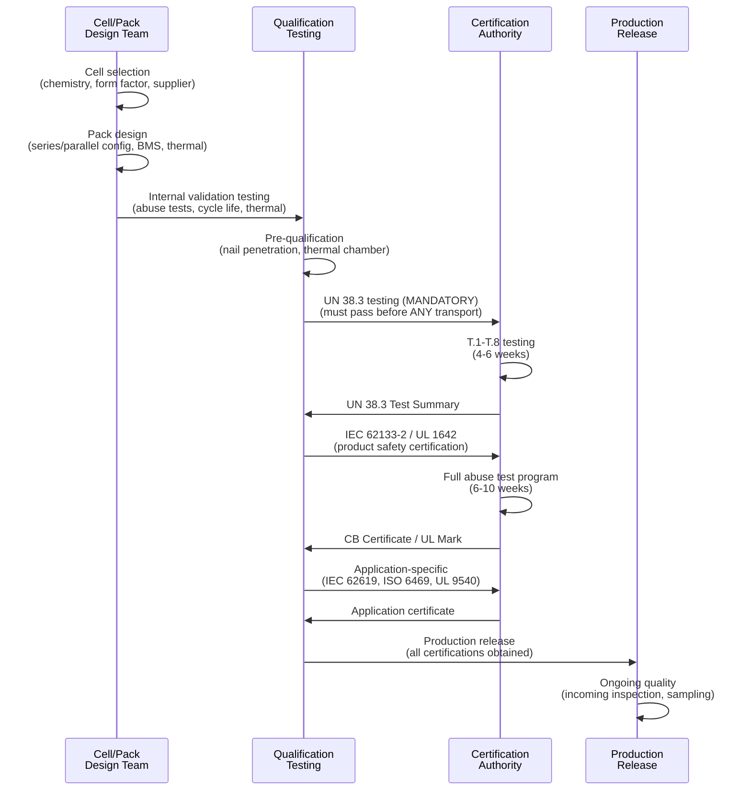

# Battery, Energy Storage & Power Safety — Comprehensive Overview

**Topic:** Global Standards Landscape for Battery Safety, Energy Storage Systems & Power Conversion  
**Standards:** UN 38.3, IEC 62133-2, IEC 62619, UL 9540, ISO 6469, IEC 61851/62196, ISO 15118  
**SDO:** UN/UNECE, IEC TC 21/SC 21A, UL, ISO TC 22/SC 37, SAE, IEEE, NFPA  
**Audience:** Battery engineers, EV system architects, energy storage designers, safety compliance professionals  
**Prerequisites:** Basic electrochemistry, electrical engineering fundamentals, functional safety concepts

---

## Chapter 1 — Historical Context & Origin Story

### 1.1 Timeline

| Year | Event | Impact |
|------|-------|--------|
| 1859 | Gaston Planté invents lead-acid battery | First rechargeable battery |
| 1899 | NiCd battery invented (Waldemar Jungner) | Portable rechargeable power |
| 1970 | M.S. Whittingham discovers lithium intercalation concept | Foundation of Li-ion |
| 1980 | John Goodenough develops LiCoO₂ cathode | Practical Li-ion chemistry |
| 1991 | Sony commercializes first Li-ion battery (18650) | Consumer electronics revolution |
| 1994 | UL 1642 first edition | First formal Li battery safety standard |
| 1998 | UN 38.3 first edition | Transport safety regulation for lithium |
| 2003 | IEC 62133:2002 (first edition) | Portable battery safety standard |
| 2006 | Sony/Dell laptop battery recall (6M units) | Thermal runaway awareness |
| 2010 | First commercial grid-scale Li-ion ESS deployments | Utility-scale storage era begins |
| 2013 | Boeing 787 Dreamliner battery fires (fleet grounded) | Aviation battery safety revolution |
| 2016 | Samsung Galaxy Note 7 recall (2.5M units) | Manufacturing quality standards |
| 2017 | IEC 62133-2:2017 (lithium-specific part) | Dedicated lithium battery standard |
| 2017 | IEC 62619:2017 (industrial lithium) | Industrial/stationary storage safety |
| 2019 | Tesla acquires Maxwell Technologies (dry electrode) | Solid-state battery push |
| 2019 | Nobel Prize: Goodenough, Whittingham, Yoshino | Li-ion battery invention recognized |
| 2020 | CATL introduces cell-to-pack (CTP) technology | Packaging innovation |
| 2021 | Ford F-150 Lightning; EV acceleration globally | Mass-market EV batteries |
| 2022 | UL 9540A thermal runaway propagation testing | ESS fire safety |
| 2023 | SAE J3400 (NACS) — Tesla connector becomes standard | US charging unification |
| 2023 | EU Battery Regulation 2023/1542 adopted | Lifecycle sustainability |
| 2024 | IEC 62619:2022 widely adopted; LFP dominance grows | Industrial battery safety maturity |
| 2025 | EU Battery Regulation: carbon footprint + recycled content requirements | Sustainability enforcement |

### 1.2 Key Safety Incidents Driving Standards

| Incident | Year | Impact on Standards |
|----------|------|-------------------|
| Sony laptop batteries | 2006 | 6M recalled → tightened UN 38.3 criteria |
| Boeing 787 Dreamliner | 2013 | Fleet grounded → RTCA DO-311A, cell-to-cell propagation requirements |
| Samsung Galaxy Note 7 | 2016 | 2.5M recalled → IEC 62133-2 revision; manufacturing quality focus |
| Hoverboard fires | 2015-2016 | UL 2272 created; retailer mandates (Amazon/Walmart) |
| APS McMicken ESS explosion | 2019 | 4 firefighters injured → UL 9540A thermal propagation testing |
| LG Chem ESS fires (Korea) | 2017-2019 | 23+ ESS fires → Korean ESS safety regulations overhauled |
| E-scooter/e-bike fires | 2020-2024 | NYC: 200+ fires/year → local regulations; UL 2849 development |

---

## Chapter 2 — Standard Architecture & Structure

### 2.1 Battery Safety Standards Hierarchy

```mermaid
graph TB
    subgraph "Application Layer"
        EV[EV Batteries<br/>ISO 6469, IEC 62660<br/>GTR No. 20, GB 38031]
        ESS[Energy Storage Systems<br/>UL 9540, NFPA 855<br/>IEC 62933, UL 9540A]
        CONSUMER[Consumer Electronics<br/>IEC 62368-1 (references<br/>IEC 62133-2)]
        INDUSTRIAL[Industrial<br/>IEC 62619, UL 2580<br/>Forklifts, robots, AGVs]
    end
    
    subgraph "Cell & Pack Safety Layer"
        IEC62133[IEC 62133-2:2017<br/>Portable lithium cells/packs<br/>Abuse tests: thermal, crush,<br/>short circuit, overcharge]
        UL1642[UL 1642<br/>Lithium cell safety<br/>(North America)]
        IEC62619_STD[IEC 62619:2022<br/>Industrial lithium<br/>cells/packs safety]
    end
    
    subgraph "Transport Layer"
        UN383[UN 38.3 (Rev 7)<br/>Transport safety: T.1-T.8<br/>MANDATORY for ALL lithium<br/>batteries worldwide]
    end
    
    subgraph "Charging & Power"
        IEC61851[IEC 61851 series<br/>EV conductive charging<br/>AC/DC modes]
        IEC62196[IEC 62196 series<br/>EV connectors/plugs<br/>Type 1/2, CCS, CHAdeMO]
        ISO15118[ISO 15118 series<br/>V2G communication<br/>Plug & Charge]
        NACS[SAE J3400 (NACS)<br/>Tesla standard adopted<br/>by US industry]
    end
    
    subgraph "BMS & Functional Safety"
        BMS[BMS Safety<br/>ISO 26262 (automotive)<br/>IEC 62619 Annex (industrial)<br/>OVP, UVP, OCP, OTP]
    end
    
    EV --> IEC62133
    EV --> IEC62619_STD
    ESS --> IEC62619_STD
    CONSUMER --> IEC62133
    INDUSTRIAL --> IEC62619_STD
    
    IEC62133 --> UN383
    UL1642 --> UN383
    IEC62619_STD --> UN383
    
    EV --> IEC61851
    EV --> IEC62196
    EV --> ISO15118
    EV --> NACS
    EV --> BMS
```

### 2.2 Standard Scope Matrix

| Domain | Transport | Cell Safety | Pack Safety | System Safety | Charging | BMS |
|--------|-----------|-------------|-------------|---------------|----------|-----|
| Consumer electronics | UN 38.3 | UL 1642, IEC 62133-2 | IEC 62133-2 | IEC 62368-1 | — | IEC 62133-2 (basic) |
| EV/HEV | UN 38.3 | IEC 62660-2 | ISO 6469-1, GB 38031 | GTR No.20, ISO 6469 | IEC 61851, ISO 15118 | ISO 26262 |
| Stationary ESS | UN 38.3 | IEC 62619 | IEC 62619 | UL 9540, NFPA 855 | — | IEC 62619 Annex |
| Industrial (forklift/AGV) | UN 38.3 | IEC 62619 | IEC 62619, UL 2580 | Application-specific | IEC 62619 charging | IEC 62619 |
| Aviation | UN 38.3 | RTCA DO-311A | DO-311A, DO-160 | DO-178C/DO-254 | — | DO-254 (hardware) |

---

## Chapter 3 — Technical Deep Dive

### 3.1 Lithium Battery Chemistries & Safety Characteristics

| Chemistry | Abbreviation | Energy Density (Wh/kg) | Thermal Stability | Safety Rank | Application |
|-----------|-------------|----------------------|-------------------|-------------|-------------|
| Lithium Cobalt Oxide | LCO (LiCoO₂) | 150-200 | Low (onset ~150°C) | 5 (least safe) | Consumer electronics |
| Lithium Manganese Oxide | LMO (LiMn₂O₄) | 100-150 | Moderate (~250°C) | 3 | Power tools, medical |
| Lithium Nickel Manganese Cobalt | NMC (LiNiMnCoO₂) | 150-220 | Low-Moderate (~210°C) | 4 | EV (Tesla Model 3 LR, most EVs) |
| Lithium Nickel Cobalt Aluminum | NCA (LiNiCoAlO₂) | 200-260 | Low (~150°C) | 4 | EV (Tesla Model S/X) |
| Lithium Iron Phosphate | LFP (LiFePO₄) | 90-160 | High (~270°C) | 1 (safest) | ESS, EV (BYD, Tesla SR) |
| Lithium Titanate | LTO (Li₄Ti₅O₁₂) | 50-80 | Very High (~high) | 1 (safest) | High-power, long-life |
| Solid-state (various) | SSB | 300-500 (target) | Potentially very high | 1 (target) | Next-gen (2027+) |

### 3.2 Thermal Runaway Mechanism

```mermaid
graph TB
    TRIGGER[Trigger Event<br/>• Internal short circuit<br/>• External short<br/>• Overcharge<br/>• Mechanical damage<br/>• High temperature]
    
    TRIGGER --> SEI[SEI Layer Decomposition<br/>~80-120°C<br/>Releases heat]
    SEI --> SEPARATOR[Separator Melting/Shrinkage<br/>~130-150°C<br/>Internal short grows]
    SEPARATOR --> CATHODE[Cathode Decomposition<br/>~150-250°C<br/>Oxygen release from cathode]
    CATHODE --> ELECTROLYTE[Electrolyte Decomposition<br/>~200-300°C<br/>Flammable gas generation]
    ELECTROLYTE --> THERMAL_RUNAWAY[THERMAL RUNAWAY<br/>>300°C<br/>Self-sustaining<br/>exothermic reaction]
    THERMAL_RUNAWAY --> CONSEQUENCES[Consequences:<br/>• Venting (gas release)<br/>• Fire<br/>• Explosion<br/>• Projectile ejection<br/>• Toxic gas (HF, CO)]
    
    THERMAL_RUNAWAY --> PROPAGATION[Cell-to-Cell Propagation<br/>Heat transfer to<br/>adjacent cells<br/>→ cascading failure]
```

### 3.3 Battery Management System (BMS) Protection Functions

| Function | Abbreviation | Purpose | Typical Threshold |
|----------|-------------|---------|-------------------|
| Over-Voltage Protection | OVP | Prevent overcharge | 4.2V (NMC), 3.65V (LFP) |
| Under-Voltage Protection | UVP | Prevent over-discharge | 2.5V (NMC), 2.0V (LFP) |
| Over-Current Protection | OCP | Prevent excessive current | Application-specific (C-rate limit) |
| Over-Temperature Protection | OTP | Disconnect at high temp | 60-70°C (charge cutoff) |
| Under-Temperature Protection | UTP | Prevent low-temp charging | 0°C (no charge below) |
| Short Circuit Protection | SCP | Detect and disconnect | <1 ms response time |
| Cell Balancing | — | Equalize cell voltages | Passive or active balancing |
| State of Charge (SoC) | SoC | Estimate remaining capacity | Coulomb counting + OCV |
| State of Health (SoH) | SoH | Estimate degradation | Capacity fade, impedance rise |
| Isolation monitoring | — | Detect ground faults | >100 Ω/V (ISO 6469) |

### 3.4 EV Charging Levels & Standards

| Level | Type | Voltage/Current | Power | Standard | Connector |
|-------|------|----------------|-------|----------|-----------|
| Level 1 | AC (single-phase) | 120V/16A (US); 230V/10A (EU) | 1.4-2.3 kW | IEC 61851-1 Mode 1/2 | Type A plug (US); Schuko (EU) |
| Level 2 | AC (single/three-phase) | 240V/80A (US); 400V/32A (EU) | 7-22 kW | IEC 61851-1 Mode 3 | SAE J1772 Type 1; Type 2 (EU) |
| Level 3 (DC) | DC fast charge | 200-1000V / up to 500A | 50-350 kW | IEC 61851-23/24 Mode 4 | CCS Combo 1/2; CHAdeMO |
| Ultra-fast DC | DC high-power | 800-1000V / up to 600A | 350-500 kW | IEC 61851-23 | CCS Combo 2 (EU); NACS (US) |
| Megawatt (MCS) | DC megawatt | 1000-1500V / up to 3000A | 1-4.5 MW | SAE J3068/CharIN MCS | MCS connector (trucks) |

---

## Chapter 4 — Implementation Guide

### 4.1 Battery Product Development Lifecycle



### 4.2 ESS Installation Compliance (UL 9540 + NFPA 855)

| Phase | Requirement | Standard |
|-------|-------------|----------|
| Product certification | ESS equipment tested and listed | UL 9540 |
| Thermal propagation | Fire propagation test at cell/module/unit level | UL 9540A |
| Installation design | Separation distances, ventilation, fire suppression | NFPA 855 |
| Electrical installation | Wiring, grounding, overcurrent protection | NEC Article 706 (NFPA 70) |
| Building code | Fire-rated rooms, egress, hazardous materials | IBC (International Building Code) |
| Commissioning | Functional testing, protective systems verification | UL 9540, local AHJ |
| Operations | Monitoring, maintenance, emergency procedures | NFPA 855 |

### 4.3 EV Battery Pack Certification Path

| Standard | Scope | Key Tests |
|---------|-------|-----------|
| UN 38.3 | Transport safety | T.1-T.8 (altitude, thermal, vibration, shock, short circuit, crush, overcharge, forced discharge) |
| IEC 62660-2 | Cell reliability/abuse | Over-temperature, short circuit, overcharge, crush, forced discharge |
| IEC 62660-3 | Cell safety | Mechanical abuse, thermal abuse, electrical abuse |
| ISO 6469-1 | Pack/system safety | Vibration, thermal shock, mechanical shock, fire resistance, water immersion |
| GTR No. 20 | UN global regulation | Post-crash safety, thermal propagation, water immersion (IPx7) |
| GB 38031 (China) | Chinese EV battery | Thermal propagation: 5-minute warning before fire after thermal event |

---

## Chapter 5 — Certification & Testing

### 5.1 Testing Laboratories by Domain

| Domain | Key Labs | Standards |
|--------|----------|-----------|
| Consumer battery (cells) | UL, TÜV Rheinland, Intertek, SGS | UN 38.3, IEC 62133-2, UL 1642 |
| EV battery (pack) | AVL, HORIBA MIRA, TÜV SÜD, Argonne NL | ISO 6469, IEC 62660, GTR 20 |
| ESS (system) | UL, FM Global, Exponent, DNV | UL 9540, UL 9540A, NFPA 855 |
| Industrial | UL, TÜV Rheinland, Intertek | IEC 62619, UL 2580 |
| China-specific | CATARC (EV), CQC (consumer) | GB 38031, GB 31241 |
| Korea-specific | KTL, KTR, KATRI | KC 62133, KBIA standards |

### 5.2 Cost & Timeline Summary

| Certification | Scope | Cost (Typical) | Timeline |
|--------------|-------|---------------|----------|
| UN 38.3 (cell + pack) | Transport safety | $15,000-$25,000 | 4-6 weeks |
| IEC 62133-2 (cell + pack) | Consumer safety | $20,000-$40,000 | 6-10 weeks |
| UL 1642 + UL 2054 | US consumer battery | $25,000-$45,000 | 8-12 weeks |
| IEC 62619 (industrial pack) | Industrial safety | $30,000-$50,000 | 8-12 weeks |
| UL 9540 (ESS system) | ESS product listing | $80,000-$200,000 | 16-24 weeks |
| UL 9540A (thermal propagation) | Fire test | $50,000-$150,000 | 8-16 weeks |
| ISO 6469 (EV pack) | Automotive battery | $100,000-$300,000 | 16-24 weeks |
| GB 38031 (China EV) | Chinese EV battery | $80,000-$150,000 | 12-20 weeks |
| Full EV battery qualification | All combined | $500,000-$1,500,000 | 6-12 months |

---

## Chapter 6 — Regional Variants

### 6.1 Regional Battery Standards Comparison

| Region | Consumer | EV/Automotive | ESS/Stationary | Transport |
|--------|----------|---------------|---------------|-----------|
| International | IEC 62133-2 | IEC 62660, ISO 6469 | IEC 62619, IEC 62933 | UN 38.3 |
| USA | UL 1642, UL 2054 | SAE J2464, FMVSS 305 | UL 9540, NFPA 855 | 49 CFR 173.185 |
| EU | EN 62133-2 | UN GTR 20, ECE R100 | EN 62619, Battery Reg | ADR |
| China | GB 31241 | GB 38031, GB/T 31485 | GB/T 36276 | — |
| Korea | KC 62133 | KMVSS Article 18-3 | KS C IEC 62619 | — |
| Japan | JIS C 8714 (PSE) | JIS D 1304 | JIS C 4412 | — |
| India | IS 16046 | AIS 038 (under dev.) | IS/IEC 62619 (adoption) | — |

### 6.2 EV Connector Standards by Region

| Region | AC Connector | DC Fast Charge | Ultra-Fast/Preferred |
|--------|-------------|---------------|---------------------|
| USA | SAE J1772 (Type 1) | CCS Combo 1 (CCS1) | NACS (SAE J3400) — becoming dominant |
| EU | Type 2 (IEC 62196-2) | CCS Combo 2 (CCS2) | CCS2 (mandated by AFIR) |
| China | GB/T 20234.2 (AC) | GB/T 20234.3 (DC) | ChaoJi (next-gen, CHAdeMO 3.0 compatible) |
| Japan | SAE J1772 (Type 1) | CHAdeMO | CHAdeMO → NACS transition (some OEMs) |
| Korea | Type 2 | CCS Combo 2 (primarily) | CCS2 + DC Combo |
| India | Type 2 (AC); CCS2 (DC) | CCS2 (adopted) | CCS2 (government mandate) |

---

## Chapter 7 — Comparison of Battery Safety Standards

| Criterion | UN 38.3 | IEC 62133-2 | IEC 62619 | UL 9540 | ISO 6469-1 |
|-----------|---------|-------------|-----------|---------|-----------|
| Application | Transport | Portable consumer | Industrial/stationary | ESS systems | EV batteries |
| Scope | Cell + pack | Cell + pack | Cell + pack | System (full ESS) | Vehicle battery system |
| Temperature test | ±75°C/-40°C cycling | 130°C oven (10 min) | 130°C oven | System thermal test | -40°C to +60°C |
| Mechanical | Vibration + shock + crush | Crush (13 kN) | Crush, vibration, shock | Seismic, mechanical integrity | Vibration, shock, crush |
| Electrical | Short, overcharge, forced | Short, overcharge | Short, overcharge, over-discharge | Electrical fault simulation | Short, overcharge, insulation |
| Fire propagation | No (cell/pack only) | No | No | YES (UL 9540A) | YES (GTR 20 / GB 38031) |
| BMS evaluation | No | Basic (protective functions) | Yes (Annex) | Yes (system control) | Yes (ISO 26262 for ASIL) |
| Factory audit | No | No (CB) / Yes (UL, CCC) | No (CB) / Yes (UL) | Yes (UL quarterly) | OEM internal + type approval |
| Mandatory? | Yes (all Li transport) | Effectively yes (ref'd by product stds) | Yes (for industrial) | Code-required (AHJ) | Type approval (UN R100) |

---

## Chapter 8 — Mermaid Architecture Diagrams

### 8.1 Complete Battery Ecosystem Standards Map

```mermaid
graph TB
    subgraph "Raw Materials & Manufacturing"
        MINE[Mining & Materials<br/>EU Battery Reg: due diligence<br/>Responsible sourcing]
        CELL_MFG[Cell Manufacturing<br/>Quality: IEC 62133-2 Clause 6<br/>Process control, traceability]
    end
    
    subgraph "Product Certification"
        TRANSPORT[Transport: UN 38.3<br/>ALL batteries, ALL modes<br/>Required before ANY shipping]
        SAFETY[Product Safety<br/>Consumer: IEC 62133-2<br/>Industrial: IEC 62619<br/>EV: ISO 6469 + IEC 62660]
        SYSTEM[System Level<br/>ESS: UL 9540 + NFPA 855<br/>EV: GTR No. 20 + UN R100]
    end
    
    subgraph "Charging Infrastructure"
        EVSE[EV Charger Hardware<br/>IEC 61851 (modes 1-4)<br/>IEC 62196 (connectors)]
        COMM[Charging Communication<br/>ISO 15118 (V2G)<br/>OCPP 2.0.1 (management)]
    end
    
    subgraph "End of Life"
        RECYCLE[Recycling<br/>EU Battery Reg 2023/1542<br/>Collection targets<br/>Recycled content mandates]
        PASSPORT[Battery Passport<br/>Digital lifecycle record<br/>SoH, chemistry, carbon]
    end
    
    MINE --> CELL_MFG
    CELL_MFG --> TRANSPORT
    TRANSPORT --> SAFETY
    SAFETY --> SYSTEM
    SYSTEM --> EVSE
    EVSE --> COMM
    SYSTEM --> RECYCLE
    RECYCLE --> PASSPORT
```

### 8.2 EV Charging Architecture

```mermaid
graph LR
    GRID[Utility Grid<br/>AC Power]
    
    GRID --> EVSE_AC[AC EVSE<br/>(Level 1/2)<br/>IEC 61851-1 Mode 2/3<br/>Up to 22 kW]
    GRID --> EVSE_DC[DC EVSE<br/>(Level 3/Fast)<br/>IEC 61851-23 Mode 4<br/>50-350 kW]
    
    EVSE_AC --> CONNECTOR_AC[Connector:<br/>Type 1 (J1772 — US)<br/>Type 2 (Mennekes — EU)<br/>NACS (US replacing J1772)]
    EVSE_DC --> CONNECTOR_DC[Connector:<br/>CCS Combo 1 (US)<br/>CCS Combo 2 (EU)<br/>CHAdeMO (Japan)<br/>GB/T (China)<br/>NACS (US — DC capable)]
    
    CONNECTOR_AC --> OBC[On-Board Charger<br/>(AC-DC conversion<br/>inside vehicle)]
    CONNECTOR_DC --> BATTERY[Battery Pack<br/>directly charged<br/>(DC → battery)]
    OBC --> BATTERY
    
    BATTERY --> BMS_CTRL[BMS<br/>• Cell balancing<br/>• SoC/SoH<br/>• Thermal management<br/>• Safety cutoffs]
    
    subgraph "Communication"
        ISO15118[ISO 15118<br/>Plug & Charge<br/>V2G bidirectional<br/>TLS security]
        OCPP[OCPP 2.0.1<br/>Charger ↔ Backend<br/>Station management]
    end
```

---

## Chapter 9 — Case Studies

### 9.1 Grid-Scale ESS Explosion — APS McMicken (2019)

| Aspect | Detail |
|--------|--------|
| Facility | Arizona Public Service (APS) McMicken ESS (2 MW / 2 MWh) |
| Battery | Samsung SDI NMC lithium-ion cells in rack-mounted system |
| Event | Thermal runaway → internal explosion → flashover when door opened |
| Injuries | 4 firefighters seriously injured; 1 hospitalized for months |
| Root cause | Cell-level internal short → thermal runaway → propagation to neighboring cells |
| Contributing | Deflagration of flammable off-gases (CO, H₂, methane, ethylene) inside sealed container |
| Failure mode | Vented gases accumulated in sealed space → explosive concentration → ignited by arc |
| Standards impact | UL 9540A thermal propagation testing made critical; NFPA 855 updated |
| Industry change | ESS design: ventilation of off-gases, explosion prevention, gas detection mandatory |
| Key lesson | Sealed battery containers + flammable off-gases = explosion risk; ventilation is CRITICAL |

### 9.2 EV Battery Thermal Propagation — GM Bolt Recall (2020-2021)

| Aspect | Detail |
|--------|--------|
| Vehicle | Chevrolet Bolt EV (2017-2022 model years) |
| Battery | LG Energy Solution pouch cells (NMC chemistry) |
| Issue | Spontaneous fires while parked/charging; 12+ fire incidents |
| Root cause | Manufacturing defect: torn anode tab + folded separator in same cell |
| Contributing | Two simultaneous defects required (rare) → made standard QC insufficient |
| Scale | 141,000 vehicles recalled; $1.9 billion cost to GM |
| Fix | Replace ALL battery modules (not just defective cells) — full pack replacement |
| Standard gap | IEC 62660 cell tests didn't catch this manufacturing defect combination |
| Industry impact | Cell-level 100% inspection (X-ray, CT scan) increasingly adopted |
| Key lesson | Rare manufacturing defect combinations can escape statistical sampling → need better in-line inspection |

---

## Chapter 10 — Future Evolution & Industry Trends

| Trend | Timeline | Impact |
|-------|----------|--------|
| Solid-state batteries | 2027-2030 (limited production) | New safety profile; potentially eliminate liquid electrolyte fire risk |
| Sodium-ion batteries (Na-ion) | 2024-2026 (commercial) | Lower cost, inherently safer (no lithium); new standards needed |
| EU Battery Regulation full enforcement | 2025-2027 (phased) | Carbon footprint, recycled content, battery passport requirements |
| Vehicle-to-Grid (V2G) widespread | 2025-2028 | ISO 15118-20 bidirectional; grid integration safety standards |
| Megawatt Charging System (MCS) | 2025-2026 | SAE J3068; up to 3.75 MW for trucks/buses; new safety challenges |
| Cell-to-cell propagation prevention | Now | 5-minute warning requirement (China); UL 9540A Level 4 (no propagation) |
| AI-based BMS (predictive) | 2025+ | ML models for SoC/SoH/fault prediction; functional safety of AI (ISO 26262 + AI) |
| Second-life battery standards | 2025-2027 | IEC 63330; repurpose EV batteries for ESS; safety re-qualification |
| Battery swapping standardization | 2025+ | NIO/CATL approach; need connector + communication standards |
| Dry electrode manufacturing | 2025-2027 | Reduces manufacturing defects; improved safety via better process control |
| 800V architecture (EV) | Now (mainstream) | Higher voltage = new insulation/isolation requirements (ISO 6469-3) |

---

## Chapter 11 — Interview Questions & Career Guide

### Tier 1: Entry-Level

**Q1:** What are the main standards a lithium-ion battery must comply with before it can be shipped and sold in a consumer product?  
**A:** Three layers of compliance: (1) **Transport safety: UN 38.3** — Mandatory for ALL lithium batteries before ANY transport (air, sea, road, rail). Eight tests (T.1-T.8) simulating transport conditions: altitude, thermal, vibration, shock, short circuit, crush, overcharge, forced discharge. Without UN 38.3 Test Summary: battery CANNOT legally be shipped anywhere. (2) **Product safety: IEC 62133-2** (or regional equivalent: UL 1642/2054 for US, GB 31241 for China). Tests battery under abuse conditions that could occur during product use: thermal abuse (130°C), crush, external short circuit, overcharge, forced discharge. IEC 62368-1 (consumer electronics product safety standard) REFERENCES IEC 62133-2: "batteries shall comply with IEC 62133-2." Without this: product cannot get CE mark, UL listing, or CCC. (3) **Application-specific:** depends on product type. Consumer electronics: product-level testing per IEC 62368-1 (integration in device). EV: ISO 6469, IEC 62660, GTR No. 20 (vehicle-level battery safety). ESS: UL 9540, NFPA 855 (system-level energy storage). (4) **Shipping documentation:** IATA DGR (air), IMDG Code (sea), 49 CFR (US road) — classify per UN number (3480/3481/3090/3091), determine Section I or II, apply correct packing instruction (PI 965-970).

### Tier 2: Mid-Level

**Q2:** Explain the difference between IEC 62133-2 and IEC 62619. When would you use each?  
**A:** **IEC 62133-2:2017** — "Secondary cells and batteries containing alkaline or other non-acid electrolytes — Safety requirements for portable sealed secondary lithium cells, and for batteries made from them, for use in portable applications." Scope: PORTABLE consumer devices (smartphones, laptops, tablets, power banks, wearables). Cell energy: typically <100 Wh (consumer range). Tests: thermal abuse 130°C, crush 13kN, external short 55°C, overcharge (recommended rate × 250% capacity), forced discharge, free fall, moulding stress. BMS: basic protective functions required (OVP, UVP, OCP, OTP). Referenced by: IEC 62368-1 (Clause 4.3.8) for ALL consumer electronics with batteries. **IEC 62619:2022** — "Secondary cells and batteries containing alkaline or other non-acid electrolytes — Safety requirements for secondary lithium cells and batteries, for use in industrial applications." Scope: INDUSTRIAL applications: stationary energy storage, forklifts, AGVs, robots, UPS, telecom backup, medical devices (non-portable). Cell energy: can be very large (hundreds of Ah). All sizes. Tests: similar abuse tests BUT also includes: thermal propagation assessment (fire barrier verification), mechanical tests at module/pack level, functional safety of BMS (Annex). BMS: DETAILED requirements for BMS protective functions + failure modes + verification. Referenced by: UL 9540 (ESS), application-specific industrial standards. **When to use which:**
| Product | Standard | Reason |
|---------|----------|--------|
| Smartphone battery | IEC 62133-2 | Portable consumer device |
| Laptop battery | IEC 62133-2 | Portable consumer device |
| Power bank | IEC 62133-2 | Portable consumer accessory |
| Grid-scale ESS (utility storage) | IEC 62619 | Industrial/stationary application |
| Forklift battery | IEC 62619 | Industrial vehicle application |
| UPS battery | IEC 62619 | Industrial backup power |
| Telecom tower battery | IEC 62619 | Industrial stationary |
| E-bike battery | Debated — IEC 62133-2 (if portable) or IEC 62619 (if large/industrial) | Grey area: EN 50604-1 developed specifically for LEVs |
| EV traction battery | Neither directly — ISO 6469 + IEC 62660 | Automotive-specific standards |

### Tier 3: Senior

**Q3:** As lead battery safety engineer, design the complete safety testing and certification strategy for a 100 MWh grid-scale energy storage system using NMC cells.  
**A:** **System:** 100 MWh grid-scale ESS, NMC (Nickel-Manganese-Cobalt) chemistry, containerized deployment (multiple 20-ft containers, 2-5 MWh per container), bidirectional inverters, LV/MV transformer, BMS + EMS (Energy Management System). **1. Cell-level qualification:**
| Test | Standard | Purpose |
|------|----------|---------|
| UN 38.3 (T.1-T.8) | UN 38.3 Rev 7 | Transport safety (required before ANY cell shipment) |
| IEC 62619 cell tests | IEC 62619:2022 | Industrial cell safety (thermal, crush, short, overcharge) |
| Cycle life verification | IEC 62620 | Performance degradation over lifetime (10+ year target) |
| Nail penetration (internal) | Internal standard | Characterize thermal runaway initiation behavior |
| ARC (Accelerating Rate Calorimetry) | Internal | Measure thermal runaway onset temperature, self-heating rate |
| Gas analysis (during TR) | Internal | Identify vented gas composition (for ventilation design) |

**2. Module/rack-level testing:**
| Test | Standard | Purpose |
|------|----------|---------|
| IEC 62619 module tests | IEC 62619:2022 | Module-level safety (mechanical, environmental) |
| UL 9540A — Cell level | UL 9540A | Single-cell thermal runaway characterization |
| UL 9540A — Module level | UL 9540A | Module-level propagation behavior |
| UL 9540A — Unit level | UL 9540A | Full rack/unit propagation + gas generation |
| UL 9540A — Installation level | UL 9540A | Large-scale fire test (full container if needed) |

**3. System-level certification:**
| Certification | Standard | Scope |
|--------------|----------|-------|
| UL 9540 | UL 9540:2023 | Complete ESS listing (all components: battery + BMS + inverter + thermal + fire suppression) |
| IEC 62933-5-2 | IEC 62933 series | System safety (international) |
| NFPA 855 compliance | NFPA 855:2023 | Installation: separation distances, ventilation, suppression, gas detection |
| NEC Article 706 | NFPA 70 | Electrical installation: wiring, grounding, disconnects |
| IEEE 1547 | IEEE 1547.1 | Grid interconnection testing (if providing grid services) |
| IBC Chapter 12 | International Building Code | Fire-rated construction, hazardous materials classification |

**4. Thermal runaway propagation (critical for NMC):** NMC is LESS thermally stable than LFP — TR onset at ~210°C vs ~270°C for LFP. Thermal propagation mitigation strategies: (a) Cell spacing: minimum gap between cells (aerogel, ceramic separators). (b) Cell-level fuse: individual cell fusing to electrically isolate failed cell. (c) Module barriers: intumescent/ceramic fire barriers between modules. (d) Container ventilation: forced exhaust + gas detection (CO, H₂, VOC sensors). (e) Explosion prevention: ventilation rate sufficient to keep gas below LEL (Lower Explosive Limit). (f) Fire suppression: water mist, clean agent (Novec 1230), or aerosol (for container). (g) 5-minute warning target: BMS detects anomaly → system shutdown + alarm ≥5 min before fire. **5. BMS functional safety:** Automotive ESS BMS isn't directly ISO 26262 (automotive), but: IEC 62619 Annex: BMS protective functions mandatory. Risk analysis: FMEA of all BMS failure modes. Redundancy: dual temperature measurement, dual contactor controls. Communication: Modbus/CAN/Ethernet to EMS + SCADA. Cybersecurity: IEC 62351 (power systems security) — prevent unauthorized BMS access. **6. Installation permitting (US example):**
| Permit | Authority | Requirement |
|--------|-----------|-------------|
| Building permit | Local AHJ | Structural, fire code (NFPA 855 + IBC) |
| Electrical permit | Local AHJ | NEC Article 706 compliance |
| Fire department review | Fire marshal | Separation distances, suppression, emergency plan |
| Utility interconnection | Utility + state PUC | IEEE 1547 testing, PPA/interconnection agreement |
| Environmental review | Local/state | CEQA/NEPA (large systems); hazardous materials disclosure |

**7. Cost and timeline:**
| Phase | Timeline | Cost |
|-------|----------|------|
| Cell qualification (UN 38.3 + IEC 62619) | 8-12 weeks | $50,000-$80,000 |
| UL 9540A (cell → module → unit → installation) | 16-24 weeks | $150,000-$500,000 |
| UL 9540 system listing | 20-32 weeks | $200,000-$500,000 |
| NFPA 855 / fire engineering report | 8-12 weeks | $50,000-$100,000 |
| IEEE 1547 grid interconnection testing | 8-16 weeks | $80,000-$150,000 |
| **Total certification** | **9-15 months** | **$530,000-$1,330,000** |
| **Full project (100 MWh)** | **18-24 months** | **Engineering + testing: $2-5M (out of total project $50-80M)** |

---

## Chapter 12 — Cheat Sheet & Quick Reference

### Battery Standards by Application

```
CONSUMER ELECTRONICS (phones, laptops, wearables):
  Transport:    UN 38.3 (T.1-T.8)
  Cell safety:  IEC 62133-2 / UL 1642
  Pack safety:  IEC 62133-2 / UL 2054
  Product:      IEC 62368-1 references IEC 62133-2

ELECTRIC VEHICLES (EV/HEV):
  Transport:    UN 38.3
  Cell:         IEC 62660-2/3
  Pack/System:  ISO 6469-1, UN R100, GTR No. 20
  BMS:          ISO 26262 (ASIL B minimum)
  China:        GB 38031

ENERGY STORAGE SYSTEMS (Grid/Commercial):
  Transport:    UN 38.3
  Cell/Module:  IEC 62619
  System:       UL 9540
  Fire test:    UL 9540A
  Installation: NFPA 855
  Grid:         IEEE 1547

INDUSTRIAL (Forklifts, AGVs, Robots):
  Transport:    UN 38.3
  Cell/Pack:    IEC 62619
  Application:  UL 2580 (EV conversion), application-specific
```

### EV Charging Quick Reference

```
CONNECTORS:
  US:     NACS (SAE J3400) — replacing J1772/CCS1
  EU:     Type 2 (AC) + CCS Combo 2 (DC) — mandated by AFIR
  China:  GB/T 20234 (AC/DC) → ChaoJi (next-gen)
  Japan:  J1772 (AC) + CHAdeMO (DC) → transitioning

POWER LEVELS:
  Level 1:  1-2 kW (household outlet)
  Level 2:  7-22 kW (dedicated home/workplace charger)
  DC Fast:  50-350 kW (highway/public fast charger)
  Ultra:    350-500 kW (800V architecture)
  MCS:      1-4.5 MW (commercial trucks/buses)

COMMUNICATION:
  ISO 15118:  Vehicle ↔ Charger (Plug & Charge, V2G)
  OCPP 2.0.1: Charger ↔ Backend (management)
  ISO 15118-20: Bidirectional (V2G) capability
```

### Thermal Runaway Prevention Hierarchy

```
1. PREVENTION (avoid thermal runaway initiation):
   → Quality manufacturing (no internal defects)
   → BMS protective functions (OVP, OTP, OCP)
   → Thermal management (cooling/heating system)

2. DETECTION (early warning):
   → Temperature monitoring (cell-level sensors)
   → Voltage anomaly detection (cell imbalance)
   → Gas sensors (CO, H₂, VOC — off-gas before fire)
   → Smoke detection (early stage)

3. CONTAINMENT (prevent propagation):
   → Cell-to-cell barriers (aerogel, ceramic)
   → Module-to-module fire barriers
   → Venting pathways (directed away from adjacent cells)
   → Electrical isolation (fusing, contactors)

4. MITIGATION (limit consequences):
   → Fire suppression (water mist, clean agent)
   → Explosion prevention (ventilation below LEL)
   → Safe shutdown (BMS disconnect)
   → Emergency response plan (NFPA 855)
```

---

*End of Document — 00_Battery_Energy_Storage_Overview.md*
