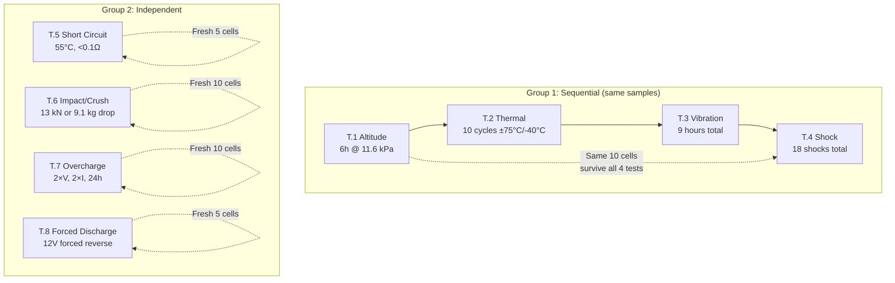

# UN 38.3 — Lithium Battery Transport Safety Testing

**Topic:** UN Manual of Tests and Criteria Section 38.3 — Mandatory Transport Safety Tests for Lithium Batteries  
**Standards:** UN Manual of Tests and Criteria Section 38.3 (Rev 7), IATA DGR, ICAO Technical Instructions, 49 CFR 173.185, IMDG Code  
**SDO:** United Nations (UNECE Sub-Committee of Experts on the Transport of Dangerous Goods), IATA, ICAO, DOT/PHMSA  
**Audience:** Battery safety engineers, logistics managers, DG shipping specialists, compliance engineers  
**Prerequisites:** Basic lithium battery technology, understanding of dangerous goods classification

---

## Chapter 1 — Historical Context & Origin Story

### 1.1 Timeline

| Year | Event |
|------|-------|
| 1990 | First UN provisions for lithium battery transport (limited scope) |
| 1995 | UN Sub-Committee adopts testing provisions for lithium batteries |
| 1999 | UN Manual of Tests and Criteria, 3rd Revised Edition — Section 38.3 formalized |
| 2003 | Rev 4: expanded scope, tighter criteria |
| 2008 | Rev 5: updated test conditions (shock levels, thermal cycling) |
| 2009 | UPS Flight 6 crash (Dubai) — lithium batteries implicated as fire accelerant |
| 2010 | ICAO prohibits bulk lithium battery shipment on passenger aircraft |
| 2013 | Boeing 787 grounding — aviation battery safety review |
| 2015 | Asiana Airlines Flight 991 — lithium battery cargo fire |
| 2016 | ICAO ≤30% SoC rule for bulk lithium battery cargo shipments |
| 2017 | Rev 6: T.6 changed from Impact to Crush (for large cells) |
| 2019 | UN 38.3 Test Summary MANDATORY (must be available for each battery type) |
| 2020 | Rev 7: editorial revisions, clarifications |
| 2022 | Amendment 1 to Rev 7: updated crush test parameters |
| 2023 | IATA DGR 64th Edition: enhanced lithium battery provisions |
| 2024 | Continued tightening of air cargo restrictions for lithium batteries |

### 1.2 Incidents Driving Regulation

| Incident | Year | Impact |
|----------|------|--------|
| Valujet Flight 592 | 1996 | Oxygen generators, not Li batteries — but established DG cargo awareness |
| UPS Flight 6 (Dubai) | 2010 | Li batteries in cargo → fire → crew incapacitation → crash (2 dead) |
| Asiana Flight 991 | 2011 | Cargo fire attributed to lithium batteries → crash |
| USPS cargo container | 2014 | Li battery shipment fire in mail facility |
| Multiple e-commerce | 2015+ | Undeclared Li batteries in packages → aircraft cargo fires |
| Samsung Galaxy Note 7 | 2016 | Banned on ALL aircraft worldwide (in any form) |
| FedEx cargo incidents | Multiple | Li battery fires in sort facilities and aircraft |

---

## Chapter 2 — Standard Architecture & Structure

### 2.1 UN 38.3 Within the Regulatory Framework

```mermaid
graph TB
    UN_MODEL[UN Model Regulations<br/>Recommendations on Transport of<br/>Dangerous Goods (Orange Book)]
    
    UN_MODEL --> MANUAL[UN Manual of Tests and Criteria<br/>Section 38.3: Lithium Batteries<br/>8 tests (T.1 - T.8)]
    
    UN_MODEL --> MODAL[Modal Regulations<br/>(Transport-mode specific)]
    MODAL --> IATA[IATA DGR<br/>Air transport<br/>Packing Instructions<br/>PI 965-970]
    MODAL --> ICAO[ICAO Technical Instructions<br/>Civil aviation<br/>(basis for IATA DGR)]
    MODAL --> IMDG[IMDG Code<br/>Maritime transport<br/>Sea shipping]
    MODAL --> ADR[ADR/RID<br/>European road/rail<br/>transport]
    MODAL --> DOT[US DOT 49 CFR<br/>Part 173.185<br/>US domestic transport]
    
    MANUAL --> RESULT{All 8 tests<br/>PASS?}
    RESULT -->|"Yes"| CLASSIFIED[Battery classified as<br/>Class 9 Dangerous Goods<br/>UN 3480/3481/3090/3091<br/>+ Test Summary document]
    RESULT -->|"No"| CANNOT_SHIP[CANNOT be transported<br/>by any mode<br/>FAILS transport safety]
```

### 2.2 Scope of UN 38.3

| Applies To | Examples |
|-----------|----------|
| Lithium-ion cells | 18650, 21700, pouch cells, prismatic cells |
| Lithium-ion batteries (packs) | Laptop battery packs, power tool packs, EV modules |
| Lithium metal cells | CR2032, CR123A, primary lithium cells |
| Lithium metal batteries | Multi-cell primary lithium battery assemblies |
| ALL sizes | From tiny button cells to massive EV battery packs |
| ALL transport modes | Air, sea, road, rail — no exceptions |
| ALL purposes | Commercial sale, samples, prototypes (with special approval), returns |

---

## Chapter 3 — Technical Deep Dive

### 3.1 The Eight Tests — Complete Specification

#### Test T.1: Altitude Simulation

| Parameter | Specification |
|-----------|--------------|
| Purpose | Simulate low-pressure conditions in aircraft cargo hold at high altitude |
| Condition | 11.6 kPa absolute pressure (equivalent to ~15,000 m / 49,000 ft altitude) |
| Temperature | 20°C ± 5°C |
| Duration | 6 hours minimum |
| Samples | 10 cells (5 at first cycle charge, 5 at 50% depth of discharge) |
| Pass criteria | No mass loss >0.1%; no leakage; no venting; no disassembly; no rupture; no fire; OCV ≥90% of pre-test voltage |

#### Test T.2: Thermal Test

| Parameter | Specification |
|-----------|--------------|
| Purpose | Assess cell/battery integrity under extreme temperature cycling |
| Condition | +75°C (4 hours) → -40°C (4 hours), transition time ≤30 minutes |
| Cycles | 10 complete cycles |
| Duration | ~80+ hours total |
| Samples | 10 cells (or 4 batteries) |
| Storage after | 24 hours at 20°C ± 5°C before assessment |
| Pass criteria | No mass loss >0.1%; no leakage; no venting; no disassembly; no rupture; no fire; OCV ≥90% |

#### Test T.3: Vibration

| Parameter | Specification |
|-----------|--------------|
| Purpose | Simulate vibration encountered during transport |
| Frequency range | 7 Hz to 200 Hz and return (logarithmic sweep) |
| Amplitude | 1 gn peak acceleration (single amplitude 0.8 mm below ~18 Hz) |
| Sweep time | 15 minutes per sweep (7→200→7 Hz) |
| Duration | 12 sweeps per axis × 3 axes = 3 hours per axis, 9 hours total |
| Samples | 10 cells (or 4 batteries) |
| Pass criteria | No mass loss >0.1%; no leakage; no venting; no disassembly; no rupture; no fire; OCV ≥90% |

#### Test T.4: Shock

| Parameter | Specification |
|-----------|--------------|
| Purpose | Simulate handling shocks and drops during transport |
| Condition (cells ≤6 kg) | 150 gn, half-sine pulse, 6 ms duration |
| Condition (cells >6 kg, <12 kg) | 50 gn, half-sine pulse, 11 ms duration |
| Condition (cells ≥12 kg) | 50 gn, half-sine pulse, 11 ms duration |
| Pulses | 3 shocks in positive direction × 3 mutually perpendicular axes = 18 total shocks |
| Samples | 10 cells (or 4 batteries) |
| Pass criteria | No mass loss >0.1%; no leakage; no venting; no disassembly; no rupture; no fire; OCV ≥90% |

#### Test T.5: External Short Circuit

| Parameter | Specification |
|-----------|--------------|
| Purpose | Simulate accidental short circuit during transport |
| Temperature | 55°C ± 2°C (pre-conditioned) |
| Resistance | Total external resistance <0.1 Ω |
| Duration | Until case temperature returns to within 10°C of max OR 1 hour (whichever is longer) |
| Samples | 5 cells (or 5 batteries) — at first cycle charge |
| Pass criteria | No disassembly; no rupture; no fire. Case temperature ≤170°C |
| Note | Short circuit current will be VERY high (potentially hundreds of amps for large cells) |

#### Test T.6: Impact / Crush

| Parameter | Specification (Rev 6+ — Crush) |
|-----------|-------------------------------|
| Purpose | Simulate physical damage from impact/crush during handling |
| Method (cylindrical/prismatic ≤20mm) | Impact: 9.1 kg dropped from 61 cm onto 15.8 mm diameter steel bar placed across cell |
| Method (prismatic >20mm, pouch) | Crush: 13 kN force applied via flat plate (or between two flat surfaces) |
| Crush termination | Stop when: (a) applied force reaches 13 kN, or (b) voltage drops by ≥100 mV, or (c) cell deformed by 50% of original thickness |
| Samples | 10 cells (5 lengthwise, 5 widthwise orientation for crush) |
| Pass criteria | No fire; no rupture (short circuit and voltage drop allowed) |
| Note | This is a DESTRUCTIVE test — cells are expected to fail electrically |

#### Test T.7: Overcharge

| Parameter | Specification |
|-----------|--------------|
| Purpose | Assess safety when battery is charged beyond specifications |
| Applies to | RECHARGEABLE cells and batteries ONLY |
| Charge current | 2× maximum recommended charge current |
| Charge voltage | Minimum of: 2× maximum charge voltage OR 22V (whichever is lower) |
| Duration | 24 hours |
| Samples | 10 cells (at 50% charge) or 4 batteries |
| Pass criteria | No disassembly; no rupture; no fire |
| Note | Cell WILL be severely damaged — this is intentional abuse |

#### Test T.8: Forced Discharge

| Parameter | Specification |
|-----------|--------------|
| Purpose | Assess safety when cell is forced to reverse polarity (series string failure) |
| Condition | Cell connected in series with 12V DC power supply and resistive load |
| Current | Maximum specified discharge current of the cell |
| Duration | Until cell is fully force-discharged (voltage reaches 0V then reverses) |
| Samples | 5 cells (each at fully discharged state) |
| Pass criteria | No disassembly; no rupture; no fire |
| Note | Simulates worst-case in series battery string where one cell fails first |

### 3.2 Sample Requirements Summary

| Test | Cells Required | Batteries Required | Condition |
|------|---------------|-------------------|-----------|
| T.1 Altitude | 10 | 4 | 5 at first cycle charge, 5 at 50% DoD (cells) |
| T.2 Thermal | 10 | 4 | Same as T.1 survivors (sequential with T.1) |
| T.3 Vibration | 10 | 4 | Same samples continue (T.1→T.2→T.3 sequential) |
| T.4 Shock | 10 | 4 | Same samples continue (T.1→T.2→T.3→T.4 sequential) |
| T.5 Short Circuit | 5 | 5 | Fresh samples, first cycle charge |
| T.6 Impact/Crush | 10 | N/A (cells only for impact) | Fresh samples, first cycle charge |
| T.7 Overcharge | 10 (cells) | 4 (batteries) | 50% charge |
| T.8 Forced Discharge | 5 | 5 | Fully discharged |
| **TOTAL (minimum)** | **~38 cells** | **~21 batteries** | — |

### 3.3 Test Sequence



---

## Chapter 4 — Implementation Guide

### 4.1 UN 38.3 Test Summary Document

Since January 1, 2020, a UN 38.3 Test Summary MUST be available for each lithium cell and battery type. Required content:

| Section | Required Information |
|---------|---------------------|
| 1 | Name of cell/battery manufacturer |
| 2 | Cell/battery identification (model, type, trade name) |
| 3 | Chemistry (lithium-ion, lithium polymer, lithium metal, etc.) |
| 4 | Mass of cell/battery |
| 5 | Watt-hour rating (rechargeable) or lithium content (primary) |
| 6 | Physical description (dimensions, form factor) |
| 7 | Tests conducted (which of T.1-T.8 were applicable and performed) |
| 8 | Test results (pass/fail for each test) |
| 9 | Reference to assembled test report |
| 10 | Test laboratory name and address |
| 11 | Date of testing |
| 12 | Signature of responsible person |

### 4.2 Pre-Test Requirements

| Requirement | Specification |
|-------------|--------------|
| Samples must be production-representative | Not hand-built prototypes; must reflect actual production |
| Initial charge | First cycle charge (fully charged per manufacturer spec) OR 50% DoD (test-specific) |
| Stabilization | 24 hours at 20°C ± 5°C before testing |
| Formation | All cells must have completed formation cycling |
| Measurement | Record OCV, mass, dimensions before each test |
| Equipment calibration | All instruments calibrated per ISO 17025 |
| Lab accreditation | ISO 17025 accredited (or recognized by shipping authorities) |

### 4.3 Post-Test Assessment Protocol

| Observation | Pass | Fail |
|-------------|------|------|
| Mass loss >0.1% | ❌ Fail (T.1-T.4) | — |
| Leakage (electrolyte) | ❌ Fail (T.1-T.4) | — |
| Venting (gas release) | ❌ Fail (T.1-T.4) | Acceptable for T.5-T.8 |
| Disassembly (rupture of seals) | ❌ Fail (all tests) | — |
| Rupture (casing breach) | ❌ Fail (all tests) | — |
| Fire | ❌ Fail (all tests) | — |
| Explosion | ❌ Fail (all tests) | — |
| OCV <90% of pre-test | ❌ Fail (T.1-T.4) | — |
| Case temperature >170°C | ❌ Fail (T.5 only) | — |
| Short circuit occurrence | OK (T.6) | Expected in crush test |

### 4.4 Shipping Classification After UN 38.3 Pass

| Battery Type | UN Number | Packing Instruction | Section |
|-------------|-----------|-------------------|---------|
| Li-ion cells/batteries ALONE | UN 3480 | PI 965 | IA, IB, or II |
| Li-ion WITH equipment | UN 3481 | PI 966 | I or II |
| Li-ion IN equipment | UN 3481 | PI 967 | I or II |
| Li metal cells/batteries ALONE | UN 3090 | PI 968 | IA, IB, or II |
| Li metal WITH equipment | UN 3091 | PI 969 | I or II |
| Li metal IN equipment | UN 3091 | PI 970 | I or II |

---

## Chapter 5 — Certification & Compliance

### 5.1 Test Laboratories

| Laboratory | Location | Accreditation | Notes |
|-----------|----------|---------------|-------|
| UL (Underwriters Laboratories) | US, China, Japan, Germany | ISO 17025 | Largest — full UN 38.3 + IEC 62133-2 |
| TÜV Rheinland | Germany, China, Japan | ISO 17025 | Full suite |
| TÜV SÜD | Germany, China, Singapore | ISO 17025 | Battery + automotive specialty |
| Intertek (ETL) | US, UK, China | ISO 17025 | Full suite |
| SGS | Switzerland, China, US | ISO 17025 | Global network |
| Bureau Veritas | France, China | ISO 17025 | Marine + transport specialty |
| MiCOM Labs | US (Maryland) | ISO 17025 | Battery transport specialist |
| NTL (National Testing Lab) | US | ISO 17025 | DOT-focused |
| CNAS labs (China) | China (many cities) | CNAS (ISO 17025 equiv) | For CCC/GB compliance |
| KTL/KTR (Korea) | Korea | KOLAS | Korean market |
| JET/JQA (Japan) | Japan | JAB | Japanese market |

### 5.2 Costs and Timeline

| Service | Cost Range | Timeline | Notes |
|---------|-----------|----------|-------|
| UN 38.3 (cells only, all 8 tests) | $8,000-$15,000 | 4-6 weeks | Standard cell testing |
| UN 38.3 (battery pack, all tests) | $12,000-$25,000 | 4-8 weeks | Pack testing (larger samples) |
| UN 38.3 (cells + pack combined) | $15,000-$30,000 | 6-8 weeks | Most common request |
| Rush/expedited service | +50-100% premium | 2-3 weeks | If lab capacity available |
| Test Summary document | Included (or $500-$1,000) | Included | Mandatory since 2020 |
| Prototype/pre-production testing | Same cost | Same timeline | Special approval for transport of test samples |
| Re-test (after design change) | $5,000-$15,000 | 3-4 weeks | May be partial (only affected tests) |

### 5.3 When Re-Testing is Required

| Change | Re-test Required? | Scope |
|--------|-------------------|-------|
| Cell chemistry change (e.g., NMC→LFP) | YES — full re-test | All T.1-T.8 |
| Cell capacity increase (>20% increase) | YES — full re-test | All T.1-T.8 |
| Cell dimensions change | YES — full re-test | All T.1-T.8 |
| Cell manufacturer change | YES — full re-test | All T.1-T.8 |
| Pack configuration change (series/parallel) | Likely — pack tests | T.1-T.5 at pack level |
| BMS hardware change | Evaluate — if affects safety cutoffs | May need T.5, T.7 |
| Firmware-only change | Generally NO | Unless affects charging limits |
| Cosmetic/enclosure change (same cells) | Generally NO | Document engineering justification |
| Connector change (same cells, same config) | NO | No impact on transport safety |

---

## Chapter 6 — Regional Variants & Modal Regulations

### 6.1 Air Transport (IATA DGR / ICAO)

| Requirement | Detail |
|-------------|--------|
| UN 38.3 mandatory | YES — all lithium batteries on aircraft must have passed |
| Section II thresholds | Li-ion: cells ≤20 Wh, batteries ≤100 Wh. Li-metal: cells ≤1g, batteries ≤2g |
| Passenger aircraft | Section II: allowed (in/with equipment). Section I alone: CARGO ONLY |
| State of Charge (alone) | ≤30% SoC for Section I batteries shipped alone (ICAO since 2016) |
| Package limits | Section II PI 965: max 2.5 kg Li-ion cells per package |
| Quantity limits | Varies by operator and packing instruction |
| DG declaration | Section I: full Shipper's Declaration for Dangerous Goods. Section II: NOT required |
| Training | Section I: DG-trained shipper REQUIRED. Section II: DG awareness training |
| Airline restrictions | Airlines may have ADDITIONAL restrictions beyond IATA DGR minimums |

### 6.2 Maritime Transport (IMDG Code)

| Requirement | Detail |
|-------------|--------|
| UN 38.3 mandatory | YES |
| Section II | Allowed in general cargo (limited quantities exemption) |
| Section I | Class 9 — must be in DG container (segregation from other DG) |
| SoC requirement | No specific SoC limit for sea transport (unlike air) |
| Packaging | UN-specification packaging for Section I; strong packaging for Section II |
| Documentation | DG manifest and IMDG documentation for Section I |

### 6.3 US Ground Transport (49 CFR 173.185)

| Requirement | Detail |
|-------------|--------|
| UN 38.3 mandatory | YES (referenced by 49 CFR) |
| Small batteries (<100Wh) | Excepted from most DG requirements (packaging requirements still apply) |
| Large batteries (>100Wh) | Class 9, HM-215 marking, shipping paper |
| State-level | Some US states have additional requirements (California, NY) |

### 6.4 Transport Mode Comparison

| Requirement | Air (IATA) | Sea (IMDG) | Road (US 49 CFR) | Road (EU ADR) |
|-------------|-----------|------------|-------------------|---------------|
| UN 38.3 | Mandatory | Mandatory | Mandatory | Mandatory |
| SoC ≤30% (alone, Sec I) | YES | No | No | No |
| Passenger aircraft (alone) | PROHIBITED (Sec IA) | N/A | N/A | N/A |
| DG training | Required (Sec I) | Required (Sec I) | Required (Sec I) | Required (Sec I) |
| Packaging | UN spec (Sec I) | UN spec (Sec I) | UN spec (Sec I) | UN spec (Sec I) |
| Labeling | Class 9 + Li battery mark | Class 9 + Li battery mark | Class 9 + Li battery mark | Class 9 + Li battery mark |
| Cost impact | Highest (air cargo rates) | Moderate | Lowest | Low |
| Speed | Fastest | Slowest (weeks) | Moderate | Moderate |

---

## Chapter 7 — Comparison with Related Standards

| Criterion | UN 38.3 | IEC 62133-2 | UL 1642 | IEC 62619 |
|-----------|---------|-------------|---------|-----------|
| Purpose | Transport safety | Product-use safety | Cell safety (US) | Industrial battery safety |
| Question answered | "Can this battery survive transport without hazard?" | "Is this battery safe during consumer product use?" | "Is this cell safe under abuse?" | "Is this industrial battery safe?" |
| Temperature test | T.2: ±75°C/-40°C, 10 cycles | 130°C oven, 10 minutes | 150°C oven (30 min) | 130°C oven |
| Short circuit | T.5: 55°C, <0.1Ω | 55°C, <0.1Ω (+ 20°C) | Room temp + 55°C | 55°C, <0.1Ω |
| Crush | T.6: 13 kN | 13 kN flat plate | 13 kN + 9.1 kg impact | 13 kN |
| Overcharge | T.7: 2×V, 2×I, 24h | Recommended rate, 250% cap | Various | Charge as per IEC 62619 |
| Thermal abuse (oven) | No (only cycling ±75/-40) | YES (130°C direct) | YES (150°C direct) | YES (130°C) |
| Propagation test | No | No | No | Annex (assessment) |
| Certificate type | Test Summary (self-maintained) | CB Certificate / UL Mark | UL listing | CB Certificate / listing |
| Factory audit | No | No (CB) / Yes (UL, CCC) | Yes (UL quarterly) | No (CB) / Yes (UL) |
| Mandatory? | YES (legally required for ALL Li battery transport) | Effectively yes (required by product stds) | Legally voluntary; commercially mandatory | Required for industrial apps |

---

## Chapter 8 — Mermaid Architecture Diagrams

### 8.1 UN 38.3 Complete Test Flow

```mermaid
graph TB
    START[Lithium Cell/Battery<br/>Ready for UN 38.3 Testing]
    
    START --> PREP[Sample Preparation<br/>• Formation complete<br/>• Fully charged (per spec)<br/>• 24h stabilization at 20°C<br/>• Record OCV, mass, dimensions]
    
    PREP --> GROUP1[Group 1: Sequential Tests<br/>(Same 10 cells through all 4)]
    PREP --> GROUP2[Group 2: Independent Tests<br/>(Fresh samples per test)]
    
    GROUP1 --> T1[T.1 ALTITUDE<br/>11.6 kPa, 6h, 20°C<br/>→ Check: mass, OCV, visual]
    T1 --> T2[T.2 THERMAL<br/>+75°C/-40°C, 10 cycles<br/>→ Check: mass, OCV, visual]
    T2 --> T3[T.3 VIBRATION<br/>7-200 Hz, 1g, 9 hours<br/>→ Check: mass, OCV, visual]
    T3 --> T4[T.4 SHOCK<br/>150g/50g, 18 shocks<br/>→ Check: mass, OCV, visual]
    
    GROUP2 --> T5[T.5 SHORT CIRCUIT<br/>55°C, <0.1Ω<br/>→ No fire/rupture, ≤170°C]
    GROUP2 --> T6[T.6 CRUSH<br/>13 kN or impact<br/>→ No fire/rupture]
    GROUP2 --> T7[T.7 OVERCHARGE<br/>2×V, 2×I, 24h<br/>→ No fire/rupture/disassembly]
    GROUP2 --> T8[T.8 FORCED DISCHARGE<br/>12V DC, max current<br/>→ No fire/rupture/disassembly]
    
    T4 --> ASSESS{All tests<br/>PASS?}
    T5 --> ASSESS
    T6 --> ASSESS
    T7 --> ASSESS
    T8 --> ASSESS
    
    ASSESS -->|"YES"| PASS[UN 38.3 PASSED<br/>• Issue Test Summary<br/>• Battery can be shipped<br/>• Classify: UN 3480/3481/3090/3091<br/>• Determine Section I or II]
    ASSESS -->|"NO"| FAIL[UN 38.3 FAILED<br/>• Battery CANNOT be shipped<br/>• Root cause analysis<br/>• Design modification required<br/>• Re-test after fix]
```

### 8.2 Shipping Decision Tree

```mermaid
graph TB
    BATTERY[Lithium Battery<br/>UN 38.3 PASSED]
    
    BATTERY --> Q1{Rechargeable<br/>or Primary?}
    Q1 -->|"Rechargeable (Li-ion)"| LI_ION[Li-Ion<br/>UN 3480/3481]
    Q1 -->|"Primary (Li metal)"| LI_METAL[Li Metal<br/>UN 3090/3091]
    
    LI_ION --> Q2{How is it shipped?}
    Q2 -->|"Battery ALONE<br/>(not with device)"| UN3480[UN 3480<br/>Packing Instruction: PI 965]
    Q2 -->|"PACKED WITH device<br/>(in same box, not installed)"| UN3481_WITH[UN 3481<br/>PI 966]
    Q2 -->|"CONTAINED IN device<br/>(installed in device)"| UN3481_IN[UN 3481<br/>PI 967]
    
    UN3480 --> Q3{Cell ≤20Wh AND<br/>Battery ≤100Wh?}
    Q3 -->|"Yes"| SEC_II_965[SECTION II<br/>• Lithium battery mark<br/>• Strong packaging<br/>• Max 2.5 kg/package<br/>• No DG declaration<br/>• Passenger aircraft OK<br/>(check airline policy)]
    Q3 -->|"No (Cell >20Wh<br/>or Battery >100Wh)"| Q4{Battery ≤150Wh<br/>AND Cell ≤60Wh?}
    Q4 -->|"Yes"| SEC_IB[SECTION IB<br/>• DG packaging<br/>• Lithium battery mark<br/>• Reduced requirements<br/>• Cargo aircraft only]
    Q4 -->|"No (very large)"| SEC_IA[SECTION IA<br/>• Full DG packaging (UN spec)<br/>• Class 9 label<br/>• Full DG declaration<br/>• Cargo aircraft only<br/>• Trained DG shipper<br/>• SoC ≤30% (air)]
```

---

## Chapter 9 — Case Studies

### 9.1 Consumer Electronics — Laptop Battery UN 38.3

| Aspect | Detail |
|--------|--------|
| Product | Laptop battery pack: 4S1P configuration, 56 Wh (4 × 3500 mAh × 4.0V) |
| Cell | 21700 cylindrical NMC cell, 3500 mAh, 3.6V nominal |
| Testing scope | Cell-level: T.1 through T.8. Pack-level: T.1 through T.5 (+ T.7, T.8 for pack) |
| Sample quantity | Cells: 38 minimum. Packs: 21 minimum (62 cells consumed for cell tests + 84 cells in 21 packs) |
| T.1 (altitude) | All cells and packs survived 11.6 kPa for 6 hours. No mass loss, OCV stable. |
| T.2 (thermal) | All survived 10 cycles of 75°C/-40°C. Minor impedance increase observed (normal aging). |
| T.3 (vibration) | No issues. Spot welds and BMS connections remained intact. |
| T.4 (shock) | No issues at 150g. Tab welds inspected — intact. |
| T.5 (short circuit) | Peak current: ~280A (cell), ~70A (pack with BMS disconnect). Max temp: 92°C (cell) — well under 170°C limit. Pack BMS tripped in <1ms. |
| T.6 (crush) | Cells crushed at 13 kN: voltage drop observed at ~8 kN. No fire. Internal short confirmed (expected). |
| T.7 (overcharge) | Charged at 2×I (7A) to 2×V (8.4V → but limited to 22V for single cell). Cell vented safely at ~5.2V. No fire. |
| T.8 (forced discharge) | Cell reversed without fire. Temperature reached 65°C then stabilized. |
| Result | ALL PASS. Test Summary issued. Battery classified as UN 3481 (Li-ion in equipment). |
| Shipping | PI 967, Section II (56 Wh < 100 Wh limit). Passenger aircraft permitted (installed in laptop). |
| Timeline | 5 weeks from sample submission to Test Summary issued. |
| Cost | $18,000 (cells + packs, full program at UL lab). |

### 9.2 EV Battery Module — UN 38.3 Challenges

| Aspect | Detail |
|--------|--------|
| Product | EV battery module: 12S4P, 120 Ah, 50.4V nominal, 6.05 kWh per module |
| Cell | Pouch NMC cell, 60 Ah, 3.7V nominal |
| Challenge 1 | Module weighs 45 kg → T.4 shock level: 50g (not 150g) at 11 ms pulse |
| Challenge 2 | Large pouch cells: T.6 crush must be 13 kN (flat plate method, not impact) |
| Challenge 3 | T.7 overcharge at 2× voltage = 100.8V for module → significant energy during abuse |
| Challenge 4 | Sample quantity: need 4 complete modules (4 × 48 cells = 192 cells minimum) — expensive |
| T.1 (altitude) | Large module in vacuum chamber — OK (needed large-format chamber) |
| T.5 (short circuit) | Module BMS disconnected contactors in 0.5 ms. Without BMS: predicted short >2000A. Tested with BMS active (representative condition). |
| T.6 (crush) | At cell level: 60 Ah pouch cells crushed. Large deformation before internal short. No fire. |
| T.7 (overcharge) | 2× current = 240A (extreme). Module heated to 85°C. BMS would normally prevent this. Tested cell-level overcharge for module compliance. |
| Result | PASS (all 8 tests). Test Summary issued for module configuration. |
| Shipping | PI 965, Section IA (6.05 kWh = 6050 Wh >> 100 Wh limit). Full DG: UN-specification packaging, Class 9, DG declaration, CARGO AIRCRAFT ONLY, SoC ≤30%. |
| Special packaging | Custom steel crate with thermal insulation. Absorbent material for potential electrolyte leakage. |
| Cost | $45,000 (large sample quantities, large-format test equipment) |
| Timeline | 8 weeks (scheduling large-format test equipment was bottleneck) |

---

## Chapter 10 — Future Evolution & Industry Trends

| Trend | Timeline | Description |
|-------|----------|-------------|
| UN 38.3 Rev 8+ discussions | 2025-2027 | Additional tests under consideration for large-format cells |
| Thermal propagation test | Being discussed | Possible addition of cell-to-cell propagation assessment to UN 38.3 |
| Solid-state battery provisions | 2027+ | New test criteria may be needed (different failure modes) |
| Tighter air cargo restrictions | Ongoing | ICAO continues to restrict lithium batteries on aircraft |
| E-commerce enforcement | Now | Focus on undeclared lithium batteries in parcels (enforcement crackdown) |
| Digital Test Summary | 2025+ | Electronic/blockchain-verified Test Summary (anti-fraud) |
| SoC monitoring during transport | Developing | IoT sensors on battery shipments to verify SoC compliance |
| Larger battery systems (ESS modules) | Growing challenge | UN 38.3 tests at very large scale (100+ kg modules) — equipment limitations |
| Na-ion battery classification | 2025+ | Sodium-ion may NOT be Class 9 DG (no lithium content) — under review |
| Recyclability during transport | Emerging | End-of-life battery transport safety (damaged/degraded cells) |
| Automated compliance tools | 2025+ | AI tools for Test Summary generation, shipping classification |

---

## Chapter 11 — Interview Questions & Career Guide

### Tier 1: Entry-Level

**Q1:** A lithium-ion battery with a 56 Wh rating is to be shipped by air installed inside a laptop. What UN number, packing instruction, and section apply?  
**A:** **UN Number:** UN 3481 — "Lithium ion batteries contained in equipment" (battery is installed inside the laptop). **Packing Instruction:** PI 967 — "Lithium ion batteries contained in equipment." **Section determination:** Cell Wh rating: need to check individual cell. If cell ≤20 Wh AND battery ≤100 Wh → Section II applies. 56 Wh is well under the 100 Wh battery threshold. Assuming cells are standard (e.g., 14 Wh per cell in 4S1P = 56 Wh total) → cells are ≤20 Wh. **Therefore: Section II applies.** **Section II requirements (PI 967):** No dangerous goods shipper's declaration needed. No Class 9 label needed. No UN-specification packaging needed. Equipment must be protected from short circuit (device turned off, battery contacts protected). Strong outer packaging. Each package ≤5 kg net weight of batteries (unless device is larger). **Can ship on passenger aircraft:** YES — Section II PI 967 is permitted on both passenger and cargo aircraft. **No quantity limit per consignment** (for Section II PI 967 contained in equipment). **Summary:** This is the SIMPLEST shipping case for lithium batteries — a standard laptop in a box with minimal DG requirements.

### Tier 2: Mid-Level

**Q2:** Your company designed a new 150 Wh battery pack for a drone. Walk through the UN 38.3 compliance process and subsequent shipping classification.  
**A:** **Step 1: UN 38.3 Testing** Battery: 150 Wh lithium-ion pack (assuming 6S configuration, 25 Ah, 22.2V nominal). Need both cell-level AND pack-level testing. Cell testing (T.1-T.8): all 8 tests on the individual cells used in the pack. Pack testing (T.1-T.5 + T.7 + T.8): sequential tests T.1-T.4 on same 4 packs, plus independent T.5, T.7, T.8. Total samples: ~38 cells + ~21 packs (containing 126+ cells) = significant cost. **Step 2: Test considerations for 150 Wh pack:** T.4 (shock): pack weight <6 kg → 150g, 6 ms (severe). If pack >6 kg → 50g, 11 ms. T.5 (short circuit): BMS should disconnect; but test may require bypassing BMS (check with lab). T.7 (overcharge): 2× voltage = ~44.4V at 2× current — significant energy abuse. Safety features (vent, CID) should prevent catastrophic failure. **Step 3: Classification after passing** UN Number: UN 3480 (if shipped alone, not in drone). UN 3481 (if shipped with or in the drone). **For battery alone (UN 3480, PI 965):** 150 Wh exceeds 100 Wh threshold → CANNOT use Section II. 150 Wh is ≤150 Wh → qualifies for Section IB. **Section IB (PI 965) requirements:** Batteries tested to UN 38.3. Batteries protected against short circuit. Packed in strong outer packaging (not necessarily UN-spec for IB). Lithium battery mark on package. "Cargo Aircraft Only" label (if shipped alone). No DG shipper's declaration needed (Section IB). Maximum 10 kg of batteries per package. **If battery >150 Wh:** would be Section IA → full DG (UN-spec packaging, declaration, trained shipper). **For battery IN drone (UN 3481, PI 967):** 150 Wh in equipment: check if ≤2 batteries per package → Section II MAY still apply for PI 967. PI 967 Section II: battery ≤100 Wh → doesn't qualify (150 Wh). PI 967 Section I: DG packaging required; cargo aircraft may be required (check). **Practical shipping for the 150 Wh drone battery:** Most common: ship drone with battery installed (PI 967, Section I) — needs DG packaging. Or: ship drone without battery + ship battery separately (PI 965 Section IB). **Air transport:** Cargo aircraft ONLY for battery alone at 150 Wh (Section IB/IA). Airlines may accept drone with battery installed on passenger aircraft if <160 Wh and device is off. **Airline 100 Wh / 160 Wh passenger rules (IATA):** Passengers can carry batteries up to 100 Wh (no approval needed) and 100-160 Wh (with airline approval). 150 Wh drone battery: passenger needs airline approval to carry in cabin. **Cost estimate:** UN 38.3 testing: $20,000-$30,000 (cells + packs). Timeline: 6-8 weeks.

### Tier 3: Senior

**Q3:** Design the complete transport compliance strategy for a battery company shipping cells (21700 format, 5 Ah, 18.5 Wh) globally to 15 OEM customers across air, sea, and ground modes.  
**A:** **Product:** 21700 cylindrical Li-ion cell, NMC chemistry, 5000 mAh / 3.7V = 18.5 Wh per cell. Shipped as individual cells (UN 3480) to OEM customers who build them into packs/products. **Key classification:** Individual cell: 18.5 Wh — this is UNDER the 20 Wh threshold → Section II eligible. This is favorable — simpler shipping requirements. **1. UN 38.3 certification:** Full T.1-T.8 testing at ISO 17025 accredited lab. Sample requirement: ~38 cells (can use production cells after formation). Timeline: 4-6 weeks. Cost: $10,000-$15,000. Result: Test Summary document (mandatory since 2020). Store Test Summary: must be available to anyone in the transport chain (shippers, airlines, customers). Provide Test Summary to all 15 OEM customers (they need it for their own compliance). **2. Shipping classification:** UN Number: UN 3480 (lithium ion batteries, shipped alone — cells are "batteries" for transport purposes). Packing Instruction: PI 965. Section: Section II (cells ≤20 Wh → 18.5 Wh qualifies). **3. Section II PI 965 requirements:**
| Requirement | Detail |
|-------------|--------|
| UN 38.3 testing | ✅ Completed |
| Packaging | Strong outer packaging; cells protected from short circuit (individual sleeves or separators) |
| Package marking | Lithium battery mark (UN 3480, telephone number, weight if >12 kg) |
| Package weight limit | ≤2.5 kg of lithium-ion cells per package |
| Maximum per consignment | No limit (air: per airline/operator) |
| DG declaration | NOT required for Section II |
| DG training | Awareness training (not full DG certification) |
| Aircraft restriction | Passenger aircraft: allowed (Section II) |
| Cargo aircraft only? | No — passenger aircraft permitted |

**4. Packaging design:** Cells shipped in trays/crates with individual cell isolation: Each cell in plastic sleeve or insert (prevent terminal-to-terminal contact). Corrugated cardboard tray holding cells (2.5 kg per inner package maximum for air). Inner packages stacked in outer shipping case. Cushioning material (foam) to prevent movement. **2.5 kg limit means:** 18.5 Wh cell weighs ~70g → 2500g / 70g = ~35 cells per inner package maximum. Typical: ship 100-5000+ cells per outer package (multiple inner packages). **5. Air transport (IATA DGR):** Section II PI 965: allowed on passenger AND cargo aircraft. Mark each package with lithium battery mark. No Shipper's Declaration needed. Airline notification: some airlines require advance notice even for Section II. Over-pack: if multiple packages in one over-pack, mark over-pack too. **6. Sea transport (IMDG Code):** Section II: limited quantity exemption. Same marking requirements. More relaxed quantity limits per container. Cost-effective for bulk shipments to overseas customers (Asia-Europe, Asia-US). **7. Ground transport (US: 49 CFR; EU: ADR):** Section II equivalent: excepted from most DG requirements. Still need: proper packaging, mark, documentation (SDS available). No placard required on vehicle (under quantity thresholds). **8. Global customer compliance support:** Provide to all 15 OEM customers: (a) UN 38.3 Test Summary (PDF — one per cell model). (b) Material Safety Data Sheet (MSDS/SDS) for lithium-ion cell. (c) Shipping classification confirmation letter (UN 3480, PI 965, Section II). (d) Packaging specification (recommended packaging for customer re-shipment). (e) Certificate of compliance (stating cells meet UN 38.3 requirements). This documentation package enables customers to: receive cells at their facility, incorporate into battery packs, obtain their own pack-level UN 38.3, and ship finished products. **9. Special scenarios:** (a) Customer requests cells at 30% SoC: Not required for Section II, but accommodated for customers who will ship as Section I (>100 Wh packs). Ship cells at 30% SoC upon request. (b) Prototype/engineering samples: Before UN 38.3 is complete on new cell design, need "Competent Authority Approval" for transport. Apply to DOT (US), CAA (UK), DGCA (India), etc. for special permit. (c) Defective/damaged cells (returns): CANNOT ship by normal Section II. Requires special provisions: SP 376 (damaged/defective lithium batteries). Packaging must be to the satisfaction of competent authority. Ground transport may be only option (some airlines refuse damaged Li batteries entirely). **10. Cost structure (annual):**
| Item | Cost |
|------|------|
| UN 38.3 initial certification | $12,000 (one-time per cell model) |
| Packaging materials (per shipment) | $2-5 per kg shipped |
| Lithium battery marks/labels | $0.50-$1.00 per package |
| DG awareness training (staff) | $500-$1,000 per person/year |
| Test Summary maintenance | Negligible (document update only) |
| Annual compliance (logistics team) | $20,000-$50,000 (staff time, materials, training) |

---

## Chapter 12 — Cheat Sheet & Quick Reference

### UN 38.3 Eight Tests Summary

```
TEST    NAME               CONDITION                    PASS = NO:
T.1     Altitude           11.6 kPa, 6h, 20°C         fire/rupture/vent/leak + OCV≥90%
T.2     Thermal            +75°C/-40°C, 10 cycles      fire/rupture/vent/leak + OCV≥90%
T.3     Vibration          7-200 Hz, 1g, 9h            fire/rupture/vent/leak + OCV≥90%
T.4     Shock              150g/50g, 6ms, 18 pulses    fire/rupture/vent/leak + OCV≥90%
T.5     Short Circuit      55°C, <0.1Ω                 fire/rupture + temp≤170°C
T.6     Crush              13 kN (or 9.1kg impact)     fire/rupture (short OK)
T.7     Overcharge         2×V, 2×I, 24h               fire/rupture/disassembly
T.8     Forced Discharge   12V DC, max I               fire/rupture/disassembly

T.1-T.4: SEQUENTIAL on same samples (10 cells survive all 4)
T.5-T.8: INDEPENDENT (fresh samples per test)
T.7: Rechargeable ONLY
```

### Shipping Classification Quick Card

```
LITHIUM-ION:
  Alone:        UN 3480, PI 965
  With device:  UN 3481, PI 966
  In device:    UN 3481, PI 967

LITHIUM METAL:
  Alone:        UN 3090, PI 968
  With device:  UN 3091, PI 969
  In device:    UN 3091, PI 970

SECTION II thresholds (simplified shipping):
  Li-ion CELL:    ≤20 Wh          │  Li-metal CELL:    ≤1g
  Li-ion BATTERY: ≤100 Wh         │  Li-metal BATTERY: ≤2g

SECTION I (fully regulated DG):
  Above Section II thresholds
  Up to: Cell 60 Wh / Battery 150 Wh (Section IB — some relaxation)
  Above 60/150 Wh: Section IA (most restrictive)
```

### Critical Rules

```
⚠️ UN 38.3 Test Summary: MANDATORY since January 2020
⚠️ Cargo aircraft SoC: ≤30% for batteries shipped ALONE (ICAO 2016+)
⚠️ Passenger carry-on: ≤100 Wh (no approval); 100-160 Wh (airline approval)
⚠️ Checked baggage: spare batteries PROHIBITED in checked bags
⚠️ Damaged/defective: SPECIAL PROVISIONS required (SP 376) — cannot ship normally
⚠️ Prototypes (no UN 38.3): need Competent Authority Approval for transport
⚠️ Re-test required if: chemistry, capacity (>20%), dimensions, or manufacturer changes
⚠️ No minimum size exemption: even CR2032 coin cells need UN 38.3
```

---

*End of Document — 01_UN_38_3_Transport_Safety.md*
