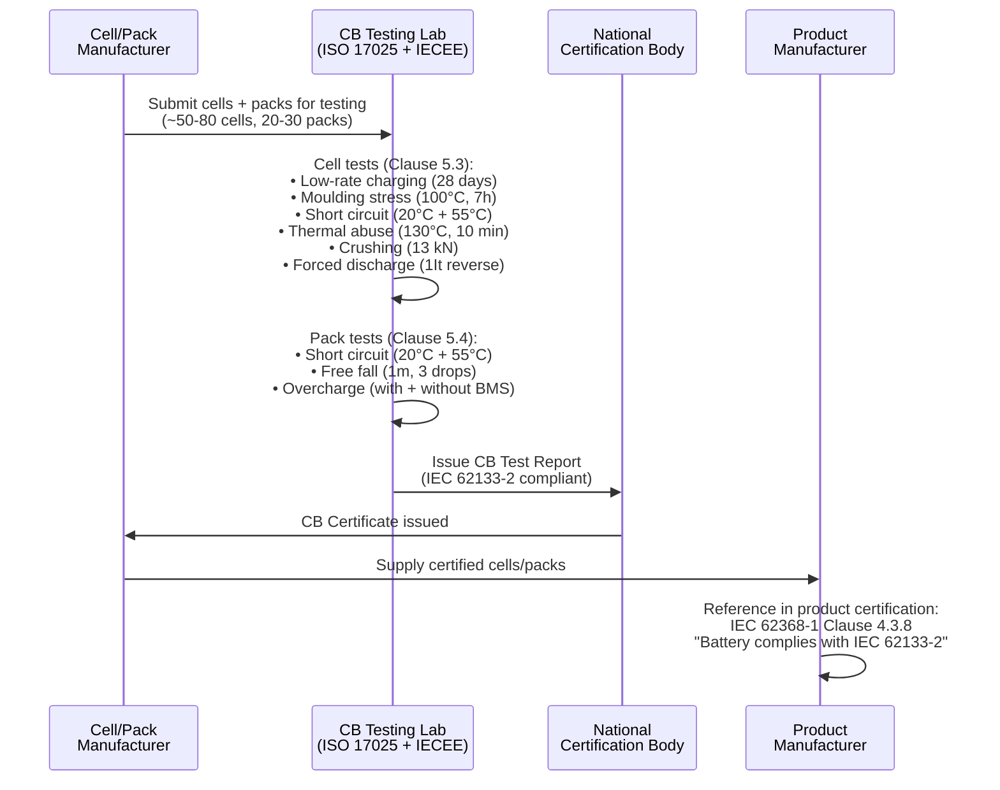

# IEC 62133-2 — Portable Lithium Battery Safety

**Topic:** Safety Requirements for Secondary Lithium Cells and Batteries in Portable Applications  
**Standards:** IEC 62133-2:2017+AMD1:2021, UL 1642 (5th Ed), UL 2054, EN 62133-2  
**SDO:** IEC TC 21/SC 21A (Secondary cells and batteries), UL, CENELEC  
**Audience:** Battery design engineers, product safety engineers, certification specialists  
**Prerequisites:** Understanding of lithium-ion cell technology, basic knowledge of safety testing concepts

---

## Chapter 1 — Historical Context & Origin Story

### 1.1 Timeline

| Year | Event |
|------|-------|
| 1991 | Sony commercializes Li-ion (18650 format) |
| 2002 | IEC 62133:2002 first edition (combined NiMH + lithium) |
| 2006 | Sony/Dell recall — 6M laptop batteries (manufacturing contamination) |
| 2012 | IEC 62133:2012 second edition (improved test criteria) |
| 2017 | IEC 62133 SPLIT into Part 1 (NiMH) and Part 2 (Lithium) |
| 2017 | IEC 62133-2:2017 published — dedicated lithium battery safety standard |
| 2019 | IEC 62368-1:2018 mandatory — references IEC 62133-2 for battery safety |
| 2020 | UL 1642 5th edition (enhanced cell-level testing) |
| 2021 | IEC 62133-2:2017+AMD1:2021 — Amendment 1 (tighter requirements) |
| 2022 | Widespread e-mobility fires → calls for stricter portable battery standards |
| 2024 | IEC 62133-2 Ed.2 under development (expected ~2026) |

### 1.2 Relationship to Product Standards

| Product Standard | Battery Reference | Clause |
|-----------------|-------------------|--------|
| IEC 62368-1 (IT/AV/telecom equipment) | "Batteries shall comply with IEC 62133-1 or IEC 62133-2" | Clause 4.3.8 |
| IEC 60335-1 (household appliances) | References IEC 62133-2 for embedded lithium batteries | Annex |
| IEC 60601-1 (medical devices) | References IEC 62133-2 for battery safety | Clause 11 |
| IEC 61010-1 (laboratory equipment) | References IEC 62133-2 | — |
| EN 50604-1 (LEV batteries) | Based on IEC 62133-2 + additional | — |

**Key insight:** IEC 62133-2 is NOT a standalone product certification. It is REFERENCED by product safety standards. A product cannot achieve CE (LVD/IEC 62368-1) without its battery complying with IEC 62133-2.

---

## Chapter 2 — Standard Architecture & Structure

### 2.1 IEC 62133-2 Document Structure

| Clause | Title | Content |
|--------|-------|---------|
| 1 | Scope | Secondary lithium cells/batteries for portable applications |
| 2 | Normative references | IEC 62281, IEC 60086, UN 38.3, etc. |
| 3 | Terms and definitions | Key terminology |
| 4 | Requirements | Design and construction requirements |
| 5 | Type tests | Cell-level and battery-level abuse tests |
| 6 | Quality assurance | Manufacturing process requirements |
| 7 | Marking and documentation | Labeling and user information |
| Annex A | BMS/Protection circuit requirements | Protective function specification |
| Annex B | Cell safety in the supply chain | Supplier qualification |

### 2.2 IEC 62133-2 vs. IEC 62133-1

| Aspect | IEC 62133-1 (Part 1) | IEC 62133-2 (Part 2) |
|--------|----------------------|----------------------|
| Chemistry | Nickel-based (NiMH, NiCd) | Lithium-based (Li-ion, LiPo, LiFePO₄) |
| Safety concern level | Moderate (lower energy density) | High (flammable electrolyte, high energy) |
| Thermal abuse test | 150°C (NiMH) | 130°C (lithium — lower onset) |
| Key hazard | Hydrogen venting, leakage | Thermal runaway, fire, explosion |
| Market prevalence | Declining (NiMH losing to Li-ion) | Dominant (vast majority of portable batteries) |

---

## Chapter 3 — Technical Deep Dive

### 3.1 Cell-Level Tests (IEC 62133-2 Clause 5.3)

| Test | Condition | Samples | Pass Criteria |
|------|-----------|---------|---------------|
| Continuous low-rate charging | 0.2It current for 28 days (672 hours) | 5 cells | No fire, no explosion |
| Moulding stress | 100°C for 7 hours (simulate reflow soldering) | 5 cells | No fire, no explosion, no leakage |
| External short circuit (20°C) | Resistance <80 mΩ at 20°C ± 5°C | 5 cells | No fire, no explosion |
| External short circuit (55°C) | Resistance <80 mΩ at 55°C ± 5°C | 5 cells | No fire, no explosion; case temp <150°C |
| Thermal abuse | Oven: 5°C/min ramp to 130°C, hold 10 minutes | 5 cells | No fire, no explosion |
| Crushing | 13 kN force between flat plates (or until voltage drops 100 mV or 50% deformation) | 10 cells | No fire, no explosion |
| Forced discharge | Discharge at 1It current (reverse polarity) | 5 cells | No fire, no explosion |

### 3.2 Battery (Pack) Level Tests (IEC 62133-2 Clause 5.4)

| Test | Condition | Samples | Pass Criteria |
|------|-----------|---------|---------------|
| External short circuit (20°C) | Short at 20°C ± 5°C, <80 mΩ | 5 packs | No fire, no explosion |
| External short circuit (55°C) | Short at 55°C ± 5°C, <80 mΩ | 5 packs | No fire, no explosion |
| Free fall | Drop from 1.0 m height onto concrete/steel surface, 3 drops per sample | 3 packs | No fire, no explosion |
| Overcharge (with protection) | Charge at recommended rate for 250% of rated capacity | 5 packs | No fire, no explosion |
| Overcharge (without protection) | Bypass BMS; charge at recommended rate for 250% capacity | 5 packs | No fire, no explosion (cell-level safety must contain) |

### 3.3 Protection Circuit (BMS) Requirements (Annex A)

| Function | Requirement | Test Method |
|----------|-------------|-------------|
| Over-voltage protection (OVP) | Must disconnect charging before cell exceeds max voltage | Verify at pack level during overcharge test |
| Under-voltage protection (UVP) | Must disconnect load before cell drops below minimum | Verify at pack level during discharge |
| Over-current protection (OCP) | Must limit or disconnect excessive discharge current | Verify during short circuit test |
| Over-temperature protection (OTP) | Must disconnect at high temperature threshold | Verify during thermal stress conditions |
| Short circuit protection | Must detect and disconnect within specified time | External short circuit test (pack level) |

### 3.4 Design Requirements (Clause 4)

| Requirement | Specification |
|-------------|--------------|
| Separator | Must withstand mechanical and thermal stress; minimum integrity to 130°C for shutdown |
| Electrolyte containment | Sealed construction; no leakage under normal use |
| Safety vent | Cells must have mechanism to prevent rupture under internal pressure |
| Current interrupt device (CID) | Recommended for cylindrical cells (pressure-activated disconnect) |
| PTC (Positive Temperature Coefficient) | Optional additional protection (current limiting at high temp) |
| Charge algorithm | Manufacturer must specify maximum charge voltage, current, and temperature range |
| User documentation | Must include: charging instructions, storage conditions, disposal guidance |

### 3.5 Comparison: IEC 62133-2 vs. UL 1642

| Test | IEC 62133-2 | UL 1642 (5th Ed) | Notes |
|------|-------------|-------------------|-------|
| Short circuit (20°C) | <80 mΩ | <0.1 Ω (100 mΩ) | Similar |
| Short circuit (55°C) | <80 mΩ at 55°C | <0.1 Ω at 55°C | Similar |
| Thermal abuse (oven) | 130°C, 10 min | 150°C, 10 min | UL more severe (higher temp) |
| Crush | 13 kN, flat plate | 13 kN, flat plate + 9.1 kg impact | UL adds impact test |
| Overcharge | 250% capacity at recommended rate | Specific per chemistry (varies) | Different approach |
| Forced discharge | 1It reverse | Max discharge current | Similar intent |
| Heating (oven) | 130°C only | 150°C (extended duration) | UL more severe |
| Projectile test | Not explicitly | YES (observe for projectiles) | UL-specific |
| Temperature cycling | Not in cell tests | -40°C to +75°C cycling | UL additional |
| Low pressure (altitude) | Not in IEC 62133-2 (covered by UN 38.3) | YES (11.6 kPa) | UL includes |
| Factory inspection | Not required (CB scheme) | YES (UL quarterly) | Significant difference |

---

## Chapter 4 — Implementation Guide

### 4.1 IEC 62133-2 Certification Flow



### 4.2 Sample Quantity Requirements

| Test | Cells Needed | Packs Needed |
|------|-------------|-------------|
| Continuous low-rate charging | 5 | — |
| Moulding stress | 5 | — |
| External short (20°C) | 5 | 5 |
| External short (55°C) | 5 | 5 |
| Thermal abuse | 5 | — |
| Crushing | 10 | — |
| Forced discharge | 5 | — |
| Free fall | — | 3 |
| Overcharge (with BMS) | — | 5 |
| Overcharge (without BMS) | — | 5 |
| **TOTAL MINIMUM** | **~40 cells** | **~23 packs** |

Plus spares (typically +20%): **~50 cells + ~28 packs recommended submission.**

### 4.3 Quality Assurance Requirements (Clause 6)

| Requirement | Implementation |
|-------------|---------------|
| Incoming material inspection | Verify critical components (separators, electrolyte, cathode/anode materials) |
| In-process control | Monitor: slitting tolerance, tab welding quality, electrolyte fill volume |
| Formation and aging | 100% of cells undergo charge/discharge formation; aging period (days-weeks) |
| End-of-line testing | OCV, internal resistance (AC impedance), capacity grading |
| Sampling inspection | Random destructive testing (capacity, cycle life, abuse) from production |
| Change management | Notify certification body if materials, construction, or process changes |
| Traceability | Cell-to-raw-material traceability (lot/batch tracking) |
| Corrective action | Defined process for addressing non-conforming cells |

### 4.4 National Differences (CB Scheme)

| Country | National Standard | Key Differences from IEC 62133-2 |
|---------|------------------|----------------------------------|
| EU (CENELEC) | EN 62133-2:2017 | Minimal — essentially identical (harmonized) |
| USA | UL 1642 + UL 2054 | More severe (150°C oven, projectile test, factory audit) |
| China | GB 31241:2022 | Additional tests; CCC factory audit required; Chinese deviation clauses |
| Korea | KC 62133-2 (K 62133-2:2017) | Minor national differences; KC certification body |
| Japan | JIS C 8714:2007 | Different structure; PSE (DENAN) compliance; JIS-specific tests |
| India | IS 16046 (Part 2) | Based on IEC 62133-2; BIS registration process |
| Australia | AS 62133.2 | Identical to IEC (national adoption without differences) |

---

## Chapter 5 — Certification & Compliance

### 5.1 CB Scheme for IEC 62133-2

| Step | Action | Notes |
|------|--------|-------|
| 1 | Select NCB with CBTL capability for IEC 62133-2 | UL, TÜV, Intertek, SGS, etc. |
| 2 | Test cells and packs per IEC 62133-2 | 6-10 week test program |
| 3 | CBTL issues CB Test Report | Includes national differences for target markets |
| 4 | NCB issues CB Certificate | Certificate covers the specific cell/pack design |
| 5 | Submit CB Report to target country NCBs | For national mark conversion |
| 6 | Target NCB evaluates national differences | Supplementary testing if needed |
| 7 | National certification issued | KC, PSE, BIS, etc. |

### 5.2 Costs and Timeline

| Service | Cost | Timeline |
|---------|------|----------|
| IEC 62133-2 full test (cells + packs) | $15,000-$30,000 | 6-10 weeks |
| CB Certificate issuance | $3,000-$5,000 | 1-2 weeks after testing |
| National mark conversion (per country) | $2,000-$5,000 | 2-6 weeks |
| UL 1642 + UL 2054 (US market) | $25,000-$45,000 | 8-12 weeks |
| GB 31241 (China CCC) | $15,000-$25,000 | 8-12 weeks |
| KC 62133-2 (Korea) | $8,000-$15,000 | 4-8 weeks |
| PSE/JIS (Japan) | $10,000-$20,000 | 6-10 weeks |

### 5.3 Factory Audit Requirements

| Scheme | Factory Audit | Frequency |
|--------|---------------|-----------|
| IEC 62133-2 (CB Scheme) | Not required by CB scheme | — |
| UL 1642/2054 (UL Listed) | YES — mandatory | Quarterly (4×/year) |
| GB 31241 (China CCC) | YES — mandatory | Annual + initial |
| KC 62133 (Korea) | Sometimes (depends on scheme) | Varies |
| PSE (Japan) | Self-declaration (no audit) for most batteries | — |
| BIS (India) | Possible (BIS CRO inspections) | Annual possibility |

---

## Chapter 6 — Regional Variants & Special Cases

### 6.1 UL 1642 (US Cell-Level Standard)

| Test | UL 1642 Specific | IEC 62133-2 Equivalent |
|------|-------------------|----------------------|
| Room temperature short | ✅ Required | ✅ (20°C short) |
| 55°C short circuit | ✅ Required | ✅ (55°C short) |
| Abnormal charging | ✅ (various methods per chemistry) | ✅ (continuous low-rate) |
| Forced discharge | ✅ Required | ✅ Required |
| Crush | ✅ 13 kN flat plate | ✅ 13 kN flat plate |
| Impact | ✅ 9.1 kg from 61 cm (15.8 mm bar) | ❌ Not in IEC 62133-2 |
| Shock (mechanical) | ✅ 150g, 6 ms | ❌ Not in IEC 62133-2 (in UN 38.3) |
| Vibration | ✅ Simple harmonic | ❌ Not in IEC 62133-2 (in UN 38.3) |
| Heating (oven) | ✅ 150°C (more severe) | 130°C (10 min) |
| Temperature cycling | ✅ -40°C to +75°C | ❌ Not in IEC 62133-2 |
| Low pressure (altitude) | ✅ 11.6 kPa | ❌ Not in IEC 62133-2 (in UN 38.3) |
| Projectile | ✅ Observe for flying debris | ❌ Not in IEC 62133-2 |

**Key difference:** UL 1642 is MORE COMPREHENSIVE than IEC 62133-2 at cell level. If a cell passes UL 1642, it will almost certainly pass IEC 62133-2 cell tests.

### 6.2 GB 31241 (China — CCC Scope)

| Aspect | GB 31241:2022 | IEC 62133-2:2017 |
|--------|---------------|------------------|
| Scope | Portable lithium batteries for consumer electronics | Same |
| Thermal abuse | 130°C, 30 min (longer than IEC!) | 130°C, 10 min |
| Short circuit | Multiple conditions | Similar |
| Overcharge | Additional overcharge conditions | Standard overcharge |
| Additional tests | Humidity, fire hazard, component | Not in IEC |
| Factory audit | Mandatory (CCC system) | Not required (CB) |
| Mandatory? | YES — CCC for listed products in China | Reference standard (voluntary CB) |
| Chinese entity | Required (certificate holder must be Chinese) | N/A |
| Mark | CCC mark on battery | CB certificate (no mark on product) |

---

## Chapter 7 — Standard Comparison Matrix

| Dimension | IEC 62133-2 | UL 1642 | UL 2054 | GB 31241 | KC 62133-2 |
|-----------|-------------|---------|---------|----------|-----------|
| Level | Cell + Pack | Cell only | Pack only | Cell + Pack | Cell + Pack |
| Geography | International (54 countries via CB) | North America (US/Canada) | North America | China only | Korea only |
| Thermal test | 130°C / 10 min | 150°C / sustained | N/A (pack tests) | 130°C / 30 min | 130°C / 10 min |
| Crush | 13 kN | 13 kN + impact | — | 13 kN | 13 kN |
| Short circuit | 55°C | 55°C + 20°C | 55°C + 20°C | Multiple temps | 55°C |
| Factory audit | No (CB) | Yes (quarterly UL) | Yes (quarterly UL) | Yes (annual CCC) | Sometimes |
| Certification time | 6-10 weeks | 8-12 weeks | 8-12 weeks | 8-12 weeks | 4-8 weeks |
| Cost | $15K-$30K | $12K-$20K (cells) | $15K-$25K (packs) | $15K-$25K | $8K-$15K |
| Certificate type | CB Certificate | UL Mark (listed) | UL Mark (listed) | CCC Mark | KC Mark |
| Validity | ~5 years (NCB-dependent) | Continuous (with audits) | Continuous (with audits) | Continuous (with annual audit) | Until standard changes |

---

## Chapter 8 — Mermaid Architecture Diagrams

### 8.1 IEC 62133-2 Test Hierarchy

```mermaid
graph TB
    subgraph "Cell-Level Tests (Clause 5.3)"
        C1[Continuous Low-Rate Charging<br/>0.2It for 28 days<br/>→ No fire/explosion]
        C2[Moulding Stress<br/>100°C for 7 hours<br/>→ No fire/explosion/leak]
        C3[External Short Circuit<br/>20°C AND 55°C, <80mΩ<br/>→ No fire/explosion, <150°C]
        C4[Thermal Abuse<br/>130°C oven, 10 min<br/>(5°C/min ramp)<br/>→ No fire/explosion]
        C5[Crushing<br/>13 kN flat plate<br/>→ No fire/explosion]
        C6[Forced Discharge<br/>1It reverse current<br/>→ No fire/explosion]
    end
    
    subgraph "Pack-Level Tests (Clause 5.4)"
        P1[External Short Circuit<br/>20°C AND 55°C, <80mΩ<br/>→ No fire/explosion]
        P2[Free Fall<br/>1.0 m onto concrete<br/>3 drops per sample<br/>→ No fire/explosion]
        P3[Overcharge WITH BMS<br/>Recommended rate, 250% capacity<br/>→ No fire/explosion]
        P4[Overcharge WITHOUT BMS<br/>Bypass protection, same charge<br/>→ No fire/explosion<br/>(cell-level safety must contain)]
    end
    
    subgraph "Pass Criteria"
        PASS[ALL Tests Pass:<br/>• No fire<br/>• No explosion<br/>• No rupture (for most)<br/>• No electrolyte leakage (for most)<br/>• Temperature limits met]
    end
    
    C1 --> PASS
    C2 --> PASS
    C3 --> PASS
    C4 --> PASS
    C5 --> PASS
    C6 --> PASS
    P1 --> PASS
    P2 --> PASS
    P3 --> PASS
    P4 --> PASS
```

### 8.2 Battery Safety Layers

```mermaid
graph TB
    subgraph "Layer 1: Cell-Level Safety (Inherent)"
        CHEMISTRY[Chemistry Selection<br/>(LFP safest, NCA least)]
        SEPARATOR[Separator<br/>(shutdown at 130°C)]
        CID_PTC[CID + PTC<br/>(pressure + temp cutoff)]
        VENT[Safety Vent<br/>(controlled gas release)]
    end
    
    subgraph "Layer 2: BMS/Protection Circuit"
        OVP[Over-Voltage Protection<br/>(prevent overcharge)]
        UVP[Under-Voltage Protection<br/>(prevent over-discharge)]
        OCP[Over-Current Protection<br/>(prevent excessive current)]
        OTP[Over-Temperature Protection<br/>(thermal cutoff)]
        SCP[Short Circuit Protection<br/>(fast disconnect)]
    end
    
    subgraph "Layer 3: Pack-Level Safety"
        THERMAL[Thermal Management<br/>(cooling/heating system)]
        FUSE[Pack Fuse/Breaker<br/>(external overcurrent)]
        CONTACTOR[Main Contactor<br/>(disconnect relay/MOSFET)]
        ENCLOSURE[Enclosure<br/>(flame-rated, IP-rated)]
    end
    
    subgraph "Layer 4: System-Level Safety"
        PRODUCT_INT[Product Integration<br/>(IEC 62368-1 compliance)]
        USER_INST[User Instructions<br/>(charging, storage, disposal)]
        QUALITY[Manufacturing Quality<br/>(IEC 62133-2 Clause 6)]
    end
    
    CHEMISTRY --> OVP
    OVP --> THERMAL
    THERMAL --> PRODUCT_INT
```

---

## Chapter 9 — Case Studies

### 9.1 Smartphone Battery — IEC 62133-2 Certification

| Aspect | Detail |
|--------|--------|
| Product | 4500 mAh / 3.87V = 17.4 Wh lithium-polymer cell (pouch format) |
| Testing scope | Cell-level (all 6 tests) + pack-level (4 tests — single cell = cell IS the pack) |
| Critical tests | Thermal abuse (130°C): cell reached 140°C peak → vented but no fire ✅ |
| Crush test | 13 kN applied; internal short at 8.5 kN; temp rose to 95°C; no fire ✅ |
| Short circuit (55°C) | Peak current 42A; max temp 88°C; well under 150°C limit ✅ |
| Overcharge | With BMS: BMS cut off at 4.35V (OVP threshold) — test passed (BMS prevented abuse) |
| Overcharge without BMS | Bypassed BMS; charged to 250% capacity; cell swelled, vented at 4.8V; no fire ✅ |
| CB Certificate | Issued by UL (as NCB); valid for CB Scheme use globally |
| Markets served | CE (EN 62133-2), KC, PSE, BIS — all via single CB report |
| Cost | $22,000 (full program at UL, including CB report) |
| Timeline | 8 weeks (including 28-day low-rate charge test) |
| Lesson | The 28-day continuous charging test is always on the critical path for timeline |

### 9.2 E-Scooter Battery Pack — IEC 62133-2 + Additional

| Aspect | Detail |
|--------|--------|
| Product | 36V/10Ah = 360 Wh e-scooter battery pack (10S3P 18650 cells) |
| Challenge | 360 Wh significantly exceeds "portable" interpretation for some markets |
| Standard selection | IEC 62133-2 for cells (portable cells used as building blocks) |
| Pack standard | EN 50604-1 (Light Electric Vehicle batteries) — European standard specific to LEVs |
| Additional tests | Vibration (road simulation), water ingress (IP65), mechanical shock |
| Cell-level | IEC 62133-2 cell tests all passed (18650 NMC cells from reputable supplier) |
| Pack-level | BMS with OVP/UVP/OCP/OTP + thermal fuse + mechanical fuse |
| Short circuit (pack) | BMS disconnected in <1ms; pack MOSFET isolated fault; no fire ✅ |
| Overcharge (pack) | BMS prevented overcharge; backup: cell CID activated at 4.5V |
| Critical issue | Without BMS: pack with 30 cells stores enormous energy; cell venting is violent |
| Additional requirement | UL 2271 (US — batteries for LEVs); uses IEC 62133-2 as basis + additions |
| Markets | EU: EN 50604-1. US: UL 2271. China: GB 31241 (cells) + GB/T 36672 (pack) |
| Cost | $45,000 (cells + pack, multiple standards) |
| Timeline | 12 weeks |
| Lesson | E-scooter/e-bike batteries are in a "grey zone" between portable and industrial; use EN 50604-1 for EU |

---

## Chapter 10 — Future Evolution & Industry Trends

| Trend | Timeline | Description |
|-------|----------|-------------|
| IEC 62133-2 Edition 2 | ~2026 | Major revision incorporating lessons from e-mobility fires |
| Enhanced BMS requirements | Growing | More detailed protection function requirements in standard |
| Solid-state battery provisions | 2027+ | Different failure modes → different test methods needed |
| Sodium-ion inclusion | Under discussion | May need IEC 62133-3 or amendment to cover Na-ion |
| Thermal propagation (cell-to-cell) | Likely in Ed. 2 | Assessment of cascading failure in multi-cell packs |
| Cybersecurity of BMS | Emerging | Connected BMS → firmware attack surface → IEC 62443 reference |
| EU Battery Regulation alignment | 2025-2027 | IEC 62133-2 may reference EU durability/sustainability requirements |
| Fast-charging safety | Developing | 4C+ charging tests → stress on separator and electrode |
| AI/ML in defect detection | 2025+ | Manufacturing AI for catching cell defects → quality clause update |
| Wireless charging battery safety | Growing | Inductive charging heat + battery → additional thermal concerns |
| Environmental testing | Possible addition | Humidity, altitude combined with abuse (more realistic conditions) |

---

## Chapter 11 — Interview Questions & Career Guide

### Tier 1: Entry-Level

**Q1:** What is IEC 62133-2 and why is it important for consumer electronics?  
**A:** **IEC 62133-2:2017** is the international safety standard for secondary (rechargeable) lithium cells and batteries used in portable applications. It defines abuse tests that verify the battery won't catch fire or explode under foreseeable misuse conditions. **Why it matters:** IEC 62368-1 (the product safety standard for IT/AV/telecom equipment like laptops, phones, tablets) directly REFERENCES IEC 62133-2 in Clause 4.3.8: "Batteries shall comply with IEC 62133-1 or IEC 62133-2." This means: you CANNOT achieve CE marking (LVD compliance) for a product with a lithium battery UNLESS that battery has been tested and certified to IEC 62133-2 (or equivalent like UL 1642/2054). **Key tests it performs:** Cell-level: thermal abuse (130°C oven), crush (13 kN), external short circuit (55°C), forced discharge, moulding stress, continuous low-rate charging. Pack-level: external short circuit, free fall (1m drop), overcharge (with and without BMS protection). **Pass criteria:** No fire, no explosion for all tests. This ensures that even under abuse conditions (overcharge, physical damage, high temperature), the battery fails safely — it may vent or swell, but it must NOT catch fire or explode.

### Tier 2: Mid-Level

**Q2:** A product designer wants to change the cell supplier for an existing certified battery pack. What is the certification impact?  
**A:** Changing cell supplier for an already-certified battery pack has SIGNIFICANT certification impact. **1. Cell-level certification (IEC 62133-2) — MUST BE RE-DONE:** The new supplier's cells are a completely different product — different manufacturing process, different materials (possibly different separator supplier, different electrolyte formulation), different internal construction. Even if specifications are identical (same capacity, voltage, dimensions): internal construction differences mean safety behavior may differ. The CB Certificate (IEC 62133-2) is SPECIFIC to the tested cell model from the tested manufacturer. New cells = new full cell-level test program (all 6 cell tests: thermal abuse, crush, short circuit, forced discharge, moulding stress, continuous charging). **2. Pack-level certification — LIKELY NEEDS UPDATE:** If pack construction is identical (same BMS, same wiring, same enclosure) but cells are different: Pack overcharge test: may behave differently (different cell chemistry tolerance). Pack short circuit: different cell impedance → different peak current. At minimum: supplementary pack testing recommended. Most certification bodies require: at least partial pack re-test with new cells. Some may accept engineering analysis (same electrical specs) — discuss with NCB. **3. UN 38.3 — MUST BE RE-DONE:** UN 38.3 is cell/battery-specific. Different manufacturer = different cell = full UN 38.3 re-test (T.1-T.8) for new cells. Pack-level UN 38.3 also needs re-testing (new cells in same pack configuration). **4. UL listing (if US market):** UL 1642: new cell listing required (separate UL file number). UL 2054: pack listing update (may require re-test or engineering evaluation). UL factory audit: new cell factory must be added to UL Follow-Up program. **5. Regional certifications:** CCC (China): GB 31241 re-test likely required. KC (Korea): Evaluate — may need supplementary testing. PSE (Japan): Self-declaration basis — update documentation. BIS (India): Check if BIS CRO requires notification of change. **6. Practical approach:**
| Phase | Action | Timeline | Cost |
|-------|--------|----------|------|
| 1 | Obtain new cell's existing certifications (does supplier already have IEC 62133-2 CB cert?) | Immediate | $0 |
| 2 | If YES: evaluate if existing CB cert covers your cell model | 1 week | $1,000 (engineering review) |
| 3 | If NO: full IEC 62133-2 test of new cell | 8 weeks | $15,000-$25,000 |
| 4 | UN 38.3 for new cell | 5 weeks | $10,000-$15,000 |
| 5 | Pack-level update (supplementary test) | 4 weeks | $8,000-$12,000 |
| 6 | Regional certification updates | 4-8 weeks | $5,000-$15,000 per market |
| **Total (if full re-test)** | | **8-12 weeks** | **$40,000-$70,000** |

**Best practice:** Before finalizing supplier change: verify new supplier already has IEC 62133-2 CB certificate for the specific cell model you plan to use. If they do → MASSIVE time and cost savings (use their existing CB report). If they don't → budget $40-70K and 8-12 weeks minimum before you can ship product with new cells.

### Tier 3: Senior

**Q3:** Design the complete IEC 62133-2 compliance strategy for a battery platform that will be used across 5 product lines with 3 different cell configurations.  
**A:** **Platform concept:** Common BMS architecture + enclosure system, but 3 cell configurations for different products:
| Config | Cells | Capacity | Wh | Products |
|--------|-------|----------|-----|----------|
| A | 1S1P (single cell) | 5000 mAh / 3.87V | 19.4 Wh | Smartphone, tablet |
| B | 2S1P (2 cells series) | 5000 mAh / 7.74V | 38.7 Wh | Laptop, handheld gaming |
| C | 4S1P (4 cells series) | 5000 mAh / 15.48V | 77.4 Wh | Large laptop, portable workstation |

All use the same 5000 mAh pouch cell from single supplier (same cell model). **1. Testing strategy (optimize for cost and reuse):** Cell-level tests (Clause 5.3): need to be done ONCE since all configurations use the SAME CELL. 50 cells submitted → covers all 6 cell-level tests. Cell CB Certificate: covers the cell regardless of which pack it goes into. Pack-level tests (Clause 5.4): need to be done for EACH pack configuration (A, B, C). Each configuration has different voltage, BMS behavior, and failure modes. 3 × ~23 packs = 69 packs needed. **2. Test plan:**
| Phase | Test | Samples | Duration | Cost |
|-------|------|---------|----------|------|
| Phase 1 | Cell tests (all 6) — single cell model | 50 cells | 6 weeks (28-day charge is bottleneck) | $18,000 |
| Phase 2A | Pack A tests (1S1P — single-cell pack) | 23 packs | 3 weeks | $8,000 |
| Phase 2B | Pack B tests (2S1P) | 23 packs | 3 weeks | $10,000 |
| Phase 2C | Pack C tests (4S1P) | 23 packs | 3 weeks | $12,000 |
| CB Report | Combined CB Test Report covering cell + 3 pack configs | — | 1-2 weeks | $4,000 |
| **Total** | | **50 cells + 69 packs** | **8-10 weeks** | **$52,000** |

**3. CB Report structure:** Single CB Test Report covering: Cell: [Model XYZ-5000] — all Clause 5.3 tests passed. Pack Config A: [1S1P-19W] — all Clause 5.4 tests passed. Pack Config B: [2S1P-39W] — all Clause 5.4 tests passed. Pack Config C: [4S1P-77W] — all Clause 5.4 tests passed. This single CB Report serves ALL 5 product lines across ALL target markets. **4. Market deployment (CB Scheme leverage):**
| Market | Cert Body | Action | Timeline | Cost |
|--------|-----------|--------|----------|------|
| EU (CE) | Self-declaration | Reference CB Report in DoC | 1 week | $500 |
| US (UL) | UL | Convert CB → UL listing (+ factory setup) | 6-8 weeks | $20,000 |
| China (CCC) | CQC | CB Report basis + supplementary + factory audit | 10-12 weeks | $25,000 |
| Korea (KC) | KTL | CB Report basis + national differences | 4-6 weeks | $10,000 |
| Japan (PSE) | JET/JQA | CB Report basis + JIS evaluation | 4-6 weeks | $12,000 |
| India (BIS) | BIS | CB Report basis + BIS-recognized lab review | 8-10 weeks | $8,000 |
| **Total (6 markets)** | | | **10-12 weeks (parallel)** | **$75,500** |

**5. Total certification budget:**
| Category | Cost |
|----------|------|
| IEC 62133-2 testing (cell + 3 packs) | $52,000 |
| UN 38.3 (cell + 3 pack configs) | $35,000 |
| Regional certifications (6 markets) | $75,500 |
| **Grand total** | **$162,500** |
| Cost per product line (÷5) | $32,500 |
| Cost per product line per market (÷5÷6) | $5,417 |

**6. Design change management:** Platform approach minimizes future change impact: Cell change: re-do cell tests only ($18K) + pack supplementary per config ($8-12K each). BMS change: re-do pack tests for affected configs only (not cell tests). Enclosure change: likely no re-test needed (cosmetic). Capacity variant (e.g., 6000 mAh cell): full cell re-test + impacted pack configs. **7. Ongoing compliance:** UL factory audit: quarterly ($5,000/year × factory). CCC annual audit: ($8,000/year). Standard revision monitoring: when IEC 62133-2 Ed.2 publishes → evaluate gap → plan re-certification. Cell supplier audit: annual quality check (protect against manufacturing drift that caused Note 7/Bolt issues).

---

## Chapter 12 — Cheat Sheet & Quick Reference

### IEC 62133-2 Test Summary

```
CELL TESTS (Clause 5.3):
  1. Continuous low-rate charging    0.2It × 28 days         → No fire/explosion
  2. Moulding stress                 100°C × 7 hours         → No fire/explosion/leak
  3. External short (20°C)           <80 mΩ                  → No fire/explosion
  4. External short (55°C)           <80 mΩ                  → No fire/explosion, <150°C
  5. Thermal abuse                   130°C oven, 10 min      → No fire/explosion
  6. Crushing                        13 kN flat plate        → No fire/explosion
  7. Forced discharge                1It reverse             → No fire/explosion

PACK TESTS (Clause 5.4):
  1. External short (20°C)           <80 mΩ                  → No fire/explosion
  2. External short (55°C)           <80 mΩ                  → No fire/explosion
  3. Free fall                       1.0 m, 3 drops          → No fire/explosion
  4. Overcharge (WITH BMS)           Recommended rate, 250%  → No fire/explosion
  5. Overcharge (WITHOUT BMS)        Bypass BMS, same charge → No fire/explosion
```

### Samples Required

```
Cells:  ~40-50 units (including spares)
Packs:  ~23-28 units (per configuration)
Note:   28-day continuous charge test sets minimum timeline (always on critical path)
```

### Standard Selection Guide

```
Consumer electronics battery?  → IEC 62133-2 (cells + packs)
US market?                     → ALSO need UL 1642 (cells) + UL 2054 (packs)
China market?                  → ALSO need GB 31241 (CCC scope)
Korea?                         → KC 62133-2 (CB report basis)
Japan?                         → PSE (DENAN) + JIS C 8714
E-bike / e-scooter (EU)?      → EN 50604-1 (LEV-specific, based on IEC 62133-2)
Industrial / stationary?       → IEC 62619 (NOT IEC 62133-2)
EV traction?                   → ISO 6469 + IEC 62660 (NOT IEC 62133-2)
```

### Key Differences: IEC 62133-2 vs UL 1642

```
IEC 62133-2:                        UL 1642:
  Thermal: 130°C, 10 min              Thermal: 150°C (more severe!)
  Crush: 13 kN                         Crush: 13 kN + Impact test
  No vibration test                    Vibration + Shock tests included
  No altitude test                     Altitude test included
  No projectile criterion              Projectile observation required
  No factory audit (CB)                Quarterly factory audit (UL)
  International (54 countries)         North America (US + Canada)
```

---

*End of Document — 02_IEC_62133_Portable_Batteries.md*
