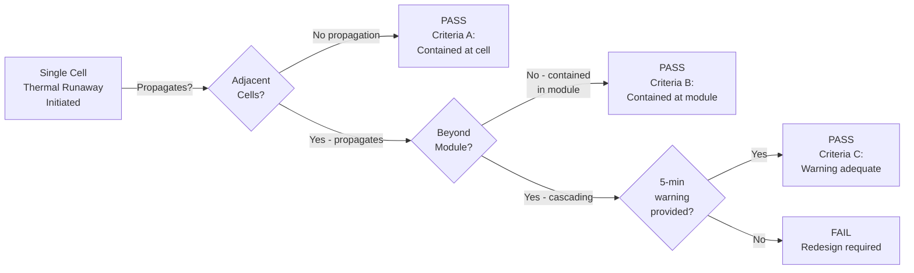

# IEC 62619 — Industrial Lithium Battery Safety

**Topic:** Safety Requirements for Secondary Lithium Cells and Batteries for Industrial Applications  
**Standards:** IEC 62619:2022, IEC 62620:2014 (performance), UL 1973, IEEE 1679.1  
**SDO:** IEC TC 21/SC 21A (Secondary cells and batteries)  
**Audience:** Battery system engineers, stationary storage designers, industrial equipment manufacturers, safety engineers  
**Prerequisites:** IEC 62133-2 knowledge, lithium battery fundamentals, BMS architecture

---

## Chapter 1 — Historical Context & Origin Story

### 1.1 Timeline

| Year | Event |
|------|-------|
| 2002 | IEC 62133:2002 covers portable only — gap for industrial batteries |
| 2010 | Growing deployment of lithium in forklifts, UPS, telecom backup |
| 2014 | IEC 62620 published (performance requirements for industrial lithium) |
| 2017 | IEC 62619:2017 first edition published — fills industrial safety gap |
| 2018 | Large-format ESS deployments accelerate (Tesla Megapack, BYD Blade) |
| 2019 | Multiple ESS fire incidents (McMicken AZ, Korea — 23 fires 2017-2019) |
| 2020 | UL 1973 3rd edition (US companion to IEC 62619) |
| 2022 | IEC 62619:2022 second edition — major update (thermal propagation, enhanced BMS) |
| 2023 | Korea mandates IEC 62619 + additional tests after ESS fires |
| 2024 | EU Battery Regulation references IEC 62619 for industrial battery safety |

### 1.2 Industrial vs. Consumer Battery Safety

| Dimension | Consumer (IEC 62133-2) | Industrial (IEC 62619) |
|-----------|----------------------|----------------------|
| Typical applications | Phones, laptops, tablets, wearables | Forklifts, AGVs, UPS, telecom, ESS, marine |
| Pack size | 10-100 Wh | 1 kWh – 10+ MWh |
| Personnel | General public (untrained) | Trained operators, maintenance staff |
| Environment | Benign (home, office) | Harsh (warehouses, outdoor, industrial) |
| Lifetime expectation | 2-3 years | 10-20 years |
| BMS complexity | Simple (single IC) | Complex (multi-layer, communication bus) |
| Risk if failure | Single device fire | Large-scale fire, toxic gas release, facility loss |
| Thermal propagation concern | Low (single cell or few cells) | Critical (thousands of cells cascading) |
| Regulatory framework | Product safety (IEC 62368-1) | Installation codes (NFPA, NEC, IEC 62933) |

---

## Chapter 2 — Standard Architecture & Structure

### 2.1 IEC 62619:2022 Document Structure

| Clause | Title | Key Content |
|--------|-------|-------------|
| 1 | Scope | Secondary lithium cells/batteries for industrial use |
| 2 | Normative references | IEC 62281, IEC 62660-2/3, UN 38.3 |
| 3 | Terms and definitions | Including thermal propagation, thermal runaway |
| 4 | Requirements | General design, construction, marking |
| 5 | Tests | Cell-level and battery-level abuse tests |
| 6 | Quality assurance | Manufacturing process requirements |
| 7 | Marking and documentation | Labeling, manuals, data sheets |
| Annex A (normative) | BMS requirements — CRITICAL | Detailed protection function specifications |
| Annex B (normative) | Thermal propagation assessment | Cell-to-cell cascading failure evaluation |
| Annex C (informative) | Functional safety of BMS | Reference to IEC 61508 / ISO 26262 concepts |
| Annex D (informative) | Recycling and end-of-life | Environmental considerations |

### 2.2 Relationship to Other Standards

```mermaid
graph TB
    IEC62619[IEC 62619:2022<br/>Industrial Battery Safety<br/>(CORE)]
    
    IEC62619 --> IEC62620[IEC 62620:2014<br/>Industrial Battery Performance<br/>(capacity, cycle life, efficiency)]
    
    IEC62619 --> UL1973[UL 1973<br/>Batteries for Use in<br/>Stationary/Motive/LEV<br/>(US equivalent)]
    
    IEC62619 --> UL9540[UL 9540<br/>Energy Storage Systems<br/>(system-level — references IEC 62619)]
    
    IEC62619 --> IEC62933[IEC 62933 Series<br/>Electrical Energy Storage Systems<br/>(general requirements)]
    
    IEC62619 --> IEC61508[IEC 61508 / ISO 26262<br/>Functional Safety<br/>(for BMS — Annex C)]
    
    IEC62619 --> UN383[UN 38.3<br/>Transport Safety<br/>(still required for shipping)]
    
    IEC62619 --> NFPA855[NFPA 855<br/>Installation of ESS<br/>(references certified batteries)]
    
    IEC62619 --> IEC62660[IEC 62660 Series<br/>EV Cell Testing<br/>(performance + safety)]
```

---

## Chapter 3 — Technical Deep Dive

### 3.1 Cell-Level Tests (Clause 5.3)

| Test | Condition | Pass Criteria |
|------|-----------|---------------|
| External short circuit | <5 mΩ resistance at 55°C ± 2°C | No fire, no explosion, case temp <150°C |
| Impact/Crush | 13 kN force OR 9.1 kg drop (per cell size, same as IEC 62133-2 criteria) | No fire, no explosion |
| Thermal abuse (oven) | 5°C/min ramp to 130°C, hold 30 minutes (longer than IEC 62133-2!) | No fire, no explosion |
| Overcharge | Applied per manufacturer-specified limits + margin (2× recommended rate or to manufacturer limit) | No fire, no explosion |
| Forced discharge | 1× rated capacity current, reverse polarity | No fire, no explosion |

### 3.2 Battery (Pack/Module) Level Tests (Clause 5.4)

| Test | Condition | Pass Criteria |
|------|-----------|---------------|
| External short circuit | <5 mΩ at 20°C and 55°C (WITH BMS active) | No fire, no explosion |
| Overcharge | Charge beyond rated capacity (BMS must intervene) | No fire, no explosion |
| Over-discharge | Discharge below minimum voltage (BMS must intervene) | No fire, no explosion |
| Temperature protection | Operate battery at extreme temperature; BMS must disconnect | BMS disconnects before unsafe temp reached |
| Mechanical test | Drop, vibration, or shock per intended application environment | No fire, no explosion |

### 3.3 Annex A — BMS Requirements (NORMATIVE)

This is the most significant differentiator from IEC 62133-2. Annex A of IEC 62619:2022 specifies detailed requirements for the Battery Management System:

| BMS Function | Requirement | Specification |
|-------------|-------------|---------------|
| Over-voltage protection (OVP) | Must disconnect charging before any cell exceeds maximum voltage | Cell voltage limit specified by cell manufacturer ± tolerance |
| Under-voltage protection (UVP) | Must disconnect load before any cell drops below minimum voltage | Prevent deep discharge damage / copper dissolution |
| Over-current protection (OCP) | Must limit or disconnect at excessive current (charge AND discharge) | Based on cell manufacturer maximum ratings |
| Over-temperature protection (OTP) | Must disconnect before cells reach critical temperature | Charge: typically 45-60°C cutoff. Discharge: typically 60-70°C |
| Under-temperature protection | Must prevent charging below minimum temperature | Lithium plating risk: typically 0°C minimum for charge |
| Cell balancing | Must maintain cells within voltage tolerance during charge/discharge | Passive or active balancing; tolerance typically ±50 mV |
| Isolation monitoring | Must detect insulation failure to ground (for high-voltage systems) | >100 Ω/V for voltages >60V DC |
| Communication | Must report battery status to host system | CAN bus (CiA 454), SMBus, Modbus, or proprietary |
| Fault logging | Must record protection events with timestamp | Non-volatile memory, accessible for diagnostics |
| Pre-charge | Must limit inrush current on initial connection | Prevent contactor welding / connector arcing |

### 3.4 Annex B — Thermal Propagation Assessment (NEW in 2022)

This is a MAJOR addition in IEC 62619:2022 (not in 2017 edition):

| Level | Test Method | Requirement |
|-------|-------------|-------------|
| Cell initiation | Force one cell into thermal runaway (nail penetration, overcharge, or heater) | Document onset temperature, gas generation, flame |
| Module assessment | Observe if thermal runaway propagates to adjacent cells | Document propagation time, affected cells |
| Battery assessment | Evaluate if module-level event propagates beyond module boundaries | System must contain event OR provide warning |
| Acceptance criteria | Either: (a) No propagation beyond initiating cell, OR (b) Provide 5-minute advance warning before external hazard | Choice of containment vs. warning |



### 3.5 Key Differences: IEC 62619 vs. IEC 62133-2

| Criterion | IEC 62133-2 (Consumer) | IEC 62619 (Industrial) |
|-----------|----------------------|----------------------|
| Scope | Portable electronics | Industrial, stationary, motive |
| Thermal abuse duration | 130°C for 10 minutes | 130°C for 30 minutes (3× longer!) |
| Short circuit resistance | <80 mΩ | <5 mΩ (much more severe!) |
| BMS annex | Brief mention only | Detailed normative Annex A (mandatory) |
| Thermal propagation | Not addressed | Annex B: mandatory assessment |
| Mechanical tests | Free fall (1m) | Application-specific (forklift vibration, etc.) |
| Cell balancing | Not addressed | Required in Annex A |
| Communication interface | Not addressed | Required (CAN/Modbus/SMBus) |
| Functional safety reference | No | Yes (Annex C — IEC 61508 concepts) |
| Design lifetime assessment | Not addressed | Expected (10+ year design) |
| Quality assurance | Basic Clause 6 | Enhanced Clause 6 (statistical sampling, CPK) |

---

## Chapter 4 — Implementation Guide

### 4.1 Design for IEC 62619 Compliance

```mermaid
graph TB
    subgraph "Cell Selection"
        CELL_SEL[Select Cell<br/>• IEC 62619 cell tests passed<br/>• Qualified for industrial use<br/>• Cycle life ≥3000 (LFP typical)<br/>• Operating temp: -20°C to +55°C<br/>• Safety data sheet available]
    end
    
    subgraph "BMS Design (Annex A)"
        BMS[BMS Architecture<br/>• Redundant voltage measurement<br/>• Redundant temperature sensing<br/>• Dual-path disconnect (MOSFET + contactor)<br/>• Hardware watchdog timer<br/>• CAN/Modbus communication<br/>• Non-volatile fault logging]
    end
    
    subgraph "Thermal Propagation Design (Annex B)"
        THERMAL[Thermal Barriers<br/>• Cell-to-cell insulation<br/>• Inter-module fire barriers<br/>• Vent gas management<br/>• Temperature sensors per cell group<br/>• Early warning algorithm]
    end
    
    subgraph "Pack Integration"
        PACK[Pack Design<br/>• IP rating per environment<br/>• Mechanical robustness (drop, vibration)<br/>• Connector specification<br/>• Ground fault detection (>60V DC)<br/>• Fuse/breaker sizing<br/>• Pre-charge circuit]
    end
    
    CELL_SEL --> BMS
    BMS --> THERMAL
    THERMAL --> PACK
    PACK --> TEST[IEC 62619:2022<br/>Full Test Program]
```

### 4.2 BMS Architecture for IEC 62619

| Component | Function | IEC 62619 Relevance |
|-----------|----------|---------------------|
| Analog Front End (AFE) | Cell voltage and temperature measurement | Annex A: accuracy and response time |
| Cell balance IC | Active or passive cell balancing | Annex A: mandatory for multi-cell strings |
| MCU (main controller) | Processing, algorithm execution, communication | Central BMS brain |
| Current sensor | Hall effect or shunt resistor for pack current | OCP function, SoC calculation |
| Contactor/MOSFET | Main disconnect device | OVP/UVP/OCP/OTP disconnect action |
| Pre-charge relay | Limit inrush current on connection | Annex A: required for high-voltage systems |
| Isolation monitor | Detect ground faults | Annex A: required for >60V DC systems |
| CAN transceiver | Communication to host/charger | Annex A: mandatory communication |
| EEPROM/Flash | Fault logging, calibration data | Annex A: non-volatile fault recording |
| Hardware watchdog | Independent MCU supervision | Safety: detect MCU lockup → safe state |

### 4.3 Application-Specific Implementations

| Application | Pack Size | Key IEC 62619 Considerations |
|-------------|-----------|-------------------------------|
| Forklift / AGV | 10-80 kWh | Vibration (harsh); IP65 minimum; opportunity charging; 10-year life |
| UPS (data center) | 100-500 kWh | Float charging; rare cycling; thermal management in controlled environment |
| Telecom backup | 5-50 kWh | Outdoor installation; -40°C to +55°C; remote monitoring; very high reliability |
| Stationary ESS (grid) | 1-100+ MWh | Fire containment; thermal propagation critical; NFPA 855 installation; BMS communication to SCADA |
| Marine | 1-10+ MWh | Classification society approval (DNV-GL, Lloyd's, ABS); salt spray; shock/vibration |
| Railway | 50-300 kWh | EN 50641; vibration/shock per EN 61373; fire EN 45545; extreme reliability |

---

## Chapter 5 — Certification & Compliance

### 5.1 Certification Bodies for IEC 62619

| Body | Geography | Additional Capabilities |
|------|-----------|------------------------|
| UL | US, Global | UL 1973, UL 9540 (system), IEC 62619 CB |
| TÜV Rheinland | Germany, Global | IEC 62619, marine classification support |
| TÜV SÜD | Germany, Global | IEC 62619, railway (EN 50641) |
| Intertek | UK, Global | IEC 62619, CB scheme |
| SGS | Switzerland, Global | IEC 62619, environmental testing |
| DNV-GL | Norway | IEC 62619 + maritime classification |
| Bureau Veritas | France | IEC 62619 + maritime + industrial |
| CSA Group | Canada | IEC 62619, UL 1973 (Canada) |
| KERI/KTL | Korea | IEC 62619 (Korean market mandatory) |

### 5.2 Costs and Timeline

| Service | Cost | Timeline |
|---------|------|----------|
| IEC 62619 cell tests only | $15,000-$25,000 | 4-6 weeks |
| IEC 62619 battery/module tests (including BMS verification) | $25,000-$50,000 | 6-10 weeks |
| Thermal propagation assessment (Annex B) | $20,000-$40,000 | 4-8 weeks |
| Full program (cell + battery + thermal propagation) | $50,000-$100,000 | 10-16 weeks |
| UL 1973 (US equivalent program) | $60,000-$120,000 | 12-20 weeks |
| CB Certificate issuance | $3,000-$5,000 | 1-2 weeks post-testing |
| Factory audit (if required by scheme) | $5,000-$10,000 | 2-3 days + travel |

### 5.3 Relationship to System-Level Certification

| Battery Level (IEC 62619) | System Level | Requirement |
|---------------------------|-------------|-------------|
| Cell certified to IEC 62619 | UL 9540 (ESS system listing) | IEC 62619 cell cert is prerequisite |
| Battery module certified | NFPA 855 installation compliance | Listed/certified battery required |
| BMS Annex A compliance | IEC 62933 (EESS requirements) | BMS function verification |
| Thermal propagation (Annex B) | UL 9540A test | IEC 62619 Annex B = component input to UL 9540A |
| Pack-level testing | NEC Article 706 | Listed battery system required for US installations |

---

## Chapter 6 — Regional Variants

### 6.1 Regional Certification Requirements for Industrial Batteries

| Region | Standard | Additional Requirements | Mandatory? |
|--------|----------|------------------------|-----------|
| EU | EN IEC 62619:2022 | EU Battery Regulation (2023/1542) for sustainability | Safety: yes (LVD). Sustainability: phased 2025-2027 |
| US | UL 1973 (primary) + IEC 62619 (secondary) | NEC 706, NFPA 855 for installation | Yes (AHJ acceptance requires listed equipment) |
| China | GB/T 36276:2018 + GB 31241 (cells) | CCC for certain categories; grid connection: GB/T 36548 | Market-dependent |
| Korea | IEC 62619 + KC certification | Enhanced after ESS fires; additional thermal tests | Mandatory for ESS since 2020 |
| Japan | JIS C 8715-2 (based on IEC 62619) | JEMA guidelines; fire department approval | Yes for commercial ESS |
| Australia | AS 62619 (identical adoption) | AS/NZS 5139 (installation requirements) | Referenced by installation std |
| India | IS 16046-based | BIS registration (evolving) | Developing |

### 6.2 Korea — Post-ESS Fire Enhanced Requirements

After 23 ESS fires (2017-2019), Korea added requirements beyond IEC 62619:

| Addition | Requirement | Rationale |
|----------|-------------|-----------|
| DC arc detection | Must detect and interrupt DC arcing | Several fires traced to DC arc at connections |
| Enhanced thermal monitoring | Additional temperature sensors (1 per 4 cells minimum) | Earlier detection of abnormal heating |
| Insulation monitoring | Mandatory real-time insulation monitoring | Ground faults preceded several fires |
| Communication verification | BMS-to-EMS communication fault detection | Communication failures masked warnings |
| Mandatory thermal propagation test | Cannot rely on "warning" alone — must demonstrate containment | Fires occurred with no warning |
| Extended environmental testing | Condensation + high humidity cycling | Coastal installations had moisture-related failures |

---

## Chapter 7 — Standard Comparison Matrix

| Criterion | IEC 62619:2022 | UL 1973 (3rd Ed) | IEC 62660-2/3 | GB/T 36276 |
|-----------|---------------|-----------------|---------------|-----------|
| Scope | Industrial Li batteries | Stationary/Motive/LEV Li batteries | EV cells (performance + safety) | Electrochemical ESS |
| Level | Cell + Module + Pack | System (battery for use) | Cell only | System |
| Thermal abuse | 130°C / 30 min | 150°C / 10 min (per UL) | 130°C / 30 min | 130°C / 30 min |
| Short circuit resistance | <5 mΩ | <50 mΩ (or per UL) | <5 mΩ (cell) | <5 mΩ |
| Thermal propagation | Annex B (mandatory in 2022) | UL 9540A (separate test) | Not addressed | Required (GB 36276) |
| BMS requirements | Annex A (detailed, normative) | Referenced/functional | Not applicable | General BMS requirements |
| Functional safety | Annex C (informative) | Not explicitly | Not applicable | Not explicitly |
| Factory audit | Not mandatory (CB) | Quarterly (UL mark) | Depends on scheme | Depends (CCC/CNCA) |
| Certificate type | CB Certificate | UL Mark | CB Certificate | CCC or voluntary |
| Geography | International (CB, 54 countries) | North America + global acceptance | International | China |
| Typical cost | $50K-$100K | $60K-$120K | $20K-$40K (cells only) | $30K-$60K |

---

## Chapter 8 — Mermaid Architecture Diagrams

### 8.1 IEC 62619 Testing Scope

```mermaid
graph TB
    subgraph "CELL Level (Clause 5.3)"
        CT1[External Short Circuit<br/><5 mΩ, 55°C<br/>→ No fire, <150°C]
        CT2[Impact / Crush<br/>13 kN or 9.1 kg impact<br/>→ No fire]
        CT3[Thermal Abuse<br/>130°C oven, 30 minutes<br/>→ No fire]
        CT4[Overcharge<br/>Per manufacturer limit + margin<br/>→ No fire]
        CT5[Forced Discharge<br/>1× rated capacity reverse<br/>→ No fire]
    end
    
    subgraph "BATTERY Level (Clause 5.4)"
        BT1[External Short Circuit<br/><5 mΩ, 20°C + 55°C<br/>(BMS active)<br/>→ No fire]
        BT2[Overcharge<br/>Beyond rated capacity<br/>(BMS must protect)<br/>→ No fire]
        BT3[Over-discharge<br/>Below min voltage<br/>(BMS must protect)<br/>→ No fire]
        BT4[Temperature Protection<br/>Extreme temp operation<br/>(BMS must disconnect)<br/>→ Safe shutdown]
        BT5[Mechanical Test<br/>Application-specific<br/>(drop/vibration/shock)<br/>→ No fire]
    end
    
    subgraph "BMS Verification (Annex A)"
        BMS1[OVP / UVP / OCP / OTP<br/>Protection Function Tests]
        BMS2[Communication<br/>CAN/Modbus verification]
        BMS3[Fault Logging<br/>Non-volatile recording]
        BMS4[Isolation Monitoring<br/>(if >60V DC)]
        BMS5[Cell Balancing<br/>Verification]
    end
    
    subgraph "Thermal Propagation (Annex B)"
        TP1[Initiate Single Cell<br/>Thermal Runaway]
        TP2[Observe Propagation<br/>to Adjacent Cells]
        TP3[Evaluate Module/Pack<br/>Level Containment]
        TP4[Verify Warning System<br/>(5-min minimum)]
    end
```

### 8.2 Industrial Battery Applications Ecosystem

```mermaid
graph TB
    IEC62619[IEC 62619:2022<br/>Battery Safety Certificate]
    
    IEC62619 --> FORKLIFT[Forklift / AGV<br/>• EN 1175 (safety)<br/>• IEC 62619 referenced<br/>• 10-80 kWh<br/>• Opportunity charging]
    
    IEC62619 --> UPS[UPS / Data Center<br/>• IEC 62040 (UPS safety)<br/>• References IEC 62619<br/>• 100-500 kWh<br/>• Float + cycling]
    
    IEC62619 --> TELECOM[Telecom Backup<br/>• ETSI EN 300 132<br/>• 48V DC systems<br/>• -40 to +55°C outdoor<br/>• 5-50 kWh]
    
    IEC62619 --> ESS[Grid ESS<br/>• IEC 62933 (system)<br/>• UL 9540 (US)<br/>• NFPA 855 (installation)<br/>• 1-100+ MWh]
    
    IEC62619 --> MARINE[Marine<br/>• DNV-GL rules<br/>• Classification approval<br/>• IEC 62619 referenced<br/>• 1-10+ MWh]
    
    IEC62619 --> RAIL[Railway<br/>• EN 50641<br/>• Based on IEC 62619<br/>• EN 45545 (fire)<br/>• EN 61373 (shock/vibe)]
```

---

## Chapter 9 — Case Studies

### 9.1 Telecom Backup Battery — IEC 62619 Certification

| Aspect | Detail |
|--------|--------|
| Product | 48V / 100Ah LFP battery rack (51.2V nominal, 5.12 kWh) |
| Configuration | 16S1P prismatic LFP cells (3.2V × 100Ah = 320 Wh per cell) |
| Application | Telecom base station backup (outdoor cabinet, -30°C to +55°C) |
| BMS | Custom BMS with CAN bus, modbus interface, 16-channel AFE, passive balancing |
| Cell-level tests | External short: peak 1200A, temp 78°C — PASS. Thermal abuse: 130°C/30min — no event (LFP advantage). Crush: 13 kN — cell deformed, no fire (LFP inherent stability). |
| Pack-level tests | Short circuit: BMS disconnected contactor in 0.8 ms — PASS. Overcharge: BMS cut off at 3.65V/cell — PASS. Over-discharge: BMS cut off at 2.5V/cell — PASS. |
| Annex A (BMS) | All 10 functions verified. Isolation monitoring: 8.5 kΩ (>100 Ω/V × 51.2V = 5.12 kΩ min) — PASS. Fault logging: verified 200+ events stored in EEPROM. |
| Annex B (propagation) | Heater-initiated single cell TR at 180°C. LFP did not propagate to ANY adjacent cell. Temperature of nearest cell reached max 62°C — well below TR onset. PASS (Criteria A — no propagation). |
| Result | IEC 62619:2022 CB Certificate issued |
| Additional | UN 38.3 (for transport of battery racks to sites), IP65 enclosure testing |
| Cost | $65,000 (full program including thermal propagation) |
| Timeline | 12 weeks |
| Lesson | LFP chemistry dramatically simplifies Annex B thermal propagation — almost never propagates |

### 9.2 Forklift Battery — IEC 62619 + Application Standards

| Aspect | Detail |
|--------|--------|
| Product | 80V / 500Ah NMC forklift battery (40 kWh) |
| Configuration | 22S8P 18650 NMC cells (total 176 cells per module × 4 modules = 704 cells) |
| Application | 3.5 ton electric counterbalance forklift; opportunity charging; 2-shift operation |
| BMS | Distributed BMS (satellite boards per module + master controller), CAN bus, active balancing |
| Challenge 1 | 704 NMC cells — significant thermal propagation risk |
| Challenge 2 | Vibration profile: forklift drives over dock plates, bumps, uneven floors |
| Challenge 3 | Opportunity charging: frequent partial charges + deep discharges |
| Cell-level tests | Thermal abuse: NMC cells — more reactive than LFP. Cells vented at 130°C; no fire — PASS (barely). Short circuit: 320A peak; temp 142°C — under 150°C limit — PASS. |
| Pack-level tests | Mechanical: vibration per ISO 6469-1 profile (adapted for forklift) — all connections maintained. Short circuit: BMS + contactor disconnected in 1.2 ms — PASS. |
| Annex B (propagation) | NMC cell initiated — propagated to 3 adjacent cells before thermal barrier stopped it. Propagation contained within single module. Inter-module fire barrier prevented further spread. BMS detected event and activated alarm within 45 seconds. PASS (Criteria B — contained at module level). |
| Additional testing | EN 1175 (forklift safety); IEC 62619 + forklift-specific vibration/shock (EN 1175-1 Annex) |
| Result | IEC 62619 CB Certificate + EN 1175 forklift safety compliance |
| Cost | $95,000 (full program, extensive thermal propagation testing with 4-module setup) |
| Timeline | 16 weeks |
| Design changes | Added ceramic fiber insulation between cells (3mm), inter-module steel firewall (2mm), early warning algorithm (detect 0.5°C/min rise on any cell) |
| Lesson | NMC in large configurations requires serious thermal propagation mitigation — design the barriers BEFORE testing |

---

## Chapter 10 — Future Evolution & Industry Trends

| Trend | Timeline | Description |
|-------|----------|-------------|
| IEC 62619 Ed.3 preparation | 2026-2028 | Further tightening of thermal propagation, cybersecurity of BMS |
| IEC 63330 (2nd life batteries) | 2025 | Standard for reused EV batteries in stationary storage (references IEC 62619) |
| Cybersecurity requirements | 2025-2027 | BMS communication vulnerabilities → IEC 62443 reference in future edition |
| Solid-state battery integration | 2027+ | Different thermal characteristics → modified test parameters |
| Sodium-ion industrial batteries | 2025-2027 | New chemistry → evaluate IEC 62619 applicability |
| AI/ML in BMS (predictive) | Now-2027 | Predictive maintenance algorithms → how to validate safety claims |
| Modular/containerized ESS | Growing | Standardized container-format ESS → IEC 62619 at module, IEC 62933 at container |
| V2G (vehicle-to-grid) | 2025+ | EV batteries providing grid services → IEC 62619 + ISO 15118 overlap |
| Enhanced environmental testing | Likely Ed.3 | Condensation, salt spray, flooding scenarios for outdoor installations |
| Digital product passport | 2027 | EU Battery Regulation requires → IEC 62619 cert data in digital passport |
| Extended lifetime validation | Growing | 20+ year service life → accelerated aging test standardization |

---

## Chapter 11 — Interview Questions & Career Guide

### Tier 1: Entry-Level

**Q1:** What is IEC 62619 and how does it differ from IEC 62133-2?  
**A:** **IEC 62619:2022** is the safety standard for secondary lithium cells and batteries used in **industrial applications** (forklifts, UPS, telecom backup, stationary energy storage, marine, railway). **IEC 62133-2** covers **consumer/portable** applications (phones, laptops, tablets). **Key differences:** 1) **Scope:** IEC 62619 targets large industrial batteries (kWh to MWh scale) operated by trained personnel. IEC 62133-2 targets small portable batteries (<100 Wh typically) used by the general public. 2) **Severity:** IEC 62619 tests are MORE SEVERE: thermal abuse is 130°C for **30 minutes** (vs. 10 minutes in 62133-2). Short circuit resistance is **<5 mΩ** (vs. <80 mΩ in 62133-2). 3) **BMS requirements:** IEC 62619 has a **normative Annex A** with detailed BMS function specifications (OVP, UVP, OCP, OTP, balancing, communication, fault logging). IEC 62133-2 barely mentions BMS. 4) **Thermal propagation:** IEC 62619:2022 has **Annex B** requiring assessment of cell-to-cell thermal runaway propagation — critical for large multi-cell systems. IEC 62133-2 doesn't address this. 5) **Functional safety:** IEC 62619 references IEC 61508 concepts for BMS safety in Annex C. Not in 62133-2.

### Tier 2: Mid-Level

**Q2:** You're designing a 100 kWh stationary energy storage system. Which standards apply, and how does IEC 62619 fit into the overall compliance picture?  
**A:** A 100 kWh stationary ESS has a MULTI-LAYER compliance requirement. IEC 62619 is the FOUNDATION (battery component level), but it's not sufficient alone.

**Layer 1 — Cell Level:**
- IEC 62619 cell tests (Clause 5.3) — safety qualification of the individual cells
- IEC 62660-2 (if repurposing EV cells — reliability testing)
- UN 38.3 — still required for TRANSPORTING cells/modules to assembly facility

**Layer 2 — Battery Module/Pack Level:**
- IEC 62619 battery tests (Clause 5.4) — module abuse testing
- IEC 62619 Annex A — BMS function verification (all protection functions)
- IEC 62619 Annex B — Thermal propagation assessment at module level

**Layer 3 — Energy Storage SYSTEM Level:**
- UL 9540:2023 (US) or IEC 62933-5-2 (international) — system-level safety
- UL 9540A — Thermal runaway fire propagation test (4 levels: cell, module, unit, installation)
- This is where you evaluate if a module fire propagates through the entire system

**Layer 4 — Installation Level:**
- NFPA 855:2023 (US) — installation requirements (spacing, ventilation, fire detection, suppression)
- NEC Article 706 (US) — electrical requirements (disconnects, grounding, signage)
- Local building codes — fire department approval, occupancy requirements
- IFC (International Fire Code) — referenced by most US jurisdictions

**Layer 5 — Grid Connection:**
- IEEE 1547 / IEC 62933-4 — grid interconnection requirements
- UL 1741 / IEC 62109 — power conversion equipment (inverter safety)
- Utility interconnection agreement

**How IEC 62619 fits:** It's the battery-level "entry ticket." Without IEC 62619 certification, you cannot get: (a) UL 9540 system listing, (b) NFPA 855 compliance, (c) AHJ (Authority Having Jurisdiction) approval for installation, (d) Insurance coverage for the ESS. IEC 62619 proves the BATTERY is safe. Then UL 9540 + NFPA 855 prove the SYSTEM and INSTALLATION are safe.

### Tier 3: Senior

**Q3:** Design the thermal propagation mitigation strategy for a 1 MWh NMC-based ESS to pass IEC 62619 Annex B AND UL 9540A.  
**A:** **System:** 1 MWh ESS = 10 × 100 kWh racks. Each rack = 10 modules. Each module = 14S10P (140 cells). Total: 14,000 NMC cells. **Challenge:** NMC cells WILL propagate if not mitigated. Unlike LFP (which self-limits), NMC cells in thermal runaway release ~800°C flames and >50 liters of flammable gas per cell. Adjacent cells reach TR onset (~180°C) within 30-60 seconds without barriers. **Mitigation strategy (multi-layer defense):**

**Layer 1 — Cell-level (delay onset):**
- Select NMC cells with ceramic-coated separators (higher TR onset: ~210°C vs. ~180°C)
- Specify cells with CID (Current Interrupt Device) activation below TR onset
- Cell spacing: minimum 2mm air gap between cells

**Layer 2 — Cell-to-cell barrier:**
- Aerogel insulation pads between cells (thermal conductivity: 0.012 W/m·K)
- 3mm aerogel pad provides >5 minute delay to adjacent cell TR onset
- Verification: single-cell heater initiation → measure time to adjacent cell critical temp

**Layer 3 — Module containment:**
- Module enclosure: 1.2mm stainless steel with thermal insulation lining
- Vent path: directed gas release through designed vent ports (away from adjacent modules)
- Inter-module spacing: minimum 50mm with steel firewall (2mm)
- Module-level vent gas ducting to exterior of enclosure

**Layer 4 — Rack containment:**
- Rack-level fire barrier between top/bottom of each module slot
- Rack exhaust vent system: gas extraction ducted outside building
- Sprinkler/suppression integration per rack

**Layer 5 — System/room level:**
- Deflagration pressure relief panels (gas buildup → controlled venting)
- Fire detection: off-gas detection (CO, H₂) + thermal cameras + smoke
- Suppression: water mist system (per NFPA 855 requirements)
- Separation distance between racks per NFPA 855 Table 11.1.2

**BMS early warning system:**
| Detection Method | Threshold | Action |
|-----------------|-----------|--------|
| Cell temperature rise rate | >0.5°C/min (abnormal) | Alert, reduce power |
| Cell temperature absolute | >60°C | Disconnect module, alarm |
| Cell voltage deviation | >100 mV from peers | Alert, investigate |
| Off-gas detection (CO, H₂) | >50 ppm | EMERGENCY: disconnect all, evacuate, suppress |
| Impedance anomaly | >20% change from baseline | Schedule inspection |

**Testing plan for IEC 62619 Annex B + UL 9540A:**
| Level | Test | Expected Result |
|-------|------|-----------------|
| UL 9540A Level 1 (cell) | Heater-initiated TR of single cell | Characterize: gas volume, temp, flame time |
| UL 9540A Level 2 (module) | Initiate one cell in module; observe propagation | With aerogel: propagation delayed >5 min; contained within 3-cell radius |
| IEC 62619 Annex B | Same as Level 2 + evaluate BMS response | BMS detects within 30s; alert within 60s; achieves Criteria B (module containment) |
| UL 9540A Level 3 (unit/rack) | Module event in rack; observe rack-level containment | No propagation to adjacent modules (firewall effectiveness) |
| UL 9540A Level 4 (installation) | Rack event; observe system-level containment | Fire suppression activates; no propagation beyond initiating rack; building safe |

**Cost of thermal mitigation (per MWh):**
| Item | Cost |
|------|------|
| Aerogel cell insulation (14,000 cells × $0.50/cell) | $7,000 |
| Module stainless enclosures | $25,000 |
| Inter-module firewalls | $8,000 |
| Vent gas ducting system | $15,000 |
| Enhanced BMS sensors (additional temp + gas) | $12,000 |
| UL 9540A testing (all 4 levels) | $80,000 |
| IEC 62619 Annex B testing | $35,000 |
| **Total thermal propagation investment** | **$182,000** |
| **Per kWh** | **$182/kWh** (adds ~3-5% to battery system cost) |

---

## Chapter 12 — Cheat Sheet & Quick Reference

### IEC 62619:2022 Key Tests

```
CELL LEVEL:
  • Short circuit:        <5 mΩ at 55°C        → No fire, <150°C
  • Crush:               13 kN or 9.1 kg drop   → No fire
  • Thermal abuse:       130°C for 30 MINUTES   → No fire (NOTE: 30 min, not 10!)
  • Overcharge:          Beyond rated + margin   → No fire
  • Forced discharge:    1It reverse             → No fire

BATTERY LEVEL:
  • Short circuit:       <5 mΩ (BMS active)     → BMS protects, no fire
  • Overcharge:          Beyond capacity (BMS)   → BMS cuts off, no fire
  • Over-discharge:      Below min V (BMS)       → BMS cuts off, no fire
  • Temperature:         Extreme temp (BMS)      → BMS disconnects
  • Mechanical:          Application-specific     → No fire, no damage

ANNEX A (BMS - NORMATIVE):
  • OVP, UVP, OCP, OTP, under-temp
  • Cell balancing (passive or active)
  • Isolation monitoring (>60V DC systems)
  • Communication interface (CAN/Modbus/SMBus)
  • Fault logging (non-volatile)
  • Pre-charge circuit (high-voltage systems)

ANNEX B (THERMAL PROPAGATION - NORMATIVE):
  • Initiate single-cell thermal runaway
  • Evaluate propagation to adjacent cells
  • PASS = No propagation beyond module OR 5-min warning provided
```

### IEC 62619 vs. IEC 62133-2 Quick Comparison

```
                    IEC 62619 (Industrial)    IEC 62133-2 (Consumer)
Thermal abuse:      130°C / 30 min            130°C / 10 min
Short circuit R:    <5 mΩ                     <80 mΩ
BMS Annex:          Normative (mandatory)     Brief mention only
Propagation:        Annex B (mandatory)       Not addressed
Typical pack:       1 kWh – 10 MWh            10 – 100 Wh
Users:              Trained operators          General public
Lifetime:           10-20 years               2-3 years
Cost range:         $50K-$100K (cert)          $15K-$30K (cert)
```

### Application Selection Guide

```
Application             Standard              Additional
─────────────────────────────────────────────────────────────
Smartphone/Laptop       IEC 62133-2           + IEC 62368-1
E-scooter/E-bike (EU)  EN 50604-1            Based on IEC 62133-2
Forklift/AGV            IEC 62619             + EN 1175
UPS (data center)       IEC 62619             + IEC 62040
Telecom backup          IEC 62619             + ETSI EN 300 132
Stationary ESS          IEC 62619             + UL 9540 + NFPA 855
Marine                  IEC 62619             + DNV rules
Railway                 EN 50641              Based on IEC 62619
EV traction             ISO 6469 + IEC 62660  NOT IEC 62619
```

---

*End of Document — 03_IEC_62619_Industrial.md*
