# UL 9540 — Stationary Energy Storage Systems

**Topic:** Safety Standard for Energy Storage Systems and Equipment — System-Level Certification and Fire Propagation Testing  
**Standards:** UL 9540:2023 (4th Ed), UL 9540A:2023 (Test Method for Thermal Runaway Fire Propagation), NFPA 855:2023, NEC Article 706, IEC 62933-5-2  
**SDO:** UL (Underwriters Laboratories), NFPA, IEEE, IEC  
**Audience:** ESS system designers, fire protection engineers, project developers, AHJ inspectors  
**Prerequisites:** IEC 62619 knowledge, battery safety fundamentals, fire protection concepts

---

## Chapter 1 — Historical Context & Origin Story

### 1.1 Timeline

| Year | Event |
|------|-------|
| 2014 | First large US ESS deployments (AES, Duke Energy) |
| 2016 | UL 9540 First Edition published (basic ESS safety) |
| 2017 | UL 9540A draft test method introduced (thermal runaway fire propagation) |
| 2017 | Korea ESS fires begin (23 incidents through 2019) |
| 2018 | NFPA 855 first edition (ESS installation standard) |
| 2019 | McMicken, AZ explosion (APS 2 MWh ESS — 4 firefighters injured) |
| 2019 | UL 9540A 2nd edition (enhanced after incident analysis) |
| 2020 | NEC Article 706 adopted (electrical requirements for ESS) |
| 2020 | NYC mandates UL 9540A for all ESS installations |
| 2021 | Multiple ESS fires: Liverpool, UK; Beijing, China (2 firefighters killed) |
| 2022 | UL 9540:2020 3rd edition (significant updates post-incidents) |
| 2023 | UL 9540:2023 4th edition + UL 9540A:2023 (latest) |
| 2023 | NFPA 855:2023 edition (major revisions, tighter requirements) |
| 2024 | California Title 24 mandates ESS in new construction (driving massive deployment) |
| 2025 | Global ESS deployment >100 GWh/year — safety standards critical |

### 1.2 Key Incidents Shaping UL 9540/9540A

| Incident | Year | Impact | Lessons |
|----------|------|--------|---------|
| McMicken, AZ (APS) | April 2019 | 2 MWh NMC ESS explosion during firefighter entry; 4 injured | Off-gas accumulation + ignition source → deflagration. Led to enhanced ventilation requirements. Gas detection mandatory. |
| Korea ESS fires (23 total) | 2017-2019 | Facility fires, one fatality | DC arc detection, insulation monitoring, junction box quality. Led to Korean ESS safety enhancements. |
| Surprise, AZ (APS) | October 2019 | Another APS facility fire | Similar root cause to McMicken. Manufacturer design issues. |
| Liverpool, UK (Orsted) | September 2020 | 20 MWh NMC ESS fire; burned for 3 days | Water suppression ineffective on large-scale Li battery fire. |
| Beijing, China (CATL) | April 2021 | ESS explosion during commissioning; 2 firefighters + 1 worker killed | Commissioning safety procedures. Ventilation and gas monitoring. |
| Moss Landing, CA (Vistra) | September 2021 | 300 MWh LFP facility — overheating event | Even LFP can have issues at massive scale. Thermal management critical. |
| Victorian Big Battery (AU) | July 2021 | Tesla Megapack fire during commissioning; coolant leak | Single-point failure. Commissioning protocol importance. |

---

## Chapter 2 — Standard Architecture & Structure

### 2.1 ESS Safety Standards Hierarchy

```mermaid
graph TB
    subgraph "Component Level"
        CELL[Cell Safety<br/>IEC 62619 / UL 1973<br/>(individual cells)]
        MODULE[Module Safety<br/>IEC 62619 / UL 1973<br/>(battery modules)]
    end
    
    subgraph "System Level"
        UL9540[UL 9540:2023<br/>Energy Storage System<br/>Safety Standard<br/>(LISTING standard)]
        UL9540A[UL 9540A:2023<br/>Thermal Runaway Fire<br/>Propagation Test Method<br/>(TEST METHOD only)]
    end
    
    subgraph "Installation Level"
        NFPA855[NFPA 855:2023<br/>Installation of ESS<br/>(installation code)]
        NEC706[NEC Article 706<br/>Electrical Requirements<br/>(electrical code)]
        IFC[International Fire Code<br/>Chapter 12<br/>(fire code)]
    end
    
    subgraph "Grid Connection"
        IEEE1547[IEEE 1547<br/>Grid Interconnection]
        UL1741[UL 1741 SA<br/>Inverter Safety<br/>(grid-interactive)]
    end
    
    CELL --> MODULE
    MODULE --> UL9540
    UL9540 --> NFPA855
    UL9540A -.->|"Informs"| NFPA855
    UL9540A -.->|"Test method for"| UL9540
    NFPA855 --> NEC706
    UL9540 --> IEEE1547
    IEEE1547 --> UL1741
```

### 2.2 UL 9540 Scope and Structure

| Section | Topic | Content |
|---------|-------|---------|
| 1 | Scope | ESS consisting of batteries, power conversion, controls, thermal management |
| 2 | Components | Requirements for battery, BMS, PCS, thermal management, enclosure |
| 3 | Construction | Mechanical integrity, electrical clearances, wiring, grounding |
| 4 | Performance | Normal operation testing, efficiency, capacity verification |
| 5 | Safety tests | Electrical safety (dielectric, ground fault), environmental, mechanical |
| 6 | Fire safety | UL 9540A test results evaluation, fire containment, ventilation |
| 7 | Marking | Labeling, nameplate, hazard warnings, first responder information |
| 8 | Factory inspection | Ongoing UL follow-up inspections |

### 2.3 UL 9540A — Test Method Structure (4 Levels)

| Level | Test Scope | What is Evaluated | Scale |
|-------|-----------|-------------------|-------|
| Level 1 | Single Cell | Thermal runaway characterization: gas generation, heat release, flame | 1 cell |
| Level 2 | Module/Unit | Cell-to-cell propagation within a module | 1 module (10-100+ cells) |
| Level 3 | System/Rack | Module-to-module propagation; unit-level fire behavior | 1-4 racks |
| Level 4 | Installation | Full-scale installation fire test (with suppression if applicable) | Multiple racks in room/container |

---

## Chapter 3 — Technical Deep Dive

### 3.1 UL 9540A Level 1 — Cell Characterization

| Parameter | Measurement | Purpose |
|-----------|-------------|---------|
| Initiation method | Overcharge, heater, nail penetration (manufacturer choice) | Force single cell into thermal runaway |
| Peak temperature | Maximum cell surface and gas temperature during TR | Characterize severity |
| Total heat release | Calorimetric measurement (kJ) | Energy available to propagate |
| Gas generation volume | Total gas released (liters at STP) | Ventilation sizing |
| Gas composition | GC/MS analysis: CO, CO₂, H₂, CH₄, C₂H₄, HF, electrolyte vapors | Toxicity and flammability assessment |
| Flame duration | Time cell produces visible flame | Fire exposure to adjacent cells |
| Particle/ejecta | Observation of expelled material (hot particles, electrolyte) | Ignition risk to surroundings |
| Lower Flammability Limit (LFL) | Gas mixture concentration at which ignition is possible | Explosion risk assessment |

**Typical Level 1 Results by Chemistry:**

| Chemistry | Peak Temp (°C) | Gas Volume (L/Ah) | Heat Release (kJ/Ah) | Flame Duration | HF Generation |
|-----------|---------------|-------------------|---------------------|----------------|---------------|
| NMC 811 | 800-1100 | 1.5-2.5 | 40-60 | 5-30 seconds | Significant |
| NMC 622 | 700-900 | 1.0-2.0 | 35-50 | 5-20 seconds | Significant |
| NMC 532 | 600-800 | 0.8-1.5 | 30-45 | 3-15 seconds | Moderate |
| LFP | 300-500 | 0.3-0.8 | 10-20 | 0-5 seconds (often no flame) | Low |
| NCA | 800-1100 | 1.5-2.5 | 40-60 | 5-30 seconds | Significant |

### 3.2 UL 9540A Level 2 — Module Propagation

| Test Configuration | Specification |
|--------------------|---------------|
| Module under test | Production-representative module (all cells, BMS, wiring, enclosure) |
| Initiation | Force ONE cell into TR (using Level 1 method) |
| Instrumentation | Thermocouple on EVERY cell (or representative cells), gas sampling, video |
| Observation period | Until all events complete OR 4 hours (whichever comes first) |
| Fire suppression | NOT applied (observe natural propagation behavior) |
| Environment | Ambient conditions; test chamber or fire lab |

**Assessment Criteria:**

| Outcome | Classification | Implication for Installation |
|---------|---------------|------------------------------|
| No propagation beyond initiating cell | Best case | Minimal fire protection needed |
| Propagation within module, self-extinguishing | Moderate | Module-level containment sufficient |
| Full module involvement (all cells reach TR) | Significant | Inter-module barriers required; fire suppression likely needed |
| Module generates flaming, sustained fire >10 min | Severe | Aggressive fire suppression + large separation distances |

### 3.3 UL 9540A Level 3 — Unit/Rack Level

| Test Configuration | Specification |
|--------------------|---------------|
| Setup | 1-4 complete racks (production representative) in test enclosure |
| Target | Determine if module-level event propagates to adjacent modules/racks |
| Initiation | Force one cell in one module to TR (observe cascading behavior) |
| Fire suppression | May test with AND without suppression (compare) |
| Gas monitoring | CO, H₂, O₂ depletion, temperature at multiple heights |
| Deflagration pressure | Pressure transducers for explosion risk assessment |
| Duration | Until event concludes or suppression controls fire |

### 3.4 UL 9540A Level 4 — Installation Level

| Test Configuration | Specification |
|--------------------|---------------|
| Setup | Full-scale replica of actual installation (room, container, or outdoor) |
| Include | Ventilation system, fire detection, suppression system (as designed) |
| Purpose | Validate entire fire protection strategy at full scale |
| Initiation | Single cell TR in one module → observe system response |
| Evaluation | Does the designed fire protection system WORK as intended? |
| Outcome | Fire Protection Engineering (FPE) report documenting system adequacy |
| Use | AHJ approval; insurance underwriting; commissioning validation |

### 3.5 NFPA 855:2023 Key Requirements

| Requirement | Specification | Reference |
|-------------|---------------|-----------|
| Maximum allowable quantities | Indoor: 600 kWh per fire area (without protection). With NFPA 855 compliance: unlimited with proper protection | NFPA 855 §11.1 |
| Separation distances | Minimum 3 feet (0.9 m) between ESS units; specific distances per UL 9540A results | NFPA 855 §11.1.2 |
| Ventilation | Mechanical ventilation to maintain gas concentration below 25% LFL | NFPA 855 §11.3 |
| Fire detection | Off-gas detection (CO, H₂) + smoke detection + thermal detection | NFPA 855 §11.4 |
| Fire suppression | Required for indoor installations >20 kWh; type based on UL 9540A results | NFPA 855 §11.5 |
| Explosion protection | Deflagration venting per NFPA 68 if gas accumulation risk | NFPA 855 §11.6 |
| Spill containment | Electrolyte containment for liquid-cooled or flooded systems | NFPA 855 §11.7 |
| Signage | Hazard identification, first responder information, emergency disconnect location | NFPA 855 §11.8 |
| Commissioning | Functional testing of all safety systems before energization | NFPA 855 §12 |
| O&M | Annual inspection, testing of fire protection, battery health monitoring | NFPA 855 §13 |

### 3.6 NEC Article 706 Key Requirements

| Requirement | NEC 706 Specification |
|-------------|----------------------|
| Disconnecting means | Readily accessible disconnect for each ESS unit (706.7) |
| Circuit sizing | Conductors sized per maximum current including fault contribution (706.20) |
| Overcurrent protection | OCPD sized for battery characteristics (706.21) |
| Grounding | Equipment grounding per Article 250; ground fault detection for ungrounded systems (706.30) |
| Signage | "ENERGY STORAGE SYSTEM" sign at main disconnect and at meter (706.11) |
| Listed equipment | ESS equipment must be listed (UL 9540 or equivalent) (706.5) |
| Working space | Per NEC 110.26 — adequate clearances for service (706.10) |
| Ventilation | Per manufacturer requirements + NFPA 855 (706.35) |

---

## Chapter 4 — Implementation Guide

### 4.1 ESS Project Compliance Pathway

```mermaid
graph TB
    DESIGN[ESS System Design<br/>• Battery chemistry selection<br/>• System architecture<br/>• Thermal management<br/>• Fire protection strategy]
    
    DESIGN --> COMP_CERT[Component Certification<br/>• Cells: IEC 62619 / UL 1973<br/>• Modules: IEC 62619 / UL 1973<br/>• Inverter: UL 1741 SA<br/>• Controls: UL 508A / IEC 61010]
    
    COMP_CERT --> UL9540_LIST[UL 9540 System Listing<br/>• Submit system to UL<br/>• Electrical safety tests<br/>• Environmental tests<br/>• Construction evaluation<br/>• → UL Listed Mark]
    
    UL9540_LIST --> UL9540A_TEST[UL 9540A Testing<br/>• Level 1: Cell characterization<br/>• Level 2: Module propagation<br/>• Level 3: Unit/rack propagation<br/>• Level 4: Installation validation]
    
    UL9540A_TEST --> FPE[Fire Protection Engineering<br/>• Analyze UL 9540A results<br/>• Design suppression system<br/>• Design ventilation system<br/>• Design detection system<br/>• Design separation distances]
    
    FPE --> NFPA855[NFPA 855 Compliance<br/>• Verify all requirements met<br/>• Signage and marking<br/>• Emergency procedures<br/>• O&M plan]
    
    NFPA855 --> NEC706[NEC 706 Compliance<br/>• Electrical design review<br/>• Disconnect sizing<br/>• Grounding design<br/>• Working space verification]
    
    NEC706 --> AHJ[AHJ Approval<br/>• Building permit<br/>• Fire department review<br/>• Electrical inspection<br/>• Final commissioning]
    
    AHJ --> OPERATE[Commission & Operate<br/>• Functional safety test<br/>• Fire system test<br/>• Grid interconnection<br/>• Insurance acceptance]
```



### 4.2 UL 9540A Testing Cost and Timeline

| Level | Typical Cost | Timeline | Notes |
|-------|-------------|----------|-------|
| Level 1 (cell) | $30,000-$50,000 | 4-6 weeks | Per cell model/chemistry. One-time per cell type. |
| Level 2 (module) | $50,000-$80,000 | 6-8 weeks | Per module design. Destructive (modules consumed). |
| Level 3 (unit/rack) | $80,000-$150,000 | 8-12 weeks | Per rack design. Very expensive (multiple racks consumed). |
| Level 4 (installation) | $150,000-$400,000 | 12-20 weeks | Full-scale. Most expensive. Often optional (FPE analysis may substitute). |
| **Total (all 4 levels)** | **$310,000-$680,000** | **12-20 weeks** | Parallel testing of levels possible |

### 4.3 Fire Protection Design Based on UL 9540A Results

| UL 9540A Result | Fire Protection Design Response |
|-----------------|---------------------------------|
| Level 2: No propagation (LFP typical) | Minimal: smoke detection, manual extinguisher. Separation per NFPA 855 minimums. |
| Level 2: Module-contained propagation | Moderate: off-gas detection, automatic suppression, module barriers. 3-ft separation. |
| Level 2: Full module burns out | Aggressive: water mist/sprinkler, off-gas + thermal detection, >3-ft separation, deflagration venting. |
| Level 3: No rack-to-rack propagation | Standard fire suppression adequate per module results. |
| Level 3: Rack-to-rack propagation possible | Fire-rated barriers between racks, enhanced suppression, possibly outdoor-only installation. |
| Level 4: Suppression effective | Installation approved with designed suppression system active. |
| Level 4: Suppression ineffective | Redesign required. May not be installable at this location/configuration. |

### 4.4 Chemistry Impact on UL 9540A Outcomes

| Chemistry | Typical Level 2 Outcome | Level 3 Risk | Fire Protection Needs |
|-----------|------------------------|--------------|----------------------|
| LFP (LiFePO₄) | No propagation or minimal (1-2 cells) | Very low | Minimal — basic detection + manual suppression |
| NMC 532 | Partial module propagation | Moderate | Moderate — automatic suppression, barriers |
| NMC 622 | Full module propagation possible | High | Aggressive — full suppression, large separation |
| NMC 811 | Rapid full module propagation | Very high | Maximum — consider outdoor only, suppression + deflagration venting |
| NCA | Similar to NMC 811 | Very high | Maximum protection required |
| LTO (Lithium Titanate) | Extremely unlikely propagation | Negligible | Minimal — inherently safe chemistry |

---

## Chapter 5 — Certification & Compliance

### 5.1 UL 9540 Listed ESS Products

| Manufacturer | Product | Chemistry | UL 9540 Status |
|-------------|---------|-----------|----------------|
| Tesla | Megapack 2 / Megapack XL | LFP | Listed |
| BYD | MC Cube / BYD Cube | LFP (Blade) | Listed |
| Fluence | Gridstack / Ultrastack | NMC → LFP transition | Listed |
| Samsung SDI | SBB (Samsung Battery Box) | NMC | Listed |
| LG Energy Solution | RESU / Grid-Scale | NMC | Listed |
| CATL | EnerOne / EnerC | LFP | Listed |
| Sungrow | PowerTitan / PowerStack | LFP | Listed |
| Wärtsilä (GEMS) | GridSolv Quantum | LFP | Listed |
| Powin | Centroid / Stack | LFP | Listed |
| EnerSys | OptiGrid | Various | Listed |

### 5.2 Testing Laboratories

| Laboratory | Location | Capabilities |
|-----------|----------|--------------|
| UL (Northbrook, IL) | US | Full UL 9540 + UL 9540A (all levels) |
| UL (Taiwan) | Asia | UL 9540 + UL 9540A (Levels 1-3) |
| TÜV Rheinland | Germany, US | IEC 62933 + UL 9540 CB |
| Intertek | US, UK | UL 9540 field evaluation |
| DNV-GL | Norway, US | ESS safety assessment + UL 9540A |
| Sandia National Labs | US (NM) | UL 9540A research testing (DOE programs) |
| FM Global | US | Large-scale fire testing (Level 3-4) |
| SwRI (Southwest Research) | US (TX) | Large-scale fire testing (Level 3-4) |
| RISE | Sweden | IEC 62933-5-2 + fire testing |
| KERI | Korea | Korean ESS certification + IEC 62619 |

### 5.3 Typical UL 9540 Listing Timeline

| Phase | Duration | Activities |
|-------|----------|-----------|
| Pre-submission | 2-4 weeks | Engineering review, test plan agreement |
| Component testing | 4-8 weeks | IEC 62619/UL 1973 for battery, UL 1741 for inverter |
| UL 9540 system testing | 6-10 weeks | Electrical safety, environmental, construction evaluation |
| UL 9540A testing | 8-16 weeks | Level 1-3 minimum (Level 4 if required by AHJ) |
| Report and listing | 2-4 weeks | Final report review, listing issuance |
| **TOTAL** | **16-30 weeks** | Significant investment and commitment |
| **COST (complete)** | **$200,000-$500,000** | Excluding Level 4 installation test |

---

## Chapter 6 — Regional Variants

### 6.1 International ESS Safety Standards

| Region | Standard | Equivalent to | Notes |
|--------|----------|---------------|-------|
| US | UL 9540 + UL 9540A + NFPA 855 + NEC 706 | — (US-developed, others follow) | Most comprehensive framework globally |
| EU | IEC 62933-5-2 + EN IEC 62619 | Functional equivalent to UL 9540 | Less prescriptive than US; performance-based |
| China | GB/T 36276 + GB/T 36558 + GB/T 42288 | Similar scope | Chinese market requirements |
| Korea | KFDS ESS safety standard + IEC 62619 | Enhanced post-fire | Most stringent in Asia (post-fire additions) |
| Japan | JIS C 8715-2 + Fire Service Act | Similar to IEC 62933 | Fire department approval process |
| Australia | AS/NZS 5139 + AS 62619 | Installation-focused | Based on IEC standards + local fire code |
| UK | IEC 62933-5-2 + BS 82xx (developing) | Post-EU framework evolving | BESS fire safety guide (National Fire Chiefs Council) |
| India | IS 16270 (developing) + CEA regulations | Early stage | Market growing rapidly; standards catching up |

### 6.2 Fire Code Requirements Comparison

| Requirement | NFPA 855 (US) | IFC Ch. 12 (US) | AS/NZS 5139 (AU) | EU (various) |
|-------------|---------------|-----------------|-------------------|---------------|
| Indoor max kWh (unprotected) | 600 kWh | 600 kWh | 200 kWh | Varies by country |
| Separation distance | Per UL 9540A | 3 ft minimum | 1 m minimum | Per risk assessment |
| Ventilation | Mandatory (<25% LFL) | Required | Required | Required |
| Off-gas detection | Mandatory (2023 edition) | Required | Required | Recommended |
| Suppression (indoor) | Required >20 kWh | Required >50 kWh | Required >100 kWh | Per risk assessment |
| First responder info | Required (signage) | Required | Required | Required |
| Deflagration protection | Per NFPA 68/69 if needed | Required if risk | Recommended | Per ATEX if applicable |

---

## Chapter 7 — Standard Comparison Matrix

| Dimension | UL 9540 | UL 9540A | NFPA 855 | NEC 706 | IEC 62933-5-2 |
|-----------|---------|----------|----------|---------|---------------|
| Type | Product safety standard | Test method | Installation code | Electrical code | Safety standard |
| Purpose | List ESS equipment | Characterize fire behavior | Guide ESS installation | Electrical requirements | ESS safety (international) |
| Who uses it | ESS manufacturers | ESS manufacturers + FPE | Project developers + AHJ | Electrical designers + inspectors | International market |
| Output | UL Mark (Listed) | Test report + data | Compliance determination | Compliant installation | CB Certificate |
| Mandatory? | De facto (AHJ requires listed) | Required by NFPA 855 (2023) | Adopted by jurisdictions | NEC adopted states | Varies by country |
| Battery coverage | References UL 1973/IEC 62619 | Tests battery fire behavior | References UL 9540 listing | References listed equipment | Includes battery safety |
| Fire protection | Construction requirements | Propagation test data | Installation fire protection | Electrical fire prevention | General safety principles |
| Cost to comply | $200K-$500K (listing) | $150K-$400K (testing) | $0 (design compliance) | $0 (design compliance) | $100K-$300K (cert) |

---

## Chapter 8 — Mermaid Architecture Diagrams

### 8.1 UL 9540A Four-Level Test Hierarchy

```mermaid
graph TB
    subgraph "LEVEL 1: Cell Characterization"
        L1[Single Cell Thermal Runaway<br/>─────────────────────<br/>MEASURE:<br/>• Peak temperature<br/>• Gas volume (L/Ah)<br/>• Gas composition (CO, H₂, HF)<br/>• Heat release (kJ/Ah)<br/>• Flame duration<br/>• Ejecta/particles<br/>─────────────────────<br/>PURPOSE: Know the THREAT]
    end
    
    subgraph "LEVEL 2: Module Propagation"
        L2[Module with Initiated Cell<br/>─────────────────────<br/>OBSERVE:<br/>• Does TR propagate to<br/>  adjacent cells?<br/>• How many cells involved?<br/>• Time to propagate?<br/>• Module-level heat/gas?<br/>• Self-extinguishing?<br/>─────────────────────<br/>PURPOSE: Module BEHAVIOR]
    end
    
    subgraph "LEVEL 3: Unit/Rack"
        L3[Multiple Modules in Rack<br/>─────────────────────<br/>OBSERVE:<br/>• Module-to-module propagation?<br/>• Rack-to-rack propagation?<br/>• Gas accumulation rate<br/>• Deflagration risk<br/>• Structural integrity<br/>─────────────────────<br/>PURPOSE: System BEHAVIOR]
    end
    
    subgraph "LEVEL 4: Installation"
        L4[Full Installation Replica<br/>─────────────────────<br/>VALIDATE:<br/>• Fire protection effectiveness<br/>• Ventilation adequacy<br/>• Detection response time<br/>• Suppression effectiveness<br/>• Structural safety<br/>• First responder safety<br/>─────────────────────<br/>PURPOSE: VALIDATION]
    end
    
    L1 -->|"Data feeds"| L2
    L2 -->|"Data feeds"| L3
    L3 -->|"Data feeds"| L4
    L4 -->|"Results inform"| FPE[Fire Protection<br/>Engineering Report<br/>→ NFPA 855 compliance<br/>→ AHJ approval]
```

### 8.2 ESS Installation Safety Architecture

```mermaid
graph TB
    subgraph "Detection Layer"
        DET1[Off-Gas Detection<br/>(CO + H₂ sensors)]
        DET2[Smoke Detection<br/>(photoelectric/beam)]
        DET3[Thermal Detection<br/>(rate-of-rise + fixed temp)]
        DET4[BMS Anomaly<br/>(cell temp/voltage/impedance)]
    end
    
    subgraph "Response Layer"
        RESP1[Ventilation Activation<br/>(maintain <25% LFL)]
        RESP2[Battery Disconnect<br/>(BMS + manual + remote)]
        RESP3[Alarm/Notification<br/>(local + remote + fire dept)]
        RESP4[Fire Suppression<br/>(water mist / clean agent)]
    end
    
    subgraph "Containment Layer"
        CONT1[Thermal Barriers<br/>(module-to-module)]
        CONT2[Fire-Rated Enclosure<br/>(2-hour minimum)]
        CONT3[Deflagration Venting<br/>(NFPA 68 panels)]
        CONT4[Separation Distance<br/>(per UL 9540A results)]
    end
    
    subgraph "Documentation Layer"
        DOC1[First Responder Sign<br/>(hazard, disconnect, chemicals)]
        DOC2[Emergency Response Plan<br/>(fire dept coordination)]
        DOC3[O&M Manual<br/>(inspection schedule)]
        DOC4[Insurance Documentation<br/>(UL 9540/9540A reports)]
    end
    
    DET1 --> RESP1
    DET1 --> RESP3
    DET2 --> RESP4
    DET3 --> RESP4
    DET4 --> RESP2
    
    RESP4 --> CONT1
    CONT1 --> CONT2
    CONT2 --> CONT3
```

---

## Chapter 9 — Case Studies

### 9.1 McMicken, AZ ESS Explosion (2019) — Lessons Learned

| Aspect | Detail |
|--------|--------|
| Facility | APS (Arizona Public Service) 2 MWh ESS (NMC chemistry, LG Chem cells) |
| Event | April 19, 2019 — thermal runaway event in one battery rack |
| Root cause | Internal cell failure → thermal runaway → off-gas accumulation inside sealed container |
| Critical failure | Container had NO VENTILATION. Flammable gas (H₂, CO, hydrocarbons) accumulated to explosive concentration |
| Explosion trigger | When firefighters opened container door: air mixed with accumulated gas → deflagration |
| Injuries | 4 firefighters hospitalized (3 critical — blast injuries, burns) |
| Investigation | DNV-GL investigation confirmed: gas concentration exceeded LFL; door opening provided ignition source (sparks from damaged equipment) |
| Standards impact | Directly led to: (1) UL 9540A ventilation requirements. (2) NFPA 855 mandatory gas detection. (3) Off-gas monitoring now universal requirement. (4) First responder protocols updated (NO ENTRY until gas-free confirmed). |
| Design lessons | • Never seal battery containers without ventilation. • Off-gas detection (CO + H₂) is NON-NEGOTIABLE. • Mechanical ventilation must activate BEFORE gas reaches 25% LFL. • Deflagration relief venting needed if gas accumulation possible. • First responder signage must warn of explosion risk. |
| Standard changes | UL 9540A 2019+ explicitly evaluates gas generation and ventilation adequacy. NFPA 855:2020 requires gas detection. Multiple AHJs now require UL 9540A Level 3-4 for all installations. |

### 9.2 Residential ESS — UL 9540 Listing Process

| Aspect | Detail |
|--------|--------|
| Product | 13.5 kWh residential LFP battery system (48V, integrated inverter/charger) |
| Target market | US residential (installed in garage, utility room, or exterior wall) |
| UL 9540 scope | Complete system: battery modules + BMS + inverter + enclosure + thermal management |
| Testing performed | (1) Electrical safety: dielectric (2500V), ground continuity, leakage current. (2) Environmental: temperature cycling (-20 to +50°C), humidity (95% RH). (3) Mechanical: vibration, seismic (if applicable). (4) EMC: conducted/radiated emissions (FCC Part 15). (5) Fire enclosure: UL 94 V-0 minimum for battery compartment. |
| UL 9540A results | Level 1: LFP cell — minimal gas (0.3 L/Ah), no flame, max temp 320°C. Level 2: Module — NO propagation (LFP advantage). Single cell TR did not spread to adjacent cells. Temperature of nearest cell: max 52°C (well below TR onset of LFP at 270°C). |
| NFPA 855 impact | Since Level 2 shows no propagation: minimal fire protection required. No automatic suppression needed for residential installation. Smoke detector adequate. |
| NEC 706 | Disconnect: 60A breaker, readily accessible. Signage on main panel. |
| Listing mark | UL Listed to UL 9540 (system) + UL 1741 (inverter) + UL 1973 (battery) |
| Cost | $280,000 (total program including all tests) |
| Timeline | 20 weeks |
| Lesson | LFP chemistry SIGNIFICANTLY reduces fire protection requirements and installation complexity compared to NMC. Lower total cost of ownership despite slightly higher $/kWh for battery. |

---

## Chapter 10 — Future Evolution & Industry Trends

| Trend | Timeline | Description |
|-------|----------|-------------|
| UL 9540 5th edition | ~2025-2026 | Enhanced requirements for larger systems (>100 MWh), sodium-ion inclusion |
| UL 9540A next revision | 2025+ | Updated gas analysis methods, standardized ventilation models |
| NFPA 855 next edition | 2026 | Continued tightening based on incident data |
| Sodium-ion ESS inclusion | 2025-2027 | Different thermal behavior → different test criteria needed in UL 9540A |
| Iron-air, zinc-air ESS | 2025+ | Non-lithium chemistries entering market → UL 9540 scope expansion |
| DC-coupled ESS standards | Developing | Solar-direct-to-battery systems → modified safety architecture |
| Long-duration ESS (8-100+ hours) | Growing | Different use cases → different safety considerations |
| AI-based fire prediction | 2025+ | ML algorithms detecting TR precursors → potential credit in fire protection design |
| Containerized/modular ESS standards | Ongoing | ISO container format ESS → standardized fire protection approach |
| Vehicle-to-Grid (V2G) as ESS | 2025+ | EV batteries providing grid services → UL 9540 applicability question |
| Second-life batteries | 2025+ | Used EV batteries in ESS → IEC 63330 + UL 9540 certification pathway |
| Wildfire resilience | California specific | ESS must survive wildfire exposure (ember, radiant heat) |
| Cybersecurity requirements | 2025-2027 | Grid-connected ESS as critical infrastructure → IEC 62443/NERC CIP reference |

---

## Chapter 11 — Interview Questions & Career Guide

### Tier 1: Entry-Level

**Q1:** What is the difference between UL 9540 and UL 9540A?  
**A:** **UL 9540** is a **product safety standard** used to **LIST** (certify) Energy Storage Systems. It evaluates electrical safety, construction, environmental performance, and overall system safety. The output is a **UL Mark** on the product — meaning it has been tested and found to meet safety requirements for the intended use. Think of it as the ESS equivalent of UL certification for any electrical product.

**UL 9540A** is a **test method** (not a listing standard). It specifically evaluates **thermal runaway fire propagation behavior** of batteries used in ESS. It has 4 levels: Level 1 characterizes a single cell's thermal runaway behavior (gas, heat, flame). Level 2 tests if fire propagates within a module. Level 3 tests propagation between modules/racks. Level 4 validates the complete installation with fire protection systems active.

**Key distinction:** UL 9540 LISTS the product (certifies it's safe). UL 9540A CHARACTERIZES the fire behavior (provides data). The UL 9540A data is then used by Fire Protection Engineers to design the appropriate fire protection for the installation, and by NFPA 855 to determine installation requirements.

**Analogy:** UL 9540 is like getting your driver's license (you're certified to operate). UL 9540A is like a crash test (characterizes what happens in a failure, so safety systems can be designed).

### Tier 2: Mid-Level

**Q2:** A project developer wants to install a 10 MWh NMC-based ESS in an urban location. Walk through the complete safety compliance pathway.  
**A:** **System:** 10 MWh NMC ESS, urban installation (close to buildings/people — heightened safety requirements).

**Step 1: Product certification (manufacturer responsibility)**
- Cells: UL 1973 or IEC 62619 certified (NMC cells)
- Battery modules: UL 1973 or IEC 62619 (including BMS Annex A)
- Complete ESS system: UL 9540 Listed (includes battery + inverter + controls + enclosure + thermal management)
- Inverter/PCS: UL 1741 SA Listed (grid-interactive)
- ALL components must be UL Listed or Recognized before system listing

**Step 2: UL 9540A testing (manufacturer provides data)**
- Level 1: Cell characterization (NMC 622 or 811) — expect: 700-1100°C peak, 1-2.5 L/Ah gas, significant HF, flame 5-30s
- Level 2: Module — NMC likely shows partial or full module propagation (this is the critical level for NMC)
- Level 3: Rack-level — with fire barriers, assess rack-to-rack propagation potential
- Level 4: May be required by AHJ for urban location (or FPE analysis may substitute with AHJ agreement)

**Step 3: Fire Protection Engineering (FPE report)**
Based on UL 9540A Level 2-3 results for NMC:
- Expect: aggressive fire protection required (NMC propagates)
- Water-based suppression system (water mist or deluge sprinklers)
- Off-gas detection (CO + H₂ sensors in every battery compartment)
- Mechanical ventilation (sized to maintain <25% LFL based on Level 1 gas data)
- Deflagration venting panels (NFPA 68) if enclosed space
- Thermal barriers between modules (ceramic fiber or intumescent)
- 2-hour fire-rated enclosure construction
- Separation distances per NFPA 855 Table 11.1.2 (likely 3-10 ft between units based on Level 3)

**Step 4: NFPA 855 compliance**
- Indoor (if applicable): 600 kWh per fire area without protection; unlimited with full protection
- Urban consideration: proximity to buildings, egress paths, fire department access
- Required: fire detection, suppression, ventilation, signage, spill containment, emergency response plan
- Commissioning plan: functional test of ALL safety systems before energization

**Step 5: NEC Article 706**
- Disconnecting means sized for 10 MWh system (likely >2000A main bus)
- Ground fault detection system (ungrounded DC bus)
- Working space clearances (NEC 110.26)
- Signage at disconnect, at utility meter, at all access points
- Arc flash analysis (NFPA 70E) for maintenance activities

**Step 6: AHJ approval (building permit + fire department)**
- Submit engineering package: UL 9540 listing, UL 9540A report, FPE report, NFPA 855 compliance, NEC 706 drawings
- Urban location: fire department WILL scrutinize. Expect conditions of approval:
  - Emergency response plan (coordinated with local FD)
  - Pre-incident planning (FD visits site, understands hazards)
  - Remote monitoring capability (real-time data to FD dispatch center if required)
  - Annual inspection by FD
  - Possible: 24/7 on-site security or remote video monitoring

**Step 7: Insurance and financing**
- Provide UL 9540 listing + UL 9540A data + FPE report to insurer
- FM Global or equivalent review for property insurance
- Liability insurance requires evidence of code compliance
- Urban location: higher insurance premiums due to exposure

**Timeline and cost (safety/compliance portion only):**
| Item | Cost | Timeline |
|------|------|----------|
| UL 9540 listing (manufacturer) | Already done (select listed product) | — |
| UL 9540A data (from manufacturer) | Included in product documentation | — |
| FPE report and design | $50,000-$100,000 | 6-10 weeks |
| Fire protection installation (10 MWh) | $200,000-$400,000 | 8-12 weeks construction |
| NFPA 855 + NEC 706 engineering | $30,000-$50,000 | 4-6 weeks |
| Permit + AHJ review | $10,000-$30,000 | 8-16 weeks (jurisdiction-dependent) |
| Commissioning | $20,000-$40,000 | 1-2 weeks |
| **Total safety/compliance** | **$310,000-$620,000** | **6-12 months** |

**Urban-specific challenges for NMC:**
- Fire department may REJECT NMC in urban location (some jurisdictions require LFP for urban)
- Deflagration risk requires blast-rated enclosure or adequate standoff distance
- Gas toxicity (HF from NMC) requires hazmat considerations
- Consider: LFP chemistry eliminates many of these concerns (no propagation → drastically simplified fire protection)

### Tier 3: Senior

**Q3:** Compare the total cost of ownership implications of NMC vs. LFP chemistry choices specifically from a UL 9540/9540A and fire protection perspective for a 100 MWh grid-scale ESS.  
**A:** This analysis focuses ONLY on safety/compliance cost differences — not battery $/kWh or performance differences.

**NMC (100 MWh):**
| Fire Protection Item | Cost | Rationale |
|---------------------|------|-----------|
| UL 9540A Level 2 (multiple modules tested) | $80,000 | Full propagation likely → need comprehensive data |
| UL 9540A Level 3 (rack-level testing) | $150,000 | Rack propagation possible → must characterize |
| UL 9540A Level 4 (installation validation) | $300,000 | AHJ likely requires for 100 MWh NMC |
| Water mist suppression system | $800,000-$1,200,000 | Aggressive suppression needed for NMC propagation |
| Gas detection system (CO + H₂ per compartment) | $200,000 | Every battery compartment + rack |
| Mechanical ventilation (explosion-proof) | $300,000-$500,000 | Sized for worst-case gas generation rate |
| Deflagration venting (NFPA 68 panels) | $150,000-$250,000 | If enclosed; or open-air design |
| Thermal barriers (ceramic fiber, inter-module) | $200,000 | Per module × hundreds of modules |
| Fire-rated enclosure (2-hour) | $400,000-$600,000 | Structural fire rating |
| FPE engineering | $100,000 | Complex analysis for NMC |
| Annual inspection + suppression maintenance | $50,000/year | System complexity drives O&M cost |
| Insurance premium (annual) | $150,000-$300,000/year | Higher risk = higher premium |
| **Total initial safety investment** | **$2.68M-$3.58M** | — |
| **Annual safety O&M** | **$200K-$350K/year** | — |
| **20-year safety TCO** | **$6.7M-$10.6M** | — |

**LFP (100 MWh):**
| Fire Protection Item | Cost | Rationale |
|---------------------|------|-----------|
| UL 9540A Level 2 (module testing) | $60,000 | No propagation expected → simpler test |
| UL 9540A Level 3 (rack-level) | $80,000 | Confirmatory (low risk) |
| UL 9540A Level 4 (may not be required) | $0-$150,000 | AHJ may waive for LFP with good Level 2-3 data |
| Basic sprinkler system (building protection) | $200,000-$300,000 | Standard sprinkler (not aggressive suppression) |
| Gas detection system | $100,000 | Still required but less critical |
| Basic ventilation | $100,000-$150,000 | Standard HVAC adequate (minimal gas) |
| Deflagration venting | $0 | Not needed (LFP produces minimal flammable gas) |
| Thermal barriers | $50,000 | Minimal (LFP doesn't propagate) |
| Standard enclosure (not fire-rated) | $150,000-$200,000 | Basic weather protection adequate |
| FPE engineering | $50,000 | Simpler analysis for LFP |
| Annual inspection + maintenance | $20,000/year | Simpler systems = lower maintenance |
| Insurance premium (annual) | $50,000-$100,000/year | Lower risk = lower premium |
| **Total initial safety investment** | **$790K-$1.19M** | — |
| **Annual safety O&M** | **$70K-$120K/year** | — |
| **20-year safety TCO** | **$2.2M-$3.6M** | — |

**Delta (NMC vs. LFP fire protection):**
| Metric | NMC | LFP | NMC Premium |
|--------|-----|-----|-------------|
| Initial safety investment | $3.1M (midpoint) | $1.0M (midpoint) | +$2.1M |
| Annual safety O&M | $275K/year | $95K/year | +$180K/year |
| 20-year safety TCO | $8.7M | $2.9M | **+$5.8M** |
| Per kWh (initial) | $31/kWh | $10/kWh | +$21/kWh |
| Per kWh (20-year) | $87/kWh | $29/kWh | **+$58/kWh** |

**Conclusion:** The fire protection cost difference ($58/kWh over 20 years) is a significant factor that often REVERSES the $/kWh advantage that NMC has over LFP at the cell level. This is why the industry has massively shifted to LFP for stationary storage since 2021.

---

## Chapter 12 — Cheat Sheet & Quick Reference

### UL 9540 / 9540A Quick Reference

```
UL 9540 = PRODUCT LISTING (certifies ESS is safe for use)
UL 9540A = TEST METHOD (characterizes fire propagation behavior)
NFPA 855 = INSTALLATION CODE (how to safely install ESS)
NEC 706 = ELECTRICAL CODE (electrical requirements for ESS)
IFC Ch.12 = FIRE CODE (fire department requirements)

UL 9540A FOUR LEVELS:
  Level 1: CELL        → Characterize single cell TR (gas, heat, flame)
  Level 2: MODULE      → Does fire propagate cell-to-cell?
  Level 3: UNIT/RACK   → Does fire propagate module-to-module / rack-to-rack?
  Level 4: INSTALLATION → Validate fire protection system at full scale

NFPA 855 KEY REQUIREMENTS:
  • Gas detection:     MANDATORY (CO + H₂)
  • Ventilation:       MANDATORY (maintain <25% LFL)
  • Suppression:       Required >20 kWh indoor
  • Separation:        3 ft minimum (more per UL 9540A data)
  • Signage:           First responder info + hazard warning
  • Commissioning:     Functional test of ALL safety systems
```

### Chemistry Selection Impact

```
Chemistry    Level 2 Propagation    Fire Protection    Relative Cost
─────────────────────────────────────────────────────────────────────
LFP          None / Minimal         Basic              $
LTO          None                   Minimal            $
NMC 532      Partial to Full        Moderate           $$
NMC 622      Full Module Likely     Aggressive         $$$
NMC 811      Rapid Full Module      Maximum            $$$$
NCA          Rapid Full Module      Maximum            $$$$
```

### Critical Lessons from Incidents

```
McMicken 2019:  NEVER seal battery containers without ventilation!
                Gas detection (CO + H₂) is NON-NEGOTIABLE!
                First responders: NO ENTRY until gas-free confirmed!

Korea 2017-19:  DC arc detection at connections
                Insulation monitoring (ground faults)
                Humidity/condensation protection (coastal sites)

Liverpool 2020: Water alone doesn't stop large Li battery fires
                Plan for DAYS of monitoring post-incident
                Full module burnout is possible with NMC

Beijing 2021:   Commissioning procedures must include safety systems
                Explosion risk is REAL during initial charge/discharge
```

---

*End of Document — 04_UL_9540_Stationary_Storage.md*
