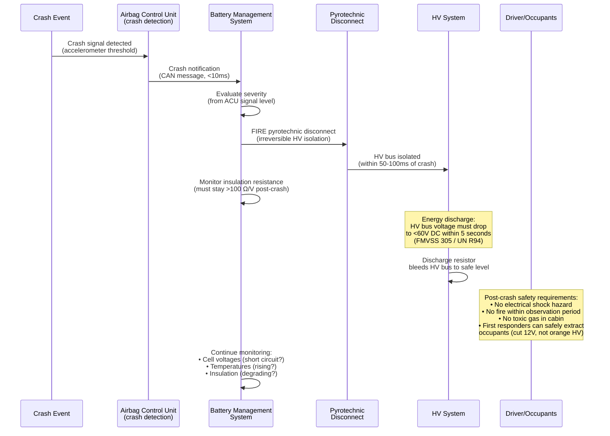

# ISO 6469 — Automotive Battery & EV Safety

**Topic:** Electrically Propelled Road Vehicles — Safety Specifications for Rechargeable Energy Storage Systems (RESS)  
**Standards:** ISO 6469-1:2019, ISO 6469-2:2018, ISO 6469-3:2021, ISO 6469-4:2015, IEC 62660-2/3, GTR No. 20, UN R100, FMVSS 305, GB 38031:2020, USCAR-35  
**SDO:** ISO TC 22/SC 37 (Electrically propelled vehicles), UNECE WP.29, SAE, GB (China)  
**Audience:** EV battery engineers, vehicle safety engineers, homologation specialists, ASIL/FuSa engineers  
**Prerequisites:** Lithium battery fundamentals, functional safety (ISO 26262), vehicle type approval concepts

---

## Chapter 1 — Historical Context & Origin Story

### 1.1 Timeline

| Year | Event |
|------|-------|
| 2001 | ISO 6469 first edition (basic EV safety — mainly lead-acid era concepts) |
| 2009 | ISO 6469-1:2009 second edition (updated for lithium-ion) |
| 2011 | Chevrolet Volt post-crash fire (NHTSA investigation — lithium battery in crash) |
| 2013 | Tesla Model S fires (road debris → battery puncture → fire) |
| 2014 | GTR No. 20 (UN Global Technical Regulation for EVs) adopted |
| 2015 | ISO 6469-4:2015 (post-crash electrical safety) published |
| 2018 | ISO 6469-2:2018 (operational safety) published |
| 2019 | ISO 6469-1:2019 (RESS safety) — major update for modern EVs |
| 2019 | Multiple EV fires globally (Hyundai Kona, NIO ES8, etc.) |
| 2020 | GB 38031:2020 (China) — mandatory 5-minute thermal propagation warning |
| 2020 | Hyundai Kona EV recall (77,000 vehicles — battery cell defect) |
| 2021 | ISO 6469-3:2021 (protection against electrical hazards) |
| 2021 | GM Bolt recall (140,000 vehicles — LG Chem cell manufacturing defect) |
| 2022 | UN R100 Rev.3 (European type approval for EV battery safety) |
| 2023 | IEC 62660-3:2022 (safety requirements for EV cells) widely adopted |
| 2024 | FMVSS 305 update proposed (US federal EV crash safety) |

### 1.2 Key EV Battery Incidents

| Incident | Year | Root Cause | Impact on Standards |
|----------|------|-----------|---------------------|
| Chevrolet Volt fire | 2011 | Post-crash coolant leak → delayed short circuit → fire (3 weeks post-crash) | FMVSS 305 update, post-crash monitoring requirements |
| Tesla Model S fires | 2013 | Road debris punctured battery enclosure → cell damage → fire | Titanium underbody shield; led to mechanical protection requirements in ISO 6469-1 |
| Samsung SDI / BMW i3 | 2018 | Cell manufacturing defect (separator contamination) | Enhanced cell quality requirements in IEC 62660-3 |
| Hyundai Kona EV | 2019-2020 | LG Chem cell defect (folded separator + anode tab damage) | 77,000 recall; GB 38031 thermal propagation, ISO 6469-1 update |
| NIO ES8 fires | 2019 | Battery pack damage from impacts | Mechanical protection requirements enhancement |
| GM Bolt EV | 2021 | LG Chem cell defect (torn anode tab + folded separator in same cell) | 140,000 recall; industry push for 100% cell inspection |
| Multiple OEMs | 2022-2024 | Thermal management failures in extreme heat/cold | Thermal management requirements in ISO 6469-1 |

---

## Chapter 2 — Standard Architecture & Structure

### 2.1 ISO 6469 Series Overview

```mermaid
graph TB
    subgraph "ISO 6469 Series — EV Safety"
        P1[ISO 6469-1:2019<br/>RESS Safety<br/>(Battery Pack Safety)]
        P2[ISO 6469-2:2018<br/>Operational Safety<br/>(Vehicle operation, driver warning)]
        P3[ISO 6469-3:2021<br/>Electrical Safety<br/>(Protection against electric shock)]
        P4[ISO 6469-4:2015<br/>Post-Crash Safety<br/>(Electrical safety after collision)]
    end
    
    subgraph "Related Standards"
        IEC62660[IEC 62660 Series<br/>-1: Performance<br/>-2: Reliability<br/>-3: Safety]
        GTR20[GTR No. 20<br/>Global Technical Regulation<br/>for EV Safety]
        UNR100[UN R100<br/>European Type Approval<br/>for EV RESS]
        GB38031[GB 38031:2020<br/>China National Standard<br/>for EV Battery Safety]
        FMVSS305[FMVSS 305<br/>US Federal EV<br/>Crash Safety Standard]
    end
    
    P1 --> IEC62660
    P1 --> GTR20
    GTR20 --> UNR100
    GTR20 --> GB38031
    P4 --> FMVSS305
```

### 2.2 ISO 6469-1 (RESS Safety) Structure

| Clause | Title | Key Requirements |
|--------|-------|-----------------|
| 4 | General requirements | Design principles, documentation |
| 5 | Mechanical safety | Vibration, mechanical shock, drop, penetration protection |
| 6 | Thermal safety | Thermal management, thermal abuse resistance |
| 7 | Electrical safety | Insulation, isolation monitoring, overcurrent protection |
| 8 | Chemical safety | Electrolyte containment, gas venting, toxic exposure limits |
| 9 | Fire safety | Fire resistance, thermal propagation containment |
| 10 | Functional safety requirements | BMS safety functions per ISO 26262 |
| Annex A | Thermal propagation test | Single cell initiation → assessment of propagation |
| Annex B | External fire test | Battery pack exposed to external fire (pool fire) |
| Annex C | Mechanical damage test | Post-impact assessment |

---

## Chapter 3 — Technical Deep Dive

### 3.1 ISO 6469-1 Key Safety Tests

| Test | Condition | Pass Criteria |
|------|-----------|---------------|
| Vibration | Per vehicle mounting position (ISO 12405-4 profile); 3 axes; ~8-72 hours total | No fire, no explosion, no rupture, no leakage; maintain insulation resistance |
| Mechanical shock | 25g-50g, 15-50 ms (application dependent) | No fire, no explosion; insulation maintained |
| Drop (if applicable) | RESS removed during service — 1m drop onto concrete | No fire, no explosion |
| Thermal cycling | -40°C to +80°C (or manufacturer max), 30+ cycles | No degradation affecting safety; insulation maintained |
| External fire | 590°C pool fire exposure for 70 seconds (direct flame) + 60 seconds (indirect) | Controlled thermal event; no explosion (venting allowed) |
| Water immersion | Submerge to depth per vehicle application (IP67/IP68) | Insulation >100 Ω/V maintained; no short circuit |
| Salt water immersion | Salt water (3.5% NaCl) contact for specified duration | No hazardous short circuit; isolation maintained |
| Thermal propagation | Single cell initiated to TR; assess if pack provides 5-minute warning OR prevents propagation | See detailed description below |
| Overcharge | BMS failure simulated; charge beyond limits | Cell-level safety prevents fire; pack contains event |
| Over-discharge | BMS failure simulated; discharge beyond limits | No fire; recovery possible or safe fail state |
| External short circuit | Low-resistance short across pack terminals | BMS/fuse disconnects; no fire; limited temperature rise |
| Mechanical integrity (crush) | Applied per GTR No. 20 / UN R100 (representing crash loading) | No fire, no thermal event within observation period |

### 3.2 Thermal Propagation Test (ISO 6469-1 Annex A / GB 38031)

This is the most critical and discussed test for modern EV batteries:

| Parameter | ISO 6469-1 Annex A | GB 38031:2020 (China — Mandatory) |
|-----------|-------------------|------------------------------------|
| Initiation method | Nail penetration, heater, or overcharge (manufacturer selects) | Nail penetration OR heater (specified in standard) |
| Target | One cell in worst-case position (hardest to cool, most cells nearby) | One cell at representative location |
| Observation period | Until all events complete or stable | Minimum 5 minutes after TR of initiated cell |
| Pass criteria — Option A | NO propagation to any other cell (containment) | — |
| Pass criteria — Option B | System provides thermal event warning ≥5 minutes before ANY external hazard to occupant | Occupant warning ≥5 minutes before cabin hazard |
| External hazard definition | Fire visible outside pack; toxic gas inside cabin; projectile escape | Flame, smoke, or excessive heat affecting cabin |
| Temperature monitoring | Thermocouples on all cells adjacent to initiated cell | Specified measurement points |
| BMS response | Document: detection time, warning activation, system shutdown | BMS must detect, warn, and disconnect |

**China GB 38031:2020 "5-minute rule"** — This is the most influential single requirement in modern EV battery design:
- Since January 1, 2021, ALL EVs sold in China MUST provide ≥5 minutes advance warning before cabin hazard from battery thermal event
- This has become a de facto GLOBAL requirement (most OEMs design to it regardless of market)
- Forces pack-level thermal propagation mitigation (barriers, venting, BMS detection)

### 3.3 IEC 62660 Series — EV Cell Testing

| Part | Title | Scope |
|------|-------|-------|
| IEC 62660-1:2018 | Performance testing | Capacity, energy, power capability, cycle life, storage life |
| IEC 62660-2:2018 | Reliability and abuse testing | Thermal shock, vibration, mechanical shock, short circuit, overcharge, forced discharge |
| IEC 62660-3:2022 | Safety requirements | Cell-level safety: nail penetration, crush, thermal abuse, overcharge, forced discharge |

**IEC 62660-3 Key Safety Tests (Cell Level for EV):**

| Test | Condition | Criteria |
|------|-----------|----------|
| Overcharge | Charge to 200% SOC at 1C rate | No explosion, no fire |
| Short circuit | <5 mΩ at ambient and 45°C | No explosion, case temp <200°C |
| Over-discharge | Discharge at 1C to 0V (reverse polarity) | No explosion, no fire |
| Crush | Hemispherical punch, 100 kN (or cell deforms 30%) | No explosion, no fire (note: MORE severe than IEC 62133-2) |
| Thermal abuse | 5°C/min to 130°C, hold 60 minutes (MUCH longer than IEC 62133-2!) | No explosion |
| Nail penetration | 3mm diameter nail at 80 mm/s through center | No explosion (fire observation recorded) |

### 3.4 GTR No. 20 / UN R100 — Type Approval

| Test | GTR No. 20 | UN R100 Rev.3 |
|------|-----------|---------------|
| Vibration | Defined profile (sinusoidal or random) per vehicle class | Same as GTR 20 |
| Thermal shock/cycling | -40°C to +60°C, 5 cycles minimum | Same |
| Mechanical shock | Half-sine pulse 7g, 6ms to 50g, 11ms (vehicle-dependent) | Same |
| Fire resistance | 590°C pool fire, 70s direct + 60s indirect | Same |
| External short | <5 mΩ across terminals | Same |
| Overcharge | 1.5× max voltage (or 200% SOC, whichever triggers first) | Same |
| Over-discharge | To 25% of rated voltage | Same |
| Thermal propagation | Single cell TR → assess occupant safety | Required (post-2024 phase-in) |
| Mechanical integrity | Crush force representing vehicle crash load | Same |
| Water immersion | Submerge per IP rating requirement | Same |

---

## Chapter 4 — Implementation Guide

### 4.1 EV Battery Pack Design for ISO 6469 Compliance

```mermaid
graph TB
    subgraph "Cell Level (IEC 62660-3)"
        CELL[Cell Selection<br/>• Chemistry: NMC/LFP/NCA<br/>• Nail penetration behavior<br/>• Thermal abuse to 130°C/60min<br/>• Crush to 100 kN<br/>• TR onset temperature]
    end
    
    subgraph "Module Level"
        MOD[Module Design<br/>• Cell-to-cell spacing + barriers<br/>• Vent gas management<br/>• Thermal monitoring (per cell group)<br/>• Cell balancing circuits<br/>• Module enclosure (flame-rated)]
    end
    
    subgraph "Pack Level (ISO 6469-1)"
        PACK[Pack Design<br/>• Structural housing (crash protection)<br/>• IP67/IP68 sealing<br/>• Thermal management system (liquid/air)<br/>• HV system (contactors, fuses, pre-charge)<br/>• Insulation monitoring (>500 Ω/V)<br/>• Pack-level vent system<br/>• External fire protection<br/>• Thermal propagation mitigation]
    end
    
    subgraph "BMS (ISO 26262 + ISO 6469-1)"
        BMS[BMS Functions<br/>• ASIL B minimum (ISO 26262)<br/>• OVP/UVP/OCP/OTP<br/>• Insulation monitoring<br/>• Thermal runaway detection<br/>• 5-minute warning system<br/>• CAN communication to vehicle<br/>• Crash detection response<br/>• Diagnostic logging]
    end
    
    subgraph "Vehicle Level (ISO 6469-2/3/4)"
        VEH[Vehicle Integration<br/>• HV interlock (HVIL)<br/>• Crash sensing → HV disconnect<br/>• Touch protection (IPXXB)<br/>• Creepage/clearance (IEC 60664)<br/>• Driver warning system<br/>• Emergency responder info]
    end
    
    CELL --> MOD
    MOD --> PACK
    PACK --> BMS
    BMS --> VEH
```

### 4.2 Thermal Propagation Mitigation Strategies

| Strategy | Mechanism | Effectiveness | Cost Impact |
|----------|-----------|---------------|-------------|
| Cell spacing (air gap) | Reduce conductive heat transfer between cells | Moderate (delays propagation) | Low |
| Aerogel blankets | Ultra-low thermal conductivity insulation (0.012 W/m·K) | High (prevents propagation in many cases) | Moderate |
| Mica sheets | Thermal barrier + electrical insulation | Moderate | Low |
| Intumescent materials | Expand when heated, creating insulating char layer | Moderate-High | Moderate |
| Phase change materials | Absorb heat during melting (latent heat buffer) | Moderate (delays, doesn't prevent if sustained) | Moderate |
| Liquid cooling plate | Remove heat actively during early stages of TR | High (if detected early enough) | Already present (dual purpose) |
| Vent gas routing | Direct hot gas away from adjacent cells to exhaust | High (prevents flame impingement on neighbors) | Low-Moderate |
| Cell-level safety vent | Direct cell vent gas AWAY from other cells | High | Designed into cell (cylindrical advantage) |
| LFP chemistry selection | Inherently lower TR temperature and energy release | Very High (LFP rarely propagates) | Premium on $/kWh (but decreasing) |
| CTP (Cell-to-Pack) design | Eliminate module housing — but adds propagation risk | Requires careful thermal design | Cost reduction (but safety investment needed) |

### 4.3 USCAR-35 — HV Connector Safety

| Requirement | USCAR-35 Specification |
|-------------|----------------------|
| Purpose | High-voltage connector standard for EV battery-to-vehicle interface |
| Voltage rating | 600V DC class (working voltage) |
| Current rating | Up to 300A continuous (per connector size) |
| HVIL (HV Interlock Loop) | Mandatory: low-voltage interlock circuit that detects connector mating/unmating |
| Touch protection | IPXXB (finger-safe) when disconnected — no accessible live parts |
| Environmental | IP67 when mated (waterproof) |
| Vibration | Withstand vehicle vibration per SAE J2030 |
| Temperature | -40°C to +125°C (connector body) |
| Lifecycle | 1000 mate/unmate cycles minimum |
| Arc suppression | Connect/disconnect under load without hazardous arcing |
| Color coding | ORANGE for HV components (universal EV safety convention) |

---

## Chapter 5 — Certification & Type Approval

### 5.1 Regional Type Approval Matrix

| Region | Regulation | Battery Tests Required | Authority |
|--------|-----------|----------------------|-----------|
| EU/UNECE | UN R100 Rev.3 | Vibration, thermal, mechanical shock, fire, short circuit, overcharge, immersion, thermal propagation | Type Approval Authority (e.g., KBA Germany, VCA UK) |
| China | GB 38031:2020 + GB/T 31484/31485/31486 | Same as UN R100 + MANDATORY 5-min thermal propagation warning | MIIT + CATARC |
| US | FMVSS 305 (crash safety) + voluntary SAE standards | Crash safety (electrical isolation post-crash). No mandatory pre-crash battery abuse tests (voluntary) | NHTSA |
| Japan | UN R100 (adopted) + TRIAS | Same as UN R100 (Japan adopted UNECE regulations) | MLIT |
| Korea | KMVSS Article 91-4 + KS R IEC 62660 | Similar to UN R100 + Korean additions | KATRI / MOLIT |
| India | AIS 038 (Rev.2) + AIS 156 | Based on GTR No. 20 / UN R100 | ARAI / ICAT |

### 5.2 Certification Cost and Timeline

| Activity | Cost | Timeline |
|----------|------|----------|
| IEC 62660-1/2/3 (cell testing — all parts) | $40,000-$80,000 | 8-12 weeks |
| ISO 6469-1 pack testing (full suite) | $100,000-$250,000 | 12-20 weeks |
| Thermal propagation test (ISO 6469-1 Annex A / GB 38031) | $50,000-$100,000 | 4-8 weeks |
| UN R100 type approval testing | $150,000-$300,000 | 16-24 weeks |
| GB 38031 compliance (China) | $80,000-$150,000 | 12-16 weeks |
| FMVSS 305 crash testing (sled or full vehicle) | $200,000-$500,000 per crash | 4-8 weeks per crash |
| Full EV type approval (battery portion) | $500,000-$1,200,000 | 6-12 months |

### 5.3 Test Laboratories for EV Battery

| Laboratory | Location | Capabilities |
|-----------|----------|--------------|
| AVL | Austria, Germany, US | Full ISO 6469, UN R100, environmental chamber + vibration |
| HORIBA MIRA | UK | Full vehicle + battery testing, UN R100 |
| TÜV Rheinland | Germany, China | ISO 6469, UN R100, IEC 62660, GB 38031 |
| TÜV SÜD | Germany, China, Singapore | Full EV safety testing |
| Southwest Research Institute (SwRI) | US (TX) | Abuse testing, fire testing, crash simulation |
| Argonne National Lab | US (IL) | DOE battery research + abuse testing |
| CATARC | China | GB 38031, GB/T 31484/85/86 (mandatory for China market) |
| KATRI | Korea | Korean type approval testing |
| ARAI/ICAT | India | AIS 038 testing for Indian market |
| Millbrook | UK | Full vehicle + battery testing |
| Applus IDIADA | Spain | UN R100, ISO 6469, full EV testing |

---

## Chapter 6 — Regional Variants

### 6.1 Detailed Regional Comparison

| Requirement | EU (UN R100) | China (GB 38031) | US (FMVSS 305) | Japan | Korea |
|-------------|-------------|-----------------|----------------|-------|-------|
| Vibration | Mandatory (defined profile) | Mandatory (GB profile) | Not in FMVSS (SAE voluntary) | UN R100 adopted | Mandatory |
| Thermal shock | -40 to +60°C | -40 to +60°C | Not mandatory | UN R100 | Mandatory |
| Fire resistance | 590°C, 70s+60s | Pool fire test (GB spec) | Not mandatory | UN R100 | Mandatory |
| Mechanical shock | 7g-50g per class | Chinese shock profile | Crash test (not component) | UN R100 | Mandatory |
| Thermal propagation | Phasing in (2026 full) | **MANDATORY since 2021** | Not yet mandatory | Adopting | Mandatory |
| 5-min warning | Phasing in | **MANDATORY** | Not required | Considering | Required |
| Crash electrical safety | Yes (isolation post-crash) | Yes (similar) | **YES (FMVSS 305 primary)** | Yes | Yes |
| Insulation resistance | >100 Ω/V OR IPXXB protection | >100 Ω/V | >500 Ω/V (higher!) | >100 Ω/V | >100 Ω/V |
| Water immersion | IP67 required | IP67 required | Not specifically | IP67 | IP67 |
| Overcharge protection | Mandatory test | Mandatory test | Not mandatory (crash-focused) | UN R100 | Mandatory |

### 6.2 US vs. International Approach

The US takes a fundamentally different approach to EV battery safety:

| Aspect | US Approach | International Approach |
|--------|------------|----------------------|
| Philosophy | "Self-certification" — manufacturer certifies compliance | "Type approval" — government tests and approves |
| Crash focus | FMVSS 305: electrical safety POST-CRASH is the primary concern | Pre-crash abuse testing (vibration, thermal, fire) equally important |
| Battery abuse tests | VOLUNTARY (SAE J2464, SAE J2929 reference standards) | MANDATORY (UN R100, GB 38031) |
| Thermal propagation | Not yet federally mandatory (NHTSA studying) | Mandatory in China since 2021; EU phasing in |
| Enforcement | NHTSA investigation/recall if defect manifests | Type approval testing before market entry |
| Result | More EV fires → recall cycle (reactive) | Fewer incidents but slower market entry (proactive) |

---

## Chapter 7 — Standard Comparison Matrix

| Criterion | ISO 6469-1 | UN R100 | GB 38031 | FMVSS 305 | IEC 62660-3 |
|-----------|-----------|---------|----------|-----------|-------------|
| Scope | Pack safety (design standard) | Pack safety (type approval) | Pack safety (national mandatory) | Post-crash electrical (federal) | Cell safety |
| Level | Pack/system | Pack/system | Pack/system | Vehicle (crash) | Cell only |
| Geography | International (reference) | Europe + 59 contracting parties | China only | US only | International |
| Thermal propagation | Annex A (optional → mandatory evolution) | Phase-in 2024-2026 | MANDATORY since 2021 | Not addressed | Not addressed (cell level) |
| 5-min warning | Recommended | Phase-in | MANDATORY | N/A | N/A |
| Fire test | External pool fire | External pool fire (590°C) | Chinese fire test | N/A (crash-focused) | N/A |
| Insulation | >100 Ω/V | >100 Ω/V | >100 Ω/V | >500 Ω/V | N/A |
| Crash test | Referenced (ISO 6469-4) | Not directly (separate UN R94/95) | Chinese crash stds | PRIMARY FOCUS | N/A |
| BMS requirements | General (references ISO 26262) | Functional requirements | Detailed requirements | N/A (performance) | N/A |
| Cost to comply | Incorporated in UN R100 cost | $150K-$300K | $80K-$150K | $200K-$500K per crash | $40K-$80K |

---

## Chapter 8 — Mermaid Architecture Diagrams

### 8.1 EV Battery Safety Hierarchy

```mermaid
graph TB
    subgraph "Level 1: Cell Safety (IEC 62660-3)"
        C_SAFETY[Cell Inherent Safety<br/>• Chemistry selection (LFP vs NMC)<br/>• Separator (ceramic coated)<br/>• CID / PTC / Safety vent<br/>• Manufacturing quality (0 defects)]
    end
    
    subgraph "Level 2: Module Safety"
        M_SAFETY[Module Protection<br/>• Cell-to-cell thermal barriers<br/>• Vent gas routing<br/>• Module fuse<br/>• Temperature sensors per cell group<br/>• Cell balancing]
    end
    
    subgraph "Level 3: Pack Safety (ISO 6469-1)"
        P_SAFETY[Pack Protection<br/>• Structural enclosure (crash protection)<br/>• IP67/68 sealing<br/>• Thermal management (liquid cooling)<br/>• Pack-level vent system<br/>• HV contactors + pre-charge<br/>• Main fuse (pyrotechnic disconnect)<br/>• Insulation monitoring<br/>• External fire protection]
    end
    
    subgraph "Level 4: BMS (ISO 26262 ASIL B+)"
        BMS_SAFETY[BMS Functions<br/>• OVP / UVP / OCP / OTP<br/>• Insulation fault detection<br/>• Thermal runaway detection<br/>• 5-minute advance warning<br/>• Crash signal → immediate disconnect<br/>• SOC/SOH estimation<br/>• Contactor control<br/>• CAN communication to VCU]
    end
    
    subgraph "Level 5: Vehicle Safety (ISO 6469-2/3/4)"
        V_SAFETY[Vehicle Integration<br/>• HV interlock loop (HVIL)<br/>• Crash sensor → pyro disconnect<br/>• Touch protection (IPXXB)<br/>• Orange HV cable identification<br/>• Driver HV warning light<br/>• Emergency rescue sheet<br/>• First responder QR code]
    end
    
    C_SAFETY --> M_SAFETY
    M_SAFETY --> P_SAFETY
    P_SAFETY --> BMS_SAFETY
    BMS_SAFETY --> V_SAFETY
```

### 8.2 Post-Crash Safety Sequence (ISO 6469-4 / FMVSS 305)



---

## Chapter 9 — Case Studies

### 9.1 EV Battery Pack Design — ISO 6469-1 Full Compliance

| Aspect | Detail |
|--------|--------|
| Product | 75 kWh EV battery pack (NMC 622), 400V architecture |
| Configuration | 96S3P (288 pouch cells, 78 Ah each), 8 modules |
| Pack specs | 395V nominal, 437V max, 288V min; 300A continuous discharge; 150A charge; liquid-cooled |
| Weight | 450 kg (including enclosure, cooling, BMS, wiring) |
| Enclosure | Extruded aluminum tray with steel cross-members; 12 mm bottom plate (underride protection) |
| IP rating | IP67 (1m submersion for 30 minutes) |
| Cooling | Liquid cooling plates (glycol-water mix, 8 L/min flow, dedicated chiller/heater) |
| BMS | Master BMS + 8 satellite boards (one per module), CAN FD to vehicle controller |
| Safety features | 2× contactors (HV+ and HV-), pyrotechnic disconnect, pre-charge relay, main fuse (400A), HVIL |

**ISO 6469-1 Test Results:**

| Test | Setup | Result |
|------|-------|--------|
| Vibration | 3 axes, random profile, 21g RMS, 72 hours total | PASS — no mechanical failures, insulation >2 MΩ |
| Mechanical shock | 50g, 11ms half-sine (pack >12 kg), 6 shocks per axis | PASS — all connections intact, OCV stable |
| Thermal cycling | -40°C to +80°C, 5°C/min ramp, 30 cycles | PASS — no leakage, insulation maintained |
| External fire | 590°C pool fire, 70s direct + 60s indirect on bottom plate | PASS — aluminum tray insulated; no cell TR. Pack vented safely. No explosion. |
| Water immersion | 1m depth, 30 minutes, fresh water + separate salt water test | PASS — insulation >5 MΩ. No ingress detected. |
| External short circuit | Short pack terminals with <5 mΩ; observe | PASS — pyrofuse blew in 2ms (400A rated). No fire. Pack isolated. |
| Overcharge | BMS disabled; charge at 150A beyond 100% SOC | PASS — cell CID activated at 4.35V; 3 cells vented; no fire; no explosion |
| Thermal propagation | Heater on worst-case cell (center of center module) to 200°C | Result: TR initiated at cell #144. Propagated to 4 adjacent cells over 8 minutes. BMS detected at 45 seconds (voltage drop + temp rise). Driver warning activated at 52 seconds. No cabin hazard for 12 minutes. **PASS (>5 minutes warning)** |
| Crush (crash simulation) | 100 kN applied to side of pack (representing side-impact crash load) | PASS — deformation 15mm; no cell penetration; insulation maintained (bottom plate protected cells) |

### 9.2 China GB 38031 Thermal Propagation — LFP vs. NMC

| Aspect | LFP (BYD Blade) | NMC (Generic OEM) |
|--------|-----------------|-------------------|
| Cell | LFP prismatic, 138 Ah, 3.2V, blade format (960mm long) | NMC 622 pouch, 78 Ah, 3.7V |
| Pack | Cell-to-Pack (CTP) — no modules, cells directly in pack | 8 modules, 96S3P |
| TR onset temperature | ~270°C (LFP inherently stable) | ~200°C (NMC much more reactive) |
| Nail penetration result | Cell surface reached 30-60°C. NO thermal runaway. | Cell reached 800°C+, full TR with flame |
| Thermal propagation | **No propagation** — LFP blade cell barely reacts to nail | Propagation to 4-8 cells before thermal barriers stop it |
| GB 38031 compliance | PASS (no TR occurs = no need for 5-min warning) | PASS (5-min warning achieved via barriers + BMS detection) |
| Design complexity | Low — LFP inherent safety does the work | High — requires aerogel barriers, directed venting, fast BMS detection |
| Marketing impact | BYD publicizes nail penetration test (competitive advantage) | Cannot show nail penetration (cells catch fire) |
| Cost of thermal propagation mitigation | ~$0 additional (LFP doesn't propagate) | $15-$30/kWh (barriers, sensors, vent systems) |

---

## Chapter 10 — Future Evolution & Industry Trends

| Trend | Timeline | Description |
|-------|----------|-------------|
| ISO 6469-1 next edition | ~2025-2026 | Thermal propagation mandatory globally (not just China) |
| UN R100 Rev.4 | 2025-2026 | Full thermal propagation requirement for EU type approval |
| FMVSS 305 update | Under review | NHTSA considering mandatory battery abuse tests (not just crash) |
| 800V architecture safety | Now | ISO 6469-3 updates for 800V systems (higher creepage/clearance) |
| Solid-state battery EV testing | 2027+ | Different failure modes (dendrite shorting vs. thermal runaway) |
| Battery-as-structure (structural battery) | 2025+ | Battery IS the vehicle floor — changes crash safety approach fundamentally |
| Sodium-ion EV batteries | 2025-2027 | New chemistry → new test parameters (different from lithium) |
| Bidirectional charging safety | 2025+ | V2G/V2H adds requirements for both charge AND discharge protection |
| Autonomous EV battery safety | Growing | No occupants to warn → safety strategy changes (protect pedestrians, property) |
| OTA updates affecting battery | Now | Firmware updates changing charge limits → safety implications → ISO 26262 impact |
| Megawatt Charging (MCS) | 2025+ | 3.75 MW charging → extreme stress on battery during charge events |
| Recycling-friendly design | EU mandate | Battery removability for recycling → impacts pack sealing/safety |
| Digital battery passport | 2027 | EU Battery Regulation: track safety data through lifecycle |

---

## Chapter 11 — Interview Questions & Career Guide

### Tier 1: Entry-Level

**Q1:** What is the "5-minute rule" for EV batteries and why is it important?  
**A:** The "5-minute rule" comes from **China's GB 38031:2020** national standard, mandatory since January 1, 2021 for all EVs sold in China. It requires that if a thermal runaway event occurs in any single cell within the EV battery pack, the battery system must provide **at least 5 minutes of advance warning** to vehicle occupants **before** any external hazard (fire, toxic gas, explosion) reaches the passenger cabin.

**Why it exists:** In early EV fires, occupants sometimes had only seconds between first warning sign and cabin danger. The 5-minute rule ensures occupants have time to safely exit the vehicle and move away.

**How it's achieved:** (1) BMS must detect thermal runaway onset quickly (within 30-60 seconds) via abnormal cell temperature rise or voltage drop. (2) Thermal barriers between cells must delay propagation (aerogel, mica, air gaps). (3) Directed vent gas routing must prevent hot gas from reaching the cabin for ≥5 minutes. (4) The vehicle must issue clear visual and audible warnings to occupants.

**Global impact:** Although GB 38031 is technically China-only, this requirement has become a **de facto global standard** because: (a) China is the world's largest EV market — every global OEM must comply. (b) ISO 6469-1 and UN R100 are adopting similar requirements. (c) OEMs find it more efficient to design one global battery pack that meets the strictest requirement.

### Tier 2: Mid-Level

**Q2:** Compare the safety implications of NMC vs. LFP chemistry for EV battery pack design from an ISO 6469-1 compliance perspective.  
**A:**

| Safety Dimension | NMC (Nickel Manganese Cobalt) | LFP (Lithium Iron Phosphate) |
|-----------------|------------------------------|-------------------------------|
| TR onset temperature | ~200°C (lower = easier to trigger) | ~270°C (higher = much harder to trigger) |
| TR severity | Very energetic: 800-1100°C, significant flame, large gas volume, HF generation | Mild: 300-500°C, often no flame, minimal gas, minimal HF |
| TR propagation risk | HIGH — adjacent cells easily reach 200°C from one cell event | VERY LOW — adjacent cells rarely reach 270°C even with direct contact |
| GB 38031 thermal propagation | Requires: aerogel barriers, directed venting, fast BMS detection, thermal management optimization | Often passes WITHOUT any mitigation (BYD blade nail penetration = no TR occurs) |
| ISO 6469-1 fire test | Higher risk — external fire more likely to trigger TR | Lower risk — 590°C fire test may not trigger LFP cells |
| Nail penetration (IEC 62660-3) | Full TR, flame, gas | Often NO TR (just local heating) |
| Pack design complexity for safety | HIGH — multi-layer defense needed | LOW — inherent chemistry safety |
| BMS ASIL requirement | ASIL B minimum, but effectively ASIL C/D for some functions due to severity | ASIL B typically sufficient |
| Energy density | ~250 Wh/kg (cell) | ~170 Wh/kg (cell) |
| ISO 6469-1 compliance cost (thermal propagation portion) | +$15-$30/kWh for mitigation (barriers, sensors, vent systems) | ~$0 additional (LFP inherent safety) |
| Total safety system cost for 75 kWh pack | $1,125-$2,250 for thermal propagation mitigation | Negligible |
| Industry trend | Premium/performance vehicles (Tesla Model S/X, BMW, Mercedes) | Mass market + commercial (BYD, Tesla Model 3 SR, buses, trucks) |

**Design decision framework:**
- If range is critical (premium segment): NMC — accept higher safety engineering cost
- If total cost and safety simplicity matter (mass market, commercial): LFP — significant engineering simplification
- Trend: LFP market share growing rapidly (>60% of new EVs globally in 2024) due to both cost AND safety advantages

### Tier 3: Senior

**Q3:** Design the functional safety architecture for an EV BMS to achieve ISO 26262 ASIL B compliance for thermal runaway detection and the 5-minute occupant warning.  
**A:**

**Safety Goal:** "The BMS shall detect battery thermal runaway and provide occupant warning at least 5 minutes before cabin hazard, with an ASIL B integrity level."

**ASIL Determination:** Per ISO 26262 HARA (Hazard Analysis and Risk Assessment):
- Severity S3 (life-threatening — fire/explosion)
- Exposure E3 (medium — thermal runaway is rare but not negligible)
- Controllability C2 (most drivers can exit vehicle in 5 minutes if warned)
- Result: ASIL B (some OEMs argue ASIL C for severity S3 scenarios)

**Safety Concept (Functional Architecture):**

| Function | Implementation | ASIL Allocation | Rationale |
|----------|---------------|-----------------|-----------|
| Cell temperature measurement | NTC thermistors per cell group (1 per 4-8 cells minimum) | ASIL B | Primary detection of abnormal heating |
| Cell voltage measurement | AFE with per-cell measurement (differential) | ASIL B | Detect internal short (voltage drop precedes temperature rise) |
| Temperature rate-of-rise detection | Algorithm in BMS MCU: flag if ΔT > 1°C/min on any sensor | ASIL B | Early warning (rising temp = pre-TR indicator) |
| Absolute temperature threshold | Hardware comparator (independent of MCU): trigger if T > 80°C | ASIL B (independent channel) | Backup detection if MCU fails |
| Voltage anomaly detection | Algorithm: flag if any cell deviates >100 mV from neighbors | ASIL B | Detect internal short circuit (earliest indicator) |
| Warning activation | CAN message to instrument cluster + audible buzzer | ASIL B | Driver notification |
| System shutdown | Open HV contactors, activate pyrotechnic disconnect | QM (safe state action) | Isolate energy source |
| Redundancy | Two independent detection paths: (1) MCU-based algorithm, (2) Hardware comparator with direct buzzer activation | Decomposition: ASIL B(D) = B + B | Either path independently achieves warning |

**Hardware Safety Mechanisms:**
| Mechanism | Purpose | Diagnostic Coverage |
|-----------|---------|-------------------|
| Watchdog timer (external) | Detect MCU lockup → trigger safe state | 99% |
| ADC self-test (built-in) | Detect AFE measurement failure | 90% |
| Redundant temperature sensor (per module) | Detect single sensor failure (cross-check) | 99% (for that module) |
| CAN message alive counter | Detect communication loss to vehicle | 99% |
| Power supply monitoring | Detect BMS power loss (battery backup for warning) | 95% |
| Memory CRC check | Detect RAM/Flash corruption affecting thresholds | 99% |

**Failure Mode Analysis (relevant DFMEAs):**
| Failure Mode | Effect | Detection | Mitigation |
|-------------|--------|-----------|------------|
| Temperature sensor open circuit | Loss of TR detection for that zone | ADC reading out-of-range → flag fault | Redundant sensor in same zone |
| Temperature sensor short to ground | False low reading (misses hot cell) | Plausibility check vs. neighbors | Redundant measurement + comparator |
| MCU lockup | No algorithm execution | External watchdog → backup path triggers | Independent HW comparator activates warning |
| CAN communication loss | Warning message not delivered to cluster | CAN alive counter timeout → local buzzer activates | Direct hardwired buzzer from BMS |
| AFE measurement saturation | Misses cell voltage drop | AFE diagnostic register check | Second AFE channel (on adjacent cells) |

**Verification plan:**
| Activity | Standard | Method |
|----------|----------|--------|
| Safety analysis (HARA, FMEA, FTA) | ISO 26262-3 | Document review + expert assessment |
| HW metrics (SPFM, LFM) | ISO 26262-5 | Calculated: target SPFM >90%, LFM >60% for ASIL B |
| SW unit testing | ISO 26262-6 | MC/DC coverage >80% for ASIL B software |
| Integration testing | ISO 26262-4 | Fault injection testing (simulate sensor failures, MCU faults) |
| System validation | ISO 6469-1 Annex A | Physical thermal propagation test: verify detection within 60s, warning within 90s |
| Production validation | ISO 26262-7 | End-of-line testing of safety-critical paths (every BMS unit) |

---

## Chapter 12 — Cheat Sheet & Quick Reference

### ISO 6469 Series Quick Reference

```
ISO 6469-1:2019  RESS (Battery Pack) Safety
  → Vibration, thermal, fire, mechanical, chemical, electrical, propagation
  → KEY: Thermal propagation (Annex A) — 5-min warning concept

ISO 6469-2:2018  Operational Safety
  → Driver warnings, operating modes, functional safety during operation

ISO 6469-3:2021  Electrical Safety (shock protection)
  → Insulation (>100 Ω/V), touch protection (IPXXB), HV disconnect

ISO 6469-4:2015  Post-Crash Electrical Safety
  → HV isolation after crash, energy discharge (<60V in 5s)
```

### Key Regulations by Market

```
MARKET    REGULATION          KEY REQUIREMENT
EU        UN R100 Rev.3       Full battery abuse + fire test
China     GB 38031:2020       5-MINUTE THERMAL PROPAGATION WARNING (MANDATORY!)
US        FMVSS 305           Post-crash electrical isolation only
Japan     UN R100 (adopted)   Same as EU
Korea     KMVSS + KS R        Enhanced requirements post-incidents
India     AIS 038/156         Based on GTR No. 20

⚠️ China GB 38031 5-min rule = most stringent globally
⚠️ US has NO mandatory pre-crash battery abuse test (only crash)
⚠️ EU UN R100 thermal propagation: phasing in 2024-2026
```

### EV Battery Safety Numbers

```
INSULATION RESISTANCE:
  ISO/UN R100:  >100 Ω/V (400V system → >40 kΩ minimum)
  FMVSS 305:   >500 Ω/V (400V system → >200 kΩ minimum — US stricter!)

POST-CRASH:
  Voltage decay:  Must reach <60V DC within 5 seconds
  Or: Physical barrier (IPXXB) preventing touch
  
FIRE TEST:
  Temperature:   590°C (pool fire)
  Duration:      70s direct flame + 60s indirect heat
  
THERMAL PROPAGATION:
  Warning time:  ≥5 minutes before cabin hazard
  Detection:     BMS must detect within 30-60 seconds
  
HV SYSTEM:
  Voltage:       Class B: 60-1500V DC (or 30-1000V AC)
  Color:         ORANGE (universal for HV components)
  Interlock:     HVIL mandatory on all HV connectors
  Protection:    IPXXB (finger-safe) for accessible parts
```

### Chemistry Comparison for Safety

```
                NMC              LFP              NCA
TR onset:       ~200°C           ~270°C           ~150°C
TR severity:    HIGH (flame)     LOW (no flame)   VERY HIGH
Propagation:    LIKELY           UNLIKELY         VERY LIKELY
5-min rule:     Needs barriers   Inherent pass    Extensive barriers
GB 38031:       Complex design   Simple pass      Most complex
Cost premium:   +$15-30/kWh      ~$0              +$25-40/kWh
  (for safety mitigation)
```

---

*End of Document — 05_Automotive_Battery_ISO_6469.md*
