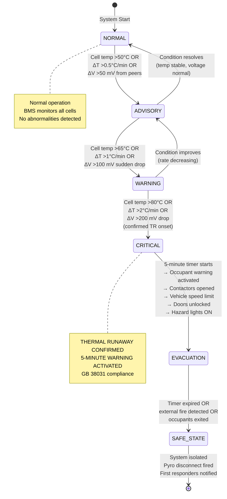

# BMS Functional Safety — ISO 26262 for Battery Management

**Topic:** Battery Management System Functional Safety Design Under ISO 26262 and IEC 62619 Requirements  
**Standards:** ISO 26262:2018, IEC 62619:2022 Annex A, IEC 61508, SAE J2464, ISO 6469-1  
**SDO:** ISO TC 22/SC 32 (Electrical/electronic components), IEC TC 21/SC 21A  
**Audience:** BMS hardware/software engineers, functional safety engineers, battery system architects  
**Prerequisites:** ISO 26262 basics, lithium battery fundamentals, embedded systems design

---

## Chapter 1 — Historical Context & Origin Story

### 1.1 Timeline

| Year | Event |
|------|-------|
| 2006 | Sony/Dell recall — BMS failed to prevent manufacturing-defect-induced failures |
| 2011 | ISO 26262:2011 first edition — automotive functional safety (FuSa) |
| 2013 | Boeing 787 grounding — inadequate BMS oversight of cells |
| 2016 | Galaxy Note 7 — BMS unable to compensate for cell defect (battery protection IC limitations) |
| 2017 | IEC 62619:2017 — first formal BMS requirements in Annex A |
| 2018 | ISO 26262:2018 second edition — expanded scope, motorcycle/truck, semiconductor |
| 2019 | Hyundai Kona fires — BMS failed to detect degraded cells before thermal runaway |
| 2020 | GB 38031 — BMS must detect TR and provide 5-minute warning |
| 2021 | GM Bolt recall — BMS diagnostic monitoring insufficient for cell defect pattern |
| 2022 | IEC 62619:2022 — enhanced Annex A (functional safety reference in Annex C) |
| 2023 | SOTIF (ISO 21448) considerations for BMS AI/ML algorithms |
| 2024 | Cybersecurity (ISO 21434) requirements for connected BMS |

### 1.2 Why BMS Functional Safety Matters

| Without BMS Safety | Consequence |
|-------------------|-------------|
| No over-voltage protection | Lithium plating → internal short → thermal runaway |
| No under-voltage protection | Copper dissolution → internal short (delayed failure) |
| No over-current protection | I²R heating → separator melting → short circuit |
| No over-temperature protection | Accelerated degradation → SEI decomposition → TR |
| No cell balancing | One cell over-discharged in series string → failure |
| No insulation monitoring | Ground fault undetected → electric shock or arc |
| No thermal runaway detection | No occupant warning → no 5-minute escape window |

---

## Chapter 2 — Standard Architecture & Structure

### 2.1 BMS Safety Standards Landscape

```mermaid
graph TB
    subgraph "Automotive BMS"
        ISO26262[ISO 26262:2018<br/>Functional Safety<br/>(ASIL A-D)]
        ISO6469[ISO 6469-1:2019<br/>RESS Safety<br/>(Pack-level requirements)]
        GB38031[GB 38031:2020<br/>5-min warning<br/>(China mandatory)]
    end
    
    subgraph "Industrial BMS"
        IEC62619[IEC 62619:2022<br/>Annex A: BMS Requirements<br/>(Normative)]
        IEC61508[IEC 61508<br/>Functional Safety<br/>(SIL 1-4)]
    end
    
    subgraph "Common Functions"
        OVP[Over-Voltage Protection]
        UVP[Under-Voltage Protection]
        OCP[Over-Current Protection]
        OTP[Over-Temperature Protection]
        BAL[Cell Balancing]
        ISO_MON[Insulation Monitoring]
        TR_DET[Thermal Runaway Detection]
        COMM[Communication Interface]
        LOG[Fault Logging]
    end
    
    ISO26262 --> OVP
    ISO26262 --> UVP
    ISO26262 --> OCP
    ISO26262 --> OTP
    ISO26262 --> TR_DET
    IEC62619 --> OVP
    IEC62619 --> UVP
    IEC62619 --> OCP
    IEC62619 --> OTP
    IEC62619 --> BAL
    IEC62619 --> ISO_MON
    IEC62619 --> COMM
    IEC62619 --> LOG
```

### 2.2 ASIL Determination for BMS Functions

| Safety Function | Severity | Exposure | Controllability | ASIL |
|----------------|----------|----------|-----------------|------|
| Over-voltage protection (overcharge prevention) | S3 (thermal runaway → fire) | E4 (every charge event) | C2 (driver can exit if warned) | **ASIL C** |
| Under-voltage protection | S2 (delayed failure, reduced life) | E3 (moderate driving conditions) | C1 (driver unaware) | **ASIL B** |
| Over-current protection (discharge) | S3 (fire potential) | E2 (high-load scenarios) | C2 | **ASIL B** |
| Over-temperature protection | S3 (thermal runaway) | E3 (hot climate, fast charge) | C2 (driver can stop) | **ASIL C** |
| Under-temperature protection (charge) | S2 (lithium plating → future failure) | E3 (cold climate charging) | C1 | **ASIL B** |
| Thermal runaway detection + 5-min warning | S3 (fire, occupant death) | E2 (rare event) | C2 (driver can exit) | **ASIL B** |
| Insulation monitoring (HV isolation) | S3 (electric shock) | E4 (always during HV operation) | C3 (uncontrollable if touched) | **ASIL D** |
| Crash detection → HV disconnect | S3 (post-crash electrocution) | E2 (crash occurrence) | C3 (occupants incapacitated) | **ASIL C** |
| Cell balancing | S1 (imbalance → accelerated aging) | E4 (every cycle) | C1 (transparent to user) | **QM** |
| SOC estimation (for range) | S0-S1 (convenience, no safety) | E4 (always) | C1 | **QM** |
| SOH estimation | S1 (maintenance scheduling) | E3 (periodic check) | C1 | **QM** |

---

## Chapter 3 — Technical Deep Dive

### 3.1 BMS Architecture for Functional Safety

```mermaid
graph TB
    subgraph "Sensing Layer"
        AFE[Analog Front End (AFE)<br/>• Per-cell voltage (±2 mV)<br/>• Temperature (NTC per group)<br/>• Pack current (Hall/Shunt)<br/>IC examples: ADBMS6815,<br/>MAX17853, BQ79616]
    end
    
    subgraph "Processing Layer"
        MCU_MAIN[Main MCU<br/>• SOC/SOH algorithms<br/>• Balancing control<br/>• Communication stack<br/>• Diagnostics<br/>Safety: ASIL B capable]
        MCU_SAFE[Safety MCU (optional)<br/>• Independent monitoring<br/>• Hardware comparators<br/>• Watchdog supervisor<br/>Safety: ASIL D capable]
    end
    
    subgraph "Actuation Layer"
        CONT_P[Contactor HV+ <br/>(normally open)]
        CONT_N[Contactor HV-<br/>(normally open)]
        PRECHARGE[Pre-charge Relay<br/>+ Resistor]
        PYRO[Pyrotechnic Disconnect<br/>(irreversible, crash only)]
        BAL_SW[Balancing Switches<br/>(passive: bleed resistors)]
    end
    
    subgraph "Communication Layer"
        CAN_VEH[CAN/CAN FD<br/>to Vehicle Controller]
        CAN_CHRG[CAN/PLC<br/>to Charger (ISO 15118)]
        DIAG[Diagnostic Interface<br/>(UDS via CAN)]
    end
    
    AFE --> MCU_MAIN
    AFE --> MCU_SAFE
    MCU_MAIN --> CONT_P
    MCU_MAIN --> CONT_N
    MCU_MAIN --> PRECHARGE
    MCU_SAFE --> PYRO
    MCU_SAFE --> CONT_P
    MCU_MAIN --> BAL_SW
    MCU_MAIN --> CAN_VEH
    MCU_MAIN --> CAN_CHRG
    MCU_MAIN --> DIAG
```

### 3.2 Protection Functions — Detailed Specifications

#### Over-Voltage Protection (OVP)

| Parameter | Typical EV Specification | Notes |
|-----------|------------------------|-------|
| Cell OVP threshold | 4.20V ± 10 mV (NMC) / 3.65V ± 10 mV (LFP) | Set by cell manufacturer |
| Response time | <100 ms from detection to contactor open | Critical for preventing plating |
| Measurement accuracy | ±2 mV (AFE requirement for ASIL B) | Ensures threshold not accidentally exceeded |
| Redundancy | Primary: AFE reading → MCU decision → contactor. Backup: Hardware comparator → safety MCU → contactor | Two independent paths for ASIL decomposition |
| Diagnostic | Open wire detection, reference voltage check, ADC self-test | 90%+ diagnostic coverage |
| Fail-safe state | Contactors OPEN (de-energize to open = fail-safe direction) | Loss of power = safe state |

#### Over-Temperature Protection (OTP)

| Parameter | Typical EV Specification | Notes |
|-----------|------------------------|-------|
| Charge OTP threshold | 45°C (derate above) / 50°C (hard cutoff) | Prevents accelerated degradation |
| Discharge OTP threshold | 60°C (derate) / 65°C (hard cutoff) | Prevents separator damage |
| Thermal runaway warning | >1°C/min rate-of-rise OR absolute >80°C | Pre-TR detection |
| Sensor density | 1 NTC per 4-8 cells (minimum per GB 38031 guidance) | More sensors = faster detection |
| Accuracy | ±1°C (NTC with calibration) | Temperature variation across pack is real |
| Response time | <1 second from threshold crossing to action | Temperature is slow-changing |
| Failure mode | Open NTC reads as high resistance (cold). Must detect open circuit. | AFE measures NTC as voltage divider; open = max voltage = detectable |

#### Over-Current Protection (OCP)

| Parameter | Typical EV Specification | Notes |
|-----------|------------------------|-------|
| Continuous discharge limit | 1C-3C (depending on cell rating) | Based on cell datasheet maximum |
| Peak discharge (10s) | 3C-5C (acceleration events) | Time-limited by I²t algorithm |
| Charge limit | 0.5C-2C (normal) / 2C-4C (fast charge with thermal management) | Temperature-dependent derating |
| Short circuit detection | >threshold (e.g., >500A) with response <10 ms | Critical safety function (hardware-level detection preferred) |
| I²t integration | Cumulative thermal model: ΣI²dt < thermal limit | Prevents sustained moderate overcurrent |
| Measurement | Hall effect sensor (±1% accuracy) or precision shunt (±0.1%) | Shunt: more accurate but not galvanically isolated |

### 3.3 SOC/SOH Estimation Algorithms

| Algorithm | Use Case | Accuracy | Complexity |
|-----------|----------|----------|------------|
| Coulomb counting | SOC tracking during drive/charge | ±2-5% (drifts over time) | Low |
| OCV-SOC lookup | SOC correction at rest (>2 hours) | ±1-2% | Low |
| Extended Kalman Filter (EKF) | SOC estimation with model | ±1-3% | Medium |
| Unscented Kalman Filter (UKF) | SOC for non-linear systems | ±1-2% | Medium-High |
| Dual EKF | SOC + SOH simultaneous estimation | ±2% SOC, ±5% SOH | High |
| Neural network / ML | SOC/SOH with complex aging patterns | ±1-3% (trained model) | Very High (training) |
| Impedance-based SOH | SOH via internal resistance tracking | ±3-5% | Medium |
| Incremental capacity analysis (dQ/dV) | SOH degradation mode identification | Qualitative (diagnostic) | Medium |

### 3.4 Cell Balancing

| Method | Type | Current | Efficiency | Use Case |
|--------|------|---------|-----------|----------|
| Passive (resistive bleed) | Dissipative | 50-200 mA typical | 0% (heat) | Consumer, low-cost EV |
| Active (capacitor shuttle) | Non-dissipative | 1-5 A | 80-90% | Premium EV |
| Active (inductor-based) | Non-dissipative | 1-10 A | 85-95% | High-performance EV |
| Active (transformer) | Non-dissipative | 5-20 A | 90-95% | Commercial/truck |

### 3.5 Communication Protocols for BMS

| Protocol | Application | Data Rate | Typical Use |
|----------|-------------|-----------|-------------|
| CAN 2.0B | EV BMS to vehicle | 500 kbps | Standard automotive BMS communication |
| CAN FD | EV BMS (modern) | 2-5 Mbps | High-speed cell data streaming |
| SMBus (I²C variant) | Consumer electronics | 100 kbps | Laptop/phone battery packs |
| CiA 454 (CANopen) | Industrial BMS | 1 Mbps | Forklift, AGV, stationary storage |
| Modbus TCP/RTU | Industrial ESS | 19.2 kbps (RTU) / 10 Mbps (TCP) | Stationary ESS to SCADA/EMS |
| ISO 15118 (PLC/WiFi) | BMS-to-charger (via vehicle) | Varies | V2G, Plug & Charge |
| Daisy-chain (isoSPI) | Internal AFE-to-MCU | 1 Mbps | Within BMS (Analog Devices isoSPI) |
| Wireless BMS (wBMS) | Internal cell-to-master | Proprietary | Analog Devices ADBMS6817 (new) |

---

## Chapter 4 — Implementation Guide

### 4.1 ISO 26262 Development Process for BMS

```mermaid
graph TB
    subgraph "Concept Phase (Part 3)"
        HARA[Hazard Analysis &<br/>Risk Assessment<br/>→ ASIL determination<br/>for each BMS function]
        FSC[Functional Safety Concept<br/>→ Safety goals<br/>→ Functional safety requirements<br/>→ Allocation to BMS subsystems]
    end
    
    subgraph "System Level (Part 4)"
        TSC[Technical Safety Concept<br/>→ HW/SW safety requirements<br/>→ Architecture decisions<br/>→ FMEA, FTA, FMEDA]
        SYS_DESIGN[System Architecture<br/>→ BMS block diagram<br/>→ Safety mechanisms<br/>→ Diagnostic coverage analysis]
    end
    
    subgraph "Hardware (Part 5)"
        HW_DESIGN[Hardware Design<br/>→ Schematic, PCB layout<br/>→ Component selection (AEC-Q100)<br/>→ Safety mechanism implementation]
        HW_METRICS[Hardware Metrics<br/>→ SPFM (>97% for ASIL D)<br/>→ LFM (>80% for ASIL D)<br/>→ PMHF (<10 FIT for ASIL D)]
        HW_DFA[Design Failure Analysis<br/>→ FMEDA (each component)<br/>→ Dependent failure analysis<br/>→ Safety analysis]
    end
    
    subgraph "Software (Part 6)"
        SW_REQ[Software Requirements<br/>→ Safety requirements to SW<br/>→ ASIL-tagged requirements]
        SW_DESIGN[Software Architecture<br/>→ Freedom from interference<br/>→ Partitioning (QM vs ASIL)]
        SW_IMPL[Implementation<br/>→ Coding guidelines (MISRA C)<br/>→ Code reviews<br/>→ Static analysis]
        SW_TEST[Software Testing<br/>→ Unit test (MC/DC for ASIL B+)<br/>→ Integration test<br/>→ System test]
    end
    
    HARA --> FSC
    FSC --> TSC
    TSC --> SYS_DESIGN
    SYS_DESIGN --> HW_DESIGN
    SYS_DESIGN --> SW_REQ
    HW_DESIGN --> HW_METRICS
    HW_DESIGN --> HW_DFA
    SW_REQ --> SW_DESIGN
    SW_DESIGN --> SW_IMPL
    SW_IMPL --> SW_TEST
```

### 4.2 Hardware Architectural Patterns for BMS Safety

| Pattern | Description | ASIL Achievable | Use Case |
|---------|-------------|-----------------|----------|
| Single-channel with self-test | One AFE + one MCU with diagnostic coverage | ASIL B | Cost-sensitive EV, consumer |
| Dual-channel (1oo2D) | Two independent measurement channels; compare results | ASIL C/D | Premium EV, commercial |
| Diverse redundancy | Two DIFFERENT AFE ICs (different manufacturers/architectures) | ASIL D | Safety-critical (high-voltage bus) |
| Hardware comparator backup | MCU-based primary + analog comparator secondary path | ASIL B(D) decomposed | Common for OVP/OTP |
| Safety island MCU | Lock-step core MCU (e.g., TI Hercules, Infineon AURIX) | ASIL D (MCU itself) | Main BMS processor |
| Separate safety MCU | Dedicated simple MCU monitors main MCU | ASIL C/D (safety path) | Watchdog + backup actuation |

### 4.3 Key IC Selection for BMS (ASIL-Capable)

| Component | Examples | ASIL Support | Features |
|-----------|----------|-------------|----------|
| AFE (Analog Front End) | ADBMS6815 (Analog Devices), MAX17853 (Maxim/ADI), BQ79616 (TI) | ASIL B-D (with safety manual) | Per-cell voltage, temp, balancing, diagnostics |
| Main MCU | Infineon AURIX TC3xx, TI TMS570, Renesas RH850 | ASIL D (lock-step cores) | Dual-core lockstep, ECC RAM, MPU |
| Current sensor | LEM DHAB S/24, Allegro ACS770 | ASIL B | Isolated Hall effect, overcurrent detection |
| Contactor driver | Infineon TLE9012, NXP MC33771C (with high-side driver) | ASIL B | Pre-charge control, diagnostic feedback |
| Isolation monitoring | Bender ISOMETER® IR155-3204, TI AMC1311 | ASIL B-C | Continuous insulation resistance measurement |
| CAN transceiver | NXP TJA1463, Infineon TLE9251VSJ | ASIL B | Partial networking, fault detection |

### 4.4 Software Architecture for BMS Safety

| Layer | Content | ASIL | Notes |
|-------|---------|------|-------|
| Application (ASIL) | Safety functions: OVP, UVP, OCP, OTP, TR detection | ASIL B-D | Safety-critical; MISRA C, MC/DC testing |
| Application (QM) | SOC/SOH estimation, balancing, diagnostics, logging | QM | Non-safety; standard quality |
| Middleware (AUTOSAR) | COM, OS, diagnostics (UDS), memory management | Mixed | Freedom from interference between ASIL and QM |
| BSW (AUTOSAR MCAL) | ADC, SPI, CAN, DIO drivers | ASIL B (assumed) | Platform-dependent, certified drivers available |
| Safety Monitor | Independent software monitoring safety functions | ASIL (same or higher) | Program flow monitoring, data validation |

---

## Chapter 5 — Certification & Compliance

### 5.1 ISO 26262 Compliance for BMS — Work Products

| Work Product | ISO 26262 Part | ASIL B Requirement |
|-------------|---------------|-------------------|
| HARA (Hazard Analysis) | Part 3 | Required |
| Functional Safety Concept | Part 3 | Required |
| Technical Safety Concept | Part 4 | Required |
| System FMEA | Part 4 | Recommended (required for ASIL C+) |
| Hardware FMEDA | Part 5 | Required (compute SPFM/LFM) |
| Dependent Failure Analysis | Part 5 | Required |
| Software requirements specification | Part 6 | Required |
| Software architecture design | Part 6 | Required |
| Software unit test (MC/DC) | Part 6 | Required (branch coverage minimum for ASIL B; MC/DC for ASIL C+) |
| Integration test report | Part 4 | Required |
| Safety validation report | Part 4 | Required |
| Safety case (overall) | Part 2 | Required |
| Confirmation review / assessment | Part 2 | Required (ASIL B: confirmation review; ASIL C+: assessment by 3rd party) |

### 5.2 Hardware Metrics Targets

| Metric | ASIL A | ASIL B | ASIL C | ASIL D |
|--------|--------|--------|--------|--------|
| SPFM (Single Point Fault Metric) | N/A | ≥90% | ≥97% | ≥99% |
| LFM (Latent Fault Metric) | N/A | ≥60% | ≥80% | ≥90% |
| PMHF (Probabilistic Metric for HW Failure) | N/A | <100 FIT | <100 FIT | <10 FIT |

**Typical BMS SPFM calculation example:**

| Component | Base FIT Rate | Safety Mechanism | Diagnostic Coverage | Residual FIT |
|-----------|--------------|-----------------|--------------------:|-------------|
| AFE (cell voltage) | 50 FIT | Self-test + redundant reading | 95% | 2.5 FIT |
| NTC sensor | 20 FIT | Open/short detection by AFE | 90% | 2.0 FIT |
| Current sensor | 30 FIT | Redundant sensor + plausibility | 90% | 3.0 FIT |
| MCU (lock-step) | 100 FIT | Dual-core comparison + WDT | 99% | 1.0 FIT |
| Contactor | 40 FIT | Welding detection (voltage feedback) | 85% | 6.0 FIT |
| CAN communication | 20 FIT | Alive counter + CRC | 95% | 1.0 FIT |
| **Total** | **260 FIT** | | **SPFM = 94%** | **15.5 FIT** |

SPFM = 1 - (Residual dangerous failures / Total dangerous failure rate) = 1 - (15.5/260) = **94%** → meets ASIL B (≥90%)

### 5.3 Assessment Bodies and Costs

| Activity | Provider | Cost | Timeline |
|----------|----------|------|----------|
| ISO 26262 gap assessment | TÜV SÜD, SGS-TÜV, Exida | $20,000-$50,000 | 2-4 weeks |
| ISO 26262 functional safety assessment (Part 2) | TÜV SÜD, TÜV Rheinland, SGS | $80,000-$200,000 | 3-6 months |
| ISO 26262 confirmation review (ASIL B) | Internal or external assessor | $30,000-$60,000 | 4-8 weeks |
| Hardware safety manual review (IC-level) | IC vendor + assessor | $10,000-$30,000 | 2-4 weeks |
| Software tool qualification (ASIL B) | Tool vendor / assessor | $20,000-$50,000 per tool | 4-8 weeks |
| Full BMS development (ASIL B, from scratch) | Engineering team (8-15 engineers) | $2M-$5M (development cost) | 18-36 months |

---

## Chapter 6 — Regional Variants

### 6.1 Automotive BMS Requirements by Region

| Requirement | ISO 26262 (Global) | GB 38031 (China) | FMVSS 305 (US) | UN R100 (EU) |
|-------------|--------------------|--------------------|----------------|-------------|
| BMS functional safety | ASIL B minimum (most functions) | Mandatory (not ISO 26262 specific terminology but equivalent intent) | Not explicitly referenced | References "appropriate safety" |
| OVP/UVP/OCP/OTP | Safety goals derived per HARA | Explicitly required | Implied (performance standard) | Required for RESS safety |
| Thermal runaway detection | Safety function (ASIL B) | MANDATORY + 5-min warning | Not required (crash-focused) | Phase-in 2024-2026 |
| Insulation monitoring | ASIL C-D (shock hazard) | Required (>100 Ω/V) | Required (>500 Ω/V) | Required (>100 Ω/V) |
| Crash disconnect | ASIL C (from HARA) | Required | REQUIRED (primary focus) | Required |
| Communication | CAN/CAN FD to vehicle | Required (real-time data) | Not specified | Not specified |
| Fault logging | Good practice (ISO 26262-7) | Required (non-volatile) | Not specified | Not specified |

### 6.2 Industrial BMS Requirements (IEC 62619 Annex A)

| Function | IEC 62619 Annex A Requirement | Typical Implementation |
|----------|-------------------------------|----------------------|
| Over-voltage protection | Shall disconnect before cell exceeds maximum voltage | AFE → MCU → MOSFET/Contactor open |
| Under-voltage protection | Shall disconnect before cell drops below minimum | AFE → MCU → MOSFET open (load disconnect) |
| Over-current protection | Shall limit/disconnect excessive current | Shunt/Hall → MCU → current limit or disconnect |
| Over-temperature protection | Shall disconnect at high temperature | NTC → MCU → disconnect; hardware backup at critical temp |
| Under-temperature (charge) | Shall prevent charging below minimum temp | NTC → MCU → inhibit charge |
| Cell balancing | Shall maintain cells within tolerance | Passive bleed (100-200 mA) or active |
| Insulation monitoring | Required for >60V DC systems | Bender ISOMETER or equivalent; >100 Ω/V |
| Communication | Shall report status to host | CAN (CiA 454), Modbus, or proprietary |
| Fault logging | Shall record events with timestamp | EEPROM/Flash; accessible via diagnostic port |
| Pre-charge | Shall limit inrush current | Relay + resistor (charge DC bus capacitors gently) |

---

## Chapter 7 — Standard Comparison Matrix

| Dimension | ISO 26262 (Automotive) | IEC 61508 (Industrial) | IEC 62619 Annex A | GB 38031 BMS |
|-----------|----------------------|----------------------|-------------------|-------------|
| Safety integrity | ASIL A-D | SIL 1-4 | Not explicit (but references IEC 61508 concepts) | Not SIL/ASIL specific |
| Scope | E/E systems in road vehicles | All industries (general) | BMS protective functions | EV battery system |
| Risk analysis method | HARA (S, E, C) | Risk graph or layers of protection | N/A (requirements-based) | Risk-based (Chinese methodology) |
| Hardware metrics | SPFM, LFM, PMHF | SFF, PFH, PFD | Not calculated (functional verification) | Not calculated |
| Software rigor | MISRA C, MC/DC (ASIL C+) | IEC 61508-3 tables | Not specified | Not specified |
| Development process | V-model (ISO 26262 Part 2-7) | V-model (IEC 61508 Parts 2-3) | Not specified (product standard, not process) | Product requirements only |
| Third-party assessment | Required for ASIL C+ | Required for SIL 3+ | CB scheme (test verification) | CATARC testing |
| Typical BMS ASIL/SIL | ASIL B (most functions) | SIL 2 (equivalent) | N/A | N/A |
| Cost of compliance | $2M-$5M (full development) | $1M-$3M | $50K-$100K (testing only) | $80K-$150K (testing) |

---

## Chapter 8 — Mermaid Architecture Diagrams

### 8.1 BMS Functional Safety Architecture (ASIL B)

```mermaid
graph TB
    subgraph "Primary Path (ASIL B)"
        SENSOR1[AFE IC (ADBMS6815)<br/>Cell voltage measurement<br/>Temperature measurement<br/>Self-diagnostic]
        MCU1[Main MCU (AURIX TC375)<br/>Lock-step cores<br/>ASIL D capable<br/>Safety functions execution]
        ACT1[Contactor Driver<br/>HV+ and HV- contactors<br/>Pre-charge relay<br/>Welding detection]
    end
    
    subgraph "Secondary Path (ASIL B — Independent)"
        SENSOR2[Hardware Comparator<br/>Window comparator on<br/>key cell voltages<br/>(OVP threshold detection)]
        MCU2[Safety MCU (RL78/F14)<br/>Simple monitoring<br/>Watchdog supervisor<br/>Backup actuation]
        ACT2[Backup Disconnect<br/>Pyrotechnic disconnect<br/>(crash scenario)<br/>OR secondary contactor]
    end
    
    subgraph "Communication"
        CAN[CAN FD Bus<br/>to Vehicle ECU<br/>(500 kbps / 2 Mbps)]
        WARN[Driver Warning<br/>Buzzer (direct from BMS)<br/>CAN message to cluster]
    end
    
    SENSOR1 -->|"SPI<br/>(isoSPI)"| MCU1
    MCU1 -->|"Control"| ACT1
    MCU1 -->|"Watchdog<br/>service"| MCU2
    MCU1 -->|"CAN FD"| CAN
    
    SENSOR2 -->|"Interrupt"| MCU2
    MCU2 -->|"Backup<br/>actuation"| ACT2
    MCU2 -->|"Direct"| WARN
    
    MCU2 -->|"Watchdog<br/>timeout = safe state"| ACT1
```

### 8.2 Thermal Runaway Detection State Machine



---

## Chapter 9 — Case Studies

### 9.1 EV BMS — ASIL B Development Project

| Aspect | Detail |
|--------|--------|
| Project | BMS for 100 kWh NMC EV battery pack (96S4P, 384 cells) |
| ASIL requirement | ASIL B for OVP/UVP/OCP/OTP; ASIL C for insulation monitoring |
| Team size | 12 engineers: 4 HW, 5 SW, 2 FuSa, 1 system architect |
| Duration | 24 months (concept to production release) |
| Hardware | Main MCU: Infineon AURIX TC375 (ASIL D). AFE: 12× ADBMS6815 (32 cells each). Current: LEM DHAB S/24 (ASIL B). Safety MCU: Renesas RL78/F14 (watchdog + backup). |
| Software | AUTOSAR Classic (ASIL B OS + ASIL B COM). Application: C99, MISRA C:2012. 85,000 LOC total (45,000 LOC safety-relevant). |
| HARA results | 12 hazardous events identified. 5 ASIL B, 2 ASIL C, 5 QM functions. |
| Safety mechanisms | Lock-step MCU comparison. AFE self-test (every 100ms). Current sensor redundancy (2 sensors). NTC plausibility check (vs. cell model). Contactor welding detection (voltage feedback). Watchdog (100ms window). CAN alive counter (200ms timeout). |
| SPFM achieved | 94.2% (target ≥90% for ASIL B) |
| LFM achieved | 72% (target ≥60% for ASIL B) |
| PMHF | 45 FIT (target <100 FIT for ASIL B) |
| Testing | Unit test: 92% MC/DC coverage (safety-relevant SW). Integration test: 500+ test cases. HIL testing: 2000+ hours. Environmental: -40°C to +85°C operational verification. |
| Assessment | Confirmation review by TÜV SÜD (ASIL B requires review, not full assessment). |
| Cost | $3.2M total (engineering hours + tools + assessment + testing). |
| Lesson | Lock-step MCU was crucial for achieving metrics. Without it, SPFM was only 86% (insufficient for ASIL B). Adding lock-step raised SPFM to 94% with minimal additional HW cost. |

### 9.2 Industrial BMS — IEC 62619 Annex A Compliance

| Aspect | Detail |
|--------|--------|
| Product | 200 kWh industrial ESS BMS (48 modules, CAN bus architecture) |
| Standard | IEC 62619:2022 Annex A (normative BMS requirements) |
| Architecture | Master BMS + 48 satellite AFE boards (daisy-chain isoSPI) |
| MCU | STM32H7 (main processor) — NOT automotive-grade (industrial application) |
| Functions verified | OVP: verified by overcharge test (BMS cut off at 3.65V/cell for LFP). UVP: verified by over-discharge test (BMS cut off at 2.5V/cell). OCP: verified by short circuit test (BMS disconnected in 800 μs). OTP: verified by thermal test (BMS disconnected at 55°C cell). Under-temperature: BMS inhibited charging below 0°C. |
| Communication | CAN bus (CiA 454 CANopen profile for batteries). Modbus TCP to SCADA/EMS. |
| Fault logging | 10,000 events stored in EEPROM. Each event: timestamp, cell ID, threshold, value. Accessible via Modbus/CAN diagnostic service. |
| Insulation monitoring | Bender ISOMETER IR155-3204 (continuous measurement). Threshold: >1 kΩ (200V system → 100 Ω/V × 200V × 5× margin). Alert at 100 kΩ. Alarm at 50 kΩ. Emergency disconnect at 20 kΩ. |
| Cell balancing | Passive (200 mA bleed per cell). Balancing during charge only. Threshold: 20 mV difference triggers balancing. |
| Test result | ALL Annex A functions verified through IEC 62619 battery-level tests. CB Certificate issued referencing Annex A compliance. |
| Cost | $65,000 (BMS portion of IEC 62619 certification). |
| Timeline | 8 weeks (BMS function verification is part of battery pack testing). |

---

## Chapter 10 — Future Evolution & Industry Trends

| Trend | Timeline | Description |
|-------|----------|-------------|
| Wireless BMS (wBMS) | 2025+ | Eliminates wiring harness; Analog Devices ADBMS6817. Safety implications for wireless link integrity. |
| Cloud-connected BMS | Now | OTA updates, fleet analytics. Cybersecurity (ISO 21434) becomes mandatory. |
| AI/ML in BMS algorithms | Growing | ML for SOH prediction, anomaly detection. SOTIF (ISO 21448) for AI safety. |
| ASIL D BMS (800V systems) | 2025+ | Higher voltage = higher shock risk = ASIL D for insulation monitoring |
| BMS for solid-state batteries | 2027+ | Different failure modes (dendrites vs. thermal runaway). New safety functions needed. |
| Predictive thermal runaway | Developing | Detect TR precursors (impedance changes, micro-short indicators) days/weeks in advance |
| V2G BMS requirements | 2025+ | Bidirectional power flow → BMS must protect in both directions |
| Standardized BMS communication | Growing | ISO 17572 (battery data model), battery passport data interface |
| BMS cybersecurity (ISO 21434) | 2024+ | Connected BMS is attack surface → firmware integrity, secure boot, authenticated updates |
| Functional safety for BMS AI | Under development | ISO PAS 8800 (AI safety), how to certify ML-based BMS algorithms |
| Digital twin BMS | 2025+ | Real-time battery model running alongside physical BMS for enhanced diagnostics |
| zonal architecture impact | Growing | BMS as zone controller → higher integration, different safety decomposition |

---

## Chapter 11 — Interview Questions & Career Guide

### Tier 1: Entry-Level

**Q1:** What are the five core protective functions of a BMS, and why is each important for battery safety?  
**A:** The five core protective functions (often called OVP/UVP/OCP/OTP/SCP):

1. **Over-Voltage Protection (OVP):** Prevents cell from being charged above maximum voltage (e.g., 4.2V for NMC, 3.65V for LFP). WHY: Overcharging causes lithium plating on anode → metallic dendrites grow → pierce separator → internal short circuit → thermal runaway. This is the #1 cause of lithium battery fires from electrical abuse.

2. **Under-Voltage Protection (UVP):** Prevents cell from being discharged below minimum voltage (e.g., 2.5V for NMC, 2.0V for LFP). WHY: Deep discharge causes copper current collector to dissolve into electrolyte. When later recharged, copper deposits on anode as dendrites → internal short → delayed thermal runaway (can occur days/weeks after deep discharge event).

3. **Over-Current Protection (OCP):** Limits discharge/charge current to cell maximum rating. WHY: Excessive current causes I²R heating in cell → if sustained, temperature rises → separator melts → internal short → thermal runaway. Also protects external wiring and connectors from overheating.

4. **Over-Temperature Protection (OTP):** Disconnects battery when temperature exceeds safe limit. WHY: High temperature accelerates chemical decomposition reactions in the cell — SEI layer decomposes (~90°C), electrolyte decomposes (~130°C), and eventually thermal runaway onset (150-270°C depending on chemistry). OTP prevents reaching these temperatures.

5. **Short Circuit Protection (SCP):** Detects and disconnects external short circuit within milliseconds. WHY: External short circuit produces enormous current (potentially thousands of amps for automotive batteries). Without fast disconnect (typically <10 ms), connectors melt, wiring burns, cell temperature rises rapidly, and arc flash hazard occurs.

### Tier 2: Mid-Level

**Q2:** Explain how ISO 26262 ASIL decomposition can be used to achieve ASIL B for a BMS over-voltage protection function using two independent channels.  
**A:** **ASIL Decomposition** is the technique of splitting a single ASIL requirement across two or more independent architectural elements, where each element has a LOWER ASIL than the original requirement.

**For BMS OVP (ASIL B requirement):**

Original requirement: "BMS shall prevent overcharge of any cell above 4.2V" — ASIL B

Decomposition: ASIL B can be decomposed as: **ASIL B(B) = ASIL A + ASIL A** (each path independently achieves ASIL A, combined they achieve ASIL B)

Or more conservatively: **ASIL B(B) = ASIL B + QM** (primary achieves ASIL B on its own; secondary adds defense-in-depth at QM level)

**Implementation with two channels:**

**Channel 1 (Primary — ASIL A or B):**
- AFE IC measures cell voltages (±2 mV accuracy)
- Main MCU reads AFE via SPI every 100 ms
- Software compares each cell voltage against 4.2V threshold
- If any cell > 4.2V → command: open charge contactor
- Diagnostic: AFE self-test (internal reference check, open-wire detection)

**Channel 2 (Secondary — ASIL A or QM):**
- Hardware window comparator circuit
- Connected directly to highest cell in string (or representative cell)
- Comparator threshold set at 4.25V (slightly above primary, to avoid nuisance trips)
- Output: interrupt to safety MCU (or direct contactor drive)
- If comparator triggers → safety MCU opens contactor independently
- No software dependency (hardware-only signal path for the critical detection)

**Independence requirements:**
- Different sensing paths (AFE digital measurement vs. analog comparator)
- Different processing (main MCU software vs. hardware comparator + safety MCU)
- Different actuation paths (if possible: primary drives contactor coil directly; secondary drives through separate relay)
- No common-cause failure: different IC designs, different power supplies (or same power supply with independence argument)
- No cascading failure: failure of Channel 1 must not affect Channel 2

**Why this achieves ASIL B:**
- If Channel 1 fails (AFE defect, MCU crash, software bug): Channel 2 hardware comparator still detects overvoltage and triggers disconnect.
- If Channel 2 fails (comparator drift, safety MCU failure): Channel 1 still measures and protects.
- Both channels failing simultaneously (common cause) must be argued as sufficiently unlikely.
- Combined: two ASIL A channels → ASIL B (per ISO 26262 Part 9, Annex C decomposition rules).

**Diagnostic coverage required:**
- ASIL A: >60% SPFM (minimum for each channel)
- Combined: achieves ASIL B (>90% SPFM combined)
- Channel 1 self-test (AFE diagnostic): 95% coverage
- Channel 2 health check (comparator output test pattern): 80% coverage

### Tier 3: Senior

**Q3:** Design the complete safety architecture for a BMS thermal runaway early warning system that must achieve ASIL B and meet GB 38031's 5-minute requirement.  
**A:** **Safety Goal:** SG-TR1: "The BMS shall detect thermal runaway onset in any cell and activate occupant evacuation warning within 60 seconds of detection, providing at least 5 minutes before external hazard reaches passenger cabin." — ASIL B

**Detection Strategy (multi-signal fusion):**

| Signal | Indicator | Threshold | Latency |
|--------|-----------|-----------|---------|
| Cell temperature rise rate | Exothermic reaction beginning | dT/dt > 1°C/min (warning) / >5°C/min (confirmed) | 10-30 seconds |
| Cell temperature absolute | Approaching TR onset | >80°C (warning) / >130°C (confirmed TR) | Immediate |
| Cell voltage sudden drop | Internal short circuit | ΔV > 100 mV in <1s (sustained) | <1 second |
| Cell voltage deviation from peers | Single cell anomaly | >200 mV below pack average | <1 second |
| Current anomaly (no load, current flowing) | Self-discharge from internal short | >100 mA imbalance current at rest | Minutes to hours (earliest detection) |
| Gas detection (optional) | Electrolyte venting before TR | CO or H₂ > threshold in battery enclosure | 10-60 seconds (pre-TR gas release) |

**Architecture:**

| Component | Primary Path | Secondary Path |
|-----------|-------------|----------------|
| Sensing | AFE per-cell voltage + NTC per cell group | Independent hardware: gas sensor + thermal fuse string |
| Processing | Main MCU: multi-signal fusion algorithm | Safety MCU: simple threshold comparator (any cell >80°C OR rate >5°C/min) |
| Decision | Software state machine (NORMAL→ADVISORY→WARNING→CRITICAL) | Hardware: OR-gate of critical thresholds |
| Warning actuation | CAN message to vehicle controller → instrument cluster + audio | Direct hardwired buzzer from BMS + CAN backup path |
| System actuation | Open HV contactors (de-energize system) | Pyrotechnic disconnect (crash-equivalent for confirmed TR) |

**Timing budget (must achieve <60s total detection-to-warning):**

| Phase | Time | Total |
|-------|------|-------|
| Sensing (AFE measurement cycle) | 100 ms | 100 ms |
| Processing (algorithm execution) | 50 ms | 150 ms |
| Decision (state transition confirmation) | 500 ms (2 consecutive readings to confirm) | 650 ms |
| Communication (CAN message to vehicle) | 10 ms | 660 ms |
| Vehicle response (cluster display + audio) | 340 ms | **1000 ms (1 second total)** |

**Well under 60 seconds requirement.** In practice: primary concern is AVOIDING false positives (which would erode driver trust and potentially cause accidents from unnecessary panic stops).

**False positive mitigation:**
- Require 2 consecutive AFE readings confirming anomaly (500 ms confirmation)
- Cross-check temperature vs. voltage (both must be anomalous for CRITICAL state)
- Plausibility check: is vehicle in condition where temperature rise is expected (e.g., during fast charge, slight rise is normal)
- Advisory state allows BMS to reduce power without full evacuation warning

**Validation approach:**
1. HIL testing: inject thermal runaway signatures into BMS inputs → verify detection time and warning activation
2. Physical test: ISO 6469-1 Annex A thermal propagation test with BMS installed → verify real-world detection performance
3. GB 38031 type approval test: measure actual time from TR initiation to BMS warning = must be <60 seconds; external hazard must not occur for >5 minutes after warning

**FMEDA for TR detection path:**
| Component | Failure Mode | Detection | Coverage | Impact |
|-----------|-------------|-----------|----------|--------|
| NTC sensor | Open circuit | AFE detects out-of-range | 99% | Loss of one temp zone |
| NTC sensor | Drift (reads low) | Plausibility vs. neighbors | 80% | Delayed detection (most dangerous) |
| AFE | Voltage reading stuck | Self-test + comparison with expected | 95% | Loss of voltage-based detection |
| MCU | Algorithm crash | Watchdog → secondary path activates | 99% | Secondary path takes over |
| CAN bus | Message not sent | Alive counter timeout → buzzer | 99% | Direct buzzer still warns |
| Contactor | Stuck closed (welded) | Voltage feedback → pyro disconnect | 95% | Pyro provides backup isolation |

**Resulting metrics:**
- SPFM: 93% (meets ASIL B ≥90%)
- LFM: 71% (meets ASIL B ≥60%)
- Detection probability: >99.5% (with two independent channels)
- False positive rate: <1 per 10,000 vehicle-years (target)

---

## Chapter 12 — Cheat Sheet & Quick Reference

### BMS Safety Functions & ASIL

```
FUNCTION                    TYPICAL ASIL    RATIONALE
Over-Voltage Protection     ASIL B-C        Overcharge → TR → fire
Under-Voltage Protection    ASIL B          Deep discharge → delayed short
Over-Current Protection     ASIL B          Heating → short → fire
Over-Temperature Prot.      ASIL B-C        Direct path to TR
Under-Temperature (charge)  ASIL B          Lithium plating → future short
Short Circuit Protection    ASIL B-C        Extreme current → fire/arc
Insulation Monitoring       ASIL C-D        Electric shock (direct hazard)
Crash Disconnect            ASIL C          Post-crash electrocution
TR Detection + Warning      ASIL B          Occupant evacuation (5 min)
Cell Balancing              QM              No immediate safety impact
SOC Estimation              QM              Convenience function
SOH Estimation              QM              Maintenance scheduling
```

### ISO 26262 Hardware Metrics Targets

```
           ASIL A    ASIL B    ASIL C    ASIL D
SPFM:      N/A       ≥90%      ≥97%      ≥99%
LFM:       N/A       ≥60%      ≥80%      ≥90%
PMHF:      N/A       <100 FIT  <100 FIT  <10 FIT
```

### BMS Architecture Selection

```
APPLICATION         ARCHITECTURE              MCU              ASIL/SIL
Consumer (phone)    Single IC + MCU           Low-power ARM    N/A
E-bike/scooter      AFE + MCU                 STM32/RL78       QM-ASIL A
Passenger EV        AFE + Lock-step MCU       AURIX TC3xx      ASIL B-C
  + Safety MCU                                 + RL78/F14
Commercial truck    Dual AFE + Lock-step      AURIX TC4xx      ASIL C-D
  + Safety MCU + Comparators
Industrial ESS      AFE + Industrial MCU      STM32H7/F4       SIL 2 (equiv.)
Grid ESS (large)    Distributed AFE + PLC     Industrial PLC   SIL 2
```

### Key IC Families for BMS

```
AFE (Analog Front End):
  • Analog Devices: ADBMS6815/6817 (12-18 cells, isoSPI, ASIL D ready)
  • Texas Instruments: BQ79616/BQ79600 (6-16 cells, UART daisy-chain, ASIL B)
  • Maxim/ADI: MAX17853 (14 cells, ASIL D, SPI)
  • NXP: MC33771C (14 cells, ASIL D, TPL daisy-chain)
  • Renesas: ISL94212 (12 cells, SPI)

MCU (Safety):
  • Infineon AURIX TC3xx/TC4xx (ASIL D, lock-step, ECC, MPU)
  • TI TMS570 (ASIL D, lock-step, ARM Cortex-R)
  • Renesas RH850 (ASIL D, lock-step, automotive)
  • STMicro SPC5 (ASIL B-D, Power Architecture)

Current Sensors:
  • LEM DHAB S/24 (ASIL B, Hall effect, ±600A)
  • Allegro ACS770 (ASIL B capable, Hall, ±200A)
  • Isabellenhütte IVT-S (Precision shunt, ±0.1%, automotive)
```

---

*End of Document — 06_BMS_Functional_Safety.md*
