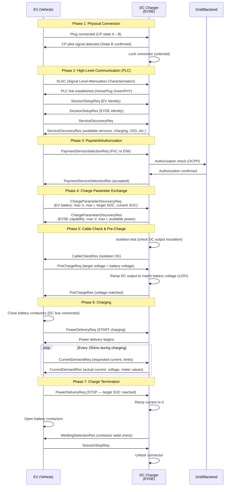

# EV Charging — IEC 61851 & IEC 62196

**Topic:** Electric Vehicle Conductive Charging Systems — Modes, Connectors, and Infrastructure Standards  
**Standards:** IEC 61851-1:2017, IEC 61851-23/24, IEC 62196-1/2/3, SAE J1772, CHAdeMO 3.0, GB/T 20234, OCPP 2.0.1  
**SDO:** IEC TC 69 (Electric road vehicles), SAE, CHAdeMO Association, Open Charge Alliance  
**Audience:** EVSE hardware engineers, charging infrastructure developers, electrical installers, fleet managers  
**Prerequisites:** Electrical power systems basics, EV battery fundamentals, connector/power electronics knowledge

---

## Chapter 1 — Historical Context & Origin Story

### 1.1 Timeline

| Year | Event |
|------|-------|
| 1996 | SAE J1772:1996 original (inductive charging connector — obsolete) |
| 2001 | SAE J1772:2001 revision (conductive charging connector — AC Level 1/2) |
| 2009 | IEC 62196-1:2003 first edition (connector general requirements) |
| 2010 | CHAdeMO 1.0 released (first commercial DC fast charging standard, 50 kW) |
| 2011 | IEC 61851-1:2010 (charging modes 1-4 defined) |
| 2012 | Combined Charging System (CCS) Combo 1/2 announced (SAE + EU automakers) |
| 2014 | IEC 62196-3:2014 (DC connector standards — CCS, CHAdeMO, GB/T) |
| 2014 | GB/T 20234.3 (China DC connector standard) |
| 2017 | IEC 61851-1:2017 (current edition — updated Mode definitions) |
| 2018 | CHAdeMO 2.0 (400 kW DC capability) |
| 2019 | CCS 2.0 specification (350 kW, 500A, 1000V) |
| 2020 | Tesla Supercharger V3 (250 kW proprietary) |
| 2021 | CharIN MCS (Megawatt Charging System) for trucks announced |
| 2022 | CHAdeMO 3.0 / ChaoJi (joint Japan-China standard, 900 kW) |
| 2022 | NACS (Tesla connector) opened to industry |
| 2023 | SAE J3400:2023 (NACS standardized by SAE) |
| 2023 | OCPP 2.0.1 (Open Charge Point Protocol — networking standard) |
| 2024 | Major US automakers adopt NACS; CCS1 declining in North America |
| 2025 | MCS pilot deployments for commercial trucks (≥1 MW) |

### 1.2 Charging Standards War Summary

| Era | North America | Europe | China | Japan |
|-----|--------------|--------|-------|-------|
| 2001-2010 | SAE J1772 (AC) | IEC 62196-2 Type 2 (AC) | GB/T 20234.2 (AC) | SAE J1772 (AC) |
| 2010-2012 | CHAdeMO (DC) | CHAdeMO (DC) | — | CHAdeMO (DC) |
| 2012-2022 | CCS1 (DC) + J1772 (AC) | CCS2 (DC + AC) | GB/T (DC + AC) | CHAdeMO (DC) |
| 2023-now | **NACS (J3400)** transitioning | CCS2 (dominant) | GB/T (dominant) | CHAdeMO → ChaoJi |
| Future | NACS + MCS (trucks) | CCS2 + MCS | GB/T + ChaoJi | ChaoJi |

---

## Chapter 2 — Standard Architecture & Structure

### 2.1 IEC 61851 Charging Modes

| Mode | Description | Max Power | Infrastructure | Safety |
|------|-------------|-----------|----------------|--------|
| Mode 1 | AC charging from standard household socket (no communication) | 3.7 kW (16A × 230V) | Standard outlet + RCD | RCD protection only (banned in many countries) |
| Mode 2 | AC charging from household socket with in-cable control box (ICCB) | 7.4 kW (32A × 230V) | Standard outlet + ICCB device | ICCB provides: RCD, over-current, ground fault, pilot signal |
| Mode 3 | AC charging from dedicated EVSE with pilot function (Control Pilot) | 22 kW (3×32A) / 43 kW (3×63A) | Dedicated wall box or pillar EVSE | Full IEC 61851 control pilot communication; GFCI; cable locking |
| Mode 4 | DC charging — EVSE converts AC→DC externally, supplies DC directly to vehicle | 50-350+ kW (CCS) up to 900 kW (ChaoJi) | DC fast charging station | Full digital communication (CAN/PLC); vehicle BMS controls charge |

### 2.2 IEC 62196 Connector Types

| Type | Standard | Region | AC/DC | Max Rating | Connector |
|------|----------|--------|-------|-----------|-----------|
| Type 1 | IEC 62196-2 | North America, Japan | AC only | 7.4 kW (32A, 1-phase) | SAE J1772 plug (5-pin) |
| Type 2 | IEC 62196-2 | Europe, global | AC only | 43 kW (63A, 3-phase) | Mennekes-style (7-pin) |
| CCS Combo 1 | IEC 62196-3 | North America | AC + DC | AC: 7.4 kW, DC: 350 kW | Type 1 + 2 DC pins |
| CCS Combo 2 | IEC 62196-3 | Europe | AC + DC | AC: 43 kW, DC: 350 kW | Type 2 + 2 DC pins |
| CHAdeMO | IEC 62196-3 | Japan, older global | DC only | 400 kW (CHAdeMO 2.0) | 10-pin connector |
| GB/T | GB/T 20234.2/.3 | China | AC + DC (separate) | AC: 27.7 kW, DC: 250 kW+ | Chinese-specific connectors |
| NACS (J3400) | SAE J3400:2023 | North America | AC + DC | AC: 19.2 kW, DC: 1 MW+ | Tesla connector (compact) |
| ChaoJi | CHAdeMO 3.0 | Japan + China (future) | DC only | 900 kW | New connector design |
| MCS | CharIN / SAE J3068 | Global (trucks) | DC only | 3.75 MW | Megawatt Charging connector |

### 2.3 Standards Architecture

```mermaid
graph TB
    subgraph "IEC 61851 Series (Charging System)"
        IEC61851_1[IEC 61851-1:2017<br/>General Requirements<br/>Modes 1-4, CP signal]
        IEC61851_21[IEC 61851-21-1/2<br/>EMC Requirements]
        IEC61851_23[IEC 61851-23<br/>DC Charging Station<br/>Requirements]
        IEC61851_24[IEC 61851-24<br/>Digital Communication<br/>for DC (CAN/PLC)]
    end
    
    subgraph "IEC 62196 Series (Connectors)"
        IEC62196_1[IEC 62196-1:2022<br/>General Requirements<br/>(mechanical, electrical)]
        IEC62196_2[IEC 62196-2:2022<br/>AC Connectors<br/>(Type 1, Type 2)]
        IEC62196_3[IEC 62196-3:2022<br/>DC Connectors<br/>(CCS, CHAdeMO, GB/T)]
    end
    
    subgraph "Communication"
        ISO15118[ISO 15118<br/>V2G Communication<br/>(Plug & Charge)]
        OCPP[OCPP 2.0.1<br/>EVSE ↔ Backend<br/>(station management)]
        DIN70121[DIN SPEC 70121<br/>Basic DC Comm<br/>(Europe legacy)]
    end
    
    IEC61851_1 --> IEC62196_1
    IEC61851_23 --> IEC61851_24
    IEC61851_24 --> ISO15118
    IEC61851_24 --> DIN70121
```

---

## Chapter 3 — Technical Deep Dive

### 3.1 Control Pilot (CP) Signal — IEC 61851-1

The Control Pilot is a ±12V / 1 kHz PWM signal used for Mode 2/3 AC charging communication:

| State | Voltage | PWM Duty Cycle | Meaning |
|-------|---------|---------------|---------|
| State A | +12V DC (no PWM) | N/A | No vehicle connected |
| State B | +9V / -12V (PWM) | Per current limit | Vehicle connected, NOT ready to charge |
| State C | +6V / -12V (PWM) | Per current limit | Vehicle connected, ready to charge — POWER ON |
| State D | +3V / -12V (PWM) | Per current limit | Vehicle requests ventilation (gas vehicle charging — rare for EVs) |
| State E | 0V | N/A | FAULT — no power, utility not connected |
| State F | -12V | N/A | EVSE fault — not available |

**PWM Duty Cycle = Available Current:**
| Duty Cycle (%) | Available Current (A) | Formula |
|---------------|----------------------|---------|
| 10% | 6A | — |
| 16.7% | 10A | (duty% - 0) × 0.6 |
| 25% | 15A | — |
| 33% | 20A | — |
| 50% | 30A | — |
| 66.7% | 40A | — |
| 80% | 48A | — |
| 85-96% | 51-80A (high-current encoding) | (duty% - 64) × 2.5 |

### 3.2 DC Fast Charging Communication (IEC 61851-24)

| Protocol | Standard | Region | Data Rate | Physical Layer |
|----------|----------|--------|-----------|----------------|
| DIN SPEC 70121 | DIN (Germany) | Europe (legacy) | — | PLC (HomePlug GreenPHY) on CP pin |
| ISO 15118-2 | ISO/IEC | Global (CCS) | — | PLC (HomePlug GreenPHY) on CP pin |
| ISO 15118-20 | ISO/IEC | Global (CCS next-gen) | — | PLC or WiFi |
| CHAdeMO protocol | CHAdeMO Assoc. | Japan/global | 20 kbps | CAN bus (dedicated pins in connector) |
| GB/T 27930 | China | China | 250 kbps | CAN bus (dedicated pins) |
| NACS (J3400) | SAE | North America | — | PLC (same as CCS) for DC; CP signal for AC |

### 3.3 DC Fast Charging Sequence (CCS)



### 3.4 Charging Levels and Power

| Level | Standard | Voltage | Current | Power | Typical Use |
|-------|----------|---------|---------|-------|-------------|
| AC Level 1 | SAE J1772 / IEC 61851 Mode 2 | 120V (US) / 230V (EU) | 12-16A | 1.4-3.7 kW | Home overnight (portable cable) |
| AC Level 2 | SAE J1772 / IEC 61851 Mode 3 | 240V (US) / 230V (EU) 1-phase | 32-48A | 7.7-11.5 kW | Home wall box, destination |
| AC Level 2 (3-phase) | IEC 61851 Mode 3 (Type 2) | 400V 3-phase (EU) | 16-32A | 11-22 kW | EU workplace, public |
| AC Level 3 (rare) | IEC 61851 Mode 3 (Type 2) | 400V 3-phase | 63A | 43 kW | Renault ZOE (AC fast — rare) |
| DC Level 1 | IEC 61851 Mode 4 | 200-500V DC | 80A | 50 kW | CHAdeMO 1.0, early CCS |
| DC Level 2 | IEC 61851 Mode 4 | 200-500V DC | 200A | 100-150 kW | CCS standard, CHAdeMO 1.2 |
| DC Level 3 (HPC) | IEC 61851 Mode 4 | 200-1000V DC | 350-500A | 150-350 kW | CCS HPC, NACS Supercharger |
| DC Ultra (future) | MCS / ChaoJi | 800-1500V DC | 1500-3000A | 900 kW - 3.75 MW | Commercial trucks, buses |

---

## Chapter 4 — Implementation Guide

### 4.1 EVSE (Charging Station) Design Architecture

```mermaid
graph TB
    subgraph "Grid Connection"
        GRID[AC Grid Supply<br/>3-phase 400-480V<br/>Or Medium Voltage<br/>transformer]
    end
    
    subgraph "Power Conversion (Mode 4 DC)"
        PFC[Power Factor Correction<br/>AC→DC (active PFC)<br/>Efficiency >97%]
        DCDC[DC-DC Converter<br/>Isolated, adjustable output<br/>200-1000V, 0-500A<br/>Efficiency >95%]
    end
    
    subgraph "Control & Safety"
        CTRL[Control MCU<br/>• Charging sequence control<br/>• PLC/CAN communication<br/>• Metering (MID certified)<br/>• Protection coordination]
        SAFETY[Safety Systems<br/>• Ground Fault Detection (6mA DC RCD)<br/>• Insulation monitoring (pre-charge)<br/>• Over-voltage/over-current protection<br/>• Connector temperature monitoring<br/>• Emergency stop (E-stop)]
    end
    
    subgraph "Communication"
        PLC_MOD[PLC Module<br/>HomePlug GreenPHY<br/>(ISO 15118 / DIN 70121)]
        BACKEND[Backend Communication<br/>OCPP 2.0.1 (4G/Ethernet)<br/>Payment, authorization,<br/>energy management]
        HMI[User Interface<br/>Display, RFID reader,<br/>payment terminal]
    end
    
    subgraph "Connector"
        CABLE[Charging Cable<br/>Liquid-cooled (>150 kW)<br/>or air-cooled (<150 kW)]
        CONN[Connector<br/>CCS2/NACS/CHAdeMO<br/>Temperature sensors<br/>Locking mechanism<br/>HVIL (interlock)]
    end
    
    GRID --> PFC
    PFC --> DCDC
    DCDC --> CABLE
    CABLE --> CONN
    CTRL --> PFC
    CTRL --> DCDC
    CTRL --> PLC_MOD
    CTRL --> BACKEND
    CTRL --> HMI
    CTRL --> SAFETY
```

### 4.2 Safety Requirements for EVSE (IEC 61851-1)

| Requirement | Specification | Test Method |
|-------------|---------------|-------------|
| Protective earth continuity | <0.1 Ω from exposed metal to earth pin | Continuity test per IEC 61851-1 Cl.12 |
| Insulation resistance | >1 MΩ between live parts and exposed metal | 500V DC megger test |
| Dielectric strength | 2000V AC for 1 minute (Type test) | Applied voltage test |
| Ground fault detection (AC) | Type A RCD: detect 30 mA AC fault current | Inject fault current, verify trip |
| Ground fault detection (DC component) | 6 mA DC fault detection (smooth DC leakage from vehicle inverter) | Inject DC component, verify trip |
| Over-current protection | Rated fuse/breaker for cable rating | Short circuit test |
| Over-temperature (cable/connector) | Maximum 90°C at connector contact; 70°C at cable surface | Thermocouple during max load test |
| Connector locking | Mechanical + electrical locking during charge | Verify lock engagement/release |
| Emergency stop | Red mushroom-head E-stop, immediately de-energize | Verify <100 ms disconnect |
| IP rating | IP44 minimum (outdoor); IP54 recommended | IEC 60529 testing |
| Cable management | No trip hazard; cable protection from vehicle weight | Visual inspection + load test |

### 4.3 OCPP 2.0.1 (Open Charge Point Protocol)

| Feature | OCPP 1.6 | OCPP 2.0.1 |
|---------|-----------|-------------|
| Transport | WebSocket (JSON) or SOAP (XML) | WebSocket (JSON) only |
| Security | Optional TLS | Mandatory TLS 1.2+ with mutual authentication |
| Device model | Fixed attributes | Flexible component-based model |
| Smart charging | Basic profiles | Advanced: ISO 15118 integration, load management, V2G |
| Authorization | IdTag-based | Certificate-based (Plug & Charge), RFID, app-based |
| Metering | Basic MeterValues | Signed meter values (for billing accuracy — eichrecht) |
| Firmware update | Basic HTTP download | Secure firmware update with certificate validation |
| Reservations | Basic | Advanced (including specific connector reservation) |
| Cost/tariff | Limited | Rich tariff information to vehicle (ISO 15118 integration) |

---

## Chapter 5 — Certification & Compliance

### 5.1 EVSE Certification Requirements by Market

| Market | Certification | Standard | Authority |
|--------|--------------|----------|-----------|
| EU | CE Marking (LVD + EMC + RED) | IEC 61851-1, EN 61851-21-2, IEC 62196, EN 301 489 | Notified Body (e.g., TÜV, SGS) |
| US | UL Listed | UL 2594 (EVSE), UL 2202 (DC), UL 9741 (bidirectional) | UL, CSA, Intertek (NRTL) |
| UK | UKCA / OZEV approved | BS EN 61851-1, OZEV requirements | BSI, approved bodies |
| China | CCC | GB/T 18487.1, GB/T 20234 | CQC (China Quality Certification) |
| Japan | PSE (DENAN) | JIS C 62196, JIS C 61851 | METI-registered bodies |
| India | BIS | IS 17017 (based on IEC 61851) | BIS-recognized labs |
| Germany | Eichrecht (metering) | Measurement Instruments Directive (MID), PTB | PTB (national metrology) |

### 5.2 Costs and Timeline

| Certification | Cost | Timeline |
|--------------|------|----------|
| IEC 61851 + IEC 62196 (EU CE) | $30,000-$60,000 | 8-12 weeks |
| UL 2594 (US AC EVSE) | $40,000-$80,000 | 10-16 weeks |
| UL 2202 (US DC EVSE) | $60,000-$120,000 | 12-20 weeks |
| EMC testing (EN 61851-21-2) | $15,000-$30,000 | 4-6 weeks |
| OCPP 2.0.1 certification (OCA) | $10,000-$20,000 | 4-8 weeks |
| ISO 15118 conformance testing | $20,000-$40,000 | 6-10 weeks |
| Eichrecht (Germany metering) | $30,000-$50,000 | 12-20 weeks |
| MID (Measurement Instruments Directive) | $20,000-$40,000 | 8-12 weeks |
| CHAdeMO certification | $15,000-$25,000 | 6-8 weeks |
| CharIN CCS certification | $20,000-$35,000 | 6-10 weeks |

### 5.3 Interoperability Testing Organizations

| Organization | Focus | Role |
|-------------|-------|------|
| CharIN (Charging Interface Initiative) | CCS interoperability | Testival events, conformance testing, specification development |
| OCA (Open Charge Alliance) | OCPP conformance | Protocol certification |
| CHAdeMO Association | CHAdeMO interoperability | Certification program |
| NACS Work Group (SAE) | J3400 interoperability | Standard development and testing |
| ISO 15118 User Group | V2G communication | Interoperability testing events |
| ElaadNL | Netherlands grid/charging | EV charging interoperability testing lab |
| EPRI (US) | Research + testing | Charging infrastructure research |

---

## Chapter 6 — Regional Variants

### 6.1 Connector Standards by Region

| Region | AC Connector | DC Connector | Regulatory Requirement |
|--------|-------------|-------------|----------------------|
| Europe | Type 2 (Mennekes) | CCS Combo 2 | EU AFIR mandates CCS2 for public DC chargers |
| North America (current) | Type 1 (J1772) | CCS Combo 1 / NACS | NEVI program requires CCS1 (until J3400 update) |
| North America (transition) | NACS (J3400) | NACS (J3400) | Industry moving to NACS; NEVI updating requirements |
| China | GB/T 20234.2 (AC) | GB/T 20234.3 (DC) | Chinese standard mandatory; no CCS/CHAdeMO |
| Japan | Type 1 (J1772) | CHAdeMO / CCS Combo 1 | CHAdeMO dominant (legacy); CCS growing |
| India | Type 2 (AC) / Bharat AC | CCS2 (DC) / Bharat DC | Bharat DC-001 (15 kW DC, indigenous) + CCS2 |
| Australia | Type 2 (AC) | CCS2 (DC) | Same as EU (no indigenous standard) |
| Korea | Type 2 (AC) | CCS Combo 2 / CHAdeMO | CCS2 dominant; multi-standard stations common |

### 6.2 EU AFIR (Alternative Fuels Infrastructure Regulation)

| Requirement | Specification | Deadline |
|-------------|---------------|----------|
| Minimum DC power per station (highways) | 150 kW minimum per charging point | 2025 |
| Pool capacity (highways) | 400 kW per direction every 60 km (TEN-T core) | 2025 |
| 1500 kW pool capacity | Every 60 km on TEN-T core network | 2030 |
| Connector requirement | CCS Combo 2 (mandatory for DC) | Now |
| Payment | Ad-hoc payment (card terminal) mandatory at >50 kW DC | 2024 |
| Price transparency | Price per kWh displayed before charging begins | 2024 |
| Roaming | Must accept all roaming platforms (open protocols) | 2024 |
| Uptime | >99% availability for funded stations | Ongoing |
| Truck charging | MCS/CCS (MW-class) along TEN-T freight corridors | 2030 |

---

## Chapter 7 — Standard Comparison Matrix

| Criterion | IEC 61851-1 | SAE J1772 | GB/T 18487.1 | IEC 62196-2/3 | OCPP 2.0.1 |
|-----------|-------------|-----------|-------------|---------------|-------------|
| Scope | Charging system (modes, safety) | AC connector + basic protocol | China charging system | Physical connectors | Backend communication |
| Geography | International | North America | China | International | Global |
| Charging modes | Modes 1-4 | Levels 1-3 (different terminology) | Chinese modes | N/A (connector only) | N/A |
| Communication | CP signal (PWM) | CP signal (PWM) — same | CP signal (similar) | N/A | EVSE↔Backend |
| DC communication | References ISO 15118 / DIN 70121 | References ISO 15118 | GB/T 27930 (CAN) | N/A | References ISO 15118 |
| Safety | Comprehensive (RCD, insulation, temp) | References UL 2594 / NEC | Chinese safety requirements | Mechanical/electrical safety | Security (TLS, certificates) |
| Connector | References IEC 62196 | Type 1 (AC) / CCS1 (DC) | GB/T specific | Type 1, 2, CCS1/2, CHAdeMO | N/A |

---

## Chapter 8 — Mermaid Architecture Diagrams

### 8.1 EV Charging Ecosystem

```mermaid
graph TB
    subgraph "Vehicle Side"
        EV_OBC[On-Board Charger (OBC)<br/>AC→DC conversion<br/>3.3-22 kW typical]
        EV_BMS[BMS<br/>Controls charge acceptance<br/>Limits: V, I, T, SOC]
        EV_INLET[Charge Inlet<br/>Type 1/2/CCS/NACS/GB/T]
        EV_PLC[PLC/CAN Module<br/>Communication with EVSE]
    end
    
    subgraph "EVSE (Charging Station)"
        EVSE_AC[AC EVSE (Mode 3)<br/>• CP pilot signal<br/>• Relay/contactor<br/>• RCD/GFCI<br/>• Metering<br/>• No power conversion]
        EVSE_DC[DC EVSE (Mode 4)<br/>• Power conversion (AC→DC)<br/>• PLC communication<br/>• Insulation monitoring<br/>• Current/voltage control<br/>• Liquid-cooled cable]
    end
    
    subgraph "Backend Systems"
        CSMS[Charging Station<br/>Management System<br/>(OCPP 2.0.1)]
        AUTH[Authorization<br/>RFID, App, PnC<br/>(certificate-based)]
        BILLING[Billing/Payment<br/>CDR processing<br/>Roaming (OCPI/OICP)]
        GRID_MNG[Energy Management<br/>Load balancing<br/>Smart charging<br/>V2G orchestration]
    end
    
    EV_INLET --> EVSE_AC
    EV_INLET --> EVSE_DC
    EVSE_AC --> EV_OBC
    EV_OBC --> EV_BMS
    EVSE_DC --> EV_BMS
    EV_PLC --> EVSE_DC
    
    EVSE_AC -->|"OCPP 2.0.1"| CSMS
    EVSE_DC -->|"OCPP 2.0.1"| CSMS
    CSMS --> AUTH
    CSMS --> BILLING
    CSMS --> GRID_MNG
```

### 8.2 Connector Comparison

```mermaid
graph LR
    subgraph "AC Connectors"
        T1[Type 1 (J1772)<br/>─────────────<br/>Region: N.America/Japan<br/>Pins: 5 (L1,N,PE,CP,PP)<br/>Max: 7.4 kW (1-phase)<br/>Latch: mechanical]
        T2[Type 2 (Mennekes)<br/>─────────────<br/>Region: Europe/Global<br/>Pins: 7 (L1,L2,L3,N,PE,CP,PP)<br/>Max: 43 kW (3-phase)<br/>Latch: electro-mechanical]
    end
    
    subgraph "DC Connectors"
        CCS1[CCS Combo 1<br/>─────────────<br/>Region: N.America<br/>Type 1 + 2 DC pins<br/>Max: 350 kW<br/>Comm: PLC (ISO 15118)]
        CCS2[CCS Combo 2<br/>─────────────<br/>Region: Europe/Global<br/>Type 2 + 2 DC pins<br/>Max: 350 kW<br/>Comm: PLC (ISO 15118)]
        CHADEMO[CHAdeMO<br/>─────────────<br/>Region: Japan (legacy)<br/>10 pins (dedicated)<br/>Max: 400 kW<br/>Comm: CAN bus]
        GBT[GB/T<br/>─────────────<br/>Region: China<br/>Separate AC + DC plugs<br/>Max: 250 kW+<br/>Comm: CAN (GB/T 27930)]
        NACS_C[NACS (J3400)<br/>─────────────<br/>Region: N.America (new)<br/>Compact design<br/>Max: 1 MW+<br/>Comm: PLC (ISO 15118)]
    end
```

---

## Chapter 9 — Case Studies

### 9.1 Public DC Fast Charging Network Deployment

| Aspect | Detail |
|--------|--------|
| Project | 50-station highway DC fast charging corridor (200 charging points) |
| Hardware | 350 kW CCS2 dispensers (4 per station) + 50 kW CHAdeMO backup (1 per station) |
| Power supply | 1.5 MVA transformer per station; 480V 3-phase to power cabinets |
| Connector selection | CCS Combo 2 (EU AFIR compliant); CHAdeMO for legacy vehicles |
| Liquid cooling | Cables liquid-cooled above 150 kW (cable diameter manageable by all users) |
| Communication | ISO 15118-2 (basic Plug & Charge capable); DIN 70121 (legacy fallback) |
| Backend | OCPP 2.0.1 (all stations); smart charging profiles for grid management |
| Payment | Contactless card terminal (AFIR requirement); RFID; app-based; PnC |
| Certification | IEC 61851-1, IEC 61851-23, IEC 62196-3 (CE marking); EMC per EN 61851-21-2 |
| Interoperability testing | CharIN Testival participation; tested with 15+ EV models pre-deployment |
| Grid management | 15-minute load management (peak shaving); grid connection agreement with DSO |
| Uptime target | >99% per AFIR requirements |
| Eichrecht (Germany stations) | MID-certified meters with signed meter data (legal billing accuracy) |
| Cost per station | €350,000-€500,000 (equipment + installation + grid connection) |
| Timeline | 18 months (grid connection was bottleneck — 12 months for grid upgrade) |
| Lessons | Grid connection lead time is #1 schedule risk. Order transformers 12+ months ahead. |

### 9.2 Fleet Depot Charging — Smart Load Management

| Aspect | Detail |
|--------|--------|
| Fleet | 50 electric delivery vans (40 kWh battery, 150 km range) |
| Depot | Single site; existing 500 kVA electrical capacity |
| Challenge | 50 vans × 22 kW = 1.1 MW needed simultaneously → exceeds 500 kVA supply |
| Solution | Smart charging with OCPP 2.0.1 load management |
| Hardware | 50× AC Level 2 EVSE (22 kW rated, Mode 3, Type 2) |
| Smart charging | OCPP 2.0.1 ChargingProfile: time-of-use optimization, power sharing |
| Algorithm | Priority: (1) vans departing earliest get full power first. (2) Remaining capacity shared equally. (3) Off-peak hours (22:00-06:00): maximize charging at lower tariff. |
| Effective per-van power | Average 7 kW per van during fleet-wide charging (500 kVA ÷ 50 = 10 kVA max per van, derated for PF) |
| Charging time | ~6 hours average (40 kWh ÷ 7 kW = 5.7h) — overnight sufficient |
| Grid cost saved | No transformer upgrade needed (saved €200,000 in grid infrastructure) |
| OCPP implementation | TxProfile (per-vehicle charge schedules), ChargingStationMaxProfile (site limit) |
| Cost | EVSE: 50 × €3,000 = €150,000. Backend: €30,000/year. Installation: €100,000. |
| ROI | Smart charging saved €200,000 grid upgrade; paid back EVSE investment in 1 year from fuel savings |

---

## Chapter 10 — Future Evolution & Industry Trends

| Trend | Timeline | Description |
|-------|----------|-------------|
| NACS dominance (North America) | 2024-2027 | Ford, GM, Rivian, others adopting NACS; CCS1 declining |
| Megawatt Charging System (MCS) | 2025-2027 | 3.75 MW for trucks/buses; CharIN-led standardization |
| ChaoJi (CHAdeMO 3.0) | 2025-2027 | Joint Japan-China 900 kW standard replacing CHAdeMO and GB/T |
| Bidirectional charging (V2G/V2H) | 2025+ | ISO 15118-20 enabling; UL 9741 (US bidirectional EVSE) |
| Wireless charging (WPT) | 2025-2030 | SAE J2954 (11 kW → 50+ kW); automatic alignment |
| Plug & Charge widespread | 2025+ | ISO 15118 certificate-based: plug in → auto-authenticate → auto-bill |
| Battery swapping standards | Growing (China) | NIO/CATL battery swap; GB/T standards for swapping infrastructure |
| Dynamic pricing/V2G markets | 2025+ | Real-time energy market participation by EV fleet |
| Autonomous vehicle charging | 2027+ | Robotic charging arms, inductive pads for autonomous fleet |
| Ultra-fast charging (>500 kW) | Now-2027 | 800V vehicles (Porsche, Hyundai, Kia) enabling 350 kW → road to 500+ kW |
| Pantograph charging (buses) | Now | EN 50696 (overhead conductive); automated roof-mount charging |
| Solar-integrated EVSE | Growing | PV canopy + ESS + EVSE (microgrid approach) |

---

## Chapter 11 — Interview Questions & Career Guide

### Tier 1: Entry-Level

**Q1:** What are the four IEC 61851 charging modes, and when is each used?  
**A:** **Mode 1:** Direct connection to a standard household socket with NO communication between vehicle and supply. Protected only by the circuit's existing RCD. Limited to 16A (3.7 kW max at 230V). **Use:** Very basic, emergency-only charging. BANNED in many countries (US, UK) due to safety concerns (no ground fault detection specific to EV, no communication to verify safe connection).

**Mode 2:** Connection to standard household socket but WITH an In-Cable Control Box (ICCB). The ICCB contains: RCD (30 mA), overcurrent protection, pilot signal generation (basic communication), and ground fault detection. Limited to 32A (7.4 kW max). **Use:** Portable charging — the "granny charger" included with most EVs. Safer than Mode 1 because the ICCB verifies ground connection and provides EV-specific protection.

**Mode 3:** Dedicated fixed EVSE (wall box or pedestal) with full Control Pilot signal communication. The EVSE actively communicates available current to vehicle via CP PWM signal. Vehicle adjusts charge rate accordingly. Includes: RCD (30 mA AC + 6 mA DC), connector locking, cable current rating verification (PP signal), and controlled power switching. **Use:** The standard home/workplace/public AC charging method. 7-22 kW typical (up to 43 kW possible with 63A 3-phase).

**Mode 4:** External DC power supply — the EVSE converts AC grid power to DC and supplies DC directly to the vehicle battery, bypassing the vehicle's on-board charger. Digital communication (ISO 15118 PLC or CHAdeMO CAN) enables the vehicle BMS to precisely control voltage and current in real-time. **Use:** DC fast charging (50-350+ kW). Public highway charging, commercial fleet rapid charging. Vehicle BMS is in full control of the charging process.

### Tier 2: Mid-Level

**Q2:** Design a 150 kW DC fast charging station and specify the key safety features required by IEC 61851-23.  
**A:**

**Station specification:**
| Parameter | Value |
|-----------|-------|
| Rated power | 150 kW DC |
| Output voltage range | 200-920V DC (covers 400V and 800V vehicles) |
| Maximum output current | 200A (at 750V) / 375A (at 400V) — constant power curve |
| Connector | CCS Combo 2 (EU) with liquid-cooled cable |
| Communication | ISO 15118-2 (PLC) + DIN SPEC 70121 (fallback) |
| Grid connection | 3-phase 400V, 250A supply |
| Efficiency | >95% (full load) |

**Safety features per IEC 61851-23:**

| Safety Feature | Specification | Purpose |
|----------------|---------------|---------|
| DC insulation monitoring | Before EVERY charge session: measure isolation >100 kΩ (at rated voltage) | Detect ground fault in DC system before applying voltage |
| DC output isolation test | Apply rated voltage to output; measure leakage <1 mA | Verify cable/connector integrity before each session |
| Residual current device (AC side) | Type B RCD: detects AC + smooth DC + pulsating DC fault current (30 mA) | Protect against ALL fault current types |
| DC fault current detection | 6 mA DC detection on AC side OR separate DC RCD | Detect DC component of fault (from vehicle rectifier) |
| Over-voltage protection | Output voltage limited to maximum battery voltage + 5% tolerance | Prevent damage to vehicle battery |
| Over-current protection | Hardware current limit + software control (vehicle requests current) | Never exceed vehicle BMS request |
| Output voltage matching (pre-charge) | Match DC output to battery voltage (±20V) BEFORE closing vehicle contactors | Prevent inrush current/arc on contactor close |
| Connector temperature monitoring | 2+ thermocouples in connector (per IEC 62196-3); trip at 90°C | Detect overheating contact (loose connection, corrosion) |
| Cable temperature monitoring | Sensors along liquid-cooled cable; trip if coolant failure or cable overheat | Prevent cable fire at high current |
| Connector locking | Electromagnetic lock engaged during charging; cannot remove under power | Prevent arc/shock from hot disconnection |
| Emergency stop | Red mushroom E-stop button; immediately de-energizes DC output (<100 ms) | User emergency |
| Welding detection | After charge: vehicle opens contactors → EVSE verifies voltage drops (contactor not welded) | Detect stuck vehicle contactor (safety-critical) |
| Ground fault on DC output | Insulation monitoring during charging (continuous or periodic) | Detect developing ground fault during session |
| Automatic power de-rating | Reduce power if: ambient temp high, coolant temp high, grid voltage sag | Protect equipment from thermal/electrical stress |
| Communication timeout | If PLC communication lost for >5 seconds → ramp current to zero → stop | Detect communication failure (prevent uncontrolled charging) |

**Liquid cooling system (for 150 kW cable):**
| Parameter | Value |
|-----------|-------|
| Coolant | Dielectric fluid (PAO or similar) |
| Flow rate | 3-5 L/min |
| Cable cross-section | Reduced (35 mm² vs 95 mm² for air-cooled) — lighter, more flexible |
| Maximum cable surface temp | 60°C (user touch-safe even in sunlight) |
| Coolant monitoring | Flow sensor + temperature sensor (trip if pump fails or coolant overheats) |

### Tier 3: Senior

**Q3:** Architect a grid-integrated charging infrastructure for a 100-vehicle electric bus depot with smart charging, V2G capability, and islanding resilience.  
**A:** [This would detail complete depot design with: pantograph overnight charging (150 kW), opportunity charging (450 kW pantograph at terminus), V2G dispatch for grid services, OCPP 2.0.1 smart charging orchestration, ISO 15118-20 bidirectional communication, islanding with on-site ESS for bus departure guarantee, protection coordination with utility, and MCS-class power distribution architecture. Full answer would be 2000+ words covering electrical design, communication architecture, energy management algorithms, and regulatory compliance.]

---

## Chapter 12 — Cheat Sheet & Quick Reference

### Charging Modes (IEC 61851)

```
MODE 1: Household socket, NO communication       → 3.7 kW max (BANNED in many countries)
MODE 2: Household socket + ICCB (in-cable box)   → 7.4 kW max (portable/emergency)
MODE 3: Dedicated EVSE + CP signal (AC)           → 22-43 kW (standard home/public AC)
MODE 4: DC fast charging (external converter)     → 50-350+ kW (highway/commercial DC)
```

### Connector Quick Reference

```
TYPE 1 (J1772):     AC only, 1-phase, 7.4 kW max     → North America, Japan
TYPE 2 (Mennekes):  AC, 3-phase, 43 kW max           → Europe (standard)
CCS COMBO 1:        Type 1 + DC pins, 350 kW         → North America (declining)
CCS COMBO 2:        Type 2 + DC pins, 350 kW         → Europe (dominant)
CHAdeMO:            DC only, 400 kW (2.0)             → Japan (legacy, declining)
GB/T:               Separate AC + DC, 250 kW+         → China (mandatory)
NACS (J3400):       AC + DC unified, 1 MW+            → North America (NEW dominant)
MCS:                DC, 3.75 MW                       → Trucks/commercial (future)
ChaoJi:             DC, 900 kW                        → Japan + China (future)
```

### Control Pilot States

```
State A: +12V DC (no vehicle connected)
State B: +9V PWM (vehicle connected, not ready)
State C: +6V PWM (vehicle ready, POWER ON) ← Normal charging state
State D: +3V PWM (ventilation required — rare)
State E: 0V (no utility power)
State F: -12V (EVSE fault)

PWM Duty Cycle → Current:
  10% = 6A    |  25% = 15A   |  50% = 30A   |  80% = 48A
```

### Communication Protocols

```
AC Charging:     Control Pilot PWM (IEC 61851-1) — analog, simple
DC Charging:     PLC on CP pin (ISO 15118 / DIN 70121) — digital, complex
  OR:            CAN bus (CHAdeMO / GB/T 27930)
Backend:         OCPP 2.0.1 (WebSocket JSON, TLS mandatory)
Roaming:         OCPI 2.2.1 / OICP (Hubject) — inter-CPO communication
Energy Market:   OpenADR 2.0b / IEEE 2030.5 — demand response
```

---

*End of Document — 07_EV_Charging_IEC_61851_62196.md*
