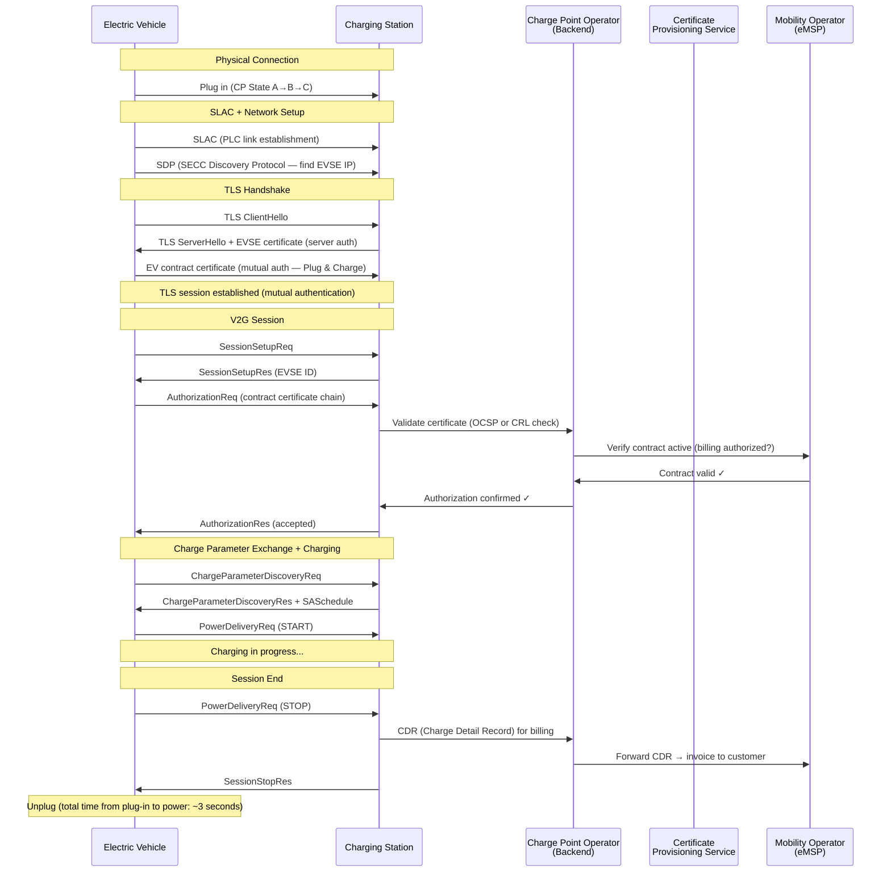

# ISO 15118 — Vehicle-to-Grid (V2G) Communication

**Topic:** ISO 15118 Series — Communication Protocol Between Electric Vehicles and Charging Infrastructure (Plug & Charge, Bidirectional Power Transfer, Smart Charging)  
**Standards:** ISO 15118-1:2019, ISO 15118-2:2014, ISO 15118-3:2015, ISO 15118-20:2022, ISO 15118-8 (wireless)  
**SDO:** ISO TC 22/SC 31 (Data communication) & IEC TC 69 (joint development)  
**Audience:** EV communication stack developers, EVSE firmware engineers, PKI architects, V2G system integrators  
**Prerequisites:** IEC 61851 charging modes, TCP/IP networking, TLS/PKI fundamentals, power systems basics

---

## Chapter 1 — Historical Context & Origin Story

### 1.1 Timeline

| Year | Event |
|------|-------|
| 2010 | ISO 15118-1:2013 development begins (use cases and general requirements) |
| 2012 | DIN SPEC 70121 published (German pre-standard for DC communication — became interim solution) |
| 2014 | ISO 15118-2:2014 published (network and application protocol for AC/DC — 1st generation) |
| 2015 | ISO 15118-3:2015 published (physical layer — HomePlug GreenPHY PLC) |
| 2016 | First Plug & Charge implementations in testing (Hubject, Ionity) |
| 2018 | VW ID.3 announced as first mass-market vehicle with ISO 15118-2 Plug & Charge |
| 2019 | ISO 15118-1:2019 revision (updated use cases including bidirectional) |
| 2020 | Ionity network enables ISO 15118-2 Plug & Charge across Europe |
| 2021 | Tesla V2G research; multiple OEMs commit to ISO 15118-20 bidirectional |
| 2022 | **ISO 15118-20:2022 published** (2nd generation — bidirectional, wireless, DC BPT, ACDP) |
| 2023 | ISO 15118-20 first interoperability testing events (CharIN Testivals) |
| 2023 | SAE J3400 (NACS) adopts ISO 15118 as communication protocol |
| 2024 | Multiple OEMs (Ford, GM, BMW) announce ISO 15118-20 V2G implementations |
| 2025 | EU AFIR mandates ISO 15118 capability for public DC charging (Plug & Charge readiness) |
| 2026+ | Widespread V2G market participation (grid services via ISO 15118-20) |

### 1.2 Problem Statement

| Challenge | Pre-ISO 15118 Situation | ISO 15118 Solution |
|-----------|------------------------|-------------------|
| Authentication | Stop, present RFID card or app, wait for authorization | **Plug & Charge**: plug in → auto-authenticate via TLS certificate |
| Payment complexity | Multiple apps, RFID cards, roaming confusion | Automatic contract-based billing (certificate = payment credential) |
| Charge optimization | Fixed-rate charging, no grid awareness | Smart charging: vehicle communicates departure time + energy need → schedule optimized |
| Grid overload | Uncontrolled demand peaks when EVs plug in | Demand response: energy prices/grid signals → deferred charging |
| V2G (grid services) | Not possible (unidirectional only) | **Bidirectional power transfer** (BPT) in ISO 15118-20 |
| DC charging control | Proprietary protocols (CHAdeMO CAN, Tesla) | Standardized: ISO 15118-2/-20 over PLC for ALL CCS/NACS vehicles |

---

## Chapter 2 — Standard Architecture & Structure

### 2.1 ISO 15118 Series Parts

| Part | Title | Status | Content |
|------|-------|--------|---------|
| ISO 15118-1:2019 | General information and use-case definition | Published | High-level architecture, use cases, actors, roles |
| ISO 15118-2:2014 | Network and application protocol requirements | Published (1st gen) | XML-based message protocol, TLS, Plug & Charge, smart charging |
| ISO 15118-3:2015 | Physical and data link layer requirements | Published | HomePlug GreenPHY PLC, SLAC procedure |
| ISO 15118-4:2018 | Network and application protocol conformance test | Published | Test specifications for ISO 15118-2 |
| ISO 15118-5:2018 | Physical and data link layer conformance test | Published | Test specifications for ISO 15118-3 |
| ISO 15118-6 | General information and use-case definition for wireless communication | Under development | Wireless power transfer communication |
| ISO 15118-7 | Network and application protocol requirements for wireless | Under development | WPT-specific protocol |
| ISO 15118-8:2020 | Physical layer and data link layer requirements for wireless | Published | WiFi-based communication for wireless charging |
| **ISO 15118-20:2022** | **2nd generation network and application protocol** | **Published** | **Bidirectional, multiplexed, new message format (EXI-optimized), ACDP, DC BPT, WPT** |

### 2.2 Protocol Stack

```mermaid
graph TB
    subgraph "Application Layer"
        V2G_MSG[V2G Application Messages<br/>• Session management<br/>• Service discovery<br/>• Authorization (PnC/EIM)<br/>• Charge scheduling<br/>• Metering & billing]
    end
    
    subgraph "Presentation Layer"
        EXI[EXI Encoding<br/>(Efficient XML Interchange)<br/>Compact binary XML representation]
    end
    
    subgraph "Session/Transport Layer"
        TLS[TLS 1.2/1.3<br/>• Server authentication (always)<br/>• Mutual authentication (PnC)<br/>• Certificate-based]
        TCP[TCP<br/>Port 15118 (V2G)<br/>Reliable transport]
    end
    
    subgraph "Network Layer"
        IPV6[IPv6<br/>Link-local addressing<br/>SLAAC (stateless autoconfiguration)]
    end
    
    subgraph "Data Link Layer"
        HPGP[HomePlug GreenPHY<br/>IEEE 1901 profile<br/>OFDM modulation<br/>10 Mbps PHY / ~4 Mbps throughput]
    end
    
    subgraph "Physical Layer"
        CP_PIN[Control Pilot (CP) Pin<br/>Existing IEC 61851 CP wire<br/>used as PLC conductor<br/>(signal coupling at ±12V level)]
    end
    
    V2G_MSG --> EXI
    EXI --> TLS
    TLS --> TCP
    TCP --> IPV6
    IPV6 --> HPGP
    HPGP --> CP_PIN
```

### 2.3 ISO 15118-2 vs ISO 15118-20 Comparison

| Feature | ISO 15118-2 (2014) | ISO 15118-20 (2022) |
|---------|-------------------|---------------------|
| Power direction | Unidirectional (grid→EV) only | **Bidirectional** (AC BPT, DC BPT) |
| Energy transfer modes | AC (single/3-phase), DC | AC, DC, **ACDP** (AC with DC pins), **WPT** (wireless) |
| Message encoding | EXI (XML-based schema) | EXI (optimized, new schema) |
| Smart charging | SASchedule (EVSE proposes schedules) | **Dynamic mode** (real-time power control) + Scheduled |
| Certificate handling | Contract certificate installation (CertificateInstallation) | Enhanced certificate management |
| Multiplexing | Not supported | **Multiplexed** sessions (multiple EVs per physical port — future use) |
| Metering | Basic meter values | **Signed metering data** (legally relevant, Eichrecht-ready) |
| Internet access | ISO 15118-2 Annex F (value-added services) | Explicit internet service (VAS over TLS) |
| Backward compatibility | N/A (is the baseline) | Fallback to ISO 15118-2 or DIN 70121 |
| ACDP (AC with DC Physical) | Not supported | Supported (AC power on DC pins — allows higher power with simple connector) |

---

## Chapter 3 — Technical Deep Dive

### 3.1 Plug & Charge — PKI Architecture

```mermaid
graph TB
    subgraph "Root Certificate Authorities"
        V2G_ROOT[V2G Root CA<br/>(Trust anchor)<br/>Operated by ecosystem<br/>e.g., Hubject V2G Root]
        OEM_ROOT[OEM Root CA<br/>(Vehicle manufacturer)<br/>Provisions vehicle certificates]
    end
    
    subgraph "Sub-CAs"
        MO_CA[Mobility Operator Sub-CA<br/>(eMSP / CPO)<br/>Issues contract certificates]
        CPS_CA[CPS Sub-CA<br/>(Certificate Provisioning Service)<br/>Bridges OEM ↔ MO]
        EVSE_CA[EVSE Sub-CA<br/>(Charge Point Operator)<br/>Issues EVSE leaf certificates]
    end
    
    subgraph "Leaf Certificates"
        EV_CERT[EV Contract Certificate<br/>• Stored in EV<br/>• Contains: EMAID, contract details<br/>• Signed by MO Sub-CA<br/>• Private key in HSM/TPM in vehicle]
        EVSE_CERT[EVSE TLS Certificate<br/>• Stored in EVSE<br/>• Identifies charging station<br/>• Signed by EVSE Sub-CA]
        OEM_PROV[OEM Provisioning Certificate<br/>• Factory-installed in vehicle<br/>• Used for initial contract installation<br/>• Signed by OEM Root CA]
    end
    
    V2G_ROOT --> MO_CA
    V2G_ROOT --> CPS_CA
    V2G_ROOT --> EVSE_CA
    OEM_ROOT --> OEM_PROV
    MO_CA --> EV_CERT
    EVSE_CA --> EVSE_CERT
    CPS_CA --> EV_CERT
```

### 3.2 Plug & Charge Session Flow



### 3.3 Certificate Types and Roles

| Certificate | Installed By | Stored In | Purpose | Lifetime |
|-------------|-------------|-----------|---------|----------|
| V2G Root CA certificate | Ecosystem operator | EV trust store + EVSE trust store | Trust anchor for entire Plug & Charge ecosystem | 30-40 years |
| OEM Provisioning Certificate | OEM at factory | EV (secure element/HSM) | Initial identity for contract certificate installation | Vehicle lifetime |
| Contract Certificate | MO (via CPS → OEM → EV OTA) | EV (secure element) | Customer identity + payment credential | 1-3 years (renewable) |
| EVSE TLS Certificate | CPO deployment | EVSE (secure module) | EVSE identity for TLS server authentication | 1-2 years (renewable) |
| CPS Sub-CA Certificate | V2G Root CA | CPS backend | Sign contract certificates on behalf of MOs | 5-10 years |

### 3.4 ISO 15118-20 Bidirectional Power Transfer (BPT)

| Parameter | DC BPT (ISO 15118-20) | AC BPT (ISO 15118-20) |
|-----------|----------------------|----------------------|
| Power direction | EV→Grid (discharge) AND Grid→EV (charge) | EV→Grid AND Grid→EV |
| Communication | EV tells EVSE: "I can export up to X kW" / "I need minimum Y kWh by departure" | Same concept, AC power |
| Control modes | **Scheduled**: EV/EVSE agree on schedule (charge/discharge windows). **Dynamic**: EVSE sends real-time power setpoints every 50ms-1s | Same |
| Energy management | EV communicates: departure_time, target_SOC, min_SOC (never go below), max_export_power | Same |
| Grid services enabled | Frequency regulation, peak shaving, arbitrage, renewable integration | Same |
| Metering | Signed meter values (import AND export separately metered) | Signed bidirectional metering |
| Settlement | Separate CDRs for energy imported vs exported | Same |
| Safety | EV BMS always has ultimate control; can refuse discharge below min_SOC | Same; on-board inverter manages power quality |

### 3.5 Dynamic Mode (ISO 15118-20)

| Aspect | Scheduled Mode | Dynamic Mode |
|--------|---------------|-------------|
| Control entity | EV decides power within EVSE-provided schedule | **EVSE controls power in real-time** |
| Update frequency | Schedule agreed upfront; rarely updated | Every 50 ms to 1 second (power setpoint updates) |
| Use case | Home/workplace overnight charging | Grid services (frequency response), demand response, V2G |
| EV role | Follows schedule autonomously | Follows EVSE commands (but can override for battery protection) |
| EVSE role | Provides schedule (time/power/price) | Sends real-time power targets (within EV's declared limits) |
| Latency requirement | Low (schedule set once) | **<100 ms response** (for grid frequency services) |
| Grid integration | Limited (schedule doesn't adapt fast enough) | Full (EVSE can participate in 1-second grid balancing markets) |

---

## Chapter 4 — Implementation Guide

### 4.1 EV-Side Implementation Architecture

```mermaid
graph TB
    subgraph "EV Communication Controller (EVCC)"
        APP[V2G Application Layer<br/>• Session state machine<br/>• Service discovery<br/>• Authorization handling<br/>• Charge scheduling<br/>• Metering processing]
        EXI_ENC[EXI Encoder/Decoder<br/>• Schema-based encoding<br/>• Efficient binary XML<br/>• ~10x compression vs XML text]
        TLS_CLIENT[TLS 1.2 Client<br/>• Certificate management<br/>• Mutual authentication (PnC)<br/>• Session resumption<br/>• OCSP stapling support]
        TCP_IP[TCP/IPv6 Stack<br/>• Link-local addressing<br/>• SLAAC<br/>• SDP (V2G discovery)]
        PLC[HomePlug GreenPHY Module<br/>• Qualcomm QCA7000/QCA7005<br/>• SLAC (pairing)<br/>• 10 Mbps physical layer]
    end
    
    subgraph "EV Secure Element"
        HSM[Hardware Security Module<br/>• OEM provisioning key<br/>• Contract certificate(s)<br/>• Private key storage<br/>• Signing operations<br/>• Never leaves HSM]
    end
    
    subgraph "EV Integration"
        BMS_IF[BMS Interface<br/>• SOC, SOH, limits<br/>• Max charge/discharge power<br/>• Battery temperature<br/>• Target SOC input]
        VCU_IF[Vehicle Controller<br/>• Departure time input<br/>• User preferences<br/>• Contactor control<br/>• V2G consent (user)]
    end
    
    APP --> EXI_ENC
    EXI_ENC --> TLS_CLIENT
    TLS_CLIENT --> TCP_IP
    TCP_IP --> PLC
    APP --> HSM
    APP --> BMS_IF
    APP --> VCU_IF
```

### 4.2 EVSE-Side Implementation Architecture

| Component | Function | Technology |
|-----------|----------|-----------|
| SECC (Supply Equipment Communication Controller) | Manages V2G sessions, authorization, scheduling | Embedded Linux or RTOS on ARM |
| PLC modem | HomePlug GreenPHY (data link layer) | Qualcomm QCA7000/Lumissil IS2 |
| TLS server | Server authentication (mandatory); mutual auth for PnC | OpenSSL/mbedTLS with hardware acceleration |
| EXI codec | Encode/decode V2G messages | Open source: OpenV2G (C), cbexigen (C), V2GLibrary |
| Backend connection | OCPP 2.0.1 to CSMS | WebSocket client (JSON/TLS) |
| Certificate store | EVSE leaf certificate + V2G root CA trust chain | Secure storage (TPM or encrypted filesystem) |
| Metering | MID-certified meter data (signed values) | Smart meter with Modbus/M-Bus interface |
| Power control | Interface to power electronics (voltage/current setpoints) | CAN/SPI to power modules |

### 4.3 Key Implementation Challenges

| Challenge | Description | Solution |
|-----------|-------------|----------|
| SLAC reliability | PLC signal coupling on CP pin is weak (high impedance path); some vehicles have trouble pairing | Proper analog front-end design; retry logic; conformance testing |
| EXI codec performance | EXI encoding/decoding is CPU-intensive; must complete within message timeout | Hardware-accelerated XML processing OR efficient C library (cbexigen) |
| Certificate provisioning | Getting contract certificates into the vehicle (OTA from MO → CPS → OEM → EV) | ISO 15118 CertificateInstallation service + backend orchestration |
| Certificate revocation | Must check if contract/EVSE certificate is revoked before trusting | OCSP stapling (preferred) or CRL distribution; offline fallback policy |
| Backward compatibility | Must support DIN 70121, ISO 15118-2, AND ISO 15118-20 | Protocol version negotiation in SDP; fallback waterfall |
| Timing constraints | Message timeouts are strict (e.g., 2-5 seconds per request-response) | Efficient state machine; pre-computed responses where possible |
| Interoperability | Different implementations of standard may interpret ambiguously | CharIN conformance testing; OCA certification; extensive field testing |
| V2G consent management | User must explicitly consent to discharge (battery degradation concern) | User interface: departure time, min SOC, V2G opt-in settings |
| Grid code compliance | V2G power export must meet grid codes (power quality, anti-islanding) | ISO 15118-20 BPT + compliance with local grid codes (IEC 62116, IEEE 1547) |

---

## Chapter 5 — Certification & Compliance

### 5.1 ISO 15118 Conformance Testing

| Test Level | Standard | Description |
|-----------|----------|-------------|
| Protocol conformance (EV side) | ISO 15118-4:2018 | EVCC message sequence, timing, content validation |
| Protocol conformance (EVSE side) | ISO 15118-4:2018 | SECC message sequence, timing, content validation |
| Physical layer conformance | ISO 15118-5:2018 | PLC signal level, frequency, SLAC timing |
| Interoperability testing | CharIN Testival | Cross-vendor EV↔EVSE live charging tests |
| Plug & Charge certification | Hubject PKI compliance | Certificate handling, trust chain validation |

### 5.2 Testing and Certification Bodies

| Organization | Role | Certification Offered |
|-------------|------|----------------------|
| CharIN e.V. | CCS + ISO 15118 conformance program | CharIN certified (interoperability label) |
| Hubject GmbH | Plug & Charge PKI ecosystem operator | PnC readiness certification (Plug & Charge ID) |
| DEKRA | Test laboratory (ISO 15118 conformance) | ISO 15118-4/-5 test reports |
| TÜV SÜD | Certification body | ISO 15118 certification |
| Comemso (now Vector) | ISO 15118 test tools | Test system provider (EVCC/SECC simulators) |
| Switch-EV (Verisco) | ISO 15118 test solutions | Conformance + interoperability tools |
| Keysight (formerly KACO) | Test equipment | PLC + protocol analyzers for ISO 15118 |
| ElaadNL | Interoperability testing lab | Independent cross-vendor testing |

### 5.3 Costs and Timeline

| Activity | Cost | Timeline |
|----------|------|----------|
| ISO 15118-2 EVCC conformance testing | $30,000-$60,000 | 4-8 weeks |
| ISO 15118-2 SECC conformance testing | $30,000-$60,000 | 4-8 weeks |
| ISO 15118-20 conformance testing | $40,000-$80,000 | 6-12 weeks |
| Plug & Charge PKI integration (Hubject) | $50,000-$100,000 (setup + annual) | 3-6 months |
| CharIN Testival participation | $5,000-$15,000 per event | 1 week |
| Full ISO 15118 stack development (EV or EVSE) | $500,000-$2,000,000 | 12-24 months |
| PLC hardware qualification (QCA7000/IS2) | $20,000-$40,000 | 4-6 weeks |
| Security evaluation (certificate handling) | $20,000-$50,000 | 4-8 weeks |

---

## Chapter 6 — Regional Variants

### 6.1 ISO 15118 Adoption by Region

| Region | Status | DC Dominant Protocol | PnC Status | V2G Status |
|--------|--------|---------------------|-----------|-----------|
| Europe | Mandatory for CCS (AFIR) | ISO 15118-2 (current) / -20 (migrating) | Live (Ionity, EnBW, others) | Pilot projects |
| North America | Growing (NACS adopts ISO 15118) | ISO 15118-2 + DIN 70121 (fallback) | Growing (Tesla has own PnC → transitioning to standard) | R&D stage |
| China | Not adopted (GB/T 27930 CAN-based) | GB/T 27930 | Not applicable (different auth model) | Pilot (different protocol) |
| Japan | CHAdeMO 3.0 (ChaoJi) may adopt concepts | CAN-based (CHAdeMO protocol) | Not applicable | CHAdeMO bidirectional (V2H in Japan) |
| Korea | CCS2 + ISO 15118-2 | ISO 15118-2 | Pilot deployments | R&D |

### 6.2 DIN SPEC 70121 vs ISO 15118-2 vs ISO 15118-20

| Feature | DIN SPEC 70121 | ISO 15118-2 | ISO 15118-20 |
|---------|---------------|-------------|--------------|
| Status | Legacy (still supported as fallback) | Current standard (1st gen) | Next generation (2nd gen) |
| Authentication | External Identification Means (EIM) only — RFID/app | EIM + **Plug & Charge** (certificate-based) | EIM + PnC (enhanced) |
| Charging modes | DC only | AC + DC | AC + DC + **ACDP** + **WPT** |
| Power direction | Unidirectional | Unidirectional | **Bidirectional** (BPT) |
| Smart charging | None (just charge to full) | SASchedule (EVSE proposes time/power) | Scheduled + **Dynamic** (real-time control) |
| Message format | EXI (simple schema) | EXI (rich schema) | EXI (new optimized schema) |
| TLS | Optional (often not used) | Mandatory for PnC; optional for EIM | Mandatory (always) |
| Signed metering | No | Optional | Standard (Eichrecht-ready) |
| Backward compatibility | — | Must support DIN 70121 fallback | Must support ISO 15118-2 + DIN fallback |
| Deployment | All existing CCS chargers (minimum) | All modern CCS chargers | New chargers (2024+) |

---

## Chapter 7 — Competing/Related Protocols Comparison

| Dimension | ISO 15118 (CCS) | CHAdeMO Protocol | GB/T 27930 | Tesla (Proprietary) | OCPP 2.0.1 |
|-----------|-----------------|------------------|-----------|-------------------|-------------|
| Scope | EV ↔ EVSE communication | EV ↔ EVSE (DC only) | EV ↔ EVSE (DC only) | EV ↔ Supercharger | EVSE ↔ Backend |
| Physical layer | PLC (HomePlug GreenPHY on CP pin) | CAN bus (dedicated pins) | CAN bus (dedicated pins) | PLC (proprietary, now transitioning to ISO 15118) | IP (Ethernet/4G/WiFi) |
| Data rate | ~4 Mbps (PLC) | 20-250 kbps (CAN) | 250 kbps (CAN) | Proprietary | N/A (backend) |
| Authentication | Certificate-based (PnC) + RFID | RFID / app / proprietary | RFID / app | Tesla account (app) | N/A (backend handles) |
| Bidirectional | ISO 15118-20 (2022) | CHAdeMO 1.0+ (V2H/V2G capable) | Under development | Under development | Smart charging profiles |
| Smart charging | SASchedule + Dynamic mode | Limited (EV controls current) | Basic scheduling | Tesla-managed | ChargingProfile objects |
| Security | TLS 1.2/1.3, mutual authentication, PKI | No encryption (CAN bus) | No encryption | TLS (proprietary) | TLS 1.2+ mandatory |
| Adoption | CCS worldwide + NACS (North America) | Japan (declining), legacy global | China (dominant domestic) | Tesla Supercharger network | Global (backend standard) |
| Standardization | ISO (international standard) | Japanese standard (IEC 62196-3 connector) | Chinese national standard | Proprietary → SAE J3400 | Open Charge Alliance |

---

## Chapter 8 — Mermaid Architecture Diagrams

### 8.1 Plug & Charge Ecosystem

```mermaid
graph TB
    subgraph "EV Owner Journey"
        USER[EV Owner<br/>Signs contract with<br/>Mobility Operator (eMSP)]
        DRIVE[Drives to charger<br/>Plugs in connector]
        AUTO[Automatic:<br/>Auth + Charge + Bill<br/>(3 seconds to power)]
    end
    
    subgraph "Vehicle"
        EV_HSM[Secure Element (HSM)<br/>• OEM provisioning cert<br/>• Contract cert(s)<br/>• Private keys]
        EV_EVCC[EVCC (Comm Controller)<br/>• ISO 15118 stack<br/>• TLS mutual auth<br/>• PLC modem]
    end
    
    subgraph "Charging Station"
        EVSE_SECC[SECC (Comm Controller)<br/>• ISO 15118 stack<br/>• TLS server<br/>• PLC modem]
        EVSE_CERT[EVSE Certificate<br/>• Leaf cert (station ID)<br/>• Signed by CPO Sub-CA]
    end
    
    subgraph "Backend Ecosystem"
        CPO[Charge Point Operator<br/>• Manages stations<br/>• OCPP 2.0.1 backend<br/>• Certificate validation]
        CPS[Certificate Provisioning Service<br/>• Hubject ecosystem<br/>• Bridges OEM ↔ MO<br/>• OTA cert delivery]
        MO[Mobility Operator (eMSP)<br/>• Customer contracts<br/>• Billing/invoicing<br/>• Issues contract certs]
        V2G_ROOT_CA[V2G Root CA<br/>• Trust anchor<br/>• Signs Sub-CAs<br/>• Long-lifetime cert]
    end
    
    USER --> MO
    MO -->|"Contract cert via"| CPS
    CPS -->|"OTA to vehicle"| EV_HSM
    EV_HSM --> EV_EVCC
    DRIVE --> EV_EVCC
    EV_EVCC -->|"TLS + PnC"| EVSE_SECC
    EVSE_SECC -->|"Validate cert"| CPO
    CPO -->|"Check contract"| MO
    V2G_ROOT_CA --> CPO
    V2G_ROOT_CA --> CPS
    V2G_ROOT_CA --> MO
    AUTO --> USER
```

### 8.2 V2G Energy Flow Architecture

```mermaid
graph LR
    subgraph "Grid"
        TSO[Transmission System<br/>Operator (Grid)]
        AGG[Aggregator<br/>(Virtual Power Plant)]
    end
    
    subgraph "Charging Infrastructure"
        EVSE_BI[Bidirectional EVSE<br/>• 4-quadrant inverter<br/>• Anti-islanding<br/>• Grid code compliance<br/>• ISO 15118-20 BPT]
    end
    
    subgraph "Electric Vehicle"
        EV_BAT[EV Battery<br/>• 60-100 kWh<br/>• Available for V2G:<br/>  SOC between min_SOC<br/>  and current SOC]
    end
    
    subgraph "Control Flow"
        SIGNAL[Grid Signal<br/>• Frequency deviation<br/>• Price signal<br/>• Demand response]
    end
    
    TSO -->|"Dispatch signal"| AGG
    AGG -->|"OCPP Smart Charging"| EVSE_BI
    EVSE_BI -->|"ISO 15118-20<br/>Dynamic Mode<br/>Power setpoints"| EV_BAT
    EV_BAT -->|"Export power<br/>(V2G discharge)"| EVSE_BI
    EVSE_BI -->|"Feed to grid"| TSO
    SIGNAL --> AGG
    
    EV_BAT -->|"Import power<br/>(normal charge)"| EVSE_BI
```

---

## Chapter 9 — Case Studies

### 9.1 Ionity Plug & Charge Deployment (Europe)

| Aspect | Detail |
|--------|--------|
| Network | 400+ stations across Europe (2,000+ charging points) |
| PnC capability | ISO 15118-2 Plug & Charge enabled network-wide (2020+) |
| PKI | Hubject V2G Root CA ecosystem; Ionity as CPO with Sub-CA |
| Compatible vehicles | Porsche Taycan, Ford Mustang Mach-E, BMW iX/i4, Mercedes EQS/EQE, VW ID.4 (varies by software version) |
| User experience | Plug in → automatic authentication (2-4 seconds) → charging starts; no app/card needed |
| Backend | OCPP 2.0.1 connecting stations to Ionity CSMS |
| Challenges encountered | (1) Not all vehicles have activated PnC (OEM software updates required). (2) Some older charger firmware didn't properly handle cert chain validation. (3) Roaming with non-Ionity MSPs required bilateral agreements. |
| Certificate management | Contract certificates provisioned OTA by each OEM to their vehicles (OEM↔CPS↔MO chain) |
| Success metrics | ~30% of sessions now PnC (growing); reduced session start time from 45s (app) to 3s (PnC) |
| Lessons | (1) PKI complexity is underestimated — certificate lifecycle management is major ongoing effort. (2) Cross-OEM interoperability requires extensive testing (each EV stack implements slightly differently). (3) Fallback to DIN 70121 still needed for legacy vehicles. |

### 9.2 V2G Pilot — Vehicle-to-Grid in Netherlands

| Aspect | Detail |
|--------|--------|
| Project | V2G pilot with 100 bidirectional chargers (Stedin DSO + aggregator) |
| Standard | ISO 15118-20 (DC BPT — Dynamic mode) |
| Vehicles | 50 electric vehicles (modified Nissan Leaf V2G-capable + Hyundai Ioniq 5 with V2G option) |
| Charger | 11 kW bidirectional DC (V2G capable); ISO 15118-20 SECC |
| Grid service | Primary frequency containment reserve (FCR-D): ±10 kW per vehicle |
| Protocol | ISO 15118-20 Dynamic mode: EVSE sends power setpoints every 1 second based on grid frequency deviation |
| EV constraints | User sets: departure_time (e.g., 07:00), target_SOC (80%), min_SOC (30%) |
| Algorithm | If frequency <49.9 Hz → export power (V2G). If frequency >50.1 Hz → import power (charge). Deadband: 49.9-50.1 Hz → no action (rest). Magnitude proportional to deviation. |
| Revenue | €400-€800/year per vehicle (from grid services market) |
| Battery impact | Measured <2% additional degradation per year at tested cycling depth (5-10% SOC swing) |
| Technical challenges | (1) Latency: ISO 15118-20 dynamic mode achieves ~200ms response → acceptable for FCR-D. (2) BMS override: EV BMS can refuse discharge if battery health concern detected. (3) Round-trip efficiency: ~85% (DC-DC path); economics still positive due to high FCR-D prices. (4) Anti-islanding compliance: required per local grid code (EN 50549). |
| Lessons | (1) User acceptance critical — must guarantee departure SOC. (2) Dynamic mode ISO 15118-20 works for grid services. (3) Battery warranty concerns remain #1 barrier to V2G adoption. (4) Aggregator role is essential for market access. |

---

## Chapter 10 — Future Evolution & Industry Trends

| Trend | Timeline | Description |
|-------|----------|-------------|
| ISO 15118-20 mass deployment | 2025-2027 | New vehicles and chargers shipping with ISO 15118-20 stack |
| V2G commercialization | 2025-2028 | Commercial V2G services via aggregators (beyond pilots) |
| Wireless Plug & Charge (ISO 15118-8) | 2026-2028 | WiFi-based communication for SAE J2954 wireless charging pads |
| ACDP (AC on DC pins) | 2025+ | Higher AC power through CCS connector using DC pins (no on-board charger needed for some scenarios) |
| Vehicle-to-Building (V2B) | Now-2025 | Simpler than V2G; EV powers home during outage (Ford F-150 Lightning, Hyundai Ioniq 5) |
| Automated Plug & Charge for autonomous vehicles | 2027+ | Robotic charging arms need seamless communication (no human involvement at all) |
| Post-quantum cryptography for PnC | 2028+ | Current PKI uses RSA/ECDSA → migration to PQ-safe algorithms before quantum threat |
| Real-time energy markets | 2025+ | ISO 15118-20 Dynamic mode enables EV participation in 1-second markets |
| Battery passport integration | 2027 | ISO 15118 carrying battery passport data to charger for optimized charging |
| Multi-party billing (V2G) | Growing | Complex settlement: who pays/receives for V2G discharge? (EV owner, aggregator, grid, building) |
| Standardized V2G inverter requirements | Developing | IEC 62477 + grid codes + ISO 15118-20 BPT integration |
| AI-optimized charging schedules | Now | ML algorithms optimize SASchedule/Dynamic mode based on price forecasts, grid forecasts, user patterns |

---

## Chapter 11 — Interview Questions & Career Guide

### Tier 1: Entry-Level

**Q1:** What is Plug & Charge, and how does it differ from RFID-based authentication?  
**A:** **Plug & Charge (PnC)** is an ISO 15118 feature that authenticates the EV (and its owner's contract) automatically when the connector is plugged in — no RFID card, no app, no user action required beyond physically connecting the cable.

**How it works technically:**
1. EV plugs in → PLC link established (HomePlug GreenPHY)
2. TLS handshake with mutual authentication: EVSE presents its certificate (server auth), EV presents its contract certificate (client auth)
3. EVSE validates EV's contract certificate against PKI trust chain (V2G Root CA → Sub-CA → Contract Cert)
4. If valid → charging authorized automatically
5. Billing happens through the Mobility Operator who issued the contract certificate

**Comparison with RFID (External Identification Means / EIM):**

| Aspect | RFID / App (EIM) | Plug & Charge (PnC) |
|--------|-------------------|---------------------|
| User action | Present card OR open app → authenticate | Just plug in (zero additional steps) |
| Authentication time | 5-45 seconds (app loading, NFC tap, backend lookup) | 2-4 seconds (TLS handshake) |
| Security | RFID UID easily cloned; app relies on account password | **TLS certificate-based mutual authentication** (cryptographically strong) |
| Credential storage | Plastic card or smartphone | Vehicle's HSM/TPM (hardware-protected) |
| Payment binding | Card linked to account in backend | Contract certificate = payment credential (issued by MO) |
| Roaming | Requires inter-CPO roaming agreements (OCPI) | Same (still needs roaming), but transparent to user |
| Offline capability | Limited (backend verification needed) | Certificate chain can be validated offline (with cached CRL/OCSP) |

### Tier 2: Mid-Level

**Q2:** Explain the complete TLS handshake for ISO 15118 Plug & Charge and identify the security properties it achieves.  
**A:**

**TLS Handshake (ISO 15118-2 uses TLS 1.2; ISO 15118-20 supports TLS 1.3):**

**Step 1: ClientHello (EV → EVSE)**
- EV sends: supported cipher suites, TLS version, random nonce, SNI
- Cipher suites: TLS_ECDHE_ECDSA_WITH_AES_128_CBC_SHA256 (ISO 15118-2 mandated)
- For ISO 15118-20: TLS 1.3 with ECDHE + AES-128-GCM (AEAD)

**Step 2: ServerHello + Certificate (EVSE → EV)**
- EVSE sends: chosen cipher suite, server random, EVSE TLS certificate
- Certificate chain: EVSE Leaf Cert → EVSE Sub-CA → V2G Root CA
- EVSE proves identity as a legitimate charging station (prevents rogue EVSE MITM)

**Step 3: CertificateRequest (EVSE → EV)** [Plug & Charge specific]
- EVSE requests EV's client certificate (this triggers mutual authentication)
- Specifies accepted certificate types and trusted CAs

**Step 4: Certificate + CertificateVerify (EV → EVSE)**
- EV sends: contract certificate chain (Contract Cert → MO Sub-CA → V2G Root CA)
- EV signs a hash of handshake transcript with contract certificate's private key (proves possession)
- Private key NEVER leaves EV's HSM/secure element

**Step 5: Finished (both sides)**
- Both compute master secret from ECDHE key exchange
- Session keys derived; encrypted communication begins
- All subsequent V2G messages are encrypted + authenticated

**Security properties achieved:**

| Property | How Achieved |
|----------|-------------|
| EVSE authentication (server auth) | EV verifies EVSE certificate against V2G Root CA → prevents fake charger |
| EV authentication (client auth) | EVSE verifies contract certificate against V2G Root CA → confirms EV's payment contract |
| Confidentiality | AES-128/256 encryption of all V2G messages (charge parameters, meter data) |
| Integrity | MAC on every message (SHA-256 HMAC or GCM authentication tag) |
| Perfect Forward Secrecy | ECDHE key exchange → compromise of long-term cert doesn't decrypt past sessions |
| Non-repudiation | EV signed handshake with contract cert → proof of who charged (billing evidence) |
| Replay protection | Random nonces + session-specific keys → each session unique |
| Binding to physical connection | SLAC (Signal Level Attenuation Characterization) ensures PLC link is to physically connected EV (not a nearby vehicle) |

### Tier 3: Senior

**Q3:** Design the PKI architecture and certificate lifecycle management for a V2G ecosystem supporting 1 million vehicles and 50,000 charging stations.  
**A:** [This would detail: hierarchical PKI design (V2G Root CA → multiple Sub-CAs for MOs, CPOs, CPS), certificate lifecycle (issuance, renewal, revocation via OCSP responders), key ceremony procedures for Root CA (offline, HSM-backed), CRL distribution architecture for offline charging scenarios, certificate provisioning flow (OEM factory → CPS → MO contract activation → OTA to vehicle HSM), scalability considerations (OCSP responder CDN, certificate caching), disaster recovery (Root CA backup), compliance with ISO 15118-20 PKI requirements, and security assessment (threat model for certificate compromise, key escrow policies, certificate pinning). Full answer would be 2000+ words.]

---

## Chapter 12 — Cheat Sheet & Quick Reference

### ISO 15118 Protocol Stack

```
APPLICATION:    V2G Messages (EXI encoded — binary XML)
SECURITY:       TLS 1.2/1.3 (mutual auth for PnC)
TRANSPORT:      TCP (port 15118)
NETWORK:        IPv6 (link-local, SLAAC)
DATA LINK:      HomePlug GreenPHY (IEEE 1901 profile)
PHYSICAL:       Control Pilot (CP) pin of IEC 61851 connector
```

### Plug & Charge Flow (Simplified)

```
1. PLUG IN → CP State B
2. SLAC → PLC link established (~1s)
3. SDP → EV discovers EVSE IP
4. TLS → Mutual authentication (EV cert + EVSE cert) (~1s)
5. SessionSetup → AuthorizationReq (contract cert presented)
6. EVSE validates cert → backend confirms contract
7. ChargeParameterDiscovery → PowerDelivery (START)
8. CHARGING (~2-3s from plug to power)
```

### ISO 15118-20 Energy Transfer Modes

```
AC:      Standard AC charging (on-board charger)
DC:      Standard DC fast charging
AC_BPT:  AC Bidirectional Power Transfer (V2G via on-board inverter)
DC_BPT:  DC Bidirectional Power Transfer (V2G via external inverter in EVSE)
ACDP:    AC charging using DC physical pins (higher power, no OBC needed)
WPT:     Wireless Power Transfer (inductive, SAE J2954 integration)
```

### Control Modes (ISO 15118-20)

```
SCHEDULED MODE:
  • EVSE proposes schedule (time slots + max power + price)
  • EV chooses optimal schedule
  • EV autonomously follows schedule
  → Use case: overnight charging, time-of-use optimization

DYNAMIC MODE:
  • EVSE sends real-time power setpoints (every 50ms-1s)
  • EV follows commands (within declared limits)
  • EVSE can change direction (charge ↔ discharge)
  → Use case: V2G grid services, frequency regulation, demand response
```

### Key PKI Certificates

```
V2G Root CA:           Trust anchor (30-40 year lifetime)
OEM Provisioning Cert: Factory-installed vehicle identity (vehicle lifetime)
Contract Certificate:  Customer payment credential (1-3 years, renewable OTA)
EVSE TLS Certificate:  Station identity for server auth (1-2 years)
Sub-CA Certificates:   Intermediate (MO, CPO, CPS) — 5-10 years
```

### Critical Timing Requirements

```
SLAC (PLC pairing):                    <5 seconds
SDP (SECC Discovery):                  <2 seconds  
TLS Handshake (mutual auth):           <3 seconds
SessionSetup → Authorization:          <5 seconds
Total plug-to-power (PnC):             <8 seconds (target: <5s)
Message timeout (any request):         2-5 seconds (standard-defined)
Dynamic mode update interval:          50 ms - 1 second
V2G power reversal response:           <200 ms (for grid services)
```

---

*End of Document — 08_ISO_15118_V2G.md*
