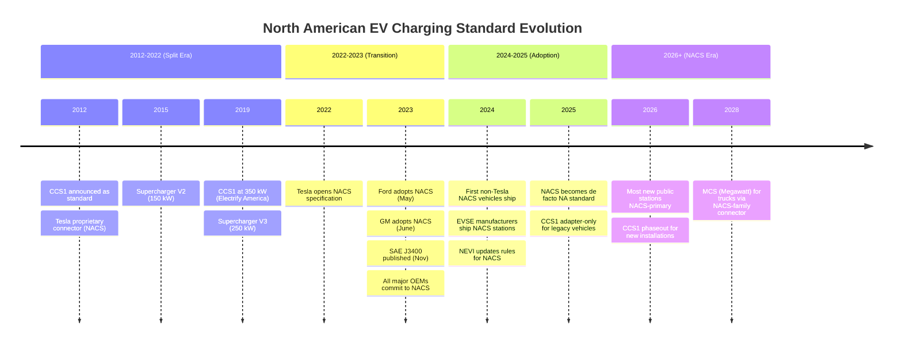

# SAE J3400 — North American Charging Standard (NACS)

**Topic:** SAE J3400:2023 — The Standardization of Tesla's Proprietary Connector as the North American Charging Standard  
**Standards:** SAE J3400:2023, SAE J1772, SAE J3068 (MCS), IEC 62196, ISO 15118  
**SDO:** SAE International (Society of Automotive Engineers)  
**Audience:** EV charging infrastructure engineers, automotive OEM charging system architects, EVSE manufacturers, fleet operators  
**Prerequisites:** IEC 61851 charging modes, CCS architecture, basic EV charging concepts

---

## Chapter 1 — Historical Context & Origin Story

### 1.1 Timeline — From Proprietary Tesla to Open Standard

| Year | Event |
|------|-------|
| 2008 | Tesla Roadster — proprietary connector (not widely standardized) |
| 2012 | Tesla Model S — introduces proprietary Tesla connector (later called NACS) for Supercharger network |
| 2012 | CCS Combo 1 (SAE J1772 + DC pins) announced as US industry standard |
| 2012-2022 | US market split: Tesla vehicles use NACS; all other OEMs use CCS1 |
| 2015 | Tesla Supercharger V2 (150 kW) |
| 2019 | Tesla Supercharger V3 (250 kW) |
| 2022 | Tesla opens NACS connector specification to industry (November 2022) |
| 2022 | Tesla begins opening Supercharger network to non-Tesla EVs (with CCS1 adapter / Magic Dock) |
| 2023 | **Ford announces adoption of NACS** (May 2023) — first major non-Tesla OEM |
| 2023 | **GM announces adoption of NACS** (June 2023) |
| 2023 | Rivian, Polestar, Volvo, Nissan, Honda, Hyundai, Kia, BMW, Mercedes, Toyota, Stellantis all announce NACS adoption |
| 2023 | **SAE J3400:2023 published** (June → formal publication November 2023) — NACS becomes SAE standard |
| 2024 | ChargePoint, ABB, Tritium, BTC Power begin shipping NACS-equipped EVSE |
| 2024 | Ford F-150 Lightning, Mustang Mach-E ship with NACS port (model year 2025) |
| 2024 | GM EVs begin shipping with NACS (2025 MY) |
| 2024 | NEVI (National EV Infrastructure) program updates to allow NACS (alongside CCS1 requirement) |
| 2025 | Tesla Supercharger V4 (Megacharger for trucks — up to 1 MW+ NACS-compatible) |
| 2025 | CCS1 declining rapidly in North America; NACS dominant for new vehicles |
| 2026+ | Legacy CCS1 vehicles supported via NACS-to-CCS1 adapters at stations |

### 1.2 Why NACS Won Over CCS1

| Factor | NACS Advantage | CCS1 Disadvantage |
|--------|---------------|-------------------|
| Physical size | **~50% smaller and lighter** than CCS1 | CCS1 is bulky; requires two-handed operation at high power |
| Single connector | Same connector for AC AND DC (Level 1, 2, and DC fast) | CCS1 needs Type 1 (AC) + DC extension (large combined plug) |
| Ergonomics | One-handed operation, lightweight cable | Heavy cable, large connector, difficult in cold/rain |
| Network advantage | Tesla had 60%+ of US public DC fast charging ports | CCS1 network was fragmented, unreliable, often out-of-service |
| Reliability | Supercharger network: >98% uptime | CCS1 public network: 70-80% reliability (per industry studies) |
| User experience | Plug in → automatic (Tesla account) | RFID/app → wait → authenticate → plug in → hope it works |
| Thermal management | Liquid-cooled from the start (250 kW+) | Many CCS1 implementations air-cooled (limited to ~150 kW without LC) |
| Power capability | 1 MW+ demonstrated (V4 architecture) | CCS1 spec supports 350 kW (practical limit of connector) |
| Industry momentum | Every major OEM switched to NACS in 2023 | Only Stellantis held out briefly |

---

## Chapter 2 — Standard Architecture & Structure

### 2.1 SAE J3400:2023 Scope

| Aspect | SAE J3400 Coverage |
|--------|-------------------|
| Connector form factor | Physical dimensions, pin layout, mating interface |
| Electrical ratings | Voltage, current limits for AC and DC modes |
| Communication | References ISO 15118 for HLC (high-level communication) |
| Safety | Pin assignments, interlocks, temperature monitoring |
| Compatibility | AC Level 1/2, DC fast charging through SINGLE connector |
| Region | North America (primary); global use not precluded |
| Relationship | Replaces CCS1 (SAE J1772 combo) as primary North American DC connector |

### 2.2 NACS Pin Configuration

| Pin | Function | Description |
|-----|----------|-------------|
| L1/DC+ | AC Line 1 or DC positive | Shared pin — carries either AC L1 or DC+ depending on charging mode |
| L2/DC- | AC Line 2 (neutral) or DC negative | Shared pin — carries AC neutral or DC- |
| PE (Ground) | Protective Earth | Always connected; safety ground |
| CP | Control Pilot | IEC 61851 PWM signal (AC) or PLC carrier (DC via ISO 15118) |
| PP | Proximity Pilot | Connector presence detection; cable current rating |

**Total: 5 pins** (vs. CCS1's 9 pins: 5 for Type 1 AC + 2 DC power + 2 DC signal)

### 2.3 Electrical Ratings

| Parameter | SAE J3400 Rating | CCS1 (for comparison) |
|-----------|-----------------|----------------------|
| Maximum DC voltage | **1000V DC** | 1000V DC |
| Maximum DC current | **900A** (with liquid cooling) | 500A (IEC 62196-3 limit) |
| Maximum DC power | **Up to 1 MW** (900A × 1000V + thermal management) | 350 kW practical (500A × 700V typical) |
| AC voltage (Level 2) | 240V single-phase | 240V single-phase |
| AC current (Level 2) | 80A (19.2 kW) | 80A (19.2 kW) |
| AC voltage (Level 1) | 120V | 120V |
| AC current (Level 1) | 16A (1.9 kW) | 16A (1.9 kW) |
| Temperature rating | -40°C to +50°C ambient | -40°C to +50°C ambient |
| Mating cycles | >10,000 cycles | >10,000 cycles |
| IP rating (mated) | IP44 (minimum while mated) | IP44 |
| Locking mechanism | Mechanical latch (button release) | Mechanical latch |

### 2.4 Architecture Comparison

```mermaid
graph LR
    subgraph "NACS (SAE J3400)"
        NACS_CONN[Single Compact Connector<br/>• 5 pins total<br/>• AC + DC on same pins<br/>• ~50% size of CCS1<br/>• One-hand operation<br/>• Lightweight]
    end
    
    subgraph "CCS Combo 1"
        CCS1_AC[Type 1 (J1772) Section<br/>• 5 pins (L1, N, PE, CP, PP)<br/>• AC charging only<br/>• Can be used standalone]
        CCS1_DC[DC Extension<br/>• 2 large DC pins (DC+, DC-)<br/>• Combined with Type 1<br/>• Only used during DC charging]
        CCS1_AC --- CCS1_DC
    end
    
    subgraph "CCS Combo 2 (Europe)"
        CCS2_AC[Type 2 (Mennekes) Section<br/>• 7 pins (L1,L2,L3,N,PE,CP,PP)<br/>• 3-phase AC capable<br/>• Can be used standalone]
        CCS2_DC[DC Extension<br/>• 2 large DC pins (DC+, DC-)<br/>• Combined with Type 2]
        CCS2_AC --- CCS2_DC
    end
```

---

## Chapter 3 — Technical Deep Dive

### 3.1 Communication Protocol

| Charging Mode | Protocol | Physical Medium |
|---------------|----------|-----------------|
| AC Level 1/2 | IEC 61851 Control Pilot (PWM) | CP pin — 1 kHz PWM signal |
| DC Fast Charging | ISO 15118-2 / ISO 15118-20 | PLC (HomePlug GreenPHY) on CP pin |
| Legacy Tesla DC | Proprietary Tesla protocol | Same physical medium (PLC variant) |
| Backend (station) | OCPP 2.0.1 | IP network (Ethernet/4G) — not in connector |

**Key point:** NACS uses the SAME communication protocols as CCS (ISO 15118 over PLC). The difference is only the physical connector form factor — the electrical and communication protocols are identical to CCS.

### 3.2 Thermal Management (Liquid Cooling)

| Parameter | NACS Liquid-Cooled | CCS1 Liquid-Cooled |
|-----------|-------------------|-------------------|
| Maximum current (liquid cooled) | 900A+ | 500A |
| Cable conductor size | Reduced (smaller cable diameter) | Larger than NACS for same current |
| Coolant type | Dielectric fluid | Dielectric fluid |
| Cable weight (350 kW class) | ~3 kg/m | ~5 kg/m |
| User handling force | Low (lightweight, flexible) | Higher (heavier cable) |
| Temperature at handle | <50°C (touch-safe) | <60°C (hotter at same power) |
| Connector pin temperature | Monitored via embedded thermocouples | Monitored via thermocouples |
| De-rating trigger | >70°C pin temperature → reduce current | Similar |
| Cooling system failure | Immediate power reduction to air-cooled limit (~50 kW) | Similar |

### 3.3 Adapter Solutions (Transition Period)

| Adapter | Direction | Power | Use Case |
|---------|-----------|-------|----------|
| NACS-to-CCS1 (station-side) | EVSE has NACS cable; CCS1 vehicle plugs via adapter | Up to 150 kW (typical adapter limit) | Legacy CCS1 vehicles at new NACS stations |
| CCS1-to-NACS (vehicle-side) | Vehicle has NACS port; CCS1 cable plugs via adapter | Up to 150-250 kW | NACS vehicles at legacy CCS1 stations |
| Tesla Magic Dock | Station extends NACS connector with CCS1 adapter (motorized) | Up to 250 kW | Tesla Superchargers serving CCS1 vehicles |
| CHAdeMO-to-NACS | Very rare; some aftermarket | Up to 50 kW | Legacy Japanese EVs at Tesla/NACS stations |

### 3.4 Power Delivery Architecture

```mermaid
graph TB
    subgraph "Supercharger V4 Architecture"
        GRID[Grid Connection<br/>Medium Voltage (12.47 kV)<br/>Transformer → 480V 3-phase]
        CABINET[Power Cabinet<br/>• 1.2 MW capacity<br/>• Modular power modules<br/>• Liquid-cooled electronics<br/>• Can serve 1 stall @ 1 MW<br/>  or 2 stalls @ 500 kW each<br/>• Dynamic power sharing]
        CABLE1[Stall 1: NACS Cable<br/>Liquid-cooled<br/>Up to 1 MW<br/>(for MCS/commercial)]
        CABLE2[Stall 2: NACS Cable<br/>Liquid-cooled<br/>Up to 350+ kW<br/>(passenger EV)]
    end
    
    subgraph "Vehicle Integration"
        EV1[EV Battery (800V pack)<br/>350 kW charge rate<br/>10-80% in 15 minutes]
        EV2[Commercial Vehicle<br/>1000V pack<br/>1 MW charge rate<br/>(truck/semi)]
    end
    
    GRID --> CABINET
    CABINET --> CABLE1
    CABINET --> CABLE2
    CABLE1 --> EV2
    CABLE2 --> EV1
```

---

## Chapter 4 — Implementation Guide

### 4.1 For Vehicle OEMs — Transitioning to NACS

| Step | Activity | Timeline |
|------|----------|----------|
| 1 | Licensing agreement with Tesla/SAE for J3400 connector specification | 1-2 months |
| 2 | Mechanical integration: design charge port door, inlet mounting, connector retention | 6-12 months |
| 3 | Electrical integration: pin connections to on-board charger (AC) and battery bus (DC) | Concurrent with mechanical |
| 4 | Communication: implement ISO 15118 stack (same as CCS — no protocol change) | 6-12 months (if not already done) |
| 5 | Thermal management: temperature sensors in inlet, de-rating algorithm | 3-6 months |
| 6 | Adapter support: ensure vehicle accepts CCS1 adapter at inlet (during transition) | 3-6 months |
| 7 | Supercharger network access: agreement with Tesla for network interoperability | Business negotiation (3-6 months) |
| 8 | Validation testing: CharIN conformance, interoperability with multiple EVSE brands | 6-12 months |
| 9 | Regulatory: UL certification for inlet assembly, FCC (PLC emissions) | 4-8 months |

### 4.2 For EVSE Manufacturers — Adding NACS

| Requirement | Specification |
|-------------|---------------|
| Connector procurement | Licensed NACS connector assembly (Tesla-approved suppliers) |
| Cable assembly | Liquid-cooled (>150 kW) or air-cooled (≤150 kW) |
| Dual-connector stations | NACS + CCS1 (required for NEVI funding during transition) |
| Communication | ISO 15118-2 minimum; ISO 15118-20 recommended; DIN 70121 fallback |
| Power electronics | Same as CCS (no change to power conversion) — just different connector |
| Backend | OCPP 2.0.1 (same as CCS — connector-agnostic) |
| Certification | UL 2202 (DC) or UL 2594 (AC); FCC Part 15 (PLC); SAE J3400 conformance |
| NEVI compliance | Must have MINIMUM 4 CCS1 ports per station (current NEVI rule — evolving) |

### 4.3 NEVI (National Electric Vehicle Infrastructure) Program

| Requirement | Current (2024) | Expected Evolution (2025+) |
|-------------|---------------|---------------------------|
| Minimum DC power per port | 150 kW | 150 kW (unchanged) |
| Minimum ports per station | 4 | 4 (unchanged) |
| Connector requirement | **CCS1 required** (at least 4 CCS1 ports) | CCS1 + NACS (dual-connector) OR NACS-only with CCS1 adapter |
| NACS allowed? | Yes, as additional connector | Yes, likely primary connector with CCS1 fallback |
| Uptime requirement | >97% | >97% |
| Payment | Contactless (no app required) | Contactless + Plug & Charge |
| Pricing | $/kWh transparent pricing | $/kWh |
| ADA accessibility | Compliant with ADA requirements | Enhanced accessibility requirements |
| Funding per state | $5M-$100M+ per state (NEVI formula) | Continued annual disbursements through 2026 |

---

## Chapter 5 — Certification & Compliance

### 5.1 SAE J3400 Certification Path

| Certification | Standard | Body | Cost | Timeline |
|--------------|----------|------|------|----------|
| Connector conformance | SAE J3400 (mechanical/electrical) | SAE-approved test lab | $15,000-$30,000 | 4-6 weeks |
| EVSE safety (DC) | UL 2202 / CSA C22.2 No. 107.1 | UL, CSA, Intertek | $60,000-$120,000 | 12-20 weeks |
| EVSE safety (AC) | UL 2594 / CSA C22.2 No. 280 | UL, CSA, Intertek | $40,000-$80,000 | 10-16 weeks |
| EMC | FCC Part 15 (PLC emissions) | FCC-accredited lab | $10,000-$20,000 | 4-6 weeks |
| ISO 15118 conformance | ISO 15118-4/-5 | CharIN, DEKRA | $30,000-$60,000 | 4-8 weeks |
| Interoperability | CharIN Testival / SAE testing | CharIN | $5,000-$15,000 per event | 1 week |
| Vehicle inlet (OEM) | SAE J3400 + OEM-specific | OEM test facility | Included in vehicle certification | 6-12 months (development) |
| NEC/NFPA compliance | National Electrical Code (installation) | Local AHJ (Authority Having Jurisdiction) | Site-specific | Site-specific |

### 5.2 Key Differences from CCS1 Certification

| Aspect | CCS1 Certification | NACS (J3400) Certification |
|--------|--------------------|-----------------------------|
| Connector standard | IEC 62196-3 (Type 1 combo) | SAE J3400 (NACS) |
| Protocol testing | Same (ISO 15118 over PLC) | Same (ISO 15118 over PLC) |
| Safety testing | Same (UL 2202 / UL 2594) | Same (UL 2202 / UL 2594) |
| Thermal testing | Different connector thermal profile | Different connector thermal profile |
| Mechanical testing | IEC 62196-1 (mating force, durability) | SAE J3400 (mating force, durability) — different dimensions |
| Pin-to-pin compatibility | N/A | NOT pin-compatible with CCS1 (adapter required) |
| Communication compatibility | ISO 15118 | ISO 15118 (IDENTICAL) |
| Power electronics | N/A | Same (output is still DC voltage + current) |

---

## Chapter 6 — Regional Adoption & Variants

### 6.1 NACS Adoption Status by OEM

| OEM | Announcement Date | First NACS Vehicle (MY) | Notes |
|-----|-------------------|------------------------|-------|
| Tesla | Always (2012+) | All Tesla vehicles | Inventor of NACS connector |
| Ford | May 2023 | 2025 MY (F-150 Lightning, Mach-E) | First non-Tesla adopter |
| GM | June 2023 | 2025 MY (Equinox EV, Blazer EV) | Second major adopter |
| Rivian | June 2023 | 2025 MY (R1T, R1S, R2) | Early startup adopter |
| Volvo/Polestar | June 2023 | 2025 MY (EX30, Polestar 3) | Volvo Cars commitment |
| Nissan | July 2023 | 2025 MY (Ariya refresh) | Japanese OEM adopting US-specific |
| Honda/Acura | July 2023 | 2025 MY (Prologue) | Partnership vehicles |
| Hyundai/Kia | October 2023 | 2025 MY (Ioniq 5/6 refresh) | Korean OEM commitment |
| BMW | October 2023 | 2025 MY (iX, i5) | German OEM adapting for NA |
| Mercedes-Benz | October 2023 | 2025 MY (EQS, EQE) | German OEM adapting for NA |
| Toyota | October 2023 | 2026 MY (upcoming BEVs) | Late adopter |
| Stellantis | December 2023 | 2026 MY | Last major holdout |
| Lucid | 2023 | 2025 MY | Premium EV startup |
| Fisker | 2023 | N/A (company struggling) | — |
| VW Group (NA) | 2024 | 2026 MY (ID.4 refresh) | Complex portfolio timing |

### 6.2 Regional Outlook

| Region | NACS Status | Primary Standard | Notes |
|--------|------------|-----------------|-------|
| **North America (US/Canada)** | **Dominant (2025+)** | **SAE J3400 (NACS)** | All major OEMs adopted; CCS1 legacy support via adapters |
| Europe | NOT adopted | CCS Combo 2 (IEC 62196-3) | EU AFIR mandates CCS2; no NACS adoption expected |
| China | NOT adopted | GB/T 20234 | Chinese standard mandatory; no foreign connector |
| Japan | NOT adopted | CHAdeMO → ChaoJi (future) | Japan exploring ChaoJi; NACS unlikely |
| Korea | Under consideration | CCS2 (currently) | Monitoring NA trend; Hyundai/Kia dual-port possible |
| Australia | Under consideration | CCS2 (currently) | Tesla Australia uses CCS2; NACS unlikely |
| India | NOT adopted | CCS2 / Bharat | Bharat + CCS2 mix; NACS unlikely |

---

## Chapter 7 — Standard Comparison Matrix

| Criterion | NACS (SAE J3400) | CCS Combo 1 | CCS Combo 2 | CHAdeMO | GB/T |
|-----------|-----------------|-------------|-------------|---------|------|
| Region | North America | North America (declining) | Europe/Global | Japan (declining) | China |
| Connector size | **Smallest** | Largest | Large | Large | Medium |
| Weight (connector) | ~300g | ~800g | ~700g | ~600g | ~500g |
| Pin count | 5 | 9 (5 AC + 2 DC + 2 signal) | 9 (7 AC + 2 DC) | 10 | 9 (DC) / 7 (AC) |
| AC + DC unified | **Yes (same pins)** | Combined (separate sections) | Combined (separate) | DC only (separate AC plug) | Separate plugs |
| Max DC voltage | 1000V | 1000V | 1000V | 1000V | 750V (extending) |
| Max DC current | 900A (liquid-cooled) | 500A | 500A | 400A | 250A (extending) |
| Max DC power | ~1 MW | 350 kW (practical) | 350 kW | 400 kW | 250 kW |
| Communication | ISO 15118 (PLC) | ISO 15118 (PLC) | ISO 15118 (PLC) | CAN bus | CAN bus (GB/T 27930) |
| Plug & Charge | Yes (ISO 15118) | Yes (ISO 15118) | Yes (ISO 15118) | No (no PnC) | No |
| Bidirectional (V2G) | ISO 15118-20 (future) | ISO 15118-20 (future) | ISO 15118-20 (future) | Yes (native, since 1.0) | Under development |
| One-hand operation | Yes | Difficult at high power | Possible | Difficult | Possible |
| Network (NA) | 60%+ of DC fast charge ports | 30% (declining) | N/A (not NA) | <10% (declining) | N/A |
| Reliability (NA) | >98% (Supercharger) | 70-80% (industry average) | N/A | Varies | N/A |

---

## Chapter 8 — Mermaid Architecture Diagrams

### 8.1 North American Charging Standard Transition



### 8.2 Dual-Standard Station Architecture (Transition Period)

```mermaid
graph TB
    subgraph "Power Infrastructure"
        GRID[Utility Grid<br/>480V 3-phase]
        XFMR[Step-down Transformer<br/>(if medium voltage feed)]
        POWER_CAB[Power Cabinet<br/>1.2 MW modular<br/>Dynamic power allocation]
    end
    
    subgraph "Dispensers"
        DISP1[Dispenser 1<br/>━━━━━━━━━━━<br/>NACS Cable (350 kW)<br/>Liquid-cooled<br/>+ CCS1 Cable (150 kW)<br/>Air-cooled<br/>━━━━━━━━━━━<br/>ISO 15118-2/20 both cables]
        DISP2[Dispenser 2<br/>━━━━━━━━━━━<br/>NACS Cable (350 kW)<br/>Liquid-cooled<br/>+ CCS1 Cable (150 kW)<br/>Air-cooled<br/>━━━━━━━━━━━<br/>ISO 15118-2/20 both cables]
    end
    
    subgraph "Backend"
        OCPP[OCPP 2.0.1 Backend<br/>• Authorization<br/>• Smart charging<br/>• Payment processing<br/>• Monitoring/diagnostics]
    end
    
    GRID --> XFMR
    XFMR --> POWER_CAB
    POWER_CAB --> DISP1
    POWER_CAB --> DISP2
    DISP1 -->|"4G/Ethernet"| OCPP
    DISP2 -->|"4G/Ethernet"| OCPP
```

---

## Chapter 9 — Case Studies

### 9.1 Ford NACS Transition — First Major Non-Tesla Adopter

| Aspect | Detail |
|--------|--------|
| Announcement | May 25, 2023 (CEO Jim Farley announced on Twitter) |
| Rationale | (1) Customer access to 12,000+ Tesla Superchargers (vs. ~5,000 non-Tesla DC). (2) Better connector ergonomics. (3) Industry momentum — better to lead than follow. (4) Simpler vehicle design (one connector for AC+DC). |
| Implementation | 2025 MY vehicles ship with NACS inlet (F-150 Lightning, Mustang Mach-E, E-Transit) |
| Transition support | Free NACS-to-CCS1 adapter included with existing CCS1 Ford EVs for 2 years |
| Supercharger access | Ford owners get access to Tesla Supercharger network via FordPass app integration |
| Technical changes | (1) New charge port door design. (2) New inlet assembly (NACS connector receptacle). (3) Software update for Tesla Supercharger authentication. (4) No power electronics changes (same OBC, same DC bus). |
| Communication | Same ISO 15118 stack — protocol unchanged (only physical connector different) |
| Business impact | Significant: Ford EVs now have access to largest NA fast-charge network on day one |
| Customer reception | Overwhelmingly positive (access to reliable Supercharger network was top EV complaint) |
| Lessons | (1) Market dynamics can override formal standardization (CCS1 was "the standard" but inferior experience). (2) Network effect: Tesla's investment in infrastructure created unbeatable competitive advantage. (3) First-mover advantage in adopting NACS gave Ford positive press coverage. |

### 9.2 NEVI Program Adaptation to NACS

| Aspect | Detail |
|--------|--------|
| Original NEVI rule | All federally-funded stations must have minimum 4× CCS1 ports at 150 kW each |
| Problem created | Industry moving to NACS, but federal funds mandate CCS1 — misalignment |
| Resolution | FHWA (Federal Highway Administration) updating rules to: (1) Allow NACS as additional connector. (2) Likely allow NACS-primary with CCS1 adapter/secondary. (3) Maintain minimum 4-port, 150 kW requirement regardless of connector. |
| Station design | Most new NEVI stations deploying **dual-cable dispensers**: NACS + CCS1 per stall |
| Cost impact | Dual-cable increases station cost by ~$10,000-$20,000 per dispenser (second connector + cable) |
| Industry request | Charging networks (ChargePoint, EVgo) requesting NACS-only allowance to reduce cost |
| Timeline | Rule updates expected mid-2024 to fully incorporate J3400 |
| Lessons | (1) Government policy lags market reality. (2) Technology standards set by industry adoption, not by regulation alone. (3) Dual-connector is expensive but necessary transition solution. |

---

## Chapter 10 — Future Evolution & Industry Trends

| Trend | Timeline | Description |
|-------|----------|-------------|
| NACS for MCS (Megawatt Charging) | 2025-2027 | Tesla V4 Megacharger uses NACS-family connector for 1 MW+ truck charging |
| CCS1 phase-out (NA new installations) | 2026-2028 | New stations NACS-primary; CCS1 only via adapter or legacy support |
| NACS V2G (bidirectional) | 2025-2026 | ISO 15118-20 bidirectional through NACS connector (same protocol as CCS) |
| NACS wireless integration | 2027+ | SAE J2954 wireless + NACS wired on same vehicle (dual-mode) |
| Global NACS expansion? | Uncertain | Currently North America only; Europe firmly CCS2; China firmly GB/T |
| Tesla Supercharger V4 global | 2025+ | Tesla V4 in Europe uses CCS2 (NACS North America, CCS2 elsewhere) |
| NACS for fleet/commercial | 2025+ | Transit buses, delivery trucks adopting NACS inlet |
| Adapter ecosystem maturation | 2024-2026 | Bidirectional adapters, higher-power adapters, integrated adapter storage |
| CCS1 legacy support duration | 2025-2035 | CCS1 vehicles on road for 10-15 years; adapter support required |
| NACS connector commoditization | 2024-2025 | Multiple suppliers (Phoenix Contact, Amphenol, TE Connectivity) |
| Ultra-fast NACS (>500 kW) | 2025-2027 | 800V vehicles + liquid-cooled NACS cable → 500+ kW charging common |

---

## Chapter 11 — Interview Questions & Career Guide

### Tier 1: Entry-Level

**Q1:** What is SAE J3400 (NACS), and why did the North American EV industry adopt it over CCS1?  
**A:** SAE J3400, also known as the **North American Charging Standard (NACS)**, is the standardized version of Tesla's proprietary EV charging connector. Published by SAE International in November 2023, it defines a compact, lightweight connector that handles BOTH AC (Level 1/2) and DC fast charging through a single 5-pin interface.

**Why industry adopted NACS over CCS1:**

1. **Physical superiority:** NACS is approximately 50% smaller and lighter than CCS1. This makes it ergonomically easier to handle — one-handed operation is comfortable, whereas CCS1 at high power requires two hands and significant force.

2. **Single connector:** NACS uses the same 5 pins for both AC and DC charging. The L1 and L2 pins carry AC power for Level 1/2 charging OR DC+/DC- for fast charging. CCS1 requires a large combined connector (Type 1 + 2 DC power pins), making it bulky.

3. **Network advantage:** Tesla's Supercharger network represented >60% of US public DC fast charging ports in 2023, with >98% uptime reliability. The non-Tesla CCS1 network (Electrify America, EVgo, ChargePoint) had significantly lower reliability (studies showed 70-80% uptime).

4. **User experience:** Tesla owners had seamless plug-and-charge (plug in → auto-authenticate via Tesla account → charging starts in seconds). CCS1 users often experienced: failed sessions, confusing apps, RFID problems, and out-of-service stations.

5. **Industry momentum:** When Ford announced NACS adoption in May 2023, it triggered a cascade — GM, Rivian, Hyundai, BMW, Mercedes, and virtually every other OEM followed within months. The CCS1 ecosystem lost critical mass overnight.

6. **Power capability:** NACS supports up to 900A with liquid cooling (approaching 1 MW), while CCS1 is practically limited to 500A/350 kW.

**Key technical note:** The COMMUNICATION PROTOCOL is identical — both NACS and CCS use ISO 15118 over PLC (HomePlug GreenPHY) on the Control Pilot pin. The only difference is the physical connector shape. This made adoption technically straightforward (no protocol stack changes needed).

### Tier 2: Mid-Level

**Q2:** Design the transition strategy for an EVSE manufacturer switching from CCS1-only stations to dual-connector (NACS + CCS1) and eventually NACS-primary stations.  
**A:**

**Phase 1: Dual-Connector (2024-2026)**
| Design Element | Specification |
|---------------|---------------|
| Dispenser configuration | Each stall has 2 cables: NACS (primary, 350 kW liquid-cooled) + CCS1 (secondary, 150 kW air-cooled) |
| Power sharing | Dynamic power allocation: full 350 kW to whichever cable is active; both cables share single power cabinet |
| Communication | IDENTICAL ISO 15118 stack for both cables — only physical layer (connector pinout) differs |
| Backend | OCPP 2.0.1 with ConnectorType attribute for each connector (NACS vs CCS1) |
| Cable management | NACS cable shorter (right-side dispenser) + CCS1 cable longer (accommodates varied port locations) |
| Cost impact | +$10,000-$15,000 per dispenser (second cable assembly, second holster, cable management) |
| NEVI compliance | Meets current CCS1 requirement (4× CCS1 per station) PLUS provides NACS |

**Phase 2: NACS-Primary with CCS1 Adapter (2026-2028)**
| Design Element | Specification |
|---------------|---------------|
| Dispenser | NACS cable only (350 kW, liquid-cooled) |
| CCS1 support | Integrated adapter stored on dispenser (similar to Tesla Magic Dock) OR station-provided adapter on tether |
| Cost savings | -$10,000 per dispenser (eliminate dedicated CCS1 cable) |
| User flow | NACS vehicle: plug directly. CCS1 vehicle: attach adapter → plug in. |
| Adapter power limit | 150-250 kW (adapter thermal limits at high current) |
| NEVI compliance | Requires updated NEVI rules accepting adapter approach |

**Phase 3: NACS-Only (2028+)**
| Design Element | Specification |
|---------------|---------------|
| Dispenser | NACS cable only, no adapter (CCS1 vehicles at end-of-life) |
| Maximum power | Up to 1 MW (for MCS-class commercial charging) |
| Simplification | Single cable type across all stations — reduced inventory, maintenance, confusion |
| Legacy support | CCS1 adapters available for purchase (aftermarket) for remaining legacy vehicles |

### Tier 3: Senior

**Q3:** Analyze the business and technical factors that enabled Tesla's proprietary connector to displace an established industry standard (CCS1), and what lessons this provides for standardization strategy in the EV industry.  
**A:** [This would detail: (1) Network effects (Tesla invested $5B+ in Supercharger infrastructure before opening it — creating demand-side lock-in), (2) Vertical integration advantage (Tesla controlled vehicle + connector + network + software → optimized end-to-end experience), (3) Technical superiority alone isn't sufficient — CCS1 was technically adequate but user experience was poor due to fragmented network implementation, (4) Standards bodies (SAE, IEC) are slow — Tesla moved faster than the standardization process, (5) Government policy can't override market dynamics (NEVI mandated CCS1 but industry moved to NACS regardless), (6) The "VHS vs Betamax" analogy — content library (charging network) matters more than technical specification, (7) Lessons for future standards wars (solid-state battery interfaces, autonomous vehicle charging, wireless charging), (8) Risk analysis: what if Tesla had NOT opened NACS? — would CCS1 have survived? Full answer would be 1500+ words.]

---

## Chapter 12 — Cheat Sheet & Quick Reference

### NACS vs CCS1 Quick Comparison

```
                        NACS (J3400)          CCS Combo 1
Pins:                   5                     9
Size:                   Small (one-hand)      Large (two-hand at HPC)
AC + DC combined:       Yes (same pins)       Yes (separate sections)
Max DC power:           ~1 MW (900A × 1000V)  350 kW (500A × 700V)
Communication:          ISO 15118 (PLC)       ISO 15118 (PLC) ← SAME
Plug & Charge:          Yes                   Yes ← SAME
V2G (future):           ISO 15118-20          ISO 15118-20 ← SAME
NA market share (2025): ~70% (growing)        ~25% (declining)
Reliability (NA):       >98%                  70-80%
```

### Pin Assignment

```
NACS (SAE J3400) — 5 Pins:
  ┌──────────┐
  │  L1/DC+  │  ← AC Line 1 OR DC Positive
  │  L2/DC-  │  ← AC Neutral OR DC Negative  
  │    PE    │  ← Protective Earth (always ground)
  │    CP    │  ← Control Pilot (PWM for AC; PLC for DC)
  │    PP    │  ← Proximity Pilot (presence + cable rating)
  └──────────┘
```

### Adoption Timeline (North America)

```
2023: SAE J3400 published; all OEMs commit
2024: First non-Tesla NACS vehicles (Ford, GM 2025 MY)
2025: NACS dominant for new vehicle sales; EVSE shipping NACS
2026: CCS1 new installations decline; adapter era
2028: CCS1 phase-out for new public stations
2030+: Legacy CCS1 vehicles still on road (adapter-supported)
```

### Key Standards Relationships

```
SAE J3400 ─── Physical connector (NACS form factor)
    │
    ├── IEC 61851-1 ─── Charging modes (1-4), CP signal (same as CCS)
    │
    ├── ISO 15118-2/20 ─── Communication protocol (IDENTICAL to CCS)
    │
    ├── UL 2202/2594 ─── Safety certification (same test requirements)
    │
    └── OCPP 2.0.1 ─── Backend protocol (connector-agnostic)

KEY INSIGHT: NACS is ONLY a different physical connector.
Everything else (communication, safety, backend) is IDENTICAL to CCS.
```

### Decision Matrix: NACS vs CCS1 for New EVSE Deployment (NA)

```
New public station (NA, 2025+):   → NACS primary + CCS1 secondary
New home charger (NA):            → NACS (Level 2 AC)
New fleet depot (NA):             → NACS (matches new fleet vehicles)
Retrofit existing CCS1 station:   → Add NACS cable (dual-connector)
European deployment:              → CCS2 (NACS not used in EU)
Chinese deployment:               → GB/T (NACS not used in China)
```

---

*End of Document — 09_SAE_J3400_NACS.md*
