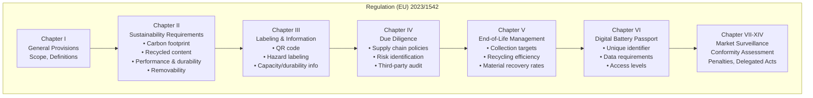
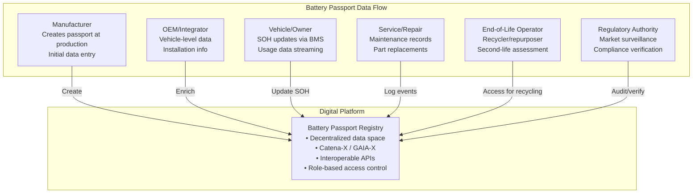

# EU Battery Regulation 2023/1542

**Topic:** European Union Battery Regulation — Sustainability, Circular Economy, and Due Diligence Requirements for All Battery Types  
**Standards:** Regulation (EU) 2023/1542, replacing Directive 2006/66/EC  
**SDO:** European Parliament and Council of the European Union  
**Audience:** Battery manufacturers, automotive OEMs, recycling companies, compliance officers, sustainability engineers  
**Prerequisites:** EU regulatory framework basics, battery chemistry fundamentals, lifecycle assessment (LCA) concepts

---

## Chapter 1 — Historical Context & Origin Story

### 1.1 Timeline

| Year | Event |
|------|-------|
| 2006 | Directive 2006/66/EC (Batteries Directive) — focus on heavy metals (Cd, Hg, Pb), basic collection targets |
| 2017 | EU Strategic Action Plan on Batteries announced (European Battery Alliance) |
| 2019 | European Green Deal launched — batteries identified as critical for decarbonization |
| 2020 | European Commission proposes new Battery Regulation (December 2020) |
| 2021 | European Parliament and Council negotiate the proposal |
| 2022 | Provisional agreement between Parliament and Council (December 2022) |
| 2023 | **Regulation (EU) 2023/1542 published** (July 12, 2023) — entry into force August 17, 2023 |
| 2024 | First obligations apply: labeling, marking, QR code requirements |
| 2025 | Carbon footprint declaration mandatory (EV and industrial batteries >2 kWh) |
| 2026 | Performance/durability classes established; recycled content reporting begins |
| 2027 | **Digital Battery Passport** mandatory (EV batteries) |
| 2028 | Carbon footprint performance class labels mandatory; maximum carbon footprint thresholds |
| 2030 | Collection targets: 63% portable, 73% by 2030 (progressive increase) |
| 2031 | **Recycled content minimum thresholds** enforced: 16% cobalt, 6% lithium, 6% nickel |
| 2036 | Recycled content increases: 26% cobalt, 12% lithium, 15% nickel |

### 1.2 Why the Regulation Was Needed

| Problem (Under 2006 Directive) | EU Battery Regulation Solution |
|-------------------------------|-------------------------------|
| No requirements for battery carbon footprint | **Carbon footprint declaration + performance classes + maximum thresholds** |
| No recycled content mandates | **Minimum recycled content: Co, Li, Ni, Pb (phased targets)** |
| Poor collection rates (especially portable) | **Ambitious collection targets: 45%→63%→73% (portable); 51%→61% (LMT)** |
| No second-life regulation | **Second-life requirements: battery health data, repurposing criteria** |
| No supply chain due diligence | **Mandatory due diligence: human rights, environmental, conflict minerals** |
| No digital traceability | **Digital Battery Passport (2027) — full lifecycle data** |
| Limited durability requirements | **Electrochemical performance and durability labeling** |
| No removability rules | **Batteries must be removable/replaceable by end-users or independent operators** |
| Directive (transposed differently per country) | **Regulation (directly applicable in all 27 EU member states)** |

---

## Chapter 2 — Standard Architecture & Structure

### 2.1 Battery Categories Under the Regulation

| Category | Definition | Examples |
|----------|-----------|----------|
| Portable batteries | Sealed, ≤5 kg, not industrial/EV/SLI | AA/AAA cells, phone batteries, power tool batteries, laptop batteries |
| Light Means of Transport (LMT) batteries | Power e-bikes, e-scooters, hoverboards (≤25 kg) | E-bike battery (36V/500Wh), e-scooter battery |
| Starting, Lighting and Ignition (SLI) batteries | Vehicle 12V batteries for starting engine | 12V lead-acid, 12V Li-ion starter battery |
| Industrial batteries | All others >5 kg that are not EV/SLI | Stationary ESS, forklift batteries, UPS batteries, telecom batteries |
| Electric Vehicle (EV) batteries | Traction batteries for road vehicles (Regulation 2018/858) | EV traction battery (60-100+ kWh), PHEV battery |

### 2.2 Regulation Structure (Key Chapters)



### 2.3 Phased Implementation Timeline

```mermaid
gantt
    title EU Battery Regulation Implementation Timeline
    dateFormat  YYYY-MM
    
    section Labeling & Marking
    General labeling (CE, capacity, symbols)        :done, 2024-02, 2024-08
    QR code on all batteries                        :active, 2025-02, 2025-08
    Carbon footprint label (EV + industrial >2kWh)  :2026-02, 2026-08
    
    section Carbon Footprint
    Carbon footprint declaration (EV + industrial)  :2025-02, 2025-07
    Carbon footprint performance classes            :2026-08, 2027-02
    Maximum carbon footprint thresholds             :2028-02, 2028-08
    
    section Recycled Content
    Recycled content documentation/reporting        :2026-08, 2027-02
    Minimum recycled content Phase 1 (Co 16%, Li 6%, Ni 6%) :2031-01, 2031-08
    Minimum recycled content Phase 2 (Co 26%, Li 12%, Ni 15%) :2036-01, 2036-08
    
    section Digital Battery Passport
    Battery passport (EV batteries)                 :2027-02, 2027-08
    Battery passport (industrial + LMT)             :2028-02, 2028-08
    
    section Collection & Recycling
    Portable collection: 45%                        :2023-08, 2024-01
    Portable collection: 63%                        :2027-01, 2028-01
    Portable collection: 73%                        :2030-01, 2031-01
    LMT collection: 51%                             :2028-01, 2029-01
    LMT collection: 61%                             :2031-01, 2032-01
    
    section Due Diligence
    Due diligence obligations apply                 :2025-08, 2026-02
    Third-party audit required                      :2025-08, 2026-02
```

---

## Chapter 3 — Technical Deep Dive

### 3.1 Carbon Footprint Requirements

| Requirement | Applicable To | Deadline | Details |
|-------------|--------------|----------|---------|
| Carbon footprint declaration | EV batteries + industrial >2 kWh | **February 2025** | Lifecycle GHG emissions in kg CO₂eq/kWh; methodology per JRC rules |
| Performance classes | Same | **February 2026** | Batteries classified into classes (A-E or similar) based on CF |
| Maximum CF threshold | Same | **February 2028** | Batteries exceeding threshold CANNOT be placed on EU market |

**Carbon footprint calculation methodology (based on PEF/PEFCR):**

| Lifecycle Stage | Included Elements | Typical Share (NMC) |
|----------------|-------------------|-------------------|
| Raw material extraction | Mining of Li, Co, Ni, Mn, graphite, Cu, Al | 40-60% |
| Material processing | Refining, precursor synthesis, CAM production | 15-25% |
| Cell manufacturing | Electrode production, cell assembly, formation, grading | 10-20% |
| Battery pack assembly | Module/pack assembly, BMS, thermal management, housing | 5-10% |
| Transport | Shipping raw materials, cells, packs | 2-5% |
| Use phase | Electricity for charging (country mix dependent) | Excluded from declaration (too variable) |
| End-of-life | Recycling credit (avoided burden) | -5% to -15% (credit) |

**Typical carbon footprint values:**

| Chemistry | Typical CF (kg CO₂eq/kWh) | Best-in-class | Status vs future threshold |
|-----------|---------------------------|---------------|---------------------------|
| NMC 811 (China production) | 100-150 | — | At risk (if threshold set at ~60-80) |
| NMC 811 (EU production, renewable energy) | 50-70 | ~45 | Likely compliant |
| LFP (China production) | 80-120 | — | At risk |
| LFP (EU production) | 40-60 | ~35 | Likely compliant |
| NCA (Gigafactory Nevada, renewable) | 60-80 | ~55 | Likely compliant |
| Solid-state (future, EU) | TBD | Projected 30-50 | Likely compliant |

### 3.2 Recycled Content Requirements

| Material | Phase 1 (2031) | Phase 2 (2036) | Current Typical | Challenge |
|----------|---------------|---------------|-----------------|-----------|
| Cobalt (Co) | **16%** | **26%** | 5-10% | Supply chain for recycled Co still developing |
| Lithium (Li) | **6%** | **12%** | <2% | Li recycling technology immature (historically landfilled) |
| Nickel (Ni) | **6%** | **15%** | 3-5% | Ni recycling from batteries limited (most recycled Ni from stainless steel) |
| Lead (Pb) | **85%** | **85%** | 80-85% | Already mature recycling loop (SLI batteries) |

**Mass balance approach:** The regulation uses a "mass balance" chain-of-custody model. Recycled material entering a facility can be attributed to specific output batches, even if physically mixed with virgin material. This enables compliance verification.

### 3.3 Electrochemical Performance & Durability

| Parameter | EV Battery Requirement | Industrial Battery Requirement |
|-----------|----------------------|-------------------------------|
| Rated capacity (kWh) | Declared at point of sale | Declared at point of sale |
| Capacity fade guarantee | Min. 80% of rated capacity at 8 years / 160,000 km (whichever first) — delegated act pending | Min. SOH threshold at specified cycles (chemistry-dependent) |
| Internal resistance increase | To be defined in delegated act | To be defined |
| Round-trip efficiency | Not specified for EV | Must be declared for stationary ESS |
| Cycle life | To be declared (number of full equivalent cycles to 80% SOH) | Must be declared |
| Calendar aging | To be declared (SOH at specified time under reference conditions) | Must be declared |
| Performance class label | Based on above parameters — A (best) to E (worst) | Same classification approach |

### 3.4 Digital Battery Passport

| Data Element | Description | Access Level |
|-------------|-------------|-------------|
| Unique battery identifier | UUID linked to QR code on battery | Public |
| Manufacturer information | Name, address, registration number | Public |
| Manufacturing date & location | Factory location, date of manufacture | Public |
| Battery chemistry | Cathode, anode, electrolyte type | Public |
| Hazardous substances | SVHC content above threshold | Public |
| Carbon footprint value | kg CO₂eq/kWh (lifecycle) | Public |
| Recycled content (%) | Co, Li, Ni, Pb percentages | Public |
| Rated capacity and energy | kWh, Ah | Public |
| Performance/durability class | A-E classification | Public |
| State of Health (SOH) | Current SOH (updated over life) | Restricted (owner, authorized) |
| Original performance data | Initial capacity, resistance | Restricted |
| Maintenance/repair history | Service events, cell replacements | Restricted |
| Due diligence report | Supply chain audit results | Restricted (authorities) |
| End-of-life instructions | Dismantling manual, safety information | Restricted (recyclers) |
| Negative events | Accidents, deep discharges, thermal events | Restricted |
| Second-life assessment | Suitability for repurposing | Restricted |



### 3.5 Due Diligence Requirements

| Obligation | Description | Standard Reference |
|-----------|-------------|-------------------|
| Due diligence policy | Written policy on supply chain human rights and environmental risks | Aligned with OECD Guidance |
| Risk identification | Map supply chain; identify high-risk areas (artisanal cobalt, deforestation, child labor) | OECD Due Diligence Guidance for Responsible Supply Chains of Minerals |
| Risk mitigation | Implement measures to address identified risks | — |
| Third-party audit | Independent verification of due diligence system | Conducted by recognized audit body |
| Reporting | Annual due diligence report made publicly available | — |
| Scope | Covers: cobalt, natural graphite, lithium, nickel, and raw materials in batteries | — |
| Applies to | Economic operators placing batteries on EU market (manufacturers + importers) | — |
| Timeline | Obligations apply from **August 2025** | — |

---

## Chapter 4 — Implementation Guide

### 4.1 Compliance Roadmap for Battery Manufacturers

| Phase | Timeline | Actions Required |
|-------|----------|-----------------|
| Phase 1: Gap Assessment | Q1 2024 | Assess current state vs. Regulation requirements. Identify gaps in: carbon footprint data, recycled content tracking, supply chain visibility, labeling. |
| Phase 2: Carbon Footprint | Q2-Q4 2024 | Conduct Life Cycle Assessment (LCA) per JRC methodology. Establish data collection for all lifecycle stages. Calculate kg CO₂eq/kWh for each battery model. Prepare declaration. |
| Phase 3: Labeling/QR | Q1-Q2 2025 | Implement new labeling: QR code, capacity marking, collection symbol, hazard symbols. QR code must link to digital information. |
| Phase 4: Due Diligence | Q3 2025 | Implement supply chain due diligence system. Map critical mineral supply chains (Co, Li, Ni). Engage third-party auditor. Publish first due diligence report. |
| Phase 5: Passport Prep | 2025-2026 | Design data architecture for battery passport. Integrate with BMS for SOH reporting. Select passport platform (Catena-X). Define data flows. |
| Phase 6: Battery Passport | Q1 2027 | Deploy digital battery passport for all EV batteries placed on EU market. Ensure QR code links to passport. Establish update mechanisms for SOH. |
| Phase 7: Recycled Content | 2028-2031 | Track and verify recycled content in production. Establish mass balance documentation. Prepare for 2031 minimum thresholds. Secure recycled material supply agreements. |

### 4.2 Carbon Footprint Calculation — Practical Steps

| Step | Activity | Tools/Methods |
|------|----------|---------------|
| 1 | Define system boundary (cradle-to-gate + end-of-life credit) | Per JRC Product Environmental Footprint Category Rules (PEFCR) |
| 2 | Collect primary data (own operations: energy use, material inputs, yields) | Factory MES data, utility bills, material inventories |
| 3 | Collect secondary data (upstream supply chain: mining, refining) | Ecoinvent database, GaBi, supplier-specific Environmental Product Declarations |
| 4 | Model lifecycle in LCA software | GaBi (Sphera), SimaPro, openLCA |
| 5 | Calculate results: kg CO₂eq per kWh of battery capacity | — |
| 6 | Independent verification (third-party review of LCA) | Notified body or accredited verifier |
| 7 | Publish declaration (on battery label and digital format) | QR code linking to declaration |

### 4.3 Collection and Recycling Targets

| Battery Type | Collection Target | Material Recovery Rate | Timeline |
|-------------|-------------------|----------------------|----------|
| Portable batteries | 45% (2023) → 63% (2027) → 73% (2030) | — | Progressive |
| LMT batteries | 51% (2028) → 61% (2031) | — | New category |
| EV batteries | 100% (producer responsibility — all must be collected) | — | Immediate |
| Industrial batteries | 100% (producer responsibility) | — | Immediate |
| Recycling efficiency (Li-ion) | — | **70%** (2025) → **80%** (2030) by weight | Progressive |
| Cobalt recovery | — | **90%** (2027) → **95%** (2031) | High priority |
| Lithium recovery | — | **50%** (2027) → **80%** (2031) | Critical (historically low) |
| Nickel recovery | — | **90%** (2027) → **95%** (2031) | High priority |
| Copper recovery | — | **90%** (2027) → **95%** (2031) | Already achievable |

---

## Chapter 5 — Certification & Compliance

### 5.1 Conformity Assessment Procedures

| Battery Category | Conformity Module | Notified Body Required? | Documentation |
|-----------------|-------------------|------------------------|---------------|
| Portable batteries | Module A (internal production control) | No (self-declaration) | Technical file + EU DoC |
| LMT batteries | Module A or Module D1 | D1 requires NB for production QA | Technical file + EU DoC |
| SLI batteries | Module A | No | Technical file + EU DoC |
| Industrial batteries >2 kWh | Module A + third-party CF verification | Yes (for carbon footprint verification) | Technical file + EU DoC + CF declaration |
| EV batteries | Module A + third-party CF verification + passport | Yes (CF verification + passport audit) | Full documentation package |

### 5.2 Key Compliance Documents

| Document | Content | Required By |
|----------|---------|-------------|
| EU Declaration of Conformity (DoC) | States compliance with Regulation; signed by manufacturer | All batteries on EU market |
| Technical documentation | Design, test results, materials, safety data | All batteries (retained 10 years) |
| Carbon footprint declaration | LCA results (kg CO₂eq/kWh) | EV + industrial >2 kWh (2025) |
| Carbon footprint verification report | Third-party verification of LCA | EV + industrial >2 kWh (2025) |
| Due diligence report | Supply chain risk assessment + mitigation | All battery manufacturers/importers (2025) |
| Battery passport data | Full lifecycle data per Annex XIII | EV (2027), industrial + LMT (2028) |
| Recycled content documentation | Mass balance evidence for Co, Li, Ni, Pb | All (2031 enforcement) |
| End-of-life information | Dismantling instructions, safety, material composition | All batteries |

### 5.3 Penalties and Market Surveillance

| Enforcement Mechanism | Description |
|----------------------|-------------|
| National market surveillance authorities | Each EU member state designates authority to check compliance |
| Penalties | Set by member states — "effective, proportionate, and dissuasive" (likely €millions for large manufacturers) |
| Market withdrawal | Non-compliant batteries can be withdrawn from EU market |
| Customs cooperation | Import controls at EU external borders (non-compliant batteries blocked) |
| Economic operator obligations | Manufacturers, importers, distributors, and fulfilment service providers all have obligations |
| RAPEX/Safety Gate | Rapid alert system for dangerous/non-compliant batteries |

---

## Chapter 6 — Regional Context & Comparison

### 6.1 EU Battery Regulation vs Other Regional Approaches

| Aspect | EU Battery Regulation | US (IRA + EPA) | China (Battery Regulations) | Japan | Korea |
|--------|----------------------|----------------|---------------------------|-------|-------|
| Carbon footprint mandate | **YES** (declaration + class + threshold) | No mandate (incentives via IRA domestic content) | Under discussion (carbon trading scheme) | No mandate | No mandate |
| Recycled content mandate | **YES** (16% Co, 6% Li, 6% Ni by 2031) | No mandate (IRA incentives for domestic processing) | Recycling targets but no recycled content in new batteries (yet) | Voluntary | Under discussion |
| Digital battery passport | **YES** (mandatory 2027) | No equivalent (voluntary initiatives) | Under development (battery traceability) | No | No |
| Due diligence | **YES** (mandatory, third-party audited) | Dodd-Frank (conflict minerals — limited scope) | RMI equivalent (emerging) | Voluntary | Voluntary |
| Collection targets | **YES** (73% portable by 2030) | No federal targets (state-level varies) | High targets (>70% power batteries claimed) | Collection system exists | Collection system exists |
| Recycling efficiency | **YES** (80% by weight by 2030 for Li-ion) | No federal mandate | 70% efficiency for power batteries | Guidelines | Developing |
| Removability requirement | **YES** (batteries must be replaceable) | No requirement | No specific requirement | No | No |
| Performance/durability label | **YES** (A-E class) | No equivalent | No equivalent | No | No |

### 6.2 Impact on Global Battery Industry

| Impact Area | Consequence for Industry |
|-------------|------------------------|
| Chinese manufacturers exporting to EU | Must calculate and declare carbon footprint (disadvantage if high-carbon grid used in production) |
| Korean manufacturers (Samsung SDI, LG, SK) | Already relatively low carbon (nuclear/renewables in Korea); positioning for EU compliance |
| EU domestic production (Northvolt, ACC, CATL Europe) | Advantage from low-carbon grid (Sweden, France nuclear); designed for regulation from start |
| Raw material suppliers | Must provide primary data for LCA; subject to due diligence scrutiny |
| Recycling industry | Major investment opportunity — recycled materials become mandatory content |
| Vehicle OEMs | Must ensure battery suppliers comply; battery passport integration into vehicle systems |
| Second-life market | Regulated and enabled: battery health data accessible for repurposing decisions |
| Data platform providers | New market for battery passport infrastructure (Catena-X, GAIA-X) |

---

## Chapter 7 — Comparison with Predecessor (Directive 2006/66/EC)

| Criterion | Directive 2006/66/EC (old) | Regulation (EU) 2023/1542 (new) |
|-----------|--------------------------|-------------------------------|
| Legal instrument | Directive (transposed into national law — varied implementation) | **Regulation** (directly applicable in all 27 member states — uniform) |
| Scope | Portable, industrial, automotive (simple categories) | Portable, LMT, SLI, industrial, EV (5 detailed categories) |
| Carbon footprint | Not addressed | **Mandatory declaration, classes, and maximum thresholds** |
| Recycled content | Not addressed | **Mandatory minimums (Co, Li, Ni, Pb) phased 2031/2036** |
| Due diligence | Not addressed | **Mandatory supply chain due diligence with audit** |
| Battery passport | Not addressed | **Mandatory digital passport (2027)** |
| Performance/durability | Not addressed | **Mandatory labeling of durability/performance class** |
| Removability | Basic removability for portable batteries | **Enhanced: ALL batteries must be removable by user or independent professional** |
| Collection target (portable) | 45% (2016 target) | **73% (2030 target) — significantly higher** |
| Recycling efficiency | 50% by weight (general) | **80% for Li-ion by 2030; 90-95% material-specific recovery** |
| Substances restricted | Mercury (Hg), cadmium (Cd) banned; lead limited | Same + enhanced REACH integration |
| End-of-life management | Basic EPR (Extended Producer Responsibility) | **Enhanced EPR + second-life framework + detailed recycling requirements** |
| Labeling | Basic (crossed-out wheelie bin, capacity, Cd/Pb/Hg content) | **Comprehensive: QR code, carbon footprint, performance class, collection instructions** |

---

## Chapter 8 — Mermaid Architecture Diagrams

### 8.1 Battery Lifecycle Under EU Regulation

```mermaid
graph TB
    subgraph "Raw Materials"
        MINE[Mining & Extraction<br/>Li, Co, Ni, Mn, graphite<br/>────────────────<br/>DUE DILIGENCE required<br/>Human rights, environment<br/>Third-party audit]
    end
    
    subgraph "Manufacturing"
        CELL[Cell Manufacturing<br/>────────────────<br/>CARBON FOOTPRINT<br/>declaration (2025)<br/>RECYCLED CONTENT<br/>tracking (2031)]
        PACK[Pack Assembly<br/>────────────────<br/>PERFORMANCE/DURABILITY<br/>testing and labeling<br/>BATTERY PASSPORT<br/>creation (2027)]
    end
    
    subgraph "Market Placement"
        MARKET[EU Market<br/>────────────────<br/>CE marking + DoC<br/>QR code on battery<br/>Carbon footprint label<br/>Performance class<br/>Collection symbol]
    end
    
    subgraph "Use Phase"
        USE_1[First Life (EV)<br/>────────────────<br/>SOH monitoring<br/>Passport updates<br/>Maintenance logging<br/>8 years warranty typical]
    end
    
    subgraph "End of First Life"
        ASSESS[Assessment<br/>────────────────<br/>SOH evaluation<br/>Second-life suitability?<br/>Passport data informs decision]
        SECOND[Second Life<br/>────────────────<br/>Stationary ESS<br/>New CE marking required<br/>Passport updated<br/>New economic operator]
    end
    
    subgraph "End of Life"
        COLLECT[Collection<br/>────────────────<br/>Producer responsibility<br/>73% portable (2030)<br/>100% EV/industrial]
        RECYCLE[Recycling<br/>────────────────<br/>80% efficiency (2030)<br/>Material recovery:<br/>95% Co, 80% Li,<br/>95% Ni, 95% Cu]
        RECYCLED[Recycled Materials<br/>────────────────<br/>Back to manufacturing<br/>Closes the loop<br/>Meets recycled content<br/>requirements]
    end
    
    MINE --> CELL
    CELL --> PACK
    PACK --> MARKET
    MARKET --> USE_1
    USE_1 --> ASSESS
    ASSESS -->|"SOH >70%"| SECOND
    ASSESS -->|"SOH <70%"| COLLECT
    SECOND --> COLLECT
    COLLECT --> RECYCLE
    RECYCLE --> RECYCLED
    RECYCLED --> CELL
```

### 8.2 Digital Battery Passport Architecture

```mermaid
graph TB
    subgraph "Data Sources"
        BMS[Vehicle BMS<br/>• SOH updates<br/>• Cycle count<br/>• Abuse events<br/>• Temperature history]
        MFG_SYS[Manufacturing MES<br/>• Production data<br/>• Material traceability<br/>• Quality data<br/>• Carbon footprint]
        SUPPLY[Supply Chain<br/>• Material origin<br/>• Due diligence evidence<br/>• Recycled content %<br/>• Certificates]
    end
    
    subgraph "Passport Platform (Catena-X / GAIA-X)"
        REGISTRY[Decentralized Registry<br/>• Unique battery ID (UUID)<br/>• Data endpoint directory<br/>• Access control rules<br/>• Interoperable APIs]
        DATA_SPACE[Data Space<br/>• Sovereign data exchange<br/>• Each party hosts own data<br/>• Federated queries<br/>• GDPR compliant]
    end
    
    subgraph "Data Consumers"
        OWNER[Battery Owner<br/>• Full access to own battery data<br/>• SOH, remaining life<br/>• Warranty status]
        REGULATOR[Market Surveillance Authority<br/>• Compliance verification<br/>• Carbon footprint check<br/>• Recycled content audit]
        RECYCLER[Recycler / Repurposer<br/>• Chemistry information<br/>• Dismantling instructions<br/>• Hazard information<br/>• SOH for second-life decision]
        PUBLIC[Public<br/>• Carbon footprint class<br/>• Manufacturer info<br/>• Basic specifications]
    end
    
    BMS --> DATA_SPACE
    MFG_SYS --> DATA_SPACE
    SUPPLY --> DATA_SPACE
    DATA_SPACE --> REGISTRY
    REGISTRY --> OWNER
    REGISTRY --> REGULATOR
    REGISTRY --> RECYCLER
    REGISTRY --> PUBLIC
```

---

## Chapter 9 — Case Studies

### 9.1 Northvolt — Designed for EU Battery Regulation Compliance

| Aspect | Detail |
|--------|--------|
| Company | Northvolt (Swedish battery manufacturer) |
| Strategy | Built from scratch to comply with EU Battery Regulation |
| Carbon footprint | Factory powered by Swedish hydroelectric (near-zero carbon grid); target CF: <25 kg CO₂eq/kWh (world-leading) |
| Recycled content | Northvolt Revolt recycling facility (co-located); designed to supply recycled Co, Li, Ni back to production |
| Recycling technology | Hydrometallurgical process; 95%+ recovery of Ni, Co, Mn; growing Li recovery |
| Traceability | Blockchain-based raw material tracing from mine to cell; digital twin of each cell |
| Battery passport readiness | Early participant in Catena-X Battery Passport consortium |
| Due diligence | Audited supply chain; sourcing from approved mines with third-party certification |
| Customers | BMW, VW, Volvo, Scania (all with EU compliance requirements) |
| Carbon footprint advantage | EU production with hydro power = major competitive advantage vs. Chinese/Asian producers using coal grid |
| Lesson | **Designing for regulation from day one is cheaper than retrofitting compliance** — Northvolt's greenfield approach avoids legacy system integration costs |

### 9.2 Automotive OEM — Battery Passport Implementation

| Aspect | Detail |
|--------|--------|
| Challenge | Major German OEM needs battery passport for all EV batteries sold in EU from 2027 |
| Scale | 500,000 EV batteries/year; data from 50+ suppliers across 15 countries |
| Architecture | Catena-X data space: each supplier hosts own data; OEM aggregates via federated queries |
| BMS integration | Vehicle BMS reports SOH to cloud platform every charge cycle → passport updated |
| Data model | Based on Battery Pass consortium specification (Fraunhofer ISI, others) |
| Unique ID | UUID generated at pack assembly; QR code laser-engraved on battery housing |
| Access control | Public data: CF, specs, manufacturer. Restricted: SOH, events, dismantling info. Audit trail for all access. |
| SOH algorithm | Validated per ISO 12405/IEC 62660 test methodology; ±5% accuracy requirement |
| Implementation cost | €15-25 million (IT platform, data integration, supplier onboarding, testing) |
| Timeline | 18 months development; 6 months pilot; operational Q1 2027 |
| Lessons | (1) Supplier data quality is biggest challenge (inconsistent formats, missing data). (2) GDPR implications for usage data (anonymization required for non-owner access). (3) Long-term data retention (20+ year battery life → data must be available for decades). (4) Interoperability between passport platforms not yet fully resolved. |

---

## Chapter 10 — Future Evolution & Industry Trends

| Trend | Timeline | Description |
|-------|----------|-------------|
| Carbon border adjustment (CBAM) extension | 2026+ | Batteries may be included in EU CBAM → tariff on high-carbon imports |
| Recycled content requirements tightening | 2036 | Phase 2 targets (26% Co, 12% Li, 15% Ni) drive recycling investment |
| Other regions adopting similar regulations | 2025-2030 | UK, Korea, potentially US states (California) developing battery regulations inspired by EU |
| Battery passport global interoperability | 2028+ | Need for cross-border passport recognition (EU ↔ UK, EU ↔ Korea) |
| Solid-state batteries under regulation | 2027+ | New chemistries still covered; may require updated recycling rules |
| AI-powered compliance monitoring | 2025+ | ML for supply chain risk detection, carbon footprint optimization |
| Direct lithium extraction (DLE) impact | 2026+ | Lower-carbon lithium production → easier CF compliance |
| Sodium-ion batteries regulation | 2025+ | Growing technology; regulation categories may need updating |
| Enhanced removability enforcement | 2025+ | Smartphones and consumer electronics (battery replacement by user) |
| Critical Raw Materials Act synergy | 2024+ | EU CRM Act + Battery Regulation together drive strategic autonomy |
| Second-life market growth | 2025+ | Regulated second-life creates confidence → accelerates stationary ESS from used EV batteries |
| Extended Producer Responsibility evolution | 2028+ | EPR fees based on actual recycled content and durability (eco-modulation) |

---

## Chapter 11 — Interview Questions & Career Guide

### Tier 1: Entry-Level

**Q1:** What are the five key sustainability requirements of the EU Battery Regulation, and what battery types do they apply to?  
**A:** The five key sustainability pillars of the EU Battery Regulation (2023/1542):

1. **Carbon Footprint Declaration (2025):**
   - Applies to: EV batteries and industrial batteries >2 kWh
   - Manufacturers must calculate and declare lifecycle greenhouse gas emissions in kg CO₂eq per kWh
   - Later: performance classes (A-E) and maximum allowed thresholds (2028)
   - Method: Life Cycle Assessment per JRC Product Environmental Footprint rules

2. **Recycled Content Minimums (2031/2036):**
   - Applies to: ALL battery categories (EV, industrial, portable, SLI, LMT) containing relevant materials
   - Phase 1 (2031): 16% cobalt, 6% lithium, 6% nickel, 85% lead
   - Phase 2 (2036): 26% cobalt, 12% lithium, 15% nickel, 85% lead
   - Tracked via mass balance chain-of-custody approach

3. **Performance and Durability (2026+):**
   - Applies to: EV batteries and industrial rechargeable batteries
   - Batteries must declare: rated capacity, cycle life, calendar life, capacity retention
   - Performance class labels (A-E) inform consumers about durability
   - Delegated acts will define specific minimum thresholds

4. **Due Diligence (2025):**
   - Applies to: ALL economic operators placing batteries on EU market
   - Must have: written due diligence policy, supply chain risk identification, third-party audit
   - Covers: human rights, child labor, environmental impact, conflict minerals (Co, Li, Ni, natural graphite)
   - Annual public reporting of due diligence activities

5. **Digital Battery Passport (2027/2028):**
   - Applies to: EV batteries (2027), industrial and LMT batteries (2028)
   - Unique identifier + QR code on every battery
   - Contains: manufacturing data, carbon footprint, recycled content, SOH (updated), end-of-life instructions
   - Multi-stakeholder access (public/restricted/authority levels)

### Tier 2: Mid-Level

**Q2:** How should a battery manufacturer prepare for the carbon footprint declaration requirement, and what are the major challenges in calculating battery lifecycle emissions?  
**A:**

**Preparation steps:**

**Step 1: Establish LCA methodology framework**
- Follow JRC's Product Environmental Footprint Category Rules (PEFCR) for rechargeable batteries
- System boundary: cradle-to-gate + end-of-life credit (PEF approach)
- Functional unit: 1 kWh of rated battery energy capacity
- Impact category: Global Warming Potential (GWP100) in kg CO₂eq

**Step 2: Primary data collection (own operations)**
- Energy consumption per production step (electrode mixing, coating, drying, cell assembly, formation, aging)
- Material inputs and yields (how much NMC precursor per kWh, losses/scrap)
- Direct process emissions (e.g., NMP solvent if not using dry electrode)
- Water consumption, waste streams
- Must use ACTUAL production data (not literature values) for own operations

**Step 3: Secondary data (supply chain)**
- Request Environmental Product Declarations (EPDs) from suppliers where possible
- For materials without EPDs: use approved secondary databases (Ecoinvent, GaBi)
- Key upstream materials: lithium hydroxide, cobalt sulfate, nickel sulfate, graphite, aluminum, copper, electrolyte solvents
- Transport: sea freight, truck, rail for material shipping

**Step 4: LCA calculation**
- Use recognized LCA software (GaBi/Sphera, SimaPro, openLCA)
- Model each lifecycle stage
- Apply allocation rules per PEFCR (for co-products, recycling credits)
- Calculate total kg CO₂eq/kWh

**Step 5: Third-party verification**
- Independent verifier reviews LCA methodology, data quality, assumptions
- Verifier must be recognized/accredited body

**Step 6: Publish declaration**
- Format: standardized template (defined in delegated act)
- Linked via QR code on battery

**Major challenges:**

| Challenge | Description | Mitigation |
|-----------|-------------|-----------|
| Upstream data quality | Mining/refining data often unavailable or low quality (especially Chinese supply chain) | Use conservative estimates; engage suppliers; industry databases |
| Allocation of multi-output processes | Nickel refinery produces Ni + Cu + Co — how to allocate energy/emissions? | Follow PEFCR allocation hierarchy (physical → economic) |
| Electricity grid mix | Supply chain spans multiple countries; grid mix varies enormously | Use country-specific grid factors; consider supplier-specific renewable PPAs |
| Data confidentiality | Suppliers reluctant to share detailed process data (trade secrets) | Aggregated data at product level; third-party data handling |
| Dynamic supply chains | Suppliers change; material sources shift over time | Annual update of LCA; monitoring of supply chain changes |
| Recycling credit methodology | How much credit for end-of-life recycling (circular footprint formula)? | Follow JRC CFF (Circular Footprint Formula) with defined parameters |
| Comparability | Different manufacturers may make different methodological choices | Standardized PEFCR rules minimize but don't eliminate variation |
| Small batch variability | LCA may differ between production batches (different material suppliers, yield) | Use annual average data; document variation |

### Tier 3: Senior

**Q3:** Design the IT architecture for a battery passport system serving 5 million batteries across an automotive OEM group, ensuring GDPR compliance, 20-year data retention, and multi-stakeholder access control.  
**A:** [This would detail: decentralized data architecture using Catena-X/GAIA-X principles, sovereign data hosting per entity, federated identity management (OAuth 2.0/OIDC), role-based access control matrix (public/owner/authority/recycler), event-driven updates from BMS via MQTT/cloud, long-term data archival strategy, GDPR data minimization for usage patterns, right-to-deletion handling, blockchain anchoring for tamper evidence, API gateway design, and cross-organization interoperability via standardized data models (Battery Pass specification). Full answer would be 2000+ words.]

---

## Chapter 12 — Cheat Sheet & Quick Reference

### Key Dates

```
2023 Aug:  Regulation enters into force
2024:      Basic labeling + marking requirements apply
2025 Feb:  Carbon footprint DECLARATION mandatory (EV + industrial >2 kWh)
2025 Aug:  Due diligence obligations apply (all batteries)
2026:      Carbon footprint PERFORMANCE CLASSES established
2027 Feb:  DIGITAL BATTERY PASSPORT mandatory (EV batteries)
2028:      Maximum carbon footprint THRESHOLDS (non-compliant = banned from EU)
2028:      Battery passport extends to industrial + LMT
2030:      Collection target: 73% portable, 61% LMT
2031:      RECYCLED CONTENT minimums: 16% Co, 6% Li, 6% Ni, 85% Pb
2036:      Recycled content increases: 26% Co, 12% Li, 15% Ni
```

### Battery Categories

```
PORTABLE:     ≤5 kg, sealed (AA, phone, laptop, power tools)
LMT:          E-bikes, e-scooters, hoverboards (≤25 kg)
SLI:          12V vehicle starting batteries
INDUSTRIAL:   >5 kg, not EV/SLI (ESS, forklifts, UPS, telecom)
EV:           Traction batteries for road vehicles
```

### Recycled Content Targets

```
Material    Phase 1 (2031)    Phase 2 (2036)
Cobalt:     16%               26%
Lithium:    6%                12%
Nickel:     6%                15%
Lead:       85%               85%
```

### Material Recovery Rates (Recycling)

```
Material    2027     2031
Cobalt:     90%      95%
Lithium:    50%      80%    ← Most challenging (historically landfilled)
Nickel:     90%      95%
Copper:     90%      95%
Overall:    70%      80%    (by weight of Li-ion battery)
```

### Compliance Checklist (EV Battery Manufacturer)

```
□ Carbon footprint LCA completed (per JRC PEFCR methodology)
□ Third-party verification of carbon footprint
□ QR code on battery (links to digital information)
□ CE marking + EU Declaration of Conformity
□ Due diligence policy published
□ Supply chain mapped (Co, Li, Ni, graphite origins)
□ Third-party due diligence audit completed
□ Battery passport system operational (UUID, data flows, access control)
□ SOH reporting from BMS to passport platform
□ Performance/durability testing per delegated act
□ Recycled content documented (mass balance evidence)
□ End-of-life information provided (dismantling manual)
□ EPR registration in each EU member state of sale
□ Collection system established or contracted
```

### Quick Comparison: Old Directive vs New Regulation

```
                    Directive 2006/66/EC       Regulation 2023/1542
Legal type:         Directive (national impl.) Regulation (directly applicable)
Carbon footprint:   NONE                       MANDATORY (2025)
Recycled content:   NONE                       MANDATORY (2031)
Battery passport:   NONE                       MANDATORY (2027)
Due diligence:      NONE                       MANDATORY (2025)
Collection (port.): 45%                        73% (2030)
Recycling eff.:     50% (general)              80% Li-ion (2030)
Performance label:  NONE                       MANDATORY (2026)
Categories:         3 (simple)                 5 (detailed)
Removability:       Basic                      Enhanced (user-replaceable)
```

---

*End of Document — 10_EU_Battery_Regulation.md*
