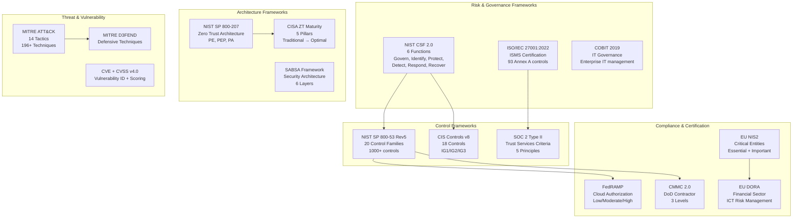
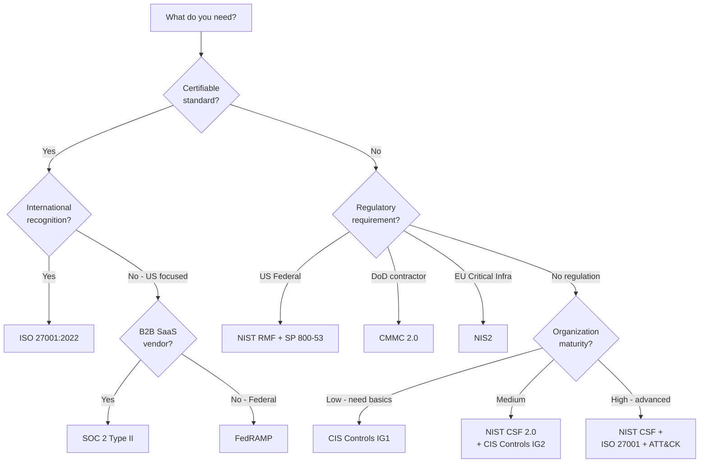
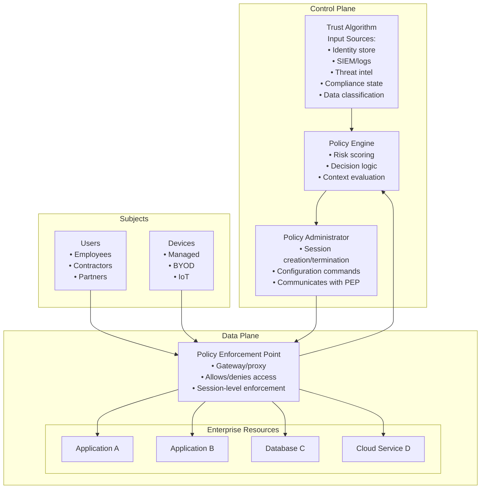

# Enterprise Cybersecurity Standards Landscape

**Topic:** Comprehensive overview of enterprise cybersecurity frameworks, standards, and regulatory compliance landscape  
**Standards:** NIST CSF 2.0, NIST SP 800-53 Rev5, ISO/IEC 27001:2022, CIS Controls v8, Zero Trust Architecture, MITRE ATT&CK, SOC 2, FedRAMP, CMMC 2.0, EU NIS2, DORA, CRA  
**SDO:** NIST, ISO/IEC, CIS (Center for Internet Security), MITRE, AICPA, European Commission, CISA  
**Audience:** CISOs, security architects, GRC professionals, penetration testers, SOC analysts, compliance managers  
**Prerequisites:** Basic IT networking, operating systems concepts, risk management fundamentals

---

## Chapter 1 — Historical Context & Origin Story

### 1.1 Timeline of Enterprise Cybersecurity Standards

| Year | Event | Impact |
|------|-------|--------|
| 1996 | HIPAA enacted | First US healthcare data security requirements |
| 1999 | ISO/IEC 17799 published | First international code of practice for information security |
| 2001 | SANS Top 20 (predecessor to CIS Controls) | Prioritized actionable security controls |
| 2002 | Sarbanes-Oxley Act (SOX) | IT controls for financial reporting |
| 2003 | ISF Standard of Good Practice | Enterprise-scale security best practices |
| 2004 | PCI DSS v1.0 released | Payment card industry security standard |
| 2005 | ISO/IEC 27001:2005 first edition | Formal ISMS certification standard |
| 2006 | NIST SP 800-53 Rev1 | Federal information system security controls |
| 2009 | NIST SP 800-53 Rev3 | Expanded control catalog |
| 2013 | Executive Order 13636 (Obama) | Led directly to NIST CSF creation |
| 2013 | ISO/IEC 27001:2013 | Major revision; Annex SL management structure |
| 2013 | Target breach (40M cards) | Drove vendor risk management focus |
| 2014 | NIST CSF 1.0 published (February) | Voluntary framework for critical infrastructure |
| 2015 | OPM breach (21.5M records) | Federal ZTA urgency; continuous monitoring |
| 2017 | NotPetya / WannaCry | Global ransomware; patching and segmentation focus |
| 2017 | Equifax breach (147M records) | Vulnerability management failures; CVSS prioritization |
| 2018 | NIST CSF 1.1 | Supply chain risk management added |
| 2020 | SolarWinds supply chain attack | ZTA mandate; SBOM requirements; supply chain integrity |
| 2020 | NIST SP 800-207 (Zero Trust Architecture) | Formal ZTA definition and components |
| 2021 | Executive Order 14028 (Biden) | ZTA mandate for US federal agencies; SBOM; MFA |
| 2021 | Log4Shell (CVE-2021-44228) | SBOM urgency; open-source risk; CVSS limitations → EPSS |
| 2021 | Colonial Pipeline ransomware | Critical infrastructure cybersecurity urgency |
| 2022 | NIST SP 800-53 Rev5 final | Privacy controls integrated; supply chain controls |
| 2022 | ISO/IEC 27001:2022 | 93 controls (down from 114); 11 new controls |
| 2022 | EU NIS2 Directive adopted | Expanded scope for critical entity cybersecurity |
| 2022 | EU DORA adopted | Financial sector operational resilience |
| 2023 | EU Cyber Resilience Act (CRA) | Product security + SBOM for CE-marked products |
| 2023 | SEC Cybersecurity Disclosure Rules | 4-day material incident disclosure for public companies |
| 2024 | NIST CSF 2.0 (February) | GOVERN function added; expanded scope beyond critical infrastructure |
| 2024 | CMMC 2.0 Final Rule | Defense contractor cybersecurity certification |
| 2024 | CVSS v4.0 adopted | Improved vulnerability scoring (context, threat metrics) |

### 1.2 Breach-Driven Regulation Pattern

| Incident | Gap Exposed | Regulatory Response |
|----------|-------------|-------------------|
| Target (2013) | Third-party vendor access control | PCI DSS enhanced vendor requirements; supply chain controls |
| OPM (2015) | Weak authentication; insider threat | EO 14028 MFA mandate; continuous monitoring |
| SolarWinds (2020) | Supply chain integrity; build system compromise | SBOM requirements; software supply chain standards (SLSA, SSDF) |
| Colonial Pipeline (2021) | OT/IT convergence; weak VPN auth | TSA cybersecurity directives for pipelines; NIS2 |
| Log4Shell (2021) | Open-source dependency risk; SBOM gaps | EO mandate SBOM; CRA SBOM requirement for EU market |
| MOVEit (2023) | Zero-day in managed file transfer | Increased pressure on vulnerability disclosure timelines |

---

## Chapter 2 — Standard Architecture & Structure

### 2.1 Enterprise Cybersecurity Framework Ecosystem



### 2.2 Framework Scope and Relationship Matrix

| Framework | Type | Mandatory? | Scope | Certification? |
|-----------|------|-----------|-------|---------------|
| NIST CSF 2.0 | Risk framework | US Federal: Yes; Others: Voluntary | All organizations (any sector/size) | No (self-assessment) |
| NIST SP 800-53 | Control catalog | US Federal: Yes (via FISMA/RMF) | Federal information systems | Via FedRAMP/ATO |
| ISO 27001:2022 | ISMS standard | Voluntary (contractual requirement common) | Any organization globally | **Yes** (accredited certification) |
| CIS Controls v8 | Prioritized controls | Voluntary | Any organization (IG1-IG3 by maturity) | CIS SecureSuite membership |
| SOC 2 Type II | Audit standard | Contractual (SaaS vendors) | Service organizations | **Yes** (auditor attestation) |
| Zero Trust (800-207) | Architecture model | US Federal: Yes (EO 14028) | Network/application architecture | No (implementation) |
| MITRE ATT&CK | Threat taxonomy | Voluntary | Threat intelligence & detection engineering | No |
| FedRAMP | Cloud authorization | US Federal cloud: Mandatory | Cloud service providers to US govt | **Yes** (P-ATO/ATO) |
| CMMC 2.0 | Maturity certification | DoD contractors: Mandatory | Defense Industrial Base (DIB) | **Yes** (C3PAO assessment) |
| EU NIS2 | Regulation | **Mandatory** (EU essential/important entities) | Critical infrastructure in EU | Compliance (not certification) |
| EU DORA | Regulation | **Mandatory** (EU financial entities) | Financial services in EU | Compliance (not certification) |
| EU CRA | Regulation | **Mandatory** (CE-marked digital products) | Manufacturers selling in EU | Conformity assessment |

### 2.3 NIST CSF 2.0 — Six Functions Overview

| Function | Code | Purpose | Key Categories |
|----------|------|---------|---------------|
| **GOVERN** (new in 2.0) | GV | Cybersecurity risk governance; organizational context | GV.OC, GV.RM, GV.RR, GV.PO, GV.OV, GV.SC |
| **IDENTIFY** | ID | Asset management; risk assessment; improvement | ID.AM, ID.RA, ID.IM |
| **PROTECT** | PR | Safeguards for critical services | PR.AA, PR.AT, PR.DS, PR.PS, PR.IR |
| **DETECT** | DE | Timely anomaly/event detection | DE.CM, DE.AE |
| **RESPOND** | RS | Actions when incident detected | RS.MA, RS.AN, RS.CO, RS.MI |
| **RECOVER** | RC | Restore services after incident | RC.RP, RC.CO |

---

## Chapter 3 — Technical Deep Dive

### 3.1 Control Framework Density Comparison

| Framework | Total Controls/Subcategories | Families/Domains | Implementation Effort |
|-----------|------------------------------|-----------------|----------------------|
| NIST SP 800-53 Rev5 | ~1,189 controls (base + enhancements) | 20 families | Very High (federal-grade) |
| ISO 27001:2022 Annex A | 93 controls | 4 themes | High (certification) |
| CIS Controls v8 | 153 safeguards (across 18 controls) | 18 controls | Medium (prioritized) |
| CIS IG1 (essential) | 56 safeguards | 18 controls (subset) | Low-Medium (baseline) |
| SOC 2 TSC | ~60+ criteria (CC + supplemental) | 5 Trust Principles | Medium |
| NIST CSF 2.0 | ~106 subcategories | 6 functions, 22 categories | Framework only (not prescriptive) |
| CMMC Level 2 | 110 practices (= NIST 800-171 Rev2) | 14 domains | Medium-High |
| PCI DSS v4.0 | 260+ requirements | 12 requirements (6 goals) | High (payment-focused) |

### 3.2 NIST SP 800-53 Rev5 — 20 Control Families

| ID | Family | Controls | Examples |
|----|--------|----------|---------|
| AC | Access Control | 25 base | AC-1 Policy, AC-2 Account Mgmt, AC-17 Remote Access |
| AT | Awareness & Training | 6 base | AT-2 Literacy Training, AT-3 Role-Based Training |
| AU | Audit & Accountability | 16 base | AU-2 Event Logging, AU-6 Audit Review |
| CA | Assessment, Authorization, Monitoring | 9 base | CA-2 Control Assessments, CA-6 Authorization |
| CM | Configuration Management | 14 base | CM-2 Baseline, CM-6 Config Settings, CM-8 Inventory |
| CP | Contingency Planning | 13 base | CP-2 Plan, CP-9 Backup, CP-10 Recovery |
| IA | Identification & Authentication | 12 base | IA-2 MFA, IA-5 Authenticator Management |
| IR | Incident Response | 10 base | IR-4 Handling, IR-6 Reporting, IR-8 Plan |
| MA | Maintenance | 7 base | MA-2 Controlled Maintenance, MA-4 Remote Maintenance |
| MP | Media Protection | 8 base | MP-2 Access, MP-6 Sanitization |
| PE | Physical & Environmental | 23 base | PE-2 Physical Access, PE-6 Monitoring |
| PL | Planning | 11 base | PL-2 System Security Plan |
| PM | Program Management | 32 base | PM-9 Risk Management Strategy |
| PS | Personnel Security | 9 base | PS-3 Screening, PS-4 Termination |
| RA | Risk Assessment | 10 base | RA-3 Assessment, RA-5 Vulnerability Scanning |
| SA | System & Services Acquisition | 23 base | SA-4 Acquisition, SA-11 Dev Testing |
| SC | System & Communications Protection | 51 base | SC-7 Boundary Protection, SC-8 Confidentiality |
| SI | System & Information Integrity | 23 base | SI-2 Flaw Remediation, SI-4 Monitoring |
| SR | Supply Chain Risk Management | 12 base | SR-2 Plan, SR-4 Provenance |
| PT | PII Processing & Transparency | 8 base | PT-2 Authority, PT-3 Purposes |

### 3.3 ISO 27001:2022 Annex A — 93 Controls in 4 Themes

| Theme | Controls | Key New Controls (2022) |
|-------|----------|----------------------|
| Organizational (A.5) | 37 controls | A.5.7 Threat intelligence, A.5.23 Cloud security, A.5.30 ICT readiness for continuity |
| People (A.6) | 8 controls | — (restructured, not new) |
| Physical (A.7) | 14 controls | A.7.4 Physical security monitoring |
| Technological (A.8) | 34 controls | A.8.9 Configuration management, A.8.10 Information deletion, A.8.11 Data masking, A.8.12 Data leakage prevention, A.8.16 Monitoring activities, A.8.22 Web filtering, A.8.23 Multi-tenant environments, A.8.28 Secure coding |

### 3.4 CIS Controls v8 — Implementation Groups

| IG | Target Organization | Controls | Safeguards |
|----|--------------------| ---------|-----------|
| IG1 | Small/medium; limited IT staff; essential hygiene | All 18 | 56 safeguards |
| IG2 | Mid-size; dedicated IT security staff; sensitive data | All 18 | 74 additional (130 total) |
| IG3 | Large enterprise; advanced threats; regulatory | All 18 | 23 additional (153 total) |

---

## Chapter 4 — Implementation Guide

### 4.1 Enterprise Cybersecurity Program Build Sequence

```mermaid
graph TB
    subgraph "Phase 1: Foundation (Months 1-3)"
        P1A[Asset Inventory<br/>• Hardware/software inventory<br/>• Data classification<br/>• Network mapping<br/>• CIS Control 1, 2]
        P1B[Governance Structure<br/>• CISO reporting structure<br/>• Risk management framework<br/>• Security policies<br/>• CSF GOVERN function]
        P1C[Baseline Security<br/>• MFA deployment<br/>• Endpoint protection<br/>• Patch management<br/>• CIS IG1 safeguards]
    end
    
    subgraph "Phase 2: Core Controls (Months 3-9)"
        P2A[Access Control<br/>• IAM platform<br/>• Privileged access management<br/>• RBAC/ABAC implementation<br/>• Zero Trust pilot]
        P2B[Detection & Monitoring<br/>• SIEM deployment<br/>• Log aggregation<br/>• EDR on endpoints<br/>• Network monitoring]
        P2C[Vulnerability Management<br/>• Scanning program<br/>• Prioritization (CVSS + EPSS)<br/>• Remediation SLAs<br/>• Penetration testing]
    end
    
    subgraph "Phase 3: Maturity (Months 9-18)"
        P3A[Incident Response<br/>• IR plan documented<br/>• Tabletop exercises<br/>• Playbooks (per MITRE ATT&CK)<br/>• Retainer with IR firm]
        P3B[Supply Chain Security<br/>• Vendor risk assessments<br/>• SBOM for critical software<br/>• Third-party monitoring<br/>• CSF GV.SC implementation]
        P3C[Compliance & Certification<br/>• ISO 27001 certification<br/>• SOC 2 Type II audit<br/>• FedRAMP (if federal)<br/>• CMMC (if DoD)]
    end
    
    subgraph "Phase 4: Advanced (Months 18+)"
        P4A[Zero Trust Maturity<br/>• Microsegmentation<br/>• Continuous verification<br/>• Data-centric security<br/>• CISA Optimal level]
        P4B[Threat Intelligence<br/>• CTI program<br/>• STIX/TAXII feeds<br/>• ATT&CK-based detection<br/>• Threat hunting]
        P4C[Continuous Improvement<br/>• Purple team exercises<br/>• Breach simulation<br/>• Metrics & reporting<br/>• CSF Tier 4 Adaptive]
    end
    
    P1A --> P2A
    P1B --> P2B
    P1C --> P2C
    P2A --> P3A
    P2B --> P3B
    P2C --> P3C
    P3A --> P4A
    P3B --> P4B
    P3C --> P4C
```

### 4.2 Framework Selection Guide

| Scenario | Primary Framework | Supporting Frameworks | Why |
|----------|------------------|----------------------|-----|
| US Federal agency | NIST SP 800-53 + RMF | NIST CSF, CISA ZT | FISMA mandate; RMF authorization process |
| DoD contractor | CMMC 2.0 Level 2 | NIST SP 800-171, CSF | Contract requirement; protects CUI |
| SaaS vendor (B2B) | SOC 2 Type II | CIS Controls, ISO 27001 | Customer requirement for vendor trust |
| Global enterprise | ISO 27001:2022 | NIST CSF, CIS Controls | International recognition; certification |
| SMB (basic security) | CIS Controls IG1 | NIST CSF (informational) | Actionable; prioritized; achievable with limited resources |
| Healthcare (US) | HIPAA Security Rule | HITRUST CSF, NIST CSF | Legal requirement; HITRUST for certification |
| Financial services (US) | FFIEC + SOX | NIST CSF, CIS Controls | Regulatory examination; SOX audit |
| Financial services (EU) | DORA | ISO 27001, NIS2, EBA Guidelines | Mandatory Jan 2025; ICT resilience |
| Critical infrastructure (EU) | NIS2 | ISO 27001, IEC 62443, NIST CSF | Mandatory Oct 2024 (member state transposition) |
| Cloud service provider | FedRAMP (+ ISO 27001 + SOC 2) | CIS Benchmarks, CCM | Multi-compliance for diverse customers |

### 4.3 Typical Enterprise Security Stack

| Layer | Tools/Products | Related Controls |
|-------|---------------|-----------------|
| Identity & Access | Okta, Azure AD (Entra ID), CyberArk, Sailpoint | AC, IA families; CIS 5, 6 |
| Endpoint | CrowdStrike, SentinelOne, Microsoft Defender for Endpoint | SI-3, SI-4; CIS 10 |
| Network | Palo Alto NGFW, Zscaler (SASE), Illumio (microsegmentation) | SC-7; CIS 13 |
| SIEM/SOAR | Splunk, Microsoft Sentinel, Google Chronicle, Palo Alto XSOAR | AU, SI-4; CIS 8 |
| Vulnerability Mgmt | Tenable, Qualys, Rapid7 InsightVM | RA-5; CIS 7 |
| GRC Platform | ServiceNow GRC, Archer, Drata, Vanta | CA, PL, PM families |
| Email Security | Proofpoint, Mimecast, Microsoft Defender for Office | SC-7, SI-8; CIS 9 |
| Cloud Security | Wiz, Orca, Prisma Cloud (CSPM/CWPP) | SA, CM for cloud; CIS 3 |
| Data Protection | Varonis, Symantec DLP, Microsoft Purview | MP, SC-28; CIS 3 |
| Threat Intel | Recorded Future, Mandiant, Anomali | RA-3, PM-16; CIS 13 |

---

## Chapter 5 — Certification & Audit

### 5.1 Major Certification Paths

| Certification | Assessor | Timeline | Cost (typical) | Validity |
|---------------|----------|----------|---------------|----------|
| ISO 27001:2022 | Accredited CB (BSI, Schellman, A-LIGN, etc.) | 6-12 months to certify | $30K-$150K (audit) + implementation costs | 3-year cycle (annual surveillance) |
| SOC 2 Type II | Licensed CPA firm | 6-12 month observation period + 4-8 weeks audit | $50K-$200K per audit | Annual (12-month report) |
| FedRAMP (Moderate) | 3PAO (Third-Party Assessment Org) | 12-18 months typical | $500K-$2M+ (assessment + remediation) | Continuous monitoring (ATO) |
| CMMC Level 2 | C3PAO (Certified Third-Party Assessor) | 3-6 months assessment | $50K-$200K assessment | 3-year (with annual affirmation) |
| PCI DSS v4.0 (Level 1) | QSA (Qualified Security Assessor) | 6-12 months | $100K-$400K | Annual |
| HITRUST r2 | HITRUST Authorized Assessor | 6-12 months | $50K-$200K | 2-year (with interim assessment) |

### 5.2 Audit Evidence Requirements

| Control Area | Evidence Required | Common Gaps |
|-------------|------------------|-------------|
| Access Control | User access reviews; MFA logs; privileged access records; terminated user evidence | Stale accounts; shared credentials; no periodic review |
| Change Management | Change tickets; CAB approvals; test evidence; rollback procedures | Emergency changes not documented; no separation of duties |
| Vulnerability Management | Scan reports; remediation timelines; exception approvals | Missing SLA compliance; no risk-based prioritization |
| Incident Response | IR plan (tested); tabletop exercise records; incident tickets; lessons learned | Plan not tested; no defined severity levels; no comms plan |
| Logging & Monitoring | Log retention proof; SIEM alerts; review evidence; NTP sync | Incomplete log sources; no correlation rules; gaps in coverage |
| Business Continuity | BCP/DRP documents; test results; RTO/RPO evidence; backup verification | Plans not tested; backup restoration not verified |
| Third-Party Risk | Vendor inventory; risk assessments; contract security clauses; SOC 2 reviews | Incomplete vendor inventory; no ongoing monitoring |
| Encryption | Encryption standards; key management procedures; TLS configs; at-rest evidence | Weak algorithms; expired certificates; poor key rotation |

---

## Chapter 6 — Regional & Domain Variants

### 6.1 Regional Cybersecurity Regulatory Landscape

| Region | Key Regulations | Enforcement Body | Penalties |
|--------|----------------|-----------------|-----------|
| **US (Federal)** | FISMA, EO 14028, CISA directives | CISA, OMB, Inspector Generals | Budget impacts; GAO findings; contract loss |
| **US (Defense)** | CMMC 2.0, DFARS 252.204-7012 | DoD, DCMA | Contract ineligibility; False Claims Act liability |
| **US (Healthcare)** | HIPAA Security Rule | HHS OCR | Up to $1.5M per violation category per year |
| **US (Financial)** | GLBA, SOX, FFIEC, OCC | SEC, FDIC, OCC, state regulators | Consent orders; fines; criminal liability |
| **US (SEC registered)** | SEC Cyber Disclosure Rules (2023) | SEC | 4-day disclosure; material misstatement penalties |
| **EU (general)** | NIS2 Directive (2022/2555) | Member state authorities | Up to €10M or 2% of global revenue (essential entities) |
| **EU (financial)** | DORA (2022/2554) | EBA, EIOPA, ESMA | Significant fines; operational restrictions |
| **EU (products)** | CRA (Cyber Resilience Act) | Market surveillance authorities | Up to €15M or 2.5% of global revenue |
| **UK** | NIS Regulations 2018 (+ updates), UK GDPR | ICO, NCSC, sector regulators | Up to £17M (NIS); ICO fines for data breaches |
| **Australia** | SOCI Act 2018 (amended 2022), Essential Eight | ASD (ACSC), sector regulators | Directions power; penalties up to AUD$50K/day |
| **Singapore** | Cybersecurity Act 2018, MAS TRM Guidelines | CSA Singapore, MAS | Fines up to SGD$100K; directions |
| **India** | IT Act 2000 (amended), CERT-In directives (2022) | CERT-In, MeitY | 6-hour incident reporting; penalties for non-compliance |
| **Japan** | Cybersecurity Basic Act, FISC Guidelines | NISC, FSA, sector-specific | Administrative guidance; business improvement orders |
| **China** | CSL (2017), DSL (2021), PIPL (2021), MLPS 2.0 | CAC, MPS, MIIT | Up to 5% of revenue; personal criminal liability |

### 6.2 Sector-Specific Overlays

| Sector | Primary Framework | Additional Requirements |
|--------|------------------|----------------------|
| Financial Services | PCI DSS, SOX, GLBA, DORA | Transaction monitoring; fraud detection; operational resilience |
| Healthcare | HIPAA, HITRUST, NHS DSPT (UK) | PHI protection; medical device security; interoperability |
| Energy/Utilities | NERC CIP, IEC 62443, NIS2 | OT/ICS security; grid reliability; SCADA protection |
| Telecommunications | NIS2, FCC/CISA, 3GPP security | Network integrity; lawful intercept; subscriber privacy |
| Defense/Government | NIST RMF, CMMC, secret-level requirements | Classified handling; supply chain; ITAR/EAR compliance |
| Cloud/SaaS | FedRAMP, SOC 2, CSA STAR, ISO 27017 | Tenant isolation; shared responsibility; data residency |
| Automotive | ISO/SAE 21434, WP.29 R155/R156 | Vehicle cybersecurity; OTA security; V-SOC |
| Manufacturing | IEC 62443, NIS2, NIST CSF | OT/IT convergence; supply chain; IP protection |

---

## Chapter 7 — Comparison with Competing Standards

### 7.1 Master Comparison Matrix

| Dimension | NIST CSF 2.0 | ISO 27001:2022 | CIS Controls v8 | SOC 2 | NIST 800-53 |
|-----------|-------------|----------------|-----------------|-------|-------------|
| Purpose | Risk communication framework | Certifiable ISMS | Prioritized actionable controls | Service org assurance | Comprehensive control catalog |
| Prescriptiveness | Low (outcomes) | Medium (shall statements) | High (specific actions) | Medium (criteria) | Very High (detailed controls) |
| Scalability | Any size | Any size (scoping) | IG1/IG2/IG3 by maturity | Service organizations | Large/federal |
| International use | Growing (US-origin, global adoption) | **Global** (most recognized) | Primarily US/anglophone | Primarily US/global SaaS | US Federal (growing international) |
| Cost to implement | Low (framework is free) | Medium-High ($50K-$500K for cert) | Low-Medium | Medium ($50K-$200K/year audit) | Very High (federal systems) |
| Certification available | No | **Yes** (accredited CB) | No (membership) | **Yes** (CPA attestation) | Via FedRAMP ATO |
| Maps to others | Yes (all major frameworks) | Yes (Annex A maps to 800-53, CIS) | Yes (maps to CSF, 800-53, ISO) | Yes (maps to ISO, CSF) | Yes (CSF, CIS, ISO mappings) |
| Update frequency | ~5-7 years | ~9 years | ~3-4 years | Annual (TSC updates) | ~3-5 years (SPs) |
| Audit/assessment type | Self-assessment; profiles | Formal 3rd-party audit (Stage 1+2) | Self-assessment; CSAT | Type I (point-in-time) / Type II (period) | 3PAO assessment (FedRAMP) |

### 7.2 When to Use Which Framework



---

## Chapter 8 — Mermaid Architecture Diagrams

### 8.1 Zero Trust Architecture Components



### 8.2 Defense-in-Depth Architecture

```mermaid
graph TB
    subgraph "Layer 7: Data Security"
        DATA[Data Classification<br/>DLP, Encryption at Rest<br/>Rights Management, Masking]
    end
    
    subgraph "Layer 6: Application Security"
        APP[WAF, RASP, SAST/DAST<br/>API Gateway, Input Validation<br/>Secure SDLC, Code Signing]
    end
    
    subgraph "Layer 5: Host/Endpoint Security"
        HOST[EDR/XDR, Anti-malware<br/>Host Firewall, Hardening (CIS)<br/>Patch Management, HIPS]
    end
    
    subgraph "Layer 4: Network Security"
        NET[NGFW, IDS/IPS<br/>Microsegmentation, NDR<br/>DNS Security, NAC]
    end
    
    subgraph "Layer 3: Perimeter/Edge"
        PERI[SASE/SSE, VPN, Proxy<br/>DDoS Protection, Email Gateway<br/>Zero Trust Network Access]
    end
    
    subgraph "Layer 2: Identity & Access"
        IAM[MFA, SSO, PAM<br/>RBAC/ABAC, JIT Access<br/>Identity Governance]
    end
    
    subgraph "Layer 1: Physical & Environmental"
        PHYS[Data Center Access<br/>Cameras, Guards<br/>Environmental Controls]
    end
    
    subgraph "Cross-Cutting"
        CROSS[Security Operations (SOC)<br/>SIEM/SOAR, Threat Intel<br/>Incident Response, GRC]
    end
    
    DATA --> APP --> HOST --> NET --> PERI --> IAM --> PHYS
    CROSS -.-> DATA
    CROSS -.-> APP
    CROSS -.-> HOST
    CROSS -.-> NET
```

---

## Chapter 9 — Case Studies & Failure Analysis

### 9.1 SolarWinds Supply Chain Attack (2020)

| Aspect | Detail |
|--------|--------|
| Attack vector | Compromise of SolarWinds Orion build system; malicious code injected into legitimate software update |
| Threat actor | APT29 (Cozy Bear / Russian SVR) |
| Impact | ~18,000 organizations installed trojanized update; ~100 confirmed compromised (US Treasury, DHS, FireEye, Microsoft) |
| Dwell time | 14 months (March 2020 → December 2020 detection by FireEye) |
| Detection method | FireEye detected anomalous MFA enrollment for employee → investigated → found SUNBURST backdoor |
| Framework gaps exposed | (1) Software supply chain integrity not verified (no SBOM, no build attestation). (2) Code signing was of the malicious binary (signed = trusted, but supply chain was compromised). (3) Network monitoring missed low-and-slow C2 (mimicked legitimate Orion traffic). (4) Trust-based network (flat networks; Orion had broad access). (5) No zero trust enforcement (Orion management platform inherently trusted). |
| Regulatory response | EO 14028: ZTA mandate, SBOM requirements, SSDF (Secure Software Development Framework), enhanced logging requirements for federal systems |
| MITRE ATT&CK TTPs | T1195.002 (Supply Chain Compromise: Software Supply Chain), T1078 (Valid Accounts), T1071.001 (Web Protocols for C2), T1114.002 (Email Collection) |
| Lesson | **Trust in software updates is a single point of failure. Build system integrity, SBOM, reproducible builds, and zero trust enforcement are essential.** |

### 9.2 Colonial Pipeline Ransomware (2021)

| Aspect | Detail |
|--------|--------|
| Attack vector | Compromised VPN credential (legacy account, no MFA) → DarkSide ransomware deployed |
| Impact | 5,500-mile pipeline shut down for 6 days; fuel shortage across US East Coast; $4.4M ransom paid |
| Root cause | (1) Legacy VPN account with password reuse (found in dark web dump). (2) No MFA on VPN. (3) Flat network — IT compromise required OT shutdown (could not confirm OT integrity). |
| CIS Controls mapping | CIS 1 (inventory failed — legacy account existed), CIS 4 (no hardening of VPN), CIS 5 (no MFA), CIS 6 (no access management for legacy accounts), CIS 13 (no monitoring on VPN access) |
| Framework gaps | CSF PR.AC (access control): No MFA. CSF ID.AM (asset management): Unknown legacy account. CSF DE.CM (monitoring): No anomaly detection on VPN. |
| Regulatory response | TSA Security Directives for pipelines; CISA cybersecurity performance goals; Critical infrastructure ZTA push |
| Lesson | **A single credential without MFA led to national critical infrastructure disruption. Basic cyber hygiene (MFA, account inventory, network segmentation) prevents catastrophic outcomes.** |

---

## Chapter 10 — Future Evolution & Industry Trends

| Trend | Timeline | Impact |
|-------|----------|--------|
| AI-powered security operations (AI SOC) | 2024-2027 | Autonomous triage, investigation, response; reduced analyst burden; new attack surfaces from AI |
| AI-specific security frameworks | 2024-2026 | NIST AI RMF; OWASP Top 10 for LLMs; EU AI Act + CRA intersection |
| Post-quantum cryptography migration | 2024-2035 | NIST PQC standards (ML-KEM, ML-DSA); crypto-agility requirements; "harvest now, decrypt later" threat |
| Continuous compliance (compliance-as-code) | Now-2025 | Automated evidence collection; real-time compliance posture; GRC automation (Drata, Vanta, Secureframe) |
| Identity-first security (replacing network perimeter) | Now | CISA ZT Maturity Model → identity pillar most mature; passwordless (FIDO2); decentralized identity |
| SBOM and software supply chain | 2024-2027 | CRA mandatory SBOM; NTIA minimum elements; VEX (Vulnerability Exploitability eXchange) |
| Platformization (consolidation) | 2024-2026 | Palo Alto, CrowdStrike, Microsoft consolidating XDR+SIEM+SOAR; fewer point products |
| Exposure management (beyond vuln scanning) | Now | Attack surface management (ASM); breach and attack simulation (BAS); continuous threat exposure |
| OT/IT convergence security | Now-2027 | Unified SOC for IT+OT; NIS2 driving OT visibility; Purdue model evolving |
| Cyber insurance hardening | Now | Insurers requiring MFA, EDR, backup verification, IR retainer as minimum for coverage |
| SEC/board-level governance | 2024+ | Board cyber expertise requirements; material incident 4-day disclosure; CISO liability discussions |
| International harmonization | 2025-2030 | IEC 27001 + NIST CSF mappings; mutual recognition for certifications; reducing audit fatigue |

---

## Chapter 11 — Interview Questions & Career Guide

### Tier 1: Entry-Level (Analyst / Junior Engineer)

**Q1:** Explain the NIST Cybersecurity Framework 2.0 functions and how they relate to each other.  
**A:** NIST CSF 2.0 has six functions: GOVERN (new in 2.0), IDENTIFY, PROTECT, DETECT, RESPOND, RECOVER. GOVERN provides the overarching risk governance context — organizational risk strategy, policies, roles, supply chain oversight. IDENTIFY determines the assets, business environment, and risks that need managing. PROTECT implements safeguards (access control, training, data security). DETECT enables timely discovery of cybersecurity events (monitoring, anomaly detection). RESPOND defines actions when an incident is detected (analysis, mitigation, communication). RECOVER restores services after an incident. The functions form a lifecycle: governance sets direction, identification scopes the problem, protection prevents incidents, detection finds what gets through, response limits damage, and recovery restores operations. The new GOVERN function wraps around all others — every function operates within the governance context.

**Q2:** What is the difference between SOC 2 Type I and Type II reports?  
**A:** **Type I** evaluates the design (suitability) of controls at a specific point in time. It answers: "Are appropriate controls in place?" It's a snapshot — the auditor reviews policies, configurations, and design but doesn't test operating effectiveness over time. **Type II** evaluates both design AND operating effectiveness over a period (typically 6-12 months). It answers: "Are controls working consistently over time?" The auditor tests that controls operated correctly throughout the observation period (sampling evidence, reviewing logs, interviewing staff). Type II is far more valuable to relying parties because it demonstrates sustained compliance, not just good intentions. Most customers require Type II; Type I is sometimes used as an interim report while building toward Type II.

### Tier 2: Mid-Level (Security Engineer / GRC Lead)

**Q3:** How would you map MITRE ATT&CK techniques to detection engineering using a SIEM? Provide a specific example.  
**A:** 
**Process:**
1. Select relevant ATT&CK techniques based on threat intelligence (which adversary groups target our sector? What TTPs do they use?)
2. For each technique, identify data sources required (ATT&CK documents this — e.g., T1059.001 PowerShell requires Process Creation + Command Line Logging + Script Block Logging)
3. Ensure those data sources are collected in the SIEM (enable appropriate logging)
4. Write detection rules correlating events to technique indicators
5. Test using atomic red team or manual simulation
6. Tune to reduce false positives
7. Document in detection catalog with ATT&CK ID

**Example: T1003.001 — OS Credential Dumping: LSASS Memory**

Data sources needed: Windows Security Event Log (Event ID 4656, 4663 — handle to lsass.exe), Sysmon Event ID 10 (ProcessAccess targeting lsass.exe), EDR telemetry (process accessing lsass memory).

SIEM detection rule (Splunk SPL example):
```
index=windows sourcetype=XmlWinEventLog:Microsoft-Windows-Sysmon/Operational EventCode=10
TargetImage="*\\lsass.exe" 
NOT SourceImage IN ("*\\csrss.exe", "*\\wininit.exe", "*\\wmiprvse.exe", "*\\svchost.exe")
| stats count by SourceImage, SourceProcessGUID, Computer
| where count > 0
```

ATT&CK mapping: Tactic = Credential Access (TA0006), Technique = T1003.001, Data Source = Process: Process Access, Platform = Windows.

### Tier 3: Senior/Principal (CISO / Security Architect)

**Q4:** Design a cybersecurity program for a mid-size SaaS company ($50M revenue, 500 employees, processing customer PII) to achieve SOC 2 Type II and ISO 27001 simultaneously within 18 months, while implementing Zero Trust. What is your strategy?  
**A:** [Full answer would address: (1) Unified control framework mapped to both SOC 2 TSC and ISO 27001 Annex A simultaneously (avoid doing work twice). (2) GRC platform selection for evidence reuse (Drata/Vanta for automated evidence collection mapped to both frameworks). (3) Gap assessment against combined control set (identify which SOC 2 + ISO 27001 controls overlap — ~70% overlap). (4) Zero Trust implementation roadmap aligned with control requirements (ZTA satisfies many AC/SC controls in both frameworks). (5) Phased approach: months 1-6 (CIS IG1 baseline + SOC 2 Type I readiness + ISO 27001 Stage 1 documentation); months 6-12 (SOC 2 observation period begins + ISO 27001 implementation + ZTA pilot); months 12-18 (SOC 2 Type II audit + ISO 27001 Stage 2 certification audit). (6) Budget allocation (~$500K-$1M total: GRC platform $30-60K/yr, ISO certification $50-100K, SOC 2 auditor $80-150K, security tooling $200-400K, FTE hiring 2-3 headcount). (7) Board reporting metrics: CSF profile maturity, time-to-detection, % controls operating effectively, audit findings trend.]

---

## Chapter 12 — Cheat Sheet & Quick Reference

### Framework Quick Selection

```
SMB, limited budget:           CIS Controls IG1 (56 safeguards; free)
Growing SaaS company:          SOC 2 Type II + CIS Controls IG2
Global enterprise:             ISO 27001:2022 (certifiable; international)
US Federal:                    NIST RMF + SP 800-53 + FedRAMP
DoD contractor:                CMMC 2.0 + NIST SP 800-171
Healthcare (US):               HIPAA + HITRUST CSF
Financial (EU):                DORA + ISO 27001
Critical infra (EU):           NIS2 + ISO 27001 + IEC 62443 (if OT)
```

### NIST CSF 2.0 Functions

```
GOVERN (GV):     Risk strategy, policies, roles, supply chain oversight
IDENTIFY (ID):   Assets, risks, business environment, improvement
PROTECT (PR):    Access control, awareness, data security, platform security
DETECT (DE):     Continuous monitoring, adverse event analysis
RESPOND (RS):    Incident management, analysis, mitigation, reporting
RECOVER (RC):    Recovery planning, communication, restoration
```

### ISO 27001:2022 Key Numbers

```
Annex A Controls:     93 total (was 114 in 2013)
Themes:               4 (Organizational-37, People-8, Physical-14, Technological-34)
New controls (2022):  11 (A.5.7 Threat Intel, A.5.23 Cloud, A.8.11 Masking, etc.)
Certification cycle:  3 years (Stage 1 + Stage 2 + 2 surveillance audits)
```

### CIS Controls v8 — The 18 Controls

```
 1. Inventory of Enterprise Assets       10. Malware Defenses
 2. Inventory of Software Assets         11. Data Recovery
 3. Data Protection                      12. Network Infrastructure Management
 4. Secure Configuration                 13. Network Monitoring & Defense
 5. Account Management                   14. Security Awareness Training
 6. Access Control Management            15. Service Provider Management
 7. Continuous Vulnerability Management  16. Application Software Security
 8. Audit Log Management                 17. Incident Response Management
 9. Email & Web Browser Protections      18. Penetration Testing
```

### Zero Trust Principles (NIST SP 800-207)

```
1. All data sources and computing services are RESOURCES
2. All communication is secured REGARDLESS of network location
3. Access is granted on a PER-SESSION basis
4. Access is determined by DYNAMIC POLICY (identity, device, behavior, context)
5. Organization monitors INTEGRITY and SECURITY of all owned assets
6. All authentication and authorization are DYNAMIC and STRICTLY ENFORCED
7. Organization collects information about CURRENT STATE and uses it to improve security
```

### MITRE ATT&CK — 14 Tactics (Enterprise)

```
TA0043 Reconnaissance        TA0001 Initial Access
TA0042 Resource Development  TA0002 Execution
TA0003 Persistence          TA0004 Privilege Escalation
TA0005 Defense Evasion       TA0006 Credential Access
TA0007 Discovery            TA0008 Lateral Movement
TA0009 Collection           TA0011 Command & Control
TA0010 Exfiltration         TA0040 Impact
```

---

*End of Document — 00_Enterprise_Cyber_Landscape.md*
