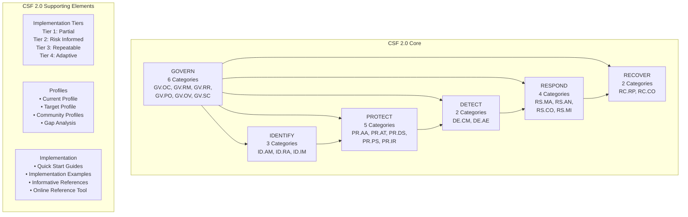
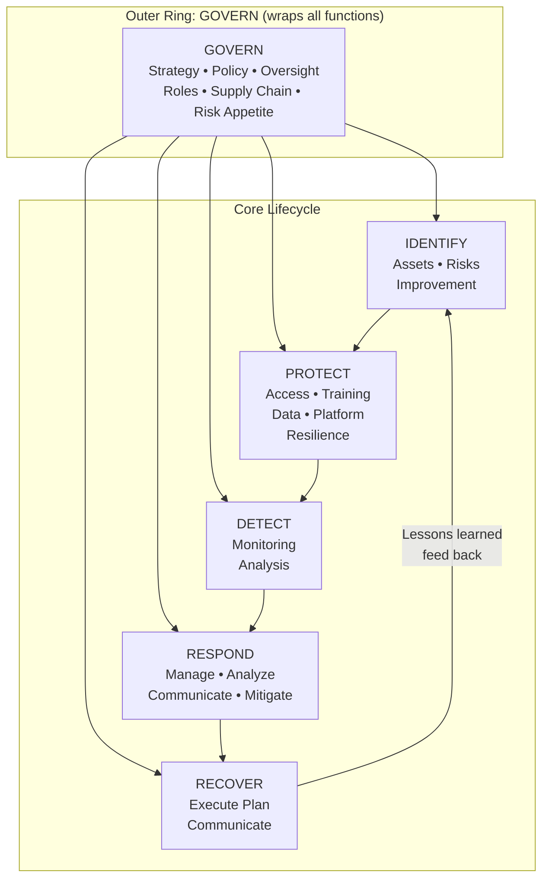

# NIST Cybersecurity Framework 2.0 (CSF 2.0)

**Topic:** NIST Cybersecurity Framework Version 2.0 — Comprehensive implementation guide for enterprise cybersecurity risk management  
**Standard:** NIST CSF 2.0 (February 2024)  
**SDO:** National Institute of Standards and Technology (NIST), U.S. Department of Commerce  
**Audience:** CISOs, cybersecurity program managers, risk managers, GRC professionals, security architects, auditors  
**Prerequisites:** Basic cybersecurity concepts, enterprise risk management fundamentals, familiarity with NIST CSF 1.1

---

## Chapter 1 — Historical Context & Origin Story

### 1.1 Evolution Timeline

| Year | Milestone | Key Change |
|------|-----------|-----------|
| 2013 | Executive Order 13636 | President Obama directs NIST to develop cybersecurity framework for critical infrastructure |
| 2014 | CSF 1.0 released (Feb 12, 2014) | 5 Functions, 22 Categories, 98 Subcategories; voluntary for critical infrastructure |
| 2014-2017 | Widespread adoption | Beyond critical infrastructure; financial, healthcare, manufacturing adopt voluntarily |
| 2017 | Executive Order 13800 | Federal agencies required to use NIST CSF for risk management |
| 2018 | CSF 1.1 released (April 16, 2018) | Supply chain risk management added; self-assessment guidance; updated authentication language |
| 2020 | SolarWinds attack | Exposed supply chain gaps; drove GOVERN function need |
| 2021 | Executive Order 14028 | Federal ZTA mandate; SBOM; incident reporting; CSF becomes de facto mandatory |
| 2022 | CSF 2.0 concept paper | NIST solicits public input on major revision |
| 2023 | CSF 2.0 draft (August) | Public comment period; 6th function (GOVERN) proposed |
| 2024 | **CSF 2.0 released (February 26, 2024)** | GOVERN function added; expanded beyond critical infrastructure; Tiers and Profiles enhanced; community profiles introduced |

### 1.2 Key Changes: CSF 1.1 → CSF 2.0

| Aspect | CSF 1.1 (2018) | CSF 2.0 (2024) |
|--------|----------------|----------------|
| Functions | 5 (ID, PR, DE, RS, RC) | **6 (GV, ID, PR, DE, RS, RC)** |
| GOVERN function | Not present (governance scattered) | **New standalone function** |
| Target audience | Critical infrastructure | **All organizations (any size/sector)** |
| Title | "Framework for Improving Critical Infrastructure Cybersecurity" | "The NIST Cybersecurity Framework (CSF) 2.0" |
| Profiles | Current/Target profiles (general guidance) | **Enhanced profiles + Community Profiles** |
| Tiers | 4 Tiers (maturity) | 4 Tiers (refined; governance integrated) |
| Supply chain | Category added in 1.1 (ID.SC) | **Elevated to GOVERN function (GV.SC)** |
| Implementation examples | Not included | **Online Implementation Examples** |
| Quick Start Guides | Not available | **Multiple Quick Start Guides provided** |
| References/mappings | Informative References (static) | **Online Reference Tool (dynamic, searchable)** |
| Categories | 23 Categories, 108 Subcategories | **22 Categories, 106 Subcategories** (restructured) |

---

## Chapter 2 — Standard Architecture & Structure

### 2.1 CSF 2.0 Component Model



### 2.2 CSF 2.0 Functions, Categories, and Selected Subcategories

| Function | Category | ID | Description | Example Subcategories |
|----------|----------|-----|-------------|----------------------|
| **GOVERN** | Organizational Context | GV.OC | Organizational mission, stakeholder expectations, legal/regulatory | GV.OC-01 through GV.OC-05 |
| | Risk Management Strategy | GV.RM | Risk appetite, tolerance, priorities | GV.RM-01 through GV.RM-07 |
| | Roles, Responsibilities, Authorities | GV.RR | Cybersecurity accountability | GV.RR-01 through GV.RR-04 |
| | Policy | GV.PO | Cybersecurity policies established/communicated | GV.PO-01, GV.PO-02 |
| | Oversight | GV.OV | Risk management strategy reviewed/adjusted | GV.OV-01 through GV.OV-03 |
| | Supply Chain Risk Management | GV.SC | Supply chain risks managed | GV.SC-01 through GV.SC-10 |
| **IDENTIFY** | Asset Management | ID.AM | Assets managed to enable risk decisions | ID.AM-01 through ID.AM-08 |
| | Risk Assessment | ID.RA | Asset vulnerabilities and threats understood | ID.RA-01 through ID.RA-10 |
| | Improvement | ID.IM | Lessons learned drive improvements | ID.IM-01 through ID.IM-04 |
| **PROTECT** | Identity Mgmt, Authentication, Access | PR.AA | Identities and credentials managed | PR.AA-01 through PR.AA-06 |
| | Awareness & Training | PR.AT | Staff trained on cybersecurity | PR.AT-01, PR.AT-02 |
| | Data Security | PR.DS | Data managed consistent with risk | PR.DS-01 through PR.DS-11 |
| | Platform Security | PR.PS | Hardware/software/services managed | PR.PS-01 through PR.PS-06 |
| | Technology Infrastructure Resilience | PR.IR | Security architectures managed | PR.IR-01 through PR.IR-04 |
| **DETECT** | Continuous Monitoring | DE.CM | Assets monitored for anomalies/indicators | DE.CM-01 through DE.CM-09 |
| | Adverse Event Analysis | DE.AE | Anomalies analyzed to characterize events | DE.AE-01 through DE.AE-08 |
| **RESPOND** | Incident Management | RS.MA | Incidents managed | RS.MA-01 through RS.MA-05 |
| | Incident Analysis | RS.AN | Investigations conducted | RS.AN-01 through RS.AN-08 |
| | Incident Response Reporting/Communication | RS.CO | Response coordinated with stakeholders | RS.CO-01 through RS.CO-03 |
| | Incident Mitigation | RS.MI | Incidents contained and mitigated | RS.MI-01, RS.MI-02 |
| **RECOVER** | Incident Recovery Plan Execution | RC.RP | Recovery plans executed | RC.RP-01 through RC.RP-06 |
| | Incident Recovery Communication | RC.CO | Restoration communicated to stakeholders | RC.CO-01 through RC.CO-04 |

### 2.3 Implementation Tiers

| Tier | Name | Characteristics |
|------|------|----------------|
| **Tier 1** | Partial | Ad hoc; reactive; limited awareness of cybersecurity risk; risk management not formalized; limited or no supply chain awareness |
| **Tier 2** | Risk Informed | Risk management approved by management but not org-wide policy; some awareness of ecosystem risk; processes exist but not consistently applied |
| **Tier 3** | Repeatable | Formal policies in place; consistently implemented; regular review; supply chain risk management practiced; information sharing with partners |
| **Tier 4** | Adaptive | Organization adapts to changing threat landscape; continuous improvement based on lessons learned and predictive indicators; real-time risk-adjusted decisions; active ecosystem engagement |

---

## Chapter 3 — Technical Deep Dive

### 3.1 GOVERN Function Deep Dive (New in CSF 2.0)

```mermaid
graph TB
    subgraph "GV.OC — Organizational Context"
        OC1[GV.OC-01: Organizational mission understood<br/>in cybersecurity context]
        OC2[GV.OC-02: Internal/external stakeholders<br/>determined and requirements understood]
        OC3[GV.OC-03: Legal, regulatory, contractual<br/>requirements understood]
        OC4[GV.OC-04: Critical objectives,<br/>capabilities, and services determined]
        OC5[GV.OC-05: Outcomes/priorities/tolerances<br/>for outcomes determined]
    end
    
    subgraph "GV.RM — Risk Management Strategy"
        RM1[GV.RM-01: Risk management objectives<br/>established and agreed upon]
        RM2[GV.RM-02: Risk appetite and tolerance<br/>statements established]
        RM3[GV.RM-03: Risk management activities<br/>and outcomes included in ERM]
        RM4[GV.RM-04: Strategic direction describes<br/>appropriate risk response options]
        RM5[GV.RM-05: Risk communication lines<br/>established (across org + leadership)]
        RM6[GV.RM-06: Standardized method for<br/>calculating/documenting/prioritizing risk]
        RM7[GV.RM-07: Strategic opportunities<br/>(positive risk) characterized]
    end
    
    subgraph "GV.SC — Supply Chain Risk Management"
        SC1[GV.SC-01: Cyber supply chain RM<br/>program established]
        SC2[GV.SC-02: Cybersecurity roles in<br/>supply chain established]
        SC3[GV.SC-03: Integrated into overall<br/>enterprise risk management]
        SC4[GV.SC-04: Suppliers known/prioritized<br/>by criticality]
        SC5[GV.SC-05: Requirements in contracts<br/>and agreements]
        SC6[GV.SC-06: Planning/due diligence for<br/>supplier relationships]
        SC7[GV.SC-07: Risks identified/assessed<br/>throughout supply chain]
        SC8[GV.SC-08: Suppliers assessed on risks]
        SC9[GV.SC-09: Supply chain security<br/>practices integrated into IR]
        SC10[GV.SC-10: Supply chain security<br/>included in security awareness]
    end
```

### 3.2 CSF 2.0 Profiles — Practical Application

| Profile Type | Purpose | Example |
|-------------|---------|---------|
| **Current Profile** | Documents current state of cybersecurity outcomes | "We currently implement 60/106 subcategories" |
| **Target Profile** | Documents desired future state (risk-informed goals) | "We want to achieve 85/106 within 18 months" |
| **Gap Analysis** | Difference between Current and Target → action plan | "25 subcategory gaps requiring implementation" |
| **Community Profile** | Sector/use-case specific adaptation (new in 2.0) | "Automotive Manufacturing Community Profile" |

**Community Profiles (new in 2.0):**
- Sector-specific profiles developed by industry groups
- Reflect common risks and priorities for specific industries
- Can serve as a starting point for organizational Target Profile
- Examples: Financial services, healthcare, manufacturing, education

### 3.3 CSF Tiers Assessment Criteria

| Dimension | Tier 1 (Partial) | Tier 2 (Risk Informed) | Tier 3 (Repeatable) | Tier 4 (Adaptive) |
|-----------|-----------------|----------------------|--------------------|--------------------|
| Risk Management Process | Ad hoc, case-by-case | Management-approved but informal | Formal policy, org-wide | Continuously improved; lessons learned integrated |
| Integrated Risk Program | Not integrated with ERM | Some coordination with enterprise | Fully integrated with ERM | Dynamic; adapts based on risk indicators |
| External Participation | No ecosystem awareness | Some awareness of ecosystem risk | Contributes to ecosystem intelligence | Actively shares threat intel; influences ecosystem |
| Governance | Informal/absent | Emerging governance | Defined roles and authorities | Board-level oversight; continuous adjustment |

---

## Chapter 4 — Implementation Guide

### 4.1 Seven Steps to CSF 2.0 Implementation

```mermaid
graph TB
    S1[Step 1: Scope the Organizational Profile<br/>• Determine which systems/units in scope<br/>• Identify stakeholder expectations<br/>• Map to GV.OC subcategories]
    
    S2[Step 2: Gather Information<br/>• Existing policies, procedures, standards<br/>• Current control implementations<br/>• Risk assessment results<br/>• Prior audit/assessment findings]
    
    S3[Step 3: Create Current Profile<br/>• Assess each subcategory (106 total)<br/>• Rate: Full/Partial/Not Implemented<br/>• Document evidence for each rating<br/>• Identify current Tier level]
    
    S4[Step 4: Conduct Risk Assessment<br/>• Threat landscape analysis<br/>• Vulnerability assessment<br/>• Impact analysis (if compromised)<br/>• Likelihood determination<br/>• Risk prioritization]
    
    S5[Step 5: Create Target Profile<br/>• Define desired state per subcategory<br/>• Informed by risk assessment results<br/>• Aligned with risk appetite (GV.RM-02)<br/>• Set target Tier level]
    
    S6[Step 6: Gap Analysis & Plan<br/>• Compare Current vs Target<br/>• Prioritize gaps by risk<br/>• Develop implementation roadmap<br/>• Assign resources, timelines, owners]
    
    S7[Step 7: Implement Action Plan<br/>• Execute roadmap<br/>• Monitor progress<br/>• Reassess periodically<br/>• Update profiles as maturity grows]
    
    S1 --> S2 --> S3 --> S4 --> S5 --> S6 --> S7
    S7 -->|"Continuous<br/>improvement"| S3
```

### 4.2 Mapping CSF 2.0 to Implementation Standards

| CSF Function | Implementing Controls | Tools/Standards |
|-------------|----------------------|-----------------|
| GOVERN | Board reporting; risk appetite; policy framework | ISO 31000, COBIT 2019, COSO ERM |
| IDENTIFY | Asset inventory; risk assessment; vulnerability management | CIS Controls 1-2; NIST SP 800-30; Tenable/Qualys |
| PROTECT | Access control; encryption; configuration hardening | NIST 800-53 AC/IA/SC; CIS Benchmarks; OWASP |
| DETECT | SIEM; EDR; NDR; threat hunting | MITRE ATT&CK; CIS Controls 8, 13; Splunk/Sentinel |
| RESPOND | IR plan; forensics; communication | NIST 800-61; MITRE ATT&CK; SOAR platforms |
| RECOVER | DR/BCP; backup; communication | NIST SP 800-34; ISO 22301; CIS Control 11 |

### 4.3 CSF 2.0 Self-Assessment Scoring Template

| Subcategory | Not Implemented (0) | Partially (1) | Largely (2) | Fully (3) | N/A | Evidence |
|-------------|--------------------|--------------|--------------|-----------|----|----------|
| GV.OC-01 | | | ☑ | | | Mission statement + security charter |
| GV.RM-02 | | ☑ | | | | Risk appetite draft (not board-approved) |
| ID.AM-01 | | | | ☑ | | CMDB + automated discovery |
| PR.AA-01 | | | ☑ | | | SSO deployed; PAM partial |
| DE.CM-01 | | ☑ | | | | SIEM covers 60% of assets |

---

## Chapter 5 — Certification & Audit

### 5.1 CSF 2.0 Assessment Types

| Assessment Type | Purpose | Who Performs | Output |
|----------------|---------|-------------|--------|
| Self-assessment | Internal gap analysis; roadmap development | Security team, GRC team | Internal profiles; gap analysis; action plan |
| Third-party assessment | Independent evaluation; customer assurance | Consulting firm (Deloitte, KPMG, etc.) | Assessment report; maturity rating |
| Regulator-led assessment | Compliance verification | CISA, sector-specific regulators, IG | Findings; recommendations; compliance status |
| Continuous monitoring | Ongoing posture tracking | GRC platform (automated) | Real-time dashboards; trend analysis |

### 5.2 CSF 2.0 and Other Certifications

| Certification | CSF 2.0 Relationship | Coverage |
|---------------|---------------------|----------|
| ISO 27001:2022 | CSF subcategories map to Annex A controls | ~85% overlap |
| SOC 2 Type II | TSC criteria map to CSF subcategories | ~70% overlap (security-focused) |
| FedRAMP | 800-53 controls (FedRAMP basis) map to CSF | Near-complete overlap (via 800-53) |
| CMMC 2.0 | 800-171 practices map to CSF | ~75% overlap |
| CIS Controls v8 | CIS safeguards map to CSF subcategories | ~80% overlap |
| PCI DSS v4.0 | Requirements map to CSF | ~65% overlap (payment-specific portions not in CSF) |
| HIPAA Security Rule | Safeguards map to CSF | ~75% overlap |

### 5.3 NIST CSF Informative References

| Reference Category | Examples |
|-------------------|----------|
| NIST Publications | SP 800-53, SP 800-171, SP 800-207, Privacy Framework |
| ISO/IEC Standards | 27001, 27002, 27005, 27017, 27701 |
| Industry Standards | CIS Controls v8, COBIT 2019, ISA/IEC 62443 |
| Regulatory | HIPAA, NERC CIP, PCI DSS, FERPA |
| Sector Profiles | Energy, Financial Services, Manufacturing, Water |

---

## Chapter 6 — Regional & Domain Variants

### 6.1 NIST CSF Adoption by Country

| Country/Region | Adoption Status | Notes |
|---------------|----------------|-------|
| **United States** | De facto standard (voluntary; mandatory for federal) | EO 13800 + EO 14028; most-used framework in US |
| **Italy** | National Cybersecurity Framework based on CSF | Italian adaptation since 2015 |
| **Japan** | METI Cybersecurity Management Guidelines reference CSF | NISC recommends CSF alignment |
| **Israel** | INCD references CSF in national cyber directives | Adapted for Israeli context |
| **Saudi Arabia** | NCA Essential Cybersecurity Controls aligned to CSF | Mandatory for government entities |
| **Australia** | ACSC Essential Eight + CSF used complementarily | Essential Eight for tactical; CSF for strategic |
| **EU** | NIS2 aligns with CSF concepts | Not directly mandated but compatible |
| **UK** | NCSC CAF uses similar 4-objectives structure | Compatible; different structure |
| **India** | CERT-In and sectoral regulators reference CSF | Growing adoption |
| **Canada** | CCCS references CSF for CI sectors | Voluntary but influential |

### 6.2 Sector-Specific CSF Profiles

| Sector | Profile Name | Key Adaptations |
|--------|-------------|-----------------|
| Financial Services | Financial Services Sector Cybersecurity Profile | Adds regulations: GLBA, SOX, FFIEC; emphasizes transaction integrity |
| Manufacturing | Manufacturing Profile | Adds OT/ICS considerations; plant floor assets; safety systems |
| Energy | Energy Sector CSF Profile | Adds NERC CIP, pipeline security; generation/transmission/distribution |
| Healthcare | HPH Sector CSF | Adds HIPAA mapping; medical device security; patient safety |
| Water/Wastewater | Water Sector CSF Profile | Adds SCADA; treatment system integrity; EPA regulations |
| Elections | EI-ISAC Elections Infrastructure Profile | Adds election-specific threats; voter data protection |
| Education | Higher Education CSF Profile | Adds FERPA; student data; research integrity |
| Transportation | Surface Transportation Profile | Adds TSA directives; safety systems; operational continuity |

---

## Chapter 7 — Comparison with Competing Standards

### 7.1 CSF 2.0 vs. Other Governance Frameworks

| Dimension | NIST CSF 2.0 | ISO 27001:2022 | COBIT 2019 | NIST RMF (800-37) |
|-----------|-------------|----------------|------------|-------------------|
| Focus | Cybersecurity risk outcomes | Information security management system | IT governance & management | Authorization-based risk management |
| Approach | Outcome-based (what to achieve) | Process-based (certifiable ISMS) | Governance-based (business objectives) | Process-based (7 steps to authorization) |
| Certification | No | Yes (accredited) | No (ISACA assessment) | ATO/P-ATO (authorization) |
| Prescriptiveness | Low (flexible) | Medium (shall statements) | Medium (practices) | High (procedural) |
| Size | 106 subcategories | 93 Annex A controls | 40 objectives | 1000+ controls (via 800-53) |
| Best for | Strategy, communication, gap analysis | Proving security to customers/regulators | IT-business alignment; board-level | Federal system authorization |
| Cost | Free | Certification costs + implementation | ISACA membership + assessment | Federal budget; 3PAO costs |

### 7.2 CSF 2.0 Functions vs. ISO 27001 Clauses

| CSF 2.0 Function | ISO 27001 Clause Equivalent |
|-----------------|---------------------------|
| GOVERN | Clause 4 (Context), Clause 5 (Leadership), Clause 7 (Support) |
| IDENTIFY | Clause 6 (Planning), Clause 8 (Operation) — risk assessment portions |
| PROTECT | Annex A controls (A.5-A.8) — majority |
| DETECT | Annex A.8.15-A.8.16 (Logging, Monitoring) + Clause 9 (Performance evaluation) |
| RESPOND | Annex A.5.24-A.5.28 (Incident management) |
| RECOVER | Annex A.5.29-A.5.30 (Continuity, ICT readiness) + Clause 10 (Improvement) |

---

## Chapter 8 — Mermaid Architecture Diagrams

### 8.1 CSF 2.0 Wheel Representation



### 8.2 CSF 2.0 Profile-Based Gap Analysis Process

```mermaid
graph LR
    subgraph "Inputs"
        BIZ[Business Objectives<br/>Mission, Risk Appetite]
        THREAT[Threat Landscape<br/>Sector Threats, CTI]
        LEGAL[Legal/Regulatory<br/>Requirements]
        EXIST[Existing Controls<br/>Current Implementations]
    end
    
    subgraph "Profile Development"
        CP[Current Profile<br/>─────────────<br/>• Assess each subcategory<br/>• Rate maturity level<br/>• Document evidence<br/>• Determine current Tier]
        TP[Target Profile<br/>─────────────<br/>• Desired state per subcategory<br/>• Informed by risk assessment<br/>• Aligned to risk appetite<br/>• May use Community Profile<br/>  as starting point]
    end
    
    subgraph "Gap Analysis"
        GAP[Gap Identification<br/>─────────────<br/>• Subcategory-by-subcategory delta<br/>• Risk-prioritized ranking<br/>• Resource estimation]
    end
    
    subgraph "Action Plan"
        PLAN[Implementation Roadmap<br/>─────────────<br/>• Prioritized initiatives<br/>• Budget allocation<br/>• Timeline (phases)<br/>• Ownership assignment<br/>• Success metrics]
    end
    
    BIZ --> TP
    THREAT --> TP
    LEGAL --> TP
    EXIST --> CP
    CP --> GAP
    TP --> GAP
    GAP --> PLAN
```

### 8.3 NIST CSF Integration with Enterprise Risk Management

```mermaid
graph TB
    subgraph "Board / Executive Level"
        ERM[Enterprise Risk Management<br/>• Strategic risks<br/>• Financial risks<br/>• Operational risks<br/>• Compliance risks<br/>• **Cybersecurity risks (CSF)**]
    end
    
    subgraph "CSF GOVERN Function"
        GOV[Cybersecurity Governance<br/>• Risk appetite/tolerance<br/>• Policy framework<br/>• Roles/responsibilities<br/>• Supply chain oversight<br/>• Oversight & accountability]
    end
    
    subgraph "CSF Core Functions"
        CORE[ID → PR → DE → RS → RC<br/>Operational cybersecurity<br/>management lifecycle]
    end
    
    subgraph "Implementation Layer"
        IMPL_S[Standards & Controls<br/>• 800-53 / ISO 27001<br/>• CIS Controls<br/>• Sector-specific standards]
        TOOLS[Technology & People<br/>• Security tools<br/>• Staff/training<br/>• Processes/procedures]
        METRICS[Metrics & Reporting<br/>• KPIs/KRIs<br/>• Dashboards<br/>• Board reporting]
    end
    
    ERM --> GOV
    GOV --> CORE
    CORE --> IMPL_S
    CORE --> TOOLS
    CORE --> METRICS
    METRICS -->|"Risk reports"| ERM
```

---

## Chapter 9 — Case Studies

### 9.1 Mid-Size Financial Institution CSF 2.0 Adoption

| Aspect | Detail |
|--------|--------|
| Organization | Regional bank, $5B assets, 2,000 employees, 50 branches |
| Motivation | FFIEC examination findings + Board directive + cyber insurance renewal requirements |
| Starting state | Ad hoc security; Tier 1-2; no formal program; 35/106 subcategories partially implemented |
| Target state | Tier 3 within 24 months; 90/106 subcategories at "Largely" or "Fully" implemented |
| Approach | (1) Used CSF 2.0 as organizing framework. (2) Mapped existing FFIEC guidance to CSF subcategories. (3) Created Current Profile with external assessor. (4) Selected Financial Services Community Profile as Target Profile starting point. (5) Prioritized GOVERN function (Board engagement, risk appetite, policies). (6) Phased implementation: Phase 1 (months 1-6): GOVERN + CIS IG1 baseline. Phase 2 (months 7-14): IDENTIFY + PROTECT hardening. Phase 3 (months 15-20): DETECT + RESPOND maturity. Phase 4 (months 21-24): RECOVER + continuous improvement. |
| Outcome | Achieved 87/106 subcategories "Largely" implemented in 22 months. FFIEC examination rating improved from "Needs Improvement" to "Satisfactory." Cyber insurance premium reduced 15%. Board now receives quarterly CSF-aligned risk reports. |
| Investment | $1.2M over 24 months (tools: $500K, consulting: $300K, staff: 3 FTE hired, training: $100K) |
| Key lesson | **CSF 2.0 GOVERN function was the catalyst — once Board engaged with risk appetite and oversight, funding and organizational commitment followed.** |

### 9.2 SMB SaaS Company Using CSF Quick Start Guides

| Aspect | Detail |
|--------|--------|
| Organization | 80-person SaaS startup; handles customer PII; $10M ARR; 3-person security team |
| Challenge | Enterprise customers demanding security posture evidence; SOC 2 requirement from key prospect |
| Approach | (1) Started with CSF 2.0 Small Business Quick Start Guide. (2) Mapped CSF to CIS Controls IG1 (56 safeguards — achievable with small team). (3) Assessed Current Profile against CIS IG1 baseline → 30/56 safeguards in place. (4) Set Target Profile: all CIS IG1 safeguards + begin SOC 2 readiness. (5) 6-month sprint to close gaps. (6) Used Vanta for automated evidence collection (mapped to CSF and SOC 2 simultaneously). |
| Outcome | CIS IG1 complete in 5 months. SOC 2 Type I achieved at month 8. SOC 2 Type II observation period begun. Enterprise customer closed ($500K ARR deal). CSF provided language to communicate security posture to non-technical leadership. |
| Cost | $180K (Vanta: $30K/yr, SOC 2 audit: $60K, pen test: $25K, tooling: $65K) |
| Key lesson | **CSF 2.0 Quick Start Guides make the framework accessible to small organizations. Combining CSF with CIS IG1 provides both strategic direction and tactical actions.** |

---

## Chapter 10 — Future Evolution & Industry Trends

| Trend | Timeline | Impact on CSF |
|-------|----------|---------------|
| AI/ML security integration | 2024-2026 | NIST AI RMF + CSF alignment; new subcategories for AI system security |
| Community Profiles growth | 2024-2027 | More sectors publishing official Community Profiles (energy, healthcare, education) |
| CSF Online Reference Tool expansion | Ongoing | Dynamic mappings to more frameworks; automated control mapping |
| Measurement/metrics framework | 2025+ | NIST may develop CSF-aligned measurement methodology (beyond Tiers) |
| CSF-GDPR/privacy integration | 2024-2025 | Stronger linkage between CSF 2.0 and Privacy Framework 1.0 |
| Supply chain focus growth | Now | GV.SC implementation becomes primary focus due to ongoing supply chain attacks |
| Automation of CSF assessments | Now-2026 | GRC platforms (Drata, Vanta, ServiceNow) automate evidence collection mapped to CSF |
| International adoption acceleration | 2024-2028 | More countries basing national frameworks on CSF 2.0 structure |
| CSF for small business | 2024+ | More Quick Start Guides and simplified assessment tools |
| Integration with CISA resources | Now | CISA CPGs (Cybersecurity Performance Goals) directly reference CSF 2.0 |
| Board-level CSF reporting | Growing | CSF Tiers and Profiles becoming standard board-level cybersecurity reporting language |

---

## Chapter 11 — Interview Questions & Career Guide

### Tier 1: Entry-Level

**Q1:** What are the six functions of NIST CSF 2.0 and what is new compared to version 1.1?  
**A:** CSF 2.0 has six functions: **GOVERN** (new), **IDENTIFY**, **PROTECT**, **DETECT**, **RESPOND**, **RECOVER**. The GOVERN function is the primary addition — it establishes the organizational context for cybersecurity, defines risk appetite and tolerance, assigns roles and responsibilities, sets policies, provides oversight, and manages supply chain risk. In CSF 1.1, governance elements were scattered across IDENTIFY (ID.GV) and other functions. CSF 2.0 elevates governance to a top-level function because experience showed that without explicit governance commitment, cybersecurity programs lack organizational support and resources. Additionally, CSF 2.0 expanded its scope from "critical infrastructure" to all organizations, introduced Community Profiles, created Quick Start Guides, and launched an online reference tool for dynamic control mappings.

**Q2:** Explain the difference between CSF Tiers and Profiles.  
**A:** **Tiers** (1-4: Partial, Risk Informed, Repeatable, Adaptive) describe the degree to which an organization's cybersecurity risk management practices exhibit characteristics such as being formalized, integrated with enterprise risk, and adaptive. Tiers are about process maturity — how sophisticated is your risk management approach? They are NOT a maturity model score — Tier 4 is not necessarily required for all organizations (a Tier 3 may be appropriate for your risk tolerance). **Profiles** are organization-specific snapshots that map which CSF subcategories are implemented and to what degree. A Current Profile documents today's state; a Target Profile documents desired state. The gap between them drives the action plan. Profiles are about outcomes — what cybersecurity results are you achieving? An organization could be Tier 2 overall but have specific functions at higher maturity based on their Profile implementation.

### Tier 2: Mid-Level

**Q3:** How would you conduct a CSF 2.0 gap assessment for an organization that currently has no formal framework?  
**A:** Step-by-step approach:

1. **Scope definition (Week 1-2):** Define which business units, systems, and data are in scope. Engage executive sponsor. Clarify if assessment covers entire enterprise or specific business unit.

2. **Information gathering (Week 2-4):** Collect existing documentation — policies, procedures, network diagrams, previous audit reports, risk assessments, tool configurations. Interview key stakeholders (CISO, IT ops, compliance, legal, business leaders).

3. **Current Profile assessment (Week 4-8):** Evaluate each of the 106 subcategories on a scale (Not Implemented / Partially / Largely / Fully Implemented). For each rating, document specific evidence (or lack thereof). This produces the Current Profile.

4. **Tier determination (within Week 4-8):** Based on overall characteristics — how formalized, how integrated with enterprise risk, how adaptive — determine current Tier level across each function.

5. **Target Profile development (Week 6-8):** Based on: (a) organizational risk appetite (interview Board/executives), (b) regulatory requirements applicable to the org, (c) sector-specific threats (threat intelligence), (d) available resources and budget. Select a Community Profile as starting point if one exists for the sector. Adjust based on organization-specific context.

6. **Gap analysis and prioritization (Week 8-10):** Create subcategory-by-subcategory delta between Current and Target. Prioritize gaps using risk-based criteria: (a) likelihood of threat exploiting the gap, (b) potential impact if exploited, (c) regulatory/contractual requirement, (d) effort/cost to remediate. Categorize into: Quick Wins, Medium Effort, Long-term Projects.

7. **Roadmap development (Week 10-12):** Create phased implementation plan with: owners, budgets, timelines, dependencies, success metrics. Present to executive sponsor for approval and funding.

Typical output: 30-50 page assessment report + executive summary + 12-24 month roadmap.

### Tier 3: Senior/CISO

**Q4:** How would you use CSF 2.0 to develop board-level cybersecurity risk reporting that satisfies SEC disclosure requirements?  
**A:** [Full answer would cover: (1) Map SEC's four areas (governance, strategy, risk management, incident disclosure) to CSF 2.0 GOVERN function subcategories. (2) Develop KRIs (Key Risk Indicators) aligned to each CSF function for board dashboard. (3) Use CSF Tiers to communicate maturity trajectory in board-understandable language. (4) Create "material incident" determination criteria linked to CSF RESPOND function. (5) Quarterly board reporting template showing: Tier progression, Profile gap closure %, risk register top-10, incident trends, investment ROI. (6) Annual SEC 10-K disclosure language derived from CSF assessment outputs. (7) Materiality thresholds (financial, operational, reputational) pre-agreed with General Counsel and CFO.]

---

## Chapter 12 — Cheat Sheet & Quick Reference

### CSF 2.0 at a Glance

```
6 Functions:    GOVERN, IDENTIFY, PROTECT, DETECT, RESPOND, RECOVER
22 Categories:  GV(6), ID(3), PR(5), DE(2), RS(4), RC(2)
106 Subcategories: Specific cybersecurity outcomes
4 Tiers:        Partial → Risk Informed → Repeatable → Adaptive
Profiles:       Current + Target + Community → Gap Analysis → Action Plan
```

### Function → One-Liner Descriptions

```
GOVERN:    "What is our cybersecurity risk strategy and who is accountable?"
IDENTIFY:  "What assets do we have and what risks do they face?"
PROTECT:   "What safeguards prevent cybersecurity events?"
DETECT:    "How do we find cybersecurity events when they occur?"
RESPOND:   "What do we do when we find an incident?"
RECOVER:   "How do we get back to normal operations?"
```

### Quick CSF 2.0 Maturity Assessment Questions

```
GOVERN:   Does the Board review cybersecurity risk? Is risk appetite defined?
IDENTIFY: Do we have a complete asset inventory? Are risks formally assessed?
PROTECT:  Is MFA deployed? Are systems hardened? Is staff trained?
DETECT:   Is there 24/7 monitoring (SIEM/EDR)? How fast do we detect?
RESPOND:  Is there a tested IR plan? Have we done tabletop exercises?
RECOVER:  Are backups tested? Is DR plan documented and exercised?
```

### Key CSF 2.0 Resources

```
Full CSF 2.0 Document:            nist.gov/cyberframework
CSF 2.0 Quick Start Guides:       nist.gov/cyberframework/getting-started
CSF Online Reference Tool:         csrc.nist.gov/projects/cprt
Community Profiles:                nist.gov/cyberframework/community-profiles
Implementation Examples:           nist.gov/cyberframework/implementation-examples
NIST SP 800-53 Crosswalk:         csrc.nist.gov (search CSF mapping)
```

### CSF 2.0 to NIST 800-53 Family Mapping (Primary)

```
GOVERN:     PM (Program Management), PL (Planning), RA (Risk Assessment)
IDENTIFY:   CM (Configuration Mgmt), RA (Risk Assessment), PM
PROTECT:    AC, IA, SC, AT, CM, MA, PE, PS, SA
DETECT:     AU, SI, CA
RESPOND:    IR, AU, PM
RECOVER:    CP, IR, PM
```

---

*End of Document — 01_NIST_CSF_2_0.md*
