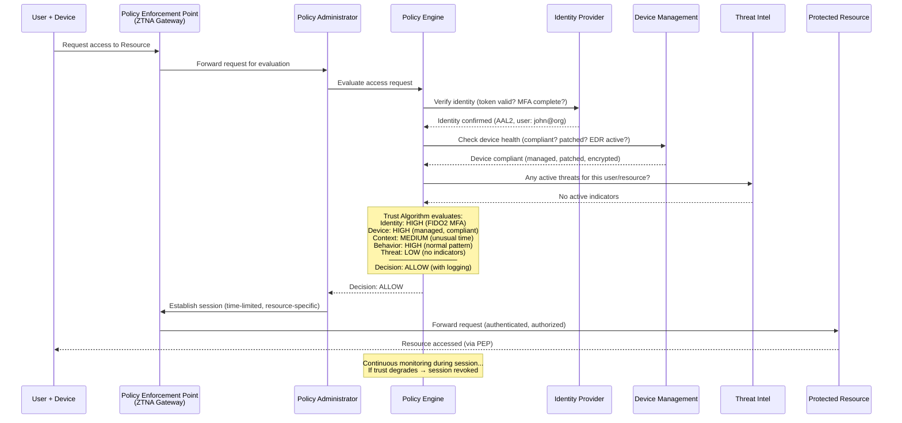

# Zero Trust Architecture (NIST SP 800-207)

**Topic:** Zero Trust Architecture — principles, components, deployment models, and implementation strategies  
**Standards:** NIST SP 800-207 (2020), CISA Zero Trust Maturity Model v2.0, DoD Zero Trust Strategy, EO 14028, OMB M-22-09  
**SDO:** NIST, CISA, DoD, OMB (Office of Management and Budget)  
**Audience:** Security architects, network engineers, identity engineers, CISOs, federal IT leaders, cloud architects  
**Prerequisites:** Network security fundamentals, identity and access management, NIST CSF, perimeter-based security concepts

---

## Chapter 1 — Historical Context & Origin Story

### 1.1 Timeline

| Year | Event | Significance |
|------|-------|-------------|
| 2004 | Jericho Forum (de-perimeterization) | First articulation that perimeter security is insufficient |
| 2010 | John Kindervag (Forrester) coins "Zero Trust" | Formal model: "never trust, always verify" |
| 2011 | Google begins BeyondCorp (internal) | First large-scale enterprise ZTA implementation |
| 2014 | Google BeyondCorp paper published | Demonstrated enterprise without VPN; inspired industry |
| 2017 | Gartner coins "CARTA" (Continuous Adaptive Risk & Trust Assessment) | Analyst framework reinforcing zero trust principles |
| 2019 | NIST SP 800-207 draft | First federal ZTA standard |
| 2020 | **NIST SP 800-207 published (August)** | Definitive ZTA architecture definition |
| 2020 | SolarWinds attack (December) | Proved perimeter-based trust models catastrophically failed |
| 2021 | **EO 14028** (May 12, 2021) | Presidential mandate: federal agencies MUST adopt Zero Trust |
| 2022 | **OMB M-22-09** (January 26, 2022) | Federal Zero Trust strategy: specific goals by FY2024-end |
| 2022 | CISA Zero Trust Maturity Model v1.0 | 5-pillar model for assessing federal ZT progress |
| 2022 | DoD Zero Trust Strategy (November) | DoD commitment: Target Level by FY2027 |
| 2023 | CISA ZT Maturity Model **v2.0** (April 2023) | Updated with more detail; Traditional→Optimal progression |
| 2024 | Federal agencies report FY2024 ZT progress | Mixed results; identity pillar most advanced |
| 2025 | OMB FY2024 deadline reached | Assessment of federal ZT adoption maturity |

### 1.2 Why Zero Trust Emerged

| Traditional Model Problem | Zero Trust Solution |
|--------------------------|-------------------|
| Perimeter defense assumes internal network is trusted | **No implicit trust** — every access request verified regardless of location |
| VPN grants broad network access after single authentication | **Per-session access** — each resource access individually authorized |
| Once inside, lateral movement is easy | **Microsegmentation** — every workload/resource isolated |
| Static credentials sufficient for ongoing access | **Continuous verification** — re-evaluate trust throughout session |
| Network location = trust level | **Identity + device + context = trust decision** |
| Flat internal networks | **Assume breach** — design assuming adversary is already inside |

### 1.3 Key Incidents Driving ZTA Adoption

| Incident | ZTA Lesson |
|----------|-----------|
| OPM Breach (2015) | Attackers moved laterally for months; network-based trust enabled spread |
| Equifax (2017) | Unpatched internal system exploited; no segmentation contained damage |
| SolarWinds (2020) | Trusted software → trusted network position → unrestricted access to sensitive resources |
| Colonial Pipeline (2021) | Single compromised VPN credential → no per-resource verification → shutdown |
| Microsoft Exchange/Hafnium (2021) | On-premise server trust → compromise → full AD access |
| Okta/LAPSUS$ (2022) | Identity provider compromise → highlights need for device verification + context |

---

## Chapter 2 — Standard Architecture & Structure

### 2.1 NIST SP 800-207 Core Tenets

| # | Tenet | Description |
|---|-------|-------------|
| 1 | All data sources and computing services are considered **resources** | Not just servers — includes SaaS, data stores, IoT devices, user devices |
| 2 | All communication is secured **regardless of network location** | Internal network ≠ trusted; encrypt and authenticate everything |
| 3 | Access to individual enterprise resources is granted on a **per-session** basis | No persistent "logged in to the network" state; each access independently evaluated |
| 4 | Access is determined by **dynamic policy** | Identity + device health + behavior + context + risk → access decision |
| 5 | Enterprise monitors and measures **integrity and security posture** of all owned/associated assets | Continuous device assessment; not just at enrollment |
| 6 | All resource authentication and authorization are **dynamic and strictly enforced** before access | Every request authenticated; authorization can change mid-session |
| 7 | Enterprise collects as much information as possible about the **current state** of assets, network, communications — uses it to improve security | Telemetry-driven; data informs trust decisions continuously |

### 2.2 SP 800-207 Logical Architecture Components

```mermaid
graph TB
    subgraph "Control Plane"
        PE[Policy Engine (PE)<br/>─────────────────<br/>• Makes access decisions<br/>• Evaluates trust algorithm<br/>• Grants/denies/revokes access<br/>• Inputs: identity, device,<br/>  behavior, context, threat intel]
        PA[Policy Administrator (PA)<br/>─────────────────<br/>• Communicates PE decisions<br/>• Establishes/terminates sessions<br/>• Configures PEP<br/>• Issues credentials/tokens]
    end
    
    subgraph "Data Plane"
        PEP[Policy Enforcement Point (PEP)<br/>─────────────────<br/>• Enables/terminates connections<br/>• Gateway between subject and resource<br/>• Cannot be bypassed<br/>• Implements PA instructions]
    end
    
    subgraph "Data Sources (Trust Algorithm Inputs)"
        CDM[CDM System<br/>Asset inventory &<br/>compliance state]
        INDUSTRY[Industry Compliance<br/>Regulatory/certification<br/>status]
        THREAT[Threat Intelligence<br/>CTI feeds<br/>IOCs, adversary TTPs]
        ACTIVITY[Activity Logs<br/>SIEM, user behavior<br/>real-time telemetry]
        DATA_ACCESS[Data Access Policies<br/>Attributes, roles<br/>classification]
        PKI[Enterprise PKI<br/>Certificate status<br/>trust chains]
        ID_MGMT[ID Management<br/>User directory<br/>roles, groups, MFA]
        SIEM_ZT[SIEM<br/>Correlation<br/>anomaly detection]
    end
    
    subgraph "Subject → Resource Flow"
        SUBJ[Subject<br/>(User + Device)]
        RES[Enterprise Resource<br/>(App, Data, Service)]
    end
    
    SUBJ -->|"Access request"| PEP
    PEP -->|"Request evaluation"| PE
    PE -->|"Decision"| PA
    PA -->|"Configure session"| PEP
    PEP -->|"Allowed traffic"| RES
    
    CDM --> PE
    INDUSTRY --> PE
    THREAT --> PE
    ACTIVITY --> PE
    DATA_ACCESS --> PE
    PKI --> PE
    ID_MGMT --> PE
    SIEM_ZT --> PE
```

### 2.3 CISA Zero Trust Maturity Model v2.0 — Five Pillars

| Pillar | Scope | Maturity Levels |
|--------|-------|-----------------|
| **Identity** | User/entity identity verification; MFA; least privilege; risk-based access | Traditional → Initial → Advanced → Optimal |
| **Devices** | Device inventory; compliance; real-time health assessment; managed/unmanaged | Traditional → Initial → Advanced → Optimal |
| **Networks** | Network segmentation; encrypted traffic; network monitoring; microsegmentation | Traditional → Initial → Advanced → Optimal |
| **Applications & Workloads** | App security; secure access; protection; visibility | Traditional → Initial → Advanced → Optimal |
| **Data** | Data inventory; classification; protection; DLP; access control | Traditional → Initial → Advanced → Optimal |

**Cross-cutting capabilities:** Visibility & Analytics, Automation & Orchestration, Governance

### 2.4 CISA Maturity Levels Defined

| Level | Name | Characteristics |
|-------|------|----------------|
| Traditional | (Starting point) | Perimeter-based; static policies; limited automation; manual processes |
| Initial | Starting ZT journey | Some automation; MFA deployed but not universal; beginning segmentation |
| Advanced | Significant ZT deployment | Risk-based policies; automated enforcement; microsegmentation; continuous monitoring |
| Optimal | Full ZT maturity | Continuous verification; AI-driven decisions; fully automated response; data-centric security |

---

## Chapter 3 — Technical Deep Dive

### 3.1 Zero Trust Trust Algorithm

```mermaid
graph TB
    subgraph "Trust Algorithm Inputs"
        IDENTITY[Identity Confidence<br/>• Authentication method (FIDO2 = high)<br/>• Identity proofing level (IAL)<br/>• Role/group membership<br/>• Authentication freshness]
        
        DEVICE[Device Trust Score<br/>• Is device managed? (MDM enrolled)<br/>• OS patched? (within SLA)<br/>• EDR installed and active?<br/>• Disk encrypted?<br/>• Device certificate valid?<br/>• Compliance with policy?]
        
        CONTEXT[Request Context<br/>• Time of access (business hours?)<br/>• Location (usual? travel?)<br/>• Network (corporate? home? public?)<br/>• Resource sensitivity level<br/>• Requested action (read vs. write vs. admin)]
        
        BEHAVIOR[Behavioral Analysis<br/>• Deviation from baseline?<br/>• Impossible travel?<br/>• Unusual resource access?<br/>• Anomaly score from UEBA]
        
        THREAT_I[Threat Intelligence<br/>• Active campaigns targeting org?<br/>• IOCs matching this session?<br/>• Source IP reputation<br/>• Known malware indicators]
    end
    
    subgraph "Trust Decision"
        ALGO[Trust Algorithm<br/>═══════════════<br/>Weighted composite score<br/>from all inputs<br/>─────────────────<br/>Score > threshold: ALLOW<br/>Score marginal: STEP-UP AUTH<br/>Score < threshold: DENY]
    end
    
    subgraph "Outcomes"
        ALLOW[ALLOW ACCESS<br/>Grant session to resource]
        STEPUP[STEP-UP AUTHENTICATION<br/>Require additional verification<br/>(re-MFA, biometric, approval)]
        DENY[DENY ACCESS<br/>Block request; log; alert SOC]
        REVOKE[REVOKE SESSION<br/>Terminate existing session<br/>(trust degraded mid-session)]
    end
    
    IDENTITY --> ALGO
    DEVICE --> ALGO
    CONTEXT --> ALGO
    BEHAVIOR --> ALGO
    THREAT_I --> ALGO
    
    ALGO --> ALLOW
    ALGO --> STEPUP
    ALGO --> DENY
    ALGO -->|"Continuous evaluation<br/>during session"| REVOKE
```

### 3.2 SP 800-207 Deployment Models

| Model | Description | Use Case | Advantages | Disadvantages |
|-------|-------------|----------|-----------|---------------|
| **Device Agent/Gateway** | Agent on device communicates with gateway near resource | Enterprise with managed endpoints | Strong device trust; encrypted tunnel; granular access | Requires agent on every device; BYOD challenge |
| **Enclave-Based** | Gateway protects resource enclaves (groups of resources) | Legacy systems; phased migration | Works with unmodified apps; easier to deploy initially | Less granular than per-resource; enclave = mini-perimeter |
| **Resource Portal** | Cloud-based proxy/portal intercepts all access requests | Cloud-first; SaaS access; BYOD | No agent required; works from any device/browser | Single point of failure if portal compromised; latency |
| **Device Application Sandboxing** | Application runs in isolated sandbox on device | Highly sensitive data; contractor devices | Data never leaves sandbox; maximum data protection | Limited UX; complex deployment; high compute overhead |

### 3.3 Microsegmentation Approaches

| Approach | Granularity | Technology | Use Case |
|----------|-------------|-----------|----------|
| Network-based (VLAN/subnet) | Coarse (subnet level) | Switches, firewalls | Legacy; basic segmentation; Phase 1 |
| Software-defined (SDN) | Medium (host/VM level) | VMware NSX, Cisco ACI | Data center; virtualized environments |
| Host-based (agent) | Fine (process/workload level) | Illumio, Guardicore, Zscaler Workload | Any environment; most granular |
| Identity-based (ZTNA proxy) | Application level | Zscaler Private Access, Cloudflare Access, Akamai EAA | Cloud-first; replaces VPN; app-level |
| Service mesh (Kubernetes) | Microservice level | Istio, Linkerd, Consul Connect | Kubernetes/cloud-native; east-west traffic |

### 3.4 OMB M-22-09 Federal ZT Goals (by End of FY2024)

| Pillar | M-22-09 Requirement | Metric |
|--------|---------------------|--------|
| Identity | Phishing-resistant MFA for ALL users accessing federal systems | 100% phishing-resistant MFA (FIDO2, PIV) |
| Identity | SSO across systems using agency-managed identity | Enterprise SSO for all applications |
| Devices | EDR deployed across federal endpoints | EDR on all managed devices |
| Devices | Asset visibility for every device accessing resources | Comprehensive device inventory |
| Networks | Encrypt all DNS (DoH/DoT); encrypt all HTTP (HTTPS) | 100% encrypted DNS + HTTPS |
| Networks | Move toward microsegmentation | Segment networks by application/workload |
| Applications | Treat all apps as internet-facing; test regularly | Internet-accessible apps have external testing program |
| Data | Categorize and label data; automate enforcement | Data classification scheme deployed |
| Data | Audit access to sensitive data | Comprehensive data access logging |

---

## Chapter 4 — Implementation Guide

### 4.1 Zero Trust Implementation Roadmap

```mermaid
graph TB
    subgraph "Phase 0: Assessment (Months 1-3)"
        P0A[Current State Assessment<br/>• Network architecture mapping<br/>• Identity infrastructure review<br/>• Data flow analysis (where does data go?)<br/>• Asset inventory completeness<br/>• CISA ZT Maturity Model self-assessment]
        P0B[Define Protect Surface<br/>• Critical data (DAAS: Data, Assets,<br/>  Applications, Services)<br/>• Prioritize by risk<br/>• Map transaction flows<br/>• Identify dependencies]
    end
    
    subgraph "Phase 1: Identity Foundation (Months 3-9)"
        P1A[Strong Authentication<br/>• Phishing-resistant MFA (FIDO2, PIV)<br/>• SSO consolidation<br/>• Conditional Access policies<br/>• PAM deployment (privileged access)]
        P1B[Identity Governance<br/>• Lifecycle management<br/>• Access reviews (periodic)<br/>• Role mining and RBAC cleanup<br/>• JIT/JEA for admin access]
    end
    
    subgraph "Phase 2: Device Trust (Months 6-12)"
        P2A[Device Visibility<br/>• MDM enrollment (managed devices)<br/>• Device health assessment<br/>• EDR deployment (100% coverage)<br/>• Certificate-based device auth]
        P2B[Device Compliance<br/>• Compliance policies (patch level,<br/>  encryption, AV status)<br/>• Conditional access: device health<br/>  as access condition<br/>• BYOD policy (limited access)]
    end
    
    subgraph "Phase 3: Network Transformation (Months 9-18)"
        P3A[ZTNA Deployment<br/>• Replace VPN with ZTNA<br/>  (application-specific access)<br/>• Encrypted DNS (DoH/DoT)<br/>• HTTPS everywhere<br/>• East-west traffic encryption]
        P3B[Microsegmentation<br/>• Application-aware segmentation<br/>• Workload isolation<br/>• Service mesh (K8s environments)<br/>• Reduce blast radius]
    end
    
    subgraph "Phase 4: Data-Centric Security (Months 12-24)"
        P4A[Data Classification<br/>• Classify all data by sensitivity<br/>• Label enforcement (auto + manual)<br/>• DLP policies based on labels<br/>• Encryption based on classification]
        P4B[Data Access Governance<br/>• Attribute-based access control (ABAC)<br/>• Audit all data access<br/>• Rights management (IRM/DRM)<br/>• Data loss prevention enforcement]
    end
    
    P0A --> P1A
    P0B --> P1A
    P1A --> P1B
    P1B --> P2A
    P2A --> P2B
    P2B --> P3A
    P3A --> P3B
    P3B --> P4A
    P4A --> P4B
```

### 4.2 Technology Stack for Zero Trust

| ZT Pillar | Technology Category | Products | Function |
|-----------|-------------------|----------|----------|
| Identity | IDP / SSO | Azure AD (Entra ID), Okta, Ping Identity | Central identity; SSO; conditional access |
| Identity | MFA (phishing-resistant) | YubiKey, Windows Hello, Azure AD FIDO2 | Eliminate password-based attacks |
| Identity | PAM | CyberArk, BeyondTrust, Delinea | Privileged access management; JIT |
| Identity | IGA | Sailpoint, Saviynt, Omada | Lifecycle; access reviews; certification |
| Devices | UEM/MDM | Microsoft Intune, VMware Workspace ONE, Jamf | Device management; compliance; enrollment |
| Devices | EDR/XDR | CrowdStrike, SentinelOne, Microsoft Defender | Endpoint detection; device health signal |
| Devices | Device Trust | Kolide, Duo Device Trust, Beyond Identity | Device posture as access condition |
| Networks | ZTNA | Zscaler Private Access, Cloudflare Access, Netskope | Replace VPN; app-level access |
| Networks | SASE/SSE | Zscaler, Netskope, Palo Alto Prisma SASE | Secure web gateway + ZTNA + CASB + FWaaS |
| Networks | Microsegmentation | Illumio, Guardicore (Akamai), VMware NSX | Workload isolation; reduce lateral movement |
| Applications | CASB | Microsoft Defender for Cloud Apps, Netskope | SaaS visibility; policy enforcement |
| Applications | WAF/API Gateway | Cloudflare, AWS WAF, Kong | Application protection; API security |
| Data | DLP | Microsoft Purview, Symantec (Broadcom), Forcepoint | Data loss prevention; policy enforcement |
| Data | Classification | Microsoft Purview, Titus, Boldon James | Automated data labeling |
| Cross-cutting | SIEM/SOAR | Splunk, Microsoft Sentinel, Google Chronicle | Visibility; detection; automated response |
| Cross-cutting | UEBA | Exabeam, Securonix, Microsoft Sentinel UEBA | Behavioral analytics for trust decisions |

### 4.3 VPN to ZTNA Migration

| Step | Action | Risk Mitigation |
|------|--------|-----------------|
| 1 | Inventory all VPN use cases | Understand what apps and users rely on VPN |
| 2 | Categorize: web-app vs. client-server vs. admin | Different ZTNA approaches for each |
| 3 | Deploy ZTNA solution alongside VPN (parallel run) | No disruption; users can fall back to VPN |
| 4 | Migrate web applications first (easiest) | Browser-based apps work immediately with ZTNA proxy |
| 5 | Migrate client-server apps (may need agent) | Deploy ZTNA agent on managed devices |
| 6 | Migrate admin/SSH/RDP last (highest risk, highest reward) | Privileged access through ZTNA + PAM integration |
| 7 | Reduce VPN access progressively | Limit VPN to legacy-only; monitor usage decline |
| 8 | Decommission VPN | Remove attack surface; full ZTNA operation |

---

## Chapter 5 — Certification & Compliance

### 5.1 Federal ZT Compliance Requirements

| Requirement Source | Deadline | Key Mandates |
|-------------------|----------|-------------|
| EO 14028 (May 2021) | Various (60-180 days per section) | MFA; encryption; ZTA planning; SBOM; logging |
| OMB M-22-09 (Jan 2022) | End of FY2024 (Sep 30, 2024) | Phishing-resistant MFA; SSO; EDR; HTTPS/encrypted DNS; data classification |
| CISA Zero Trust Maturity Model | Guidance (not deadline) | Agencies self-assess against 5 pillars; 4 maturity levels |
| DoD Zero Trust Strategy | Target Level by FY2027 | 7 pillars; 152 activities; Target + Advanced levels |
| FITARA Scorecard | Annual | IT modernization metrics include ZT progress |

### 5.2 Measuring Zero Trust Maturity

| Metric Category | Example Metrics | Target |
|----------------|-----------------|--------|
| Identity | % users with phishing-resistant MFA | 100% |
| Identity | % privileged access using PAM + JIT | 100% |
| Identity | Mean time to deactivate terminated user | <4 hours |
| Devices | % managed devices with EDR | 100% |
| Devices | % devices with automated compliance check | >95% |
| Networks | % internal traffic encrypted (east-west) | >90% |
| Networks | % applications accessible via ZTNA (vs. VPN) | >80% |
| Applications | % apps with security testing (SAST/DAST) | >80% |
| Data | % sensitive data classified and labeled | >90% |
| Data | % data access subject to ABAC policies | >75% |
| Cross-cutting | MTTD (mean time to detect) | <1 hour |
| Cross-cutting | Lateral movement opportunities (pen test findings) | Decreasing trend |

### 5.3 ZT Assessment Frameworks

| Framework | Provider | Use |
|-----------|----------|-----|
| CISA ZT Maturity Model v2.0 | CISA | Federal agency self-assessment; 5 pillars × 4 levels |
| Forrester Zero Trust eXtended (ZTX) | Forrester | Commercial assessment; 7 pillars |
| Gartner CARTA | Gartner | Continuous adaptive risk and trust; strategic model |
| DoD Zero Trust Reference Architecture | DoD/DISA | Military systems; 7 pillars; 152 activities |
| NIST SP 800-207 Compliance Check | NIST | Verify alignment with 7 tenets; architectural components |

---

## Chapter 6 — Regional & Domain Variants

### 6.1 Zero Trust Adoption by Sector

| Sector | ZT Driver | Current State (2024) | Key Challenge |
|--------|-----------|---------------------|---------------|
| US Federal | EO 14028, OMB M-22-09 | Mandated; in progress (identity pillar leading) | Legacy systems; budget constraints; workforce |
| US DoD | DoD ZT Strategy 2022 | Target Level by FY2027; pilots underway | Classified environments; JWCC cloud migration; scale |
| Financial Services | Regulatory pressure + breaches | Advanced (many already adopted ZT concepts) | Complex M&A environments; vendor ecosystems |
| Healthcare | HIPAA + ransomware | Early-to-mid adoption | Medical devices (can't agent); clinical workflow disruption |
| Manufacturing | Ransomware + OT risk | Early; mostly IT-focused ZT | OT/ICS cannot be segmented easily; safety systems |
| Technology | Self-driven (Google BeyondCorp model) | Most mature; cloud-native | N/A (leading sector) |
| Education | Ransomware + compliance | Early; limited budgets | BYOD-heavy; open culture conflicts with ZT |
| Retail | PCI DSS + customer data | Mid-adoption | High contractor/seasonal staff turnover; stores |

### 6.2 International ZT Initiatives

| Country/Region | Initiative | Status |
|---------------|-----------|--------|
| UK | NCSC Zero Trust Architecture Guidance (2021) | Advisory; referenced by government departments |
| EU | NIS2 + ENISA ZT guidance | Emerging; NIS2 drives identity-first security |
| Australia | ASD Essential Eight + Zero Trust concepts | Essential Eight aligns with ZT; explicit ZT guidance developing |
| Singapore | GovTech Zero Trust guidance | Government adoption; ZTNA for public sector |
| Japan | Digital Agency Zero Trust guidelines | Published 2022; government digital transformation |
| Canada | TBS/CSE Zero Trust initiative | Federal; aligned with Five Eyes approach |
| Israel | INCD Zero Trust recommendations | Military/civilian hybrid approach |
| NATO | NATO ZT adoption | Coalition interoperability challenges |

---

## Chapter 7 — Comparison with Competing Models

### 7.1 Zero Trust Architecture Models Comparison

| Dimension | NIST SP 800-207 | CISA ZT Maturity Model v2.0 | DoD ZT Strategy | Google BeyondCorp | Forrester ZTX |
|-----------|----------------|-----------------------------|-----------------|--------------------|---------------|
| Type | Architecture standard | Maturity assessment | Strategy & roadmap | Implementation reference | Analyst framework |
| Components | PE, PA, PEP + data sources | 5 pillars × 4 levels | 7 pillars × 152 activities | Access proxy + device inventory + trust engine | 7 pillars |
| Focus | What to build (architecture) | Where you are (assessment) | Where to go (military) | How Google did it (example) | Industry analysis |
| Prescriptive | Medium (tenets + models) | Medium (level descriptions) | High (specific activities) | High (implementation detail) | Low (strategic) |
| Audience | All organizations | US Federal agencies | US DoD | Tech industry | Enterprise |
| Freely available | Yes (NIST website) | Yes (CISA website) | Yes (DoD CIO) | Yes (research papers) | Paid (Forrester) |

### 7.2 ZT vs. Traditional Perimeter Security

| Dimension | Traditional (Castle-and-Moat) | Zero Trust |
|-----------|------------------------------|-----------|
| Trust model | Trust based on network location | No implicit trust anywhere |
| Access decision | VPN + firewall = access to network | Identity + device + context + behavior = access to specific resource |
| Network design | Flat internal; hard perimeter | Microsegmented; no distinction internal/external |
| Authentication | Once (at VPN/login) | Continuous (every request evaluated) |
| Lateral movement | Easy (flat network, implicit trust) | Difficult (every hop requires authorization) |
| Remote access | VPN (broad network access) | ZTNA (specific application access) |
| Failure mode | Single breach → full access | Single breach → single resource (blast radius contained) |
| Data protection | At perimeter (DLP at gateway) | At data layer (classification, encryption, ABAC) |
| Device trust | Managed device + VPN = trusted | Managed + compliant + healthy + context = per-request trust |

---

## Chapter 8 — Mermaid Architecture Diagrams

### 8.1 Zero Trust Access Decision Flow



### 8.2 CISA Five-Pillar Maturity Progression

```mermaid
graph LR
    subgraph "Identity Pillar"
        I_T[Traditional<br/>• Passwords only<br/>• No SSO<br/>• Manual provisioning]
        I_I[Initial<br/>• MFA deployed<br/>• SSO started<br/>• Basic lifecycle]
        I_A[Advanced<br/>• Phishing-resistant MFA<br/>• Risk-based access<br/>• Automated lifecycle<br/>• PAM deployed]
        I_O[Optimal<br/>• Continuous verification<br/>• AI-driven decisions<br/>• Passwordless<br/>• Real-time revocation]
    end
    
    subgraph "Device Pillar"
        D_T[Traditional<br/>• Limited inventory<br/>• No health checks<br/>• AV only]
        D_I[Initial<br/>• MDM deployed<br/>• Basic compliance<br/>• EDR started]
        D_A[Advanced<br/>• All devices enrolled<br/>• Health = access condition<br/>• Automated remediation]
        D_O[Optimal<br/>• Real-time posture<br/>• Zero-trust device cert<br/>• Self-healing devices]
    end
    
    subgraph "Network Pillar"
        N_T[Traditional<br/>• Perimeter firewall<br/>• VPN<br/>• Flat internal]
        N_I[Initial<br/>• Basic segmentation<br/>• ZTNA pilot<br/>• Encrypted DNS]
        N_A[Advanced<br/>• Microsegmentation<br/>• ZTNA primary<br/>• E-W encryption<br/>• VPN deprecated]
        N_O[Optimal<br/>• Fully segmented<br/>• Identity-aware network<br/>• Automated response<br/>• No VPN]
    end
    
    I_T --> I_I --> I_A --> I_O
    D_T --> D_I --> D_A --> D_O
    N_T --> N_I --> N_A --> N_O
```



### 8.3 Zero Trust Network Architecture (Before/After)

```mermaid
graph TB
    subgraph "BEFORE: Traditional Perimeter"
        EXT_B[External Users]
        FW_B[Firewall/VPN]
        INT_B[Internal Network<br/>(Flat - All Trusted)]
        APP1_B[App 1]
        APP2_B[App 2]
        DB_B[Database]
        
        EXT_B -->|"VPN tunnel"| FW_B
        FW_B -->|"Broad access"| INT_B
        INT_B --> APP1_B
        INT_B --> APP2_B
        INT_B --> DB_B
        APP1_B -->|"Unrestricted"| DB_B
        APP2_B -->|"Unrestricted"| DB_B
    end
    
    subgraph "AFTER: Zero Trust"
        EXT_A[External Users]
        ZTNA_A[ZTNA Proxy<br/>(PEP)]
        PE_A[Policy Engine<br/>+ Identity Provider]
        
        SEG1[Microsegment 1<br/>App 1 only]
        SEG2[Microsegment 2<br/>App 2 only]
        SEG3[Microsegment 3<br/>Database only]
        
        EXT_A -->|"Per-app request"| ZTNA_A
        ZTNA_A -->|"Evaluate"| PE_A
        PE_A -->|"Allow App 1 only"| ZTNA_A
        ZTNA_A -->|"App 1 traffic only"| SEG1
        ZTNA_A -.->|"Denied"| SEG2
        SEG1 -->|"Authorized API call"| SEG3
    end
```

---

## Chapter 9 — Case Studies

### 9.1 Google BeyondCorp — Original Zero Trust Implementation

| Aspect | Detail |
|--------|--------|
| Motivation | Operation Aurora (2009): Chinese APT compromised Google's internal network; lateral movement was trivial on flat network |
| Core insight | "The internal network should be treated as the internet — equally untrusted" |
| Architecture | **Access Proxy** (front-end to all internal apps) → **Trust Engine** (evaluates device + user) → **Device Inventory** (tracks every device) → **User/Group Database** (identity) |
| Key decisions | (1) No VPN. All applications are internet-facing (through access proxy). (2) Device certificate on every device (chip-bound TPM key). (3) Device trust level calculated continuously (patched? managed? secure?). (4) Access decisions: user identity + device trust level + application sensitivity → allow/deny. (5) Even on corporate network, access still goes through proxy (no network trust). |
| Implementation timeline | 2011-2017 (6 years to fully migrate 85,000+ employees) |
| Results | (1) VPN eliminated entirely. (2) Employees work from anywhere (same access from office, home, coffee shop). (3) Lateral movement after compromise dramatically reduced. (4) User experience improved (no VPN connection hassle). |
| Published research | 5 BeyondCorp papers (2014-2017); inspired industry movement |
| Key lesson | **Zero Trust at scale is achievable — but requires multi-year investment in identity, device management, and application architecture.** |

### 9.2 Federal Agency ZTNA Deployment (OMB M-22-09 Compliance)

| Aspect | Detail |
|--------|--------|
| Organization | Large US civilian agency (~50,000 employees; 100+ offices nationwide) |
| Starting state | Traditional: Cisco AnyConnect VPN; on-premise AD; flat internal networks; MFA via SMS |
| OMB M-22-09 gaps | (1) SMS MFA is NOT phishing-resistant (must upgrade to FIDO2/PIV). (2) VPN provides broad network access (must implement ZTNA). (3) No device compliance check for access decisions. (4) Internal traffic unencrypted. (5) Data not classified or labeled. |
| Implementation plan | Phase 1 (6 months): Deploy Azure AD + FIDO2 (YubiKeys for all users). Phase 2 (6 months): Intune MDM + compliance policies; Conditional Access (device health = access condition). Phase 3 (6 months): Zscaler Private Access for top-20 applications (replace VPN for those apps). Phase 4 (6 months): Microsegmentation of data center; data classification pilot. |
| Phase 1 results | 48,000 users enrolled in FIDO2/PIV within 6 months. Phishing attacks: 94% reduction in successful credential theft. Help desk password reset tickets: 60% reduction. |
| Phase 2 results | 45,000 devices enrolled in Intune. 12% of devices found non-compliant (blocked from sensitive resources until remediated). Shadow IT: 2,000 unmanaged devices discovered (previously invisible). |
| Phase 3 results | Top-20 apps migrated to ZTNA. VPN connection volume reduced 65%. User satisfaction: higher (no VPN connection step). 30% reduction in network-based attack surface. |
| Challenges | (1) Legacy applications (mainframe-based) cannot integrate with ZTNA easily → kept on VPN for now. (2) Union negotiations for monitoring policies (device health check perceived as surveillance). (3) Budget: $12M total over 24 months. (4) Workforce training: change management critical. |
| Key metrics | Phishing-resistant MFA: 96% (target 100%). ZTNA coverage: 60% of apps (target 80%). Device compliance visibility: 100%. Data classification: 25% (behind schedule). |

---

## Chapter 10 — Future Evolution & Industry Trends

| Trend | Timeline | Impact |
|-------|----------|--------|
| AI-driven trust decisions | 2024-2027 | ML models for continuous trust scoring; anomaly detection; behavioral baseline |
| Universal ZTNA (replace all VPN) | 2024-2026 | VPN fully deprecated; all access through ZTNA; network becomes transport only |
| Identity-first (passwordless default) | Now-2025 | Passkeys (FIDO2) as primary auth; passwords eliminated; phishing resistance by default |
| IoT/OT Zero Trust | 2025-2028 | Extending ZT to non-user devices; IoT identity; microsegmentation for OT |
| Data-centric zero trust | 2025-2027 | Classification + encryption + ABAC at data layer; data protected regardless of location |
| SASE convergence complete | 2024-2025 | ZTNA + SWG + CASB + FWaaS fully integrated; single-vendor SASE |
| Zero Trust for AI/ML systems | 2025+ | AI model access control; inference authorization; training data protection |
| Hardware-backed identity (device) | Now | TPM-bound device certificates; impossible to clone; stronger device trust signal |
| Continuous authorization (not just authentication) | Now | Real-time session monitoring; instant revocation on trust degradation |
| ZT for multicloud | Now | Consistent ZT policies across AWS + Azure + GCP + on-prem |

---

## Chapter 11 — Interview Questions & Career Guide

### Tier 1: Entry-Level

**Q1:** What are the seven tenets of Zero Trust Architecture as defined by NIST SP 800-207?  
**A:** (1) All data sources and computing services are resources. (2) All communication is secured regardless of network location — being on the corporate network doesn't make traffic "trusted." (3) Access to resources is granted per-session — no persistent "logged in" state. (4) Access is determined by dynamic policy including identity, device health, behavior, and context. (5) The enterprise monitors integrity and security posture of all assets — devices are continuously assessed. (6) Authentication and authorization are dynamic and strictly enforced before access — every single request is evaluated. (7) The enterprise collects maximum information about current state and uses it to improve security — telemetry drives decisions.

The core philosophy: **never trust, always verify**. Network location confers no trust. Identity + device + context + behavior collectively determine access on a per-request basis.

**Q2:** What is the difference between VPN and ZTNA?  
**A:** **VPN** (Virtual Private Network) creates an encrypted tunnel from the user's device to the corporate network perimeter. Once connected, the user typically has broad Layer-3 network access — they can reach many systems as if physically on the LAN. The trust decision happens once at connection time. **ZTNA** (Zero Trust Network Access) provides access to specific applications (not the network). The user authenticates and is authorized for individual applications based on identity, device health, and context. They can ONLY reach the authorized application — the rest of the network is invisible and unreachable. There's no network-level access. Each application access is independently evaluated. ZTNA effectively makes applications "dark" — invisible to unauthorized users (no reconnaissance possible). ZTNA is the technical implementation of ZT for network access.

### Tier 2: Mid-Level

**Q3:** Design a Zero Trust architecture for an organization with 5,000 employees, 50% remote, using a mix of on-premise and SaaS applications. What components do you need?  
**A:** Architecture components:

**Identity layer:** (1) Azure AD (Entra ID) or Okta as central IDP + SSO. (2) FIDO2/passkeys as primary MFA (phishing-resistant). (3) CyberArk or BeyondTrust for PAM (privileged access). (4) Conditional Access policies (the Policy Engine).

**Device layer:** (1) Microsoft Intune for MDM/UEM (managed devices). (2) Compliance policies: OS patched within 7 days, disk encrypted, EDR active. (3) CrowdStrike or SentinelOne EDR on all endpoints. (4) Device compliance signal → Conditional Access (device must be compliant for access).

**Network layer:** (1) Zscaler Internet Access (SIA) for internet/SaaS access (SWG + CASB). (2) Zscaler Private Access (ZPA) for on-premise/private application access (ZTNA — replaces VPN). (3) Microsegmentation: Illumio for data center workloads. (4) DNS encryption (DoH via Zscaler).

**Application layer:** (1) SaaS apps accessed through CASB (DLP, session control). (2) On-premise apps accessed through ZTNA (ZPA). (3) Web apps: WAF (Cloudflare) + regular pen testing. (4) APIs: gateway with authentication + rate limiting.

**Data layer:** (1) Microsoft Purview for classification + DLP. (2) Azure Information Protection for labeling. (3) Encryption at rest (Azure Key Vault; BitLocker for endpoints).

**Visibility:** (1) Microsoft Sentinel (SIEM) — all signals aggregated. (2) UEBA for behavioral analysis (part of Sentinel). (3) SOAR for automated response.

**Policy flow:** User authenticates (IDP + MFA) → Conditional Access evaluates (identity + device health + context + risk) → grants access to specific app via ZTNA/CASB → continuous monitoring during session → revoke if trust degrades.

### Tier 3: Senior/Architect

**Q4:** How do you extend Zero Trust to OT/ICS environments where you cannot install agents, cannot enforce MFA, and availability is the priority over confidentiality?  
**A:** [Full answer covers: (1) ZT adaptation for OT: identity is at the SYSTEM/PROTOCOL level (not user level). (2) Network-based microsegmentation (Claroty, Nozomi, Fortinet) since agents impossible on PLCs/RTUs. (3) Unidirectional gateways (data diodes) for highest-security zones. (4) Jump server / PAM for human access to OT (CyberArk session isolation). (5) Behavioral baseline of OT protocols (anomaly = unauthorized command). (6) Purdue model + microsegmentation = zones with explicit allow-lists (default deny between zones). (7) Device identity through network fingerprinting (not certificates). (8) Availability-first: passive monitoring (not inline blocking) for detection; blocking only at zone boundaries.]

---

## Chapter 12 — Cheat Sheet & Quick Reference

### Zero Trust Core Principles

```
1. NEVER trust, ALWAYS verify
2. Assume breach (design for attacker already inside)  
3. Verify explicitly (identity + device + context + behavior)
4. Least privilege access (minimum necessary, time-limited)
5. Microsegmentation (contain blast radius)
6. Continuous monitoring and validation (not just at login)
```

### SP 800-207 Components

```
Policy Engine (PE):              Makes trust decisions (brain)
Policy Administrator (PA):       Executes decisions; manages sessions
Policy Enforcement Point (PEP):  Gateway; allows/blocks traffic (muscle)
Trust Algorithm:                 Combines all signals → access decision
```

### CISA ZT Maturity Model v2.0 — Five Pillars

```
1. IDENTITY:      Users verified; MFA; least privilege; SSO
2. DEVICES:       Inventory; health assessed; compliance enforced
3. NETWORKS:      Segmented; encrypted; monitored; ZTNA
4. APPLICATIONS:  Secured; tested; protected; accessible only via ZT
5. DATA:          Classified; labeled; encrypted; access-controlled
```

### OMB M-22-09 Key Requirements

```
Identity:     Phishing-resistant MFA (FIDO2/PIV) for ALL users
Devices:      EDR on all endpoints; device inventory complete
Networks:     Encrypted DNS; HTTPS everywhere; microsegmentation
Applications: Internet-facing testing; authorization on every request
Data:         Classification; labeling; access audit
```

### VPN vs. ZTNA Quick Comparison

```
                VPN                          ZTNA
Access:         Network-level (Layer 3)      Application-level (Layer 7)
Trust:          Once at connection           Per-request, continuous
Visibility:     User sees network            User sees only authorized apps
Lateral:        Easy (full network access)   Impossible (no network access)
Device:         Any (once on VPN)            Must meet compliance policy
Attack surface: Entire internal network      Individual applications only
```

### Zero Trust Implementation Priority

```
Step 1: IDENTITY (foundation — MFA, SSO, PAM)
Step 2: DEVICES (visibility — MDM, EDR, compliance)
Step 3: NETWORK (transform — ZTNA, microsegmentation)
Step 4: APPLICATIONS (secure — WAF, testing, CASB)
Step 5: DATA (protect — classify, encrypt, DLP)

Start with Identity — it's the new perimeter.
```

---

*End of Document — 03_Zero_Trust_Architecture.md*
