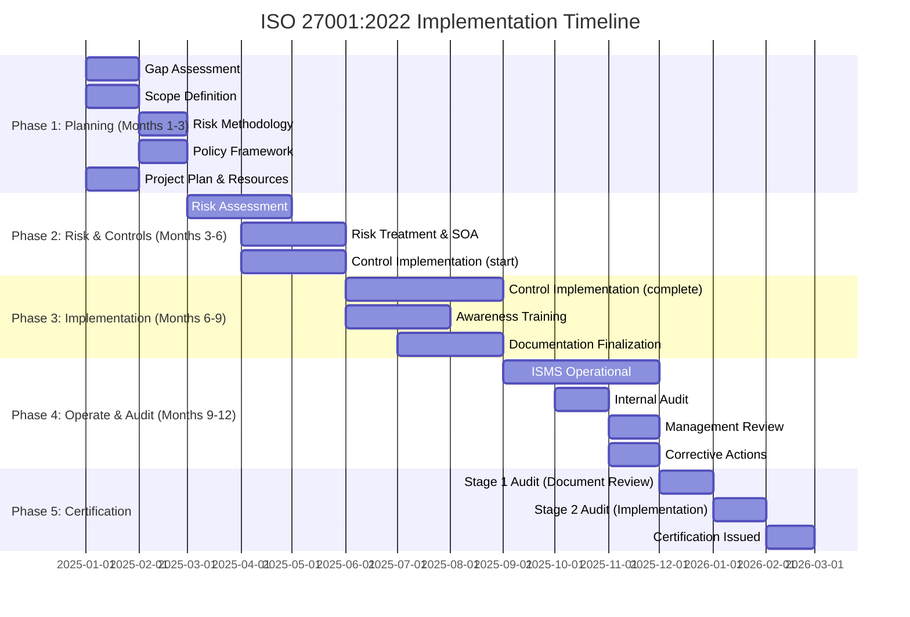
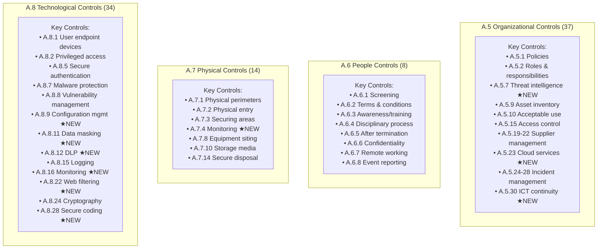
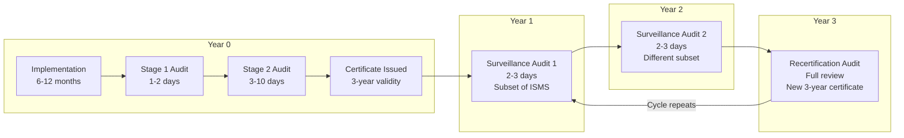

# ISO/IEC 27001:2022 — Information Security Management System (ISMS)

**Topic:** ISO/IEC 27001:2022 — Requirements for establishing, implementing, maintaining, and continually improving an ISMS  
**Standard:** ISO/IEC 27001:2022 (3rd edition, October 2022)  
**SDO:** ISO (International Organization for Standardization) / IEC (International Electrotechnical Commission), Joint Technical Committee ISO/IEC JTC 1/SC 27  
**Audience:** Information security managers, ISMS implementors, lead auditors, CISOs, GRC professionals, compliance officers  
**Prerequisites:** Basic information security concepts, management system fundamentals, risk management principles

---

## Chapter 1 — Historical Context & Origin Story

### 1.1 Timeline

| Year | Event | Significance |
|------|-------|-------------|
| 1995 | BS 7799 Part 1 published (BSI UK) | First code of practice for information security; pioneer standard |
| 1998 | BS 7799 Part 2 published | Certification specification (ISMS requirements) |
| 2000 | ISO/IEC 17799:2000 | BS 7799-1 adopted as ISO standard (code of practice) |
| 2005 | **ISO/IEC 27001:2005** | First ISO certification standard for ISMS (from BS 7799-2) |
| 2005 | ISO/IEC 27002:2005 | Code of practice (renamed from 17799) |
| 2009 | ISO/IEC 27000 vocabulary | Family overview and terminology |
| 2013 | **ISO/IEC 27001:2013** | Major revision; Annex SL structure; 114 controls in 14 clauses |
| 2013 | ISO/IEC 27002:2013 | Updated control guidance |
| 2019 | ISO/IEC 27701:2019 | Privacy extension (PIMS) to 27001 |
| 2022 | **ISO/IEC 27002:2022** (February) | New structure: 93 controls in 4 themes; 11 new controls |
| 2022 | **ISO/IEC 27001:2022** (October) | Updated Annex A to align with 27002:2022; clause text minimal changes |
| 2025 | Transition deadline | Organizations must transition from 2013 to 2022 by October 31, 2025 |

### 1.2 ISO 27001:2013 → 2022 Changes

| Aspect | ISO 27001:2013 | ISO 27001:2022 |
|--------|----------------|----------------|
| Clause text (4-10) | Annex SL-based | Minimal changes (Annex SL harmonized structure retained) |
| Annex A controls | 114 controls in 14 domains | **93 controls in 4 themes** |
| New controls | N/A | **11 new controls added** |
| Merged/consolidated | N/A | ~24 controls merged |
| Removed controls | N/A | 0 (all content retained, reorganized) |
| Control attributes | Not present | **5 attributes** (control type, cybersecurity concepts, operational capabilities, security domains, information security properties) |
| ISO 27002 alignment | 27002:2013 | 27002:2022 (new structure) |
| Transition deadline | N/A | **October 31, 2025** |

### 1.3 The 11 New Controls in ISO 27001:2022

| Control | Name | Theme | Purpose |
|---------|------|-------|---------|
| A.5.7 | Threat intelligence | Organizational | Collect and analyze threat information |
| A.5.23 | Information security for use of cloud services | Organizational | Cloud-specific security requirements |
| A.5.30 | ICT readiness for business continuity | Organizational | IT/communication service continuity |
| A.7.4 | Physical security monitoring | Physical | Surveillance and monitoring of premises |
| A.8.9 | Configuration management | Technological | Secure configuration of hardware, software, services |
| A.8.10 | Information deletion | Technological | Timely and complete data deletion |
| A.8.11 | Data masking | Technological | Mask PII/sensitive data per policy |
| A.8.12 | Data leakage prevention | Technological | DLP measures for systems processing sensitive data |
| A.8.16 | Monitoring activities | Technological | Monitor systems for anomalous behavior |
| A.8.23 | Web filtering | Technological | Manage access to external websites |
| A.8.28 | Secure coding | Technological | Apply secure coding principles in development |

---

## Chapter 2 — Standard Architecture & Structure

### 2.1 ISO 27001:2022 Document Structure

```mermaid
graph TB
    subgraph "Management System Requirements (Clauses 4-10)"
        C4[Clause 4: Context of the Organization<br/>• Understanding the organization<br/>• Interested parties<br/>• Scope<br/>• ISMS]
        C5[Clause 5: Leadership<br/>• Leadership commitment<br/>• Information security policy<br/>• Roles, responsibilities, authorities]
        C6[Clause 6: Planning<br/>• Risk assessment<br/>• Risk treatment<br/>• Information security objectives<br/>• Planning of changes]
        C7[Clause 7: Support<br/>• Resources<br/>• Competence<br/>• Awareness<br/>• Communication<br/>• Documented information]
        C8[Clause 8: Operation<br/>• Operational planning and control<br/>• Information security risk assessment<br/>• Information security risk treatment]
        C9[Clause 9: Performance Evaluation<br/>• Monitoring, measurement, analysis<br/>• Internal audit<br/>• Management review]
        C10[Clause 10: Improvement<br/>• Continual improvement<br/>• Nonconformity and corrective action]
    end
    
    subgraph "Annex A: Information Security Controls"
        AA5[A.5 Organizational Controls (37)]
        AA6[A.6 People Controls (8)]
        AA7[A.7 Physical Controls (14)]
        AA8[A.8 Technological Controls (34)]
    end
    
    C4 --> C5 --> C6 --> C7 --> C8 --> C9 --> C10
    C6 -->|"Risk treatment<br/>selects controls"| AA5
    C6 -->|"Risk treatment<br/>selects controls"| AA6
    C6 -->|"Risk treatment<br/>selects controls"| AA7
    C6 -->|"Risk treatment<br/>selects controls"| AA8
```

### 2.2 Annex A — 93 Controls in 4 Themes

| Theme | ID Range | Count | Focus |
|-------|----------|-------|-------|
| **Organizational** | A.5.1 — A.5.37 | 37 | Policies, roles, asset management, access control, supplier management, incident management, continuity, compliance |
| **People** | A.6.1 — A.6.8 | 8 | Screening, terms, awareness/training, disciplinary, termination, confidentiality, remote working, reporting |
| **Physical** | A.7.1 — A.7.14 | 14 | Perimeters, entry, securing areas, threats, working in secure areas, clear desk, equipment, storage, utilities, cabling, maintenance, disposal, monitoring |
| **Technological** | A.8.1 — A.8.34 | 34 | User endpoints, privileged access, access restriction, source code, authentication, capacity, malware, vulnerabilities, configuration, deletion, masking, DLP, backup, redundancy, logging, monitoring, clocks, utilities, installation, network, web filtering, cryptography, secure development, testing, separation, change management, outsourced development, secure coding |

### 2.3 ISO 27001 Control Attributes (New in 2022)

| Attribute | Values | Purpose |
|-----------|--------|---------|
| **Control type** | Preventive, Detective, Corrective | When the control acts (before, during, after) |
| **Information security properties** | Confidentiality, Integrity, Availability | CIA triad mapping |
| **Cybersecurity concepts** | Identify, Protect, Detect, Respond, Recover | Maps to NIST CSF functions |
| **Operational capabilities** | Governance, Asset mgmt, Info protection, HR security, Physical, System/network, Application, Secure configuration, Identity/access, Threat/vulnerability, Continuity, Supplier, Legal, Events, Assurance | Practitioner viewpoint |
| **Security domains** | Governance & Ecosystem, Protection, Defence, Resilience | High-level grouping |

---

## Chapter 3 — Technical Deep Dive

### 3.1 Risk Assessment Process (Clause 6.1.2)

```mermaid
graph TB
    subgraph "Step 1: Establish Context"
        CTX[Define Risk Criteria<br/>• Risk acceptance criteria<br/>• Criteria for performing assessments<br/>• Impact scales (1-5)<br/>• Likelihood scales (1-5)<br/>• Risk matrix definition]
    end
    
    subgraph "Step 2: Risk Identification"
        RI[Identify Risks<br/>• Asset-based approach (what do we protect?)<br/>• Threat-based approach (what could happen?)<br/>• Vulnerability scanning<br/>• Scenario analysis<br/>• Output: Risk Register (preliminary)]
    end
    
    subgraph "Step 3: Risk Analysis"
        RA[Analyze Risks<br/>• Assess likelihood (1-5 scale)<br/>• Assess impact (C/I/A per asset)<br/>• Calculate risk level<br/>  (Risk = Likelihood × Impact)<br/>• Consider existing controls]
    end
    
    subgraph "Step 4: Risk Evaluation"
        RE[Evaluate and Prioritize<br/>• Compare to risk criteria<br/>• Rank risks by severity<br/>• Determine which need treatment<br/>• Risk owners assigned]
    end
    
    subgraph "Step 5: Risk Treatment"
        RT[Select Treatment Options<br/>• Modify (apply controls) — most common<br/>• Accept (within appetite)<br/>• Avoid (eliminate activity)<br/>• Share (insurance, outsource)<br/>─────────────────<br/>Select Annex A controls<br/>Document in SOA]
    end
    
    CTX --> RI --> RA --> RE --> RT
    RT -->|"Produce"| SOA[Statement of Applicability<br/>93 controls: applicable/not applicable<br/>Justification for each<br/>Implementation status]
    RT -->|"Produce"| RTP[Risk Treatment Plan<br/>Actions, owners, timelines<br/>for each unacceptable risk]
```

### 3.2 Statement of Applicability (SOA)

The SOA is the central document linking risk assessment to control implementation:

| Control | Applicable? | Justification | Implementation Status | Notes |
|---------|------------|---------------|----------------------|-------|
| A.5.1 Policies for information security | Yes | Required by ISMS; addresses multiple risks | Implemented | Policy v3.2 published |
| A.5.7 Threat intelligence | Yes | New 2022 control; addresses APT risks | Partially implemented | CTI feeds being integrated |
| A.6.7 Remote working | Yes | 60% workforce hybrid | Implemented | Remote work policy + controls |
| A.7.3 Securing offices, rooms, facilities | Yes | Data center + offices | Implemented | Access control + CCTV |
| A.8.11 Data masking | Yes | PII in non-production environments | Planned (Q3 2025) | Selecting masking tool |
| A.8.25 Secure development lifecycle | No | No in-house development (SaaS only) | N/A — excluded in scope | Justified: only consume SaaS |

### 3.3 Key Clause Requirements

| Clause | Key Requirements | Evidence Needed |
|--------|-----------------|-----------------|
| 4.1 | Determine external/internal issues affecting ISMS | PESTLE analysis; industry trends; organizational context document |
| 4.2 | Determine interested parties and their requirements | Stakeholder register; legal requirements log |
| 4.3 | Determine ISMS scope (boundaries and applicability) | Scope statement (clear boundaries; locations; business units) |
| 5.1 | Top management demonstrate leadership and commitment | Management review minutes; resource allocation; policy approval |
| 5.2 | Establish information security policy | Signed policy; communicated to all staff; available to interested parties |
| 6.1 | Plan actions to address risks and opportunities | Risk methodology; risk register; risk treatment plan |
| 6.1.3 | Information security risk treatment (select controls; produce SOA) | SOA; risk treatment plan; residual risk acceptance |
| 7.2 | Determine necessary competence; ensure persons are competent | Training records; qualifications; competency framework |
| 8.1 | Plan, implement, control processes | Procedures; work instructions; operational evidence |
| 9.1 | Monitor, measure, analyze, evaluate | KPIs/metrics; measurement plan; dashboard reports |
| 9.2 | Internal audit programme | Audit plan; audit reports; nonconformity records |
| 9.3 | Management review (at planned intervals) | Management review agenda/minutes; decisions; actions |
| 10.1 | Continual improvement | Corrective actions; preventive actions; improvement register |
| 10.2 | Nonconformity and corrective action | NC records; root cause analysis; corrective actions; verification |

---

## Chapter 4 — Implementation Guide

### 4.1 ISMS Implementation Timeline (Typical)



### 4.2 Mandatory Documents and Records

| Document/Record | Clause | Purpose |
|----------------|--------|---------|
| Scope of the ISMS | 4.3 | Define boundaries |
| Information security policy | 5.2 | Top-level direction |
| Risk assessment methodology | 6.1.2 | How risks are assessed |
| Risk assessment results | 6.1.2, 8.2 | Risk register |
| Risk treatment plan | 6.1.3, 8.3 | Actions to address risks |
| **Statement of Applicability (SOA)** | 6.1.3 d) | 93 controls: applicable/not, justification, status |
| Information security objectives | 6.2 | Measurable security goals |
| Competence evidence | 7.2 | Training records, certifications |
| Operational planning/control | 8.1 | Procedures, instructions |
| Risk assessment results | 8.2 | Periodic reassessment results |
| Risk treatment results | 8.3 | Treatment effectiveness evidence |
| Monitoring and measurement results | 9.1 | Metrics, KPIs |
| Internal audit programme + results | 9.2 | Audit plan, reports |
| Management review results | 9.3 | Minutes, decisions |
| Nonconformities + corrective actions | 10.2 | NC log, root cause, corrective action evidence |

### 4.3 Implementation Cost Estimates

| Organization Size | Implementation Cost | Annual Maintenance | Certification Audit Cost |
|-------------------|--------------------|--------------------|-------------------------|
| Small (10-50 staff) | $30K-$80K | $10K-$25K/year | $10K-$25K |
| Medium (50-500 staff) | $80K-$250K | $25K-$75K/year | $25K-$60K |
| Large (500-5000 staff) | $250K-$750K | $75K-$200K/year | $60K-$150K |
| Enterprise (5000+ staff) | $500K-$2M+ | $200K-$500K/year | $100K-$300K |

*Costs include: consulting, tooling, staff time, training, audit fees*

---

## Chapter 5 — Certification & Audit

### 5.1 Certification Process

```mermaid
graph TB
    subgraph "Pre-Audit"
        GAP[Gap Assessment<br/>• Optional but recommended<br/>• Identify major gaps before formal audit<br/>• Can be done by consultant or CB]
    end
    
    subgraph "Stage 1 Audit (Document Review)"
        S1[Stage 1<br/>• Review ISMS documentation<br/>• Verify mandatory documents exist<br/>• Assess readiness for Stage 2<br/>• Identify focus areas for Stage 2<br/>• Usually 1-2 days on-site<br/>• OUTCOME: Ready / Not Ready report]
    end
    
    subgraph "Stage 2 Audit (Implementation)"
        S2[Stage 2<br/>• Full on-site audit (3-10 days)<br/>• Verify controls are implemented and effective<br/>• Interview staff<br/>• Review evidence<br/>• Sample-based approach<br/>• OUTCOME: Certification / Nonconformities]
    end
    
    subgraph "Nonconformities"
        NC_MAJ[Major NC<br/>• Systemic failure<br/>• Must correct before certification<br/>• OR: certification denied until corrected]
        NC_MIN[Minor NC<br/>• Isolated lapse<br/>• Must have corrective action plan<br/>• Verified at next surveillance audit]
    end
    
    subgraph "Post-Certification (3-year cycle)"
        SURV1[Surveillance Audit Year 1<br/>• Subset of ISMS audited<br/>• Verify continued compliance<br/>• NC follow-up<br/>• 2-3 days typical]
        SURV2[Surveillance Audit Year 2<br/>• Different subset<br/>• Continued compliance<br/>• NC follow-up]
        RECERT[Recertification Audit Year 3<br/>• Full audit (similar to Stage 2)<br/>• Complete ISMS review<br/>• Issue new 3-year certificate]
    end
    
    GAP --> S1 --> S2
    S2 --> NC_MAJ
    S2 --> NC_MIN
    S2 -->|"No Major NCs"| SURV1
    NC_MAJ -->|"Corrected"| SURV1
    SURV1 --> SURV2 --> RECERT
    RECERT -->|"New 3-year cycle"| SURV1
```

### 5.2 Accredited Certification Bodies

| Certification Body | Headquarters | Coverage | Notes |
|-------------------|--------------|----------|-------|
| BSI (British Standards Institution) | UK | Global | Original BS 7799 creator; most ISO 27001 certifications globally |
| Bureau Veritas | France | Global | Multi-standard CB |
| DNV | Norway | Global | Strong in maritime/energy + IT |
| TÜV SÜD / TÜV Rheinland | Germany | Global | Strong European presence |
| Schellman | USA | Americas/Global | Strong in SOC 2 + ISO combined audits |
| A-LIGN | USA | Americas/Global | ISO + SOC 2 + FedRAMP combination |
| NQA | UK | Global | Mid-market focus |
| SGS | Switzerland | Global | Multinational testing/certification |
| LRQA (Lloyd's Register) | UK | Global | Strong industrial sector |

### 5.3 Audit Nonconformity Examples

| Type | Example | Root Cause | Corrective Action |
|------|---------|-----------|-------------------|
| Major NC | No risk assessment performed for 2+ years (Clause 8.2) | ISMS manager left; no succession | Appoint new owner; perform risk assessment immediately; schedule annual |
| Major NC | SOA does not reflect current control implementation (Clause 6.1.3 d) | SOA created at certification; never updated as systems changed | Review all 93 controls; update SOA; align with current reality |
| Minor NC | 3 of 50 users have not completed security awareness training (A.6.3) | New hires not enrolled automatically | Automate enrollment in HR onboarding; complete overdue training |
| Minor NC | Backup restoration test not performed in past 12 months (A.8.13) | Scheduled but postponed due to project | Perform immediate test; add to recurring calendar with accountability |
| Minor NC | Supplier security assessment missing for 2 critical vendors (A.5.19) | Vendor inventory incomplete; no trigger for new vendors | Update vendor register; perform assessments; add onboarding trigger |

---

## Chapter 6 — Regional & Domain Variants

### 6.1 ISO 27001 Global Adoption

| Region | Certifications (2023 approx.) | Key Driver |
|--------|-------------------------------|-----------|
| Japan | ~7,000+ | Historically highest adoption; client requirements |
| UK | ~6,000+ | Original standard origin (BS 7799); financial sector |
| India | ~5,000+ | IT services outsourcing; client requirement |
| China | ~4,000+ | Government/enterprise; growing rapidly |
| Germany | ~3,000+ | Engineering/manufacturing; GDPR driver |
| USA | ~2,000+ | Growing (SOC 2 historically preferred; now both) |
| Italy | ~2,000+ | EU compliance; SMBs |
| Australia | ~1,000+ | Government + financial requirements |
| South Korea | ~1,000+ | ISMS-P (Korean variant) |
| Netherlands | ~1,000+ | Financial; healthcare |

### 6.2 Sector-Specific ISO 27001 Extensions

| Extension Standard | Sector | Additional Controls |
|-------------------|--------|-------------------|
| ISO/IEC 27017:2015 | Cloud services | Cloud-specific controls (CSP + customer); shared responsibility |
| ISO/IEC 27018:2019 | Cloud PII protection | PII in public cloud; privacy |
| ISO/IEC 27019:2017 | Energy utilities | SCADA/ICS; grid operations; generation |
| ISO/IEC 27701:2019 | Privacy (PIMS) | GDPR alignment; PII controller/processor requirements |
| ISO/IEC 27799:2016 | Healthcare | Medical data; clinical systems |
| ISO 27001 + IEC 62443 | Industrial/OT | Combined IT + OT security management |
| ISO 27001 + ISO 22301 | Business continuity | Integrated ISMS + BCMS |

### 6.3 ISO 27001 vs. National Frameworks

| Country | National Standard | Relationship to ISO 27001 |
|---------|------------------|--------------------------|
| Germany | BSI IT-Grundschutz | More detailed; maps to ISO 27001 (Grundschutz certification ≈ ISO 27001) |
| France | ANSSI recommendations | References ISO 27001; adds French requirements |
| South Korea | ISMS-P (KISA) | Korean variant incorporating privacy; locally recognized |
| Spain | ENS (Esquema Nacional de Seguridad) | Government ICT security; maps to ISO 27001 |
| India | IS 16641:2017 (BIS) | Adoption of ISO 27001 as Indian National Standard |
| Singapore | MTCS (Multi-Tier Cloud Security) | Based on ISO 27001 + cloud additions (CSA STAR influenced) |
| UAE | Abu Dhabi ISR | Based on ISO 27001 with local additions for government |

---

## Chapter 7 — Comparison with Competing Standards

### 7.1 ISO 27001 vs. SOC 2 vs. NIST CSF

| Dimension | ISO 27001:2022 | SOC 2 Type II | NIST CSF 2.0 |
|-----------|----------------|---------------|-------------|
| Type | Certification standard (management system) | Attestation report (audit opinion) | Risk management framework (self-assessment) |
| Certifiable | **Yes** (3-year certificate) | **Yes** (annual attestation) | No |
| Scope control | Organization defines scope (location/BU/system) | System description (service boundaries) | Organization determines scope |
| Controls | 93 Annex A controls (select based on risk) | Trust Services Criteria (5 principles) | 106 subcategories (outcome-based) |
| Assessor | Accredited Certification Body | Licensed CPA firm | Self or third-party consultant |
| Global recognition | **Highest** (international; 160+ countries) | Primarily US + global tech/SaaS | Primarily US (growing globally) |
| Cost | $50K-$300K (certification); $75K+ annual | $50K-$200K annual audit | Low (free framework; self-assessment) |
| Best for | Global enterprise needing international credential | SaaS vendor proving security to customers | Internal security program improvement |
| Risk approach | Risk-based control selection (mandatory risk assessment) | Risk-based (inherent to criteria) | Risk management is core purpose |
| Prescriptive detail | Medium (SHALL statements + Annex A controls) | Medium (criteria + auditor judgment) | Low (outcome-based; non-prescriptive) |

### 7.2 ISO 27001 vs. NIST SP 800-53

| Aspect | ISO 27001:2022 + Annex A | NIST SP 800-53 Rev5 |
|--------|--------------------------|---------------------|
| Control count | 93 | ~1,189 (base + enhancements) |
| Granularity | Higher-level; implementation flexible | Very detailed; specific enhancements |
| Mandatory for | Contractual/certification | US Federal (FISMA) |
| Risk approach | Organization defines risk methodology | FIPS 199 categorization → baseline selection |
| Privacy | Limited (PT in 800-53; ISO 27701 for ISO) | Integrated PT family + privacy overlay |
| Supply chain | A.5.19-A.5.22 (4 controls) | SR family (12 controls) + SA family |
| Certification | Yes (ISO accredited CB) | Via FedRAMP ATO (3PAO) |
| Cost | Lower (simpler to implement) | Higher (more controls, more documentation) |
| International use | Global standard | Primarily US (some international via FedRAMP CSPs) |
| Mapping | NIST provides official mapping (800-53 → ISO 27001) | Maps to ISO 27001 in CPRT tool |

---

## Chapter 8 — Mermaid Architecture Diagrams

### 8.1 ISMS Plan-Do-Check-Act (PDCA) Cycle

```mermaid
graph TB
    subgraph "PLAN (Clauses 4-6)"
        PLAN_A[• Understand context (4.1, 4.2)<br/>• Define scope (4.3)<br/>• Establish policy (5.2)<br/>• Risk assessment (6.1.2)<br/>• Risk treatment + SOA (6.1.3)<br/>• Set objectives (6.2)]
    end
    
    subgraph "DO (Clauses 7-8)"
        DO_A[• Provide resources (7.1)<br/>• Ensure competence (7.2)<br/>• Maintain awareness (7.3)<br/>• Implement controls (8.1)<br/>• Perform risk assessment (8.2)<br/>• Implement risk treatment (8.3)]
    end
    
    subgraph "CHECK (Clause 9)"
        CHECK_A[• Monitor & measure (9.1)<br/>• Internal audit (9.2)<br/>• Management review (9.3)<br/>• KPI evaluation<br/>• Effectiveness assessment]
    end
    
    subgraph "ACT (Clause 10)"
        ACT_A[• Continual improvement (10.1)<br/>• Nonconformity handling (10.2)<br/>• Corrective actions<br/>• Preventive improvements<br/>• Update risk assessment]
    end
    
    PLAN_A -->|"Implement"| DO_A
    DO_A -->|"Evaluate"| CHECK_A
    CHECK_A -->|"Improve"| ACT_A
    ACT_A -->|"Refine"| PLAN_A
```

### 8.2 ISO 27001 Annex A Control Themes



### 8.3 Certification Lifecycle



---

## Chapter 9 — Case Studies

### 9.1 SaaS Company Achieving ISO 27001 + SOC 2 Simultaneously

| Aspect | Detail |
|--------|--------|
| Organization | B2B SaaS company; 200 employees; handles client financial data; $30M ARR |
| Motivation | Enterprise customers require both ISO 27001 and SOC 2; previously had neither |
| Strategy | Unified implementation: one control framework mapped to both standards simultaneously |
| Approach | (1) GRC platform (Vanta) configured with combined ISO 27001 + SOC 2 control mappings. (2) ~70% overlap between ISO 27001 Annex A and SOC 2 TSC identified. (3) Single policy set written to satisfy both standards. (4) Same evidence collected once, used for both audits. (5) ISO 27001 CB and SOC 2 auditor briefed on combined approach. |
| Timeline | 10 months: Months 1-3 (gap assessment + policies), Months 4-7 (control implementation), Months 8-9 (internal audit + SOC 2 observation begins), Month 10 (ISO Stage 1 + Stage 2). SOC 2 Type II report available at month 16 (12-month observation). |
| Results | ISO 27001:2022 certified at month 10. SOC 2 Type II report at month 16. Estimated 40% effort savings vs. separate implementations. 3 enterprise deals closed citing dual certification ($2M ARR uplift). |
| Key challenges | (1) SOC 2 requires 6-12 month observation period (ISO doesn't); timing coordination needed. (2) Auditor language differs (ISO: "nonconformity" vs. SOC 2: "exception/deviation"). (3) Scope: ISO scope = whole ISMS; SOC 2 scope = specific service system. |
| Cost | $350K total (consulting $120K, tooling $40K/yr, ISO audit $35K, SOC 2 audit $80K, staff time $75K) |
| Lesson | **Unified implementation saves ~40% effort. Key is mapping controls once and collecting evidence once.** |

### 9.2 Manufacturing Company 2013→2022 Transition

| Aspect | Detail |
|--------|--------|
| Organization | Automotive parts manufacturer; ISO 27001:2013 certified since 2017; 1,500 employees |
| Challenge | Must transition to ISO 27001:2022 by October 31, 2025; also holds IATF 16949 (automotive quality) |
| Transition approach | (1) Gap analysis: 2013 → 2022 control mapping. (2) 11 new controls assessed for applicability. (3) SOA completely rewritten (114 → 93 control structure). (4) Risk assessment refreshed with new threats (cloud, remote work, supply chain). |
| New controls implemented | A.5.7 (threat intelligence): subscribed to industry ISAC; integrated feeds into SIEM. A.5.23 (cloud): formal cloud security policy; CSP assessments. A.8.9 (configuration mgmt): deployed Ansible for server baselines. A.8.11 (data masking): masked PII in test environments. A.8.12 (DLP): Microsoft Purview DLP for email + endpoints. A.8.16 (monitoring): enhanced SIEM use cases. A.8.28 (secure coding): added SAST to CI/CD. |
| Timeline | 8 months (gap analysis 2 months → implementation 4 months → internal audit 1 month → transition audit 1 month) |
| Transition audit | Certification Body conducted transition audit (combined with surveillance audit). 2 minor nonconformities found (A.8.9 not fully deployed to all environments; A.5.7 threat intel process not documented). Both corrected within 30 days. |
| Result | ISO 27001:2022 certificate issued; 2013 certificate superseded. Seamless transition. |
| Cost | $95K (consulting: $40K, tooling additions: $30K, audit: $25K) |

---

## Chapter 10 — Future Evolution & Industry Trends

| Trend | Timeline | Impact |
|-------|----------|--------|
| ISO 27001 + AI controls | 2025-2027 | Future Annex A update likely to include AI-specific controls (similar to A.8.28 for coding) |
| Automation of ISMS | Now-2026 | GRC platforms automating evidence collection, control testing, audit preparation |
| Integrated management systems | Now | ISO 27001 + 22301 (BC) + 27701 (Privacy) + 9001 (Quality) in single system |
| Continuous certification models | 2026+ | Moving from annual audits to continuous assurance (real-time compliance evidence) |
| ISO 27001 for cloud-native | Now | Growing need for guidance on Kubernetes, serverless, microservices security |
| Supply chain cascading | Now | Large enterprises requiring ISO 27001 from all suppliers in chain |
| Climate/sustainability intersection | 2025+ | ISO looking at sustainability of IT systems within ISMS scope |
| Privacy convergence | Now | ISO 27701 adoption growing; GDPR/privacy regulations driving PIMS |
| OT/IT convergence | 2024-2027 | Combined ISO 27001 + IEC 62443 certifications for manufacturing/energy |
| Harmonization with NIST CSF 2.0 | Now | Explicit mapping tools; organizations implementing both simultaneously |
| Regional mandates | 2024-2026 | NIS2 driving ISO 27001 adoption across EU; DORA for financial; CRA for products |

---

## Chapter 11 — Interview Questions & Career Guide

### Tier 1: Entry-Level (ISMS Coordinator / Junior Auditor)

**Q1:** What are the four themes of Annex A in ISO 27001:2022 and how many controls does each contain?  
**A:** (1) **Organizational** (A.5): 37 controls — policies, roles, asset management, access control, supplier security, incident management, continuity, compliance. (2) **People** (A.6): 8 controls — screening, employment terms, awareness/training, disciplinary, termination, confidentiality, remote working, event reporting. (3) **Physical** (A.7): 14 controls — perimeters, entry, securing areas, monitoring, equipment, media, cabling, maintenance, disposal. (4) **Technological** (A.8): 34 controls — endpoints, privileged access, authentication, malware, vulnerabilities, configuration, DLP, backup, logging, monitoring, cryptography, secure development, testing. Total: 93 controls (reduced from 114 in 2013 version due to merging, with 11 new controls added).

**Q2:** Explain the Statement of Applicability (SOA) and why it is critical.  
**A:** The SOA is a mandatory document (required by Clause 6.1.3 d) that lists all 93 Annex A controls and states for each: (1) Whether it is applicable to the organization and why (or why not). (2) Whether it is implemented. (3) The justification for inclusion or exclusion. The SOA is critical because: (a) It is the bridge between risk assessment and control implementation — every selected control must trace back to a risk. (b) It defines the scope of the Annex A controls for auditing — the auditor uses it to determine what to check. (c) It must be kept current — any change in systems/scope requires SOA update. (d) It demonstrates due diligence in control selection (risk-based, not checkbox). The SOA is often called "the most important ISMS document" — if your SOA is inaccurate, your entire ISMS certification is questionable.

### Tier 2: Mid-Level (ISMS Manager / Lead Implementor)

**Q3:** How would you plan the transition from ISO 27001:2013 to 2022 for an organization already certified?  
**A:**

**Phase 1: Assessment (Months 1-2):**
1. Map existing 114 controls (2013) to new 93 controls (2022) using ISO-provided mapping table
2. Identify which of the 11 new controls are applicable (gap analysis)
3. Assess current SOA against 2022 structure
4. Identify documentation that needs restructuring

**Phase 2: Implementation (Months 3-6):**
1. Implement new applicable controls (A.5.7 threat intel, A.5.23 cloud, A.8.9 config mgmt, A.8.12 DLP, A.8.16 monitoring, A.8.28 secure coding — most commonly applicable)
2. Rewrite SOA in 2022 format (4 themes, 93 controls, attributes)
3. Update risk assessment to reflect new threat landscape
4. Update policies/procedures where control numbering changed
5. Train staff on changes

**Phase 3: Verification (Months 6-8):**
1. Internal audit against 2022 requirements
2. Management review covering transition
3. Correct any nonconformities found
4. Prepare evidence for transition audit

**Phase 4: Certification (Month 8-9):**
1. Schedule transition audit with CB (can combine with surveillance or recertification)
2. Transition audit conducted (CB verifies 2022 compliance)
3. New ISO 27001:2022 certificate issued

**Timeline consideration:** Must complete before October 31, 2025 deadline. Plan to finish by mid-2025 for buffer.

### Tier 3: Senior (CISO / Lead Auditor)

**Q4:** How do you address the tension between ISO 27001's risk-based approach and prescriptive regulatory requirements (e.g., GDPR Article 32, NIS2, DORA) that mandate specific security measures?  
**A:** [Full answer covers: (1) ISO 27001's risk-based approach INCLUDES regulatory requirements as input (Clause 4.2 — interested parties; Clause 6.1.1 — legal requirements as risks). (2) Regulatory requirements become constraints on risk treatment — you cannot "accept" risks where regulation mandates specific controls. (3) SOA must reflect regulatory mandates as "applicable" regardless of risk assessment outcome. (4) Integrated approach: risk assessment identifies risks; regulation mandates minimum controls; SOA reflects union of both. (5) Practical example: GDPR Article 32 mandates encryption of personal data "where appropriate" — even if risk assessment suggests low risk, regulatory mandate may override. (6) NIS2 Article 21 specifies 10 minimum measures — all must appear in SOA. (7) Audit approach: demonstrate that regulatory analysis was performed and controls selected accordingly.]

---

## Chapter 12 — Cheat Sheet & Quick Reference

### ISO 27001:2022 Key Numbers

```
Clauses:              4-10 (management system requirements)
Annex A Themes:       4 (Organizational, People, Physical, Technological)
Total Controls:       93 (was 114 in 2013)
New Controls:         11 (in 2022)
Certification Cycle:  3 years (Stage 1 + Stage 2 + 2 surveillance + recertification)
Transition Deadline:  October 31, 2025 (from 2013 to 2022)
```

### Mandatory Documentation

```
1. ISMS Scope (4.3)
2. Information Security Policy (5.2)
3. Risk Assessment Methodology (6.1.2)
4. Risk Assessment Results (6.1.2, 8.2)
5. Risk Treatment Plan (6.1.3, 8.3)
6. Statement of Applicability (6.1.3 d)  ← MOST CRITICAL DOCUMENT
7. Information Security Objectives (6.2)
8. Competence Evidence (7.2)
9. Monitoring/Measurement Results (9.1)
10. Internal Audit Results (9.2)
11. Management Review Results (9.3)
12. Nonconformity + Corrective Actions (10.2)
```

### Annex A Control Themes

```
A.5 ORGANIZATIONAL (37):  Policies, access, suppliers, incidents, continuity
A.6 PEOPLE (8):           Screening, training, termination, remote work
A.7 PHYSICAL (14):        Perimeters, entry, equipment, disposal
A.8 TECHNOLOGICAL (34):   Endpoints, auth, malware, vuln mgmt, logging, crypto, dev
```

### Audit Types

```
Stage 1:        Document review; readiness assessment (1-2 days)
Stage 2:        Implementation audit; full assessment (3-10 days)
Surveillance:   Annual subset review (2-3 days) — Year 1 and Year 2
Recertification: Full review (similar to Stage 2) — Year 3
```

### Risk Treatment Options

```
MODIFY:   Apply controls (Annex A) — most common
ACCEPT:   Risk within appetite — document decision
AVOID:    Eliminate the activity creating the risk
SHARE:    Transfer via insurance or outsourcing
```

### ISO 27001 → NIST CSF Quick Mapping

```
Clause 4 (Context)        → CSF GOVERN (GV.OC)
Clause 5 (Leadership)     → CSF GOVERN (GV.RR, GV.PO)
Clause 6 (Planning/Risk)  → CSF IDENTIFY (ID.RA), GOVERN (GV.RM)
Clause 7-8 (Support/Ops)  → CSF PROTECT (implementation)
Clause 9 (Performance)    → CSF DETECT + GOVERN (GV.OV)
Clause 10 (Improvement)   → CSF IDENTIFY (ID.IM)
Annex A                   → CSF All Functions (mapped per control)
```

---

*End of Document — 04_ISO_27001_2022_ISMS.md*
