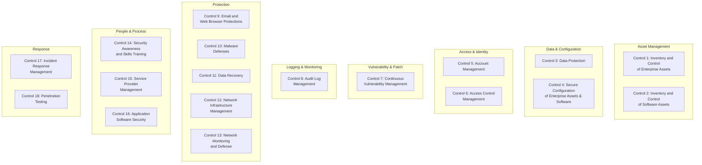
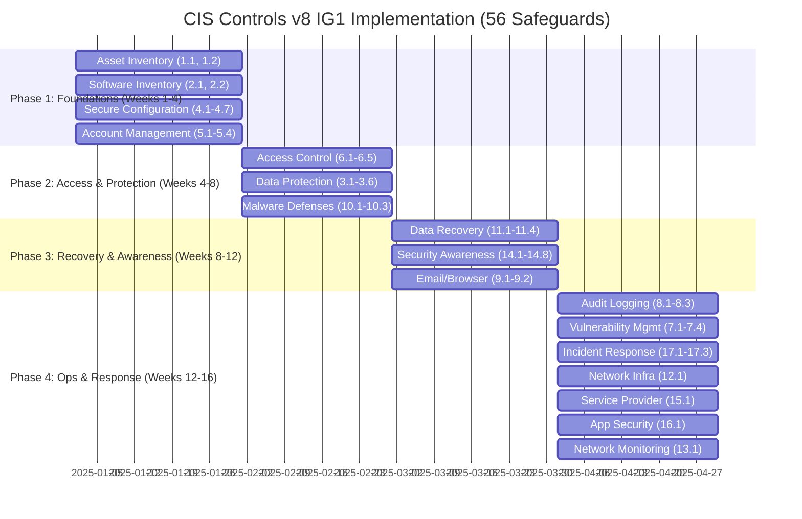
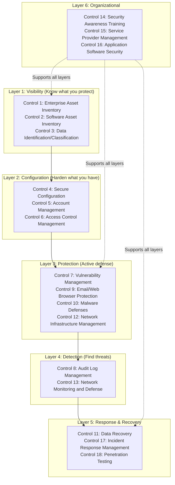

# CIS Controls v8 — Center for Internet Security Critical Security Controls

**Topic:** CIS Controls v8 — Prioritized set of cybersecurity best practices for defense against common attacks  
**Standard:** CIS Controls v8 (May 2021); CIS Benchmarks (continuously updated)  
**SDO:** Center for Internet Security (CIS), Inc.  
**Audience:** Security operations teams, IT administrators, CISOs, MSPs, compliance teams, government agencies  
**Prerequisites:** Basic networking, system administration, understanding of common attack vectors

---

## Chapter 1 — Historical Context & Origin Story

### 1.1 Timeline

| Year | Event | Significance |
|------|-------|-------------|
| 2008 | SANS Top 20 Critical Controls created | Response to massive data breaches; actionable defense priority list; originally called "CAG" (Consensus Audit Guidelines) |
| 2009 | Version 1.0 published | 20 controls; community-developed by NSA, SANS, DoD experts |
| 2011 | Council on CyberSecurity takes stewardship | Governance moved from SANS consortium |
| 2013 | Version 5.0 | 20 controls; refined sub-controls; metrics improved |
| 2015 | Center for Internet Security (CIS) takes ownership | CIS becomes permanent home for Controls and Benchmarks |
| 2016 | CIS Controls v6 | 20 controls; 171 sub-controls; organized by type (Basic, Foundational, Organizational) |
| 2018 | CIS Controls v7.0 | 20 controls; sub-controls refined; Implementation Groups introduced (IG1, IG2, IG3) |
| 2019 | CIS Controls v7.1 | Minor update; cloud considerations; improved mappings |
| 2021 | **CIS Controls v8** (May 2021) | **Major revision**: 18 controls (from 20); 153 safeguards; cloud/mobile/remote work native; reorganized by activity |
| 2023 | CIS Controls v8.1 updates | Clarifications; additional guidance; mapping updates |
| 2024+ | CIS Benchmarks continue expansion | 100+ platform-specific secure configuration guides |

### 1.2 v7.1 → v8 Key Changes

| Aspect | CIS Controls v7.1 | CIS Controls v8 |
|--------|-------------------|-----------------|
| Control count | 20 controls | **18 controls** |
| Sub-controls | 171 sub-controls | **153 safeguards** |
| Terminology | Sub-controls | **Safeguards** |
| Organization | Basic (1-6), Foundational (7-16), Organizational (17-20) | **Reorganized by cybersecurity activity** |
| Cloud coverage | Limited | **Cloud-native from design** |
| Mobile/Remote | Separate consideration | **Integrated throughout** |
| Implementation Groups | IG1, IG2, IG3 | IG1, IG2, IG3 (refined) |
| Perimeter assumption | Partially | **Zero Trust aligned** — no perimeter assumption |
| Asset focus | Hardware/software inventory | **Enterprise assets + software assets** (broader) |

---

## Chapter 2 — Standard Architecture & Structure

### 2.1 CIS Controls v8 — 18 Controls Overview



### 2.2 Complete Control List with Safeguard Counts

| Control # | Control Name | # Safeguards | IG1 | IG2 | IG3 |
|-----------|-------------|-------------|-----|-----|-----|
| 1 | Inventory and Control of Enterprise Assets | 5 | 2 | 4 | 5 |
| 2 | Inventory and Control of Software Assets | 7 | 3 | 6 | 7 |
| 3 | Data Protection | 14 | 6 | 12 | 14 |
| 4 | Secure Configuration of Enterprise Assets and Software | 12 | 7 | 11 | 12 |
| 5 | Account Management | 6 | 4 | 6 | 6 |
| 6 | Access Control Management | 8 | 5 | 7 | 8 |
| 7 | Continuous Vulnerability Management | 7 | 4 | 7 | 7 |
| 8 | Audit Log Management | 12 | 3 | 10 | 12 |
| 9 | Email and Web Browser Protections | 7 | 2 | 6 | 7 |
| 10 | Malware Defenses | 7 | 3 | 7 | 7 |
| 11 | Data Recovery | 5 | 4 | 5 | 5 |
| 12 | Network Infrastructure Management | 8 | 1 | 7 | 8 |
| 13 | Network Monitoring and Defense | 11 | 1 | 6 | 11 |
| 14 | Security Awareness and Skills Training | 9 | 8 | 9 | 9 |
| 15 | Service Provider Management | 7 | 1 | 4 | 7 |
| 16 | Application Software Security | 14 | 1 | 11 | 14 |
| 17 | Incident Response Management | 9 | 3 | 8 | 9 |
| 18 | Penetration Testing | 5 | 0 | 3 | 5 |
| **TOTAL** | | **153** | **56** | **130** | **153** |

### 2.3 Implementation Groups (IG)

| Implementation Group | Target Organization | Safeguards | Profile |
|---------------------|--------------------|-----------:|---------|
| **IG1** (Essential Cyber Hygiene) | Small businesses; limited IT expertise; standard COTS; sensitive data is limited; focused on keeping business running | 56 | Minimum viable security; "if you do nothing else, do these 56" |
| **IG2** | Mid-size enterprise; dedicated IT staff; manages IT infrastructure; handles sensitive data; regulatory compliance required | 130 | Robust security program; builds on IG1 |
| **IG3** | Large enterprise; security experts on staff; handles highly sensitive/regulated data; targeted by sophisticated adversaries | 153 | Comprehensive defense; advanced capabilities; all safeguards |

---

## Chapter 3 — Technical Deep Dive

### 3.1 Control Details — Key Safeguards

**Control 1: Inventory and Control of Enterprise Assets**

| Safeguard | ID | IG Level | Description |
|-----------|-----|---------|-------------|
| Establish and Maintain Detailed Enterprise Asset Inventory | 1.1 | IG1 | All assets capable of storing/processing data (physical, virtual, cloud, IoT) |
| Address Unauthorized Assets | 1.2 | IG1 | Process to address unauthorized assets weekly or more frequently |
| Utilize an Active Discovery Tool | 1.3 | IG2 | Active discovery scans to identify assets on network (Nmap, agents, cloud API) |
| Use Dynamic Host Configuration Protocol (DHCP) Logging | 1.4 | IG2 | Log DHCP to augment asset inventory |
| Use a Passive Asset Discovery Tool | 1.5 | IG3 | Network tap/span-based passive discovery |

**Control 4: Secure Configuration**

| Safeguard | ID | IG Level | Description |
|-----------|-----|---------|-------------|
| Establish and Maintain a Secure Configuration Process | 4.1 | IG1 | Documented process for configuring all enterprise assets |
| Establish and Maintain a Secure Configuration Process for Network Infrastructure | 4.2 | IG1 | Network device configurations (routers, switches, firewalls) |
| Configure Automatic Session Locking | 4.3 | IG1 | Lock screen after inactivity (≤15 minutes) |
| Implement and Manage a Firewall on Servers | 4.4 | IG1 | Host-based firewall on all servers |
| Implement and Manage a Firewall on End-User Devices | 4.5 | IG1 | Host-based firewall on workstations/laptops |
| Securely Manage Enterprise Assets and Software | 4.6 | IG1 | Manage through secure protocols (SSH, HTTPS, not Telnet/FTP) |
| Manage Default Accounts | 4.7 | IG1 | Change/disable default credentials on all enterprise assets |
| Uninstall or Disable Unnecessary Services | 4.8 | IG2 | Remove unnecessary software/services/ports |
| Configure Trusted DNS Servers | 4.9 | IG2 | Use organization-approved DNS (DoH/DoT for encryption) |
| Enforce Automatic Device Lockout | 4.10 | IG2 | Lock after ≤5 failed authentication attempts |
| Enforce Remote Wipe Capability | 4.11 | IG2 | Mobile device management with remote wipe |
| Separate Enterprise Workspaces on Mobile Devices | 4.12 | IG3 | Containerization for BYOD/enterprise data separation |

### 3.2 CIS Benchmarks — Secure Configuration Details

| Platform | Benchmark Examples | Key Settings |
|----------|-------------------|--------------|
| Windows 11 | CIS Microsoft Windows 11 Enterprise Benchmark | Account lockout (5 attempts); audit policy; BitLocker; firewall; UAC |
| Windows Server 2022 | CIS Microsoft Windows Server 2022 Benchmark | GPO hardening; LAPS; event forwarding; SMBv1 disabled |
| Ubuntu 22.04 | CIS Ubuntu Linux 22.04 LTS Benchmark | SSH hardening; partition mounts; auditd rules; AppArmor; sysctl |
| AWS | CIS Amazon Web Services Foundations Benchmark | Root MFA; CloudTrail; VPC flow logs; S3 public access block; IAM policies |
| Azure | CIS Microsoft Azure Foundations Benchmark | Conditional Access; Security Center; Key Vault; NSG; diagnostic logs |
| GCP | CIS Google Cloud Platform Benchmark | VPC SC; org policies; IAM audit; cloud logging; KMS |
| Kubernetes | CIS Kubernetes Benchmark | API server auth; etcd encryption; pod security; network policies |
| Docker | CIS Docker Benchmark | Docker daemon config; container isolation; image signing; network |

### 3.3 CIS Controls and ATT&CK Mapping (Select)

| CIS Control | MITRE ATT&CK Tactics Mitigated | Key Techniques Addressed |
|-------------|-------------------------------|-------------------------|
| Control 1 (Asset Inventory) | Reconnaissance, Initial Access | T1595 (Active Scanning), T1133 (External Remote Services) |
| Control 2 (Software Inventory) | Execution, Persistence | T1204 (User Execution), T1543 (Create/Modify System Process) |
| Control 4 (Secure Configuration) | Privilege Escalation, Defense Evasion | T1548 (Abuse Elevation), T1562 (Impair Defenses) |
| Control 6 (Access Control) | Credential Access, Lateral Movement | T1078 (Valid Accounts), T1021 (Remote Services) |
| Control 7 (Vulnerability Mgmt) | Initial Access, Privilege Escalation | T1190 (Exploit Public-Facing), T1068 (Exploitation for Privilege Escalation) |
| Control 10 (Malware Defenses) | Execution, Defense Evasion | T1059 (Command Scripting), T1036 (Masquerading) |
| Control 13 (Network Monitoring) | Discovery, Lateral Movement, Exfiltration | T1046 (Network Discovery), T1048 (Exfiltration Over Alternative Protocol) |

---

## Chapter 4 — Implementation Guide

### 4.1 IG1 Implementation Roadmap (Essential Cyber Hygiene)



### 4.2 IG1 Quick-Win Implementation

| Safeguard | Implementation | Tool/Technology | Time |
|-----------|---------------|-----------------|------|
| 4.3: Session locking (15 min) | GPO/MDM policy push | Active Directory GPO; Intune | 1 hour |
| 4.4-4.5: Host firewalls | Enable Windows Firewall; default deny inbound | GPO; built-in OS firewall | 2 hours |
| 4.7: Default accounts | Change default passwords; disable guest accounts | Script/GPO | 4 hours |
| 5.2: Default passwords | Audit and remediate all default credentials | Password audit tool; manual review | 1 day |
| 6.1: Access control process | Document who approves access and how | Policy document + ticketing system | 2 days |
| 9.2: DNS filtering | Configure DNS-based web filtering | Cloudflare Gateway; Cisco Umbrella; Pi-hole | 2 hours |
| 10.1: Anti-malware deployed | Deploy EDR/AV to all endpoints | Windows Defender; CrowdStrike; SentinelOne | 1 day |
| 11.1: Backup process | Automated daily backups of critical data | Veeam; AWS Backup; built-in backup | 1 day |
| 14.1: Security awareness program | Establish annual security training | KnowBe4; SANS SAT; Microsoft SSAT | 1 week |

### 4.3 Tool Mapping per Control

| Control | Open Source Tools | Commercial Tools |
|---------|------------------|-----------------|
| 1 (Asset Inventory) | Snipe-IT, GLPI, OCS Inventory | ServiceNow CMDB, Axonius, Rumble |
| 2 (Software Inventory) | OSQuery, GLPI | Tanium, Flexera, Snow |
| 3 (Data Protection) | VeraCrypt, OpenSSL | Microsoft Purview, Symantec DLP, Netskope |
| 4 (Secure Configuration) | CIS-CAT Lite, OpenSCAP, Ansible | CIS-CAT Pro, Qualys PC, Tenable.sc |
| 5 (Account Management) | FreeIPA, OpenLDAP | Azure AD/Entra ID, Okta, CyberArk |
| 6 (Access Control) | Keycloak, FreeIPA | Okta, SailPoint, BeyondTrust |
| 7 (Vulnerability Mgmt) | OpenVAS/Greenbone, Nuclei | Tenable, Qualys, Rapid7 InsightVM |
| 8 (Audit Logging) | ELK Stack, Graylog, Wazuh | Splunk, Microsoft Sentinel, Sumo Logic |
| 9 (Email/Web) | SpamAssassin, Pi-hole | Proofpoint, Mimecast, Zscaler |
| 10 (Malware) | ClamAV, YARA | CrowdStrike, SentinelOne, Microsoft Defender |
| 11 (Data Recovery) | Bacula, Duplicati, BorgBackup | Veeam, Commvault, Cohesity |
| 12 (Network Infra) | pfSense, OPNsense | Palo Alto, Cisco Firepower, Fortinet |
| 13 (Network Monitoring) | Zeek, Suricata, Arkime | Darktrace, ExtraHop, Vectra |
| 14 (Awareness) | Gophish (phishing sim) | KnowBe4, Proofpoint SAT, SANS |
| 15 (Service Provider) | Manual process | OneTrust, ServiceNow VRM, Vanta |
| 16 (App Security) | SonarQube, OWASP ZAP, Trivy | Checkmarx, Snyk, Veracode |
| 17 (Incident Response) | TheHive, MISP | PagerDuty, ServiceNow IR, Splunk SOAR |
| 18 (Penetration Testing) | Metasploit, Nmap, Burp CE | Cobalt Strike, HackerOne, Bugcrowd |

---

## Chapter 5 — Assessment & Audit

### 5.1 CIS Controls Assessment Tools

| Tool | Type | Features | Cost |
|------|------|----------|------|
| **CIS-CAT Pro** | Automated assessment | Scans systems against CIS Benchmarks; generates compliance reports; remediation guidance | CIS SecureSuite membership (~$200-$15K/year depending on org size) |
| **CIS-CAT Lite** | Limited free version | Assesses limited benchmarks; HTML reports | Free |
| **CIS CSAT Pro** | Controls assessment | Questionnaire-based assessment of CIS Controls implementation; tracks maturity; IG mapping | CIS SecureSuite membership |
| **CIS WorkBench** | Benchmark development | Community platform for benchmark development and customization | Free (community) |
| **CIS Hardened Images** | Pre-configured VMs | Cloud marketplace images hardened per CIS Benchmarks (AWS, Azure, GCP) | Marketplace pricing |

### 5.2 Maturity Assessment Approach

| Level | Maturity | Description | IG Equivalent |
|-------|----------|-------------|---------------|
| 0 | Non-existent | No awareness; control not addressed | Below IG1 |
| 1 | Initial/Ad hoc | Some controls exist but inconsistent/undocumented | Partial IG1 |
| 2 | Repeatable | Controls documented; applied consistently; basic monitoring | IG1 achieved |
| 3 | Defined | Standardized across organization; measured; integrated | IG2 achieved |
| 4 | Managed | Quantitatively measured; optimized; automated where possible | IG2-IG3 |
| 5 | Optimizing | Continuous improvement; threat-adaptive; fully automated; industry-leading | IG3 achieved |

### 5.3 CIS Controls Mapping to Regulatory Frameworks

| Framework | CIS Controls Mapping | Coverage |
|-----------|---------------------|----------|
| NIST CSF 2.0 | Official CIS mapping available | ~90% coverage of CSF subcategories |
| NIST SP 800-53 Rev5 | Community mapping | High coverage (CIS less granular than 800-53) |
| ISO 27001:2022 Annex A | CIS provides mapping | Good coverage; ISO adds management system requirements |
| PCI DSS v4.0 | CIS mapping available | Strong technical control overlap |
| HIPAA Security Rule | CIS mapping available | Covers technical safeguards well |
| CMMC 2.0 | Maps to 800-171 → CIS Controls | IG2-IG3 covers most CMMC L2 practices |
| SOC 2 TSC | Community mapping | CC6-CC8 map well to CIS Controls |
| NIS2 (EU) | CIS provides mapping guidance | IG2+ meets NIS2 security measures |

---

## Chapter 6 — Regional & Domain Variants

### 6.1 CIS Controls Adoption by Sector

| Sector | Typical IG Target | Key Use Case |
|--------|------------------|-------------|
| US Government (state/local) | IG1-IG2 | CISA recommendation; MS-ISAC membership |
| Education (K-12) | IG1 | CIS provides K-12 specific guidance |
| Healthcare | IG2 | Maps to HIPAA; practical implementation guide |
| Financial Services | IG2-IG3 | Supplements regulatory frameworks; practical controls |
| SMB/Small Business | IG1 | Achievable baseline with limited resources |
| Critical Infrastructure | IG3 | Comprehensive defense; supplements sector frameworks |
| MSPs/MSSPs | IG2+ for customer management | Service delivery framework |
| Retail | IG1-IG2 | PCI DSS complementary |
| Manufacturing | IG2 | IT security; OT covered by IEC 62443 |

### 6.2 CIS Resources Ecosystem

| Resource | Description | Availability |
|----------|-------------|--------------|
| CIS Controls v8 document | Free PDF download | Free (registration required) |
| CIS Benchmarks (100+) | Platform-specific hardening guides | Free PDF (registration); automated via SecureSuite |
| CIS SecureSuite | CIS-CAT Pro + CSAT + premium benchmarks | Paid membership |
| CIS Hardened Images | Pre-hardened VM images for cloud | AWS/Azure/GCP Marketplace |
| MS-ISAC | Multi-State Information Sharing and Analysis Center | Free for US state/local/tribal/territorial gov |
| EI-ISAC | Elections Infrastructure ISAC | Free for US election orgs |
| CIS RAM | Risk Assessment Method (maps CIS Controls to risk) | Free |
| CIS Community Defense Model | Analysis of real attacks vs. CIS Controls effectiveness | Free |

---

## Chapter 7 — Comparison

### 7.1 CIS Controls vs. NIST CSF vs. ISO 27001

| Dimension | CIS Controls v8 | NIST CSF 2.0 | ISO 27001:2022 |
|-----------|-----------------|-------------|----------------|
| Type | Prescriptive controls list | Risk management framework | Certifiable management system |
| Prescriptiveness | **High** (specific "do this") | Low (outcome-based) | Medium (ISMS requirements + Annex A) |
| Controls | 153 safeguards | 106 subcategories (outcomes) | 93 Annex A controls |
| Organization | 18 controls + IG levels | 6 Functions → Categories → Subcategories | 4 themes (Org, People, Physical, Tech) |
| Prioritization | **IG1 → IG2 → IG3** (built-in priority) | Tiers (maturity levels) | Risk-based (organization decides) |
| Cost | **Free** (controls document) | **Free** | Paid (ISO standard purchase + certification) |
| Certification | No (assessment only) | No | **Yes** |
| Best for | "Tell me what to do" (actionable implementation) | "Help me manage risk" (strategic) | "Prove to customers/auditors" (certification) |
| Audience | IT/security operations teams | CISO/executive level | Management + auditors |
| Implementation guidance | Very detailed (per safeguard) | Framework only (references other docs) | Moderate (Annex A + ISO 27002 guidance) |

### 7.2 CIS Controls vs. MITRE ATT&CK

| Dimension | CIS Controls v8 | MITRE ATT&CK |
|-----------|-----------------|-------------|
| Purpose | Defensive controls (what to implement) | Offensive knowledge base (what adversaries do) |
| Orientation | **Defensive** (protect/detect/respond) | **Offensive** (tactics/techniques/procedures) |
| Structure | 18 controls, 153 safeguards | 14 tactics, 196+ techniques, 400+ sub-techniques |
| Use case | Build security program; prioritize defenses | Understand threats; test defenses; map detections |
| Complementary | CIS Controls = what to build | ATT&CK = what you're defending against |
| Mapping | CIS provides ATT&CK mapping | MITRE maps mitigations to controls |
| Update frequency | Major version every 3-5 years | Quarterly updates |

---

## Chapter 8 — Mermaid Architecture Diagrams

### 8.1 Implementation Group Progression

```mermaid
graph TB
    subgraph "IG1: Essential Cyber Hygiene (56 safeguards)"
        IG1_A[Target: All organizations<br/>• Know what you have (assets/software)<br/>• Protect what you have (config/access/malware)<br/>• Back it up (recovery)<br/>• Train your people (awareness)<br/>• Basic monitoring (logging)<br/>• Respond to incidents (IR basics)]
    end
    
    subgraph "IG2: Mature Security (+74 safeguards = 130 total)"
        IG2_A[Target: Mid-size enterprise<br/>• Advanced asset discovery<br/>• DLP and data classification<br/>• Vulnerability management (continuous)<br/>• Full logging/SIEM<br/>• Network monitoring<br/>• Vendor risk management<br/>• AppSec program<br/>• Incident response (mature)<br/>• Penetration testing]
    end
    
    subgraph "IG3: Advanced/Comprehensive (+23 = 153 total)"
        IG3_A[Target: High-value targets<br/>• Passive network discovery<br/>• Advanced encryption<br/>• Network-level DLP<br/>• Threat-based defense<br/>• Advanced AppSec (DAST/IAST)<br/>• Full red team exercises<br/>• SOC capabilities<br/>• Zero Trust enforcement<br/>• Advanced threat detection]
    end
    
    IG1_A -->|"Build on"| IG2_A -->|"Build on"| IG3_A
```

### 8.2 CIS Controls Defense-in-Depth



---

## Chapter 9 — Case Studies

### 9.1 Small Business IG1 Implementation

| Aspect | Detail |
|--------|--------|
| Organization | 40-person accounting firm; handles sensitive client financial data; no dedicated IT security staff; managed IT provider (MSP) |
| Situation | Suffered phishing attack → ransomware encryption → 3 days downtime → client data exposure. Insurance payout but demanded security improvement for policy renewal. |
| Approach | MSP implemented IG1 (56 safeguards) over 12 weeks with CIS Controls v8 as framework |
| Implementation | **Week 1-2:** Asset inventory (Snipe-IT for hardware; PDQ Inventory for software). Found 12 unmanaged devices including personal laptops accessing firm network. **Week 3-4:** Secure configuration (CIS Benchmarks applied via GPO for Windows 10/11; host firewalls enabled; session lock 10 min; USB restriction). **Week 5-6:** Access control (MFA via Microsoft 365; removed shared accounts; individual logins; quarterly access review scheduled). **Week 7-8:** Malware/email (Microsoft Defender for Business deployed; Mimecast for email security; DNS filtering via Umbrella). **Week 9-10:** Backup/recovery (Veeam backup to offsite + Azure cold; tested restoration). **Week 11-12:** Awareness training (KnowBe4 subscription; baseline phishing test: 32% failure rate; quarterly training plan). |
| Results | 6 months post-implementation: Zero successful phishing compromises. Phishing simulation failure rate dropped from 32% to 8%. Insurance premium reduced 15%. Cyber Essentials-equivalent posture achieved. |
| Cost | $45K (MSP labor: $20K, tooling annual: $15K, training platform: $5K, backup infrastructure: $5K) |
| Lesson | **IG1's 56 safeguards are achievable for any small business with an MSP. The prioritization makes it clear where to start.** |

### 9.2 Mid-Enterprise IG2 Achievement

| Aspect | Detail |
|--------|--------|
| Organization | 3,000-employee manufacturing company; ISO 27001 certified; seeking to mature operational security |
| Challenge | ISO 27001 provides management system but operational teams lack actionable implementation guidance. Controls exist on paper but operational maturity varies widely. |
| Approach | Used CIS Controls v8 IG2 as operational implementation framework under ISO 27001 management system |
| Key IG2 additions (beyond IG1) | (1) Automated asset discovery (Rumble scanning every 4 hours; delta reporting). (2) Full vulnerability management (Qualys continuous scanning; 7-day SLA for critical). (3) SIEM deployment (Microsoft Sentinel; 90-day retention; 35 detection rules). (4) Network monitoring (Zeek on network taps; east-west visibility). (5) Application security (SonarQube in CI/CD; OWASP ZAP DAST monthly). (6) Vendor risk management (OneTrust VRM; 50 critical vendors assessed). (7) Penetration testing (annual external + internal; HackerOne bug bounty). |
| Maturity measurement | Used CIS CSAT Pro for quarterly self-assessment. Maturity score: Started at 2.1/5.0 → reached 3.8/5.0 after 12 months. |
| Results | Time to detect (TTD) reduced from 14 days to 4 hours. Vulnerability remediation SLA compliance: 60% → 95%. Zero successful breaches in 18 months post-implementation. ISO 27001 surveillance audit noted improved operational evidence. |
| Cost | $400K year 1 (tooling: $200K, staffing 2 FTE: $150K, consulting: $50K); $250K/year ongoing |
| Lesson | **CIS Controls provide the "HOW" that ISO 27001 leaves to the organization. Using IG2 as the operational target under an ISO 27001 management system creates accountability and measurability.** |

---

## Chapter 10 — Future Evolution & Industry Trends

| Trend | Timeline | Impact |
|-------|----------|--------|
| CIS Controls v9 planning | 2025-2027 | Likely additions: AI/ML security, cloud-native controls, API security |
| Automation-first implementation | Now | GRC platforms auto-mapping CIS Controls; automated evidence collection |
| Cloud-native refinement | Now-2025 | Deeper guidance for Kubernetes, serverless, container security |
| AI security safeguards | 2025-2026 | Likely new safeguards addressing AI model security, prompt injection, data poisoning |
| Zero Trust integration | Now | CIS Controls increasingly aligned with ZTA principles (no implicit trust) |
| Supply chain controls expansion | 2024-2026 | Control 15 (Service Provider) likely expanded significantly |
| OT/IoT-specific guidance | Now | CIS expanding into OT environment controls (complementing IEC 62443) |
| Community Defense Model 3.0 | 2024-2025 | Updated attack data mapping; proving IG1 effectiveness against top attacks |
| Integration with CISA CPGs | Now | CISA Cross-Sector Cybersecurity Performance Goals aligned with CIS IG1 |
| Continuous benchmarking | Now | CIS Benchmarks updated more frequently; real-time compliance scoring |

---

## Chapter 11 — Interview Questions & Career Guide

### Tier 1: Entry-Level

**Q1:** What are Implementation Groups in CIS Controls v8 and which should a small business target?  
**A:** Implementation Groups (IGs) are CIS Controls' built-in prioritization system that allows organizations to focus on the most important safeguards based on their risk profile and resources. **IG1 (Essential Cyber Hygiene)** contains 56 safeguards — the minimum viable security every organization should implement, regardless of size. It covers basics: know your assets, protect access, defend against malware, back up data, train people. Suitable for small businesses with limited IT resources. **IG2 (130 safeguards)** adds dedicated IT management capabilities — vulnerability management, SIEM, advanced access controls, vendor risk. For mid-size enterprises with security staff. **IG3 (all 153 safeguards)** is for large enterprises facing sophisticated threats — advanced monitoring, red teaming, full SOC capabilities. A small business should target **IG1**. It's explicitly designed to be achievable with minimal security expertise and addresses the most common attack vectors.

**Q2:** What is a CIS Benchmark and how does it relate to CIS Controls?  
**A:** A **CIS Benchmark** is a detailed, platform-specific secure configuration guide — it tells you exactly what settings to apply on a specific system (e.g., "Set password minimum length to 14 characters on Windows Server 2022" or "Disable root login over SSH on Ubuntu 22.04"). There are 100+ benchmarks covering operating systems, cloud platforms, databases, network devices, containers, and applications. **CIS Controls** are the strategic framework (18 controls, 153 safeguards) — they say WHAT to do (e.g., Control 4: "Establish secure configuration"). **CIS Benchmarks** are the tactical implementation — they say HOW to do it for each specific platform. The relationship: Control 4 (Secure Configuration) says "configure enterprise assets securely." The CIS Windows 11 Benchmark provides the exact 300+ settings to make Windows 11 secure. Controls = strategy; Benchmarks = implementation details.

### Tier 2: Mid-Level

**Q3:** Design an implementation plan for CIS Controls IG2 for a 500-person company that currently has no formal security program. What order would you implement controls and why?  
**A:** I would implement in this order based on maximum risk reduction per unit of effort:

**Phase 1 (Months 1-2): Visibility and Foundation**
- Control 1+2 (Asset/Software Inventory): Can't protect what you don't know you have. Discovery first.
- Control 4 (Secure Configuration): Apply CIS Benchmarks to hardened baseline; reduces attack surface immediately.
- Control 5+6 (Account + Access Control): MFA, disable shared accounts, least privilege — blocks most credential attacks.

**Phase 2 (Months 2-4): Core Protection**
- Control 10 (Malware Defenses): EDR deployment — detect/prevent most commodity threats.
- Control 7 (Vulnerability Management): Scan continuously; patch aggressively; close easy entry points.
- Control 3 (Data Protection): Classify data; encrypt sensitive data at rest/transit; DLP for IG2.
- Control 11 (Data Recovery): Backups tested; ransomware resilience.

**Phase 3 (Months 4-6): Detection and Response**
- Control 8 (Audit Logging): Deploy SIEM; centralize logs; build detection rules.
- Control 13 (Network Monitoring): Network-level detection; east-west visibility.
- Control 17 (Incident Response): IR plan, playbooks, tabletop exercises.
- Control 9 (Email/Web Protection): Advanced email filtering; web proxy; reduces phishing.

**Phase 4 (Months 6-9): Maturity**
- Control 14 (Awareness Training): Full program; phishing simulation.
- Control 12 (Network Infrastructure): Network segmentation; secure management.
- Control 15 (Service Provider Management): Vendor risk program.
- Control 16 (Application Security): SAST/DAST in SDLC.
- Control 18 (Penetration Testing): Validate everything works.

**Rationale:** This order follows the "crawl-walk-run" principle: first see what you have (visibility), then protect it (hardening + access), then detect threats (monitoring), then mature (testing + training).

### Tier 3: Senior

**Q4:** How would you use CIS Controls v8 as the operational framework under an ISO 27001 ISMS, and what are the advantages and gaps of this approach?  
**A:** [Full answer covers: (1) ISO 27001 provides ISMS "management system" (governance, risk, audit cycle) while CIS Controls provide "operational specifics" (what exactly to implement). (2) Mapping: ISO 27001 Annex A → CIS Controls → specific safeguards → CIS Benchmarks = complete chain from policy to configuration. (3) Advantages: CIS provides prioritization (IGs) that ISO lacks; CIS provides tooling (CIS-CAT, CSAT); CIS Benchmarks provide exact configurations; measurable maturity progression. (4) Gaps: CIS lacks formal risk assessment methodology (use ISO 27005 or CIS RAM); CIS has limited privacy controls (need ISO 27701); CIS weaker on physical security and supplier management than ISO; CIS has no certification mechanism. (5) Practical approach: Use ISO 27001 Clause 6.1.3 to select CIS safeguards as control implementation. SOA maps to CIS safeguards. Internal audits test CIS-CAT compliance scores. Management review uses CIS CSAT maturity metrics.]

---

## Chapter 12 — Cheat Sheet & Quick Reference

### CIS Controls v8 Summary

```
Total Controls:       18 (reduced from 20 in v7)
Total Safeguards:     153 (reduced from 171 sub-controls in v7)
Implementation Groups: IG1 (56) → IG2 (130) → IG3 (153)
Publisher:            Center for Internet Security (CIS)
Current Version:     v8 (May 2021)
Cost:                FREE (download from cisecurity.org)
Certifiable:         NO (assessment/benchmarking only)
```

### 18 Controls at a Glance

```
 1. Enterprise Asset Inventory          10. Malware Defenses
 2. Software Asset Inventory            11. Data Recovery
 3. Data Protection                     12. Network Infrastructure Management
 4. Secure Configuration                13. Network Monitoring and Defense
 5. Account Management                  14. Security Awareness Training
 6. Access Control Management           15. Service Provider Management
 7. Continuous Vulnerability Mgmt       16. Application Software Security
 8. Audit Log Management                17. Incident Response Management
 9. Email & Web Browser Protections     18. Penetration Testing
```

### Implementation Groups

```
IG1 (56 safeguards):  Essential Cyber Hygiene — every organization, any size
IG2 (130 safeguards): Dedicated IT staff — mid-size enterprise with compliance needs
IG3 (153 safeguards): Advanced security team — high-value targets, sophisticated threats
```

### IG1 "Must Do" Top 10 Actions

```
1. Know every device on your network (1.1)
2. Know every application installed (2.1)
3. Enable MFA on all accounts (6.3)
4. Apply secure configurations/CIS Benchmarks (4.1)
5. Remove default passwords everywhere (4.7)
6. Deploy anti-malware/EDR on all endpoints (10.1)
7. Automate daily backups + test restoration (11.1-11.2)
8. Keep software patched/updated (7.1)
9. Train all employees on security awareness (14.1)
10. Have a documented incident response plan (17.1)
```

### CIS Benchmarks Key Platforms

```
Windows 10/11 Enterprise    |  AWS Foundations
Windows Server 2022         |  Azure Foundations
Ubuntu Linux 22.04 LTS      |  GCP Foundations
RHEL 8/9                    |  Kubernetes
macOS                       |  Docker
Cisco IOS                   |  Microsoft 365
```

---

*End of Document — 06_CIS_Controls_v8.md*
