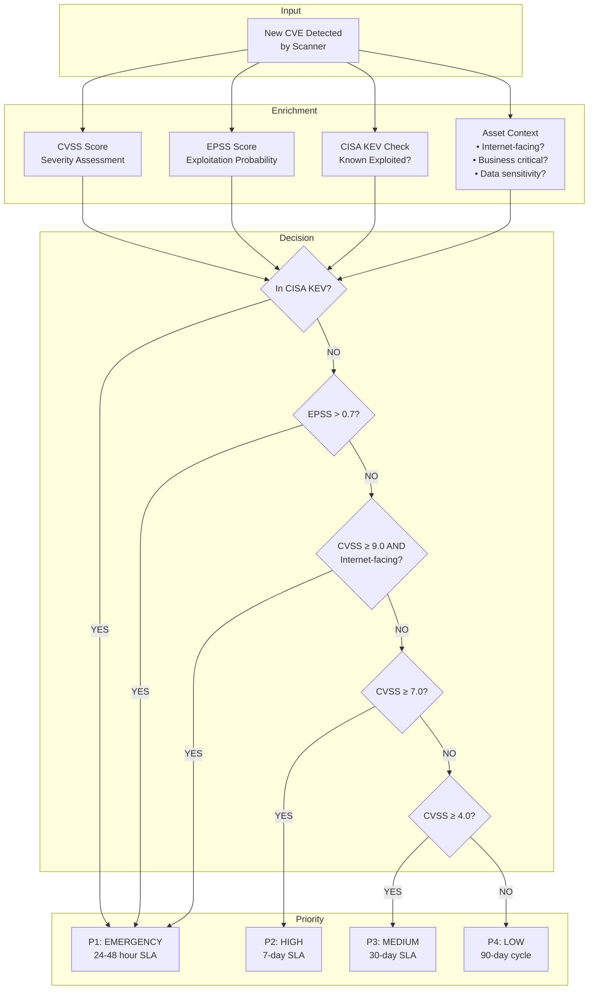
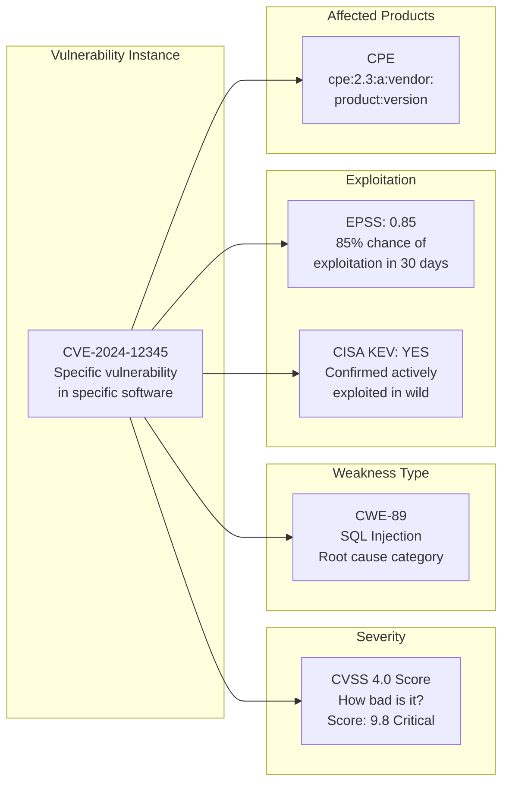

# CVE, CVSS & Vulnerability Management — NVD, EPSS, CWE

**Topic:** Vulnerability identification, scoring, and management — CVE, CVSS v4.0, EPSS, CWE, NVD  
**Standard:** CVE Program (MITRE/CISA); CVSS v4.0 (FIRST); CWE (MITRE); EPSS (FIRST)  
**SDO:** MITRE Corporation (CVE, CWE); FIRST.org (CVSS, EPSS); NIST (NVD)  
**Audience:** Vulnerability management teams, SOC analysts, AppSec engineers, risk managers, patch management teams  
**Prerequisites:** Basic networking, software development concepts, understanding of common vulnerability types

---

## Chapter 1 — Historical Context & Origin Story

### 1.1 Timeline

| Year | Event | Significance |
|------|-------|-------------|
| 1999 | **CVE Program launched** (MITRE) | Common naming for vulnerabilities; eliminated duplication across scanners |
| 1999 | CVE-1999-0001 (first CVE) | IP fragment reassembly vulnerability in BSD |
| 2002 | NVD established (NIST) | US government repository; enriches CVEs with CVSS scores |
| 2004 | **CWE project started** | Taxonomy of software/hardware weakness types |
| 2005 | **CVSS v1** published | First standard scoring system for vulnerabilities |
| 2007 | **CVSS v2** published (FIRST) | Improved; widely adopted; base/temporal/environmental |
| 2015 | **CVSS v3.0** published | Major redesign; 0-10 scale; scope concept; attack complexity |
| 2019 | **CVSS v3.1** published | Clarifications to v3.0; current widely-used version |
| 2020 | CVE Numbering Authorities (CNAs) expansion | 200+ organizations can assign CVEs (distributed model) |
| 2021 | **EPSS v1** published (FIRST) | Exploit Prediction Scoring System; probability-based prioritization |
| 2022 | CISA KEV catalog launched | Known Exploited Vulnerabilities; mandatory for US federal |
| 2023 | **CVSS v4.0** published (November 2023) | Major update; granularity; supplemental metrics; replaces v3.1 |
| 2024 | CVE Program transition concerns | Funding/governance discussions; brief uncertainty (resolved) |
| 2024 | NVD backlog crisis | NIST processing delays; community concern over enrichment speed |
| 2024 | EPSS v3 | Improved prediction model; broader adoption |

### 1.2 Vulnerability Ecosystem

```mermaid
graph TB
    subgraph "Vulnerability Discovery"
        DISC[Researcher finds vulnerability<br/>• Bug bounty programs<br/>• Internal testing<br/>• Academic research<br/>• Adversary exploitation (0-day)]
    end
    
    subgraph "CVE Assignment"
        CNA[CVE Numbering Authority (CNA)<br/>• Assigns CVE ID (CVE-YYYY-NNNNN)<br/>• 300+ CNAs globally<br/>• Vendor CNAs (Microsoft, Google, etc.)<br/>• MITRE as CNA of Last Resort]
    end
    
    subgraph "Enrichment"
        NVD_E[NVD (NIST)<br/>• CVSS base score<br/>• CWE classification<br/>• CPE (affected products)<br/>• References]
        EPSS_E[EPSS (FIRST)<br/>• Exploitation probability<br/>• Daily updated<br/>• 0-1 score (0%-100%)]
        KEV[CISA KEV<br/>• Confirmed exploited<br/>• Mandatory patching timeline<br/>• Federal binding directive]
    end
    
    subgraph "Consumption"
        VM[Vulnerability Management<br/>• Scanners (Tenable, Qualys, Rapid7)<br/>• Prioritization<br/>• Remediation tracking<br/>• SLA enforcement]
    end
    
    DISC --> CNA --> NVD_E --> VM
    CNA --> EPSS_E --> VM
    CNA --> KEV --> VM
```

---

## Chapter 2 — Standard Architecture & Structure

### 2.1 CVE (Common Vulnerabilities and Exposures)

| Component | Description |
|-----------|-------------|
| CVE ID | Unique identifier: CVE-YYYY-NNNNN (year + sequential number) |
| Description | Brief description of the vulnerability |
| References | URLs to advisories, patches, exploit details |
| State | Published, Reserved, Rejected |
| CNA | Organization that assigned the CVE |
| CPE | Common Platform Enumeration (affected products) |
| Date | Date public, date assigned |

**CVE ID Format:** `CVE-2024-12345`
- CVE = prefix (always)
- 2024 = year assigned (not necessarily year discovered/published)
- 12345 = sequential number (can be 4-7+ digits)

### 2.2 CVSS v4.0 Metric Groups

```mermaid
graph TB
    subgraph "CVSS v4.0 Scoring System"
        subgraph "Base Metrics (Mandatory)"
            BM[Base Score<br/>━━━━━━━━━━━━━<br/>Exploitability:<br/>• Attack Vector (AV)<br/>• Attack Complexity (AC)<br/>• Attack Requirements (AT) ★NEW<br/>• Privileges Required (PR)<br/>• User Interaction (UI)<br/>━━━━━━━━━━━━━<br/>Impact:<br/>• Vuln System: C/I/A<br/>• Subsequent System: C/I/A ★NEW]
        end
        
        subgraph "Threat Metrics"
            TM[Threat Score<br/>━━━━━━━━━━━━━<br/>• Exploit Maturity (E)<br/>  - Attacked, POC, Unreported]
        end
        
        subgraph "Environmental Metrics"
            EM[Environmental Score<br/>━━━━━━━━━━━━━<br/>• Modified Base Metrics<br/>• Security Requirements (CR/IR/AR)]
        end
        
        subgraph "Supplemental Metrics ★NEW"
            SM[Supplemental (informational)<br/>━━━━━━━━━━━━━<br/>• Safety (S)<br/>• Automatable (AU)<br/>• Recovery (R)<br/>• Value Density (V)<br/>• Vulnerability Response Effort (RE)<br/>• Provider Urgency (U)]
        end
    end
    
    BM --> TM --> EM
    SM -.->|"Informational only<br/>Does not change score"| BM
```

### 2.3 CVSS v4.0 Base Metrics Detail

| Metric | Values | Description |
|--------|--------|-------------|
| **Attack Vector (AV)** | Network (N), Adjacent (A), Local (L), Physical (P) | How the attacker reaches the vulnerability |
| **Attack Complexity (AC)** | Low (L), High (H) | Conditions beyond attacker control (race conditions, etc.) |
| **Attack Requirements (AT)** ★NEW | None (N), Present (P) | Pre-conditions for attack (specific config, etc.) |
| **Privileges Required (PR)** | None (N), Low (L), High (H) | Authentication level needed |
| **User Interaction (UI)** | None (N), Passive (P) ★NEW, Active (A) ★NEW | User action required |
| **Vuln System Confidentiality (VC)** | None (N), Low (L), High (H) | C impact on vulnerable system |
| **Vuln System Integrity (VI)** | None (N), Low (L), High (H) | I impact on vulnerable system |
| **Vuln System Availability (VA)** | None (N), Low (L), High (H) | A impact on vulnerable system |
| **Subsequent System Confidentiality (SC)** ★NEW | None (N), Low (L), High (H) | C impact on other systems |
| **Subsequent System Integrity (SI)** ★NEW | None (N), Low (L), High (H) | I impact on other systems |
| **Subsequent System Availability (SA)** ★NEW | None (N), Low (L), High (H) | A impact on other systems |

### 2.4 CWE (Common Weakness Enumeration) Structure

| Level | Description | Example |
|-------|-------------|---------|
| Pillar | Highest abstraction | CWE-682: Incorrect Calculation |
| Class | General behavior | CWE-20: Improper Input Validation |
| Base | More specific | CWE-79: Cross-site Scripting (XSS) |
| Variant | Most specific | CWE-80: Improper Neutralization of Script-Related HTML Tags (Basic XSS) |

**CWE Top 25 Most Dangerous Software Weaknesses (2023):**

| Rank | CWE ID | Name |
|------|--------|------|
| 1 | CWE-787 | Out-of-bounds Write |
| 2 | CWE-79 | Cross-site Scripting |
| 3 | CWE-89 | SQL Injection |
| 4 | CWE-416 | Use After Free |
| 5 | CWE-78 | OS Command Injection |
| 6 | CWE-20 | Improper Input Validation |
| 7 | CWE-125 | Out-of-bounds Read |
| 8 | CWE-22 | Path Traversal |
| 9 | CWE-352 | Cross-Site Request Forgery (CSRF) |
| 10 | CWE-434 | Unrestricted File Upload |

---

## Chapter 3 — Technical Deep Dive

### 3.1 CVSS v4.0 Scoring Examples

**Example 1: Remote Code Execution (Critical)**
```
Vulnerability: Unauthenticated RCE in web server
Vector: CVSS:4.0/AV:N/AC:L/AT:N/PR:N/UI:N/VC:H/VI:H/VA:H/SC:H/SI:H/SA:H
Score: 10.0 (Critical)

Explanation:
- Network-accessible (AV:N)
- No special conditions (AC:L, AT:N)
- No authentication needed (PR:N)
- No user interaction (UI:N)
- Complete compromise of vulnerable + subsequent systems (all High)
```

**Example 2: Local Privilege Escalation (High)**
```
Vulnerability: Kernel privilege escalation via race condition
Vector: CVSS:4.0/AV:L/AC:H/AT:N/PR:L/UI:N/VC:H/VI:H/VA:H/SC:N/SI:N/SA:N
Score: 7.8 (High)

Explanation:
- Local access required (AV:L)
- Race condition timing (AC:H)
- Needs unprivileged user access (PR:L)
- Full compromise of vulnerable system only
- No impact on subsequent systems
```

**Example 3: Reflected XSS (Medium)**
```
Vulnerability: Reflected XSS requiring user click
Vector: CVSS:4.0/AV:N/AC:L/AT:N/PR:N/UI:A/VC:N/VI:L/VA:N/SC:L/SI:L/SA:N
Score: 5.1 (Medium)

Explanation:
- Network-accessible (AV:N)
- Active user interaction required (UI:A) — must click malicious link
- Low integrity impact on vulnerable system
- Low C/I impact on subsequent system (session theft affects other apps)
```

### 3.2 CVSS v3.1 vs. v4.0 Changes

| Aspect | CVSS v3.1 | CVSS v4.0 |
|--------|-----------|-----------|
| Scope metric | "Scope" (Changed/Unchanged) | **Removed**; replaced by Subsequent System impact metrics (SC/SI/SA) |
| Attack Requirements | Not present | **AT metric** (None/Present) — prerequisite deployment conditions |
| User Interaction | None/Required | **None/Passive/Active** (more granular) |
| Impact metrics | Single C/I/A | **Vulnerable System C/I/A + Subsequent System C/I/A** (6 metrics vs. 3) |
| Temporal metrics | Temporal (Exploit Code, Remediation, Report Confidence) | **Threat Metrics** (simplified to Exploit Maturity only) |
| Supplemental metrics | Not present | **NEW**: Safety, Automatable, Recovery, Value Density, Response Effort, Provider Urgency |
| Naming | Base/Temporal/Environmental | CVSS-B, CVSS-BT, CVSS-BE, CVSS-BTE (composite naming) |
| Score range | 0-10 | 0-10 (same scale) |
| Qualitative rating | None, Low, Medium, High, Critical | Same + Clear boundary definitions |

### 3.3 EPSS (Exploit Prediction Scoring System)

| Aspect | Detail |
|--------|--------|
| Purpose | Predict probability a vulnerability will be exploited in the wild within next 30 days |
| Scale | 0.0 to 1.0 (0% to 100% probability) |
| Model | Machine learning model using 1,000+ features (CVE attributes, exploit databases, social media, dark web mentions, vendor, age, etc.) |
| Update frequency | **Daily** (scores change as threat landscape evolves) |
| Key insight | Only ~2-7% of CVEs are ever exploited. EPSS helps focus on those most likely. |
| Percentile | Each score includes percentile (e.g., 0.5 = higher than 50% of all CVEs) |
| Usage | Combined with CVSS: CVSS = severity IF exploited; EPSS = likelihood OF exploitation |

**EPSS Decision Matrix:**

| CVSS Severity | EPSS Score | Priority | Action |
|--------------|------------|----------|--------|
| Critical (9.0-10.0) | High (>0.5) | **P1 — EMERGENCY** | Patch within 24-48 hours |
| Critical (9.0-10.0) | Low (<0.1) | P2 — High | Patch within 7 days |
| High (7.0-8.9) | High (>0.5) | **P1 — EMERGENCY** | Patch within 24-48 hours |
| High (7.0-8.9) | Low (<0.1) | P3 — Medium | Patch within 30 days |
| Medium (4.0-6.9) | High (>0.5) | P2 — High | Patch within 7-14 days |
| Medium (4.0-6.9) | Low (<0.1) | P4 — Low | Patch in regular cycle (90 days) |
| Low (0.1-3.9) | Any | P4-P5 | Regular maintenance cycle |

### 3.4 CISA KEV (Known Exploited Vulnerabilities)

| Field | Description |
|-------|-------------|
| CVE ID | The vulnerability being actively exploited |
| Vendor/Product | Affected software/hardware |
| Vulnerability Name | Short description |
| Date Added | When added to KEV catalog |
| Due Date | Deadline for federal remediation (typically 2-3 weeks) |
| Required Action | What must be done (apply update, apply workaround, discontinue use) |
| Known Ransomware Campaign Use | Yes/No — associated with ransomware |

**BOD 22-01 Requirements:**
- US Federal civilian agencies MUST remediate KEV vulnerabilities by due date
- Non-federal organizations strongly recommended to use KEV for prioritization
- ~1,100+ vulnerabilities in catalog (growing weekly)

---

## Chapter 4 — Implementation Guide

### 4.1 Vulnerability Management Program Architecture

```mermaid
graph TB
    subgraph "Discovery & Inventory"
        ASSET[Asset Inventory<br/>• All systems cataloged<br/>• Ownership assigned<br/>• Criticality rated<br/>• Update schedule defined]
    end
    
    subgraph "Scanning & Detection"
        SCAN[Vulnerability Scanning<br/>• Network scanners (authenticated)<br/>• Agent-based scanning<br/>• Container/image scanning<br/>• Cloud configuration scanning<br/>• Frequency: weekly+ (critical assets daily)]
    end
    
    subgraph "Prioritization"
        PRI[Risk-Based Prioritization<br/>• CVSS score (severity)<br/>• EPSS score (exploitability likelihood)<br/>• CISA KEV (confirmed exploitation)<br/>• Asset criticality<br/>• Exposure (internet-facing?)<br/>• Compensating controls]
    end
    
    subgraph "Remediation"
        REM[Remediation Actions<br/>• Patch (primary)<br/>• Workaround/mitigation (temporary)<br/>• Virtual patching (WAF/IPS)<br/>• Accept risk (documented)<br/>• Decommission asset]
    end
    
    subgraph "Verification"
        VER[Verification & Reporting<br/>• Re-scan to confirm fix<br/>• SLA compliance tracking<br/>• Executive dashboard<br/>• Trend analysis<br/>• Audit evidence]
    end
    
    ASSET --> SCAN --> PRI --> REM --> VER
    VER -->|"Continuous cycle"| SCAN
```

### 4.2 Remediation SLA Recommendations

| Severity | CVSS Score | Internet-Facing | Internal | Exception Process |
|----------|-----------|-----------------|----------|-------------------|
| Critical | 9.0-10.0 | **24-48 hours** | 7 days | CISO approval required |
| High | 7.0-8.9 | 7 days | 14 days | Manager approval |
| Medium | 4.0-6.9 | 30 days | 30-60 days | Standard process |
| Low | 0.1-3.9 | 90 days | 90-180 days | Standard process |
| CISA KEV | Any | **Per KEV due date** (typically 14-21 days) | Same | No exceptions (federal) |
| EPSS > 0.7 | Any | Treat as Critical (regardless of CVSS) | 7 days | CISO approval |

### 4.3 Vulnerability Management Tool Landscape

| Category | Tools | Key Features |
|----------|-------|-------------|
| Enterprise VM | Tenable (Nessus/IO), Qualys VMDR, Rapid7 InsightVM | Network + agent scanning; risk scoring; compliance; large scale |
| Cloud Security | Wiz, Orca, Prisma Cloud, AWS Inspector | Agentless cloud scanning; IaC; container; misconfiguration |
| Container/DevOps | Trivy, Snyk Container, Aqua, Anchore | Image scanning; CI/CD integration; SBOM |
| SCA (Dependencies) | Snyk, Dependabot (GitHub), Mend (WhiteSource), OWASP Dependency-Check | Open source library vulnerability detection |
| DAST | Burp Suite Pro, OWASP ZAP, HCL AppScan | Running application vulnerability testing |
| SAST | SonarQube, Checkmarx, Semgrep, CodeQL | Source code vulnerability detection |
| Attack Surface Mgmt | Shodan, Censys, runZero, CrowdStrike Falcon Surface | External asset discovery; exposure detection |
| Prioritization | Kenna.VM (Cisco), Nucleus, Vulcan Cyber | Multi-source aggregation; risk-based prioritization |

---

## Chapter 5 — Operational Practices

### 5.1 CVE Lifecycle

```mermaid
graph LR
    subgraph "Discovery"
        D1[Vulnerability Found<br/>• Researcher<br/>• Vendor<br/>• Automated tool<br/>• In-the-wild (0-day)]
    end
    
    subgraph "Reporting"
        R1[CVE Requested<br/>• Submit to CNA<br/>• Vendor-specific process<br/>• MITRE if no CNA<br/>• Coordinated disclosure]
    end
    
    subgraph "Assignment"
        A1[CVE Assigned<br/>• CVE-YYYY-NNNNN<br/>• Initially RESERVED<br/>• Details embargoed<br/>• Until public disclosure]
    end
    
    subgraph "Publication"
        P1[CVE Published<br/>• Description public<br/>• References added<br/>• NVD enriches (CVSS, CPE)<br/>• Scanners detect]
    end
    
    subgraph "Lifecycle"
        LC[Ongoing<br/>• EPSS score updated daily<br/>• CVSS may be revised<br/>• KEV added if exploited<br/>• Patches released<br/>• EOL: REJECTED if invalid]
    end
    
    D1 --> R1 --> A1 --> P1 --> LC
```

### 5.2 Coordinated Vulnerability Disclosure Process

| Phase | Timeline | Activity |
|-------|----------|----------|
| Discovery | Day 0 | Researcher finds vulnerability |
| Report | Day 0-7 | Reporter contacts vendor/CNA (encrypted channel) |
| Acknowledgment | Day 7-14 | Vendor confirms receipt; assigns internal tracking |
| Analysis | Day 14-45 | Vendor reproduces; assesses severity; develops fix |
| CVE Assignment | Day 14-30 | CNA assigns CVE ID (reserved/embargoed) |
| Patch Development | Day 30-90 | Vendor creates and tests patch |
| Coordinated Disclosure | Day 90 (typical) | Simultaneous: patch released + CVE published + advisory |
| Public | Day 90+ | NVD enriches; scanners update; EPSS calculates |

**Standard disclosure timelines:**
- Google Project Zero: 90 days (strict)
- Microsoft: Patch Tuesday cycle
- CERT/CC: 45 days
- Industry standard: 90 days (with possible extension for complex fixes)

### 5.3 Vulnerability Metrics & KPIs

| Metric | Formula | Target |
|--------|---------|--------|
| Mean Time to Remediate (MTTR) — Critical | Avg days from detection to patch (critical vulns) | <7 days |
| Mean Time to Remediate — High | Avg days from detection to patch (high vulns) | <14 days |
| Scan Coverage | Assets scanned / Total assets × 100 | >95% |
| SLA Compliance Rate | Vulns patched within SLA / Total vulns × 100 | >90% |
| KEV Compliance | KEVs remediated by due date / Total KEVs × 100 | 100% (mandatory for federal) |
| Vulnerability Density | Open vulns per asset | Trending down |
| Reintroduction Rate | Vulns reappearing after remediation / Total remediated | <5% |
| False Positive Rate | FP findings / Total findings | <10% |
| Exception Rate | Risk-accepted vulns / Total critical+high vulns | <5% |

---

## Chapter 6 — Regional & Domain Variants

### 6.1 National Vulnerability Databases

| Country/Region | Database | Scope |
|---------------|----------|-------|
| USA | **NVD** (NIST) | Primary global enrichment source; CVSS scoring; CPE |
| China | **CNVD** (CNNVD) | Chinese National Vulnerability Database; Chinese products |
| Japan | **JVN** (JPCERT/CC + IPA) | Japanese Vulnerability Notes; local context |
| EU | **ENISA** vulnerability reporting | European coordination; NIS2-driven |
| Germany | **CERT-Bund** / BSI | German federal vulnerability advisories |
| South Korea | **KrCERT/CC** | Korean vulnerability coordination |
| India | **CERT-In** | Indian vulnerability database; advisories |
| Russia | **BDU FSTEC** | Russian vulnerability database |

### 6.2 Sector-Specific Vulnerability Requirements

| Sector | Requirement | Standard/Regulation |
|--------|-------------|-------------------|
| US Federal | Must remediate CISA KEV by deadline | BOD 22-01 (mandatory) |
| Financial (US) | Risk-based vulnerability management | FFIEC guidance |
| Healthcare | Address known vulnerabilities | HIPAA Security Rule §164.308(a)(1) |
| PCI (Payment) | Quarterly external scans (ASV); critical patches within 30 days | PCI DSS v4.0 Req 6, 11 |
| Automotive | TARA vulnerability analysis | ISO/SAE 21434 |
| EU (NIS2) | Coordinated vulnerability disclosure | NIS2 Article 12 |
| DoD | CMMC practices; STIG compliance | CMMC 2.0; DISA STIGs |

---

## Chapter 7 — Comparison

### 7.1 CVSS v3.1 vs. CVSS v4.0

| Aspect | CVSS v3.1 | CVSS v4.0 |
|--------|-----------|-----------|
| Release | June 2019 | November 2023 |
| Exploitability metrics | AV, AC, PR, UI, S | AV, AC, **AT**, PR, UI (no Scope; added Attack Requirements) |
| Impact metrics | C, I, A (single system) | **VC, VI, VA** + **SC, SI, SA** (vulnerable + subsequent systems) |
| User Interaction | None / Required | None / **Passive** / **Active** |
| Temporal | 3 metrics (E, RL, RC) | **1 metric** (Exploit Maturity only) — simplified |
| Environmental | Modified base + CR/IR/AR | Same approach; clearer guidance |
| Supplemental | N/A | **6 new metrics** (Safety, Automatable, Recovery, Value Density, RE, Urgency) |
| Score nomenclature | Base, Temporal, Environmental | CVSS-B, CVSS-BT, CVSS-BE, CVSS-BTE |
| Criticism addressed | Over-inflation (everything is "High/Critical") | Better granularity; more realistic scoring |
| Adoption | Currently dominant (2024) | Transitioning (NVD adopting; vendors following) |

### 7.2 CVSS vs. EPSS vs. SSVC

| Dimension | CVSS | EPSS | SSVC |
|-----------|------|------|------|
| What it measures | **Severity** (how bad if exploited) | **Likelihood** (probability of exploitation) | **Decision** (what action to take) |
| Output | 0-10 score | 0-1 probability | Decision tree (Act/Attend/Track/Track*) |
| Answers | "How severe is this vulnerability?" | "How likely is this to be exploited?" | "What should I do about this?" |
| Updates | Fixed per CVE (rare revision) | **Daily** (dynamic) | Per assessment (organizational context) |
| Context | None (intrinsic properties only for base) | Threat landscape (external data) | Organizational (mission, exposure, utility) |
| Best for | Understanding technical severity | Prioritizing by exploit likelihood | Making remediation decisions |
| Alone sufficient? | No (no context) | No (no severity) | Closest to complete decision | 
| Developer | FIRST.org | FIRST.org | CISA/Carnegie Mellon |

---

## Chapter 8 — Mermaid Architecture Diagrams

### 8.1 Vulnerability Prioritization Decision Flow



### 8.2 CVE → CVSS → CWE Relationship



---

## Chapter 9 — Case Studies

### 9.1 Log4Shell (CVE-2021-44228) — Vulnerability Management Under Pressure

| Aspect | Detail |
|--------|--------|
| CVE | CVE-2021-44228 (Log4Shell) |
| Disclosure | December 9, 2021 (publicly disclosed; already being exploited) |
| CVSS | 10.0 (AV:N/AC:L/PR:N/UI:N/S:C/C:H/I:H/A:H) — maximum severity |
| CWE | CWE-502 (Deserialization of Untrusted Data) + CWE-400 + CWE-917 |
| EPSS | 0.976 (97.6% exploitation probability — among highest ever) |
| KEV | Added Day 1 (December 10, 2021); due date December 24, 2021 |
| Impact | Apache Log4j (Java logging library) — embedded in millions of applications; most ubiquitous Java dependency |
| Challenge | (1) Identifying all affected systems (transitive dependency; not visible to network scanners). (2) Massive scope: virtually every Java application potentially affected. (3) Multiple variants: CVE-2021-44228, CVE-2021-45046, CVE-2021-45105. (4) Patching requires recompilation/redeployment of Java applications. |
| Lessons for VM | (1) **SBOM necessity**: Organizations without Software Bill of Materials couldn't identify affected systems. (2) **Transitive dependencies**: Library used by libraries (log4j → hundreds of upstream libraries). (3) **SLA compression**: 14-day KEV deadline impossible for many organizations (too many systems). (4) **Compensating controls**: WAF rules, network-level blocking of JNDI, JVM flag (-Dlog4j2.formatMsgNoLookups=true) as interim mitigations. (5) **Prioritization**: Not all Log4j instances were exploitable (version + configuration dependent). EPSS + exposure context critical for prioritization. |

### 9.2 Building a Risk-Based VM Program from Scratch

| Aspect | Detail |
|--------|--------|
| Organization | Mid-size financial services company; 500 servers; 2,000 endpoints; AWS cloud; 50 web applications |
| Initial state | Quarterly Nessus scans only; 45,000 open vulnerabilities; no prioritization; average patch time: 120 days; no SLAs |
| Transformation | 12-month program to implement risk-based vulnerability management |
| Phase 1 (Months 1-3) | **Asset inventory + classification**: Identified all assets; assigned business criticality (1-5); identified internet-facing (127 assets). Deployed Tenable.io agents on all systems. Moved to weekly authenticated scanning. Immediate finding: 45,000 vulns, but only 3,200 were Critical/High on internet-facing or critical assets. |
| Phase 2 (Months 3-6) | **Prioritization framework**: Implemented CVSS + EPSS + KEV + asset context scoring. Priority formula: `Priority = CVSS × Asset_Criticality × Exposure_Factor × EPSS_Multiplier × KEV_Multiplier`. Result: 45,000 vulns → 850 P1/P2 (requiring urgent action). Established SLAs: P1=48hr, P2=7d, P3=30d, P4=90d. |
| Phase 3 (Months 6-9) | **Remediation operations**: Automated patch deployment (SCCM for Windows; Ansible for Linux; Dependabot for code). Vulnerability exception process (CISO approval for P1/P2). Tracking dashboard (Tenable + ServiceNow integration). SLA compliance tracked weekly. |
| Phase 4 (Months 9-12) | **Maturity + metrics**: Mean Time to Remediate Critical: 120 days → 4 days. SLA compliance: 0% (no SLAs existed) → 87%. Open critical/high vulns: 12,000 → 1,200. KEV compliance: 100%. Reduced "vulnerability noise" for teams by 80% (only see their prioritized vulns). |
| Results | Insurance premium reduced 20%. Passed regulatory audit (previously had findings). Zero exploited vulnerabilities in 12-month period. |
| Cost | $350K year 1 (Tenable.io $80K, patch automation $50K, FTE $180K, ServiceNow integration $40K) |

---

## Chapter 10 — Future Evolution & Industry Trends

| Trend | Timeline | Impact |
|-------|----------|--------|
| CVSS v4.0 adoption | 2024-2026 | NVD transitioning to v4.0 scoring; vendors following; dual scoring period |
| EPSS becoming standard | Now | Increasingly integrated into VM platforms; becoming as important as CVSS |
| VEX (Vulnerability Exploitability eXchange) | Now-2025 | Machine-readable statements about whether a product is affected by CVE |
| SBOM + vulnerability linking | Now-2026 | SBOM enables precise vulnerability impact assessment (no more "is Log4j in my stack?") |
| AI-powered vulnerability detection | 2024-2026 | AI finding vulnerabilities faster; potential explosion of CVE volume |
| CVE volume growth | Now | 30,000+ CVEs/year (growing); overwhelming traditional processes |
| NVD modernization | 2024-2025 | Addressing backlog; potentially new enrichment model |
| Automated remediation | Now-2026 | Auto-patching for low-risk systems; human approval for critical |
| Continuous VM (vs. periodic) | Now | Moving from weekly scans to real-time vulnerability awareness |
| Regulatory mandates (KEV, NIS2) | Now | Mandatory vulnerability remediation timelines becoming law |
| Vulnerability prioritization intelligence | Now | Multi-factor prioritization becoming standard (CVSS alone insufficient) |

---

## Chapter 11 — Interview Questions & Career Guide

### Tier 1: Entry-Level (VM Analyst)

**Q1:** Explain the difference between CVE, CVSS, CWE, and CPE.  
**A:** These are four complementary standards in the vulnerability ecosystem: **CVE (Common Vulnerabilities and Exposures)** = unique identifier for a specific vulnerability (CVE-2024-12345). It's like a social security number for a bug. **CVSS (Common Vulnerability Scoring System)** = severity score (0-10) for a CVE. Tells you how bad the vulnerability is IF exploited. Current version: CVSS v4.0. **CWE (Common Weakness Enumeration)** = category of the underlying software weakness. Answers "what type of bug is this?" (e.g., CWE-89 = SQL Injection, CWE-79 = XSS). One CWE type can have thousands of CVEs. **CPE (Common Platform Enumeration)** = machine-readable name for affected products (e.g., `cpe:2.3:a:apache:log4j:2.14.1`). Used by scanners to match vulnerabilities to installed software. Together: CPE tells you what's affected, CVE identifies the specific bug, CWE categorizes the root cause, CVSS scores the severity.

**Q2:** A scan returns 5,000 vulnerabilities. How do you prioritize which to fix first?  
**A:** I would NOT sort by CVSS alone (common mistake — most things are "High"). Instead, I'd use multi-factor prioritization: (1) **CISA KEV first**: Any vulnerability on the Known Exploited Vulnerabilities list gets immediate priority — these are confirmed exploited RIGHT NOW. (2) **EPSS score**: Vulnerabilities with EPSS > 0.5 (50%+ exploitation probability) get elevated regardless of CVSS. (3) **CVSS severity** combined with **asset context**: Critical CVSS (9-10) on internet-facing, business-critical systems = highest priority. Same CVSS on internal test server = lower priority. (4) **Compensating controls**: If WAF/network controls already mitigate the vulnerability, lower the effective priority. (5) **Practical formula**: `Priority = CVSS × Exposure × Asset_Criticality × EPSS_Factor × KEV_Factor`. This typically reduces 5,000 vulns to ~200-500 that need urgent action, making the workload manageable.

### Tier 2: Mid-Level (VM Engineer / AppSec)

**Q3:** Walk through how CVSS v4.0 scores a vulnerability differently from v3.1, using a specific example.  
**A:**

**Example: Server-Side Request Forgery (SSRF) that can reach internal metadata service (like AWS IMDS)**

**CVSS v3.1 scoring:**
- AV:N / AC:L / PR:N / UI:N / **S:C** / C:H / I:N / A:N
- The "Scope Changed" (S:C) indicates impact beyond the vulnerable component (SSRF reaches other internal systems)
- Score: **9.1 Critical**
- Problem: S:C is binary (Changed or Unchanged) — doesn't capture DEGREE of subsequent impact

**CVSS v4.0 scoring:**
- AV:N / AC:L / **AT:P** / PR:N / UI:N / **VC:N / VI:N / VA:N** / **SC:H / SI:N / SA:N**
- **AT:P (Attack Requirements: Present)** — requires specific configuration (metadata service accessible without IMDSv2)
- **VC/VI/VA: None** — no impact on vulnerable web server itself
- **SC:H (Subsequent Confidentiality: High)** — high impact on OTHER systems (metadata service exposes credentials)
- **SI:N / SA:N** — no integrity/availability impact on subsequent systems
- Score: **8.2 High** (more accurate — reflects that exploitation requires specific conditions)

**Key improvements in v4.0:**
1. AT:P captures that not all instances are exploitable (specific config needed)
2. Separate VC/SC metrics show WHERE impact occurs (subsequent system, not vulnerable system)
3. More realistic score (8.2 vs. 9.1) — v3.1 overinflated via Scope:Changed

### Tier 3: Senior (VM Program Lead / CISO)

**Q4:** Design a vulnerability management program that scales from 1,000 to 50,000 assets while maintaining SLA compliance and without overwhelming remediation teams.  
**A:** [Full answer covers: (1) Tiered scanning architecture: agents for endpoints (always-on), network scanning for infrastructure (weekly), container scanning in CI/CD (every build), cloud API scanning (continuous). (2) Federated ownership: vulnerability data routed to asset owners automatically (not central team fixing everything). (3) Risk-based prioritization at scale: CVSS + EPSS + KEV + asset context + compensating controls → automated priority assignment. Only P1/P2 generate tickets; P3/P4 in dashboards. (4) Automation: auto-patching for standard workloads (Windows Update/WSUS); auto-redeployment for containers (new image); manual only for complex/critical. (5) Exception management: risk-accepted vulns must have compensating controls documented and re-reviewed quarterly. (6) Metrics by business unit: each team owns their SLA compliance; executive dashboard aggregates. (7) Continuous improvement: track MTTR trends, SLA compliance, reintroduction rates. (8) Tooling: enterprise VM platform + ServiceNow integration + SOAR for automated ticketing + SBOM for dependency tracking.]

---

## Chapter 12 — Cheat Sheet & Quick Reference

### Key Standards Summary

```
CVE:    Unique vulnerability identifier (CVE-YYYY-NNNNN)
CVSS:   Severity score (0-10) — how bad IF exploited
EPSS:   Exploitation probability (0-100%) — how likely TO BE exploited
CWE:    Weakness type classification — root cause category
CPE:    Affected product identifier — what's vulnerable
NVD:    US government database — enriches CVEs with scores
KEV:    CISA's list of CONFIRMED actively exploited vulns
VEX:    Vendor statement on applicability of CVE to their product
```

### CVSS v4.0 Qualitative Ratings

```
None:     0.0
Low:      0.1 – 3.9
Medium:   4.0 – 6.9
High:     7.0 – 8.9
Critical: 9.0 – 10.0
```

### Prioritization Quick Formula

```
IF in CISA KEV → P1 (EMERGENCY) — patch NOW
IF EPSS > 0.7  → P1 (even if CVSS is medium)
IF CVSS ≥ 9.0 + Internet-facing → P1
IF CVSS ≥ 7.0 → P2 (within 7-14 days)
IF CVSS ≥ 4.0 → P3 (within 30 days)
ELSE → P4 (regular maintenance cycle, 90 days)
```

### Remediation SLA Targets

```
P1 Critical/Exploited:     24-48 hours
P2 High:                   7 days
P3 Medium:                 30 days
P4 Low:                    90 days
CISA KEV:                  Per KEV due date (14-21 days)
```

### CWE Top 5 (Know These)

```
CWE-787:  Out-of-bounds Write (memory corruption)
CWE-79:   Cross-site Scripting (XSS)
CWE-89:   SQL Injection
CWE-416:  Use After Free
CWE-78:   OS Command Injection
```

### Key VM Metrics

```
MTTR (Critical):     Target < 7 days
SLA Compliance:      Target > 90%
Scan Coverage:       Target > 95% of assets
KEV Compliance:      Target = 100%
Vuln Density Trend:  Must be decreasing
```

---

*End of Document — 08_CVE_CVSS_Vulnerability_Mgmt.md*
