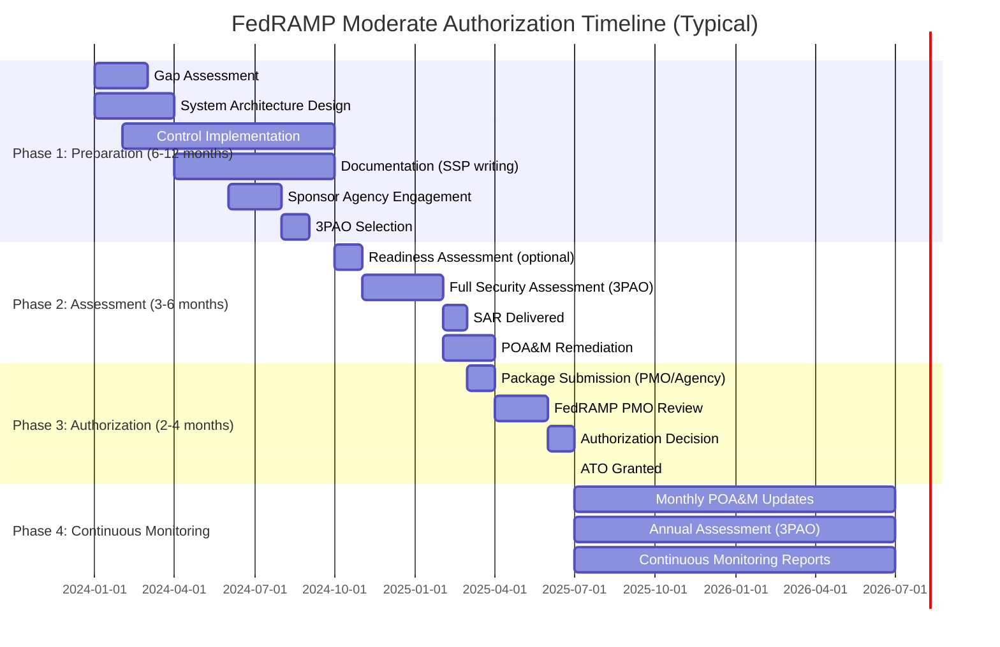

# FedRAMP & CMMC 2.0 — US Federal Cybersecurity Compliance

**Topic:** FedRAMP (Federal Risk and Authorization Management Program) & CMMC 2.0 (Cybersecurity Maturity Model Certification)  
**Standard:** FedRAMP (based on NIST SP 800-53); CMMC 2.0 (based on NIST SP 800-171 Rev2)  
**SDO:** FedRAMP PMO (GSA/OMB/DHS/DOD); DoD (CMMC Program)  
**Audience:** Cloud service providers seeking federal authorization, defense contractors, GRC managers, ISSOs, compliance officers  
**Prerequisites:** NIST SP 800-53, NIST SP 800-171, FIPS 199/200, cloud computing concepts, US federal procurement fundamentals

---

## Chapter 1 — Historical Context & Origin Story

### 1.1 FedRAMP Timeline

| Year | Event | Significance |
|------|-------|-------------|
| 2011 | FedRAMP established (OMB memo) | Standardize cloud security assessment for federal agencies |
| 2012 | FedRAMP PMO operational | First authorizations begin; Joint Authorization Board (JAB) established |
| 2014 | FedRAMP Accelerated program | Faster authorization path for IaaS/PaaS |
| 2016 | FedRAMP Tailored (Low baseline) | Simplified path for low-impact SaaS |
| 2017 | FedRAMP marketplace launched | Public listing of authorized CSPs |
| 2019 | FedRAMP Moderate dominance | ~80% of authorizations at Moderate baseline |
| 2022 | **FedRAMP Authorization Act** (signed into law) | Codified FedRAMP into federal law; mandatory "authorize once, use many" |
| 2023 | FedRAMP Rev5 transition | Aligning with NIST SP 800-53 Rev5 |
| 2024 | FedRAMP 20x initiative | Modernization; automation; faster authorization paths |
| 2024 | FedRAMP digital authorization package | Moving from Word/PDF to machine-readable (OSCAL) |

### 1.2 CMMC Timeline

| Year | Event | Significance |
|------|-------|-------------|
| 2015 | DFARS 252.204-7012 clause | Required NIST SP 800-171 compliance for CUI |
| 2017-2019 | Self-attestation era | Contractors self-reported compliance (widespread non-compliance found) |
| 2020 | **CMMC 1.0** published | 5 levels; 171 practices + maturity processes; all DoD contracts to require |
| 2020 | CMMC-AB established | Accreditation Body for CMMC assessors |
| 2021 | **CMMC 2.0** announced (Nov 2021) | Simplified: 3 levels (from 5); removed maturity processes; aligned to 800-171 |
| 2022 | CMMC proposed rule (32 CFR) | Rulemaking begins; interim self-assessment allowed |
| 2023 | CMMC proposed rule published | Public comment period; timelines clarified |
| 2024 | **CMMC Final Rule** (32 CFR Part 170) | Published October 2024; effective December 16, 2024 |
| 2024 | **48 CFR CMMC acquisition rule** (proposed) | Defines contract clause; phased implementation begins 2025 |
| 2025-2028 | Phased rollout in contracts | CMMC requirements appearing in DoD contracts (phased over 4 years) |

---

## Chapter 2 — Standard Architecture & Structure

### 2.1 FedRAMP Architecture

```mermaid
graph TB
    subgraph "FedRAMP Baselines (Impact Levels)"
        LOW[FedRAMP Low<br/>━━━━━━━━━━━━━<br/>~156 controls<br/>For: Low-impact data<br/>Example: Public websites, collaboration tools]
        MOD[FedRAMP Moderate<br/>━━━━━━━━━━━━━<br/>~325 controls<br/>For: Controlled but not classified<br/>80% of federal cloud systems<br/>Example: Email, CRM, ERP, HR systems]
        HIGH[FedRAMP High<br/>━━━━━━━━━━━━━<br/>~421 controls<br/>For: High-impact critical systems<br/>Example: Law enforcement, financial, health<br/>Severe/catastrophic adverse effect]
    end
    
    subgraph "Authorization Paths"
        JAB_P[JAB Authorization<br/>• Joint Authorization Board<br/>• DoD + DHS + GSA CIOs<br/>• Provisional ATO (P-ATO)<br/>• Any agency can leverage<br/>• More rigorous; broader reuse]
        AGENCY_P[Agency Authorization<br/>• Single agency sponsors<br/>• Agency-specific ATO<br/>• Faster for specific use case<br/>• Other agencies can reuse]
    end
    
    subgraph "Key Roles"
        CSP[Cloud Service Provider (CSP)<br/>Implements controls; maintains SSP]
        _3PAO[Third-Party Assessment Org (3PAO)<br/>Independently assesses CSP<br/>Produces SAR (Security Assessment Report)]
        PMO[FedRAMP PMO<br/>Reviews packages; maintains standards<br/>Operates Marketplace]
    end
    
    LOW --> JAB_P
    MOD --> JAB_P
    HIGH --> JAB_P
    LOW --> AGENCY_P
    MOD --> AGENCY_P
    HIGH --> AGENCY_P
    
    CSP --> _3PAO --> PMO
```

### 2.2 CMMC 2.0 Level Structure

| Level | Name | Practices | Assessment | Data Protected | Based On |
|-------|------|-----------|-----------|----------------|----------|
| **Level 1** | Foundational | 15 practices | Self-assessment (annual) | FCI (Federal Contract Information) | FAR 52.204-21 (15 basic safeguards) |
| **Level 2** | Advanced | 110 practices | **Third-party assessment (C3PAO)** OR Self-assessment (select programs) | CUI (Controlled Unclassified Information) | NIST SP 800-171 Rev2 (all 110 requirements) |
| **Level 3** | Expert | 110+ additional practices | **Government-led assessment** (DIBCAC) | CUI + critical programs | NIST SP 800-171 Rev2 + select SP 800-172 requirements |

### 2.3 CMMC 2.0 — 14 Domains (110 Practices at Level 2)

| Domain | ID | Practices (L2) | Key Areas |
|--------|-----|:---:|-----------|
| Access Control | AC | 22 | Account management, access enforcement, remote access, least privilege |
| Awareness and Training | AT | 3 | Role-based security training, awareness |
| Audit and Accountability | AU | 9 | Audit events, logging, audit reduction, time stamps |
| Configuration Management | CM | 9 | Baseline configurations, change control, least functionality |
| Identification and Authentication | IA | 11 | Multi-factor auth, identifier management, authenticator feedback |
| Incident Response | IR | 3 | Incident handling, reporting, testing |
| Maintenance | MA | 6 | System maintenance, maintenance tools, nonlocal maintenance |
| Media Protection | MP | 9 | Media access, marking, storage, transport, sanitization |
| Personnel Security | PS | 2 | Screening, personnel actions |
| Physical Protection | PE | 6 | Physical access, monitoring, visitor control |
| Risk Assessment | RA | 3 | Risk assessment, vulnerability scanning |
| Security Assessment | CA | 4 | Assessment, system connections, plan of action |
| System and Communications Protection | SC | 16 | Boundary protection, cryptography, session authenticity |
| System and Information Integrity | SI | 7 | Flaw remediation, malicious code, monitoring, alerts |

---

## Chapter 3 — Technical Deep Dive

### 3.1 FedRAMP Control Families (800-53 Rev5 Based)

| Control Family | ID | FedRAMP Low | FedRAMP Moderate | FedRAMP High |
|---------------|-----|:-----------:|:----------------:|:------------:|
| Access Control | AC | 14 | 40 | 56 |
| Awareness and Training | AT | 4 | 5 | 6 |
| Audit and Accountability | AU | 7 | 14 | 17 |
| Security Assessment | CA | 6 | 9 | 10 |
| Configuration Management | CM | 7 | 13 | 15 |
| Contingency Planning | CP | 6 | 12 | 14 |
| Identification and Authentication | IA | 7 | 13 | 15 |
| Incident Response | IR | 5 | 10 | 13 |
| Maintenance | MA | 4 | 7 | 8 |
| Media Protection | MP | 4 | 8 | 9 |
| Physical and Environmental | PE | 8 | 18 | 21 |
| Planning | PL | 3 | 4 | 5 |
| Personnel Security | PS | 5 | 8 | 8 |
| Risk Assessment | RA | 3 | 5 | 6 |
| System and Services Acquisition | SA | 8 | 16 | 23 |
| System and Communications Protection | SC | 10 | 25 | 33 |
| System and Information Integrity | SI | 6 | 14 | 19 |
| Supply Chain Risk Management | SR | - | 4 | 6 |
| **TOTAL (approx.)** | | **~156** | **~325** | **~421** |

### 3.2 FedRAMP Key Documentation Requirements

| Document | Purpose | Typical Length |
|----------|---------|---------------|
| **System Security Plan (SSP)** | Complete description of system + all control implementations | 300-800 pages |
| **Security Assessment Report (SAR)** | 3PAO findings from assessment | 100-300 pages |
| **Plan of Action and Milestones (POA&M)** | Track unresolved findings + remediation plan | Living document (updated monthly) |
| **Control Implementation Summary (CIS)** | Summary of control responsibility (CSP vs. customer) | Workbook |
| **Customer Responsibility Matrix (CRM)** | What customer must implement/configure | Matrix document |
| **Incident Response Plan** | How CSP handles incidents | 20-50 pages |
| **Configuration Management Plan** | Change control processes | 20-40 pages |
| **Contingency Plan** | Disaster recovery and business continuity | 30-60 pages |
| **Continuous Monitoring Plan** | Ongoing assessment + reporting | 20-40 pages |

### 3.3 CMMC Level 2 — Key Practices (Select Examples)

| Practice ID | Requirement | Implementation |
|-------------|-------------|---------------|
| AC.L2-3.1.1 | Limit system access to authorized users, processes, and devices | RBAC; access control lists; authentication enforcement |
| AC.L2-3.1.5 | Employ the principle of least privilege | Role-based access; just-in-time admin; regular review |
| AC.L2-3.1.12 | Monitor and control remote access sessions | VPN with MFA; session recording; session limits |
| AU.L2-3.3.1 | Create and retain system audit logs | SIEM; centralized logging; 90-day+ retention |
| IA.L2-3.5.3 | Use multifactor authentication for local and network access | MFA for all privileged + remote access; hardware tokens for CUI systems |
| SC.L2-3.13.1 | Monitor, control, and protect communications at system boundaries | Firewall; IDS/IPS; boundary protection; DMZ |
| SC.L2-3.13.8 | Implement cryptographic mechanisms to prevent unauthorized disclosure during transmission | TLS 1.2+ (FIPS 140-2 validated); VPN with FIPS crypto |
| SC.L2-3.13.11 | Employ FIPS-validated cryptography when protecting CUI | FIPS 140-2/140-3 validated crypto modules required |
| SI.L2-3.14.1 | Identify, report, and correct system flaws in a timely manner | Vulnerability management program; patch within 30 days (critical) |

### 3.4 FIPS Cryptography Requirements

| Requirement | Standard | Applicability |
|-------------|----------|---------------|
| FIPS 140-2/140-3 | Cryptographic module validation | ALL encryption protecting CUI or federal data |
| FIPS 197 | AES (128/192/256) | Data encryption at rest and in transit |
| FIPS 180-4 | SHA-2 (SHA-256/384/512) | Hashing/integrity |
| FIPS 186-4/186-5 | Digital signatures (RSA/ECDSA) | Code signing, certificate validation |
| SP 800-52 Rev2 | TLS implementation guidance | TLS 1.2 minimum; TLS 1.3 recommended |

---

## Chapter 4 — Implementation Guide

### 4.1 FedRAMP Authorization Timeline



### 4.2 FedRAMP Cost Estimates

| Component | FedRAMP Low | FedRAMP Moderate | FedRAMP High |
|-----------|:----------:|:----------------:|:------------:|
| Gap Assessment | $30K-$75K | $50K-$150K | $75K-$200K |
| Control Implementation | $100K-$300K | $500K-$2M | $1M-$5M |
| SSP Documentation | $50K-$150K | $100K-$400K | $200K-$600K |
| 3PAO Assessment | $100K-$200K | $200K-$500K | $400K-$800K |
| Remediation (POA&M) | $25K-$100K | $50K-$250K | $100K-$500K |
| PMO Review/Process | Included | Included | Included |
| **Total (first year)** | **$300K-$800K** | **$1M-$3.5M** | **$2M-$7M+** |
| **Annual ConMon** | **$100K-$250K** | **$250K-$500K** | **$400K-$1M** |

### 4.3 CMMC 2.0 Level 2 Implementation Roadmap

```mermaid
graph TB
    subgraph "Phase 1: Assessment (Months 1-2)"
        P1[• NIST SP 800-171 self-assessment (SPRS score)<br/>• Gap analysis against 110 practices<br/>• CUI identification and scoping<br/>• System Security Plan (SSP) current state<br/>• POA&M for gaps]
    end
    
    subgraph "Phase 2: Scoping (Month 2-3)"
        P2[• Define CUI boundary<br/>• Identify CUI data flows<br/>• Minimize CUI footprint (enclave)<br/>• Network segmentation planning<br/>• Determine in-scope assets]
    end
    
    subgraph "Phase 3: Implementation (Months 3-9)"
        P3[• Close POA&M items<br/>• Implement missing controls<br/>• FIPS-validated encryption everywhere<br/>• MFA deployment<br/>• Logging/SIEM implementation<br/>• Security awareness training<br/>• Incident response plan + testing<br/>• Vulnerability management program]
    end
    
    subgraph "Phase 4: Documentation (Months 6-10)"
        P4[• Update SSP (all 110 practices documented)<br/>• Write policies and procedures<br/>• Evidence collection<br/>• Employee training records<br/>• Configuration documentation]
    end
    
    subgraph "Phase 5: Assessment (Months 10-12)"
        P5[• Internal assessment (pre-check)<br/>• C3PAO engagement and scheduling<br/>• C3PAO assessment (2-4 weeks)<br/>• Remediation of findings<br/>• Final assessment report<br/>• CMMC certification issued]
    end
    
    P1 --> P2 --> P3 --> P4 --> P5
```

---

## Chapter 5 — Certification & Assessment

### 5.1 FedRAMP Authorization Process

| Step | Activity | Duration | Key Milestone |
|------|----------|----------|---------------|
| 1 | Preparation + Implementation | 6-12 months | Controls implemented; SSP complete |
| 2 | 3PAO Readiness Assessment (optional) | 4-6 weeks | Readiness Assessment Report (RAR) |
| 3 | 3PAO Full Assessment | 8-16 weeks | Security Assessment Report (SAR) issued |
| 4 | POA&M Remediation | 4-8 weeks | All critical/high findings resolved |
| 5 | Authorization Package Submission | 1-2 weeks | Package submitted to PMO/Agency |
| 6 | PMO/Agency Review | 4-12 weeks | Review comments; clarifications |
| 7 | Authorization Decision | 1-2 weeks | ATO letter issued |
| **TOTAL** | | **12-24 months** | **Authorization to Operate (ATO)** |

### 5.2 CMMC Assessment Process

| Step | CMMC Level 1 | CMMC Level 2 | CMMC Level 3 |
|------|:------------|:-------------|:-------------|
| Assessment type | Self-assessment | C3PAO assessment (third-party) | DIBCAC (government-led) |
| Assessor | Organization itself | Certified C3PAO | Defense Industrial Base Cybersecurity Assessment Center |
| Frequency | Annual | Every 3 years | Every 3 years |
| Scoring | 15 practices: Met/Not Met | 110 practices: Met/Not Met; POA&M possible for some | All must be Met |
| POA&M allowed | Yes (limited, must close within 180 days) | Yes (limited; close-out assessment) | Minimal/None |
| Result | Self-certification in SPRS | CMMC Certificate (3-year) | CMMC L3 Certificate |
| Cost | Minimal (internal) | $50K-$200K (C3PAO assessment) | Government-funded (but implementation costs high) |

### 5.3 SPRS Scoring (Supplier Performance Risk System)

| Score | Meaning | Contract Eligibility |
|-------|---------|---------------------|
| 110 | Perfect score (all 110 requirements met) | Full eligibility |
| 80-109 | Minor gaps (POA&M in progress) | Eligible with POA&M |
| 50-79 | Significant gaps | Limited eligibility; requires remediation plan |
| <50 | Major deficiencies | Not eligible for CUI contracts until remediated |
| -203 | Minimum possible (all NOT MET with no POA&M) | Ineligible |

---

## Chapter 6 — Regional & Domain Variants

### 6.1 FedRAMP Equivalents and Alternatives

| Country/Region | Program | Relationship to FedRAMP |
|---------------|---------|------------------------|
| USA | FedRAMP | Original |
| USA (DoD) | IL2/IL4/IL5/IL6 (DoD CC SRG) | FedRAMP + additional DoD requirements |
| Canada | CCCS Cloud Security Assessment | Canadian equivalent; similar structure |
| UK | NCSC Cloud Security Principles (14 principles) | UK government cloud assessment |
| Australia | IRAP (InfoSec Registered Assessors Program) | Australian government cloud assessment |
| EU | EUCS (EU Cloud Certification Scheme) — In Development | EU-wide cloud security certification (ENISA) |
| Japan | ISMAP (Information system Security Management and Assessment Program) | Japanese government cloud assessment |
| Singapore | MTCS (Multi-Tier Cloud Security) | Singapore cloud security standard |
| South Korea | CSAP (Cloud Security Assurance Program) | Korean government cloud assessment |

### 6.2 DoD Impact Levels

| Impact Level | Data Type | FedRAMP Baseline | Additional Requirements |
|-------------|-----------|:----------------:|------------------------|
| IL2 | Non-CUI; Public/non-sensitive federal | FedRAMP Moderate | Minimal additions |
| IL4 | CUI (Controlled Unclassified Information) | FedRAMP Moderate | DoD-specific controls; US-based data centers |
| IL5 | CUI + National Security Systems (unclassified mission data) | FedRAMP High | US citizens only; CONUS data centers; additional isolation |
| IL6 | Classified (SECRET) | Beyond FedRAMP | Air-gapped; cleared personnel; SCIF requirements |

### 6.3 CMMC vs. Other Defense Contractor Requirements

| Framework | Scope | Mandatory | Assessment |
|-----------|-------|-----------|-----------|
| CMMC 2.0 | CUI protection (DoD supply chain) | Yes (phased into contracts 2025-2028) | L1: Self / L2: C3PAO / L3: DIBCAC |
| NIST SP 800-171 | CUI protection (all federal) | Yes (DFARS 7012) | Self-assessment + POA&M |
| ITAR | Technical data export control | Yes (State Dept) | Self-compliance |
| NIST SP 800-172 | Enhanced CUI (APT defense) | CMMC L3 | Government-led |
| ISO 27001 | General information security | Not by itself (complementary) | Certification Body |
| SOC 2 | Service organization controls | Not by itself (complementary) | CPA firm |

---

## Chapter 7 — Comparison

### 7.1 FedRAMP vs. CMMC 2.0

| Dimension | FedRAMP | CMMC 2.0 |
|-----------|---------|----------|
| Purpose | Cloud service provider authorization for federal use | Defense contractor cybersecurity certification |
| Who needs it | CSPs selling to federal government | Contractors handling FCI/CUI for DoD |
| Scope | Cloud service offering (system boundary) | Contractor's IT environment processing CUI |
| Control framework | NIST SP 800-53 Rev5 | NIST SP 800-171 Rev2 (L2); 800-172 (L3) |
| Control count | 156/325/421 (Low/Moderate/High) | 15 (L1); 110 (L2) |
| Assessment | 3PAO + PMO/Agency review | Self (L1); C3PAO (L2); DIBCAC (L3) |
| Authorization body | JAB or Sponsoring Agency | CMMC Program (DoD CIO) |
| Validity | Continuous monitoring (no expiration if maintained) | 3 years (re-assessment required) |
| Cost | $1M-$7M+ (initial) | $50K-$500K (depending on scope) |
| Data classification | CUI up to High Impact | FCI (L1) and CUI (L2/L3) |
| Shared responsibility | CSP + Customer (CRM defines) | Contractor responsible (or via CMMC-certified cloud) |

### 7.2 FedRAMP Impact Levels vs. Other Classifications

| FedRAMP Impact | Data Loss Impact | NIST FIPS 199 | Examples |
|---------------|-----------------|:-------------:|---------|
| Low | Limited adverse effect | Low (C/I/A all Low) | Public websites; open data |
| Moderate | Serious adverse effect | Moderate (any C/I/A is Moderate) | PII; email; business systems; most federal systems |
| High | Severe or catastrophic adverse effect | High (any C/I/A is High) | Law enforcement; emergency services; financial; health |

---

## Chapter 8 — Mermaid Architecture Diagrams

### 8.1 FedRAMP Authorization Lifecycle

```mermaid
graph TB
    subgraph "Initiation"
        INIT[CSP decides to pursue FedRAMP<br/>• Market analysis<br/>• Impact level determination<br/>• Sponsor agency identified<br/>• 3PAO selected]
    end
    
    subgraph "Preparation"
        PREP[Control Implementation<br/>• System built to NIST 800-53<br/>• SSP written (300-800 pages)<br/>• Policies/procedures documented<br/>• Evidence prepared<br/>• Continuous monitoring established]
    end
    
    subgraph "Assessment"
        ASSESS[3PAO Assessment<br/>• Security Assessment Plan (SAP)<br/>• Testing (8-16 weeks)<br/>• Vulnerability scanning<br/>• Penetration testing<br/>• Security Assessment Report (SAR)<br/>• POA&M created for findings]
    end
    
    subgraph "Authorization"
        AUTH[Authorization Decision<br/>• Package submitted to PMO<br/>• PMO technical review<br/>• JAB/Agency review<br/>• Risk acceptance decision<br/>• ATO letter issued<br/>• Listed in Marketplace]
    end
    
    subgraph "Continuous Monitoring"
        CONMON[Ongoing Compliance<br/>• Monthly POA&M updates<br/>• Monthly vulnerability scans<br/>• Annual 3PAO assessment (subset)<br/>• Significant change process<br/>• Incident reporting<br/>• Annual self-assessment]
    end
    
    INIT --> PREP --> ASSESS --> AUTH --> CONMON
    CONMON -->|"Annual reassessment"| ASSESS
```

### 8.2 CMMC 2.0 Ecosystem

```mermaid
graph TB
    subgraph "Governance"
        DOD[DoD CIO / CMMC PMO<br/>• Program authority<br/>• Policy/rulemaking<br/>• Level 3 assessments (DIBCAC)]
        CYBERAB[The Cyber AB (formerly CMMC-AB)<br/>• Accredits C3PAOs<br/>• Certifies assessors<br/>• Quality oversight<br/>• Training programs]
    end
    
    subgraph "Assessment"
        C3PAO[C3PAO (Certified Third-Party Assessment Org)<br/>• Conducts Level 2 assessments<br/>• Accredited by Cyber AB<br/>• Team of certified assessors<br/>• Report to DoD]
        ASSESSOR[Certified CMMC Assessors (CCAs)<br/>• Individual certification<br/>• Background checked<br/>• Trained on methodology<br/>• Part of C3PAO team]
    end
    
    subgraph "Organizations Seeking Certification"
        OSC[Organization Seeking Certification (OSC)<br/>• Defense contractor<br/>• Subcontractor<br/>• Handles CUI/FCI<br/>• Implements 110 practices]
    end
    
    DOD -->|"Authority"| CYBERAB
    CYBERAB -->|"Accredits"| C3PAO
    CYBERAB -->|"Certifies"| ASSESSOR
    C3PAO -->|"Assesses"| OSC
    ASSESSOR -->|"Conducts assessment"| OSC
    DOD -->|"L3 assessment"| OSC
```

### 8.3 CUI Boundary and Scoping

```mermaid
graph TB
    subgraph "Corporate Network (Out of Scope)"
        CORP[General corporate systems<br/>• HR, finance, marketing<br/>• No CUI present<br/>• Standard security]
    end
    
    subgraph "CUI Enclave (In Scope for CMMC)"
        ENCLAVE[CUI Processing Environment<br/>• FIPS-encrypted<br/>• MFA required<br/>• All 110 controls applied<br/>• Audit logging<br/>• Network segmented]
        
        ASSETS[In-Scope Assets<br/>• CUI workstations<br/>• File servers with CUI<br/>• Email handling CUI<br/>• Engineering systems (CAD, ERP)<br/>• Backup infrastructure]
        
        SECURITY[Security Infrastructure<br/>• Firewall/IDS at boundary<br/>• SIEM (log collection)<br/>• Vulnerability scanner<br/>• EDR agents<br/>• MFA platform]
    end
    
    subgraph "Cloud (Shared Responsibility)"
        CLOUD[FedRAMP Authorized Cloud<br/>• GovCloud (AWS/Azure/GCP)<br/>• CMMC-certified enclave<br/>• Inherits cloud controls<br/>• Customer responsible for config]
    end
    
    CORP ---|"Segmented boundary<br/>Firewall/VLAN"| ENCLAVE
    ENCLAVE --- ASSETS
    ENCLAVE --- SECURITY
    ENCLAVE --- CLOUD
```

---

## Chapter 9 — Case Studies

### 9.1 SaaS Company Achieving FedRAMP Moderate Authorization

| Aspect | Detail |
|--------|--------|
| Company | B2B project management SaaS; 300 employees; AWS-hosted; $50M ARR; wants federal sales channel |
| Motivation | Multiple federal agencies interested but cannot purchase without FedRAMP authorization; estimated $20M ARR federal opportunity |
| Timeline | 18 months (preparation to ATO) |
| Approach | (1) Month 1-2: Hired FedRAMP compliance lead + GovCloud architect; engaged consultant; selected 3PAO. (2) Month 3-6: Migrated gov offering to AWS GovCloud; separate environment from commercial; boundary defined. (3) Month 4-12: Implemented 325 controls; wrote SSP (650 pages); policies and procedures (30+ documents). (4) Month 12-14: 3PAO readiness assessment → found 45 findings; remediated over 8 weeks. (5) Month 14-16: 3PAO full assessment (12 weeks); SAR produced with 12 remaining findings (all Low). (6) Month 16-18: Agency sponsor review; PMO review; ATO granted. |
| Key challenges | (1) SSP writing: 650 pages; every control requires narrative description of implementation. (2) Separation of duties: startup had DevOps doing everything; had to separate roles. (3) FIPS 140-2 encryption: required reconfiguring TLS, disk encryption, key management to use FIPS modules. (4) Continuous monitoring: monthly vulnerability scans, POA&M updates, ConMon deliverables — ongoing operational burden. |
| Results | FedRAMP Moderate ATO granted; listed on FedRAMP Marketplace; 3 agency contracts signed within 6 months ($8M ARR year 1); positioned for DoD IL4. |
| Cost | $2.8M total (staffing: $1.2M, consulting: $400K, 3PAO: $350K, infrastructure changes: $500K, tooling: $150K, documentation: $200K) |
| ROI | $8M ARR in year 1; breakeven in 4 months; federal revenue growing 200% YoY |

### 9.2 Defense Contractor CMMC Level 2 Certification

| Aspect | Detail |
|--------|--------|
| Company | 200-person defense electronics manufacturer; holds DoD contracts worth $30M/year; handles CUI (technical drawings, specifications) |
| Challenge | DFARS 7012 self-attestation in place (SPRS score: 68/110); CMMC L2 certification needed for upcoming contract recompete ($15M/year) |
| Approach | 12-month program to achieve CMMC Level 2 assessment readiness |
| Scoping | CUI found across: engineering CAD workstations, file servers, email, ERP system, printed documents. Decided to create **CUI enclave** (network segment) to reduce scope. Moved CUI-processing to dedicated VLAN with boundary firewall. Reduced in-scope assets from 600 to 120. |
| Key implementations | (1) **MFA everywhere** (IA.L2-3.5.3): YubiKeys for CUI systems; Azure AD conditional access. (2) **FIPS encryption** (SC.L2-3.13.11): BitLocker with FIPS module; TLS 1.2 FIPS mode; VPN with FIPS ciphers. (3) **SIEM** (AU.L2-3.3.1): Microsoft Sentinel deployed; 90-day retention; audit events per NIST. (4) **Vulnerability management** (SI.L2-3.14.1): Tenable monthly scans; 30-day critical SLA. (5) **Incident response** (IR.L2-3.6.1): Plan documented; tabletop exercise conducted. (6) **Configuration management** (CM.L2-3.4.1): CIS Benchmarks applied; GPO enforcement; documented baselines. (7) **Enclave network** (SC.L2-3.13.1): Palo Alto firewall; IDS; east-west monitoring between CUI and non-CUI. |
| SPRS score improvement | 68 → 102 (over 10 months); remaining 8 practices on POA&M (180-day closure window) |
| Assessment | C3PAO assessment: 5-day on-site; team of 3 assessors; reviewed evidence; interviewed staff; tested controls. 3 findings (minor): (1) One system missing EDR (remediated in 48 hours). (2) Training records incomplete for 3 contractors (updated). (3) One policy reference outdated (corrected). All findings closed within 30 days. |
| Result | CMMC Level 2 certification issued; contract recompete won; $15M/year secured for 5 years |
| Cost | $400K (consulting $120K, tooling $150K, C3PAO $80K, infrastructure $50K) |

---

## Chapter 10 — Future Evolution & Industry Trends

| Trend | Timeline | Impact |
|-------|----------|--------|
| CMMC contract inclusion ramp-up | 2025-2028 | Phased: select contracts in 2025 → all DoD contracts by 2028 |
| FedRAMP 20x (modernization) | 2024-2025 | Faster authorization paths; automation; OSCAL machine-readable packages |
| OSCAL (Open Security Controls Assessment Language) | Now-2026 | Machine-readable compliance documentation; automated assessment |
| FedRAMP Rev5 alignment | 2024-2025 | Full transition to NIST 800-53 Rev5 controls |
| Continuous ATO (cATO) | Now | DoD pushing continuous authorization over periodic; real-time compliance |
| CMMC reciprocity | 2025+ | Potential recognition between allied nations (Five Eyes) |
| Zero Trust alignment | Now | FedRAMP/CMMC incorporating ZTA principles (OMB M-22-09) |
| Supply chain scrutiny | 2025+ | CMMC flowing down to sub-tier suppliers more aggressively |
| Automated compliance tooling | Now | Platforms (Coalfire, Palantir FedStart, RegScale) automating SSP generation and ConMon |
| Cloud-first federal | Now | Agencies preferring FedRAMP cloud over on-premise; driving CSP authorization demand |
| CMMC ecosystem maturation | 2024-2026 | More C3PAOs certified; assessment costs decreasing with competition |

---

## Chapter 11 — Interview Questions & Career Guide

### Tier 1: Entry-Level

**Q1:** What is the difference between FedRAMP and CMMC? When would each apply?  
**A:** **FedRAMP** is for Cloud Service Providers (CSPs) that want to sell cloud services TO the federal government. It answers: "Is this cloud product secure enough for federal agencies to use?" Based on NIST SP 800-53 with Low/Moderate/High baselines. Result: Authorization to Operate (ATO). **CMMC** is for Defense Contractors that work FOR the Department of Defense and handle federal/defense information. It answers: "Is this contractor's IT environment secure enough to process CUI?" Based on NIST SP 800-171 with Levels 1/2/3. Result: CMMC certification. **When each applies:** If you're a SaaS company wanting to sell to any federal agency → FedRAMP. If you're a defense manufacturer building parts for DoD and receiving technical drawings → CMMC. A company could need BOTH: if they provide cloud services to DoD (FedRAMP for the service) AND handle CUI in their corporate environment (CMMC for their org).

**Q2:** What is CUI and why is it important for CMMC?  
**A:** **CUI (Controlled Unclassified Information)** is government-created or government-possessed information that requires safeguarding or dissemination controls per law, regulation, or policy — but is NOT classified (not SECRET/TOP SECRET). Examples: technical drawings, engineering specifications, export-controlled data (ITAR/EAR), financial data, PII, law enforcement sensitive. CUI is important for CMMC because: CMMC Level 2 exists specifically to protect CUI in the defense supply chain. The 110 practices (from NIST 800-171) are all about protecting CUI. If a contractor handles CUI, they need CMMC L2. If they only handle FCI (Federal Contract Information — basic contract documents), they only need CMMC L1 (15 practices). The distinction between FCI and CUI determines your CMMC level requirement.

### Tier 2: Mid-Level

**Q3:** You're tasked with scoping a CMMC Level 2 assessment for a 500-person company. How do you minimize scope while maintaining compliance?  
**A:**

**Scoping Strategy — Minimize the CUI Boundary:**

1. **Identify ALL CUI data flows**: Where does CUI enter the organization? (Email, file transfer, portals, VPN.) Where is it stored? Processed? Transmitted? To whom?

2. **Create a CUI enclave**: Network-segmented environment dedicated to CUI processing. All CUI-handling systems in a separate VLAN/subnet with boundary firewall. This becomes the CMMC assessment boundary.

3. **Minimize CUI touchpoints**: (a) Do ALL employees need CUI access? Probably not — limit to engineering + program management. (b) Can CUI stay in a single system? Consolidate into one platform (e.g., secure file share + CAD workstations). (c) Prohibit CUI on general corporate systems (email DLP rules; no CUI on personal devices).

4. **Leverage FedRAMP cloud**: Use a FedRAMP Moderate authorized cloud for CUI processing. The cloud provider's controls become "inherited" — you document them in your SSP but don't need to implement them yourself. Example: Microsoft GCC High / AWS GovCloud.

5. **Asset categorization**: For each asset determine: (a) CUI Asset — processes/stores/transmits CUI → in scope. (b) Security Protection Asset — provides security for CUI assets (firewall, SIEM) → in scope. (c) Contractor Risk Managed Asset — not CUI but could impact enclave → limited scope. (d) Out of Scope — no CUI connection → excluded.

6. **Result**: 500-person company might have only 50-100 people and 80-150 systems in scope (vs. entire org). This dramatically reduces implementation and assessment cost.

### Tier 3: Senior

**Q4:** Design a strategy for a company that needs both FedRAMP Moderate (for their SaaS product) and CMMC Level 2 (for their corporate environment handling CUI from DoD customers). How do you maximize efficiency?  
**A:** [Full answer covers: (1) Two distinct scopes but shared governance. FedRAMP scope = cloud service offering boundary. CMMC scope = corporate environment handling CUI. (2) Shared control framework: both ultimately trace to NIST 800-53/171. Map common controls implemented once. (3) Shared infrastructure where possible: SIEM, IdP/IAM (Okta/Azure AD), vulnerability management — serves both programs. (4) GRC platform as single source of truth: policies written once satisfying both. (5) Staffing efficiency: one compliance team managing both; cross-trained on FedRAMP SSP and CMMC SSP. (6) Assessment coordination: 3PAO and C3PAO may be same firm; consolidated assessment calendar. (7) Continuous monitoring feeds both: monthly scans, POA&M, incident reports satisfy ConMon for FedRAMP AND ongoing CMMC requirements. (8) Documentation strategy: maintain master policy library mapped to both 800-53 and 800-171; generate framework-specific views. (9) Cost savings: estimated 30-40% reduction vs. completely separate programs.]

---

## Chapter 12 — Cheat Sheet & Quick Reference

### FedRAMP Quick Facts

```
Purpose:           Standardized cloud security for US federal agencies
Baselines:         Low (156 ctrls) | Moderate (325 ctrls) | High (421 ctrls)
Framework:         NIST SP 800-53 Rev5
Assessment:        3PAO (accredited independent assessor)
Authorization:     JAB P-ATO or Agency ATO
Timeline:          12-24 months (typical for Moderate)
Cost:              $1M-$3.5M (Moderate, initial)
Annual:            $250K-$500K (continuous monitoring)
Result:            Authorization to Operate (ATO)
Validity:          Continuous (maintained through ConMon)
Law:               FedRAMP Authorization Act (2022)
```

### CMMC 2.0 Quick Facts

```
Purpose:           Protect CUI in defense industrial base
Levels:            L1 (15 practices) | L2 (110 practices) | L3 (110+)
Framework:         NIST SP 800-171 Rev2 (L2); + SP 800-172 (L3)
Assessment:        L1=Self | L2=C3PAO | L3=DIBCAC (government)
Timeline:          6-12 months (typical for L2 preparation)
Cost:              $50K-$500K (L2, depending on scope)
Assessment cost:   $50K-$200K (C3PAO assessment)
Result:            CMMC Certificate
Validity:          3 years (re-assessment)
Effective:         Final rule December 16, 2024
Contract rollout:  Phased 2025-2028
```

### Key Differences

```
FedRAMP = Cloud provider → Federal government (CSP authorization)
CMMC    = Contractor → DoD (organizational certification)
FedRAMP uses 800-53 (comprehensive federal controls)
CMMC uses 800-171 (CUI protection subset)
```

### CMMC Level Decision

```
IF handling only FCI (basic contract info) → Level 1 (15 practices, self-assess)
IF handling CUI (technical data, drawings, specs) → Level 2 (110 practices, C3PAO)
IF critical programs / APT threat environment → Level 3 (110+, government-led)
```

### FedRAMP Impact Level Decision

```
IF limited adverse effect from data loss → Low
IF serious adverse effect (most federal data) → Moderate (80% of systems)
IF severe/catastrophic adverse effect → High
```

### Top CMMC L2 Technical Requirements

```
1. MFA on all CUI systems (IA.L2-3.5.3)
2. FIPS 140-2/3 validated encryption everywhere (SC.L2-3.13.11)
3. Audit logging with SIEM (AU.L2-3.3.1)
4. Vulnerability management program (SI.L2-3.14.1)
5. Network boundary protection (SC.L2-3.13.1)
6. Least privilege access (AC.L2-3.1.5)
7. Incident response plan + testing (IR.L2-3.6.1-3.6.3)
8. Security awareness training (AT.L2-3.2.1-3.2.3)
9. Configuration management baselines (CM.L2-3.4.1)
10. Media protection and sanitization (MP.L2-3.8.1-3.8.9)
```

---

*End of Document — 09_FedRAMP_CMMC.md*
