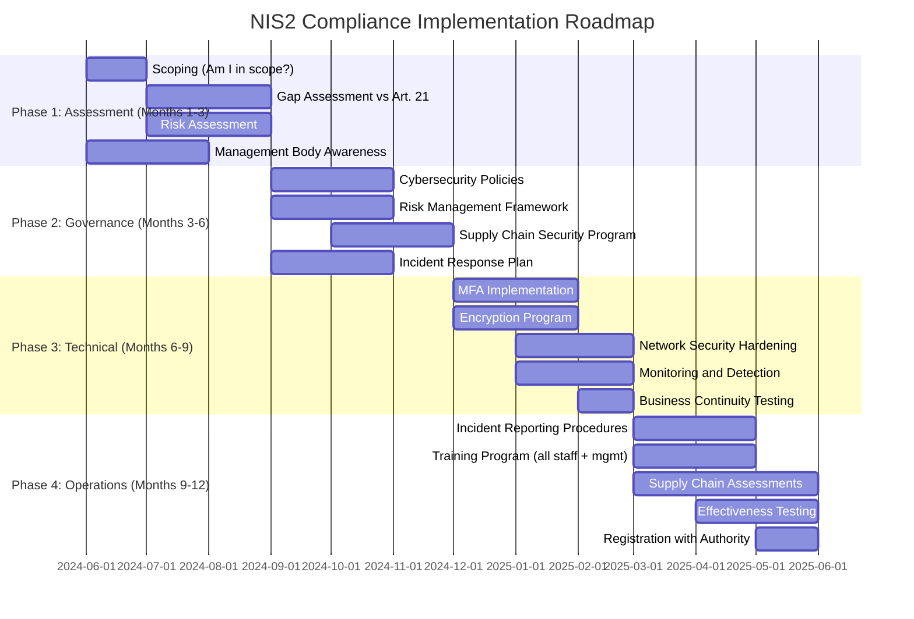

# EU NIS2, DORA & Cyber Resilience Act — European Cybersecurity Regulations

**Topic:** EU NIS2 Directive (2022/2555), DORA (2022/2554), Cyber Resilience Act (CRA)  
**Standard:** NIS2 Directive; DORA Regulation; CRA Regulation (EU 2024/2847)  
**SDO:** European Parliament and Council of the EU; ENISA (implementation guidance)  
**Audience:** CISOs in EU-operating organizations, compliance officers, product security teams, financial sector IT, legal/regulatory teams  
**Prerequisites:** EU regulatory structure basics, cybersecurity fundamentals, supply chain security concepts

---

## Chapter 1 — Historical Context & Origin Story

### 1.1 Timeline

| Year | Event | Significance |
|------|-------|-------------|
| 2016 | **NIS Directive (NIS1)** adopted (2016/1148) | First EU-wide cybersecurity legislation; OES + DSP |
| 2018 | NIS1 transposition deadline | Member states transposed into national law |
| 2019 | EU Cybersecurity Act (2019/881) | ENISA mandate + EU cybersecurity certification framework |
| 2020 | EU Digital Strategy published | Sets direction for digital regulation (NIS2, CRA, AI Act) |
| 2020 | DORA proposal (Sept 2020) | Financial sector digital operational resilience |
| 2020 | NIS2 proposal (Dec 2020) | Major revision of NIS1; broader scope; stricter requirements |
| 2022 | **NIS2 Directive adopted** (Dec 2022, 2022/2555) | Effective Jan 16, 2023; transposition deadline Oct 17, 2024 |
| 2022 | **DORA adopted** (Dec 2022, 2022/2554) | Digital Operational Resilience Act for financial entities |
| 2023 | **Cyber Resilience Act** proposed final text | Product security for all digital products sold in EU |
| 2024 | NIS2 transposition deadline: **October 17, 2024** | Member states must have national laws |
| 2025 | **DORA effective: January 17, 2025** | Financial entities must comply |
| 2024 | **CRA adopted** (October 2024) | Published in Official Journal; 36-month implementation |
| 2027 | **CRA fully applicable** (estimated) | All products with digital elements must comply |

### 1.2 Regulatory Relationships

```mermaid
graph TB
    subgraph "EU Cybersecurity Regulatory Stack"
        NIS2[NIS2 Directive (2022/2555)<br/>━━━━━━━━━━━━━<br/>Horizontal: All essential/important entities<br/>Network & Information Security<br/>Transposition: Oct 2024]
        
        DORA_R[DORA Regulation (2022/2554)<br/>━━━━━━━━━━━━━<br/>Sector-specific: Financial entities<br/>Digital Operational Resilience<br/>Effective: Jan 2025]
        
        CRA_R[Cyber Resilience Act (2024/2847)<br/>━━━━━━━━━━━━━<br/>Product-focused: All digital products<br/>Security by design/default<br/>Full application: ~2027]
        
        EUCSA[EU Cybersecurity Act (2019/881)<br/>━━━━━━━━━━━━━<br/>Framework: Certification schemes<br/>ENISA mandate]
        
        GDPR[GDPR (2016/679)<br/>━━━━━━━━━━━━━<br/>Data protection<br/>Personal data security<br/>(Article 32)]
    end
    
    NIS2 -->|"lex generalis<br/>(general rule)"| DORA_R
    DORA_R -->|"lex specialis<br/>(specific for finance)"| NIS2
    CRA_R -->|"Product security<br/>complements"| NIS2
    EUCSA -->|"Certification schemes<br/>support compliance"| NIS2
    EUCSA -->|"Product certification"| CRA_R
    GDPR -->|"Data protection overlap"| NIS2
```

---

## Chapter 2 — Standard Architecture & Structure

### 2.1 NIS2 Directive Structure

| Chapter | Title | Key Content |
|---------|-------|-------------|
| I | General Provisions (Art 1-6) | Scope, definitions, minimum harmonization |
| II | Coordinated Cybersecurity Frameworks (Art 7-13) | National strategies, CSIRTs, cooperation |
| III | Cooperation (Art 14-19) | Cooperation Group, CSIRT network, EU-CyCLONe |
| IV | **Cybersecurity Risk Management and Reporting** (Art 20-25) | **Core obligations: risk management + incident reporting** |
| V | Jurisdiction and Registration (Art 26-29) | Where entities register; cross-border |
| VI | Information Sharing (Art 30) | Voluntary sharing arrangements |
| VII | Supervision and Enforcement (Art 31-37) | Competent authorities; fines; enforcement |
| VIII | Delegated and Implementing Acts (Art 38-39) | EC powers to supplement |
| IX | Final Provisions (Art 40-46) | Transposition; entry into force |

### 2.2 NIS2 — Entities in Scope

| Category | Essential Entities (Annex I) | Important Entities (Annex II) |
|----------|----------------------------|------------------------------|
| Sectors | Energy, Transport, Banking, Financial Market Infrastructure, Health, Drinking Water, Wastewater, Digital Infrastructure, ICT Service Management (B2B), Public Administration, Space | Postal/Courier, Waste Management, Chemicals, Food, Manufacturing (medical devices, electronics, motor vehicles, machinery), Digital Providers, Research |
| Size threshold | Large: ≥250 employees OR >€50M turnover | Medium: ≥50 employees OR >€10M turnover |
| Supervision | **Proactive ex ante** (audits, inspections) | **Reactive ex post** (after incidents/evidence) |
| Penalties | Up to **€10M or 2% global turnover** | Up to **€7M or 1.4% global turnover** |
| Management liability | **Personal liability** for management bodies | **Personal liability** for management bodies |

### 2.3 DORA Structure

| Chapter | Title | Key Content |
|---------|-------|-------------|
| I | General Provisions | Scope (21 entity types); definitions |
| II | **ICT Risk Management** (Art 5-16) | Governance; ICT risk framework; protection; detection; response/recovery; learning |
| III | **ICT-Related Incident Management** (Art 17-23) | Classification; reporting; harmonized templates |
| IV | **Digital Operational Resilience Testing** (Art 24-27) | Basic testing; advanced TLPT (Threat-Led Penetration Testing) |
| V | **Managing ICT Third-Party Risk** (Art 28-44) | Key principles; contractual requirements; oversight framework for critical ICT providers |
| VI | Information Sharing (Art 45) | Threat intelligence sharing |
| VII | Competent Authorities (Art 46-56) | Supervision; cooperation; sanctions |

### 2.4 CRA Structure

| Element | Content |
|---------|---------|
| Scope | Products with digital elements (hardware + software) placed on EU market |
| Obligations (Manufacturers) | Security by design; vulnerability handling; security updates; conformity assessment |
| Obligations (Importers/Distributors) | Verify compliance; maintain documentation; report |
| Essential Requirements (Annex I) | Security properties; vulnerability handling; documentation |
| Categories | Default (self-assessment); Important (Class I/II — third-party); Critical (EU certification) |
| CE Marking | Products must bear CE mark demonstrating cybersecurity compliance |
| Vulnerability disclosure | Manufacturers must report actively exploited vulnerabilities to ENISA within 24h |
| Support period | Minimum 5 years of security updates (or product lifetime if shorter) |

---

## Chapter 3 — Technical Deep Dive

### 3.1 NIS2 Article 21 — Cybersecurity Risk-Management Measures (Minimum)

| # | Measure | Interpretation |
|---|---------|---------------|
| (a) | Policies on risk analysis and information system security | Risk assessment methodology; security policies; governance |
| (b) | Incident handling | Incident response plan; detection; containment; reporting procedures |
| (c) | Business continuity and crisis management | BCP/DR; backup management; tested recovery procedures |
| (d) | Supply chain security | Supplier risk assessment; contractual security requirements; monitoring |
| (e) | Security in network and information systems acquisition, development, and maintenance | Secure SDLC; vulnerability handling; patch management |
| (f) | Policies and procedures to assess effectiveness | Audits; penetration testing; vulnerability assessment; metrics |
| (g) | Basic cyber hygiene practices and cybersecurity training | Awareness; training; password policies; patching; access control |
| (h) | Policies and procedures regarding use of cryptography and encryption | Encryption at rest/transit; key management; crypto standards |
| (i) | Human resources security, access control, and asset management | Background checks; access provisioning; least privilege; asset inventory |
| (j) | Use of multi-factor authentication or continuous authentication solutions | MFA for access to critical systems; privileged access; remote access |

### 3.2 NIS2 Incident Reporting Requirements

| Notification | Deadline | Content |
|-------------|----------|---------|
| **Early warning** | **24 hours** from awareness | Whether incident suspected to be caused by unlawful/malicious acts; whether cross-border impact |
| **Incident notification** | **72 hours** from awareness | Initial assessment; severity/impact; IoCs (if available) |
| **Intermediate report** | Upon request by CSIRT/authority | Status updates; additional details |
| **Final report** | **1 month** after incident notification | Root cause; mitigation measures; cross-border impact; detailed description |

### 3.3 DORA — ICT Risk Management Framework

| Article | Requirement | Implementation |
|---------|-------------|---------------|
| Art 5 | ICT risk management framework (governance) | Board-approved ICT risk strategy; CISO role; regular review |
| Art 6 | ICT systems, protocols, tools | Comprehensive ICT asset inventory; secure configurations |
| Art 7 | Identification of ICT risk | Risk assessment; threat landscape; impact analysis |
| Art 8 | Protection and prevention | Access control; encryption; patch management; training |
| Art 9 | Detection | Monitoring; anomaly detection; multiple layers of control |
| Art 10 | Response and recovery | IR plan; DR plan; BIA; RTO/RPO; communication plans |
| Art 11 | Backup policies and recovery | Regular testing; immutable backups; geographic separation |
| Art 12 | Learning and evolving | Post-incident review; information sharing; continuous improvement |
| Art 13 | Communication | Crisis communication plans; stakeholder notification |

### 3.4 DORA — Digital Operational Resilience Testing (Art 24-27)

| Test Type | Who | Frequency | Scope |
|-----------|-----|-----------|-------|
| Basic ICT testing | All financial entities | **Annually** | Vulnerability assessments, network security scans, gap analyses, physical security reviews, source code reviews, performance testing, penetration testing |
| Advanced testing (TLPT) | Significant financial entities (as designated) | **Every 3 years** (minimum) | Threat-Led Penetration Testing (based on TIBER-EU framework); red team exercises; covers critical functions; includes ICT third-party providers |

### 3.5 CRA — Essential Cybersecurity Requirements (Annex I, Part I)

| # | Requirement | Technical Implementation |
|---|-------------|------------------------|
| 1 | Designed/developed/produced to ensure appropriate level of cybersecurity | Threat modeling; secure design principles; security testing |
| 2 | Delivered without known exploitable vulnerabilities | Vulnerability scanning; SAST/DAST; dependency checking |
| 3 | Secure by default configuration | Minimal attack surface; no unnecessary ports/services; strong defaults |
| 4 | Protection from unauthorized access | Authentication; access control; least privilege |
| 5 | Protect confidentiality of data (stored, transmitted, processed) | Encryption at rest and in transit; secure key management |
| 6 | Protect integrity of data, commands, configurations | Digital signatures; integrity checking; tamper detection |
| 7 | Process only necessary data (data minimization) | Privacy by design; collect only what's needed |
| 8 | Protect availability | Resilience; DDoS protection; graceful degradation |
| 9 | Minimize negative impact on other devices/networks | Network hygiene; no excessive resource consumption |
| 10 | Minimize attack surfaces | Hardened interfaces; disabled unused functionality |
| 11 | Reduce impact of incidents through appropriate mechanisms | Incident mitigation; containment features |
| 12 | Provide security-relevant information through logging | Audit logging; secure log storage; user-accessible logs |
| 13 | Ability to remove/transfer data securely | Data portability; secure deletion |

---

## Chapter 4 — Implementation Guide

### 4.1 NIS2 Compliance Roadmap



### 4.2 DORA Implementation for Financial Entities

| Phase | Duration | Key Activities |
|-------|----------|---------------|
| 1: Governance & Framework | 3 months | Board ICT risk governance; CISO appointment; ICT risk strategy; risk appetite; reporting lines |
| 2: ICT Risk Assessment | 3 months | Asset inventory; threat analysis; impact assessment; risk register; risk treatment plan |
| 3: Protection & Prevention | 6 months | Access control; encryption; patch management; secure configuration; training; change management |
| 4: Detection & Monitoring | 3 months | SIEM deployment; anomaly detection; automated monitoring; incident classification criteria |
| 5: Response & Recovery | 3 months | IR plans; DR/BCP; communication plans; crisis management; backup verification |
| 6: Testing | 3 months | Annual basic testing; TLPT planning (every 3 years); vulnerability assessments |
| 7: Third-Party Risk | 6 months | ICT provider register; risk assessment; contractual clauses; exit strategies; concentration risk |
| 8: Reporting | 2 months | Incident classification system; reporting templates; 4-hour/72-hour/1-month timelines |

### 4.3 CRA Compliance for Product Manufacturers

| Phase | Activities | Timeline |
|-------|-----------|----------|
| Scoping | Determine if product is "product with digital elements"; identify category (default/important/critical) | Early 2025 |
| Design | Implement security by design; threat modeling; define security requirements; secure architecture | Ongoing development |
| Development | Secure SDLC; SAST/DAST; dependency management; code review; security testing | Ongoing development |
| Vulnerability handling | Establish coordinated vulnerability disclosure process; security contact; SBOM generation | Before placing on market |
| Documentation | Technical documentation; EU Declaration of Conformity; user instructions (security-relevant) | Before placing on market |
| Conformity assessment | Self-assessment (default) OR third-party (Class I/II) OR EU certification (critical) | Before placing on market |
| CE Marking | Affix CE mark demonstrating compliance | Before placing on market |
| Post-market | Provide security updates (min 5 years); monitor for vulnerabilities; report to ENISA within 24h for exploited vulns | Throughout support period |

---

## Chapter 5 — Enforcement & Penalties

### 5.1 NIS2 Penalties

| Entity Type | Maximum Fine | Management Liability |
|-------------|:----------:|---------------------|
| Essential entities | **€10,000,000 or 2% worldwide annual turnover** (whichever higher) | Personal liability; possible temporary management bans |
| Important entities | **€7,000,000 or 1.4% worldwide annual turnover** (whichever higher) | Personal liability; possible temporary management bans |
| All entities | Periodic penalties for continued non-compliance | Proportionate to infringement |

### 5.2 DORA Penalties

| Violation | Penalty |
|-----------|---------|
| Non-compliance by financial entities | Determined by national competent authority (e.g., BaFin, AMF, FCA successor) |
| Critical ICT third-party providers | Up to **1% average daily worldwide turnover** of preceding business year; imposed by Lead Overseer; periodic penalty payments for continued non-compliance |
| Administrative measures | Cease and desist; remediation orders; public notices; withdrawal of authorization |

### 5.3 CRA Penalties

| Violation | Maximum Fine |
|-----------|:----------:|
| Non-compliance with essential cybersecurity requirements (Annex I) | **€15,000,000 or 2.5% worldwide annual turnover** |
| Non-compliance with other CRA obligations | **€10,000,000 or 2% worldwide annual turnover** |
| Supplying incorrect/incomplete information to authorities | **€5,000,000 or 1% worldwide annual turnover** |

---

## Chapter 6 — Regional Comparison & Interaction

### 6.1 NIS2 National Transposition Status (Select)

| Country | Transposition Status (Oct 2024) | National Law |
|---------|--------------------------------|-------------|
| Germany | Draft NIS2UmsuCG | NIS-2-Umsetzungs- und Cybersicherheitsstärkungsgesetz |
| France | In progress | Transposition law in development |
| Netherlands | In progress | Cyberbeveiligingswet (Cybersecurity Act) |
| Italy | Completed early (2024) | Legislative Decree implementing NIS2 |
| Belgium | Completed (NIS2 law 2024) | Loi NIS2 |
| Spain | In progress | Transposición NIS2 |
| Ireland | In progress | NIS2 regulations |
| Poland | Draft act | Ustawa o KSC (amendment) |

### 6.2 NIS2 vs. NIS1

| Dimension | NIS1 (2016/1148) | NIS2 (2022/2555) |
|-----------|------------------|------------------|
| Scope | OES + DSP (limited sectors) | **Essential + Important entities (18 sectors)** |
| Entity identification | Member state discretion (varied widely) | **Size-cap rule** (automatic: medium+large) |
| Sectors | 7 OES sectors + 3 DSP types | **11 Essential + 7 Important sectors** |
| Supply chain | Not addressed | **Mandatory supply chain security (Art 21.2d)** |
| Management liability | Not specified | **Personal liability for management (Art 20)** |
| Incident reporting | 72 hours (single notification) | **24h early warning + 72h notification + 1 month final** |
| Penalties | Determined by member states | **Harmonized: €10M/2% or €7M/1.4%** |
| Supervision | Varied | **Proactive (essential) / Reactive (important)** |
| Security measures | General | **10 specific measures (Art 21.2 a-j)** |
| Harmonization | Minimum (wide variation) | **Stronger minimum harmonization** |

### 6.3 EU Cybersecurity Regulation Applicability Matrix

| If you are... | NIS2 | DORA | CRA | GDPR Art 32 |
|--------------|:----:|:----:|:---:|:-----------:|
| Energy company (EU) | ✅ Essential | ❌ | ❌ (unless making products) | ✅ (if processing PII) |
| Bank/Insurance (EU) | ✅ Essential → **DORA supersedes** | ✅ (primary) | ❌ | ✅ |
| SaaS provider (EU, medium+) | ✅ Important (digital provider) | ❌ (unless serving finance) | ✅ (product) | ✅ |
| IoT device manufacturer | ✅ (if medium+ in relevant sector) | ❌ | ✅ (primary) | ✅ (if PII) |
| Hospital (EU) | ✅ Essential (health) | ❌ | ❌ (unless making devices) | ✅ |
| Cloud infrastructure provider | ✅ Essential (digital infra) | Possible (if critical ICT for finance) | ✅ (service) | ✅ |
| Automotive manufacturer | ✅ (if medium+, transport/manufacturing) | ❌ | ✅ (connected products) | ✅ |
| Small startup (<50 staff, <€10M) | ❌ (below threshold) | ❌ (unless licensed) | ✅ (if placing products on EU market) | ✅ |

---

## Chapter 7 — Comparison

### 7.1 NIS2 vs. DORA vs. CRA

| Dimension | NIS2 | DORA | CRA |
|-----------|------|------|-----|
| Type | Directive (member states transpose) | Regulation (directly applicable) | Regulation (directly applicable) |
| Focus | Organization cybersecurity | Financial sector resilience | Product security |
| Target | Essential/Important entities (org-level) | Financial entities + ICT providers | Manufacturers/importers/distributors of digital products |
| What it requires | Risk management + incident reporting | ICT risk mgmt + testing + third-party oversight | Secure design + vulnerability handling + updates |
| Relationship | General (lex generalis) | Specific for finance (lex specialis; supersedes NIS2 for financial entities) | Complementary (product level) |
| Effective | Oct 17, 2024 (transposition) | **Jan 17, 2025** | ~2027 (36 months after adoption) |
| Penalties | €10M / 2% turnover | National authority discretion + 1%/day for critical ICT | €15M / 2.5% turnover |
| Key innovation | Supply chain security; management liability; harmonized reporting | TLPT (threat-led pen testing); ICT third-party oversight; concentration risk | CE marking for cybersecurity; mandatory security updates; SBOM requirement |

### 7.2 EU vs. US Cybersecurity Regulation

| Dimension | EU (NIS2 + DORA + CRA) | US (Various) |
|-----------|------------------------|-------------|
| Approach | **Horizontal regulation** (sector-spanning) | **Sector-specific** (each sector has own rules) |
| Legislation type | Comprehensive EU-wide laws | Patchwork (SEC rules, HIPAA, PCI, CISA guidance) |
| Mandatory incident reporting | 24h + 72h (NIS2); 4h + 72h (DORA) | CIRCIA (72h for critical infrastructure); SEC (4 business days); varies by sector |
| Product security | CRA (mandatory for all products) | No federal equivalent (voluntary NIST guidance; some sector rules) |
| Financial sector | DORA (comprehensive, specific) | FFIEC guidance; SEC rules; OCC/FDIC expectations (less unified) |
| Supply chain | NIS2 Art 21.2(d) mandatory | Executive Order 14028 (guidance); CMMC (DoD specific) |
| Penalties | Revenue-based (up to 2.5% global turnover) | Varies widely (SEC fines, consent decrees, sector penalties) |
| Management liability | Explicit personal liability (NIS2 Art 20) | Implicit (SEC enforcement actions against individuals; rare) |
| Harmonization | High (single market requirement) | Low (50-state variation in breach notification alone) |

---

## Chapter 8 — Mermaid Architecture Diagrams

### 8.1 NIS2 Incident Reporting Flow

```mermaid
graph TB
    subgraph "Entity (In-Scope Organization)"
        DETECT[Incident Detected<br/>• SOC alert<br/>• Automated detection<br/>• Third-party notification]
        ASSESS[Impact Assessment<br/>• Significant incident?<br/>• Cross-border impact?<br/>• Service disruption?<br/>• Number of users affected?]
    end
    
    subgraph "Reporting Obligations"
        EARLY[Early Warning<br/>━━━━━━━━━━━━━<br/>WITHIN 24 HOURS<br/>━━━━━━━━━━━━━<br/>• Suspected unlawful/malicious?<br/>• Cross-border impact likely?<br/>• Brief notification]
        
        NOTIF[Incident Notification<br/>━━━━━━━━━━━━━<br/>WITHIN 72 HOURS<br/>━━━━━━━━━━━━━<br/>• Initial assessment of severity<br/>• Impact description<br/>• IoCs (if available)<br/>• Update to early warning]
        
        FINAL[Final Report<br/>━━━━━━━━━━━━━<br/>WITHIN 1 MONTH<br/>━━━━━━━━━━━━━<br/>• Detailed description<br/>• Root cause analysis<br/>• Mitigation measures applied<br/>• Cross-border impact details]
    end
    
    subgraph "Authorities"
        CSIRT[National CSIRT<br/>• Technical assistance<br/>• Coordination<br/>• Information sharing]
        CA[Competent Authority<br/>• Supervision<br/>• Enforcement<br/>• Sanctions]
    end
    
    DETECT --> ASSESS
    ASSESS -->|"24h"| EARLY
    EARLY -->|"72h"| NOTIF
    NOTIF -->|"1 month"| FINAL
    
    EARLY --> CSIRT
    NOTIF --> CSIRT
    FINAL --> CSIRT
    FINAL --> CA
```

### 8.2 DORA Five Pillars

```mermaid
graph TB
    subgraph "DORA Five Pillars"
        P1[Pillar 1: ICT Risk Management<br/>━━━━━━━━━━━━━<br/>• Governance framework<br/>• Identification of risks<br/>• Protection and prevention<br/>• Detection<br/>• Response and recovery<br/>• Learning and evolving]
        
        P2[Pillar 2: ICT Incident Management<br/>━━━━━━━━━━━━━<br/>• Classification criteria<br/>• Reporting timelines<br/>  - Initial: 4 hours<br/>  - Intermediate: 72 hours<br/>  - Final: 1 month<br/>• Root cause analysis]
        
        P3[Pillar 3: Resilience Testing<br/>━━━━━━━━━━━━━<br/>• Basic testing (annual)<br/>  - Vuln scans, pen tests<br/>  - Gap analyses<br/>• Advanced: TLPT (3 years)<br/>  - Threat-led red team<br/>  - TIBER-EU methodology]
        
        P4[Pillar 4: ICT Third-Party Risk<br/>━━━━━━━━━━━━━<br/>• Register of ICT providers<br/>• Risk assessment<br/>• Contractual requirements<br/>• Exit strategies<br/>• Concentration risk<br/>• EU Oversight Framework<br/>  for critical providers]
        
        P5[Pillar 5: Information Sharing<br/>━━━━━━━━━━━━━<br/>• Threat intelligence sharing<br/>• Among financial entities<br/>• ISACs participation<br/>• Voluntary + structured]
    end
```

### 8.3 CRA Product Lifecycle Obligations

```mermaid
graph LR
    subgraph "Design Phase"
        DESIGN[Secure by Design<br/>• Threat modeling<br/>• Security requirements<br/>• Secure architecture<br/>• Minimize attack surface]
    end
    
    subgraph "Development Phase"
        DEV[Secure Development<br/>• Secure SDLC<br/>• SAST/DAST/SCA<br/>• Code review<br/>• Dependency management<br/>• SBOM generation]
    end
    
    subgraph "Market Placement"
        MARKET[Conformity Assessment<br/>• Default: self-assessment<br/>• Important: third-party (Class I/II)<br/>• Critical: EU certification<br/>• CE Marking applied<br/>• EU Declaration of Conformity]
    end
    
    subgraph "Post-Market (5+ years)"
        POST[Ongoing Obligations<br/>• Security updates (free)<br/>• Vulnerability monitoring<br/>• Coordinated disclosure<br/>• Report exploited vulns<br/>  to ENISA within 24h<br/>• Maintain SBOM<br/>• Inform users of risks]
    end
    
    DESIGN --> DEV --> MARKET --> POST
```

---

## Chapter 9 — Case Studies

### 9.1 European Bank — DORA Compliance Program

| Aspect | Detail |
|--------|--------|
| Organization | Mid-tier European bank; 5,000 employees; 15 EU countries; €2B assets; 200+ ICT providers |
| Deadline | DORA effective January 17, 2025; must be fully compliant |
| Starting state | Existing EBA/ECB ICT risk guidelines partially followed; no TLPT program; third-party risk immature; incident classification inconsistent |
| Approach | 18-month DORA compliance program (started July 2023) |
| Pillar 1 (ICT Risk Mgmt) | Refreshed ICT risk management framework: (1) Board-approved ICT risk appetite statement. (2) CISO reporting directly to board (previously reported to CTO). (3) Comprehensive ICT asset register (2,400 assets cataloged). (4) Annual risk assessment cycle established. |
| Pillar 2 (Incidents) | New classification system: (1) Classification criteria from RTS (number of users affected, duration, geographic spread, data loss, service criticality). (2) Automated detection→classification→reporting workflow in ServiceNow. (3) Reporting template pre-populated; escalation to national authority within 4 hours for major incidents. (4) Root cause analysis mandatory for all major incidents. |
| Pillar 3 (Testing) | (1) Basic testing: annual vulnerability assessment + penetration testing for all critical systems (contracted to NCC Group). (2) Advanced testing: TLPT program established (first test covering core banking platform; 12-week red team engagement using TIBER-EU methodology). |
| Pillar 4 (Third-Party) | Most complex workstream: (1) Register of ALL ICT third-party providers created (247 providers identified). (2) Risk assessment for each (criticality-based tiering; 12 classified as "critical"). (3) Contract review: 120 contracts needed updating (exit strategies, audit rights, security requirements per Art 30). (4) Concentration risk assessment: identified dependency on 2 cloud providers covering 80% of infrastructure. (5) Exit strategy documentation for critical providers. |
| Pillar 5 (Sharing) | Joined FS-ISAC European chapter; established structured intelligence sharing with national CERT. |
| Results | Full DORA compliance by December 2024 (ahead of deadline). Total investment: €4.5M. National supervisor review: no material gaps found. |
| Key challenge | Third-party contract renegotiation: large providers (AWS, Microsoft) reluctant to modify standard terms. Solution: leveraged EU Oversight Framework provisions; joined industry consortium for collective negotiation. |

### 9.2 IoT Device Manufacturer — CRA Preparation

| Aspect | Detail |
|--------|--------|
| Company | European IoT device manufacturer; smart home devices (cameras, thermostats, hubs); sells EU-wide; 150 employees |
| Challenge | CRA will require all their products to meet cybersecurity essential requirements + provide 5 years of security updates + maintain SBOM + report exploited vulns to ENISA within 24h |
| Current state | No formal secure SDLC; devices ship with default passwords; no vulnerability disclosure program; updates optional (users must manually apply); no SBOM; embedded Linux with untracked open-source components |
| Transformation plan | 24-month program (aligned with CRA transition period) |
| Phase 1 (Design) | (1) Hired product security lead + 2 firmware security engineers. (2) Threat modeling workshop for each product line (STRIDE). (3) Security requirements defined per product (no default passwords; encrypted communications; secure boot). (4) Adopted security-by-default principle (devices secure out-of-box). |
| Phase 2 (Development) | (1) Secure SDLC implemented (requirements → design review → implementation → testing → release). (2) SAST (SonarQube for C/C++); SCA (Trivy for container/dependencies); fuzzing (AFL for protocol parsing). (3) SBOM generation automated in build pipeline (SPDX format). (4) Peer code review mandatory for security-relevant components. |
| Phase 3 (Vulnerability handling) | (1) Coordinated vulnerability disclosure policy published (security.txt). (2) Bug bounty program launched (HackerOne). (3) Internal vulnerability response team (PSIRT) established. (4) Process for reporting actively exploited vulns to ENISA within 24h. |
| Phase 4 (Post-market) | (1) Over-the-air (OTA) update infrastructure deployed (devices auto-update). (2) 5-year support commitment defined per product. (3) Security monitoring for dependencies (Dependabot equivalent for embedded). (4) Customer notification process for security advisories. |
| Conformity assessment | Products classified as "Important (Class I)" (connected devices accessible from internet) → requires third-party conformity assessment (notified body or EUCC scheme). |
| Investment | €1.2M over 24 months (staffing: €600K, tooling: €200K, external assessment: €150K, infrastructure: €250K) |
| Expected outcome | Products CE-marked for cybersecurity; competitive advantage over non-EU manufacturers; customer trust; compliance before enforcement |

---

## Chapter 10 — Future Evolution & Industry Trends

| Trend | Timeline | Impact |
|-------|----------|--------|
| NIS2 enforcement actions | 2025-2026 | First enforcement actions by national authorities; test cases establishing interpretation |
| DORA regulatory technical standards (RTS) | 2024-2025 | Detailed implementing rules from ESAs (EBA/EIOPA/ESMA) clarifying requirements |
| CRA harmonized standards | 2025-2027 | CEN/CENELEC developing standards presuming CRA conformity |
| EU Cybersecurity Certification Schemes | 2025-2027 | EUCC (Common Criteria based); EUCS (cloud); EU5G | 
| AI Act + cybersecurity intersection | 2025-2027 | AI systems subject to both AI Act and CRA where applicable |
| Supply chain cascading | 2025+ | NIS2 supply chain requirements flowing down to smaller suppliers |
| Cyber insurance alignment | Now | Insurance requirements aligning with NIS2 baseline measures |
| Third-party oversight (DORA) | 2025+ | EU authorities designating "critical ICT third-party providers" and exercising oversight |
| Global influence | Now+ | NIS2/CRA model influencing other jurisdictions (UK, Australia, Japan) |
| SME compliance challenges | 2025-2026 | Medium-sized companies struggling with NIS2 compliance; ENISA guidance expected |
| Sector-specific technical standards | 2025-2027 | NIS2 implementing acts for specific sectors (healthcare, energy, transport) |

---

## Chapter 11 — Interview Questions & Career Guide

### Tier 1: Entry-Level

**Q1:** What is the difference between NIS2, DORA, and the Cyber Resilience Act? When does each apply?  
**A:** Three different EU cybersecurity regulations with different scopes: **NIS2** = organization-level cybersecurity for essential and important entities (horizontal — covers 18 sectors: energy, health, transport, digital infrastructure, etc.). Applies to medium+ organizations (≥50 staff or ≥€10M turnover) in these sectors. Requires risk management + incident reporting. **DORA** = sector-specific for financial entities (banks, insurers, investment firms, payment providers, crypto). It's "lex specialis" — supersedes NIS2 for financial sector. Adds specific requirements: operational resilience testing (TLPT), third-party ICT risk management, detailed incident reporting. **CRA** = product-focused for manufacturers of products with digital elements (IoT devices, software, connected hardware). Requires security by design, vulnerability handling, 5-year security updates, CE marking. A company could face all three: a bank (DORA for operations) that makes a mobile app (CRA for the product) while also being an NIS2 entity (but DORA supersedes NIS2 for them).

**Q2:** Explain NIS2 incident reporting timelines.  
**A:** NIS2 has a three-stage incident reporting obligation for significant incidents: (1) **Early warning within 24 hours**: Quick notification to national CSIRT — just indicates whether incident is suspected malicious and whether cross-border impact is likely. Minimal detail required. Purpose: enable CSIRT to prepare assistance and warn others. (2) **Incident notification within 72 hours**: More detailed — initial severity assessment, impact description, indicators of compromise if available. Updates the early warning. (3) **Final report within 1 month**: Comprehensive — full description, root cause analysis, mitigation measures applied, cross-border impact details. An "intermediate report" may also be requested by authorities at any time. Key: the clock starts when the entity becomes "aware" that the incident is significant (not when it first occurred).

### Tier 2: Mid-Level

**Q3:** How would you design a DORA-compliant ICT third-party risk management program for a bank with 200+ ICT providers?  
**A:**

**Step 1: Establish Register (Art 28)**
- Catalog all 200+ ICT third-party providers in centralized register
- For each: services provided, criticality assessment, data handled, geographic location, substitutability
- Classify into tiers: Critical (supports critical/important functions), Important, Standard

**Step 2: Risk Assessment (Art 28-29)**
- Critical providers: deep due diligence (SOC 2/ISO 27001 review, on-site assessment, concentration risk analysis)
- Important: standard assessment (questionnaire + evidence review)
- Standard: basic assessment (self-declaration + contract review)
- Assess concentration risk: "What happens if AWS/Microsoft has a major outage?"

**Step 3: Contractual Requirements (Art 30)**
- Review all critical provider contracts for mandatory DORA clauses: audit rights, data location, security measures, incident notification, exit strategy, subcontracting requirements
- Renegotiate contracts missing required provisions (timeline: 6-12 months for major providers)

**Step 4: Exit Strategies (Art 28)**
- For each critical provider: documented exit plan
- Alternative providers identified; data portability tested
- Transition timelines estimated; interim service arrangements planned

**Step 5: Ongoing Monitoring**
- Annual reassessment of critical providers
- Continuous monitoring (security ratings, incident reports, financial stability)
- Trigger-based reassessment (provider incident, M&A, significant changes)

**Step 6: EU Oversight Framework Awareness**
- Monitor if any of your critical providers get designated as "critical ICT third-party service providers" by ESAs
- If designated: EU Lead Overseer will exercise direct oversight over them

### Tier 3: Senior

**Q4:** As CISO of a European manufacturing conglomerate (energy + automotive + IoT products), design an integrated compliance approach for NIS2 + CRA + GDPR. How do you avoid duplicative efforts while meeting all three?  
**A:** [Full answer covers: (1) NIS2 applies to the organization (essential entity in energy/manufacturing); CRA applies to their connected products; GDPR applies to all personal data processing. (2) Unified governance: one cybersecurity committee satisfying NIS2 Art 20 (management body responsibility), CRA governance (product security), and GDPR Art 32 (data protection). (3) Shared risk methodology: one risk assessment process addressing both organizational risks (NIS2) and product risks (CRA); DPIA for GDPR overlap. (4) Incident reporting harmonization: one incident process with routing logic — determine if NIS2 (24h→72h→1mo to CSIRT), CRA (24h to ENISA for exploited product vulns), and/or GDPR (72h to DPA for personal data breach). Build single workflow that fans out notifications correctly. (5) Supply chain program serving both NIS2 Art 21.2(d) and CRA supply chain transparency (SBOM). (6) Testing: vulnerability management satisfies NIS2 Art 21.2(e), CRA Annex I requirement for no known exploitable vulnerabilities, and GDPR's "regularly testing effectiveness" (Art 32.1(d)). (7) Single GRC platform tracking all three; unified policy set with framework-specific views.]

---

## Chapter 12 — Cheat Sheet & Quick Reference

### NIS2 Quick Reference

```
Type:               Directive (must be transposed into national law)
Effective:          October 17, 2024 (transposition deadline)
Scope:              Essential + Important entities (18 sectors; medium+ size)
Size threshold:     ≥50 employees OR ≥€10M turnover (in listed sectors)
Key measures:       10 minimum cybersecurity measures (Art 21.2 a-j)
Incident reporting: 24h (early) → 72h (notification) → 1 month (final)
Fines:              Essential: €10M or 2% | Important: €7M or 1.4%
Management:         PERSONAL LIABILITY for management bodies
MFA required:       Yes (Art 21.2(j))
Supply chain:       Mandatory security (Art 21.2(d))
```

### DORA Quick Reference

```
Type:               Regulation (directly applicable — no transposition)
Effective:          January 17, 2025
Scope:              Financial entities (21 types) + ICT service providers
Five pillars:       ICT Risk Mgmt | Incidents | Testing | Third-Party | Sharing
Incident reporting: 4h (initial) → 72h (intermediate) → 1 month (final)
Testing:            Annual basic + TLPT every 3 years (for significant entities)
Third-party:        Register ALL ICT providers; contractual requirements (Art 30)
Critical providers: EU Oversight Framework (Lead Overseer designated by ESAs)
Fines:              National authority discretion + 1%/day for critical ICT providers
```

### CRA Quick Reference

```
Type:               Regulation (directly applicable)
Adopted:            October 2024 (EU 2024/2847)
Full application:   ~36 months after entry into force (~2027)
Scope:              ALL products with digital elements on EU market
Key obligations:    Secure by design | No known vulns | Security updates (5yr min)
SBOM:               Required (machine-readable)
Vuln disclosure:    Report exploited vulns to ENISA within 24h
Conformity:         Default (self) | Important Class I/II (third-party) | Critical (EU cert)
CE Marking:         Required for cybersecurity compliance
Fines:              Up to €15M or 2.5% worldwide turnover
Applies to:         Manufacturers, importers, distributors
```

### Which Regulation Applies to Me?

```
IF: Organization in EU essential/important sector (medium+ size)
    → NIS2

IF: Financial entity in EU (bank, insurance, investment, payment, crypto)
    → DORA (supersedes NIS2)

IF: You make/sell products with digital elements in EU
    → CRA

IF: You process personal data of EU residents
    → GDPR Article 32

MOST COMPANIES: Multiple regulations apply simultaneously
```

### Key Deadlines

```
NIS2 Transposition:     October 17, 2024 ✅ (member states)
DORA Effective:         January 17, 2025 ✅
CRA Vulnerability Reporting: ~21 months after entry (~mid-2026)
CRA Full Application:   ~36 months after entry (~late 2027)
```

---

*End of Document — 10_EU_NIS2_DORA_CRA.md*
