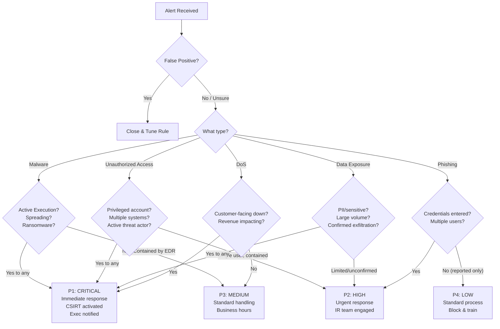

# Incident Response — NIST SP 800-61, SP 800-92, SP 800-137A

**Topic:** Incident Response lifecycle, log management, and continuous monitoring for cybersecurity events  
**Standard:** NIST SP 800-61 Rev2 (Computer Security Incident Handling Guide); SP 800-92 (Log Management); SP 800-137A (Continuous Monitoring)  
**SDO:** NIST (National Institute of Standards and Technology)  
**Audience:** SOC analysts, incident responders, CSIRT leads, security operations managers, forensic investigators  
**Prerequisites:** Networking, operating systems, logging fundamentals, basic threat understanding

---

## Chapter 1 — Historical Context & Origin Story

### 1.1 Timeline

| Year | Event | Significance |
|------|-------|-------------|
| 1988 | Morris Worm (first major internet incident) | Led to creation of CERT/CC (Carnegie Mellon); highlighted need for IR |
| 1988 | CERT/CC established | First Computer Emergency Response Team |
| 1996 | NIST SP 800-12 (Computer Security Handbook) | Early IR guidance included |
| 2004 | **NIST SP 800-61** Rev1 published | First dedicated IR guide from NIST |
| 2006 | **NIST SP 800-92** published | Guide to Computer Security Log Management |
| 2008 | NIST SP 800-137 | Information Security Continuous Monitoring (ISCM) |
| 2012 | **NIST SP 800-61 Rev2** published | Current version; updated for modern threats |
| 2020 | NIST SP 800-137A | Assessing ISCM Programs |
| 2023 | NIST IR 8428 (Cybersecurity Event Recovery) | Supplementary recovery guidance |
| 2024+ | SP 800-61 Rev3 (in development) | Expected update to address cloud, containers, AI-era IR |

### 1.2 IR Standards Ecosystem

| Standard | Focus | Use Case |
|----------|-------|----------|
| NIST SP 800-61 Rev2 | Complete IR lifecycle guide | Primary reference for building IR program |
| NIST SP 800-92 | Log management for security | How to collect, store, analyze logs for IR |
| NIST SP 800-137/137A | Continuous monitoring | Ongoing security posture awareness |
| NIST SP 800-86 | Forensics integration | Guide to integrating forensics into IR |
| ISO/IEC 27035 | Incident management (international) | ISO-aligned IR process |
| SANS IR Process | 6-phase model (widely taught) | GIAC/SANS training framework |
| FIRST CSIRT framework | CSIRT operations best practices | Building and running a CSIRT |
| CISA IR Playbooks | Specific incident type playbooks | Practical playbooks for common incidents |

---

## Chapter 2 — Standard Architecture & Structure

### 2.1 NIST SP 800-61 Rev2 — Incident Response Lifecycle

```mermaid
graph LR
    subgraph "Phase 1"
        PREP[PREPARATION<br/>━━━━━━━━━━━━━<br/>• Establish IR capability<br/>• Build team<br/>• Deploy tools<br/>• Create playbooks<br/>• Training/exercises<br/>• Communication plans]
    end
    
    subgraph "Phase 2"
        DA[DETECTION &<br/>ANALYSIS<br/>━━━━━━━━━━━━━<br/>• Monitor for indicators<br/>• Analyze alerts<br/>• Validate incidents<br/>• Prioritize<br/>• Document<br/>• Notify stakeholders]
    end
    
    subgraph "Phase 3"
        CER[CONTAINMENT,<br/>ERADICATION &<br/>RECOVERY<br/>━━━━━━━━━━━━━<br/>• Contain (short + long)<br/>• Collect evidence<br/>• Eradicate threat<br/>• Recover systems<br/>• Verify recovery]
    end
    
    subgraph "Phase 4"
        PA[POST-INCIDENT<br/>ACTIVITY<br/>━━━━━━━━━━━━━<br/>• Lessons learned<br/>• Evidence retention<br/>• Root cause analysis<br/>• Improve processes<br/>• Update playbooks]
    end
    
    PREP --> DA --> CER --> PA
    PA -->|"Continuous improvement"| PREP
    CER -->|"New indicators found"| DA
```

### 2.2 NIST SP 800-92 — Log Management Architecture

| Layer | Components | Purpose |
|-------|-----------|---------|
| Log Generation | OS logs, application logs, network device logs, security tool logs, cloud logs | Raw event data creation |
| Log Collection | Syslog, Windows Event Forwarding, agents, API collectors | Transport logs to central system |
| Log Storage | SIEM, data lake, archive (hot/warm/cold) | Retention and accessibility |
| Log Analysis | Correlation, alerting, search, reporting, dashboards | Turn raw data into actionable intelligence |
| Log Monitoring | Real-time alerting, threat detection, anomaly detection | Continuous surveillance |
| Log Retention | Compliance-driven retention (90 days to 7 years) | Evidence preservation and regulatory compliance |

### 2.3 NIST SP 800-137A — Continuous Monitoring Components

| Component | Description | Frequency |
|-----------|-------------|-----------|
| Vulnerability Management | Scan and remediate vulnerabilities | Continuous (daily-weekly scans) |
| Patch Management | Track and deploy security patches | Weekly (critical: immediate) |
| Security Configuration | Verify hardened configurations | Daily-weekly automated checks |
| Event Monitoring | Real-time log analysis and alerting | Continuous (24/7) |
| Network Monitoring | Traffic analysis, anomaly detection | Continuous (24/7) |
| System Integrity | File integrity monitoring, baseline checks | Hourly-daily |
| Asset Management | Inventory accuracy, unauthorized assets | Daily-weekly |
| User Activity | Privileged user monitoring, access anomalies | Continuous |
| Compliance Monitoring | Policy compliance, control effectiveness | Monthly-quarterly |

---

## Chapter 3 — Technical Deep Dive

### 3.1 Incident Categories (NIST SP 800-61)

| Category | Examples | Typical Severity | Response Priority |
|----------|----------|:---------------:|:-----------------:|
| Unauthorized Access | Compromised accounts, privilege escalation, insider threat | High-Critical | P1-P2 |
| Denial of Service | DDoS, application-layer DoS, resource exhaustion | Medium-Critical | P1-P2 |
| Malicious Code | Ransomware, trojan, worm, backdoor, cryptominer | High-Critical | P1 |
| Improper Usage | Policy violation, unauthorized software, data misuse | Low-Medium | P3-P4 |
| Multiple Component | APT; combination of multiple categories | Critical | P1 |
| Reconnaissance | Port scanning, vulnerability scanning, social engineering | Low | P4 |

### 3.2 Incident Severity Classification

| Severity | Impact | Response Time | Resources | Example |
|----------|--------|:-------------|:----------|---------|
| **Critical (P1)** | Business-threatening; data breach; critical systems down; regulatory notification required | **15 min** initial response; 24/7 | Full CSIRT + executive escalation + external (legal, forensics, PR) | Ransomware encrypting production; active data exfiltration |
| **High (P2)** | Significant impact; sensitive data at risk; important systems affected | **1 hour** initial response; business hours + on-call | CSIRT lead + 2-3 analysts; manager notification | Compromised privileged account; malware on multiple systems |
| **Medium (P3)** | Limited impact; single system; no sensitive data; contained | **4 hours** response; business hours | 1-2 analysts | Single workstation malware (contained by EDR); phishing (no credential compromise) |
| **Low (P4)** | Minimal impact; informational; policy violation | **Next business day** | 1 analyst; routine handling | Failed login attempts; unauthorized USB usage; minor policy violation |

### 3.3 Key Detection Sources

| Source | Event Types | Tools | Volume |
|--------|-------------|-------|--------|
| EDR/XDR | Process execution, file modification, network connections, behavioral detection | CrowdStrike, SentinelOne, Microsoft Defender | High |
| SIEM | Correlated alerts from all sources; custom detection rules | Splunk, Microsoft Sentinel, Elastic, QRadar | Very high |
| Network (IDS/IPS) | Network-level attacks, C2 communication, lateral movement | Suricata, Zeek, Palo Alto | High |
| Email Security | Phishing, BEC, malicious attachments, URLs | Proofpoint, Mimecast, Microsoft Defender | Medium |
| Cloud (CASB/CSPM) | Cloud misconfigurations, impossible travel, abnormal API calls | Netskope, Microsoft MDCA, Wiz | Medium |
| Identity (IAM) | Failed authentications, impossible travel, privilege changes | Azure AD/Entra ID, Okta, CrowdStrike Identity | Medium |
| User Reports | Suspicious emails, unusual behavior, social engineering | Phishing report button; service desk | Low (high value) |
| Threat Intelligence | IoCs matching organization's traffic/logs | MISP, TIP platforms, CTI feeds | Variable |

### 3.4 Evidence Collection and Chain of Custody

| Evidence Type | Collection Method | Priority | Volatility |
|-------------|-------------------|:--------:|:----------:|
| Memory (RAM) | Memory dump (FTK Imager, WinPmem, LiME) | **1st** (most volatile) | Very High |
| Running processes | Process listing, handles, network connections | **2nd** | Very High |
| Network connections | netstat, connection table, firewall logs | **3rd** | High |
| Temporary files | /tmp, %TEMP%, browser cache | **4th** | High |
| Disk image | Full forensic image (FTK, dd, AXIOM) | **5th** | Medium |
| Log files | System logs, application logs, security logs | **6th** | Medium |
| Physical evidence | Hardware, notes, printouts | **7th** | Low |
| Backups/Archives | Backup tapes, cloud snapshots | **8th** | Low |

**Chain of Custody Requirements:**
- Document who collected evidence, when, where, how
- Hash all digital evidence (SHA-256) at collection time
- Store in tamper-evident container/location
- Track every transfer (who → who, when, why)
- Maintain continuous custody documentation
- Original evidence preserved; work on copies

---

## Chapter 4 — Implementation Guide

### 4.1 Building an Incident Response Program

```mermaid
graph TB
    subgraph "Foundation (Month 1-2)"
        F1[IR Policy & Charter<br/>• Authority to act<br/>• Scope and mission<br/>• Team structure<br/>• Reporting lines<br/>• Budget allocation]
        F2[CSIRT Team Formation<br/>• Core team (4-8 members)<br/>• On-call rotation<br/>• Extended team (IT, legal, HR, PR)<br/>• RACI matrix<br/>• Training plan]
    end
    
    subgraph "Capability (Month 2-4)"
        C1[Tooling Deployment<br/>• SIEM (detection + investigation)<br/>• EDR (endpoint visibility)<br/>• SOAR (automation)<br/>• Forensic tools<br/>• Communication (war room)]
        C2[Playbook Development<br/>• Phishing response<br/>• Ransomware response<br/>• Data breach response<br/>• DDoS response<br/>• Insider threat<br/>• Business email compromise]
    end
    
    subgraph "Readiness (Month 4-6)"
        R1[Testing & Exercise<br/>• Tabletop exercise (quarterly)<br/>• Functional drill (annual)<br/>• Purple team (detection test)<br/>• Communication test<br/>• Metrics baseline]
        R2[Integration<br/>• Legal counsel on retainer<br/>• Forensics firm on retainer<br/>• Insurance (cyber liability)<br/>• Law enforcement contacts<br/>• Regulatory notification templates]
    end
    
    F1 --> C1 --> R1
    F2 --> C2 --> R2
```

### 4.2 Incident Response Playbook Template

| Section | Content |
|---------|---------|
| **Trigger** | What alert/event/report triggers this playbook |
| **Severity Assessment** | How to determine initial severity (P1-P4) |
| **Initial Triage** (15-30 min) | First steps: confirm, scope, immediate containment decision |
| **Containment** | Short-term (stop bleeding) and long-term (sustainable block) actions |
| **Evidence Collection** | What to collect; priority order; tools to use |
| **Investigation** | How to determine scope, root cause, extent of compromise |
| **Eradication** | How to remove the threat completely |
| **Recovery** | Steps to restore systems/services to normal |
| **Communication** | Who to notify; when; templates; escalation path |
| **Post-Incident** | Lessons learned meeting; report; process improvements |

### 4.3 Ransomware Response Playbook (Example)

| Phase | Actions | Timeline |
|-------|---------|----------|
| **Detection** | EDR alert: ransomware behavior detected; encryption activity; ransom note discovered; multiple systems affected | T+0 |
| **Triage** | Confirm ransomware (not false positive); identify variant (hash lookup); assess scope (how many systems?); declare P1 incident | T+15 min |
| **Containment (Immediate)** | (1) Isolate affected systems (network disconnect). (2) Disable affected user accounts. (3) Block C2 IoCs at firewall. (4) Preserve backup infrastructure (disconnect/protect from encryption). (5) Activate war room. | T+30 min |
| **Containment (Extended)** | (1) Network-wide IoC sweep (EDR query). (2) Block lateral movement (disable SMB if feasible). (3) Reset credentials (domain admin first). (4) Increase monitoring on unaffected systems. | T+1-4 hours |
| **Evidence Collection** | (1) Memory dump of encrypted + suspected systems. (2) Preserve ransom notes. (3) Collect relevant logs (SIEM, EDR, firewall). (4) Image key systems (forensic copy). | T+2-6 hours |
| **Investigation** | (1) Determine initial access vector (phishing? RDP? exploit?). (2) Map attacker's path (timeline analysis). (3) Identify all affected systems. (4) Assess data exfiltration (double extortion). (5) Determine if backup integrity is confirmed. | T+6-48 hours |
| **Decision Point** | (1) Can we recover from backups? If yes → proceed to recovery. (2) Do we have decryptor available? Check No More Ransom project. (3) Paying ransom: LAST RESORT; legal/executive decision; no guarantee; may be illegal. | T+24-48 hours |
| **Eradication** | (1) Rebuild compromised systems from known-good images. (2) Patch vulnerability used for initial access. (3) Remove all persistence mechanisms. (4) Rotate ALL credentials. (5) Verify no remaining backdoors. | T+48-96 hours |
| **Recovery** | (1) Restore from clean backups (verified). (2) Deploy systems in phased approach (critical first). (3) Enhanced monitoring on restored systems. (4) User communication and password resets. (5) Verify business operations restored. | T+72 hours - 2 weeks |
| **Post-Incident** | (1) Lessons learned meeting (within 2 weeks). (2) Root cause report. (3) Control improvements identified. (4) Update playbook based on learnings. (5) Regulatory notifications (GDPR 72h, sector-specific). | T+2-4 weeks |

---

## Chapter 5 — Metrics & Maturity

### 5.1 IR Program Metrics

| Metric | Formula | Target | Why It Matters |
|--------|---------|--------|----------------|
| Mean Time to Detect (MTTD) | Detection time − Compromise time | <24 hours (P1) | How long threats go undetected |
| Mean Time to Respond (MTTR) | Containment time − Detection time | <1 hour (P1) | Speed of response once detected |
| Mean Time to Recover (MTTREC) | Full recovery time − Incident start | <72 hours (P1) | Business impact duration |
| Incidents per Month | Count of confirmed incidents (by severity) | Trending metric | Workload and threat level |
| False Positive Rate | FP alerts / Total alerts × 100 | <10% per rule | Analyst efficiency |
| Escalation Accuracy | Correct escalations / Total escalations | >90% | Triage quality |
| Playbook Coverage | Incident types with playbooks / Total types | >80% | Preparation completeness |
| Exercise Frequency | Tabletop exercises per year | ≥4 (quarterly) | Readiness validation |
| Dwell Time | Days attacker present before detection | <7 days (industry avg: 10-21) | Undetected presence |
| Containment Time | Minutes from detection to full containment | <4 hours (P1) | Limit damage |

### 5.2 IR Maturity Model

| Level | Name | Characteristics |
|-------|------|----------------|
| 1 | Initial/Ad Hoc | No formal IR plan; reactive; hero-based response; no documentation |
| 2 | Repeatable | IR plan exists; basic playbooks; team identified; inconsistent execution |
| 3 | Defined | Formal CSIRT; playbooks for major incident types; regular exercises; metrics tracked; SIEM deployed |
| 4 | Managed | Automation (SOAR); threat hunting program; measurable improvement; integration with CTI; proactive detection |
| 5 | Optimizing | Continuous improvement; ML-assisted detection; automated response; threat anticipation; industry-leading MTTD/MTTR |

### 5.3 Log Retention Recommendations (SP 800-92)

| Log Type | Minimum Retention | Regulatory Driver |
|----------|:-----------------:|------------------|
| Security events (authentication, access) | 1 year online; 3 years archive | PCI DSS, HIPAA, SOX |
| Network flow/firewall logs | 90 days online; 1 year archive | General best practice |
| Application logs | 90 days online; 1 year archive | SOC 2, ISO 27001 |
| DNS query logs | 90 days | Threat hunting |
| Email gateway logs | 1 year | Phishing investigation |
| Endpoint EDR telemetry | 30-90 days (high volume) | Investigation needs |
| Cloud API/audit logs | 1 year online | FedRAMP, SOC 2 |
| Privileged access logs | 2+ years | Compliance; insider threat |
| Change management logs | 3-7 years | SOX, regulatory |

---

## Chapter 6 — Regional & Regulatory Incident Reporting

### 6.1 Regulatory Incident Reporting Timelines

| Regulation/Standard | Notification Deadline | To Whom | Threshold |
|--------------------|:--------------------:|---------|-----------|
| GDPR (EU) | **72 hours** | Data Protection Authority (DPA) | Personal data breach (risk to individuals) |
| NIS2 (EU) | **24h** (early) + **72h** (notification) | National CSIRT + Competent Authority | Significant incident (essential/important entity) |
| DORA (EU Financial) | **4 hours** (initial) + **72h** + **1 month** | National competent authority | Major ICT-related incident |
| HIPAA (US Healthcare) | **60 days** (from discovery) | HHS OCR + media (if >500 individuals) | Breach of unsecured PHI |
| SEC (US Public Companies) | **4 business days** (8-K filing) | SEC; investors (public disclosure) | Material cybersecurity incident |
| PCI DSS | **72 hours** (to card brands) | Card brands (Visa, MC, etc.) | Compromise of cardholder data |
| CIRCIA (US Critical Infra) | **72 hours** (incident) / **24 hours** (ransom payment) | CISA | Covered cyber incident / ransom payment |
| Australia (SOCI Act) | **12 hours** (critical) / **72 hours** (other) | Australian Signals Directorate | Critical infrastructure cybersecurity incident |
| UK (NIS Regulations) | **72 hours** | NCSC + relevant regulator | Incident affecting essential services |
| India (CERT-In) | **6 hours** | CERT-In | Any cybersecurity incident (broad) |

### 6.2 International CSIRT Organizations

| Organization | Region | Role |
|-------------|--------|------|
| US-CERT / CISA | USA | Federal civilian CSIRT; publishes advisories |
| CERT/CC | Global (Carnegie Mellon) | Coordination; vulnerability disclosure; research |
| ENISA | EU | EU cybersecurity agency; coordinates EU CSIRTs |
| NCSC | UK | National Cyber Security Centre; incident support |
| CERT-EU | EU Institutions | CSIRT for EU institutions/agencies |
| JPCERT/CC | Japan | Japanese CSIRT coordination |
| AusCERT | Australia | Member-based CSIRT services |
| FIRST | Global | Forum of Incident Response and Security Teams (coordinating body) |

---

## Chapter 7 — Comparison

### 7.1 NIST IR vs. SANS IR vs. ISO 27035

| Dimension | NIST SP 800-61 Rev2 | SANS IR Process | ISO/IEC 27035 |
|-----------|---------------------|-----------------|---------------|
| Phases | 4 (Preparation → Detection & Analysis → Containment/Eradication/Recovery → Post-Incident) | 6 (Preparation → Identification → Containment → Eradication → Recovery → Lessons Learned) | 5 (Plan & Prepare → Detection & Reporting → Assessment & Decision → Responses → Lessons Learned) |
| Focus | Comprehensive guide (process + technical + management) | Practitioner-focused (hands-on) | Management system integration (aligns with ISO 27001) |
| Prescriptiveness | Medium (guidance; not prescriptive) | High (step-by-step; certification-oriented) | Medium (international standard; process-oriented) |
| Technical depth | High (specific tool recommendations, log sources) | Very high (GIAC GCIH/GCFA curriculum) | Medium (process-level; less tool-specific) |
| Certification | N/A (reference document) | GCIH, GCFA, GREM (GIAC certifications) | ISO 27001 (ISMS includes incident management) |
| Cost | Free (NIST publication) | Paid training ($7K-$10K per course) | Paid standard (ISO purchase) |
| International | Primarily US; globally referenced | Global (training centers worldwide) | International standard (ISO members) |
| Update frequency | Last updated 2012 (Rev3 in development) | Continuously updated (training materials) | ISO 27035:2023 (Parts 1-3) |

### 7.2 IR Automation Maturity

| Level | Manual | Semi-Automated | Fully Automated |
|-------|--------|----------------|----------------|
| Detection | Analyst reviews raw logs | SIEM correlation rules fire alerts | ML/AI anomaly detection; auto-classification |
| Triage | Analyst manually investigates each alert | SOAR enriches alerts with context (WHOIS, reputation, asset criticality) | Auto-triage based on confidence score; auto-close low-severity |
| Containment | Analyst manually isolates host; blocks IP | SOAR presents recommended action; analyst approves with click | Auto-isolation of high-confidence malware hosts; auto-block confirmed C2 |
| Investigation | Analyst queries logs manually; timeline by hand | SOAR auto-collects evidence; auto-generates timeline | AI-assisted root cause analysis; automated scope determination |
| Recovery | Manual rebuild/restore | Automated backup restoration initiated on approval | Self-healing infrastructure; auto-remediation playbooks |
| Reporting | Manual report writing | SOAR generates incident report from ticket data | Auto-generated report with executive summary |

---

## Chapter 8 — Mermaid Architecture Diagrams

### 8.1 SOC Operations Flow

```mermaid
graph TB
    subgraph "Data Sources"
        DS[Log Sources<br/>• Endpoints (EDR)<br/>• Network (firewall, IDS)<br/>• Cloud (AWS/Azure/GCP)<br/>• Identity (IAM, AD)<br/>• Email gateway<br/>• Applications]
    end
    
    subgraph "Detection Platform"
        SIEM[SIEM<br/>• Log ingestion<br/>• Correlation rules<br/>• Threat detection<br/>• Dashboards/alerts]
        SOAR[SOAR<br/>• Alert enrichment<br/>• Playbook automation<br/>• Orchestration<br/>• Case management]
        TIP[Threat Intelligence<br/>• IoC feeds<br/>• CTI reports<br/>• MITRE ATT&CK mapping]
    end
    
    subgraph "SOC Tiers"
        T1[Tier 1: Alert Triage<br/>• Monitor queue<br/>• Initial classification<br/>• False positive filtering<br/>• Escalation to Tier 2]
        T2[Tier 2: Investigation<br/>• Deep analysis<br/>• Scope determination<br/>• Containment recommendations<br/>• Incident declaration]
        T3[Tier 3: Threat Hunting / IR Lead<br/>• Proactive hunting<br/>• Complex investigations<br/>• IR coordination<br/>• Forensic analysis]
    end
    
    subgraph "Response"
        RESP[Incident Response<br/>• Containment actions<br/>• Eradication<br/>• Recovery coordination<br/>• Stakeholder communication]
    end
    
    DS --> SIEM --> T1
    TIP --> SIEM
    SIEM --> SOAR --> T1
    T1 -->|"Escalate"| T2 -->|"Escalate"| T3
    T2 --> RESP
    T3 --> RESP
```

### 8.2 Incident Escalation Decision Tree



---

## Chapter 9 — Case Studies

### 9.1 Enterprise Ransomware Incident — Full Lifecycle

| Phase | Detail | Timeline |
|-------|--------|----------|
| **Background** | 3,000-person manufacturing company; Mature SOC (6 analysts, 24/5); CrowdStrike EDR; Splunk SIEM; IR retainer with forensics firm | - |
| **Detection** | CrowdStrike: behavioral detection — "Suspicious ransomware activity" on 3 workstations in engineering department. Simultaneously: SIEM alert for multiple failed authentication attempts against domain controller from same subnet. | T+0 (3:47 AM Saturday) |
| **Triage** | On-call analyst receives PagerDuty alert. Confirms: not false positive — actual file encryption observed. Immediately isolates 3 workstations via CrowdStrike network containment. Declares P1 incident. Activates incident commander. War room opened (Slack channel + Zoom bridge). | T+12 minutes |
| **Containment (Short-term)** | (1) Network isolation of engineering VLAN (firewall rule). (2) Emergency password reset for all engineering accounts. (3) CrowdStrike real-time response: scoped 12 additional endpoints with same IoCs — all contained. (4) Backup servers verified isolated (air-gapped). (5) Disabled SMBv1 across domain (lateral movement path). | T+45 minutes |
| **Investigation** | Forensics firm activated (on-site within 4 hours). Findings: (1) Initial access: Phishing email (Tuesday — 4 days before detonation). (2) Execution: Employee opened macro-enabled document → PowerShell loader. (3) Persistence: Scheduled task created (T1053.005). (4) Lateral movement: PsExec using harvested domain admin creds (T1021.002). (5) Credential access: Mimikatz dump of LSASS (T1003.001). (6) Impact: LockBit 3.0 deployed Saturday 3 AM (low-staff period). (7) Scope: 15 systems encrypted (out of 2,400). (8) Exfiltration: 40GB data exfiltrated to Mega.nz over previous 2 days. | T+4 hours — T+72 hours |
| **Eradication** | (1) Rebuilt 15 encrypted systems from gold images. (2) All domain admin accounts rotated. (3) Kerberos KRBTGT reset (twice, per Microsoft guidance). (4) Patched initial vulnerability (macro execution policy was "enabled"). (5) Removed all persistence mechanisms (scheduled tasks, registry keys). | T+72 hours — T+1 week |
| **Recovery** | (1) Engineering data restored from air-gapped backup (verified integrity via hash comparison). (2) Systems restored in priority order (ERP first, then CAD workstations). (3) Enhanced monitoring deployed (additional Splunk detection rules for LockBit TTPs). (4) Full business operations restored. | T+5 days — T+10 days |
| **Post-Incident** | (1) Lessons learned meeting (30 attendees; IT, exec, legal, HR). (2) Root cause: macro execution not blocked; user training gap; no email sandbox for .xlsm files. (3) Improvements: Blocked macro execution from internet files (MOTW); email sandbox deployed; phishing simulation increased to monthly; detection rules for PsExec lateral movement added; 24/7 SOC coverage approved (was 24/5). (4) Regulatory: GDPR notification to DPA (personal data in exfiltrated files); customer notification (affected contracts). | T+2 weeks — T+4 weeks |
| **Outcome** | 10 days total downtime for engineering. No ransom paid (backup recovery successful). $2M estimated total cost (incident response, downtime, notification, improvements). Insurance covered $1.5M. |  |

### 9.2 Building a CSIRT from Scratch

| Aspect | Detail |
|--------|--------|
| Organization | Regional hospital network (4 facilities; 8,000 employees; HIPAA regulated) |
| Starting state | No dedicated IR capability; IT help desk handled "virus alerts"; no SIEM; no incident plan; average detection time: weeks-months |
| Budget approved | $750K year 1; $400K annually |
| Month 1-2: Foundation | (1) Hired CSIRT lead (experienced IR professional from financial sector). (2) IR policy approved by board. (3) CSIRT charter: mission, authority, scope, reporting. (4) Retained external IR firm (CrowdStrike Services on-call). |
| Month 2-4: Team & Tools | (1) Hired 3 SOC analysts (2 Tier 1, 1 Tier 2). (2) Deployed Microsoft Sentinel SIEM (cloud; fast deployment; healthcare-specific content). (3) CrowdStrike Falcon deployed to all endpoints (8,000 seats). (4) Log sources connected: AD, firewalls, VPN, email (M365), Epic EHR audit logs. |
| Month 4-6: Playbooks | Developed 6 priority playbooks: (1) Ransomware. (2) PHI/ePHI breach. (3) Compromised credentials. (4) Business email compromise. (5) Medical device compromise. (6) Insider threat (unauthorized EHR access). |
| Month 6-8: Testing | (1) First tabletop exercise (ransomware scenario; 20 participants including CMO, CFO, legal). (2) Purple team exercise: simulated attack → tested detection → found 4 critical detection gaps → addressed. (3) Phishing simulation: 28% failure rate baseline → identified training targets. |
| Month 8-12: Operations | (1) 24/5 monitoring operational (after-hours PagerDuty rotation). (2) HIPAA breach notification process tested. (3) Monthly metrics reporting to CISO. (4) MTTD baseline established: 4.2 hours (from weeks/months). (5) 14 incidents handled in first 4 months of operations (all P3-P4; no P1s). |
| Results (12 months) | MTTD: weeks → 4.2 hours. MTTR: days → 2.8 hours. Incidents detected: 0/month (nothing was detected before) → 3-5/month (visibility). Zero data breaches requiring HIPAA notification. Successfully passed HIPAA audit with IR program as strong control. |
| Cost | Year 1: $750K (staff $400K, tools $250K, consulting $100K). Annual: $400K (staff $300K, tools $100K). |

---

## Chapter 10 — Future Evolution & Industry Trends

| Trend | Timeline | Impact |
|-------|----------|--------|
| AI-powered investigation | Now-2026 | AI summarizing incidents; auto-correlating evidence; suggesting root cause |
| Automated response (autonomous SOAR) | 2024-2026 | SOAR executing containment without human approval for high-confidence detections |
| Cloud-native IR | Now | IR processes adapted for containerized, serverless, multi-cloud environments |
| NIST SP 800-61 Rev3 | 2024-2025 | Updated guidance for modern threats (cloud, AI, supply chain, ransomware) |
| XDR convergence | Now | Single platform for detection + investigation + response across all surfaces |
| Incident response as code | Now-2025 | Playbooks defined in code (Terraform-like); version controlled; tested automatically |
| Ransomware-specific frameworks | Now | CISA, NIST providing ransomware-specific IR guidance |
| Regulatory complexity | Now | Multiple overlapping reporting deadlines (GDPR 72h, NIS2 24h, SEC 4 days, CIRCIA 72h) |
| Threat intelligence integration | Now | Real-time CTI enrichment during incident; automated IoC blocking |
| Digital forensics in cloud | 2024-2026 | New tools and techniques for cloud forensics (serverless, container, SaaS) |
| Cyber insurance IR requirements | Now | Insurers mandating specific IR plans, tools, and retainers for coverage |

---

## Chapter 11 — Interview Questions & Career Guide

### Tier 1: Entry-Level (SOC Analyst)

**Q1:** Walk through the four phases of the NIST incident response lifecycle.  
**A:** (1) **Preparation**: Building capability BEFORE incidents occur — creating IR plan, building the team, deploying tools (SIEM, EDR), developing playbooks, conducting exercises, establishing communication channels, maintaining documentation. This is the most important phase (an unprepared team during an incident = chaos). (2) **Detection & Analysis**: Identifying that an incident has occurred — monitoring alerts, analyzing indicators, validating incidents (vs. false positives), determining scope and severity, prioritizing, and documenting. This phase determines how quickly you can move to containment. (3) **Containment, Eradication & Recovery**: Taking action — short-term containment (stop the bleeding; isolate systems), long-term containment (sustainable fix), evidence collection, eradicating the threat completely, and recovering systems/services to normal operation. (4) **Post-Incident Activity**: Learning from what happened — lessons learned meeting (within 2 weeks), root cause analysis, updating playbooks/procedures, evidence retention, and reporting (regulatory if required). This feeds back into Preparation to improve for next time. These phases aren't strictly linear — you often loop between Detection and Containment as you discover new indicators during investigation.

**Q2:** You receive a phishing alert from your email security tool. Walk through your triage steps.  
**A:** (1) **Examine the alert**: What triggered it? (Suspicious URL? Attachment? Header analysis? Sender reputation?) Is it auto-quarantined or did it reach the user? (2) **Check the email content**: Analyze URL (VirusTotal, urlscan.io); analyze attachment (sandboxing; hash check); check sender (legitimate vs. spoofed/lookalike domain). (3) **Identify recipients**: How many users received this? Was it targeted (spearphishing) or broad? (4) **User interaction check**: Did anyone click the URL or open the attachment? Check proxy logs for URL visits; check endpoint telemetry for file execution. (5) **If NO interaction**: Block sender/URL/hash; remove from all mailboxes (message trace + purge); close as P4 (informational). (6) **If user CLICKED but no compromise**: Password reset (precautionary); scan endpoint; block IoCs; close as P3. (7) **If credentials ENTERED**: Immediately reset password; revoke sessions; check for mailbox rules (forwarding); check sign-in logs for suspicious access; escalate to P2 if access was gained; monitor for lateral movement. (8) **Document and share**: IoCs → threat intel team; detection improvement if email bypassed existing controls.

### Tier 2: Mid-Level (IR Lead)

**Q3:** Design an IR exercise program for an organization that has never conducted one. What types, frequency, and scenarios would you recommend?  
**A:**

**Exercise Program Design (Year 1):**

**Quarter 1: Tabletop Exercise — Ransomware**
- Format: Discussion-based; 2 hours; conference room
- Participants: CSIRT, IT leadership, legal, HR, executive sponsor
- Scenario: Ransomware encrypts file servers on Friday evening; attackers demand $2M; data exfiltration suspected
- Objectives: Test communication chains; decision-making (pay/don't pay); notification obligations; backup recovery viability
- Facilitator: CSIRT lead or external consultant
- Output: Gaps identified; action items assigned

**Quarter 2: Technical Drill — Phishing/BEC**
- Format: Functional exercise; 4 hours; analysts at workstations
- Participants: SOC analysts (hands-on); CSIRT lead (observe)
- Scenario: Inject simulated phishing emails; see if analysts detect, investigate, contain correctly
- Objectives: Test detection time; triage accuracy; containment procedures; evidence collection
- Output: MTTD/MTTR measured; procedural gaps found

**Quarter 3: Tabletop — Data Breach (PII)**
- Format: Discussion-based; 2 hours
- Participants: CSIRT, legal counsel, privacy officer, communications/PR, executive team
- Scenario: Database exfiltration discovered; 500K customer records; GDPR + CCPA notification required
- Objectives: Test regulatory notification process; legal hold procedures; communications response; customer notification
- Output: Notification timeline validated; templates tested

**Quarter 4: Purple Team Exercise**
- Format: Technical; 2-day; red team executes attack scenarios; blue team detects and responds
- Participants: SOC analysts (blue); red team (internal or contracted); CSIRT lead (evaluate)
- Scenario: Simulated APT: phishing → credential access → lateral movement → data staging → exfiltration
- Objectives: Validate detection coverage; test response procedures under realistic pressure; identify detection gaps
- Output: Detection coverage heatmap; response time metrics; gap remediation plan

### Tier 3: Senior (CISO / IR Program Director)

**Q4:** How do you measure the ROI of an incident response program, and how do you justify continued investment to executive leadership?  
**A:** [Full answer covers: (1) Quantitative metrics: MTTD reduction (dwell time × daily cost of breach); MTTR reduction (downtime cost/hour × hours saved); breach cost avoidance (Ponemon/IBM: average breach $4.45M; effective IR reduces by 54%). (2) Insurance savings: cyber insurance premiums reduced 15-30% with demonstrated IR capability. (3) Regulatory penalty avoidance: GDPR fines up to 4% turnover; NIS2 up to 2%; having IR plan is mitigating factor. (4) Opportunity cost: average ransomware downtime is 24 days; IR program reduces to 3-5 days. (5) Board metrics: present as risk reduction — "Before IR program: $X expected annual loss from cyber incidents (based on industry data × our exposure). After: reduced to $Y (based on our MTTD/MTTR and demonstrated capability)." (6) Tabletop exercises demonstrate value: executives who participate in exercises become advocates. (7) Peer benchmarking: present industry comparisons (MTTD/MTTR vs. sector average). (8) Near-miss reporting: show incidents that WERE detected and contained early — "This could have been a $5M breach; IR team contained it in 2 hours at cost of $10K."]

---

## Chapter 12 — Cheat Sheet & Quick Reference

### NIST SP 800-61 Rev2 — Four Phases

```
1. PREPARATION           → Build capability (team, tools, playbooks, exercises)
2. DETECTION & ANALYSIS  → Find and confirm incidents (monitor, triage, prioritize)
3. CONTAINMENT/ERADICATION/RECOVERY → Stop, remove, restore
4. POST-INCIDENT ACTIVITY → Learn and improve (lessons learned, reporting)
```

### Incident Severity

```
P1 CRITICAL:  Business-threatening; active breach; multiple systems; data exfil
              → Response: 15 min; 24/7; full CSIRT + executive + external
P2 HIGH:      Significant; sensitive data at risk; privileged accounts
              → Response: 1 hour; business hours + on-call
P3 MEDIUM:    Limited; single system; contained by tools
              → Response: 4 hours; business hours
P4 LOW:       Minimal; informational; policy violation
              → Response: Next business day
```

### Evidence Collection (Order of Volatility)

```
1. Memory (RAM)         ← MOST VOLATILE (collect first)
2. Running processes
3. Network connections
4. Temp files
5. Disk (full image)
6. Log files
7. Physical evidence    ← LEAST VOLATILE (collect last)
```

### Regulatory Notification Deadlines

```
GDPR:          72 hours (to DPA)
NIS2:          24h (early) → 72h (notification) → 1 month (final)
DORA:          4h (initial) → 72h → 1 month
SEC (US):      4 business days (material incident — 8-K filing)
HIPAA:         60 days from discovery
CIRCIA:        72h (incident) / 24h (ransom payment) → to CISA
India CERT-In: 6 hours
Australia:     12h (critical) / 72h (other)
```

### Key IR Metrics

```
MTTD (Mean Time to Detect):   Target < 24 hours (P1 incidents)
MTTR (Mean Time to Respond):  Target < 1 hour (P1)
Dwell Time:                   Target < 7 days
Containment Time:             Target < 4 hours
FP Rate:                      Target < 10%
```

### IR Tooling Stack

```
SIEM:      Splunk, Microsoft Sentinel, Elastic, QRadar
EDR/XDR:   CrowdStrike Falcon, SentinelOne, Microsoft Defender
SOAR:      Splunk SOAR, Cortex XSOAR, Tines, Swimlane
Forensics: Velociraptor, FTK, EnCase, Volatility (memory)
Ticketing: ServiceNow, Jira, TheHive
Comms:     Slack/Teams (IR channel); PagerDuty (alerting)
Intel:     MISP, Anomali, Recorded Future
Testing:   Atomic Red Team, CALDERA, SafeBreach
```

---

*End of Document — 11_Incident_Response_NIST.md*
