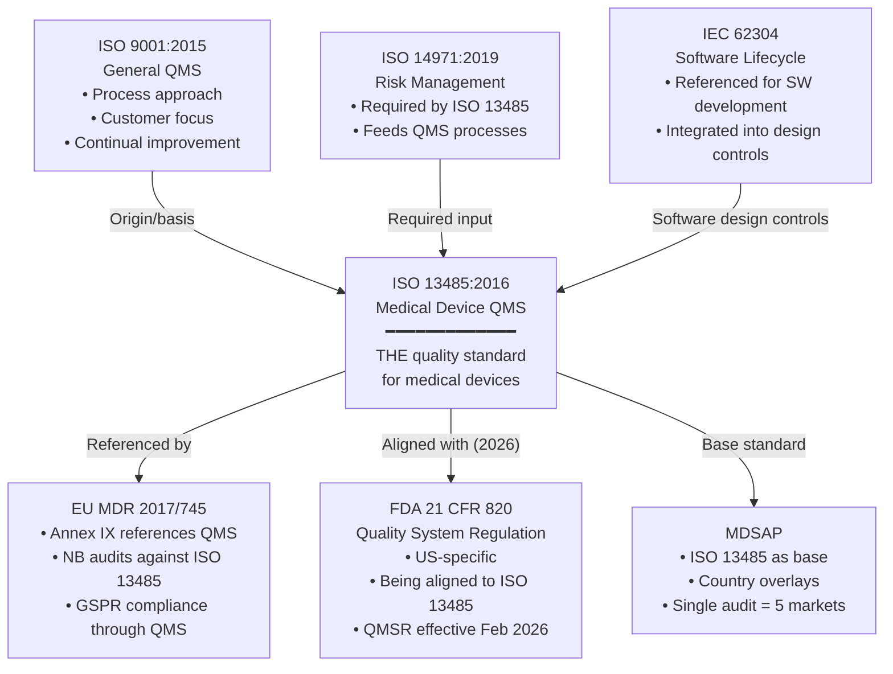
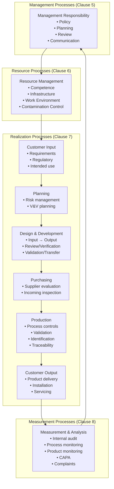
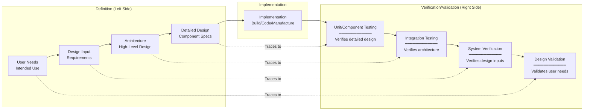
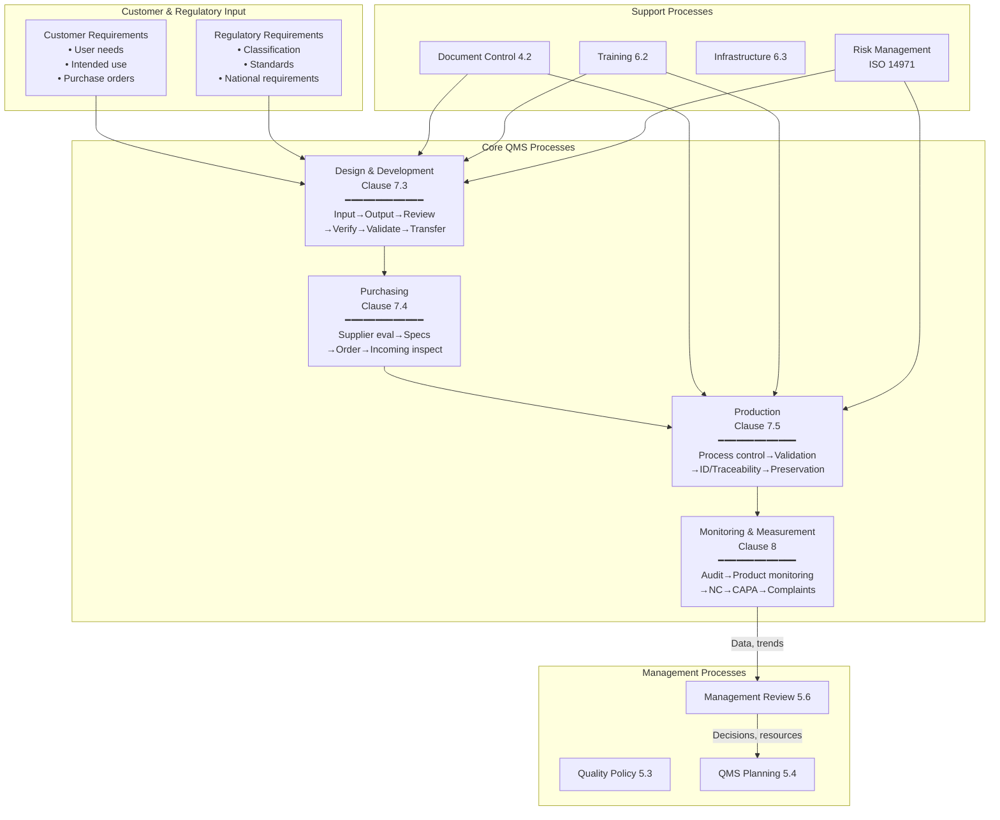

# ISO 13485:2016 — Medical Device Quality Management System

**Topic:** Quality Management System requirements for medical device design, development, production, and servicing  
**Standard:** ISO 13485:2016 — Medical devices: Quality management systems — Requirements for regulatory purposes  
**SDO:** ISO/TC 210 (Quality management and corresponding general aspects for medical devices)  
**Audience:** Quality managers, regulatory affairs professionals, design engineers, auditors, MDSAP assessors  
**Prerequisites:** Basic quality concepts, ISO 9001 familiarity (helpful but not required), medical device regulatory overview

---

## Chapter 1 — Historical Context & Origin Story

### 1.1 Timeline

| Year | Event | Significance |
|------|-------|-------------|
| 1987 | ISO 9001 first published | General QMS standard; medical devices referenced it |
| 1996 | **ISO 13485:1996** first edition | First medical device-specific QMS; heavily based on ISO 9001:1994 |
| 2000 | ISO 9001:2000 (process approach) | Major QMS revision; ISO 13485 chose NOT to follow completely |
| 2003 | **ISO 13485:2003** second edition | Updated; deliberately diverged from ISO 9001:2000 on some points |
| 2016 | **ISO 13485:2016** third edition (current) | Major update: risk-based approach; software validation; supplier control; regulatory emphasis |
| 2017 | EU MDR 2017/745 published | References ISO 13485 as QMS basis |
| 2019 | MDSAP mandatory for Canada | ISO 13485 + country overlays; single audit |
| 2024 | FDA 21 CFR 820 QMSR revision | Aligns FDA QSR with ISO 13485:2016 (effective Feb 2026) |
| 2024+ | ISO 13485 revision started | Next edition in development (expected 2026-2028) |

### 1.2 Relationship to Other Standards



---

## Chapter 2 — Standard Architecture & Structure

### 2.1 ISO 13485:2016 Clause Structure

| Clause | Title | Content |
|:------:|-------|---------|
| 1 | Scope | Application to organizations in MD lifecycle |
| 2 | Normative References | ISO 9000:2015 (terms and definitions) |
| 3 | Terms and Definitions | 21 defined terms specific to medical devices |
| 4 | **Quality Management System** | Documentation; QM Manual; document/record control |
| 5 | **Management Responsibility** | Commitment; customer focus; policy; planning; authority; management review |
| 6 | **Resource Management** | Human resources; infrastructure; work environment (contamination control, cleanliness) |
| 7 | **Product Realization** | Planning; customer-related; **design and development**; purchasing; production; monitoring equipment |
| 8 | **Measurement, Analysis, and Improvement** | Monitoring; internal audit; product control; CAPA; data analysis; improvement |

### 2.2 Key Differences: ISO 13485 vs. ISO 9001

| Aspect | ISO 9001:2015 | ISO 13485:2016 |
|--------|--------------|----------------|
| Focus | Customer satisfaction; continual improvement | **Regulatory compliance; safety and efficacy** |
| Risk approach | Risk-based thinking (general) | **Risk management per ISO 14971 (specific)** |
| Continual improvement | Required (PDCA) | Not explicitly required (regulatory compliance is the goal) |
| Context of organization | Required (Clause 4.1) | Not required |
| Design and development | Can be excluded if not performed | **Cannot be excluded if involved in design** |
| Validation of processes | Required | **More rigorous; includes software validation** |
| Traceability | Required | **Medical device traceability (UDI, lot/serial)** |
| Work environment | General provisions | **Specific: contamination control, cleanliness, special conditions for implants** |
| Post-market | Not specific | **Complaint handling; advisory notices; vigilance reporting** |
| Documentation | Less prescriptive | **More prescriptive (medical device file; quality manual mandatory)** |

### 2.3 Process Model



---

## Chapter 3 — Technical Deep Dive

### 3.1 Clause 7.3 — Design and Development (Design Controls)

| Sub-clause | Requirement | Key Deliverables |
|------------|-------------|-----------------|
| 7.3.1 | General | Design and development procedures |
| 7.3.2 | **Design and development planning** | Design plan (phases, reviews, V&V, responsibilities, resources) |
| 7.3.3 | **Design input** | Requirements (functional, performance, safety, regulatory, risk-derived, usability, standards) |
| 7.3.4 | **Design output** | Specifications; manufacturing information; acceptance criteria; essential safety characteristics |
| 7.3.5 | **Design review** | Formal, documented reviews at planned stages; include all relevant functions + independent reviewers |
| 7.3.6 | **Design verification** | Confirm outputs meet inputs (testing, analysis, comparison, inspection) |
| 7.3.7 | **Design validation** | Confirm device meets user needs and intended use (under representative conditions; clinical evaluation) |
| 7.3.8 | **Design transfer** | Verified translation of design to production (manufacturing specifications, work instructions, tooling) |
| 7.3.9 | **Design changes** | Controlled changes: reviewed, verified, validated (as appropriate); impact assessment; approved before implementation |

### 3.2 Design Control V-Model



### 3.3 Clause 8.2.2 — Complaint Handling

| Requirement | Implementation |
|-------------|---------------|
| Documented procedure for complaints | Written SOP covering intake, investigation, CAPA linkage, regulatory reporting |
| Timely handling | Define timeline per severity (critical: 24h investigation start; routine: 5 business days) |
| Determine if complaint = feedback that represents a complaint | Criteria for what constitutes a complaint vs. general feedback |
| Investigation requirement | Root cause analysis; determine if reportable event (MDR/vigilance) |
| Regulatory reporting determination | Is it a serious injury/malfunction/death? → Report to authority per timeline |
| If investigation not performed, document justification | Must justify why any complaint is NOT investigated |
| CAPA linkage | Trending; if systemic → CAPA initiation |
| Record retention | Per regulatory requirements (typically 10+ years for implantables) |

### 3.4 Clause 8.5.2/8.5.3 — CAPA (Corrective and Preventive Action)

| Step | Corrective Action (8.5.2) | Preventive Action (8.5.3) |
|------|--------------------------|--------------------------|
| 1 | Review nonconformities (including complaints) | Review information sources (data, trends, processes) |
| 2 | Determine cause of nonconformity | Determine potential nonconformities and causes |
| 3 | Evaluate need for action to ensure recurrence does not occur | Evaluate need for action to prevent occurrence |
| 4 | Plan and document action needed | Plan and document action needed |
| 5 | Implement action | Implement action |
| 6 | **Verify** action does not adversely affect device | **Verify** action does not adversely affect device |
| 7 | Review **effectiveness** of corrective action taken | Review **effectiveness** of preventive action taken |

---

## Chapter 4 — Implementation Guide

### 4.1 QMS Implementation Roadmap

| Phase | Duration | Activities | Deliverables |
|-------|:--------:|-----------|-------------|
| **1: Gap Analysis** | 1-2 months | Current state assessment; gap against ISO 13485 clause-by-clause; resource estimation | Gap report; implementation plan; budget |
| **2: QMS Design** | 2-3 months | Define processes; draft quality manual; define document structure; quality policy | Quality manual; process map; quality policy |
| **3: Documentation** | 3-6 months | Write SOPs (20-40 typical); create forms/templates; work instructions | Document hierarchy: QM → SOPs → WIs → Forms |
| **4: Implementation** | 3-6 months | Train all staff; deploy procedures; begin records; management reviews; internal audits | Training records; first management review; first internal audit |
| **5: Maturation** | 3-6 months | Run processes; collect data; CAPA from audits; improve; conduct second internal audit cycle | Metrics; trends; CAPA closure; readiness assessment |
| **6: Certification Audit** | 1-2 months | Stage 1 (documentation review) + Stage 2 (implementation audit) by certification body | ISO 13485 certificate |

### 4.2 Minimum Document Set

| Document Type | Examples | Quantity (Typical) |
|--------------|---------|:-----------------:|
| Quality Manual | QM-001 Quality Manual | 1 |
| Quality Policy | Included in QM or standalone | 1 |
| Quality Objectives | Annual objectives + metrics | 1 (updated annually) |
| Standard Operating Procedures | Document Control, Design Control, CAPA, Purchasing, Production, Complaints, Internal Audit, Management Review, Training, Risk Management, etc. | 20-40 |
| Work Instructions | Manufacturing WIs; testing WIs; packaging WIs | Variable (10-100+) |
| Forms / Templates | Design review form; CAPA form; NCR form; training record; supplier evaluation | 30-60 |
| Device Master Record (DMR) | Complete set of design output documents per device | 1 per device family |
| Device History Record (DHR) | Production records per lot/unit | 1 per lot/batch |
| Design History File (DHF) | Design and development records per project | 1 per design project |
| Risk Management File (RMF) | ISO 14971 deliverables per device | 1 per device |

### 4.3 Typical QMS Procedures

| # | SOP Title | ISO 13485 Clause |
|---|-----------|:----------------:|
| 1 | Document and Record Control | 4.2.4, 4.2.5 |
| 2 | Management Review | 5.6 |
| 3 | Training and Competence | 6.2 |
| 4 | Infrastructure and Work Environment | 6.3, 6.4 |
| 5 | Design and Development Control | 7.3 |
| 6 | Risk Management | 7.1 (ISO 14971) |
| 7 | Purchasing and Supplier Management | 7.4 |
| 8 | Production and Process Control | 7.5.1 |
| 9 | Process Validation | 7.5.6 |
| 10 | Identification and Traceability | 7.5.8, 7.5.9 |
| 11 | Preservation of Product | 7.5.11 |
| 12 | Monitoring and Measuring Equipment | 7.6 |
| 13 | Internal Audit | 8.2.4 |
| 14 | Monitoring and Measurement of Product | 8.2.6 |
| 15 | Control of Nonconforming Product | 8.3 |
| 16 | CAPA (Corrective and Preventive Action) | 8.5.2, 8.5.3 |
| 17 | Complaint Handling | 8.2.2 |
| 18 | Advisory Notices and Vigilance Reporting | 8.2.3 |
| 19 | Design Change Control | 7.3.9 |
| 20 | Software Validation (Computer Systems) | 4.1.6 |

---

## Chapter 5 — Certification & Audit

### 5.1 Certification Audit Process

| Stage | Purpose | Duration | Outcome |
|-------|---------|:--------:|---------|
| Stage 1 (Document Review) | Review QMS documentation adequacy; plan Stage 2 | 1-2 days | Stage 1 report; readiness for Stage 2 |
| Stage 2 (Implementation Audit) | Verify effective implementation of QMS processes | 3-5 days (depends on org size) | Audit report; NC findings (major/minor); recommendation |
| NC Response | Organization addresses nonconformities | 30-90 days | Corrective actions submitted |
| Certification Decision | CB reviews evidence; issues certificate | 2-4 weeks | ISO 13485 certificate (3-year validity) |
| Surveillance Audits | Annual audits (year 1 and year 2) | 2-3 days | Continued compliance verification |
| Recertification Audit | Full audit at 3-year mark | 3-5 days | Certificate renewal |

### 5.2 Common Audit Findings

| Finding Area | Typical NC | Root Cause | Prevention |
|-------------|-----------|-----------|-----------|
| Design Controls (7.3) | Incomplete design input; missing traceability; validation not representative | Rush to market; insufficient planning | Design review discipline; traceability matrix tool |
| CAPA (8.5) | Ineffective root cause analysis; CAPA not verified for effectiveness | Superficial investigation; no follow-up | 5-Why/Ishikawa methods; effectiveness check at defined interval |
| Document Control (4.2) | Obsolete documents in use; records not per procedure | Poor training; inaccessible system | Electronic DMS; periodic compliance checks |
| Supplier Management (7.4) | Insufficient evaluation; no re-evaluation; missing incoming inspection | Growth without process maturity | Supplier scorecard; risk-based evaluation frequency |
| Complaints (8.2.2) | Late investigation; no regulatory reportability determination | Unclear process; untrained staff | Clear criteria; trained investigators; automated tracking |
| Training (6.2) | No evidence of competence assessment; generic training | Check-box mentality | Competence-based assessment (not just attendance) |
| Risk Management (7.1) | Risk file not updated post-market; no link to design changes | Separate from design process | Integrate risk management into design reviews |

### 5.3 MDSAP Audit Additions

| Country | Additional Requirements (Beyond ISO 13485) |
|---------|------------------------------------------|
| **USA** | 21 CFR 820 specifics: design history file structure; MDR reporting; corrections & removals; unique device identification |
| **Canada** | CMDR (Canadian Medical Devices Regulations): mandatory problem reporting; license conditions; recall procedures |
| **Brazil** | ANVISA: GMP requirements; registration dossier; post-market vigilance (NOTIVISA system) |
| **Australia** | TGA: ARTG inclusion; adverse event reporting (AER); recalls; supply requirements |
| **Japan** | PMDA: QMS Ordinance (MHLW 169); manufacturing site inspection; foreign manufacturer registration (MAH) |

---

## Chapter 6 — Regional Variations

### 6.1 FDA 21 CFR 820 → QMSR Transition (2024-2026)

| Aspect | Old (21 CFR 820) | New (QMSR — effective Feb 2026) |
|--------|-------------------|--------------------------------|
| Structure | FDA-specific structure (A-Q subparts) | **Incorporates ISO 13485:2016 by reference** |
| Requirements | FDA language | ISO 13485 language + FDA additions |
| Design Controls (§820.30) | FDA-specific | ISO 13485 Clause 7.3 (+ FDA design history file requirement retained) |
| Purchasing (§820.50) | FDA language | ISO 13485 Clause 7.4 |
| CAPA (§820.90) | FDA language | ISO 13485 Clause 8.5 |
| What changes for industry? | Maintain two systems (ISO 13485 + 820 differences) | **Single system: ISO 13485 satisfies FDA QMS** (with few additions) |
| FDA-specific additions retained | — | Complaint file requirements; MDR reporting linkage; device history record |
| Transition period | — | 2 years from publication (compliance required February 2, 2026) |
| Impact | Dual documentation burden | **Reduced documentation; single QMS for global markets** |

---

## Chapter 7 — Comparison

### 7.1 ISO 13485 vs. 21 CFR 820 vs. EU MDR QMS Requirements

| Requirement | ISO 13485:2016 | 21 CFR 820 (current) | EU MDR (via NB audit) |
|-------------|:-:|:-:|:-:|
| Quality Manual | ✅ Required | ❌ Not explicitly | ✅ Expected |
| Management Review | ✅ Clause 5.6 | ✅ §820.20 | ✅ Expected |
| Design Controls | ✅ Clause 7.3 | ✅ §820.30 | ✅ (design examined via GSPR) |
| Risk Management | ✅ 7.1 (references ISO 14971) | ✅ §820.30(g) | ✅ GSPR 1-9; ISO 14971 |
| Purchasing Controls | ✅ Clause 7.4 | ✅ §820.50 | ✅ Supplier qualification |
| Production Controls | ✅ Clause 7.5 | ✅ §820.70-§820.75 | ✅ Manufacturing process |
| CAPA | ✅ Clause 8.5 | ✅ §820.90 | ✅ Expected |
| Complaint Handling | ✅ Clause 8.2.2 | ✅ §820.198 | ✅ Required (vigilance) |
| Internal Audit | ✅ Clause 8.2.4 | ✅ §820.22 | ✅ Expected |
| Document Control | ✅ Clause 4.2.4 | ✅ §820.40 | ✅ Expected |
| Post-Market Surveillance | ✅ Clause 8.2.1 | Limited (MDR reporting) | ✅ **Extensive** (PMS/PMCF/PSUR/vigilance) |
| Software Validation | ✅ Clause 4.1.6 | ✅ §820.70(i) | ✅ Expected |

---

## Chapter 8 — Mermaid Architecture Diagrams

### 8.1 ISO 13485 Process Interaction Map



### 8.2 CAPA Process Flow

```mermaid
graph TB
    INPUT[Input Sources<br/>• Complaints<br/>• Nonconformances<br/>• Audit findings<br/>• Process data trends<br/>• Returned product<br/>• Service reports<br/>• Regulatory feedback]
    
    EVAL[Evaluate Need for CAPA<br/>• Is it recurring/systematic?<br/>• Risk to patient/user?<br/>• Regulatory impact?<br/>• Quality impact?]
    
    RCA[Root Cause Analysis<br/>• 5 Why Analysis<br/>• Ishikawa (fishbone)<br/>• Fault Tree Analysis<br/>• Failure Mode Analysis<br/>• Data collection]
    
    PLAN_C[Plan Corrective/Preventive Action<br/>• Define action(s)<br/>• Assign responsibility<br/>• Set timeline<br/>• Define success criteria<br/>• Assess risk of changes]
    
    IMPL_C[Implement Action<br/>• Execute changes<br/>• Train affected staff<br/>• Update documentation<br/>• Record evidence]
    
    VERIFY[Verify No Adverse Effects<br/>• Does the action work?<br/>• Any new risks introduced?<br/>• Product still meets specs?]
    
    EFFECT[Verify Effectiveness<br/>• Has recurrence stopped?<br/>• Defined period (30-90 days)<br/>• Objective evidence]
    
    CLOSE[Close CAPA<br/>• Effectiveness confirmed<br/>• Records complete<br/>• Management informed]
    
    MGMT[Management Review Input<br/>• CAPA status<br/>• Trends<br/>• Effectiveness data]
    
    INPUT --> EVAL -->|"Yes, CAPA needed"| RCA --> PLAN_C --> IMPL_C --> VERIFY --> EFFECT --> CLOSE --> MGMT
    EVAL -->|"No, handle as NC only"| NCR[Nonconformance<br/>Disposition only]
```

---

## Chapter 9 — Case Studies

### 9.1 Startup Implementing ISO 13485 from Scratch

| Aspect | Detail |
|--------|--------|
| Company | 25-person medical device startup; developing Class IIa wearable cardiac monitor; targeting EU + US market |
| Starting state | No QMS; software development using agile/scrum (no design controls); no document control; no supplier management |
| Goal | ISO 13485 certification within 12 months; CE marking preparation; FDA 510(k) readiness |
| Month 1-2: Foundation | (1) Hired Quality/RA consultant (part-time). (2) Gap analysis: zero compliance against ISO 13485 (expected for startup). (3) Selected electronic QMS (Greenlight Guru — purpose-built for medical devices). (4) Wrote quality policy and quality objectives. (5) Defined process map (12 core processes identified). |
| Month 3-5: Documentation | (1) Wrote quality manual. (2) Developed 22 SOPs covering all ISO 13485 requirements. (3) Key SOPs: Design Control (aligned IEC 62304 for software + hardware design); Risk Management (ISO 14971 integration); CAPA; Complaints; Document Control; Purchasing. (4) Created design control templates (design input template, review minutes, V&V protocols). (5) Retrospective design history file (captured design decisions made before QMS existed). |
| Month 5-8: Implementation | (1) Trained all 25 staff on QMS awareness + role-specific procedures. (2) Converted agile process to design-controlled agile (sprint reviews = design reviews; user stories trace to design inputs; definition-of-done includes verification evidence). (3) Supplier qualification: evaluated 8 critical suppliers (PCB fab, enclosure, battery, sensor, cloud hosting). (4) Implemented document control in Greenlight Guru (all documents version-controlled; electronic signatures). (5) First internal audit (by consultant): 12 findings (expected for immature system). |
| Month 8-10: Maturation | (1) Closed internal audit findings. (2) Completed first management review (all required inputs addressed). (3) Validated 3 production processes (soldering, adhesive bonding, final assembly). (4) Conducted design validation planning (clinical performance study designed). (5) Second internal audit: 4 findings (significant improvement). |
| Month 10-12: Certification | (1) Certification body selected (BSI). (2) Stage 1 audit (remote, 1 day): 2 minor findings (documentation completeness). (3) Addressed findings. (4) Stage 2 audit (on-site, 3 days): 3 minor nonconformities (training evidence gaps; one process not fully validated; supplier re-evaluation scheduling). (5) Corrective actions submitted and accepted. (6) **ISO 13485 certificate issued** (12 months from start). |
| Cost | Consultant: $60K. QMS software: $30K/year. Certification body fees: $25K. Staff time: ~2 FTE-months. Total year 1: ~$135K |
| Key learning | "Retrospective documentation of design decisions was the hardest part. Start your QMS BEFORE you start designing — bolting it on afterward is painful and risky." |

### 9.2 Warning Letter Response — QMS Failures

| Aspect | Detail |
|--------|--------|
| Company | Mid-size manufacturer of Class II surgical instruments; 400 employees; FDA Warning Letter received |
| Warning Letter findings | (1) §820.90 CAPA: root cause analysis superficial ("human error" for 80% of CAPAs); no effectiveness verification. (2) §820.198 Complaints: complaints not investigated within required timeframe; no regulatory reportability determination. (3) §820.30 Design Controls: design changes implemented without verification/validation. (4) §820.50 Purchasing: supplier audit schedule not maintained; 3 critical suppliers never audited. |
| Response timeline | 15 business days for initial response; 6-month remediation plan |
| Corrective actions | (1) **CAPA**: Hired quality engineer dedicated to CAPA. Trained all investigators on root cause methods (5-Why, Ishikawa). Implemented mandatory effectiveness verification at 60/90-day intervals. Re-opened and properly investigated last 12 months of CAPAs. (2) **Complaints**: Implemented 48-hour triage requirement. Created regulatory reportability decision tree (flowchart for MDR determination). Hired complaint specialist. Addressed backlog (90 uninvestigated complaints processed in 60 days). (3) **Design Controls**: Implemented change control board (CCB) meeting weekly. Design change procedure rewritten with mandatory verification/validation assessment. All pending design changes re-evaluated. (4) **Purchasing**: Completed overdue supplier audits within 90 days. Created risk-based supplier audit schedule. Hired supplier quality engineer. |
| Outcome | FDA accepted response. Follow-up inspection 8 months later: all observations closed. Consent decree avoided. Total remediation cost: $800K (staffing + consulting + overtime + system improvements). |

---

## Chapter 10 — Future Evolution

| Trend | Timeline | Impact |
|-------|----------|--------|
| ISO 13485 next revision | 2026-2028 | Expected updates: digitalization, AI/ML considerations, sustainability, supply chain resilience |
| FDA QMSR harmonization | Feb 2026 | 21 CFR 820 incorporates ISO 13485 by reference; single QMS for US + international |
| eQMS / Digital QMS | Now | Cloud-based QMS platforms (Greenlight Guru, MasterControl, Veeva Vault); electronic signatures; automated workflows |
| AI in quality processes | 2024-2026 | AI-assisted complaint trending; automated nonconformance classification; predictive CAPA |
| Continuous quality verification | Now-2025 | Real-time process monitoring; statistical process control integration; automated batch release |
| Supply chain digitalization | Now | Digital supplier portals; automated supplier monitoring; supply chain traceability |
| Agile + ISO 13485 | Now | Frameworks for integrating agile/lean development with design controls |
| MDSAP expansion | 2025+ | More countries joining (Singapore, South Korea expressed interest) |
| Cybersecurity in QMS | Now | QMS processes for SBOM management, vulnerability handling, security updates |
| Sustainability integration | 2025+ | IEC 60601-1-9; environmental considerations in QMS (eco-design) |

---

## Chapter 11 — Interview Questions & Career Guide

### Tier 1: Entry-Level

**Q1:** What is the purpose of ISO 13485, and how does it differ from ISO 9001?  
**A:** ISO 13485:2016 specifies QMS requirements for organizations that design, develop, produce, install, or service medical devices. Its purpose is to ensure organizations can consistently provide medical devices that meet customer and regulatory requirements. **Key differences from ISO 9001**: (1) **Focus**: ISO 9001 focuses on customer satisfaction and continual improvement; ISO 13485 focuses on **regulatory compliance and maintaining safety/efficacy** of medical devices. (2) **Continual improvement**: ISO 9001 requires demonstrated continual improvement; ISO 13485 does NOT require continual improvement — maintaining the effectiveness of the QMS is sufficient (the goal is consistent compliance, not getting "better" each year necessarily). (3) **Risk**: ISO 13485 requires risk management throughout product realization (references ISO 14971); ISO 9001 has general "risk-based thinking." (4) **Regulatory emphasis**: ISO 13485 is specifically for meeting medical device regulatory requirements across jurisdictions; ISO 9001 is industry-agnostic. (5) **Specific requirements**: ISO 13485 has detailed requirements for work environment (contamination, cleanliness), traceability, complaint handling, and advisory notices that don't exist in ISO 9001.

**Q2:** Explain the difference between design verification and design validation.  
**A:** These are two distinct activities in design controls (Clause 7.3.6 and 7.3.7): **Design Verification** answers: "Did we build the product RIGHT?" — confirms design outputs meet design inputs. It checks that specifications are met through testing, inspection, analysis, or demonstration. Example: The requirement says "device must withstand 100N force." Verification = mechanical testing proving it withstands 100N. Done in lab conditions; can use test fixtures/prototypes. **Design Validation** answers: "Did we build the RIGHT product?" — confirms the final device meets user needs and intended use under actual or simulated use conditions. It tests whether the device works for its intended purpose in the hands of the intended user. Example: Clinical study showing the device accurately measures blood pressure in the intended patient population, used by the intended operator (nurse/patient), in the intended environment (hospital/home). Key points: (1) Validation requires testing under representative conditions (including actual/simulated use). (2) Validation typically uses production-equivalent devices. (3) Both require pre-defined acceptance criteria and documented results.

### Tier 2: Mid-Level

**Q3:** How do you integrate agile software development with ISO 13485 design controls?  
**A:** [Full answer covers: mapping agile ceremonies to design control requirements. Sprint planning = design planning updates. User stories = design inputs (with formal requirements traceability). Sprint reviews = design reviews (formally documented; cross-functional attendance; action items tracked). Definition of Done includes verification evidence. Sprint deliverables = design outputs (tagged in version control). Release = design transfer. Key adaptations: (1) Maintain traceability matrix linking user stories → requirements → design outputs → verification results (tools: Jira with traceability plugin, or dedicated MD tools). (2) Conduct formal design reviews at defined milestones (not every sprint; typically at architectural decisions, major integrations, pre-V&V, pre-release). (3) Risk management integrated into backlog: risk controls become user stories; risk analysis updated per sprint. (4) Change control: any change to baselined requirements goes through change control process (not just "edit the ticket"). (5) Documentation: auto-generate design history file artifacts from tools where possible (traceability reports, test results, review records).]

### Tier 3: Senior

**Q4:** You've just acquired a medical device company with a failing QMS (recent FDA Warning Letter). Design a 6-month remediation strategy that restores compliance while maintaining production.  
**A:** [Full answer covers: (1) Week 1-2: Assessment — detailed analysis of all Warning Letter observations; current state gap analysis (not just cited issues — assume systemic problems); identify patient safety risks. (2) Week 2-4: Immediate actions — address any immediate patient safety issues (field corrections if needed); notify FDA of response plan; hire experienced consultant team (former FDA investigators). (3) Month 1-2: Foundation — replace/supplement quality leadership (head of quality, CAPA specialist, complaint manager); establish interim processes for critical gaps (complaints, CAPA, design changes); address regulatory reportability backlog. (4) Month 2-4: Systematic remediation — re-write deficient procedures; retrain all staff; address root causes (not just symptoms from Warning Letter); tackle CAPA backlog; audit all critical suppliers. (5) Month 4-5: Internal verification — comprehensive internal audit of all subsystems; management review; mock FDA inspection (using external ex-FDA auditor). (6) Month 6: FDA readiness — document all corrective actions with objective evidence; invite FDA re-inspection (or wait for follow-up). Key principles: (a) Production continues only if patient safety maintained (if not — voluntary recall/suspension). (b) Fix systemically, not just the cited examples. (c) Culture change: quality is everyone's responsibility. (d) Metrics proving sustained improvement (not just one-time fix).]

---

## Chapter 12 — Cheat Sheet & Quick Reference

### ISO 13485:2016 Clause Map

```
Clause 4: QMS
  4.1 General; 4.2 Documentation (QM, Doc Control, Records)

Clause 5: Management
  5.1 Commitment; 5.2 Customer Focus; 5.3 Policy; 5.4 Planning;
  5.5 Responsibility/Authority; 5.6 Management Review

Clause 6: Resources
  6.1 Provision; 6.2 Human Resources (competence);
  6.3 Infrastructure; 6.4 Work Environment (contamination control)

Clause 7: Product Realization
  7.1 Planning; 7.2 Customer-Related; 7.3 DESIGN & DEVELOPMENT;
  7.4 Purchasing; 7.5 Production; 7.6 Monitoring Equipment

Clause 8: Measurement
  8.1 General; 8.2 Monitoring (complaints, audits, processes, product);
  8.3 Nonconforming Product; 8.4 Data Analysis; 8.5 Improvement (CAPA)
```

### Design Controls Summary

```
PLAN  → What are we building? How will we verify/validate?
INPUT → Requirements (functional, performance, safety, regulatory, risk)
OUTPUT→ Specifications; drawings; SW code; manufacturing specs
REVIEW→ Cross-functional check at key milestones
VERIFY→ Does output meet input? (testing in lab)
VALIDATE→ Does device meet user need? (in real/simulated use)
TRANSFER→ Design → Manufacturing (reproducibly)
CHANGE → Controlled; assessed; verified; validated (as needed)
```

### Key Records to Maintain

```
Design History File (DHF):  All design and development records per project
Device Master Record (DMR):  Complete specifications for finished device
Device History Record (DHR): Production records per lot/batch/unit
Risk Management File (RMF):  All risk management deliverables per device
Complaint Files:             All complaint records with investigation
CAPA Records:               All CAPA records with effectiveness evidence
Training Records:           Evidence of competence for all personnel
Supplier Files:             Evaluation, monitoring, audit records
Management Review:          Minutes and decisions (at least annual)
Internal Audit:             Reports, findings, corrective actions
```

### Audit Readiness Checklist

```
□ Quality Manual current and approved
□ Quality Policy posted/accessible
□ Quality Objectives defined with metrics
□ Management Review conducted (within last 12 months)
□ Internal audit completed (all clauses covered in cycle)
□ CAPA records: root cause documented; effectiveness verified
□ Complaints: all investigated; reportability determined
□ Training records: current; competence assessed
□ Supplier evaluations: current; risk-based schedule followed
□ Document control: no obsolete documents in work areas
□ Design files: traceability matrix complete
□ Production records: DHR complete per lot
□ Calibration: all equipment current
□ Process validation: completed for special processes
```

---

*End of Document — 01_ISO_13485_QMS.md*
