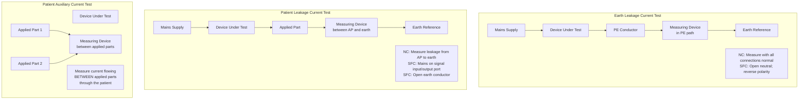

# IEC 60601-1:2005+AMD1:2012+AMD2:2020 — Medical Electrical Equipment Safety

**Topic:** General requirements for basic safety and essential performance of medical electrical equipment  
**Standard:** IEC 60601-1:2005+AMD1:2012+AMD2:2020 (Edition 3.2)  
**SDO:** IEC/SC 62A (Common aspects of electrical equipment used in medical practice)  
**Audience:** Biomedical engineers, hardware design engineers, safety engineers, regulatory affairs specialists, test engineers  
**Prerequisites:** Electrical engineering fundamentals, understanding of medical device classification, basic knowledge of risk management (ISO 14971)

---

## Chapter 1 — Historical Context & Origin Story

### 1.1 Timeline

| Year | Event | Significance |
|------|-------|-------------|
| 1977 | IEC 60601-1 Edition 1 | First international standard for medical electrical equipment safety |
| 1988 | IEC 60601-1 Edition 2 | Expanded requirements; widely adopted globally |
| 2005 | **IEC 60601-1 Edition 3** | Major rewrite; risk-based approach; essential performance concept introduced |
| 2007 | IEC 60601-1-2 Ed 3 (EMC) | Electromagnetic compatibility for medical devices |
| 2012 | **Amendment 1 (AMD1:2012)** | Clarifications; usability engineering reference; PEMS requirements refined |
| 2014 | IEC 60601-1-2 Ed 4 (EMC) | Risk-based EMC testing approach |
| 2020 | **Amendment 2 (AMD2:2020)** | Cybersecurity references; updated normative references; clarifications on PEMS |
| 2024 | Edition 3.2 consolidated | Combined base + AMD1 + AMD2 into single document |
| 2025+ | Edition 4 development | Planned: cybersecurity integration; SaMD considerations; IoMT |

### 1.2 The IEC 60601 Family Structure

```mermaid
graph TB
    GEN[IEC 60601-1<br/>General Standard<br/>━━━━━━━━━━━━━<br/>Basic safety<br/>Essential performance<br/>General requirements]
    
    subgraph "Collateral Standards (60601-1-X)"
        COL2[60601-1-2<br/>EMC]
        COL3[60601-1-3<br/>Radiation Protection]
        COL6[60601-1-6<br/>Usability]
        COL8[60601-1-8<br/>Alarm Systems]
        COL9[60601-1-9<br/>Eco Design]
        COL10[60601-1-10<br/>Physiological Closed-Loop]
        COL11[60601-1-11<br/>Home Healthcare]
        COL12[60601-1-12<br/>Emergency Environment]
    end
    
    subgraph "Particular Standards (60601-2-XX)"
        PAR1[60601-2-1<br/>Electron Accelerators]
        PAR2[60601-2-2<br/>HF Surgical Equipment]
        PAR4[60601-2-4<br/>Defibrillators]
        PAR13[60601-2-13<br/>Anaesthetic Systems]
        PAR24[60601-2-24<br/>Infusion Pumps]
        PAR25[60601-2-25<br/>ECG]
        PAR27[60601-2-27<br/>ECG Monitoring]
        PAR33[60601-2-33<br/>MRI Equipment]
        PAR37[60601-2-37<br/>Ultrasound]
        PAR44[60601-2-44<br/>CT Scanners]
        PAR54[60601-2-54<br/>X-ray Radiography]
        PARMORE[60601-2-XX<br/>80+ particular stds]
    end
    
    GEN --> COL2
    GEN --> COL3
    GEN --> COL6
    GEN --> COL8
    GEN --> COL9
    GEN --> COL10
    GEN --> COL11
    GEN --> COL12
    GEN --> PAR1
    GEN --> PAR2
    GEN --> PAR4
    GEN --> PAR13
    GEN --> PAR24
    GEN --> PAR25
    GEN --> PAR27
    GEN --> PAR33
    GEN --> PAR37
    GEN --> PAR44
    GEN --> PAR54
    GEN --> PARMORE
```



### 1.3 Key Philosophy: Edition 3 Shift

| Edition 2 Approach | Edition 3 Approach |
|--------------------|--------------------|
| Prescriptive rules ("do X, Y, Z") | Risk-based approach ("identify hazards, manage risks") |
| Pass/fail based on fixed limits only | Essential performance concept — what MUST the device do to remain safe? |
| Limited consideration of software | PEMS (Programmable Electrical Medical Systems) clause |
| Assumed hospital environment | Environment-specific requirements (home, emergency, etc.) via collateral standards |
| Single-fault condition only | Risk management integration for residual risk |

---

## Chapter 2 — Standard Architecture & Structure

### 2.1 IEC 60601-1 Clause Structure

| Clause | Title | Content |
|:------:|-------|---------|
| 1 | Scope, object, related standards | What's covered; normative references |
| 2 | Terminology and definitions | 350+ defined terms |
| 3 | General requirements | Risk management process; essential performance; usability |
| 4 | General requirements for testing | Test conditions; environmental requirements |
| 5 | Classification | Class I/II; type B/BF/CF applied parts; IP rating |
| 6 | Identification, marking, documents | Labels; instructions for use; technical description |
| 7 | ME equipment power input | Power supply requirements; mains supply |
| 8 | **Protection against electrical hazards** | Basic insulation; reinforced insulation; creepage/clearance; earth leakage; patient leakage |
| 9 | Protection against mechanical hazards | Moving parts; surfaces; pressure vessels; acoustic energy |
| 10 | Protection against unwanted/excessive radiation | X-ray; UV; IR; visible light; microwave; laser |
| 11 | Protection against excessive temperatures | Touch temperatures; patient contact temperatures |
| 12 | Accuracy of controls and instruments | Settings; displayed values; performance accuracy |
| 13 | **Hazardous situations and fault conditions** | Single fault conditions; component failure analysis |
| 14 | **Programmable Electrical Medical Systems (PEMS)** | Software requirements; architecture; verification |
| 15 | Construction | Materials; wiring; connections; creepage/clearance in construction |
| 16 | ME systems | Multiple device systems; data connections; separation requirements |
| 17 | Electromagnetic compatibility | Reference to IEC 60601-1-2 |

### 2.2 Key Definitions

| Term | Definition | Significance |
|------|-----------|-------------|
| **ME Equipment** | Electrical equipment with an APPLIED PART or transferring energy to/from patient | Core scope of the standard |
| **Applied Part** | Part of ME equipment that in normal use comes into physical contact with the patient | Determines type B/BF/CF classification |
| **Basic Safety** | Freedom from unacceptable risk directly caused by physical hazards (electrical, thermal, mechanical, radiation) | What the standard primarily addresses |
| **Essential Performance** | Performance necessary to achieve freedom from UNACCEPTABLE RISK (performance whose loss/degradation creates a hazardous situation) | Device-specific; manufacturer must define |
| **Means of Protection (MOP)** | A means to reduce risk from an identified hazard | Key Edition 3 concept; 2 MOPs required |
| **MOPP** | Means of Operator Protection | Protects operator/service personnel |
| **MOOP** | Means of Patient Protection | Protects patient (more stringent for CF) |
| **Normal Condition (NC)** | All means of protection intact | Baseline operating state |
| **Single Fault Condition (SFC)** | One means of protection has failed | Device must remain safe in SFC |
| **PEMS** | Programmable Electrical Medical System | Any ME equipment containing programmable electronic subsystems |

---

## Chapter 3 — Technical Deep Dive

### 3.1 Equipment Classification

#### 3.1.1 Protection Against Electric Shock (Class I vs. Class II)

| Class | Protection Method | Earthing | Double/Reinforced Insulation | Symbol |
|:-----:|-------------------|:--------:|:----------------------------:|:------:|
| **Class I** | Basic insulation + protective earth | YES (PE conductor required) | No (basic insulation + earth = 2 MOPs) | ⏚ |
| **Class II** | Double or reinforced insulation | NO earth required | YES (double insulation = 2 MOPs) | ⧈ |
| **Internally Powered** | Internal power source (battery) | No mains connection | Battery isolation provides protection | 🔋 |

#### 3.1.2 Applied Part Classification (Type B, BF, CF)

| Type | Patient Connection | Allowable Patient Leakage (NC) | Allowable Patient Leakage (SFC) | Defibrillator Proof | Typical Application |
|:----:|-------------------|:------------------------------:|:-------------------------------:|:-------------------:|---------------------|
| **B** | Body (general contact; not direct cardiac) | 100 µA | 500 µA | No | ECG surface electrodes; ultrasound transducer; NIBP cuff |
| **BF** | Body Floating (isolated from earth; not direct cardiac) | 100 µA | 500 µA | No | Invasive blood pressure transducer; needle electrodes (not cardiac) |
| **CF** | Cardiac Floating (isolated; direct cardiac connection) | **10 µA** | **50 µA** | Optional (CF with defibrillator protection) | Intracardiac ECG; cardiac catheter; pacemaker |

**Key Principle:** The "F" (Floating) means the applied part is isolated from earth. "C" (Cardiac) means direct connection to the heart — where 10 µA can cause ventricular fibrillation.

### 3.2 Means of Protection (MOP) Concept

#### 3.2.1 The Two-MOP Principle

**Fundamental Rule:** Between any hazard source and the patient/operator, there must be **TWO independent Means of Protection (MOPs)**.

```mermaid
graph LR
    subgraph "Hazard Sources"
        MAINS[Mains Voltage<br/>230V AC]
        SEC[Secondary Circuits<br/>High Voltage]
        EARTH[Earth Potential]
    end
    
    subgraph "Two MOPs Required"
        MOP1[MOP 1<br/>e.g., Basic Insulation]
        MOP2[MOP 2<br/>e.g., Protective Earth<br/>OR Supplementary Insulation]
    end
    
    subgraph "Protected Persons"
        PAT[Patient<br/>(via Applied Part)]
        OP[Operator]
    end
    
    MAINS --> MOP1
    MOP1 --> MOP2
    MOP2 --> PAT
    MOP2 --> OP
```

#### 3.2.2 MOP Implementation Options

| Configuration | MOP 1 | MOP 2 | Equipment Class |
|--------------|-------|-------|:---------------:|
| Basic + Earth | Basic insulation (1 MOPP) | Protective earth connection (1 MOPP) | Class I |
| Double insulation | Basic insulation (1 MOPP) | Supplementary insulation (1 MOPP) | Class II |
| Reinforced insulation | Reinforced insulation = 2 MOPP in one layer | — (counts as 2) | Class II |
| Basic + impedance | Basic insulation (1 MOPP) | Protective impedance limiting current | Class I/II |
| Separation | Basic insulation (1 MOPP) | Separated circuit (transformer isolation) | Class II |

### 3.3 Electrical Safety Requirements

#### 3.3.1 Leakage Current Limits

| Leakage Type | Normal Condition | Single Fault Condition | Measurement Method |
|-------------|:----------------:|:----------------------:|-------------------|
| **Earth leakage current** | 5 mA (Class I) | 10 mA | Between PE and mains (open neutral SFC) |
| **Touch current (enclosure)** | 100 µA | 500 µA | Between enclosure and earth |
| **Patient leakage current (Type B/BF)** | 100 µA (DC or AC) | 500 µA | Between applied part and earth (mains on SOP) |
| **Patient leakage current (Type CF)** | **10 µA** (DC or AC) | **50 µA** | Between applied part and earth (mains on SOP) |
| **Patient auxiliary current (Type B/BF)** | 100 µA (DC) / 10 µA (AC) | 500 µA | Between applied parts (current flowing through patient) |
| **Patient auxiliary current (Type CF)** | **10 µA** (DC or AC) | **50 µA** | Between applied parts |

#### 3.3.2 Dielectric Strength (Hipot Testing)

| Insulation | Test Voltage (AC rms) | Duration | Where Applied |
|-----------|:---------------------:|:--------:|--------------|
| Basic insulation (≤ 250V working) | 1500 V AC | 1 minute | Between mains and accessible parts |
| Supplementary insulation | 1500 V AC | 1 minute | Between basic insulation and accessible parts |
| Reinforced insulation | 4000 V AC | 1 minute | Between mains and accessible parts (no intermediate) |
| Double insulation (combined) | 4000 V AC | 1 minute | Between mains and accessible parts |
| Applied part isolation (CF) | 1500 V AC + patient leakage test | 1 minute | Between applied part and all other circuits |

#### 3.3.3 Creepage and Clearance

| From → To | Working Voltage | Minimum Clearance | Minimum Creepage |
|-----------|:---------------:|:-----------------:|:----------------:|
| Mains → Protective earth | 250 V peak | 2.5 mm (1 MOPP) | 2.5 mm (1 MOPP) |
| Mains → Patient (2 MOPP) | 250 V peak | 5.0 mm (2 MOPP) | 8.0 mm (2 MOPP) |
| Secondary → Patient (Type CF, 2 MOPP) | Per working voltage | Per Table 12 (IEC 60601-1) | Per Table 11 (IEC 60601-1) |
| Signal circuits → Patient | < 25 V | 0.5 mm minimum | 0.8 mm minimum |

*Actual values depend on working voltage, pollution degree, and insulation type — see Tables 11-16 in IEC 60601-1.*

### 3.4 Protection Against Mechanical Hazards (Clause 9)

| Hazard | Requirement | Test Method |
|--------|-------------|-------------|
| Moving parts | Guards; interlocks; pinch-point analysis | Finger probe test; force measurements |
| Surfaces & edges | No sharp edges accessible to user/patient | Edge radius requirements; test gauges |
| Expelled parts | Retention of parts under fault conditions | Mechanical stress testing |
| Acoustic energy (ultrasound) | Output limits for diagnostic/therapeutic | Intensity measurements (IEC 61689) |
| Support systems | Patient support load limits (1.5× patient weight, 2.5× for dynamic) | Static and dynamic load testing |
| Instability | Tipping resistance (10° tilt; 25 N force) | Tilt table testing |

### 3.5 Temperature Limits (Clause 11)

| Surface Type | Maximum Temperature (Normal Condition) | Context |
|-------------|:--------------------------------------:|---------|
| Metal parts touched by hand | 41°C | Operator contact (metal enclosure) |
| Non-metallic parts touched by hand | 48°C | Operator contact (plastic enclosure) |
| Parts applied to patient (uncontrolled) | 41°C (metal); 43°C (non-metal) | Patient skin contact (long duration) |
| Parts applied to patient (controlled, monitored) | Up to 43°C (with safety controls) | Therapeutic warming devices |
| Internal components | Limited by component ratings; no risk of fire | Fire hazard prevention |

### 3.6 Programmable Electrical Medical Systems — PEMS (Clause 14)

| Requirement | Content |
|-------------|---------|
| PEMS development lifecycle | Reference to IEC 62304 (software lifecycle) |
| PEMS architecture documentation | Identify software items; interfaces; safety functions |
| PEMS validation | System-level testing of PEMS safety functions |
| Hardware/software interaction | Document how software controls safety-relevant hardware |
| Network/data coupling | If PEMS connects to IT network, address cybersecurity (reference IEC 80001-1) |
| Essential performance via PEMS | If essential performance depends on software, apply IEC 62304 Class B or C |

---

## Chapter 4 — Implementation Guide

### 4.1 Design Process for IEC 60601-1 Compliance

```mermaid
graph TB
    subgraph "Phase 1: Planning"
        INTENT[Define Intended Use<br/>• Patient population<br/>• Use environment<br/>• Operator qualifications]
        CLASS[Determine Classification<br/>• Class I or II<br/>• Applied part type (B/BF/CF)<br/>• IP rating<br/>• Mode of operation]
        STD[Identify Applicable Standards<br/>• IEC 60601-1 (general)<br/>• Collateral standards<br/>• Particular standard (if exists)<br/>• Regional deviations]
    end
    
    subgraph "Phase 2: Design"
        RISK[Risk Management (ISO 14971)<br/>• Hazard identification<br/>• Risk estimation<br/>• Risk control measures<br/>• Essential performance definition]
        ELEC[Electrical Design<br/>• MOP analysis<br/>• Insulation coordination<br/>• Creepage/clearance<br/>• Leakage budget<br/>• Power supply selection]
        MECH[Mechanical Design<br/>• Enclosure (IP rating)<br/>• Thermal management<br/>• Stability analysis<br/>• Patient support loads]
        PEMS_D[PEMS Design<br/>• Safety functions in SW<br/>• Hardware/SW partitioning<br/>• IEC 62304 class determination<br/>• Essential performance allocation]
    end
    
    subgraph "Phase 3: Verification & Validation"
        TEST[Type Testing<br/>• Electrical safety tests<br/>• Dielectric strength<br/>• Leakage current<br/>• Creepage/clearance inspection<br/>• Temperature rise<br/>• Mechanical tests<br/>• EMC (IEC 60601-1-2)]
        DOC[Documentation Package<br/>• Risk management file<br/>• Test reports<br/>• Design verification records<br/>• Labeling & IFU<br/>• Technical file]
        CERT[Certification<br/>• CB scheme test report<br/>• National deviations<br/>• Notified Body (EU)<br/>• NRTL (US/Canada)]
    end
    
    INTENT --> CLASS --> STD
    STD --> RISK --> ELEC
    RISK --> MECH
    RISK --> PEMS_D
    ELEC --> TEST
    MECH --> TEST
    PEMS_D --> TEST
    TEST --> DOC --> CERT
```

### 4.2 MOP Analysis Methodology

**Step-by-step MOP analysis:**

| Step | Activity | Output |
|------|----------|--------|
| 1 | Identify all hazard sources (mains, secondary voltages, stored energy) | Hazard source list with voltage/energy levels |
| 2 | Identify all accessible parts (patient applied parts, operator-accessible, service-accessible) | Accessible part inventory |
| 3 | For each hazard source → accessible part combination, identify the MOPs | MOP allocation table |
| 4 | Verify 2 MOPs exist for every combination | Gap analysis |
| 5 | Classify each MOP as MOPP or MOOP | Protection type allocation |
| 6 | Determine insulation/creepage/clearance requirements per MOP | Design specifications |
| 7 | Document in risk management file | Traceability to risk controls |

**MOP Allocation Example (Patient Monitor):**

| Hazard Source | Protected Person | MOP 1 | MOP 2 | Classification |
|--------------|-----------------|-------|-------|:--------------:|
| Mains (230V) → ECG electrodes (patient) | Patient (cardiac contact) | Transformer isolation (basic) | Optocoupler isolation (supplementary) | 2 MOPP (CF) |
| Mains (230V) → Enclosure (operator) | Operator | Basic insulation (mains to secondary) | Protective earth (Class I) | 2 MOOP |
| Mains (230V) → SpO2 sensor (patient) | Patient (body contact) | Transformer isolation (basic) | Supplementary insulation (isolated sensor circuit) | 2 MOPP (BF) |
| Battery (secondary) → ECG electrodes | Patient | Isolated front-end (1 MOPP) | Component separation (1 MOPP) | 2 MOPP (CF) |

### 4.3 Essential Performance Definition

| Device Type | Essential Performance Examples | Basis |
|-------------|-------------------------------|-------|
| Patient monitor | Accurate vital sign display within specified accuracy; alarm generation within specified limits; continuous monitoring without interruption | Loss of monitoring → undetected deterioration → harm |
| Infusion pump | Accurate flow rate within ±5% (or per 60601-2-24); occlusion alarm; air-in-line detection | Incorrect dose → overdose/underdose → harm |
| Ventilator | Deliver set tidal volume ±10%; maintain PEEP; alarm on disconnect; alarm on high pressure | Loss of ventilation → death |
| Defibrillator | Deliver set energy ±15%; charge within 15 seconds (per 60601-2-4); correct rhythm analysis (AED) | Failure to defibrillate → death |
| Surgical laser | Accurate power output ±20%; beam shutoff within specified time | Excess energy → tissue damage |

**Key Principle:** Essential performance is NOT "everything the device does" — it's only the performance whose loss or degradation would result in an **unacceptable risk**. Manufacturer must justify what IS and IS NOT essential performance through risk management.

### 4.4 Test Configuration Summary

| Test | Equipment Needed | Key Parameters |
|------|-----------------|----------------|
| Earth bond | Low-resistance ohmmeter | 25 A (or 200 mA for continuous); < 0.1 Ω |
| Dielectric strength | Hipot tester (AC/DC) | Per insulation class (1500V/4000V); 1 min; < 1 mA trip |
| Leakage current | MD test network (per Figure 13/14/15 IEC 60601-1) | NC and all SFCs; measure earth/touch/patient leakage |
| Temperature rise | Thermocouples; thermal camera | Operate at rated load; measure all accessible surfaces |
| Mechanical strength | Impact test apparatus (IEC 60068-2-75) | Enclosure: 1J (portable) or 0.5J (stationary); lens: 0.2J |
| Drop test | Standard drop surface | Portable devices: 1m onto hardwood |
| Stability | Tilt platform | 10° tilt; 25 N at most unfavorable point |
| Ingress protection (IP) | Water spray/submersion; dust chamber | Per declared IP rating (e.g., IPX1, IP22, IP44) |

---

## Chapter 5 — Certification & Compliance Pathway

### 5.1 CB Scheme (IECEE)

| Aspect | Detail |
|--------|--------|
| What | Mutual recognition of test results among member countries |
| How | Test at one CBTL (CB Testing Laboratory) → CB Test Report + CB Test Certificate → accepted by other NCBs |
| National Deviations | Each country may have deviations (e.g., US: 120V/60Hz; Japan: 100V/50-60Hz; voltage differences; plug types) |
| Advantage | Test once, certify in multiple markets (with deviations addressed) |
| Typical Labs | TÜV SÜD, UL, CSA, BSI, SGS, Intertek, DEKRA |

### 5.2 Market-Specific Requirements

| Market | Standard Version | Certification Body | Key Deviation |
|--------|:----------------:|-------------------|---------------|
| **EU** | EN 60601-1:2006+A1+A2 (harmonized) | Notified Body (BSI, TÜV, SGS, etc.) | CE marking; part of Technical File |
| **US** | ANSI/AAMI ES60601-1:2005+A1+A2 | NRTL (UL, CSA, Intertek, TÜV USA) | 120V/60Hz; US deviations; 510(k)/PMA reference |
| **Canada** | CAN/CSA-C22.2 No. 60601-1:14 | SCC-accredited lab | Canadian deviations; MDSAP |
| **Japan** | JIS T 0601-1:2017 | PMDA-recognized lab | 100V/50-60Hz; Japanese deviations |
| **China** | GB 9706.1-2020 | CMA-accredited lab; NMPA registration | Chinese deviations; mandatory testing in China |
| **Australia** | AS/NZS IEC 60601.1:2015 | TGA-recognized | Australian deviations (240V/50Hz) |
| **Brazil** | ABNT NBR IEC 60601-1:2010+A1 | INMETRO-accredited | Brazilian deviations; ANVISA registration |

### 5.3 Typical Certification Timeline

| Phase | Duration | Activities |
|-------|:--------:|-----------|
| Pre-testing | 4-8 weeks | Test plan; gap analysis; design review with test lab |
| Safety testing | 6-12 weeks | Full type testing per IEC 60601-1 + collateral + particular |
| EMC testing | 4-8 weeks | IEC 60601-1-2 Ed 4 (immunity + emissions) |
| Report generation | 2-4 weeks | CB Test Report; national certification reports |
| Certification decision | 2-6 weeks | Review by certification body; certificate issuance |
| **Total** | **4-9 months** | Depends on device complexity; test failures; national deviations |

---

## Chapter 6 — Regional & Domain Variants

### 6.1 Collateral Standards (Selected)

| Collateral Standard | Title | Key Requirements |
|:---:|-------|------------------|
| IEC 60601-1-2 | EMC | Immunity: 3V/m-10V/m (life-supporting = higher); Emissions: Class A (professional) or Class B (home); risk-based approach to EM disturbances |
| IEC 60601-1-3 | Radiation protection (diagnostic X-ray) | Dose limits; filtration; collimation; scatter control |
| IEC 60601-1-6 | Usability | Reference to IEC 62366-1; usability engineering process |
| IEC 60601-1-8 | Alarm systems | Alarm priority (high/medium/low); audio characteristics; visual indicators; alarm conditions |
| IEC 60601-1-9 | Environmentally conscious design | Materials declarations; energy efficiency; end-of-life |
| IEC 60601-1-10 | Physiological closed-loop controllers | Requirements for automatic control systems (e.g., closed-loop anesthesia) |
| IEC 60601-1-11 | Home healthcare environment | Non-professional operator; home environment (temperature, humidity); transportability |
| IEC 60601-1-12 | Emergency medical services environment | Vibration; shock; temperature extremes; ambulance power supply |

### 6.2 Particular Standards Impact

| Particular Standard | Device | How It Modifies General Standard |
|:---:|---------|--------------------------------|
| 60601-2-4 | Defibrillators | Energy delivery accuracy; charge time; paddle/pad requirements; rhythm analysis (AED) |
| 60601-2-13 | Anaesthetic systems | Gas delivery accuracy; vaporizer requirements; breathing system; alarms |
| 60601-2-24 | Infusion pumps | Flow rate accuracy; bolus limits; occlusion detection; air detection |
| 60601-2-25 | ECG | Frequency response; input impedance; CMRR; sensitivity accuracy |
| 60601-2-33 | MRI | Magnetic field limits; SAR limits; RF heating; acoustic noise; emergency stop |
| 60601-2-44 | CT scanners | Dose display (CTDIvol, DLP); tube loading; gantry rotation safety |
| 60601-2-54 | Radiography/fluoroscopy | AEC; dose management; image quality; collimation |

---

## Chapter 7 — Comparison

### 7.1 IEC 60601-1 vs. IEC 61010-1 (Laboratory Equipment)

| Dimension | IEC 60601-1 (Medical) | IEC 61010-1 (Laboratory/Industrial) |
|-----------|:---:|:---:|
| Scope | Medical electrical equipment (patient contact) | Laboratory, measurement, control equipment |
| Patient leakage | 10-100 µA limits (applied parts) | No patient leakage concept |
| Applied parts | Type B/BF/CF classification | No applied part concept |
| Essential performance | Required to define and verify | Not applicable |
| Risk management | Mandatory (ISO 14971 reference) | Referenced but less integral |
| EMC | IEC 60601-1-2 (stricter for life-supporting) | IEC 61326 series |
| Typical device | Patient monitor, ventilator, infusion pump | Oscilloscope, centrifuge, PCR machine |
| When IVD uses 61010 | — | In-vitro diagnostic equipment (no patient contact) often uses 61010 |

### 7.2 Edition 2 vs. Edition 3 Key Differences

| Aspect | Edition 2 (1988) | Edition 3 (2005+) |
|--------|:---:|:---:|
| Risk approach | Prescriptive only | Risk management integrated (ISO 14971 required) |
| Insulation system | Basic + supplementary/reinforced | **MOP concept** (MOPP/MOOP; 2 MOPs required) |
| Essential performance | Not explicitly defined | **Must be defined** by manufacturer via risk management |
| Software (PEMS) | Minimal requirements | Clause 14 — references IEC 62304 |
| Usability | Not addressed | References IEC 62366 (via collateral 60601-1-6) |
| ME systems | Basic requirements | Clause 16 — expanded system requirements |
| Single fault condition | Defined set of SFCs | Risk-based SFC selection + standard SFCs |
| Component requirements | Many specific component rules | Risk-based + IEC 60601-1 specific requirements |

---

## Chapter 8 — Mermaid Architecture Diagrams

### 8.1 Insulation Diagram — Class I Medical Device with CF Applied Part

```mermaid
graph LR
    subgraph "Mains Supply"
        L[Line 230V]
        N[Neutral]
        PE[Protective Earth ⏚]
    end
    
    subgraph "Power Supply"
        FUSE[Fuse]
        TRANS[Safety Transformer<br/>━━━━━━━━━━<br/>Basic insulation<br/>(1 MOPP/MOOP)<br/>Creepage: per Table 11]
        SEC[Secondary Circuit<br/>Isolated from mains<br/>SELV or ≤60V DC]
    end
    
    subgraph "Main Board"
        PROC[Processor<br/>+ Signal Processing]
        ISO_BARRIER[Isolation Barrier<br/>━━━━━━━━━━━━<br/>Optocoupler + DC-DC<br/>(1 MOPP)<br/>Reinforced isolation<br/>to patient]
    end
    
    subgraph "Patient Interface (CF)"
        AMP[Isolated Front-End<br/>Instrumentation Amp<br/>━━━━━━━━━━━━<br/>Floating circuit<br/>Patient leakage < 10µA]
        ELEC[ECG Electrodes<br/>(CF Applied Part)<br/>Direct cardiac contact]
    end
    
    L --> FUSE --> TRANS
    N --> TRANS
    PE --> |"Protective Earth<br/>(1 MOOP)"| ENCLOSURE[Metal Enclosure]
    TRANS --> SEC
    SEC --> PROC
    PROC --> ISO_BARRIER
    ISO_BARRIER --> AMP
    AMP --> ELEC
    
    style ISO_BARRIER fill:#ff6666,stroke:#333,stroke-width:3px
    style TRANS fill:#ffcc66,stroke:#333,stroke-width:2px
```

### 8.2 Leakage Current Test Configurations



### 8.3 Single Fault Condition Analysis

```mermaid
graph TB
    NC[Normal Condition<br/>All MOPs intact<br/>━━━━━━━━━━━<br/>Earth leakage ≤ 5mA<br/>Touch current ≤ 100µA<br/>Patient leakage ≤ 100µA B/BF<br/>Patient leakage ≤ 10µA CF]
    
    SFC1[SFC: Open Earth<br/>━━━━━━━━━━━<br/>PE conductor broken<br/>Basic insulation is sole MOP<br/>Touch current ≤ 500µA<br/>Patient leakage ≤ 500µA B/BF<br/>Patient leakage ≤ 50µA CF]
    
    SFC2[SFC: Open Neutral<br/>━━━━━━━━━━━<br/>Neutral breaks externally<br/>Full mains across internal circuits<br/>Earth leakage ≤ 10mA<br/>All other limits as SFC]
    
    SFC3[SFC: Insulation Failure<br/>━━━━━━━━━━━<br/>One layer of insulation<br/>shorts (basic or supplementary)<br/>Remaining MOP must maintain safety<br/>Leakage within SFC limits]
    
    SFC4[SFC: Component Failure<br/>━━━━━━━━━━━<br/>Single component fails<br/>(capacitor short, resistor open, etc.)<br/>Safety function maintained<br/>or fail-safe state achieved]
    
    SFC5[SFC: Mains on Signal Port<br/>━━━━━━━━━━━<br/>Mains voltage appears<br/>on signal input/output port<br/>Patient leakage within SFC limits<br/>(tests isolation of applied part)]
    
    NC --> SFC1
    NC --> SFC2
    NC --> SFC3
    NC --> SFC4
    NC --> SFC5
```

---

## Chapter 9 — Case Studies & Failure Analysis

### 9.1 Case Study: Patient Monitor Leakage Current Failure

| Aspect | Detail |
|--------|--------|
| Device | Multi-parameter patient monitor (ECG, SpO2, NIBP); Class I; CF applied part (ECG) |
| Failure mode | During EMC immunity testing (IEC 60601-1-2), conducted immunity (IEC 61000-4-6) at 3V/m caused patient leakage current on ECG leads to spike to 35 µA (CF limit = 10 µA NC) |
| Root cause | RF energy coupled onto the ECG cable; the isolation barrier (optocoupler + isolated DC-DC converter) had insufficient common-mode rejection at RF frequencies (150 kHz - 80 MHz). A parasitic capacitance (2.2 pF) across the isolation barrier provided RF coupling path. At 10 MHz: $I = 2\pi f C V = 2\pi \times 10^7 \times 2.2 \times 10^{-12} \times 250 = 34.5\,\mu A$ |
| Corrective action | (1) Added ferrite beads on ECG input lines (choke RF before reaching isolation barrier). (2) Added guard ring on PCB around isolation barrier to reduce parasitic capacitance to 0.5 pF. (3) Added common-mode choke on patient cable. (4) Post-fix leakage: 4.2 µA under same EMC conditions. |
| Lesson | **Isolation barriers must be analyzed at RF frequencies, not just DC/50Hz.** Parasitic capacitances that are negligible at mains frequency become significant RF coupling paths. EMC and safety testing must be coordinated. |

### 9.2 Case Study: Infusion Pump Single Fault Condition

| Aspect | Detail |
|--------|--------|
| Device | Syringe infusion pump; Class II (double insulation); BF applied part; essential performance = flow rate accuracy ±5% |
| Failure mode | Safety testing revealed that under single fault condition (one internal insulation layer shorted), the stepper motor driver MOSFET gate could receive uncontrolled signal, causing motor to run at maximum speed → 50× overdose |
| Root cause | (1) The motor driver was not in the safety architecture (not identified as safety-critical). (2) Only one means of controlling motor speed (software command to driver). (3) No independent hardware monitoring of actual motor position/speed. (4) Safety function relied solely on software (PEMS) without hardware backup. |
| Corrective action | (1) Added independent hardware flow rate monitor: optical encoder on syringe plunger; independent comparator circuit triggers motor shutoff if actual rate > 2× set rate. (2) Added watchdog: if software fails to toggle watchdog within 100 ms, hardware disables motor. (3) Redesigned motor driver circuit: hardware current limiter prevents motor from exceeding maximum rated speed regardless of control signal. (4) Updated MOP analysis: motor driver insulation reclassified; additional MOP added. (5) Updated essential performance verification: fault injection tests for motor control failures added to type testing. |
| Lesson | **Essential performance must be maintained under single fault conditions.** Hardware-level protection is needed for safety-critical functions — software alone is not a sufficient MOP for mechanical/electrical hazards. |

---

## Chapter 10 — Future Evolution

| Trend | Timeline | Impact |
|-------|----------|--------|
| IEC 60601-1 Edition 4 | 2027-2030 (expected) | Cybersecurity clause; wireless device requirements; IoMT; SaMD considerations |
| IEC 60601-1-2 Edition 5 (EMC) | 2026+ | 5G coexistence; updated immunity levels; wireless medical devices |
| Cybersecurity in safety standard | Now (AMD2 reference) → Ed 4 | Security failures as safety hazards; network-connected device requirements |
| Wireless medical devices | Now | Power transfer safety; wireless coexistence; SAR limits; connectivity reliability |
| Battery technology evolution | Now-2030 | Li-ion/solid-state batteries; thermal runaway protection; fast charging safety |
| AI/ML in medical equipment | Now | AI controlling safety-critical functions; verification challenges; continuous learning |
| Home healthcare growth | Accelerating | Non-expert users; uncontrolled environment; IEC 60601-1-11 expansion |
| Sustainability requirements | 2025+ | IEC 60601-1-9 expansion; right-to-repair; recyclability; hazardous materials |
| Additive manufacturing | Now | 3D-printed components in medical devices; material qualification; mechanical testing |
| Miniaturization | Now | Implantable electronics; flexible circuits; biocompatible materials; thermal in confined space |

---

## Chapter 11 — Interview Questions & Career Guide

### Tier 1: Entry-Level

**Q1:** What is the difference between Class I and Class II medical electrical equipment?  
**A:** **Class I** equipment uses basic insulation PLUS a protective earth (PE) connection as its two means of protection. The metal enclosure is connected to earth — if basic insulation fails, fault current flows to earth via PE conductor, tripping the fuse/breaker. Class I requires a 3-wire power cord (L, N, PE). **Class II** equipment uses double insulation (basic + supplementary) or reinforced insulation as its two means of protection. No earth connection is needed (2-wire power cord). Class II is often preferred for portable/handheld devices because: safety doesn't depend on earth connection integrity (which can degrade in hospital environments with worn plugs); no risk from broken earth wire; lighter/simpler cable. The choice depends on design constraints: Class I allows a metal enclosure (earthed) which helps with EMC shielding, while Class II requires ensuring double insulation is maintained everywhere, which can be challenging in complex devices.

**Q2:** Explain applied part types B, BF, and CF with examples.  
**A:** Applied parts are portions of the device that contact the patient. They're classified by the level of protection needed. **Type B (Body):** General body contact, NOT floating (not isolated from earth). Allows 100 µA patient leakage (NC). Examples: NIBP cuff, ultrasound transducer body, operating table surface. Type B is the minimum for any applied part. **Type BF (Body Floating):** Body contact with isolation from earth (F = Floating). Same 100 µA limit but the "floating" isolation provides additional protection — if a fault puts mains on the device, the isolation prevents it reaching the patient. Examples: invasive blood pressure transducer, needle EMG electrodes, temperature probes that enter the body (not cardiac). **Type CF (Cardiac Floating):** Direct cardiac connection with isolation. Only **10 µA** patient leakage allowed (NC) because the heart is extremely sensitive — 10 µA applied directly to the myocardium can cause ventricular fibrillation. Examples: intracardiac ECG leads, cardiac catheter electrodes, pacemaker leads. CF parts also typically require defibrillator-proof construction (survive 5 kV defibrillation pulse without damage or exceeding leakage).

### Tier 2: Mid-Level

**Q3:** How do you perform a MOP (Means of Protection) analysis for a new medical device design?  
**A:** The MOP analysis ensures 2 independent protection barriers exist between every hazard source and every person who could be harmed. Process: (1) **Enumerate hazard sources**: mains voltage (L-N, L-PE); secondary circuits > SELV; stored energy (capacitors); high-voltage circuits (X-ray tube, defibrillator charge). (2) **Enumerate protected parties**: patient (via applied parts — specify B/BF/CF); operator; service personnel. (3) **For each source→person path**: identify what physical barriers exist (insulation layers, air gaps, transformers, optocouplers, earth connections). Assign each as MOPP (patient protection) or MOOP (operator protection). Verify at least 2 MOPs exist. (4) **Verify each MOP independently meets its requirements**: for insulation — correct creepage distance (Table 11), clearance (Table 12), dielectric strength; for earth — low impedance (< 0.1 Ω); for impedance — limiting resistors/capacitors rated appropriately. (5) **Analyze single fault conditions**: if one MOP fails, does the remaining MOP keep leakage within SFC limits? (6) **Document in risk management file**: trace each MOP to the hazard it controls; map to design verification tests (hipot, leakage, creepage measurement). The output is typically a MOP allocation table that becomes part of the risk management file and directly drives PCB layout (creepage/clearance requirements) and transformer specifications.

### Tier 3: Senior/Expert

**Q4:** Your company is developing a wireless, battery-powered, implant-communicating cardiac monitor for home use. Which IEC 60601 standards apply, and how do you handle the interaction between safety, EMC, and cybersecurity requirements?  
**A:** This device triggers multiple overlapping requirements: (1) **General standard**: IEC 60601-1 (basic safety); CF applied part (communicates with cardiac implant — direct cardiac connection via electromagnetic coupling). (2) **Collateral standards**: IEC 60601-1-2 (EMC — critical: device must not disturb implant; implant emissions must not disturb device; home RF environment with WiFi, Bluetooth, cordless phones); IEC 60601-1-11 (home healthcare — non-professional user; uncontrolled environment; instructions written for lay person; mechanical robustness for home); IEC 60601-1-8 (alarm systems — if device generates alarms for arrhythmia); IEC 60601-1-6 + IEC 62366 (usability — critical for home users). (3) **Particular standard**: IEC 60601-2-27 (electrocardiographic monitoring) if it performs ECG. (4) **EMC-Safety interaction**: The wireless link (Bluetooth/proprietary RF) must not cause EMC issues with the implant. Must test per 60601-1-2 with implant simulator. Immunity levels may need to be HIGHER than standard (life-supporting device in home = professional healthcare levels per 60601-1-2 Table 4). Wireless coexistence testing per IEC 60601-1-2 Clause 8.10. (5) **Cybersecurity-Safety interaction**: Wireless communication creates attack surface; compromised device could send incorrect data → missed arrhythmia → death. Apply IEC 81001-5-1; SBOM; authenticated/encrypted communication; FDA cybersecurity guidance. Cybersecurity threats map to safety hazards in ISO 14971 risk file. (6) **Battery safety**: IEC 62133 (Li-ion cells); thermal runaway protection; charging safety; battery life monitoring (device must alarm before battery dies during critical monitoring). (7) **Integration challenge**: All these requirements interact — EMC immunity testing may reveal safety issues (leakage); cybersecurity patches may affect EMC (changed RF behavior); home environment deviations from hospital (wider temperature, humidity, user behavior) stress all safety margins. A systems-engineering approach with cross-functional safety/EMC/cyber review is essential.

---

## Chapter 12 — Cheat Sheet & Quick Reference

### Classification Quick Reference

```
PROTECTION CLASS:
  Class I  = Basic insulation + Protective Earth (3-wire mains)
  Class II = Double/Reinforced insulation (no earth; 2-wire mains)

APPLIED PART TYPE:
  B  = Body contact; NOT isolated;   100 µA NC / 500 µA SFC
  BF = Body Floating (isolated);     100 µA NC / 500 µA SFC  
  CF = Cardiac Floating (isolated);   10 µA NC /  50 µA SFC

TWO MOPs ALWAYS REQUIRED:
  Hazard Source → [MOP 1] → [MOP 2] → Protected Person
```

### Leakage Current Limits (Memorize These)

```
                    Normal Condition    Single Fault Condition
Earth leakage:         5 mA                 10 mA
Touch current:       100 µA                500 µA
Patient (B/BF):      100 µA                500 µA
Patient (CF):         10 µA                 50 µA
Patient aux (B/BF):  100 µA DC/10µA AC    500 µA
Patient aux (CF):     10 µA                 50 µA
```

### Dielectric Strength Quick Reference

```
Basic insulation (≤250V):           1,500 V AC for 1 minute
Supplementary insulation:            1,500 V AC for 1 minute
Reinforced insulation:               4,000 V AC for 1 minute
Double insulation (test combined):   4,000 V AC for 1 minute
Applied part CF isolation:           1,500 V AC (+ leakage test)
Defibrillator-proof applied part:    Withstand 5 kV defibrillator pulse
```

### Temperature Limits Quick Reference

```
Metal surface (operator touch):      41°C max
Non-metal surface (operator touch):  48°C max
Metal (patient contact):             41°C max
Non-metal (patient contact):         43°C max
```

### Essential Performance Decision Tree

```
For each device function, ask:
  "If this function FAILS or DEGRADES, could it result in
   an UNACCEPTABLE RISK to the patient?"
  
  YES → This is ESSENTIAL PERFORMANCE
        • Must be maintained in Normal Condition
        • Must be verified under Single Fault Conditions
        • Must withstand EMC disturbances (IEC 60601-1-2)
        • Must be tested during type testing
  
  NO  → NOT essential performance
        • Still document in risk management (show it's acceptable)
        • May still need to meet functional specifications
```

### IEC 60601-1 Test Sequence (Typical Order)

```
1. Visual inspection (marking, labels, documentation)
2. Earth bond test (Class I: < 0.1 Ω at 25 A)
3. Insulation resistance (optional; informative)
4. Dielectric strength (hipot) — per insulation class
5. Leakage currents (earth, touch, patient) — NC + all SFCs
6. Temperature rise test (operate at full load; measure surfaces)
7. Mechanical tests (drop, impact, stability)
8. Ingress protection (IP rating verification)
9. EMC testing (IEC 60601-1-2 — separate campaign)
10. Essential performance verification under fault conditions
```

---

*End of Document — 03_IEC_60601_1_Electrical_Safety.md*
