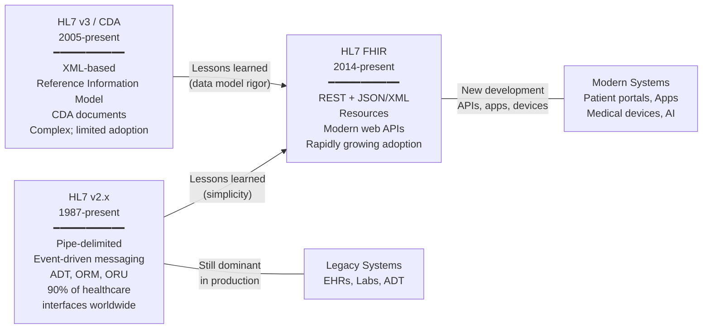
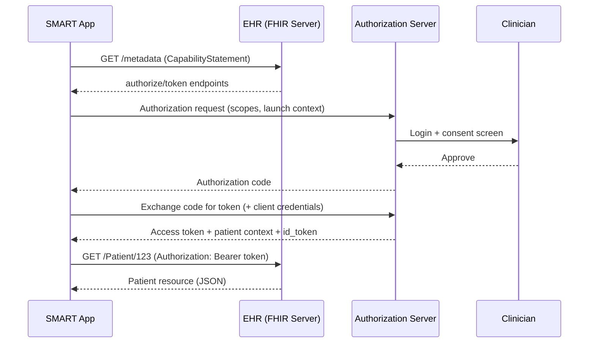
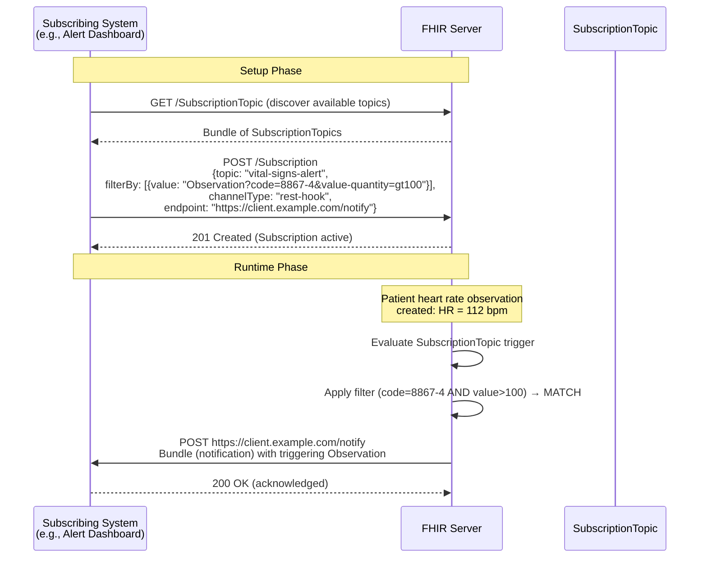

# HL7 FHIR — Healthcare Interoperability Standard

**Topic:** Fast Healthcare Interoperability Resources — REST-based healthcare data exchange standard  
**Standard:** HL7 FHIR R4 (v4.0.1) / R5 (v5.0.0); HL7 v2.x (legacy messaging)  
**SDO:** Health Level Seven International (HL7)  
**Audience:** Health IT developers, integration engineers, medical device software engineers, EHR developers, interoperability architects  
**Prerequisites:** RESTful API design, JSON/XML, HTTP, OAuth 2.0 basics, healthcare domain knowledge

---

## Chapter 1 — Historical Context & Origin Story

### 1.1 Timeline

| Year | Event | Significance |
|------|-------|-------------|
| 1987 | HL7 v2.0 released | First HL7 messaging standard; pipe-delimited segments |
| 1994 | HL7 v2.3 | Most widely deployed version; ADT, ORM, ORU messages |
| 2005 | HL7 v3 (RIM-based) | Reference Information Model; CDA (Clinical Document Architecture); complex XML |
| 2011 | **FHIR development begins** | Grahame Grieve proposes "Fresh Look" at HL7 (combining best of v2, v3, CDA) |
| 2014 | FHIR DSTU 1 (Draft Standard for Trial Use) | First published version; community validation |
| 2015 | FHIR DSTU 2 | Broader adoption; SMART on FHIR launched |
| 2017 | FHIR STU 3 (Standard for Trial Use) | Matured resources; widespread pilot implementations |
| 2019 | **FHIR R4 (v4.0.1) — Normative** | First normative release; Patient, Observation, and other core resources normative |
| 2021 | US Core Implementation Guide | US-specific FHIR profiles for interoperability (USCDI) |
| 2022 | CMS Interoperability Rules (US) | Patient Access API, Provider Directory, Payer-to-Payer exchange — all FHIR-based |
| 2023 | **FHIR R5 (v5.0.0)** | Subscriptions framework; SubscriptionTopic; enhanced search; new resources |
| 2023 | ONC HTI-1 Final Rule | USCDI v3; FHIR US Core required for EHR certification |
| 2024 | SMART Health Links; FHIR Shorthand (FSH) maturity | Verifiable credentials; easier IG authoring |
| 2025 | FHIR R6 development | Genomics; AI/ML integration; enhanced clinical decision support |

### 1.2 HL7 Standards Evolution



---

## Chapter 2 — Standard Architecture & Structure

### 2.1 FHIR Resource Categories

| Category | Resources | Purpose |
|----------|-----------|---------|
| **Foundation** | CapabilityStatement, StructureDefinition, ValueSet, CodeSystem, OperationDefinition | Infrastructure; conformance; terminology |
| **Security** | AuditEvent, Consent, Provenance, Permission | Security and privacy |
| **Individuals** | Patient, Practitioner, PractitionerRole, RelatedPerson, Person, Group | People and organizations |
| **Entities** | Organization, Location, HealthcareService, Endpoint, Device | Healthcare infrastructure |
| **Clinical** | Condition, Observation, AllergyIntolerance, Procedure, FamilyMemberHistory | Clinical findings and data |
| **Diagnostics** | DiagnosticReport, ImagingStudy, Specimen, ServiceRequest, Media | Lab, imaging, pathology |
| **Medications** | Medication, MedicationRequest, MedicationAdministration, MedicationDispense, Immunization | Medication lifecycle |
| **Care Provision** | CarePlan, CareTeam, Goal, ServiceRequest, NutritionOrder | Care planning |
| **Financial** | Claim, ExplanationOfBenefit, Coverage, Account | Billing and insurance |
| **Documents** | Composition, DocumentReference, Bundle (document type) | Clinical documents |
| **Workflow** | Task, Appointment, Schedule, Slot, Communication, CommunicationRequest | Scheduling and workflow |

### 2.2 FHIR Resource Structure

| Element | Description | Example (Patient Resource) |
|---------|-------------|---------------------------|
| **Resource type** | Type identifier | `"resourceType": "Patient"` |
| **id** | Logical server-assigned ID | `"id": "example-123"` |
| **meta** | Metadata (version, lastUpdated, profile, security, tag) | `"meta": {"versionId": "2", "lastUpdated": "2024-01-15"}` |
| **text** | Human-readable narrative (XHTML) | Status + div with summary |
| **Extension** | Additional data not in base resource | Custom elements via extension URLs |
| **Backbone elements** | Nested structured data | `"name": [{"family": "Smith", "given": ["John"]}]` |
| **References** | Links to other resources | `"managingOrganization": {"reference": "Organization/1"}` |
| **CodeableConcept** | Coded values (with system + code + display) | `"maritalStatus": {"coding": [{"system": "...", "code": "M"}]}` |

### 2.3 FHIR RESTful API

| HTTP Method | FHIR Interaction | URL Pattern | Description |
|:-----------:|:----------------:|-------------|-------------|
| GET | read | `[base]/Patient/123` | Read specific resource by ID |
| GET | vread | `[base]/Patient/123/_history/2` | Read specific version |
| GET | search | `[base]/Patient?name=Smith` | Search for resources matching criteria |
| POST | create | `[base]/Patient` | Create new resource (server assigns ID) |
| PUT | update | `[base]/Patient/123` | Update existing resource (client provides full resource) |
| PATCH | patch | `[base]/Patient/123` | Partial update (JSON Patch or FHIRPath Patch) |
| DELETE | delete | `[base]/Patient/123` | Delete resource |
| POST | transaction | `[base]` | Bundle of operations (atomic) |
| GET | history | `[base]/Patient/123/_history` | History of resource changes |
| POST | operation | `[base]/Patient/$everything` | Named operation (custom functionality) |
| GET | capabilities | `[base]/metadata` | Server CapabilityStatement |

---

## Chapter 3 — Technical Deep Dive

### 3.1 Key FHIR Resources for Medical Devices

| Resource | Use Case | Key Fields |
|----------|----------|-----------|
| **Device** | Medical device registration | type (coded); manufacturer; modelNumber; serialNumber; udiCarrier; patient (if implanted); status |
| **DeviceDefinition** | Device catalog/type information | manufacturer; deviceName; classification; hasPart; material; guideline |
| **DeviceMetric** | Device measurement capabilities | type; unit; source (Device reference); category (measurement/setting/calculation); calibration |
| **Observation** | Device-generated measurements | code (LOINC); value; subject (Patient); device (Device); effectiveDateTime; component[] |
| **DiagnosticReport** | Aggregated device results | code; subject; result (Observation references); conclusionCode; media |
| **Communication** | Device alerts/notifications | category; subject; sender (Device); payload; status; priority |

### 3.2 SMART on FHIR

| Component | Description |
|-----------|-------------|
| **Purpose** | Standardized app launch, authentication, and authorization for FHIR-based applications |
| **OAuth 2.0** | Uses OAuth 2.0 for authorization; OpenID Connect for authentication |
| **Scopes** | Resource-level scopes: `patient/Observation.read`, `user/Patient.write`, `launch/patient` |
| **Launch context** | EHR launch (app launched from within EHR) or Standalone launch (app launches independently) |
| **Token endpoint** | Returns access_token + id_token + patient context |
| **Backend services** | System-to-system (no user) — uses signed JWT for client authentication |
| **SMART App Launch** | IG (Implementation Guide) defines the complete workflow |

**SMART on FHIR Authorization Flow:**



### 3.3 FHIR Search Parameters

| Search Type | Syntax | Example |
|-------------|--------|---------|
| String | `?name=Smith` | Search by patient name |
| Token | `?code=http://loinc.org|8867-4` | Search by code (system + code) |
| Date | `?date=ge2024-01-01&date=le2024-12-31` | Date range search |
| Reference | `?subject=Patient/123` | Search by referenced resource |
| Quantity | `?value-quantity=gt5.4|http://unitsofmeasure.org|mg` | Search by quantity + units |
| Composite | `?code-value-quantity=http://loinc.org|8867-4$gt60` | Combined search criteria |
| Chaining | `?subject:Patient.name=Smith` | Search across reference |
| Reverse chaining | `?_has:Observation:subject:code=8867-4` | Reverse reference search |
| Include | `?_include=Observation:subject` | Include referenced resources in results |
| Revinclude | `?_revinclude=Observation:subject` | Include resources referencing this |

### 3.4 FHIR Implementation Guides (IGs)

| IG | Scope | Key Use |
|----|-------|---------|
| **US Core** | US baseline profiles (USCDI) | Required for US EHR certification; defines minimum data elements |
| **International Patient Summary (IPS)** | Cross-border patient summary | Emergency/unscheduled care; minimal dataset |
| **mCODE** (Minimal Common Oncology Data Elements) | Oncology | Standardized cancer data; treatment, staging, genomics |
| **Argonaut** | Early US interoperability | Foundation for US Core |
| **Da Vinci** | Payer-provider data exchange | Prior authorization; claims; coverage |
| **SMART App Launch** | App authorization | OAuth 2.0 for FHIR apps |
| **Bulk Data** | Large-scale data export | Population-level reporting; analytics |
| **Subscriptions** (R5) | Event notifications | Real-time notifications for resource changes |
| **Personal Health Device (PHD)** | Medical devices (IEEE 11073) | Maps device observations to FHIR |
| **Point-of-Care Device (PCD)** | Bedside devices | ICU devices; ventilators; monitors |

### 3.5 HL7 v2.x (Legacy) — Key Message Types

| Message | Trigger Event | Content | Still Used For |
|---------|:------------:|---------|---------------|
| ADT (Admit/Discharge/Transfer) | A01-A60 | Patient demographics; movements; encounters | Patient registration; bed management |
| ORM (Order Message) | O01 | Lab orders; radiology orders; pharmacy orders | Ordering (being replaced by OML) |
| ORU (Observation Result) | R01 | Lab results; vital signs; reports | Lab results (most common HL7 v2 message) |
| SIU (Scheduling) | S12-S26 | Appointment scheduling | Clinic scheduling |
| MDM (Medical Document) | T01-T11 | Document notifications; transcriptions | Transcription; document management |
| RDE (Pharmacy) | O11-O25 | Pharmacy orders | Pharmacy dispensing |
| DFT (Financial Transaction) | P03 | Charges; billing | Charge capture |
| MFN (Master File) | M01-M13 | Master file updates (locations, practitioners) | Directory updates |

**HL7 v2 Message Structure Example (ORU^R01):**
```
MSH|^~\&|LAB|HOSP|EHR|HOSP|20240115120000||ORU^R01|MSG001|P|2.5.1
PID|1||12345^^^HOSP^MR||Smith^John^A||19800101|M
OBR|1|ORD001|LAB001|85025-5^CBC^LN|||20240115080000
OBX|1|NM|718-7^Hemoglobin^LN||14.2|g/dL|13.5-17.5|N|||F
OBX|2|NM|4544-3^Hematocrit^LN||42.1|%|38.8-50.0|N|||F
```

---

## Chapter 4 — Implementation Guide

### 4.1 FHIR Server Implementation Architecture

```mermaid
graph TB
    subgraph "Client Applications"
        APP1[Patient Portal<br/>(SMART App)]
        APP2[Clinical App<br/>(EHR Integration)]
        APP3[Medical Device<br/>(IoT Gateway)]
        APP4[Analytics<br/>(Bulk Data)]
    end
    
    subgraph "FHIR Server"
        API[REST API Layer<br/>━━━━━━━━━━━<br/>HTTP endpoints<br/>Content negotiation<br/>Versioning<br/>Error handling]
        AUTH[Authorization<br/>━━━━━━━━━━━<br/>SMART on FHIR<br/>OAuth 2.0<br/>Scope enforcement<br/>Consent management]
        SEARCH[Search Engine<br/>━━━━━━━━━━━<br/>Parameter parsing<br/>Chain/revchain<br/>Include/revinclude<br/>Custom search params]
        VALID[Validation<br/>━━━━━━━━━━━<br/>Profile validation<br/>StructureDefinition<br/>ValueSet binding<br/>Invariants]
        SUB[Subscriptions<br/>━━━━━━━━━━━<br/>SubscriptionTopic<br/>Channels (REST-hook,<br/>WebSocket, email)]
        STORE[Storage Layer<br/>━━━━━━━━━━━<br/>Resource persistence<br/>Version history<br/>Transaction support<br/>Indexes]
    end
    
    subgraph "Backend"
        DB[(Database<br/>PostgreSQL/MongoDB)]
        TERM[Terminology Service<br/>━━━━━━━━━━━<br/>ValueSet expansion<br/>CodeSystem lookup<br/>ConceptMap translation]
        AUDIT[Audit Log<br/>━━━━━━━━━━━<br/>AuditEvent resources<br/>Access logging<br/>ATNA compliance]
    end
    
    APP1 & APP2 & APP3 & APP4 --> API
    API --> AUTH --> SEARCH & VALID & SUB
    SEARCH & VALID & SUB --> STORE
    STORE --> DB
    API --> TERM
    API --> AUDIT
```

### 4.2 Medical Device FHIR Integration Pattern

| Step | Activity | FHIR Resources Used |
|:----:|----------|-------------------|
| 1 | Register device | POST Device (type, manufacturer, model, serial, UDI) |
| 2 | Associate with patient | Device.patient = Reference(Patient) |
| 3 | Submit observations | POST Observation (code=LOINC; value; device=Reference(Device); subject=Reference(Patient); effectiveDateTime) |
| 4 | Submit alerts | POST Communication (category=alert; priority=urgent; payload; sender=Reference(Device)) |
| 5 | Batch submission | POST Bundle (type=batch; entry[].resource=Observation; entry[].request.method=POST) |
| 6 | Subscribe to orders | Subscription (criteria="ServiceRequest?code=..."; channel=rest-hook) |

### 4.3 FHIR Profiling (Constraining Resources)

| Concept | Description | Example |
|---------|-------------|---------|
| **Profile** | Constrains a base resource (required fields, value sets, extensions) | US Core Patient Profile: requires name, gender, birthDate |
| **Extension** | Adds data elements not in base resource | `race` and `ethnicity` (US Core extensions) |
| **ValueSet** | Defines allowed coded values | BloodPressureBodyPosition: sitting/standing/supine |
| **CodeSystem** | Defines codes and their meanings | Custom device-type codes |
| **SearchParameter** | Adds custom search capabilities | Search by device-manufacturer |
| **CapabilityStatement** | Server's supported profiles, operations, search params | Declares what the server can do |
| **ImplementationGuide** | Complete package of profiles, extensions, examples, docs | US Core IG; IPS IG |

### 4.4 Terminology in FHIR

| Code System | OID/URL | Use |
|-------------|---------|-----|
| **LOINC** | `http://loinc.org` | Lab observations; vital signs; documents |
| **SNOMED CT** | `http://snomed.info/sct` | Clinical findings; procedures; diagnoses |
| **ICD-10-CM** | `http://hl7.org/fhir/sid/icd-10-cm` | Diagnosis coding (US billing) |
| **CPT** | `http://www.ama-assn.org/go/cpt` | Procedure coding (US billing) |
| **RxNorm** | `http://www.nlm.nih.gov/research/umls/rxnorm` | Medications |
| **NDC** | `http://hl7.org/fhir/sid/ndc` | Drug products (US) |
| **UCUM** | `http://unitsofmeasure.org` | Units of measure |
| **IEEE 11073** | `urn:iso:std:iso:11073:10101` | Medical device observations |
| **CVX** | `http://hl7.org/fhir/sid/cvx` | Vaccine codes |
| **GUDID** | UDI system | Device identification |

---

## Chapter 5 — Conformance & Testing

### 5.1 FHIR Conformance Framework

| Level | What It Tests | Tools |
|-------|--------------|-------|
| **Syntax validation** | JSON/XML well-formed; correct FHIR structure | HAPI FHIR Validator; HL7 FHIR Validator (Java) |
| **Profile validation** | Resource conforms to declared profiles (cardinality, bindings, invariants) | Same validators with profile parameter |
| **Terminology validation** | Codes valid in bound ValueSets; CodeSystem exists | Terminology servers (TX.FHIR.org) |
| **Business rules** | Application-specific constraints; cross-resource consistency | Custom test suites; Touchstone; Inferno |
| **Interoperability testing** | End-to-end data exchange between systems | Connectathons; IHE testing events; Inferno |

### 5.2 Key Testing Tools

| Tool | Purpose | Provider |
|------|---------|---------|
| **Inferno** | Automated testing for US Core / SMART / Bulk Data compliance | ONC (HealthIT.gov) |
| **Touchstone** | FHIR conformance testing platform; IG-specific test scripts | AEGIS |
| **HAPI FHIR** | Open-source FHIR server + validator (Java) | Smile CDR / Open Source |
| **FHIR Validator** | Official HL7 validation tool (CLI + library) | HL7 |
| **CQL Testing** | Clinical Quality Language testing for CDS and measures | HL7 CQL tooling |
| **Synthea** | Synthetic patient data generator (FHIR format) | MITRE |
| **SMART Test Apps** | Reference apps for testing SMART on FHIR | SMART Health IT |

### 5.3 US Certification (ONC Health IT Certification)

| Criterion | Requirement | FHIR Relevance |
|-----------|-------------|----------------|
| § 170.315(g)(10) | Standardized API for patient and population services | FHIR R4; US Core profiles; SMART App Launch; Bulk Data |
| USCDI (v3+) | United States Core Data for Interoperability | Defines minimum data classes/elements that must be exchangable |
| § 170.315(b)(1-2) | Transitions of care | C-CDA (HL7 CDA); may leverage FHIR in future |
| § 170.315(f)(5) | Automated measure calculation | FHIR Clinical Quality Measures |

---

## Chapter 6 — Regional & Domain Variants

### 6.1 Country-Specific FHIR Implementation Guides

| Country/Region | IG Name | Key Features |
|---------------|---------|--------------|
| **US** | US Core | USCDI data classes; Must Support definitions; Provenance; required terminology bindings |
| **UK** | UK Core | NHS-specific profiles; NHS Number; GP Connect |
| **Australia** | AU Core | Medicare; PBS; Australian healthcare identifiers |
| **Canada** | CA Core (emerging) | Provincial health numbers; bilingual requirements |
| **EU** | International Patient Summary (IPS) | Cross-border interoperability; EU eHealth Network |
| **Germany** | ISiK (Informationstechnische Systeme im Krankenhaus) | Hospital information systems interoperability mandate |
| **Switzerland** | CH Core | Swiss EPR (Electronic Patient Record) |
| **India** | ABDM FHIR profiles | Ayushman Bharat Digital Mission; ABHA ID |

### 6.2 Domain-Specific IGs

| Domain | IG | Key Use Cases |
|--------|----|----|
| Oncology | **mCODE** | Cancer staging; genomics; treatment outcomes |
| Genomics | **Genomics Reporting** | Variant calling; pharmacogenomics; diagnostic implications |
| Public Health | **eCR (Electronic Case Reporting)** | Reportable condition triggers; automated case reports |
| Pharmacy | **NCPDP FHIR** | ePrescribing; formulary |
| Payer | **Da Vinci** | Prior auth; member attribution; risk adjustment |
| Research | **Vulcan** | Clinical trials; real-world evidence; regulatory submissions |
| Devices | **PHD IG** (Personal Health Device) | Bluetooth devices; IEEE 11073 mapping |
| Vital Signs | **FHIR Vital Signs profiles** | Blood pressure; heart rate; temperature; oxygen saturation |

---

## Chapter 7 — Comparison

### 7.1 HL7 v2 vs. FHIR

| Dimension | HL7 v2.x | HL7 FHIR |
|-----------|:---:|:---:|
| Transport | TCP/IP (MLLP); file-based | **HTTP/REST**; also supports messaging |
| Format | Pipe-delimited text (custom encoding) | **JSON** or XML |
| Architecture | Message-based (event-driven) | **Resource-based** (REST API) |
| Query | Limited (QBP); primarily push | **Rich search** (parameters, chaining, includes) |
| Security | Custom; often VPN/TLS | **OAuth 2.0 / SMART on FHIR** |
| Extensibility | Z-segments (non-standard) | **Extensions** (with URLs; discoverable; validatable) |
| Profiles/Conformance | Limited (message profiles; rarely used) | **StructureDefinition, CapabilityStatement** (machine-readable) |
| Terminology | Local codes common | **Required code systems** (LOINC, SNOMED, RxNorm) |
| Ecosystem | Interfaces; integration engines (Rhapsody, Mirth) | **App ecosystem** (SMART apps; API-first design) |
| Adoption | >95% of US hospital interfaces | Growing rapidly; mandated for new US APIs |
| Learning curve | Moderate (but inconsistent implementations) | Lower (web developer friendly; familiar patterns) |
| Real-time | Yes (event-driven; immediate) | Subscriptions (R5); polling; webhooks |
| Bulk data | Not designed for bulk | **Bulk Data Access IG** (NDJSON export) |

### 7.2 FHIR vs. openEHR

| Dimension | FHIR | openEHR |
|-----------|:---:|:---:|
| Philosophy | **Standards-based interoperability** (exchange format) | **Clinical modeling** (archetype-based EHR architecture) |
| Data model | Fixed resources (150+) with extensions | Archetypes (freely defined clinical models) |
| Focus | Data exchange between systems | Data storage and clinical modeling |
| Governance | HL7 International (ballot-based) | openEHR Foundation (international editors) |
| REST API | Core design principle | AQL (Archetype Query Language) + REST |
| Flexibility | Extensions for additional data | Archetypes (unlimited clinical modeling) |
| Adoption | Mandated in US, UK, AU, DE | Strong in Norway, Brazil, Russia, some EU countries |
| Complementary | Can coexist (FHIR for exchange; openEHR for storage) | Can expose data via FHIR APIs |

---

## Chapter 8 — Mermaid Architecture Diagrams

### 8.1 FHIR Resource Relationship (Clinical Scenario)

```mermaid
graph TB
    PAT[Patient<br/>━━━━━━━━━━━<br/>John Smith<br/>DOB: 1980-01-01<br/>MRN: 12345]
    
    ENC[Encounter<br/>━━━━━━━━━━━<br/>Office Visit<br/>2024-01-15<br/>Status: finished]
    
    PRAC[Practitioner<br/>━━━━━━━━━━━<br/>Dr. Jane Doe<br/>NPI: 1234567890]
    
    COND[Condition<br/>━━━━━━━━━━━<br/>Hypertension<br/>SNOMED: 38341003<br/>Onset: 2020-03-01]
    
    OBS_BP[Observation<br/>━━━━━━━━━━━<br/>Blood Pressure<br/>LOINC: 85354-9<br/>Systolic: 145 mmHg<br/>Diastolic: 92 mmHg]
    
    OBS_HR[Observation<br/>━━━━━━━━━━━<br/>Heart Rate<br/>LOINC: 8867-4<br/>Value: 78 /min]
    
    MED_REQ[MedicationRequest<br/>━━━━━━━━━━━<br/>Lisinopril 10mg<br/>RxNorm: 314076<br/>Daily; 30 day supply]
    
    DEV[Device<br/>━━━━━━━━━━━<br/>BP Monitor<br/>Model: Omron HEM-7200<br/>UDI: (01)00884389...]
    
    CARE[CarePlan<br/>━━━━━━━━━━━<br/>Hypertension Management<br/>Goals: BP < 130/80<br/>Activities: diet, exercise, medication]
    
    PAT --> ENC
    ENC --> PRAC
    PAT --> COND
    PAT --> OBS_BP
    PAT --> OBS_HR
    OBS_BP --> DEV
    OBS_BP --> ENC
    PAT --> MED_REQ
    MED_REQ --> PRAC
    MED_REQ --> COND
    PAT --> CARE
    CARE --> COND
```

### 8.2 FHIR Subscription Flow (R5)



### 8.3 Bulk Data Export Flow

```mermaid
sequenceDiagram
    participant Client as Analytics System
    participant Auth as Authorization Server
    participant Server as FHIR Server
    
    Client->>Auth: POST /token (client_credentials; signed JWT)
    Auth-->>Client: Access token (system/*.read scope)
    
    Client->>Server: GET /Patient/$export<br/>Authorization: Bearer token<br/>Accept: application/fhir+ndjson<br/>Prefer: respond-async
    Server-->>Client: 202 Accepted<br/>Content-Location: /status/export-123
    
    loop Poll for completion
        Client->>Server: GET /status/export-123
        Server-->>Client: 202 (still processing) OR 200 (complete)
    end
    
    Server-->>Client: 200 OK<br/>{"output": [<br/>  {"type": "Patient", "url": "/download/patients.ndjson"},<br/>  {"type": "Observation", "url": "/download/observations.ndjson"}<br/>]}
    
    Client->>Server: GET /download/patients.ndjson
    Server-->>Client: NDJSON file (one Patient resource per line)
```

---

## Chapter 9 — Case Studies

### 9.1 Case Study: Medical Device Integration via FHIR

| Aspect | Detail |
|--------|--------|
| Scenario | Continuous glucose monitor (CGM) manufacturer needs to send glucose readings to multiple EHR systems |
| Challenge | Previously: custom HL7 v2 interfaces per hospital (different OBX segments, different units, different codes). 50 hospitals = 50 custom interfaces. |
| FHIR solution | (1) CGM device transmits to cloud gateway. (2) Gateway creates FHIR Observation resources (code: LOINC 15074-8 "Glucose [Mass/volume] in Blood"; value: Quantity with mg/dL or mmol/L; device: Reference(Device); subject: Reference(Patient)). (3) Gateway uses SMART Backend Services to authenticate with each EHR's FHIR API. (4) POST Observation to each EHR's FHIR endpoint. (5) Single implementation works across all EHRs supporting US Core (standard Observation profile). |
| Implementation details | (1) Device resource registered once per patient setup (UDI, model, serial). (2) Observations posted every 5 minutes (batch Bundle of 60 readings). (3) Alert Observations created for hypo/hyperglycemia (interpretation = "critical"). (4) Provenance resource attached (who captured; when; data source = device). (5) FHIR Subscription used by EHR to trigger in-app alert when critical glucose value posted. |
| Result | Reduced interface development from 6 months/hospital to 2 weeks/hospital (mostly testing). Single codebase. 95% reduction in interface maintenance costs. |

### 9.2 Case Study: SMART on FHIR Clinical App

| Aspect | Detail |
|--------|--------|
| Scenario | Third-party app that displays aggregated patient medication history from multiple sources (EHR, pharmacy, payer) |
| Architecture | SMART App Launch from EHR → OAuth 2.0 authorization → request scopes (patient/MedicationRequest.read, patient/MedicationAdministration.read, patient/MedicationDispense.read) → query FHIR endpoints → aggregate and display |
| Security | (1) App registered with each EHR's OAuth server (client_id). (2) PKCEused for public clients (mobile). (3) Scopes limited to read-only medication resources. (4) Patient context received from launch (no broad access). (5) Token expires after 1 hour; refresh token for continued access. (6) Audit trail: FHIR server logs all access as AuditEvent. |
| Interoperability challenge | Different EHRs profile MedicationRequest differently; terminology varies (RxNorm vs. NDC vs. local formulary codes). Solution: ConceptMap for terminology translation; flexible display that handles missing optional fields. |
| Outcome | Single app works across Epic, Cerner, Allscripts (all support SMART App Launch + US Core). Patient sees unified view regardless of data source. |

---

## Chapter 10 — Future Evolution

| Trend | Timeline | Impact |
|-------|----------|--------|
| FHIR R6 | 2026-2027 | Genomics resources; AI/ML integration; enhanced CDS Hooks; further normative content |
| USCDI v4+ | Annual updates | Expanding required data classes (social determinants; disability; sexual orientation) |
| FHIR for regulatory submissions | 2024+ | FDA using FHIR for adverse event reporting; clinical trial data; real-world evidence |
| AI/ML + FHIR | Now | CDS Hooks for AI recommendations; FHIR as data layer for ML models; inference results as Observations |
| FHIR Shorthand (FSH) | Maturing | Simplified IG authoring; "FHIR as code"; version-controlled profiles |
| International Patient Access | 2024+ | G7/G20 cross-border health data exchange; IPS adoption |
| FHIR + genomics | Now | Genomic variant reporting; pharmacogenomics alerts; precision medicine |
| FHIRcast | Maturing | Real-time context synchronization between apps (replace CCOW) |
| FHIR for medical devices (IEEE 11073 mapping) | Now | Standardized device data in FHIR; PHD IG; PCD IG; continuous monitoring |
| Payer interoperability mandates (US) | 2024-2026 | CMS rules requiring FHIR-based payer APIs (patient access, prior auth, provider directory) |
| SMART Health Cards/Links | Now | Verifiable clinical data (vaccination records, lab results); W3C Verifiable Credentials |

---

## Chapter 11 — Interview Questions & Career Guide

### Tier 1: Entry-Level

**Q1:** What is a FHIR Resource and how does it differ from an HL7 v2 message segment?  
**A:** A FHIR **Resource** is a discrete, identifiable unit of healthcare information that can be independently managed (created, read, updated, deleted) via a RESTful API. Each resource has a defined structure with required and optional fields, a type (e.g., Patient, Observation, MedicationRequest), a logical ID, and metadata. Resources can reference each other (Patient → Observation → Device). In contrast, an HL7 v2 **segment** (like PID, OBX, OBR) is a portion of a MESSAGE — it can't exist independently. You can't query for "all OBX segments for patient 123" — you receive them as part of a complete message (like ORU^R01). Key differences: (1) **Addressable**: FHIR resources have URLs and can be individually queried (`GET /Observation/456`); v2 segments cannot. (2) **Self-contained**: A FHIR resource includes all context needed (references to Patient, Device, etc.); v2 segments depend on message context (PID earlier in same message). (3) **Searchable**: FHIR has rich search parameters; v2 has limited query capability. (4) **Updatable**: You can PUT/PATCH a single FHIR resource; v2 requires sending a complete message to update anything. (5) **Format**: FHIR uses JSON/XML (web-standard); v2 uses pipe-delimited custom encoding.

**Q2:** What is SMART on FHIR and why is it important?  
**A:** SMART on FHIR (Substitutable Medical Applications, Reusable Technologies) is a framework that enables third-party applications to securely access EHR data via FHIR APIs using standardized OAuth 2.0 authorization. It's important because: (1) **App ecosystem**: enables an "app store" model for healthcare — write once, deploy to any SMART-compliant EHR (Epic, Cerner, Allscripts all support it). (2) **Security**: standardizes how apps authenticate users and receive authorization (scopes) — no custom security integration per EHR. (3) **Context**: provides launch context (which patient, which encounter, which practitioner) so apps open in the right clinical context. (4) **Mandated**: US ONC certification requires EHRs to support SMART App Launch (§170.315(g)(10)), making it the de-facto standard for health app integration. (5) **Backend services**: system-to-system variant (no user present) enables automated data exchange (e.g., population health analytics, device data submission). (6) **Granular authorization**: scopes control exactly what resources an app can access (e.g., `patient/Observation.read` but NOT `patient/Observation.write`).

### Tier 2: Mid-Level

**Q3:** How would you design a FHIR-based integration for a patient monitoring system in an ICU that needs to send vital signs to the EHR every 30 seconds?  
**A:** Architecture: (1) **Device layer**: bedside monitors (ventilator, cardiac monitor, SpO2, BP) communicate via IEEE 11073 or proprietary protocols to a **gateway** server in the ICU. (2) **Gateway**: translates device data to FHIR Observations. Observations coded with LOINC (8867-4 heart rate; 8480-6 systolic BP; 2708-6 SpO2; 9279-1 respiratory rate). Device reference links each Observation to the specific hardware. (3) **Batching**: 30-second intervals generate high volume — use FHIR **Bundle (type: batch)** to POST multiple Observations in single HTTP request (reduces overhead). (4) **Performance considerations**: at 30s intervals × 5 vital signs × 20 beds = 200 Observations/minute. FHIR server must handle this throughput. Consider: async submission; write-optimized storage; separate high-frequency observation store from general EHR; FHIR facade pattern (store in time-series DB, expose via FHIR API on query). (5) **Waveform data**: high-frequency data (ECG waveform) typically NOT sent every 30s via FHIR — use SampledData type for periodic samples or separate streaming protocol (RTSP/WebSocket) with FHIR metadata reference. (6) **Alerting**: Observation.interpretation = "critical" triggers EHR alarm; or use FHIR Subscription (R5) with filter on value thresholds. (7) **Provenance**: each batch includes Provenance resource identifying the device, timestamp, and transmission chain. (8) **Error handling**: if EHR unavailable, gateway buffers locally and retransmits (at-least-once delivery); idempotency via conditional create (If-None-Exist header).

### Tier 3: Senior

**Q4:** How would you architect a multi-EHR data aggregation platform using FHIR that needs to normalize data from 50+ different healthcare organizations for a clinical research study?  
**A:** This is a data lake/clinical data network problem. Architecture: (1) **Consent management**: Consent resources per patient per organization; track which patients have opted-in for research data sharing; enforce consent at API level. (2) **Data acquisition layer**: SMART Backend Services connection to each organization's FHIR endpoint; Bulk Data export ($export) for initial population pull (all relevant patients + Observations + Conditions + MedicationRequests); incremental updates via FHIR Subscriptions or scheduled Bulk exports. (3) **Identity resolution**: patients may exist in multiple organizations without shared identifier. Probabilistic matching (name, DOB, address, phone) using FHIR Patient resource demographics; assign master patient index (MPI) identifier; link with Person resource or proprietary MPI. (4) **Terminology normalization**: different organizations use different code systems (SNOMED vs. ICD-10 vs. local codes for same concept). Use ConceptMap resources + FHIR terminology service ($translate operation) to normalize to common terminology (e.g., all diagnoses to SNOMED CT; all labs to LOINC). Handle unmapped codes gracefully (quarantine + manual review). (5) **Profile harmonization**: some organizations expose US Core profiles; others have custom profiles with different extension usage. Build transformation layer that maps to a single internal canonical profile (research data model). (6) **Data quality**: automated validation against profiles (HAPI Validator); completeness scoring (what % of expected data elements present per organization); data quality dashboard. (7) **Security**: zero-trust architecture; data encrypted at rest and in transit; role-based access; de-identification service for research datasets (Safe Harbor or Expert Determination); audit trail (AuditEvent for all data access). (8) **Scale**: 50 organizations × thousands of patients × years of history = millions of resources. Use FHIR-native data platform (Spark/Databricks with FHIR connector; or specialized platforms like Cerner HealtheDataLab, Google Healthcare API, Azure FHIR service). (9) **Governance**: data use agreements (DUAs) with each organization; IRB approval; HIPAA compliance; regular access audits.

---

## Chapter 12 — Cheat Sheet & Quick Reference

### FHIR REST API Quick Reference

```
CREATE:     POST   [base]/[ResourceType]              → 201 Created + Location header
READ:       GET    [base]/[ResourceType]/[id]         → 200 OK + resource
UPDATE:     PUT    [base]/[ResourceType]/[id]         → 200 OK + updated resource
DELETE:     DELETE [base]/[ResourceType]/[id]         → 204 No Content
SEARCH:     GET    [base]/[ResourceType]?params       → 200 OK + Bundle (searchset)
HISTORY:    GET    [base]/[ResourceType]/[id]/_history → 200 OK + Bundle (history)
CAPABILITY: GET    [base]/metadata                    → CapabilityStatement
BATCH:      POST   [base] (Bundle type=batch)         → Bundle (batch-response)
TRANSACTION:POST   [base] (Bundle type=transaction)   → Bundle (all-or-nothing)
OPERATION:  POST   [base]/[Type]/$operation-name      → Parameters or resource
```

### Common Search Parameters

```
_id           : Resource logical ID
_lastUpdated  : Date resource was last modified
_profile      : Resources conforming to specific profile
_tag          : Resources with specific tag
_security     : Resources with specific security label
_count        : Max results per page
_sort         : Sort order (-field for descending)
_include      : Include referenced resources
_revinclude   : Include resources that reference this
_summary      : Return summary (true/false/text/count/data)
_elements     : Return only specified elements
```

### Key LOINC Codes for Vital Signs

```
85354-9   Blood pressure panel
8480-6    Systolic blood pressure
8462-4    Diastolic blood pressure
8867-4    Heart rate
9279-1    Respiratory rate
8310-5    Body temperature
2708-6    Oxygen saturation (SpO2)
29463-7   Body weight
8302-2    Body height
39156-5   BMI
```

### SMART on FHIR Scopes

```
patient/[Resource].read   — Read specific resource type for current patient
patient/[Resource].write  — Write specific resource type for current patient  
user/[Resource].read      — Read resource type for any accessible patient
user/[Resource].write     — Write resource type for any accessible patient
system/[Resource].read    — System-level read (backend services)
launch/patient            — Receive patient context at launch
launch/encounter          — Receive encounter context at launch
openid fhirUser           — Get user identity (OpenID Connect)
```

### FHIR Implementation Checklist

```
□ Choose FHIR version (R4 recommended for production; R5 for new projects)
□ Identify applicable Implementation Guides (US Core, IPS, domain-specific)
□ Select FHIR server (HAPI, Firely, Google Healthcare, Azure FHIR, AWS HealthLake)
□ Implement SMART on FHIR (app launch + backend services)
□ Define profiles (constrain resources for your use case)
□ Bind terminologies (LOINC, SNOMED, RxNorm — per IG requirements)
□ Implement search parameters (standard + custom)
□ Set up validation (profile validation in pipeline)
□ Implement audit logging (AuditEvent resources)
□ Test conformance (Inferno for US Core; Touchstone for custom)
□ Performance test (bulk data volumes; concurrent users; response times)
□ Security review (OAuth scopes; consent; data minimization)
```

---

*End of Document — 06_HL7_FHIR_Interoperability.md*
