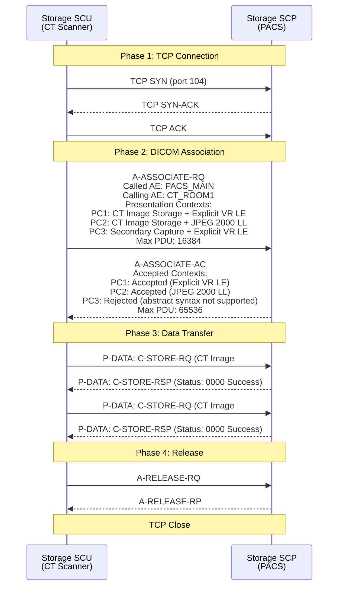

# DICOM — Digital Imaging and Communications in Medicine

**Topic:** Standard for medical imaging data communication, storage, and management  
**Standard:** DICOM (ACR-NEMA Standard; current: PS3.x-2024) — 22 parts  
**SDO:** DICOM Standards Committee (originally ACR-NEMA; now international multi-stakeholder)  
**Audience:** Medical imaging software engineers, PACS administrators, radiology IT specialists, imaging device developers, integration engineers  
**Prerequisites:** Networking fundamentals (TCP/IP), medical imaging basics, understanding of client-server architectures

---

## Chapter 1 — Historical Context & Origin Story

### 1.1 Timeline

| Year | Event | Significance |
|------|-------|-------------|
| 1983 | ACR-NEMA Standard 300-1985 development begins | American College of Radiology + National Electrical Manufacturers Association collaboration |
| 1985 | ACR-NEMA Version 1.0 | First standard for medical image transfer; point-to-point |
| 1988 | ACR-NEMA Version 2.0 | Added display commands; still point-to-point |
| 1993 | **DICOM 3.0** | Complete redesign; TCP/IP networking; object-oriented; service-based; current standard |
| 1995 | DICOM Structured Reporting (SR) | Machine-readable reports embedded in DICOM |
| 1998 | DICOM CD (PS 3.12: Media Storage) | Patient CDs for image distribution |
| 2004 | DICOM Web (WADO) | HTTP-based image access |
| 2011 | DICOMweb (RESTful services) | WADO-RS, STOW-RS, QIDO-RS — modern REST APIs |
| 2015 | PS 3.15 (Security) major revision | TLS; digital signatures; de-identification profiles |
| 2018 | DICOM Segmentation and enhanced 3D | AI/ML annotation support; segmentation objects |
| 2020 | DICOM AI/ML supplements | Storage of AI results; annotation; bulk data |
| 2023 | DICOM 2023 edition | Enhanced DICOMweb; new AI-related SOP classes; cloud-native patterns |
| 2024 | DICOM 2024 edition | Continued AI supplements; volumetric rendering; 3D printing support |

### 1.2 DICOM's Position in Healthcare IT

```mermaid
graph TB
    subgraph "Acquisition"
        CT[CT Scanner]
        MR[MRI Scanner]
        US[Ultrasound]
        XR[X-ray / DR]
        NM[Nuclear Medicine / PET]
        MG[Mammography]
    end
    
    subgraph "DICOM Network"
        STORE[DICOM Store<br/>(C-STORE)]
        QUERY[DICOM Query/Retrieve<br/>(C-FIND / C-MOVE / C-GET)]
        WORKLIST[Modality Worklist<br/>(C-FIND MWL)]
        PRINT[DICOM Print<br/>(N-CREATE / N-SET)]
        WEB[DICOMweb<br/>(WADO-RS / STOW-RS / QIDO-RS)]
    end
    
    subgraph "Infrastructure"
        PACS[PACS<br/>Picture Archiving &<br/>Communication System<br/>━━━━━━━━━━━<br/>Archive; retrieve; distribute]
        RIS[RIS<br/>Radiology Information System<br/>━━━━━━━━━━━<br/>Scheduling; reporting;<br/>workflow management]
        VNA[VNA<br/>Vendor Neutral Archive<br/>━━━━━━━━━━━<br/>Long-term storage;<br/>multi-vendor; cloud]
    end
    
    subgraph "Consumption"
        VIEW[Diagnostic Viewer<br/>(Workstation)]
        AI_SYS[AI/ML Systems<br/>(Analysis; detection)]
        PORTAL[Patient Portal<br/>(Web viewer)]
        EMR[EHR/EMR Integration]
    end
    
    CT & MR & US & XR & NM & MG --> STORE
    STORE --> PACS
    RIS --> WORKLIST --> CT & MR & US & XR
    PACS --> QUERY --> VIEW & AI_SYS
    PACS --> WEB --> PORTAL & EMR & AI_SYS
    PACS --> VNA
```

---

## Chapter 2 — Standard Architecture & Structure

### 2.1 DICOM Standard Parts (PS 3.x)

| Part | Title | Content |
|:----:|-------|---------|
| PS 3.1 | Introduction and Overview | Standard structure; conformance |
| PS 3.2 | Conformance | Conformance Statement structure; SOP classes |
| PS 3.3 | Information Object Definitions (IODs) | Data model; entity-relationship; modules; attributes |
| PS 3.4 | Service Class Specifications | DIMSE services; Storage; Query/Retrieve; Worklist; Print |
| PS 3.5 | Data Structures and Encoding | Value Representations (VR); transfer syntax; encoding rules |
| PS 3.6 | Data Dictionary | All DICOM tags (group, element); definitions |
| PS 3.7 | Message Exchange | DIMSE protocol; PDU structure; association negotiation |
| PS 3.8 | Network Communication Support | TCP/IP upper layer; association establishment |
| PS 3.9 | (Retired) | — |
| PS 3.10 | Media Storage and File Format | DICOM file format (.dcm); DICOMDIR |
| PS 3.11 | Media Storage Application Profiles | CD/DVD; USB; specific media profiles |
| PS 3.12 | Media Storage Functions | File management for media |
| PS 3.13 | (Retired) | — |
| PS 3.14 | Grayscale Standard Display Function (GSDF) | Consistent grayscale display across devices |
| PS 3.15 | **Security and System Management Profiles** | TLS; digital signatures; audit; de-identification |
| PS 3.16 | Content Mapping Resource | Templates; context groups; coding schemes |
| PS 3.17 | Explanatory Information | Use cases; examples; informative annexes |
| PS 3.18 | **Web Services (DICOMweb)** | WADO-RS; STOW-RS; QIDO-RS; UPS-RS |
| PS 3.19 | Application Hosting | Interface for hosted applications |
| PS 3.20 | Imaging Reports using HL7 CDA | CDA-based diagnostic reports |
| PS 3.21 | Transformations between DICOM and other representations | FHIR mapping; HL7 mapping |
| PS 3.22 | Real-Time Communication | Video streaming; real-time transport |

### 2.2 DICOM Information Model Hierarchy

```mermaid
graph TB
    PATIENT[PATIENT<br/>━━━━━━━━━━━<br/>Patient ID<br/>Patient Name<br/>Birth Date<br/>Sex]
    
    STUDY[STUDY<br/>━━━━━━━━━━━<br/>Study Instance UID<br/>Study Date/Time<br/>Accession Number<br/>Study Description<br/>Referring Physician]
    
    SERIES[SERIES<br/>━━━━━━━━━━━<br/>Series Instance UID<br/>Modality (CT/MR/US...)<br/>Series Number<br/>Series Description<br/>Body Part Examined]
    
    IMAGE[IMAGE (SOP Instance)<br/>━━━━━━━━━━━<br/>SOP Instance UID<br/>SOP Class UID<br/>Instance Number<br/>Pixel Data<br/>Window Center/Width]
    
    PATIENT --> |"1:N"| STUDY
    STUDY --> |"1:N"| SERIES
    SERIES --> |"1:N"| IMAGE
```

### 2.3 Key DICOM Concepts

| Concept | Definition | Example |
|---------|-----------|---------|
| **SOP Class** | Service-Object Pair: combination of an IOD (what data) + DIMSE service (what action) | CT Image Storage SOP Class = CT Image IOD + C-STORE service |
| **IOD** | Information Object Definition: data model for specific type of image/object | CT Image IOD; MR Image IOD; Structured Report IOD |
| **UID** | Unique Identifier (globally unique; based on OID root) | Study: 1.2.840.113619.2.55.3.1234567 |
| **Transfer Syntax** | Encoding rules for data (byte order; compression) | Explicit VR Little Endian; JPEG 2000 Lossless |
| **VR (Value Representation)** | Data type of an attribute | DA (Date); TM (Time); PN (Person Name); DS (Decimal String); OW (Other Word = pixel data) |
| **Tag** | (Group, Element) identifier for each attribute | (0010,0010) = Patient Name; (7FE0,0010) = Pixel Data |
| **Module** | Group of related attributes within an IOD | Patient Module; General Study Module; Image Pixel Module |
| **Association** | Network connection between DICOM entities (AE Title negotiation) | Modality → PACS association for C-STORE |
| **AE Title** | Application Entity Title — logical name for DICOM node | "CT_SCANNER_1"; "PACS_MAIN"; "AI_NODE" |

---

## Chapter 3 — Technical Deep Dive

### 3.1 DIMSE Services (DICOM Message Service Elements)

| Service | Type | Description | Used For |
|---------|:----:|-------------|----------|
| **C-STORE** | Composite | Store an image/object on remote node | Modality sends image to PACS |
| **C-FIND** | Composite | Query for matching objects | Search PACS for patient's studies |
| **C-MOVE** | Composite | Request remote node to send objects to a third node | Retrieve studies from PACS to viewer |
| **C-GET** | Composite | Request remote node to send objects back to requester | Direct retrieval (same association) |
| **C-ECHO** | Composite | Verify connectivity (DICOM "ping") | Test DICOM network connectivity |
| **N-CREATE** | Normalized | Create a managed object | Create print job |
| **N-SET** | Normalized | Modify attributes of managed object | Modify print parameters |
| **N-GET** | Normalized | Retrieve attributes | Get printer status |
| **N-ACTION** | Normalized | Request action on managed object | Execute print |
| **N-EVENT-REPORT** | Normalized | Notification of event | Printer reports completion |
| **N-DELETE** | Normalized | Delete managed object | Delete print job |

### 3.2 DICOM Network Communication

| Phase | Protocol | Content |
|-------|:--------:|---------|
| 1. TCP Connection | TCP/IP | Standard TCP connection (default port 104; or 11112 for TLS) |
| 2. Association Request (A-ASSOCIATE-RQ) | DICOM UL | Called AE Title; Calling AE Title; Application Context; Presentation Contexts (SOP Class + Transfer Syntax list) |
| 3. Association Accept (A-ASSOCIATE-AC) | DICOM UL | Accepted presentation contexts; maximum PDU size; negotiated transfer syntax |
| 4. Data Transfer | DIMSE messages in P-DATA PDUs | C-STORE-RQ + Dataset; C-FIND-RQ + Query; C-MOVE-RQ; responses |
| 5. Association Release (A-RELEASE) | DICOM UL | Graceful close |

### 3.3 DICOMweb RESTful Services (PS 3.18)

| Service | HTTP Method | URL Pattern | Description |
|---------|:-----------:|-------------|-------------|
| **WADO-RS** (Retrieve) | GET | `/studies/{studyUID}` | Retrieve entire study |
| | GET | `/studies/{studyUID}/series/{seriesUID}` | Retrieve series |
| | GET | `/studies/{studyUID}/series/{seriesUID}/instances/{instanceUID}` | Retrieve instance |
| | GET | `.../instances/{uid}/frames/{frameList}` | Retrieve specific frames |
| | GET | `.../instances/{uid}/rendered` | Retrieve rendered image (JPEG/PNG) |
| **STOW-RS** (Store) | POST | `/studies` or `/studies/{studyUID}` | Store instances via multipart POST |
| **QIDO-RS** (Query) | GET | `/studies?PatientName=Smith*` | Query for studies |
| | GET | `/studies/{uid}/series?Modality=CT` | Query for series in study |
| | GET | `/studies/{uid}/series/{uid}/instances` | Query for instances |
| **UPS-RS** (Worklist) | GET/POST/PUT | `/workitems` | Unified Procedure Step (worklist management) |
| **WADO-URI** (Legacy) | GET | `?requestType=WADO&studyUID=...&seriesUID=...&objectUID=...` | Single image retrieval (legacy; still widely used) |

### 3.4 Transfer Syntaxes (Encoding + Compression)

| Transfer Syntax | UID | Compression | Use Case |
|----------------|-----|:-----------:|----------|
| Implicit VR Little Endian | 1.2.840.10008.1.2 | None | Default; universal compatibility |
| Explicit VR Little Endian | 1.2.840.10008.1.2.1 | None | Preferred uncompressed format |
| Explicit VR Big Endian | 1.2.840.10008.1.2.2 | None | Retired (historical) |
| JPEG Baseline (lossy) | 1.2.840.10008.1.2.4.50 | Lossy | Web viewing; non-diagnostic (8-bit) |
| JPEG Lossless | 1.2.840.10008.1.2.4.70 | Lossless | Diagnostic quality; moderate compression |
| JPEG 2000 Lossless | 1.2.840.10008.1.2.4.90 | Lossless | Better compression than JPEG; progressive decode |
| JPEG 2000 Lossy | 1.2.840.10008.1.2.4.91 | Lossy | High compression for viewing |
| JPEG-LS Lossless | 1.2.840.10008.1.2.4.80 | Lossless | Fast; good compression for medical |
| RLE Lossless | 1.2.840.10008.1.2.5 | Lossless | Run-length encoding; simple |
| Deflated Explicit VR Little Endian | 1.2.840.10008.1.2.1.99 | Lossless (zlib) | Structured reports; non-pixel data |
| HEVC/H.265 | 1.2.840.10008.1.2.4.107+ | Lossy/Lossless | Video; 3D rendering; newer |
| HTJ2K (High-Throughput JPEG 2000) | 1.2.840.10008.1.2.4.201+ | Lossless/Lossy | Fast decode; cloud-friendly; progressive |

### 3.5 Important DICOM Tags

| Tag | Keyword | VR | Description |
|:---:|---------|:--:|-------------|
| (0008,0016) | SOPClassUID | UI | Type of object (CT/MR/US/SR/...) |
| (0008,0018) | SOPInstanceUID | UI | Unique identifier for this specific instance |
| (0008,0020) | StudyDate | DA | Date study was performed |
| (0008,0060) | Modality | CS | Equipment type (CT, MR, US, XA, CR, DX, MG, NM, PT, ...) |
| (0010,0010) | PatientName | PN | Patient's name (Last^First^Middle) |
| (0010,0020) | PatientID | LO | Patient identifier (MRN) |
| (0020,000D) | StudyInstanceUID | UI | Unique identifier for the study |
| (0020,000E) | SeriesInstanceUID | UI | Unique identifier for the series |
| (0028,0010) | Rows | US | Image height in pixels |
| (0028,0011) | Columns | US | Image width in pixels |
| (0028,0100) | BitsAllocated | US | Bits per pixel (8, 12, 16) |
| (0028,0101) | BitsStored | US | Meaningful bits (e.g., 12 for CT) |
| (0028,1050) | WindowCenter | DS | Display window center (for visualization) |
| (0028,1051) | WindowWidth | DS | Display window width |
| (7FE0,0010) | PixelData | OW/OB | The actual image pixel data |
| (0040,0275) | RequestAttributesSequence | SQ | Scheduled procedure step attributes |

### 3.6 Security (PS 3.15)

| Security Profile | Mechanism | Purpose |
|-----------------|-----------|---------|
| **Basic TLS** | TLS 1.2+ with X.509 certificates | Encrypted communication between DICOM nodes |
| **Digital Signatures** | RSA/ECDSA signatures on DICOM objects | Data integrity; non-repudiation; author verification |
| **Attribute Confidentiality (De-identification)** | Profile-based tag removal/modification | Research; data sharing; HIPAA compliance |
| **Audit Trail (ATNA)** | Syslog-based audit logging | Track access; who viewed what; when |
| **Node Authentication** | TLS mutual authentication; Kerberos | Verify identity of communicating parties |
| **Application Level Confidentiality** | Encrypted DICOM attributes | Protect PHI within objects |

**De-identification Profiles:**

| Profile | What It Does | Use Case |
|---------|-------------|----------|
| Basic Profile | Remove/empty direct identifiers (name, ID, dates modified) | Minimum for de-identification |
| Retain Longitudinal Full Dates | Keep actual dates (not offset) | When temporal analysis needed |
| Retain Patient Characteristics | Keep age, sex, ethnicity | When demographics needed for research |
| Retain Device Identity | Keep device serial number, institution | When correlating with device performance |
| Clean Pixel Data | Remove burned-in annotations (OCR/redaction) | When images have PHI overlays |

---

## Chapter 4 — Implementation Guide

### 4.1 DICOM Conformance Statement

| Section | Content | Purpose |
|---------|---------|---------|
| Implementation model | Application data flow diagram; functional overview | How the product uses DICOM |
| AE specifications | AE Titles; network roles (SCU/SCP); port numbers | How to configure connectivity |
| SOP Classes supported | For each role (Storage SCU, Storage SCP, Query SCU, etc.) | What the product can send/receive/query |
| Transfer Syntaxes | Supported encoding/compression per SOP Class | Compression compatibility |
| Communication profiles | TCP/IP; TLS support; maximum PDU size | Network requirements |
| Extensions/Specializations | Private tags; proprietary features; standard extensions | Non-standard features |
| Configuration | Configurable parameters (timeouts; retry; association limits) | Deployment options |
| Support for character sets | Unicode; specific character set support | International deployments |

### 4.2 PACS Integration Architecture

```mermaid
graph TB
    subgraph "Modalities"
        CT1[CT Scanner<br/>AE: CT_ROOM1]
        MR1[MRI Scanner<br/>AE: MR_ROOM2]
        US1[Ultrasound<br/>AE: US_ROOM3]
        CR1[Computed Radiography<br/>AE: CR_ROOM4]
    end
    
    subgraph "Worklist / RIS"
        RIS_SYS[RIS<br/>AE: RIS_MWL<br/>━━━━━━━━━━━<br/>Provides Modality Worklist<br/>(C-FIND MWL SCP)]
    end
    
    subgraph "PACS Core"
        PACS_SCP[PACS Storage SCP<br/>AE: PACS_STORE<br/>━━━━━━━━━━━<br/>Receives all images<br/>(C-STORE SCP)]
        PACS_QR[PACS Query/Retrieve<br/>AE: PACS_QR<br/>━━━━━━━━━━━<br/>C-FIND SCP<br/>C-MOVE SCP<br/>C-GET SCP]
        PACS_WEB[DICOMweb Gateway<br/>━━━━━━━━━━━<br/>WADO-RS / QIDO-RS<br/>STOW-RS<br/>REST API access]
        ARCHIVE[(Storage<br/>SAN/NAS/Cloud<br/>━━━━━━━━━━━<br/>Short-term: SSD<br/>Long-term: tape/cloud)]
    end
    
    subgraph "Consumers"
        WS1[Diagnostic Workstation<br/>AE: WS_RAD1<br/>━━━━━━━━━━━<br/>C-MOVE SCU (retrieve)<br/>C-FIND SCU (query)]
        WEB_V[Web Viewer<br/>━━━━━━━━━━━<br/>DICOMweb client<br/>WADO-RS / QIDO-RS]
        AI[AI Server<br/>AE: AI_NODE<br/>━━━━━━━━━━━<br/>C-STORE SCP (receive)<br/>C-STORE SCU (send results)]
    end
    
    RIS_SYS -->|"MWL (C-FIND)"| CT1 & MR1 & US1 & CR1
    CT1 & MR1 & US1 & CR1 -->|"C-STORE"| PACS_SCP
    PACS_SCP --> ARCHIVE
    PACS_QR --> ARCHIVE
    PACS_QR -->|"C-MOVE/C-GET"| WS1
    PACS_QR -->|"C-MOVE"| AI
    PACS_WEB --> ARCHIVE
    PACS_WEB -->|"HTTPS"| WEB_V
    AI -->|"C-STORE (results)"| PACS_SCP
```

### 4.3 Common Implementation Patterns

| Pattern | Description | Implementation |
|---------|-------------|----------------|
| Modality → PACS Storage | Modality sends acquired images to PACS | C-STORE SCU on modality → C-STORE SCP on PACS; configure AE Title, IP, port |
| Worklist Query | Modality queries RIS for scheduled procedures | C-FIND SCU (MWL) on modality → C-FIND SCP (MWL) on RIS; returns patient demographics + procedure info |
| Study Retrieval | Viewer requests study from PACS | C-FIND to locate → C-MOVE to retrieve (PACS sends to viewer's C-STORE SCP) |
| Prefetch/Routing | Auto-route studies to specific destinations | PACS routing rules: if Modality=CT AND Referring=Dr.Smith → send to WS_RAD1 |
| AI Integration | AI processes images and returns results | PACS C-STORE to AI node → AI creates Secondary Capture / Structured Report / Segmentation → C-STORE back to PACS |
| Web Zero-Footprint Viewing | Browser-based image viewing | DICOMweb: QIDO-RS to search → WADO-RS to retrieve → render in JavaScript viewer (Cornerstone.js, OHIF) |

---

## Chapter 5 — Conformance Testing

### 5.1 DICOM Conformance Testing Methods

| Test Type | What It Verifies | Tools |
|-----------|-----------------|-------|
| Association testing | A-ASSOCIATE negotiation; SOP class support; transfer syntax negotiation | DVTk; dcm4che tools; Laurel Bridge |
| Store testing | C-STORE SCU/SCP correctly handles various SOP classes and transfer syntaxes | DICOM validator; DVTk; dcm4che storescu/storescp |
| Query testing | C-FIND returns correct results; supports required attributes; handles wildcards | findscu (dcm4che); DVTk |
| Retrieve testing | C-MOVE/C-GET correctly routes/returns objects | movescu; getscu |
| Data validation | DICOM objects conform to IOD specifications (required attributes present; VR correct; sequences correct) | dciodvfy; DICOM Validator (Pixelmed); DVTk |
| DICOMweb testing | REST API conformance; content-type handling; multipart responses | DICOMweb test suite; Postman; custom test scripts |
| Interoperability testing | Real-world connectivity between vendor systems | IHE Connectathon; vendor interoperability events |
| Performance testing | Throughput (images/second); latency; concurrent association handling | Custom load testing; JMeter with DICOM plugins |

### 5.2 IHE Integration Profiles (DICOM-related)

| Profile | Description | DICOM Services Used |
|---------|-------------|-------------------|
| SWF (Scheduled Workflow) | Radiology workflow from order to report | MWL; Storage; MPPS (Modality Performed Procedure Step) |
| PIR (Patient Information Reconciliation) | Correct patient demographics post-acquisition | Storage Commitment; patient update |
| CPI (Consistent Presentation of Images) | Consistent display across workstations | GSDF; Presentation State objects |
| KIN (Key Image Note) | Flagging significant images | Key Object Selection Document |
| ED (Evidence Documents) | Structured dose reports | Structured Report storage |
| XDS-I (Cross-Enterprise Document Sharing for Imaging) | Cross-institutional image sharing | WADO; web-based image access |
| AI Results (AIR/AIW) | AI workflow integration | Secondary Capture; Segmentation; SR |

---

## Chapter 6 — Regional Context

### 6.1 DICOM Adoption by Region

| Region | Adoption Level | Key Considerations |
|--------|:--------------:|-------------------|
| North America | >99% of imaging devices | HIPAA security requirements for DICOM; IHE widely used; DICOMweb growing |
| Europe | >99% of imaging devices | GDPR impact on de-identification; IHE profiles widely adopted |
| Japan | >99% | JIRA (Japan Medical Imaging and Radiological Systems) extends DICOM; Japanese character sets |
| China | Growing (>90%) | GB standards may supplement DICOM; rapid PACS deployment |
| India | Growing rapidly | Increasing PACS adoption; teleradiology driving DICOM usage |
| Middle East/Africa | Variable (50-80%) | Greenfield deployments; cloud PACS; DICOMweb-first architectures |

### 6.2 Regulatory Considerations

| Regulation | DICOM Impact |
|-----------|-------------|
| HIPAA (US) | De-identification profiles (PS 3.15); access controls; audit trail; encryption (TLS) |
| GDPR (EU) | Right to erasure challenges (archived DICOM objects); de-identification for research; data minimization |
| FDA (US) | DICOM viewers may be Class II medical devices; AI processing results stored as DICOM objects under FDA AI/ML guidance |
| EU MDR | Imaging software classified under Rule 11; DICOM viewers may be SaMD; cybersecurity (GSPR 17) |
| 21 CFR Part 11 | Electronic signatures on DICOM reports; audit trail for diagnostic images |

---

## Chapter 7 — Comparison

### 7.1 DICOM vs. Other Medical Data Standards

| Dimension | DICOM | HL7 FHIR | IHE XDS |
|-----------|:---:|:---:|:---:|
| Primary purpose | Medical imaging data | General healthcare data exchange | Document/image sharing across enterprises |
| Data type | Images + structured reports + waveforms | Clinical resources (any healthcare data) | Documents/images (metadata + pointers) |
| Transport | Custom TCP protocol + DICOMweb (REST) | REST (HTTP) | SOAP (XDS.b) or REST (MHD) |
| Format | Binary DICOM format | JSON / XML | CDA / FHIR / binary |
| Imaging specific | **Yes** (designed for imaging) | ImagingStudy resource (references DICOM) | Image Document Source/Consumer |
| Pixel data | Native (within DICOM objects) | Not stored in FHIR (referenced via URL) | Referenced (pointer to WADO endpoint) |
| Search | C-FIND; QIDO-RS | FHIR Search (rich parameters) | Registry queries (XDS metadata) |
| Complementary | Works WITH FHIR (ImagingStudy → WADO endpoint) | Works WITH DICOM (references images) | Works WITH both (registry pointing to DICOM) |

### 7.2 Traditional DICOM vs. DICOMweb

| Dimension | Traditional DICOM | DICOMweb |
|-----------|:---:|:---:|
| Protocol | Custom TCP (Upper Layer Protocol) | HTTP/HTTPS |
| Port | 104 (or 11112 TLS) | 80/443 (standard web) |
| Authentication | TLS mutual auth; limited | OAuth 2.0; OpenID Connect; standard web auth |
| Firewall friendly | No (custom protocol; often blocked) | **Yes** (standard HTTPS) |
| API style | DIMSE (custom command/response) | REST (GET/POST; standard HTTP methods) |
| Format | Binary DICOM encoding | Multipart DICOM + JSON metadata |
| Scalability | Association-based (stateful) | Stateless HTTP (scales with web infrastructure) |
| Cloud native | Difficult | **Yes** (CDN; load balancer; API gateway) |
| Browser access | Not possible | **Yes** (JavaScript clients; web viewers) |
| Streaming | N/A (object-based) | Frame-level retrieval; progressive decode |
| Use case | Traditional PACS; modality communication | Web viewers; cloud archives; AI pipelines; mobile |

---

## Chapter 8 — Mermaid Architecture Diagrams

### 8.1 DICOM Association Negotiation



### 8.2 Radiology Workflow (IHE SWF)

```mermaid
sequenceDiagram
    participant RIS as RIS / Order System
    participant MOD as Modality (CT)
    participant PACS as PACS
    participant WS as Reading Workstation
    
    Note over RIS,WS: 1. Order Placed
    RIS->>RIS: Order entered: CT Chest for Patient Smith
    
    Note over RIS,WS: 2. Worklist Query
    MOD->>RIS: C-FIND (Modality Worklist)<br/>Query: Modality=CT, Date=Today
    RIS-->>MOD: MWL Response:<br/>Patient: Smith, John<br/>Accession: ACC001<br/>Procedure: CT Chest
    
    Note over RIS,WS: 3. Acquisition
    MOD->>MOD: Technologist selects worklist entry<br/>Patient demographics auto-populated<br/>Scan performed
    
    Note over RIS,WS: 4. Image Storage
    MOD->>PACS: C-STORE (CT Images × 300 slices)<br/>StudyInstanceUID: 1.2.3...
    PACS-->>MOD: C-STORE-RSP (Success × 300)
    
    Note over RIS,WS: 5. Procedure Complete
    MOD->>RIS: MPPS N-CREATE (In Progress)
    MOD->>RIS: MPPS N-SET (Completed; dose info; images sent)
    
    Note over RIS,WS: 6. Study Retrieval for Reading
    WS->>PACS: C-FIND (PatientID=Smith; StudyDate=Today)
    PACS-->>WS: Study found: ACC001
    WS->>PACS: C-MOVE (StudyInstanceUID=1.2.3...; Destination=WS_RAD1)
    PACS->>WS: C-STORE (300 CT images sent)
    
    Note over RIS,WS: 7. Radiologist Reads & Reports
    WS->>WS: Radiologist reviews images; creates report
```

---

## Chapter 9 — Case Studies

### 9.1 AI Integration Case Study

| Aspect | Detail |
|--------|--------|
| Scenario | Hospital deploys AI chest X-ray triage system that detects critical findings (pneumothorax, large effusion) and prioritizes urgent cases for radiologist review |
| Architecture | (1) All chest X-rays (CR/DX) auto-routed from PACS to AI server via C-STORE. (2) AI server receives images; runs inference model (< 30 seconds). (3) AI generates: (a) DICOM Structured Report (SR) with findings, confidence scores, bounding box coordinates; (b) DICOM Secondary Capture with heatmap overlay; (c) DICOM Presentation State for display annotation. (4) Results C-STOREd back to PACS under same Study Instance UID (new series). (5) If critical finding: AI sends HL7 notification to RIS → study moved to top of worklist. |
| DICOM objects created by AI | **SR (Structured Report)**: TID 1500 (Measurement Report) → Findings: "Pneumothorax" (SNOMED: 36118008); Confidence: 0.94; Location: right apex; Measurement: 2.3 cm from apex. **Secondary Capture**: original image with colored overlay indicating detected region. **Presentation State (GSPS)**: annotation graphics (bounding box, text) displayed on original image without modifying pixel data. |
| Challenges solved | (1) DICOM mapping: AI output mapped to standard DICOM SR templates (TID 1500) for interoperability. (2) Storage commitment: AI results stored with same patient/study context → accessible from any PACS viewer. (3) Display: Presentation States ensure annotations display consistently across vendor viewers. (4) Worklist integration: AI confidence score embedded in SR; RIS queries SR for triage priority. |
| Result | 45% reduction in time-to-read for critical chest findings. AI results seamlessly integrated with existing PACS workflow (no separate viewer needed). |

### 9.2 Cross-Enterprise Imaging (Cloud PACS)

| Aspect | Detail |
|--------|--------|
| Scenario | Multi-hospital health system (5 hospitals, 3 outpatient imaging centers) consolidates to vendor-neutral cloud PACS |
| Architecture | (1) Each site has edge node (mini-PACS) for local storage and fast retrieval. (2) All images replicated to central cloud VNA via DICOMweb STOW-RS (HTTPS; standard web ports; firewall-friendly). (3) Enterprise viewing via DICOMweb WADO-RS (zero-footprint web viewer; OHIF Viewer). (4) Query across all sites via QIDO-RS (federated search or centralized index). |
| DICOMweb advantages | (1) No custom firewall rules (HTTPS on port 443 already open). (2) Load balancing with standard web infrastructure (CDN for image delivery). (3) OAuth 2.0 authentication (integrated with hospital identity provider). (4) Browser-based viewing (no installed software on workstations). (5) Progressive retrieval: HTJ2K transfer syntax enables fast initial display + progressive quality improvement. |
| Migration | 50 PB of legacy DICOM data migrated from 8 disparate vendor PACS. Process: (1) Extract via C-MOVE or DICOM file export. (2) Validate with dciodvfy (fix malformed objects). (3) Re-index (build consistent patient/study hierarchy). (4) STOW-RS into cloud VNA. (5) Verify with automated comparison (study count, series count, instance count per patient). |
| Result | Single view of patient imaging across all sites. 60% reduction in repeat imaging (prior studies always available). AI pipeline connects to centralized VNA (process all sites' images with single integration). |

---

## Chapter 10 — Future Evolution

| Trend | Timeline | Impact |
|-------|----------|--------|
| HTJ2K (High-Throughput JPEG 2000) | Now-2025 | Fast progressive decode; cloud-friendly; replaces JPEG 2000 for web delivery |
| DICOMweb as primary interface | Now (growing) | Traditional DIMSE declining for new deployments; web-first architecture |
| AI/ML DICOM supplements | Ongoing (2020+) | Standard SOP classes for AI annotations, segmentation, measurements; interoperable AI results |
| Cloud-native PACS/VNA | Now | Object storage (S3/Azure Blob); serverless processing; global distribution |
| DICOM + FHIR convergence | Now (PS 3.21) | ImagingStudy resource → WADO endpoint; unified clinical + imaging queries |
| 3D printing DICOM objects | 2023+ | STL/OBJ mesh objects stored as DICOM; surgical planning |
| Pathology (Whole Slide Imaging) | Now | DICOM WSI SOP classes; massive images (100,000 × 100,000 pixels); tiled retrieval |
| Real-time video DICOM | 2020+ (PS 3.22) | Surgical video; real-time streaming; SMPTE ST 2110 integration |
| Zero-trust security | Now | Moving from network-perimeter trust to per-request authentication/authorization |
| Federated AI (no image movement) | 2024+ | Process images where they reside; only send AI results (as DICOM SR/Seg); privacy-preserving |

---

## Chapter 11 — Interview Questions & Career Guide

### Tier 1: Entry-Level

**Q1:** Explain the DICOM information model hierarchy (Patient → Study → Series → Instance).  
**A:** DICOM organizes imaging data in a 4-level hierarchy: **Patient** (top level): identified by Patient ID + Patient Name; contains all imaging for one person. **Study** (one imaging session): identified by Study Instance UID; corresponds to one radiology order/examination (e.g., "CT Chest with contrast" ordered on Jan 15). Contains metadata: Study Date/Time, Accession Number, Referring Physician, Study Description. **Series** (one acquisition run): identified by Series Instance UID; typically one modality setting or one sequence. For CT: one series = one set of axial slices at specific parameters. For MRI: each sequence (T1, T2, FLAIR, DWI) is typically a separate series. Contains: Modality, Series Description, Body Part, Protocol Name. **Instance** (one image/object): identified by SOP Instance UID; one slice, one frame, or one document. For CT: one instance = one axial slice. For ultrasound: one instance = one clip (multi-frame). For SR: one instance = one structured report. Each level has a globally unique UID. The hierarchy is strict: one instance belongs to exactly one series, which belongs to exactly one study, which belongs to exactly one patient.

**Q2:** What is the difference between C-MOVE and C-GET?  
**A:** Both retrieve images, but the mechanism differs: **C-MOVE**: requester asks the SCP (PACS) to SEND images to a THIRD PARTY (specified destination AE Title). The PACS opens a NEW association to the destination and C-STOREs images there. The destination must be a registered AE Title that the PACS can reach. Three parties involved: SCU (requester), SCP (PACS), and Destination (receiver). Requester does NOT receive images directly on the same association. **C-GET**: requester asks the SCP to send images BACK ON THE SAME ASSOCIATION. Images are C-STOREd back to the requester on the existing connection. Only two parties: SCU (requester = receiver) and SCP (PACS). The requester must also support C-STORE SCP role (sub-operation). Key practical differences: C-MOVE requires the destination to be pre-configured on the PACS (AE Title, IP, port known); C-GET doesn't require pre-configuration. C-GET is simpler (no third-party routing) but historically less supported by vendors. C-MOVE is the traditional method (universally supported); C-GET is growing with DICOMweb adoption. For DICOMweb: WADO-RS replaces both (simple HTTP GET returns images — no DICOM association needed).

### Tier 2: Mid-Level

**Q3:** How would you design a DICOMweb gateway to expose a traditional DICOM PACS to web-based viewers and AI systems?  
**A:** A DICOMweb gateway translates between REST HTTP requests and traditional DICOM DIMSE protocol. Design: (1) **API layer**: implement WADO-RS (retrieve), QIDO-RS (query), STOW-RS (store) endpoints per PS 3.18. Framework: Node.js (Orthanc REST), Python (pydicom + Flask/FastAPI), Java (dcm4chee-arc). (2) **QIDO-RS → C-FIND translation**: parse URL query parameters (PatientName, StudyDate, Modality) → construct C-FIND SCU query to PACS → translate DICOM response dataset to JSON/XML DICOMweb format. Handle: pagination (_offset/_limit); includefield parameter; fuzzy matching. (3) **WADO-RS → C-MOVE/C-GET translation**: parse URL path (study/series/instance UIDs) → C-MOVE from PACS to gateway's local storage SCP → serve retrieved objects as multipart/related HTTP response with appropriate content-type (application/dicom or image/jpeg for rendered). Caching: LRU cache of recently retrieved studies (avoid repeated C-MOVE). (4) **STOW-RS → C-STORE translation**: parse multipart POST body → extract DICOM objects → C-STORE SCU to PACS → return success/failure per instance. (5) **Transfer syntax handling**: negotiate optimal transfer syntax with PACS (uncompressed for processing); transcode on-the-fly for web delivery (JPEG/PNG for rendered; HTJ2K for progressive). (6) **Authentication/Authorization**: OAuth 2.0 (SMART on FHIR compatible); token validation at gateway; map to PACS access controls. (7) **Performance**: connection pooling (maintain persistent DICOM associations to PACS); prefetch predicted next study; CDN for static rendered images.

### Tier 3: Senior

**Q4:** Design a cloud-native, zero-trust PACS architecture that supports 10 hospitals, 500 TB/year ingest, and integrated AI processing.  
**A:** [Full architecture covering: (1) Ingest layer: edge nodes at each hospital with local buffering; STOW-RS over mTLS to regional ingestion endpoints; event-driven processing (object uploaded → trigger pipeline). (2) Storage: object storage (S3/GCS/Azure Blob) for DICOM instances; metadata in distributed database (MongoDB/DynamoDB) for fast QIDO-RS queries; tiered storage (hot: SSD for recent studies; warm: standard for 1-5 years; archive: glacier for >5 years). (3) Retrieval: CDN edge for frequently accessed studies; progressive streaming (HTJ2K); signed URLs with short expiry for zero-trust access; frame-level retrieval for large studies. (4) AI pipeline: event-driven (new study → SNS/PubMed → trigger AI containers); AI containers access images via internal DICOMweb; results written back as DICOM SR/Segmentation via STOW-RS; routing rules based on modality + body part → appropriate AI model. (5) Security: mTLS between all services; OAuth 2.0 + RBAC for user access; per-study access control (not per-server); audit logging (CloudTrail + DICOM AuditEvent); de-identification service for research exports. (6) Multi-tenancy: tenant isolation at storage level (separate buckets/prefixes); cross-tenant access for referred patients (consent-based); federated identity (each hospital's IdP). (7) Compliance: HIPAA BAA with cloud provider; encryption at rest (KMS); data residency (regional storage); backup/DR (cross-region replication). (8) Scale math: 500 TB/year ÷ 10 hospitals = 50 TB/hospital/year ≈ 137 GB/day/hospital ≈ 5.7 GB/hour sustained ingest. WADO-RS read: 10,000 radiologists × average 50 studies/day × 200 MB/study = 100 TB reads/day peak. Design for 10× peak.]

---

## Chapter 12 — Cheat Sheet & Quick Reference

### DICOM Hierarchy

```
PATIENT (PatientID, PatientName)
  └── STUDY (StudyInstanceUID, StudyDate, AccessionNumber)
       └── SERIES (SeriesInstanceUID, Modality, SeriesNumber)
            └── INSTANCE (SOPInstanceUID, SOPClassUID, InstanceNumber, PixelData)
```

### DIMSE Services Quick Reference

```
C-ECHO    : DICOM ping (verify connectivity)
C-STORE   : Send image to remote node
C-FIND    : Query for matching studies/series/instances
C-MOVE    : Request remote to send images to third party
C-GET     : Request remote to send images back on same connection
N-CREATE  : Create managed object (print, worklist)
N-SET     : Modify managed object
N-ACTION  : Execute action
N-EVENT   : Notification
```

### DICOMweb Services

```
QIDO-RS  : Query    → GET  /studies?param=value         (search)
WADO-RS  : Retrieve → GET  /studies/{uid}/...           (get images)
STOW-RS  : Store    → POST /studies                     (upload images)
UPS-RS   : Worklist → GET/POST/PUT /workitems           (workflow)
```

### Common Modality Codes

```
CT = Computed Tomography    MR = Magnetic Resonance    US = Ultrasound
CR = Computed Radiography   DX = Digital Radiography   MG = Mammography
XA = X-ray Angiography     NM = Nuclear Medicine      PT = PET
RF = Radiofluoroscopy       SC = Secondary Capture     SR = Structured Report
SEG = Segmentation          OT = Other                 DOC = Document
```

### DICOM Port Numbers

```
Default DICOM port:     104 (requires root/admin)
Alternative port:       11112 (non-privileged; common in testing)
DICOMweb (HTTPS):       443
DICOMweb (HTTP):        8080 (development only)
```

### Transfer Syntax Decision

```
Archival (lossless, maximum compatibility):  Explicit VR Little Endian (uncompressed)
Archival (lossless, space-efficient):        JPEG 2000 Lossless or JPEG-LS Lossless
Web delivery (fast, progressive):            HTJ2K (High-Throughput JPEG 2000)
Web viewing (lossy OK):                      JPEG Baseline (8-bit) or JPEG 2000 Lossy
Maximum compatibility (legacy):              Implicit VR Little Endian (default)
Video/cine:                                  MPEG-4/H.264 or HEVC/H.265
```

### Essential DICOM Tags (Top 20)

```
(0008,0016) SOPClassUID          (0008,0018) SOPInstanceUID
(0008,0020) StudyDate            (0008,0030) StudyTime
(0008,0050) AccessionNumber      (0008,0060) Modality
(0010,0010) PatientName          (0010,0020) PatientID
(0010,0030) PatientBirthDate     (0010,0040) PatientSex
(0020,000D) StudyInstanceUID     (0020,000E) SeriesInstanceUID
(0020,0010) StudyID              (0020,0011) SeriesNumber
(0020,0013) InstanceNumber       (0028,0010) Rows
(0028,0011) Columns              (0028,0100) BitsAllocated
(0028,1050) WindowCenter         (7FE0,0010) PixelData
```

---

*End of Document — 07_DICOM_Imaging_Standard.md*
