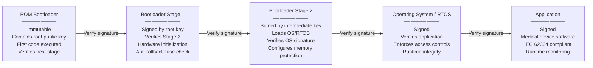

# Medical Device Cybersecurity — FDA, IEC 81001-5-1, IMDRF

**Topic:** Cybersecurity requirements and guidance for medical device development and lifecycle management  
**Standard:** FDA Cybersecurity Guidance (2023); IEC 81001-5-1:2021; IMDRF Cyber Guidance (2020); EU MDR GSPR 17  
**SDO:** FDA/CDRH; IEC/SC 62A; IMDRF; EU Commission  
**Audience:** Medical device security engineers, embedded firmware developers, regulatory affairs, product security officers, healthcare IT security  
**Prerequisites:** Network security fundamentals, IEC 62304 software lifecycle, ISO 14971 risk management, cryptography basics

---

## Chapter 1 — Historical Context & Origin Story

### 1.1 Timeline

| Year | Event | Significance |
|------|-------|-------------|
| 2013 | ICS-CERT alerts on medical device vulnerabilities | Insulin pumps, infusion pumps publicly demonstrated hackable |
| 2014 | FDA Premarket Cybersecurity Guidance (original) | First FDA guidance on cybersecurity in device submissions |
| 2016 | FDA Postmarket Cybersecurity Guidance | Managing cybersecurity throughout device lifecycle |
| 2017 | WannaCry ransomware | Shut down NHS hospitals; medical devices affected; global awareness |
| 2018 | FDA Cybersecurity Bill of Materials concept | Early SBOM requirements; software transparency |
| 2020 | IMDRF Principles and Practices for Medical Device Cybersecurity | International harmonized guidance |
| 2021 | **IEC 81001-5-1:2021** published | First international standard for health software security; security lifecycle |
| 2022 | FDA Refuse to Accept (RTA) for missing cybersecurity | FDA began rejecting 510(k)/PMA submissions lacking adequate cybersecurity documentation |
| 2023 | **FDA Cybersecurity Guidance (Final, Sept 2023)** | Comprehensive premarket guidance; SBOM mandatory; threat modeling; security architecture |
| 2023 | PATCH Act (US) | Statutory authority for FDA to require cybersecurity in submissions |
| 2024 | EU Cyber Resilience Act (CRA) | EU-wide cybersecurity regulation for connected products (impacts medical devices) |
| 2024 | IEC 81001-5-1 harmonized under EU MDR | Security standard referenced by EU MDR GSPR 17 |
| 2025 | FDA Enhanced Cybersecurity requirements effective | Full enforcement of 2023 guidance requirements |

### 1.2 Regulatory Framework

```mermaid
graph TB
    subgraph "International"
        IMDRF[IMDRF Guidance<br/>2020<br/>━━━━━━━━━━━<br/>Principles<br/>Total Product Lifecycle<br/>Shared responsibility]
        IEC81[IEC 81001-5-1:2021<br/>━━━━━━━━━━━<br/>Security lifecycle<br/>Process requirements<br/>Threat modeling<br/>Security testing]
    end
    
    subgraph "US (FDA)"
        FDA_PRE[FDA Premarket Guidance<br/>2023 (Final)<br/>━━━━━━━━━━━<br/>SBOM<br/>Threat model<br/>Security architecture<br/>Vulnerability management]
        FDA_POST[FDA Postmarket Guidance<br/>2016<br/>━━━━━━━━━━━<br/>Monitoring<br/>Vulnerability response<br/>Coordinated disclosure]
        PATCH[PATCH Act 2022<br/>━━━━━━━━━━━<br/>Statutory authority<br/>Mandatory requirements<br/>Enforcement]
    end
    
    subgraph "EU"
        MDR17[EU MDR GSPR 17<br/>━━━━━━━━━━━<br/>IT security<br/>Protection against<br/>unauthorized access]
        CRA[EU Cyber Resilience Act<br/>2024<br/>━━━━━━━━━━━<br/>Connected products<br/>Security by design<br/>Vulnerability handling]
    end
    
    IMDRF --> FDA_PRE
    IMDRF --> MDR17
    IEC81 --> FDA_PRE
    IEC81 --> MDR17
    PATCH --> FDA_PRE
    CRA --> MDR17
```

---

## Chapter 2 — Standard Architecture & Structure

### 2.1 FDA 2023 Cybersecurity Guidance Structure

| Section | Content | Key Requirements |
|:-------:|---------|-----------------|
| Scope | Devices with software (including firmware) that connect to other products, networks, or the internet | Virtually ALL modern medical devices |
| SPDF | Secure Product Development Framework | Covers entire lifecycle: design, development, release, support, decommission |
| Threat Modeling | Systematic identification of threats and vulnerabilities | Required in submission; methodology documented |
| Security Architecture | Design documentation showing security controls | Defense-in-depth; attack surface minimization |
| SBOM | Software Bill of Materials | Mandatory; machine-readable; all components including SOUP/OTS |
| Cybersecurity Testing | Verification of security controls | Penetration testing; fuzzing; static analysis; vulnerability scanning |
| Vulnerability Management | Ongoing identification and remediation | Coordinated vulnerability disclosure; patch management plan |
| Documentation | Required submission content | Threat model; security controls; SBOM; testing evidence; update plan |

### 2.2 IEC 81001-5-1:2021 Process Structure

| Clause | Process | Content |
|:------:|---------|---------|
| 4 | General requirements | Quality management; risk management; regulatory context |
| 5 | **Security requirements and planning** | Security requirements; planning; architecture design |
| 6 | **Security by design** | Secure design principles; defense-in-depth; least privilege |
| 7 | **Implementation** | Secure coding; SOUP management; configuration management |
| 8 | **Verification and validation** | Security testing; penetration testing; vulnerability assessment |
| 9 | **Security guidance documentation** | Customer guidance for secure deployment; hardening guide |
| 10 | **Release and transition** | Secure release; known vulnerability documentation |
| 11 | **Post-market activities** | Vulnerability monitoring; incident response; patch management |
| Annex A | Threat modeling | STRIDE; attack trees; use case abuse |
| Annex B | Security requirements categories | Authentication; authorization; encryption; audit; integrity |
| Annex C | Secure design principles | 15 principles (minimize attack surface; least privilege; defense-in-depth; etc.) |

### 2.3 SBOM Requirements

| Requirement | FDA | IEC 81001-5-1 | EU CRA |
|-------------|:---:|:---:|:---:|
| Required | **Mandatory** (premarket submission) | Required (Clause 7) | **Mandatory** |
| Format | Machine-readable (CycloneDX or SPDX recommended) | Not prescribed | CycloneDX or SPDX |
| Content — commercial | Component name, supplier, version | ✅ | ✅ |
| Content — open source | Name, version, license | ✅ | ✅ |
| Content — custom | Internally developed components listed | ✅ | ✅ |
| Update frequency | When components change; periodic review | Per maintenance process | Continuous |
| Vulnerability correlation | Must be able to map SBOM → CVE/vulnerability databases | Expected | Required |
| Depth | ALL levels (transitive dependencies) | All dependencies | All levels |

---

## Chapter 3 — Technical Deep Dive

### 3.1 Threat Modeling for Medical Devices

| Method | Description | When to Use |
|--------|-------------|-------------|
| **STRIDE** | Spoofing, Tampering, Repudiation, Information Disclosure, Denial of Service, Elevation of Privilege | Per data flow crossing trust boundary; Microsoft standard approach |
| **Attack Trees** | Hierarchical decomposition of attack goals into sub-goals | Complex attack scenarios; physical + cyber combined |
| **PASTA** (Process for Attack Simulation and Threat Analysis) | 7-step risk-centric methodology | Enterprise-level threat modeling; regulatory submissions |
| **MITRE ATT&CK (for Healthcare)** | Adversary tactics, techniques, and procedures mapped to healthcare | Understanding real-world attack patterns; post-market monitoring |
| **LINDDUN** | Privacy threat modeling (Linkability, Identifiability, Non-repudiation, Detectability, Disclosure, Unawareness, Non-compliance) | PHI/PII data protection; HIPAA/GDPR compliance |

**STRIDE Applied to Medical Device:**

| Threat | Medical Device Example | Security Control |
|--------|----------------------|------------------|
| **Spoofing** | Attacker impersonates legitimate clinical workstation to send false commands to infusion pump | Mutual TLS authentication; device identity certificates; PKI |
| **Tampering** | Firmware modified in transit or at rest to alter device behavior | Code signing; secure boot; integrity verification; signed updates |
| **Repudiation** | Clinician denies changing device settings; attacker denies unauthorized access | Audit logging; non-repudable event records; tamper-evident logs |
| **Information Disclosure** | Patient data (PHI) intercepted during wireless transmission from device | TLS/DTLS encryption; data-at-rest encryption (AES-256); access controls |
| **Denial of Service** | Network flood prevents ventilator from receiving remote commands; alarm system disrupted | Autonomous operation mode; local failsafe; rate limiting; network segmentation |
| **Elevation of Privilege** | Service technician account exploited to gain clinical admin access; attacker escalates from user to root | Role-based access control; privilege separation; principle of least privilege; secure boot chain |

### 3.2 Security Architecture Requirements

| Layer | Controls | Implementation |
|-------|----------|----------------|
| **Hardware** | Secure boot; hardware root of trust (TPM/SE); tamper detection; debug port protection | ARM TrustZone; TPM 2.0; JTAG lock; eFuse; hardware crypto accelerator |
| **Firmware/OS** | Signed firmware; secure update; memory protection; ASLR; stack canaries | Verified boot chain; signed OTA updates; MPU/MMU enforcement; NX bit |
| **Application** | Input validation; secure coding; error handling; session management | MISRA C/C++; OWASP guidelines; parameterized queries; timeout handling |
| **Data** | Encryption at rest; encryption in transit; key management; PHI protection | AES-256-GCM; TLS 1.3; PKCS#11; FIPS 140-2/3 validated crypto modules |
| **Network** | Segmentation; firewall; intrusion detection; protocol security | VLAN isolation; host-based firewall; network anomaly detection; authenticated protocols |
| **Identity** | Authentication; authorization; credential management; session control | X.509 certificates; OAuth 2.0; RBAC; credential rotation; lockout policies |
| **Monitoring** | Audit logging; anomaly detection; integrity monitoring; alerting | Syslog (IHE ATNA); file integrity monitoring; behavioral baselines |
| **Update** | Secure update mechanism; rollback capability; update authentication | Signed update packages; A/B partition for rollback; version enforcement (anti-rollback) |

### 3.3 Secure Development Lifecycle (SDL) for Medical Devices

```mermaid
graph TB
    subgraph "Requirements Phase"
        SEC_REQ[Security Requirements<br/>━━━━━━━━━━━<br/>• Threat model (STRIDE)<br/>• Attack surface analysis<br/>• Security use cases<br/>• Abuse cases<br/>• Regulatory requirements<br/>(FDA/IEC 81001-5-1)]
    end
    
    subgraph "Design Phase"
        SEC_ARCH[Security Architecture<br/>━━━━━━━━━━━<br/>• Trust boundaries<br/>• Defense-in-depth<br/>• Crypto design<br/>• Key management<br/>• Authentication design<br/>• Network architecture]
        DESIGN_REV[Security Design Review<br/>━━━━━━━━━━━<br/>• Architecture review<br/>• Threat model review<br/>• Crypto review<br/>• Protocol review]
    end
    
    subgraph "Implementation Phase"
        SEC_CODE[Secure Coding<br/>━━━━━━━━━━━<br/>• Coding standards (CERT C/C++)<br/>• Input validation<br/>• Memory safety<br/>• Crypto implementation<br/>• SAST (static analysis)]
        SBOM_GEN[SBOM Generation<br/>━━━━━━━━━━━<br/>• Component inventory<br/>• Version tracking<br/>• License compliance<br/>• Known vulnerabilities]
    end
    
    subgraph "Verification Phase"
        SEC_TEST[Security Testing<br/>━━━━━━━━━━━<br/>• Penetration testing<br/>• Fuzz testing<br/>• Vulnerability scanning<br/>• DAST<br/>• Crypto validation<br/>• Protocol analysis]
        RISK_ACC[Risk Acceptance<br/>━━━━━━━━━━━<br/>• Residual risk evaluation<br/>• Known vulnerability<br/>  assessment<br/>• Risk-benefit for<br/>  unpatched items]
    end
    
    subgraph "Release & Post-Market"
        SEC_RELEASE[Secure Release<br/>━━━━━━━━━━━<br/>• Code signing<br/>• Secure distribution<br/>• Hardening guide<br/>• Deployment guidance]
        VULN_MGMT[Vulnerability Management<br/>━━━━━━━━━━━<br/>• CVE monitoring (NVD)<br/>• SBOM → vulnerability correlation<br/>• Coordinated disclosure<br/>• Patch development & deployment<br/>• Customer communication]
    end
    
    SEC_REQ --> SEC_ARCH --> DESIGN_REV
    DESIGN_REV --> SEC_CODE --> SBOM_GEN
    SBOM_GEN --> SEC_TEST --> RISK_ACC
    RISK_ACC --> SEC_RELEASE --> VULN_MGMT
    VULN_MGMT -->|"New vulnerability<br/>found"| SEC_CODE
```

### 3.4 FDA Premarket Submission — Cybersecurity Documentation

| Document | Content | Format |
|----------|---------|--------|
| **Threat Model** | System architecture diagram; trust boundaries; data flows; STRIDE analysis per flow; threat mitigations mapped to controls | Diagrams + tables; reference methodology (e.g., Microsoft Threat Modeling Tool output) |
| **Security Architecture** | Defense-in-depth diagram; authentication mechanism; encryption algorithms; key management; network topology; update mechanism | Architecture diagrams; security control descriptions |
| **SBOM** | All software components (commercial, open-source, custom); versions; suppliers; known vulnerabilities at time of submission | CycloneDX or SPDX (machine-readable); PDF summary |
| **Security Controls Rationale** | For each identified threat: control selected; justification; residual risk assessment | Table mapping threats → controls → residual risk |
| **Security Testing** | Penetration test results (scope, findings, remediation); fuzz testing coverage; static analysis results; vulnerability scan results | Test report with findings, severity ratings, remediation evidence |
| **Vulnerability Management Plan** | How manufacturer monitors for new vulnerabilities; response timelines; patch deployment mechanism; coordinated disclosure policy; end-of-support timeline | Written plan; SLA commitments; communication templates |
| **Software Update Plan** | How device receives updates; authentication of updates; rollback capability; user notification; update frequency commitment | Technical description + commitment letter |
| **Customer Security Documentation** | Hardening guide; network requirements; user responsibilities; port/protocol table; recommended security configuration | Customer-facing document (included with device) |

### 3.5 Common Medical Device Vulnerabilities (CWE)

| CWE | Vulnerability | Medical Device Impact | Mitigation |
|:---:|-------------|----------------------|-----------|
| CWE-259 | Hard-coded credentials | Default passwords enable unauthorized access to device management | Unique per-device credentials; credential rotation; no defaults |
| CWE-311 | Missing encryption of sensitive data | PHI transmitted in cleartext (e.g., patient vitals over network) | TLS 1.2+ for all network traffic; encrypt stored PHI |
| CWE-798 | Use of hard-coded cryptographic key | Same encryption key across all devices → one compromised, all compromised | Per-device keys; HSM/TPM key storage; key derivation |
| CWE-287 | Improper authentication | No authentication required to send commands to device | Mutual authentication; certificate-based; session management |
| CWE-120 | Buffer overflow | Firmware crash → device failure → patient harm; remote code execution | Input validation; bounds checking; safe string libraries; ASLR; stack canaries |
| CWE-306 | Missing authentication for critical function | Device settings changed without authentication | Authentication required for ALL clinical operations |
| CWE-319 | Cleartext transmission of sensitive information | Eavesdropping on patient data; interception of device commands | TLS/DTLS; no fallback to cleartext; certificate pinning |
| CWE-352 | Cross-site request forgery (web-based devices) | Unauthorized commands to web-managed devices | Anti-CSRF tokens; SameSite cookies; origin validation |
| CWE-922 | Insecure storage of sensitive information | PHI stored unencrypted on removable media or internal storage | Full-disk encryption; secure element for keys; wipe on tampering |

---

## Chapter 4 — Implementation Guide

### 4.1 Secure Boot Chain Implementation



### 4.2 Vulnerability Management Process

| Phase | Activity | Timeline | Output |
|:-----:|----------|:--------:|--------|
| 1 | **Monitor** | Continuous | Subscribe to NVD/CVE; vendor advisories; CISA ICS-CERT; SBOM correlation tools |
| 2 | **Identify** | Within 24 hours of disclosure | Correlate CVE → SBOM; determine if component used in product; affected versions |
| 3 | **Assess** | Within 72 hours | CVSS scoring in device context; exploitability in medical environment; patient safety impact (ISO 14971) |
| 4 | **Classify** | Day 3-5 | Critical (actively exploited; patient safety): immediate action. High: 30-day patch. Medium: 60-day patch. Low: next planned release |
| 5 | **Remediate** | Per classification | Patch development; or compensating control; or risk acceptance with justification |
| 6 | **Verify** | After remediation | Regression testing; penetration testing of fix; no new vulnerabilities introduced |
| 7 | **Deploy** | Per update plan | Signed update package; customer notification; deployment support |
| 8 | **Communicate** | Throughout | Coordinated disclosure (if researcher-found); customer advisory; ICS-CERT if appropriate |

### 4.3 Penetration Testing Scope for Medical Devices

| Test Area | Techniques | Tools |
|-----------|-----------|-------|
| Network interfaces | Port scanning; protocol fuzzing; man-in-the-middle; replay attacks | Nmap; Wireshark; Burp Suite; custom fuzzers |
| Wireless (BLE/WiFi/Zigbee) | Sniffing; pairing attacks; injection; replay; jamming analysis | Ubertooth; HackRF; BLE tools (nRF Connect); aircrack-ng |
| Web interfaces | OWASP Top 10; authentication bypass; injection; XSS; CSRF | Burp Suite; OWASP ZAP; sqlmap; custom scripts |
| Firmware | Binary extraction; reverse engineering; hardcoded secrets; debug interfaces | Binwalk; Ghidra; IDA Pro; JTAG/SWD debuggers |
| Update mechanism | Update package interception; rollback attack; unsigned update injection | Proxy; custom update server; package analysis |
| Physical | Debug port access; memory extraction; hardware tampering; side-channel | Bus Pirate; logic analyzer; oscilloscope; chip-off |
| API/command interface | Command injection; authentication bypass; parameter manipulation | Custom test harness; protocol-specific tools |
| Crypto analysis | Key extraction; algorithm weakness; implementation flaws; timing attacks | Custom analysis; side-channel equipment; OpenSSL testing |

---

## Chapter 5 — Certification & Regulatory

### 5.1 FDA Submission — Cybersecurity Section

| Submission Type | Cybersecurity Required? | Detail Level |
|:---:|:---:|---|
| 510(k) | **Yes** (if device has software + connectivity) | Full cybersecurity documentation per 2023 guidance |
| De Novo | **Yes** | Full documentation + novel risk assessment |
| PMA | **Yes** | Most comprehensive; includes post-market plan |
| PMA Supplement (software change) | **Yes** (for security-relevant changes) | Updated threat model; new SBOM; impact assessment |
| Cybersecurity-only update (patch) | May not require submission | Per FDA postmarket guidance — routine cyber updates may not need new 510(k) |

### 5.2 FDA Refuse to Accept (RTA) Criteria — Cybersecurity

| If submission lacks... | RTA outcome |
|----------------------|-------------|
| Threat model (or uses generic template without device-specific analysis) | Refuse to Accept |
| SBOM (or incomplete; missing components) | Refuse to Accept |
| Security testing evidence | Refuse to Accept |
| Vulnerability management plan | Refuse to Accept |
| Software update mechanism description | Refuse to Accept |
| Customer hardening guidance | May receive additional information request |

### 5.3 EU MDR Cybersecurity Compliance (GSPR 17)

| GSPR 17 Requirement | Implementation (via IEC 81001-5-1) |
|---------------------|--------------------------------------|
| "Protection against unauthorized access" | Authentication; RBAC; access control; network security |
| "Verification of access by authorized persons" | Audit logging; identity management; session management |
| "IT security measures including protection against unauthorized access" | Full security architecture; encryption; secure boot; intrusion detection |
| "State-of-the-art" security | Current best practices; IEC 81001-5-1 compliance; regular updates |
| "Minimum operational requirements regarding IT security" | Security configuration requirements; hardening guide; network requirements document |

---

## Chapter 6 — Regional Variants

### 6.1 Cybersecurity Requirements by Region

| Region | Primary Guidance | SBOM Mandatory | Post-Market Monitoring | Disclosure Policy |
|--------|:----------------:|:--------------:|:---------------------:|:------------------:|
| US (FDA) | FDA Cybersecurity Guidance 2023 | **Yes** | Required (vulnerability management plan) | Coordinated disclosure recommended |
| EU | IEC 81001-5-1 + EU MDR GSPR 17 + CRA | **Yes** (CRA 2024) | Required (PMS + vigilance for cyber incidents) | Mandatory (CRA) |
| Canada | Health Canada Cyber Guidance 2019 | Recommended | Expected via MDSAP | Expected |
| Japan | PMDA Cyber Guidance 2023 | Expected | Expected | Expected |
| Australia | TGA Cyber Guidance 2022 | Recommended → expected | Expected | Expected |
| International | IMDRF 2020 | Recommended | Recommended | Recommended |

### 6.2 EU Cyber Resilience Act (CRA) Impact on Medical Devices

| CRA Requirement | Impact on Medical Device Manufacturers |
|-----------------|--------------------------------------|
| Security by design | Must demonstrate security throughout product lifecycle (already required by IEC 81001-5-1) |
| Vulnerability handling | Must have vulnerability handling process; 24-hour notification to ENISA for actively exploited vulns |
| Security updates | Must provide security updates for product lifetime (minimum 5 years) for free |
| SBOM | Must generate and maintain SBOM; make available to market surveillance authorities |
| Conformity assessment | Higher-risk products (including medical devices under CRA scope) require third-party assessment |
| Coordination with MDR | Medical devices meeting MDR cybersecurity requirements (GSPR 17 + IEC 81001-5-1) may satisfy CRA |
| Timeline | 2024 published; 2027 full application |

---

## Chapter 7 — Comparison

### 7.1 Medical Device Cybersecurity Frameworks Compared

| Dimension | FDA 2023 Guidance | IEC 81001-5-1:2021 | IMDRF 2020 | EU CRA 2024 |
|-----------|:---:|:---:|:---:|:---:|
| Scope | US market; devices with software | International; health software security | Global principles | EU; all connected products (including medical) |
| Legal force | Guidance (not regulation, but enforced via submission) | Standard (harmonized under MDR) | Guidance (voluntary but referenced) | **Regulation** (legally binding) |
| SBOM | Mandatory | Required | Recommended | Mandatory |
| Threat modeling | Required (methodology open) | Required (Annex A — STRIDE, etc.) | Expected | Expected |
| Penetration testing | Expected | Required (Clause 8) | Expected | Expected |
| Post-market vuln management | Required (plan + commitment) | Required (Clause 11) | Expected | Required (active monitoring + 24h notification) |
| Update mechanism | Required (secure) | Required (Clause 11) | Expected | Required (free security updates) |
| Customer guidance | Required (hardening guide) | Required (Clause 9) | Expected | Required (information for users) |
| Coordinated disclosure | Strongly recommended | Required (Clause 11) | Recommended | Mandatory |
| Certification/audit | FDA review (submission-based) | NB assessment (audit/TD review) | N/A | Third-party (higher risk) or self-declaration |

### 7.2 Medical Device Cybersecurity vs. General IT Security Standards

| Aspect | Medical Device (FDA/IEC 81001) | General IT (ISO 27001/NIST CSF) |
|--------|:---:|:---:|
| Primary concern | **Patient safety** (cyber → safety) | Confidentiality, integrity, availability (CIA) |
| Risk framework | ISO 14971 (safety risk) + cybersecurity risk | ISO 27005 / NIST RMF (business risk) |
| Availability priority | Often HIGHEST (device must function for patient safety) | Depends on system criticality |
| Patch deployment | Complex (validation required; may need regulatory review; clinical impact assessment) | Typically faster (days/weeks for critical) |
| Compensating controls | May include: manual clinical workflow; redundant safety systems; hardware interlocks | Primarily technical/administrative controls |
| Product lifecycle | 10-20+ years (long-lived devices in field) | Typically shorter (3-5 year IT refresh cycles) |
| Update constraints | Devices may be in use during surgery; network may not be available; updates must not disrupt essential performance | Can schedule maintenance windows; forced updates acceptable |
| Residual risk acceptance | Must be justified vs. clinical benefit (risk-benefit analysis per ISO 14971) | Business decision based on risk appetite |

---

## Chapter 8 — Mermaid Architecture Diagrams

### 8.1 Medical Device Security Architecture (Defense-in-Depth)

```mermaid
graph TB
    subgraph "External Network"
        ATTACKER[Threat Actors<br/>• Ransomware<br/>• Nation-state<br/>• Insider threat<br/>• Researcher]
    end
    
    subgraph "Network Perimeter (Hospital IT)"
        FW[Firewall / IDS<br/>━━━━━━━━━━━<br/>Network segmentation<br/>Medical device VLAN<br/>Protocol filtering]
    end
    
    subgraph "Device Network Layer"
        NW[Device Network Security<br/>━━━━━━━━━━━<br/>TLS 1.3 (all connections)<br/>Certificate-based auth<br/>Host-based firewall<br/>Minimum open ports]
    end
    
    subgraph "Application Layer"
        AUTH_L[Authentication & Authorization<br/>━━━━━━━━━━━<br/>Multi-factor (where appropriate)<br/>Role-based access control<br/>Session management<br/>Credential protection]
        APP_SEC[Application Security<br/>━━━━━━━━━━━<br/>Input validation<br/>Secure coding (CERT C)<br/>Memory safety<br/>Error handling (no info leak)]
    end
    
    subgraph "Data Layer"
        DATA_SEC[Data Protection<br/>━━━━━━━━━━━<br/>AES-256 at rest<br/>TLS in transit<br/>Key management (TPM/SE)<br/>PHI minimization]
    end
    
    subgraph "Platform Layer"
        PLAT[Platform Security<br/>━━━━━━━━━━━<br/>Secure boot (verified chain)<br/>Signed firmware<br/>ASLR / DEP / Stack canaries<br/>Minimal OS (no unnecessary services)<br/>File integrity monitoring]
    end
    
    subgraph "Hardware Layer"
        HW_SEC[Hardware Security<br/>━━━━━━━━━━━<br/>TPM 2.0 / Secure Element<br/>Hardware RNG<br/>Tamper detection<br/>Debug port locked<br/>Anti-rollback fuses]
    end
    
    subgraph "Monitoring"
        MON[Security Monitoring<br/>━━━━━━━━━━━<br/>Audit logging (tamper-evident)<br/>Anomaly detection<br/>Integrity verification<br/>Security event alerting]
    end
    
    ATTACKER --> FW --> NW --> AUTH_L --> APP_SEC --> DATA_SEC --> PLAT --> HW_SEC
    MON --> NW & AUTH_L & APP_SEC & PLAT
```

### 8.2 Coordinated Vulnerability Disclosure Process

```mermaid
sequenceDiagram
    participant Researcher as Security Researcher
    participant Mfg as Device Manufacturer
    participant FDA_V as FDA
    participant CISA_V as CISA/ICS-CERT
    participant Hospital as Healthcare Delivery Org
    
    Researcher->>Mfg: Vulnerability report (encrypted; responsible disclosure)
    Mfg-->>Researcher: Acknowledge receipt (within 5 days)
    
    Mfg->>Mfg: Assess: confirm vulnerability; determine severity (CVSS);<br/>assess patient safety impact; determine affected products
    
    alt Critical Patient Safety Risk
        Mfg->>FDA_V: Immediate notification (safety concern)
        Mfg->>CISA_V: Alert for coordinated advisory
    end
    
    Mfg->>Mfg: Develop patch/mitigation (target: 60-90 days)
    Mfg->>Mfg: Validate fix (regression testing; security testing)
    
    Mfg->>Hospital: Pre-disclosure advisory (if critical; under NDA)
    Mfg->>Hospital: Patch available; update instructions; compensating controls
    
    Note over Researcher,Hospital: Coordinated Public Disclosure
    Mfg->>CISA_V: Final advisory content
    CISA_V->>CISA_V: Publish ICS-CERT Advisory
    Mfg->>Mfg: Publish security bulletin
    Researcher->>Researcher: Publish research (post-disclosure)
    
    Mfg->>FDA_V: Cybersecurity routine update notification (if applicable)
```

---

## Chapter 9 — Case Studies

### 9.1 Case Study: Insulin Pump Remote Attack

| Aspect | Detail |
|--------|--------|
| Device | Wireless insulin pump with RF communication to glucose sensor and controller |
| Vulnerability | Researcher demonstrated: (1) No authentication on RF commands — anyone within 100m with SDR (Software Defined Radio) could send dose commands. (2) No encryption on sensor → pump communication — glucose readings could be spoofed. (3) No integrity verification — commands not signed; replay attacks possible. |
| Patient safety impact | Attacker could: (1) Command maximum bolus dose → fatal hypoglycemia. (2) Disable pump → no insulin delivery → ketoacidosis. (3) Spoof glucose readings → pump delivers incorrect dose based on false data. CVSS: 9.8 (Critical). Patient safety: death possible. |
| Root cause | Device designed pre-2014 (before FDA cybersecurity guidance); RF protocol implemented without security (assumed physical proximity = security — "security through obscurity"); no threat modeling performed during design; no security testing in verification. |
| Remediation | (1) **Immediate**: issued safety communication; recommended patients keep devices close to body (reduce RF range); clinical guidance for detecting unexpected doses. (2) **Short-term (3 months)**: firmware update adding rolling code authentication (not full crypto due to CPU constraints); replay protection. (3) **Long-term (18 months)**: new device generation with: BLE 5.x with LE Secure Connections (AES-128-CCM); mutual authentication (device ↔ controller ↔ sensor); encrypted command channel; signed firmware updates; SBOM; post-market vulnerability monitoring process. |
| Regulatory outcome | FDA safety communication issued; manufacturer committed to monitoring and updates per postmarket guidance; next-gen device included full cybersecurity documentation in 510(k). |

### 9.2 Case Study: Hospital Ransomware via Medical Device

| Aspect | Detail |
|--------|--------|
| Event | Hospital network encrypted by ransomware; initial entry point traced to a networked infusion pump with Windows XP Embedded OS (unpatched; CVE-2017-0143 — EternalBlue) |
| Failure chain | (1) Infusion pump on hospital network (not segmented). (2) Windows XP Embedded: no patches available (end-of-life). (3) No host-based firewall on device. (4) SMBv1 enabled and exposed. (5) Attacker exploited EternalBlue → gained code execution on pump → lateral movement to hospital network → domain controller compromise → ransomware deployment. |
| Impact | 3 days hospital operations disrupted; surgeries cancelled; patients diverted; manual medication administration. Estimated cost: $5M+ (recovery + lost revenue + legal). No direct patient deaths but care quality degraded. |
| Root causes (systemic) | (1) **Manufacturer**: shipped device with end-of-life OS; no plan for OS updates; no hardening; no network security guidance provided. (2) **Hospital**: no network segmentation (medical devices on same network as workstations); no vulnerability scanning of medical devices; no patching process for medical devices; no medical device cybersecurity program. (3) **Industry**: legacy devices (10+ year lifecycle) running obsolete OS with no update path. |
| Lessons | (1) **For manufacturers**: plan for OS lifecycle at design (select OS with 10+ year support commitment); provide security updates for device lifetime; provide customer hardening guide; implement network segmentation recommendations. (2) **For hospitals**: segment medical device networks (IEEE 802.1Q VLANs; microsegmentation); inventory all medical devices (including software versions); implement medical device cybersecurity program; include cybersecurity in procurement requirements. (3) **For regulators**: push for mandatory cybersecurity in device design (now achieved with 2023 FDA guidance); require post-market support plans. |

---

## Chapter 10 — Future Evolution

| Trend | Timeline | Impact |
|-------|----------|--------|
| FDA enforcement escalation | 2024-2025+ | More RTA for missing cybersecurity; inspections include cybersecurity review |
| EU CRA full enforcement | 2027 | Legally binding cybersecurity requirements for all connected devices in EU |
| IEC 81001-5-1 Edition 2 | 2026-2027 | Updated with AI/ML security; cloud; IoMT considerations |
| Zero-trust for medical devices | Now-2026 | No implicit trust based on network location; per-request authentication/authorization |
| AI-powered threat detection | Now | Behavioral anomaly detection for medical device networks; automated vulnerability discovery |
| Post-quantum cryptography | 2025-2030 | NIST PQC algorithms (ML-KEM, ML-DSA) for long-lived medical devices (15+ year lifecycle) |
| Automated SBOM management | Now | Real-time vulnerability correlation; automated patch prioritization; CI/CD integration |
| Medical device ISAC | Now (Health-ISAC) | Sector-specific threat intelligence sharing; coordinated defense |
| Hardware security evolution | Now | RISC-V with custom security extensions; physically unclonable functions (PUF); embedded HSMs |
| DevSecOps for medical devices | Now | Security integrated in CI/CD; automated SAST/DAST; compliance-as-code |
| Connected device fleet management | Now | OTA update orchestration; fleet-wide vulnerability monitoring; remote attestation |

---

## Chapter 11 — Interview Questions & Career Guide

### Tier 1: Entry-Level

**Q1:** What is an SBOM and why is it critical for medical device cybersecurity?  
**A:** SBOM = **Software Bill of Materials** — a complete, formally structured list of ALL software components in a medical device, including: name, version, supplier/source for each commercial/open-source library; internally developed components; operating system; firmware; all transitive dependencies. It's critical because: (1) **Vulnerability management**: when a new CVE is published (e.g., Log4Shell CVE-2021-44228), the manufacturer can immediately check SBOM to determine if their device uses the affected component and version — without SBOM, this requires reverse engineering each product. (2) **FDA mandatory**: since 2023, FDA will not accept premarket submissions (510(k)/PMA) without machine-readable SBOM. (3) **Regulatory requirement**: EU CRA also mandates SBOM. (4) **Supply chain security**: understand your exposure to third-party risks; track end-of-life components. (5) **Patch prioritization**: correlate SBOM with vulnerability databases (NVD) automatically; focus resources on exploitable vulnerabilities in deployed components. (6) **Customer transparency**: hospitals need SBOM to assess risk and plan network defenses. Format: CycloneDX (OWASP) or SPDX (Linux Foundation) — both machine-readable (JSON/XML). Should include ALL levels of dependencies (not just direct — transitive too).

**Q2:** What does "secure boot" mean and why is it important for medical devices?  
**A:** Secure boot is a hardware-rooted process that verifies the integrity and authenticity of every software component loaded during device startup, creating a **chain of trust** from hardware to application. Process: (1) **Hardware root of trust** (immutable ROM code containing manufacturer's root public key) verifies first-stage bootloader signature. (2) First-stage bootloader verifies second-stage bootloader. (3) Second-stage verifies OS/RTOS. (4) OS verifies application software. If any signature verification fails → boot is halted (device does NOT run unverified code). Why it matters for medical devices: (1) **Prevents firmware tampering**: attacker cannot modify device firmware to alter behavior (e.g., change infusion pump dosing algorithm) — modified firmware won't pass signature check. (2) **Anti-persistence**: even if attacker exploits a runtime vulnerability, after reboot, only authenticated firmware loads (attacker can't persist modified code). (3) **Regulatory expectation**: FDA 2023 guidance expects devices to verify software integrity; IEC 81001-5-1 requires integrity verification. (4) **Anti-rollback**: combined with version fuses, prevents downgrading to older firmware with known vulnerabilities. (5) **Supply chain protection**: ensures firmware hasn't been tampered with during manufacturing, distribution, or servicing.

### Tier 2: Mid-Level

**Q3:** How do you perform a threat model for a connected medical device, and what goes into the FDA submission?  
**A:** Threat modeling process for FDA submission: (1) **Define scope**: identify the device, its interfaces (network, wireless, USB, serial), connected systems (EHR, cloud, mobile app, other devices), data flows (patient data, commands, updates, diagnostics). Create **system architecture diagram** with all components and communication paths. (2) **Identify trust boundaries**: where does trust level change? External network ↔ device; user input ↔ internal processing; cloud ↔ device; service technician ↔ clinical operation. Draw boundaries on architecture diagram. (3) **Enumerate data flows**: for each data flow crossing a trust boundary, document: what data; protocol; direction; sensitivity; criticality. (4) **Apply STRIDE per flow**: for each data flow, systematically ask: can the source be Spoofed? Can the data be Tampered? Can actions be Repudiated? Can Information be Disclosed? Can the flow be Denied? Can the receiver's privileges be Elevated? Document each applicable threat. (5) **Assess severity**: for each threat, assess impact using CVSS (technical severity) AND patient safety impact (ISO 14971 — could this lead to patient harm?). Combine for overall risk rating. (6) **Identify mitigations**: for each threat above acceptable risk, identify security controls. Map to implementation (specific crypto algorithm, specific authentication mechanism, etc.). (7) **Document residual risk**: after controls applied, what risk remains? Justify acceptance via benefit-risk analysis. (8) **FDA submission content**: architecture diagram with trust boundaries (annotated); threat table (threat description, STRIDE category, severity, mitigation, residual risk); security controls summary; testing evidence that controls work; SBOM (supports identification of component-level threats); vulnerability management plan for threats discovered post-market.

### Tier 3: Senior

**Q4:** Your company has 200 connected medical devices in the field running end-of-life operating systems (Windows 7 Embedded, legacy Linux kernels). How do you develop and execute a cybersecurity remediation strategy?  
**A:** [Comprehensive answer covering: (1) **Risk triage**: inventory all 200 devices by model, OS, connectivity, clinical criticality, installed base size, remaining product lifecycle. Categorize: Tier 1 (internet-connected, critical care, high CVE exposure) → immediate action; Tier 2 (network-connected, moderate care) → 6-month plan; Tier 3 (standalone, low connectivity) → compensating controls acceptable. (2) **Compensating controls** (immediate for all tiers): customer advisory with hardening guidance; network segmentation recommendations; disable unnecessary services/ports; monitoring recommendations. (3) **Update strategy per tier**: Tier 1: OS migration to supported platform (may require 510(k) supplement for significant software change); if not feasible in short term, application-level security hardening (host firewall, application whitelisting, encrypted communications — these may not require new submission). Tier 2: planned update in next software release; communicate timeline to customers; interim compensating controls. Tier 3: end-of-life plan with customer notification; transition to replacement product; extended compensating controls during transition. (4) **Regulatory strategy**: FDA cybersecurity postmarket guidance allows routine cybersecurity updates without new 510(k) IF: updates don't change intended use/performance; adequate risk analysis performed. OS migration likely IS a significant change (510(k) supplement or letter-to-file with strong justification). Engage FDA pre-submission meeting for complex cases. (5) **Customer communication**: transparent communication of risks and timeline; customer advisory; compensating control guidance; dedicated cybersecurity support contact. (6) **Resource investment**: this is a multi-year, multi-million dollar effort; requires executive commitment; dedicated product security team; may require hiring embedded security engineers + project managers. (7) **Prevent recurrence**: update design controls to include OS lifecycle planning (select OS with 10+ year support); implement secure design requirements for all new products; establish product security organization permanently.]

---

## Chapter 12 — Cheat Sheet & Quick Reference

### FDA Cybersecurity Submission Checklist

```
□ Threat model (architecture + trust boundaries + STRIDE analysis)
□ Security architecture documentation (defense-in-depth diagram)
□ SBOM (CycloneDX or SPDX; machine-readable; all components + versions)
□ Security controls description (authentication, encryption, access control, update mechanism)
□ Security testing evidence (penetration test report; fuzz test results; SAST/DAST results)
□ Vulnerability management plan (monitoring + response SLAs + disclosure policy)
□ Software update plan (mechanism; authentication; rollback; deployment)
□ Customer security documentation (hardening guide; network requirements; port/protocol table)
□ Risk assessment (cybersecurity risks mapped to patient safety per ISO 14971)
□ End-of-support timeline (how long will security updates be provided)
```

### Security Controls Quick Reference

```
AUTHENTICATION:     Mutual TLS; X.509 certificates; MFA for clinical operations
AUTHORIZATION:      RBAC; least privilege; session timeout; account lockout
ENCRYPTION:         TLS 1.3 (transit); AES-256-GCM (rest); secure key management
INTEGRITY:          Secure boot; code signing; firmware verification; hash checking
AVAILABILITY:       Autonomous operation if network lost; failsafe mode; graceful degradation
AUDIT:              Tamper-evident logging; all security events; all clinical operations
UPDATE:             Signed packages; authenticated channel; rollback capability; anti-rollback
HARDENING:          Minimal OS; disabled services; closed ports; no default credentials
```

### SBOM Minimum Content

```
For each component:
□ Component name
□ Version (specific; not range)
□ Supplier/manufacturer
□ Type (commercial/open-source/custom)
□ License (for open-source)
□ Cryptographic hash (for verification)
□ Dependencies (transitive)
□ Known vulnerabilities at time of release (with disposition)
```

### Vulnerability Response Timelines (Best Practice)

```
CRITICAL (actively exploited; patient safety):  
  → Assess within 24 hours
  → Compensating control / advisory within 48 hours  
  → Patch within 30 days (or compensating control if patch not feasible)

HIGH (exploitable; not yet in-the-wild):
  → Assess within 72 hours
  → Patch within 60 days

MEDIUM:
  → Assess within 7 days
  → Patch within 90 days (or next planned release)

LOW:
  → Assess within 30 days
  → Address in next planned release
```

### IEC 81001-5-1 Key Clauses

```
Clause 5:  Security requirements & planning (threat modeling; security requirements)
Clause 6:  Security by design (defense-in-depth; 15 design principles)
Clause 7:  Secure implementation (secure coding; SBOM; configuration management)
Clause 8:  Security verification & validation (pen testing; fuzzing; vulnerability assessment)
Clause 9:  Security guidance documentation (customer hardening guide)
Clause 10: Secure release (known vuln documentation; residual risk)
Clause 11: Post-market (monitoring; incident response; patching; coordinated disclosure)
```

---

*End of Document — 08_Medical_Device_Cybersecurity.md*
