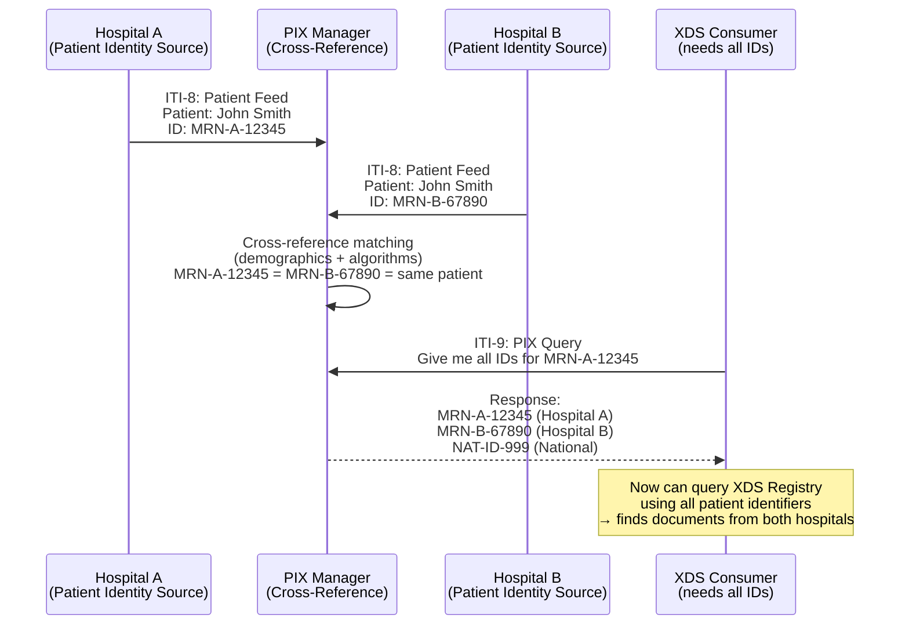

# IHE Integration Profiles — Healthcare Interoperability Framework

**Topic:** Integrating the Healthcare Enterprise (IHE) — integration profiles for healthcare IT interoperability  
**Standard:** IHE Technical Framework (Radiology, IT Infrastructure, Cardiology, Pathology, PCC, Pharmacy domains)  
**SDO:** IHE International (collaboration of HIMSS, RSNA, ACC, and other professional societies)  
**Audience:** Healthcare integration engineers, PACS/RIS/HIS administrators, HL7/DICOM implementers, health IT architects, interoperability specialists  
**Prerequisites:** HL7 v2/FHIR basics, DICOM fundamentals, healthcare workflow understanding, TCP/IP and web services

---

## Chapter 1 — Historical Context & Origin Story

### 1.1 Timeline

| Year | Event | Significance |
|------|-------|-------------|
| 1998 | IHE founded by RSNA and HIMSS | Address interoperability gaps between standards (HL7 + DICOM don't specify HOW to use them together) |
| 1999 | First IHE Technical Framework (Radiology) | SWF (Scheduled Workflow); PIR; initial profiles |
| 2000 | First IHE Connectathon (RSNA) | Vendor testing event; proves interoperability in controlled environment |
| 2002 | IT Infrastructure (ITI) domain launched | Cross-domain profiles: XDS, PIX, PDQ, ATNA |
| 2004 | **XDS (Cross-Enterprise Document Sharing)** | Foundation for health information exchange; document-centric sharing |
| 2007 | XDS.b (ebXML-based XDS) | Mature document sharing with registry/repository architecture |
| 2009 | HITECH Act (US) | Meaningful Use drives IHE adoption; IHE profiles referenced in ONC standards |
| 2010 | XCA (Cross-Community Access) | Federated querying across multiple XDS communities |
| 2015 | MHD (Mobile access to Health Documents) | RESTful/FHIR-based alternative to XDS SOAP transactions |
| 2017 | IHE + FHIR integration accelerates | FHIR-based profiles supplement/replace SOAP transactions |
| 2020 | MHDS (Mobile Health Document Sharing) | Full FHIR-native document sharing (replaces XDS for greenfield) |
| 2022 | IHE profiles referenced in EU EHDS proposal | European Health Data Space cites IHE for cross-border exchange |
| 2023 | QEDm, mCSD, SVCM FHIR profiles | Modern FHIR-based query and care services |
| 2024 | IHE continues dual-track (SOAP + FHIR) | Legacy XDS deployments maintained; new deployments increasingly FHIR |

### 1.2 IHE's Role in Healthcare IT

```mermaid
graph TB
    subgraph "Standards (What)"
        HL7V2[HL7 v2.x<br/>Messages]
        FHIR[HL7 FHIR<br/>Resources/REST]
        DICOM_S[DICOM<br/>Imaging]
        CDA[HL7 CDA<br/>Documents]
        SNOMED[SNOMED CT<br/>Terminology]
    end
    
    subgraph "IHE (How to Use Standards Together)"
        IHE_PROF[IHE Integration Profiles<br/>━━━━━━━━━━━<br/>• Define ACTORS (systems/roles)<br/>• Define TRANSACTIONS (messages between actors)<br/>• Specify which standard + options<br/>• Define workflow sequences<br/>• Constrain standards for specific use cases]
    end
    
    subgraph "Implementations (Products)"
        EHR[EHR Systems]
        PACS_I[PACS]
        RIS_I[RIS]
        HIE_I[Health Information Exchanges]
        LAB[Lab Systems]
        PHARM[Pharmacy Systems]
    end
    
    HL7V2 & FHIR & DICOM_S & CDA & SNOMED --> IHE_PROF
    IHE_PROF --> EHR & PACS_I & RIS_I & HIE_I & LAB & PHARM
```

**IHE does NOT create new standards** — it profiles EXISTING standards (HL7, DICOM, W3C, OASIS) to solve specific clinical workflow problems.

---

## Chapter 2 — Standard Architecture & Structure

### 2.1 IHE Domain Structure

| Domain | Abbreviation | Scope | Key Profiles |
|--------|:---:|--------|-------------|
| IT Infrastructure | ITI | Cross-domain infrastructure (identity, security, document sharing) | XDS, PIX, PDQ, ATNA, CT, XCA, MHD, MHDS |
| Radiology | RAD | Imaging workflow and data management | SWF, SWF.b, XDS-I, KIN, ED, AIW, AIR |
| Cardiology | CARD | Cardiac imaging and procedure workflow | CATH, ECHO, CRC |
| Patient Care Coordination | PCC | Clinical content and care documents | XDS-MS, EDR, XPHR |
| Laboratory | LAB | Lab orders, results, workflow | LTW, LPOCT, LDA |
| Pharmacy | PHARM | Medication management | PRE, DIS, PADV, MTP |
| Pathology | PATH | Anatomic pathology workflow | APW |
| Quality, Research, Public Health | QRPH | Public health reporting | CRD, VRDR |
| Dental | DENT | Dental imaging and records | DRI |

### 2.2 IHE Profile Structure

| Element | Definition | Example (XDS) |
|---------|-----------|---------------|
| **Profile** | Complete specification for solving an interoperability problem | XDS (Cross-Enterprise Document Sharing) |
| **Actor** | System role/function in the profile | Document Source; Document Repository; Document Registry; Document Consumer |
| **Transaction** | Specific message exchange between two actors | ITI-41 (Provide and Register Document Set); ITI-18 (Registry Stored Query) |
| **Content Profile** | Constrains document content within a sharing infrastructure | XDS-MS (Medical Summary); XPHR (Personal Health Record) |
| **Option** | Optional capability within a profile | Folder Management Option; On-Demand Documents Option |
| **Grouping** | Required combination of actors from different profiles | Time Client (CT) grouped with all actors (ensures time synchronization) |
| **Integration Statement** | Vendor declaration of IHE support | "Our EHR implements XDS Document Source (ITI-41, ITI-42) and Document Consumer (ITI-18, ITI-43)" |

### 2.3 Key ITI Transactions

| Transaction | ID | Standard | Description |
|------------|:--:|:--------:|-------------|
| Patient Identity Feed | ITI-8 | HL7 v2 ADT^A01/A04/A08 | Send patient identity to registry/repository |
| PIX Query | ITI-9 | HL7 v2 QBP^Q23 | Query for cross-referenced patient IDs |
| PDQ | ITI-21 | HL7 v2 QBP^Q22 | Query for patient demographics |
| Provide and Register Document Set-b | ITI-41 | ebXML (SOAP) | Submit documents to repository |
| Register Document Set-b | ITI-42 | ebXML (SOAP) | Register document metadata in registry |
| Registry Stored Query | ITI-18 | ebXML (SOAP) | Query registry for documents |
| Retrieve Document Set | ITI-43 | ebXML (SOAP) | Retrieve documents from repository |
| Cross Gateway Query | ITI-38 | ebXML (SOAP) | Query across community boundaries (XCA) |
| Cross Gateway Retrieve | ITI-39 | ebXML (SOAP) | Retrieve across community boundaries (XCA) |
| Record Audit Event | ITI-20 | Syslog (RFC 5424) + DICOM AuditMessage | Log security-relevant events |
| FHIR equivalents: | | | |
| Find Document References | ITI-67 | FHIR (DocumentReference search) | MHD: Query for documents |
| Retrieve Document | ITI-68 | FHIR (Binary retrieve) | MHD: Get document content |
| Provide Document Bundle | ITI-65 | FHIR (Bundle transaction) | MHD: Submit documents |

---

## Chapter 3 — Technical Deep Dive

### 3.1 XDS (Cross-Enterprise Document Sharing)

```mermaid
graph TB
    subgraph "Document Sources"
        EHR_S[EHR<br/>(Document Source)]
        LAB_S[Lab System<br/>(Document Source)]
        IMG_S[Imaging<br/>(Document Source)]
    end
    
    subgraph "XDS Infrastructure"
        REPO[Document Repository<br/>━━━━━━━━━━━<br/>Stores actual documents<br/>(CDA, PDF, DICOM KOS, FHIR)<br/>Assigns unique document ID<br/>Provides retrieval service]
        
        REG[Document Registry<br/>━━━━━━━━━━━<br/>Stores METADATA only<br/>(patient, class, date, author,<br/>format, status, availability)<br/>Provides query service<br/>Single authoritative index]
    end
    
    subgraph "Document Consumers"
        EHR_C[EHR<br/>(Document Consumer)]
        VIEWER[Clinical Viewer<br/>(Document Consumer)]
        HIE_P[HIE Portal<br/>(Document Consumer)]
    end
    
    EHR_S -->|"ITI-41: Provide & Register<br/>(document + metadata)"| REPO
    LAB_S -->|"ITI-41: Provide & Register"| REPO
    IMG_S -->|"ITI-41: Provide & Register<br/>(imaging manifest)"| REPO
    REPO -->|"ITI-42: Register<br/>(metadata only)"| REG
    
    EHR_C -->|"ITI-18: Registry Stored Query<br/>(find documents for patient)"| REG
    VIEWER -->|"ITI-18: Query"| REG
    HIE_P -->|"ITI-18: Query"| REG
    
    REG -->|"Returns: document UIDs +<br/>repository locations"| EHR_C & VIEWER & HIE_P
    
    EHR_C -->|"ITI-43: Retrieve Document Set<br/>(by document UID)"| REPO
    VIEWER -->|"ITI-43: Retrieve"| REPO
    HIE_P -->|"ITI-43: Retrieve"| REPO
```

### 3.2 PIX/PDQ (Patient Identifier Cross-Referencing / Patient Demographics Query)

| Profile | Purpose | Transactions | Use Case |
|---------|---------|:---:|----------|
| **PIX** (Patient Identifier Cross-Referencing) | Link different patient IDs across systems (MRN from Hospital A = MRN from Hospital B = National ID) | ITI-8 (feed identities); ITI-9 (query cross-references) | Hospital A knows patient as MRN-12345; Hospital B knows same patient as MRN-67890; PIX Manager maintains cross-reference |
| **PDQ** (Patient Demographics Query) | Find patients by demographic criteria (name, DOB, sex, address) | ITI-21 (query demographics) | Clinician searches for "John Smith, DOB 1960-05-15" → PDQ returns matching patients with their IDs across systems |
| **PIXm** (FHIR-based PIX) | Same as PIX but using FHIR $ihe-pix operation | ITI-83 (PIX query via FHIR) | Modern FHIR-native implementation of patient cross-referencing |
| **PDQm** (FHIR-based PDQ) | Same as PDQ but using FHIR Patient search | ITI-78 (PDQ via FHIR search) | Modern FHIR-native patient demographics query |

**PIX Workflow Example:**



### 3.3 ATNA (Audit Trail and Node Authentication)

| Component | Purpose | Implementation |
|-----------|---------|----------------|
| **Node Authentication** | Mutual TLS authentication between all IHE actors | X.509 certificates; TLS 1.2+; certificate validation; trust chain to IHE community CA |
| **Audit Trail** | Log all security-relevant events | DICOM Audit Message format (XML); sent via Syslog (RFC 5424 over TLS); centralized audit repository |
| **Audit Events Logged** | | |
| — Application Activity | System start/stop | Know when systems are operational |
| — Audit Log Used | Audit log accessed/exported | Detect unauthorized access to audit records |
| — Patient Record | Patient data accessed/created/updated/deleted | Who accessed what patient data, when |
| — Security Alert | Authentication failure; node not authenticated | Detect attack attempts |
| — User Authentication | Login/logout events | Track user sessions |
| — Export | Data exported from system | Track data leaving organization |
| — Import | Data imported into system | Track data entering organization |
| — Query | Patient data queried | Track information requests |

### 3.4 XCA (Cross-Community Access) — Federated Architecture

```mermaid
graph TB
    subgraph "Community A (Hospital Network)"
        REG_A[XDS Registry A]
        REPO_A[XDS Repository A]
        IG_A[Initiating Gateway A<br/>━━━━━━━━━━━<br/>Queries other communities<br/>on behalf of local consumers]
        RG_A[Responding Gateway A<br/>━━━━━━━━━━━<br/>Responds to queries<br/>from other communities]
    end
    
    subgraph "Community B (Regional HIE)"
        REG_B[XDS Registry B]
        REPO_B[XDS Repository B]
        IG_B[Initiating Gateway B]
        RG_B[Responding Gateway B]
    end
    
    subgraph "Community C (National Network)"
        REG_C[XDS Registry C]
        REPO_C[XDS Repository C]
        IG_C[Initiating Gateway C]
        RG_C[Responding Gateway C]
    end
    
    subgraph "Query Flow (from Community A)"
        CONSUMER[Document Consumer<br/>(Physician in Community A)]
    end
    
    CONSUMER -->|"Local query (ITI-18)"| REG_A
    CONSUMER -->|"Cross-community (ITI-38)"| IG_A
    IG_A -->|"ITI-38: Cross Gateway Query"| RG_B
    IG_A -->|"ITI-38: Cross Gateway Query"| RG_C
    RG_B --> REG_B
    RG_C --> REG_C
    
    RG_B -->|"Results from B"| IG_A
    RG_C -->|"Results from C"| IG_A
    IG_A -->|"Aggregated results"| CONSUMER
    
    CONSUMER -->|"ITI-39: Cross Gateway Retrieve"| IG_A
    IG_A -->|"ITI-39"| RG_B
    RG_B --> REPO_B
```

### 3.5 MHD (Mobile access to Health Documents) — FHIR-Based

| XDS Transaction (SOAP) | MHD Equivalent (FHIR) | HTTP Method | FHIR Resource |
|:-----------------------:|:---------------------:|:-----------:|:-------------:|
| ITI-41 (Provide & Register) | ITI-65 (Provide Document Bundle) | POST (Bundle) | Bundle containing: DocumentReference + List + Binary |
| ITI-18 (Registry Stored Query) | ITI-67 (Find Document References) | GET (search) | DocumentReference?patient=...&type=...&date=... |
| ITI-43 (Retrieve Document Set) | ITI-68 (Retrieve Document) | GET | Binary/{id} or DocumentReference content URL |
| — | ITI-66 (Find Document Lists) | GET (search) | List?patient=...&code=... |

---

## Chapter 4 — Implementation Guide

### 4.1 Implementing XDS Document Source

| Step | Action | Technical Detail |
|:----:|--------|-----------------|
| 1 | Generate document (CDA, PDF, FHIR) | Create clinical document per content profile (e.g., CDA R2 Medical Summary) |
| 2 | Generate metadata | Extract/create XDS metadata: patientId, classCode, typeCode, author, creationTime, formatCode, confidentialityCode, healthcareFacilityTypeCode |
| 3 | Assign document entry UUID | Globally unique identifier for the document |
| 4 | Build ITI-41 message | SOAP envelope containing: SubmitObjectsRequest (metadata in ebXML format) + document(s) as MTOM attachment(s) |
| 5 | Send to Document Repository | HTTP POST (SOAP/MTOM) to repository's Provide and Register endpoint |
| 6 | Process response | Check RegistryResponse: Success / PartialSuccess / Failure; handle errors |
| 7 | Audit logging | Generate ATNA audit event (Export / Document Created); send to Audit Repository |

### 4.2 IHE Connectathon Testing Process

| Phase | Duration | Activity |
|:-----:|:--------:|---------|
| Preparation | 3-6 months before | Select profiles to test; develop against IHE Technical Framework; implement transactions; self-test with Gazelle tools |
| Registration | 2-3 months before | Register system and profiles in Gazelle test management; declare actors and transactions |
| Pre-Connectathon testing | 1 month before | Remote testing against Gazelle simulators; verify basic message compliance |
| Connectathon (in-person) | 5 days | Test with other vendors' real systems; monitors verify correct behavior; structured test cases per profile |
| Results | Post-event | Successful tests recorded in Gazelle; results publicly available; vendor can claim "IHE tested" |
| Integration Statements | Ongoing | Vendor publishes formal IHE Integration Statement listing supported profiles, actors, transactions |

### 4.3 Deploying IHE in a Hospital/HIE

| Component | Technology Options | Considerations |
|-----------|-------------------|----------------|
| XDS Registry | OpenEMPI; IBM XDS.b; Hyland OnBase; commercial HIE platforms | Single instance per community; performance critical; high availability required |
| XDS Repository | Open-source (OpenXDS); commercial (InterSystems; Cerner); cloud-based | May be distributed; one per organization or shared; storage capacity planning |
| PIX/PDQ Manager | OpenEMPI; commercial MPI (Verato; IBM Initiate); FHIR-based (HAPI FHIR) | Master Patient Index critical; matching algorithms; false positive/negative rates |
| ATNA Audit Repository | Syslog server (rsyslog + DICOM Audit); SIEM integration (Splunk; Elastic); dedicated IHE audit tools | Central collection; tamper-evident; retention per regulation (HIPAA: 6 years; some states longer) |
| XCA Gateways | Commercial HIE platforms; open-source (Sequoia Project; eHealth Exchange connectors) | Federated architecture; trust agreements between communities; policy negotiation |
| Document Viewer | Web-based CDA viewers; FHIR document renderers; PDF display | Must handle multiple document formats; CDA stylesheets |

---

## Chapter 5 — Conformance & Testing

### 5.1 IHE Conformance Levels

| Level | Description | Evidence |
|:-----:|-------------|----------|
| **Self-declared** | Vendor claims IHE profile support without external testing | Integration Statement published; no third-party verification |
| **Connectathon-tested** | Tested at IHE Connectathon with other vendors' systems | Results in Gazelle; "IHE Connectathon tested" logo allowed; NOT certification |
| **Product Registry** | Registered in IHE Product Registry with declared capabilities | Publicly searchable; buyers can find conformant products |
| **National/regional certification** | Government or regional body certifies IHE compliance (e.g., France ASIP Santé; Germany gematik) | Formal certification; may be mandatory for public procurement |

### 5.2 Testing Tools

| Tool | Purpose | Provided By |
|------|---------|-------------|
| **Gazelle** | Test management platform; message validation; test execution tracking | IHE Europe |
| **EVSClient** | Electronic Validation Service for message syntax validation | IHE / NIST |
| **XDStarClient** | Test tool for XDS actors (registry, repository, source, consumer) | IHE |
| **HAPI FHIR Server** | Reference implementation for FHIR-based profiles (MHD, PIXm, PDQm) | University Health Network |
| **Connectathon simulators** | Simulated partners for testing without real systems | IHE |
| **MESA test tools** | Original IHE testing tools for radiology profiles | IHE |

### 5.3 Common Implementation Errors

| Error | Impact | Prevention |
|-------|--------|-----------|
| Patient ID mismatch between systems | Documents not found for patient; fragmented record | Implement PIX/PDQ properly; verify patient matching before document submission |
| Incorrect metadata (classCode, typeCode) | Documents not discoverable via query; wrong categorization | Use standard value sets (IHE formatCode, classCode value sets); validate metadata before submission |
| Missing ATNA audit events | Security compliance failure; cannot trace access | Implement ATNA as mandatory grouping; test audit trail completeness |
| TLS certificate issues | Connection failures between IHE actors; security gaps | Proper PKI management; certificate lifecycle; mutual TLS testing |
| Large document handling | Timeout; memory issues; failed retrieval | Chunked transfer; streaming; appropriate timeout configuration; document size policies |
| Character encoding | Garbled patient names; incorrect data | UTF-8 throughout; proper HL7 escape sequences; character set declaration |

---

## Chapter 6 — Regional Context

### 6.1 IHE Adoption by Region

| Region | Adoption Level | Key Deployment |
|--------|:--------------:|----------------|
| **US** | High (HIEs, ONC requirements) | eHealth Exchange (nationwide XCA network); Carequality; CommonWell; most EHR vendors IHE-capable |
| **Europe** | Very high (mandated in several countries) | epSOS → MyHealth@EU (cross-border); France DMP; Austria ELGA; Switzerland EPD; EU EHDS references IHE |
| **Canada** | High | Canada Health Infoway; provincial EHR programs use IHE profiles |
| **Japan** | Moderate-High | SS-MIX (standardized medical information exchange) uses IHE-aligned architecture |
| **Australia** | Moderate | My Health Record system; IHE profiles used for secure messaging |
| **Middle East** | Growing | UAE NABIDH; Saudi NPHIES; greenfield deployments often IHE-based |
| **Latin America** | Growing | Brazil RNDS; Colombia interoperability; IHE LATAM deployment guides |

### 6.2 Regulatory References to IHE

| Regulation/Program | IHE Reference |
|-------------------|---------------|
| US ONC Standards & Certification | References IHE profiles for interoperability testing (e.g., C-CDA exchange; ATNA for audit) |
| EU EHDS (European Health Data Space) | Cross-border exchange based on IHE XCA/XDS patterns; MyHealth@EU uses IHE profiles |
| France ASIP Santé | IHE profiles mandatory for Dossier Médical Partagé (DMP) connections |
| Austria ELGA | XDS-based national EHR; IHE profiles mandatory for all connected systems |
| Switzerland EPD | Electronic Patient Dossier mandates IHE XDS, XCA, PIX, PDQ, ATNA |
| Germany gematik TI | Telematikinfrastruktur references IHE for document exchange |

---

## Chapter 7 — Comparison

### 7.1 IHE XDS vs. FHIR-Based Document Sharing

| Dimension | XDS (SOAP/ebXML) | MHD/MHDS (FHIR-based) |
|-----------|:---:|:---:|
| Transport | SOAP 1.2; MTOM; ebXML Registry Services | RESTful HTTP; FHIR Bundle |
| Message format | XML (ebXML SubmitObjectsRequest) | JSON or XML (FHIR resources) |
| Query | Registry Stored Query (pre-defined query parameters) | FHIR search (flexible; chainable; _include) |
| Complexity | High (SOAP envelopes; WS-Security; ebXML spec) | Lower (standard REST; widely understood) |
| Tooling | Specialized SOAP/ebXML libraries | Standard HTTP/REST libraries; FHIR SDKs widely available |
| Maturity | Very mature (20+ years; millions of documents in production) | Maturing rapidly (5+ years; production deployments growing) |
| Installed base | Large (major HIEs; national programs) | Growing (new deployments; mobile; cloud-first) |
| Scalability | Proven at national scale | Proven at scale (web architecture) |
| Interoperability with XDS | Native | IHE defines XDS ↔ MHD bridging (MHD actor can translate to XDS backend) |
| Mobile/web friendly | Limited (SOAP is heavy for mobile) | **Excellent** (designed for mobile and web apps) |
| Recommendation | Maintain existing deployments; proven for large HIEs | New deployments; mobile apps; cloud-native; smaller implementations |

### 7.2 IHE Profiles vs. Direct FHIR Implementation (no IHE)

| Aspect | IHE Profiled | Raw FHIR (no IHE constraints) |
|--------|:---:|:---:|
| Interoperability guarantee | High (profiles constrain FHIR for specific use case; tested at Connectathon) | Variable (FHIR is flexible; two "FHIR" implementations may not interoperate without additional constraints) |
| Workflow specification | Complete (actors, transactions, expected behavior, error handling defined) | Absent (FHIR defines resources/operations but not clinical workflows) |
| Security model | ATNA mandatory; audit events defined; TLS required | Developer-defined (may be minimal or absent) |
| Patient matching | PIX/PDQ profiles define how to cross-reference and query | Developer must design their own approach |
| Testing | Connectathon-tested; Gazelle validators available | Ad-hoc testing; no standardized validation |
| Adoption | Healthcare-specific community; vendors understand profiles | Broader developer community; web developers can implement FHIR |
| Overhead | Additional specification to read/implement beyond FHIR spec | Just FHIR spec (simpler entry point; but may miss clinical workflow nuance) |

---

## Chapter 8 — Mermaid Architecture Diagrams

### 8.1 Complete IHE Health Information Exchange Architecture

```mermaid
graph TB
    subgraph "Hospital A"
        EHR_A[EHR System<br/>━━━━━━━━━━━<br/>Document Source<br/>Document Consumer<br/>PIX Source<br/>PDQ Consumer]
        PACS_A[PACS<br/>━━━━━━━━━━━<br/>XDS-I Source<br/>(Imaging Manifest)]
        LAB_A[Lab System<br/>━━━━━━━━━━━<br/>Document Source<br/>(Lab Reports)]
    end
    
    subgraph "Community Infrastructure"
        PIX_MGR[PIX Manager<br/>━━━━━━━━━━━<br/>Patient Cross-Reference<br/>Links IDs across systems]
        PDQ_SUP[PDQ Supplier<br/>━━━━━━━━━━━<br/>Demographics Query<br/>Patient search]
        XDS_REG[XDS Registry<br/>━━━━━━━━━━━<br/>Document metadata index<br/>Query endpoint<br/>Central authority]
        XDS_REP[XDS Repository<br/>━━━━━━━━━━━<br/>Document storage<br/>Retrieval endpoint<br/>May be distributed]
        AUDIT[Audit Repository<br/>━━━━━━━━━━━<br/>ATNA audit events<br/>All access logged<br/>Tamper-evident]
        XCA_IG[XCA Initiating Gateway<br/>━━━━━━━━━━━<br/>Cross-community queries<br/>(outbound)]
        XCA_RG[XCA Responding Gateway<br/>━━━━━━━━━━━<br/>Cross-community responses<br/>(inbound)]
    end
    
    subgraph "External Community (Regional HIE)"
        EXT_RG[Responding Gateway<br/>(External Community)]
    end
    
    subgraph "Consumers"
        WEB[Web Portal<br/>━━━━━━━━━━━<br/>MHD Consumer<br/>(FHIR DocumentReference)]
        MOBILE[Mobile App<br/>━━━━━━━━━━━<br/>MHD Consumer<br/>(FHIR REST)]
    end
    
    %% Patient Identity
    EHR_A -->|"ITI-8: Patient Feed"| PIX_MGR
    EHR_A -->|"ITI-21: PDQ Query"| PDQ_SUP
    
    %% Document Submission
    EHR_A -->|"ITI-41: Provide & Register"| XDS_REP
    PACS_A -->|"ITI-41: Imaging Manifest"| XDS_REP
    LAB_A -->|"ITI-41: Lab Report"| XDS_REP
    XDS_REP -->|"ITI-42: Register metadata"| XDS_REG
    
    %% Document Query & Retrieve
    EHR_A -->|"ITI-18: Query"| XDS_REG
    EHR_A -->|"ITI-43: Retrieve"| XDS_REP
    
    %% Cross-Community
    XCA_IG -->|"ITI-38: Cross Gateway Query"| EXT_RG
    XCA_IG -->|"ITI-39: Cross Gateway Retrieve"| EXT_RG
    XCA_RG -->|"ITI-38 (inbound)"| XDS_REG
    
    %% Mobile/Web (FHIR/MHD)
    WEB -->|"ITI-67: Find DocumentReferences"| XDS_REG
    WEB -->|"ITI-68: Retrieve Document"| XDS_REP
    MOBILE -->|"ITI-67/68"| XDS_REG & XDS_REP
    
    %% Audit
    EHR_A & XDS_REG & XDS_REP & PIX_MGR -->|"ITI-20: Audit"| AUDIT
```

### 8.2 Radiology Workflow (IHE SWF.b)

```mermaid
sequenceDiagram
    participant OP as Order Placer<br/>(EHR)
    participant OF as Order Filler<br/>(RIS)
    participant MOD as Modality<br/>(CT Scanner)
    participant IA as Image Archive<br/>(PACS)
    participant IM as Image Manager
    participant RD as Report Creator<br/>(Dictation)
    
    Note over OP,RD: 1. Order Phase
    OP->>OF: ORM^O01 (New Order: CT Abdomen)
    OF-->>OP: ORR^O02 (Order Accepted; Scheduled)
    
    Note over OP,RD: 2. Modality Worklist
    MOD->>OF: C-FIND (Modality Worklist Query: today's CT exams)
    OF-->>MOD: Worklist Response (Patient Smith; CT Abdomen; Accession 001)
    
    Note over OP,RD: 3. Acquisition
    MOD->>MOD: Technologist performs scan
    MOD->>IA: C-STORE (images × N slices)
    MOD->>OF: MPPS N-CREATE (In Progress)
    MOD->>OF: MPPS N-SET (Completed; dose report)
    
    Note over OP,RD: 4. Image Availability
    IA->>IM: Images stored and indexed
    IM->>OF: Instance Availability Notification
    
    Note over OP,RD: 5. Reading & Reporting
    RD->>IA: C-MOVE (retrieve study for reading)
    IA-->>RD: C-STORE (images sent to workstation)
    RD->>RD: Radiologist reads; creates report
    RD->>IA: C-STORE (report as DICOM SR or PDF)
    
    Note over OP,RD: 6. Results
    RD->>OF: ORU^R01 (Report available; findings)
    OF->>OP: ORU^R01 (Results to ordering physician)
```

---

## Chapter 9 — Case Studies

### 9.1 Case Study: National Health Information Exchange (Switzerland EPD)

| Aspect | Detail |
|--------|--------|
| Scope | Swiss Electronic Patient Dossier (EPD) — nationwide patient-accessible health record; operational since 2020; mandatory for hospitals |
| IHE Profiles Used | **XDS.b** (document sharing within communities); **XCA** (cross-community access between communities); **PIX** (patient identifier cross-referencing); **PDQ** (patient demographics query); **ATNA** (audit trail and node authentication); **XUA** (Cross-Enterprise User Assertion — SAML-based SSO); **HPD** (Healthcare Provider Directory); **CH:PPQ** (Swiss extension for Privacy Policy Query) |
| Architecture | 8 regional "communities" (Stammgemeinschaften), each operating XDS infrastructure; federated via XCA; central services: national PIX (ZAS — Central Compensation Office provides unique patient identifier); national HPD (healthcare provider directory); national metadata value sets; patient access portal |
| Key Design Decisions | (1) Patient controls access (consent model: patient explicitly grants access per provider; can restrict documents). (2) Federated architecture (no central repository — documents remain where created; central registry for metadata + cross-community gateways). (3) Document types: discharge summaries, medication lists, immunization records, emergency data set, patient-uploaded documents. (4) Security: XUA for cross-organization SSO; ATNA mandatory for all access logging; Swiss-specific privacy extensions. |
| Challenges & Lessons | (1) Patient adoption slower than expected (opt-in model; complexity of portal). (2) Vendor implementation quality variable (Connectathon testing essential). (3) Cross-community performance requires careful gateway optimization. (4) Terminology harmonization (mapping between local codes and national value sets). (5) Document lifecycle management (versioning, deprecation, replacement). |
| Outcome | Functioning nationwide HIE; >2000 healthcare institutions connected; cross-community document sharing operational; patient access portal available; legal framework (EPDG law) mandates hospital participation |

### 9.2 Case Study: Imaging Exchange (XDS-I + XCA)

| Aspect | Detail |
|--------|--------|
| Scenario | Multi-hospital academic health system (5 hospitals + 20 outpatient clinics) implements enterprise image sharing to eliminate CD-based image transfer and enable teleradiology |
| Problem | Previously: patients moving between facilities required physical CDs; CDs often unreadable; re-imaging common (20% of transferred patients re-scanned); specialists at central hospital couldn't access studies from spoke facilities |
| IHE Solution | **XDS-I.b** (Cross-Enterprise Document Sharing for Imaging): imaging manifests (DICOM KOS — Key Object Selection) registered in XDS Registry with metadata (patient, study date, modality, body part, description); actual images remain in source PACS; consumer retrieves images via WADO. **XCA** for cross-community access between main hospital and affiliate community hospitals. **PIX** to cross-reference patient IDs across 5 separate registration systems. **ATNA** for complete audit trail of all image access. |
| Architecture | Central XDS Registry (study-level metadata); XDS-I sources at each facility PACS (generate KOS manifests); central DICOMweb gateway for image retrieval (consolidates WADO access); enterprise master patient index (PIX) links all MRNs; ATNA syslog aggregation to enterprise SIEM |
| Results | (1) Eliminated 95% of image CDs. (2) Prior studies available within 30 seconds from any facility. (3) Re-imaging reduced by 65% (prior studies always accessible). (4) Teleradiology enabled: night/weekend reads performed by central team accessing spoke facility images. (5) AI deployment simplified: single PACS query finds all studies enterprise-wide for AI processing. |

---

## Chapter 10 — Future Evolution

| Trend | Timeline | Impact |
|-------|----------|--------|
| **MHDS (FHIR-native document sharing)** | Now-2026 | Replace XDS.b SOAP infrastructure with pure FHIR for greenfield deployments; existing XDS deployments bridged |
| **IHE + SMART on FHIR** | Now | App-based access to clinical data via IHE-profiled FHIR servers; EHR app launches |
| **EU EHDS (European Health Data Space)** | 2025-2027 | Cross-border European data sharing using IHE architecture patterns; XCA-based federation |
| **AI workflow profiles (AIW/AIR)** | Now | IHE AI Workflow (AIW) and AI Results (AIR) profiles standardize how AI systems receive, process, and return results within IHE infrastructure |
| **IHE + cloud-native** | Now | Cloud-based IHE registries/repositories; serverless transaction processing; API gateways for IHE services |
| **Zero-trust security** | Now-2026 | Moving from perimeter-based ATNA to per-request authorization; OAuth 2.0 + UMA replacing XUA/SAML |
| **Patient access (MHDS patient portal)** | Now | Patient-facing FHIR APIs for document access; aligns with 21st Century Cures Act (US) and EHDS (EU) patient access rights |
| **IHE in LMICs** | Growing | Simplified profiles; cloud-first deployment guides; mobile-optimized (MHD); lower infrastructure requirements |
| **Genomics integration** | 2024+ | IHE Pathology and Genomics profiles for structured genomic reports; FHIR Genomics resources |

---

## Chapter 11 — Interview Questions & Career Guide

### Tier 1: Entry-Level

**Q1:** What is IHE and how does it differ from standards like HL7 and DICOM?  
**A:** **IHE (Integrating the Healthcare Enterprise)** is NOT a standards body — it's an initiative that creates **Integration Profiles** specifying HOW to use existing standards (HL7, DICOM, W3C, OASIS) together to solve specific clinical workflow problems. The distinction: (1) **HL7** defines message formats and APIs (e.g., HL7 v2 ADT message; FHIR Patient resource) — the "vocabulary and grammar." (2) **DICOM** defines medical imaging data format and services (e.g., C-STORE, DICOM file format) — the "imaging language." (3) **IHE** defines complete workflows using these standards — the "conversation script." Example: For radiology image sharing across hospitals, DICOM tells you how to format images and HL7 tells you how to send orders, but neither specifies: which system queries which other system, in what order, with what metadata, how patient identity is matched across organizations, how security is enforced, or how documents are discovered. IHE's XDS-I profile specifies ALL of this: which actors exist (Document Source, Registry, Repository, Consumer), which transactions occur between them (ITI-41, ITI-18, ITI-43), what metadata is required, how PIX resolves patient identity, and how ATNA ensures security. Without IHE profiles, two "HL7-compliant" and "DICOM-compliant" systems might not actually work together because the standards allow too many options. IHE constrains the options to ensure interoperability.

**Q2:** Explain the XDS model (actors and key transactions).  
**A:** XDS = **Cross-Enterprise Document Sharing** — the foundational IHE profile for sharing clinical documents across organizations. **Actors** (roles that systems play): (1) **Document Source**: creates clinical documents and submits them (e.g., EHR generating discharge summary; lab system producing lab report). (2) **Document Repository**: stores the actual document content; provides retrieval. Receives documents from Sources; forwards metadata to Registry. (3) **Document Registry**: stores METADATA about documents (not the documents themselves); provides query/search capability. This is the central index — "what documents exist for this patient, where are they stored." (4) **Document Consumer**: queries the Registry to find documents, then retrieves them from the Repository (e.g., physician's viewer looking up patient records). **Key Transactions**: ITI-41 (Provide and Register Document Set-b): Source → Repository (sends document + metadata). ITI-42 (Register Document Set-b): Repository → Registry (registers metadata). ITI-18 (Registry Stored Query): Consumer → Registry (query: "find all documents for patient X"). ITI-43 (Retrieve Document Set): Consumer → Repository (get actual document by ID). **Flow**: Source creates document → sends to Repository (ITI-41) → Repository stores document and forwards metadata to Registry (ITI-42) → Consumer queries Registry (ITI-18) → gets list of matching documents with repository locations → Consumer retrieves specific document from Repository (ITI-43).

### Tier 2: Mid-Level

**Q3:** How would you design a health information exchange using IHE profiles for 3 hospitals that need to share patient records?  
**A:** Design for 3-hospital HIE: **Patient Identity** — Deploy PIX Manager (can be standalone service or embedded in MPI). Each hospital is a Patient Identity Source (feeds local patient registrations via ITI-8). PIX Manager cross-references patients across hospitals using demographics-based matching (probabilistic matching algorithm). When a physician at Hospital A needs records from Hospital B, they use Hospital A's MRN → PIX Manager resolves to Hospital B's MRN → can query for documents under both IDs. **Document Sharing** — Two architectural options: (a) **Centralized**: single shared XDS Registry + Repository. All hospitals submit documents to central infrastructure. Simpler to manage but requires trust agreement for central storage. (b) **Federated (XCA)**: each hospital maintains own XDS Registry/Repository; XCA Gateways enable cross-hospital queries. More complex but documents stay at source hospital (data sovereignty). I'd choose: **Central registry, distributed repositories** (hybrid). Metadata centrally indexed (fast query); actual documents stored at source hospital (data stays local; reduce central storage; hospital retains control). **Security** — ATNA mandatory for all actors (audit trail); mutual TLS between all IHE nodes; XUA for cross-organization user authentication (SAML assertions); consent management (patient opt-in/out; access policies). **Document Types** — Start with: discharge summaries (CDA); lab reports; radiology reports; medication lists; referral letters. Content profiles: XDS-MS (Medical Summary); XDS-I.b (Imaging manifests). **Implementation phases**: Phase 1: PIX + ATNA + basic XDS (discharge summaries only; 2 pilot hospitals). Phase 2: Full XDS (all document types; all 3 hospitals); XDS-I for imaging. Phase 3: Patient portal (MHD consumer); mobile access; XCA for expansion to external communities.

### Tier 3: Senior

**Q4:** You are architecting a country-wide health information exchange supporting 10,000+ healthcare facilities. What IHE architecture patterns would you use, and how would you address scalability, security, and governance?  
**A:** [Answer covering: (1) **Federated XCA architecture**: country divided into regional communities (states/provinces); each region operates independently with local XDS infrastructure; XCA federates cross-region. Central national services: national PIX (unique health identifier); national HPD (provider directory); national value set authority; national CA (certificate authority for TLS). (2) **Scalability**: regional autonomy limits central load; caching at gateways; asynchronous metadata replication for frequently-accessed cross-region data; document indexing optimized (partitioned by patient; sharded); CDN for document retrieval; separate scaling of query (registry) vs. storage (repository). (3) **Security architecture**: zero-trust model; national identity federation (each facility authenticates locally; federated identity assertions via XUA/SAML/OAuth); consent management service (patient controls access; IHE BPPC or APPC profiles); break-the-glass emergency access; encryption in transit (TLS) and at rest; comprehensive ATNA audit (regional + national audit aggregation); privacy impact assessment. (4) **Governance**: national coordination body defines policies, value sets, conformance requirements; mandatory IHE certification for connecting systems (not just Connectathon-tested — formal certification); national test environment for pre-production validation; change management process for profile versions; patient consent framework (opt-in vs. opt-out; document-level vs. patient-level); data retention policies. (5) **Technology choices**: modern deployments use MHDS (FHIR-native) for new facilities; MHD-to-XDS bridge for legacy facilities; gradual migration path from SOAP to FHIR; Kubernetes-based infrastructure for gateway services; managed cloud services where available.]

---

## Chapter 12 — Cheat Sheet & Quick Reference

### IHE Essential Profiles

```
XDS.b   = Cross-Enterprise Document Sharing (SOAP/ebXML; production standard for HIEs)
MHD     = Mobile access to Health Documents (FHIR equivalent of XDS for consumers)
MHDS    = Mobile Health Document Sharing (full FHIR-native replacement for XDS)
PIX     = Patient Identifier Cross-Referencing (link IDs across systems)
PIXm    = PIX via FHIR (modern)
PDQ     = Patient Demographics Query (search for patients)
PDQm    = PDQ via FHIR (modern)
ATNA    = Audit Trail and Node Authentication (security foundation)
XCA     = Cross-Community Access (federate between communities)
XUA     = Cross-Enterprise User Assertion (SSO; SAML-based)
CT      = Consistent Time (time synchronization — NTP)
```

### XDS Transaction Quick Reference

```
ITI-41 = Provide & Register Document (Source → Repository)
ITI-42 = Register Document metadata (Repository → Registry)
ITI-18 = Registry Stored Query (Consumer → Registry)
ITI-43 = Retrieve Document (Consumer → Repository)
ITI-38 = Cross Gateway Query (XCA; community → community)
ITI-39 = Cross Gateway Retrieve (XCA)
```

### MHD (FHIR) Transaction Quick Reference

```
ITI-65 = Provide Document Bundle (POST FHIR Bundle)
ITI-66 = Find Document Lists (GET List?...)
ITI-67 = Find Document References (GET DocumentReference?...)
ITI-68 = Retrieve Document (GET Binary/{id})
```

### IHE Actors (XDS)

```
Document Source     = Creates and submits documents (EHR, Lab, PACS)
Document Repository = Stores documents; provides retrieval
Document Registry   = Stores metadata; provides query
Document Consumer   = Queries registry; retrieves from repository
```

### XCA Actors

```
Initiating Gateway  = Queries other communities (outbound)
Responding Gateway  = Responds to queries from other communities (inbound)
```

### IHE Conformance Path

```
1. Read Technical Framework for chosen profiles
2. Implement actors and transactions
3. Self-test with Gazelle tools (message validation)
4. Register for Connectathon (annual IHE testing event)
5. Test with other vendors at Connectathon
6. Publish Integration Statement (declare what you support)
7. Register in IHE Product Registry
```

### Key IHE Metadata for XDS

```
patientId              = Patient identifier (required; from PIX)
classCode              = Document category (e.g., Discharge Summary; Lab Report)
typeCode               = Document type (more specific than classCode)
formatCode             = Technical format (e.g., CDA R2; PDF; FHIR Document)
healthcareFacilityType = Where document was created (hospital; clinic; lab)
practiceSettingCode     = Clinical specialty (radiology; cardiology; surgery)
creationTime           = When document was created
author                 = Who created the document
confidentialityCode    = Access restriction level (normal; restricted; very restricted)
availabilityStatus     = approved | deprecated
```

---

*End of Document — 10_IHE_Integration_Profiles.md*
