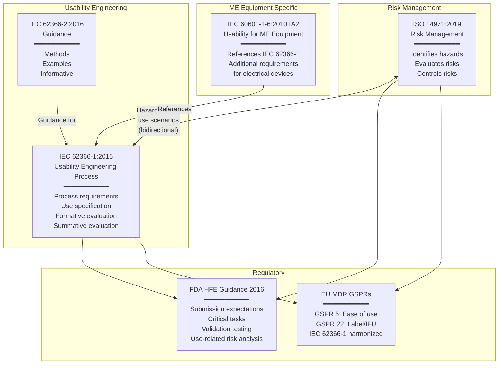

# Usability Engineering for Medical Devices — IEC 62366-1:2015

**Topic:** Usability engineering process for medical devices to minimize use errors and ensure safe, effective use  
**Standard:** IEC 62366-1:2015 + Amd 1:2020; IEC 62366-2:2016 (Guidance); IEC 60601-1-6:2010+A2:2020 (Usability for ME equipment); FDA HFE Guidance (2016)  
**SDO:** IEC/TC 62/SC 62A; FDA/CDRH  
**Audience:** Human factors engineers, usability specialists, medical device UX designers, regulatory affairs, software developers, risk engineers  
**Prerequisites:** ISO 14971 risk management basics, medical device development lifecycle, user-centered design principles

---

## Chapter 1 — Historical Context & Origin Story

### 1.1 Timeline

| Year | Event | Significance |
|------|-------|-------------|
| 1993 | FDA begins tracking use-error-related adverse events | Data shows >50% of medical device recalls involve use error |
| 2000 | ANSI/AAMI HE75 published | Human factors engineering guidance for medical devices (US) |
| 2001 | IEC 60601-1-6:2001 | First international usability standard for medical electrical equipment |
| 2007 | **IEC 62366:2007** published | First standalone usability engineering standard for medical devices |
| 2009 | FDA Draft Human Factors Guidance | FDA outlines expectations for HFE in submissions |
| 2010 | IEC 60601-1-6:2010 (Ed. 3.1) | Updated; references IEC 62366 process |
| 2015 | **IEC 62366-1:2015** published | Major revision; process standard (Part 1); separated from guidance (Part 2) |
| 2016 | **FDA HFE Guidance (Final)** | "Applying Human Factors and Usability Engineering to Medical Devices" — comprehensive FDA expectations |
| 2016 | IEC 62366-2:2016 | Guidance document (informative; examples; usability methods) |
| 2020 | IEC 62366-1:2015/Amd 1:2020 | Amendment addressing digital health; SaMD; AI/ML interfaces; accessibility |
| 2020 | IEC 60601-1-6:2010+A2:2020 | Updated for medical electrical equipment usability |
| 2022 | EU MDR full application | GSPR 5 (ease of use) and GSPR 22 (information) mandate usability |
| 2023 | FDA updated HFE review criteria | More stringent review of HFE/UE submissions; increased RTA for missing HFE |
| 2024 | IEC 62366-1 Edition 2 development | Addressing: digital health; AI/ML interfaces; accessibility; remote use; patient-operated devices |

### 1.2 Why Usability Engineering Matters

| Statistic | Source |
|-----------|--------|
| Use errors contribute to **60-70% of medical device recalls** | FDA MAUDE database analysis |
| **50%+ of infusion pump problems** are use-error-related | FDA data; ECRI Institute |
| Nurse interruptions: **average 3-5 per medication administration** | Human factors research |
| **80% of adverse events** in anesthesia involve human error component | Anesthesia Patient Safety Foundation |
| Average clinician interacts with **5-10 different device interfaces** per shift | Workflow studies |

---

## Chapter 2 — Standard Architecture & Structure

### 2.1 IEC 62366-1:2015 Process Structure

| Clause | Title | Content |
|:------:|-------|---------|
| 1 | Scope | All medical devices (not just electrical); includes SaMD; includes accessories; includes IVDs |
| 2 | Normative references | ISO 14971; IEC 62366-2 (informative); IEC 60601-1-6 |
| 3 | Terms and definitions | 38 defined terms (use error, user interface, use scenario, etc.) |
| 4 | General requirements | Quality management system context; iteration; usability engineering file documentation |
| **5** | **Usability engineering process** | Core process requirements |
| 5.1 | Prepare USE SPECIFICATION | Intended users; intended uses; use environments; user interface characteristics |
| 5.2 | Identify USER INTERFACE characteristics related to safety | UI elements that could contribute to hazardous situations |
| 5.3 | Identify known or foreseeable HAZARDS and HAZARDOUS SITUATIONS | Use errors leading to harm; from risk management (ISO 14971) |
| 5.4 | Identify and describe HAZARD-RELATED USE SCENARIOS | Specific use scenarios where errors could cause harm |
| 5.5 | Select HAZARD-RELATED USE SCENARIOS for summative evaluation | Which critical scenarios to validate |
| 5.6 | Establish USER INTERFACE SPECIFICATION | Design requirements for the user interface |
| 5.7 | Establish USER INTERFACE EVALUATION PLAN | How to evaluate (formative and summative) |
| 5.8 | Perform USER INTERFACE design, implementation and FORMATIVE EVALUATION | Iterative design-evaluate cycles |
| 5.9 | Perform SUMMATIVE EVALUATION of USABILITY of the user interface | Final validation with representative users |
| 5.10 | Document USABILITY ENGINEERING FILE | Complete documentation |

### 2.2 Relationship Between Standards



### 2.3 Key Terminology

| Term | Definition | Example |
|------|-----------|---------|
| **Use error** | User action or lack of action that causes a different result than intended by manufacturer or expected by user | Nurse programs 10 mL/hr but device delivers 100 mL/hr due to decimal point confusion |
| **User interface** | All points of interaction between user and device | Screen display; buttons; alarms; labels; IFU; packaging; software UI |
| **Use specification** | Document describing: intended users, intended uses, use environments, user interface | "Intended users: registered nurses with ≥1 year critical care experience; Use environment: ICU with ambient noise 55-70 dB" |
| **Hazard-related use scenario** | Specific scenario where a use error could lead to a hazardous situation → harm | "During emergency bolus, nurse enters wrong dose due to time pressure and small touchscreen target" |
| **Formative evaluation** | Iterative evaluation during design (to improve design; NOT pass/fail) | Usability test with 5 nurses using prototype; identify confusion points; redesign |
| **Summative evaluation** | Final validation evaluation (pass/fail against predefined criteria) | Human factors validation test with 15 representative users; measure if critical tasks performed safely |
| **Close call / near miss** | Use error that did not result in harm but could have | Nurse noticed wrong dose before confirming; error detected and corrected |
| **Use difficulty** | User struggles but completes task correctly (may indicate design weakness) | User takes 45 seconds to find correct button (expected: 10 seconds); eventually succeeds |

---

## Chapter 3 — Technical Deep Dive

### 3.1 Use Specification Content

| Element | Content Required | Example (Infusion Pump) |
|---------|-----------------|------------------------|
| **Intended users** | Demographics; training; experience; physical characteristics; cognitive capabilities; language | Primary: registered nurses (critical care certified, 2+ years experience); Secondary: physicians (for programming complex protocols); Tertiary: patients (home infusion, trained by nurse educator) |
| **Intended uses** | All use scenarios the device is designed for | Program infusion rate; set up drug library; program bolus dose; respond to alarms; change IV bag; silence alarm; review infusion history |
| **Use environments** | Physical, social, organizational context | ICU: poor lighting (night shift); high noise (60-75 dB; alarms from other devices); frequent interruptions (average 3/hour); sterile gloves worn; time pressure during emergencies |
| **User interface elements** | All interaction points | Touchscreen (7" color); 3 physical buttons (power, silence, bolus); audio alarms (3 priority levels); visual indicators (LED status); display text (font sizes); packaging; IFU; training materials |
| **Hazardous situations (from risk)** | Use-error-related hazards identified per ISO 14971 | Over-infusion (10× dose); under-infusion (missed critical medication); free-flow; delayed alarm response; wrong drug/patient |

### 3.2 Use-Related Risk Analysis (URRA)

| Use Error | Root Cause | Hazardous Situation | Harm | Risk Level | Mitigation |
|-----------|-----------|--------------------:|------|:----------:|-----------|
| User enters 10× intended dose | Decimal point confusion; small numeric display; no verification step | Over-infusion | Organ damage; death | **Critical** | Dose limits in drug library; large numeric display; mandatory confirmation for doses exceeding threshold; "Are you sure?" for extreme values |
| User fails to respond to occlusion alarm | Alarm fatigue (>200 alarms/shift in ICU); alarm not audible over ambient noise; user desensitized | Delayed treatment; IV infiltration | Tissue damage; delayed therapy | **High** | Escalating alarm priority; distinct audio signature; remote alarm forwarding to nurse station; visual escalation (blinking RED) |
| User programs wrong drug concentration | Multiple drug concentrations available; confusing selection interface | Wrong dose delivered (too high or too low) | Therapeutic failure or toxicity | **High** | Pre-programmed drug library (hospital-specific); barcode-verified drug selection; large clear display of concentration; confirmation screen showing final delivery rate |
| User connects wrong IV line to pump | Similar-looking connectors; poor labeling; night shift (low light) | Wrong drug delivered; incompatible mixture | Adverse drug event | **Moderate** | Distinct connector colors per line; tactile differentiation; trace-line from bag to pump visible; NFC/RFID line identification |

### 3.3 Formative Evaluation Methods

| Method | When to Use | Participants | Output |
|--------|------------|:------------:|--------|
| **Heuristic evaluation** | Early design; before user testing | 3-5 usability experts | List of usability issues rated by severity; design recommendations |
| **Cognitive walkthrough** | Early-mid design; task-flow analysis | UE team + clinical experts | Step-by-step analysis of user goals/actions/feedback at each step; identify gaps |
| **Think-aloud usability test** | Mid design; prototype available | 5-8 representative users | Observed difficulties; error patterns; user mental models; design improvements |
| **Simulated-use formative test** | Mid-late design; functional prototype | 8-12 representative users per user group | Task success rates; error patterns; time-on-task; user feedback; design iterations |
| **Contextual inquiry** | Early (understanding current workflow) | Observe 5-10 users in actual use environment | Workflow patterns; workarounds; environmental constraints; user needs |
| **Expert review** | Any stage; quick assessment | 2-3 domain experts (clinical + HFE) | Expert assessment of critical interactions; comparison to best practices |

### 3.4 Summative Evaluation (Human Factors Validation Testing)

| Element | Requirement | Detail |
|---------|-------------|--------|
| **Participants** | Representative of intended users; adequate sample per user group | Minimum 15 per user group (FDA expects 15-25); demographics matching intended user profile; varying experience levels within target range |
| **Test environment** | Simulated use environment matching real conditions | Simulated ICU with: realistic lighting; ambient noise (60-70 dB); interruptions (scripted); time pressure scenarios; equipment present; gloves worn |
| **Tasks** | All critical tasks (hazard-related use scenarios) + representative sample of routine tasks | Critical: programming high-alert medication; responding to critical alarm; emergency bolus; recognizing air-in-line. Routine: power on; basic programming; bag change; history review |
| **Scenarios** | Realistic clinical scenarios with context | "Patient is 72 years old, post-surgery, NPO, needs IV heparin at 1200 units/hour. Doctor gives verbal order during rounds. Another patient's alarm is sounding." |
| **Success criteria** | Pre-defined pass/fail criteria per task; acceptable error rates | Critical tasks: zero use errors that reach patient (close calls acceptable if caught by design safeguards); Routine tasks: <5% use error rate; all errors recoverable |
| **Observations** | Blinded observers record: task completion; errors; close calls; difficulties; time | Data collection form per participant per task; video recording for post-hoc analysis |
| **Analysis** | Root cause analysis of any use error; assessment against criteria; overall conclusion | Use error: identify root cause; determine if design adequate or needs modification; residual risk analysis |
| **Documentation** | Complete report including: methods; participants; results; use errors; root cause analysis; risk assessment; conclusion (pass/fail) | Part of usability engineering file; submitted to regulatory body |

---

## Chapter 4 — Implementation Guide

### 4.1 Usability Engineering File (UEF) Contents

| Document | IEC 62366-1 Reference | FDA Expectation |
|----------|:---:|---|
| Use specification | 5.1 | Required (describes intended users, uses, environments) |
| Use-related risk analysis (URRA) | 5.2, 5.3, 5.4 | Required (critical tasks identified; use errors mapped to hazards) |
| Hazard-related use scenarios | 5.4, 5.5 | Required (specific scenarios for validation) |
| User interface specification | 5.6 | Expected (design requirements for UI) |
| User interface evaluation plan | 5.7 | Required (formative + summative plan) |
| Formative evaluation reports | 5.8 | Expected (iterative testing evidence; design evolution rationale) |
| **Summative evaluation report** (HF Validation) | 5.9 | **Required** (final validation; pass/fail determination; use error analysis) |
| Residual risk assessment | 5.9, links to ISO 14971 | Required (any remaining use-error-related risks acceptable?) |
| Usability engineering file summary | 5.10 | Required for submission (overview of UE process and findings) |

### 4.2 Integration with Design Controls (FDA 21 CFR 820)

```mermaid
graph LR
    subgraph "Design Controls (820.30)"
        DI[Design Input<br/>━━━━━━━━━━━<br/>User needs<br/>Use specification<br/>UI requirements]
        DO[Design Output<br/>━━━━━━━━━━━<br/>Device design<br/>UI design<br/>Labeling]
        DV[Design Verification<br/>━━━━━━━━━━━<br/>Formative evaluations<br/>Heuristic reviews<br/>Expert assessments]
        DVA[Design Validation<br/>━━━━━━━━━━━<br/>Summative evaluation<br/>HF validation test<br/>Simulated use]
        DR[Design Review<br/>━━━━━━━━━━━<br/>UE process review<br/>Risk-benefit assessment<br/>Residual risk acceptance]
    end
    
    subgraph "Usability Engineering (IEC 62366-1)"
        US[Use Specification (5.1)]
        URRA[Use-Related Risk Analysis (5.2-5.4)]
        UI_SPEC[UI Specification (5.6)]
        FORM[Formative Evaluation (5.8)]
        SUMM[Summative Evaluation (5.9)]
    end
    
    US --> DI
    URRA --> DI
    UI_SPEC --> DO
    FORM --> DV
    SUMM --> DVA
    URRA --> DR
```

### 4.3 Applying IEC 62366-1 to Software/SaMD

| UI Element | Usability Considerations | Common Use Errors |
|-----------|------------------------|-------------------|
| **Touchscreen interface** | Touch target size (≥9mm per ISO 9241-9); spacing between targets; glove compatibility; parallax; viewing angle; brightness in various lighting | Mis-taps (adjacent button); inability to activate with gloves; invisible targets in bright light |
| **Clinical dashboards** | Information hierarchy; critical data prominence; alarm visibility; scan pattern; cognitive load; information density | Missed critical value (buried in data); misread trending direction; alert fatigue |
| **Data entry** | Input method (keyboard, picker, slider); validation feedback; error prevention; units clarity; decimal handling | Wrong units (mg vs. mcg); decimal place error; transposition; wrong patient selected |
| **Navigation** | Depth of menu; breadcrumbs; workflow sequence; emergency access; undo capability | Lost in menus during emergency; can't find critical function; accidentally exit workflow |
| **Alarms/notifications** | Discriminability; priority encoding (audio + visual); actionability; escalation; silencing policy | Alarm fatigue → missed critical alarm; wrong priority interpretation; inappropriate silencing |
| **Accessibility** | Color blindness (8% males); font size; contrast ratio; screen reader compatibility; motor impairment accommodation | Color-only status indicators missed by colorblind users; small text unreadable |

---

## Chapter 5 — Regulatory Expectations

### 5.1 FDA HFE Submission Requirements

| Device Risk | FDA Expectation | Documentation Required |
|:-----------:|:----------------:|----------------------|
| Low risk (Class I; simple interface) | May not require full HFE testing | Basic use-related risk analysis; rationale for not performing validation testing |
| Moderate risk (Class II; typical devices) | Full usability engineering process expected | Use specification; URRA; formative evaluation evidence; summative evaluation report |
| High risk (Class III; complex or novel interfaces) | Comprehensive HFE expected; higher scrutiny | Full UEF; multiple formative rounds documented; robust summative evaluation; detailed root cause analysis |
| Novel user interface | Always requires full HFE | New interaction paradigm → higher uncertainty → more rigorous testing needed |

### 5.2 FDA Review Criteria for HFE Submissions

| What FDA Looks For | Red Flags (may lead to additional questions or RTA) |
|-------------------|---------------------------------------------------|
| Critical tasks identified and tested | Missing critical tasks; incomplete task analysis |
| Representative users (adequate N; correct profile) | Too few participants (<15); wrong user profile; single user group when multiple exist |
| Realistic use conditions | Testing in ideal conditions only (no noise, no interruptions, no time pressure, no gloves) |
| Use errors analyzed with root cause | Use errors observed but not analyzed; blamed on user ("training issue") rather than design |
| Residual risk acceptable | Critical use errors observed in summative test without adequate mitigation or risk justification |
| Design iteration evidence | Jumping from concept directly to summative without formative evaluation; no design evolution |
| Knowledge-based tasks (IFU/training) addressed | Relying entirely on training to prevent use errors without design mitigation |

### 5.3 EU MDR Requirements Related to Usability

| GSPR | Requirement | IEC 62366-1 Mapping |
|:----:|------------|:---:|
| GSPR 5 | "Reduce as far as possible the risks linked to the possible negative interaction between the software and the IT environment" + "easy to use" | Entire IEC 62366-1 process |
| GSPR 14.1 | "Designed and manufactured to reduce... risks connected with reasonably foreseeable environmental conditions" | Use specification (5.1): use environment |
| GSPR 14.2 (d) | "Reduce as far as possible the risks of use error" | Core objective of IEC 62366-1 |
| GSPR 22 | Information supplied by manufacturer (labeling, IFU) | UI specification includes labeling; summative includes IFU comprehension testing |
| GSPR 23.4(ab) | Information for user; instructions for use content | IFU is part of user interface; tested in usability evaluation |
| Annex I, 17.4 | "Instructions for use shall contain... any residual risks..." | Residual use-error risks communicated to users |

---

## Chapter 6 — Regional Context

### 6.1 Usability Requirements by Region

| Region | Standard | Key Differences |
|--------|----------|----------------|
| US (FDA) | FDA HFE Guidance (2016) + IEC 62366-1 (recognized) | Most prescriptive about validation testing (N=15 minimum explicitly stated); "critical tasks" concept central; detailed submission expectations; frequently requests additional HFE data |
| EU | IEC 62366-1:2015+A1 (harmonized under MDR) | Part of essential requirements (GSPR 5, 14, 22); Notified Body reviews UEF; less prescriptive about exact N but expects adequate justification |
| Canada | IEC 62366-1 (recognized) + HC guidance | Aligned with FDA approach; MDSAP audit may review UEF |
| Japan | JIS T 62366-1 (identical adoption of IEC) | PMDA reviews UEF; Japanese language testing if marketed in Japan |
| International | IEC 62366-1:2015+A1:2020 | Global baseline; regional regulators may add requirements |

### 6.2 Cultural and Regional Considerations

| Factor | Impact on Usability | Mitigation |
|--------|--------------------|-----------| 
| **Language** | Instructions, labels, error messages must be understood | Localization testing; translation validation; symbol use (ISO 15223 symbols reduce language dependency) |
| **Reading direction** | RTL languages affect screen layout, navigation flow, progress indicators | Mirrored layouts for RTL locales; bidirectional text handling; test with RTL users |
| **Color meaning** | Red/green meanings vary culturally; color blindness prevalence varies by population | Don't rely on color alone; redundant coding (shape + color + text); test with colorblind participants |
| **Symbol comprehension** | Symbol interpretation varies (e.g., ⚠️ vs ⊘ vs ✕) | Comprehension testing per ISO 15223-1:2021 (symbol must be understood by ≥66.7% of respondents) |
| **Clinical workflows** | Hospital workflows vary by region; nursing scope of practice differs | Region-specific use specification; local workflow observation; regional validation testing |

---

## Chapter 7 — Comparison

### 7.1 IEC 62366-1 vs. FDA HFE Guidance

| Dimension | IEC 62366-1:2015 | FDA HFE Guidance (2016) |
|-----------|:---:|:---:|
| Type | International standard (normative) | Guidance document (non-binding but enforced) |
| Scope | All medical devices | All devices subject to HFE review (Class II/III; novel UI) |
| Process vs. output | Process-focused (DO these steps) | Output-focused (SHOW these results in submission) |
| Critical tasks | "Hazard-related use scenarios" | "Critical tasks" (same concept, different terminology) |
| Sample size | Does not prescribe specific N | Explicitly states ≥15 per user group for validation |
| Formative evaluation | Required (iterative; demonstrated process) | Expected (evidence of design evolution) |
| Summative evaluation | Required | Required (called "human factors validation testing") |
| Risk integration | References ISO 14971 (bidirectional) | "Use-related risk analysis" (integrated with device risk) |
| Documentation | "Usability engineering file" | "HFE/UE report" in premarket submission |
| Training as control | Allowed if justified; should not be sole mitigation | Same; training alone insufficient for critical use errors |

### 7.2 IEC 62366-1 vs. General UX Standards (ISO 9241)

| Dimension | IEC 62366-1 (Medical) | ISO 9241-210 (General UX) |
|-----------|:---:|:---:|
| Domain | Medical devices only | Any interactive system |
| Primary goal | **Patient safety** (prevent use errors → prevent harm) | User satisfaction + effectiveness + efficiency |
| Risk focus | Central (use errors → hazardous situations → harm) | Quality attribute (not safety-critical focus) |
| Regulatory | Mandatory for medical device market access | Voluntary; best practice |
| Evaluation rigor | Summative validation with pass/fail criteria; simulated clinical conditions | Varies; often informal usability testing |
| Documentation | Formal usability engineering file; regulatory submission | Design documentation; varies by organization |
| Users | Specific medical professionals + patients (defined in use specification) | General users (personas; user groups) |
| Environment | Clinical environment (stressful; noisy; time-critical; life-at-stake) | General use environments |
| "Good enough" | Not applicable — safety-critical tasks must be validated | Acceptable for iterative improvement |

---

## Chapter 8 — Mermaid Architecture Diagrams

### 8.1 Usability Engineering Process Flow

```mermaid
graph TB
    subgraph "Phase 1: Analysis"
        USE_SPEC[Use Specification<br/>━━━━━━━━━━━<br/>• Intended users<br/>• Intended uses<br/>• Use environments<br/>• UI characteristics]
        
        URRA[Use-Related Risk Analysis<br/>━━━━━━━━━━━<br/>• Identify use errors<br/>• Map to hazardous situations<br/>• Assess harm potential<br/>• Identify critical tasks]
        
        HRUS[Hazard-Related Use Scenarios<br/>━━━━━━━━━━━<br/>• Specific scenarios<br/>• User + task + environment<br/>• Error pathway to harm<br/>• Select for summative testing]
    end
    
    subgraph "Phase 2: Design"
        UI_SPEC[UI Specification<br/>━━━━━━━━━━━<br/>• Design requirements<br/>• UI standards/guidelines<br/>• Interaction patterns<br/>• Alarm design<br/>• Error prevention]
        
        UI_DESIGN[UI Design & Implementation<br/>━━━━━━━━━━━<br/>• Wireframes → Prototypes<br/>• Visual design<br/>• Interaction design<br/>• Alarm design<br/>• Label/IFU design]
    end
    
    subgraph "Phase 3: Formative Evaluation (Iterative)"
        FORM_EVAL[Formative Evaluation<br/>━━━━━━━━━━━<br/>• Expert review<br/>• Cognitive walkthrough<br/>• Usability testing (5-12 users)<br/>• Identify problems<br/>• NOT pass/fail]
        
        REDESIGN[Design Iteration<br/>━━━━━━━━━━━<br/>• Address findings<br/>• Improve design<br/>• Re-evaluate if needed<br/>• Document rationale]
    end
    
    subgraph "Phase 4: Summative Evaluation"
        SUMM_EVAL[Summative Evaluation<br/>━━━━━━━━━━━<br/>• 15+ users per group<br/>• Realistic conditions<br/>• All critical tasks<br/>• Pass/fail criteria<br/>• Root cause analysis]
    end
    
    subgraph "Phase 5: Documentation"
        UEF[Usability Engineering File<br/>━━━━━━━━━━━<br/>• All above documents<br/>• Evidence of iteration<br/>• Final risk assessment<br/>• Residual risk acceptable?<br/>• Regulatory submission]
    end
    
    USE_SPEC --> URRA --> HRUS
    HRUS --> UI_SPEC --> UI_DESIGN
    UI_DESIGN --> FORM_EVAL
    FORM_EVAL --> REDESIGN
    REDESIGN -->|"Iterate"| UI_DESIGN
    REDESIGN -->|"Design adequate"| SUMM_EVAL
    SUMM_EVAL -->|"Pass"| UEF
    SUMM_EVAL -->|"Fail (critical use errors)"| REDESIGN
```

### 8.2 Use Error Analysis Framework

```mermaid
graph TB
    subgraph "User Action Chain"
        PERCEP[Perception<br/>━━━━━━━━━━━<br/>User perceives information<br/>(sees display; hears alarm;<br/>feels button)]
        
        COGNIT[Cognition<br/>━━━━━━━━━━━<br/>User interprets information<br/>(understands meaning;<br/>forms intention;<br/>plans action)]
        
        ACTION[Action<br/>━━━━━━━━━━━<br/>User executes action<br/>(presses button;<br/>enters value;<br/>connects tube)]
    end
    
    subgraph "Error Types (at each stage)"
        PERR[Perception Error<br/>━━━━━━━━━━━<br/>• Didn't see alarm (small; dim)<br/>• Didn't hear alarm (noisy)<br/>• Misread display (font; contrast)<br/>• Didn't notice status change]
        
        CERR[Cognitive Error<br/>━━━━━━━━━━━<br/>• Misinterpreted information<br/>• Wrong mental model<br/>• Memory slip (forgot step)<br/>• Decision error (wrong choice)<br/>• Confusion (similar options)]
        
        AERR[Action Error<br/>━━━━━━━━━━━<br/>• Pressed wrong button (adjacent)<br/>• Entered wrong value (slip)<br/>• Connected wrong port<br/>• Dropped/fumbled (gloves)]
    end
    
    subgraph "Design Solutions"
        PFIX[Perception Solutions<br/>━━━━━━━━━━━<br/>• Larger display<br/>• Higher contrast<br/>• Louder/distinct alarm<br/>• Redundant modality<br/>(audio + visual + haptic)]
        
        CFIX[Cognition Solutions<br/>━━━━━━━━━━━<br/>• Clear labeling<br/>• Consistent mapping<br/>• Reduced options<br/>• Decision support<br/>• Confirmation dialogs]
        
        AFIX[Action Solutions<br/>━━━━━━━━━━━<br/>• Larger touch targets<br/>• Physical guards<br/>• Error-proof connectors<br/>• Undo capability<br/>• Glove-compatible controls]
    end
    
    PERCEP --> PERR --> PFIX
    COGNIT --> CERR --> CFIX
    ACTION --> AERR --> AFIX
    
    PERCEP --> COGNIT --> ACTION
```

---

## Chapter 9 — Case Studies

### 9.1 Case Study: Infusion Pump 10× Dose Error

| Aspect | Detail |
|--------|--------|
| Problem | Hospital reported 5 instances of 10× overdose with a specific infusion pump; 2 patients experienced serious adverse events; 1 fatality |
| Root cause analysis | (1) Numeric entry used scrolling digit method (each digit independently scrollable). (2) Display showed dose as "10.0" mL/hr (small font; no emphasis on decimal). (3) When nurse intended to program "1.0 mL/hr" → accidentally scrolled ones digit to "10" → display showed "10.0 mL/hr" → decimal position not visually prominent. (4) No confirmation screen for doses exceeding normal range. (5) Use environment: night shift (fatigue); multiple pumps programmed sequentially; interruption between programming steps. |
| Usability failures | (1) **Perception**: decimal point too small; no color/size differentiation for clinically significant digits. (2) **Cognition**: no "does this seem right?" validation; no drug-dose clinical sense check. (3) **Action**: scrolling mechanism made it easy to overshoot; no detent/click at "1" boundaries. (4) **System**: no dose limit guard rails; no soft stop for 10× normal dose. |
| Design improvement (post-recall) | (1) Large, prominent dose display with units: **10.0 mL/hr** → clinically meaningful: "Heparin: 1000 units/hr" (show both rate AND clinical dose). (2) Drug library integration: dose exceeding 120% of normal range → mandatory "CONFIRM UNUSUAL DOSE" screen (yellow warning, requires specific confirmation action). (3) New numeric entry: direct keypad entry (not scrolling) with immediate validation. (4) Confirmation screen: shows programmed dose in LARGE text with drug name, concentration, patient weight, comparison to normal range. (5) Decimal handling: large decimal point; color-coded digit significance; "1.0" vs "10" visually VERY different. |
| Regulatory action | FDA recall (Class I); post-recall: new 510(k) with comprehensive HFE validation testing; summative evaluation specifically testing 10× error scenarios; 25 nurses in simulated ICU; zero 10× errors in validation |

### 9.2 Case Study: SaMD (Software as Medical Device) Usability

| Aspect | Detail |
|--------|--------|
| Device | Clinical decision support software for sepsis detection (SaMD Class II); integrates with EHR; alerts clinicians to potential sepsis |
| Usability challenge | Initial deployment: 89% alert override rate (clinicians dismissed almost all sepsis alerts); 45% of true sepsis cases were dismissed |
| Root cause (HFE analysis) | (1) **Alert fatigue**: system generated 50+ alerts per nurse per shift; most were false positives (PPV 12%); indistinguishable from other EHR alerts. (2) **Poor information hierarchy**: alert showed only "Possible Sepsis" with no supporting data; clinician had to navigate away from current workflow to investigate. (3) **Workflow disruption**: alert required immediate response (modal popup blocking workflow); no option to "acknowledge and investigate later." (4) **Lack of trust**: after experiencing many false positives, clinicians developed learned behavior of dismissing automatically. |
| Design iteration (3 formative rounds) | **Round 1**: Reduced alert frequency (improved algorithm → PPV from 12% to 35%; sensitivity maintained ≥90%). Switched from modal popup to non-modal notification (banner within workflow). Result: override rate dropped to 60%. **Round 2**: Added supporting information IN the alert (vital signs trend, lab values, SOFA score components) — clinician can assess without navigating away. Added visual severity indicator (color-coded risk score). Result: override rate 40%; appropriate response improved. **Round 3**: Added "intelligent timing" (alert appears during natural workflow pauses, not during critical tasks); added "defer" option (remind in 15 minutes if patient status unchanged); added one-click pathway to sepsis bundle order set. Result: override rate 25%; true sepsis missed rate <5%. |
| Summative evaluation | 20 nurses + 10 physicians; simulated clinical scenarios (10 with sepsis, 10 without); embedded alert testing in realistic workflow simulation with multiple patients and competing priorities |
| Results | Sensitivity (clinician response to true sepsis alerts): 92%; Specificity (not acting on false alerts): 78%; Time-to-intervention improved 45 minutes vs. no-AI control group; User satisfaction: 4.1/5.0 (vs. 1.8/5.0 for original design) |
| Lesson | Usability engineering is not just about individual screens — it's about workflow integration. An alert system with high sensitivity but poor usability can HARM patients by causing alert fatigue and missed true positives. |

---

## Chapter 10 — Future Evolution

| Trend | Timeline | Impact |
|-------|----------|--------|
| **Accessibility requirements** | Now-2025 | IEC 62366-1 Ed. 2 expected to strengthen accessibility (WCAG-aligned for SaMD; motor/vision/hearing accommodation); EU Accessibility Act (2025) |
| **AI/ML interface usability** | Now | How to communicate AI confidence/uncertainty to users; explainability UI; calibrated trust; automation bias mitigation through design |
| **Patient-operated devices** (home use) | Growing | Lay users (no clinical training); health literacy challenges; aging population; diverse environments; less support available |
| **Remote use / telemedicine** | Now | User interface across network latency; remote monitoring UI; patient-facing telehealth interfaces; asynchronous communication design |
| **Voice interfaces** | 2024+ | Voice-controlled devices in sterile environments; hands-free operation; ambient noise challenges; multilingual |
| **AR/VR in surgery** | 2024-2028 | Heads-up displays; surgical navigation; spatial interfaces; new interaction paradigms; new error modes |
| **Wearable medical devices** | Now | Tiny screens or no screen; haptic feedback; ambient awareness; patient-facing; continuous wear; fashion considerations |
| **Inclusive design** | Now | Designing for diverse populations (age, ability, literacy, culture) from the start — not retrofitting |
| **Real-world evidence for usability** | 2025+ | Using deployment data (error logs, interaction patterns) to inform usability improvements post-market |
| **Digital companion apps** | Now | Multi-device ecosystems (implant + app + cloud); usability across entire ecosystem, not just one device |

---

## Chapter 11 — Interview Questions & Career Guide

### Tier 1: Entry-Level

**Q1:** What is the difference between a "use error" and a "device malfunction," and why does it matter for usability engineering?  
**A:** A **use error** is when the user performs (or fails to perform) an action that leads to a different result than intended by the manufacturer OR expected by the user. Critically: the device works correctly — it does exactly what the user told it to do — but the user's action was unintended. Example: nurse programs pump to deliver 100 mL/hr instead of intended 10 mL/hr. The pump is functioning correctly (delivering exactly 100 mL/hr); the error is in the user's programming action. A **device malfunction** is when the device itself fails to perform as designed/specified. Example: pump is programmed for 10 mL/hr but mechanical failure causes it to deliver 100 mL/hr. The device has a hardware/software defect. **Why it matters**: (1) Different root cause → different solution. Use errors are addressed through usability engineering (better interface design, clearer information, error prevention); malfunctions are addressed through engineering quality (design verification, reliability, quality controls). (2) Regulatory: IEC 62366-1 addresses use errors; IEC 60601-1 / ISO 14971 addresses both. FDA tracks use-error-related adverse events separately. (3) Legal: manufacturers are responsible for reasonably foreseeable use errors (must design to prevent them); not responsible for intentional misuse or use errors that couldn't be foreseen. (4) Important note: "abnormal use" (intentional misuse; use clearly outside instructions) is NOT a use error and is NOT within scope of usability engineering. But "foreseeable misuse" (user uses device in unintended but predictable way) MAY need to be addressed.

**Q2:** Explain the difference between formative and summative evaluation in usability engineering.  
**A:** **Formative evaluation** = evaluations done DURING design to IMPROVE the design. Not pass/fail. Purpose: find usability problems; understand user behavior; iterate design. Characteristics: smaller sample (5-12 users); multiple rounds; uses prototypes (paper, digital, early functional); exploratory (what problems exist?); findings feed into design changes. Methods: think-aloud testing; heuristic evaluation; cognitive walkthrough. Outcome: list of usability issues → design changes → re-evaluate. **Summative evaluation** = final evaluation done on the FINISHED design to VALIDATE it meets safety/usability requirements. Pass/fail. Purpose: demonstrate that critical tasks can be performed safely by intended users in intended environments. Characteristics: larger sample (≥15 per user group per FDA); one test (on final design); uses final or near-final device; confirmatory (does it pass predefined criteria?); simulated real conditions. Methods: simulated-use testing in realistic environment with realistic scenarios. Outcome: evidence that design is safe for use; or evidence that redesign is needed (if critical use errors found). **Analogy**: Formative = practice exams (learn and improve); Summative = final exam (pass or fail). You would NEVER skip formative evaluation and go straight to summative — that risks failing validation (expensive redesign) because problems weren't caught and fixed earlier.

### Tier 2: Mid-Level

**Q3:** How would you design and execute a summative (human factors validation) study for a new insulin pen injector device intended for patient self-administration?  
**A:** Summative study design for insulin pen: **Use specification review**: Intended users: adult Type 2 diabetes patients (age 40-85; varying dexterity; varying vision; varying health literacy; may have neuropathy affecting hand sensation); Use environment: home (varied lighting; no clinical supervision; possible distractions); Critical tasks: dose dialing; injection technique; needle attachment/disposal; dose reading; storage; cartridge change. **Participant recruitment** (N=15-25): match demographics (age distribution 40-85; include elderly ≥65; include patients with mild dexterity limitations; include patients with mild visual impairment correctable with glasses; varying diabetes experience: new diagnosis to 10+ years; varying injection experience: some currently on injections, some naïve). **Test environment**: simulated home environment (kitchen table; typical home lighting); NO clinical staff present during task performance (mirrors home use); realistic injection (subcutaneous injection pad; realistic needle). **Task list**: (1) Unbox device and prepare for first use (read quick start guide). (2) Attach needle. (3) Prime device (air shot). (4) Dial prescribed dose (physician says "Take 24 units before dinner"). (5) Perform injection (correct technique: site selection, skin fold/flat, inject, hold 10 seconds, remove). (6) Dispose of needle safely. (7) Dial different dose for second scenario. (8) Recognize dose error and correct. (9) Read remaining insulin amount. (10) Change cartridge. **Scenarios**: realistic clinical context ("Your doctor prescribed 24 units of insulin before dinner. You've just finished cooking. Please prepare and give yourself the injection."). **Success criteria**: Critical tasks (dose dialing, injection): zero errors that would result in wrong dose delivered or unsafe injection. Non-critical: <10% difficulty rate. Dose accuracy: ±2 units of intended dose. IFU comprehension: ≥90% correct first-use setup without assistance. **Data collection**: video recording (hand close-up); observer records: task completion (Y/N), errors (type, severity), close calls, difficulties, time; post-test questionnaire (SUS; confidence ratings); post-test interview (understanding of device; concerns). **Analysis**: tabulate all use errors; categorize by severity (reached patient vs. caught/corrected); root cause analysis for any error; compare to success criteria; residual risk assessment (are remaining risks acceptable given benefit?).

### Tier 3: Senior

**Q4:** Your company has received 50 use-error-related complaints in the first year post-launch for a surgical navigation system. How do you assess whether the existing usability engineering was adequate and what corrective actions to take?  
**A:** [Comprehensive answer covering: (1) **Complaint analysis**: categorize all 50 complaints by: task involved, error type (perception/cognition/action), severity (near-miss vs. patient impact), user type, use environment, device version. Look for patterns — is it 50 unique errors or 5 recurring error patterns? Pareto analysis: which error types account for most complaints? (2) **Compare to UEF**: review original summative evaluation — were these error patterns tested? If yes: did they occur during validation? If no: were they foreseeable? Should use specification have identified this scenario? Gap in hazard analysis? (3) **Root cause categories**: (a) Design deficiency not caught in evaluation (validation sample too small; scenarios not realistic enough; test environment didn't simulate actual surgical conditions). (b) New use pattern not anticipated (users using device differently than intended; new surgical technique; different user population than specified). (c) Training deficiency (device relies on training that isn't being delivered effectively post-market). (d) Environmental factor (use environment differs from specification — e.g., new OR lighting/layout). (4) **Immediate actions**: if safety-critical: field safety corrective action (FSCA); safety communication to users; interim training/advisory. If not immediately dangerous: enhanced post-market surveillance; accelerated investigation. (5) **Corrective actions (CAPA)**: if design deficiency: redesign per IEC 62366-1 process (formative → summative → release update); if training: revise training with validation of training effectiveness; if specification gap: update use specification; repeat risk analysis; assess if summative evaluation adequate. (6) **Systemic improvements**: strengthen post-market usability monitoring (complaint analysis system designed to capture use error details); consider field usability study (observe actual use in real OR); implement proactive post-market formative evaluation (contextual inquiry at customer sites); revise usability process for future products (lesson learned). (7) **Regulatory**: report to FDA (MDR if serious); document in risk management file; PMS report (EU); CAPA closure with evidence of effectiveness.]

---

## Chapter 12 — Cheat Sheet & Quick Reference

### IEC 62366-1 Process Steps

```
5.1  USE SPECIFICATION         → Who, what, where (users, uses, environments)
5.2  UI CHARACTERISTICS        → Which UI elements relate to safety
5.3  HAZARDS                   → What can go wrong (from ISO 14971)
5.4  HAZARD-RELATED SCENARIOS  → Specific error scenarios causing harm
5.5  SELECT FOR SUMMATIVE      → Which scenarios to validate
5.6  UI SPECIFICATION          → Design requirements
5.7  EVALUATION PLAN           → How to test (formative + summative plan)
5.8  DESIGN + FORMATIVE        → Build and iteratively evaluate (NOT pass/fail)
5.9  SUMMATIVE EVALUATION      → Final validation (pass/fail; 15+ users; realistic)
5.10 USABILITY ENGINEERING FILE → Document everything
```

### Use Error Categories

```
PERCEPTION errors:    Didn't see / hear / feel the information
COGNITION errors:     Misunderstood / forgot / chose wrong option
ACTION errors:        Pressed wrong button / entered wrong value / connected wrong port
```

### Summative Evaluation Checklist

```
□ Representative users (≥15 per group; demographics match use specification)
□ Realistic use environment (lighting, noise, interruptions, time pressure, PPE)
□ All critical tasks included (hazard-related use scenarios)
□ Realistic clinical scenarios (not just isolated tasks)
□ Pre-defined pass/fail criteria (per task; per error type)
□ Observers trained and blinded (don't coach participants)
□ Root cause analysis for every use error observed
□ Residual risk assessment (errors that still occurred → acceptable?)
□ Complete report (methods, participants, results, analysis, conclusion)
```

### FDA HFE Quick Reference

```
FDA expects:
• Use-related risk analysis (URRA) identifying critical tasks
• Evidence of iterative design (formative evaluations)
• Human factors validation test (≥15 per user group)
• Realistic simulated-use conditions
• Root cause analysis of all observed use errors
• Conclusion: residual use-related risks acceptable
• NOT acceptable: "we'll train users" as sole mitigation for design problems
```

### Key Design Principles (Preventing Use Errors)

```
VISIBILITY:        Make important information visible and prominent
FEEDBACK:          Confirm user actions immediately and clearly
CONSTRAINT:        Physically/logically prevent dangerous actions
MAPPING:           Controls match their effects intuitively
CONSISTENCY:       Same action = same result everywhere in UI
FORGIVENESS:       Allow undo; confirm destructive actions; prevent irreversible errors
SIMPLICITY:        Minimum steps for critical tasks; reduce cognitive load
REDUNDANCY:        Multiple channels (audio + visual + haptic) for critical information
```

---

*End of Document — 11_Usability_IEC_62366.md*
