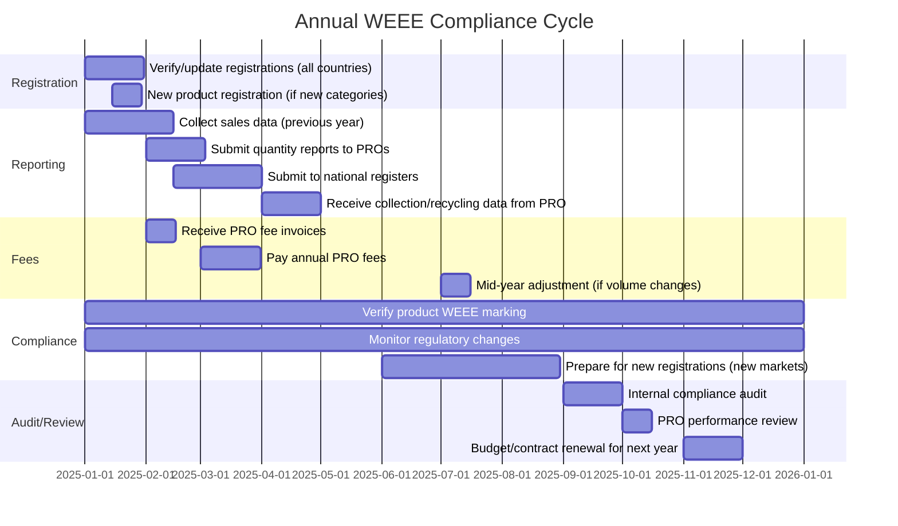

# WEEE Directive — Extended Producer Responsibility for Electronics

**Topic:** EU Waste Electrical and Electronic Equipment Directive — producer registration, collection/recycling targets, marking requirements, and compliance schemes  
**Standard:** EU Directive 2012/19/EU (WEEE recast); implementing regulations per EU member state  
**SDO:** European Commission DG ENV; Member State environment agencies  
**Audience:** Environmental compliance managers, product stewardship teams, producer responsibility organizations (PROs), electronics manufacturers, importers, distributors  
**Prerequisites:** EU product regulatory basics, supply chain concepts, environmental management fundamentals

---

## Chapter 1 — Historical Context & Origin Story

### 1.1 Timeline

| Year | Event | Significance |
|------|-------|-------------|
| 1991 | Germany Packaging Ordinance (first EPR law globally) | Pioneered Extended Producer Responsibility concept |
| 1998 | EU Commission WEEE directive proposal | Addressing growing e-waste stream (~6 Mt/year in EU) |
| 2002 | WEEE Directive (2002/96/EC) adopted | First EU e-waste directive; 10 categories; 4 kg/capita collection target |
| 2003 | Companion RoHS Directive (2002/95/EC) adopted | Material restriction + end-of-life = comprehensive approach |
| 2005 | WEEE enforcement in member states begins | National transposition; producer registration requirements |
| 2006 | First collection targets apply (4 kg/capita) | Infrastructure build-out; compliance schemes established |
| 2012 | **WEEE recast (2012/19/EU)** adopted | Increased targets; 6 simplified categories (from 2018); open scope; collection 45%→65% |
| 2014 | EU member states transpose recast WEEE | National implementing legislation updated |
| 2015 | Collection target: 45% of EEE placed on market (3 preceding years avg) | First percentage-based target (replaces kg/capita) |
| 2018 | Open scope applies; 6 new categories replace 10 old categories | Simplified categorization; more products in scope |
| 2019 | **Collection target: 65%** of EEE placed on market (or 85% of WEEE generated) | Ambitious target; most member states struggling to meet |
| 2020 | EU Circular Economy Action Plan | WEEE in context of broader circular economy strategy |
| 2022 | EU ESPR proposed (Ecodesign for Sustainable Products Regulation) | Right to repair; repairability scoring; linked to WEEE/design considerations |
| 2023 | EU Battery Regulation (2023/1542) | Separate battery EPR; battery passport; affects EEE with integrated batteries |
| 2024 | Digital Product Passport requirements developing | Will complement WEEE with design/material information |
| 2025+ | WEEE revision expected; integration with circular economy | Higher targets; better enforcement; design for recyclability mandatory |

### 1.2 E-Waste Scale

| Metric | Value (2023 estimates) | Trend |
|--------|:---------------------:|:-----:|
| Global e-waste generated | ~62 Mt/year | +2.5 Mt/year growth |
| EU e-waste generated | ~12 Mt/year | Growing |
| EU collection rate (average) | ~46% | Below 65% target |
| EU proper recycling rate | ~35-40% of generated | Below potential |
| Valuable materials in e-waste | €57 billion (gold, silver, copper, rare earths) | Increasing with complexity |
| CO₂ equivalent from improper disposal | ~98 Mt CO₂e/year globally | Significant |
| Countries meeting 65% target | ~5-8 (of 27 EU members) | Slow progress |

---

## Chapter 2 — Standard Architecture & Structure

### 2.1 WEEE Directive Structure (2012/19/EU)

| Article | Content | Key Points |
|:-------:|---------|-----------|
| 1-3 | Objectives, Scope, Definitions | Apply to all EEE (open scope from 2018); producer = manufacturer/importer/distance seller |
| 4-6 | Product design; Separate collection | Design for dismantling/recycling; separate collection infrastructure required |
| 7 | **Collection rate** | 65% of EEE placed on market (avg 3 preceding years) OR 85% of WEEE generated |
| 8-9 | **Treatment; Recovery** | Proper treatment at authorized facilities; recovery/recycling targets per category |
| 10-11 | Shipments; Permits for treatment | Waste shipment controls; treatment facility requirements |
| 12-13 | **Financing** | Producer finances collection/treatment for household WEEE; individual/collective schemes |
| 14-15 | Information to users; Information to treatment facilities | WEEE symbol; dismantling information; hazardous substance information |
| 16 | **Registration and reporting** | National producer registers; reporting quantities placed on market + collected + recycled |
| 17 | Implementation/adaptation | Member state national implementation |
| Annex I | EEE categories (6 categories from 2018) | Temperature exchange; screens; lamps; large; small; small IT/telecom |
| Annex III | Crosswalk old 10 → new 6 categories | Mapping between old and new categorization |
| Annex V | Minimum recovery/recycling targets | Per category: preparation for reuse + recycling targets |

### 2.2 WEEE Categories (from August 15, 2018)

| Category | Description | Examples | Recovery Target | Recycling Target |
|:--------:|-------------|---------|:--------------:|:---------------:|
| 1 | Temperature exchange equipment | Refrigerators, freezers, air conditioners, heat pumps, dehumidifiers | 85% | 80% |
| 2 | Screens, monitors and equipment with screens >100 cm² | TVs, monitors, laptops, tablets, digital photo frames | 80% | 70% |
| 3 | Lamps | Fluorescent lamps, LED lamps, HID lamps | — | 80% |
| 4 | Large equipment (any external dimension >50 cm) | Washing machines, dishwashers, electric stoves, large printing/copying equipment, PV panels, large medical devices | 85% | 80% |
| 5 | Small equipment (no external dimension >50 cm) | Vacuum cleaners, microwaves, ventilators, toasters, electric shavers, scales, power tools, toys, small medical devices | 75% | 55% |
| 6 | Small IT and telecommunication equipment (no external dimension >50 cm) | Mobile phones, GPS, routers, printers, keyboards, calculators | 75% | 55% |

### 2.3 Producer Obligations Overview

```mermaid
graph TB
    subgraph "Producer Obligations"
        REG[REGISTRATION<br/>━━━━━━━━━━━<br/>• Register in each EU country<br/>  where products are sold<br/>• National producer register<br/>• Report EEE placed on market<br/>  (weight by category)]
        
        FINANCE[FINANCING<br/>━━━━━━━━━━━<br/>• Finance collection infrastructure<br/>• Finance treatment/recycling<br/>• Individual OR collective scheme<br/>• Eco-modulation of fees<br/>  (design incentives)]
        
        COLLECT[COLLECTION<br/>━━━━━━━━━━━<br/>• Provide/support collection points<br/>• Take-back obligations<br/>  (B2B: from end-users;<br/>   B2C: via collective schemes)<br/>• Free of charge for consumers]
        
        TREAT[TREATMENT<br/>━━━━━━━━━━━<br/>• Ensure proper treatment<br/>  at authorized facilities<br/>• Meet recovery/recycling targets<br/>• Remove hazardous components<br/>  (batteries, capacitors, CRTs)]
        
        INFO[INFORMATION<br/>━━━━━━━━━━━<br/>• WEEE symbol on product<br/>  (crossed-out wheeled bin)<br/>• User information (separate collection)<br/>• Treatment facility info<br/>  (dismantling; hazardous components)]
        
        REPORT[REPORTING<br/>━━━━━━━━━━━<br/>• Annual: EEE placed on market (kg)<br/>• Annual: WEEE collected (kg)<br/>• Annual: WEEE treated/recovered/recycled<br/>• To national register/authority]
    end
    
    REG --> FINANCE --> COLLECT --> TREAT --> REPORT
    REG --> INFO
```

---

## Chapter 3 — Technical Deep Dive

### 3.1 Producer Registration Requirements

| Aspect | Requirement | Detail |
|--------|-------------|--------|
| **Who must register** | "Producer" = manufacturer established in EU; OR importer of EEE into EU; OR distance seller (selling into EU from non-EU) | Any entity FIRST placing EEE on a member state's market |
| **Where** | In EACH member state where products are placed on market | 27 separate registrations (or via Authorized Representative for non-EU producers) |
| **Information** | Company details; producer type; EEE categories; brands; estimated quantities | Per national register format |
| **Producer number** | Unique registration number (WEEE Reg. No.) per country | Required before placing products on market |
| **Authorized Representative** | Non-EU producers can appoint an EU-based authorized representative (per Article 17) | AR takes on producer obligations in designated member states |
| **Reporting** | Annual report of quantities placed on market (kg per category) | Typically by March-June for previous calendar year |
| **Consequences of non-registration** | Cannot legally place EEE on market; "free rider" — subject to penalties; products may be detained at customs | Enforcement varies by member state |

### 3.2 Compliance Scheme Models

| Model | Description | Advantages | Disadvantages |
|-------|-------------|-----------|---------------|
| **Collective compliance scheme (PRO)** | Producer joins a Producer Responsibility Organization; PRO manages collection/recycling on behalf of all members | Economies of scale; administrative simplicity; shared infrastructure; expertise | Less control over recycling quality; cross-subsidization; shared liability |
| **Individual compliance scheme** | Producer manages own collection/recycling directly (rare; typically large manufacturers only) | Full control; brand visibility; circular economy opportunity | High administrative burden; full infrastructure needed; costly for small volumes |
| **Hybrid** | Collective for household WEEE; individual for B2B WEEE | Practical for B2B (direct take-back); leverages collective for B2C | Complexity; two systems to manage |

### 3.3 WEEE Marking Requirements

| Element | Requirement | Specification |
|---------|-------------|--------------|
| **WEEE symbol** | Crossed-out wheeled bin (per EN 50419) | Must be on product OR on packaging/documentation (if product too small) |
| **Size** | Minimum height: 7mm (unless technically impractical; then as large as possible) | Proportional to product |
| **Location** | Visible, legible, indelible | On product surface (preferred); packaging; accompanying documents |
| **Bar under bin** | Solid black bar under the crossed-out bin | Indicates product placed on market AFTER August 13, 2005 |
| **Producer marking** | Identify the producer (name/logo/registration number) | Enables identification for cost allocation |
| **Standard** | EN 50419:2022 | Harmonized standard for WEEE marking |

### 3.4 Treatment and Recycling Process

```mermaid
flowchart TB
    COLLECT_PT[Collection Point<br/>━━━━━━━━━━━<br/>• Municipal collection centers<br/>• Retail take-back (1:1)<br/>• B2B direct collection<br/>• Online collection request]
    
    LOGISTICS[Logistics<br/>━━━━━━━━━━━<br/>• Containerized transport<br/>• GPS tracked<br/>• Waste transfer notes<br/>• Authorized carriers only]
    
    SORT[Sorting / Categorization<br/>━━━━━━━━━━━<br/>• By WEEE category<br/>• Reuse assessment<br/>• Preparation for reuse<br/>• Grade: A (reusable) / B (recycle)]
    
    DEPOL[Depollution<br/>━━━━━━━━━━━<br/>• Remove batteries<br/>• Remove capacitors (PCB-containing)<br/>• Remove mercury lamps/switches<br/>• Remove CRT glass (leaded)<br/>• Remove CFCs/HCFCs (refrigerant)<br/>• Remove asbestos<br/>• Remove toner cartridges]
    
    DISMANTLE[Dismantling<br/>━━━━━━━━━━━<br/>• Manual separation<br/>  (motors, boards, cables, plastics)<br/>• Material stream separation<br/>• Component recovery<br/>  (reuse-grade parts)]
    
    SHRED[Mechanical Processing<br/>━━━━━━━━━━━<br/>• Shredding<br/>• Magnetic separation (ferrous)<br/>• Eddy current (non-ferrous)<br/>• Density separation<br/>• Optical sorting (plastics)]
    
    REFINE[Refining / Smelting<br/>━━━━━━━━━━━<br/>• Copper smelting (PCBs → Cu, Au, Ag, Pd)<br/>• Aluminum recycling<br/>• Steel recycling<br/>• Plastic recycling (types: ABS, PS, PP)<br/>• Glass recycling]
    
    OUTPUT[Recovered Materials<br/>━━━━━━━━━━━<br/>• Copper (PCBs, cables)<br/>• Gold, Silver, Palladium (PCBs)<br/>• Steel, Aluminum (structures)<br/>• Plastics (ABS, HIPS, PP)<br/>• Rare earths (magnets, displays)<br/>• Glass]
    
    COLLECT_PT --> LOGISTICS --> SORT
    SORT -->|Reusable| REFURB[Preparation for Reuse<br/>(testing, refurbishment)]
    SORT -->|Recycle| DEPOL --> DISMANTLE --> SHRED --> REFINE --> OUTPUT
```

---

## Chapter 4 — Implementation Guide

### 4.1 WEEE Compliance Program for Electronics Manufacturer

| Step | Action | Output |
|:----:|--------|--------|
| 1 | **Market assessment** | Identify all EU member states where your products are sold (directly or via distributors) |
| 2 | **Product classification** | Classify all products into WEEE categories (1-6); determine if household or B2B; calculate weight |
| 3 | **Registration** | Register as producer in each applicable member state (or appoint Authorized Representative + join PRO) |
| 4 | **Join compliance scheme** | Select and join a PRO in each country (or establish individual scheme); negotiate contract |
| 5 | **Report quantities** | Report EEE placed on market (kg per category per country) annually to PRO and national register |
| 6 | **Pay fees** | Pay PRO fees based on quantities placed on market × fee per kg per category (eco-modulated) |
| 7 | **Product marking** | Apply WEEE symbol (crossed-out bin) per EN 50419 to all products |
| 8 | **User information** | Include disposal instructions in user documentation; do not dispose with household waste; return to collection |
| 9 | **Treatment facility info** | Provide dismantling information (hazardous components location; material composition) |
| 10 | **Ongoing compliance** | Annual reporting; fee payments; regulatory monitoring; new product registrations |

### 4.2 PRO Fee Structure (Typical)

| Fee Component | Basis | Typical Range (€/kg) | Driver |
|---------------|-------|:---:|--------|
| **Collection** | Weight placed on market × category | €0.01-0.15/kg | Infrastructure; logistics |
| **Treatment/recycling** | Weight × category × material complexity | €0.05-0.80/kg | Hazardous content; recyclability |
| **Administration** | Per registration/report | €100-500/country/year | Registry management |
| **Eco-modulation** | Product design criteria (recyclability, hazardous content, lifetime) | -20% to +30% adjustment | EU requirement (WEEE Art 12); incentivize better design |
| **Visible fee** | Some countries allow passing fee to customer (visible on invoice) | Varies | Consumer awareness; transparency |

**Eco-modulation criteria (examples):**
- Recyclability score (design for dismantling; mono-materials; labeled plastics)
- Hazardous substance content (fewer = lower fee)
- Product lifetime/durability (longer = lower fee)
- Repairability (easier repair = lower fee)
- Recycled content in new product (higher = lower fee)

### 4.3 Multi-Country Compliance Management

| Approach | Description | Best For |
|----------|-------------|----------|
| **One-stop-shop PRO** | Large PRO with presence in multiple countries (e.g., Landbell Group, ERP, Ecologic) | Companies selling in many EU countries; simplified administration |
| **Country-by-country PRO** | Different PRO in each country (selected for best local service/cost) | Optimized cost; best local partner; more admin effort |
| **Authorized Representative (AR)** | Non-EU company appoints EU-based AR to handle all WEEE obligations | Non-EU manufacturers/brands; distance sellers |
| **Distributor obligation** | In some cases, distributor is the "producer" (if manufacturer not registered) | Marketplaces; small non-EU sellers |

---

## Chapter 5 — Regulatory Framework

### 5.1 National Implementation Variations

| Country | Register | Key Differences |
|---------|----------|----------------|
| **Germany** | stiftung EAR (Elektro-Altgeräte Register) | Strictest; individual guarantee required; container pickup within 24h; detailed reporting |
| **France** | ADEME Register; PROs: Ecosystem, Ecologic | Visible eco-participation fee on invoices; strong eco-modulation |
| **UK** | Environment Agency; PROs: Valpak, WEEECare | Post-Brexit: separate UK WEEE regulations; similar framework; different targets |
| **Netherlands** | Producenten Verantwoordelijkheid Nederland (PVN); Wecycle | High collection rates; efficient system; small country |
| **Italy** | Registro AEE; CDC RAEE coordination center | Multiple collective systems coordinated centrally; bureaucratic |
| **Spain** | Registro de aparatos eléctricos (MITECO) | Regional complexity (autonomous communities); multiple PROs |
| **Poland** | BDO Register (Baza danych o produktach i opakowaniach) | Developing system; compliance challenges; lower collection rates |
| **Nordic** | El-Kretsen (Sweden); Elretur (Norway/Denmark) | High collection rates; efficient; well-established |

### 5.2 B2B vs. B2C WEEE Obligations

| Aspect | Household WEEE (B2C) | Non-household WEEE (B2B) |
|--------|:---:|:---:|
| Financial responsibility | Producer (collective scheme typical) | Producer OR customer (contractual) |
| Collection | Via municipal/retailer collection points; free for consumer | Direct from end-user; producer organizes OR contractual agreement |
| Financing model | Based on quantities placed on market (PRO fee) | Can be individual (direct relationship) or collective |
| Take-back obligation | Free of charge; 1:1 retailer obligation (like-for-like) | Per contractual arrangement; may charge for collection |
| Reporting | To PRO + national register (quantities) | To PRO/register; may be simpler |
| Historical waste | Collective responsibility (market share based) | Producer who supplied the equipment (or new supplier if replacing) |

---

## Chapter 6 — Regional Context

### 6.1 E-Waste Legislation Worldwide

| Region | Legislation | Key Feature | Collection Target |
|--------|-------------|-------------|:-----------------:|
| **EU** | WEEE 2012/19/EU | Comprehensive EPR; 6 categories; eco-modulation | 65% (of placed on market) |
| **UK** | WEEE Regulations 2013 (amended) | Similar to EU; separate post-Brexit; different targets | 65% (aligned with former EU target) |
| **US** | No federal law; 25+ state laws | Fragmented; varies by state (CA, NY, WA, etc.) | Varies (typically weight/% based) |
| **China** | WEEE Regulations (2011); Fund system | Producer fund system; recycling fund fee per product | Targets per product type |
| **Japan** | Home Appliance Recycling Law (HARL); Small Electronics Law | Consumer pays recycling fee at disposal; very effective | ~80% collection (large appliances) |
| **South Korea** | EPR system (extended producer responsibility) | Collection and recycling targets; deposit system | Varies by product |
| **India** | E-Waste Management Rules 2022 | EPR with targets; online portal; certificates | 60% (target for 2023); increasing annually |
| **Brazil** | PNRS (National Solid Waste Policy) | Shared responsibility; reverse logistics | Developing system |
| **Australia** | National Television and Computer Recycling Scheme (NTCRS) | Voluntary industry scheme; specific product types | 80% (of available for collection) |

### 6.2 EU vs. Japan Model Comparison

| Aspect | EU (WEEE Directive) | Japan (HARL + Small Electronics) |
|--------|:---:|:---:|
| Who pays | **Producer** (included in product price; invisible to consumer usually) | **Consumer** (pays recycling fee at time of disposal) |
| Collection mechanism | Municipal collection; retail take-back; producer-organized | Retailer collection (consumer brings + pays); municipal for small electronics |
| Financial model | Advance recycling fee (included in product price) | Post-consumption recycling fee (consumer pays separately) |
| Producer incentive | Eco-modulation (design for recyclability = lower fee) | Limited (consumer pays regardless of design) |
| Collection rate | ~46% average (varies 25-75% by country) | ~80% for large appliances (consumer-paid model drives return) |
| Free riders | Problem (producers not registering; enforcement challenge) | Less problematic (consumer-funded; producer identifies product) |
| Circular economy incentive | Strong (producer financially motivated to improve recyclability) | Weaker (producer not directly bearing recycling cost) |

---

## Chapter 7 — Comparison

### 7.1 WEEE vs. EU Battery Regulation vs. EU Packaging Directive

| Dimension | WEEE (2012/19/EU) | Battery Regulation (2023/1542) | Packaging (94/62/EC + PPWD) |
|-----------|:---:|:---:|:---:|
| Waste stream | Electronic and electrical equipment | Batteries (all types) | Packaging materials |
| Producer definition | Manufacturer/importer/distance seller of EEE | Manufacturer/importer of batteries | Packer/filler; brand owner using packaging |
| Categories | 6 categories (by size/type) | Portable; industrial; EV; SLI | Material-based (paper, plastic, glass, metal, wood) |
| Collection target | 65% of placed on market | 63% portable (2027); 73% (2030) | 65% recycling (overall); per-material targets |
| Unique features | WEEE symbol; treatment standards; depollution | Battery passport; recycled content; carbon footprint; SoH | Recyclability criteria; plastic recycled content targets |
| Eco-modulation | Required (design criteria) | Yes (recyclability, hazardous content) | Yes (recyclability, recycled content) |
| Digital information | Dismantling info to treatment | Digital Battery Passport (QR code) | Future: under PPWD revision |
| Link to circular economy | Design for dismantling/recycling | Recycled content targets (Co: 16%; Li: 6% by 2031) | Recycled content targets (plastics) |

### 7.2 EPR Models Comparison

| Model | Description | Countries | Pros | Cons |
|-------|-------------|-----------|------|------|
| **Collective (PRO-managed)** | Producers join organization that manages waste collectively | EU (most); Canada; Australia | Efficient; economies of scale; comprehensive | Less individual accountability; free-rider risk |
| **Individual** | Each producer manages own waste | Rare (large companies only) | Full control; brand differentiation; circular economy | Expensive; complex; only viable for high-volume |
| **Advance Disposal Fee (ADF)** | Fee paid at purchase; funds recycling later | US (some states); Taiwan | Simple; consumer-visible; funds secured in advance | No design incentive; fee may not cover actual cost |
| **Deposit-refund** | Consumer pays deposit; refunded upon return | Bottles/cans (EU); some electronics (proposed) | Very high return rates (>90%); consumer incentive | Admin complexity; infrastructure cost; consumer burden |
| **Fund-based** | Government-managed fund from producer contributions; fund finances recycling | China (WEEE fund); India (EPR certificates) | Government-coordinated; potentially equitable | Bureaucratic; slow adaptation; disconnect producer from waste |

---

## Chapter 8 — Mermaid Architecture Diagrams

### 8.1 WEEE Compliance Ecosystem

```mermaid
graph TB
    subgraph "Producers"
        MFG[Manufacturer<br/>(EU-based)]
        IMP[Importer<br/>(into EU)]
        DS[Distance Seller<br/>(non-EU → EU consumer)]
        AR[Authorized Representative<br/>(for non-EU producers)]
    end
    
    subgraph "Compliance Infrastructure"
        PRO[Producer Responsibility<br/>Organization (PRO)<br/>━━━━━━━━━━━<br/>• Manages collection/recycling<br/>• Receives producer fees<br/>• Contracts with collectors<br/>• Reports to authorities]
        
        REG_AUTH[National Register<br/>(e.g., stiftung EAR; ADEME)<br/>━━━━━━━━━━━<br/>• Producer registration<br/>• Quantity reporting<br/>• Compliance monitoring<br/>• Market data]
    end
    
    subgraph "Collection"
        MUNI[Municipal Collection<br/>Centers<br/>━━━━━━━━━━━<br/>• Consumer drop-off<br/>• Free of charge<br/>• Sorted by category]
        
        RETAIL[Retail Take-back<br/>(1:1 obligation)<br/>━━━━━━━━━━━<br/>• Consumer returns old<br/>  when buying new<br/>• Free; obligatory for large retailers<br/>• Small WEEE <25cm: unconditional]
        
        B2B_COL[B2B Collection<br/>━━━━━━━━━━━<br/>• Direct from end-user<br/>• Producer-organized<br/>• Contractual arrangement]
    end
    
    subgraph "Treatment"
        TREATMENT[Authorized Treatment<br/>Facilities<br/>━━━━━━━━━━━<br/>• Depollution<br/>• Dismantling<br/>• Mechanical processing<br/>• Material recovery<br/>• Must meet CENELEC standards]
    end
    
    subgraph "Material Recovery"
        MATERIALS[Recovered Materials<br/>━━━━━━━━━━━<br/>• Metals (Cu, Al, Fe, Au, Ag)<br/>• Plastics (recycled)<br/>• Glass<br/>• Rare earths<br/>→ Back to manufacturing]
    end
    
    MFG & IMP & DS --> AR
    MFG & IMP & DS & AR --> PRO
    MFG & IMP & DS & AR --> REG_AUTH
    PRO --> MUNI & RETAIL & B2B_COL
    MUNI & RETAIL & B2B_COL --> TREATMENT
    TREATMENT --> MATERIALS
    MATERIALS -->|Circular economy| MFG
```

### 8.2 Annual WEEE Compliance Cycle



---

## Chapter 9 — Case Studies

### 9.1 Case Study: Multi-Country WEEE Compliance for IoT Company

| Aspect | Detail |
|--------|--------|
| Company | IoT device manufacturer (smart sensors, gateways, controllers); non-EU headquartered (US); selling in 15 EU member states via distributors + direct online sales |
| Challenge | Products are small electronics (Category 5/6); sold B2B (90%) and B2C (10% via web store); selling in 15 countries; managing 15 separate registrations, PRO memberships, reporting requirements; each country different deadlines, formats, languages |
| Approach | (1) **Appointed Authorized Representative** (EU-based compliance service provider) to act as producer on behalf of the US manufacturer in all 15 markets. (2) **Selected pan-European PRO** (multi-country scheme: Landbell Alliance) for 12 countries; used local specialized PROs for 3 countries with specific requirements (Germany: dual system; France: specific eco-participation rules). (3) **Centralized reporting**: ERP system configured to capture weight and category for every unit shipped to each EU country; automated monthly data extraction; quarterly reconciliation with PRO. (4) **Product marking**: WEEE crossed-out bin symbol (EN 50419) printed on product label; producer identification (AR's WEEE registration number + manufacturer brand); packaging includes disposal instructions in relevant languages. |
| Complexity handled | Germany: individual guarantee obligation (financial guarantee per category for future recycling costs); France: visible eco-participation on B2C invoices (per product type); Italy: WEEE Reg number on all invoices; Nordics: simple PRO membership; direct reporting. |
| Results | Full compliance across 15 markets. Total annual cost: ~€45K (PRO fees based on ~200 tonnes/year placed on market at avg €0.20/kg). Administrative cost: ~€20K/year (AR services + reporting labor). Avoided risk: non-compliance penalties (up to €50K+ per country) + inability to sell (product impounded). |
| Lessons | (1) Pan-European PRO simplifies but doesn't eliminate country-specific requirements. (2) Authorized Representative essential for non-EU companies. (3) ERP/sales system MUST track weight by country and product category — this is the fundamental data requirement. (4) Deadlines vary: some countries March 31; others June 30; plan data collection early. (5) Distance selling (online) triggers producer obligation in DESTINATION country — even small volumes. |

### 9.2 Case Study: Eco-Modulation Impact on Product Design

| Aspect | Detail |
|--------|--------|
| Company | Consumer electronics brand; high-volume products (smartphones, tablets, accessories); 5M units/year in EU |
| PRO eco-modulation | French PRO (Ecosystem) implemented eco-modulation: products assessed on (1) Repairability (iFixit-style score); (2) Recycled content; (3) Hazardous substance reduction; (4) Product lifetime; (5) Recyclability of materials. Products scoring well: 20% fee reduction; products scoring poorly: 30% fee increase. |
| Financial impact | Base fee: €0.02/unit (small electronics). With 5M units: base = €100K/year. Eco-modulated: if product scores well → €80K; if scores poorly → €130K. Delta: €50K/year per product line at these volumes. For company's full portfolio: hundreds of thousands of euros difference. |
| Design changes triggered | (1) **Repairability**: changed from glued battery to screwed battery module (repairability score +15 points); redesigned back cover for non-destructive opening. (2) **Recycled content**: specified minimum 30% recycled plastic (PCR ABS) for housings; 100% recycled aluminum for structural frame. (3) **Hazardous substances**: eliminated brominated flame retardants (beyond RoHS requirement); removed PVC from all internal cables (LSZH alternative). (4) **Product lifetime**: extended software support commitment (5→7 years); designed modular architecture for component upgrades. (5) **Recyclability**: labeled all plastic parts (material identification >1g); reduced number of plastic types (from 7 to 3 per product); designed for snap-fit instead of glue. |
| Result | Average 18% eco-modulation fee reduction across portfolio. Annual savings: ~€200K in PRO fees. Additional benefits: marketing (sustainability claims); customer satisfaction (repairability); regulatory preparedness (EU right-to-repair). Investment: ~€800K in R&D for design changes. Payback: 4 years on PRO fees alone; faster including marketing value. |

---

## Chapter 10 — Future Evolution

| Trend | Timeline | Impact |
|-------|----------|--------|
| **WEEE Directive revision** | 2025-2027 | Higher collection targets; stricter enforcement; better harmonization across member states; online marketplace obligations |
| **Right to Repair (EU)** | 2025+ | Mandatory spare parts availability; repair information; software updates; link to WEEE eco-modulation |
| **Digital Product Passport (DPP)** | 2027+ | Material composition; recyclability; dismantling instructions — all digitally accessible via QR; complements WEEE treatment information |
| **Eco-modulation mandatory expansion** | Now-2026 | All EU member states must implement; criteria becoming standardized (repairability score; recycled content; hazardous content) |
| **Urban mining / critical raw materials** | Now | E-waste as source of critical raw materials (rare earths, cobalt, lithium); EU Critical Raw Materials Act drives recovery targets |
| **Online marketplace accountability** | 2024-2025 | Platforms (Amazon, eBay, AliExpress) increasingly responsible for ensuring seller WEEE compliance; product listing requires WEEE number |
| **Preparation for reuse targets** | 2025+ | Separate targets for reuse (not just recycling); repair/refurbishment as first priority in waste hierarchy |
| **WEEE tracking digitalization** | Now | Digital waste transfer notes; GPS tracking; blockchain for material flows; automated reporting |
| **Battery separation** | Now | EU Battery Regulation (2023/1542) creates separate stream; WEEE treatment must remove batteries properly; battery passport integration |
| **Photovoltaic panel WEEE** | Growing | Solar panels increasingly entering waste stream; specific treatment requirements; specialized recycling facilities |

---

## Chapter 11 — Interview Questions & Career Guide

### Tier 1: Entry-Level

**Q1:** What is the WEEE Directive and what are a producer's main obligations?  
**A:** WEEE = Waste Electrical and Electronic Equipment Directive (EU 2012/19/EU). It implements Extended Producer Responsibility (EPR) for electronics, making producers financially and organizationally responsible for the end-of-life management of their products. Main obligations: (1) **Register** as a producer in each EU country where you sell EEE (before placing products on market). (2) **Finance** the collection and recycling of e-waste (proportional to your market share; via PRO membership fees). (3) **Report** quantities of EEE placed on market annually (by weight and category). (4) **Mark** products with WEEE symbol (crossed-out wheeled bin per EN 50419). (5) **Inform** users about separate collection (do not dispose with household waste). (6) **Provide** treatment facilities with dismantling/hazardous substance information. The directive applies to all EEE in 6 categories and targets 65% collection of EEE placed on market.

**Q2:** What is the crossed-out wheeled bin symbol and where must it appear?  
**A:** The crossed-out wheeled bin (defined in EN 50419) is the WEEE marking. It tells consumers that the product must NOT be disposed of with normal household waste — it must be returned to a separate collection point for proper recycling. Requirements: Must appear on the product itself (visible, legible, indelible); if technically impossible due to size, it can be on packaging or accompanying documents. Minimum height: 7mm. A solid black bar underneath indicates the product was placed on market after August 13, 2005 (subject to WEEE obligations). The producer must also be identifiable (via name, logo, or WEEE registration number) on the product.

### Tier 2: Mid-Level

**Q3:** How would you calculate the WEEE fees for a product portfolio and optimize costs through eco-modulation?  
**A:** [Detailed answer covering: (1) Fee calculation: total quantity placed on market (kg) per category per country × applicable fee rate per kg. Fee rates vary by country, PRO, and category (range: €0.01-0.80/kg). (2) Categories matter: Category 1 (temperature exchange) is most expensive (hazardous refrigerants; complex treatment); Category 5/6 (small electronics) is cheapest. (3) Eco-modulation optimization: identify PRO scoring criteria (repairability; recyclability; hazardous content; lifetime; recycled content); assess current product scores; calculate fee impact of design improvements; prioritize changes with best cost-benefit ratio. (4) Practical optimization: accurate weight declaration (don't over-report); correct category classification (Category 4 vs 5 = >50cm boundary — sometimes redesign can shift category); mono-material housings; labeled plastics; removable battery design; reduced BFR usage.]

### Tier 3: Senior

**Q4:** Design a WEEE compliance strategy for a company expanding from 3 EU countries to 20, including an online marketplace channel.  
**A:** [Comprehensive answer covering: (1) Registration strategy: Authorized Representative for non-EU entity; pan-European PRO membership (Landbell, ERP) for bulk of countries; specialized local PROs where needed (Germany individual guarantee; France visible fee). (2) Data infrastructure: ERP modification to track unit weight × WEEE category × destination country for every shipment (including marketplace fulfillment); automated reporting feeds to PROs. (3) Marketplace compliance: ensure marketplace registration obligations met (EU marketplace facilitator rules); WEEE registration numbers in product listings; coordination with marketplace (Amazon requires WEEE number before listing in DE/FR/etc.). (4) Cost modeling: estimate fees per country based on volumes × fee rates; budget centrally; negotiate multi-country PRO contracts for volume discounts. (5) Operational: centralize compliance management (one team/provider); standardize product marking (EN 50419 on all products globally — simplest approach); harmonize user information (multi-language disposal instructions). (6) Risk management: penalty exposure per country; insurance/guarantee requirements (DE); audit preparedness; free-rider monitoring.]

---

## Chapter 12 — Cheat Sheet & Quick Reference

### WEEE Compliance Checklist

```
□ Products classified into WEEE categories (1-6)
□ Registered as producer in each EU selling country
□ Joined PRO (compliance scheme) in each country
□ WEEE symbol applied to product (EN 50419; ≥7mm; with bar)
□ Producer identification on product
□ User informed: "Do not dispose with household waste"
□ Treatment info provided (dismantling; hazardous components)
□ Annual quantity reporting (kg per category per country)
□ PRO fees paid on time
□ Records retained (invoices; reports; registrations)
```

### WEEE Categories Quick Reference (from 2018)

```
Cat 1: Temperature exchange    (fridges, AC, heat pumps)           >50cm → Cat 4 overlap possible
Cat 2: Screens >100cm²        (TVs, monitors, laptops, tablets)   Screen area determines
Cat 3: Lamps                   (fluorescent, LED, HID)             Specific category
Cat 4: Large (>50cm)           (washers, stoves, printers, PV)     Size determines: >50cm external dimension
Cat 5: Small (≤50cm)           (vacuums, toasters, tools, toys)    Size determines: ≤50cm ALL dimensions
Cat 6: Small IT/Telecom (≤50cm)(phones, routers, keyboards)        Small + IT/telecom function
```

### Collection Targets

```
EU collection target (from 2019): 65% of average weight of EEE placed on market in 3 preceding years
                                  OR 85% of WEEE generated (member state choice)

Recovery/recycling targets (per category):
  Cat 1 (temperature exchange):  85% recovery / 80% recycling
  Cat 2 (screens):               80% recovery / 70% recycling
  Cat 3 (lamps):                 — / 80% recycling
  Cat 4 (large):                 85% recovery / 80% recycling
  Cat 5 (small):                 75% recovery / 55% recycling
  Cat 6 (small IT):              75% recovery / 55% recycling
```

### Key Deadlines (Typical Annual Cycle)

```
January:    Collect previous year sales data (weight by category by country)
February:   Submit annual declarations to PROs
March:      Submit to national registers (varies: Jan-June by country)
March-April: Receive PRO fee invoices; pay annual contributions
June:       Germany: mid-year registration update if product range changed
September:  Review compliance; prepare for next year
October:    PRO contract renewal; negotiate terms
November:   Budget PRO fees for next year (based on forecast volumes)
December:   Verify all new products registered before January sales
```

---

*End of Document — 03_WEEE_Extended_Producer_Resp.md*
