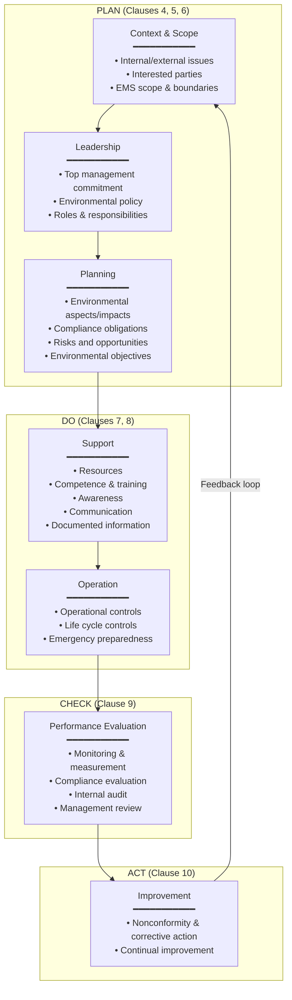
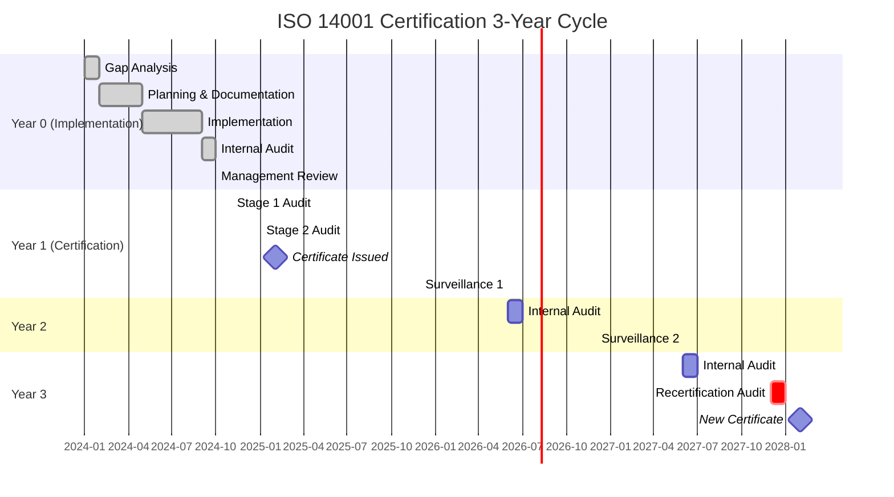

# ISO 14001 — Environmental Management System (EMS)

**Topic:** ISO 14001:2015 Environmental Management System — framework for systematic environmental management, continual improvement, compliance assurance, and sustainable operations in manufacturing and electronics industries  
**Standard:** ISO 14001:2015 (Environmental management systems — Requirements with guidance for use); ISO 14004:2016 (General guidelines on implementation)  
**SDO:** ISO (International Organization for Standardization) — Technical Committee TC 207 (Environmental management) — Sub-committee SC 1  
**Audience:** Environmental managers, EMS auditors, operations managers, sustainability professionals, manufacturing engineers, compliance officers  
**Prerequisites:** Understanding of management systems (ISO High Level Structure/Annex SL); basic environmental science; regulatory awareness; process management

---

## Chapter 1 — Historical Context & Origin Story

### 1.1 Timeline

| Year | Event | Significance |
|------|-------|-------------|
| 1972 | UN Conference on the Human Environment (Stockholm) | First international environmental governance; UNEP established |
| 1987 | Brundtland Commission: "Our Common Future" | Defined sustainable development; set agenda for environmental management |
| 1992 | Rio Earth Summit (UNCED) | Agenda 21; sustainable development commitment; industry environmental responsibility |
| 1992 | BS 7750 published (British Standards Institution) | First national EMS standard; precursor to ISO 14001 |
| 1993 | EU EMAS (Eco-Management and Audit Scheme) Regulation | EU's EMS + environmental reporting scheme; influenced ISO 14001 |
| 1996 | **ISO 14001:1996** published | First international EMS standard; immediate global adoption; "Plan-Do-Check-Act" |
| 1996 | ISO 14004:1996 published | Implementation guidance for ISO 14001 |
| 2004 | **ISO 14001:2004** revision | Improved clarity; better alignment with ISO 9001:2000; process approach emphasis |
| 2015 | **ISO 14001:2015** (current version) | Major revision: Annex SL (High Level Structure); risk-based thinking; life cycle perspective; leadership commitment; context of the organization |
| 2016 | ISO 14004:2016 published | Updated guidance aligned with 2015 revision |
| 2024 | >500,000 ISO 14001 certificates worldwide | Most widely adopted environmental management standard globally; steady growth |
| 2025 | Systematic review underway | ISO TC 207/SC1 evaluating need for revision; climate change integration; alignment with ESG/sustainability trends |

### 1.2 Evolution of Editions

| Edition | Key Characteristics | Major Changes from Previous |
|---------|--------------------|-----------------------------|
| **ISO 14001:1996** | Plan-Do-Check-Act; environmental policy; aspects/impacts; legal requirements; objectives/targets; operational control; monitoring; management review | First edition; established EMS fundamentals |
| **ISO 14001:2004** | Improved compatibility with ISO 9001; clearer requirements; better structure | Enhanced clarity on legal compliance; communication; evaluation of compliance |
| **ISO 14001:2015** | Annex SL HLS; context of organization; leadership; risk-based thinking; **life cycle perspective**; performance improvement; compliance obligations | Major restructure (10-clause HLS); strategic environmental management; life cycle thinking; no "environmental manual" required; "documented information" replaces documents/records; "compliance obligations" replaces "legal and other requirements" |

### 1.3 ISO 14001 in Numbers

| Metric | Value |
|--------|-------|
| Total certificates worldwide | >500,000 (2024) |
| Countries with certified organizations | 170+ |
| Top countries (by certificates) | China, Japan, UK, Italy, Germany, Spain, India |
| Sectors | Manufacturing; construction; services; IT; automotive; electronics; chemicals |
| Growth rate | ~3-5% annually |
| Integration with other standards | ISO 9001 (quality); ISO 45001 (OH&S); ISO 50001 (energy); IATF 16949 (automotive) |

---

## Chapter 2 — Standard Architecture & Structure

### 2.1 ISO 14001:2015 Clause Structure (Annex SL HLS)

| Clause | Title | Content |
|:------:|-------|---------|
| **1** | Scope | Defines applicability; all organizations; all sectors; all sizes |
| **2** | Normative references | None (self-contained standard) |
| **3** | Terms and definitions | Key definitions (environment, environmental aspect, impact, EMS, etc.) |
| **4** | Context of the organization | 4.1 Understanding the organization and its context; 4.2 Needs and expectations of interested parties; 4.3 Scope of the EMS; 4.4 EMS |
| **5** | Leadership | 5.1 Leadership and commitment; 5.2 Environmental policy; 5.3 Organizational roles, responsibilities and authorities |
| **6** | Planning | 6.1 Actions to address risks and opportunities (6.1.1 General; 6.1.2 Environmental aspects; 6.1.3 Compliance obligations; 6.1.4 Planning action); 6.2 Environmental objectives and planning to achieve them |
| **7** | Support | 7.1 Resources; 7.2 Competence; 7.3 Awareness; 7.4 Communication; 7.5 Documented information |
| **8** | Operation | 8.1 Operational planning and control; 8.2 Emergency preparedness and response |
| **9** | Performance evaluation | 9.1 Monitoring, measurement, analysis and evaluation (incl. 9.1.2 Evaluation of compliance); 9.2 Internal audit; 9.3 Management review |
| **10** | Improvement | 10.1 General; 10.2 Nonconformity and corrective action; 10.3 Continual improvement |

### 2.2 Key Concepts in ISO 14001:2015

| Concept | Definition | Application |
|---------|-----------|-------------|
| **Environmental aspect** | Element of an organization's activities/products/services that interacts or can interact with the environment | Inputs/outputs: emissions; effluents; waste; resource consumption; energy use; noise; land use |
| **Environmental impact** | Change to the environment (adverse or beneficial) resulting from environmental aspects | Climate change; water pollution; resource depletion; habitat destruction; ozone depletion |
| **Significant environmental aspect** | Aspect that has or can have a significant environmental impact | Determined by the organization using defined criteria (severity; frequency; regulatory; stakeholder concern) |
| **Compliance obligations** | Legal requirements + other requirements the organization subscribes to (voluntary standards; customer requirements; industry codes) | Permits; regulations; customer environmental specifications; voluntary commitments |
| **Life cycle perspective** | Considering environmental aspects from raw material acquisition through end-of-life | NOT requiring full LCA; but considering upstream/downstream impacts in aspect identification and operational control |
| **Risk-based thinking** | Addressing risks and opportunities related to environmental aspects, compliance obligations, and other issues/requirements | Proactive identification; not just reactive; integrated into planning |
| **Context of the organization** | Internal and external issues relevant to the EMS; interested parties and their needs/expectations | Strategic alignment; EMS scope determination; understanding operating environment |
| **Intended outcomes** | Enhance environmental performance; fulfill compliance obligations; achieve environmental objectives | The purpose of the EMS (defined by the organization) |

### 2.3 PDCA Cycle in ISO 14001



---

## Chapter 3 — Technical Deep Dive

### 3.1 Environmental Aspects Identification (Clause 6.1.2)

| Category | Examples (Electronics Manufacturing) | Potential Impact |
|----------|--------------------------------------|-----------------|
| **Air emissions** | Solder fume; VOC from conformal coating/cleaning; particulates from machining; exhaust from generators/vehicles | Air quality degradation; ozone depletion; climate change; health effects |
| **Water discharges** | PCB etching wastewater (Cu, Sn); plating rinse water (heavy metals); cooling water discharge; domestic sewage | Water pollution; aquatic toxicity; eutrophication |
| **Waste generation** | Electronic scrap (WEEE); solder dross; chemical containers; packaging waste; office waste; expired chemicals | Land contamination; resource depletion; toxicity |
| **Hazardous materials use** | Solder paste (lead-free alloys); flux (isopropanol, rosin); cleaning solvents; acids/alkalis for PCB processing; epoxy resins | Chemical exposure; contamination risk; resource depletion |
| **Energy consumption** | Electricity (reflow ovens, SMT lines, testing, HVAC, lighting); natural gas (heating); fuel (logistics) | Climate change (GHG emissions); resource depletion |
| **Water consumption** | Process water (cleaning, plating, cooling); domestic water; DI water production | Water scarcity; resource depletion |
| **Noise** | Compressors; HVAC; manufacturing equipment; generators; transport vehicles | Noise pollution; community impact |
| **Land use/contamination** | Chemical storage areas; historical contamination; underground storage tanks | Soil/groundwater contamination; remediation liability |
| **Product-related** (life cycle) | Energy consumption in use phase; end-of-life recycling/disposal; raw material extraction (upstream) | Resource depletion; waste; emissions across life cycle |
| **Emergency/abnormal** | Chemical spill; fire (toxic fumes); flood (contamination release); equipment failure (uncontrolled emission) | Acute pollution; major environmental damage |

### 3.2 Significance Determination

| Criterion | Scale | Description |
|-----------|:-----:|-------------|
| **Severity of impact** | 1-5 | 1=negligible; 2=minor; 3=moderate; 4=major; 5=catastrophic |
| **Frequency/probability** | 1-5 | 1=rare; 2=unlikely; 3=possible; 4=likely; 5=almost certain |
| **Duration/reversibility** | 1-5 | 1=momentary/reversible; 2=short-term; 3=moderate; 4=long-term; 5=permanent/irreversible |
| **Regulatory sensitivity** | 1-5 | 1=no regulation; 2=general; 3=specific limits; 4=strict requirements; 5=non-compliance risk |
| **Stakeholder concern** | 1-5 | 1=none; 2=low; 3=moderate; 4=high; 5=critical (community/customer/investor pressure) |
| **Scale/quantity** | 1-5 | 1=minimal; 2=small; 3=moderate; 4=large; 5=very large |

**Significance score** = weighted sum or multiplication of criteria  
**Threshold**: typically aspects scoring above defined threshold (e.g., ≥15 on 5×5 matrix) are "significant"

### 3.3 Operational Control Hierarchy

| Level | Control Type | Example (Electronics Manufacturing) |
|:-----:|-------------|--------------------------------------|
| **1** | Elimination | Replace hazardous cleaning solvent with aqueous cleaning; eliminate process step |
| **2** | Substitution | Switch from VOC-based conformal coating to water-based; replace chlorinated solvents |
| **3** | Engineering controls | Enclosed soldering systems with fume extraction; wastewater treatment system; spill containment |
| **4** | Administrative controls | Procedures (SOPs for chemical handling); training; permits; scheduling (noise-generating activities during day) |
| **5** | PPE/monitoring | Personal protective equipment; continuous emission monitoring; leak detection |

---

## Chapter 4 — Implementation Guide

### 4.1 EMS Implementation Roadmap

| Phase | Duration | Activities | Deliverables |
|:-----:|:--------:|-----------|--------------|
| **1. Gap analysis** | 1-2 months | Review current environmental management practices against ISO 14001:2015 requirements; identify gaps; benchmark | Gap analysis report; improvement plan; resource estimate |
| **2. Planning** | 1-2 months | Define EMS scope; identify context/interested parties; conduct environmental aspects/impacts assessment; identify compliance obligations; set objectives | EMS scope document; aspects register; compliance register; objectives |
| **3. Documentation** | 2-3 months | Develop EMS documentation (policy, procedures, work instructions, forms); define roles/responsibilities; create documented information structure | Environmental policy; procedures; registers; operational controls |
| **4. Implementation** | 3-6 months | Deploy procedures; train personnel; implement operational controls; establish monitoring; conduct emergency preparedness exercises | Trained workforce; operational EMS; monitoring data |
| **5. Internal audit** | 1 month | Conduct full internal audit of EMS against ISO 14001:2015 requirements | Internal audit report; nonconformities identified; corrective actions |
| **6. Management review** | 2 weeks | Top management reviews EMS performance, audit results, compliance status, objectives achievement | Management review minutes; decisions; improvement directions |
| **7. Certification audit** | 1-2 months | Stage 1 (document review) + Stage 2 (implementation audit) by accredited certification body | ISO 14001:2015 certificate |
| **Total** | **12-18 months** (typical for medium-sized organization) | | |

### 4.2 Documented Information Requirements

| ISO 14001 Clause | Required Documented Information | Form |
|:---:|-------|------|
| 4.3 | EMS scope | Scope statement (what's included/excluded; boundaries) |
| 5.2 | Environmental policy | Signed policy statement (communicated internally + available to interested parties) |
| 6.1.1 | Risks and opportunities; planned actions | Risk/opportunity register with planned actions |
| 6.1.2 | Environmental aspects and associated impacts; criteria for significance; significant aspects | Aspects/impacts register with significance scoring |
| 6.1.3 | Compliance obligations | Compliance register (legal + other requirements) |
| 6.2 | Environmental objectives | Objectives register (measurable; timeframe; responsible; resources) |
| 7.2 | Evidence of competence | Training records; qualifications; certifications |
| 7.4 | Evidence of communication | Communication records (internal + external) |
| 8.1 | Operational control (to extent necessary) | Procedures; work instructions; criteria for operations |
| 8.2 | Emergency preparedness and response | Emergency plans; drill records; response procedures |
| 9.1 | Monitoring and measurement results | Monitoring data; calibration records; compliance evaluation records |
| 9.2 | Internal audit program; audit results | Audit plans; audit reports; nonconformity records |
| 9.3 | Management review results | Management review minutes; decisions; actions |
| 10.2 | Nonconformity; corrective actions; results | NCR (nonconformity reports); CAPA records |

### 4.3 Integration with Other Management Systems

| Standard | Integration Points with ISO 14001 | Benefit |
|----------|-----------------------------------|---------|
| **ISO 9001:2015** (Quality) | Same HLS (Annex SL) structure; shared: context, leadership, support, documented information, audit, management review | Single integrated management system; reduced duplication; one audit program |
| **ISO 45001:2018** (OH&S) | Same HLS; shared risk methodology; overlapping hazards/aspects (chemical exposure = OH&S hazard + environmental aspect) | Integrated HSEQ system; unified chemical management; combined emergency response |
| **ISO 50001:2018** (Energy) | Subset of ISO 14001 environmental aspects (energy); more detailed energy management | ISO 50001 provides detailed energy performance improvement within ISO 14001 framework |
| **IATF 16949** (Automotive Quality) | Customer-specific requirements often mandate ISO 14001 as prerequisite; environmental compliance in CSR audits | Automotive supply chain requirement; combined audit possible |
| **EMAS** (EU) | ISO 14001 is recognized as equivalent to EMAS management system requirements; EMAS adds: environmental statement (public); legal compliance demonstration; annual improvement | EMAS = ISO 14001 + public reporting + stricter compliance + verified improvement |

---

## Chapter 5 — Certification & Audit

### 5.1 Certification Process

| Stage | Activity | Duration | Output |
|:-----:|----------|:--------:|--------|
| **Application** | Select accredited certification body (CB); sign contract; agree scope and schedule | 2-4 weeks | Contract; audit dates |
| **Stage 1 audit** | Document review; on-site (partial); evaluate readiness for Stage 2; identify concerns | 1-2 days (medium org) | Stage 1 report; observations; readiness confirmation |
| **Gap closure** | Address any Stage 1 findings; typically 1-3 months between Stage 1 and Stage 2 | 1-3 months | Closed findings; updated documentation |
| **Stage 2 audit** | Full on-site implementation audit; all clauses; evidence-based; interview staff; review records | 2-5 days (depending on scope/size) | Audit report; nonconformities (Major/Minor); positive findings; recommendation |
| **Decision** | CB technical review; certification decision | 2-4 weeks | Certificate issued (if no open Major NCs) |
| **Surveillance 1** | Annual audit (subset of scope); verify continued conformity + improvement | 1-3 days | Surveillance report; ongoing conformity |
| **Surveillance 2** | Same as Surveillance 1 (year 2) | 1-3 days | Surveillance report |
| **Recertification** | Full audit (year 3); entire scope reassessed; new 3-year cycle | Similar to Stage 2 | New certificate (3-year validity) |

### 5.2 Common Audit Findings

| Finding | Category | Root Cause | Prevention |
|---------|:--------:|-----------|-----------|
| Aspects register not updated after process change | Minor NC | No trigger for review when changes occur; management of change gap | Link aspects review to change management process |
| Compliance obligation not identified (missing permit condition) | Major NC | Incomplete legal register; no systematic process for identifying new requirements | Subscription to regulatory update service; legal compliance team review |
| Environmental objectives not measurable | Minor NC | Objectives stated qualitatively ("reduce waste") without metrics/targets | Use SMART format (Specific, Measurable, Achievable, Relevant, Time-bound) |
| Inadequate emergency response for chemical spill | Minor/Major NC | Drill not conducted; equipment (spill kit) not maintained; personnel not trained | Annual drills; spill kit inspection program; refresher training |
| Top management not demonstrating leadership | Major NC | Policy signed but not engaged; no management review conducted; EMS delegated entirely | Quarterly management reviews; executive KPIs linked to environment; site visits |
| Monitoring data not analyzed or acted upon | Minor NC | Data collected but sits in database; no trend analysis; no triggers for action | Monthly environmental performance dashboard; automatic alerts for threshold exceedance |
| Supplier environmental control (life cycle) insufficient | Minor NC | ISO 14001:2015 requires considering life cycle; organization only looks at own operations | Supplier environmental requirements; procurement criteria; green procurement policy |

### 5.3 Audit Duration (IAF MD 5 Guidance)

| Organization Size (Effective Personnel) | Stage 2 Audit Duration (person-days) |
|:---:|:---:|
| 1-5 | 2.5 |
| 6-10 | 3 |
| 11-15 | 3.5 |
| 16-25 | 4 |
| 26-45 | 5 |
| 46-65 | 6 |
| 66-85 | 7 |
| 86-125 | 8 |
| 126-175 | 9 |
| 176-275 | 10 |
| 276-425 | 11 |
| 426-625 | 12 |
| 626-875 | 13 |
| 876-1175 | 15 |
| 1176-1550 | 16 |
| 1551-2025 | 17 |
| 2026-2675 | 18 |
| 2676-3450 | 19 |
| >3450 | 20+ |

Adjustments: multi-site (-20-30%); high environmental risk (+); high complexity (+); integrated audit with ISO 9001 (combined reduction)

---

## Chapter 6 — Regional Context

### 6.1 ISO 14001 Adoption by Region

| Region | Adoption Pattern | Key Drivers |
|--------|-----------------|-------------|
| **Europe** | Very high; often mandatory for public procurement; EMAS alternative available; integration with EU environmental legislation | Customer requirements; EU Green Deal; supply chain expectations; ESG ratings |
| **Asia (Japan, China, Korea)** | Highest absolute numbers of certificates (China #1 globally); driven by manufacturing export requirements | Export market access; government incentives; international customer requirements |
| **North America** | Moderate adoption; voluntary; strong in manufacturing, chemicals, automotive | Customer/supply chain requirements; regulatory risk management; investor expectations |
| **Automotive sector** | Near-universal (IATF 16949 supply chain often requires ISO 14001) | OEM customer requirements; supply chain sustainability programs (CDP; EcoVadis) |
| **Electronics sector** | High adoption among major manufacturers; EICC/RBA member requirement | Customer audits; RBA Code of Conduct; ESG reporting; regulatory compliance |

### 6.2 ISO 14001 vs. Other Environmental Frameworks

| Framework | Scope | Certification? | Key Difference from ISO 14001 |
|-----------|-------|:-:|---|
| **EU EMAS** | EMS + environmental reporting + verified improvement | Yes (registration) | More demanding: requires environmental statement (public); validated improvement; legal compliance verification by verifier; annual reporting |
| **ISO 14001** | EMS framework; continual improvement; compliance | Yes (third-party certification) | Flexible; self-determined objectives; global recognition; no public reporting required |
| **RBA (Responsible Business Alliance) Code** | Environmental + social + ethics (supply chain) | Validated Assessment Program (VAP) audit | Electronics-specific; includes labor + ethics + environmental; supply chain focus |
| **EcoVadis** | Sustainability rating (environment + social + ethics + procurement) | Rating (score 0-100) | Assessment platform; not management system standard; scorecard for supply chain |
| **CDP** | Disclosure (climate + water + forests) | Score (A to D-) | Reporting/disclosure; investor-focused; no management system requirement |
| **SBTi** (Science Based Targets initiative) | Climate targets (GHG reduction) | Validation of targets | Specific to GHG/climate; targets; not full EMS |

---

## Chapter 7 — Comparison

### 7.1 ISO 14001 Versions Comparison

| Feature | ISO 14001:2004 | ISO 14001:2015 |
|---------|:---:|:---:|
| Structure | Custom (4.1-4.6) | **Annex SL HLS** (Clauses 1-10) |
| Environmental manual | Required (implicit) | Not required |
| Context of organization | Not addressed | **Required** (Clause 4.1, 4.2) |
| Leadership | "Top management shall…" (limited) | **Strengthened** (Clause 5; integration into business; accountability) |
| Risk-based thinking | Preventive action (reactive) | **Proactive** risks and opportunities (Clause 6.1) |
| Life cycle perspective | Not explicit | **Required** (Clause 6.1.2; 8.1) |
| Compliance | "Legal and other requirements" | **"Compliance obligations"** (broader; Clause 6.1.3) |
| Documentation | "Documents" and "records" | **"Documented information"** (flexible; any format) |
| Outsourced processes | Limited attention | **Must be controlled** (Clause 8.1) |
| Supply chain | Not explicitly addressed | **Life cycle thinking** (procurement; design; delivery; end-of-life) |
| Continual improvement | Improve the EMS | Improve **environmental performance** (not just the system) |
| Preventive action | Separate requirement (4.5.3) | **Integrated** into risk-based thinking; no separate clause |
| Integration | Difficult (different structure from ISO 9001) | **Easy** (same Annex SL structure as ISO 9001, 45001, 50001) |

### 7.2 ISO 14001 vs. ISO 50001 (Energy Management)

| Dimension | ISO 14001:2015 | ISO 50001:2018 |
|-----------|:---:|:---:|
| Scope | ALL environmental aspects | **Energy only** (subset of environmental) |
| Purpose | Overall environmental management + compliance | **Energy performance improvement** (reduce consumption; improve efficiency) |
| Key concept | Environmental aspects/impacts | **Energy Performance Indicators (EnPIs)**; energy baseline; Significant Energy Uses (SEUs) |
| Performance requirement | Continual improvement (environmental performance) | **Demonstrated energy performance improvement** (quantitative; EnPI improvement vs. baseline) |
| Monitoring | Monitoring relevant to significant aspects | **Energy measurement plan** (meters; data; analysis) |
| Integration | Covers energy as one aspect | Can be integrated as detailed energy management within ISO 14001 |
| Certification | ISO 14001 certificate | ISO 50001 certificate (separate or combined audit) |
| Typical organizations | All sectors | Energy-intensive operations; manufacturing; buildings; transport |

---

## Chapter 8 — Mermaid Architecture Diagrams

### 8.1 Environmental Aspects & Impacts Assessment Process

```mermaid
flowchart TB
    START[Start: Identify Activities,<br/>Products & Services]
    
    SCOPE[Define Scope<br/>━━━━━━━━━━━<br/>• Normal operations<br/>• Abnormal conditions<br/>• Emergency situations<br/>• Life cycle stages:<br/>  - Raw material acquisition<br/>  - Design<br/>  - Production<br/>  - Use<br/>  - End-of-life]
    
    IDENTIFY[Identify Environmental Aspects<br/>━━━━━━━━━━━<br/>For each activity/product/service:<br/>• What goes IN? (energy, water, materials)<br/>• What goes OUT? (emissions, waste, effluent)<br/>• What interacts with environment?<br/>• What could interact? (potential)]
    
    IMPACT[Determine Environmental Impacts<br/>━━━━━━━━━━━<br/>For each aspect:<br/>• What change does it cause?<br/>• Climate change; pollution; resource<br/>  depletion; biodiversity loss; etc.<br/>• Adverse or beneficial?]
    
    SIGNIFICANCE{Significance<br/>Assessment<br/>(scoring matrix)}
    
    SIGNIFICANT[Significant Aspects<br/>━━━━━━━━━━━<br/>• Score above threshold<br/>• Trigger: operational controls<br/>• Trigger: objectives<br/>• Trigger: monitoring<br/>• Communicate internally]
    
    NOT_SIG[Non-Significant Aspects<br/>━━━━━━━━━━━<br/>• Retain in register<br/>• Basic controls<br/>• Review periodically<br/>• May become significant<br/>  (context change)]
    
    CONTROLS[Determine Controls<br/>━━━━━━━━━━━<br/>• Operational controls (procedures)<br/>• Engineering controls<br/>• Set objectives & targets<br/>• Monitor & measure<br/>• Emergency preparedness]
    
    START --> SCOPE --> IDENTIFY --> IMPACT --> SIGNIFICANCE
    SIGNIFICANCE -->|Above threshold| SIGNIFICANT --> CONTROLS
    SIGNIFICANCE -->|Below threshold| NOT_SIG
```

### 8.2 ISO 14001 Integrated Management System

```mermaid
graph TB
    subgraph "Integrated Management System (IMS)"
        subgraph "Shared Elements (Annex SL)"
            CONTEXT[Context of Organization<br/>Internal/External Issues<br/>Interested Parties]
            LEADERSHIP[Leadership & Policy<br/>Commitment; Roles;<br/>Accountability]
            SUPPORT[Support<br/>Resources; Competence;<br/>Awareness; Communication;<br/>Documented Information]
            PERF[Performance Evaluation<br/>Monitoring; Internal Audit;<br/>Management Review]
            IMPROVE[Improvement<br/>Nonconformity; CAPA;<br/>Continual Improvement]
        end
        
        subgraph "ISO 14001 Specific"
            ENV_ASP[Environmental Aspects<br/>& Impacts]
            COMPLY[Compliance Obligations<br/>(environmental law)]
            OPER_ENV[Environmental<br/>Operational Controls]
            EMERG[Emergency<br/>Preparedness]
            ENV_OBJ[Environmental<br/>Objectives & KPIs]
        end
        
        subgraph "ISO 9001 Specific"
            CUST[Customer Requirements<br/>& Satisfaction]
            QMS_PLAN[Product/Service<br/>Planning]
            DESIGN[Design &<br/>Development]
            PROD[Production &<br/>Service Provision]
        end
        
        subgraph "ISO 45001 Specific"
            HAZARD[Hazard Identification<br/>& Risk Assessment]
            OHS_CTRL[OH&S Controls<br/>& PPE]
            WORKER[Worker<br/>Participation]
            INCIDENT[Incident<br/>Investigation]
        end
    end
    
    CONTEXT --> LEADERSHIP --> SUPPORT
    SUPPORT --> ENV_ASP & CUST & HAZARD
    ENV_ASP --> COMPLY --> OPER_ENV --> EMERG
    ENV_ASP --> ENV_OBJ
    CUST --> QMS_PLAN --> DESIGN --> PROD
    HAZARD --> OHS_CTRL --> WORKER
    OPER_ENV & PROD & OHS_CTRL --> PERF --> IMPROVE
```

### 8.3 Certification Lifecycle



---

## Chapter 9 — Case Studies

### 9.1 Case Study: Electronics Manufacturer EMS Implementation

| Aspect | Detail |
|--------|--------|
| Company | Medium-sized electronics contract manufacturer (EMS provider); 800 employees; 2 manufacturing sites; SMT assembly + box build + testing; customers: automotive Tier 1, industrial, medical |
| Driver | Key automotive customer (Tier 1) requires ISO 14001 certification as condition of continued business; also: cost savings from energy/waste reduction; ESG rating improvement; regulatory compliance confidence |
| Timeline | 14 months from kickoff to certification |
| Key aspects identified | (1) **Energy consumption** (reflow ovens; wave solder; cleanrooms; compressed air; HVAC): 8 GWh/year; Scope 2 CO₂: 3,200 tonnes. (2) **Hazardous waste**: solder dross; flux residue; expired chemicals; contaminated wipes: 45 tonnes/year. (3) **Water use**: DI water for cleaning; process water: 15,000 m³/year. (4) **VOC emissions**: conformal coating application; cleaning solvents: 2 tonnes/year. (5) **Packaging waste**: incoming component packaging (cardboard, ESD bags, trays): 120 tonnes/year. |
| Objectives set | (1) Reduce energy consumption by 10% (per unit produced) within 2 years — actions: LED lighting retrofit; compressed air leak repair; reflow oven scheduling optimization. (2) Reduce hazardous waste by 15% — actions: solder paste optimization (reduce scrap); extend chemical bath life; improve segregation (recyclable dross). (3) Reduce VOC emissions by 30% — action: switch from solvent-based conformal coating to UV-cure water-based alternative. (4) Achieve zero waste-to-landfill for non-hazardous waste — improve recycling segregation; find recycling partners for ESD bags and trays. |
| Results (Year 1) | Energy: -7% (LED retrofit completed; compressed air optimized). Hazardous waste: -12% (solder paste optimization). VOC: -25% (conformal coating substitution on 2 of 3 lines). Non-hazardous recycling rate: 85% → 94%. Annual cost savings: ~€180K (energy + waste disposal + material). |
| Certification | Achieved first attempt; 2 minor NCs (emergency drill records incomplete; one monitoring procedure not updated after equipment change); resolved within 30 days. |
| Lessons | (1) Employee engagement crucial — "environmental champions" on each line made biggest difference. (2) Quick wins (LED; compressed air; waste segregation) build momentum before harder projects. (3) Customer requirement is strongest motivator for management commitment. (4) Integration with existing ISO 9001 system saved significant implementation effort. |

### 9.2 Case Study: Continual Improvement — Energy Reduction

| Aspect | Detail |
|--------|--------|
| Company | Large automotive electronics manufacturer; ISO 14001 certified since 2005; 3,000 employees; energy consumption: 35 GWh/year |
| Challenge | Energy is #1 significant aspect (Scope 2 emissions: 14,000 tonnes CO₂/year); customer targets for supply chain CO₂ reduction; energy costs €4M/year |
| Approach | Layered improvement strategy over 5 years within ISO 14001 framework |
| Year 1 | **Monitoring & baseline**: installed sub-metering on all major consumers (reflow, wave, HVAC, compressed air, lighting); established energy baseline per product unit (kWh/€ revenue); identified top 10 consumers |
| Year 2 | **Low-cost measures**: Compressed air leak repair (saved 8% compressed air energy); HVAC optimization (temperature setback; scheduling); LED retrofit (40% lighting reduction); reflow oven standby scheduling | 
| Year 3 | **Medium investment**: Variable speed drives on HVAC fans and pumps (25% reduction in HVAC energy); heat recovery from reflow ovens (pre-heat incoming products); building insulation improvements |
| Year 4 | **Renewable energy**: Rooftop solar PV (2 MW installation; covers 15% of site electricity); green electricity contract (remaining grid); reduces Scope 2 to near-zero for electricity |
| Year 5 | **Process optimization**: Reflow profile optimization (shorter cycle; lower peak temperature where possible); equipment replacement (older ovens → energy-efficient models with better insulation) |
| Results | Total energy reduction: 30% (kWh per unit produced) over 5 years. Absolute reduction: 35 → 28 GWh despite production volume increase. Cost savings: €1.2M/year. Scope 2 CO₂: 14,000 → 2,100 tonnes (85% reduction including renewables). Customer sustainability score: improved from "C" to "A" on CDP Supply Chain. |

---

## Chapter 10 — Future Evolution

| Trend | Timeline | Impact on ISO 14001 |
|-------|----------|-------------------|
| **Climate change integration** | 2025-2027 | ISO 14001 revision expected to explicitly address climate change; alignment with ISO 14068 (carbon neutrality); GHG requirements |
| **Biodiversity** | 2025-2028 | Growing expectation for biodiversity consideration in EMS (aligned with TNFD; Kunming-Montreal framework); may enter revised standard |
| **Circular economy** | Now-2027 | Life cycle perspective in ISO 14001:2015 already supports this; next revision may strengthen circularity requirements |
| **Digital EMS** | Now | Digital tools for monitoring, data collection, compliance tracking; IoT sensors; AI for optimization; digital twins for environmental modeling |
| **Integration with ESG** | Now | ISO 14001 as foundation for "E" in ESG reporting; alignment with ESRS (EU); ISSB; GRI |
| **Scope 3 emissions** | Now-2025 | Life cycle perspective in ISO 14001 aligns with Scope 3 GHG management; supply chain environmental management growing |
| **ISO 14001 revision** | 2025-2028 | Systematic review ongoing; possible revision to strengthen: climate, biodiversity, circularity, digitalization, SDG alignment |
| **Mandatory EMS** (regulatory trend) | 2025+ | Some jurisdictions moving toward mandatory EMS for certain sectors (EU IED for industrial installations already requires EMS-like systems) |

---

## Chapter 11 — Interview Questions & Career Guide

### Tier 1: Entry-Level

**Q1:** What is the purpose of ISO 14001 and how does it work?  
**A:** ISO 14001 provides a **framework for Environmental Management Systems (EMS)** that helps organizations systematically manage their environmental responsibilities, comply with environmental laws, and continually improve environmental performance. It works through the **Plan-Do-Check-Act** cycle: (1) **Plan** — identify environmental aspects/impacts of your activities; determine which are significant; understand your compliance obligations; set environmental objectives. (2) **Do** — implement operational controls; train people; prepare for emergencies; document processes. (3) **Check** — monitor and measure environmental performance; evaluate compliance; conduct internal audits; management review. (4) **Act** — address nonconformities; take corrective action; drive continual improvement. The standard doesn't prescribe specific environmental performance levels — each organization determines its own aspects, objectives, and controls based on its activities and context. Certification by an accredited third-party body demonstrates conformity to international requirements and is often required by customers (especially automotive and electronics sectors).

**Q2:** What is an "environmental aspect" vs. an "environmental impact"?  
**A:** An **environmental aspect** is an element of an organization's activities, products, or services that *interacts with or can interact with the environment*. It's the cause — what the organization does that touches the environment. An **environmental impact** is the *change to the environment* (adverse or beneficial) that results from the aspect. It's the effect. Examples: Aspect: emission of CO₂ from energy use → Impact: contribution to climate change. Aspect: discharge of wastewater containing copper → Impact: water pollution / aquatic toxicity. Aspect: generation of electronic waste → Impact: land contamination; resource depletion. The distinction matters because ISO 14001 requires organizations to identify aspects, determine impacts, assess significance, and then control significant aspects. You manage the aspect (what you do) to reduce the impact (environmental harm).

### Tier 2: Mid-Level

**Q3:** How do you determine which environmental aspects are "significant" and what does that trigger?  
**A:** [Detailed answer covering: (1) ISO 14001:2015 Clause 6.1.2 requires determining significant environmental aspects using criteria the organization defines. (2) Common methodology: scoring matrix (severity × probability × duration × regulatory × stakeholder concern). (3) Process: list all aspects; score each against criteria; apply threshold; aspects above threshold = significant. (4) What significance triggers: operational controls (procedures, engineering solutions); environmental objectives (improvement targets); monitoring and measurement; training/awareness priority; emergency preparedness (if abnormal/emergency aspect); communication requirements. (5) Important: significance determination must consider: normal, abnormal, AND emergency conditions; life cycle perspective (upstream/downstream); changes (new processes, products, regulations). (6) Must be reviewed when changes occur (new process, equipment, regulation, location) and periodically (typically annually).]

### Tier 3: Senior

**Q4:** Design an integrated EMS strategy for a multi-site electronics manufacturer that addresses ISO 14001 certification, customer environmental requirements (CDP Supply Chain; EcoVadis; automotive OEM sustainability targets), regulatory compliance across 5 countries, and net-zero commitment by 2035.  
**A:** [Comprehensive answer covering: (1) Governance: Group Environmental Director; site EMS managers; integration with sustainability/ESG governance; Board-level accountability for net-zero target. (2) Integrated management system: ISO 14001 + ISO 50001 (energy) + ISO 14064 (GHG) at all sites; single IMS with site-specific operational controls; centralized policy + objectives cascade to site level; shared documented information framework. (3) Multi-site certification: matrix certification approach (reduces audit days/cost); one certification body for consistency; common procedures with site-specific work instructions. (4) Regulatory compliance: centralized compliance register per country; subscription to regulatory monitoring service; local compliance coordinators; quarterly compliance evaluation; legal register covers: environmental permits, emissions limits, waste management, chemicals (REACH/CLP), water discharge, noise, contamination. (5) Customer requirements: CDP Supply Chain response (climate + water); EcoVadis assessment (aim Platinum); automotive OEM-specific requirements (integrated into EMS objectives); supply chain GHG reporting (Scope 1+2+3). (6) Net-zero 2035 roadmap: embedded in EMS objectives; science-based targets (SBTi validated); annual GHG inventory (ISO 14064); energy efficiency (ISO 50001); renewable energy (PPAs; onsite solar); Scope 3 supplier engagement; residual offset (last resort). (7) KPIs: energy intensity (kWh/unit); GHG intensity (kgCO₂e/unit); waste diversion rate; water intensity; VOC emissions; compliance incidents (zero target); audit nonconformities (reduction trend); CDP/EcoVadis scores.]

---

## Chapter 12 — Cheat Sheet & Quick Reference

### ISO 14001:2015 Clause Summary

```
Clause 4 — CONTEXT: Know your organization; know who cares; define EMS scope
Clause 5 — LEADERSHIP: Policy; commitment; roles; accountability
Clause 6 — PLANNING: Aspects/impacts; compliance obligations; risks; objectives
Clause 7 — SUPPORT: Resources; competence; awareness; communication; documentation
Clause 8 — OPERATION: Controls; life cycle; emergency preparedness
Clause 9 — CHECK: Monitor; measure; evaluate compliance; audit; management review
Clause 10 — IMPROVE: Nonconformity/CAPA; continual improvement
```

### Key Terms Quick Reference

```
Environmental aspect    = What you DO that interacts with environment (cause)
Environmental impact    = What HAPPENS to environment as a result (effect)
Significant aspect      = Aspect with major potential impact → requires control
Compliance obligation   = Legal requirement OR voluntary commitment (must fulfill)
Life cycle perspective  = Consider cradle-to-grave (not just your operations)
Documented information  = Any info required to be maintained or retained (flexible format)
Continual improvement   = Recurring activity to enhance ENVIRONMENTAL PERFORMANCE
                          (not just improve the system — must improve actual outcomes)
```

### Certification Quick Facts

```
Certification cycle:      3 years (Stage 1 + Stage 2 → Surveillance → Surveillance → Recertification)
Typical implementation:   12-18 months (medium organization)
Audit body:              Must be accredited (IAF MLA; local accreditation body)
Certificate validity:    3 years (subject to annual surveillance)
Major NC:               Must be resolved before certification; verification required
Minor NC:               Action plan accepted; verified at next surveillance
Observation:            Not NC; improvement opportunity; no action required

Integration options:
  ISO 14001 + ISO 9001           = Quality + Environment (most common combo)
  ISO 14001 + ISO 9001 + 45001  = QEH&S (full HSEQ system)
  ISO 14001 + ISO 50001         = Environment + Energy
  All above + IATF 16949        = Automotive integrated system
```

### Environmental Aspect Checklist (Electronics)

```
□ Energy consumption (electricity, gas, fuel)
□ Water consumption (process, cooling, domestic)
□ Air emissions (solder fume, VOC, particulate, exhaust)
□ Wastewater discharges (heavy metals, organic, thermal)
□ Hazardous waste (chemicals, solder dross, contaminated)
□ Non-hazardous waste (packaging, scrap, office, food)
□ Electronic waste/scrap (PCB, components, product returns)
□ Chemical storage and use (REACH, CLP, spill risk)
□ Noise (to community; industrial equipment)
□ Raw material consumption (metals, plastics, chemicals)
□ Product energy consumption (use phase — life cycle)
□ Product end-of-life (recyclability, hazardous content)
□ Transport/logistics (Scope 3; fuel; emissions)
□ Emergency risk (spill, fire, flood, equipment failure)
□ Land use / soil contamination (storage tanks, legacy)
□ Biodiversity (site location; habitat; runoff)
```

---

*End of Document — 06_ISO_14001_EMS.md*
