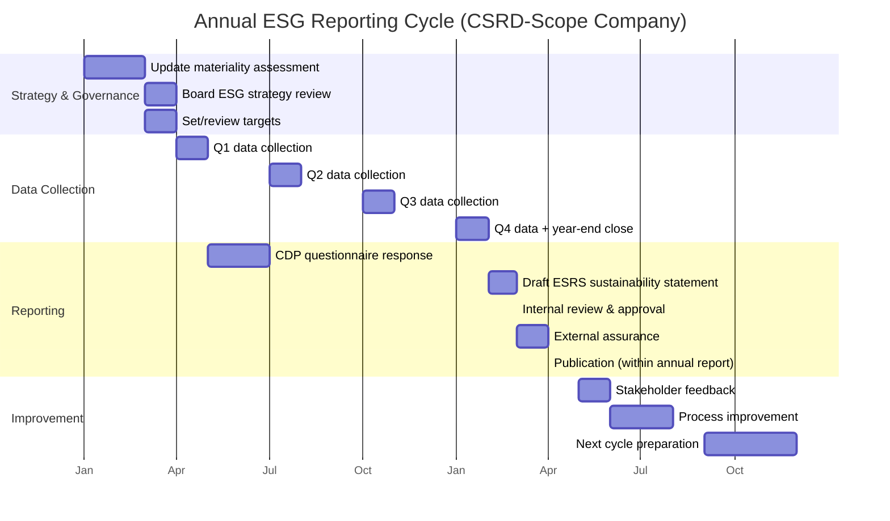

# ESG Reporting Frameworks — CSRD, ISSB, GRI, TCFD, CDP

**Topic:** Environmental, Social, and Governance (ESG) reporting frameworks — EU Corporate Sustainability Reporting Directive (CSRD/ESRS), ISSB (IFRS S1/S2), GRI Standards, TCFD Recommendations, CDP, SEC Climate Rule  
**Standard:** EU CSRD (2022/2464) + ESRS; IFRS S1 & S2 (ISSB); GRI Standards (2021); TCFD Recommendations (2017); CDP Questionnaires; SEC Climate Disclosure Rule (2024)  
**SDO:** European Commission (EFRAG); IFRS Foundation (ISSB); Global Reporting Initiative (GRI); Financial Stability Board (FSB/TCFD); CDP; US SEC  
**Audience:** ESG/sustainability reporting professionals, CFOs, corporate secretaries, sustainability managers, investor relations, compliance officers, auditors  
**Prerequisites:** Corporate reporting fundamentals, financial accounting concepts, climate science basics, stakeholder theory, corporate governance

---

## Chapter 1 — Historical Context & Origin Story

### 1.1 Timeline

| Year | Event | Significance |
|------|-------|-------------|
| 1997 | GRI founded (CERES + UNEP) | First comprehensive sustainability reporting framework |
| 2000 | GRI G1 Guidelines published | First generation of sustainability reporting standards |
| 2006 | UN Principles for Responsible Investment (PRI) | Institutional investors commit to integrating ESG; drives demand for data |
| 2010 | GRI G3.1 Guidelines | Enhanced guidance; sector supplements |
| 2013 | GRI G4 Guidelines | Materiality principle; stakeholder engagement; supply chain |
| 2014 | EU Non-Financial Reporting Directive (NFRD) | First mandatory ESG disclosure in EU (~11,000 companies); non-binding guidelines |
| 2015 | Paris Agreement | Climate urgency; TCFD creation; accelerated ESG reporting demand |
| 2017 | **TCFD Recommendations** published | Climate risk disclosure framework (governance, strategy, risk management, metrics/targets); voluntary but influential |
| 2018 | EU Sustainable Finance Action Plan | Taxonomy, SFDR, CSRD planned; systemic approach to sustainable finance |
| 2020 | GRI Standards (modernized; modular) | Universal + Topic-specific standards; clearer structure |
| 2021 | **IFRS Foundation creates ISSB** (International Sustainability Standards Board) | Global sustainability disclosure standard-setter; consolidates CDSB + VRF (SASB) |
| 2021 | EU adopts Corporate Sustainability Reporting Directive (CSRD) proposal | Replaces NFRD; ~50,000 companies; mandatory standards (ESRS) |
| 2022 | **EU CSRD** adopted (Directive 2022/2464) | Effective 2024+; ESRS developed by EFRAG; double materiality; assurance required |
| 2023 | **ISSB publishes IFRS S1 and IFRS S2** | S1: General sustainability disclosure; S2: Climate-related disclosure; global baseline |
| 2023 | **ESRS** (European Sustainability Reporting Standards) adopted by EU Commission (Set 1) | 12 standards (2 cross-cutting + 5 environment + 4 social + 1 governance); mandatory for CSRD-scope companies |
| 2024 | First CSRD reporting year (largest companies; FY2024 reports in 2025) | ~700 largest EU companies report first under ESRS |
| 2024 | TCFD formally disbanded (work transferred to ISSB/IFRS Foundation) | TCFD recommendations subsumed into ISSB S2 |
| 2024 | US SEC Climate Disclosure Rule finalized (then partially stayed) | Scope 1/2 mandatory; Scope 3 safe harbor; challenged in courts |
| 2025 | CSRD second wave (large companies; FY2025 reports in 2026) | ~50,000 companies in total phased in |
| 2025 | Multiple jurisdictions adopting/endorsing ISSB | UK, Japan, Australia, Singapore, Nigeria endorsing ISSB standards |

### 1.2 The Convergence Landscape

```mermaid
graph TB
    subgraph "Pre-2021: Fragmented"
        GRI_OLD[GRI Standards<br/>(impact materiality)]
        SASB[SASB Standards<br/>(financial materiality)]
        TCFD_OLD[TCFD<br/>(climate risk)]
        CDP_OLD[CDP<br/>(climate/water/forests)]
        IIRC[IIRC<br/>(integrated reporting)]
        CDSB[CDSB<br/>(environmental)]
    end
    
    subgraph "2021-2023: Consolidation"
        ISSB_NEW[ISSB (IFRS S1/S2)<br/>━━━━━━━━━━━<br/>Absorbed: SASB + CDSB + IIRC<br/>Built on: TCFD structure<br/>Focus: financial materiality<br/>Scope: global baseline]
        
        ESRS[EU ESRS<br/>━━━━━━━━━━━<br/>Focus: double materiality<br/>(financial + impact)<br/>Scope: EU companies<br/>Built on: GRI + TCFD + own]
        
        GRI_NEW[GRI Standards (2021+)<br/>━━━━━━━━━━━<br/>Focus: impact materiality<br/>Complementary to ISSB<br/>Interoperability with ESRS]
    end
    
    subgraph "2024+: Implementation"
        GLOBAL[Global Reporting Landscape<br/>━━━━━━━━━━━<br/>• ISSB = global baseline<br/>  (investor; financial materiality)<br/>• ESRS = EU comprehensive<br/>  (double materiality; full ESG)<br/>• GRI = impact reporting<br/>  (stakeholder; complementary)<br/>• CDP = platform/questionnaire<br/>  (aligned with ISSB)]
    end
    
    SASB --> ISSB_NEW
    CDSB --> ISSB_NEW
    IIRC --> ISSB_NEW
    TCFD_OLD --> ISSB_NEW
    GRI_OLD --> GRI_NEW
    GRI_OLD --> ESRS
    TCFD_OLD --> ESRS
    CDP_OLD --> GLOBAL
    ISSB_NEW --> GLOBAL
    ESRS --> GLOBAL
    GRI_NEW --> GLOBAL
```

---

## Chapter 2 — Standard Architecture & Structure

### 2.1 EU ESRS Structure (12 Standards)

| Standard | Topic | Key Disclosures |
|:---:|-------|-----------------|
| **ESRS 1** | General requirements | Double materiality; reporting principles; due diligence; value chain; time horizons |
| **ESRS 2** | General disclosures | Governance; strategy; impact/risk/opportunity management; metrics & targets (cross-cutting) |
| **ESRS E1** | Climate change | GHG emissions (Scope 1/2/3); transition plan; energy; financial effects |
| **ESRS E2** | Pollution | Air, water, soil pollution; substances of concern; PFAS; microplastics |
| **ESRS E3** | Water and marine resources | Water consumption; discharges; marine ecosystem impacts |
| **ESRS E4** | Biodiversity and ecosystems | Land use; species; ecosystem services; biodiversity targets |
| **ESRS E5** | Resource use and circular economy | Material use; waste; circular design; recycled content |
| **ESRS S1** | Own workforce | Working conditions; equal treatment; training; health & safety |
| **ESRS S2** | Workers in the value chain | Supply chain labor rights; due diligence; remediation |
| **ESRS S3** | Affected communities | Community impacts; indigenous peoples; local engagement |
| **ESRS S4** | Consumers and end-users | Product safety; information; accessibility; responsible marketing |
| **ESRS G1** | Business conduct | Anti-corruption; political engagement; supplier payment; whistleblowing |

### 2.2 ISSB Standards Structure

| Standard | Scope | Key Requirements |
|:---:|-------|-----------------|
| **IFRS S1** (General) | All sustainability-related risks and opportunities | Governance; strategy; risk management; metrics and targets (for any sustainability topic material to entity) |
| **IFRS S2** (Climate) | Climate-related risks and opportunities | TCFD-aligned: governance; strategy (scenario analysis); risk management; metrics (GHG Scope 1/2/3; transition plans; climate targets); industry-specific (SASB-based) |

### 2.3 Double vs. Single Materiality

| Dimension | Financial Materiality (ISSB) | Impact Materiality (GRI) | Double Materiality (ESRS) |
|-----------|:---:|:---:|:---:|
| **Question** | How does sustainability affect the company's financial performance and value? | How does the company affect people and the environment? | BOTH: how does sustainability affect the company AND how does the company affect sustainability? |
| **Audience** | Investors; lenders; capital markets | All stakeholders (communities; employees; civil society; environment) | All stakeholders (but primarily investors + affected parties) |
| **Scope** | Only matters if financially material | All significant impacts regardless of financial effect | Union of both lenses |
| **Standard** | ISSB IFRS S1/S2 | GRI Standards | EU ESRS (mandatory for CSRD) |
| **Example** | Water scarcity → supply chain disruption → financial loss (reportable if material to investor) | Water pollution from factory → impact on community (reportable as significant impact) | Both the financial risk OF water issues AND the company's impact ON water resources must be assessed and reported |

---

## Chapter 3 — Technical Deep Dive

### 3.1 CSRD/ESRS Requirements for Electronics Companies

| ESRS Standard | Key Disclosure Points (Electronics) | Data Needed |
|:---:|------|------|
| **E1 (Climate)** | Scope 1/2/3 GHG emissions (GHG Protocol); climate transition plan; energy consumption mix; GHG reduction targets; financial effects of climate risks | GHG inventory data; energy data; scenario analysis; capex for transition |
| **E2 (Pollution)** | Substances of concern in products (SVHC; restricted substances); air emissions (VOC, particulate); water discharges (heavy metals); PFAS use and phase-out plan | RoHS/REACH data; emission monitoring; PFAS inventory; pollution prevention measures |
| **E5 (Circular Economy)** | Material inflows (virgin vs. recycled); waste generated (hazardous vs. non-hazardous); circular design strategies; WEEE compliance; product lifespan | Material composition data; waste data; recycled content %; product recyclability assessment |
| **S1 (Own Workforce)** | Gender pay gap; training hours; health & safety incidents (LTIR); diversity metrics; working hours; collective bargaining | HR data; safety records; training records; compensation data |
| **S2 (Value Chain Workers)** | Supply chain due diligence (conflict minerals; forced labor risk); supplier audit results; corrective actions | Supplier audit data; conflict minerals CMRT; social audit results |
| **G1 (Business Conduct)** | Anti-corruption training; supplier payment practices; whistleblowing cases; political engagement | Compliance records; payment terms data; ethics reports |

### 3.2 CDP Scoring Methodology

| Level | Score | Criteria | Achievement |
|:-----:|:-----:|----------|-------------|
| **Leadership** | A / A- | Demonstrates best practice; quantified targets; verified data; board oversight; innovation; value chain engagement | Top ~2-5% of respondents |
| **Management** | B / B- | Managing issues; taking coordinated action; evidence of actions; targets set; governance in place | Top ~15-25% |
| **Awareness** | C / C- | Aware of issues; developing policies; some measurement; basic governance | Mid-range |
| **Disclosure** | D / D- | Basic disclosure; limited data; early stage | Entry level |
| **F** | F | Failure to respond; or insufficient response | Non-responsive (penalized by investors) |

CDP questionnaires: Climate Change; Water Security; Forests (supply chain specific)

### 3.3 Reporting Timeline (CSRD Phase-In)

| Phase | Companies | First Reporting Year | First Report Published |
|:-----:|-----------|:---:|:---:|
| **Phase 1** | Companies already under NFRD (>500 employees; listed; large PIE) | FY 2024 | 2025 |
| **Phase 2** | Large companies meeting 2 of 3: >250 employees; >€50M revenue; >€25M assets | FY 2025 | 2026 |
| **Phase 3** | Listed SMEs (except micro); small/non-complex credit institutions; captive insurance | FY 2026 | 2027 (option to delay to 2028) |
| **Phase 4** | Non-EU companies with EU revenue >€150M and EU subsidiary/branch | FY 2028 | 2029 |

---

## Chapter 4 — Implementation Guide

### 4.1 CSRD/ESRS Implementation Roadmap

| Phase | Duration | Activities | Output |
|:-----:|:--------:|-----------|--------|
| **1. Scoping** | 2-3 months | Determine CSRD applicability; identify reporting year; understand consolidated vs. individual reporting; assess value chain boundaries | Applicability assessment; reporting timeline; scope definition |
| **2. Double materiality assessment (DMA)** | 3-4 months | Identify IROs (impacts, risks, opportunities) per ESRS topic; stakeholder engagement; score significance (financial + impact); determine material topics; determine material disclosure requirements | DMA report; material topics list; disclosure requirements matrix |
| **3. Gap analysis** | 2-3 months | Compare material disclosure requirements against current data availability; identify data gaps; assess systems capability; governance gaps | Gap analysis report; data gap inventory; remediation plan |
| **4. Data infrastructure** | 4-8 months | Build/enhance data collection systems; establish data ownership; create processes for new data points (Scope 3; ESRS-specific); integrate ESG data into existing systems (ERP/HR/EHS) | ESG data management system; data collection procedures; data owners assigned |
| **5. Process & governance** | 2-4 months | Establish sustainability governance (Board; committee); integrate IRO management into risk/strategy processes; define approval workflows; train management | Governance structure; RACI matrix; training completion; policy updates |
| **6. Dry run** | 3-4 months | Prepare mock ESRS report for first period; test data collection; identify issues; refine processes; internal review | Draft ESRS report; lessons learned; process refinements |
| **7. Assurance readiness** | 2-3 months | Prepare for limited assurance (required from start); document evidence trails; engage assurance provider; dry run of assurance procedures | Assurance-ready documentation; evidence library; assurance engagement |
| **8. First report** | 2-3 months | Final data collection; report preparation (within management report/annual report); internal approval; assurance; publication | Published ESRS-compliant sustainability statement within annual report |

### 4.2 Double Materiality Assessment Process

```mermaid
flowchart TB
    START[Start DMA]
    
    CONTEXT[Understand Context<br/>━━━━━━━━━━━<br/>• Company activities; products; services<br/>• Value chain (upstream/downstream)<br/>• Geographic locations<br/>• Stakeholders (affected + users of reports)<br/>• Sector-specific sustainability matters]
    
    IDENTIFY[Identify IROs<br/>━━━━━━━━━━━<br/>For each ESRS topic (E1-E5, S1-S4, G1):<br/>• Actual negative impacts<br/>• Potential negative impacts<br/>• Actual positive impacts<br/>• Potential positive impacts<br/>• Risks (financial; from sustainability)<br/>• Opportunities (financial; from sustainability)]
    
    ASSESS_IMPACT[Assess IMPACT Materiality<br/>━━━━━━━━━━━<br/>• Severity: Scale × Scope × Irremediability<br/>• Likelihood (for potential impacts)<br/>• Connected to company through:<br/>  own operations; value chain; products<br/>• Human rights: highest severity prevails]
    
    ASSESS_FINANCIAL[Assess FINANCIAL Materiality<br/>━━━━━━━━━━━<br/>• Magnitude of financial effect<br/>  (on revenue, costs, assets, liabilities,<br/>  capital cost, cash flow)<br/>• Likelihood of occurrence<br/>• Short/medium/long term<br/>• Threshold: would influence investor<br/>  economic decisions]
    
    DETERMINE{Material?<br/>(Impact OR Financial<br/>threshold met)}
    
    MATERIAL[MATERIAL TOPIC<br/>→ Must report per ESRS<br/>disclosure requirements<br/>for this topic]
    
    NOT_MATERIAL[NOT MATERIAL<br/>→ Brief explanation why<br/>excluded; retain assessment<br/>documentation]
    
    START --> CONTEXT --> IDENTIFY --> ASSESS_IMPACT & ASSESS_FINANCIAL
    ASSESS_IMPACT --> DETERMINE
    ASSESS_FINANCIAL --> DETERMINE
    DETERMINE -->|Yes (either lens)| MATERIAL
    DETERMINE -->|No (neither lens)| NOT_MATERIAL
```

### 4.3 Framework Selection Decision Tree

| If Your Company Is... | Primary Framework | Also Report To | Why |
|----------------------|:-:|:-:|-----|
| Large EU company (CSRD scope) | **EU ESRS** (mandatory) | CDP (if requested); GRI (compatible); ISSB (if listed internationally) | CSRD is legally binding; ESRS designed for interoperability with GRI and ISSB |
| Global company listed in multiple jurisdictions | **ISSB IFRS S1/S2** (global baseline) + EU ESRS (if EU operations) | CDP; GRI | ISSB becoming globally mandated; ESRS for EU compliance |
| US public company | **SEC Climate Rule** + GRI (voluntary) + CDP (if requested) | ISSB (preparing for global adoption) | SEC mandatory; GRI for comprehensive ESG; CDP for investor expectations |
| Private company (customer-driven) | **GRI** (most recognized voluntary) + CDP (if customer requests) | ESRS (prepare for CSRD Phase 3-4 if applicable) | GRI established; CDP score expected by customers |
| Electronics supply chain company | **CDP Supply Chain** + GRI + customer-specific | ESRS (if CSRD scope); ISSB (if listed) | OEM customers request CDP; RBA requires ESG data; CSRD coming |

---

## Chapter 5 — Assurance

### 5.1 Assurance Requirements by Framework

| Framework | Assurance Requirement | Level | Standard |
|-----------|:---:|:---:|:---:|
| **EU CSRD/ESRS** | Mandatory (from first reporting year) | **Limited assurance** initially; reasonable assurance phased in (expected by 2028) | New EU assurance standard (ISSA 5000 equivalent) |
| **ISSB IFRS S1/S2** | Per jurisdiction (not mandated by ISSB itself) | Varies; limited assurance typical initially | ISAE 3000; ISAE 3410 (GHG); local adoption |
| **SEC Climate Rule** | Scope 1/2 GHG: attestation required (phased in) | Limited assurance initially → reasonable assurance | PCAOB standards (for registered public companies) |
| **CDP** | Verification encouraged (score boost) | Third-party verification of GHG data | ISO 14064-3 |
| **GRI** | Not required; recommended | External assurance advised | ISAE 3000 |

### 5.2 Limited vs. Reasonable Assurance

| Dimension | Limited Assurance | Reasonable Assurance |
|-----------|:---:|:---:|
| **Level of confidence** | Moderate (negative expression) | High (positive expression) |
| **Conclusion wording** | "Nothing has come to our attention that causes us to believe the information is materially misstated" | "In our opinion, the sustainability information is prepared, in all material respects, in accordance with [framework]" |
| **Procedures** | Inquiries; analytical procedures; limited testing | Detailed testing; substantive procedures; extensive evidence gathering |
| **Effort/cost** | Lower (~50-70% of reasonable assurance cost) | Higher |
| **Comparability** | Similar to financial review | Similar to financial audit |
| **CSRD requirement** | Initially required (2024-2027) | Expected from ~2028 onwards |

---

## Chapter 6 — Regional Context

### 6.1 ESG Reporting Requirements by Jurisdiction

| Jurisdiction | Mandatory Framework | Scope | Effective |
|:---:|------|------|:---:|
| **EU** | CSRD/ESRS | ~50,000 companies (phased in); full ESG; double materiality | FY2024+ |
| **UK** | UK Sustainability Disclosure Standards (based on ISSB) | Premium-listed → all listed + large private; climate initially | 2025-2027 |
| **US** | SEC Climate Disclosure Rule | Public companies (filers); Scope 1/2; scenario analysis | 2025+ (legal challenges) |
| **US (California)** | SB 253 + SB 261 | >$1B revenue (253: GHG); >$500M (261: climate risk) | 2026 (GHG); 2026 (risk) |
| **Japan** | Sustainability disclosure (J-SSBJ, ISSB-based) | Listed companies (prime market first) | 2025-2027 |
| **Australia** | AASB Sustainability Standards (ISSB-based) | Large entities (phased by size); climate first | 2025-2027 |
| **Singapore** | SGX Climate Reporting (ISSB-aligned) | Listed companies | 2025+ |
| **China** | Sustainability disclosure guidelines (evolving) | Certain listed companies | 2025+ |
| **India** | BRSR (Business Responsibility and Sustainability Reporting) | Top 1000 listed companies by market cap | In force (2023+) |
| **Global (voluntary)** | CDP; GRI; ISSB (baseline for jurisdictions) | Any company (CDP: requested); GRI (chosen); ISSB (being mandated) | Now |

### 6.2 Interoperability Between Frameworks

| Pair | Interoperability Status | Practical Implication |
|------|:-:|---|
| ESRS ↔ ISSB | High interoperability (EFRAG/ISSB alignment work); ESRS covers ISSB + additional impact disclosures | Company reporting under ESRS substantially meets ISSB requirements (with some mapping) |
| ESRS ↔ GRI | Very high (ESRS built on GRI concepts); GRI reference table provided in ESRS | GRI reporters have head start for ESRS; GRI index can map to ESRS |
| ISSB ↔ GRI | Complementary (different materiality); ISSB = financial; GRI = impact; not duplicative | Report ISSB (investors) + GRI (stakeholders) for comprehensive coverage |
| CDP ↔ ISSB | CDP aligning questionnaire with ISSB S2 requirements | CDP response will increasingly satisfy ISSB climate disclosure |
| ESRS ↔ CDP | ESRS E1 ≈ CDP Climate; interoperability guidance published | ESRS data can feed CDP response; avoid double data collection |
| TCFD ↔ ISSB | ISSB S2 fully incorporates TCFD; TCFD disbanded; work transferred to ISSB | Companies already reporting TCFD → transition to ISSB S2 (superset) |

---

## Chapter 7 — Comparison

### 7.1 Major Frameworks Comparison

| Dimension | EU CSRD/ESRS | ISSB (IFRS S1/S2) | GRI | CDP | SEC Climate |
|-----------|:---:|:---:|:---:|:---:|:---:|
| **Materiality** | Double (impact + financial) | Financial only | Impact only | Financial + impact | Financial (materiality for investor) |
| **Mandatory?** | Yes (EU law) | Per jurisdiction | Voluntary | Voluntary (but expected) | Yes (US public companies) |
| **Topics** | Full ESG (12 standards) | Sustainability (general) + Climate | Full ESG (30+ topic standards) | Climate + Water + Forests | Climate only |
| **Assurance** | Required (limited → reasonable) | Per jurisdiction | Recommended | Encouraged | Required (GHG) |
| **Digital tagging** | Required (XBRL/ESEF) | Expected per jurisdiction | No | No | Required (XBRL via SEC filing) |
| **Value chain** | Required (ESRS 1; full value chain consideration) | Required (where material) | Required | Required | Limited |
| **Number of data points** | ~1,100+ (across all ESRS) | ~100-200 (S1+S2) | Varies (selected topics) | ~200-500 per questionnaire | ~50-100 |
| **Sector-specific** | Coming (ESRS Set 2; 2025-2026) | Industry-based (SASB metrics within S2) | Sector standards available | Sector questionnaires | Not sector-specific |
| **Where filed** | Within management report (annual report) | Within financial filings (connected) | Standalone or integrated report | CDP platform (online) | With SEC (10-K/20-F) |
| **Primary audience** | All stakeholders (investors + society) | Investors/lenders | All stakeholders | Investors + customers (supply chain) | Investors |

### 7.2 ESG Data Categories for Electronics Companies

| ESG Pillar | Key Metrics | Source Framework | Typical Data Owner |
|:---:|------|:---:|:---:|
| **E — Environment** | GHG emissions (Scope 1/2/3); energy consumption; water use; waste (hazardous/non-haz); restricted substances; PFAS; circular economy metrics; biodiversity | ESRS E1-E5; GRI 300s; CDP Climate/Water | Sustainability/EHS team |
| **S — Social** | Employee headcount/diversity; gender pay gap; training hours; H&S incidents (LTIR/TRIR); supply chain labor audits; conflict minerals; community engagement | ESRS S1-S4; GRI 400s; SA8000; RBA | HR; Supply Chain; CSR |
| **G — Governance** | Board diversity; ESG governance structure; executive compensation link to ESG; anti-corruption; whistleblowing; supplier payment terms; tax transparency | ESRS G1; GRI 200s; corporate governance code | Legal; Corporate Secretary; Compliance |

---

## Chapter 8 — Mermaid Architecture Diagrams

### 8.1 Annual ESG Reporting Cycle



### 8.2 ESG Data Architecture

```mermaid
graph TB
    subgraph "Data Sources"
        ERP[ERP System<br/>━━━━━━━━━━━<br/>• Energy bills (invoices)<br/>• Procurement spend<br/>• Material quantities<br/>• Waste disposal records<br/>• Supplier master data]
        
        HR[HR System<br/>━━━━━━━━━━━<br/>• Headcount; diversity<br/>• Gender pay gap<br/>• Training records<br/>• Turnover rates<br/>• Collective bargaining]
        
        EHS[EHS System<br/>━━━━━━━━━━━<br/>• Safety incidents<br/>• Environmental monitoring<br/>• Chemical inventory<br/>• Waste manifests<br/>• Emission measurements]
        
        SCM[Supply Chain<br/>━━━━━━━━━━━<br/>• Supplier assessments<br/>• Conflict minerals (CMRT)<br/>• Audit results (RBA/social)<br/>• Supplier GHG data<br/>• Logistics data]
        
        FIN[Finance<br/>━━━━━━━━━━━<br/>• Capex (green taxonomy)<br/>• Revenue (sustainable)<br/>• Carbon price impact<br/>• Climate risk financial<br/>• Tax transparency]
    end
    
    subgraph "ESG Data Platform"
        COLLECT[Data Collection<br/>& Validation<br/>━━━━━━━━━━━<br/>• Automated feeds<br/>• Manual input forms<br/>• Validation rules<br/>• Audit trail<br/>• Workflow approvals]
        
        CALC[Calculation Engine<br/>━━━━━━━━━━━<br/>• GHG calculations<br/>• Intensity metrics<br/>• Target tracking<br/>• Year-over-year<br/>• Consolidation]
        
        REPORT_ENG[Report Generation<br/>━━━━━━━━━━━<br/>• ESRS templates<br/>• CDP questionnaire<br/>• GRI content index<br/>• XBRL digital tagging<br/>• Custom dashboards]
    end
    
    subgraph "Outputs"
        ESRS_OUT[ESRS Statement<br/>(within Annual Report)]
        CDP_OUT[CDP Response<br/>(Climate/Water)]
        GRI_OUT[GRI Content Index]
        INTERNAL[Internal Dashboards<br/>& KPIs]
    end
    
    ERP & HR & EHS & SCM & FIN --> COLLECT --> CALC --> REPORT_ENG
    REPORT_ENG --> ESRS_OUT & CDP_OUT & GRI_OUT & INTERNAL
```

---

## Chapter 9 — Case Studies

### 9.1 Case Study: Electronics Company CSRD Preparation

| Aspect | Detail |
|--------|--------|
| Company | European electronics manufacturer; 8,000 employees; €1.5B revenue; 12 sites globally; products: industrial automation, sensors, power electronics; listed on EU exchange; Phase 1 CSRD filer (FY2024) |
| Starting point | Previous reporting: GRI-referenced sustainability report (standalone); CDP Climate (B score); basic NFRD disclosure; no formal double materiality; no assurance on ESG data; scattered data ownership |
| Implementation approach | 18-month project (Jan 2023 start); cross-functional team: sustainability (lead), finance, legal, HR, procurement, EHS, IT; external consultant support; budget: €500K |
| **Phase 1: DMA (3 months)** | Identified 87 potential IROs across all ESRS topics; stakeholder engagement (investors, customers, employees, community, NGOs); scoring workshops (financial + impact); result: 8 material topics (E1 Climate; E2 Pollution; E5 Circular Economy; S1 Own Workforce; S2 Value Chain Workers; S3 Communities; S4 Consumers; G1 Business Conduct). Excluded: E3 (water — not material for this sector/geography); E4 (biodiversity — low impact; low financial materiality). |
| **Phase 2: Gap analysis** | Mapped ~450 required data points (from material ESRS standards); current availability: 55% (existing from GRI/CDP reporting); gap: 45% (new data points needed). Major gaps: Scope 3 Category 1 (supplier-specific data); value chain worker due diligence (ESRS S2); transition plan details (ESRS E1); XBRL tagging capability; financial effects of sustainability risks. |
| **Phase 3: Data infrastructure** | Implemented ESG data platform (Sphera/Wolters Kluwer/SAP Sustainability); automated feeds from ERP (energy, procurement); HR system integration; supplier survey platform for Scope 3; new data collection processes for 200+ new data points; data quality framework (validation rules, 4-eyes principle, audit trail). |
| **Phase 4: Governance** | Established Board Sustainability Committee; appointed Sustainability Controller (reports to CFO); integrated ESG risks into Enterprise Risk Management; linked 15% of executive compensation to ESG KPIs. |
| **Phase 5: First report** | 95-page sustainability statement within management report; covers all material ESRS standards; limited assurance obtained from statutory auditor; XBRL-tagged; published April 2025. |
| Key challenges | (1) Data granularity: ESRS requires more specific data than previous GRI report (e.g., GHG broken down by country; workforce data by contract type/gender/age). (2) Value chain: ESRS S2 (workers in value chain) requires due diligence information difficult to obtain from 5,000+ suppliers. (3) Financial effects: quantifying financial impact of climate risks novel for sustainability team; needed finance team involvement. (4) Connectivity: ESRS requires connecting sustainability information to financial statements; new for both teams. (5) IT: existing systems not designed for ESG data granularity; significant customization needed. |
| Results | CDP score improved B → A-; investor feedback positive (clearer, more comprehensive); identified €8M in energy cost savings opportunities through climate transition planning; supply chain engagement accelerated (Scope 3 reduction roadmap created). |

### 9.2 Case Study: Small/Medium Enterprise CDP Supply Chain Response

| Aspect | Detail |
|--------|--------|
| Company | SME component manufacturer (capacitors, resistors); 500 employees; €120M revenue; supplier to 5 major OEMs; requested by 3 customers to respond to CDP Supply Chain |
| Challenge | First CDP response; no sustainability team (EHS manager takes on reporting); limited GHG data; no formal targets; risk of low score affecting customer relationships |
| Approach | (1) Engaged consultant for first year (€15K). (2) Calculated Scope 1+2 GHG (straightforward: 2 sites; energy bills + natural gas). (3) Estimated Scope 3 Cat 1 (spend-based; rough). (4) Set initial targets (10% reduction by 2030; pragmatic). (5) Described existing environmental management (ISO 14001 certified — good basis). (6) Completed CDP questionnaire (Climate Change — SME simplified version). |
| Result | Year 1: CDP Score C (Awareness); customers satisfied with response/engagement. Year 2: improved data; actions taken (LED retrofit; green electricity partial); score improved to B-. Year 3: SBTi commitment announced; supplier engagement started; target: A- by Year 5. |
| Lesson | Even for SMEs: CDP response is achievable; ISO 14001 provides strong foundation; start simple and improve; customer relationship protected/enhanced; costs manageable with phased approach. |

---

## Chapter 10 — Future Evolution

| Trend | Timeline | Impact |
|-------|----------|--------|
| **CSRD full enforcement** | 2024-2029 | 50,000+ companies reporting under ESRS; massive data availability; supply chain cascade (OEMs requesting data from suppliers) |
| **ESRS Set 2 (sector-specific)** | 2025-2026 | Sector-specific standards (e.g., electronics/ICT); more tailored disclosure requirements |
| **Global ISSB adoption** | 2024-2027 | Jurisdictions worldwide adopting ISSB as mandatory (UK, Japan, Australia, Singapore, etc.); convergence toward global baseline |
| **Reasonable assurance for ESG** | 2027-2029 | EU CSRD moving from limited to reasonable assurance; same rigor as financial audit |
| **XBRL/digital taxonomy** | Now-2026 | Machine-readable ESG data (ESRS taxonomy; ISSB taxonomy); enables automated analysis; ESG data becomes structured like financial data |
| **AI in ESG reporting** | Now | AI for data collection automation; gap analysis; report generation; benchmarking; natural language disclosure drafting |
| **Nature/Biodiversity reporting** | 2024-2026 | TNFD (Taskforce on Nature-related Financial Disclosures) recommendations; integration with ESRS E4; growing investor attention |
| **Social metrics standardization** | 2025+ | ESRS S1-S4 driving standardized social data; living wage; due diligence effectiveness; supply chain transparency |
| **Integrated reporting** | Now | Convergence of financial and sustainability reporting (ISSB vision: connected); single annual report covering all; same assurance |
| **Scope 3 data quality** | Now-2027 | Product carbon footprint (PCF) data exchange standards; supply chain data platforms; moving from estimates to primary data |

---

## Chapter 11 — Interview Questions & Career Guide

### Tier 1: Entry-Level

**Q1:** What are the main ESG reporting frameworks and how do they differ?  
**A:** The main frameworks are: (1) **EU CSRD/ESRS** — mandatory EU law; covers full ESG (12 standards: environment, social, governance); uses "double materiality" (company impact on world + world impact on company); ~50,000 companies; assurance required. (2) **ISSB (IFRS S1/S2)** — global baseline for sustainability disclosure; focused on financial materiality (investor needs); climate-first; being adopted by jurisdictions worldwide as mandatory. (3) **GRI** — most established voluntary framework; focuses on "impact materiality" (company's impact on people/environment); comprehensive topic standards; used by >10,000 organizations globally. (4) **CDP** — questionnaire/platform for climate, water, forests disclosure; scoring system (A to D-); primarily investor and customer-driven; aligning with ISSB. (5) **SEC Climate Rule** — US mandatory for public companies; climate-focused; Scope 1/2 GHG; limited in scope compared to EU. Key differences: materiality approach (double vs. financial vs. impact); mandatory vs. voluntary; geographic scope; topic coverage (full ESG vs. climate-only); audience (all stakeholders vs. investors only).

**Q2:** What is "double materiality" and how does it work?  
**A:** Double materiality is the EU CSRD/ESRS approach that requires companies to assess and report sustainability topics from TWO perspectives simultaneously: (1) **Impact materiality**: How does the company's activities affect people and the environment? (e.g., factory air emissions affecting community health; product waste creating environmental pollution). Assessed by: severity (scale × scope × irremediability) and likelihood. (2) **Financial materiality**: How do sustainability matters affect the company's financial performance, position, and value? (e.g., carbon tax increasing costs; climate regulation creating asset stranding; water scarcity disrupting supply chain). Assessed by: magnitude of financial effect and likelihood. A topic is "material" (and must be reported under ESRS) if it meets the threshold on EITHER lens — impact OR financial. This means a topic can be reportable because the company has significant external impact even if the financial effect on the company is minimal (and vice versa). This contrasts with ISSB which only considers financial materiality (what matters to investors).

### Tier 2: Mid-Level

**Q3:** You need to conduct a double materiality assessment for an electronics manufacturer. Walk through your approach.  
**A:** [Detailed answer covering: (1) **Context mapping**: understand company activities (manufacturing, supply chain, product use/disposal); geographies (EU, Asia manufacturing); value chain (component suppliers through end-users); sector-specific sustainability matters (ESRS provides topic list). (2) **Stakeholder identification and engagement**: investors (surveys, analysts); employees (workshops); customers (interviews); communities (engagement); suppliers (surveys); NGOs (consultation). (3) **IRO identification**: for each ESRS topic (E1-E5, S1-S4, G1): list potential impacts (positive/negative; actual/potential); list risks and opportunities. Source: sector benchmarks; peer reports; SASB materiality map; company-specific risks. (4) **Impact materiality scoring**: severity = scale (how bad) × scope (how many affected) × irremediability (how hard to fix); likelihood (for potential impacts); apply threshold. (5) **Financial materiality scoring**: magnitude (how big the financial effect could be in €); likelihood; time horizon (short <1yr; medium 1-5yr; long >5yr); apply threshold. (6) **Determine material topics**: plot each topic on double materiality matrix; any topic exceeding either threshold = material; document reasoning. (7) **Map to ESRS disclosure requirements**: for each material topic, identify specific ESRS disclosure requirements (datapoints) that apply. (8) **Governance**: Board/management approval of DMA results; documentation for auditor/assurer.]

### Tier 3: Senior

**Q4:** Design an integrated ESG reporting strategy for a multinational electronics group that must comply with CSRD, responds to CDP, and wants ISSB alignment — while minimizing duplication and cost.  
**A:** [Comprehensive answer covering: (1) **Single data model**: create one ESG data architecture that serves all frameworks; map ESRS data points → CDP questions → ISSB requirements; identify overlaps (significant — ~60-70% of ESRS E1 covers ISSB S2 covers CDP Climate); build data collection ONCE. (2) **Governance**: integrated ESG governance (one committee; one process) that satisfies ESRS, ISSB, and CDP governance disclosures simultaneously; document once, reference in each report. (3) **Materiality**: ESRS double materiality as primary assessment (broadest scope); map material topics to CDP questionnaire sections; map to ISSB (financial materiality subset automatically covered if ESRS double materiality done properly). (4) **Reporting outputs**: single data platform generating multiple outputs: ESRS sustainability statement (annual report; XBRL-tagged); CDP questionnaire (auto-populated from same data); ISSB-aligned section (for non-EU listed entities); GRI content index (from same data with mapping). (5) **Assurance**: engage one assurance provider for ESRS limited assurance; leverage same evidence base for CDP verification and ISSB assurance (where jurisdictionally required). (6) **Technology**: ESG software platform (Workiva, Sphera, SAP, Wolters Kluwer) with multi-framework mapping; automated data feeds; workflow management; XBRL generation; evidence management. (7) **Team**: centralized sustainability reporting function (reports to CFO — reflects financial integration trend); regional data coordinators; subject matter experts (climate, social, governance) as content owners. (8) **Timeline optimization**: align reporting calendars; single data close process; integrated review cycle; publish simultaneously with financial report (CSRD requirement). Budget: €300-500K/year for medium-large company (software + team + assurance + consulting).]

---

## Chapter 12 — Cheat Sheet & Quick Reference

### Framework Selection Quick Guide

```
MUST COMPLY (mandatory):
  EU large company?           → CSRD/ESRS (no choice)
  US public company?          → SEC Climate Rule
  California revenue >$1B?    → SB 253 (Scope 1/2/3 GHG)
  UK listed company?          → UK SDS (ISSB-based, coming 2025+)

SHOULD REPORT (expected/requested):
  Investor-requested?         → CDP (Climate Change questionnaire)
  Customer-requested?         → CDP Supply Chain
  Want comprehensive ESG?     → GRI Standards
  Global baseline?            → ISSB IFRS S1/S2

MATERIALITY APPROACH:
  ESRS:  Impact OR Financial → report topic (double materiality)
  ISSB:  Financial ONLY → report if affects enterprise value
  GRI:   Impact ONLY → report if significant effect on economy/environment/people
  CDP:   De facto climate-focused materiality (answer all questions)
```

### ESRS Quick Reference

```
CROSS-CUTTING:
  ESRS 1: General Requirements (how to report; DMA; value chain)
  ESRS 2: General Disclosures (governance; strategy; IRO management; metrics)

ENVIRONMENT (E):
  E1: Climate Change (GHG; energy; transition plan)  ← most effort for electronics
  E2: Pollution (substances of concern; emissions)
  E3: Water (consumption; discharge; marine)
  E4: Biodiversity (land use; ecosystems)
  E5: Circular Economy (materials; waste; design)

SOCIAL (S):
  S1: Own Workforce (conditions; diversity; H&S; training)
  S2: Workers in Value Chain (supply chain labor; due diligence)
  S3: Affected Communities (local impacts; engagement)
  S4: Consumers & End-Users (product safety; information)

GOVERNANCE (G):
  G1: Business Conduct (anti-corruption; payments; ethics)

KEY RULES:
  • Double materiality assessment REQUIRED (determines which standards apply)
  • Value chain information REQUIRED (not just own operations)
  • Transition plan required for climate (if E1 material)
  • Financial effects of sustainability risks/opportunities required
  • XBRL digital tagging required
  • Limited assurance required (reasonable assurance coming ~2028)
  • Published within management report (same document as financial statements)
```

### CDP Scoring Tips

```
TO ACHIEVE A/A- (Leadership):
□ Complete disclosure (all questions answered; no blanks)
□ Board-level oversight of climate (documented)
□ Science-based target (SBTi-validated)
□ Scope 1 + 2 + 3 GHG disclosed (verified)
□ Emission reduction target (absolute + intensity)
□ Transition plan disclosed
□ Scenario analysis (1.5°C + 2°C+ scenarios)
□ Value chain engagement (supplier program)
□ Year-over-year reduction demonstrated
□ Innovation and low-carbon products
□ Third-party verification of GHG data

COMMON REASONS FOR LOW SCORE:
✗ Incomplete response (missing questions)
✗ No quantified targets
✗ No Scope 3 reported
✗ No verification of data
✗ No board governance
✗ No action/reduction demonstrated
```

---

*End of Document — 08_ESG_Reporting_Frameworks.md*
