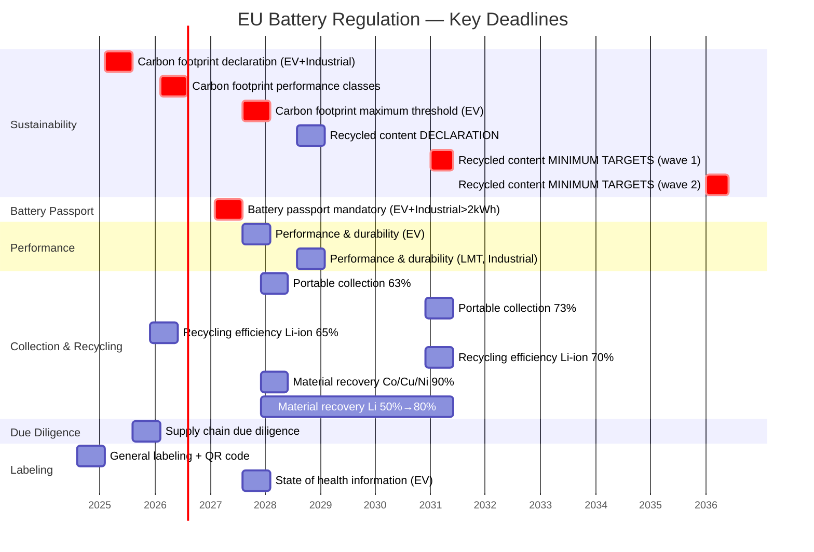

# EU Battery Regulation — 2023/1542

**Topic:** EU Battery Regulation — comprehensive lifecycle regulation for batteries covering sustainability, safety, labeling, carbon footprint, due diligence, recycled content, collection, recycling, and digital battery passport  
**Standard:** Regulation (EU) 2023/1542 concerning batteries and waste batteries (replacing Directive 2006/66/EC)  
**SDO:** European Commission; European Parliament; Council of the EU  
**Audience:** Battery manufacturers, automotive OEMs, electronics manufacturers, sustainability/compliance managers, supply chain professionals, recycling operators  
**Prerequisites:** Basic electrochemistry, EU regulatory framework (CE marking, conformity assessment), supply chain management, carbon footprint methodology (ISO 14067)

---

## Chapter 1 — Historical Context & Origin Story

### 1.1 Timeline

| Year | Event | Significance |
|------|-------|-------------|
| 1991 | EU Battery Directive 91/157/EEC | First EU regulation on batteries; focus on hazardous substances (mercury, cadmium) |
| 2006 | Battery Directive 2006/66/EC | Comprehensive battery regulation; collection targets; recycling efficiencies; marking; mercury/cadmium restrictions |
| 2017 | European Battery Alliance launched | EU strategic initiative to build competitive battery manufacturing value chain in Europe |
| 2019 | EU Green Deal announced | Strategic framework; circular economy; climate neutrality by 2050; batteries identified as priority |
| 2020 | Commission proposes new Battery Regulation | Replaces 2006 Directive; adds: carbon footprint, recycled content, due diligence, battery passport, performance requirements |
| 2022 | Political agreement reached (Council + Parliament) | Trilogues completed; final text agreed |
| 2023 | **Regulation (EU) 2023/1542** published (17 August 2023) | Enters into force; replaces Directive 2006/66/EC; phased implementation 2024-2036 |
| 2024 | First obligations apply (labeling, marking, hazardous substances) | QR code; battery identification; hazardous substance restrictions; CE marking |
| 2025 | **Carbon footprint declaration** mandatory (EV + industrial batteries) | PCF per kWh declared; methodology defined in delegated acts |
| 2026 | Carbon footprint **performance classes** (EV + industrial) | Batteries classified by carbon footprint performance (A to E scale expected) |
| 2027 | Carbon footprint **maximum threshold** (EV batteries) | Batteries exceeding threshold cannot be placed on EU market |
| 2028 | **Recycled content** declaration mandatory | Cobalt, lead, lithium, nickel: declare percentage recycled content |
| 2031 | Recycled content **minimum targets** (first wave) | Cobalt: 16%; lead: 85%; lithium: 6%; nickel: 6% — mandatory minimums |
| 2030 | **Battery passport** mandatory (EV + industrial >2 kWh) | Digital record of battery lifecycle information |
| 2036 | Recycled content minimum targets (second wave — higher) | Cobalt: 26%; lithium: 12%; nickel: 15% |

### 1.2 Battery Categories

| Category | Definition | Examples | Key Requirements |
|----------|-----------|---------|------------------|
| **Portable batteries** | Sealed; ≤5 kg; not industrial/EV/SLI; not designed for industrial use | Consumer electronics batteries (phone, laptop, power tools, e-bikes <750W) | Collection targets (63% by 2027; 73% by 2030); removability requirement |
| **SLI batteries** (Starting, Lighting, Ignition) | Designed to supply electrical power for starting, lighting, or ignition of vehicles | Car 12V batteries; truck batteries | Collection + recycling targets; labeling; state-of-health (future) |
| **Industrial batteries** | Designed for industrial use; >2 kWh (or specifically for industrial use) | Energy storage systems; forklift batteries; telecom backup; UPS | Carbon footprint; battery passport; performance/durability; due diligence |
| **EV batteries** (Electric Vehicle) | Designed for traction in electric vehicles (L-category vehicles and above) | BEV, PHEV, e-bus, e-truck traction batteries | Carbon footprint + threshold; battery passport; recycled content; performance; due diligence; second life |
| **LMT batteries** (Light Means of Transport) | For e-bikes (>750W), e-scooters, other light electric vehicles | E-bike batteries (>750W); e-scooter batteries; e-moped batteries | Removability (by independent professional); performance; labeling |

---

## Chapter 2 — Standard Architecture & Structure

### 2.1 Regulation Structure (Key Chapters)

| Chapter | Title | Key Obligations |
|:-------:|-------|-----------------|
| I | General provisions | Scope; definitions; free movement; placing on market requirements |
| II | Sustainability requirements | Carbon footprint (Art 7); recycled content (Art 8); performance & durability (Art 9, 10); removability & replaceability (Art 11) |
| III | Labeling and information | Labeling (Art 13); marking (Art 14); QR code (Art 13); state of health information |
| IV | Conformity of batteries | CE marking; EU declaration of conformity; conformity assessment procedures; notified bodies |
| V | Obligations of economic operators | Manufacturer obligations; importer obligations; distributor obligations; authorized representative |
| VI | Battery due diligence | Supply chain due diligence (Art 48-52); cobalt, natural graphite, lithium, nickel, manganese |
| VII | Battery passport | Digital battery passport (Art 77); required data; access rules; data carrier |
| VIII | Management of waste batteries | Collection (targets by category); treatment & recycling; recycling efficiencies; material recovery rates; producer responsibility (EPR) |
| IX | Digital tools/databases | Battery passport system; electronic exchange system |
| X | Green public procurement | Minimum GPP criteria for batteries |
| XI | Final provisions | Delegated acts; implementing acts; penalties; transitional provisions |

### 2.2 Key Requirements Timeline



---

## Chapter 3 — Technical Deep Dive

### 3.1 Carbon Footprint Requirements (Article 7)

| Requirement | Scope | Timeline | Methodology |
|-------------|-------|:--------:|-------------|
| **Carbon footprint declaration** | EV batteries; industrial rechargeable >2 kWh | 2025 (18 months after delegated act) | Life cycle GHG: raw material → production → distribution → end-of-life; per kWh of battery capacity; ISO 14040/14044 + ISO 14067 basis; EU-specific Product Environmental Footprint Category Rules (PEFCR) for batteries |
| **Performance classes** | Same | 2026 (start + 18 months) | Classification: A (lowest carbon) to E (highest carbon); based on distribution of declared footprints; enables comparison |
| **Maximum threshold** | EV batteries (initially) | 2027 (start + 36 months) | Batteries exceeding the maximum lifecycle CO₂e per kWh cannot be placed on EU market; value TBD in delegated act |

**Carbon footprint calculation boundary:**

$$\text{PCF}_{\text{battery}} = \frac{\sum_{i} \text{GHG}_i \text{ (all life cycle stages)}}{C_{\text{rated}}} \quad \text{[kgCO₂e/kWh]}$$

Where:
- Life cycle stages: raw material acquisition + pre-processing + cell manufacturing + battery assembly + distribution + end-of-life (including recycling credits)
- $C_{\text{rated}}$ = rated energy capacity of battery [kWh]

### 3.2 Recycled Content Requirements (Article 8)

| Material | Declaration (2028) | Minimum Target (2031) | Minimum Target (2036) |
|:--------:|:---:|:---:|:---:|
| **Cobalt** | Declare % | **16%** | **26%** |
| **Lead** | Declare % | **85%** | **85%** |
| **Lithium** | Declare % | **6%** | **12%** |
| **Nickel** | Declare % | **6%** | **15%** |

Scope: applies to industrial batteries >2 kWh, EV batteries, SLI batteries  
Calculation: % recycled content from manufacturing waste and post-consumer waste (separately tracked)

### 3.3 Performance & Durability Requirements (Article 9-10)

| Parameter | EV Batteries | Industrial Batteries (stationary storage) |
|-----------|:---:|:---:|
| **Cycle life** | Minimum cycles to 80% capacity retention (e.g., ≥1000 cycles at specified C-rate and temperature) | Minimum cycles (e.g., ≥4000 for daily cycling applications) |
| **Calendar life** | State of health retention after X years (e.g., ≥80% SOH at 8 years) | Specified per application type |
| **Rate capability** | Specified discharge/charge rates with efficiency requirements | Round-trip efficiency requirements (≥85-90%) |
| **Internal resistance** | Maximum resistance increase over life (%) | Specified |
| **Energy throughput** | Total energy that can be stored/delivered over life (MWh) | Specified |
| **Temperature range** | Operating range (e.g., -20°C to +45°C) without excessive degradation | Specified per application |

### 3.4 Battery Passport (Article 77)

| Data Category | Information Required | Access Level |
|:---:|------|:---:|
| **General** | Manufacturer; model; chemistry; capacity; weight; dimensions; manufacturing date/place | Public |
| **Carbon footprint** | Declared PCF (kgCO₂e/kWh); performance class; supporting documentation reference | Public |
| **Composition** | Chemistry type; critical raw materials content; hazardous substances; recycled content % | Public |
| **Supply chain** | Due diligence information; responsible sourcing | Restricted (regulators + authorized parties) |
| **Performance** | Rated capacity; energy; power; cycle life; efficiency; self-discharge | Public |
| **State of health** (during use) | SOH; SOC; remaining capacity; remaining energy; charge/discharge events; operating conditions history | Battery owner + authorized service |
| **End-of-life** | Disassembly instructions; recycler information; second-life suitability assessment | Recyclers + authorized parties |

Access via: **QR code** on battery → link to digital passport system (cloud-based; interoperable)

---

## Chapter 4 — Implementation Guide

### 4.1 Compliance Roadmap for Battery Manufacturers

| Phase | Timeline | Actions | Output |
|:-----:|:--------:|---------|--------|
| **1. Classification** | Now | Determine battery category (portable/LMT/SLI/industrial/EV); identify applicable requirements per timeline | Category determination; requirements matrix |
| **2. Labeling & marking** | By 2024-2025 | Implement QR code; CE marking; labeling content (capacity; chemistry; collection symbol; Cd/Pb content); separate collection symbol; safety markings | Updated labels; QR code system; DoC |
| **3. Carbon footprint** | By 2025 (EV/industrial) | Conduct LCA per PEFCR for batteries; calculate PCF (kgCO₂e/kWh); declare; prepare for performance class; identify reduction measures | PCF declaration; LCA report; reduction roadmap |
| **4. Due diligence** | By 2025 | Implement supply chain due diligence for cobalt, lithium, nickel, natural graphite, manganese; OECD Due Diligence Guidance; third-party audit | Due diligence policy; supply chain mapping; audit reports |
| **5. Performance & durability** | By 2027 (EV) | Test and declare performance parameters; ensure products meet minimum thresholds; design for durability | Test reports; performance declarations; design validation |
| **6. Battery passport** | By 2027 (EV/industrial >2 kWh) | Implement digital passport system; data collection throughout lifecycle; QR code linkage; interoperable platform | Passport system; data model; QR deployment |
| **7. Recycled content** | By 2028 (declaration); 2031 (minimums) | Track recycled content in materials; establish recycled material supply chains; achieve minimum targets | Recycled content tracking; supply agreements; declaration |
| **8. EPR & collection** | By 2025+ | Register as producer; join/establish PRO (Producer Responsibility Organization); contribute to collection infrastructure; finance end-of-life management | PRO membership; registration; financial contributions |

### 4.2 Carbon Footprint Methodology (Battery PEFCR)

| Element | Requirement |
|---------|-------------|
| **Functional unit** | 1 kWh of total energy provided by battery over its lifetime (for comparative); OR 1 battery with rated capacity for declaration |
| **System boundary** | Cradle-to-grave: (1) Raw material acquisition + processing; (2) Cell manufacturing; (3) Battery pack assembly; (4) Distribution; (5) Use phase (energy losses during charge/discharge); (6) Collection + recycling + disposal |
| **Allocation** | Specific rules for multi-output processes (e.g., co-products of metal refining); Circular Footprint Formula (CFF) for end-of-life recycling credits |
| **Data requirements** | Primary (specific) data for cell manufacturing and battery assembly; secondary data for upstream (materials) — must use PEFCR-approved databases; temporal: <5 years; geographic: specific where possible |
| **Impact category** | Climate Change (GWP100, IPCC AR5/AR6) — single category for carbon footprint declaration |
| **Verification** | Third-party verification required by accredited body; methodology compliance check + data quality assessment |

### 4.3 Due Diligence Requirements (Article 48-52)

| Obligation | Detail |
|------------|--------|
| **Scope** | Economic operators placing batteries on EU market; applies to: cobalt, natural graphite, lithium, nickel, manganese in batteries |
| **Framework** | OECD Due Diligence Guidance for Responsible Supply Chains of Minerals from Conflict-Affected and High-Risk Areas |
| **Step 1** | Establish management systems: supply chain policy; internal management structure; traceability system; supplier engagement |
| **Step 2** | Identify and assess risks: human rights (child labor, forced labor); environmental (water, deforestation, pollution); governance (corruption, conflict financing) |
| **Step 3** | Design and implement strategy to respond to risks: mitigation measures; engagement with suppliers; risk-based approach |
| **Step 4** | Third-party audit of due diligence management system (annual); by recognized audit scheme or notified body |
| **Step 5** | Report: public reporting on due diligence policies, risks identified, mitigation actions; available to market surveillance authorities |

---

## Chapter 5 — Conformity Assessment

### 5.1 Conformity Assessment Routes

| Battery Category | Assessment Module | Involvement |
|:---:|:---:|---|
| Portable / SLI / LMT | Module A (internal production control) OR Module D1 (QA of production) | Self-assessment possible; no mandatory third-party for basic requirements |
| Industrial (>2 kWh) | Module B + C (EU-type examination + conformity to type) OR Module H (full quality assurance) | Notified body involvement for carbon footprint verification |
| EV batteries | Module B + C OR Module H | Notified body involvement for carbon footprint verification + performance |
| Carbon footprint verification | Separate verification | Accredited third party verifies PCF calculation |
| Battery passport | System requirements | Platform must meet interoperability/security requirements |

### 5.2 CE Marking & Declaration of Conformity

| Element | Requirement |
|---------|-------------|
| **CE marking** | Required on all batteries placed on EU market; indicates conformity with Regulation |
| **EU DoC** | Manufacturer declares conformity with all applicable requirements; references harmonized standards used; signed by authorized person |
| **Technical documentation** | Design data; manufacturing process; test reports; performance data; carbon footprint calculation; due diligence reports; must be kept 10 years |
| **Notified body** | Required for carbon footprint verification and certain conformity assessment modules (industrial/EV batteries) |

---

## Chapter 6 — Regional Context

### 6.1 Battery Regulations Globally

| Region | Regulation | Key Requirements | Comparison to EU |
|--------|-----------|-----------------|:---:|
| **EU** | Regulation 2023/1542 | Most comprehensive: carbon footprint + passport + recycled content + due diligence + performance + EPR + collection + recycling | Reference (most stringent) |
| **US** | IRA (Inflation Reduction Act); EPA regulations; state-level (CA) | Tax incentives for domestic content; recycling requirements vary by state; no federal carbon footprint mandate | Less prescriptive; incentive-based vs. mandatory |
| **China** | GB standards for batteries; recycling requirements; traceability platform | National traceability platform for EV batteries; recycling responsibility; performance standards (GB/T) | Traceability system similar to passport concept; less on carbon footprint |
| **Japan** | Battery recycling law; JIS standards | Collection/recycling obligations; industrial standards | Focus on recycling; less on production sustainability |
| **Korea** | Battery recycling; K-battery strategy | Strategic industry policy + recycling; Extended Producer Responsibility | EPR similar; carbon footprint not yet mandatory |
| **Global** | UN transport regulations (UN 38.3); IEC 62133; IEC 62619; IEC 62660 | Safety in transport and use; performance testing | Safety standards referenced by EU Battery Regulation |

### 6.2 EU Battery Regulation vs. Old Directive 2006/66/EC

| Dimension | Directive 2006/66/EC (old) | Regulation 2023/1542 (new) |
|-----------|:---:|:---:|
| Legal form | Directive (transposed by member states) | **Regulation** (directly applicable; uniform across EU) |
| Battery categories | Portable; industrial; automotive | **Portable; LMT; SLI; Industrial; EV** (more granular) |
| Carbon footprint | Not addressed | **Mandatory** (declaration → classes → maximum threshold) |
| Recycled content | Not addressed | **Mandatory** (declaration + minimum targets) |
| Due diligence | Not addressed | **Mandatory** (OECD framework; cobalt, lithium, nickel, graphite, manganese) |
| Battery passport | Not addressed | **Mandatory** (digital; QR code; lifecycle data) |
| Performance/durability | Not addressed | **Minimum requirements** (cycle life, efficiency, etc.) |
| Removability | Limited | **Strengthened** (consumer replacement of portable batteries; professional replacement for LMT) |
| Collection targets | 25% → 45% (portable) | **63% (2027) → 73% (2030)** portable; 51%→61% LMT |
| Recycling efficiency | 50% (Li-ion) | **65% (2025) → 70% (2030)** Li-ion |
| Material recovery | Not specified | **Cobalt 90%; Copper 90%; Nickel 90%; Lithium 50%→80%** |
| Scope | EU batteries | EU batteries + **imported batteries** (level playing field) |

---

## Chapter 7 — Comparison

### 7.1 Battery Chemistries & Regulation Impact

| Chemistry | Application | Carbon Footprint Impact | Recycled Content Challenge | Due Diligence Minerals |
|-----------|:---:|:---:|:---:|:---:|
| **NMC** (Nickel Manganese Cobalt) | EV; industrial storage | Moderate-High (mining + processing energy-intensive) | Cobalt, nickel, lithium supply developing | Cobalt (DRC risk); lithium; nickel; manganese |
| **NCA** (Nickel Cobalt Aluminum) | EV (Tesla/Panasonic) | Moderate-High | Similar to NMC | Cobalt; nickel; lithium |
| **LFP** (Lithium Iron Phosphate) | EV; storage; buses | Lower (no cobalt/nickel; simpler processing) | Lithium recycled content target challenging | Lithium; natural graphite (anode) |
| **LTO** (Lithium Titanate) | Industrial; fast-charge | Moderate | Lithium | Lithium |
| **Solid-state** (emerging) | Future EV | TBD (potentially lower if manufacturing efficient) | Depends on cathode chemistry | Depends on composition |
| **Lead-acid** | SLI; industrial backup | Low (mature; efficient) | **85% recycled content** already near target (lead recycling rate ~99%) | Lead well-established recycling loop |
| **NiMH** | Hybrid vehicles (legacy) | Moderate | Nickel | Nickel; rare earths (lanthanum) |

### 7.2 Battery Passport vs. Digital Product Passport (DPP)

| Aspect | Battery Passport (Art 77) | EU Digital Product Passport (ESPR) |
|--------|:---:|:---:|
| Legal basis | EU Battery Regulation 2023/1542 | EU Ecodesign for Sustainable Products Regulation (ESPR) |
| Timeline | 2027 (EV + industrial >2 kWh) | 2027+ (product-specific; phased by delegated acts) |
| Products | Batteries only | All products covered by ESPR (broad: electronics, textiles, furniture, etc.) |
| Data scope | Battery-specific: SOH, carbon footprint, chemistry, recycled content, disassembly, due diligence | Product-specific: materials, carbon footprint, repairability, recyclability, durability, hazardous substances |
| Dynamic data | Yes (state of health updated during use) | Potentially (depends on product type; less dynamic for non-electronic products) |
| Data carrier | QR code (mandatory) | QR code or other data carrier (RFID, NFC) |
| Interoperability | Must be interoperable (EU system; APIs) | Must be interoperable (EU DPP infrastructure) |
| Relationship | Battery passport is FIRST implementation of DPP concept | DPP is broader framework; battery passport was pilot/precursor |

---

## Chapter 8 — Mermaid Architecture Diagrams

### 8.1 Battery Lifecycle & Regulation Touchpoints

```mermaid
graph TB
    subgraph "Raw Materials"
        RM[Mining & Processing<br/>━━━━━━━━━━━<br/>Cobalt, lithium, nickel,<br/>graphite, manganese<br/>━━━━━━━━━━━<br/>REGULATION: Due diligence<br/>(Art 48-52); OECD framework;<br/>human rights; environment]
    end
    
    subgraph "Manufacturing"
        CELL[Cell Manufacturing<br/>━━━━━━━━━━━<br/>Electrode production;<br/>cell assembly; formation<br/>━━━━━━━━━━━<br/>REGULATION: Carbon footprint<br/>(Art 7); recycled content<br/>(Art 8)]
        
        PACK[Battery Pack Assembly<br/>━━━━━━━━━━━<br/>Module assembly;<br/>BMS; thermal management<br/>━━━━━━━━━━━<br/>REGULATION: Performance<br/>(Art 9-10); CE marking;<br/>safety (Art 12)]
    end
    
    subgraph "Market Placement"
        MARKET[Placing on Market<br/>━━━━━━━━━━━<br/>Conformity assessment;<br/>declaration of conformity<br/>━━━━━━━━━━━<br/>REGULATION: Labeling (Art 13);<br/>QR code; battery passport<br/>(Art 77); CE marking (Art 18)]
    end
    
    subgraph "Use Phase"
        USE[In-Service<br/>━━━━━━━━━━━<br/>Vehicle/application use;<br/>charging/discharging<br/>━━━━━━━━━━━<br/>REGULATION: State of health<br/>data (via BMS → passport);<br/>removability (Art 11)]
    end
    
    subgraph "Second Life"
        SL[Repurposing<br/>━━━━━━━━━━━<br/>EV → stationary storage<br/>Re-assessment; relabeling<br/>━━━━━━━━━━━<br/>REGULATION: Repurposing<br/>requirements (Art 14);<br/>new CE marking; passport update]
    end
    
    subgraph "End-of-Life"
        EOL[Collection & Recycling<br/>━━━━━━━━━━━<br/>Collection; pre-treatment;<br/>hydrometallurgical/pyrometallurgical<br/>recycling; material recovery<br/>━━━━━━━━━━━<br/>REGULATION: Collection targets<br/>(Art 59); recycling efficiency<br/>(Art 71); material recovery<br/>rates (Art 72); EPR (Art 56)]
    end
    
    RM --> CELL --> PACK --> MARKET --> USE
    USE --> SL --> EOL
    USE --> EOL
    EOL -.->|Recycled materials| RM
```

### 8.2 Battery Passport Data Architecture

```mermaid
graph TB
    subgraph "Data Sources"
        MFG_DATA[Manufacturer Data<br/>━━━━━━━━━━━<br/>• Chemistry, capacity, weight<br/>• Carbon footprint (PCF)<br/>• Recycled content %<br/>• Performance parameters<br/>• Manufacturing date/place<br/>• Due diligence summary]
        
        BMS[Battery Management System<br/>━━━━━━━━━━━<br/>• State of Health (SOH)<br/>• State of Charge (SOC)<br/>• Cycle count<br/>• Temperature history<br/>• Charging events<br/>• Fault records]
        
        SERVICE[Service Records<br/>━━━━━━━━━━━<br/>• Maintenance events<br/>• Repairs<br/>• Firmware updates<br/>• Capacity tests]
    end
    
    subgraph "Battery Passport System"
        PASSPORT[Digital Battery Passport<br/>━━━━━━━━━━━<br/>• Unique identifier (per battery)<br/>• QR code (physical link)<br/>• Static data (manufacturing)<br/>• Dynamic data (SOH updates)<br/>• Access control (role-based)]
    end
    
    subgraph "Users"
        OWNER[Battery Owner/Operator<br/>Full access to own battery data]
        REGULATOR[Market Surveillance Authority<br/>Full access for compliance check]
        RECYCLER[Recycler<br/>Disassembly info; chemistry; hazards]
        PUBLIC[Public<br/>General info; carbon footprint; performance class]
        SECOND[Second-Life Operator<br/>SOH; remaining capacity; suitability]
    end
    
    MFG_DATA --> PASSPORT
    BMS --> PASSPORT
    SERVICE --> PASSPORT
    PASSPORT --> OWNER & REGULATOR & RECYCLER & PUBLIC & SECOND
```

---

## Chapter 9 — Case Studies

### 9.1 Case Study: EV Battery Carbon Footprint Calculation

| Aspect | Detail |
|--------|--------|
| Battery | NMC811 (Nickel 80%, Manganese 10%, Cobalt 10%); 75 kWh usable capacity; 450 kg pack weight; prismatic cells; liquid cooling |
| Methodology | EU PEFCR for batteries (draft/delegated act methodology); ISO 14040/14044; ISO 14067; cradle-to-grave |
| **Raw materials (A1)** | Cathode active material (NMC811): mining + refining of Ni, Mn, Co + synthesis = 28 kgCO₂e/kWh. Anode (graphite): natural graphite mining + processing + synthetic graphite = 8 kgCO₂e/kWh. Electrolyte: LiPF₆ + solvents = 3 kgCO₂e/kWh. Separator: PE/PP membrane = 1 kgCO₂e/kWh. Current collectors (Al, Cu): 4 kgCO₂e/kWh. Housing/cooling (aluminum, steel, plastics): 5 kgCO₂e/kWh. BMS + electronics: 2 kgCO₂e/kWh. **Subtotal A1: 51 kgCO₂e/kWh** |
| **Cell manufacturing (A2)** | Electrode coating; drying (very energy-intensive); calendering; cell assembly; electrolyte filling; formation cycling. Energy: ~35-50 kWh electricity per kWh battery capacity (depends on factory efficiency). At grid factor 0.4 kgCO₂e/kWh: ~16 kgCO₂e/kWh battery. With dry-room energy: total **A2: 18 kgCO₂e/kWh** |
| **Pack assembly (A3)** | Module assembly; BMS installation; cooling system; testing; pack assembly. Energy: ~5 kWh per kWh battery. **A3: 3 kgCO₂e/kWh** |
| **Distribution (A4)** | Transport: factory (Asia typically) → EU. Sea freight + road. **A4: 1 kgCO₂e/kWh** |
| **Use phase (B)** | Energy losses during charge/discharge (round-trip efficiency ~92%): over 200,000 km vehicle life, charging losses estimated. For PCF declaration, use phase may be excluded or included depending on methodology boundary (current draft: production-focused). If included: ~5-10 kgCO₂e/kWh over life |
| **End-of-life (C+D)** | Recycling: collection + transport + recycling process energy - credit for recovered materials (recycled Co, Ni, Li avoid virgin production). Net: **C+D: -8 kgCO₂e/kWh** (credit from recycling) |
| **TOTAL PCF** | 51 + 18 + 3 + 1 + 0 - 8 = **~65 kgCO₂e/kWh** (cradle-to-gate + recycling credit; use phase excluded per methodology) |
| Performance class | If average EU EV battery PCF is ~70 kgCO₂e/kWh → this battery would be class B (below average; good) |
| Reduction opportunities | (1) Source cathode materials from lower-carbon supply chains (recycled content; renewable energy in refining). (2) Cell manufacturing with renewable electricity (biggest lever: 18 → 5 kgCO₂e if 100% RE). (3) Increase recycled content (reduces A1 impact). (4) Dry electrode processing (eliminates NMP solvent + energy-intensive drying). Potential: 65 → 35-40 kgCO₂e/kWh with best-in-class measures. |

### 9.2 Case Study: Battery Passport Implementation

| Aspect | Detail |
|--------|--------|
| Company | Battery pack manufacturer for commercial vehicles (trucks, buses); produces 5,000 packs/year; 150-250 kWh capacity |
| Requirement | Battery passport mandatory from 2027 for EV batteries; company prepares 2 years ahead |
| Implementation | (1) **Data model**: defined all required data fields per Art 77 + delegated acts; mapped to internal systems. (2) **IT system**: cloud-based passport platform (selected from emerging providers: Circulor, Everledger, Battery Pass consortium-aligned); API connections to: MES (manufacturing data), BMS (operational data), ERP (supply chain data), LCA tool (carbon footprint). (3) **Unique identifier**: each battery pack gets globally unique ID (format per ISO/DIS 15459 or GS1 standards); encoded in QR code affixed to pack. (4) **Static data population**: at manufacturing, passport auto-populated with: chemistry, capacity, dimensions, weight, carbon footprint class, recycled content, manufacturer details, conformity, due diligence summary. (5) **Dynamic data**: BMS sends periodic SOH updates (at defined intervals or events) via secure IoT connection to passport platform; SOH algorithm validated to meet accuracy requirements. (6) **Access control**: role-based (public view; owner view; service view; regulator view; recycler view); authentication per EU DPP infrastructure requirements. |
| Cost | Platform subscription: €50K/year; IT integration: €200K (one-time); ongoing data management: €30K/year; QR/labeling: €2 per unit. Total: ~€300K setup + €80K/year ongoing. |
| Challenges | (1) BMS-to-passport data interface standardization (no single standard yet; multiple candidates). (2) Second-life scenario: when battery is repurposed, passport must transfer to new operator and update responsible entity. (3) Data sovereignty: who owns passport data when battery changes hands? (Regulation defines access rights; implementation details complex). (4) Cybersecurity: passport platform must protect commercially sensitive data (manufacturing details; supply chain) while allowing public access to required fields. |

---

## Chapter 10 — Future Evolution

| Trend | Timeline | Impact |
|-------|----------|--------|
| **Carbon footprint maximum thresholds** | 2027 (EV) | Market access barrier; batteries must be below threshold; drives decarbonization of battery supply chain |
| **Recycled content enforcement** | 2031/2036 | Mandatory minimum recycled Co/Li/Ni; drives investment in recycling infrastructure; "urban mining" business model |
| **Battery passport ecosystem** | 2027+ | Digital infrastructure; data exchange standards; integration with vehicle systems; consumer transparency |
| **Second-life market** | 2025+ | Regulation enables second-life (repurposing requirements clear); creates new market for used EV batteries in stationary storage |
| **Gigafactory decarbonization** | Now-2030 | Battery manufacturers investing heavily in renewable energy, process efficiency, dry electrode technology to reduce PCF |
| **Solid-state batteries** | 2027-2030 | New chemistry entering market; regulation will apply; potentially lower carbon footprint (less energy-intensive manufacturing); recyclability TBD |
| **Sodium-ion batteries** | 2025-2027 | No lithium/cobalt/nickel; may have lower regulatory burden (no due diligence for these minerals); recycled content targets TBD |
| **Extended producer responsibility evolution** | 2025+ | More sophisticated EPR systems; modulated fees (eco-modulation based on recyclability, hazardous content) |
| **Global harmonization** | 2025-2030 | Other regions watching EU; potential for similar regulations (China already has traceability; US incentive-based); international standards alignment |
| **AI and predictive SOH** | Now | Advanced algorithms for accurate state-of-health prediction; feeds battery passport; enables better second-life decisions |

---

## Chapter 11 — Interview Questions & Career Guide

### Tier 1: Entry-Level

**Q1:** What is the EU Battery Regulation and what are its main requirements?  
**A:** The EU Battery Regulation (2023/1542) is a comprehensive EU law that regulates batteries throughout their entire lifecycle — from raw material extraction to end-of-life recycling. It replaces the old Battery Directive 2006/66/EC and adds significant new requirements. Main pillars: (1) **Carbon footprint**: EV and industrial batteries must declare their carbon footprint per kWh, be classified into performance classes (A-E), and eventually stay below a maximum threshold (or be banned from EU market). (2) **Recycled content**: mandatory minimum percentages of recycled cobalt, lithium, nickel, and lead must be used (16-85% depending on material, increasing over time). (3) **Due diligence**: supply chain due diligence for cobalt, lithium, nickel, graphite, manganese following OECD guidance (human rights; environment). (4) **Battery passport**: digital record containing lifecycle data (chemistry, performance, SOH, carbon footprint, materials) accessible via QR code. (5) **Performance & durability**: minimum requirements for cycle life, efficiency, and longevity. (6) **Collection & recycling**: higher collection targets (73% for portable by 2030); higher recycling efficiencies (70% for Li-ion by 2030); material recovery targets (90% Co/Ni/Cu; 80% Li). (7) **Labeling**: QR code, CE marking, capacity, chemistry, collection symbol.

**Q2:** What battery categories does the regulation define?  
**A:** Five categories: (1) **Portable** — sealed, ≤5 kg, for portable devices (phones, laptops, power tools). (2) **LMT** (Light Means of Transport) — for e-bikes >750W, e-scooters, e-mopeds. (3) **SLI** (Starting, Lighting, Ignition) — vehicle starter batteries (12V car batteries). (4) **Industrial** — designed for industrial use, typically >2 kWh (energy storage, UPS, forklifts). (5) **EV** (Electric Vehicle) — traction batteries for electric vehicles. Each category has different requirements and timelines. EV and industrial batteries have the most requirements (carbon footprint, passport, performance). Portable batteries have collection/recycling focus plus removability requirements.

### Tier 2: Mid-Level

**Q3:** How would you calculate the carbon footprint of a battery for EU Battery Regulation compliance?  
**A:** [Detailed answer covering: (1) Methodology: ISO 14040/14044 + ISO 14067 + EU-specific PEFCR (Product Environmental Footprint Category Rules) for batteries. (2) System boundary: cradle-to-grave (raw material → cell manufacturing → pack assembly → distribution → end-of-life), expressed per kWh of rated capacity. (3) Life cycle stages modeled: upstream materials (mining/refining of cathode, anode, electrolyte, separators, metals); cell manufacturing (electrode production, cell assembly, formation — very energy-intensive); pack assembly (BMS, cooling, housing); distribution; end-of-life (recycling with credits for recovered materials using Circular Footprint Formula). (4) Data: primary data required for own manufacturing (energy, yields, materials); secondary data from approved databases for upstream (e.g., ecoinvent, EF database); supplier-specific data preferred for cathode active material. (5) Emission factor for electricity: specific to manufacturing location; critical parameter (manufacturing in Norway vs. China: factor of 10× difference). (6) Output: kgCO₂e per kWh rated capacity. (7) Verification: third-party verification by accredited body required before declaration.]

### Tier 3: Senior

**Q4:** Design a compliance strategy for a battery cell manufacturer expanding into the EU market, covering all Battery Regulation requirements from 2025 through 2036.  
**A:** [Comprehensive answer covering full lifecycle compliance roadmap; carbon footprint reduction strategy; supply chain due diligence program; recycled content sourcing and tracking; passport system design; conformity assessment preparation; EPR obligations; strategic implications for cell chemistry choice and manufacturing location.]

---

## Chapter 12 — Cheat Sheet & Quick Reference

### Key Deadlines Summary

```
2024:  Labeling, QR code, CE marking, hazardous substance restrictions
2025:  Carbon footprint DECLARATION (EV + industrial ≥2 kWh)
       Supply chain due diligence active
       Recycling efficiency Li-ion ≥65%
2026:  Carbon footprint PERFORMANCE CLASSES
2027:  Carbon footprint MAXIMUM THRESHOLD (EV)
       Battery PASSPORT mandatory (EV + industrial >2 kWh)
       Performance & durability requirements (EV)
       Material recovery: Co 90%; Cu 90%; Ni 90%; Li 50%
       Portable battery collection ≥63%
2028:  Recycled content DECLARATION mandatory
       Performance & durability (LMT, industrial)
2030:  Recycling efficiency Li-ion ≥70%
       Portable collection ≥73%
       Material recovery: Li ≥80%
2031:  Recycled content MINIMUM TARGETS: Co 16%; Pb 85%; Li 6%; Ni 6%
2036:  Recycled content HIGHER TARGETS: Co 26%; Li 12%; Ni 15%
```

### Battery Passport — Required Data Points

```
STATIC (set at manufacturing):
□ Manufacturer name + contact
□ Manufacturing date + place
□ Battery category (EV/Industrial/LMT/SLI/Portable)
□ Chemistry (NMC/NCA/LFP/etc.)
□ Rated capacity (kWh) + nominal voltage
□ Weight + dimensions
□ Carbon footprint (kgCO₂e/kWh) + performance class
□ Recycled content (% Co, Li, Ni, Pb)
□ Hazardous substances
□ Due diligence summary
□ Performance parameters (cycle life, efficiency, rate capability)
□ CE marking + DoC reference
□ Disassembly/recycling instructions

DYNAMIC (updated during use):
□ State of Health (SOH) %
□ State of Charge (SOC)
□ Remaining useful capacity
□ Number of charging cycles
□ Operating temperature history
□ Fault/incident records
□ Maintenance/service records
```

### Carbon Footprint Quick Estimates

```
TYPICAL PCF (kgCO₂e per kWh rated capacity):
━━━━━━━━━━━━━━━━━━━━━━━━━━━━━━━━━━━━━━━━━━━━
NMC (current average):         60-90 kgCO₂e/kWh
NMC (best-in-class, 2025):     40-55 kgCO₂e/kWh
LFP (current average):         40-65 kgCO₂e/kWh
LFP (best-in-class):           30-45 kgCO₂e/kWh
Lead-acid:                     20-30 kgCO₂e/kWh

KEY LEVERS FOR REDUCTION:
• Cell manufacturing energy source: fossil → renewable = -15 to -25 kgCO₂e/kWh
• Recycled cathode materials: -5 to -15 kgCO₂e/kWh
• Process efficiency (dry electrode): -5 to -10 kgCO₂e/kWh
• Localized supply chain: -3 to -8 kgCO₂e/kWh (reduced transport)
```

---

*End of Document — 10_EU_Battery_Regulation.md*
