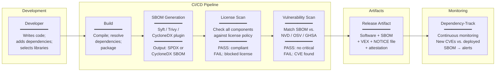

# Open Source Licensing & Software Bill of Materials (SBOM) — Category Overview

**Topic:** Open Source Licensing & Software Bill of Materials — comprehensive guide to SBOM standards, open source license compliance, supply chain security, and software composition analysis  
**Standard:** SPDX 3.0; CycloneDX 1.6; NTIA SBOM Minimum Elements; OpenChain ISO 5230; OpenChain ISO 18974; SWID Tags (ISO/IEC 19770-2)  
**SDO:** Linux Foundation (SPDX, OpenChain); OWASP (CycloneDX); NTIA/CISA (US Government); ISO/IEC JTC 1; European Commission (EU CRA)  
**Audience:** Software engineers, DevSecOps engineers, open source program office (OSPO) managers, compliance/legal teams, embedded software engineers, supply chain security professionals  
**Prerequisites:** Software development fundamentals, package management (npm, pip, Maven, etc.), version control (Git), basic intellectual property law concepts, CI/CD pipelines

---

## Chapter 1 — Historical Context & Origin Story

### 1.1 Timeline

| Year | Event | Significance |
|------|-------|-------------|
| 1983 | GNU Project (Richard Stallman) | Free software movement begins; "software should be free (as in freedom)" |
| 1985 | Free Software Foundation (FSF) founded | Institutional home for free software; stewards GPL |
| 1989 | **GPL v1** published | First copyleft license; derived works must be free/open; foundational |
| 1991 | GPL v2; Linux kernel (under GPL v2); LGPL v2 | GPL v2 becomes dominant FOSS license; Linux drives adoption; LGPL for libraries |
| 1993 | BSD licenses formalized; MIT License widespread | Permissive licensing alternative; academic-origin; minimal restrictions |
| 1998 | **Open Source Initiative (OSI)** founded; OSD published | Open Source Definition (10 criteria); "open source" term coined; business-friendly framing |
| 1999 | Apache License 1.0 | Apache Software Foundation license; web server dominance |
| 2004 | **Apache License 2.0** | Explicit patent grant; permissive; corporate-friendly; widely adopted |
| 2007 | **GPL v3, AGPL v3, LGPL v3** | Anti-Tivoization; patent provisions; network copyleft (AGPL); modernized |
| 2010 | SPDX project started (Linux Foundation) | Standardize how SBOM/license info is communicated; solve "license confusion" |
| 2012 | SPDX 1.0 published; MPL 2.0 published | First SPDX specification; Mozilla's modern file-level copyleft |
| 2015 | Heartbleed aftermath; FOSS dependency awareness | OpenSSL vulnerability exposes critical infrastructure reliance on unmaintained FOSS |
| 2017 | Equifax breach (Apache Struts CVE) | Known vulnerability in open source dependency left unpatched; massive breach; SBOM urgency |
| 2019 | OpenChain Project matures (Linux Foundation) | Supply chain open source compliance specification |
| 2020 | **OpenChain ISO 5230:2020** published; SolarWinds attack | First ISO standard for open source compliance; SolarWinds demonstrates supply chain risk |
| 2021 | **US Executive Order 14028**; NTIA SBOM Minimum Elements; Log4Shell | SBOM mandated for federal software; NTIA defines minimum SBOM requirements; Log4j demonstrates dependency risk at scale |
| 2022 | SPDX 2.3; CycloneDX 1.4; **OpenChain ISO 18974** (security) | SBOM standards mature; security-focused SBOM standard added |
| 2023 | SPDX 3.0 development; CycloneDX 1.5/1.6; **EU Cyber Resilience Act (CRA)** | EU mandates SBOM for products with digital elements; SBOM becomes regulatory requirement in EU |
| 2024 | **SPDX 3.0 final**; EU CRA enters into force; VEX adoption | Major SPDX upgrade (profiles: AI, security, build); EU CRA compliance timeline begins |
| 2025 | EU CRA implementation; US FDA SBOM enforcement; SBOM tooling maturation | SBOM moves from "nice to have" to mandatory compliance requirement globally |

### 1.2 Why SBOM & License Compliance Matter Now

| Event/Driver | Impact | Lesson |
|-------------|--------|--------|
| **Log4Shell (Dec 2021)** | Critical vulnerability (CVE-2021-44228) in Log4j; present in >35,000 packages; used in millions of products; emergency patching worldwide | Without SBOM: organizations couldn't quickly determine if they were affected. With SBOM: immediate identification of affected software. |
| **SolarWinds (2020)** | Supply chain compromise; malicious code inserted into build process; 18,000+ organizations affected | Software supply chain integrity is critical; need visibility into all components and build provenance |
| **Equifax breach (2017)** | Known Apache Struts CVE unpatched for months; 147 million records exposed | Knowing your dependencies (SBOM) is prerequisite to patch management |
| **US EO 14028 (2021)** | Federal government mandates SBOM from software suppliers; CISA/NTIA guidance | Regulatory push: software vendors must provide SBOM to sell to US government |
| **EU CRA (2024)** | ALL products with digital elements in EU market must have SBOM; vulnerability handling process mandatory | Affects ALL software/firmware in products sold in EU; embedded systems included |
| **GPL compliance lawsuits** | Multiple enforcement actions (BusyBox; VMware v. Hellwig; etc.) | Non-compliance with open source licenses has legal consequences; need systematic compliance |
| **License incompatibility** | GPL v2 + Apache 2.0 conflict; mixing copyleft with proprietary without understanding | Automated license scanning prevents costly mistakes; license compatibility must be verified |

---

## Chapter 2 — Standard Architecture & Structure

### 2.1 SBOM Ecosystem Overview

```mermaid
graph TB
    subgraph "SBOM Standards"
        SPDX[SPDX 3.0<br/>━━━━━━━━━━━<br/>Linux Foundation<br/>ISO/IEC 5962:2021<br/>━━━━━━━━━━━<br/>Profiles: Software,<br/>Security, License, AI,<br/>Dataset, Build, Lint<br/>━━━━━━━━━━━<br/>Formats: JSON-LD,<br/>YAML, XML, Tag-Value]
        
        CDX[CycloneDX 1.6<br/>━━━━━━━━━━━<br/>OWASP Foundation<br/>━━━━━━━━━━━<br/>Focus: Security<br/>BOM types: SBOM,<br/>SaaSBOM, HBOM,<br/>OBOM, VEX<br/>━━━━━━━━━━━<br/>Formats: JSON, XML,<br/>Protobuf]
        
        SWID[SWID Tags<br/>━━━━━━━━━━━<br/>ISO/IEC 19770-2<br/>━━━━━━━━━━━<br/>Software identification<br/>Asset management<br/>━━━━━━━━━━━<br/>Format: XML]
    end
    
    subgraph "Regulatory Mandates"
        EO[US EO 14028<br/>NTIA SBOM<br/>FDA SBOM]
        CRA[EU Cyber<br/>Resilience Act<br/>(SBOM mandatory)]
        NIS2[EU NIS2<br/>(supply chain<br/>security)]
    end
    
    subgraph "License Compliance"
        OC[OpenChain ISO 5230<br/>━━━━━━━━━━━<br/>License compliance program]
        OC_SEC[OpenChain ISO 18974<br/>━━━━━━━━━━━<br/>Security assurance program]
        LICENSES[License Universe<br/>━━━━━━━━━━━<br/>Copyleft: GPL, AGPL, LGPL<br/>Permissive: MIT, Apache, BSD<br/>Weak copyleft: MPL, EUPL]
    end
    
    subgraph "Tools & Scanning"
        GEN[SBOM Generation<br/>Syft, Trivy, FOSSA,<br/>Black Duck, Scancode]
        VULN[Vulnerability Scanning<br/>Grype, OSV, NVD,<br/>Dependency-Check]
        LICENSE_SCAN[License Scanning<br/>FOSSology, Scancode,<br/>FOSSA, Black Duck]
    end
    
    EO & CRA & NIS2 --> SPDX & CDX & SWID
    SPDX & CDX --> GEN --> VULN
    OC & OC_SEC --> LICENSE_SCAN
    LICENSES --> LICENSE_SCAN
```

### 2.2 NTIA SBOM Minimum Elements

| Element | Description | Example |
|---------|-----------|---------|
| **Supplier name** | Entity that creates, defines, or identifies components | "Apache Software Foundation" |
| **Component name** | Designation assigned to a unit of software | "log4j-core" |
| **Version** | Identifier used by supplier to specify a change | "2.17.1" |
| **Unique identifier** | Other identifiers used to identify component (PURL, CPE, SWID) | `pkg:maven/org.apache.logging.log4j/log4j-core@2.17.1` |
| **Dependency relationship** | Characterizes relationship between components (depends-on, contains, etc.) | "spring-boot-starter DEPENDS-ON log4j-core" |
| **Author of SBOM data** | Entity that creates the SBOM data | "Acme Corp OSPO" |
| **Timestamp** | Date/time SBOM data was assembled | "2024-06-15T10:30:00Z" |

### 2.3 Open Source License Spectrum

| Category | Licenses | Key Obligation | Use in Proprietary Product |
|----------|----------|----------------|:---:|
| **Public Domain / No Rights** | CC0; Unlicense; WTFPL | None | ✅ Unrestricted |
| **Permissive** | MIT; BSD-2; BSD-3; ISC; Zlib | Attribution (include copyright notice + license text) | ✅ With attribution |
| **Permissive + Patent** | Apache 2.0; Boost | Attribution + patent grant (and patent retaliation clause) | ✅ With attribution |
| **Weak Copyleft (file-level)** | MPL 2.0; EUPL 1.2; CDDL | Modifications to LICENSED FILES must be shared; rest of product unaffected | ✅ If modified files shared |
| **Weak Copyleft (library)** | LGPL 2.1; LGPL 3.0 | Library modifications must be shared; linking (dynamic) doesn't trigger copyleft for your code; must allow relinking | ✅ If dynamically linked + user can relink |
| **Strong Copyleft** | GPL 2.0; GPL 3.0 | Entire derivative work must be GPL; source code must be available | ⚠️ Only if entire product is GPL |
| **Network Copyleft** | AGPL 3.0 | Like GPL + network interaction triggers copyleft (SaaS use included) | ⚠️ Even SaaS/cloud use requires source sharing |

---

## Chapter 3 — Technical Deep Dive

### 3.1 SPDX 3.0 Architecture

| Concept | Description |
|---------|-------------|
| **Element** | Base class for all SPDX objects (package, file, snippet, relationship, annotation) |
| **SpdxDocument** | Root container; contains elements + metadata |
| **Package** | Software component (library, application, container, firmware) |
| **File** | Individual file within a package |
| **Snippet** | Portion of a file (for license info on specific code sections) |
| **Relationship** | Connection between elements (DEPENDS_ON, CONTAINS, BUILD_TOOL_OF, etc.) |
| **Profile** | Domain-specific extension: Software, Security (VEX), Licensing, AI, Dataset, Build |
| **ExternalIdentifier** | Links to external systems (PURL, CPE, SWID, Git commit) |

### 3.2 CycloneDX 1.6 BOM Types

| BOM Type | Purpose | Content |
|----------|---------|---------|
| **SBOM** (Software BOM) | Inventory of software components | Libraries, frameworks, applications, containers, OS packages |
| **SaaSBOM** | Service dependencies for cloud applications | APIs consumed, third-party services, cloud infrastructure dependencies |
| **HBOM** (Hardware BOM) | Hardware components with firmware | Hardware modules, ICs, firmware versions on hardware |
| **OBOM** (Operations BOM) | Runtime configuration | Deployed software, runtime environments, configuration |
| **VEX** (Vulnerability Exploitability eXchange) | Vulnerability status communication | CVE applicability: affected / not affected / under investigation / fixed |
| **MBOM** (Manufacturing BOM) | Manufacturing recipe | Components + assembly instructions (factory BOM) |

### 3.3 Package URL (PURL) — Universal Package Identifier

| Part | Description | Example |
|------|-----------|---------|
| **scheme** | Always "pkg" | `pkg:` |
| **type** | Package ecosystem | `maven`, `npm`, `pypi`, `cargo`, `golang`, `nuget`, `deb`, `rpm`, `github` |
| **namespace** | Owner/group (type-specific) | `org.apache.logging.log4j` (Maven); `@angular` (npm) |
| **name** | Package name | `log4j-core`; `express`; `requests` |
| **version** | Specific version | `2.17.1`; `4.18.2`; `2.31.0` |
| **qualifiers** | Extra qualifying data | `?type=jar&classifier=sources` |
| **subpath** | Path within package | `#src/main/java` |

Full example: `pkg:maven/org.apache.logging.log4j/log4j-core@2.17.1`

### 3.4 License Compatibility Issues

| Combination | Compatible? | Issue |
|-------------|:---:|------|
| MIT + Apache 2.0 | ✅ Yes | Both permissive; Apache adds patent grant; combined work can be under either (or proprietary) |
| MIT + GPL v3 | ✅ Yes | MIT code can be incorporated into GPL project (MIT is GPL-compatible); combined work is GPL v3 |
| Apache 2.0 + GPL v2 (only) | ❌ **No** | Apache 2.0 patent retaliation clause is "additional restriction" per GPL v2; FSF confirms incompatibility |
| Apache 2.0 + GPL v3 | ✅ Yes | GPL v3 explicitly permits Apache 2.0 compatibility (§ 7 additional permissions) |
| GPL v2 + GPL v3 | ❌ **No** (unless "v2 or later") | GPL v2-only code cannot be combined with GPL v3 code; "or later" clause resolves this |
| LGPL + proprietary | ✅ Yes (with conditions) | Dynamic linking to LGPL library: proprietary code OK; must allow user to re-link (provide object files or dynamic linking) |
| GPL + proprietary | ❌ **No** | Cannot combine GPL code with proprietary in same program; "derivative work" triggers copyleft |
| AGPL + internal use (no distribution) | ⚠️ Copyleft if network use | AGPL triggers copyleft if users interact via network (even without distribution); SaaS providers beware |

---

## Chapter 4 — Implementation Guide

### 4.1 Implementing SBOM in Development Pipeline

| Phase | Actions | Tools |
|:-----:|---------|-------|
| **Build-time SBOM generation** | Automatically generate SBOM during CI/CD build; capture all dependencies (direct + transitive); record build environment | Syft; Trivy; CycloneDX plugins (Maven, Gradle, npm, pip); SPDX tools; Microsoft SBOM Tool |
| **Dependency resolution** | Resolve full dependency tree (transitive); lock versions; detect conflicts | Language-native: package-lock.json (npm); pom.xml effective (Maven); Cargo.lock (Rust); go.sum (Go) |
| **License detection** | Scan source code and dependencies for license declarations; identify license type per component | Scancode Toolkit; FOSSology; FOSSA; Black Duck; licensee (Ruby); license-checker (npm) |
| **Vulnerability scanning** | Match SBOM components against vulnerability databases (NVD, OSV, GitHub Advisories) | Grype (Anchore); OWASP Dependency-Check; Trivy; Snyk; Sonatype OSS Index |
| **VEX creation** | For each vulnerability finding: assess exploitability; publish VEX statement (affected/not affected/fixed) | OpenVEX; CycloneDX VEX; manual assessment + tooling |
| **SBOM storage & distribution** | Store SBOM artifacts; version alongside software releases; share with customers/regulators | Artifact repositories (Artifactory, Nexus); SBOM-specific platforms (Dependency-Track, GUAC) |
| **Continuous monitoring** | Monitor deployed software SBOM against new vulnerabilities; alert when new CVE affects known components | Dependency-Track; GUAC (Graph for Understanding Artifact Composition); Snyk Monitor |

### 4.2 Open Source Compliance Program (per OpenChain ISO 5230)

| Requirement | Implementation |
|-------------|---------------|
| **Policy** | Written open source policy; approved by management; communicated to all relevant personnel; covers: contribution, use, distribution |
| **Competence** | Training program; personnel aware of policy; role-specific training (developers: license obligations; legal: risk assessment); documented evidence |
| **Awareness** | All relevant staff know: policy exists, how to find it, what it means for their work, consequences of non-compliance |
| **Scope** | Defined program scope (which software/products covered); clear boundaries |
| **Program structure** | Designated responsible person/team (OSPO or equivalent); adequate resources; legal expertise accessible |
| **Identified licenses** | Process to identify all open source in distributed software; detect licenses per component; maintain inventory |
| **Compliance artifacts** | Generate required artifacts: attribution notices (NOTICE file); license texts; source code offers (GPL); modification marking |
| **Community engagement** | Guidelines for contributing to open source projects; CLA/DCO handling; contribution approval process |
| **Conformance** | Internal audit; continuous improvement; self-certification or third-party certification available |

### 4.3 SBOM for Embedded Systems (Firmware)

| Challenge | Solution |
|-----------|---------|
| Static linking (common in embedded) | SBOM must still list all statically linked libraries; license obligations apply regardless of linking method |
| RTOS and bare-metal | Include RTOS components (FreeRTOS, Zephyr, etc.) + BSP + HAL + middleware + application in SBOM |
| Bootloader | U-Boot (GPL v2); vendor bootloaders; must be in SBOM; GPL obligations if distributing U-Boot modifications |
| Binary blobs (no source) | Identify vendor binary blobs; declare as "NOASSERTION" for license or use proprietary license; list in SBOM |
| Build system components | Compiler, linker, build tools — record as BUILD_TOOL_OF relationship; not included in delivered SBOM but traceable |
| Firmware update chain | Each firmware version has own SBOM; SBOM versioned alongside firmware; delta SBOM for updates |
| Linux kernel + modules | Kernel (GPL v2); modules may have dual license; device tree files; configuration — all in SBOM |

---

## Chapter 5 — Compliance & Audit

### 5.1 License Compliance Obligations Summary

| License | Distribution (binary) Obligations | Distribution (source) Obligations | SaaS/Network Obligations |
|---------|:---:|:---:|:---:|
| **MIT/BSD/ISC** | Include copyright notice + license text (NOTICE file) | Same | **None** |
| **Apache 2.0** | Include NOTICE file + license text; state changes to modified files | Same | **None** |
| **MPL 2.0** | Provide source of modified MPL files; include license; rest of product unaffected | Include license | **None** |
| **LGPL 2.1/3** | Provide LGPL library source; allow relinking (object files or dynamic link); include license + copyright | Same + full source of LGPL component | **None** |
| **GPL v2** | Provide complete corresponding source code (or written offer valid 3 years); include license text; no additional restrictions | Include license | **None** (network use not distribution) |
| **GPL v3** | Same as v2 + installation information (if consumer product — anti-Tivoization); patent license | Same | **None** (network use not distribution) |
| **AGPL v3** | Same as GPL v3 | Same as GPL v3 | **Yes** — remote network interaction triggers source code obligation (§ 13) |

### 5.2 Common Compliance Failures

| Failure | Consequence | Prevention |
|---------|-------------|------------|
| Distributing GPL binary without source offer | License violation; copyright infringement claim; potential injunction | Automated SBOM + license check in CI; gate distribution on compliance review |
| Mixing GPL v2-only with Apache 2.0 | License incompatibility; cannot legally distribute combined work | License compatibility matrix check in tooling; flag conflicts in CI |
| LGPL static linking without providing object files | Violates LGPL (user must be able to re-link with modified library); common in embedded | Use dynamic linking for LGPL; or provide object files; or use alternative library |
| Missing attribution/NOTICE file | Violates MIT/Apache (attribution requirement); technically a violation though rarely enforced aggressively | Automated NOTICE file generation from SBOM data |
| Using AGPL component in SaaS without source disclosure | Violates AGPL § 13; users interacting via network must have access to source | AGPL scanning; flag any AGPL in SaaS products; policy to avoid or replace |
| Modifying MPL file without sharing changes | Violates MPL (file-level copyleft); modified MPL files must be made available | Track file-level modifications; publish modified MPL files |

---

## Chapter 6 — Regional & Industry Context

### 6.1 SBOM Mandates by Region

| Region | Mandate | Scope | Timeline |
|--------|---------|:-----:|:--------:|
| **US (Federal)** | Executive Order 14028; CISA SBOM guidance | Software sold to US federal government | 2022+ (active) |
| **US (FDA)** | FDA Guidance: Cybersecurity in Medical Devices | Medical device submissions (premarket) | 2023+ (active) |
| **US (DoD)** | DoD SBOM guidance; CMMC | Defense contractors; weapon systems software | 2023+ |
| **EU** | **Cyber Resilience Act (CRA)** | ALL products with digital elements on EU market | 2024 (entered force); compliance 2027 |
| **EU** | NIS2 Directive | Essential & important entities; supply chain security | 2024+ |
| **EU** | DORA (Digital Operational Resilience Act) | Financial sector ICT; third-party risk | 2025 |
| **Japan** | METI SBOM guidance for software transparency | Voluntary (currently); government software procurement | 2023+ |
| **Global (automotive)** | UNECE WP.29 R155/R156; ISO/SAE 21434 | Automotive cybersecurity; software update management | 2022+ |

### 6.2 EU Cyber Resilience Act — SBOM Requirements

| CRA Requirement | Detail |
|-----------------|--------|
| **SBOM mandatory** | Manufacturers must draw up SBOM including at minimum top-level dependencies of the product |
| **Format** | Machine-readable; commonly used format (SPDX/CycloneDX expected to be referenced in harmonized standards) |
| **Content** | At minimum: component name, version, component supplier, dependencies |
| **Vulnerability handling** | Manufacturer must: identify and document vulnerabilities; apply effective vulnerability handling process; provide security updates for support period (minimum 5 years) |
| **Reporting** | Actively exploited vulnerabilities: report to ENISA/CSIRT within 24 hours; provide SBOM information to support vulnerability management |
| **Scope** | ALL products with digital elements placed on EU market (software; firmware; connected devices; IoT; industrial equipment; embedded systems) — except already-regulated sectors (medical devices, automotive, aviation) |
| **Timeline** | Entered into force 2024; full compliance required ~36 months after (2027); reporting obligations ~21 months (2026) |

---

## Chapter 7 — Comparison

### 7.1 SPDX vs. CycloneDX vs. SWID

| Feature | SPDX 3.0 | CycloneDX 1.6 | SWID Tags |
|---------|:---:|:---:|:---:|
| **Focus** | License compliance + broad SBOM | Security/vulnerability focus | Software asset identification |
| **Origin** | Linux Foundation | OWASP | ISO/IEC (NIST) |
| **ISO standard** | Yes (ISO/IEC 5962:2021 — SPDX 2.2) | No (OWASP standard) | Yes (ISO/IEC 19770-2) |
| **Formats** | JSON-LD, YAML, XML, Tag-Value, RDF | JSON, XML, Protobuf | XML |
| **VEX support** | Yes (Security profile) | Yes (native VEX format) | No |
| **License info** | Excellent (SPDX license expressions; license list; file-level) | Basic (license field per component) | Minimal |
| **AI/ML BOM** | Yes (AI/Dataset profiles in 3.0) | Yes (Machine Learning BOM) | No |
| **Hardware BOM** | Limited | Yes (HBOM) | No |
| **Services BOM** | Limited | Yes (SaaSBOM) | No |
| **Build provenance** | Yes (Build profile in 3.0) | Yes (formulation) | No |
| **Adoption** | Government (NTIA reference); legal/compliance; Linux ecosystem | Security teams; DevSecOps; vulnerability management; wide industry | IT asset management; Windows ecosystem; less DevOps |
| **Tooling** | Good (SPDX tools, Syft, FOSSology, Scancode) | Excellent (wide tool support; many generators) | Limited |
| **Best for** | License compliance; comprehensive documentation; regulatory (ISO provenance) | Security scanning; vulnerability management; DevSecOps pipeline; operational security | IT asset management; enterprise software inventory |

### 7.2 SBOM Generation Tools

| Tool | Type | Outputs | Strengths | Best For |
|------|:----:|:-------:|-----------|----------|
| **Syft** (Anchore) | Open source | SPDX, CycloneDX | Fast; container-native; many package managers; CLI + library | Container/cloud-native SBOM generation |
| **Trivy** (Aqua Security) | Open source | SPDX, CycloneDX | SBOM + vulnerability scanning combined; container + filesystem + repo | DevSecOps (scanning + SBOM in one) |
| **Microsoft SBOM Tool** | Open source | SPDX 2.2 | Microsoft-backed; integrates with Azure DevOps; handles large builds | Enterprise (Microsoft ecosystem) |
| **Scancode Toolkit** | Open source | SPDX, custom | Best license detection; deep file-level scanning; origin detection | License compliance (legal teams) |
| **FOSSology** | Open source | SPDX, custom | Community-driven; license clearing workflow; project-level analysis | OSPO / legal review workflows |
| **FOSSA** | Commercial SaaS | SPDX, CycloneDX | Full compliance platform; policy engine; integration; CI/CD native | Enterprise compliance (full platform) |
| **Black Duck** (Synopsys) | Commercial | SPDX, CycloneDX | Enterprise grade; audit-quality; very large component database; snippet matching | Enterprise; M&A due diligence; audit |
| **Dependency-Track** (OWASP) | Open source | CycloneDX (ingests SPDX too) | SBOM management platform; continuous monitoring; policy; risk dashboard | Operational SBOM management; vulnerability tracking |

---

## Chapter 8 — Mermaid Architecture Diagrams

### 8.1 SBOM in CI/CD Pipeline



### 8.2 Open Source License Copyleft Strength Spectrum

```mermaid
graph LR
    PD[Public Domain<br/>CC0 / Unlicense<br/>━━━━━━━━━━━<br/>No restrictions<br/>whatsoever]
    
    PERM[Permissive<br/>MIT / BSD / ISC<br/>━━━━━━━━━━━<br/>Attribution only<br/>No copyleft]
    
    PERM_PAT[Permissive+Patent<br/>Apache 2.0<br/>━━━━━━━━━━━<br/>Attribution +<br/>patent grant]
    
    WEAK_F[Weak Copyleft<br/>(file-level)<br/>MPL 2.0 / EUPL<br/>━━━━━━━━━━━<br/>Modified files<br/>must be shared]
    
    WEAK_L[Weak Copyleft<br/>(library)<br/>LGPL 2.1/3.0<br/>━━━━━━━━━━━<br/>Library mods shared;<br/>linking allowed]
    
    STRONG[Strong Copyleft<br/>GPL v2 / v3<br/>━━━━━━━━━━━<br/>Derivative work<br/>must be GPL;<br/>source required]
    
    NETWORK[Network Copyleft<br/>AGPL v3<br/>━━━━━━━━━━━<br/>GPL + network use<br/>triggers copyleft<br/>(SaaS included)]
    
    PD --> PERM --> PERM_PAT --> WEAK_F --> WEAK_L --> STRONG --> NETWORK
    
    style PD fill:#90EE90
    style PERM fill:#90EE90
    style PERM_PAT fill:#90EE90
    style WEAK_F fill:#FFD700
    style WEAK_L fill:#FFD700
    style STRONG fill:#FF6347
    style NETWORK fill:#FF6347
```

---

## Chapter 9 — Case Studies

### 9.1 Case Study: Log4Shell Response — With vs. Without SBOM

| Aspect | Without SBOM | With SBOM |
|--------|:---:|:---:|
| **Day 0 (CVE published)** | "Do we use Log4j?" → ask all dev teams; nobody is sure; start manual investigation | Query SBOM database: "which products contain pkg:maven/org.apache.logging.log4j/log4j-core?" → immediate answer: 14 products affected |
| **Day 1** | Multiple teams manually checking pom.xml files; some teams don't respond; transitive dependencies missed | Complete list of affected products + versions + deployment locations; prioritize by exposure (internet-facing first) |
| **Day 3** | Still discovering affected systems; some legacy systems unaccounted for; incident response expanding | Patching underway for all 14 products; VEX published for products NOT affected (customer communication); remaining risk quantified |
| **Day 7** | 70% coverage; some systems still unknown; customers asking "are we affected?"; no confident answer | 100% products assessed; all critical patched; VEX published for entire portfolio; customers informed definitively |
| **Total effort** | 200+ person-hours; 2 weeks to full remediation; reputational risk from uncertainty | 30 person-hours; 3 days to full remediation; clear customer communication from Day 1 |
| **Lesson** | SBOM is not just compliance — it's **operational necessity** for incident response | Investment in SBOM tooling pays for itself in the first major vulnerability |

### 9.2 Case Study: Embedded Linux Product — GPL Compliance

| Aspect | Detail |
|--------|--------|
| Product | Industrial IoT gateway; Linux-based (Yocto/OpenEmbedded build); ARM SoC; sold to B2B customers |
| SBOM | Generated from Yocto build system (bitbake recipes → component inventory + licenses); output: SPDX 2.3 format; 847 packages in final image |
| License inventory | GPL v2: 312 packages (kernel, busybox, systemd, dbus, etc.); LGPL 2.1/3: 89 packages (glibc, glib, etc.); MIT: 203 packages; Apache 2.0: 97 packages; BSD: 78 packages; Other: 68 packages |
| Compliance actions | (1) **GPL source offer**: written offer (valid 3 years) included with product documentation; complete corresponding source code (build scripts + source archives + patches) hosted on company website + available on physical media on request. (2) **LGPL compliance**: dynamic linking verified for all LGPL libraries; user can replace LGPL libraries (firmware image structure allows library replacement; documented procedure). (3) **NOTICE file**: generated automatically from SBOM; includes all copyright notices + license texts for all 847 packages; shipped with product (accessible via web interface on device). (4) **Proprietary components**: 4 vendor binary blobs (GPU driver; modem firmware; radio firmware; crypto accelerator) — identified in SBOM as "NOASSERTION" or proprietary; not covered by GPL (separate works; kernel modules with explicit dual-license or proprietary boundary). (5) **Kernel module compliance**: custom kernel modules — carefully structured as loadable modules; marked MODULE_LICENSE("GPL") where derived from kernel headers; proprietary modules use clean-room interfaces. |
| Tools used | FOSSology (license clearing for uncertain packages); Yocto license manifest (bitbake generated); Scancode (verification); custom scripts aggregating Yocto recipe license fields into SPDX output |
| Ongoing process | Every firmware release: regenerate SBOM; re-check license compliance; update source archive; regenerate NOTICE file; review new packages added. OpenChain ISO 5230 conformant process. |

---

## Chapter 10 — Future Evolution

| Trend | Timeline | Impact |
|-------|----------|--------|
| **SBOM as regulatory baseline** | 2025-2027 | EU CRA, US federal procurement, FDA, automotive R155 — SBOM becomes table-stakes for software in regulated products |
| **VEX maturation** | 2024-2026 | VEX (Vulnerability Exploitability eXchange) becomes standard supplement to SBOM; communicates "not affected" → reduces false-positive alert fatigue |
| **AI/ML BOM** | 2024-2026 | SPDX 3.0 AI profile; CycloneDX ML-BOM; track AI model provenance, training data, license, bias assessments |
| **SBOM for hardware (HBOM)** | 2025+ | Hardware Bill of Materials in SBOM format; track firmware-on-chip; IC component supply chain |
| **Build provenance** | Now | SLSA (Supply-chain Levels for Software Artifacts); SBOM + signed build attestation = verified software supply chain |
| **GUAC and dependency graphs** | 2024+ | Google GUAC (Graph for Understanding Artifact Composition); query supply chain graph; "am I affected by CVE X?" at scale |
| **License AI assistance** | Now | AI-powered license compatibility checking; automated NOTICE generation; intelligent compliance guidance |
| **OpenChain adoption** | 2024-2026 | More companies certifying to ISO 5230; supply chain requirement cascading (OEMs require suppliers to be OpenChain conformant) |
| **Firmware SBOM automation** | Now | Better tooling for embedded/firmware SBOM (Yocto integration; Zephyr integration; bare-metal component tracking) |
| **SBOM sharing infrastructure** | 2025-2027 | Platforms for SBOM exchange in supply chain (e.g., through DPP; through procurement systems; through software registries) |

---

## Chapter 11 — Interview Questions & Career Guide

### Tier 1: Entry-Level

**Q1:** What is an SBOM and why is it important?  
**A:** An SBOM (Software Bill of Materials) is a formal, machine-readable inventory of all software components (libraries, packages, frameworks, modules) that make up a piece of software, including their versions, suppliers, and relationships (dependencies). Think of it like a nutrition label or ingredients list for software. It's important for three main reasons: (1) **Security/Vulnerability management** — when a new vulnerability is discovered (like Log4Shell), having an SBOM lets you immediately know if your software is affected, without manual investigation. Without SBOM, organizations spent weeks figuring out exposure. (2) **License compliance** — software uses many open source libraries, each with its own license (MIT, GPL, Apache, etc.). An SBOM identifies all licenses so you can ensure you're meeting all obligations (attribution, source code sharing for GPL, etc.) and avoid legal risk. (3) **Regulatory requirement** — US Executive Order 14028 mandates SBOM for federal software procurement; EU Cyber Resilience Act requires SBOM for all products with digital elements sold in EU. It's becoming legally mandatory, not just best practice. Key formats: SPDX (Linux Foundation; ISO standard) and CycloneDX (OWASP; security-focused).

### Tier 2: Mid-Level

**Q2:** How do you handle GPL v2 compliance for an embedded Linux product that includes proprietary application software?  
**A:** [Detailed answer covering: (1) Identification: generate SBOM for entire firmware image; identify all GPL v2 components (kernel, busybox, U-Boot, etc.) and their modifications. (2) Source code obligation: provide "complete corresponding source code" — meaning all source code needed to regenerate the GPL portions, including build scripts, patches, configuration; typically as downloadable archive from company website + written offer valid 3 years for physical media. (3) Separation from proprietary: proprietary application code must be a "separate work" — not derived from GPL code; communicated through well-defined interfaces; if kernel module: must not use GPL-only exports; consider userspace approach (communicate via syscalls, sockets, /dev nodes rather than kernel module). (4) LGPL libraries: ensure dynamic linking for glibc and other LGPL libraries; user must be able to re-link (provide object files of proprietary application, or ensure dynamic linking). (5) U-Boot: if modified, provide source; GPLv2 applies to U-Boot. (6) Anti-Tivoization: GPL v2 does NOT require installation information (unlike GPLv3); locked bootloader is acceptable for GPLv2 code. (7) NOTICE file: generate and include all copyright notices + license texts. (8) Process: automate using Yocto/Buildroot license manifest; FOSSology for clearing; CI/CD generates compliance artifacts with each build.]

### Tier 3: Senior

**Q3:** Design an enterprise-wide open source program (OSPO) that achieves OpenChain ISO 5230 conformance, implements SBOM across all product lines (embedded, cloud, mobile), and prepares for EU CRA compliance.  
**A:** [Comprehensive answer covering: organizational structure (OSPO team composition: legal, engineering, security, compliance; reporting to CTO or VP Engineering); policy framework (open source usage policy; contribution policy; license classification: green/yellow/red; SBOM policy; vulnerability response); toolchain (license scanning: Scancode + FOSSA; SBOM generation: Syft/CycloneDX plugins per tech stack; vulnerability management: Dependency-Track + Grype; compliance artifact generation: automated NOTICE files); process design (developer workflow: package approval request → automated scan → policy check → approve/block; release workflow: SBOM generated → compliance review → sign-off → SBOM published with release); training program (developer awareness; annual certification; license-specific deep-dives for architects); metrics/KPIs (SBOM coverage %; vulnerability SLA compliance; license policy violation rate; time-to-remediate); EU CRA preparation (SBOM for all products with digital elements; vulnerability handling process documented; 24h incident reporting capability; support period defined per product); OpenChain certification path (gap assessment → remediation → self-assessment → third-party certification); budget and timeline.]

---

## Chapter 12 — Cheat Sheet & Quick Reference

### SBOM Quick Reference

```
MINIMUM SBOM ELEMENTS (NTIA):
□ Supplier name (who made the component)
□ Component name (what is it)
□ Version (which version)
□ Unique identifier (PURL recommended)
□ Dependency relationship (who depends on whom)
□ SBOM author (who created this SBOM)
□ Timestamp (when was SBOM generated)

SBOM FORMATS:
• SPDX (ISO/IEC 5962) — license-focused; JSON-LD, YAML, XML
• CycloneDX (OWASP) — security-focused; JSON, XML, Protobuf
• SWID Tags (ISO/IEC 19770-2) — asset management; XML

SBOM TOOLS (GENERATION):
• Syft (Anchore)           — containers, filesystems
• Trivy (Aqua)            — containers + vuln scanning
• CycloneDX Maven/Gradle  — Java projects
• @cyclonedx/bom (npm)    — Node.js projects
• Microsoft SBOM Tool     — enterprise, Azure
• Scancode Toolkit        — license detection focus

SBOM TOOLS (MANAGEMENT):
• Dependency-Track (OWASP) — continuous monitoring
• GUAC (Google)           — dependency graph analysis
• Grype (Anchore)         — vulnerability matching
```

### License Decision Quick Reference

```
CAN I USE THIS IN MY PROPRIETARY PRODUCT?

MIT / BSD / ISC / Zlib:
  → YES. Include copyright notice + license text. Done.

Apache 2.0:
  → YES. Include NOTICE file + license text. Note patent grant.

MPL 2.0:
  → YES. If you modify MPL-licensed files, share those file changes.
    Your own code is unaffected.

LGPL 2.1 / 3.0:
  → YES, IF you dynamically link (not static).
    Share LGPL library source if modified.
    User must be able to re-link (object files or dynamic link).

GPL v2 / v3:
  → NO (generally). Derivative work must be GPL.
    Exceptions: separate process (pipe/socket); loadable module (controversial).
    If must use: isolate in separate process with clean API boundary.

AGPL v3:
  → NO for any deployment (including SaaS/cloud).
    Network interaction triggers copyleft.
    Replace with alternative library.

WHEN IN DOUBT:
  → Consult legal / OSPO
  → Check SPDX license list: https://spdx.org/licenses/
  → Check compatibility: https://www.gnu.org/licenses/license-compatibility.html
```

### EU CRA SBOM Compliance Checklist

```
□ SBOM exists for all products with digital elements
□ Machine-readable format (SPDX or CycloneDX)
□ Minimum: component name + version + supplier + dependencies
□ Updated with each software release
□ Vulnerability handling process documented
□ Security updates provided for support period (≥5 years)
□ Actively exploited vulnerabilities: report within 24h (to ENISA/CSIRT)
□ SBOM available to market surveillance authorities on request
□ Conformity assessment completed (self or third-party depending on category)
```

---

*End of Document — 00_OpenSource_SBOM_Overview.md*
