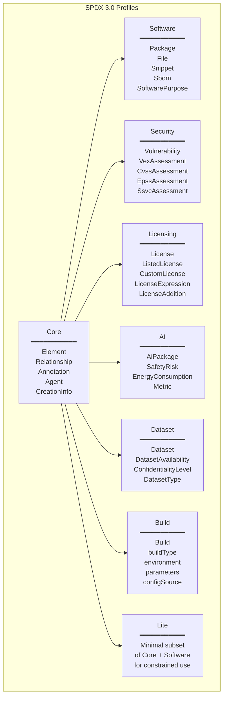

# SPDX 3.0 — Software Package Data Exchange

**Topic:** SPDX 3.0 (Software Package Data Exchange) — open standard for communicating software bill of materials, license information, security data, and provenance through profiles  
**Standard:** SPDX 3.0 (2024); ISO/IEC 5962:2021 (SPDX 2.2.1 as ISO standard); Linux Foundation Specification  
**SDO:** Linux Foundation (SPDX Project); ISO/IEC JTC 1/SC 38  
**Audience:** Software engineers, DevSecOps engineers, open source compliance teams, OSPO managers, legal teams, embedded software developers, supply chain security professionals  
**Prerequisites:** Software development concepts, package management, JSON/YAML/XML, open source licensing basics, version control, CI/CD pipelines

---

## Chapter 1 — Historical Context & Origin Story

### 1.1 Timeline

| Year | Event | Significance |
|------|-------|-------------|
| 2010 | SPDX Project founded (Linux Foundation) | Industry need to standardize how open source license/component information is communicated; solve the "license ambiguity" problem |
| 2011 | SPDX 1.0 specification released | First version; tag-value format; focused on license identification for packages |
| 2012 | SPDX License List created | Canonical list of open source license identifiers (e.g., "MIT", "GPL-2.0-only"); machine-readable; eliminates ambiguity |
| 2013 | SPDX 1.2 | Added file-level information; improved relationships |
| 2016 | SPDX 2.0 | Major revision: package verification, external document references, file/snippet granularity |
| 2020 | SPDX 2.2 | Enhanced relationships; annotations; improved external references |
| 2021 | **ISO/IEC 5962:2021** — SPDX 2.2.1 becomes ISO standard | SPDX gains ISO status; first SBOM format recognized by international standards body; credibility for procurement/regulatory |
| 2021 | US EO 14028 references SPDX | NTIA SBOM guidance mentions SPDX as one of accepted formats; government procurement driver |
| 2022 | SPDX 2.3 released | Incremental: improved security references; better PURL support; lifecycle scope |
| 2023 | SPDX 3.0 Release Candidate | Major redesign: profiles architecture; JSON-LD serialization; modular approach (Software, Security, License, AI, Dataset, Build) |
| 2024 | **SPDX 3.0 Final** published | Production-ready; profiles for diverse use cases; modern data model; ready for EU CRA and federal procurement |
| 2024 | SPDX License List v3.25+ | 600+ licenses cataloged; expressions standardized; exceptions documented |

### 1.2 SPDX Evolution: 2.x → 3.0

| Aspect | SPDX 2.3 | SPDX 3.0 |
|--------|:---:|:---:|
| **Data model** | Flat document-centric | Graph-based (elements + relationships); object-oriented |
| **Serialization** | Tag-Value; RDF; JSON; XML; YAML | **JSON-LD** (primary); also YAML, XML, others possible |
| **Modularity** | Monolithic specification | **Profiles**: Core, Software, Security, Licensing, AI, Dataset, Build, Lite |
| **Security** | Limited (external references) | Full **Security profile** (VEX; CVSS; vulnerability linking) |
| **AI/ML** | Not addressed | **AI profile** (model info; training data; safety; bias) |
| **Build provenance** | Not addressed | **Build profile** (build system; environment; inputs → outputs) |
| **License expressions** | Supported (SPDX license expressions) | Enhanced; same expressions + Licensing profile details |
| **Identifiers** | SPDX-ID (document-local) | Global identifiers; external identifiers (PURL, CPE, SWID) |
| **Linking** | ExternalDocumentRef | Native element references across documents (graph model) |

---

## Chapter 2 — Standard Architecture & Structure

### 2.1 SPDX 3.0 Model Architecture

```mermaid
graph TB
    subgraph "SPDX 3.0 Core Model"
        ELEMENT[Element (base class)<br/>━━━━━━━━━━━<br/>• spdxId (globally unique)<br/>• name<br/>• description<br/>• creationInfo<br/>• externalIdentifier<br/>• externalRef<br/>• verifiedUsing<br/>• extension]
        
        ARTIFACT[Artifact (extends Element)<br/>━━━━━━━━━━━<br/>• originatedBy<br/>• suppliedBy<br/>• builtTime<br/>• releaseTime<br/>• validUntilTime]
    end
    
    subgraph "Software Profile"
        PACKAGE[Package<br/>━━━━━━━━━━━<br/>• packageVersion<br/>• downloadLocation<br/>• homePage<br/>• packageUrl (PURL)<br/>• contentIdentifier]
        
        FILE[File<br/>━━━━━━━━━━━<br/>• contentType<br/>• filePurpose]
        
        SNIPPET[Snippet<br/>━━━━━━━━━━━<br/>• snippetFromFile<br/>• byteRange/lineRange]
        
        SBOM[Sbom (collection)<br/>━━━━━━━━━━━<br/>• rootElement<br/>• elements<br/>• namespaceMap]
    end
    
    subgraph "Relationships"
        REL[Relationship<br/>━━━━━━━━━━━<br/>• from (Element)<br/>• to (Element[])<br/>• relationshipType:<br/>  DEPENDS_ON<br/>  CONTAINS<br/>  BUILD_TOOL_OF<br/>  DEV_DEPENDENCY_OF<br/>  OPTIONAL_DEPENDENCY_OF<br/>  PROVIDED_DEPENDENCY_OF<br/>  TEST_DEPENDENCY_OF<br/>  GENERATES<br/>  ANCESTOR_OF<br/>  VARIANT_OF<br/>  DESCRIBED_BY<br/>  ...]
    end
    
    ELEMENT --> ARTIFACT --> PACKAGE & FILE & SNIPPET
    ELEMENT --> REL
    PACKAGE --> SBOM
```

### 2.2 SPDX 3.0 Profiles

| Profile | Purpose | Key Elements | Use Case |
|:-------:|---------|:---:|------|
| **Core** | Base model classes and properties shared by all profiles | Element, Artifact, Relationship, CreationInfo, Agent, Annotation | Foundation for everything; always present |
| **Software** | Software component information | Package, File, Snippet, Sbom, SoftwarePurpose | Traditional SBOM; component inventory; dependency tree |
| **Security** | Vulnerability and exploitability information | Vulnerability, VexAffectedVulnAssessmentRelationship, VexNotAffectedVulnAssessmentRelationship, CvssV3Assessment, EpssAssessment | VEX; vulnerability tracking; security advisories; CVSS scoring |
| **Licensing** | Detailed license information | License (custom + listed), LicenseExpression, SimpleLicensingInfo, DisjunctiveLicenseSet, ConjunctiveLicenseSet | License compliance; complex multi-license scenarios; custom license declaration |
| **AI** | AI/ML model and dataset metadata | AiPackage (model), Dataset | AI model provenance; training data lineage; safety; bias information |
| **Dataset** | Dataset documentation | Dataset (extends Package), DatasetAvailability, ConfidentialityLevel | Training data for AI; scientific datasets; data governance |
| **Build** | Build environment and provenance | Build (extends Element); buildType, environment, parameters, inputs, outputs | Reproducible builds; SLSA compliance; build provenance attestation |
| **Lite** | Minimal profile for constrained environments | Subset of Core + Software | IoT; resource-constrained; quick exchange; minimum viable SBOM |
| **Extension** | Custom extensions mechanism | Extension (placeholder for domain-specific additions) | Industry-specific additions; proprietary metadata |

### 2.3 SPDX License Expressions

| Expression | Meaning | Example |
|-----------|---------|---------|
| `MIT` | Simple license identifier from SPDX License List | Component is under MIT license |
| `GPL-2.0-only` | GPL version 2 exactly (not "or later") | Linux kernel |
| `GPL-2.0-or-later` | GPL version 2 or any later version | Many GNU utilities |
| `Apache-2.0 AND MIT` | Both licenses apply (conjunctive) | Component dual-obligated |
| `MIT OR Apache-2.0` | Choice of license (disjunctive); user picks | Dual-licensed component; user can choose |
| `GPL-2.0-only WITH Classpath-exception-2.0` | License with exception | OpenJDK (GPL + Classpath exception = linking allowed) |
| `LicenseRef-Proprietary-Acme` | Custom license reference (not in SPDX list) | Proprietary license defined by "Acme Corp" |
| `NOASSERTION` | No license information asserted | Unable to determine; not investigated |
| `NONE` | Confirmed: no license found | Explicitly no license detected (may still have copyright) |

---

## Chapter 3 — Technical Deep Dive

### 3.1 SPDX 3.0 JSON-LD Serialization Example

```json
{
  "@context": "https://spdx.org/rdf/3.0/spdx-context.jsonld",
  "@graph": [
    {
      "type": "SpdxDocument",
      "spdxId": "urn:spdx:example-doc-1",
      "name": "Example SBOM",
      "creationInfo": {
        "created": "2024-06-15T10:30:00Z",
        "createdBy": ["urn:spdx:agent-acme-tools"],
        "specVersion": "3.0"
      },
      "rootElement": ["urn:spdx:pkg-myapp"],
      "element": ["urn:spdx:pkg-myapp", "urn:spdx:pkg-express", "urn:spdx:rel-1"]
    },
    {
      "type": "software_Package",
      "spdxId": "urn:spdx:pkg-myapp",
      "name": "my-web-app",
      "software_packageVersion": "2.1.0",
      "software_packageUrl": "pkg:npm/my-web-app@2.1.0",
      "suppliedBy": ["urn:spdx:agent-acme-corp"],
      "software_primaryPurpose": "application"
    },
    {
      "type": "software_Package",
      "spdxId": "urn:spdx:pkg-express",
      "name": "express",
      "software_packageVersion": "4.18.2",
      "software_packageUrl": "pkg:npm/express@4.18.2",
      "software_primaryPurpose": "library",
      "software_copyrightText": "Copyright (c) 2009-2024 TJ Holowaychuk",
      "declaredLicense": "MIT"
    },
    {
      "type": "Relationship",
      "spdxId": "urn:spdx:rel-1",
      "relationshipType": "dependsOn",
      "from": "urn:spdx:pkg-myapp",
      "to": ["urn:spdx:pkg-express"]
    }
  ]
}
```

### 3.2 SPDX 3.0 Security Profile — VEX Example

| VEX Status | Meaning | When Used |
|-----------|---------|-----------|
| **affected** | Product IS affected by the vulnerability | CVE confirmed exploitable in this product; patch needed |
| **not_affected** | Product is NOT affected | CVE exists in component but not exploitable in this context (e.g., vulnerable function not called; configuration mitigates) |
| **fixed** | Vulnerability has been fixed in this version | Patch applied; update resolves the CVE |
| **under_investigation** | Assessment in progress | Awareness of CVE; still determining impact; will update |

### 3.3 SPDX Relationship Types (Key Subset)

| Relationship Type | From → To | Meaning |
|:---:|:---:|------|
| `dependsOn` | Package A → Package B | A requires B at runtime |
| `devDependencyOf` | Package B → Package A | B is needed only for development of A (not shipped) |
| `optionalDependencyOf` | Package B → Package A | B is optional runtime dependency |
| `buildToolOf` | Tool → Package | Tool was used to build Package (not a shipped component) |
| `contains` | Package → File | Package physically contains File |
| `generates` | Source → Binary | Building Source generates Binary |
| `describedBy` | Package → SBOM | This SBOM describes the Package |
| `ancestorOf` | V1.0 → V2.0 | V1.0 is an ancestor version of V2.0 |
| `variantOf` | Pkg-arm → Pkg-x86 | Pkg-arm is a variant (architecture-specific) of Pkg-x86 |
| `hasAssociatedVulnerability` | Package → Vulnerability | Security: package has known vulnerability |

### 3.4 SPDX in Embedded Systems

| Component | SPDX Representation | Notes |
|-----------|:---:|------|
| Linux kernel | Package (GPL-2.0-only) | Version; config; patches as sub-packages or files |
| U-Boot bootloader | Package (GPL-2.0-or-later) | Version; board-specific patches |
| Yocto/OpenEmbedded recipes | Generate SPDX per recipe; aggregate into image SBOM | Yocto has built-in SPDX 2.2/3.0 generation support |
| Vendor BSP (binary) | Package (LicenseRef-Vendor-Proprietary OR NOASSERTION) | Binary blob; no source; license from vendor agreement |
| Application firmware | Package (proprietary) | Own code; relationships to all dependencies |
| Transitive dependencies | Packages with `dependsOn` chain | Full dependency tree including transitive |
| Build toolchain | Packages with `buildToolOf` relationship | GCC, cmake, etc. — not shipped but recorded for provenance |

---

## Chapter 4 — Implementation Guide

### 4.1 Generating SPDX SBOMs

| Approach | Tools | Input | Output |
|----------|-------|-------|--------|
| **Package manager integration** | CycloneDX/SPDX plugins for Maven, Gradle, npm, pip, Cargo, Go | Build file (pom.xml, package.json, etc.) | SPDX document with dependencies |
| **Container scanning** | Syft; Trivy; Docker SBOM | Container image (OCI) | SPDX document with all packages in image layers |
| **Source code scanning** | Scancode Toolkit; FOSSology | Source directory | SPDX with file-level license/copyright detection |
| **Build system integration** | Yocto/BitBake SPDX class; Buildroot | Build configuration + recipes | SPDX for entire firmware image |
| **Binary analysis** | Binary Analysis Tool (BAT); Syft (limited) | Binary executable/library | SPDX from detected components in binary |
| **Manual/hybrid** | SPDX Online Tool; spdx-tools CLI | Manual entry + automation | Curated SPDX document |

### 4.2 SPDX in CI/CD Pipeline

| Stage | Action | Tool | Output |
|:-----:|--------|------|--------|
| **Pre-commit** | License header check; new dependency approval | pre-commit hooks; license-checker | Pass/fail; approval request |
| **Build** | Generate SBOM from resolved dependencies | Syft; Maven SPDX plugin; npm SPDX plugin | SPDX JSON-LD document |
| **Scan** | License compliance check against policy (no GPL in proprietary; etc.) | FOSSA; ort (OSS Review Toolkit); license policy engine | Pass/fail; policy violations report |
| **Vulnerability check** | Match SBOM against NVD/OSV/GHSA | Grype; OWASP Dependency-Check; Trivy | Vulnerability report; VEX draft |
| **Sign** | Sign SBOM for integrity (digital signature) | cosign (Sigstore); in-toto; SLSA | Signed SBOM artifact |
| **Publish** | Store SBOM alongside release artifact | Artifactory; OCI registry; Dependency-Track | SBOM accessible for consumers |
| **Monitor** | Continuous monitoring of published SBOM against new CVEs | Dependency-Track; GUAC | Alerts when new vulnerability affects released product |

### 4.3 SPDX License List Usage

| Scenario | How to Express |
|----------|---------------|
| MIT-licensed library | `declaredLicense: "MIT"` |
| Dual-licensed (user choice) | `declaredLicense: "MIT OR Apache-2.0"` |
| Multiple licenses apply together | `declaredLicense: "MIT AND BSD-3-Clause"` |
| GPL with exception | `declaredLicense: "GPL-2.0-only WITH Classpath-exception-2.0"` |
| Proprietary/custom | `declaredLicense: "LicenseRef-Acme-Commercial-1.0"` + define in licensing section |
| Unknown/not investigated | `declaredLicense: "NOASSERTION"` |
| Confirmed no license present | `declaredLicense: "NONE"` |

---

## Chapter 5 — Verification & Compliance

### 5.1 SPDX Document Validation

| Check | Tool | What It Validates |
|-------|------|-------------------|
| **Schema validation** | spdx-tools (Java); spdx-tools-python; jsonschema | JSON-LD structure; required fields present; data types correct |
| **License expression validity** | SPDX license expression parser | All license identifiers exist in SPDX License List; expression syntax valid |
| **PURL validity** | PURL spec validator | Package URLs are well-formed; type/namespace/name/version correct |
| **Relationship integrity** | spdx-tools | All referenced spdxIds exist; no dangling references; relationship types valid |
| **Hash verification** | Manual/automated | File checksums (SHA-256) match actual files; package integrity verified |
| **Completeness** | Policy engine (ORT; FOSSA) | Coverage: all BOM components have SPDX entries; no missing dependencies |
| **NTIA minimum elements** | Compliance checker | All 7 NTIA minimum elements present for each component |

### 5.2 Conformance Levels

| Level | Content | Sufficient For |
|:-----:|---------|:---:|
| **Lite profile** | Minimum: package name, version, PURL, supplier, declared license, relationship | Quick exchange; IoT/constrained; minimum viable SBOM |
| **Full Software profile** | Complete: all packages + files + snippets + all relationships + hashes + download locations + copyrights | Full compliance; ISO 5962; procurement; regulatory |
| **Software + Security** | Full Software + VEX data + vulnerability references + CVSS assessments | Security operations; vulnerability management; EU CRA |
| **Full (all profiles)** | Software + Security + Licensing + Build | Maximum provenance; SLSA Level 3+; high-assurance supply chain |

---

## Chapter 6 — Ecosystem & Tooling

### 6.1 SPDX Tools Ecosystem

| Tool | Function | Language | Maintained By |
|------|----------|:--------:|:---:|
| **spdx-tools (Java)** | Create, validate, convert SPDX documents | Java | Linux Foundation SPDX |
| **spdx-tools-python** | Python library for SPDX manipulation | Python | Linux Foundation SPDX |
| **spdx-tools-js** | JavaScript/TypeScript SPDX tools | JS/TS | Community |
| **spdx-sbom-generator** | Generate SPDX SBOM for various package managers | Go | Linux Foundation SPDX |
| **Syft** | SBOM generation (containers, filesystems) | Go | Anchore |
| **Trivy** | SBOM + vulnerability scanning | Go | Aqua Security |
| **FOSSology** | License clearing + SPDX output | PHP/C++ | Linux Foundation |
| **Scancode Toolkit** | License/copyright detection + SPDX output | Python | nexB/AboutCode |
| **ORT (OSS Review Toolkit)** | Complete compliance workflow + SPDX | Kotlin | HERE Technologies (open source) |
| **SPDX Online Tools** | Web-based validation, comparison, conversion | Web | Linux Foundation SPDX |
| **Tern** | Container image SPDX generator | Python | VMware (open source) |

### 6.2 SPDX Integration Points

| System | Integration | How |
|--------|-------------|-----|
| **GitHub** | Dependency graph exports SPDX | GitHub API → SPDX JSON; GitHub Actions SBOM generation |
| **Yocto/OpenEmbedded** | Native SPDX generation class | `INHERIT += "create-spdx"` in local.conf; generates per-recipe + image-level SPDX |
| **Maven** | SPDX Maven Plugin | Plugin generates SPDX during `mvn package` |
| **npm** | @cyclonedx/bom; or spdx-sbom-generator | npm list → SPDX; or dedicated tool |
| **Docker/OCI** | Docker Desktop SBOM; Syft; Trivy | `docker sbom <image>`; `syft <image> -o spdx-json` |
| **Artifactory/Nexus** | Store SPDX alongside artifacts | Upload SPDX as additional artifact; metadata linking |
| **Dependency-Track** | Ingest SPDX for monitoring | Upload SPDX via API/UI; continuous vulnerability matching |

---

## Chapter 7 — Comparison with Alternatives

### 7.1 SPDX 3.0 vs. SPDX 2.3

| Feature | SPDX 2.3 | SPDX 3.0 |
|---------|:---:|:---:|
| Maturity | Production (widely deployed) | New (2024; adoption growing) |
| ISO status | ISO/IEC 5962:2021 (SPDX 2.2.1) | Not yet ISO (expected future) |
| Tool support | Excellent (broad ecosystem) | Growing (major tools adding support) |
| Security/VEX | External references only | Full Security profile (native VEX) |
| AI/ML | Not supported | AI + Dataset profiles |
| Build provenance | Not supported | Build profile |
| Serialization | Tag-Value, RDF, JSON, XML, YAML | JSON-LD (primary); others possible |
| Data model | Document-centric (flat) | Graph-based (elements + relationships) |
| Recommendation | Use for current production needs; broad compatibility | Use for new implementations; future-proof; security + AI needs |

### 7.2 When to Choose SPDX vs. CycloneDX

| Scenario | Recommended | Rationale |
|----------|:---:|------|
| License compliance focus | **SPDX** | Superior license expression system; SPDX License List; file-level license detection; Licensing profile |
| Vulnerability management / VEX | **Either** (CycloneDX slightly ahead historically; SPDX 3.0 closing gap) | Both support VEX; CycloneDX native VEX was first; SPDX 3.0 Security profile now comprehensive |
| AI/ML model documentation | **SPDX 3.0** | Dedicated AI + Dataset profiles (CycloneDX also has ML-BOM) |
| Build provenance / SLSA | **SPDX 3.0** | Build profile designed for SLSA attestations |
| Regulatory / ISO procurement | **SPDX** | ISO/IEC 5962 status; referenced in government guidance |
| Broad tool integration (today) | **CycloneDX** | Slightly wider current tool support; simpler schema for adoption |
| Embedded Linux (Yocto) | **SPDX** | Native Yocto integration; FOSSology workflow; established in embedded |
| Enterprise (existing investment) | **Whatever tools support** | Many tools output both; choose based on existing infrastructure |

---

## Chapter 8 — Mermaid Architecture Diagrams

### 8.1 SPDX 3.0 Profile Architecture



### 8.2 SPDX Document Structure (Typical SBOM)

```mermaid
graph TB
    DOC[SpdxDocument<br/>"my-product-sbom"<br/>version: 3.0<br/>created: 2024-06-15]
    
    ROOT[Package: my-product<br/>version: 3.2.1<br/>purpose: application<br/>license: LicenseRef-Proprietary]
    
    DEP1[Package: express<br/>version: 4.18.2<br/>PURL: pkg:npm/express@4.18.2<br/>license: MIT]
    
    DEP2[Package: lodash<br/>version: 4.17.21<br/>PURL: pkg:npm/lodash@4.17.21<br/>license: MIT]
    
    DEP3[Package: openssl<br/>version: 3.1.4<br/>PURL: pkg:generic/openssl@3.1.4<br/>license: Apache-2.0]
    
    TRANS[Package: body-parser<br/>version: 1.20.2<br/>PURL: pkg:npm/body-parser@1.20.2<br/>license: MIT]
    
    VULN[Vulnerability<br/>CVE-2024-XXXXX<br/>affects: openssl]
    
    VEX[VexNotAffected<br/>justification: component_not_present<br/>"vulnerable function not called"]
    
    DOC -->|describedBy| ROOT
    ROOT -->|dependsOn| DEP1 & DEP2 & DEP3
    DEP1 -->|dependsOn| TRANS
    DEP3 -->|hasAssociatedVulnerability| VULN
    VULN -->|vexNotAffected| VEX
```

---

## Chapter 9 — Case Studies

### 9.1 Case Study: Yocto-Based Embedded Linux SPDX Generation

| Aspect | Detail |
|--------|--------|
| Product | Automotive infotainment system; Yocto Kirkstone-based; ~1200 recipes in final image |
| Challenge | OEM customer requires SPDX SBOM for regulatory compliance (UNECE R155; EU CRA preparation); complete license inventory needed for GPL compliance |
| Implementation | (1) **Yocto SPDX class**: added `INHERIT += "create-spdx"` to build configuration; Yocto generates SPDX 2.2 document per recipe during build; image-level SPDX aggregates all recipes. (2) **Enrichment**: post-build script enhances SPDX with: PURL identifiers (constructed from recipe name + version + layer); supplier information (mapped from SRC_URI); download locations. (3) **License clearing**: 87 packages with "UNKNOWN" or ambiguous licenses → manual review using FOSSology; updated recipe LICENSE fields; re-generated SPDX. (4) **Proprietary components**: 12 vendor binary blobs (GPU driver; radio firmware) → added as packages with `LicenseRef-Vendor-*` and `FilesAnalyzed: false`. (5) **Conversion to 3.0**: used spdx-tools to convert 2.2 → 3.0 for modern tooling compatibility; added relationship types (`buildToolOf` for cross-compiler). (6) **Delivery**: SPDX JSON-LD document (~8MB) delivered alongside firmware binary; uploaded to Dependency-Track for continuous monitoring; source archive prepared for GPL compliance (mapped from SPDX download locations). |
| Result | Complete SBOM: 1,247 packages; 847 unique licenses resolved; 312 GPL-family packages with source offer prepared; 0 license conflicts identified; customer accepted SBOM for UNECE R155 evidence. |

### 9.2 Case Study: SPDX 3.0 Security Profile — VEX for Medical Device

| Aspect | Detail |
|--------|--------|
| Product | Medical device (patient monitoring); Linux-based; FDA 510(k) submission; SBOM required per FDA guidance |
| Challenge | CVE scanner reports 47 vulnerabilities against SBOM components; most are false positives (not exploitable in this context); need to communicate accurate risk to FDA and customers |
| Approach | (1) Generated SPDX 3.0 SBOM with Software profile (all 389 packages in device firmware). (2) Ran Grype vulnerability scan against SBOM → 47 CVEs flagged. (3) Security team assessed each CVE for exploitability in device context. Results: 3 actually affected (patched immediately); 8 under investigation; 36 not affected (various reasons: function not used; network not exposed; configuration mitigates). (4) Created SPDX 3.0 Security profile entries for each CVE: `VexAffectedVulnAssessmentRelationship` for 3 (with remediation action: "update to version X"); `VexNotAffectedVulnAssessmentRelationship` for 36 (with justification: "vulnerable_code_not_in_execute_path" or "inline_mitigations_already_exist"); `VexUnderInvestigationVulnAssessmentRelationship` for 8. (5) Submitted to FDA as part of cybersecurity documentation: SBOM + VEX together demonstrate both transparency AND accurate risk assessment. |
| Outcome | FDA reviewer appreciated clear VEX statements (vs. raw CVE list with no context); expedited review; established process for ongoing VEX updates during product lifecycle (quarterly reassessment). |

---

## Chapter 10 — Future Evolution

| Trend | Timeline | Impact |
|-------|----------|--------|
| **SPDX 3.0 broad adoption** | 2024-2026 | Tools migrating from 2.3 to 3.0; profile adoption; JSON-LD becoming standard exchange format |
| **ISO recognition for SPDX 3.0** | 2025-2026 | Expected ISO/IEC 5962 update to cover SPDX 3.0; strengthens regulatory acceptance |
| **EU CRA harmonized standards** | 2025-2026 | CEN/CENELEC harmonized standard for SBOM likely to reference SPDX (and CycloneDX); defines EU requirements |
| **AI BOM adoption** | 2024-2026 | SPDX AI profile used for AI model cards; EU AI Act transparency requirements may leverage AI profile |
| **Build profile + SLSA** | 2024-2025 | SPDX Build profile integrated with SLSA framework; build provenance attestation in SPDX format |
| **Automotive sector adoption** | 2024-2026 | UNECE R155/R156 compliance using SPDX; automotive SBOM exchange standards referencing SPDX |
| **Hardware BOM in SPDX** | 2025-2027 | SPDX expanding to cover hardware components with firmware (HBOM); chip-level SBOM |
| **Federated SBOM exchange** | 2025-2027 | Standards for sharing SPDX across organizational boundaries; trust frameworks; signed SBOM exchange |

---

## Chapter 11 — Interview Questions & Career Guide

### Tier 1: Entry-Level

**Q1:** What is SPDX and how does it relate to SBOM?  
**A:** SPDX (Software Package Data Exchange) is an open standard created by the Linux Foundation that defines how to communicate software component information — it's the most established FORMAT for creating SBOMs. An SBOM is the concept (a "bill of materials" for software), while SPDX is one of the standard formats to express that SBOM in a machine-readable, interoperable way. SPDX is also an ISO standard (ISO/IEC 5962). Key things SPDX provides: (1) A structured format (JSON-LD, YAML, XML, Tag-Value) to list all software packages, their versions, suppliers, and relationships. (2) The SPDX License List — a canonical set of ~600+ license identifiers (e.g., "MIT", "Apache-2.0", "GPL-3.0-only") so everyone uses the same names for the same licenses. (3) License expressions — a formal syntax to express complex licensing (e.g., "MIT OR Apache-2.0" means dual-licensed, user chooses). (4) In version 3.0: profiles for Security (VEX), AI/ML, Build provenance, and more — making it a comprehensive standard for software supply chain transparency.

### Tier 2: Mid-Level

**Q2:** Explain SPDX 3.0 profiles and when you'd use the Security profile with VEX.  
**A:** [Detailed answer covering profiles architecture, Security profile elements (Vulnerability, VEX assessment relationships with four statuses — affected/not_affected/fixed/under_investigation), justification codes, practical workflow of generating VEX from SBOM vulnerability scan, and how VEX reduces false-positive fatigue for downstream consumers.]

### Tier 3: Senior

**Q3:** Design an SPDX 3.0-based SBOM infrastructure for a company building embedded Linux products that must comply with EU CRA, provide GPL source code, and support vulnerability management across 50+ product variants with shared components.  
**A:** [Comprehensive answer covering: build system integration (Yocto SPDX class + enrichment pipeline); shared component library with canonical SPDX entries (avoid redundant scanning); inheritance model for product variants (base SBOM + delta); automated license compliance artifact generation from SPDX (NOTICE files; source archives); Security profile continuous monitoring (Dependency-Track + VEX workflow); CRA compliance (minimum elements; update process; 24h vulnerability reporting trigger); storage and versioning (SBOM per firmware version; artifact repository; signed; traceable); supplier SBOM ingestion (receive SPDX from component suppliers; merge into product SBOM); team workflow (developer adds dependency → CI generates SBOM → policy gate → security review → release).]

---

## Chapter 12 — Cheat Sheet & Quick Reference

### SPDX Quick Commands

```
# Generate SPDX SBOM with Syft (container)
syft <image> -o spdx-json > sbom.spdx.json

# Generate SPDX SBOM with Syft (directory)
syft dir:/path/to/project -o spdx-json > sbom.spdx.json

# Validate SPDX document
java -jar spdx-tools.jar Verify sbom.spdx.json

# Convert SPDX 2.3 Tag-Value to JSON
java -jar spdx-tools.jar Convert input.spdx output.spdx.json

# Scan for vulnerabilities against SPDX SBOM
grype sbom:sbom.spdx.json

# Yocto: enable SPDX generation
echo 'INHERIT += "create-spdx"' >> conf/local.conf

# Trivy: generate SPDX from container
trivy image --format spdx-json -o sbom.spdx.json <image>
```

### SPDX 3.0 Essential Fields (per Package)

```
REQUIRED:
□ spdxId         — globally unique identifier (URN or URI)
□ name           — component/package name
□ creationInfo   — who created this SPDX entry; when; spec version

RECOMMENDED (for SBOM usefulness):
□ software_packageVersion    — version string
□ software_packageUrl        — PURL (pkg:type/namespace/name@version)
□ suppliedBy                 — agent who supplies/distributes
□ declaredLicense            — SPDX license expression
□ relationship (dependsOn)   — dependency links
□ verifiedUsing (hash)       — SHA-256 for integrity verification
□ downloadLocation           — where to get source/binary
□ software_primaryPurpose    — application/library/framework/etc.
□ copyrightText              — copyright notice
```

### License Expression Syntax

```
SIMPLE:        MIT
               Apache-2.0
               GPL-3.0-only

WITH exception: GPL-2.0-only WITH Classpath-exception-2.0

OR (choice):   MIT OR Apache-2.0
               GPL-2.0-only OR LGPL-2.1-only

AND (both):    MIT AND BSD-3-Clause

COMBINED:      (MIT OR Apache-2.0) AND BSD-3-Clause

CUSTOM:        LicenseRef-MyCompany-Commercial-2024

SPECIAL:       NOASSERTION  (not determined)
               NONE         (confirmed absent)

"-only" vs "-or-later":
  GPL-2.0-only    = exactly GPL v2 (not later versions)
  GPL-2.0-or-later = GPL v2 or any later version (v3, etc.)
```

---

*End of Document — 01_SPDX_3_0.md*
