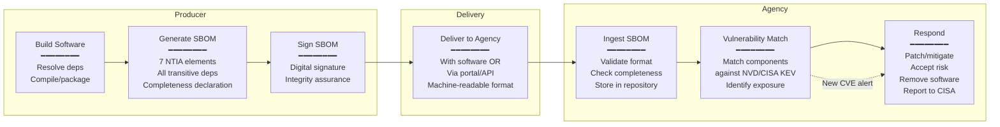

# NTIA SBOM Minimum Elements & US Executive Order 14028

**Topic:** US Government SBOM Mandates — NTIA Minimum Elements for SBOM, Executive Order 14028 on Improving the Nation's Cybersecurity, CISA SBOM guidance, FDA SBOM requirements for medical devices, DoD SBOM initiatives  
**Standard:** NTIA "The Minimum Elements For a Software Bill of Materials" (2021); Executive Order 14028 (May 2021); OMB M-22-18; CISA SBOM guidance documents  
**SDO:** National Telecommunications and Information Administration (NTIA); Cybersecurity and Infrastructure Security Agency (CISA); Office of Management and Budget (OMB); Food and Drug Administration (FDA)  
**Audience:** Software supply chain security engineers, compliance officers, government contractors, medical device manufacturers, DevSecOps teams, product security officers  
**Prerequisites:** SBOM concepts, software supply chain basics, CycloneDX or SPDX format knowledge, US federal procurement processes, cybersecurity fundamentals

---

## Chapter 1 — Historical Context & Origin Story

### 1.1 Timeline

| Year | Event | Significance |
|------|-------|-------------|
| 2018 | NTIA multi-stakeholder process begins | US Commerce Department convenes industry, government, academia to define SBOM standards; first government-led SBOM initiative |
| 2019 | NTIA publishes initial SBOM documents | "Framing Software Component Transparency"; use cases; proof-of-concept pilots; healthcare and energy sectors as early adopters |
| 2020 | SolarWinds supply chain attack (Dec) | Nation-state attack via software build pipeline compromise; >18,000 organizations affected including US government agencies; catalyst for policy action |
| 2021 (Feb) | Microsoft Exchange (Hafnium) attack | Additional high-profile supply chain exploitation; increases urgency for software transparency |
| 2021 (May 12) | **Executive Order 14028** signed (Biden) | "Improving the Nation's Cybersecurity"; Section 4 mandates SBOM; requires NIST to define "critical software"; sets 60-day timelines for agency action |
| 2021 (Jul) | **NTIA "Minimum Elements for SBOM"** published | Defines 7 minimum data fields; 3 practices; accepted formats (SPDX, CycloneDX, SWID); foundational document for all US SBOM requirements |
| 2021 (Sep) | NIST "Critical Software" definition | Identifies software categories requiring enhanced security practices (including SBOM) |
| 2022 (Jan) | Log4Shell (CVE-2021-44228) aftermath | Demonstrates need for SBOM: organizations without SBOMs spent weeks determining exposure; those with SBOMs responded in hours |
| 2022 (Sep) | **OMB M-22-18** memorandum | "Enhancing the Security of the Software Supply Chain through Secure Software Development Practices"; requires self-attestation; SBOM mandatory for critical software sold to government |
| 2022 (Oct) | FDA Section 524B (Omnibus bill) | FDA gains authority to require SBOM for medical device premarket submissions (510(k), PMA); cybersecurity documentation mandate |
| 2023 (Mar) | **National Cybersecurity Strategy** | Reinforces software supply chain security; shifts liability to software producers; supports SBOM ecosystem |
| 2023 (Jun) | CISA SBOM Sharing Lifecycle document | Guidance on sharing SBOMs between suppliers and consumers; privacy considerations; frequency |
| 2023 (Sep) | OMB M-22-18 deadlines start | Federal agencies begin requiring self-attestation from software producers; critical software first |
| 2024 | CISA SBOM types taxonomy | "Types of SBOMs" document: defines Design, Source, Build, Analyzed, Deployed, Runtime SBOMs |
| 2024 | FDA enforcement begins | Medical device premarket submissions now routinely require SBOM; refusal-to-file without cybersecurity documentation |
| 2024 | DoD SBOM requirements formalize | Department of Defense SBOM requirements for weapons systems and critical infrastructure |

### 1.2 Key Policy Chain

```mermaid
graph TB
    EO[Executive Order 14028<br/>"Improving the Nation's<br/>Cybersecurity"<br/>May 2021]
    
    NIST_G[NIST SSDF<br/>(Secure Software Dev Framework)<br/>SP 800-218<br/>+ Critical Software Definition]
    
    NTIA_M[NTIA Minimum Elements<br/>for SBOM<br/>July 2021<br/>7 data fields + 3 practices]
    
    OMB[OMB M-22-18<br/>Self-Attestation +<br/>SBOM for Critical Software<br/>Sep 2022]
    
    CISA_G[CISA Guidance<br/>SBOM Sharing; VEX;<br/>SBOM Types; Quality;<br/>2022-2024]
    
    FDA_G[FDA 524B<br/>Medical Device SBOM<br/>Premarket Cyber Requirements<br/>2022-2024]
    
    DOD[DoD SBOM<br/>Requirements<br/>Weapons Systems +<br/>Critical Infrastructure]
    
    AGENCY[Federal Agencies<br/>Procurement<br/>Now requiring SBOM<br/>from vendors]
    
    EO --> NIST_G & NTIA_M & OMB
    EO --> CISA_G
    OMB --> AGENCY
    NTIA_M --> CISA_G
    EO --> FDA_G & DOD
    CISA_G --> AGENCY
```

---

## Chapter 2 — NTIA Minimum Elements

### 2.1 The 7 Data Fields

| # | Data Field | Description | Required For |
|:-:|-----------|-------------|:---:|
| 1 | **Supplier Name** | Entity that creates, defines, and identifies components | Every component; who is responsible |
| 2 | **Component Name** | Designation assigned to a unit of software by the supplier | Every component; what is it called |
| 3 | **Version of the Component** | Identifier used by the supplier to specify a change from previous versions | Every component; which version |
| 4 | **Other Unique Identifiers** | Other identifiers to identify a component or serve as a look-up key for databases (e.g., PURL, CPE, SWID tag) | Enable vulnerability matching and deduplication |
| 5 | **Dependency Relationship** | Characterizing the relationship that an upstream component X is included in software Y | Understand supply chain; transitive risk |
| 6 | **Author of SBOM Data** | Name of the entity that creates the SBOM data for this component | Provenance; accountability; quality |
| 7 | **Timestamp** | Record of the date and time of the SBOM data assembly | Freshness; currency; audit trail |

### 2.2 The 3 Practices

| Practice | Description | Implementation |
|----------|-------------|----------------|
| **Automation Support** | SBOMs should be generated and consumed using automated tools; machine-readable formats | Use SPDX or CycloneDX (not spreadsheets); CI/CD integration; automated generation at build |
| **Frequency** | A new SBOM must be generated for each new release; should also be updated when dependencies change during development; and when new vulnerability information is discovered | At minimum: every release version; ideally: continuous/per-build |
| **Depth** | SBOMs should include all primary (top-level) components PLUS all transitive dependencies; if not complete, must indicate known unknowns | Include transitive deps; declare completeness ("complete" vs. "known incomplete" with what's missing) |

### 2.3 Accepted Formats

| Format | Version | Maintained By | Status |
|--------|---------|:---:|:---:|
| **SPDX** | 2.2+ (now 3.0) | Linux Foundation | ISO/IEC 5962; recommended |
| **CycloneDX** | 1.4+ (now 1.6) | OWASP | ECMA-424 submitted; recommended |
| **SWID Tags** | ISO/IEC 19770-2 | ISO | Software identification; less used for full SBOM |

---

## Chapter 3 — Executive Order 14028 Deep Dive

### 3.1 EO 14028 Section 4 — Software Supply Chain Security

| Subsection | Requirement | Deadline (from EO) | Implementing Agency |
|:-----------:|-------------|:---:|:---:|
| 4(e) | NIST to publish guidance on "critical software" and security measures | 60 days | NIST |
| 4(e)(vii) | Providing purchaser SBOM for each product | 60 days (guidance) | NIST + NTIA |
| 4(f) | NIST to initiate guidelines for software testing (source code, vulnerability analysis) | 180 days | NIST |
| 4(g) | Minimum standards for vendors selling software to government | 360 days | OMB |
| 4(n) | Government software must meet NIST secure software development framework (SSDF) | Per agency plan | All agencies |

### 3.2 Self-Attestation Requirements (OMB M-22-18)

| Requirement | Who | What | When |
|:-----------:|-----|------|------|
| **Self-attestation (Common Form)** | All software producers selling to federal government | Attest that software was developed following NIST SSDF practices | Required for all new procurements; existing contracts per timeline |
| **Third-party assessment** | For "critical software" | Independent assessment by FedRAMP-approved assessor; or Plan of Action & Milestones (POA&M) | When agency deems software "critical" |
| **SBOM provision** | For "critical software" and when requested | Provide machine-readable SBOM to agency | Upon request; or as default for critical software |
| **Vulnerability disclosure** | All producers | Maintain vulnerability disclosure program; coordinate disclosure | Ongoing |

### 3.3 What "Critical Software" Means (NIST Definition)

| Category | Examples | Why "Critical" |
|----------|---------|----------------|
| Software with elevated system privileges | Operating systems; hypervisors; kernel modules; security agents | Can compromise entire system if attacked |
| Direct network access software | Firewalls; VPNs; DNS resolvers; network monitoring | Gateway to entire network |
| Data/system integrity controllers | Backup software; ICS/SCADA control; identity management | Compromise = data loss or system takeover |
| Trust-boundary controllers | Authentication systems; authorization frameworks; PKI | Compromise = trust chain collapse |
| Operational Technology (OT) | Industrial control systems; building management; medical devices | Safety-critical; physical-world consequences |

---

## Chapter 4 — Implementation Guide

### 4.1 Compliance Roadmap for Software Producers

| Phase | Duration | Actions | Deliverables |
|:-----:|----------|---------|:---:|
| **1: Assessment** | 2-4 weeks | (1) Inventory all products sold to US government; (2) Classify as "critical" or standard; (3) Assess current SBOM capability; (4) Identify gaps against NTIA minimum elements | Gap analysis report; product inventory |
| **2: Process** | 4-8 weeks | (1) Establish SBOM generation in CI/CD; (2) Choose format (SPDX or CycloneDX); (3) Define SBOM delivery mechanism; (4) Create self-attestation process; (5) Establish VDP (vulnerability disclosure program) | Documented procedures; CI/CD SBOM pipeline |
| **3: Tool integration** | 2-6 weeks | (1) Deploy SBOM generation tools (Syft, cdxgen, language plugins); (2) Validate NTIA minimum elements are present; (3) Set up vulnerability monitoring (Dependency-Track); (4) Implement SBOM signing | Working pipeline; SBOM per build |
| **4: Delivery** | 2-4 weeks | (1) Establish SBOM delivery channel (with software; portal; API); (2) Create self-attestation documentation (NIST Common Form); (3) Prepare for agency requests; (4) Train support team | Customer-facing SBOM delivery; self-attestation filed |
| **5: Continuous** | Ongoing | (1) Update SBOM per release; (2) Monitor for new vulnerabilities; (3) Maintain VEX; (4) Re-attest annually; (5) Respond to agency SBOM requests | Current SBOMs; VEX updates; annual attestation |

### 4.2 NTIA Minimum Elements Mapping to SPDX & CycloneDX

| NTIA Element | SPDX 3.0 Field | CycloneDX 1.6 Field |
|:---:|:---:|:---:|
| Supplier Name | `suppliedBy` (Agent) | `supplier.name` or `publisher` |
| Component Name | `name` | `name` |
| Version | `software_packageVersion` | `version` |
| Other Unique ID | `externalIdentifier` (PURL, CPE) | `purl`; `cpe`; `bom-ref` |
| Dependency Relationship | `Relationship (dependsOn)` | `dependencies[].dependsOn` |
| Author of SBOM | `creationInfo.createdBy` | `metadata.authors[].name` or `metadata.tools` |
| Timestamp | `creationInfo.created` | `metadata.timestamp` |

### 4.3 Completeness Declaration

| Level | Meaning | SPDX | CycloneDX |
|:-----:|---------|------|-----------|
| **Complete** | All first-party AND third-party (including transitive) components documented | n/a (implied by document scope) | `compositions[].aggregate = "complete"` |
| **First-party only** | Only own code documented; third-party deps missing | Documented via scope annotation | `compositions[].aggregate = "incomplete_first_party_only"` |
| **Incomplete** | Known gaps; some components not documented | Annotation noting gaps | `compositions[].aggregate = "incomplete"` |
| **Unknown** | Completeness not assessed | `NOASSERTION` on missing elements | `compositions[].aggregate = "not_specified"` |

---

## Chapter 5 — FDA SBOM Requirements

### 5.1 FDA Section 524B Cybersecurity Requirements

| Requirement | Description | Evidence |
|:-----------:|-------------|----------|
| **SBOM** | Machine-readable SBOM for all commercial, open-source, and off-the-shelf components | CycloneDX or SPDX document; all components including RTOS, drivers, libraries |
| **Vulnerability Management Plan** | Proactive plan to identify and address vulnerabilities throughout product lifecycle | Post-market monitoring; SBOM-based vulnerability scanning; patch timeline |
| **Coordinated Vulnerability Disclosure** | Process for receiving and acting on vulnerability reports | Published VDP (vulnerability disclosure policy); contact mechanisms |
| **Security Architecture** | Documentation of security design, threat model, risk assessment | Threat model; security controls; attack surface analysis |
| **Software update mechanism** | Capability to deliver security patches post-market | OTA or field-update capability; patch validation; rollback |

### 5.2 Medical Device SBOM Specifics

| Component Category | SBOM Requirements | Notes |
|:---:|---|---|
| **RTOS / OS** | Full package list; kernel version; patch level | e.g., FreeRTOS v10.5.1; Linux 5.15.x with all patches listed |
| **Third-party libraries** | Name; version; supplier; license; known CVEs | All libraries linked (static or dynamic); PURL identifiers |
| **Custom firmware** | Listed as component with version; supplier = manufacturer | Own code documented; build environment captured |
| **Binary blobs (vendor)** | Name; version; supplier; license (even if proprietary) | e.g., radio firmware; GPU driver; with supplier acknowledgment |
| **Cloud/connected services** | SaaSBOM if device communicates with cloud services | API dependencies; data flow documentation |
| **Update components** | Components in update mechanism itself documented | Updater software; signature verification libraries |

---

## Chapter 6 — CISA SBOM Guidance

### 6.1 CISA SBOM Types

| SBOM Type | When Generated | Content | Use Case |
|:---------:|:-:|---|---|
| **Design SBOM** | Before implementation | Planned components; architecture decisions; intended dependencies | Early risk assessment; procurement planning |
| **Source SBOM** | From source code (manifest analysis) | Dependencies declared in package manifests (package.json, pom.xml, requirements.txt) | What developers DECLARED; may miss undeclared deps |
| **Build SBOM** | During/after build (from resolved dependencies) | Actual resolved dependency tree including transitive; locked versions | Most accurate: what was ACTUALLY compiled/linked |
| **Analyzed SBOM** | Post-build (from binary/container analysis) | Components detected in compiled artifacts via scanning tools | What's ACTUALLY in the shipped binary (catches undeclared components) |
| **Deployed SBOM** | At deployment time | What was actually deployed (including config; environment) | Runtime truth; may differ from build (patches, hotfixes applied post-build) |
| **Runtime SBOM** | During execution (runtime observation) | Components active during execution; dynamically loaded libraries | Most accurate for runtime; hardest to generate; emerging capability |

### 6.2 SBOM Sharing Considerations

| Aspect | Guidance |
|--------|---------|
| **Delivery mechanism** | (1) Bundled with software; (2) Customer portal; (3) API endpoint; (4) Artifact repository; choose based on customer needs |
| **Access control** | Balance: transparency vs. competitive/security concerns; consider: public SBOMs for open source; access-controlled for commercial (NDA or customer-only portal) |
| **Frequency** | At minimum: every release; recommended: continuous (update when dependencies change); critical: immediate for security-relevant changes |
| **Format** | Machine-readable (SPDX or CycloneDX); NOT spreadsheets, PDFs, or Word documents |
| **Signature** | Sign SBOMs for integrity (cosign/Sigstore); consumers verify authenticity |
| **VEX accompaniment** | Ship VEX alongside SBOM (especially after vulnerability announcements); reduces downstream triage burden |
| **Retention** | Maintain historical SBOMs for all supported product versions; needed for vulnerability response ("which version was customer running?") |

---

## Chapter 7 — Comparison

### 7.1 US SBOM Mandate vs. EU CRA SBOM Requirements

| Aspect | US (EO 14028 + NTIA) | EU (Cyber Resilience Act) |
|--------|:---:|:---:|
| **Legal basis** | Executive Order (executive action); not legislation; backed by OMB procurement rules | EU Regulation (legislative; directly applicable in all EU member states) |
| **Scope** | Software sold to US federal government; expanding to critical infrastructure | ALL products with digital elements sold in EU market (hardware + software); very broad |
| **SBOM requirement** | SBOM required for "critical software"; recommended for all | SBOM required for all products with digital elements (mandatory; no exception) |
| **Format** | SPDX, CycloneDX, or SWID (NTIA guidance) | Not yet specified in regulation (harmonized standard will define; expected to accept SPDX/CycloneDX) |
| **Enforcement** | Procurement exclusion (can't sell to government without compliance) | Market surveillance; CE marking; potential product recall; fines up to €15M or 2.5% revenue |
| **Timeline** | Already in effect (2023-2024 deadlines) | 2024 entered into force; enforcement begins 2027 (36 months transition) |
| **Vulnerability handling** | VDP required; SBOM enables monitoring | Mandatory vulnerability handling; 24h early warning to ENISA for exploited vulns; 72h notification |
| **Self-attestation** | Required (NIST Common Form) | Conformity assessment (self-assessment for most; third-party for "critical" products) |
| **Updates** | Maintain updated SBOM; provide patches | 5-year support commitment; security updates for product lifetime (or 5 years minimum) |

### 7.2 DoD vs. Civilian Federal Requirements

| Aspect | DoD | Civilian Federal (CISA/OMB) |
|--------|:---:|:---:|
| **Focus** | Weapons systems; military software; mission-critical | General IT; SaaS; cloud; enterprise software |
| **Classification** | May involve classified components (SBOM with classification markings) | Unclassified |
| **Supply chain risk** | SCRM (Supply Chain Risk Management); CMMC compliance | General supply chain security |
| **SBOM depth** | Extremely detailed (firmware; FPGA bitstreams; RTOS components) | Typically software-level (applications; libraries; containers) |
| **Update cadence** | May have longer certification cycles (re-certification for updates) | Standard software update cycles; CI/CD |
| **Standards** | NIST 800-171; CMMC Level 2-3; DoD-specific guidance | NIST SSDF (800-218); FedRAMP; OMB M-22-18 |

---

## Chapter 8 — Mermaid Architecture Diagrams

### 8.1 EO 14028 Compliance Flow

```mermaid
graph TB
    subgraph "Software Producer Obligations"
        SSDF[Develop per NIST SSDF<br/>(SP 800-218)<br/>━━━━━━━━━━━<br/>Secure design<br/>Secure coding<br/>Secure testing<br/>Vulnerability mgmt]
        
        SBOM_P[Generate SBOM<br/>━━━━━━━━━━━<br/>SPDX or CycloneDX<br/>NTIA 7 minimum elements<br/>Transitive dependencies<br/>Per release + on change]
        
        ATTEST[Self-Attestation<br/>━━━━━━━━━━━<br/>NIST Common Form<br/>CEO/responsible party signs<br/>Annual renewal]
        
        VDP[Vulnerability Disclosure<br/>Program<br/>━━━━━━━━━━━<br/>Published policy<br/>Intake mechanism<br/>Response timeline<br/>Coordinated disclosure]
        
        PATCH[Patch & Update<br/>━━━━━━━━━━━<br/>Security patches<br/>Timely delivery<br/>Communication to agencies]
    end
    
    subgraph "Federal Agency Obligations"
        PROCURE[Procurement<br/>━━━━━━━━━━━<br/>Require attestation<br/>Request SBOM<br/>Verify compliance<br/>Inventory software]
        
        MONITOR[Monitor<br/>━━━━━━━━━━━<br/>Track vulnerabilities<br/>against SBOM inventory<br/>Respond to new CVEs<br/>Coordinate with CISA]
        
        REPORT[Report<br/>━━━━━━━━━━━<br/>Report incidents to CISA<br/>Share threat info<br/>Maintain asset inventory]
    end
    
    SSDF --> ATTEST
    SSDF --> SBOM_P
    ATTEST --> PROCURE
    SBOM_P --> PROCURE
    VDP --> PROCURE
    PROCURE --> MONITOR --> REPORT
    PATCH --> MONITOR
```

### 8.2 SBOM Lifecycle in Federal Environment



---

## Chapter 9 — Case Studies

### 9.1 Case Study: Log4Shell Response — SBOM vs. No-SBOM

| Scenario | Organization with SBOM | Organization without SBOM |
|----------|:---:|:---:|
| **Discovery** | December 9, 2021: CVE-2021-44228 published | Same day |
| **Impact assessment** | Queried Dependency-Track: identified 23 applications using log4j-core; complete list within 2 hours | Started manual audit; sent emails to 200 dev teams asking "do you use log4j?"; incomplete inventory after 3 days |
| **False positive triage** | 8 applications using log4j-core but NOT affected (version 1.x; or JndiLookup class removed); VEX created immediately | No way to distinguish affected from unaffected; treated all as vulnerable; panic patching |
| **Remediation** | 15 truly affected applications prioritized by exposure (internet-facing first); patched within 48 hours; VEX updated to "resolved" | 6 days to identify all affected applications; 14 days to patch (some missed); found 2 more affected systems at Day 21 |
| **Reporting** | CISO presented complete picture to board within 24 hours: "23 systems have log4j; 15 affected; 8 not affected; all 15 will be patched within 48 hours" | CISO could not give definitive answer for 7 days; board lost confidence; external IR firm engaged ($500K) |
| **Post-incident** | SBOM updated; lessons learned: add version-pinning policy | Finally invested in SBOM program (6-month project) |

### 9.2 Case Study: FDA 510(k) Submission with SBOM

| Aspect | Detail |
|--------|--------|
| Product | Wireless patient monitoring device; ARM Cortex-M7; FreeRTOS; BLE + Wi-Fi connectivity; cloud dashboard |
| Challenge | FDA 524B requires cybersecurity documentation including SBOM for premarket submission; company has never produced SBOM; 4-month timeline to submission |
| Implementation | (1) **Inventory**: cataloged all components — FreeRTOS 10.5.1; mbedTLS 3.4.0; lwIP 2.1.3; cJSON 1.7.16; vendor BLE stack (binary blob v2.3.1); vendor Wi-Fi driver (binary blob v1.8.0); proprietary application firmware v1.0.0. (2) **SBOM generation**: created CycloneDX 1.5 SBOM manually (no build system plugin for embedded); 47 total components including transitive dependencies of libraries. (3) **NTIA compliance check**: all 7 elements present for each component; supplier info for vendor blobs (obtained from vendor data sheets and license agreements); PURLs where possible; CPE for NVD matching. (4) **Vulnerability scan**: matched SBOM against NVD → 3 CVEs found in mbedTLS (all patched in version used); 1 CVE in lwIP (not affected — affected API not used); 0 CVEs in FreeRTOS version. (5) **VEX**: created VEX statements for all findings; "resolved" for mbedTLS (patched version); "not_affected" for lwIP with justification. (6) **Submission package**: SBOM (CycloneDX JSON); VEX document; vulnerability management plan (quarterly NVD scan + annual SBOM update); software update capability documentation (secure OTA process). |
| Outcome | FDA accepted submission; reviewer specifically noted clear SBOM and vulnerability management documentation as positive factors; no additional information requests on cybersecurity section; approved in standard 90-day review cycle (vs. industry reports of 6+ month delays for insufficient cybersecurity documentation). |

---

## Chapter 10 — Future Evolution

| Trend | Timeline | Impact |
|-------|----------|--------|
| **Universal SBOM expectation** | 2024-2026 | Moving from "nice to have" to table stakes; procurement without SBOM becoming unusual |
| **SBOM for AI/ML models** | 2024-2026 | AI EO (Oct 2023) extends transparency to AI; expect SBOM-like requirements for training data and model components |
| **Runtime SBOM** | 2025-2027 | CISA pushing toward runtime observation; eBPF-based tools detecting actual loaded libraries; more accurate than build-time SBOM |
| **SBOM quality metrics** | 2024-2025 | CISA developing quality scoring for SBOMs; not all SBOMs are equal; completeness and accuracy matter |
| **International harmonization** | 2025-2027 | US (NTIA/CISA) and EU (CRA) aligning; avoid divergent requirements; mutual recognition possible |
| **SBOM for firmware/hardware** | 2024-2026 | Extending beyond pure software; chip-level BOM; FPGA configuration; sensor firmware all included |
| **Automated policy enforcement** | 2024-2025 | SBOM-based automated procurement gates; reject non-compliant software automatically; real-time supply chain risk scoring |
| **Liability shift** | 2025-2030 | National Cybersecurity Strategy: shift liability to producers; SBOM as evidence of due diligence (or lack thereof) |
| **SBOM for open source** | 2024-2026 | How to handle SBOM for community open source projects (no commercial entity to attest); community infrastructure funding |

---

## Chapter 11 — Interview Questions & Career Guide

### Tier 1: Entry-Level

**Q1:** What are the NTIA minimum elements for an SBOM and why does each matter?  
**A:** The NTIA published 7 minimum data fields that every SBOM must contain: (1) **Supplier Name** — identifies WHO is responsible for the component (accountability; knowing who to contact for vulnerabilities); (2) **Component Name** — WHAT the component is called (identification; searchability); (3) **Version** — WHICH version specifically (critical for vulnerability matching — CVE-X affects versions before 2.3.1); (4) **Other Unique Identifiers** — PURL, CPE, or SWID tag (enables automated matching against vulnerability databases like NVD; de-duplication across SBOMs); (5) **Dependency Relationship** — WHO depends on WHOM (understand transitive risk; if library A depends on library B with a vulnerability, you're affected too); (6) **Author of SBOM Data** — who CREATED this SBOM (quality/trust assessment; contact for questions; accountability for accuracy); (7) **Timestamp** — WHEN the SBOM was created (freshness; is this current? a 2-year-old SBOM may be outdated). Plus 3 practices: Automation (machine-readable); Frequency (per-release minimum); Depth (include transitive dependencies).

### Tier 2: Mid-Level

**Q2:** How would you build an SBOM program from scratch for a company that sells software to US federal agencies?  
**A:** [Detailed answer covering: assessment of current state and products; classification of critical vs. standard software; tooling selection (SPDX/CycloneDX; generation tools per tech stack); CI/CD integration for automated generation; NTIA minimum elements validation; self-attestation preparation (NIST Common Form); VDP establishment; SBOM delivery mechanism; vulnerability monitoring (Dependency-Track); VEX process for false positive management; training for dev teams; compliance documentation; annual renewal process; handling of third-party/vendor components (request SBOMs from suppliers); exception handling for legacy systems; metrics (SBOM coverage, quality, vulnerability response time).]

### Tier 3: Senior

**Q3:** You're the CISO of a medical device company. FDA now requires SBOMs, CISA is publishing new guidance quarterly, EU CRA is coming in 2027, and your products ship to 40 countries. Design a global SBOM strategy that satisfies all regimes without creating parallel compliance programs.  
**A:** [Comprehensive answer covering: unified SBOM as "single source of truth" (CycloneDX with all elements satisfying NTIA + EU CRA + FDA simultaneously); generation at build time (most accurate); format choice (one format internally; convert if needed for specific requirements); multi-regulatory mapping (show how one SBOM satisfies multiple requirements); organizational structure (SBOM owner in product security team; liaison with regulatory affairs); supplier management (require SBOMs from all component suppliers globally; merge into product SBOM); vulnerability management program (continuous monitoring; VEX; SLA for patch delivery); country-specific considerations (data residency for SBOM storage; export control for defense-adjacent products); automation (fully automated pipeline: build → SBOM → validate → sign → deliver → monitor); metrics and board reporting (SBOM coverage; mean time to vulnerability assessment; regulatory compliance status); future-proofing (AI/ML SBOMs for any intelligent features; CBOM for crypto; adaptable to new requirements).]

---

## Chapter 12 — Cheat Sheet & Quick Reference

### NTIA Minimum Elements Checklist

```
□ 1. SUPPLIER NAME         — WHO made this component?
                             Map to: supplier.name (CDX) / suppliedBy (SPDX)
                             
□ 2. COMPONENT NAME        — WHAT is it called?
                             Map to: name (CDX) / name (SPDX)
                             
□ 3. VERSION               — WHICH version exactly?
                             Map to: version (CDX) / software_packageVersion (SPDX)
                             
□ 4. UNIQUE IDENTIFIER     — HOW to look up (for vuln matching)?
                             Map to: purl, cpe (CDX) / externalIdentifier (SPDX)
                             Preferred: PURL (pkg:type/namespace/name@version)
                             
□ 5. DEPENDENCY RELATIONSHIP — WHO depends on WHOM?
                             Map to: dependencies[] (CDX) / Relationship dependsOn (SPDX)
                             MUST include transitive dependencies
                             
□ 6. AUTHOR OF SBOM        — WHO created this SBOM document?
                             Map to: metadata.authors (CDX) / creationInfo.createdBy (SPDX)
                             
□ 7. TIMESTAMP             — WHEN was this SBOM created?
                             Map to: metadata.timestamp (CDX) / creationInfo.created (SPDX)

PRACTICES:
□ Machine-readable format (SPDX/CycloneDX — NOT Excel/PDF)
□ Generated per release (at minimum); ideally per build
□ Includes transitive dependencies (full depth)
□ Declares completeness (complete / incomplete / unknown)
```

### US Federal SBOM Compliance Decision Tree

```
START: Do you sell software to US federal government?
│
├─ YES → Is your software classified as "critical software" (NIST definition)?
│   │
│   ├─ YES → MUST: Self-attestation + SBOM + Third-party assessment
│   │         + Vulnerability Disclosure Program + NIST SSDF compliance
│   │
│   └─ NO  → MUST: Self-attestation (NIST Common Form)
│             SHOULD: SBOM available on request
│             MUST: Vulnerability Disclosure Program
│
├─ SELL TO DOD → All above PLUS: CMMC compliance; potential classified handling
│
└─ MEDICAL DEVICE (FDA-regulated)?
    │
    └─ YES → MUST: SBOM in premarket submission (510(k)/PMA)
              MUST: Vulnerability management plan
              MUST: Coordinated vulnerability disclosure
              MUST: Software update capability
              MUST: Threat model + security architecture
```

### Key Regulations Reference

```
EXECUTIVE ORDER 14028 (May 2021)
"Improving the Nation's Cybersecurity"
• Section 4: Software Supply Chain Security
• Triggers: NIST SSDF, NTIA SBOM, CISA guidance

OMB M-22-18 (Sep 2022)
"Enhancing Security of Software Supply Chain"
• Self-attestation form required
• SBOM for critical software
• Deadlines: 2023-2024 (rolling)

FDA SECTION 524B (2022)
Medical Device Cybersecurity
• SBOM in premarket submissions
• Vulnerability management plan
• 510(k) + PMA requirements
• Enforcement: 2023 onward

CISA KEV (Known Exploited Vulnerabilities)
• BOD 22-01: patch KEV vulns within 2 weeks (internet) / 4 weeks (internal)
• SBOM enables rapid KEV impact assessment

NIST SP 800-218 (SSDF)
Secure Software Development Framework
• Practices for secure development lifecycle
• Referenced by EO 14028 and OMB M-22-18
```

---

*End of Document — 03_NTIA_SBOM_US_EO14028.md*
