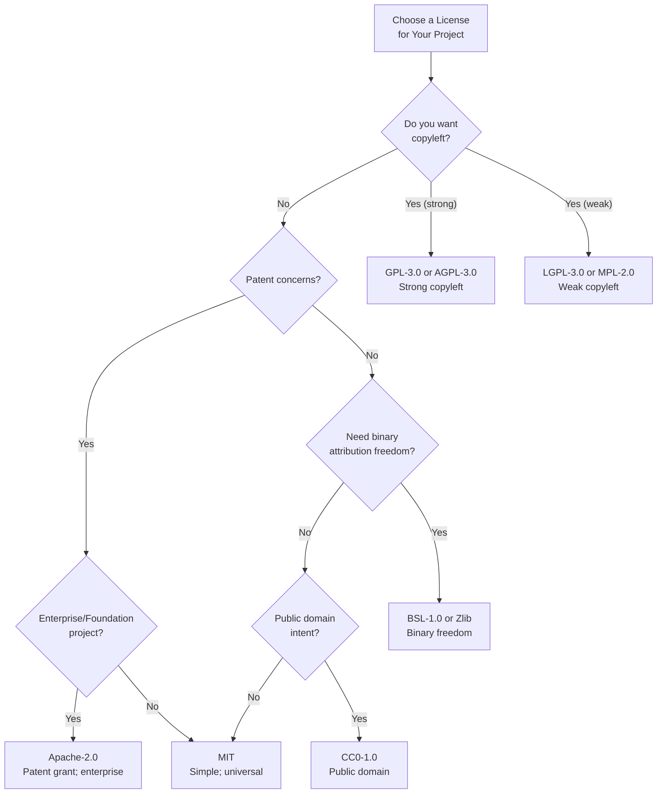
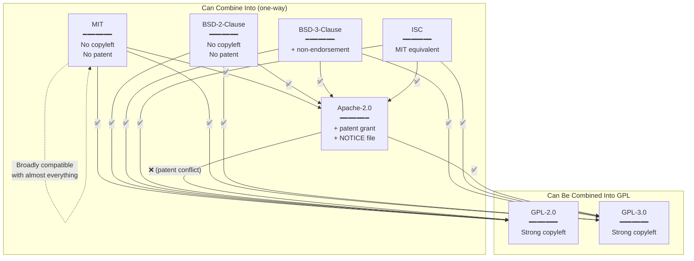

# Permissive Open Source Licenses — MIT, BSD, Apache 2.0 & Others

**Topic:** Permissive (non-copyleft) open source licenses — MIT, BSD 2-Clause, BSD 3-Clause, Apache 2.0, ISC, Zlib, Boost, CC0, Unlicense — their mechanics, obligations, patent provisions, and practical compliance  
**Standard:** MIT License (1988); BSD 2-Clause (FreeBSD); BSD 3-Clause (New BSD); Apache-2.0 (2004); ISC License; Zlib License; BSL-1.0 (Boost); CC0-1.0; Unlicense  
**SDO:** MIT (Massachusetts Institute of Technology); University of California, Berkeley; Apache Software Foundation; Internet Systems Consortium; Creative Commons  
**Audience:** Software engineers, open source contributors, product managers, legal teams, OSPO managers, embedded developers, startup founders  
**Prerequisites:** Basic copyright law concepts, software development, open source community norms, SPDX license identifiers

---

## Chapter 1 — Historical Context & Origin Story

### 1.1 Timeline

| Year | Event | Significance |
|------|-------|-------------|
| 1980 | BSD (Berkeley Software Distribution) system released | University of California, Berkeley distributes modified Unix; BSD license allows wide use |
| 1988 | **MIT License** (X11 License) formalized | Used for X Window System; extremely short and permissive; becomes most popular open source license |
| 1990 | **BSD 4-Clause** (Original BSD) | Includes "advertising clause" (must credit UC Berkeley in ads); later recognized as problematic |
| 1999 | BSD advertising clause removed → **BSD 3-Clause** ("New BSD") | UC Berkeley drops advertising requirement; 3-Clause becomes standard BSD license |
| 2000s | **BSD 2-Clause** ("Simplified"/"FreeBSD") | Removes non-endorsement clause; even simpler than 3-Clause; minimal obligations |
| 2004 | **Apache License 2.0** published | Apache Software Foundation; adds explicit patent grant + patent retaliation clause; addresses modern IP concerns |
| 2003 | **ISC License** | Internet Systems Consortium; functionally equivalent to MIT/BSD-2-Clause; even more concise wording |
| 2005 | **Boost Software License 1.0** | Designed for C++ Boost libraries; allows binary distribution without attribution (unique); very permissive |
| 2009 | **CC0 1.0 Universal** (Public Domain Dedication) | Creative Commons; dedicates work to public domain worldwide; fallback permissive license for jurisdictions without public domain concept |
| 2010 | **Unlicense** | "Anti-license"; public domain dedication + fallback MIT-style license; ultra-minimalist |
| 2011 | **Zlib License** | Used for zlib compression library; minimal requirements; allows proprietary use without attribution in binary |

### 1.2 Why Permissive Licenses Exist

| Motivation | Explanation |
|-----------|-------------|
| **Maximum adoption** | No copyleft barriers; anyone (including proprietary vendors) can use the code; maximizes reach |
| **Academic freedom** | Universities want research code widely used; citation in papers matters more than license enforcement |
| **Corporate friendly** | Companies can incorporate into proprietary products without source sharing obligations; reduces legal risk |
| **Ecosystem growth** | Lower barrier to contribution and use; more participants = faster innovation |
| **Simplicity** | Easy to understand; low compliance cost; minimal legal overhead |
| **Philosophy** | "I wrote this; do what you want; just give me credit" (vs. copyleft's "keep it free forever") |

---

## Chapter 2 — License Architecture & Mechanics

### 2.1 Permissive License Comparison

| License | SPDX ID | Patent Grant | Attribution (source) | Attribution (binary) | Non-Endorsement | Other |
|---------|---------|:---:|:---:|:---:|:---:|------|
| **MIT** | `MIT` | ❌ None (implicit at best) | ✅ Required (include notice) | ✅ Required (include notice) | ❌ No clause | Most popular; ~50% of open source |
| **BSD-2-Clause** | `BSD-2-Clause` | ❌ None | ✅ Required | ✅ Required | ❌ No clause | Simplest BSD; just attribution |
| **BSD-3-Clause** | `BSD-3-Clause` | ❌ None | ✅ Required | ✅ Required | ✅ Cannot use names for endorsement | Standard "New BSD" |
| **Apache-2.0** | `Apache-2.0` | ✅ **Explicit** + retaliation | ✅ Required | ✅ Required (NOTICE file) | ✅ Trademark clause | Patent-safe; enterprise grade |
| **ISC** | `ISC` | ❌ None | ✅ Required | ✅ Required | ❌ No clause | MIT-equivalent; shorter text |
| **Zlib** | `Zlib` | ❌ None | ✅ (source) | ❌ **NOT required** (binary) | ❌ | Binary can omit attribution |
| **BSL-1.0** (Boost) | `BSL-1.0` | ❌ None | ✅ (source) | ❌ **NOT required** (binary) | ❌ | C++ community; binary freedom |
| **CC0-1.0** | `CC0-1.0` | ❌ None (waived) | ❌ Not required | ❌ Not required | ❌ | Public domain dedication |
| **Unlicense** | `Unlicense` | ❌ None | ❌ Not required | ❌ Not required | ❌ | Public domain + fallback license |

### 2.2 MIT License — Full Text Analysis

```
MIT License

Copyright (c) [year] [copyright holder]

Permission is hereby granted, free of charge, to any person obtaining a copy
of this software and associated documentation files (the "Software"), to deal
in the Software without restriction, including without limitation the rights
to use, copy, modify, merge, publish, distribute, sublicense, and/or sell
copies of the Software, and to permit persons to whom the Software is
furnished to do so, subject to the following conditions:

The above copyright notice and this permission notice shall be included in all
copies or substantial portions of the Software.

THE SOFTWARE IS PROVIDED "AS IS", WITHOUT WARRANTY OF ANY KIND, EXPRESS OR
IMPLIED, INCLUDING BUT NOT LIMITED TO THE WARRANTIES OF MERCHANTABILITY,
FITNESS FOR A PARTICULAR PURPOSE AND NONINFRINGEMENT. IN NO EVENT SHALL THE
AUTHORS OR COPYRIGHT HOLDERS BE LIABLE FOR ANY CLAIM, DAMAGES OR OTHER
LIABILITY, WHETHER IN AN ACTION OF CONTRACT, TORT OR OTHERWISE, ARISING FROM,
OUT OF OR IN CONNECTION WITH THE SOFTWARE OR THE USE OR OTHER DEALINGS IN THE
SOFTWARE.
```

| Section | What It Does |
|---------|-------------|
| **Grant** | "Permission...to deal...without restriction" — grants ALL rights (use, copy, modify, distribute, sublicense, sell) |
| **Condition** | "copyright notice and permission notice shall be included" — ONLY obligation: keep the notice |
| **Warranty disclaimer** | "AS IS" — no warranties; no liability; protects author from lawsuits |
| **What's missing** | No patent grant; no trademark grant; no copyleft; no source code requirement |

### 2.3 Apache 2.0 — Patent Grant Deep Dive

| Clause | Content | Impact |
|--------|---------|--------|
| **Section 2: Patent Grant** | "...each Contributor hereby grants to You a perpetual, worldwide, non-exclusive, no-charge, royalty-free, irrevocable patent license to make, have made, use, offer to sell, sell, import..." | Every contributor grants patent rights for their contributions; users can't be patent-trolled by contributors |
| **Section 3: Patent Retaliation** | "If You institute patent litigation against any entity...alleging that the Work constitutes...patent infringement, then any patent licenses granted to You under this License...shall terminate" | If you sue anyone claiming the Apache project infringes your patent, you LOSE your patent license to the project (deterrent against patent aggression) |
| **NOTICE file** | Must include attribution notices; can include additional notices from contributors | Required to distribute alongside binary; aggregates all attribution |
| **Trademark** | "This License does not grant permission to use the trade names, trademarks, service marks..." | Explicitly: you cannot use Apache project trademarks (e.g., can't call your fork "Apache Foo") |

---

## Chapter 3 — Technical Deep Dive: Compliance Mechanics

### 3.1 Attribution Compliance by License

| License | Source Distribution | Binary Distribution | Web Application | SaaS (no distribution) |
|---------|:---:|:---:|:---:|:---:|
| **MIT** | Include LICENSE file (the MIT text with copyright) | Include LICENSE file (in docs, NOTICE, or about screen) | Include in accessible location (credits page, footer, docs) | No obligation (no distribution) |
| **BSD-3-Clause** | Include LICENSE; don't use names for endorsement | Include LICENSE; don't use names for endorsement | Same as binary | No obligation |
| **Apache-2.0** | Include LICENSE + NOTICE file; state changes if modified | Include LICENSE + NOTICE; state changes | NOTICE in accessible location | No obligation |
| **Zlib** | Include LICENSE | **No attribution needed** (unique: binary exemption) | Recommended but not required | No obligation |
| **BSL-1.0** | Include LICENSE | **No attribution needed** | Recommended but not required | No obligation |
| **CC0** | None (but appreciated) | None | None | None |

### 3.2 NOTICE File (Apache 2.0 Specific)

```
# Example NOTICE file for a product using Apache-licensed components

My Product
Copyright 2024 Acme Corporation

This product includes software developed at:
- The Apache Software Foundation (http://www.apache.org/)

This product includes the following Apache-2.0 licensed components:

Apache Log4j 2.17.1
Copyright 1999-2024 The Apache Software Foundation

Apache HttpClient 5.3
Copyright 1999-2024 The Apache Software Foundation

Google Guava 33.0.0
Copyright 2010-2024 Google LLC

Jackson Databind 2.16.1
Copyright 2007-2024 FasterXML, LLC
```

### 3.3 Multi-License Attribution in Practice (NOTICE/CREDITS File)

```
# Example: Product with MIT + BSD + Apache components

THIRD-PARTY LICENSES
====================

1. lodash 4.17.21 (MIT License)
   Copyright JS Foundation and other contributors
   
2. OpenSSL 3.1.4 (Apache-2.0)
   Copyright 1998-2024 The OpenSSL Project Authors
   
3. FreeBSD libc (BSD-2-Clause)
   Copyright 1992-2024 The FreeBSD Project
   
4. React 18.2.0 (MIT License)
   Copyright Meta Platforms, Inc. and affiliates
   
5. curl 8.5.0 (curl License / MIT-style)
   Copyright 1996-2024 Daniel Stenberg

Full license texts are available in the /licenses/ directory.
```

### 3.4 Permissive License Obligations Summary

| Obligation | MIT | BSD-2 | BSD-3 | Apache-2.0 | ISC | Zlib | Boost |
|:-:|:---:|:---:|:---:|:---:|:---:|:---:|:---:|
| Include copyright notice | ✅ | ✅ | ✅ | ✅ | ✅ | ✅ (source only) | ✅ (source only) |
| Include license text | ✅ | ✅ | ✅ | ✅ | ✅ | ✅ (source only) | ✅ (source only) |
| Include NOTICE file | ❌ | ❌ | ❌ | ✅ | ❌ | ❌ | ❌ |
| State changes | ❌ | ❌ | ❌ | ✅ | ❌ | ❌ | ❌ |
| Non-endorsement | ❌ | ❌ | ✅ | ✅ (trademark) | ❌ | ❌ | ❌ |
| Patent grant | ❌ | ❌ | ❌ | ✅ | ❌ | ❌ | ❌ |
| Provide source code | ❌ | ❌ | ❌ | ❌ | ❌ | ❌ | ❌ |
| Copyleft (share alike) | ❌ | ❌ | ❌ | ❌ | ❌ | ❌ | ❌ |

---

## Chapter 4 — Implementation Guide

### 4.1 Choosing a Permissive License for Your Project

| Scenario | Recommended | Reasoning |
|----------|:---:|---|
| Simple library; maximum simplicity | **MIT** | Most recognized; simple; everyone understands it; broad compatibility |
| Library with patent-sensitive technology | **Apache-2.0** | Explicit patent grant protects users; patent retaliation deters trolls |
| C/C++ library (wants binary freedom) | **BSL-1.0** or **Zlib** | No binary attribution requirement; ideal for libraries compiled into many products |
| Data; creative content; public domain intent | **CC0-1.0** | Public domain dedication; ideal for datasets, documentation, specifications |
| Want to disclaim all rights absolutely | **Unlicense** or **CC0** | Maximum freedom; no conditions at all |
| Project interacting with Apache ecosystem | **Apache-2.0** | Natural fit; same ecosystem; compatible patent terms |
| FreeBSD/OS ecosystem | **BSD-2-Clause** | Historical convention; community norm; simple |
| Enterprise/corporate contribution | **Apache-2.0** | Patent safety; CLA-friendly; trusted by enterprises |

### 4.2 Automated License Compliance for Permissive Licenses

| Step | Tool | Purpose |
|:----:|------|---------|
| 1 | SBOM generation (Syft, cdxgen) | List all components and their declared licenses |
| 2 | License detection (Scancode, FOSSology) | Verify declared matches actual license in files |
| 3 | Policy check (FOSSA, ORT, license-checker) | Ensure all licenses are in your "allowed" list; flag any copyleft that sneaked in |
| 4 | Attribution generation | Auto-generate NOTICE/CREDITS file from SBOM + license data |
| 5 | CI/CD gate | Block releases if new dependency has unapproved license |
| 6 | Periodic audit | Re-scan quarterly; catch license changes in dependency updates |

### 4.3 Common Compliance Mistakes with Permissive Licenses

| Mistake | Impact | How to Fix |
|---------|--------|------------|
| Not including MIT/BSD license text in binary distribution | License violation (technically); legal risk if challenged | Generate CREDITS/NOTICES file in build; include in installer/app/about screen |
| Removing copyright notices from source files | License violation; most permissive licenses require retaining notices | Never strip headers; preserve original notices when forking |
| Using project name/trademark without permission (BSD-3, Apache) | Trademark infringement; non-endorsement clause violation | Rename forks; don't imply original project endorses your derivative |
| Ignoring Apache-2.0 NOTICE file requirement | Must preserve NOTICE file contents in distribution | Copy NOTICE file; include in binary packaging; aggregate in product NOTICES |
| Assuming "no copyleft" = "no obligations" | Still have attribution, notice preservation requirements | Every permissive license has SOME obligation (usually: keep the notice) |
| Not checking transitive dependencies | Deep dependency may have GPL/LGPL even if direct deps are permissive | Full SBOM with transitive deps; automated policy scanning |

---

## Chapter 5 — Patent Considerations

### 5.1 Patent Treatment by License

| License | Patent Grant | Patent Retaliation | Practical Impact |
|---------|:---:|:---:|---|
| **MIT** | None (silent) | None | No explicit patent protection; user relies on implied license theory (risky); contributor could theoretically sue |
| **BSD** | None (silent) | None | Same as MIT; no patent safety |
| **Apache-2.0** | **Yes** (explicit; perpetual; royalty-free) | **Yes** (lose patent license if you sue for patent infringement) | Users protected; contributors grant patents; safe for enterprise use |
| **ISC** | None (silent) | None | Same as MIT/BSD |
| **MPL-2.0** | **Yes** (explicit) | **Yes** (terminate on patent suit) | Good patent protection; similar to Apache |
| **CC0** | Waived (to extent possible) | N/A | Attempts to waive all rights including patents; may not be effective for patents in all jurisdictions |

### 5.2 Why Apache-2.0 Patent Grant Matters

| Scenario | With MIT (no patent grant) | With Apache-2.0 |
|----------|:---:|:---:|
| Contributor holds patent on algorithm in the code | Could theoretically sue users for infringement | Patent grant: users have automatic license to practice the patent |
| Company contributes code containing patented technique | Patent assertion possible later | Patent assertion would terminate their own license (retaliation) |
| Patent troll acquires contributor's patents | Could sue all users | Users already have irrevocable grant; troll gets nothing |
| Your company wants to use library in product | Patent risk exists (MIT); may need separate patent analysis | Patent risk mitigated by explicit grant (Apache) |

---

## Chapter 6 — Domain Applications

### 6.1 Permissive Licenses in Embedded Systems

| Component | Typical License | Compliance in Embedded |
|-----------|:---:|---|
| **LLVM/Clang** (compiler) | Apache-2.0 WITH LLVM-exception | Tool; output not restricted; very embedded-friendly; no copyleft |
| **musl libc** | MIT | Statically linkable; no copyleft; alternative to glibc (LGPL) for proprietary embedded |
| **FreeRTOS** | MIT | Fully permissive; Amazon (AWS) maintains; can use in proprietary firmware without source sharing |
| **lwIP** | BSD-3-Clause | Lightweight TCP/IP; binary in proprietary firmware; just include notice |
| **mbedTLS** | Apache-2.0 | TLS for embedded; patent-safe; proprietary use OK |
| **Zephyr RTOS** | Apache-2.0 | Full RTOS; patent grant; suitable for commercial IoT products |
| **cJSON** | MIT | JSON parser; tiny; MIT means no restrictions in embedded binary |
| **SQLite** | Public domain | No license at all; completely free; embedded everywhere |
| **zlib** | Zlib license | Compression; no binary attribution needed; ideal for embedded |

### 6.2 Why Android Uses Apache-2.0

| Decision | Rationale |
|----------|-----------|
| Android userspace = Apache-2.0 | Google chose Apache-2.0 for AOSP (Android Open Source Project) userspace to enable device manufacturers to create proprietary Android builds without source-sharing obligations |
| Linux kernel = GPL-2.0-only | Kernel remains GPL (Google can't change this); manufacturers must share kernel source (but not their apps/HAL) |
| HAL interface design | Treble architecture separates GPL kernel from Apache-2.0 framework using well-defined interfaces (HIDL/AIDL); HALs can be proprietary |
| App ecosystem | Permissive base enables proprietary apps; drives commercial ecosystem; Google Play Store model |
| Enterprise adoption | Apache-2.0 patent grant reassures enterprise; device OEMs comfortable building on Android |

---

## Chapter 7 — Comparison

### 7.1 MIT vs. Apache-2.0 Decision Matrix

| Factor | MIT | Apache-2.0 | Winner |
|--------|:---:|:---:|:---:|
| **Simplicity** | 170 words; trivial to understand | ~4500 words; requires careful reading | MIT |
| **Patent protection** | None | Explicit grant + retaliation | Apache |
| **NOTICE file obligation** | Not required | Required (additional file to maintain) | MIT (simpler) |
| **State changes requirement** | Not required | Required for modified files | MIT (simpler) |
| **GPL-2.0 compatibility** | ✅ Compatible | ❌ NOT compatible (v2 only; v3 OK) | MIT |
| **GPL-3.0 compatibility** | ✅ Compatible | ✅ Compatible | Tie |
| **Enterprise confidence** | Good (widely used) | Excellent (patent safety) | Apache |
| **Binary compliance burden** | Low (include notice) | Medium (NOTICE file; state changes) | MIT |
| **Best for** | Small libraries; quick projects; maximum adoption | Enterprise software; patent-sensitive; foundation projects | Depends |

### 7.2 Permissive vs. Copyleft Trade-offs

| Aspect | Permissive (MIT/Apache) | Copyleft (GPL/LGPL) |
|--------|:---:|:---:|
| **Commercial adoption** | High (no barriers) | Lower (compliance cost) |
| **Community contributions back** | Voluntary (not required) | Required (for distributed derivatives) |
| **Protection against proprietary capture** | None (Amazon/Google can fork and not contribute back) | Strong (must share modifications) |
| **Compliance cost** | Low (attribution only) | Higher (source code; CCS; installation info) |
| **Cloud/SaaS usage** | Unrestricted | GPL: unrestricted (no distribution); AGPL: requires source sharing |
| **Embedded system complexity** | Minimal | Significant (source archives; linking analysis; LGPL object files) |
| **Patent safety** | Varies (none for MIT; good for Apache) | Varies (GPLv3 has explicit; GPLv2 has implicit) |
| **Developer preference** | Many prefer MIT for simplicity | Some prefer GPL for philosophical reasons |

---

## Chapter 8 — Mermaid Architecture Diagrams

### 8.1 License Selection Decision Tree



### 8.2 Permissive License Compatibility



---

## Chapter 9 — Case Studies

### 9.1 Case Study: React License Controversy (BSD+Patents → MIT)

| Aspect | Detail |
|--------|--------|
| Background | Facebook (Meta) originally released React (UI library) under BSD-3-Clause with an additional patent grant file ("PATENTS" file); unusual hybrid |
| Problem | The PATENTS file contained a patent retaliation clause BROADER than Apache-2.0's: if you sued Facebook for ANY patent (not just React-related), you'd lose the React patent grant. Companies (especially large ones with patent portfolios) found this unacceptable — couldn't use React without risking patent defense rights |
| Community reaction | Apache Software Foundation declared Facebook's BSD+Patents incompatible with Apache-2.0; banned React in Apache projects (2017); WordPress (used by 30%+ of web) announced it would stop using React |
| Resolution | Facebook relicensed React to plain MIT (September 2017); removed PATENTS file; community pressure worked; MIT had no patent complications (but also no patent protection) |
| Lessons | (1) Custom license additions create compatibility nightmares; (2) Community pressure can force license changes for popular projects; (3) Patent grant terms must be carefully balanced (Apache-2.0's retaliation is project-scoped; Facebook's was company-wide — too broad); (4) MIT is "safe default" — no unexpected clauses |

### 9.2 Case Study: Embedded Product Attribution Compliance

| Aspect | Detail |
|--------|--------|
| Product | Consumer Wi-Fi router; Linux kernel + BusyBox (GPL) + 47 MIT/BSD/Apache libraries in userspace application; shipped to 500K units |
| Challenge | Legal team realized router had NO attribution notices for permissive-licensed components; shipped without required MIT/BSD/Apache notices; NOTICE files missing; technically in violation of 47 license terms |
| Impact assessment | Permissive license violations rarely result in lawsuits (unlike GPL enforcement); BUT: (1) technically breach of contract; (2) reputational risk if discovered; (3) Apache-2.0 NOTICE file requirement is explicit; (4) some companies (like AVM/FRITZ!Box) have been called out for missing permissive attribution |
| Remediation | (1) Generated complete SBOM (CycloneDX via Syft scanning firmware image). (2) Extracted all licenses using Scancode Toolkit. (3) Generated consolidated CREDITS.html file (all MIT/BSD/Apache notices; license texts; copyright holders). (4) Firmware update v2.1.3 included CREDITS.html accessible from router admin interface (Settings → About → Third-Party Licenses). (5) Apache-2.0 NOTICE file contents incorporated into CREDITS.html. (6) SBOM-based automation added to CI: every build generates fresh CREDITS file from resolved dependencies. (7) Legal approved: future products automatically compliant from build #1. |
| Cost | $15K (one-time tooling + remediation); $2K/year ongoing (tool licenses); ~2 engineer-weeks to implement. Compared to GPL compliance program ($200K+), permissive compliance is lightweight. |

---

## Chapter 10 — Future Evolution

| Trend | Timeline | Impact |
|-------|----------|--------|
| **MIT remains dominant** | Ongoing | ~50% of open source projects; default choice; unlikely to change |
| **Apache-2.0 growing in enterprise** | Ongoing | More foundations (Cloud Native, Eclipse, Linux Foundation projects) choosing Apache-2.0 for patent safety |
| **AI and licensing questions** | 2024-2027 | Can AI-generated code be MIT-licensed? Who holds copyright on AI outputs? Training on permissive code: any obligations? Unresolved legal questions |
| **SBOM-driven attribution automation** | 2024-2026 | Automated NOTICE/CREDITS generation from SBOM; lower compliance burden; integrated into build systems |
| **"Source Available" fragmentation** | 2020-2025 | Companies moving from true open source (MIT/Apache) to restrictive licenses (SSPL, BSL, Elastic); community tension about what counts as "open source" |
| **Permissive + CLA model** | Ongoing | Apache-2.0 with Contributor License Agreement (CLA); enables dual-licensing; corporate open source model |
| **EU CRA impact on permissive** | 2025-2027 | EU CRA creates obligations for commercial products using open source; permissive components still need SBOM tracking; EU may fund open source maintenance |
| **Public domain growth** | 2024+ | CC0 gaining adoption for data, standards, specifications; SQLite model (public domain) admired |

---

## Chapter 11 — Interview Questions & Career Guide

### Tier 1: Entry-Level

**Q1:** What are the obligations when using MIT-licensed code in a proprietary product?  
**A:** MIT license has exactly ONE obligation: you must include the copyright notice and the MIT license text in "all copies or substantial portions of the Software." In practice: (1) **Source distribution**: keep the LICENSE file and copyright headers in any source you redistribute. (2) **Binary distribution** (compiled product): include the MIT notice somewhere accessible — typically in a NOTICES/CREDITS/THIRD-PARTY-LICENSES file bundled with your software, accessible from an "About" screen, or in documentation. (3) **What you DON'T have to do**: provide source code; make your own code open source; pay royalties; get permission; notify the author. (4) **Common implementation**: create a file listing all MIT-licensed dependencies with their copyright notices; ship this file with your product. Many apps have "Open Source Licenses" section in settings that displays this.

### Tier 2: Mid-Level

**Q2:** Compare MIT and Apache-2.0. When would you choose Apache-2.0 over MIT, and what additional compliance obligations does Apache-2.0 create?  
**A:** [Detailed answer covering: patent grant as key differentiator (MIT has no explicit patent protection; Apache-2.0 grants perpetual patent license from contributors); patent retaliation (Apache terminates your patent license if you sue for patent infringement); additional Apache obligations (NOTICE file preservation; state changes documentation; license text inclusion); GPL compatibility difference (MIT compatible with GPL-2.0 AND 3.0; Apache-2.0 only compatible with GPL-3.0); when to choose Apache (patent-sensitive technology; enterprise/foundation projects; need contributor patent clarity); when MIT is sufficient (small utility libraries; no patent concerns; want simplest possible compliance; need GPL-2.0 compatibility); practical example: contributing to Kubernetes/CNCF ecosystem → Apache-2.0; creating a small npm utility → MIT.]

### Tier 3: Senior

**Q3:** Your company has 2000 microservices with a combined 50,000 transitive dependencies, mostly MIT/BSD/Apache. You need to ensure license compliance across all services, handle NOTICE file requirements for Apache-2.0 components, detect any copyleft that may have entered the dependency tree, and automate this for 100 development teams. Design the system.  
**A:** [Comprehensive answer covering: SBOM generation at scale (SBOM per service in CI; CycloneDX or SPDX; centralized SBOM repository); license detection pipeline (Scancode + declared license verification; catch "MIT" declared but GPL text in file); policy engine (ORT or FOSSA; allowlist: MIT, BSD, Apache, ISC, Zlib, Boost; graylist: LGPL — needs architecture review; blocklist: GPL, AGPL — requires exception process); automated NOTICE file generation (aggregate Apache-2.0 NOTICE files; generate per-service CREDITS file during build); dependency update monitoring (when transitive dep changes license — e.g., from MIT to GPL — automated alert and build failure); organizational structure (OSPO team owns policy; per-team license champion; exception review board); developer experience (pre-commit: fast license check on new dependencies; PR bot: comments license info for new deps; central portal: "is this library approved?"); governance (annual audit; sample verification; compliance metrics; board reporting); handling edge cases (dual-licensed components: choose the permissive option; custom/unknown licenses: manual legal review process).]

---

## Chapter 12 — Cheat Sheet & Quick Reference

### Permissive License Quick Compliance

```
MIT / BSD-2-Clause / ISC:
  □ Include LICENSE file (full text + copyright) with your distribution
  □ Keep copyright headers in source files if redistributing source
  □ That's it. No source sharing. No copyleft. No patents.

BSD-3-Clause:
  □ Same as MIT/BSD-2 above
  □ PLUS: Don't use project/author name to endorse your product

Apache-2.0:
  □ Include LICENSE file (full Apache-2.0 text)
  □ Include NOTICE file (preserve original; add yours if contributing)
  □ State changes to modified files (e.g., "Modified by Acme Corp, 2024")
  □ Don't use Apache trademarks without permission
  □ Benefit: You GET patent protection from contributors

Zlib / BSL-1.0 (Boost):
  □ Source distribution: include license text
  □ Binary distribution: NO attribution needed (unique!)
  □ Don't misrepresent origin (don't claim you wrote it)

CC0 / Unlicense:
  □ No obligations at all
  □ Public domain — do literally anything
  □ Good practice: still credit the author (but not required)
```

### License Compatibility Quick Guide

```
MIT → can go into: Apache-2.0, GPL-2.0, GPL-3.0, LGPL, MPL, anything
BSD → can go into: Apache-2.0, GPL-2.0, GPL-3.0, LGPL, MPL, anything
Apache-2.0 → can go into: GPL-3.0 ✅ (NOT GPL-2.0 ❌)
ISC → same as MIT
Zlib/Boost → same as MIT

Direction matters:
  MIT code → GPL project: ✅ (MIT code becomes part of GPL work)
  GPL code → MIT project: ❌ (cannot relicense GPL code as MIT)
  
"Permissive INTO copyleft" = always OK (one-way valve)
"Copyleft INTO permissive" = never OK (copyleft stays copyleft)
```

### SPDX Identifiers for Common Permissive Licenses

```
MIT                    — MIT License
BSD-2-Clause           — BSD 2-Clause "Simplified"
BSD-3-Clause           — BSD 3-Clause "New" or "Revised"
Apache-2.0             — Apache License 2.0
ISC                    — ISC License
Zlib                   — zlib License
BSL-1.0                — Boost Software License 1.0
CC0-1.0                — Creative Commons Zero v1.0 Universal
Unlicense              — The Unlicense
0BSD                   — BSD Zero Clause License
MIT-0                  — MIT No Attribution (even less than MIT!)
```

---

*End of Document — 05_Permissive_Licenses.md*
