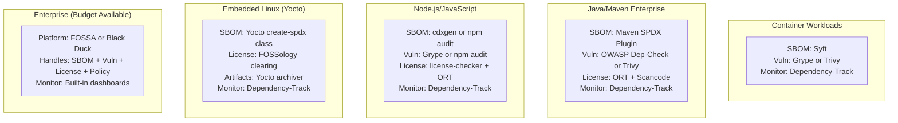

# License Scanning & Compliance Tools

**Topic:** Open source license scanning, compliance automation, and SBOM tooling — FOSSA, Black Duck (Synopsys), FOSSology, Scancode Toolkit, Trivy, Syft, ORT, OWASP Dependency-Check, and comparison  
**Standard:** Tool-implemented standards: SPDX License List; CycloneDX; SPDX 3.0; NTIA Minimum Elements; OpenChain ISO 5230 workflows  
**SDO:** Various — OWASP (Dependency-Check, Dependency-Track); Anchore (Syft, Grype); Aqua Security (Trivy); nexB (Scancode); Linux Foundation (FOSSology); HERE Technologies (ORT); Synopsys (Black Duck); FOSSA Inc.  
**Audience:** DevSecOps engineers, OSPO teams, compliance engineers, security architects, CI/CD engineers, open source program managers  
**Prerequisites:** SBOM concepts, open source licensing basics, CI/CD pipelines, container technologies, package managers (npm, Maven, pip, Go, Cargo)

---

## Chapter 1 — Historical Context & Origin Story

### 1.1 Timeline

| Year | Event | Significance |
|------|-------|-------------|
| 2003 | **FOSSology** project started | First open source license scanning tool; developed by HP; later donated to Linux Foundation |
| 2004 | Black Duck Software founded | First commercial SCA (Software Composition Analysis) company; pioneered binary scanning |
| 2006 | FOSSology 1.0 released | Production-ready scanner; nomos + monk license detection agents |
| 2012 | **OWASP Dependency-Check** created | Free vulnerability scanner for project dependencies; Maven/Gradle/npm support |
| 2015 | **Scancode Toolkit** open-sourced (nexB) | Comprehensive license and copyright detection from source code; rule-based approach |
| 2017 | Synopsys acquires Black Duck | Commercial SCA market consolidation; Black Duck becomes Synopsys SCA |
| 2018 | FOSSA founded | Developer-friendly SCA; CLI-first; policy-as-code; rapid growth |
| 2019 | **Trivy** created (Aqua Security) | Container vulnerability scanner; later expanded to SBOM generation and license scanning |
| 2020 | **Syft** created (Anchore) | SBOM generator focused on containers and filesystems; outputs SPDX and CycloneDX |
| 2020 | **Grype** created (Anchore) | Vulnerability scanner that works with Syft SBOMs; replaces in-house scanners |
| 2020 | **ORT** (OSS Review Toolkit) open-sourced (HERE Technologies) | Complete compliance workflow: analyze → scan → evaluate → report |
| 2021 | SBOM mandate era (EO 14028) | Massive tool adoption spike; all tools add SBOM output (SPDX/CycloneDX) |
| 2022 | **cdxgen** gains popularity | Multi-language CycloneDX SBOM generator; auto-detects project type |
| 2023 | **osv-scanner** (Google) | Vulnerability scanner using OSV database; SBOM-aware; accurate for open source |
| 2024 | Tool convergence: SBOM + vulnerability + license in single tools | Trivy, Syft, FOSSA all becoming comprehensive platforms; market maturing |

### 1.2 Tool Category Taxonomy

| Category | What It Does | Example Tools |
|----------|-------------|:---:|
| **SBOM Generators** | Create machine-readable software inventory (SPDX/CycloneDX) from source, builds, or containers | Syft; cdxgen; Trivy; language plugins |
| **License Scanners** | Detect licenses in source files; identify copyrights; classify obligations | Scancode; FOSSology; FOSSA; Black Duck |
| **Vulnerability Scanners** | Match components against vulnerability databases (NVD/OSV/GHSA) | Grype; Trivy; OWASP Dependency-Check; Snyk |
| **Policy Engines** | Evaluate SBOM/scan results against organizational policies; approve/reject | ORT Evaluator; FOSSA policies; Black Duck policies |
| **Compliance Platforms** | End-to-end: scan + policy + artifact generation + monitoring | FOSSA; Black Duck; ORT; SW360 |
| **Vulnerability Management** | Continuous monitoring; VEX; alerting; portfolio risk view | Dependency-Track; GUAC; Sonatype Lifecycle |

---

## Chapter 2 — Tool Architecture & Comparison

### 2.1 Comprehensive Tool Comparison

| Tool | Type | License | SBOM Output | Vuln Scan | License Scan | Policy Engine | Best For |
|------|:----:|:-------:|:---:|:---:|:---:|:---:|------|
| **Syft** | SBOM generator | Apache-2.0 | ✅ SPDX + CDX | ❌ (use Grype) | Basic (declared) | ❌ | Container/filesystem SBOM generation |
| **Grype** | Vuln scanner | Apache-2.0 | ❌ (consumes) | ✅ NVD+OSV+GHSA | ❌ | ❌ | Fast vulnerability scanning of SBOMs |
| **Trivy** | Multi-scanner | Apache-2.0 | ✅ SPDX + CDX | ✅ NVD+OSV+GHSA | ✅ (basic) | Basic | All-in-one: SBOM + vuln + license + IaC |
| **cdxgen** | SBOM generator | Apache-2.0 | ✅ CycloneDX | ❌ | Basic (declared) | ❌ | Multi-language CycloneDX generation |
| **Scancode Toolkit** | License scanner | Apache-2.0 | ✅ SPDX + CDX | ❌ | ✅✅ (deep) | ❌ | Thorough license/copyright detection in source |
| **FOSSology** | Compliance platform | GPL-2.0 | ✅ SPDX | ❌ | ✅✅ (deep) | ✅ (clearing workflow) | Enterprise license clearing; auditing |
| **ORT** | Compliance workflow | Apache-2.0 | ✅ SPDX + CDX | ✅ (via advisors) | ✅ (via scanners) | ✅✅ (rules engine) | Complete compliance pipeline; customizable |
| **FOSSA** | Commercial SCA platform | Proprietary | ✅ SPDX + CDX | ✅ | ✅✅ | ✅✅ | Developer-friendly; policy-as-code; SaaS |
| **Black Duck** (Synopsys) | Commercial SCA platform | Proprietary | ✅ SPDX + CDX | ✅ | ✅✅ (deep) | ✅✅ | Enterprise; binary analysis; code matching |
| **OWASP Dep-Check** | Vuln scanner | Apache-2.0 | ✅ CycloneDX | ✅ NVD | ❌ | ❌ | Free vulnerability scanning; CI integration |
| **Dependency-Track** | Vuln management | Apache-2.0 | ❌ (consumes) | ✅ NVD+OSV+multiple | ✅ (policy) | ✅ (policy) | SBOM-based continuous monitoring; VEX |
| **osv-scanner** | Vuln scanner | Apache-2.0 | ❌ (consumes) | ✅ OSV | ❌ | ❌ | Open source vulnerability scanning (Google OSV) |
| **Snyk** | Commercial SCA+SAST | Proprietary (free tier) | ✅ | ✅ | ✅ | ✅ | Developer IDE integration; fix suggestions |

### 2.2 Tool Selection Decision Matrix

```mermaid
graph TB
    START[What do you need?]
    
    Q1{Primary need?}
    
    SBOM_NEED[SBOM Generation<br/>━━━━━━━━━━━<br/>Container? → Syft/Trivy<br/>Multi-language? → cdxgen<br/>Source analysis? → Scancode]
    
    VULN_NEED[Vulnerability Scanning<br/>━━━━━━━━━━━<br/>Container? → Trivy/Grype<br/>Java/Maven? → Dep-Check<br/>Open source focused? → osv-scanner<br/>Continuous monitoring? → Dependency-Track]
    
    LICENSE_NEED[License Compliance<br/>━━━━━━━━━━━<br/>Deep source scan? → Scancode/FOSSology<br/>Enterprise clearing? → FOSSology/Black Duck<br/>Developer-friendly? → FOSSA<br/>Full pipeline? → ORT]
    
    FULL_NEED[Complete Platform<br/>━━━━━━━━━━━<br/>Open source? → ORT + Dependency-Track<br/>Enterprise budget? → FOSSA or Black Duck<br/>All-in-one free? → Trivy (with limitations)]
    
    START --> Q1
    Q1 -->|"SBOM generation"| SBOM_NEED
    Q1 -->|"Vulnerability scanning"| VULN_NEED
    Q1 -->|"License compliance"| LICENSE_NEED
    Q1 -->|"End-to-end platform"| FULL_NEED
```

---

## Chapter 3 — Technical Deep Dive: Major Tools

### 3.1 Syft (Anchore) — SBOM Generation

| Aspect | Detail |
|--------|--------|
| **Function** | Generates SBOMs from container images, filesystems, archives |
| **Detection method** | Package manager metadata (dpkg, rpm, apk, npm, pip, go, cargo, etc.); language-specific manifests; binary identification |
| **Output formats** | SPDX JSON/Tag-Value; CycloneDX JSON/XML; Syft JSON; GitHub dependency snapshot |
| **Strengths** | Fast; container-native; excellent for OCI images; wide ecosystem coverage; pairs perfectly with Grype |
| **Limitations** | License detection is "declared only" (reads from package metadata; doesn't analyze source files); no policy engine |

**Key Commands:**
```bash
# Container image SBOM
syft <image> -o spdx-json > sbom.spdx.json
syft <image> -o cyclonedx-json > sbom.cdx.json

# Filesystem/directory SBOM
syft dir:/path/to/project -o cyclonedx-json > sbom.cdx.json

# Archive (tar, zip)
syft /path/to/archive.tar.gz -o spdx-json > sbom.spdx.json

# Specify catalogers
syft <image> --select-catalogers="+binary" -o cyclonedx-json

# Exclude paths
syft dir:. --exclude './test/**' -o cyclonedx-json
```

### 3.2 Trivy (Aqua Security) — Multi-Scanner

| Aspect | Detail |
|--------|--------|
| **Function** | All-in-one: SBOM generation + vulnerability scanning + license detection + secret scanning + IaC scanning |
| **Detection method** | Package managers; OS packages; language dependencies; container layers; binary scanning |
| **Vuln databases** | NVD; OSV (Go, Rust, PHP, Python, Ruby, JS); Red Hat; Ubuntu; Debian; Alpine; GHSA |
| **Output** | SPDX; CycloneDX; Trivy JSON; SARIF; table; template-based |
| **Strengths** | Single tool for multiple security concerns; excellent container support; fast; CI/CD-ready |
| **Limitations** | License scanning less deep than Scancode/FOSSology (declared licenses only); policy engine basic |

**Key Commands:**
```bash
# Container vuln scan
trivy image nginx:1.25

# Generate SBOM (CycloneDX)
trivy image --format cyclonedx -o sbom.cdx.json nginx:1.25

# Generate SBOM (SPDX)
trivy image --format spdx-json -o sbom.spdx.json nginx:1.25

# License scanning
trivy image --scanners license nginx:1.25

# Scan local filesystem
trivy fs --format cyclonedx -o sbom.cdx.json /path/to/project

# Scan with severity filter
trivy image --severity HIGH,CRITICAL nginx:1.25

# Scan SBOM for vulnerabilities
trivy sbom sbom.cdx.json
```

### 3.3 Scancode Toolkit (nexB) — Deep License Detection

| Aspect | Detail |
|--------|--------|
| **Function** | Scan source code for licenses, copyrights, packages, and dependencies; most thorough open source license scanner |
| **Detection method** | Rule-based pattern matching against 34,000+ license detection rules; file-level and snippet-level detection; copyright regex patterns |
| **What it finds** | License text in files; license references; copyright notices; author information; SPDX expressions; URLs; package manifests |
| **Output** | JSON; SPDX; CycloneDX; CSV; HTML; custom templates |
| **Strengths** | Most accurate license detection; finds licenses missed by metadata-only tools; handles non-standard license placements; snippet detection |
| **Limitations** | Slow on large codebases (file-by-file analysis); no vulnerability scanning; no policy engine (use with ORT for that) |

**Key Commands:**
```bash
# Full license + copyright scan
scancode -clpieu --json-pp output.json /path/to/source/

# License detection only (faster)
scancode -l --json output.json /path/to/source/

# SPDX output
scancode -clpieu --spdx-rdf output.spdx /path/to/source/

# CycloneDX output  
scancode -clpieu --cyclonedx output.cdx.json /path/to/source/

# Scan with specific processes (speed)
scancode -clpieu -n 8 --json output.json /path/to/source/
```

### 3.4 ORT (OSS Review Toolkit) — Complete Compliance Pipeline

| Aspect | Detail |
|--------|--------|
| **Function** | End-to-end compliance: Analyze → Scan → Evaluate → Report → Advise |
| **Components** | Analyzer (resolve deps); Downloader (fetch source); Scanner (license scan using Scancode/FOSSology); Evaluator (policy rules); Reporter (generate reports); Advisor (vuln info) |
| **Policy engine** | Rules written in Kotlin DSL; evaluate licenses, copyrights, vulnerabilities against org policies; generate pass/fail per package |
| **Output** | SPDX; CycloneDX; NOTICE files; attribution documents; Excel; PDF; custom templates |
| **Strengths** | Most comprehensive open source compliance pipeline; highly customizable; integrates multiple scanners; generates compliance artifacts |
| **Limitations** | Complex setup; steep learning curve; requires infrastructure (Kubernetes deployment recommended for scale) |

**ORT Workflow:**
```bash
# 1. Analyze project (resolve all dependencies)
ort analyze -i /path/to/project -o /results/

# 2. Scan (license detection using Scancode)
ort scan -i /results/analyzer-result.yml -o /results/

# 3. Evaluate against policy rules
ort evaluate -i /results/scan-result.yml \
  --rules-file /rules/rules.kts -o /results/

# 4. Generate reports (NOTICE file, SPDX, CycloneDX)
ort report -i /results/evaluation-result.yml \
  -f NoticeByPackage,SpdxDocument,CycloneDx -o /reports/
```

### 3.5 FOSSology — Enterprise License Clearing

| Aspect | Detail |
|--------|--------|
| **Function** | License compliance management platform; upload → scan → review → clear → report |
| **Detection agents** | nomos (license text detection); monk (license match); copyright/email/URL extractors; SPDX comparator |
| **Workflow** | Upload source → automatic scan → human review (clearing) → approve/reject per file → generate SPDX/compliance report |
| **Strengths** | Clearing workflow (human-in-the-loop review); audit trail; multi-user roles; enterprise-grade; well-established in automotive/electronics |
| **Limitations** | Requires dedicated server; web UI is dated; slower for CI/CD automation (designed for batch clearing, not inline scanning) |

---

## Chapter 4 — Implementation Guide

### 4.1 CI/CD Integration Patterns

| Pattern | Tools | Pipeline Stage | Speed | Accuracy |
|---------|:---:|:---:|:---:|:---:|
| **Fast gate (PR check)** | Trivy; license-checker; npm audit | Pre-merge | Seconds-minutes | Medium (declared licenses only) |
| **Build-time SBOM** | Syft; cdxgen; language plugins | Build | Seconds-minutes | Good (resolved deps) |
| **Deep scan (scheduled)** | Scancode; FOSSology; ORT | Nightly/weekly | Minutes-hours | Highest (source analysis) |
| **Continuous monitoring** | Dependency-Track + SBOM | Post-deploy (ongoing) | Real-time alerts | Good (matches against new CVEs) |
| **Release gate** | ORT Evaluator; FOSSA policy; Black Duck | Pre-release | Minutes | High (full policy check) |

### 4.2 GitHub Actions Integration Examples

```yaml
# SBOM Generation + Vulnerability Scan (Trivy)
name: Security Scan
on: [push, pull_request]
jobs:
  scan:
    runs-on: ubuntu-latest
    steps:
      - uses: actions/checkout@v4
      
      - name: Generate SBOM
        uses: aquasecurity/trivy-action@master
        with:
          scan-type: 'fs'
          format: 'cyclonedx'
          output: 'sbom.cdx.json'
          
      - name: Vulnerability Scan
        uses: aquasecurity/trivy-action@master
        with:
          scan-type: 'fs'
          severity: 'HIGH,CRITICAL'
          exit-code: '1'
          
      - name: License Check
        uses: aquasecurity/trivy-action@master
        with:
          scan-type: 'fs'
          scanners: 'license'
          severity: 'HIGH'  # HIGH = copyleft detected
```

### 4.3 Open Source Tool Stack (Zero-Cost Enterprise)

| Function | Tool | Integration |
|----------|:---:|---|
| SBOM generation | **Syft** (containers) + **cdxgen** (source) | CI/CD pipeline; per-build |
| Vulnerability scanning | **Grype** (from SBOM) + **osv-scanner** | CI gate; block on HIGH/CRITICAL |
| License scanning | **Scancode Toolkit** | Nightly deep scan; results to ORT |
| Policy evaluation | **ORT Evaluator** | Rules in git; evaluate per release |
| Compliance artifacts | **ORT Reporter** | NOTICE files; SPDX output; per release |
| Continuous monitoring | **Dependency-Track** | Ingest all SBOMs; continuous NVD matching; alerts |
| License clearing (complex) | **FOSSology** | For new components needing human review |

---

## Chapter 5 — Policy Configuration

### 5.1 License Policy Categories

| Category | Licenses | Action | Rationale |
|:--------:|----------|:------:|-----------|
| **Allowed (Green)** | MIT; BSD-2-Clause; BSD-3-Clause; Apache-2.0; ISC; Zlib; BSL-1.0; CC0; Unlicense | Auto-approve | Permissive; minimal obligations; no copyleft risk |
| **Review Required (Yellow)** | LGPL-2.1; LGPL-3.0; MPL-2.0; EPL-2.0; CDDL-1.0 | Human review | Weak copyleft; context-dependent (static vs. dynamic linking; file-level) |
| **Restricted (Red)** | GPL-2.0; GPL-3.0; AGPL-3.0 | Block (unless exception granted) | Strong copyleft; may require open-sourcing proprietary code; legal review needed |
| **Unknown** | LicenseRef-*; NOASSERTION; custom text | Block + investigate | Cannot assess risk without knowing the license |
| **Commercial** | Proprietary licenses | Legal review | May conflict with redistribution; fee obligations; scope restrictions |

### 5.2 ORT Policy Rules Example (Kotlin DSL)

```kotlin
// Example ORT evaluator rules
val rules = ruleSet {
    // Block GPL in product (except Linux kernel which is special)
    packageRule("NO_GPL_IN_PRODUCT") {
        require {
            -isExcluded()
            +hasLicense("GPL-2.0-only", "GPL-3.0-only", "AGPL-3.0-only")
        }
        error(
            "Package ${pkg.id} has copyleft license ${pkg.license}. " +
            "Strong copyleft is not allowed in proprietary products. " +
            "Request exception or find alternative.",
            howToFix = "Replace with permissive alternative or request legal exception."
        )
    }
    
    // Warn on LGPL (needs dynamic linking confirmation)
    packageRule("LGPL_REQUIRES_REVIEW") {
        require {
            -isExcluded()
            +hasLicense("LGPL-2.1-only", "LGPL-2.1-or-later", "LGPL-3.0-only")
        }
        warning(
            "Package ${pkg.id} is LGPL. Confirm dynamic linking only.",
            howToFix = "Ensure dynamic linking (shared library). Static linking requires LGPL compliance measures."
        )
    }
    
    // Block unknown licenses
    packageRule("NO_UNKNOWN_LICENSE") {
        require {
            -isExcluded()
            +hasLicense("NOASSERTION", "LicenseRef-scancode-unknown")
        }
        error(
            "Package ${pkg.id} has unknown license. Cannot assess compliance risk.",
            howToFix = "Investigate source code for actual license. Contact package maintainer if unclear."
        )
    }
}
```

---

## Chapter 6 — Commercial vs. Open Source Tools

### 6.1 Commercial SCA Platforms

| Platform | Vendor | Key Differentiators | Pricing Model |
|----------|:---:|---|:---:|
| **FOSSA** | FOSSA Inc. | Developer UX; policy-as-code; fast CLI; SBOM generation; license obligations engine; snippet detection | Per-developer or per-project; SaaS |
| **Black Duck** | Synopsys | Binary analysis (detect components without source access); code matching (KnowledgeBase of 6B+ code snippets); deep license detection; enterprise governance | Enterprise license; per-project; expensive |
| **Snyk** | Snyk | Developer IDE integration (VS Code, IntelliJ); fix PRs (automated); container scanning; IaC; code security | Free tier (limited); per-developer (paid) |
| **Sonatype Lifecycle** | Sonatype | Component intelligence (age, quality, activity metrics); policy automation; proxy repository integration (Nexus); vulnerability intelligence | Per-application; enterprise license |
| **WhiteSource (Mend)** | Mend.io | Renovate (dependency update automation); auto-remediation; license policy; large vulnerability database | Per-developer; SaaS |
| **JFrog Xray** | JFrog | Integrated with Artifactory (binary repository); deep binary scanning; impact analysis; watch policies | Part of JFrog Platform license |

### 6.2 When to Use Commercial vs. Open Source

| Factor | Open Source Stack | Commercial Platform |
|--------|:---:|:---:|
| **Budget** | Free (engineering time for setup/maintenance) | $30K-500K+/year depending on scale |
| **Setup effort** | High (integrate multiple tools; configure; maintain) | Low-Medium (SaaS; managed; support available) |
| **Customization** | Unlimited (modify source; extend; integrate) | Limited to vendor-provided configuration |
| **Support** | Community (GitHub issues; forums; self-service) | Vendor support (SLA; dedicated engineer; priority fixes) |
| **Binary analysis** | Limited (Syft has some; not deep code matching) | Strong (Black Duck KnowledgeBase; binary fingerprinting) |
| **Snippet detection** | Scancode has some; not enterprise-grade | Strong (FOSSA, Black Duck can detect copied code snippets) |
| **Compliance artifacts** | ORT generates NOTICE/SPDX; requires configuration | Push-button generation; pre-formatted |
| **Audit readiness** | Must build evidence package manually | Built-in audit reports; compliance dashboards |
| **Best for** | Engineering-heavy orgs; open source preference; budget-constrained; customization needed | Legal/compliance-driven orgs; regulatory requirements; limited engineering bandwidth for tooling |

---

## Chapter 7 — Comparison Deep Dive

### 7.1 SBOM Generation Tool Comparison

| Tool | Languages/Ecosystems | Container Support | Speed | License Info | SPDX | CycloneDX |
|------|:---:|:---:|:---:|:---:|:---:|:---:|
| **Syft** | 15+ ecosystems (npm, pip, Go, Maven, Cargo, etc.) | Excellent (OCI native) | Fast | Declared only | ✅ | ✅ |
| **Trivy** | 12+ ecosystems | Excellent | Fast | Declared + basic detection | ✅ | ✅ |
| **cdxgen** | 20+ ecosystems (auto-detect) | Via container scan | Medium | Declared | ❌ | ✅ |
| **Microsoft SBOM Tool** | .NET, npm, pip, Maven, Go | Via filesystem | Medium | Declared | ✅ | ❌ |
| **Scancode** | File-level (any language) | Via filesystem | Slow (thorough) | Deep detection (text analysis) | ✅ | ✅ |

### 7.2 Vulnerability Scanner Comparison

| Tool | Data Sources | SBOM Input | Speed | Accuracy | VEX Support |
|------|:---:|:---:|:---:|:---:|:---:|
| **Grype** | NVD; OSV; GHSA; Alpine; Debian; etc. | ✅ (SPDX, CDX, Syft) | Fast | Good | ✅ (OpenVEX overlay) |
| **Trivy** | NVD; OSV; GHSA; vendor advisories | ✅ (SPDX, CDX) | Fast | Good | ✅ (VEX filtering) |
| **osv-scanner** | OSV only (ecosystem-native) | ✅ (CDX) | Fast | Best for open source | ❌ |
| **OWASP Dep-Check** | NVD (CPE matching) | ❌ (scans directly) | Medium | Variable (CPE matching can be noisy) | ❌ |
| **Dependency-Track** | NVD; OSV; multiple (configurable) | ✅ (primary input method) | Continuous | Good | ✅ (native VEX) |

---

## Chapter 8 — Mermaid Architecture Diagrams

### 8.1 Enterprise Compliance Tool Architecture

```mermaid
graph TB
    subgraph "Development"
        DEV[Developer<br/>writes code;<br/>adds dependency]
        IDE[IDE Plugin<br/>(Snyk/FOSSA)<br/>instant feedback]
    end
    
    subgraph "CI/CD Pipeline"
        BUILD[Build<br/>━━━━━━━━━━━<br/>Compile; resolve deps;<br/>create artifact]
        
        SBOM[SBOM Generation<br/>━━━━━━━━━━━<br/>Syft / cdxgen / Trivy<br/>→ CycloneDX JSON]
        
        VULN[Vulnerability Scan<br/>━━━━━━━━━━━<br/>Grype / Trivy<br/>Match SBOM vs NVD/OSV<br/>→ PASS/FAIL gate]
        
        LICENSE[License Scan<br/>━━━━━━━━━━━<br/>Scancode (deep)<br/>or Trivy (fast)<br/>→ PASS/FAIL gate]
        
        POLICY[Policy Evaluation<br/>━━━━━━━━━━━<br/>ORT / FOSSA policy<br/>License allowlist<br/>Vuln threshold<br/>→ PASS/FAIL gate]
    end
    
    subgraph "Artifact Storage"
        ARTIFACT[Release Artifact<br/>+ SBOM<br/>+ NOTICE file<br/>+ VEX]
    end
    
    subgraph "Continuous Monitoring"
        DT[Dependency-Track<br/>━━━━━━━━━━━<br/>Ingest all SBOMs<br/>Continuous matching<br/>New CVE → alert<br/>VEX management]
        
        ALERT[Alerts<br/>━━━━━━━━━━━<br/>Email / Slack / Teams<br/>when new vuln affects<br/>tracked component]
    end
    
    DEV --> IDE
    DEV --> BUILD --> SBOM --> VULN --> LICENSE --> POLICY --> ARTIFACT
    SBOM -->|"upload SBOM"| DT
    DT --> ALERT
```

### 8.2 Tool Selection by Use Case



---

## Chapter 9 — Case Studies

### 9.1 Case Study: Building an Open Source Compliance Pipeline with ORT

| Aspect | Detail |
|--------|--------|
| Company | Mid-size embedded software company; 30 products; Yocto-based + some application code (Java, Python); OSPO team of 2 people; budget-constrained (no commercial SCA budget) |
| Requirement | OpenChain ISO 5230 conformance; generate NOTICE files for every product; detect GPL in proprietary code; automate as much as possible |
| Solution | (1) **ORT as backbone**: deployed ORT on internal Kubernetes cluster; 4 stages automated. (2) **Analyzer**: ORT resolves all dependencies for each product (Maven, pip, npm, Yocto recipes). (3) **Scanner**: integrated Scancode Toolkit as scanning backend; deep license detection for all source code; results cached (same component not rescanned). (4) **Evaluator**: custom policy rules (Kotlin DSL): block GPL in proprietary products; warn on LGPL; require review for unknown licenses. (5) **Reporter**: automatically generates: NOTICE file (all attributions); SPDX document; "problems" report for OSPO review. (6) **CI integration**: ORT runs nightly for all products; PRs blocked if policy violations detected; developer gets clear error message with fix guidance. (7) **FOSSology for clearing**: components flagged as "unknown license" routed to FOSSology for human review; OSPO clears manually; result fed back into ORT curations. (8) **Curations**: built library of 500+ curations (corrections to package metadata — wrong license declared; missing info); shared across all products. |
| Results | License clearing: 8,000 packages cleared across 30 products. Policy violations caught in CI: 47 in first 3 months (prevented from shipping). NOTICE file generation: fully automated; previously took 2 days per product per release → now instant. OpenChain conformance: achieved within 6 months. Cost: infrastructure ($500/month K8s) + engineering time (2 person-months setup); zero SCA license fees. |

### 9.2 Case Study: Migrating from Black Duck to Open Source Stack

| Aspect | Detail |
|--------|--------|
| Company | Cloud platform company; 200 microservices; previously using Black Duck (Synopsys) at $300K/year; contract renewal approaching; evaluating alternatives |
| Evaluation criteria | (1) SBOM generation quality; (2) vulnerability detection accuracy; (3) license scanning depth; (4) CI/CD integration speed; (5) policy enforcement; (6) ongoing cost |
| Comparison results | **SBOM generation**: Syft + cdxgen = equivalent to Black Duck for their stack (all container-based; Node.js + Python + Go). **Vulnerability scanning**: Grype + osv-scanner = comparable accuracy (some differences: Black Duck has proprietary intelligence for some commercial components; but 95% of their dependencies are open source where OSV/NVD suffice). **License scanning**: Scancode = equivalent to Black Duck for source analysis (some argue Scancode is MORE accurate due to larger rule set). **Binary analysis**: Black Duck superior (KnowledgeBase for binary matching); but company confirmed they don't use binary analysis (all source-available). **Policy engine**: ORT Evaluator = equivalent functionality; more customizable. **Speed**: open source tools significantly faster in CI (Syft: 10 seconds vs. Black Duck scan: 5 minutes per project). |
| Decision | Migrated to: Syft (SBOM) + Grype (vulnerability) + Scancode (license) + ORT (policy + reporting) + Dependency-Track (monitoring). |
| Migration effort | 3 months; 1.5 FTE dedicated; result: equivalent functionality; better CI speed; full customization; $300K/year savings (minus ~$30K/year infrastructure cost). |
| Caveat | Required more engineering investment upfront; ongoing maintenance of tooling is team responsibility (vs. vendor-managed SaaS). Suitable for engineering-strong organizations; may not be right for all. |

---

## Chapter 10 — Future Evolution

| Trend | Timeline | Impact |
|-------|----------|--------|
| **Tool convergence** | 2024-2026 | Single tools doing SBOM + vuln + license + policy (Trivy already trending this way); fewer tools needed |
| **AI-assisted compliance** | 2025-2027 | AI to auto-classify unknown licenses; suggest VEX justifications; predict compliance risks; auto-fix license violations |
| **Runtime SBOM tools** | 2025-2027 | eBPF-based tools detecting actually-loaded libraries at runtime; more accurate than build-time analysis |
| **SBOM quality scoring** | 2024-2025 | Tools scoring SBOM quality (completeness, accuracy, freshness); CISA quality metrics drive tool improvement |
| **GUAC adoption** | 2024-2026 | Graph for Understanding Artifact Composition (Google + community); graph database approach to SBOM + vulnerability intelligence; enables supply chain queries |
| **VEX automation** | 2025-2027 | Tools that auto-generate VEX by analyzing code paths (reachability analysis); reduce manual triage |
| **Regulatory-driven adoption** | 2025-2027 | EU CRA and FDA requirements forcing even small companies to adopt tooling; market growth; tool simplification for non-experts |
| **Cloud-native SBOM** | 2024-2026 | SBOM attached to OCI images (artifact references); SBOM as first-class container registry artifact; automated by registries |

---

## Chapter 11 — Interview Questions & Career Guide

### Tier 1: Entry-Level

**Q1:** What is the difference between SBOM generation, license scanning, and vulnerability scanning? Which tools do each?  
**A:** These are three distinct but complementary activities: (1) **SBOM generation** creates an inventory of all software components in your product — names, versions, suppliers, relationships. Tools: Syft (containers); cdxgen (multi-language); Trivy; Yocto create-spdx. Output: SPDX or CycloneDX document. (2) **License scanning** detects what LICENSE each component uses — reads license files, headers, and text patterns in source code. Tools: Scancode Toolkit (deepest open source); FOSSology (enterprise clearing); FOSSA/Black Duck (commercial). Output: license identification per file/package. (3) **Vulnerability scanning** matches your components against known vulnerability databases to find security issues (CVEs). Tools: Grype (from SBOM); Trivy; OWASP Dependency-Check; osv-scanner. Output: list of CVEs affecting your components with severity scores. In practice, you need all three: SBOM tells you WHAT you have; license scan tells you your LEGAL obligations; vulnerability scan tells you your SECURITY risks.

### Tier 2: Mid-Level

**Q2:** Design a CI/CD pipeline that integrates SBOM generation, vulnerability scanning with policy gates, and license compliance for a Java microservice architecture.  
**A:** [Detailed answer covering: Maven build → cdxgen or Maven SPDX plugin for SBOM generation; Grype scan against SBOM with severity threshold (fail build on CRITICAL/HIGH); Trivy for license detection (fail on GPL/AGPL in proprietary service); ORT evaluator for comprehensive policy (LGPL linking analysis; unknown license blocking); Dependency-Track upload for continuous monitoring; nightly deep scan with Scancode for license accuracy; NOTICE file auto-generation in release pipeline; VEX process when new CVEs appear post-release; developer experience (fast feedback in PR; clear error messages; approved dependency catalog).]

### Tier 3: Senior

**Q3:** You're building an OSPO for a company with 500 developers, 100 products across embedded and cloud, using both commercial and open source code. Design the complete tooling architecture, including how tools integrate, how data flows, and how the program scales.  
**A:** [Comprehensive answer covering: tiered approach (fast CI gates + deep batch scanning + continuous monitoring); tool selection per domain (embedded: Yocto SPDX + FOSSology clearing; cloud: Syft + Grype + ORT); centralized SBOM repository (artifact store with all SBOMs); Dependency-Track as central nervous system (portfolio view; all products; all vulns); policy management (Git-managed rules; per-product-category policies; exception workflow); integration architecture (webhook-driven; SBOM generated → uploaded → matched → alerts routed); organizational model (central OSPO maintains tools + policies; product teams own compliance for their products; OSPO provides consulting); metrics dashboard (SBOM coverage; mean time to vulnerability assessment; policy violation rate; license clearing backlog); training and enablement (developer portal; approved component catalog; self-service license check); vendor management (require SBOMs from suppliers; ingest into Dependency-Track; track vendor response times); budget (tool costs; infrastructure; headcount; ROI calculation vs. compliance risk).]

---

## Chapter 12 — Cheat Sheet & Quick Reference

### Tool Quick Commands

```bash
# ===== SBOM GENERATION =====
# Syft: Container SBOM
syft alpine:3.19 -o cyclonedx-json > bom.cdx.json
syft alpine:3.19 -o spdx-json > bom.spdx.json

# cdxgen: Auto-detect project type
cdxgen -o bom.json

# Trivy: Filesystem SBOM
trivy fs --format cyclonedx -o bom.cdx.json .

# ===== VULNERABILITY SCANNING =====
# Grype: Scan SBOM
grype sbom:bom.cdx.json

# Grype: Scan container directly
grype alpine:3.19

# Trivy: Scan container
trivy image alpine:3.19

# osv-scanner: Scan lockfiles
osv-scanner --lockfile=package-lock.json

# OWASP Dependency-Check: Maven
mvn org.owasp:dependency-check-maven:check

# ===== LICENSE SCANNING =====
# Scancode: Deep license scan
scancode -clpieu --json-pp results.json ./src/

# Trivy: License detection
trivy fs --scanners license .

# license-checker (npm): Quick check
npx license-checker --production --onlyAllow "MIT;BSD-2-Clause;BSD-3-Clause;Apache-2.0;ISC"

# ===== POLICY & COMPLIANCE =====
# ORT: Full pipeline
ort analyze -i . -o results/
ort scan -i results/analyzer-result.yml -o results/
ort evaluate -i results/scan-result.yml --rules-file rules.kts -o results/
ort report -i results/evaluation-result.yml -f NoticeByPackage -o reports/

# ===== MONITORING =====
# Upload to Dependency-Track
curl -X POST "$DT_URL/api/v1/bom" \
  -H "X-Api-Key: $KEY" \
  -F "project=$UUID" \
  -F "bom=@bom.cdx.json"
```

### Tool Selection Quick Guide

```
NEED: Quick SBOM for container
  → Syft (fastest; most accurate for containers)

NEED: All-in-one (SBOM + vuln + license)
  → Trivy (single tool; good enough for most)

NEED: Deep license detection (source code)
  → Scancode Toolkit (most thorough; 34K+ rules)

NEED: Enterprise license clearing (human review)
  → FOSSology (clearing workflow; audit trail)

NEED: Complete compliance pipeline (open source)
  → ORT (analyze → scan → evaluate → report)

NEED: Continuous vulnerability monitoring
  → Dependency-Track (SBOM-based; portfolio view; VEX)

NEED: Commercial with support + binary analysis
  → Black Duck (deepest) or FOSSA (developer-friendly)

NEED: Fastest CI gate (just block bad stuff)
  → Grype (vuln) + license-checker (license) = seconds
```

---

*End of Document — 08_License_Scanning_Tools.md*
