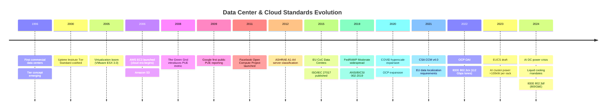

# Cloud Infrastructure & Data Center Standards — Category Overview

**Topic:** Cloud infrastructure, data center facility standards, energy efficiency, cloud security frameworks, high-performance networking, and containerization standards  
**Category:** 16 — Cloud Infrastructure & Data Center Standards  
**Mega-Domain:** 6 — Industry 4.0 & Manufacturing  
**Audience:** Data center engineers, cloud architects, security engineers, infrastructure managers, compliance officers, network engineers, SREs  
**Prerequisites:** Basic networking, server hardware, power/cooling concepts, cloud computing fundamentals, security framework awareness

---

## Category Scope & Standards Universe

### Data Center Facility Standards

| Standard | Organization | Scope |
|----------|:---:|---|
| **Uptime Institute Tier I–IV** | Uptime Institute | Data center availability and redundancy classification; Tier I (99.671%) through Tier IV (99.995%) |
| **ANSI/BICSI 002-2019** | BICSI | Data center design and implementation best practices |
| **EN 50600 series** | CENELEC | European standard for data center facilities (construction, power, cooling, cabling, operations) |

### Energy Efficiency

| Standard/Metric | Organization | Scope |
|-----------------|:---:|---|
| **PUE** (Power Usage Effectiveness) | The Green Grid | Total DC power / IT power; industry benchmark target < 1.3 |
| **WUE** (Water Usage Effectiveness) | The Green Grid | Water consumption per IT energy; critical for sustainability |
| **CUE** (Carbon Usage Effectiveness) | The Green Grid | Carbon emissions per IT power |
| **ERE** (Energy Reuse Effectiveness) | The Green Grid | Waste heat reuse measurement |
| **ASHRAE TC 9.9** | ASHRAE | Thermal guidelines (A1-A4 classes); temperature and humidity envelopes |
| **ISO/IEC 30134 series** | ISO/IEC | Data center KPIs |
| **EU CoC Data Centres** | EU Commission | European Code of Conduct for energy efficiency |

### Open Compute Project (OCP)

| Specification | Scope |
|:---:|---|
| **OCP Open Rack v3** | Server rack physical specification (21" vs. traditional 19") |
| **OCP Server** (Leopard, Yosemite V3) | Hyperscale server designs (disaggregated compute) |
| **OCP NIC 3.0** | Network interface standards for hyperscale |
| **OCP Storage** | Storage shelf and JBOF specifications |
| **OCP OSFP/QSFP-DD** | 400G/800G optical transceiver form factors |

### Cloud Security

| Standard | Organization | Scope |
|----------|:---:|---|
| **ISO/IEC 27017:2015** | ISO/IEC | Cloud-specific security controls (extends ISO 27002) |
| **ISO/IEC 27018:2019** | ISO/IEC | PII protection in public cloud |
| **CSA STAR** (Levels 1-3) | Cloud Security Alliance | Security assurance: self-assessment → audit → continuous monitoring |
| **CSA CCM v4.0** | Cloud Security Alliance | 197 control objectives across 17 domains |
| **FedRAMP** | US Government (GSA) | Federal cloud authorization (Low/Moderate/High baselines) |
| **EUCS** | ENISA | EU Cloud Certification Scheme (Basic/Substantial/High) |
| **C5** | BSI (Germany) | Cloud Computing Compliance Criteria Catalog |

### Data Center Networking

| Standard | Organization | Scope |
|----------|:---:|---|
| **IEEE 802.3bs** (400GbE) | IEEE | 400 Gigabit Ethernet (2017) |
| **IEEE 802.3ck** | IEEE | 100G/400G/800G with 112 Gbps lanes (2022) |
| **IEEE 802.3df** (800GbE) | IEEE | 800 Gigabit Ethernet (2024) |
| **NVMe over Fabrics** | NVM Express | NVMe/RDMA, NVMe/FC, NVMe/TCP |
| **InfiniBand** (HDR/NDR) | IBTA | HPC/AI interconnect (200/400 Gbps) |
| **RDMA** (iWARP, RoCE v2) | IBTA/IETF | Remote Direct Memory Access |
| **Ultra Ethernet (UEC)** | Ultra Ethernet Consortium | AI-scale networking |

### Container & Kubernetes

| Standard | Organization | Scope |
|----------|:---:|---|
| **OCI Specifications** | Open Container Initiative | Runtime, Image, Distribution specs |
| **CIS Kubernetes Benchmark** | CIS | Hardening guide for Kubernetes clusters |
| **CNCF Security WG** | CNCF | Cloud native security whitepaper and best practices |
| **SLSA** | Google/OpenSSF | Supply chain security levels (see Category 36) |

---

## Historical Timeline

---

## Document Map

| # | Document | Key Topics |
|:-:|----------|-----------|
| 00 | **This Overview** | Category scope; standards universe; timeline; document map |
| 01 | **Uptime Institute Tiers** | Tier I–IV availability; redundancy design; topology; certification process |
| 02 | **Data Center Energy (PUE/WUE)** | PUE; WUE; CUE; ASHRAE thermal; ISO 30134; EU CoC; efficiency optimization |
| 03 | **OCP Open Compute** | OCP Open Rack; server designs; NIC; storage; hyperscale hardware; disaggregation |
| 04 | **ISO 27017/27018 Cloud Security** | Cloud-specific controls; PII in cloud; shared responsibility; implementation |
| 05 | **CSA STAR & CCM** | STAR Levels 1-3; CCM v4.0 control domains; CAIQ; certification process |
| 06 | **FedRAMP Cloud Authorization** | Federal authorization; baselines (Low/Moderate/High); ATO process; 3PAO |
| 07 | **DC Networking (400G/800G)** | 400GbE; 800GbE; NVMe-oF; InfiniBand; RDMA; spine-leaf; AI fabric |
| 08 | **Container & OCI/Kubernetes** | OCI specs; Kubernetes security; CIS benchmark; CNCF best practices |
| 09 | **Liquid Cooling & AI DC** | Liquid cooling types; AI rack density; thermal management; immersion cooling |
| 10 | **Disaster Recovery & Tier Design** | DR strategies; RPO/RTO; active-active/passive; geo-redundancy; tier topology |

---

## Key Industry Metrics (2024)

| Metric | Value | Context |
|--------|:-----:|---------|
| Global data center market | $350B+ annually | Hyperscale growth driven by AI/ML workloads |
| Average PUE (industry) | 1.55-1.60 | Hyperscalers achieve 1.10-1.20 |
| Hyperscale data centers globally | ~1,000+ | Growing 20% annually (Amazon, Google, Microsoft, Meta lead) |
| AI rack power density | 40-120 kW/rack | NVIDIA H100/H200 clusters; traditional was 5-15 kW/rack |
| Global DC electricity consumption | 1-2% of global electricity | Rising significantly with AI; projected 3-4% by 2030 |
| FedRAMP authorized products | 340+ | Growing as federal cloud migration accelerates |
| OCP-influenced hardware | >50% of hyperscale servers | Meta, Microsoft, Google all deploy OCP-inspired hardware |

---

## Cross-Category References

| Related Category | Connection |
|-----------------|------------|
| Category 05 (Network Security) | Cloud security controls; network segmentation; zero trust |
| Category 10 (IT Security Frameworks) | ISO 27001/27002 foundation for cloud security standards |
| Category 15 (SBOM) | SLSA supply chain security for cloud-native; container SBOM |
| Category 36 (Supply Chain Security) | SLSA levels; software supply chain integrity for cloud services |
| Category 40 (AI/ML Standards) | AI cluster infrastructure; GPU networking; power density challenges |

---

*End of Document — 00_Cloud_Datacenter_Overview.md*
