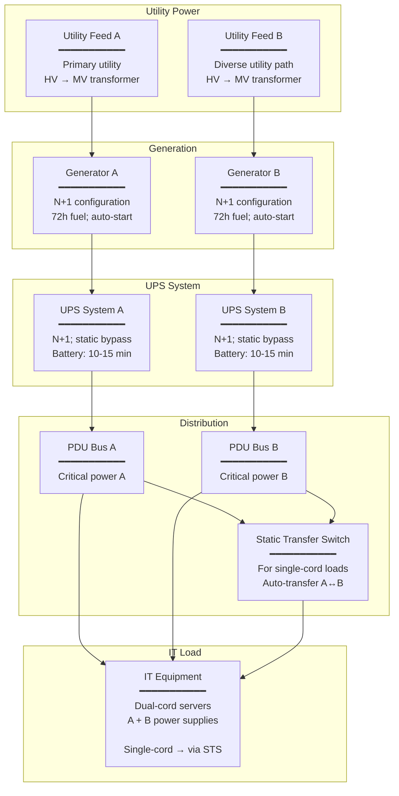
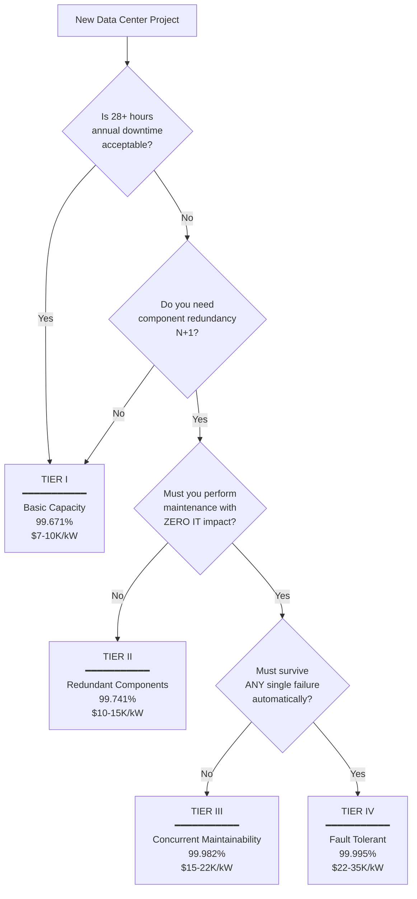

# Uptime Institute Tier Standards (I–IV)

**Topic:** Uptime Institute Tier Classification System for data center infrastructure — topology, redundancy requirements, availability targets, certification process, and operational sustainability  
**Standard:** Uptime Institute Tier Standards (Tier I–IV); originally based on TIA-942 concepts; independently maintained by Uptime Institute since 2005  
**SDO:** Uptime Institute (a division of The 451 Group / S&P Global Market Intelligence)  
**Audience:** Data center design engineers, facility managers, infrastructure architects, operations teams, compliance managers, enterprise IT directors, colocation providers  
**Prerequisites:** Basic electrical and mechanical systems, UPS and generator concepts, cooling system fundamentals, redundancy (N, N+1, 2N) concepts, site selection

---

## Chapter 1 — Historical Context & Origin Story

### 1.1 Timeline

| Year | Event | Significance |
|------|-------|-------------|
| 1993 | Uptime Institute founded | Industry body focused on data center performance and reliability |
| 1995 | First Tier concepts published | "A Practical Look at Data Center Site Infrastructure" white paper |
| 2000 | Tier standard formalized | Four-tier classification system codified; becomes industry reference |
| 2005 | TIA-942 published (ANSI/TIA) | Telecommunications Infrastructure Standard for Data Centers; adopted Tier terminology (with Uptime's permission initially, later diverged) |
| 2005 | Uptime Institute separates Tier from TIA-942 | Uptime declares its Tier classification independent of TIA-942; starts own certification |
| 2006 | First Tier Certifications awarded | Design and construction certifications begin |
| 2010 | Tier Standard updated (Topology V2) | Clarified definitions; added explicit requirements; cooling/power improvements |
| 2014 | Operational Sustainability (M&O) certification added | Recognizes that design alone ≠ availability; operations matter |
| 2018 | Tier Standard further refined | Added prescriptive guidance for high-density (cloud/HPC); improved fire protection requirements |
| 2020 | 3,000+ Tier certificates awarded globally | Standard is dominant global framework for DC classification |
| 2022 | Edge DC Tier guidance | Addressing smaller distributed facilities; Tier-Ready for edge |
| 2024 | AI/HPC density considerations | Updating guidance for liquid cooling; >100kW/rack; power density impacts on Tier topology |

### 1.2 Why Tiers Matter

| Stakeholder | Value of Tier Classification |
|-------------|---|
| **Enterprise IT** | Quantified reliability expectation; vendor comparison; SLA foundation |
| **Financial/Insurance** | Risk assessment; insurance underwriting; business continuity evidence |
| **Colocation buyers** | Apples-to-apples comparison between providers; contractual baseline |
| **Designers/Engineers** | Clear design target; topology requirements; industry-accepted framework |
| **Operations teams** | M&O certification validates operational practices; human factor acknowledged |
| **Regulators** | Some regulations reference Tier requirements (financial sector; government) |

---

## Chapter 2 — Tier Architecture & Structure

### 2.1 The Four Tiers

| Tier | Name | Availability | Annual Downtime | Key Characteristic |
|:----:|------|:---:|:---:|---|
| **I** | Basic Capacity | 99.671% | 28.8 hours | Single path; no redundancy; susceptible to disruptions from planned/unplanned activities |
| **II** | Redundant Capacity Components | 99.741% | 22.7 hours | Single path; redundant capacity components (N+1); still single path — maintenance requires shutdown |
| **III** | Concurrently Maintainable | 99.982% | 1.6 hours | Multiple distribution paths (one active); every component maintainable without IT impact |
| **IV** | Fault Tolerant | 99.995% | 26.3 minutes | Multiple active paths; fault tolerant; single failure of any component/path does NOT affect IT load |

### 2.2 Tier Requirements Matrix

| Requirement | Tier I | Tier II | Tier III | Tier IV |
|-------------|:------:|:-------:|:--------:|:-------:|
| **Distribution paths** | 1 | 1 | 1 active + 1 alternate | 2 simultaneously active |
| **Redundant components** | No | Yes (N+1) | Yes (N+1) | Yes (2N or 2N+1) |
| **Concurrently maintainable** | No | No | **Yes** | Yes |
| **Fault tolerant** | No | No | No | **Yes** |
| **Generator** | Optional | Dedicated | N+1 | 2N |
| **UPS** | Single | N+1 | N+1 (dual-path) | 2N |
| **Cooling** | Single | N+1 | N+1 (concurrent) | 2N |
| **Power outage tolerance** | None specified | 24 hours fuel | 72 hours fuel | 96 hours fuel |
| **Staff** | None required | During business hours | 24/7 recommended | 24/7 required |
| **Typical customer** | Small business; non-critical | SMB; light production | Enterprise; critical applications | Financial; government; mission-critical |

### 2.3 Redundancy Concepts

| Notation | Meaning | Example |
|:--------:|---------|---------|
| **N** | Exactly the capacity needed to support the IT load | 3 cooling units for 3 units of heat load |
| **N+1** | One extra component beyond minimum | 4 cooling units (3 needed + 1 spare); any single failure → still have capacity |
| **N+2** | Two extra components | 5 cooling units (3 needed + 2 spare); can tolerate 2 simultaneous failures |
| **2N** | Complete duplication of the entire system | 6 cooling units (2 complete systems of 3); entire system A can fail → system B handles full load |
| **2(N+1)** | Two complete systems, each with +1 redundancy | 8 cooling units (two systems of 4); most resilient; can lose system + 1 component in surviving system |

---

## Chapter 3 — Technical Deep Dive

### 3.1 Tier I — Basic Capacity

| Aspect | Specification |
|--------|---------------|
| **Power path** | Single utility feed → single transformer → single UPS → single PDU → IT load |
| **Cooling** | Single cooling system; no redundancy; single chiller/DX unit |
| **Generator** | Optional (not required); if present, not sized for full load typically |
| **Single point of failure** | Many: any component failure = downtime; any maintenance = planned downtime |
| **Typical use** | Development/test environments; small companies where cost >> availability; non-revenue applications |
| **Construction** | Months to build; lowest cost per kW; minimal infrastructure investment |
| **Downtime** | Must shut down entirely for any maintenance, repair, or upgrade |

### 3.2 Tier II — Redundant Capacity Components

| Aspect | Specification |
|--------|---------------|
| **Power path** | Single path with N+1 components (e.g., 2 UPS modules in parallel, one extra) |
| **Cooling** | N+1 (e.g., 3 CRACs/CRAHs where 2 would suffice; extra unit available) |
| **Generator** | Dedicated; typically N+1; 24-hour fuel storage |
| **Key limitation** | Single distribution PATH — components are redundant, but the path itself is not; maintenance on path = downtime |
| **Improvement over Tier I** | Component failure tolerable (N+1); but planned maintenance of distribution path still requires IT shutdown |
| **Typical use** | SMB production; internal applications; moderate importance systems |

### 3.3 Tier III — Concurrently Maintainable

| Aspect | Specification |
|--------|---------------|
| **Power** | Multiple paths from utility to IT load; at least one active + one alternate; N+1 per path |
| **Cooling** | Multiple paths; redundant distribution; maintenance of any component without IT impact |
| **Generator** | N+1; 72-hour fuel storage; automatic transfer switching |
| **Concurrent maintainability** | ANY single component (UPS, generator, chiller, PDU, switch, pipe, cable) can be taken offline for maintenance WITHOUT affecting the IT load |
| **NOT fault tolerant** | Concurrent maintainability ≠ fault tolerance; during maintenance window, remaining system may have reduced redundancy; unplanned failure during maintenance could cause outage |
| **Dual-cord IT** | IT equipment must have dual power connections (A+B feed) to achieve path independence |
| **Typical use** | Enterprise production; SaaS providers; financial systems (non-trading); healthcare |

### 3.4 Tier IV — Fault Tolerant

| Aspect | Specification |
|--------|---------------|
| **Power** | 2N (complete duplication): two independent power systems (utility feeds, generators, UPS, switchgear, PDUs); either system carries full IT load alone |
| **Cooling** | 2N (complete duplication): two independent cooling systems; either carries full load |
| **Generator** | 2N; 96-hour fuel storage; automatic transfer; separate fuel systems |
| **Fault tolerance** | ANY single failure (component OR distribution path) is automatically handled WITHOUT human intervention and WITHOUT impact to IT load |
| **Compartmentalization** | Physical separation of redundant systems (fire zones; separate rooms; independent structural areas) |
| **Continuous cooling** | Cooling must survive power failures; generator start delays must not cause thermal exceedance |
| **Detection & isolation** | Automated fault detection; automatic isolation of failed component/path; no human action required |
| **Typical use** | Financial trading platforms; government/military critical; telecom core; hospitals (life safety) |

---

## Chapter 4 — Implementation Guide

### 4.1 Power System Topology by Tier

```
TIER I: Utility → ATS → UPS → PDU → IT Load
                           (single path; no generator required)

TIER II: Utility → ATS → UPS(N+1) → PDU → IT Load
         Generator ──┘    (redundant components; single path)

TIER III:
         ┌─ Utility A → Gen A → ATS → UPS A(N+1) → STS → PDU → IT Load
Path A: ─┤                                           ↕       (dual-path;
Path B: ─┤                                           ↕        concurrent
         └─ Utility B → Gen B → ATS → UPS B(N+1) → STS → PDU → maintainable)

TIER IV:
System 1: Utility A → Gen A(2N) → ATS → UPS A(2N) → PDU A ──→ IT Load (A feed)
System 2: Utility B → Gen B(2N) → ATS → UPS B(2N) → PDU B ──→ IT Load (B feed)
          (completely independent; both carry full load; auto-failover)
```

### 4.2 Cooling System Topology by Tier

| Tier | Topology | Configuration |
|:----:|----------|:---:|
| I | Single chiller → single CRAH → raised floor / overhead | N (no redundancy) |
| II | Multiple chillers (N+1) → single piping loop → CRAHs | N+1 components; single distribution |
| III | Redundant piping loops (A+B); redundant chillers; any loop maintainable; bypass capability | N+1; concurrent maintenance of any component |
| IV | Two independent cooling systems (separate piping; separate chillers; separate CHW plant); either system = full capacity | 2N; either system alone handles full load |

### 4.3 Design Considerations

| Factor | Guidance |
|--------|---------|
| **Capacity planning** | Size for N years growth (typically 5-10); avoid stranding investment; modular expansion capability |
| **Single points of failure** | Map EVERY component and path; identify all SPOFs; each Tier has defined acceptable/unacceptable SPOFs |
| **Separation** | Tier III/IV: physical separation of redundant paths (different risers; fire compartments; cable routes) |
| **IT load dual-cord** | Tier III/IV require dual-powered IT equipment; single-cord equipment on STS (static transfer switch) |
| **Control systems** | Building Management Systems (BMS); EPMS (Electrical Power Monitoring); must themselves be redundant at Tier III/IV |
| **Fire suppression** | Must not cause IT shutdown when deployed; clean agent (FM-200/Novec); zoned detection |
| **Generator start time** | UPS battery runtime must exceed generator start + stable time (typically 10-15 seconds for diesel; plan for 30+ seconds) |

---

## Chapter 5 — Certification & Audit

### 5.1 Uptime Institute Certification Types

| Certification | What It Validates | When Assessed |
|:---:|---|:---:|
| **Tier Certification of Design Documents (TCDD)** | Paper design meets Tier requirements; topology; redundancy; capacity on paper | Design phase (before construction) |
| **Tier Certification of Constructed Facility (TCCF)** | Built facility matches certified design; installed correctly; functional testing passed | After construction (before or shortly after commissioning) |
| **Tier Certification of Operational Sustainability (TCOS)** | Operations, maintenance, and management practices support the Tier level; human factors validated | Ongoing (every 3 years renewal) |

### 5.2 Certification Process

| Step | Activity | Duration |
|:----:|----------|:---:|
| 1 | **Application** — Submit project info; select Tier target; engage Uptime consultant | 2-4 weeks |
| 2 | **Design review** — Submit design documents (single-line diagrams; cooling P&ID; floor plans; specifications) | 4-8 weeks |
| 3 | **Uptime review** — Consultants identify gaps; issue findings; iterate with design team | 4-12 weeks |
| 4 | **TCDD awarded** — Design approved; certification issued for Tier level | After resolution |
| 5 | **Construction** — Build facility per certified design; Uptime may inspect during construction | Project dependent |
| 6 | **Commissioning tests** — Integrated Systems Testing (IST); demonstrate concurrent maintainability or fault tolerance in practice | 2-4 weeks |
| 7 | **TCCF awarded** — Constructed facility verified to match design and pass functional tests | After IST |
| 8 | **Operational assessment** — Review M&O practices; staffing; maintenance procedures; change management; documentation | 3-5 days on-site |
| 9 | **TCOS awarded** — Operations meet Tier requirements; renewed every 3 years | Every 3 years |

### 5.3 Common Certification Failures

| Issue | Tier | Consequence |
|-------|:----:|-------------|
| Single point of failure in BMS/controls | III/IV | Design rejected; controls must be redundant |
| Inadequate physical separation of paths | III/IV | Fire in one zone could affect both paths |
| Single-cord equipment without STS | III/IV | Cannot achieve dual-path benefit |
| Generator fuel supply SPOF | III/IV | Single fuel tank; single fuel pump; single fill connection |
| Cooling transition gaps | III/IV | Switching from one cooling path to another causes brief thermal exceedance |
| Insufficient IST evidence | TCCF | Cannot demonstrate concurrency/fault tolerance without proper testing |
| M&O documentation gaps | TCOS | Missing maintenance procedures; inadequate change management |

---

## Chapter 6 — Regional Variants & Related Standards

### 6.1 Related Data Center Classification Standards

| Standard | Region | Comparison to Uptime Tiers |
|----------|:------:|---|
| **TIA-942 (ANSI/TIA)** | Global (US-origin) | Similar 4-tier concept BUT different requirements; TIA-942 is prescriptive (specific distances, configurations); Uptime is topology-focused |
| **EN 50600** | Europe (CENELEC) | Availability classes (1-4); similar concept but more granular (separate classes for power, cooling, physical security, etc.); can mix classes |
| **ANSI/BICSI 002** | Global (US-origin) | Design best practices; references both TIA-942 and Uptime; classes 0-4 |
| **SS 507** | Singapore | Unique 4-tier classification; designed for tropical climate; government buildings |
| **GB 50174** | China | National standard for DC design; classes A, B, C (A = highest, similar to Tier III/IV) |

### 6.2 Uptime Tiers vs. TIA-942 (Key Differences)

| Aspect | Uptime Institute | TIA-942 |
|--------|:---:|:---:|
| **Approach** | Topology-based (functional requirements) | Prescriptive (specific configurations) |
| **Certification** | Uptime certifies facilities directly | No certification body; self-declared |
| **Scope** | Power + cooling + controls (IT-supporting infrastructure) | Also includes telecommunications; physical layout |
| **Flexibility** | "Achieve this outcome; we don't prescribe HOW" | More specific about distances, cable paths, room layouts |
| **Recognition** | Global gold standard; colocation industry standard | Widely referenced; used in government specifications |
| **Cost of cert** | $50K-200K+ (depending on facility size and complexity) | N/A (no formal certification) |

---

## Chapter 7 — Comparison: Tiers in Detail

### 7.1 Financial Impact by Tier

| Factor | Tier I | Tier II | Tier III | Tier IV |
|--------|:------:|:-------:|:--------:|:-------:|
| **Construction cost** (per kW) | $7K-10K | $10K-15K | $15K-22K | $22K-35K+ |
| **Expected annual downtime** | 28.8 hours | 22.7 hours | 1.6 hours | 26.3 minutes |
| **Downtime cost** (example: $10K/min) | $17.3M | $13.6M | $960K | $263K |
| **Payback** | N/A (baseline) | Marginal savings vs. cost | Often justified for production | Justified for mission-critical |
| **Operating cost multiplier** | 1.0x | 1.2x | 1.5-1.8x | 2.0-2.5x |
| **Staff requirements** | Part-time | Business hours | 24/7 recommended | 24/7 required + specialized |

### 7.2 Tier Selection Guide

| If your workload is... | Recommended Tier | Reasoning |
|:-:|:---:|---|
| Development/test | I or II | Downtime acceptable; cost-sensitive; low business impact |
| Internal business apps | II | Some redundancy; reasonable cost; planned downtime acceptable with scheduling |
| Customer-facing SaaS | III | Concurrent maintainability essential; 24/7 operations; competitive SLA requirement |
| Financial trading / Payment processing | IV | Zero tolerance for outage; regulatory requirements; revenue loss per second |
| Government / Military critical | IV | National security; regulatory mandate; fault tolerance required |
| Hyperscale cloud (AWS/Azure/GCP) | III+ (custom) | Build own topology exceeding Tier III with software-defined redundancy; geographic redundancy |

---

## Chapter 8 — Mermaid Architecture Diagrams

### 8.1 Tier III Electrical Topology



### 8.2 Tier Comparison Decision Flow



---

## Chapter 9 — Case Studies

### 9.1 Case Study: Tier III Design — Enterprise Colocation

| Aspect | Detail |
|--------|--------|
| Project | 10 MW colocation data center; target: enterprise customers requiring 99.99% SLA; Tier III certification |
| Design choices | (1) **Two utility feeds** from different substations (diverse paths). (2) **N+1 diesel generators** (6 × 2.5 MW; 5 needed for full load + 1 standby); 72-hour fuel; auto-start in 10 seconds; load-tested monthly. (3) **Rotary UPS** (N+1); 15 seconds ride-through; sufficient for generator start. (4) **Dual power buses** (A + B) throughout facility; independent from generators through to rack PDUs. (5) **Chilled water cooling** (N+1 chillers; dual CHW loops; each loop independently maintainable). (6) **Static transfer switches** for legacy single-cord IT equipment. (7) **Separate fire zones** for A and B power rooms; separate generator yards. (8) **BMS fully redundant** (dual controllers; dual network). |
| Certification | TCDD: 8 weeks (one finding: BMS single network path → fixed with redundant path). TCCF: passed after 3-week IST demonstrating concurrent maintainability of every component. TCOS: in progress (establishing M&O procedures). |
| Cost | $18M for 10 MW (approximately $18K/kW including construction, equipment, certification) |
| Business impact | Attracts enterprise customers willing to pay premium for certified Tier III; enables 99.99% SLA contracts; insurance premiums reduced 15% due to Tier certification |

### 9.2 Case Study: Tier IV Financial Trading Center

| Aspect | Detail |
|--------|--------|
| Project | 5 MW financial trading data center; high-frequency trading; every millisecond of downtime = millions lost; regulatory requirement for fault tolerance |
| Design choices | (1) **2N power**: two complete independent power systems (separate utility feeds; separate transformer vaults; separate generator farms; separate UPS systems; separate distribution); either system carries full 5 MW load. (2) **2N cooling**: two independent chilled water plants; separate cooling towers; separate piping; complete thermal redundancy. (3) **Compartmentalization**: A system and B system in separate fire compartments; structural separation; independent access paths. (4) **96-hour fuel**: dual fuel storage systems (underground tanks in separate locations); dual fill connections; tested monthly fuel delivery. (5) **Automated fault response**: PLC-based fault detection and isolation; automatic transfer to healthy system in <50ms; no human intervention required. (6) **Zero single points of failure**: even non-obvious items — BMS, fire alarm, security system — all fully redundant with automatic failover. |
| Challenges | (1) Cost: $175M for 5 MW ($35K/kW) — justified by business case ($3M+/hour downtime cost). (2) Control system complexity: automated fault isolation requires extensive testing; commissioning took 6 months. (3) Staffing: 24/7 operations with minimum 2 qualified engineers on-site at all times. (4) Testing discipline: quarterly failure injection tests (controlled failure of one path to verify automatic response). |
| Results | Certification: Tier IV TCDD + TCCF achieved. Zero unplanned downtime in 5 years of operation. Annual maintenance windows: zero IT impact (all work done concurrently). Regulatory audits: passed without findings (Tier IV cert as evidence). |

---

## Chapter 10 — Future Evolution

| Trend | Timeline | Impact |
|-------|----------|--------|
| **AI/HPC density challenges** | 2024-2027 | 40-120 kW/rack changes thermal dynamics; traditional Tier topology may need adaptation; liquid cooling integration with Tier requirements |
| **Sustainability integration** | 2024-2026 | Tier standards incorporating energy efficiency and sustainability criteria; not just availability |
| **Edge DC Tier guidance** | 2023-2025 | Smaller facilities (< 1 MW); distributed locations; modified Tier concepts for unmanned facilities |
| **Software-defined redundancy** | 2024-2028 | Hyperscalers argue software (Kubernetes; geo-redundancy) provides application-level fault tolerance; reduces need for facility-level Tier IV |
| **Hybrid approaches** | Ongoing | Tier III facility + geographic redundancy (active-active) = Tier IV equivalent at application level; more cost-effective |
| **Modular DC** | 2023-2026 | Pre-fabricated modular DCs; how Tier certification applies to manufactured/assembled facilities |
| **Grid resilience concerns** | 2024-2028 | Increasing grid instability (climate events; renewable intermittency); higher demand for on-site generation; longer fuel storage requirements |

---

## Chapter 11 — Interview Questions & Career Guide

### Tier 1: Entry-Level

**Q1:** Explain the difference between Tier II and Tier III data centers. What is "concurrent maintainability"?  
**A:** The fundamental difference between Tier II and Tier III is the concept of concurrent maintainability. **Tier II** has redundant COMPONENTS (N+1) — so if one UPS module or one cooling unit fails, the others handle the load. HOWEVER, Tier II still has a SINGLE DISTRIBUTION PATH. This means if you need to maintain something in the distribution path (replace a breaker, repair a pipe, upgrade a bus duct), you MUST shut down the IT load because there's no alternate path. **Tier III** solves this with MULTIPLE distribution paths. Every component in the facility can be taken offline for maintenance WITHOUT any impact to the IT load. This means planned downtime goes to zero — all maintenance, repairs, upgrades, replacements happen while the data center continues operating. Practical example: Tier II with N+1 cooling — you have 4 CRAHs (3 needed + 1 spare). If one fails, the others handle it. But if the CHW pipe feeding ALL 4 CRAHs needs repair, you must shut down. Tier III: two independent CHW loops feeding two sets of CRAHs — you can shut down either loop entirely while the other carries full load.

### Tier 2: Mid-Level

**Q2:** You're designing a Tier III data center. Describe the power topology from utility to IT rack, including all redundancy provisions and the role of the STS.  
**A:** [Detailed answer covering: dual utility feeds (preferably from diverse substations); ATS (Automatic Transfer Switch) per path selecting utility or generator; generator plant per path (N+1 per side); UPS systems (N+1 per path; battery for ride-through during generator start); dual independent buses (A + B) through switchgear to floor PDUs; rack PDUs (A + B strips); dual-cord servers connect to both A and B; STS (Static Transfer Switch) for single-cord equipment: continuously monitors both power sources; transfers in 4-8ms (quarter cycle) — faster than IT PSU holdup time; allows single-cord equipment to benefit from dual-path infrastructure; STS placement: downstream of both UPS paths; feeds single-cord PDU strip; concurrent maintainability demonstration: can take offline Generator A, Generator B, UPS A, UPS B, or any individual distribution component without IT impact because alternate path carries load.]

### Tier 3: Senior

**Q3:** A hyperscale cloud provider argues they don't need Tier IV facilities because Kubernetes provides application-level fault tolerance across Tier III sites. Evaluate this argument — when is it valid, and when does it fail?  
**A:** [Comprehensive answer covering: the argument's validity (for stateless microservices with proper geographic redundancy, application-level HA across Tier III facilities can deliver >99.999% at application layer; this is how AWS/Azure/GCP operate; software-defined redundancy is more cost-effective than 2N physical infrastructure); when it fails (1: stateful workloads — database replication lag; split-brain; financial transactions require ACID guarantees that geo-failover complicates; 2: latency-sensitive workloads — HFT cannot tolerate geographic failover latency; 3: single-region deployments — if customer deploys in one region, facility Tier is their only protection; 4: compliance requirements — some regulations explicitly require facility-level fault tolerance; 5: human error — software-defined HA requires correct configuration; misconfigured K8s ≠ fault tolerant; 6: correlated failures — software bugs, DNS, certificate expiry can affect all regions simultaneously); conclusion: for most cloud-native workloads, Tier III + geographic redundancy > Tier IV single site (cost-effective; more resilient against site-level events); but for specific workloads requiring zero-latency failover or regulatory compliance, facility-level Tier IV remains essential.]

---

## Chapter 12 — Cheat Sheet & Quick Reference

### Tier Quick Reference

```
TIER I — BASIC CAPACITY (99.671%)
  ✗ Redundancy: None
  ✗ Concurrent Maintenance: No
  ✗ Fault Tolerant: No
  • Single path; single components; any failure = downtime
  • Use: dev/test; non-critical; budget-constrained

TIER II — REDUNDANT COMPONENTS (99.741%)
  ✓ Redundancy: N+1 components
  ✗ Concurrent Maintenance: No  
  ✗ Fault Tolerant: No
  • Single path; redundant components; distribution maintenance = downtime
  • Use: SMB; internal apps; moderate importance

TIER III — CONCURRENTLY MAINTAINABLE (99.982%)
  ✓ Redundancy: N+1
  ✓ Concurrent Maintenance: Yes
  ✗ Fault Tolerant: No
  • Multiple paths (one active); any component maintainable without IT impact
  • Use: enterprise; SaaS; financial (non-trading); healthcare

TIER IV — FAULT TOLERANT (99.995%)
  ✓ Redundancy: 2N or 2N+1
  ✓ Concurrent Maintenance: Yes
  ✓ Fault Tolerant: Yes
  • Multiple active paths; ANY single failure = no IT impact (automatic)
  • Use: financial trading; military; telecom core; life safety
```

### Key Metrics

```
AVAILABILITY & DOWNTIME:
  Tier I:   99.671% → 28.8 hours/year
  Tier II:  99.741% → 22.7 hours/year  
  Tier III: 99.982% → 1.6 hours/year
  Tier IV:  99.995% → 26.3 minutes/year

  99.9%   = 8.76 hours/year    ("three nines")
  99.99%  = 52.6 minutes/year  ("four nines")
  99.999% = 5.26 minutes/year  ("five nines")

CONSTRUCTION COST (per kW):
  Tier I:   $7K - $10K
  Tier II:  $10K - $15K
  Tier III: $15K - $22K
  Tier IV:  $22K - $35K+

REDUNDANCY NOTATION:
  N     = exact capacity needed
  N+1   = one spare (tolerate 1 failure)
  N+2   = two spares (tolerate 2 failures)
  2N    = complete duplicate system
  2(N+1) = two systems, each with one spare

FUEL STORAGE REQUIREMENTS:
  Tier II:  24 hours
  Tier III: 72 hours
  Tier IV:  96 hours

CERTIFICATION TYPES:
  TCDD = Design Documents (paper review)
  TCCF = Constructed Facility (built + tested)
  TCOS = Operational Sustainability (M&O practices; renew every 3 years)
```

---

*End of Document — 01_Uptime_Institute_Tiers.md*
