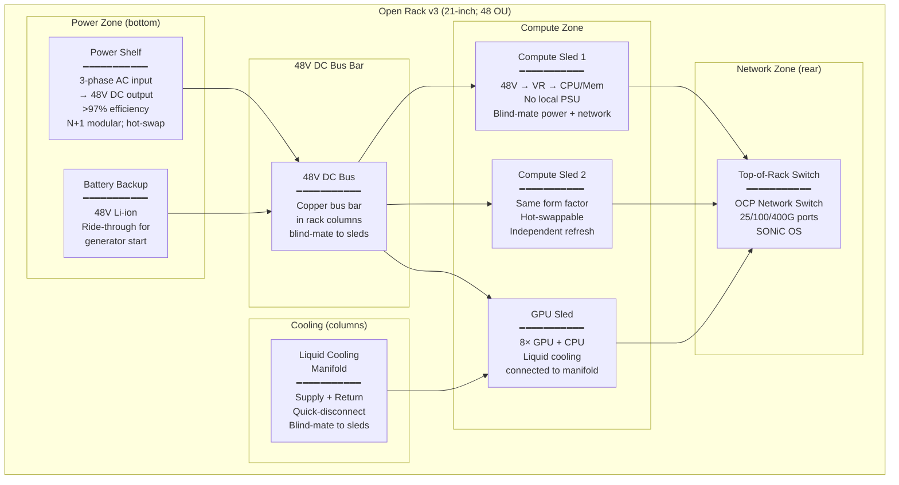

# Open Compute Project (OCP) — Hyperscale Hardware Standards

**Topic:** Open Compute Project specifications — Open Rack, server designs (disaggregated compute), networking (NIC 3.0), storage, optical transceivers, and hyperscale hardware design philosophy  
**Standard:** OCP Open Rack v3; OCP Server (Yosemite V3, Grand Teton, Crater Lake); OCP NIC 3.0; OCP Storage; OCP Optical (OSFP, QSFP-DD)  
**SDO:** Open Compute Project Foundation (OCP Foundation); originally initiated by Facebook/Meta (2011)  
**Audience:** Hardware design engineers, data center architects, server platform engineers, network hardware engineers, hyperscale operations teams, procurement engineers  
**Prerequisites:** Server hardware architecture (CPU, memory, storage, NIC), data center physical infrastructure, rack and power distribution, networking hardware (switches, NICs, optics), thermal management

---

## Chapter 1 — Historical Context & Origin Story

### 1.1 Timeline

| Year | Event | Significance |
|------|-------|-------------|
| 2009 | Facebook designs custom server for Prineville DC | Stripped unnecessary features from commercial servers; optimized for TCO; 38% more efficient, 24% less expensive |
| 2011 | **Open Compute Project launched** by Facebook | Open-sourced server, rack, and DC designs; industry disruption begins |
| 2011 | First OCP contributions: Open Rack v1; Open Vault (storage) | Established "vanity-free" design philosophy; removed logos, paint, unnecessary plastics |
| 2012 | Goldman Sachs, Rackspace join OCP | Financial services and hosting validating OCP; not just hyperscalers |
| 2013 | Microsoft joins OCP; contributes Open CloudServer | Legitimized OCP for enterprise; Microsoft's cloud hardware designs shared |
| 2014 | OCP Networking project launched; Wedge switch | First open network switch design; challenge to Cisco/Arista/Juniper proprietary hardware |
| 2015 | LinkedIn, Apple join OCP | Broad industry adoption; OCP influences >50% of hyperscale server designs |
| 2016 | **Open Rack v2** released | Industry-standard OCP rack; 21" wide (vs. traditional 19"); power shelf; centralized power |
| 2017 | OCP NIC project launched | Standardized network interface cards; SmartNIC concepts |
| 2018 | OCP accepted designs for AI/ML hardware (Big Basin) | Facebook's GPU server for training; open AI infrastructure |
| 2019 | OCP Open Domain-Specific Architecture (ODSA) | Chiplet interconnect standardization; disaggregated silicon |
| 2021 | **Open Rack v3** released | Major update: 48V power; liquid cooling support; higher density; AI-ready |
| 2022 | OCP Grand Teton (Meta AI training platform) | GPU training server design; NVLink; high-bandwidth memory |
| 2023 | OCP Crater Lake (AI inference); OAM v2 (AI accelerator) | AI inference optimization; OCP Accelerator Module for AI chips |
| 2024 | OCP addressing 800G networking; liquid cooling standards; AI cluster architecture | AI-driven evolution of all OCP projects |

### 1.2 OCP Design Philosophy

| Principle | Meaning | Impact |
|-----------|---------|--------|
| **Vanity-free** | No logos, paint, bezels, unnecessary aesthetics | Reduces cost; simplifies manufacturing; improves recyclability |
| **Purpose-built** | Designed for specific workload, not general-purpose | Higher efficiency; better TCO; less waste |
| **Open source hardware** | Designs publicly available (CAD, BOM, specifications) | Anyone can manufacture; supply chain competition; avoids vendor lock-in |
| **TCO-optimized** | Minimize Total Cost of Ownership (purchase + power + cooling + maintenance over 3-5 years) | May increase unit cost if it reduces opex (e.g., more efficient PSU) |
| **Disaggregated** | Separate compute, storage, networking, power into independent modules | Independent refresh cycles; scale what you need; reduce waste |
| **Efficiency-first** | Every watt not doing useful work is waste | Higher efficiency PSUs; optimized airflow; thermal design |

---

## Chapter 2 — OCP Architecture & Projects

### 2.1 OCP Project Structure

| Project | Scope | Key Specifications |
|---------|-------|-------------------|
| **Open Rack** | Physical rack standard | Open Rack v3 (21" wide; 48V DC bus; power shelf; liquid cooling manifold) |
| **Server** | Compute platforms | Yosemite V3 (multi-node); Grand Teton (GPU training); Crater Lake (inference); Leopard (storage-dense) |
| **Networking** | Switches and NICs | Wedge/Minipack (switches); NIC 3.0 (SmartNIC); SAI (Switch Abstraction Interface) |
| **Storage** | Storage hardware | Open Vault; Bryce Canyon (JBOF); NVMe-oF storage; Grand Teton storage |
| **Hardware Management** | BMC/Firmware | OpenBMC (open BMC firmware); Redfish (management API); DC-SCM (secure module) |
| **Security** | Hardware root of trust | Caliptra (silicon RoT); Project Cerberus (platform attestation); DC-SCM |
| **Power** | Power distribution | ORv3 power shelf (48V bus); BBU (Battery Backup Unit); power efficiency |
| **Cooling** | Thermal solutions | Advanced Cooling Solutions: liquid cooling manifold; CDU specs; immersion |
| **AI/Accelerator** | AI/ML hardware | OAM (OCP Accelerator Module); UBB (Universal Baseboard); Grand Teton; Crater Lake |

### 2.2 OCP vs. Traditional Server Comparison

| Aspect | Traditional (OEM) Server | OCP Server |
|--------|:---:|:---:|
| **Design source** | Proprietary (Dell, HPE, Lenovo, Supermicro) | Open source (community-designed; multiple manufacturers) |
| **Chassis** | Standard 1U/2U/4U; 19" rack mount; general purpose | Purpose-built; multi-node; Open Rack v3 (21"); workload-specific |
| **Power supply** | Per-server PSU (redundant; 80+ Platinum/Titanium) | Centralized power shelf in rack; power distributed at 48V DC; individual PSUs eliminated |
| **Management** | Proprietary BMC (iLO, iDRAC, XCC) | OpenBMC (open source); Redfish API; DC-SCM for security |
| **Modularity** | Fixed configuration; limited upgrade options | Disaggregated: swap CPU sled, storage sled, network independently |
| **Customization** | BTO (build-to-order) from OEM menu | Full design control; modify for specific workload |
| **Vendor lock-in** | High (firmware; management; ecosystem) | Low (open specs; multiple manufacturers; standard interfaces) |
| **Cost** | Higher (brand; support; margin; R&D amortization) | 20-40% lower TCO at scale; higher engineering investment upfront |
| **Support** | OEM warranty and service | ODM/community support; self-maintained (requires expertise) |
| **Who uses** | Enterprise (all sizes); SMB; anyone wanting turnkey | Hyperscalers (Meta, Microsoft, Google); large cloud; advanced enterprise |

---

## Chapter 3 — Technical Deep Dive

### 3.1 Open Rack v3 (ORv3)

| Specification | Detail |
|:---:|--------|
| **Width** | 600mm (21") external; vs. traditional 19" (482.6mm) EIA-310 |
| **Height** | 48 OU (Open Units); OU = 48mm (vs. traditional RU = 44.45mm) |
| **Depth** | 1200mm (maximum equipment depth including cables) |
| **Power distribution** | **48V DC bus bar** — centralized power shelf converts AC→48V; distributed via bus bar to all sleds |
| **Power capacity** | Up to 30-40 kW per rack (air-cooled); 80-120 kW (liquid-cooled) |
| **Power shelf** | Modular; hot-swappable; converts 3-phase AC → 48V DC; >97% efficiency; N+1 redundancy |
| **Cooling** | Air cooling (front-to-rear standard) OR liquid cooling manifold (integrated into rack columns) |
| **Liquid cooling manifold** | Quick-disconnect fittings; blind-mate connections; supply/return manifold in rack columns |
| **Sled form factor** | Slides into rack on guide rails; blind-mate power (48V bus bar contact); blind-mate network (rear connectors) |
| **Key advantage over 19"** | More usable internal space (21" vs. 19" internal); wider boards; better airflow; centralized power saves space/weight |

### 3.2 OCP Server Designs

| Platform | Type | Nodes per Chassis | CPU | Use Case |
|:---:|:---:|:---:|:---:|---|
| **Yosemite V3** | Multi-node compute | 4 server blades per 2 OU tray | ARM or x86 | Web serving; microservices; edge; high-density compute |
| **Leopard** | Storage-dense | 1 (storage-focused) | x86 | Object storage; distributed storage; CDN |
| **Grand Teton** | GPU training | 1 (massive) | x86 + 8× GPU | AI/ML model training; HPC; large-scale deep learning |
| **Crater Lake** | AI inference | 4-8 accelerators | x86 + AI accelerators | Real-time inference; recommendation engines |
| **Glacier Point V3** | Storage + compute | 2-4 | x86 | Converged storage/compute; distributed databases |
| **Tioga Pass** | Single-socket compute | 1 | x86 (single socket) | Cost-optimized; web tier; stateless services |

### 3.3 Power Architecture: 48V DC Distribution

| Traditional Power Path | OCP ORv3 Power Path |
|:---:|:---:|
| Utility AC (480V) | Utility AC (480V) |
| → Transformer (480V → 208V) | → Transformer (480V → 277V) |
| → UPS (AC→DC→AC) | → UPS (AC→DC→AC) or HVDC |
| → PDU per rack (208V AC) | → Power Shelf (AC → 48V DC; >97% eff) |
| → Per-server PSU (AC → 12V DC; 94% eff) | → 48V DC bus bar (in rack) |
| → Voltage regulators (12V → core voltages) | → Point-of-load converters (48V → core) |
| **Total path efficiency: ~85-88%** | **Total path efficiency: ~92-95%** |
| **Losses: 12-15%** | **Losses: 5-8%** |

Key insight: Eliminating the per-server PSU and converting once at rack level saves 5-7% of total power; at hyperscale (millions of servers), this is hundreds of MW saved.

### 3.4 OCP NIC 3.0 (SmartNIC)

| Aspect | Detail |
|--------|--------|
| **What** | Standardized network interface card specification; includes SmartNIC capabilities |
| **Form factor** | OCP NIC 3.0 form factor: single-slot; mezzanine; or ORv3 sled-mounted |
| **Interface** | PCIe Gen5 x16; optional CXL support |
| **Network speeds** | 25/50/100/200/400 Gbps per port |
| **SmartNIC features** | Hardware offload: encryption; compression; firewall; load balancing; virtio acceleration; OVS offload |
| **DPU concept** | Data Processing Unit: ARM cores on NIC for programmable data plane; infrastructure offload from host CPU |
| **Vendors** | NVIDIA (ConnectX/BlueField); Broadcom (Stingray); Intel (IPU); Marvell (Octeon); AMD (Pensando) |

---

## Chapter 4 — Implementation Guide

### 4.1 OCP Adoption Path

| Phase | Actions | Who Benefits |
|:-----:|---------|:---:|
| **Evaluate** | Study OCP designs for your workload; TCO analysis vs. OEM; identify specific OCP specs applicable | All |
| **Pilot** | Deploy 1-2 racks OCP hardware; validate thermal, power, management; train operations team | Large enterprise+ |
| **Partial adopt** | Deploy OCP for specific workloads (AI cluster; storage tier); keep OEM for general compute | Hybrid approach |
| **Full adopt** | Standardize on OCP across fleet; custom designs per workload; ODM relationships; OpenBMC | Hyperscale; large cloud |

### 4.2 Vendor Ecosystem

| Role | Companies | What They Provide |
|:----:|:---------:|---|
| **ODM/Manufacturer** | Quanta; Wiwynn; ZT Systems; Inventec; Celestica; Foxconn; Jabil | Manufacture OCP-compliant hardware to spec; some contribute designs |
| **Silicon** | Intel; AMD; NVIDIA; Broadcom; Marvell; Ampere | CPUs, GPUs, NICs, switches, accelerators for OCP platforms |
| **System Integrator** | EdgeCore; Delta; Accton | Network switches; power shelves; complete rack solutions |
| **Software** | Meta (OpenBMC); SONiC (Microsoft); DENT; SAI | Open source firmware, network OS, management |
| **Traditional OEMs adopting OCP** | HPE; Dell; Lenovo; Supermicro | Now offer "OCP-inspired" or OCP-compliant product lines |

### 4.3 OpenBMC & Management

| Aspect | Detail |
|--------|--------|
| **What** | Open source BMC (Baseboard Management Controller) firmware; Linux-based |
| **Originally** | Facebook/Meta contribution; replaces proprietary BMC (iLO, iDRAC, XCC) |
| **Protocol** | Redfish API (DMTF standard); REST-based; JSON; replaces legacy IPMI |
| **Features** | Power control; sensor monitoring; firmware update; remote console; event logging; security attestation |
| **Security** | DC-SCM (Data Center Secure Control Module): hardware root of trust; secure boot chain; attestation |
| **Advantage** | Full control over management firmware; no vendor dependency; customizable; security auditable |

---

## Chapter 5 — OCP Certification & Community

### 5.1 OCP Recognition Programs

| Program | Level | Requirements |
|---------|:-----:|---|
| **OCP Accepted™** | Entry | Design reviewed by OCP community; specifications published; open license |
| **OCP Inspired™** | Commercial | Commercial product inspired by OCP designs; may not be fully OCP-compliant but shares design philosophy |
| **OCP Ready™** | Facility | Data center facility capable of hosting OCP hardware (ORv3 racks; power; cooling) |

### 5.2 OCP Community Structure

| Entity | Role |
|--------|------|
| **OCP Foundation** | Non-profit; governs project; organizes summits; manages IP |
| **Project Leads** | Engineers (often from Meta, Microsoft, Google) leading specific projects |
| **Work Groups** | Cross-company working groups for specific topics (e.g., Advanced Cooling Solutions) |
| **OCP Marketplace** | Directory of OCP-compliant products available for purchase |
| **OCP Experience Centers** | Physical labs where companies can test OCP hardware before procurement |
| **OCP Global Summit** | Annual conference; San Jose; design contributions; roadmap presentations |
| **OCP Regional Summits** | EMEA, APAC events for regional adoption |

---

## Chapter 6 — OCP for AI Infrastructure

### 6.1 AI/ML Hardware in OCP

| Platform | Generation | GPUs/Accelerators | Interconnect | Power | Cooling |
|:---:|:---:|:---:|:---:|:---:|:---:|
| **Big Basin** (2017) | V100 era | 8× NVIDIA V100 (NVLink) | NVLink 2.0 + PCIe | ~3 kW | Air |
| **Zion** (2019) | V100 updated | 8× V100/A100 | NVLink + InfiniBand HDR | ~4 kW | Air |
| **Grand Teton** (2022) | H100 era | 8× NVIDIA H100 (SXM5) | NVLink 4.0 + 400G InfiniBand | ~6-8 kW | Air + liquid option |
| **Crater Lake** (2023) | Inference | Custom accelerators (OAM) | CXL + Ethernet | ~2-4 kW | Air |
| **Next-gen** (2024+) | B100/B200 | 8× NVIDIA B200 (NVLink 5.0) | NVLink + 800G | ~10-15 kW per node | **Liquid mandatory** |

### 6.2 OCP Accelerator Module (OAM)

| Specification | Detail |
|:---:|--------|
| **What** | Standardized form factor for AI/ML accelerator chips (alternative to NVIDIA's proprietary SXM) |
| **Goal** | Allow multiple vendors' AI chips to fit in the same baseboard (UBB — Universal Baseboard) |
| **Participants** | AMD (MI300); Intel (Gaudi); Graphcore; Cerebras (concepts) |
| **Physical** | Standard module size; standard connector; standard thermal interface |
| **Interface** | OAM connector: PCIe Gen5; optional CXL; chip-to-chip interconnect |
| **UBB** (Universal Baseboard) | Board that hosts 4-8 OAM modules; provides power; interconnect routing; management |
| **Advantage** | Avoid NVIDIA lock-in (SXM is proprietary); enable multi-vendor AI accelerator ecosystem |

---

## Chapter 7 — Comparison: OCP vs. Traditional vs. Custom

### 7.1 Total Cost of Ownership Comparison

| Cost Factor | Traditional OEM | OCP (at scale) | Savings |
|-------------|:---:|:---:|:---:|
| Hardware purchase (per server) | $10,000-15,000 | $7,000-11,000 | 20-30% |
| Power efficiency (over 3 years) | 89% path efficiency | 94% path efficiency | 5-7% energy cost |
| Cooling cost | Standard (per-server PSU waste heat) | Reduced (centralized PSU; less heat per rack) | 10-15% cooling |
| Maintenance/support | OEM contract ($1,000-3,000/server/year) | ODM spare parts; self-maintained | 50-70% (if capable) |
| Refresh cycle | 4-5 year full server | Disaggregated: CPU sled only; keep chassis | 30-40% on refresh |
| **Total 3-year TCO** | $25,000-35,000 per server | $15,000-22,000 per server | **25-40% lower** |
| **Break-even scale** | N/A | ~5,000-10,000 servers | Needs engineering investment to justify |

### 7.2 When to Use OCP vs. Traditional

| Scenario | Recommendation | Rationale |
|----------|:---:|---|
| < 100 servers; general workloads | Traditional OEM | Engineering investment not justified; OEM support valuable |
| 100-1000 servers; specific workload | OCP-Inspired (from OEM) | HPE/Dell offer OCP-influenced products with enterprise support |
| 1,000-10,000 servers; cloud/web | Partial OCP adoption | Deploy OCP for primary workload; OEM for ancillary; build expertise |
| 10,000+ servers; hyperscale | Full OCP | Clear TCO benefit; engineering team justified; custom optimization |
| AI/GPU cluster (any size) | OCP Grand Teton or custom | GPU density and cooling requirements align with OCP designs |
| Edge computing (distributed) | OCP + traditional (depends) | OCP for standardized edge pod; traditional for remote unmanned |

---

## Chapter 8 — Mermaid Architecture Diagrams

### 8.1 Open Rack v3 Architecture



### 8.2 OCP vs. Traditional DC Architecture

```mermaid
graph LR
    subgraph "Traditional DC"
        T_AC[AC Power<br/>to each rack]
        T_PDU[Per-rack PDU<br/>(208V AC)]
        T_PSU[Per-server PSU<br/>(AC→12V DC)<br/>94% efficiency]
        T_SRV[Server<br/>19-inch; 1U/2U<br/>standalone]
        
        T_AC --> T_PDU --> T_PSU --> T_SRV
    end
    
    subgraph "OCP DC"
        O_AC[AC Power<br/>to power shelf]
        O_PS[Power Shelf<br/>(AC→48V DC)<br/>97% efficiency]
        O_BUS[48V Bus Bar<br/>(in rack columns)]
        O_VR[Point-of-Load<br/>VR on sled<br/>(48V→1V; 98% eff)]
        O_SLED[Compute Sled<br/>21-inch; purpose-built<br/>disaggregated]
        
        O_AC --> O_PS --> O_BUS --> O_VR --> O_SLED
    end
```

---

## Chapter 9 — Case Studies

### 9.1 Case Study: Meta (Facebook) — OCP at Scale

| Aspect | Detail |
|--------|--------|
| Scale | 10+ hyperscale data centers globally; millions of servers; exabytes of storage |
| OCP usage | ALL new servers are OCP designs manufactured by ODMs (Quanta, Wiwynn, ZT Systems); Meta does NOT purchase from traditional OEMs (Dell, HPE) |
| Design process | Meta hardware engineers design server platforms (Yosemite, Grand Teton, etc.); publish to OCP; ODMs compete on manufacturing price/quality |
| Power savings | 48V rack architecture saves estimated 5-7% of total DC power vs. traditional; across Meta's fleet this = hundreds of MW saved |
| AI cluster | Grand Teton design for AI training: 16,000+ NVIDIA A100/H100 GPUs in a single cluster; OCP racks; liquid cooling; 400G InfiniBand fabric |
| Contribution model | Meta contributes ~80% of OCP designs; benefits: industry standardization reduces ODM tooling cost; community contributions solve shared problems |

### 9.2 Case Study: Microsoft — Project Olympus & Azure

| Aspect | Detail |
|--------|--------|
| History | Microsoft joined OCP 2014; contributed Project Olympus (cloud server); now all Azure servers are OCP-based |
| Azure fleet | Millions of servers across 60+ regions; all based on OCP principles; manufactured by multiple ODMs for supply chain resilience |
| Key contributions | Project Olympus (general compute); Maia (custom AI accelerator — OAM form factor); SONiC (network OS for OCP switches); DC-SCM (security module) |
| SONiC | Software for Open Networking in the Cloud: open-source network OS running on OCP switches; used across Azure AND available to any enterprise; supports SAI (Switch Abstraction Interface) |
| Economic impact | Estimated 40% TCO reduction vs. purchasing equivalent from OEMs; justified dedicated hardware engineering team (hundreds of engineers) |

---

## Chapter 10 — Future Evolution

| Trend | Timeline | Impact |
|-------|----------|--------|
| **Liquid cooling as default** | 2024-2026 | ORv3 already supports liquid manifold; AI workloads mandate it; all new OCP platforms liquid-ready |
| **CXL adoption** | 2024-2027 | Compute Express Link enabling memory disaggregation; shared memory pools; OCP driving CXL standards |
| **OCP for edge** | 2024-2026 | Smaller form factor OCP designs; telecom edge (O-RAN); retail edge; distributed compute |
| **Chiplet/UCIe** | 2025-2028 | Universal Chiplet Interconnect Express; disaggregated silicon; mix-and-match chiplets from different vendors in OCP platforms |
| **800G/1.6T networking** | 2024-2027 | OCP networking project driving 800G switch and NIC specs; co-packaged optics; silicon photonics |
| **Sustainability focus** | 2024-2027 | OCP adding circular economy principles; recyclability requirements; carbon-aware design |
| **OAM v2+ adoption** | 2024-2026 | More AI chip vendors (AMD MI300; Intel Gaudi 3) adopting OAM; reducing NVIDIA SXM lock-in |
| **DC-SCM & Caliptra security** | 2024-2026 | Hardware root of trust becoming mandatory; silicon-level attestation; supply chain integrity |

---

## Chapter 11 — Interview Questions & Career Guide

### Tier 1: Entry-Level

**Q1:** What is the Open Compute Project and why did Facebook create it? What is "disaggregated" server design?  
**A:** OCP is an open-source hardware project where companies share data center and server designs publicly. Facebook (now Meta) created it in 2011 because they were building massive data centers and found that commercial servers from Dell/HP included features they didn't need (proprietary management; fancy bezels; general-purpose design) while costing significantly more than necessary. By designing their own hardware optimized for their workload and open-sourcing the designs, they: (1) reduced server cost by 24% and improved efficiency by 38%; (2) enabled multiple ODMs (Original Design Manufacturers) to compete on manufacturing; (3) created industry collaboration (shared problems solved once). **Disaggregated design** means separating traditionally integrated components into independent, swappable modules. Traditional server: CPU + memory + storage + NIC + PSU all in one chassis; replace entire server on upgrade. Disaggregated (OCP): compute sled (CPU/memory), storage sled, network module are separate; you can upgrade just the CPU sled when new processors release without replacing storage or chassis; reduces waste and enables independent refresh cycles.

### Tier 2: Mid-Level

**Q2:** Explain the OCP Open Rack v3 power architecture. How does 48V DC bus bar distribution improve efficiency compared to traditional per-server AC power supplies?  
**A:** [Detailed answer covering: traditional power path (utility AC → transformer → UPS → PDU → per-server PSU converting AC to 12V DC → voltage regulators to core voltages; total path efficiency ~85-88% due to multiple conversions); ORv3 approach (utility AC → power shelf converts ONCE to 48V DC at >97% efficiency → 48V DC bus bar distributed in rack columns → point-of-load voltage regulators on each sled convert 48V directly to core voltages at ~98%); why 48V specifically (lower current than 12V for same power → smaller conductors → less copper → less I²R loss; higher than 12V → less conversion loss; below 60V → still "Safety Extra Low Voltage" per IEC → no special safety requirements); elimination of per-server PSU (saves space; weight; failure point; cost; fan noise; heat); N+1 power shelf modules (hot-swappable; centralized redundancy vs. per-server redundant PSUs); net savings: 5-7% of total facility power; at 100MW data center = 5-7MW saved continuously.]

### Tier 3: Senior

**Q3:** You're architecting a 50MW AI training cluster. Compare building on OCP Grand Teton platform with NVIDIA DGX SuperPOD. Discuss trade-offs in TCO, performance, flexibility, supply chain, and operational complexity.  
**A:** [Comprehensive answer covering: OCP Grand Teton advantages (open design; multi-ODM supply chain resilience; customizable; lower hardware cost; no NVIDIA system margin; can optimize for specific training workload; integrate with existing OCP infrastructure); DGX SuperPOD advantages (NVIDIA-optimized networking NVLink/NVSwitch; reference architecture; validated performance; pre-tested at scale; NVIDIA support; faster time-to-production; optimized CUDA/NCCL performance); TCO analysis (Grand Teton hardware 20-30% cheaper but requires engineering team for integration; DGX premium of 30-50% includes optimization and support); performance (at GPU level identical — same H100 chips; difference is in interconnect optimization and software stack; NVIDIA may have 5-10% advantage in multi-node training due to NVLink switch optimization); flexibility (OCP: can choose fabric (InfiniBand or Ethernet/UEC); can integrate non-NVIDIA accelerators future; customize storage and network per workload; DGX: locked to NVIDIA ecosystem); supply chain (OCP: multiple ODMs compete; DGX: single supplier — NVIDIA allocation constraints); operational (OCP: requires sophisticated hardware engineering team; OpenBMC management; DGX: turnkey; NVIDIA Base Command Manager); recommendation: at 50MW scale, build engineering team for OCP — TCO savings justify investment; use DGX reference for initial deployment then migrate to OCP custom).]

---

## Chapter 12 — Cheat Sheet & Quick Reference

### OCP Quick Reference

```
OPEN RACK v3:
  • 21-inch wide (vs. traditional 19-inch)
  • 48 OU height (OU = 48mm)
  • 48V DC bus bar power distribution
  • Power shelf: AC → 48V DC (>97% efficiency; N+1; hot-swap)
  • Liquid cooling manifold in rack columns
  • Blind-mate power + network connections for sleds
  • Capacity: 30-40 kW air; 80-120 kW liquid

OCP SERVERS:
  • Yosemite V3: Multi-node compute (4 blades/2 OU)
  • Grand Teton: GPU training (8× H100; NVLink)
  • Crater Lake: AI inference (OAM accelerators)
  • Tioga Pass: Single-socket (cost-optimized)
  • Leopard: Storage-dense

KEY PRINCIPLES:
  • Vanity-free (no logos/paint/unnecessary plastic)
  • Purpose-built (specific workload optimization)
  • Disaggregated (independent compute/storage/network)
  • Open source hardware (CAD + BOM published)
  • TCO-optimized (not lowest purchase price — lowest TOTAL cost)

POWER EFFICIENCY:
  Traditional: AC → PSU (94%) → 12V → VR = ~88% total path
  OCP ORv3:    AC → Power Shelf (97%) → 48V → VR (98%) = ~95% total path
  Savings: 5-7% of total DC power at scale

AI/ACCELERATOR:
  • OAM (OCP Accelerator Module): standard form factor for AI chips
  • UBB (Universal Baseboard): hosts 4-8 OAMs
  • Goal: multi-vendor AI chip ecosystem (vs. NVIDIA SXM lock-in)

NETWORKING:
  • OCP NIC 3.0: standardized NIC/SmartNIC/DPU
  • SONiC: Open source network OS (Microsoft contribution)
  • SAI: Switch Abstraction Interface (multi-vendor switch ASIC)
  • Wedge/Minipack: OCP switch platforms (Memory, Memory2, etc.)

MANAGEMENT:
  • OpenBMC: open source BMC firmware (Linux-based)
  • Redfish: management API (replaces IPMI)
  • DC-SCM: hardware root of trust module
  • Caliptra: silicon-level root of trust (open source)
```

### OCP Adoption Decision

```
YOUR SCALE:
  < 100 servers    → Traditional OEM (Dell, HPE, Lenovo)
  100-1000         → OCP-Inspired from OEM (HPE ProLiant for Azure Stack, etc.)
  1,000-10,000    → Partial OCP (specific workloads)
  10,000+         → Full OCP (dedicated hardware engineering team)

YOUR WORKLOAD:
  General enterprise → Traditional OEM (simpler; supported)
  AI/GPU training   → OCP Grand Teton or similar (designed for density + cooling)
  Web/cloud-native  → OCP Yosemite V3 (multi-node density)
  Storage-heavy     → OCP Leopard/Glacier Point (disaggregated storage)
  Network-heavy     → OCP switches + SONiC (software-defined; flexible)
```

---

*End of Document — 03_OCP_Open_Compute.md*
