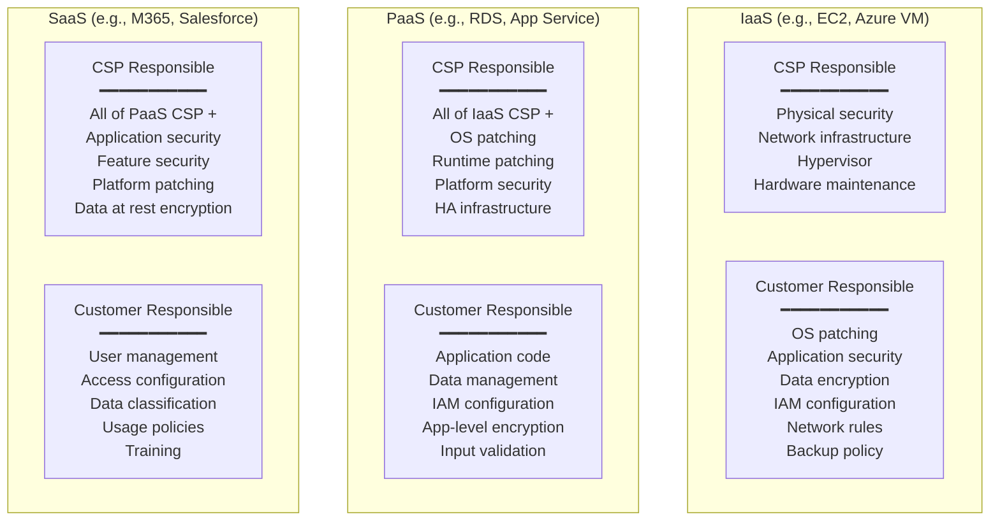

# ISO/IEC 27017 & 27018 — Cloud Security & Privacy Controls

**Topic:** Cloud-specific information security controls (ISO/IEC 27017) and protection of personally identifiable information in public clouds (ISO/IEC 27018), shared responsibility model, and cloud security governance  
**Standard:** ISO/IEC 27017:2015 (Code of practice for information security controls based on ISO/IEC 27002 for cloud services); ISO/IEC 27018:2019 (Code of practice for protection of PII in public clouds acting as PII processors)  
**SDO:** ISO/IEC JTC 1/SC 27 (Information security, cybersecurity and privacy protection)  
**Audience:** Cloud security architects, CISO/security officers, compliance managers, cloud service providers, privacy engineers, DPO (Data Protection Officers), enterprise cloud consumers  
**Prerequisites:** ISO/IEC 27001/27002 fundamentals, cloud computing concepts (IaaS/PaaS/SaaS), shared responsibility model, data protection regulations (GDPR), basic cryptography

---

## Chapter 1 — Historical Context & Origin Story

### 1.1 Timeline

| Year | Event | Significance |
|------|-------|-------------|
| 2005 | ISO/IEC 27001:2005 published | Foundation ISMS standard; did not address cloud specifically |
| 2010 | Cloud computing rapid adoption | Enterprises moving to cloud; existing security standards insufficient for shared-responsibility model |
| 2012 | ISO/IEC 27018 development begins | First standard addressing PII in cloud; response to privacy concerns |
| 2013 | ISO/IEC 27002:2013 published | Updated general security controls; cloud still not specifically addressed |
| 2014 | **ISO/IEC 27018:2014** published (first edition) | First international standard for cloud privacy; PII processor obligations |
| 2015 | **ISO/IEC 27017:2015** published | Cloud security controls (extends 27002 for cloud context); both CSP and customer guidance |
| 2018 | GDPR enforcement begins | Drives adoption of 27018 (PII protection); cloud providers use it as GDPR compliance evidence |
| 2019 | **ISO/IEC 27018:2019** published (second edition) | Updated to align with ISO/IEC 29100 privacy framework; enhanced transparency |
| 2022 | ISO/IEC 27002:2022 major revision | New control structure (4 themes; 93 controls); impacts 27017 future revision |
| 2023 | ISO/IEC 27001:2022 transition period | Organizations updating ISMS; cloud controls via 27017 remain relevant |
| 2024 | ISO/IEC 27017 revision expected | Aligning with 27002:2022 structure; adding modern cloud security concerns (containers, serverless, multi-cloud) |

### 1.2 Why Cloud-Specific Standards?

| Challenge | Why 27001/27002 Alone Is Insufficient | 27017/27018 Solution |
|-----------|---|---|
| **Shared responsibility** | Traditional security assumes single organization controls everything | Defines controls for BOTH cloud service provider (CSP) AND cloud service customer (CSC) |
| **Multi-tenancy** | Traditional controls assume physical isolation | Addresses logical isolation; tenant data segregation; cross-tenant risks |
| **Data location** | Traditional: data is "here" in your DC | Addresses data jurisdiction; transparency about location; portability |
| **Virtualization** | Traditional: physical security = containment | Virtual machine isolation; hypervisor security; container boundaries |
| **API-driven** | Traditional: human-operated; physical access | API security; automated provisioning security; key management for cloud |
| **PII in cloud** | 27001 mentions privacy but not cloud-specific processor obligations | 27018: specific controls for PII processing in cloud; consent; transparency; sub-processors |

---

## Chapter 2 — Standard Architecture & Structure

### 2.1 ISO/IEC 27017 Structure

| Section | Content | Relationship to 27002 |
|:-------:|---------|:---:|
| Clause 5 | Information security policies (cloud context) | Extends 27002 Clause 5 |
| Clause 6 | Organization of information security | Extends; adds shared responsibility |
| Clause 7 | Human resource security | Extends for cloud staff |
| Clause 8 | Asset management | Extends; cloud asset ownership |
| Clause 9 | Access control | Extends; privileged access in cloud; tenant isolation |
| Clause 10 | Cryptography | Extends; key management in cloud; encryption of data |
| Clause 11 | Physical and environmental security | CSP responsibility; transparent to CSC |
| Clause 12 | Operations security | Extends; hardening in shared environment; logging |
| Clause 13 | Communications security | Extends; virtual network segregation |
| Clause 14 | System acquisition, development, and maintenance | Extends; cloud service development |
| Clause 15 | Supplier relationships | Critical: multi-CSP; sub-processor management |
| Clause 16 | Information security incident management | Extends; CSP notification obligations |
| Clause 17 | Information security aspects of BCM | Cloud-specific DR; portability |
| Clause 18 | Compliance | Extends; multi-jurisdictional cloud compliance |
| **CLD (Cloud-specific)** | 7 additional controls unique to cloud | NEW (not in 27002) |

### 2.2 ISO/IEC 27017 — Additional Cloud Controls (CLD)

| Control ID | Control | Applies To |
|:---:|---------|:---:|
| CLD.6.3.1 | Shared roles and responsibilities | CSP + CSC |
| CLD.8.1.5 | Removal of cloud service customer assets | CSP |
| CLD.9.5.1 | Segregation in virtual computing environments | CSP |
| CLD.9.5.2 | Virtual machine hardening | CSP + CSC |
| CLD.12.1.5 | Administrator's operational security | CSP |
| CLD.12.4.5 | Monitoring of cloud services | CSP + CSC |
| CLD.13.1.4 | Alignment of security management for virtual and physical networks | CSP |

### 2.3 ISO/IEC 27018 Structure

| Category | Key Requirements |
|:--------:|-----------------|
| **Consent and choice** | PII processed only per customer instructions; consent management transparent |
| **Purpose limitation** | Cloud provider processes PII only for purposes specified by customer; no secondary use (advertising, profiling) |
| **Data minimization** | Temporary files containing PII deleted on schedule; minimize data retained |
| **Use, retention, and disclosure** | Disclose to law enforcement only per legal obligation; notify customer when permitted |
| **Openness and transparency** | Disclose sub-processor locations; jurisdictions; data processing activities |
| **Individual participation** | Enable data subject access requests; support customer's obligation to respond |
| **Accountability** | Breach notification to customer; maintain processing records; privacy impact assessments |
| **Information security** | Encryption; access controls; secure deletion; audit logging of PII access |

---

## Chapter 3 — Technical Deep Dive

### 3.1 Shared Responsibility Model (per 27017)

| Control Area | IaaS: CSP | IaaS: Customer | PaaS: CSP | PaaS: Customer | SaaS: CSP | SaaS: Customer |
|:---:|:---:|:---:|:---:|:---:|:---:|:---:|
| Physical security | ✅ | ❌ | ✅ | ❌ | ✅ | ❌ |
| Network infrastructure | ✅ | ❌ | ✅ | ❌ | ✅ | ❌ |
| Hypervisor/host | ✅ | ❌ | ✅ | ❌ | ✅ | ❌ |
| OS patching | ❌ | ✅ | ✅ | ❌ | ✅ | ❌ |
| Application security | ❌ | ✅ | ❌ | ✅ | ✅ | ❌ |
| Data encryption | ❌ | ✅ | Shared | Shared | ✅ (at rest); Shared (in transit) | ✅ (key management choice) |
| Identity/access management | Platform IAM | ✅ (config) | Platform IAM | ✅ (config) | Platform IAM | ✅ (config) |
| Network segmentation | Infrastructure | ✅ (VPC/SG config) | Platform | ✅ (config) | ✅ | Limited |
| Logging/monitoring | Infrastructure | ✅ (application; audit) | Platform | ✅ (application) | ✅ (platform) | ✅ (access logs) |
| Backup/DR | Infrastructure | ✅ (policy; config) | Platform | ✅ (data; config) | ✅ (platform) | ✅ (data export) |
| Compliance/governance | Infrastructure certs | ✅ (workload) | Platform certs | ✅ (data; app) | Service certs | ✅ (usage; data) |

### 3.2 Key ISO 27017 Controls Explained

| Control | 27017 Guidance | CSP Implementation | CSC Implementation |
|---------|----------------|:---:|:---:|
| **9.2.1 User registration** | Both CSP and CSC manage their own user identities; CSP provides IAM tools | Provide IAM service; MFA; RBAC | Configure IAM properly; least privilege; regular access review |
| **9.4.1 Information access restriction** | Multi-tenancy isolation; CSP ensures one tenant cannot access another's data | Hypervisor isolation; network microsegmentation; storage encryption per tenant | Configure VPC, security groups, ACLs correctly |
| **10.1.1 Cryptography policy** | CSP provides encryption capabilities; CSC responsible for key management decisions | Offer BYOK, HYOK, HSM; encryption at rest default; TLS in transit | Choose appropriate key management; rotate keys; classify data for encryption |
| **12.4.1 Event logging** | CSP logs infrastructure; provides audit logs to CSC; CSC logs application events | Cloud audit trails (CloudTrail, Azure Monitor, GCP Audit Logs); immutable; 90-day minimum | Enable all audit logs; forward to SIEM; monitor for anomalies; retain per policy |
| **13.1.3 Segregation in networks** | Virtual networks provide equivalent segregation to physical | VPC/VNet; microsegmentation; SDN; tenant isolation at network level | Design network architecture; segment workloads; restrict traffic flows |
| **CLD.9.5.1 Virtual isolation** | CSP must ensure strong isolation between tenants' virtual environments | Hypervisor hardening; side-channel mitigations; memory isolation; I/O segregation | Understand isolation guarantees; don't rely solely on network isolation |

### 3.3 Key ISO 27018 Controls Explained

| Area | Requirement | CSP Implementation |
|------|-------------|:---:|
| **A.1 — Purpose limitation** | Process PII only per customer instructions (data processing agreement) | Clear DPA; technical controls prevent cross-purpose use; no PII for marketing/analytics without explicit consent |
| **A.2 — Consent** | Notify customer of any sub-processors; obtain agreement before engaging new sub-processor | Sub-processor register; notification mechanism (30 days advance); contractual flow-down |
| **A.5 — Disclosure to law enforcement** | Only disclose PII to government per legal obligation; notify customer unless prohibited by law | Legal hold process; customer notification pipeline; transparency report (aggregate disclosure stats) |
| **A.7 — Use of sub-contractors** | Sub-processors bound by equivalent privacy obligations; CSP remains accountable | Contractual requirements; audit rights; documented sub-processor list; regular assessment |
| **A.10 — Return, transfer, disposal** | Return all PII at contract end; securely delete on request; certify deletion | Data export API; deletion process (cryptographic erasure or physical destruction); deletion certificate |
| **A.11 — Data location** | Disclose countries/regions where PII may be processed or stored | Data residency documentation; customer control over region; no transfer without consent |
| **Annex A — Public cloud PII protection** | Additional: notification of breaches; privacy impact assessment; retention periods | Breach notification within 72 hours; regular PIA; retention policy enforced technically |

---

## Chapter 4 — Implementation Guide

### 4.1 For Cloud Service Providers (CSP)

| Step | Action | Evidence/Deliverable |
|:----:|--------|:---:|
| 1 | Map services to shared responsibility model | Responsibility matrix per service (IaaS/PaaS/SaaS) |
| 2 | Identify all 27017 controls applicable to CSP role | Statement of Applicability (SoA) with cloud controls |
| 3 | Implement tenant isolation controls | Architecture documentation; penetration test results; isolation validation |
| 4 | Implement PII processing controls (27018) | Data processing agreement template; sub-processor list; privacy controls |
| 5 | Provide security capabilities to customers | IAM; encryption; logging; network controls; key management |
| 6 | Document transparency information | Data location; sub-processors; incident notification process; SLA |
| 7 | Establish incident notification process | Customer notification within defined timeframe (e.g., 72h for PII breach) |
| 8 | Obtain ISO 27001 + 27017 + 27018 certification | Third-party audit (accredited CB); annual surveillance; 3-year recertification |

### 4.2 For Cloud Service Customers (CSC)

| Step | Action | Evidence/Deliverable |
|:----:|--------|:---:|
| 1 | Understand shared responsibility for chosen service model | Document CSC obligations per service; assign ownership |
| 2 | Verify CSP certifications | Confirm ISO 27001 + 27017 + 27018; review SOC 2 report; verify scope covers your services |
| 3 | Configure security controls properly | IAM (least privilege); MFA; encryption; logging; network segmentation |
| 4 | Implement data classification | Classify data in cloud; apply appropriate controls per classification |
| 5 | Manage keys appropriately | BYOK or CSP-managed; key rotation; HSM for sensitive workloads |
| 6 | Monitor and audit | Enable all audit logs; SIEM integration; alert on suspicious activity |
| 7 | Establish DPA with CSP | Data Processing Agreement per GDPR/privacy requirements |
| 8 | Plan portability and exit | Understand data export; avoid proprietary lock-in; test migration periodically |

### 4.3 Certification Path

```mermaid
graph TB
    subgraph "Certification Journey"
        ISO27001[ISO/IEC 27001<br/>━━━━━━━━━━━<br/>Core ISMS<br/>REQUIRED foundation<br/>Management system]
        
        ISO27017[ISO/IEC 27017<br/>━━━━━━━━━━━<br/>Cloud Security Controls<br/>Extends 27001 SoA<br/>for cloud services]
        
        ISO27018[ISO/IEC 27018<br/>━━━━━━━━━━━<br/>PII Protection in Cloud<br/>Privacy-specific<br/>for PII processors]
    end
    
    subgraph "Audit Process"
        GAP[Gap Assessment<br/>Current vs. Required]
        IMPL[Implementation<br/>Controls + Evidence]
        INTERN[Internal Audit<br/>Self-assessment]
        CERT[Certification Audit<br/>(Stage 1 + Stage 2)]
        SURV[Annual Surveillance<br/>+ 3-year Recert]
    end
    
    ISO27001 --> ISO27017
    ISO27001 --> ISO27018
    GAP --> IMPL --> INTERN --> CERT --> SURV
```

---

## Chapter 5 — CSP Certification Landscape

### 5.1 Major CSP Certifications (27017/27018)

| CSP | ISO 27001 | ISO 27017 | ISO 27018 | Scope Notes |
|:---:|:---------:|:---------:|:---------:|---|
| **AWS** | ✅ | ✅ | ✅ | Covers most AWS services; region-by-region |
| **Microsoft Azure** | ✅ | ✅ | ✅ | Extensive scope; includes Office 365, Dynamics |
| **Google Cloud** | ✅ | ✅ | ✅ | All GCP services; includes Workspace |
| **IBM Cloud** | ✅ | ✅ | ✅ | IaaS and PaaS services |
| **Oracle Cloud** | ✅ | ✅ | ✅ | OCI services |
| **Alibaba Cloud** | ✅ | ✅ | ✅ | International regions |
| **SAP** | ✅ | ✅ | ✅ | SAP Cloud Platform; S/4HANA Cloud |
| **Salesforce** | ✅ | ✅ | ✅ | Core platform; various clouds |

### 5.2 Relationship to Other Frameworks

| Framework | Relationship to 27017/27018 |
|-----------|---|
| **ISO 27001** | Foundation; 27017/27018 are EXTENSIONS (cannot be certified standalone without 27001) |
| **CSA STAR** | CSA CCM maps to 27017 controls; STAR Level 2 = 27001 + CCM assessment |
| **SOC 2** (AICPA) | Trust Service Criteria overlap significantly; many CSPs use both; SOC 2 for US customers, ISO for international |
| **FedRAMP** | Based on NIST 800-53; different framework but many overlapping controls; US federal specific |
| **GDPR** | 27018 specifically designed to support GDPR compliance for PII processors; recognized by DPAs |
| **C5** (BSI Germany) | German cloud security catalog; some overlap with 27017; specifically required for German government cloud |

---

## Chapter 6 — Comparison

### 6.1 ISO 27017 vs. ISO 27018

| Aspect | ISO 27017 | ISO 27018 |
|--------|:---------:|:---------:|
| **Focus** | Information SECURITY in cloud | Personal data PRIVACY in cloud |
| **Scope** | All types of information and assets | Specifically PII (personally identifiable information) |
| **Applies to** | CSP AND CSC (both parties) | CSP acting as PII PROCESSOR (on behalf of controller) |
| **Controls** | Security controls extended for cloud + 7 new CLD controls | Privacy controls; purpose limitation; consent; transparency; individual rights |
| **Based on** | ISO/IEC 27002 (security controls) | ISO/IEC 27002 + ISO/IEC 29100 (privacy framework) |
| **Regulatory alignment** | General security compliance | GDPR; CCPA; privacy regulations specifically |
| **Example control** | "Ensure virtual machine isolation between tenants" | "Do not use PII for any purpose beyond customer's instructions" |
| **Certification** | Extension of ISO 27001 certification | Extension of ISO 27001 certification |

### 6.2 Cloud Security Standards Comparison

| Standard | Scope | Region | Depth | Certification Available |
|----------|:---:|:---:|:---:|:---:|
| **ISO 27017** | Cloud security | Global | Medium (control guidance) | Yes (via ISO 27001) |
| **ISO 27018** | Cloud privacy (PII) | Global | Medium (PII-specific) | Yes (via ISO 27001) |
| **CSA CCM v4** | Cloud security | Global | Deep (197 controls; 17 domains) | Yes (STAR Level 2) |
| **FedRAMP** | Cloud security | US Federal | Very Deep (800+ controls at High) | Yes (ATO/P-ATO) |
| **C5** (BSI) | Cloud security | Germany | Deep (German government) | Yes (attestation) |
| **EUCS** | Cloud security | EU | Deep (3 levels) | Yes (when finalized) |
| **SOC 2** | Service security | US-origin; global | Medium-Deep (criteria-based) | Yes (attestation report) |
| **MTCS** (Singapore) | Cloud security | Singapore | Medium (3 levels) | Yes |

---

## Chapter 7 — Practical Implementation Examples

### 7.1 AWS Implementation Mapping

| 27017 Control | AWS Implementation |
|:---:|---|
| CLD.9.5.1 (VM isolation) | EC2 instances on Nitro hypervisor; dedicated tenancy option; VPC isolation |
| 9.2.1 (User management) | IAM; AWS Organizations; SSO; MFA enforcement |
| 10.1.1 (Cryptography) | KMS (Key Management Service); CloudHSM; S3 SSE; EBS encryption |
| 12.4.1 (Logging) | CloudTrail; VPC Flow Logs; GuardDuty; CloudWatch; Config |
| 13.1.3 (Network segregation) | VPC; Security Groups; NACLs; PrivateLink; Transit Gateway |
| CLD.12.4.5 (Monitoring) | CloudWatch metrics; CloudTrail analytics; AWS Config rules |

### 7.2 Azure Implementation Mapping

| 27017 Control | Azure Implementation |
|:---:|---|
| CLD.9.5.1 (VM isolation) | Hyper-V isolation; Azure Dedicated Host; Confidential Computing (SEV-SNP) |
| 9.2.1 (User management) | Entra ID (Azure AD); RBAC; PIM (Privileged Identity Management); MFA |
| 10.1.1 (Cryptography) | Azure Key Vault; Managed HSM; Storage Service Encryption; TDE |
| 12.4.1 (Logging) | Azure Monitor; Activity Log; Diagnostic Logs; Microsoft Sentinel |
| 13.1.3 (Network segregation) | VNet; NSG; ASG; Azure Firewall; Private Link; ExpressRoute |
| CLD.12.4.5 (Monitoring) | Azure Monitor; Microsoft Defender for Cloud; Sentinel SIEM |

---

## Chapter 8 — Mermaid Architecture Diagrams

### 8.1 Shared Responsibility by Service Model



### 8.2 ISO 27018 PII Data Flow

```mermaid
sequenceDiagram
    participant DS as Data Subject
    participant CTRL as Data Controller<br/>(CSC / Customer)
    participant CSP as Cloud Provider<br/>(PII Processor)
    participant SUB as Sub-Processor
    participant GOV as Government/Law Enforcement
    
    DS->>CTRL: Provides personal data<br/>(consent given)
    CTRL->>CSP: Sends PII for processing<br/>(per DPA instructions)
    
    Note over CSP: ISO 27018 Obligations:<br/>Process ONLY per instructions<br/>No secondary use<br/>Encryption at rest + transit<br/>Access logging
    
    CSP->>SUB: Forwards if needed<br/>(customer pre-approved;<br/>equivalent protections)
    
    opt Government Request
        GOV->>CSP: Legal request for data
        CSP->>CTRL: Notify (unless prohibited)
        Note over CSP: Disclose only minimum<br/>required by law
    end
    
    DS->>CTRL: Data subject request<br/>(access/delete/port)
    CTRL->>CSP: Support DSR fulfillment
    CSP->>CTRL: Provide data/confirm deletion
    
    Note over CSP: At contract end:<br/>Return all PII<br/>Securely delete<br/>Certify deletion
```

---

## Chapter 9 — Case Studies

### 9.1 Case Study: SaaS Provider Achieving ISO 27017 + 27018

| Aspect | Detail |
|--------|--------|
| Company | B2B SaaS provider; HR management platform; processes employee PII for 500+ enterprise customers; hosted on AWS |
| Motivation | Enterprise customers require ISO 27001 + cloud certifications; GDPR compliance evidence; competitive differentiation |
| Existing state | ISO 27001 certified (2 years); general ISMS; no cloud-specific controls documented; DPA exists but not structured per 27018 |
| Implementation | **27017 additions**: (1) Documented shared responsibility with AWS (infrastructure vs. application); (2) tenant isolation architecture documented (separate database schemas; encrypted per-tenant keys in KMS); (3) added CLD controls to SoA (monitoring, VM hardening, virtual network alignment); (4) customer-facing security documentation published (what WE secure vs. what customer configures). **27018 additions**: (1) DPA updated to 27018 structure (purpose limitation; consent; sub-processors; breach notification); (2) sub-processor register published (AWS; Twilio; SendGrid); (3) data location documentation (EU-only processing; documented and enforced via AWS region restrictions); (4) DSR fulfillment process documented (how customer requests subject access/deletion → our platform API supports it); (5) retention policy enforced technically (automatic purge after customer contract ends; 90-day grace; then crypto-erase). |
| Certification | Combined audit: ISO 27001 + 27017 + 27018 by BSI; 3-day Stage 2 audit; 2 minor non-conformities (fixed in 4 weeks); certified |
| Business result | Won 3 enterprise deals specifically because of 27018 certification (GDPR evidence); reduced security questionnaire burden by 60% (pointed to certifications); premium positioning vs. competitors without cloud certs |

### 9.2 Case Study: Enterprise Cloud Migration — Using 27017 as Control Framework

| Aspect | Detail |
|--------|--------|
| Company | Financial services firm; migrating from on-premises DC to Azure; 200+ applications; highly regulated (FCA, PRA) |
| Challenge | Regulators require demonstrable security controls; existing ISO 27001 scope was on-premises; need to extend to cloud; must satisfy regulator that cloud security is "at least equivalent" to on-premises |
| Approach | Used ISO 27017 as the FRAMEWORK for cloud security requirements: (1) mapped every 27017 control to Azure implementation; (2) identified CSP responsibilities (covered by Azure ISO 27001/27017 certification) and CSC responsibilities (company must implement); (3) created cloud security architecture document showing control implementation per workload tier; (4) regulator presentation: mapped regulatory requirements → 27017 controls → Azure implementation evidence |
| Key controls | Tenant isolation (dedicated subscription per business unit); encryption (Azure Key Vault; customer-managed keys); access management (Entra ID with PIM; conditional access; MFA mandatory); logging (Azure Monitor → Sentinel SIEM; 2-year retention); network (hub-spoke VNet; Azure Firewall; no public internet exposure for sensitive workloads) |
| Outcome | Regulator satisfied; cloud migration approved; ISO 27001 scope expanded to include Azure workloads; 27017 controls in SoA; annual surveillance audits include cloud evidence |

---

## Chapter 10 — Future Evolution

| Trend | Timeline | Impact |
|-------|----------|--------|
| **27017 revision (aligned to 27002:2022)** | 2024-2025 | New control structure (Organizational/People/Physical/Technological); new controls for zero trust, threat intelligence; cloud controls updated |
| **Multi-cloud and hybrid controls** | 2024-2026 | Addressing organizations using multiple CSPs; consistent security posture across clouds; CSPM tools |
| **Container and serverless** | 2024-2026 | Current 27017 is VM-focused; needs guidance for containers (isolation); serverless (shared responsibility shifts); Kubernetes security |
| **Confidential computing** | 2024-2027 | TEE (Trusted Execution Environments); encrypted memory; new isolation model; 27017 needs to address |
| **AI/ML data processing** | 2025-2028 | PII in AI training; model privacy; 27018 implications for LLM training on personal data |
| **Data sovereignty** | 2024-2027 | Increasing requirements for data residency; sovereign cloud offerings; 27018 data location controls becoming stricter |
| **EU EUCS certification** | 2025-2027 | EU Cloud Certification Scheme may partially supersede or complement 27017/27018 for European compliance |

---

## Chapter 11 — Interview Questions & Career Guide

### Tier 1: Entry-Level

**Q1:** What is the difference between ISO 27017 and ISO 27018? Can you have one without the other?  
**A:** ISO 27017 focuses on SECURITY of cloud services — it extends ISO 27002 security controls specifically for cloud context. It addresses both the cloud service PROVIDER and the CUSTOMER, covering things like virtual machine isolation, shared responsibility, cloud-specific access control, and monitoring. ISO 27018 focuses on PRIVACY — specifically the protection of personally identifiable information (PII) when a cloud provider acts as a PII PROCESSOR on behalf of customers. It covers purpose limitation (only process data as instructed), sub-processor management, data location transparency, breach notification, and data subject rights. Can you have one without the other? YES — they are independent standards. A CSP might certify 27017 (cloud security) without 27018 (if they don't process PII for customers). A PII-processing cloud service would typically get BOTH. However, NEITHER can be certified standalone — both require ISO 27001 (the management system) as the foundation. So the progression is: 27001 (mandatory base) → 27017 (cloud security extension) + 27018 (cloud privacy extension).

### Tier 2: Mid-Level

**Q2:** You're evaluating a cloud provider for hosting a healthcare application with patient PII. What ISO 27017 and 27018 controls would you specifically verify, and what evidence would you request?  
**A:** [Detailed answer covering: 27017 verification (CLD.9.5.1 — tenant isolation mechanism; ask for architecture docs showing how patient data is isolated from other tenants; 9.4.1 — access controls; verify least privilege for CSP staff accessing your environment; 10.1.1 — encryption; verify data at rest and in transit encryption; customer-managed keys for healthcare data; 12.4.1 — logging; verify complete audit trail of all access to PII; tamper-proof; retention meeting regulatory requirements); 27018 verification (purpose limitation — review DPA; confirm no secondary use of patient data; sub-processor list — who has access; where are they; are they healthcare-appropriate; data location — confirm country/region; healthcare regulations may restrict cross-border; breach notification — within 72 hours aligns with GDPR; verify contractual commitment; deletion — verify process at contract end; cryptographic erasure; certificate; individual rights — verify platform supports data subject access requests); evidence to request (ISO 27001 + 27017 + 27018 certificates; SOC 2 Type II report; penetration test summary; DPA template; sub-processor register; data processing location documentation; incident response SLA).]

### Tier 3: Senior

**Q3:** Design a multi-cloud governance framework based on ISO 27017/27018 that ensures consistent security and privacy controls across AWS, Azure, and GCP for a multinational organization with data sovereignty requirements in EU, US, and APAC.  
**A:** [Comprehensive answer covering: governance structure (central cloud security team; policy definition based on 27017; per-cloud implementation teams; unified control catalog mapping 27017 controls to each CSP's equivalent); shared responsibility matrix (per service model, per CSP; documented and owned); technical controls (CSPM tool enforcing consistent baseline across all three clouds: encryption, access, logging, network); privacy framework (27018 controls as baseline; DPAs with each CSP; sub-processor monitoring; data residency enforced technically: AWS eu-west, Azure West Europe, GCP asia-southeast1 for respective requirements); identity federation (single IdP across all clouds; consistent MFA; RBAC based on job function not CSP); logging unification (all cloud audit logs → central SIEM; normalized; cross-cloud correlation; consistent retention); data sovereignty implementation (classify data by jurisdiction; enforce residency via cloud-native controls + CSPM policies; prevent cross-region replication for restricted data); compliance evidence (automated evidence collection from all three clouds; unified reporting for ISO audit; demonstrate equivalent controls across environments); ongoing governance (quarterly access reviews; annual risk assessment per cloud; CSP certification monitoring; contract review cycle).]

---

## Chapter 12 — Cheat Sheet & Quick Reference

### Quick Reference

```
ISO 27017 — CLOUD SECURITY:
  • Extends ISO 27002 controls for cloud
  • Applies to BOTH CSP and Customer (CSC)
  • 7 additional CLD (cloud-specific) controls
  • Key topics: shared responsibility; tenant isolation;
    VM hardening; cloud monitoring; virtual networks
  • REQUIRES ISO 27001 as foundation
  • Certification: extension to ISO 27001 certificate

ISO 27018 — CLOUD PRIVACY (PII):
  • Protection of PII in public cloud
  • Applies to CSP acting as PII PROCESSOR
  • Key topics: purpose limitation; consent; sub-processors;
    data location; breach notification; deletion; individual rights
  • REQUIRES ISO 27001 as foundation
  • Aligns with GDPR processor obligations
  • Certification: extension to ISO 27001 certificate

SHARED RESPONSIBILITY (simplified):
  IaaS: CSP = physical + network + hypervisor
        Customer = OS + app + data + IAM config
  PaaS: CSP = above + OS + runtime
        Customer = app code + data + IAM config
  SaaS: CSP = everything platform
        Customer = user management + data classification + config

27017 CLD CONTROLS:
  CLD.6.3.1  — Shared roles/responsibilities documentation
  CLD.8.1.5  — Asset removal at contract end
  CLD.9.5.1  — Virtual environment segregation
  CLD.9.5.2  — Virtual machine hardening
  CLD.12.1.5 — Admin operational security
  CLD.12.4.5 — Cloud monitoring
  CLD.13.1.4 — Virtual/physical network alignment

27018 KEY PRINCIPLES:
  • Purpose limitation (process only per instructions)
  • No secondary use (no advertising/profiling with PII)
  • Sub-processor transparency
  • Data location disclosure
  • Breach notification (≤72 hours)
  • Return/delete PII at contract end
  • Support data subject rights

MAJOR CSP CERTIFICATIONS:
  AWS:   ISO 27001 ✓  27017 ✓  27018 ✓
  Azure: ISO 27001 ✓  27017 ✓  27018 ✓
  GCP:   ISO 27001 ✓  27017 ✓  27018 ✓
```

---

*End of Document — 04_ISO_27017_27018_Cloud_Security.md*
