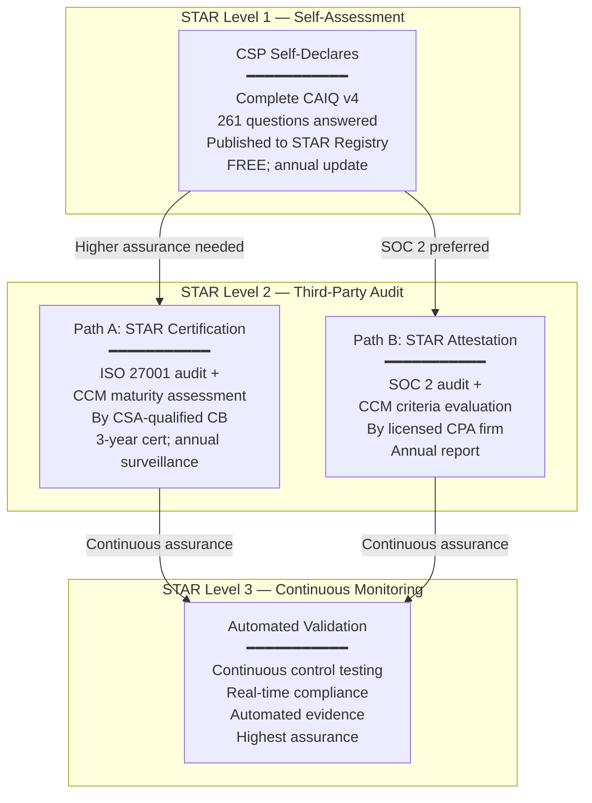
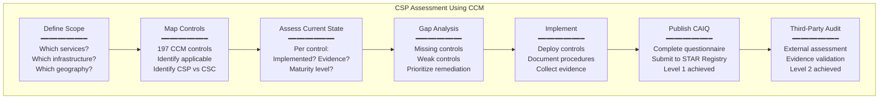

# CSA STAR & Cloud Controls Matrix (CCM v4.0)

**Topic:** Cloud Security Alliance (CSA) Security Trust Assurance and Risk (STAR) program, Cloud Controls Matrix (CCM v4.0), Consensus Assessments Initiative Questionnaire (CAIQ), and cloud provider security assurance  
**Standard:** CSA STAR (Levels 1-3); CSA CCM v4.0 (197 control objectives; 17 domains); CAIQ v4.0  
**SDO:** Cloud Security Alliance (CSA); founded 2008; not-for-profit; 100,000+ members globally  
**Audience:** Cloud security architects, risk managers, vendor management teams, compliance officers, cloud service providers, procurement teams, third-party risk assessors  
**Prerequisites:** Cloud computing models (IaaS/PaaS/SaaS), ISO 27001/27002 fundamentals, risk management concepts, shared responsibility model, basic audit/assurance concepts

---

## Chapter 1 — Historical Context & Origin Story

### 1.1 Timeline

| Year | Event | Significance |
|------|-------|-------------|
| 2008 | **Cloud Security Alliance (CSA) founded** | Response to cloud security concerns; first industry body dedicated to cloud security best practices |
| 2009 | CSA publishes "Top Threats to Cloud Computing" | Defined initial cloud risk landscape; influenced all subsequent frameworks |
| 2010 | **CCM v1.0** (Cloud Controls Matrix) published | First comprehensive cloud-specific control framework; 98 controls; mapped to existing frameworks |
| 2011 | **STAR Level 1** launched (self-assessment) | Free registry of cloud provider self-assessments; transparency initiative |
| 2012 | **CAIQ v1** (Consensus Assessments Initiative Questionnaire) | Standardized questionnaire for cloud security assessment; reduces "questionnaire fatigue" |
| 2013 | **STAR Level 2** launched (third-party certification) | ISO 27001 + CCM certification; independent auditor validates controls |
| 2014 | CCM v3.0 published | Major update: 133 controls; 16 domains; improved mappings |
| 2017 | STAR Level 2 Attestation (SOC 2 + CCM) | Alternative path: AICPA SOC 2 audit including CCM criteria |
| 2019 | **STAR Level 3** (Continuous Monitoring) announced | Real-time assurance; automation; continuous compliance validation |
| 2021 | **CCM v4.0** published | Major revision: 197 control objectives; 17 domains; implementation guidelines; enhanced mappings |
| 2021 | **CAIQ v4.0** published | Aligned with CCM v4; 261 questions across 17 domains |
| 2023 | STAR Program expanded: STAR for AI; STAR for Zero Trust | Extending framework to emerging cloud security challenges |
| 2024 | CCM v4.0.10 (point release); AI control addendum | Continuous improvement; addressing AI security in cloud |

### 1.2 CSA's Position in Cloud Security

| Role | Contribution |
|------|-------------|
| **Research** | Cloud threat reports; security guidance; working groups on emerging topics |
| **Framework** | CCM (control framework); CAIQ (assessment tool); STAR (assurance program) |
| **Education** | CCSK (Certificate of Cloud Security Knowledge); CCSP (partnership with ISC²) |
| **Community** | Working groups; chapters; research; open participation |
| **Industry standard** | CCM is the most widely adopted cloud-specific control framework globally |
| **Procurement enabler** | STAR registry allows customers to evaluate CSP security without individual audits |

---

## Chapter 2 — CSA STAR Program Architecture

### 2.1 STAR Levels

| Level | Name | Assurance | Method | Cost | Validity |
|:-----:|------|:---------:|--------|:----:|:--------:|
| **Level 1** | Self-Assessment | Low | CSP self-publishes CAIQ or CCM-based assessment to STAR Registry | Free | Annual update expected |
| **Level 2** | Third-Party Audit | High | Independent auditor certifies against CCM + ISO 27001 OR CCM + SOC 2 | $50K-200K+ | 3 years (annual surveillance) |
| **Level 3** | Continuous Monitoring | Highest | Automated, continuous validation of controls; real-time assurance | Varies | Continuous |

### 2.2 STAR Level 2 — Two Certification Paths

| Path | Base Standard | Cloud Addition | Auditor | Output |
|:----:|:---:|:---:|:---:|---|
| **STAR Certification** | ISO/IEC 27001 | + CSA CCM v4 maturity assessment | ISO 27001 accredited CB (certified by CSA) | ISO 27001 certificate + STAR certificate; maturity scores per CCM domain |
| **STAR Attestation** | SOC 2 (AICPA) | + CSA CCM v4 criteria | Licensed CPA firm (CSA-qualified) | SOC 2 report incorporating CCM criteria; CPA opinion |

### 2.3 STAR Registry

| Aspect | Detail |
|--------|--------|
| **What** | Public online registry where CSPs publish their STAR assessments |
| **URL** | https://cloudsecurityalliance.org/star/registry |
| **Content** | CSP name; services; STAR level; CAIQ responses; certification/attestation documents (Level 2) |
| **Free access** | Anyone can search and review; no login required for Level 1 |
| **Purpose** | Reduce "questionnaire fatigue" — instead of each customer sending unique security questionnaire, CSP publishes standardized answers once |
| **Entries** | 1,500+ CSPs registered (as of 2024) |

---

## Chapter 3 — Cloud Controls Matrix (CCM v4.0)

### 3.1 CCM v4.0 Domains

| Domain ID | Domain Name | # Controls | Key Focus |
|:---------:|-------------|:----------:|-----------|
| **A&A** | Audit & Assurance | 6 | Audit planning; independent audits; information system regulatory mapping |
| **AIS** | Application & Interface Security | 7 | Application security; API security; data integrity |
| **BCR** | Business Continuity Management & Operational Resilience | 11 | BCP; DR; testing; redundancy; supply chain resilience |
| **CCC** | Change Control & Configuration Management | 9 | Change management; configuration baseline; vulnerability management |
| **CEK** | Cryptography, Encryption & Key Management | 21 | Encryption standards; key lifecycle; certificate management; HSM |
| **DSP** | Data Security & Privacy Lifecycle Management | 19 | Data classification; privacy; geographic restrictions; retention; disposal |
| **GRC** | Governance, Risk & Compliance | 8 | Policies; risk management; regulatory compliance; intellectual property |
| **HRS** | Human Resources | 13 | Screening; security awareness; roles; acceptable use; termination |
| **IAM** | Identity & Access Management | 16 | Authentication; MFA; privilege management; federated identity; PAM |
| **IPY** | Interoperability & Portability | 4 | Data portability; API compatibility; policy compatibility; migration |
| **IVS** | Infrastructure & Virtualization Security | 13 | Network security; segmentation; wireless; VM isolation; container security |
| **LOG** | Logging & Monitoring | 13 | Audit logging; monitoring; clock synchronization; access logging; encryption |
| **SEF** | Security Incident Management, E-Discovery & Cloud Forensics | 8 | Incident management; reporting; forensics; legal holds |
| **STA** | Supply Chain Management, Transparency & Accountability | 14 | Supply chain security; third-party management; incident reporting |
| **TVM** | Threat & Vulnerability Management | 10 | Vulnerability scanning; penetration testing; threat intelligence; patching |
| **UEM** | Universal Endpoint Management | 14 | Endpoint security; BYOD; MDM; remote access; physical security |
| **TOTAL** | | **197** | |

### 3.2 CCM Control Structure

Each control in CCM v4.0 has:

| Field | Description | Example |
|-------|-------------|---------|
| **Control ID** | Domain code + number | IAM-02 |
| **Control Title** | Brief name | "Strong Password Policy and Procedures" |
| **Control Specification** | What must be done | "Establish, document, approve, communicate, apply, evaluate, and maintain policies and procedures for strong authentication." |
| **Implementation Guidelines** | How to implement | Specific guidance for CSP and CSC |
| **CCM Applicability** | CSP, CSC, or both | CSP + CSC |
| **Framework Mapping** | Cross-reference to other frameworks | ISO 27001:A.9.4.3; NIST 800-53:IA-5; PCI DSS:8.2; etc. |

### 3.3 Key CCM Controls (Selected Examples)

| Control | Specification | Why Critical |
|:-------:|---------------|-------------|
| **IAM-02** | Implement strong authentication (MFA; complexity; lifecycle management) | Weak credentials = #1 cloud breach vector |
| **IAM-04** | Separation of duties for privileged access; no single person has unconstrained access | Prevents insider threat; limits blast radius |
| **CEK-03** | Encrypt data at rest using approved algorithms (AES-256); manage keys securely | Protects data if storage is compromised |
| **IVS-01** | Network security controls (firewalls; IDS/IPS; network segmentation) | Defense in depth; limits lateral movement |
| **IVS-09** | Multi-tenant isolation controls; prevent cross-tenant access | Fundamental cloud security requirement |
| **LOG-01** | Generate and retain audit logs for security-relevant events | Detection; forensics; compliance evidence |
| **DSP-05** | Data classification scheme; apply controls based on classification | Risk-appropriate protection; not over/under-securing |
| **TVM-02** | Regular vulnerability scanning; automated; risk-prioritized remediation | Continuous identification of security gaps |
| **BCR-03** | Test business continuity plans at planned intervals | Untested plans fail when needed |
| **STA-05** | Assess supply chain security for third-party components | Supply chain attacks increasingly common |

### 3.4 CCM Framework Mappings

| CCM Maps To | Purpose |
|:---:|---|
| **ISO/IEC 27001/27002** | International ISMS; most common corporate standard |
| **NIST SP 800-53** | US federal security controls (FedRAMP basis) |
| **NIST Cybersecurity Framework (CSF)** | Risk-based framework; widely adopted |
| **PCI DSS v4.0** | Payment card security |
| **AICPA SOC 2 (TSC)** | Trust Service Criteria |
| **CIS Controls v8** | Center for Internet Security; prioritized actions |
| **GDPR** | EU privacy regulation |
| **HIPAA** | US healthcare privacy/security |
| **FedRAMP** | US federal cloud authorization |
| **ENISA IAF** | EU cloud information assurance |
| **CCM v3 → v4** | Migration mapping from previous version |

---

## Chapter 4 — Implementation Guide

### 4.1 CAIQ Assessment Process (Level 1)

| Step | Action | Output |
|:----:|--------|--------|
| 1 | Download CAIQ v4.0 spreadsheet from CSA website | Blank questionnaire (261 questions) |
| 2 | Assign questions to control owners within organization | Ownership matrix |
| 3 | Answer each question (Yes/No/N/A + explanation) | Completed CAIQ |
| 4 | Provide evidence references for "Yes" answers | Internal audit trail |
| 5 | Executive sign-off (CISO or equivalent) | Approved assessment |
| 6 | Submit to CSA STAR Registry | Published self-assessment |
| 7 | Update annually (or when significant changes occur) | Current registry entry |

### 4.2 STAR Level 2 Certification Process

| Phase | Duration | Activities |
|:-----:|:--------:|-----------|
| **Preparation** | 3-6 months | Implement CCM controls; internal assessment; gap remediation; prepare evidence |
| **CB Selection** | 2-4 weeks | Choose CSA-qualified certification body; define scope; sign agreement |
| **Stage 1 Audit** | 1-2 weeks | Documentation review; readiness assessment; scope confirmation |
| **Remediation** | 2-8 weeks | Address Stage 1 findings; implement missing controls |
| **Stage 2 Audit** | 1-3 weeks (on-site/remote) | Evidence review; interviews; technical validation; control testing |
| **Report & Decision** | 4-6 weeks | Auditor writes report; CB makes certification decision |
| **Certification** | — | ISO 27001 + STAR certificate issued; listed in STAR Registry |
| **Surveillance** | Annual | Abbreviated audit; verify continued compliance |
| **Recertification** | Every 3 years | Full re-audit (similar to initial certification) |

### 4.3 CCM Implementation Priority

| Priority | Controls | Rationale |
|:--------:|----------|-----------|
| **Critical (immediate)** | IAM (identity/access); CEK (encryption); IVS (network security); LOG (logging) | Most breaches exploit these gaps; regulatory requirements; forensic capability |
| **High (within 3 months)** | TVM (vulnerability management); DSP (data security); SEF (incident management) | Active threat management; data protection; incident readiness |
| **Medium (within 6 months)** | CCC (change management); BCR (business continuity); HRS (human resources) | Operational stability; resilience; insider threat mitigation |
| **Standard (within 12 months)** | A&A (audit); GRC (governance); STA (supply chain); IPY (portability); UEM (endpoint) | Governance maturity; strategic capability |

---

## Chapter 5 — CAIQ Deep Dive

### 5.1 CAIQ v4.0 Question Structure

| Domain | Questions | Example Question |
|:------:|:---------:|-----------------|
| A&A | 12 | "Are independent audits conducted at least annually against established standards?" |
| AIS | 14 | "Are applications and interfaces designed with security principles (OWASP)?" |
| BCR | 22 | "Are business continuity plans tested at planned intervals?" |
| CCC | 18 | "Is there a formal change management process with security impact assessment?" |
| CEK | 42 | "Is data at rest encrypted using validated cryptographic algorithms?" |
| DSP | 38 | "Is personal data classified and handled per regulatory requirements?" |
| GRC | 16 | "Are information security policies reviewed at planned intervals?" |
| HRS | 26 | "Are background checks performed for personnel with access to sensitive data?" |
| IAM | 32 | "Is multi-factor authentication implemented for all privileged access?" |
| IPY | 8 | "Is there a documented process for customers to retrieve their data?" |
| IVS | 26 | "Are production and non-production environments segregated?" |
| LOG | 26 | "Are audit logs generated for all security-relevant events and protected from tampering?" |
| SEF | 16 | "Is there a documented incident response plan that is tested regularly?" |
| STA | 28 | "Are third-party service providers assessed for security prior to engagement?" |
| TVM | 20 | "Are vulnerability scans performed at least quarterly on all systems?" |
| UEM | 28 | "Are endpoint devices encrypted and configured with security baselines?" |
| **TOTAL** | **261** | |

### 5.2 CAIQ Response Best Practices

| Practice | Guidance |
|----------|---------|
| **Be specific** | Don't just answer "Yes" — describe HOW the control is implemented; name the tool/process |
| **Reference evidence** | Point to policies, procedures, configurations, tool outputs |
| **Acknowledge gaps** | "Partial" or "No" with compensating controls or remediation timeline is better than false "Yes" |
| **Version control** | Date the assessment; note what service version it applies to |
| **Customer-relevant** | Answer from the perspective of what YOUR CUSTOMERS need to know |
| **Avoid marketing** | Factual statements about controls; not sales language |

---

## Chapter 6 — CCM Comparison with Other Frameworks

### 6.1 CCM vs. ISO 27001/27002

| Aspect | CCM v4.0 | ISO 27001/27002:2022 |
|--------|:---------:|:---:|
| **Focus** | Cloud-specific security | General information security (all environments) |
| **Controls** | 197 (cloud-native; cloud-specific challenges) | 93 controls in 4 themes (general) |
| **Cloud guidance** | Built-in; every control designed for cloud context | 27017 needed to extend to cloud |
| **CSP vs. CSC** | Explicitly identifies applicability (CSP, CSC, or both) | Doesn't distinguish roles |
| **Framework mapping** | Maps to 12+ frameworks (ISO, NIST, PCI, etc.) | Standalone (but widely mapped externally) |
| **Certification** | STAR Level 2 (combined with ISO 27001) | ISO 27001 certification |
| **Free access** | CCM freely downloadable; no purchase needed | ISO standards must be purchased |
| **Update cycle** | More agile; point releases; working group driven | Formal ISO process; longer update cycles |

### 6.2 CCM vs. NIST 800-53 vs. CIS Controls

| Aspect | CCM v4 | NIST 800-53 Rev. 5 | CIS Controls v8 |
|--------|:---:|:---:|:---:|
| **Controls** | 197 | 1,000+ (with enhancements) | 18 control groups; 153 safeguards |
| **Focus** | Cloud security | All IT systems (federal) | Prioritized cyber defense |
| **Cloud-specific** | Fully | Not specifically (FedRAMP adds cloud context) | Partially (cloud sections) |
| **Regulatory alignment** | Multiple (maps to ISO, NIST, PCI, etc.) | US federal mandate (FedRAMP) | Best practice guidance |
| **Complexity** | Medium | Very High | Low-Medium |
| **Best for** | Cloud vendor assessment; STAR program | US federal compliance; comprehensive | Starting point; prioritized implementation |
| **Certification** | STAR | FedRAMP ATO | CIS Benchmarks (configuration) |

---

## Chapter 7 — CSA STAR for Specific Industries

### 7.1 STAR in Financial Services

| Requirement | CCM Controls | CSP Evidence |
|:---:|:---:|---|
| Data residency | DSP-14 (Geographic Restrictions) | Documented data locations; customer-controlled region selection |
| Encryption | CEK-01 through CEK-21 | Key management documentation; BYOK/HYOK capability; HSM attestation |
| Access controls | IAM-01 through IAM-16 | PAM implementation; MFA; role-based access; audit trails |
| Incident response | SEF-01 through SEF-08 | IR plan; notification SLA (≤24h); forensics capability |
| Third-party risk | STA-01 through STA-14 | Sub-processor assessment; supply chain documentation |
| Audit/compliance | A&A-01 through A&A-06 | SOC 2 Type II; STAR Level 2; penetration test results |

### 7.2 STAR for Healthcare

| Requirement | CCM Controls | Implementation |
|:---:|:---:|---|
| PHI protection | DSP-01 through DSP-19 | Data classification (PHI flagged); encryption; access logging |
| HIPAA alignment | GRC-02 (Regulatory Mapping) | CCM → HIPAA mapping documented; BAA in place |
| Breach notification | SEF-03 (Incident Reporting) | ≤60 days per HIPAA; CSP SLA typically ≤72h |
| Access audit | LOG-01 through LOG-13 | Complete audit trail of PHI access; 6-year retention |
| Minimum necessary | IAM-09 (Access Restriction) | Least privilege; role-based; verified quarterly |

---

## Chapter 8 — Mermaid Architecture Diagrams

### 8.1 STAR Program Levels



### 8.2 CCM Control Assessment Flow



---

## Chapter 9 — Case Studies

### 9.1 Case Study: SaaS Provider Achieving STAR Level 2

| Aspect | Detail |
|--------|--------|
| Company | B2B SaaS (project management tool); 50,000+ enterprise customers; hosted on AWS; SOC 2 Type II already held |
| Motivation | Enterprise customers requesting "cloud security certification"; existing SOC 2 insufficient for European customers wanting ISO-aligned evidence; STAR Level 2 provides both ISO and cloud-specific assurance |
| Path chosen | STAR Certification (ISO 27001 + CCM); chose this over STAR Attestation (SOC 2 + CCM) because: (1) European customers prefer ISO; (2) 3-year certificate vs. annual SOC 2 report; (3) already partially aligned with ISO through internal practices |
| Timeline | Month 1-2: Gap assessment (current state vs. CCM v4); identified 23 gaps across 197 controls. Month 3-4: Remediation (implemented missing controls — primarily in CEK, LOG, and STA domains). Month 5: Internal audit (validated readiness). Month 6: Stage 1 audit (CB: BSI Group). Month 7: Stage 2 audit (3-day remote assessment). Month 8: Certificate issued |
| Key gaps found | (1) CEK-08 (Key rotation): automated rotation not implemented for all keys → deployed AWS KMS auto-rotation. (2) LOG-05 (Log encryption): audit logs stored unencrypted → enabled S3 SSE-KMS for log buckets. (3) STA-09 (Supply chain incident notification): no formal process to notify customers of third-party breaches → created notification procedure and SLA. (4) IAM-12 (Privileged access monitoring): PAM tool not configured for session recording → implemented CyberArk session monitoring |
| Results | STAR Level 2 certification achieved; published in STAR Registry; 40% reduction in customer security questionnaires (pointed to STAR entry); won 5 enterprise deals specifically citing STAR certification as deciding factor |

### 9.2 Case Study: Enterprise Using STAR Registry for Vendor Assessment

| Aspect | Detail |
|--------|--------|
| Company | Large bank; 500+ cloud services in use; regulatory requirement to assess all third-party cloud providers; 3-person vendor risk team |
| Problem | Sending individual security questionnaires to 500 providers: (1) average 6 weeks to get response; (2) inconsistent quality; (3) team drowning in assessment work; (4) no standardization across assessments |
| Solution | (1) **Adopted CCM as internal cloud risk framework**: all cloud providers assessed against CCM domains (standardized). (2) **STAR Registry first**: before sending questionnaire, check STAR Registry — if provider has STAR Level 1 or 2, use their published assessment instead. (3) **Tiering**: Tier 1 (critical: payments, core banking) = require STAR Level 2 OR equivalent (SOC 2 + ISO 27017); Tier 2 (important: CRM, HR) = STAR Level 1 acceptable; Tier 3 (low risk: marketing tools) = STAR Level 1 or simplified assessment. (4) **Residual gap questionnaire**: only send supplementary questions for bank-specific requirements NOT covered by STAR (e.g., specific regulatory controls). |
| Results | Assessment time per vendor: from 6 weeks average to 2 weeks (for Tier 1) / 2 days (for Tier 2/3 with STAR entry). Coverage: 100% of 500 providers assessed within 12 months (was 60% before). Consistency: all assessments now use CCM terminology; comparable across vendors. Regulatory satisfaction: regulator accepted CCM-based approach as "systematic and comprehensive". |

---

## Chapter 10 — Future Evolution

| Trend | Timeline | Impact |
|-------|----------|--------|
| **CCM v4.x updates** | Ongoing | Point releases addressing AI security; zero trust; supply chain; keeps framework current |
| **STAR for AI** | 2024-2025 | AI-specific controls: model security; data poisoning; bias; AI supply chain; training data governance |
| **STAR Level 3 maturation** | 2024-2026 | Automated continuous monitoring becoming practical; CSPM tools providing real-time CCM compliance evidence |
| **STAR + Zero Trust** | 2024-2026 | Zero trust architecture controls incorporated; identity-centric security; microsegmentation verification |
| **Regulatory recognition** | Ongoing | More regulators accepting STAR as compliance evidence; potential alignment with EU EUCS scheme |
| **STAR for multi-cloud** | 2024-2026 | Addressing organizations using multiple CSPs; consistent assessment approach across clouds |
| **Automation** | 2024-2027 | API-driven CAIQ responses; automated evidence collection; continuous compliance dashboards; machine-readable CCM |
| **Supply chain focus** | 2024-2026 | Enhanced STA domain; SBOM integration; fourth-party risk assessment; cascade requirements |

---

## Chapter 11 — Interview Questions & Career Guide

### Tier 1: Entry-Level

**Q1:** What is CSA STAR and how does it differ from ISO 27001 for cloud security?  
**A:** CSA STAR (Security Trust Assurance and Risk) is a program specifically designed for cloud service providers to demonstrate their security posture. It has 3 levels: Level 1 (free self-assessment published to public registry); Level 2 (third-party audit combining ISO 27001 + Cloud Controls Matrix); Level 3 (continuous automated monitoring). The key difference from ISO 27001 alone: ISO 27001 is a GENERAL information security management system — it works for any organization (factory, bank, cloud provider, hospital) but doesn't specifically address cloud challenges like multi-tenancy, shared responsibility, virtual isolation, or data portability. CSA STAR addresses this by adding the CCM (Cloud Controls Matrix) — 197 controls SPECIFICALLY designed for cloud security — on top of ISO 27001. The CCM explicitly defines which controls apply to the cloud SERVICE PROVIDER vs. the CUSTOMER, addresses cloud-unique risks (tenant isolation, API security, hypervisor security), and maps to other frameworks (NIST, PCI, HIPAA). So: ISO 27001 alone = good general security; ISO 27001 + STAR (CCM) = cloud-specific security assurance.

### Tier 2: Mid-Level

**Q2:** You're designing a third-party cloud risk assessment program using the CCM. How would you tier your providers, which CCM domains would you prioritize for each tier, and how would you handle providers without STAR certification?  
**A:** [Detailed answer covering: tiering methodology (based on data sensitivity + business criticality + access scope); Tier 1 (critical/high-risk): require full CCM assessment with evidence for all 17 domains, prioritize IAM + CEK + DSP + IVS + LOG + SEF; Tier 2 (moderate): focus on 8-10 key domains; accept STAR Level 1 as baseline; Tier 3 (low): accept STAR Level 1 or abbreviated assessment; handling non-STAR providers: (1) map their existing certifications to CCM (SOC 2 maps to many CCM controls; ISO 27001 covers significant portion); (2) send CCM-aligned questionnaire for gaps; (3) request they submit STAR Level 1 (free; good practice); (4) for critical Tier 1 without STAR: conduct own assessment using CCM as framework; may require on-site review; continuous monitoring tools (CSPM); contract requirements for annual assessment; remediation tracking for identified gaps.]

### Tier 3: Senior

**Q3:** Compare CSA STAR, FedRAMP, and EUCS as cloud assurance programs. If your organization operates globally (US, EU, Asia) and uses 200 cloud services, design a unified assurance strategy that satisfies all three while minimizing duplicate effort.  
**A:** [Comprehensive answer covering: framework comparison (STAR: industry-driven; global; flexible; moderate depth; CCM-based; FedRAMP: US government mandate; very deep (800+ NIST controls); expensive; specific to federal; EUCS: EU government; 3 levels; emerging; sovereignty requirements); unification strategy: (1) adopt CCM as INTERNAL framework (maps to all three); (2) require STAR Level 2 as BASELINE for all providers (universal recognition); (3) for US federal workloads: require FedRAMP ATO additionally (non-negotiable); (4) for EU sovereignty: monitor EUCS (when finalized) and require EU-only data residency; (5) use CCM mappings to translate between frameworks (one control assessed once; mapped to multiple requirements); (6) tooling: GRC platform with CCM mapping engine; import SOC 2/ISO/FedRAMP packages; auto-map to internal framework; identify residual gaps per regulatory context; operational: annual assessment cycle; tiered approach per provider criticality; leverage existing certs (check STAR Registry + FedRAMP marketplace + CSP compliance portals); reduce to residual-gap questionnaires only; mature toward continuous monitoring (STAR Level 3 + automated CSPM verification).]

---

## Chapter 12 — Cheat Sheet & Quick Reference

### CSA STAR Quick Reference

```
CSA STAR LEVELS:
  Level 1: Self-Assessment (free; CAIQ published to registry)
  Level 2: Third-Party Audit (ISO 27001 + CCM OR SOC 2 + CCM)
  Level 3: Continuous Monitoring (automated; real-time)

CCM v4.0 — 197 Controls in 17 Domains:
  A&A  (6)  — Audit & Assurance
  AIS  (7)  — Application & Interface Security
  BCR  (11) — Business Continuity & Resilience
  CCC  (9)  — Change Control & Configuration
  CEK  (21) — Cryptography & Key Management
  DSP  (19) — Data Security & Privacy
  GRC  (8)  — Governance, Risk & Compliance
  HRS  (13) — Human Resources
  IAM  (16) — Identity & Access Management
  IPY  (4)  — Interoperability & Portability
  IVS  (13) — Infrastructure & Virtualization
  LOG  (13) — Logging & Monitoring
  SEF  (8)  — Security Incident & Forensics
  STA  (14) — Supply Chain & Transparency
  TVM  (10) — Threat & Vulnerability Management
  UEM  (14) — Universal Endpoint Management

CAIQ v4.0: 261 questions across all 17 domains

STAR CERTIFICATION (Level 2) PATHS:
  Path A: ISO 27001 + CCM maturity (3-year cert)
  Path B: SOC 2 + CCM criteria (annual report)

KEY FRAMEWORK MAPPINGS:
  CCM → ISO 27001/27002 ✓
  CCM → NIST 800-53 ✓
  CCM → NIST CSF ✓
  CCM → PCI DSS ✓
  CCM → CIS Controls ✓
  CCM → HIPAA ✓
  CCM → GDPR ✓

PRIORITY CONTROLS (cloud breach prevention):
  IAM-02: Multi-factor authentication
  IAM-04: Separation of duties
  CEK-03: Encryption at rest
  IVS-09: Multi-tenant isolation
  LOG-01: Audit logging
  TVM-02: Vulnerability scanning
  DSP-05: Data classification
```

### STAR Registry Usage

```
FOR CSPs (publishing):
  1. Download CAIQ v4 from cloudsecurityalliance.org
  2. Complete all 261 questions honestly
  3. Submit to STAR Registry (free for Level 1)
  4. Update annually

FOR CUSTOMERS (evaluating):
  1. Search STAR Registry: cloudsecurityalliance.org/star/registry
  2. Check CSP's STAR level and assessment date
  3. Review CAIQ answers for relevant domains
  4. If Level 2: verify certificate scope covers your services
  5. Only send custom questionnaire for residual gaps
```

---

*End of Document — 05_CSA_STAR_CCM.md*
