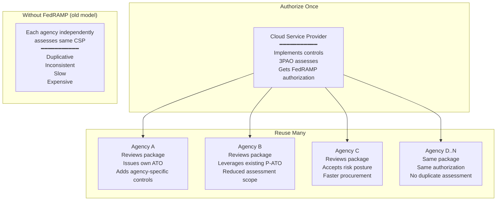

# FedRAMP — Federal Risk and Authorization Management Program

**Topic:** FedRAMP cloud authorization program for US federal agencies, security baselines (Low/Moderate/High), authorization paths (Agency ATO, JAB P-ATO), Third-Party Assessment Organizations (3PAO), and continuous monitoring  
**Standard:** FedRAMP (based on NIST SP 800-53 Rev. 5; NIST SP 800-37; FedRAMP Authorization Act of 2022)  
**SDO:** US Government — FedRAMP Program Management Office (PMO) within GSA; Joint Authorization Board (JAB: DoD, DHS, GSA); OMB direction  
**Audience:** Cloud service providers (CSPs) seeking US federal market, federal agency security officers (ISSOs/ISSMs), compliance architects, third-party assessors (3PAOs), government CIOs  
**Prerequisites:** NIST SP 800-53 fundamentals, cloud computing models, risk management framework (RMF), ATO process concepts, US federal IT governance

---

## Chapter 1 — Historical Context & Origin Story

### 1.1 Timeline

| Year | Event | Significance |
|------|-------|-------------|
| 2002 | FISMA (Federal Information Security Management Act) | Established federal cybersecurity requirements; risk-based approach; agencies responsible for own systems |
| 2007 | NIST SP 800-53 Rev. 2 | Security controls catalog; agencies used for on-premises systems |
| 2009 | Cloud First Policy (OMB) | Federal mandate to adopt cloud computing; but no standardized authorization for cloud |
| 2010 | Federal CIO Council establishes FedRAMP concept | Recognized need for "do once, use many" cloud authorization (vs. each agency re-authorizing same CSP) |
| 2011 | **FedRAMP Program established** (OMB Memo) | Formal creation of program; GSA designated as home; JAB established |
| 2012 | FedRAMP initial operating capability | First CSPs begin authorization process; initial templates and requirements published |
| 2013 | FedRAMP full operational capability | Program fully operational; first P-ATOs issued; Marketplace launched |
| 2014 | FedRAMP Accelerated introduced | Streamlined JAB authorization process; reduced timeline from 18+ months |
| 2016 | FedRAMP Tailored (now LI-SaaS) | Lightweight authorization for low-impact SaaS; reduced control set |
| 2017 | FedRAMP updated to NIST 800-53 Rev. 4 | Aligned with current NIST revision; 325 controls at Moderate baseline |
| 2020 | FedRAMP Rev. 5 transition begins | Aligning with NIST 800-53 Rev. 5; enhanced privacy; supply chain controls |
| 2022 | **FedRAMP Authorization Act** signed into law | Codified FedRAMP in legislation (part of FY23 NDAA); mandatory for all federal cloud; legal standing |
| 2023 | FedRAMP Rev. 5 baselines finalized | Updated control baselines per NIST 800-53 Rev. 5; new controls for zero trust, supply chain |
| 2024 | FedRAMP 20x initiative | Modernizing the authorization process; automation; continuous ATO concept; reducing timeline |

### 1.2 Why FedRAMP Exists

| Problem (Pre-FedRAMP) | FedRAMP Solution |
|---|---|
| Each agency independently assessed cloud providers → redundant work | "Authorize once, reuse many" — one FedRAMP authorization accepted across federal government |
| Inconsistent security requirements across agencies | Standardized baselines (NIST 800-53 with FedRAMP-specific parameters) |
| No visibility into cloud provider security for government | FedRAMP Marketplace — transparent listing of authorized services |
| Slow, expensive process discouraged cloud adoption | Structured process with defined timelines; FedRAMP Accelerated; LI-SaaS |
| No ongoing monitoring requirement | Continuous monitoring mandate (monthly vulnerability scans; annual assessment; incident reporting) |

---

## Chapter 2 — FedRAMP Architecture

### 2.1 FedRAMP Impact Levels (Baselines)

| Baseline | FIPS 199 Impact | Data Types | Controls (Rev. 5) | Example Use Cases |
|:--------:|:---:|---|:---:|---|
| **Low** | Low confidentiality, integrity, availability | Public-facing information; no PII; low-sensitivity data | ~156 controls | Public websites; non-sensitive collaboration |
| **LI-SaaS** (Low Impact SaaS) | Low (tailored) | Low-impact SaaS; no PII beyond login | ~72 controls | Low-risk tools: project management; chat (non-sensitive) |
| **Moderate** | Moderate C/I/A | PII; financial; law enforcement sensitive; most federal data | ~325 controls | Most federal workloads; ~80% of FedRAMP authorizations |
| **High** | High C/I/A | National security systems adjacent; law enforcement; emergency services; critical infrastructure data | ~421 controls | DoD IL4/5; law enforcement; healthcare (federal); financial systems |

### 2.2 Authorization Paths

| Path | Authorizer | Process | Duration | Best For |
|:----:|:---:|---|:---:|---|
| **JAB P-ATO** (Provisional ATO) | Joint Authorization Board (DoD + DHS + GSA) | Most rigorous review; JAB reviewers + 3PAO assessment; provisional authorization usable by any agency | 6-12 months | CSPs wanting broadest federal market; critical services; high-profile |
| **Agency ATO** | Individual federal agency | Agency sponsors CSP; 3PAO assessment; agency authorizing official issues ATO; other agencies can reuse | 3-12 months | CSPs with specific agency sponsor/customer; faster path |
| **Program ATO** (new) | FedRAMP PMO + automation | Leveraging automation; continuous monitoring data; for CSPs already authorized (additional services) | Accelerated | Existing authorized CSPs adding services |

### 2.3 Key Roles

| Role | Responsibility |
|:----:|---|
| **CSP** (Cloud Service Provider) | Implements security controls; provides evidence; maintains continuous monitoring; resolves POA&Ms |
| **3PAO** (Third-Party Assessment Organization) | Independent assessor; conducts initial and annual assessments; validates controls; produces SAR |
| **JAB** (Joint Authorization Board) | Issues P-ATOs; reviews highest-risk authorizations; sets technical requirements |
| **Agency Authorizing Official (AO)** | Issues Agency ATO; accepts risk for their agency's use of the CSP |
| **FedRAMP PMO** | Manages program; maintains baselines/templates; reviews packages; maintains Marketplace |
| **ISSO/ISSM** | Agency security staff; ongoing monitoring; risk acceptance support |

---

## Chapter 3 — Technical Deep Dive

### 3.1 FedRAMP Control Baselines (NIST 800-53 Rev. 5)

| Control Family | ID | Moderate Baseline Controls | Key FedRAMP Parameters |
|:---:|:---:|:---:|---|
| Access Control | AC | ~22 controls | AC-2: account management; review every 90 days; disable within 24h of separation |
| Audit & Accountability | AU | ~16 controls | AU-6: audit review weekly; automated alerts; 1-year retention |
| Configuration Management | CM | ~12 controls | CM-6: CIS benchmarks or equivalent; automated compliance checking |
| Contingency Planning | CP | ~13 controls | CP-2: BCP tested annually; 24h RTO for Moderate |
| Identification & Authentication | IA | ~11 controls | IA-2: MFA for all privileged access; PIV/derived credential for federal users |
| Incident Response | IR | ~10 controls | IR-6: report to US-CERT within 1 hour (for incidents); monthly scans |
| Risk Assessment | RA | ~7 controls | RA-5: vulnerability scanning monthly (OS); annually (web app); High/Critical within 30 days |
| System & Communications Protection | SC | ~22 controls | SC-7: boundary protection; SC-8: FIPS 140-2/3 encryption; SC-28: encryption at rest |
| System & Information Integrity | SI | ~12 controls | SI-2: patch Critical within 30 days (Moderate); 15 days (High) |
| Supply Chain | SR | ~6 controls (new in Rev. 5) | SR-3: supply chain risk assessment; SBOM for critical components |
| **Total (Moderate)** | | **~325 controls** | |

### 3.2 Key FedRAMP Requirements

| Requirement | Specification | Evidence Required |
|:---:|---|---|
| **FIPS 140-2/3 Encryption** | ALL encryption modules must be FIPS 140-2 Level 1+ (in transit AND at rest) | CMVP certificates for all crypto modules; algorithm certificates |
| **Boundary Protection** | System boundary defined and enforced; all ingress/egress monitored | Boundary diagram; firewall rules; IDS/IPS evidence; traffic monitoring |
| **Vulnerability Scanning** | Monthly automated scans (infrastructure); annual web app scan; continuous for container images | Scan reports; 30-day remediation for High/Critical; POA&M for open items |
| **Penetration Testing** | Annual by 3PAO; includes all attack vectors (network, web, social, mobile) | Penetration test report; remediation evidence; retest confirmation |
| **Incident Reporting** | Report to CISA (US-CERT) within 1 hour; notify affected agencies within 24 hours | IR plan; evidence of capability; historical incident reports |
| **Continuous Monitoring** | Monthly: vulnerability scans; POA&M updates. Annual: full 3PAO assessment; significant change assessment | ConMon reports; POA&M status; annual SAR; deviation requests |
| **MFA** | Required for ALL privileged access and ALL remote access; PIV/derived cred for federal users | MFA configuration evidence; PIV integration (for agency access) |
| **Data Location** | Must document and restrict data to authorized locations (typically US only for federal data) | Architecture docs; data flow diagrams; contractual restrictions |
| **Personnel Security** | Background checks for personnel with access to federal data; minimum NACI equivalent | Background check documentation; personnel security policy |
| **Supply Chain** | SBOM for critical components; supply chain risk assessment; provenance documentation | SBOM; vendor assessments; supply chain policy |

### 3.3 FedRAMP Package Components

| Document | Description | Pages (typical) |
|:---:|---|:---:|
| **SSP** (System Security Plan) | Complete documentation of ALL implemented controls; system description; architecture; data flows | 300-800 pages |
| **SAP** (Security Assessment Plan) | 3PAO assessment methodology; scope; test procedures | 50-100 pages |
| **SAR** (Security Assessment Report) | 3PAO findings; control assessment results; risk determination | 100-300 pages |
| **POA&M** (Plan of Action and Milestones) | Open findings; remediation timeline; risk acceptance; compensating controls | Living document |
| **Boundary Diagram** | Network architecture; data flows; all components in authorization boundary | Multiple diagrams |
| **CIS/CRM** (Customer Implementation Summary / Responsibility Matrix) | What the CSP implements vs. what the customer (agency) must implement | Per control family |
| **Incident Response Plan** | IR procedures; escalation; notification; forensics; communication | 20-40 pages |
| **Configuration Management Plan** | Baselines; change management; patching; hardening | 30-50 pages |
| **Contingency Plan** | BCP/DR procedures; RTOs/RPOs; testing schedule | 30-50 pages |

---

## Chapter 4 — Implementation Guide

### 4.1 CSP Path to FedRAMP Authorization

| Phase | Duration | Activities | Output |
|:-----:|:--------:|-----------|--------|
| **1. Readiness** | 3-6 months | Gap assessment against FedRAMP baseline; architecture decisions; remediation planning | Readiness Assessment Report (RAR); go/no-go decision |
| **2. Preparation** | 6-12 months | Implement controls; build evidence; write SSP; engage 3PAO; select path (JAB vs. Agency) | Draft SSP; control implementations; evidence repository |
| **3. Assessment** | 2-4 months | 3PAO conducts full assessment (SAP → testing → SAR); identifies findings | SAP; SAR; POA&M |
| **4. Remediation** | 1-3 months | Address 3PAO findings; retest failed controls; update SSP/POA&M | Updated SAR; closed findings; residual POA&M |
| **5. Authorization** | 1-3 months | Package submission to JAB/Agency; review; questions; authorization decision | P-ATO letter (JAB) or ATO letter (Agency); listed in Marketplace |
| **6. Continuous Monitoring** | Ongoing (indefinite) | Monthly scans + POA&M; annual assessment; significant change reporting; incident reporting | Monthly ConMon deliverables; annual SAR; Marketplace status |

### 4.2 Cost Estimates

| Item | Low | Moderate | High |
|------|:---:|:--------:|:----:|
| Initial implementation (controls, tools, staff) | $250K-500K | $1M-3M | $3M-7M |
| 3PAO assessment (initial) | $100K-200K | $250K-500K | $500K-1M |
| Annual 3PAO assessment | $75K-150K | $150K-300K | $300K-500K |
| Continuous monitoring tools/staff | $100K-200K/yr | $200K-500K/yr | $500K-1M/yr |
| Total first year | $500K-1M | $1.5M-4M | $4M-9M |
| Annual ongoing | $200K-400K | $500K-1M | $1M-2M |

### 4.3 Common Pitfalls

| Pitfall | Impact | Prevention |
|---------|--------|-----------|
| Underestimating boundary definition | Scope creep; additional controls needed; assessment delays | Define boundary early; minimize components in scope; use inheriting services |
| Incomplete SSP documentation | 3PAO cannot assess; PMO rejects package; rework required | Hire experienced FedRAMP consultants; use templates; iterative reviews |
| FIPS 140-2 non-compliance | Immediate disqualification; cannot use non-FIPS encryption | Audit ALL crypto before starting; replace non-FIPS libraries/modules |
| Insufficient vulnerability management | High/Critical findings block authorization; POA&M overload | Automate scanning; 30-day remediation SLA; dedicated VM team |
| Personnel without background checks | Cannot provide support for federal data; staffing delays | Start background check process early; plan for 3-6 month clearance processing |
| Neglecting continuous monitoring | ATO can be revoked; agencies lose trust; Marketplace listing suspended | Automate ConMon; dedicated staff; integrate into operations |

---

## Chapter 5 — Continuous Monitoring (ConMon)

### 5.1 Monthly Requirements

| Deliverable | Frequency | Content |
|:---:|:---:|---|
| Vulnerability scan results | Monthly | Full infrastructure scan; all findings; trending; remediation status |
| POA&M update | Monthly | Status of all open findings; new findings added; closed items removed; milestone tracking |
| Inventory update | Monthly | Current system inventory (hardware, software, ports, protocols); changes noted |
| Significant change notifications | As needed | Any architectural changes; new services; technology changes; assessed per process |
| Incident reports | As needed | Per CISA requirements; within 1 hour for major incidents |

### 5.2 Annual Requirements

| Activity | Description |
|:---:|---|
| Full 3PAO assessment | Subset of controls tested (typically 1/3 per year; full rotation over 3 years) |
| Penetration test | Annual external/internal penetration test by 3PAO |
| Contingency plan test | Full BCP/DR test; documented results |
| POA&M review | Full review of all open items; risk re-evaluation |
| SSP update | Annual update reflecting all changes; version increment |

### 5.3 Deviation Requests & Operational Requirements

| Item | Process |
|------|---------|
| **Deviation Request** | If a control cannot be implemented as required, submit deviation request with justification and compensating controls; JAB/Agency reviews and approves/denies |
| **Significant Change** | Defined triggers (e.g., new technology component, architectural change, new interconnection); requires security impact analysis; may trigger assessment |
| **POA&M Management** | All findings tracked; high/critical must have 30-day remediation plan; operational requirements (OR) tracked separately from findings |

---

## Chapter 6 — FedRAMP Marketplace & Ecosystem

### 6.1 Marketplace Statistics (2024)

| Metric | Value |
|:---:|:---:|
| Authorized CSPs (total) | 350+ |
| Authorized services/products | 400+ |
| In-process (seeking authorization) | 200+ |
| FedRAMP Ready (passed readiness) | 100+ |
| 3PAOs (accredited) | 50+ |
| Agencies using FedRAMP services | 100+ |
| Most common baseline | Moderate (~80% of authorizations) |

### 6.2 Notable Authorized Services

| CSP | Services | Baseline |
|:---:|---------|:---:|
| **AWS** | AWS GovCloud (US); AWS US East/West (standard regions) | High (GovCloud); Moderate (standard) |
| **Microsoft** | Azure Government; Azure Commercial; M365 GCC/GCC High; Dynamics 365 | High (Gov); Moderate (Commercial) |
| **Google** | Google Cloud Platform; Google Workspace | Moderate; High (select services) |
| **Oracle** | Oracle Cloud Infrastructure (Government) | High |
| **Salesforce** | Salesforce Government Cloud; Shield | Moderate; High |
| **ServiceNow** | ServiceNow Government | High |
| **Zoom** | Zoom for Government | Moderate |

---

## Chapter 7 — FedRAMP Comparison

### 7.1 FedRAMP vs. Other Frameworks

| Aspect | FedRAMP | StateRAMP | ISO 27001 + 27017 | CSA STAR Level 2 | DoD IL (CC SRG) |
|--------|:-------:|:---------:|:---------:|:---------:|:---:|
| **Jurisdiction** | US Federal | US State/Local | Global | Global | US DoD |
| **Mandatory** | Yes (federal cloud) | Varies by state | Voluntary | Voluntary | Yes (DoD cloud) |
| **Base framework** | NIST 800-53 Rev. 5 | NIST 800-53 (subset) | ISO 27001 | ISO 27001 + CCM | NIST 800-53 + DoD overlay |
| **Controls (Moderate)** | ~325 | ~250 | 93 (Annex A) + 27017 CLD | 197 (CCM) | ~325 + DoD-specific |
| **Assessment** | 3PAO (accredited) | 3PAO | Accredited CB | CSA-qualified auditor | DISA assessment |
| **Continuous monitoring** | Mandatory (monthly/annual) | Mandatory | Annual surveillance | STAR Level 3 (optional) | Mandatory |
| **Cost** | $1.5M-4M (initial Moderate) | $200K-500K | $50K-200K | $50K-200K | Higher than FedRAMP |
| **Timeline** | 6-18 months | 3-9 months | 6-12 months | 3-6 months | 12-24 months |
| **Reciprocity** | Accepted across all federal agencies | State-specific; growing | Globally recognized | Globally recognized | DoD IL4/5/6 |

### 7.2 FedRAMP Impact Levels vs. DoD IL

| FedRAMP Baseline | DoD Impact Level | Data Type | Environment |
|:---:|:---:|---|---|
| Low | IL2 | Public/unclassified; non-CUI | Commercial cloud (non-DoD) |
| Moderate | IL2 | Non-CUI; low-sensitivity DoD | Commercial cloud with FedRAMP |
| Moderate + DoD overlay | IL4 | CUI (Controlled Unclassified Information) | DoD community cloud |
| High | IL5 | CUI; mission-critical; national security adjacent | DoD community cloud (US-only staff) |
| Beyond High | IL6 | Classified (SECRET) | Classified cloud; isolated; cleared staff only |

---

## Chapter 8 — Mermaid Architecture Diagrams

### 8.1 FedRAMP Authorization Process

```mermaid
graph TB
    subgraph "Phase 1: Readiness"
        RAR[Readiness Assessment<br/>━━━━━━━━━━━<br/>3PAO evaluates<br/>CSP readiness<br/>RAR produced<br/>Listed as 'FedRAMP Ready']
    end
    
    subgraph "Phase 2: Full Assessment"
        SSP[SSP Development<br/>━━━━━━━━━━━<br/>Document all controls<br/>Architecture diagrams<br/>Data flows<br/>300-800 pages]
        
        ASSESS[3PAO Assessment<br/>━━━━━━━━━━━<br/>SAP → Testing → SAR<br/>All controls validated<br/>Findings documented]
        
        REMED[Remediation<br/>━━━━━━━━━━━<br/>Fix findings<br/>Retest<br/>Update POA&M]
    end
    
    subgraph "Phase 3: Authorization"
        REVIEW[Package Review<br/>━━━━━━━━━━━<br/>JAB/Agency reviews<br/>SSP + SAR + POA&M<br/>Questions resolved]
        
        ATO[Authorization Decision<br/>━━━━━━━━━━━<br/>P-ATO (JAB) or<br/>ATO (Agency)<br/>Listed in Marketplace]
    end
    
    subgraph "Phase 4: Operations"
        CONMON[Continuous Monitoring<br/>━━━━━━━━━━━<br/>Monthly: scans + POA&M<br/>Annual: 3PAO assessment<br/>Ongoing: incident reporting]
    end
    
    RAR --> SSP --> ASSESS --> REMED --> REVIEW --> ATO --> CONMON
```

### 8.2 FedRAMP Reuse Model



---

## Chapter 9 — Case Studies

### 9.1 Case Study: Mid-Size SaaS Achieving FedRAMP Moderate (Agency Path)

| Aspect | Detail |
|--------|--------|
| Company | B2B SaaS provider; document management platform; 100 employees; hosted on AWS (commercial regions); annual revenue $30M |
| Motivation | Largest potential customer segment is federal government; existing commercial customers include state/local; federal market = $50M+ TAM; competitors already FedRAMP authorized |
| Pre-state | SOC 2 Type II (2 years); ISO 27001 certified; good security foundation but significant gaps vs. FedRAMP Moderate (325 controls) |
| Key decisions | (1) Agency path (not JAB) — had specific agency sponsor (DoE); faster; lower cost; can still be reused by other agencies. (2) AWS commercial regions (not GovCloud) — sufficient for Moderate; lower infrastructure cost; FedRAMP Moderate boundary on commercial AWS. (3) Moderate baseline — customer data includes PII; agency requirement |
| Major gaps/work | (1) FIPS 140-2 encryption: had to replace TLS libraries (OpenSSL FIPS module), encrypt all data at rest with FIPS-validated AES-256, validate all crypto modules. (2) PIV integration: had to add PIV/CAC authentication for federal users (not just password + MFA). (3) Personnel security: background checks for all personnel with access (25 staff); 4-month process. (4) Vulnerability scanning: existed but not to FedRAMP SLA (monthly infra + annual app + 30-day critical remediation). (5) SSP writing: 450-page document; hired FedRAMP consultant ($150K for SSP writing + package prep). (6) Incident response: had to add US-CERT reporting (1 hour); liaison with agency SOC. (7) Continuous monitoring: built ConMon program (monthly scan reports, POA&M updates, quarterly briefings). |
| Timeline | Month 1-3: Gap assessment + planning ($80K consultant). Month 4-9: Implementation (FIPS; PIV; scanning; personnel; documentation). Month 10-11: 3PAO assessment ($300K). Month 12: Remediation (12 findings; 8 closed; 4 in POA&M with remediation timeline). Month 13-14: Agency review + authorization. Month 15: ATO issued by DoE AO; listed in FedRAMP Marketplace. |
| Total cost | ~$2.2M first year (implementation $800K; consultant $400K; 3PAO $300K; tools $200K; personnel time $500K). Ongoing: ~$600K/year (annual assessment $200K; tools $100K; dedicated FedRAMP compliance staff 2 FTE $300K). |
| ROI | Within 18 months of ATO: 3 federal contracts worth $12M annually. Year 2: 5 additional agencies leveraged existing ATO (minimal additional assessment). FedRAMP became competitive moat — smaller competitors could not afford authorization cost. |

### 9.2 Case Study: FedRAMP Continuous Monitoring Failure

| Aspect | Detail |
|--------|--------|
| Situation | CSP with FedRAMP Moderate P-ATO (active for 3 years); cloud collaboration platform |
| Incident | Annual 3PAO assessment discovered: (1) vulnerability scanning had lapsed for 4 months (tool subscription expired; not renewed); (2) 23 High-severity vulnerabilities older than 90 days (should be 30-day SLA); (3) POA&M had not been updated for 6 months; (4) 3 staff members with privileged access had left company but accounts not disabled |
| Root cause | FedRAMP compliance team reduced from 3 to 1 person (cost cutting); remaining person overwhelmed; no automation; manual processes fell behind; management did not prioritize ConMon |
| Consequences | (1) JAB issued Significant Deficiency finding; (2) 90-day remediation mandate; (3) Monthly reporting to PMO during remediation; (4) 2 agencies suspended their use pending resolution; (5) Marketplace status changed to "Conditional"; (6) Reputational damage in federal market |
| Resolution | Hired 2 FedRAMP compliance staff; automated vulnerability scanning (AWS Inspector + Tenable); automated POA&M tracking (GRC tool); implemented access review automation (identity governance); all findings closed in 75 days; returned to full good standing after 6-month probation |
| Lesson | Continuous monitoring is not optional; FedRAMP is a CONTINUOUS obligation, not a one-time achievement; automation essential; compliance staff cannot be reduced below critical mass |

---

## Chapter 10 — Future Evolution

| Trend | Timeline | Impact |
|-------|----------|--------|
| **FedRAMP 20x** | 2024-2025 | Modernization initiative: automation; machine-readable authorization packages; faster reviews; industry-led assessments |
| **Continuous ATO** | 2024-2026 | Moving from periodic assessment to continuous compliance validation; automated control verification; real-time risk dashboards |
| **OSCAL adoption** | 2024-2025 | NIST Open Security Controls Assessment Language; machine-readable SSPs; automated compliance checking; reduced documentation burden |
| **Zero Trust integration** | 2024-2026 | FedRAMP baselines incorporating zero trust architecture requirements per EO 14028; identity-centric controls |
| **Supply chain controls** | 2023-2025 | Enhanced SR family (Rev. 5); SBOM requirements; software provenance; SLSA levels |
| **AI/ML cloud services** | 2024-2026 | FedRAMP guidance for AI systems; algorithmic transparency; model security; AI-specific risk assessment |
| **Reciprocity expansion** | 2024-2026 | StateRAMP alignment; international recognition (Five Eyes); reduced duplicate assessments |
| **Automation requirements** | 2025-2027 | CSPs required to provide automated compliance evidence; API-driven monitoring; reduced manual reporting |

---

## Chapter 11 — Interview Questions & Career Guide

### Tier 1: Entry-Level

**Q1:** Explain the three FedRAMP impact levels. What determines which level a CSP needs?  
**A:** FedRAMP has three baselines corresponding to FIPS 199 impact categorization: **Low** (~156 controls) — for systems where loss of confidentiality, integrity, or availability would have LIMITED adverse effect; handles public/non-sensitive data; suitable for public websites or non-sensitive tools. **Moderate** (~325 controls) — for systems where loss would have SERIOUS adverse effect; handles PII, financial data, most government operational data; covers ~80% of FedRAMP authorizations because most federal data is Moderate impact. **High** (~421 controls) — for systems where loss would have SEVERE/CATASTROPHIC adverse effect; handles law enforcement, emergency services, financial stability, critical infrastructure, national security-adjacent data. There's also LI-SaaS (~72 controls) — a tailored Low baseline for simple SaaS tools. What determines the level: the AGENCY categorizes their DATA per FIPS 199 (considering impact of loss in confidentiality, integrity, and availability). The highest impact category among C/I/A determines the overall level. The CSP must be authorized at the level matching or exceeding the agency's data categorization.

### Tier 2: Mid-Level

**Q2:** Your organization is deciding between JAB P-ATO and Agency ATO paths. What are the trade-offs, and what factors would influence your recommendation?  
**A:** [Detailed answer covering: JAB P-ATO pros (broadest recognition; highest credibility; JAB technical reviewers provide thorough review = stronger security posture; preferred by many agencies; demonstrates commitment to federal market); JAB P-ATO cons (longer timeline: typically 6-12 months; more rigorous review; limited JAB bandwidth means queue; must be "FedRAMP Ready" first; JAB may deprioritize if not enough agency demand); Agency ATO pros (faster: 3-12 months; specific agency sponsor helps navigate; lower initial barrier; no queue; agency understands your use case); Agency ATO cons (slightly less recognized initially; need agency sponsor (relationship required); agency may have less technical review capacity than JAB); Decision factors: (1) Do you have an existing agency relationship/sponsor? → Agency ATO; (2) Is your product broadly applicable to many agencies? → JAB P-ATO for maximum reach; (3) Timeline pressure? → Agency ATO faster; (4) Is this High baseline? → JAB often preferred for High; (5) Budget? → Both similar cost (3PAO same); JAB slightly more due to extra review time; (6) Market strategy? → If selling broadly = JAB; if starting with one customer = Agency then expand. Recommendation: most CSPs start Agency ATO (faster market entry) then the P-ATO listing in Marketplace enables reuse across government.]

### Tier 3: Senior

**Q3:** Design a FedRAMP Moderate compliance architecture for a multi-tenant SaaS platform on AWS. Address: boundary definition, FIPS compliance, tenant isolation, and continuous monitoring automation.  
**A:** [Comprehensive answer covering: boundary definition (include ALL components in boundary: compute, storage, networking, management plane, monitoring, CI/CD, support tooling; exclude what's inherited from AWS FedRAMP — document in CIS/CRM; boundary should be as small as possible to reduce control scope; use AWS FedRAMP-authorized services and inherit their controls); FIPS compliance (AWS FIPS endpoints for all API calls; FIPS-validated TLS modules; AWS KMS for encryption at rest — FIPS 140-2 Level 3 HSMs; application-layer crypto must use FIPS modules — e.g., AWS Crypto SDK or BoringCrypto; validate ALL crypto with CMVP certificate numbers); tenant isolation (application-level: separate database schemas per tenant or row-level security; key-per-tenant in KMS for encryption isolation; IAM boundaries preventing cross-tenant access; network: security groups + NACLs per tier; no shared credentials; audit: per-tenant audit trails; customer-facing isolation evidence); continuous monitoring automation (vulnerability scanning: Tenable/Qualys automated monthly; AWS Inspector for container/EC2; AWS Config rules for continuous compliance checking; automated POA&M: GRC tool integration (ServiceNow GRC, ZenGRC); auto-creates POA&M from scan findings; auto-tracks remediation; dashboard: real-time compliance dashboard showing control status; deviation tracking; trend analysis; incident automation: CloudWatch alarms → SNS → Security Hub → SOAR tool → CISA reporting workflow; access review: quarterly automated access certification via identity governance tool; ConMon reporting: automated monthly report generation from scan data + POA&M + inventory; delivered to agency ISSO).]

---

## Chapter 12 — Cheat Sheet & Quick Reference

### FedRAMP Quick Reference

```
FEDRAMP BASELINES:
  Low:      ~156 controls (public/non-sensitive data)
  LI-SaaS:  ~72 controls (low-impact SaaS, tailored)
  Moderate: ~325 controls (PII, most federal data — 80% of ATOs)
  High:     ~421 controls (critical, national security adjacent)

AUTHORIZATION PATHS:
  JAB P-ATO:  Joint Authorization Board; broadest; 6-12 months
  Agency ATO: Specific agency sponsor; 3-12 months; reusable
  Program:    For existing CSPs adding services; accelerated

KEY REQUIREMENTS:
  • FIPS 140-2/3 encryption (ALL crypto — no exceptions)
  • MFA for ALL privileged access
  • PIV/CAC for federal user authentication
  • Monthly vulnerability scanning (30-day critical remediation)
  • Annual 3PAO assessment + penetration test
  • Incident reporting to CISA within 1 hour
  • Background checks for all personnel with access
  • Continuous monitoring (monthly reports to agency)
  • Data must reside in US (unless authorized otherwise)

AUTHORIZATION PACKAGE:
  SSP  — System Security Plan (all controls documented)
  SAP  — Security Assessment Plan (3PAO methodology)
  SAR  — Security Assessment Report (3PAO findings)
  POA&M — Plan of Action & Milestones (open findings)
  CIS/CRM — Customer Implementation Summary

CONTINUOUS MONITORING:
  Monthly:  Vuln scans + POA&M update + inventory
  Quarterly: Briefing to agency (some require)
  Annual:   3PAO assessment + pen test + BCP test + SSP update
  As-needed: Significant change; incidents; deviation requests

COST ESTIMATES (MODERATE):
  Initial:  $1.5M–4M (implementation + assessment)
  Annual:   $500K–1M (ConMon + staff + tools + assessment)
  Timeline: 9–18 months (preparation through authorization)

COMMON FAILURES:
  ✗ Non-FIPS crypto anywhere in boundary
  ✗ Vulnerability backlog (>30 days for High/Critical)
  ✗ Incomplete SSP documentation
  ✗ ConMon lapse (scanning, POA&M, reporting)
  ✗ Personnel without background checks
  ✗ Undefined/over-broad system boundary
```

---

*End of Document — 06_FedRAMP_Cloud_Authorization.md*
