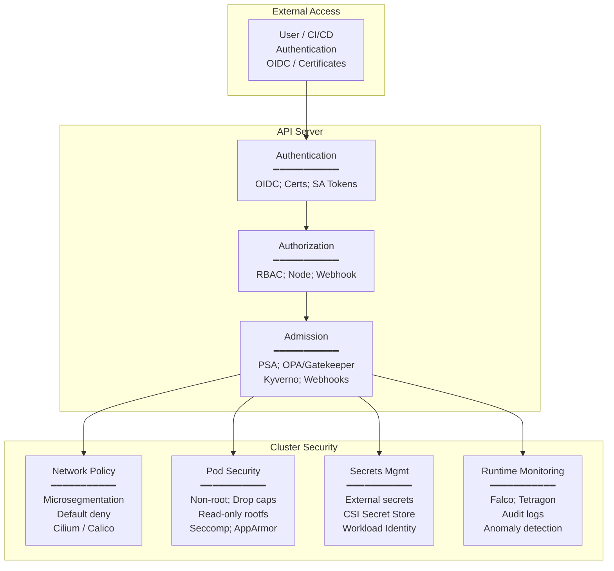

# Container Standards — OCI, Kubernetes Security & CNCF

**Topic:** Open Container Initiative (OCI) specifications (Runtime, Image, Distribution), Kubernetes security (Pod Security Admission, RBAC, CIS Benchmark), CNCF security practices, and cloud-native supply chain security (SLSA, Sigstore)  
**Standard:** OCI Runtime Spec v1.2, OCI Image Spec v1.1, OCI Distribution Spec v1.1, Kubernetes Pod Security Standards, CIS Kubernetes Benchmark v1.9, SLSA v1.0, Sigstore (Cosign/Rekor/Fulcio)  
**SDO:** Open Container Initiative (OCI, under Linux Foundation); Kubernetes SIG Security; CNCF (Cloud Native Computing Foundation); CIS (Center for Internet Security); OpenSSF (Open Source Security Foundation)  
**Audience:** Platform engineers, DevOps/SRE teams, security architects, container runtime developers, Kubernetes administrators, cloud-native application developers  
**Prerequisites:** Linux namespaces and cgroups, container basics (Docker), Kubernetes architecture (pods, nodes, API server), supply chain concepts, PKI fundamentals

---

## Chapter 1 — Historical Context & Origin Story

### 1.1 Timeline

| Year | Event | Significance |
|------|-------|-------------|
| 2013 | Docker released | Popularized containers; proprietary image/runtime format initially |
| 2014 | Kubernetes announced (Google) | Container orchestration; needed standardized container format |
| 2015 | **Open Container Initiative (OCI) founded** | Industry agreement on container standards; prevents Docker vendor lock-in; Linux Foundation project |
| 2015 | CNCF founded (Linux Foundation) | Home for Kubernetes and cloud-native projects; governance; ecosystem |
| 2016 | **OCI Runtime Spec v1.0-rc1** | Standardized how to run a container (based on Docker's runc) |
| 2017 | **OCI Image Spec v1.0** | Standardized container image format; layered filesystem; manifest |
| 2017 | Kubernetes RBAC GA | Role-based access control for Kubernetes API; foundational security |
| 2018 | **OCI Distribution Spec** development begins | Standardizing container registry API (based on Docker Registry v2) |
| 2019 | **CIS Kubernetes Benchmark v1.5** | First widely-adopted K8s security benchmark; prescriptive hardening |
| 2021 | Kubernetes Pod Security Standards (replacing PodSecurityPolicy) | Simplified pod security model: Privileged/Baseline/Restricted |
| 2021 | **Sigstore launched** (Linux Foundation / OpenSSF) | Keyless signing for containers and artifacts; transparency log |
| 2022 | **SLSA v1.0** (Supply-chain Levels for Software Artifacts) | Framework for supply chain integrity; 4 levels; build provenance |
| 2023 | OCI Image Spec v1.1 (artifacts support) | Images can carry non-container content (SBOMs, signatures, attestations) |
| 2023 | **OCI Distribution Spec v1.1** | Referrers API; artifact linking; registry standard finalized |
| 2024 | Kubernetes v1.30+ (Pod Security Admission mature) | PSA enforcement widely adopted; PSP fully removed |

### 1.2 Why Container Standards Matter

| Problem | Standard Solution |
|---------|---|
| Docker-only image format = vendor lock-in | OCI Image Spec: universal image format; any runtime can use |
| Docker-only runtime = single implementation risk | OCI Runtime Spec: multiple conformant runtimes (runc, crun, kata, gVisor) |
| Registry API proprietary (Docker Hub) | OCI Distribution Spec: any registry implements same API |
| No standard way to sign/verify container images | Sigstore/Cosign: keyless signing; transparency; verification |
| Supply chain attacks on container builds | SLSA: provenance; hermetic builds; verified source |
| Kubernetes security was ad-hoc | Pod Security Standards + CIS Benchmark: prescriptive security baseline |

---

## Chapter 2 — OCI Specifications

### 2.1 OCI Runtime Specification

| Aspect | Detail |
|--------|--------|
| **Purpose** | Defines how to CREATE, START, and manage a container's lifecycle |
| **Based on** | Linux namespaces, cgroups, seccomp, capabilities, filesystem |
| **Config file** | `config.json` — complete specification of container environment |
| **Reference impl.** | `runc` (Go; most widely used); `crun` (C; faster startup) |
| **Key sections** | Process (entrypoint, env, user); Root (rootfs path; readonly); Mounts; Linux (namespaces, cgroups, seccomp, capabilities); Hooks (prestart, poststart, poststop) |

**config.json key fields:**

| Field | Purpose | Security Relevance |
|:---:|---|---|
| `process.user.uid/gid` | User identity inside container | Non-root enforcement |
| `process.capabilities` | Linux capabilities granted | Principle of least privilege |
| `linux.namespaces` | Isolation (PID, NET, MNT, UTS, IPC, USER, CGROUP) | Containment boundary |
| `linux.seccomp` | System call filtering | Attack surface reduction |
| `linux.resources` | Cgroup limits (CPU, memory, I/O) | Resource isolation; DoS prevention |
| `root.readonly` | Read-only rootfs | Prevents runtime modification |
| `mounts` | Filesystem mounts into container | Control host access |

### 2.2 OCI Image Specification

| Component | Purpose | Format |
|:---:|---|---|
| **Image Manifest** | Lists layers + config for one platform | JSON; media type: `application/vnd.oci.image.manifest.v1+json` |
| **Image Index** (multi-arch) | Points to multiple manifests (amd64, arm64, etc.) | JSON; enables single tag for multiple architectures |
| **Image Config** | Runtime defaults (entrypoint, env, exposed ports, labels) | JSON blob |
| **Layers** | Filesystem changes (tar+gzip/zstd); stacked to form rootfs | `application/vnd.oci.image.layer.v1.tar+gzip` |
| **Annotations** | Metadata key-value pairs on any component | Standard keys: `org.opencontainers.image.*` |
| **Artifacts** (v1.1) | Non-filesystem content: SBOMs, signatures, attestations, configs | Referenced via `subject` field; stored in registry |

### 2.3 OCI Distribution Specification

| API Endpoint | Method | Purpose |
|:---:|:---:|---|
| `/v2/` | GET | Check API version; authentication challenge |
| `/v2/<name>/manifests/<ref>` | GET/PUT/DELETE | Pull/push/delete image manifests |
| `/v2/<name>/blobs/<digest>` | GET/DELETE | Pull/delete layer blobs |
| `/v2/<name>/blobs/uploads/` | POST/PATCH/PUT | Initiate and complete blob upload |
| `/v2/<name>/tags/list` | GET | List all tags for a repository |
| `/v2/<name>/referrers/<digest>` | GET | **NEW (v1.1)**: List artifacts referencing a manifest (signatures, SBOMs) |

### 2.4 Container Runtime Landscape

| Runtime | Type | OCI Compliant | Security Model | Use Case |
|:---:|:---:|:---:|:---:|---|
| **runc** | Low-level | ✅ Reference impl. | Shared kernel; namespaces/cgroups | Default; Docker/containerd/CRI-O |
| **crun** | Low-level | ✅ | Same as runc; written in C (faster) | Performance-sensitive; RHEL default |
| **kata-containers** | VM-based | ✅ | Hardware VM isolation (KVM/QEMU) | Strong isolation; multi-tenant; untrusted workloads |
| **gVisor (runsc)** | Sandboxed | ✅ | User-space kernel; intercepts syscalls | Defense in depth; reduced kernel attack surface |
| **Firecracker** | MicroVM | Partial (via containerd) | Minimal VM; KVM | Serverless (AWS Lambda); fast boot |
| **youki** | Low-level | ✅ | Rust implementation of OCI runtime | Security (memory safety); performance |
| **WasmEdge** | Wasm | Partial | WebAssembly sandbox | Lightweight; polyglot; edge |

---

## Chapter 3 — Kubernetes Security

### 3.1 Pod Security Standards (PSS)

| Profile | Intent | Key Restrictions |
|:-------:|--------|-----------------|
| **Privileged** | Unrestricted (for system workloads) | No restrictions; full host access allowed |
| **Baseline** | Prevent known privilege escalations | No `hostNetwork`; no `hostPID`/`hostIPC`; no privileged containers; restricted volume types; no host ports; restricted `procMount` |
| **Restricted** | Heavily restricted; hardened | All of Baseline + must run as non-root; drop ALL capabilities (only add NET_BIND_SERVICE); read-only rootfs recommended; seccomp profile required (RuntimeDefault or Localhost); no privilege escalation (`allowPrivilegeEscalation: false`) |

### 3.2 Pod Security Admission (PSA)

| Mode | Behavior |
|:----:|----------|
| **enforce** | Violations REJECT the pod (admission denied) |
| **audit** | Violations logged in audit log but pod allowed |
| **warn** | Violations shown as warning to user but pod allowed |

Configuration (per namespace label):

```yaml
apiVersion: v1
kind: Namespace
metadata:
  name: production
  labels:
    pod-security.kubernetes.io/enforce: restricted
    pod-security.kubernetes.io/enforce-version: latest
    pod-security.kubernetes.io/audit: restricted
    pod-security.kubernetes.io/warn: restricted
```

### 3.3 RBAC (Role-Based Access Control)

| Resource | Scope | Purpose |
|:---:|:---:|---|
| **Role** | Namespace | Defines permissions within a single namespace |
| **ClusterRole** | Cluster-wide | Defines permissions across entire cluster or for cluster-scoped resources |
| **RoleBinding** | Namespace | Grants a Role/ClusterRole to subjects within a namespace |
| **ClusterRoleBinding** | Cluster-wide | Grants a ClusterRole to subjects across entire cluster |

**RBAC Best Practices:**

| Practice | Implementation |
|----------|---------------|
| Least privilege | Grant minimum verbs (get, list) not wildcards (*); namespace-scoped Roles over ClusterRoles |
| No cluster-admin for workloads | Reserve cluster-admin for break-glass; use scoped roles for all normal operations |
| Service account per workload | Don't use `default` SA; create purpose-specific SAs; disable token auto-mount when not needed |
| Regular audit | Review RoleBindings quarterly; remove stale bindings; tools: `kubectl-who-can`, `rbac-tool` |
| API group scoping | Restrict to specific API groups (e.g., `apps` not `*`) and resources |

### 3.4 CIS Kubernetes Benchmark (v1.9)

| Section | Controls | Key Checks |
|:-------:|:--------:|-----------|
| **1. Control Plane** | 35+ | API server: `--anonymous-auth=false`; `--authorization-mode=RBAC,Node`; audit logging enabled; `--insecure-port=0`; TLS configured |
| **2. etcd** | 10+ | Encryption at rest; TLS client certs; restricted file permissions; regular backups |
| **3. Control Plane Configuration** | 5+ | Authentication (no basic auth); RBAC; admission controllers enabled |
| **4. Worker Nodes** | 25+ | kubelet: `--anonymous-auth=false`; `--authorization-mode=Webhook`; `--read-only-port=0`; TLS |
| **5. Policies** | 20+ | Pod Security Standards; Network Policies; secrets encrypted; resource limits; namespaced workloads |

---

## Chapter 4 — Supply Chain Security (SLSA & Sigstore)

### 4.1 SLSA (Supply-chain Levels for Software Artifacts)

| Level | Requirement | What It Prevents |
|:-----:|-------------|-----------------|
| **SLSA 0** | No guarantees | Nothing (baseline/starting point) |
| **SLSA 1** | Build process documented; provenance generated (unsigned) | Mistakes; undocumented builds |
| **SLSA 2** | Hosted build service; authenticated provenance (signed) | Tampering after build; repudiation |
| **SLSA 3** | Hardened build platform; non-falsifiable provenance; isolated build | Compromised build process; insider threat; build system attack |
| **(SLSA 4)** | (Future: hermetic, reproducible, two-party review) | Most sophisticated supply chain attacks |

**SLSA Provenance Attestation contains:**

| Field | Content |
|:---:|---|
| Builder | What system built the artifact (e.g., GitHub Actions, Tekton) |
| Source | Where the source code came from (repo, commit, ref) |
| Build config | What build instructions were used |
| Materials | All inputs (dependencies, base images, tools) |
| Metadata | Timestamps; invocation ID; reproducibility |

### 4.2 Sigstore Ecosystem

| Component | Purpose | How It Works |
|:---:|---|---|
| **Cosign** | Sign and verify container images/artifacts | Signs OCI artifacts; stores signature in registry; keyless (OIDC identity) or key-based |
| **Rekor** | Transparency log (immutable audit trail) | Records all signing events; publicly auditable; tamper-evident (Merkle tree) |
| **Fulcio** | Certificate authority for keyless signing | Issues short-lived certificates based on OIDC identity (GitHub, Google, etc.); no long-term key management needed |
| **Policy Controller** | Kubernetes admission controller | Verifies image signatures before allowing pod creation; policy-driven |

### 4.3 Container Image Signing Workflow

| Step | Action | Tool |
|:----:|--------|:---:|
| 1 | Developer pushes code to repo | Git |
| 2 | CI/CD builds container image | GitHub Actions, Tekton, etc. |
| 3 | CI/CD generates SLSA provenance attestation | slsa-github-generator, Tekton Chains |
| 4 | CI/CD signs image + attestation with Cosign | Cosign (keyless via Fulcio + Rekor) |
| 5 | Signed image + attestation pushed to OCI registry | Cosign; stored as OCI artifact (referrers) |
| 6 | Kubernetes admission controller verifies signature | Sigstore Policy Controller / Kyverno / OPA Gatekeeper |
| 7 | Only verified images run in cluster | Admission enforcement |

---

## Chapter 5 — Kubernetes Security Architecture

### 5.1 Defense-in-Depth Layers

| Layer | Controls | Tools/Mechanisms |
|:----:|----------|-----------------|
| **Supply chain** | Image signing; SLSA provenance; vulnerability scanning; base image policy | Cosign; Trivy; Grype; SLSA; allowed registries |
| **Admission** | Pod Security Admission; OPA/Gatekeeper; Kyverno; image verification | PSA; Gatekeeper; Kyverno; Sigstore Policy Controller |
| **Runtime isolation** | Namespaces; seccomp; AppArmor/SELinux; read-only rootfs; non-root | SecurityContext; RuntimeClass; kata/gVisor for untrusted |
| **Network** | Network Policies; service mesh (mTLS); ingress controls | Calico; Cilium; Istio; Gateway API |
| **Secrets** | External secrets; encryption at rest; short-lived tokens; workload identity | External Secrets Operator; Vault; IRSA/Workload Identity |
| **Observability** | Audit logging; runtime threat detection; behavior monitoring | Falco; Tetragon; audit logs; SIEM integration |
| **Access** | RBAC; authentication (OIDC); MFA; least privilege | Dex/OIDC; RBAC; kubectl plugins for review |

### 5.2 Network Policies

| Policy Type | Example | Effect |
|:---:|---|---|
| **Default deny (ingress)** | All pods in namespace: deny all incoming traffic unless explicitly allowed | Zero-trust baseline; only permitted flows work |
| **Default deny (egress)** | All pods: deny all outgoing traffic unless explicitly allowed | Prevents data exfiltration; limits lateral movement |
| **Allow specific** | Frontend → Backend on port 8080; Backend → Database on port 5432 | Microsegmentation; only needed flows |
| **Allow DNS** | All pods → kube-dns on port 53 (UDP/TCP) | Required for service discovery |

### 5.3 Secrets Management

| Approach | Security Level | Description |
|:---:|:---:|---|
| Kubernetes Secrets (default) | Low | Base64 encoded (NOT encrypted by default); etcd encryption needed; RBAC controls |
| Kubernetes Secrets + etcd encryption | Medium | Secrets encrypted at rest in etcd; key management via KMS provider |
| External Secrets (Vault, AWS SM, etc.) | High | Secrets stored externally; synced to K8s; rotation; audit; not in etcd long-term |
| CSI Secret Store | High | Secrets mounted as files via CSI driver; never stored in etcd; pod-specific access |
| Workload Identity + direct API | Highest | No secrets in cluster at all; workload authenticates directly to cloud IAM; short-lived tokens |

---

## Chapter 6 — CNCF Security Landscape

### 6.1 CNCF Security Projects

| Project | Category | Function |
|:---:|:---:|---|
| **Falco** | Runtime security | Runtime threat detection; syscall monitoring; alerting on anomalous behavior |
| **OPA (Open Policy Agent)** | Policy | General-purpose policy engine; used for admission control (Gatekeeper) |
| **Kyverno** | Policy | Kubernetes-native policy engine; validate, mutate, generate resources |
| **Notary/TUF** | Supply chain | Content trust; signing; The Update Framework |
| **in-toto** | Supply chain | Software supply chain layout/verification; attestation framework |
| **SPIFFE/SPIRE** | Identity | Workload identity framework; mTLS; service mesh identity |
| **Cilium** | Networking + Security | eBPF-based networking; network policies; observability; runtime enforcement |
| **Tetragon** | Runtime security | eBPF-based; kernel-level observability; process/file/network enforcement |
| **cert-manager** | PKI | Automated certificate management for Kubernetes; Let's Encrypt; Vault |
| **Keycloak** | Authentication | Identity and access management; OIDC provider for Kubernetes |

---

## Chapter 7 — Comparison

### 7.1 Container Security Frameworks Comparison

| Framework | Focus | Prescriptiveness | Certification |
|:---:|:---:|:---:|:---:|
| **CIS K8s Benchmark** | Kubernetes hardening | Very prescriptive (specific settings) | CIS certification |
| **NIST SP 800-190** | Container security (general) | Guidance (not prescriptive) | No |
| **NSA/CISA K8s Hardening** | Kubernetes security (government) | Prescriptive (government-focused) | No |
| **Pod Security Standards** | Pod-level restrictions | Three profiles (Privileged/Baseline/Restricted) | N/A (built into K8s) |
| **SLSA** | Build/supply chain integrity | 4 levels | Self-attestation |
| **SSDF (NIST)** | Secure development lifecycle | Guidance | No |

### 7.2 OCI vs. Docker Format

| Aspect | OCI Image/Runtime | Docker |
|--------|:---:|:---:|
| Governance | Open standard (Linux Foundation) | Docker Inc. (proprietary origin) |
| Image format | OCI Image Spec v1.1 | Docker Image Manifest v2 |
| Runtime spec | OCI Runtime Spec (config.json) | Docker-specific (evolved into OCI) |
| Registry API | OCI Distribution Spec v1.1 | Docker Registry HTTP API v2 (basis for OCI) |
| Compatibility | Docker images are OCI-compatible (nearly identical) | Docker supports OCI images |
| Artifacts | OCI v1.1: native artifact support (SBOM, signatures) | Limited (Docker-specific extensions) |
| Multi-arch | Image Index (native) | Manifest List (equivalent) |

---

## Chapter 8 — Mermaid Architecture Diagrams

### 8.1 Container Image Supply Chain Security

```mermaid
graph TB
    subgraph "Build Phase (CI/CD)"
        SRC[Source Code<br/>━━━━━━━━━━━<br/>Git repo<br/>Signed commits<br/>Branch protection]
        
        BUILD[Build System<br/>━━━━━━━━━━━<br/>Hermetic build<br/>Pinned dependencies<br/>SLSA Level 3]
        
        SCAN[Security Scanning<br/>━━━━━━━━━━━<br/>Vulnerability scan<br/>License check<br/>SBOM generation]
        
        SIGN[Signing<br/>━━━━━━━━━━━<br/>Cosign (keyless)<br/>SLSA provenance<br/>Rekor transparency log]
    end
    
    subgraph "Registry (OCI Distribution)"
        REG[OCI Registry<br/>━━━━━━━━━━━<br/>Image manifest<br/>Layers (blobs)<br/>Signatures (referrers)<br/>SBOM (referrers)<br/>Attestations]
    end
    
    subgraph "Deploy Phase (Kubernetes)"
        ADM[Admission Controller<br/>━━━━━━━━━━━<br/>Verify signature<br/>Check provenance<br/>Enforce policy<br/>Allow/Deny]
        
        RUN[Runtime<br/>━━━━━━━━━━━<br/>Pull verified image<br/>Apply SecurityContext<br/>Runtime monitoring]
    end
    
    SRC --> BUILD --> SCAN --> SIGN --> REG
    REG --> ADM --> RUN
```

### 8.2 Kubernetes Security Layers



---

## Chapter 9 — Case Studies

### 9.1 Case Study: Enterprise Kubernetes Security Hardening

| Aspect | Detail |
|--------|--------|
| Organization | Financial services company; 500-node Kubernetes cluster (EKS); 2,000+ microservices; 200 development teams |
| Starting state | Kubernetes in production 2 years; minimal security: no network policies; all pods run as root; no image signing; default service accounts used everywhere; no admission control beyond basic |
| Program | 6-month security hardening based on CIS Kubernetes Benchmark + Pod Security Standards |
| Phase 1 (Month 1-2) | **Admission control**: deployed Kyverno; policies in audit mode; generated baseline of violations (found: 78% of pods running as root; 65% with no resource limits; 40% using `default` service account; 12% with `privileged: true`). Deployed PSA in `warn` mode on all namespaces. |
| Phase 2 (Month 3-4) | **Pod security remediation**: worked with dev teams to fix violations; provided security context templates; updated Helm charts; key changes: added `runAsNonRoot: true` + `allowPrivilegeEscalation: false` + `readOnlyRootFilesystem: true` + resource limits. Created exception process for legitimate privileged workloads (monitoring agents; CSI drivers). |
| Phase 3 (Month 5) | **Network policies + image security**: implemented default-deny network policies (all namespaces); teams define required ingress/egress flows; deployed Cosign + Policy Controller (only signed images from approved registries); integrated Trivy scanning in CI/CD (block High/Critical); image provenance required (SLSA Level 2). |
| Phase 4 (Month 6) | **Enforcement**: PSA switched to `enforce: restricted` for all application namespaces; Kyverno switched to `enforce`; runtime monitoring (Falco) deployed for anomaly detection; RBAC audit and cleanup (removed 340 stale bindings). |
| Results | CIS Benchmark compliance: 23% → 94%. Pods running as root: 78% → 2% (exceptions only). Security incidents (container escape attempts detected by Falco): 3 in Month 1 → 0 after hardening. Vulnerability in running images (Critical): 156 → 8 (approved exceptions). Mean time to deploy with security checks: +3 minutes (acceptable). |

### 9.2 Case Study: Supply Chain Attack Prevention with SLSA + Sigstore

| Aspect | Detail |
|--------|--------|
| Scenario | Simulated supply chain attack: attacker compromises CI/CD pipeline; injects malicious code into container image after build but before push to registry |
| Without protection | Malicious image pushed to registry; Kubernetes pulls and runs it; no verification; attacker has code execution in production |
| With SLSA + Sigstore | (1) Build generates SLSA provenance attestation (records exact source commit, build system, inputs); (2) Cosign signs image + provenance (keyless via GitHub Actions OIDC token); (3) Signature + provenance stored as OCI artifacts (referrers) in registry; (4) Kubernetes Policy Controller (admission webhook) requires: valid signature from trusted identity + SLSA provenance from trusted builder + source from authorized repository. (5) Attacker's modified image: even if pushed to registry, either has NO signature (rejected) or has provenance showing wrong builder/source (rejected by policy). |
| Detection | Policy Controller admission webhook denies the malicious image with clear message: "image signature verification failed" or "provenance does not match policy (expected builder: GitHub Actions; got: none)". Alert generated to security team. |
| Residual risk | If attacker compromises the build system itself (SLSA Level 3 prevents this); or if attacker's identity is in the trusted list (requires compromising OIDC identity provider). SLSA Level 3 (isolated, hardened build) is the mitigation. |

---

## Chapter 10 — Future Evolution

| Trend | Timeline | Impact |
|-------|----------|--------|
| **OCI Image Spec v1.2+** | 2024-2025 | Enhanced artifact support; better SBOM integration; encryption at rest in registries |
| **Wasm containers** | 2024-2026 | WebAssembly as container runtime alternative; OCI Wasm artifacts; faster cold start; better isolation |
| **Confidential containers** | 2024-2026 | Containers running in TEE (Trusted Execution Environments); encrypted memory; attestation-based access |
| **SLSA v2.0** | 2025-2026 | Enhanced provenance; reproducible builds; broader ecosystem adoption; Level 4 formalized |
| **eBPF-native security** | 2024-2026 | Cilium/Tetragon replacing traditional CNI + security tools; kernel-level enforcement without sidecars |
| **VEX for containers** | 2024-2025 | Vulnerability Exploitability eXchange for container images; reducing false positive vulnerability noise |
| **Kubernetes signing** | 2024-2025 | K8s release artifacts signed (SLSA Level 3); cluster components verified at boot |
| **Policy-as-Code maturation** | 2024-2026 | CEL (Common Expression Language) in K8s; ValidatingAdmissionPolicy (native; no webhook needed) |
| **Multi-cluster security** | 2024-2026 | Consistent policy across clusters; federated RBAC; cross-cluster network policy |

---

## Chapter 11 — Interview Questions & Career Guide

### Tier 1: Entry-Level

**Q1:** What are the three OCI specifications and how do they relate to Docker?  
**A:** The three OCI (Open Container Initiative) specifications are: **1) Runtime Spec** — defines HOW to run a container: the `config.json` format specifying process, namespaces, cgroups, capabilities, mounts, and lifecycle hooks. The reference implementation is `runc`. This standardizes what was originally Docker's container execution logic. **2) Image Spec** — defines the FORMAT of a container image: a manifest pointing to layers (filesystem tar archives) and a config blob (runtime defaults). This standardizes what was Docker's image format. Images are content-addressable (identified by SHA256 digest). **3) Distribution Spec** — defines the REGISTRY API: how to push/pull images and blobs, list tags, and (in v1.1) list referrers (linked artifacts like signatures). This standardizes what was Docker's Registry v2 HTTP API. Relationship to Docker: Docker ORIGINATED all three concepts (runtime, image format, registry). In 2015, Docker donated `runc` and the image format to OCI to create open standards. Today, Docker images and OCI images are nearly identical (same layer format; compatible manifests). Docker Hub implements the OCI Distribution API. So Docker → OCI was standardization of Docker's innovations for multi-vendor ecosystem.

### Tier 2: Mid-Level

**Q2:** Design a container image security pipeline that achieves SLSA Level 3 and integrates with Kubernetes admission control. What tools would you use and what does the flow look like?  
**A:** [Detailed answer covering: build system (GitHub Actions with reusable workflows — SLSA Level 3 requires hosted, isolated builder that user cannot influence); source (signed commits; branch protection; CODEOWNERS); build process (Dockerfile multi-stage; pinned base images by digest not tag; dependency lock files; no network access during build (hermetic)); provenance generation (slsa-github-generator creates SLSA provenance attestation — records builder, source, materials automatically; non-falsifiable because generated by builder not user); signing (Cosign keyless: GitHub Actions OIDC token → Fulcio certificate → sign image + attestation; recorded in Rekor transparency log); scanning (Trivy/Grype for vulnerabilities; Syft for SBOM generation; SBOM attached as OCI artifact via Cosign); registry (OCI-compliant; image + signature + provenance + SBOM stored together; referrers API); admission (Sigstore Policy Controller or Kyverno with Cosign verification; policies: require valid signature from specific GitHub Actions identity; require SLSA provenance from authorized builder; optionally require no Critical vulns); enforcement (reject unsigned/unverified images; audit trail; alert on violations); verification chain: image digest → verify Cosign signature → check Rekor inclusion → validate provenance claims (builder, source repo, commit) → admit or deny.]

### Tier 3: Senior

**Q3:** You're architecting a multi-tenant Kubernetes platform hosting untrusted workloads. Design the isolation, admission, runtime security, and networking architecture.  
**A:** [Comprehensive answer covering: isolation model (namespace per tenant; ResourceQuotas; LimitRanges; consider virtual clusters (vcluster) for stronger API isolation; for truly untrusted: kata-containers or gVisor RuntimeClass — hardware VM isolation per pod); admission (Pod Security Admission: `restricted` enforced on all tenant namespaces; Kyverno/OPA additional policies: must use approved base images, must have resource limits, must not mount host paths, must use tenant-specific service accounts, must have network policy in namespace, image must be signed); runtime security (seccomp: RuntimeDefault profile mandatory; AppArmor/SELinux profiles for additional confinement; read-only rootfs; no privilege escalation; drop ALL capabilities; Falco for runtime anomaly detection — alert on unexpected exec, network connections, file access); networking (Cilium with default-deny NetworkPolicy per namespace; tenant cannot communicate with other tenants; egress only to approved endpoints; DNS policies restricting resolution; service mesh (Istio) for mTLS between services — mutual authentication proves identity); resource isolation (per-namespace ResourceQuota: CPU, memory, storage, pod count; LimitRange: minimum/maximum per container; priority classes for scheduling fairness; pod disruption budgets); secrets (no shared secrets between tenants; External Secrets Operator per tenant with scoped access; workload identity for cloud resources); RBAC (tenant admin Role scoped to their namespace; cannot modify NetworkPolicies/ResourceQuotas (owned by platform team); cannot create ClusterRoles; audit logging for all API calls); monitoring (per-tenant metrics; per-tenant audit stream; cost allocation; anomaly detection cross-tenant); escaping concerns (kernel shared in namespace isolation — use kata/gVisor for untrusted; CVE patching SLA for nodes; node auto-upgrade; regular penetration testing of isolation boundaries).]

---

## Chapter 12 — Cheat Sheet & Quick Reference

### Container & Kubernetes Security Quick Reference

```
OCI SPECIFICATIONS:
  Runtime Spec:      config.json; how to RUN containers; runc/crun
  Image Spec:        Manifest + Layers + Config; image FORMAT
  Distribution Spec: Registry API; PUSH/PULL; referrers (v1.1)

CONTAINER RUNTIMES (OCI-compliant):
  runc:         Default; shared kernel; namespaces+cgroups
  crun:         Fast (C); same security model as runc
  kata:         VM-isolated; hardware boundary; untrusted workloads
  gVisor:       User-space kernel; reduced syscall surface
  youki:        Rust; memory-safe implementation

POD SECURITY STANDARDS:
  Privileged:  No restrictions (system workloads only)
  Baseline:    Block known escalations (no hostNetwork/PID/IPC;
               no privileged; restricted volumes)
  Restricted:  Hardened (non-root; drop ALL caps;
               no privilege escalation; seccomp required)

POD SECURITY ADMISSION MODES:
  enforce: Reject violating pods
  audit:   Log violations (allow pod)
  warn:    Warning to user (allow pod)

SLSA LEVELS:
  Level 1: Documented build; provenance exists
  Level 2: Hosted build; signed provenance
  Level 3: Hardened/isolated build; non-falsifiable provenance

SIGSTORE:
  Cosign:  Sign/verify container images (keyless or key-based)
  Rekor:   Transparency log (immutable audit trail)
  Fulcio:  CA for keyless signing (OIDC-based certs)

KUBERNETES SECURITY CHECKLIST:
  □ Pod Security Admission: enforce restricted
  □ Network Policies: default deny + explicit allow
  □ RBAC: least privilege; no default SA; scoped roles
  □ Image signing: Cosign + admission verification
  □ Vulnerability scanning: CI/CD + runtime
  □ Secrets: external (Vault/cloud); not plain K8s secrets
  □ Runtime monitoring: Falco/Tetragon
  □ Audit logging: enabled; forwarded to SIEM
  □ etcd encryption: at rest
  □ Non-root: all workload containers
  □ Read-only rootfs: where possible
  □ Resource limits: on all containers

CIS K8S BENCHMARK TOP ITEMS:
  • API server: --anonymous-auth=false
  • API server: --authorization-mode=RBAC,Node
  • kubelet: --anonymous-auth=false
  • etcd: encryption-provider-config (AES-CBC/GCM)
  • Audit policy: configured and logging
  • No basic auth; no static tokens
  • TLS everywhere (API, etcd, kubelet)
```

---

*End of Document — 08_Container_OCI_Kubernetes.md*
