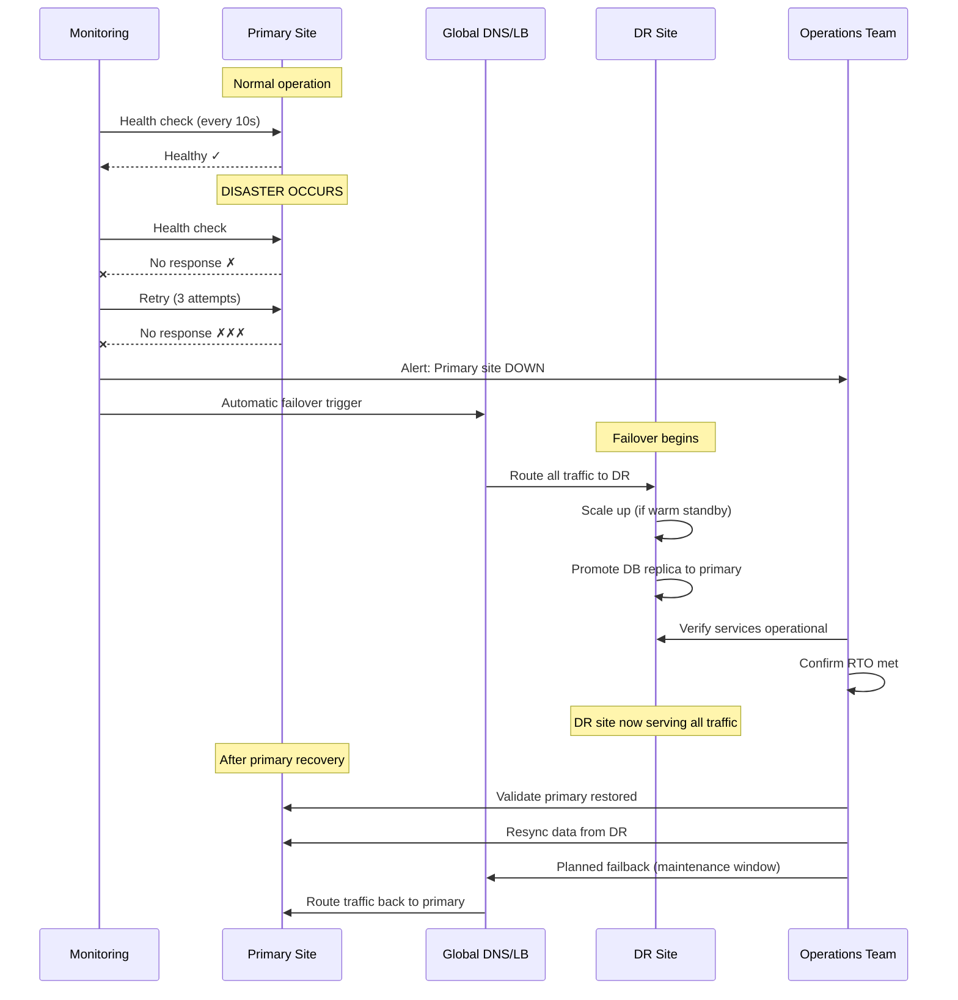

# Disaster Recovery & Business Continuity for Data Centers

**Topic:** Disaster recovery (DR) strategies, RPO/RTO definitions and engineering, active-active vs. active-passive architectures, geo-redundancy patterns, relationship to Uptime Institute Tiers, cloud DR patterns, backup and replication technologies  
**Standard:** ISO 22301 (Business Continuity Management Systems), ISO 27031 (ICT Readiness for Business Continuity), NIST SP 800-34 (Contingency Planning), Uptime Institute Tier Classification, TIA-942 (DC Infrastructure)  
**SDO:** ISO TC 292 (Security and Resilience); NIST (National Institute of Standards and Technology); Uptime Institute; DRI International; BCI (Business Continuity Institute)  
**Audience:** Business continuity managers, data center architects, disaster recovery engineers, site reliability engineers (SRE), CIOs, cloud architects, risk managers  
**Prerequisites:** Data center fundamentals, networking (WAN, replication), storage architectures, virtualization, cloud computing concepts, basic risk management

---

## Chapter 1 — Historical Context & Origin Story

### 1.1 Timeline

| Year | Event | Significance |
|------|-------|-------------|
| 1970s | First disaster recovery services (hot-site providers) | SunGard, IBM; physical alternate sites with spare hardware |
| 1988 | DRI International founded | Professional certification for BC/DR practitioners |
| 2001 | 9/11 attacks; World Trade Center destruction | Massive DR invocations; many organizations lost primary AND DR (both in NYC); drove geographic separation requirements |
| 2005 | Hurricane Katrina | Regional disaster affecting entire metropolitan area; proved need for 200+ mile separation |
| 2006 | BS 25999 (Business Continuity) published | First formal BCM standard (precursor to ISO 22301) |
| 2010 | Cloud computing enables new DR patterns | DRaaS (DR as a Service); pilot light; warm standby concepts |
| 2012 | **ISO 22301** published | International BCM standard; plan-do-check-act; certifiable |
| 2012 | Hurricane Sandy; NYC data center flooding | Highlighted physical site vulnerability; water ingress; generator failure |
| 2017 | AWS S3 outage (us-east-1) | Demonstrated single-region dependency risk; drove multi-region adoption |
| 2019 | ISO 22301:2019 (revision) | Updated; simplified; better integration with other management systems |
| 2021 | OVHcloud Strasbourg fire (SBG2) | Destroyed data center; customers lost data who didn't have off-site backup; highlighted shared responsibility |
| 2022 | ISO 27031:2022 published | ICT readiness for business continuity; technology-specific continuity |
| 2023 | Cloud-native DR patterns mature | Multi-region by default; chaos engineering; automated failover; zero-RPO architectures |

### 1.2 Key Definitions

| Term | Definition | Unit |
|:----:|-----------|:---:|
| **RPO** (Recovery Point Objective) | Maximum acceptable DATA LOSS measured in time; how much data can you afford to lose? | Minutes/hours |
| **RTO** (Recovery Time Objective) | Maximum acceptable DOWNTIME; how quickly must services be restored? | Minutes/hours |
| **MTPD** (Maximum Tolerable Period of Disruption) | Absolute maximum time before organization viability is threatened | Hours/days |
| **MBCO** (Minimum Business Continuity Objective) | Minimum service level acceptable during recovery | % capacity |
| **WRT** (Work Recovery Time) | Time to verify, validate, and resume normal operations after restoration | Hours |
| **MAO** (Maximum Acceptable Outage) | = RTO + WRT (total acceptable unavailability) | Hours |

### 1.3 RPO/RTO Relationships

$$\text{Total acceptable outage} = RTO + WRT = MAO$$

$$\text{Data loss window} = RPO$$

$$RPO \leq \text{backup/replication frequency}$$

$$RTO \leq MTPD - WRT$$

---

## Chapter 2 — DR Architecture Patterns

### 2.1 DR Architecture Comparison

| Pattern | RPO | RTO | Cost | Complexity | Use Case |
|:-------:|:---:|:---:|:----:|:----------:|----------|
| **Backup & Restore** | Hours-days | Hours-days | Lowest ($) | Low | Non-critical; development; archival |
| **Pilot Light** | Minutes-hours | 15-60 min | Low-Medium ($$) | Medium | Moderately critical; can tolerate brief outage |
| **Warm Standby** | Seconds-minutes | 5-15 min | Medium ($$$) | Medium-High | Important business applications |
| **Hot Standby (Active-Passive)** | Seconds | 1-5 min (automatic) | High ($$$$) | High | Critical applications; financial; healthcare |
| **Active-Active (Multi-Site)** | Zero (synchronous) | Zero (instant) | Highest ($$$$$) | Highest | Mission-critical; zero tolerance for downtime |

### 2.2 Pattern Details

| Pattern | Primary Site | DR Site | Data Sync | Failover |
|:-------:|:---:|:---:|:---:|:---:|
| **Backup & Restore** | Fully running | Nothing running; backups stored off-site | Periodic backup (daily/hourly) | Manual: restore backup → provision infra → deploy → test → go live |
| **Pilot Light** | Fully running | Minimal infra (DB replica; core networking; identity) | Continuous DB replication; periodic config sync | Scale up DR site (add compute/app); switch traffic; 15-60 min |
| **Warm Standby** | Fully running | Scaled-down but functional copy (reduced capacity) | Continuous replication (async or sync); near-real-time | Scale to full; switch traffic; 5-15 min; can handle some traffic immediately |
| **Hot Standby** | Fully running | Full-capacity standby; receives replicated data; ready to serve | Synchronous or near-sync replication | Automatic failover; health checks trigger switchover; 1-5 min |
| **Active-Active** | Both sites ACTIVE (serving traffic simultaneously) | Both sites ACTIVE | Synchronous bi-directional replication; conflict resolution | Instant (traffic redistributes); no failover needed; just load shift |

### 2.3 Active-Active Architecture

| Aspect | Detail |
|--------|--------|
| **Definition** | Multiple sites simultaneously serve production traffic; all sites are peers; no "primary" or "secondary" |
| **Data strategy** | Synchronous multi-master replication; conflict resolution (last-writer-wins, CRDT, application-level merge); OR geo-partitioned (each site owns a subset of data) |
| **Traffic routing** | Global load balancer (DNS/anycast); routes users to nearest healthy site; automatic redistribution on failure |
| **Advantages** | Zero RPO/RTO; full resource utilization (no idle standby); better latency (users hit nearest site); true HA |
| **Challenges** | Data consistency (CAP theorem); conflict resolution complexity; cross-site latency affects synchronous replication; 2× infrastructure cost; testing complexity |
| **Best for** | Global services; real-time applications; zero-tolerance systems; CDN-like architectures |

---

## Chapter 3 — Relationship to Uptime Institute Tiers

### 3.1 Tier vs. DR Capability

| Uptime Tier | Site Availability | Single-Site DR Capability | Multi-Site Needed? |
|:-----------:|:---------:|---|:---:|
| **Tier I** (Basic) | 99.671% (28.8h downtime/yr) | No redundancy; single path; any maintenance = downtime | Absolutely YES for any critical workload |
| **Tier II** (Redundant Components) | 99.741% (22.7h/yr) | Component redundancy (N+1); still single path; planned maintenance still needs coordination | YES for critical |
| **Tier III** (Concurrently Maintainable) | 99.982% (1.6h/yr) | Multiple paths; maintain without downtime; but single site still vulnerable to regional disaster | YES for business-critical; recommended for all |
| **Tier IV** (Fault Tolerant) | 99.995% (0.4h/yr) | Fault tolerant within site; any single failure tolerated; but site-level disaster still possible | Recommended for mission-critical (belt and suspenders) |

### 3.2 Site-Level vs. Service-Level Availability

| Layer | Mechanism | Addresses |
|:---:|---|---|
| **Infrastructure (Tier)** | Redundant power, cooling, network within single site | Component failures; maintenance; localized events |
| **Geographic (DR)** | Multiple sites in different locations | Site destruction; regional disasters; utility failures |
| **Application (HA)** | Clustering; replication; load balancing | Application failures; data corruption; software bugs |
| **Combined** | Tier IV site + geo-DR + application HA | Maximum resilience; approaches "five nines" (99.999%) |

$$A_{combined} = 1 - (1 - A_{site1}) \times (1 - A_{site2})$$

Example: Two Tier III sites (99.982% each):
$$A = 1 - (0.00018)^2 = 1 - 0.0000000324 = 99.9999968\%$$

---

## Chapter 4 — Implementation Guide

### 4.1 BC/DR Planning Process (ISO 22301)

| Phase | Activities | Output |
|:-----:|-----------|--------|
| **1. Business Impact Analysis (BIA)** | Identify critical processes; determine MTPD; define RPO/RTO per service; quantify impact of outage (financial, reputational, regulatory) | BIA report; tiered service criticality |
| **2. Risk Assessment** | Identify threats (natural disaster, cyberattack, human error, infrastructure failure); assess likelihood and impact; geographic risk analysis | Risk register; threat scenarios |
| **3. Strategy Selection** | Choose DR pattern per service tier (based on RPO/RTO vs. cost); select DR site location; technology selection | DR strategy document; architecture design |
| **4. Plan Development** | Document procedures: failover steps, communication plan, roles/responsibilities, recovery sequence, validation criteria | DR Plan; runbooks; contact lists |
| **5. Implementation** | Build DR infrastructure; configure replication; deploy monitoring; establish connectivity | DR environment operational; replication active |
| **6. Testing** | Execute DR tests (tabletop, functional, full-scale); validate RPO/RTO achievement; identify gaps | Test reports; gap remediation |
| **7. Maintenance** | Regular reviews (annual minimum); update after changes; lessons learned from incidents and tests | Updated plans; continuous improvement |

### 4.2 DR Site Distance Considerations

| Distance | Pros | Cons | Use Case |
|:--------:|------|------|----------|
| **<50 km (metro)** | Low latency (synchronous replication viable); shared workforce; easy to test | Same regional disaster risk (earthquake, hurricane, flood); same utility grid potentially | Synchronous DR (zero RPO); hot standby |
| **50-200 km** | Different disaster zone (usually); still low-ish latency (2-5 ms) | May share same hurricane/earthquake zone; still some correlation risk | Balanced: near-sync replication; reasonable RTO |
| **200-500 km** | Different weather system; different seismic zone; different utility grid | Higher latency (5-15 ms); asynchronous replication likely; data loss risk (RPO > 0) | Regulatory minimum distance (many require 100+ miles) |
| **>500 km (cross-continent)** | Maximum geographic diversity; completely independent infrastructure | High latency (15-50+ ms); definitely async; data consistency challenges; regulatory (data sovereignty) | Global services; active-active; CDN; highest resilience |

### 4.3 RPO/RTO Engineering

| Target RPO | Technology | Replication Type |
|:---:|---|:---:|
| **0 (zero data loss)** | Synchronous replication; metro distance; storage-level mirroring | Synchronous |
| **< 15 seconds** | Near-synchronous; journal-based; acknowledged before commit | Semi-synchronous |
| **< 5 minutes** | Asynchronous replication with short cycle; CDP (Continuous Data Protection) | Asynchronous + CDP |
| **< 1 hour** | Asynchronous replication (15-60 min cycles); transaction log shipping | Asynchronous |
| **< 24 hours** | Daily backup; periodic snapshot replication | Backup/snapshot |

| Target RTO | Technology | Architecture |
|:---:|---|:---:|
| **0 (zero downtime)** | Active-active; no failover needed; traffic redistribution | Active-active |
| **< 1 minute** | Automatic failover; health-check triggered; pre-provisioned infrastructure | Hot standby |
| **< 15 minutes** | Warm standby; pre-provisioned but scaled down; automated failover + scaling | Warm standby |
| **< 1 hour** | Pilot light; minimal infra; automated provisioning on trigger | Pilot light |
| **< 4 hours** | Backup restore to pre-provisioned or cloud infrastructure | Cold standby + automation |
| **< 24 hours** | Manual recovery from backup; infrastructure provisioning required | Backup & restore |

---

## Chapter 5 — Cloud DR Patterns

### 5.1 AWS DR Architectures

| Pattern | AWS Implementation | RPO | RTO | Monthly Cost (vs. primary) |
|:-------:|---|:---:|:---:|:---:|
| **Backup & Restore** | S3 cross-region replication; EBS snapshots; RDS automated backups; AWS Backup | 1-24h | 1-24h | 5-15% |
| **Pilot Light** | Cross-region RDS replica (read replica); Route 53 health checks; minimal EC2 (stopped); core VPC/networking | 5-30 min | 15-60 min | 10-20% |
| **Warm Standby** | Auto-scaled EC2 (minimal instances running); active RDS Multi-AZ replica; ALB active; scaled down | 1-5 min | 5-15 min | 25-40% |
| **Multi-Site Active-Active** | Full stack in 2+ regions; DynamoDB Global Tables; Aurora Global Database; Route 53 weighted/latency routing; CloudFront | ~0 | ~0 | 100% (2× cost) |

### 5.2 Azure DR Architectures

| Pattern | Azure Implementation | RPO | RTO |
|:-------:|---|:---:|:---:|
| **Backup & Restore** | Azure Backup; geo-redundant storage (GRS); ASR vault | 1-24h | 1-24h |
| **Pilot Light** | Azure Site Recovery (ASR); replicated VMs (not running); SQL geo-replication | 5-30 min | 15-60 min |
| **Warm Standby** | ASR with pre-provisioned VMs; Traffic Manager; SQL failover group | 1-5 min | 5-15 min |
| **Active-Active** | Azure Front Door; Cosmos DB multi-region; multi-region AKS; Traffic Manager priority routing | ~0 | ~0 |

### 5.3 Cloud-Native DR Principles

| Principle | Implementation |
|-----------|---------------|
| **Infrastructure as Code** | All infrastructure defined in Terraform/CloudFormation; DR site deployable from code; no manual configuration drift |
| **Immutable infrastructure** | Don't fix servers; redeploy from image/template; DR recovery = fresh deployment from known-good state |
| **Data replication (managed)** | Use managed services with built-in replication (DynamoDB Global Tables; Aurora Global Database; Cosmos DB) |
| **Stateless compute** | Application tier is stateless; state in database/cache; compute can be replaced instantly from any region |
| **Automated failover** | Health checks + DNS failover (Route 53, Traffic Manager); no human intervention for detection/initial failover |
| **Chaos engineering** | Regular failure injection (AWS FIS; Chaos Monkey; Gremlin); validate DR capability continuously |
| **Regular testing** | Automated DR drills; Game Days; failover and failback; measure actual RPO/RTO |

---

## Chapter 6 — Replication Technologies

### 6.1 Storage Replication

| Technology | Type | RPO | Distance | Use Case |
|:---:|:---:|:---:|:---:|---|
| **Synchronous mirroring** (NetApp MetroCluster, Pure ActiveCluster, Dell VPLEX) | Sync | 0 | <100 km (latency limit: <5 ms RT) | Zero data loss; metro DR |
| **Asynchronous replication** (all vendors) | Async | Seconds-minutes | Unlimited | Long-distance DR; configurable RPO |
| **CDP** (Zerto, Veeam CDP) | Continuous | Seconds | Unlimited | Near-zero RPO without sync latency penalty |
| **Snapshot replication** | Periodic | Minutes-hours (based on schedule) | Unlimited | Cost-effective; lower-priority workloads |

### 6.2 Database Replication

| Database | Sync Mode | RPO | Mechanism |
|:---:|:---:|:---:|---|
| **PostgreSQL** Streaming Replication | Sync or Async | 0 (sync) / seconds (async) | WAL shipping; sync_commit |
| **MySQL** Group Replication | Sync (within group) | 0 | Paxos-based consensus |
| **Oracle** Data Guard | Sync / Async / Far Sync | 0 / seconds | Redo log shipping; standby apply |
| **SQL Server** Always On AG | Sync / Async | 0 / seconds | Log-based; automatic failover (sync) |
| **AWS Aurora** Global Database | Async (cross-region) | <1 second | Storage-level replication; dedicated replication infrastructure |
| **Azure Cosmos DB** | Multi-master | ~0 | Configurable consistency; 5 levels; global distribution |
| **DynamoDB** Global Tables | Multi-master | Seconds | Last-writer-wins; conflict resolution; eventual consistency |

### 6.3 Application-Level Replication

| Pattern | Implementation | Trade-off |
|:-------:|---|---|
| **Event sourcing** | All changes as events; replay events at DR site; event store replicated | Complex; but perfect audit trail; rebuild state from events |
| **CQRS + event streaming** | Kafka/EventBridge cross-region; read models rebuilt from events | Decoupled; eventual consistency; good for microservices |
| **Queue-based** | Messages replicated cross-region (SQS, Service Bus); at-least-once delivery | Handles async workloads; natural DR for message-driven architectures |
| **API-level (dual-write)** | Application writes to both regions | Complexity; failure modes; NOT recommended (split-brain risk) |

---

## Chapter 7 — Testing & Validation

### 7.1 DR Test Types

| Test Type | Scope | Impact | Frequency | Purpose |
|:---------:|:-----:|:------:|:---------:|---------|
| **Tabletop exercise** | People + process | Zero (discussion only) | Quarterly | Validate plan; identify gaps; train staff; walk through scenarios |
| **Component test** | Individual systems | Minimal | Monthly | Test replication; failover of single component; backup restore |
| **Functional test** | Application-level | Low-Medium | Quarterly | Full application failover; validate end-to-end; measure RTO |
| **Full-scale test** | Entire DR plan | Medium-High (production risk) | Annually | Simulate actual disaster; switch all traffic to DR; validate everything |
| **Chaos engineering** | Ongoing; random | Varies | Continuous | Inject failures in production; validate resilience real-time |
| **Failback test** | Return to primary | Medium | After every failover test | Validate return to normal; often overlooked; critical |

### 7.2 DR Metrics & KPIs

| Metric | Target | Measurement Method |
|:---:|:---:|---|
| **Actual RPO** (measured) | ≤ Target RPO | During DR test: measure data loss between primary failure and DR state |
| **Actual RTO** (measured) | ≤ Target RTO | Stopwatch: from declared disaster to service available at DR site |
| **DR test success rate** | 100% | Pass/fail per DR test execution (met RPO + RTO + MBCO) |
| **Replication lag** | Per SLA | Monitor continuously; alert if exceeds threshold |
| **DR plan currency** | Updated within 90 days of change | Track last update date; trigger on infrastructure changes |
| **Staff readiness** | All DR staff trained within 12 months | Training records; exercise participation |
| **Coverage** | 100% of Tier 1 services have tested DR | Inventory coverage audit |

---

## Chapter 8 — Mermaid Architecture Diagrams

### 8.1 DR Architecture Patterns Comparison

```mermaid
graph TB
    subgraph "Backup & Restore"
        BR_P[Primary Site<br/>━━━━━━━━━━━<br/>Full production<br/>Regular backups]
        BR_S[DR Site<br/>━━━━━━━━━━━<br/>Nothing running<br/>Backups stored<br/>Provision on demand]
        BR_P -->|"Periodic backup<br/>(hours)"| BR_S
    end
    
    subgraph "Pilot Light"
        PL_P[Primary Site<br/>━━━━━━━━━━━<br/>Full production]
        PL_S[DR Site<br/>━━━━━━━━━━━<br/>DB replica running<br/>Core network ready<br/>Compute: OFF]
        PL_P -->|"Continuous DB replication"| PL_S
    end
    
    subgraph "Warm Standby"
        WS_P[Primary Site<br/>━━━━━━━━━━━<br/>Full production]
        WS_S[DR Site<br/>━━━━━━━━━━━<br/>Scaled-down copy<br/>Everything running<br/>Ready to scale up]
        WS_P -->|"Near-sync replication"| WS_S
    end
    
    subgraph "Active-Active"
        AA_1[Site A<br/>━━━━━━━━━━━<br/>Full production<br/>Serving traffic]
        AA_2[Site B<br/>━━━━━━━━━━━<br/>Full production<br/>Serving traffic]
        AA_1 <-->|"Synchronous bi-directional<br/>replication"| AA_2
    end
```



### 8.2 DR Failover Sequence



---

## Chapter 9 — Case Studies

### 9.1 Case Study: Financial Services — Active-Active Across Two Data Centers

| Aspect | Detail |
|--------|--------|
| Organization | Global investment bank; trading platform; regulatory requirement: zero data loss; 4-hour maximum recovery time (regulatory); internal target: <5 minute RTO |
| Architecture | Active-active across two data centers (50 km apart; metro fiber): (1) **Application tier**: stateless application servers in both DCs; global load balancer (F5 GSLB) distributes traffic; each DC can handle 100% load. (2) **Database tier**: Oracle RAC Extended Cluster (stretched across both DCs); synchronous redo log mirroring; zero data loss guaranteed. (3) **Storage tier**: NetApp MetroCluster; synchronous mirroring; automatic failover. (4) **Network**: diverse fiber paths (2 independent routes); DWDM for bandwidth; sub-1ms latency between sites. |
| RPO achieved | **0** (zero data loss; synchronous replication) |
| RTO achieved | **<60 seconds** (automatic; application health checks detect failure → GSLB redirects within 30s → DB failover automatic within 30s) |
| Cost | 2× infrastructure cost (both DCs fully provisioned); justified by regulatory requirement + business value ($100M+ daily transaction volume) |
| Testing | Quarterly full failover test (announced); annual surprise test (unannounced; simulates real disaster); monthly component failover tests; chaos engineering (random instance kills weekly) |
| Incident (real)** | 2022: Primary DC lost utility power AND generator start failure (single generator had stuck valve). UPS provided 12 minutes; trading shifted to DR within 45 seconds (automated); zero trades lost; zero customer impact; primary restored in 6 hours; failback during weekend maintenance window |

### 9.2 Case Study: SaaS Provider — Cloud-Native Multi-Region DR

| Aspect | Detail |
|--------|--------|
| Organization | B2B SaaS (HR platform); 10,000+ enterprise customers; multi-tenant; AWS; RPO requirement: <5 minutes; RTO requirement: <15 minutes |
| Architecture | Warm standby (AWS multi-region): **Primary**: us-east-1; **DR**: us-west-2. (1) **Database**: Aurora PostgreSQL Global Database (async replication; RPO <1 second typical; <5 second maximum). (2) **Application**: EKS cluster in DR region; minimum nodes running (1/4 scale); auto-scaling policies pre-configured to scale on failover. (3) **Static assets**: S3 cross-region replication (CRR); CloudFront multi-origin. (4) **DNS**: Route 53 health checks on primary; failover routing policy to DR. (5) **Infrastructure**: All defined in Terraform; DR region deployable from same code; configuration drift detected by weekly automated comparison. |
| Failover process (automated) | Route 53 detects primary unhealthy (3 consecutive checks; 30s apart) → DNS failover activates (TTL: 60s) → DR EKS auto-scales to full capacity (3-5 minutes) → Aurora Global DB promoted to primary in DR region (<1 minute; automatic). Total: <5 minutes to full service in DR. |
| Testing | Monthly: automated DR test in non-production (full failover + functional validation); quarterly: production DR test (scheduled maintenance window; actual traffic to DR for 2 hours; validate at scale); annually: unannounced DR drill (only CTO and SRE lead know; measure actual team response time) |
| Actual RPO measured | Typical: <1 second (Aurora replication lag); worst case (during burst): 3.2 seconds |
| Actual RTO measured | Average across quarterly tests: 4 minutes 20 seconds (start of failover to service available); 6 minutes to full scale |
| Cost | DR infrastructure: ~25% of primary cost (warm standby; reduced capacity); during failover: 100% (scaled up); annual DR spend: $180K/year (~20% of total infrastructure) |
| Lesson learned | First DR test revealed: (1) Secrets Manager secrets not replicated cross-region → added replication; (2) Third-party webhook URLs hardcoded to primary region → parameterized; (3) Background job processors started duplicate processing during failover → added leader election |

---

## Chapter 10 — Future Evolution

| Trend | Timeline | Impact |
|-------|----------|--------|
| **Continuous DR validation** | 2024-2026 | Automated continuous testing replacing periodic tests; chaos engineering as standard practice; always-verified DR readiness |
| **AI-driven failover** | 2024-2026 | ML models predicting failures before they occur; proactive failover; intelligent traffic shifting |
| **Multi-cloud DR** | 2024-2027 | DR across cloud providers (AWS primary → Azure DR); avoiding single-cloud dependency; complexity + cost |
| **Zero-RPO at global scale** | 2024-2027 | Distributed consensus (Spanner-like); globally consistent databases; eliminating RPO trade-off for distance |
| **Edge DR** | 2024-2026 | DR for edge computing; local failover at edge; autonomous operation during disconnection |
| **Ransomware-resistant DR** | 2024-2026 | Immutable backups; air-gapped copies; recovery from encryption attacks; "clean room" recovery |
| **DR-as-Code** | 2024-2025 | DR plans as version-controlled code; automated validation; GitOps for DR; policy-driven recovery |
| **Regulatory expansion** | 2024-2027 | DORA (EU financial); NIS2; increasing regulatory DR requirements; mandatory testing; reporting |

---

## Chapter 11 — Interview Questions & Career Guide

### Tier 1: Entry-Level

**Q1:** Explain RPO and RTO with examples. How do they relate to cost?  
**A:** **RPO (Recovery Point Objective)** is the maximum acceptable DATA LOSS measured in time. If RPO = 1 hour, you can afford to lose up to 1 hour of data (meaning you need backup/replication at least every hour). Example: a blog might have RPO of 24 hours (daily backup acceptable); a banking system might have RPO of 0 (zero data loss — every transaction must be preserved). **RTO (Recovery Time Objective)** is the maximum acceptable DOWNTIME. If RTO = 4 hours, the service must be restored and operational within 4 hours of a disaster. Example: an internal wiki might have RTO of 24 hours; a payment processing system might have RTO of 5 minutes. **Cost relationship**: Lower RPO and RTO = exponentially higher cost. This is because: RPO near zero requires synchronous replication (expensive, distance-limited) vs. daily backup (cheap). RTO near zero requires fully-provisioned standby infrastructure running continuously (2× cost) vs. restore from backup (minimal standby cost). The relationship is roughly exponential: moving from 24-hour RPO to 1-hour RPO might cost 5× more; moving from 1-hour to near-zero might cost 50× more. This is why BIA (Business Impact Analysis) is critical — it determines what RPO/RTO each service actually NEEDS, so you don't over-spend or under-protect.

### Tier 2: Mid-Level

**Q2:** Design a DR strategy for a microservices-based e-commerce platform on AWS with the following requirements: payment service (RPO=0, RTO=1min), product catalog (RPO=5min, RTO=15min), and recommendation engine (RPO=24h, RTO=4h). How would you architect each tier differently?  
**A:** [Detailed answer covering: **Payment service (RPO=0, RTO=1min)**: Active-active multi-region; DynamoDB Global Tables (multi-master; zero RPO across regions); application deployed identically in 2 regions; Route 53 latency-based routing (both regions active); both regions can process payments independently; Global Accelerator for consistent low-latency; total cost: 2× single region. **Product catalog (RPO=5min, RTO=15min)**: Warm standby; Aurora Global Database (async; <5s replication lag); DR region has read-only copy; EKS in DR with minimum pods running; automated failover via Route 53 health checks + Aurora failover; on failover: promote Aurora replica (<1 min) + scale EKS (5 min); total cost: ~30% of primary. **Recommendation engine (RPO=24h, RTO=4h)**: Pilot light; ML model artifacts stored in S3 cross-region replication; training data in S3; inference service code in ECR (replicated); DR region: nothing running; on disaster: deploy from Terraform (infra in 15 min) + pull model from S3 + start inference service; RPO: last model snapshot (uploaded daily); total cost: ~5% (just S3 storage). **Cross-cutting**: all infrastructure as Terraform; CI/CD deploys to both regions; monitoring/alerting per tier; DR testing: quarterly (payment; must verify zero-loss); semi-annually (catalog); annually (recommendations).]

### Tier 3: Senior

**Q3:** Your organization experienced a ransomware attack that encrypted all production databases AND the synchronous DR replicas (because they replicated the encrypted data). Design a DR architecture that is resilient to ransomware and advanced persistent threats.  
**A:** [Comprehensive answer covering: the problem (synchronous/async replication replicates corruption and encryption — it's designed for hardware/site failure NOT logical corruption); solution layers: **1) Immutable backup** (point-in-time; cannot be modified/deleted even with admin access; AWS S3 Object Lock; Azure immutable blob; Veeam hardened repository; retention: keep 30 days minimum of daily + 12 months of monthly); **2) Air-gapped copy** (backup copy physically or logically disconnected from production network; offline tape; isolated cloud account with no network connectivity to production; break-glass-only access); **3) Delayed replication** (in addition to sync/async DR: maintain 24-72 hour delayed replica — this replica has NOT yet received the ransomware encryption; gives detection window); **4) Detection** (monitor for mass encryption patterns: sudden high write I/O on database; file extension changes; entropy analysis; alert before DR is corrupted; time window to stop replication); **5) Clean room recovery** (pre-defined isolated environment for recovery; no connectivity to compromised infra; validated clean images; recovery from immutable backup into clean room; verify data integrity before reconnecting); **6) Recovery testing** (quarterly: simulate ransomware scenario — lock a backup copy, attempt recovery from immutable/air-gapped; measure detection-to-recovery time); **Architecture**: Production → Sync DR (handles hardware failure; same-day); Production → Async DR (handles site failure; minutes RPO); Production → Delayed replica (24-72h lag; handles logical corruption; manual failover); Production → Daily immutable backup (S3 Object Lock; 90-day retention; handles ransomware); Weekly → Air-gapped copy (isolated account; 12-month retention; handles nation-state APT). **Key principle**: defense in depth — multiple independent copies with different access controls, different timing, different isolation levels.]

---

## Chapter 12 — Cheat Sheet & Quick Reference

### DR Quick Reference

```
KEY DEFINITIONS:
  RPO: Maximum acceptable DATA LOSS (time)
  RTO: Maximum acceptable DOWNTIME (time)
  MTPD: Maximum time before business viability threatened
  MAO: RTO + WRT (total acceptable outage)

DR PATTERNS (by RPO/RTO):
  ┌─────────────────┬──────────┬──────────┬──────────┐
  │ Pattern         │ RPO      │ RTO      │ Cost     │
  ├─────────────────┼──────────┼──────────┼──────────┤
  │ Backup/Restore  │ Hours    │ Hours    │ $        │
  │ Pilot Light     │ Minutes  │ 15-60min │ $$       │
  │ Warm Standby    │ Seconds  │ 5-15min  │ $$$      │
  │ Hot Standby     │ Seconds  │ 1-5min   │ $$$$     │
  │ Active-Active   │ Zero     │ Zero     │ $$$$$    │
  └─────────────────┴──────────┴──────────┴──────────┘

SITE DISTANCE:
  < 50 km:    Sync replication possible; same disaster zone risk
  50-200 km:  Near-sync; different disaster zone (usually)
  200-500 km: Async; regulatory minimum; different grid/weather
  > 500 km:   Maximum diversity; cross-continent; highest latency

REPLICATION TYPES:
  Synchronous:   RPO=0; latency-limited (<100 km); cost HIGH
  Asynchronous:  RPO=seconds-minutes; any distance; cost MEDIUM
  CDP:           RPO=seconds; any distance; journal-based; MEDIUM
  Snapshot:      RPO=schedule-based; any distance; cost LOW
  Backup:        RPO=hours-days; any distance; cost LOWEST

CLOUD DR (AWS):
  Backup/Restore: S3 CRR + RDS snapshots (5-15% cost)
  Pilot Light:    Cross-region DB replica + minimal infra (10-20%)
  Warm Standby:   Scaled-down full stack in DR region (25-40%)
  Active-Active:  Full stack both regions + global DB (100%)

DR TESTING FREQUENCY:
  Tabletop:      Quarterly
  Component:     Monthly
  Functional:    Quarterly
  Full-scale:    Annually
  Chaos:         Continuous

RANSOMWARE-RESILIENT DR:
  1. Sync/Async DR (hardware/site failure)
  2. Delayed replica (24-72h lag; logical corruption)
  3. Immutable backup (S3 Object Lock; cannot be encrypted)
  4. Air-gapped copy (physically isolated; break-glass)
  5. Clean room recovery (isolated environment)

ISO 22301 PROCESS:
  BIA → Risk Assessment → Strategy → Plan → Implement → Test → Maintain

AVAILABILITY MATH:
  Two independent sites:
  A_combined = 1 - (1-A1)(1-A2)
  Two 99.9% sites = 99.9999% combined
```

---

*End of Document — 10_Disaster_Recovery_Tier.md*
